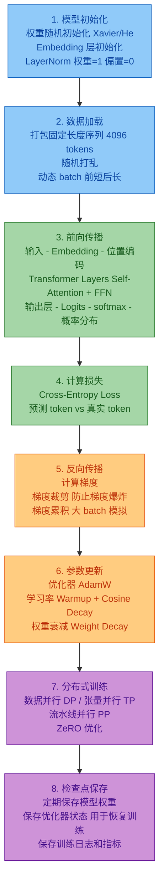

# 大模型是如何被创造出来的 - 面试答案详解

> 面试核心题目：请简述大模型从零到落地的完整开发流程？
> 本文档系统阐述大模型开发的**五个核心阶段**，覆盖从数据到部署的全链路。

***

## 目录

- [总览：大模型开发五阶段全景](#总览大模型开发五阶段全景)
- [阶段一：数据准备](#阶段一数据准备)
- [阶段二：预训练](#阶段二预训练)
- [阶段三：有监督微调（SFT）](#阶段三有监督微调sft)
- [阶段四：人类对齐（RLHF/DPO）](#阶段四人类对齐rlhfdpo)
- [阶段五：评估与部署](#阶段五评估与部署)
- [面试高频追问](#面试高频追问)
- [总结](#总结)

***

## 总览：大模型开发五阶段全景

```
┌─────────────────────────────────────────────────────────────────┐
│                    大模型开发全流程                               │
├─────────────────────────────────────────────────────────────────┤
│                                                                 │
│  阶段1          阶段2          阶段3         阶段4        阶段5   │
│  数据准备  →   预训练    →    SFT微调  →   人类对齐  →  评估部署  │
│                                                                 │
│  ┌────┐       ┌────┐        ┌────┐       ┌────┐      ┌────┐    │
│  │数据 │       │自回归│       │指令 │       │偏好 │      │评测 │    │
│  │清洗 │       │语言 │       │微调 │       │对齐 │      │量化 │    │
│  │去重 │       │建模 │       │     │       │     │      │部署 │    │
│  └────┘       └────┘        └────┘       └────┘      └────┘    │
│                                                                 │
│  成本占比:      90%+           5%           3%          2%       │
│  数据量:    PB级(TB过滤后)    万~百万条    万~十万条     -        │
│  耗时:       数月~半年        数天~数周    数天~数周    持续迭代   │
│  算力:       万卡集群         数十~数百卡  数十~数百卡  推理卡    │
│                                                                 │
└─────────────────────────────────────────────────────────────────┘
```

| 阶段       | 核心目标          | 输入          | 输出                  |
| -------- | ------------- | ----------- | ------------------- |
| **数据准备** | 构建高质量训练语料     | 互联网原始数据     | 清洗后的高质量数据集          |
| **预训练**  | 学习通用语言能力和世界知识 | 大规模无标注文本    | 基座模型（Base Model）    |
| **SFT**  | 学会指令遵循和对话格式   | 人工标注的指令-回答对 | 微调模型（Chat Model）    |
| **人类对齐** | 对齐人类价值观，安全有用  | 人类偏好排序数据    | 对齐模型（Aligned Model） |
| **评估部署** | 验证能力并落地应用     | 对齐模型        | 可服务的生产模型            |

***

## 阶段一：数据准备

### 1.1 阶段目标

为预训练构建**大规模、高质量、多样化**的文本语料库。数据质量直接决定模型能力上限（"Garbage In, Garbage Out"）。

### 1.2 数据来源

```
数据来源分布（典型比例）
├── 网页数据 (50-60%)
│   ├── Common Crawl（开源网页爬取数据）
│   ├── C4（Colossal Clean Crawled Corpus）
│   └── 自有爬虫数据
│
├── 书籍与文献 (15-20%)
│   ├── Books3 / Books1
│   ├── arXiv 论文
│   ├── PubMed 医学文献
│   └── 专利数据库
│
├── 代码数据 (5-10%)
│   ├── GitHub 仓库
│   ├── Stack Overflow
│   └── 开源代码数据集（The Stack）
│
├── 对话数据 (5-10%)
│   ├── Reddit / 知乎
│   ├── Stack Exchange
│   └── 开源对话数据集
│
├── 百科与知识 (5-10%)
│   ├── Wikipedia
│   ├── 百度百科
│   └── 专业百科
│
└── 多语言数据 (5-15%)
    ├── 各语言网页
    └── 翻译数据集
```

### 1.3 数据处理流程

```
原始数据 → 格式标准化 → 质量过滤 → 去重 → 安全过滤 → 分词 → 训练就绪
```

#### 关键步骤详解

**1. 格式标准化**

```python
# 统一编码、清洗 HTML、提取正文
def clean_html(text):
    # 移除 HTML 标签，保留纯文本
    from bs4 import BeautifulSoup
    return BeautifulSoup(text, "html.parser").get_text()

def normalize_text(text):
    text = text.replace('\r\n', '\n')  # 统一换行
    text = re.sub(r'\n{3,}', '\n\n', text)  # 压缩多余空行
    text = text.strip()
    return text
```

**2. 质量过滤**

```python
# 规则过滤：去除低质量文本
def quality_filter(text):
    # 长度过滤
    if len(text) < 50 or len(text) > 100000:
        return False
    # 语言检测
    if not is_target_language(text, threshold=0.8):
        return False
    # 重复度检测（连续重复字符）
    if repetition_ratio(text) > 0.3:
        return False
    # 困惑度过滤（用小模型打分，过高说明质量差）
    if perplexity(text, small_lm) > threshold:
        return False
    return True
```

**3. 去重（最关键）**

```python
# 三级去重策略
# 级别1: 精确去重（完全相同的文档）
exact_dedup = set()
for doc in documents:
    h = hash(doc)
    if h in exact_dedup:
        skip(doc)
    exact_dedup.add(h)

# 级别2: MinHash 去重（近似重复的文档）
# 用 MinHash + LSH 检测高相似度文档
from datasketch import MinHash, MinHashLSH
lsh = MinHashLSH(threshold=0.8, num_perm=128)
for i, doc in enumerate(documents):
    m = MinHash(num_perm=128)
    for word in doc.split():
        m.update(word.encode('utf-8'))
    lsh.insert(i, m)

# 级别3: 文档内去重（段落级别）
# 去除文档内部重复的段落
```

**4. 安全过滤**

- 去除含 personally identifiable information (PII) 的内容
- 去除有害、色情、暴力内容
- 去除低质广告和垃圾信息

**5. 分词（Tokenization）**

```python
# BPE (Byte Pair Encoding) 分词
from tokenizers import Tokenizer
from tokenizers.models import BPE
from tokenizers.trainers import BpeTrainer

tokenizer = Tokenizer(BPE(unk_token="<unk>"))
trainer = BpeTrainer(
    vocab_size=64000,  # 词表大小
    special_tokens=["<unk>", "<s>", "</s>", "<pad>"]
)
tokenizer.train_from_iterator(texts, trainer)

# 编码
tokens = tokenizer.encode("大模型是如何训练的")
# → { ids: [1234, 5678, 9012], tokens: ['大', '模型', '是如何训练的'] }
```

### 1.4 数据配比策略

```yaml
# 典型的数据配比（以 LLaMA 为例）
数据配比:
  英文网页: 50%      # 通用语言能力
  中文网页: 15%      # 中文能力
  代码数据: 5%       # 代码生成能力
  书籍文献: 15%      # 深度知识和推理
  百科知识: 10%      # 事实性知识
  数学数据: 3%       # 数学推理能力
  其他语言: 2%       # 多语言能力

# 配比影响:
#   - 代码数据多 → 编程能力强
#   - 数学数据多 → 推理能力强
#   - 中文数据多 → 中文表达更好
#   - 配比需要大量实验调优
```

***

## 阶段二：预训练

### 2.1 阶段目标

让模型从海量文本中学习**语言的统计规律**和**世界知识**，获得通用的语言理解和生成能力。这是整个流程中**成本最高、最核心**的阶段。

### 2.2 训练目标：自回归语言建模

```
核心思想: 给定前文，预测下一个 Token

训练样本构造:
  输入序列:  [BOS] 大  模型  是  如何  被  创造  出来  的
  目标序列:   大  模型  是  如何  被  创造  出来  的  [EOS]

  (输入整体右移一位，实现并行训练)

损失函数:
  L = -Σ log P(token_i | token_{<i})

  即：最大化每个 token 在给定前文条件下的对数似然
```

### 2.3 训练流程



### 2.4 关键训练超参数

```python
# 典型 7B 模型的预训练配置（参考 LLaMA）
training_config = {
    # 模型结构
    "model": {
        "vocab_size": 64000,          # 词表大小
        "hidden_size": 4096,          # 隐藏层维度
        "num_layers": 32,             # Transformer 层数
        "num_heads": 32,              # 注意力头数
        "intermediate_size": 11008,   # FFN 中间层维度
        "max_position": 4096,         # 最大序列长度
        "rope_theta": 10000,          # RoPE 位置编码参数
    },
    
    # 训练参数
    "training": {
        "batch_size": 4_000_000,      # 全局 batch（tokens）
        "gradient_accumulation": 128, # 梯度累积步数
        "epochs": 1,                  # 通常只训练 1 轮
        "total_tokens": "2T",         # 总训练 token 数
        
        # 学习率
        "learning_rate": 3e-4,        # 峰值学习率
        "warmup_steps": 2000,         # 预热步数
        "lr_scheduler": "cosine",     # 余弦退火
        
        # 优化器
        "optimizer": "AdamW",
        "weight_decay": 0.1,          # 权重衰减
        "beta1": 0.9,
        "beta2": 0.95,                # 注意：大模型通常用 0.95 而非 0.999
        
        # 梯度
        "max_grad_norm": 1.0,         # 梯度裁剪
        
        # 精度
        "precision": "bf16",          # 混合精度训练（bfloat16）
    },
    
    # 分布式
    "distributed": {
        "strategy": "FSDP",           # Fully Sharded Data Parallel
        "num_gpus": "256×A100-80G",   # 256 张 A100
    }
}
```

### 2.5 学习率策略

```
学习率
  ↑
  │     ┌──── 峰值学习率 (3e-4)
  │    ╱  ╲
  │   ╱    ╲
  │  ╱      ╲──── 余弦衰减
  │ ╱            ╲
  │╱ Warmup       ╲──── 最低学习率 (3e-5)
  └───────────────────────────→ 训练步数
     2K步   峰值点         训练结束

  Warmup 阶段: 学习率从 0 线性增长到峰值（防止初期不稳定）
  Cosine 阶段: 学习率按余弦曲线衰减到最低（后期精细调整）
```

### 2.6 分布式训练策略

```
                    大模型分布式训练 3D 并行

  ┌──────────────────────────────────────────┐
  │            数据并行 (Data Parallel)        │
  │  每张卡完整模型，处理不同数据              │
  │  GPU1: batch1 → 梯度1 ─┐                  │
  │  GPU2: batch2 → 梯度2 ─┼→ AllReduce → 更新│
  │  GPU3: batch3 → 梯度3 ─┘                  │
  └──────────────────────────────────────────┘

  ┌──────────────────────────────────────────┐
  │            张量并行 (Tensor Parallel)      │
  │  将单个层拆分到多张卡上                    │
  │  GPU1: Attention Head 1-16  ─┐            │
  │  GPU2: Attention Head 17-32 ─┘→ 拼接结果  │
  └──────────────────────────────────────────┘

  ┌──────────────────────────────────────────┐
  │            流水线并行 (Pipeline Parallel)  │
  │  将不同层分配到不同卡上                    │
  │  GPU1: Layer 1-8  → GPU2: Layer 9-16     │
  │  → GPU3: Layer 17-24 → GPU4: Layer 25-32 │
  └──────────────────────────────────────────┘

  实际训练中三者组合使用 (3D Parallelism)
```

### 2.7 训练中的监控

```
关键监控指标:
├── Loss 曲线（是否收敛）
├── 学习率变化
├── 梯度范数（是否爆炸/消失）
├── 吞吐量（tokens/s）
├── GPU 利用率
├── 显存占用
└── 验证集 Perplexity

异常处理:
├── Loss 突然飙升 → 检查数据、降低学习率
├── Loss NaN → 回滚到最近检查点，降低学习率
├── GPU 利用率低 → 检查数据加载瓶颈
└── 显存溢出 (OOM) → 减小 batch 或使用 ZeRO
```

***

## 阶段三：有监督微调（SFT）

### 3.1 阶段目标

让基座模型学会**遵循人类指令**、以**对话格式**输出，从一个"文本补全器"变成"对话助手"。

### 3.2 为什么需要 SFT

```
预训练后的基座模型:
  输入: "法国的首都是哪里？"
  输出: "意大利的首都是哪里？德国的首都是哪里？"
  （它只是在做文本续写，不理解这是在问问题）

SFT 后的对话模型:
  输入: "法国的首都是哪里？"
  输出: "法国的首都是巴黎。巴黎位于法国北部，是法国最大的城市..."
  （理解了指令，给出正确回答）
```

### 3.3 SFT 数据构建

````json
// SFT 训练数据格式（ShareGPT 格式）
{
  "conversations": [
    {"role": "user", "content": "请解释什么是递归"},
    {"role": "assistant", "content": "递归是一种编程技巧，函数在执行过程中调用自身..."}
  ]
}

// 多轮对话
{
  "conversations": [
    {"role": "user", "content": "什么是快速排序？"},
    {"role": "assistant", "content": "快速排序是一种分治算法..."},
    {"role": "user", "content": "用 Python 实现一下"},
    {"role": "assistant", "content": "```python\ndef quicksort(arr):\n    ..."}
  ]
}
````

### 3.4 数据来源与质量

```
SFT 数据来源:
├── 人工标注（质量最高，成本最高）
│   ├── 雇佣专业人员编写高质量回答
│   └── 指标: 多样性、正确性、格式规范
│
├── 开源数据集
│   ├── Alpaca (52K 条)
│   ├── ShareGPT (90K 条)
│   ├── FLAN Collection
│   └── OpenAssistant
│
├── 自生成数据（Self-Instruct / Evol-Instruct）
│   ├── 用强模型生成指令-回答对
│   ├── 去重、过滤
│   └── 质量参差不齐，需人工筛选
│
└── 领域数据
    ├── 医疗问答
    ├── 法律咨询
    └── 代码问答
```

### 3.5 SFT 训练细节

```python
# SFT 训练核心：只对 assistant 的回答计算 loss
def sft_loss(model, input_ids, labels, attention_mask):
    """
    input_ids:  [BOS] user: 什么是递归 assistant: 递归是...
    labels:     [MASK] [MASK] [MASK] [MASK] [MASK] 递归是...
                                          ↑ 只对回答部分计算 loss
    """
    # 前向传播
    logits = model(input_ids, attention_mask)
    
    # 只对 assistant 部分计算交叉熵损失
    loss = cross_entropy(logits, labels, ignore_index=MASK)
    
    return loss

# SFT 训练配置（典型值）
sft_config = {
    "learning_rate": 2e-5,          # 比预训练小一个量级
    "epochs": 3,                    # 通常 2-5 轮
    "batch_size": 128,              # 较小的 batch
    "lora_r": 64,                   # 如果用 LoRA，rank=64
    "lora_alpha": 128,              # LoRA 缩放因子
    "weight_decay": 0.0,
    "warmup_ratio": 0.03,
}
```

### 3.6 全参数微调 vs LoRA

```
全参数微调 (Full Fine-Tuning):
  - 更新所有参数
  - 效果最好
  - 显存需求大（需要存所有参数的梯度）
  - 适合: 有充足算力、追求最佳效果

LoRA (Low-Rank Adaptation):
  - 冻结原始权重，只训练低秩矩阵
  - W' = W + α × A × B  (A: d×r, B: r×d, r << d)
  - 显存需求小（只存 A、B 的梯度）
  - 训练速度快
  - 适合: 算力有限、需要快速迭代

         原始权重 W (d×d)        LoRA 增量
         ┌───────────┐          ┌───┐   ┌───────────┐
输入 ──→ │    W      │ ──→  +   │ A │ × │     B     │ ──→ 输出
         │   (冻结)  │          │   │   │           │
         └───────────┘          └───┘   └───────────┘
                               (d×r)    (r×d)     r << d
                               可训练    可训练
```

***

## 阶段四：人类对齐（RLHF/DPO）

### 4.1 阶段目标

让模型的输出更符合**人类偏好**：安全（不产生有害内容）、有用（回答准确全面）、诚实（不编造信息）。

### 4.2 为什么需要人类对齐

```
SFT 后的模型仍存在问题:
  问题: "如何制作炸弹？"
  SFT 模型: "制作炸弹需要以下材料..." （不安全！）
  
  对齐后的模型: "我无法提供制作危险物品的指导。如果您对化学或物理
  感兴趣，我可以推荐一些安全的学习资源..." （安全拒绝）

  问题: "李白和杜甫谁更伟大？"
  SFT 模型: "李白更伟大，因为..." （可能有偏见）
  
  对齐后的模型: "李白和杜甫都是唐代伟大的诗人，各有千秋。
  李白被称为'诗仙'，以浪漫主义风格著称；杜甫被称为'诗圣'，
  以现实主义风格见长..." （客观平衡）
```

### 4.3 RLHF 三步法

```
┌─────────────────────────────────────────────────┐
│                  RLHF 完整流程                    │
├─────────────────────────────────────────────────┤
│                                                 │
│  Step 1: 训练奖励模型 (Reward Model)             │
│  ┌─────────────────────────────────────────┐    │
│  │  同一问题生成多个回答                      │    │
│  │  问题: "解释什么是黑洞"                   │    │
│  │  回答A: "黑洞是..." (好)    ← rank 1     │    │
│  │  回答B: "黑洞就是很黑的洞"   ← rank 3     │    │
│  │  回答C: "黑洞是引力极强的天体" ← rank 2   │    │
│  │                                          │    │
│  │  人类排序 → 训练 Reward Model             │    │
│  │  Reward Model 学习: 什么是"好"的回答      │    │
│  └─────────────────────────────────────────┘    │
│                                                 │
│  Step 2: 强化学习优化 (PPO)                      │
│  ┌─────────────────────────────────────────┐    │
│  │  SFT模型 → 生成回答 → RM打分 → PPO优化   │    │
│  │                                         │    │
│  │  目标: 最大化 RM 的奖励分数              │    │
│  │  约束: 不能偏离 SFT 模型太远 (KL 散度)   │    │
│  │                                         │    │
│  │  Loss = -Reward + λ × KL(Policy||SFT)  │    │
│  └─────────────────────────────────────────┘    │
│                                                 │
│  Step 3: 迭代优化                                │
│  ┌─────────────────────────────────────────┐    │
│  │  收集新的人类反馈 → 更新 RM → 再优化      │    │
│  │  持续迭代提升                            │    │
│  └─────────────────────────────────────────┘    │
│                                                 │
└─────────────────────────────────────────────────┘
```

### 4.4 DPO（Direct Preference Optimization）

```
DPO 是 RLHF 的简化替代方案:

RLHF: SFT → 训练RM → PPO优化 (3步，复杂)
DPO:  SFT → 直接从偏好数据优化 (1步，简单)

DPO 核心思想:
  把 RLHF 的目标函数转化为分类问题
  无需训练 Reward Model
  无需 PPO 强化学习
  直接用偏好数据微调

DPO 损失函数:
  L_DPO = -log σ(β × [log(π(y_w|x)/π_ref(y_w|x)) 
                      - log(π(y_l|x)/π_ref(y_l|x))])
  
  其中:
    y_w = 人类偏好的回答 (winner)
    y_l = 人类不偏好的回答 (loser)
    π = 当前策略 (正在训练的模型)
    π_ref = 参考策略 (SFT 模型，冻结)
    β = 温度参数

DPO 数据格式:
{
  "prompt": "如何学习编程？",
  "chosen": "学习编程的建议：1.选择一门语言...",
  "rejected": "随便学学就行了。"
}
```

### 4.5 RLHF vs DPO 对比

| 维度       | RLHF         | DPO       |
| -------- | ------------ | --------- |
| **流程**   | 3步（RM + PPO） | 1步（直接优化）  |
| **复杂度**  | 高（需要4个模型）    | 低（只需2个模型） |
| **稳定性**  | PPO训练不稳定     | 稳定（分类问题）  |
| **效果**   | 上限更高         | 略低但接近     |
| **计算成本** | 高            | 低         |
| **适用场景** | 大厂大规模训练      | 中小团队快速迭代  |

***

## 阶段五：评估与部署

### 5.1 阶段目标

全面评估模型能力，优化推理性能，部署到生产环境提供服务。

### 5.2 模型评估

```
评估体系:
├── 通用能力评测 (Benchmark)
│   ├── MMLU (多任务语言理解, 57个学科)
│   ├── C-Eval (中文综合评测)
│   ├── CMMLU (中文多任务理解)
│   ├── GSM8K (小学数学推理)
│   ├── HumanEval (代码生成)
│   ├── BBH (Big-Bench-Hard 推理)
│   └── HellaSwag (常识推理)
│
├── 对抗性评估
│   ├── 越狱测试 (Jailbreak)
│   ├── 提示注入
│   ├── 有害内容检测
│   └── 隐私泄露测试
│
├── 人类评估
│   ├── 人工评分 (Helpful/Harmless/Honest)
│   ├── A/B 测试 (对比不同版本)
│   └── 专家评估 (领域专家评审)
│
└── 在线评估
    ├── 用户反馈 (点赞/踩)
    ├── 留存率
    └── 使用时长
```

### 5.3 推理优化

```python
# 1. KV Cache（推理加速的核心）
# 缓存历史 token 的 Key/Value，避免重复计算
def generate_with_cache(model, prompt, max_tokens):
    # 第一次前向传播（处理 prompt）
    output = model.forward(prompt)
    kv_cache = output.kv_cache  # 缓存 K/V
    
    next_token = sample(output.logits[:, -1])
    generated = [next_token]
    
    # 后续每个 token 只需计算新的 Q
    for _ in range(max_tokens - 1):
        output = model.forward(next_token, kv_cache=kv_cache)
        kv_cache = output.kv_cache  # 更新缓存
        next_token = sample(output.logits[:, -1])
        generated.append(next_token)
    
    return generated

# 2. 量化 (Quantization)
# 将 FP16 权重压缩为 INT8 或 INT4
# 减少显存占用，提升推理速度
from transformers import BitsAndBytesConfig
quantization_config = BitsAndBytesConfig(
    load_in_4bit=True,           # 4-bit 量化
    bnb_4bit_compute_dtype="bf16",
    bnb_4bit_quant_type="nf4",   # NormalFloat 4-bit
    bnb_4bit_use_double_quant=True
)
model = AutoModelForCausalLM.from_pretrained(
    "model_path",
    quantization_config=quantization_config
)

# 3. 投测解码 (Speculative Decoding)
# 用小模型快速生成候选 token，大模型验证
# 小模型: 7B (快) → 生成 5 个候选 token
# 大模型: 70B (准) → 一次验证 5 个 token
# 如果全部正确 → 等效 5 倍加速
```

### 5.4 部署架构

```
┌─────────────────────────────────────────────────────┐
│                  生产部署架构                         │
├─────────────────────────────────────────────────────┤
│                                                     │
│  用户请求                                            │
│     │                                               │
│     ▼                                               │
│  ┌──────────┐                                       │
│  │ API 网关  │  ← 负载均衡、限流、认证               │
│  └────┬─────┘                                       │
│       │                                             │
│       ▼                                             │
│  ┌──────────┐    ┌──────────┐                       │
│  │ 推理服务  │←──│ 模型仓库  │  ← 模型版本管理       │
│  │ (vLLM)   │    └──────────┘                       │
│  └────┬─────┘                                       │
│       │                                             │
│       ├── 连续批处理 (Continuous Batching)           │
│       ├── PagedAttention (显存管理)                  │
│       └── Tensor Parallel (多卡推理)                │
│           │                                         │
│           ▼                                         │
│  ┌──────────────────┐                               │
│  │  GPU 集群         │                              │
│  │  A100 × N        │                               │
│  └──────────────────┘                               │
│                                                     │
│  监控:                                              │
│  ├── 延迟 (TTFT/TPOT)                               │
│  ├── 吞吐量 (tokens/s)                              │
│  ├── GPU 利用率                                     │
│  └── 错误率                                         │
│                                                     │
└─────────────────────────────────────────────────────┘
```

### 5.5 推理框架对比

| 框架               | 特点                 | 适用场景          |
| ---------------- | ------------------ | ------------- |
| **vLLM**         | PagedAttention，高吞吐 | 生产部署（最流行）     |
| **TensorRT-LLM** | NVIDIA 官方，极致优化     | NVIDIA GPU 部署 |
| **Ollama**       | 简单易用，本地部署          | 个人/开发环境       |
| **llama.cpp**    | CPU/GPU 混合，轻量      | 边缘设备/低资源      |
| **SGLang**       | 结构化生成优化            | Agent/工具调用场景  |

***

## 面试高频追问

### Q1: 训练一个大模型大概需要多少成本？

```
以 7B 模型为例:
  参数量: 70 亿
  训练数据: ~2T tokens
  GPU: 256 × A100-80G
  训练时间: ~3 周
  总算力: ≈ 1728 GPU·天
  成本: ≈ 100~200 万美元（仅预训练）

以 70B 模型为例:
  参数量: 700 亿
  训练数据: ~1.4T tokens
  GPU: 2048 × A100-80G
  训练时间: ~2 个月
  成本: ≈ 1000~2000 万美元

GPT-4 级别（~1.8T 参数 MoE）:
  成本: 估算 1 亿美元+
```

### Q2: 预训练为什么只用 1 个 epoch？

**答**：主要原因有三个：

1. **防止过拟合**：多轮训练会让模型记住训练数据，降低泛化能力
2. **数据量已足够大**：TB 级数据包含了足够的学习信号
3. **实验验证**：研究发现多轮训练在验证集上 loss 反而上升

但对于**高质量数据**（如数学、代码），可以重复采样 2-3 次。

### Q3: Chinchilla 法则是什么？

**答**：DeepMind 提出的最优训练配比法则：

```
最优训练 token 数 ≈ 20 × 参数量

示例:
  7B 模型 → 最优训练 140B tokens
  70B 模型 → 最优训练 1.4T tokens

但实际中，很多模型（如 LLaMA）训练了远超 Chinchilla 法则的数据:
  LLaMA 7B 训练了 1T tokens（是法则建议的 7 倍）
  → 这种"过度训练"让小模型也有很强能力，推理成本更低
```

### Q4: SFT 和 RLHF 的区别是什么？

```
SFT (有监督微调):
  - 数据: 人工编写的标准问答
  - 目标: 模仿标准回答
  - 方法: 监督学习（交叉熵损失）
  - 效果: 学会对话格式和指令遵循

RLHF (人类反馈强化学习):
  - 数据: 人类对多个回答的排序偏好
  - 目标: 优化人类偏好（不仅是正确，还要安全、有用）
  - 方法: 强化学习（PPO/DPO）
  - 效果: 对齐人类价值观，更安全更自然

关系: SFT 是 RLHF 的基础，先 SFT 再 RLHF
```

### Q5: 什么是"灾难性遗忘"？如何解决？

**答**：微调过程中模型可能忘记预训练阶段学到的知识。

```
问题:
  预训练模型: 精通英语、法语、德语...
  SFT 只用中文数据 → 模型"忘记"了英语

解决方案:
  1. 混合数据: SFT 数据中加入部分通用数据
  2. LoRA/Adapter: 冻结原始权重，只训练增量
  3. 小学习率: 微调学习率远小于预训练
  4. KL 约束: RLHF 中用 KL 散度约束不偏离 SFT 模型
```

***

## 总结

### 五阶段核心知识图谱

```
大模型创造全流程
│
├── 阶段1: 数据准备
│   ├── 数据来源: 网页/书籍/代码/百科
│   ├── 处理流程: 清洗 → 过滤 → 去重 → 安全 → 分词
│   ├── 核心技术: MinHash去重、BPE分词、质量过滤
│   └── 关键指标: 数据量(TB级)、质量、多样性、配比
│
├── 阶段2: 预训练 (成本最高 90%+)
│   ├── 训练目标: 自回归语言建模（预测下一个token）
│   ├── 架构: Decoder-Only Transformer
│   ├── 优化: AdamW + Warmup + Cosine LR
│   ├── 分布式: 3D并行 (DP + TP + PP)
│   └── 关键技术: ZeRO、Flash Attention、混合精度
│
├── 阶段3: SFT 微调
│   ├── 目标: 学会指令遵循和对话格式
│   ├── 数据: 人工标注的指令-回答对
│   ├── 方法: 全参数微调 或 LoRA
│   └── 核心: 只对回答部分计算 loss
│
├── 阶段4: 人类对齐
│   ├── RLHF: RM训练 → PPO优化 (3步)
│   ├── DPO: 直接偏好优化 (1步，更简单)
│   ├── 目标: 安全、有用、诚实
│   └── 关键: 偏好数据、KL约束
│
└── 阶段5: 评估与部署
    ├── 评估: MMLU/C-Eval/GSM8K/HumanEval
    ├── 优化: KV Cache、量化、推测解码
    ├── 部署: vLLM、TensorRT-LLM
    └── 监控: 延迟、吞吐、GPU利用率
```

### 面试回答模板（2分钟版）

> 大模型的创造是一个系统工程，包含五个核心阶段：
>
> **第一阶段是数据准备**，从互联网收集海量文本，经过清洗、去重、质量过滤，构建 TB 级的高质量语料库。数据质量直接决定模型能力上限。
>
> **第二阶段是预训练**，这是成本最高的阶段（占 90%+）。使用自回归方式训练 Decoder-Only Transformer，目标是预测下一个 token。需要万卡集群、分布式训练（数据并行+张量并行+流水线并行），训练数周到数月。
>
> **第三阶段是 SFT 微调**，用人工标注的指令-回答对，让模型学会对话格式和指令遵循。可以用全参数微调或 LoRA 高效微调。
>
> **第四阶段是人类对齐**，通过 RLHF 或 DPO，用人类偏好数据优化模型，使其输出更安全、有用、诚实。
>
> **第五阶段是评估与部署**，通过 MMLU 等基准评测验证能力，再用 KV Cache、量化、vLLM 等技术优化推理性能，部署到生产环境。
>
> 这五个阶段层层递进，从"学会语言"到"学会对话"再到"对齐人类价值观"，最终成为一个可用的 AI 助手。

