# 企业级AI Agent系统完整设计方案

> **文档说明**：本文档面向企业级应用场景，详细阐述一个完整的 AI Agent 系统设计方案。内容涵盖系统总体架构、核心组件设计、技术选型依据、数据流程设计、安全机制、可扩展性策略、性能优化及部署架构，并对智能决策、多Agent协作、任务调度和人机交互等关键模块进行深度剖析，提供实战级的解决方案和最佳实践。

## 目录

- [一、系统总体架构](#一系统总体架构)
- [二、核心组件深度解析](#二核心组件深度解析)
- [三、技术选型依据](#三技术选型依据)
- [四、数据流程设计](#四数据流程设计)
- [五、智能决策模块设计](#五智能决策模块设计)
- [六、多Agent协作机制](#六多agent协作机制)
- [七、任务调度系统](#七任务调度系统)
- [八、人机交互接口设计](#八人机交互接口设计)
- [九、安全机制实现](#九安全机制实现)
- [十、可扩展性策略](#十可扩展性策略)
- [十一、性能优化方案](#十一性能优化方案)
- [十二、部署架构设计](#十二部署架构设计)
- [十三、关键技术难点与解决方案](#十三关键技术难点与解决方案)
- [十四、最佳实践建议](#十四最佳实践建议)

---

## 一、系统总体架构

### 1.1 企业级Agent系统架构图

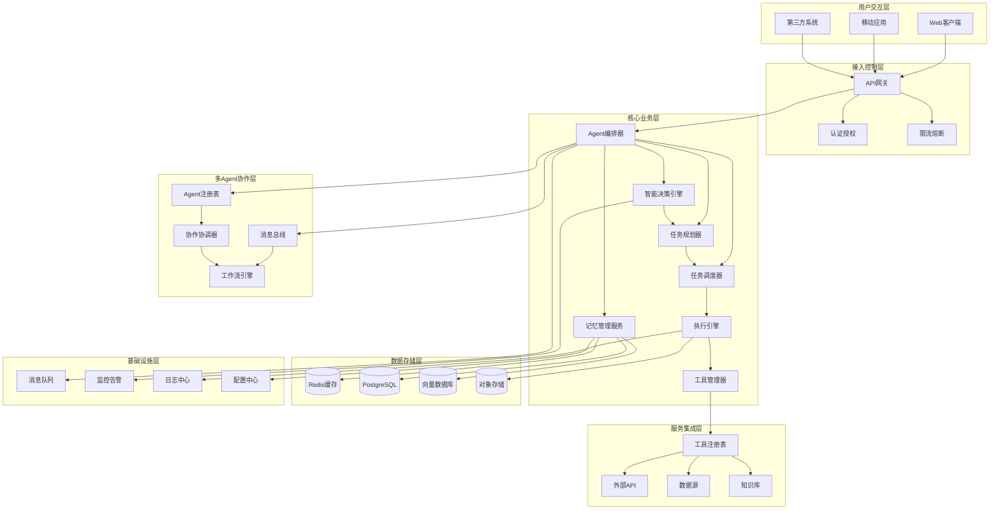

### 1.2 架构设计原则

| 原则 | 描述 | 实现方式 |
|------|------|----------|
| **高内聚低耦合** | 模块内部高度聚合，模块间松耦合 | 分层架构 + 接口契约 |
| **无状态设计** | 核心服务无状态，便于水平扩展 | 状态外置到 Redis/DB |
| **插件化架构** | 支持灵活的功能扩展 | 工具/Agent 插件机制 |
| **事件驱动** | 异步解耦，提升系统吞吐 | 消息队列 + 事件总线 |
| **安全可控** | 全链路安全防护 | 多层安全网关 |
| **可观测性** | 全链路追踪与监控 | 统一 Trace ID + 结构化日志 |

### 1.3 分层架构说明

```
┌─────────────────────────────────────────────────────────────────────────────┐
│                         企业级Agent系统分层架构                              │
├─────────────────────────────────────────────────────────────────────────────┤
│                                                                             │
│  Layer 7: 用户交互层                                                        │
│  ┌─────────────────────────────────────────────────────────────────────┐   │
│  │  Web UI  │  Mobile App  │  API Gateway  │  CLI 工具                  │   │
│  └─────────────────────────────────────────────────────────────────────┘   │
│                              │                                              │
│  Layer 6: 接入控制层                                                        │
│  ┌─────────────────────────────────────────────────────────────────────┐   │
│  │  认证  │  鉴权  │  限流  │  熔断  │  路由                          │   │
│  └─────────────────────────────────────────────────────────────────────┘   │
│                              │                                              │
│  Layer 5: 业务编排层                                                        │
│  ┌─────────────────────────────────────────────────────────────────────┐   │
│  │  Agent Orchestrator (任务编排)  │  Multi-Agent Coordinator (协作)   │   │
│  └─────────────────────────────────────────────────────────────────────┘   │
│                              │                                              │
│  Layer 4: 智能核心层                                                        │
│  ┌─────────────────────────────────────────────────────────────────────┐   │
│  │  Decision Engine  │  Planner  │  Memory  │  LLM Gateway            │   │
│  └─────────────────────────────────────────────────────────────────────┘   │
│                              │                                              │
│  Layer 3: 执行与调度层                                                      │
│  ┌─────────────────────────────────────────────────────────────────────┐   │
│  │  Task Scheduler  │  Executor  │  Tool Manager  │  Workflow Engine    │   │
│  └─────────────────────────────────────────────────────────────────────┘   │
│                              │                                              │
│  Layer 2: 服务集成层                                                        │
│  ┌─────────────────────────────────────────────────────────────────────┐   │
│  │  Tool Registry  │  External APIs  │  Data Sources  │  Knowledge      │   │
│  └─────────────────────────────────────────────────────────────────────┘   │
│                              │                                              │
│  Layer 1: 数据与基础设施层                                                   │
│  ┌─────────────────────────────────────────────────────────────────────┐   │
│  │  Redis  │  PostgreSQL  │  Vector DB  │  MQ  │  Monitor  │  Log      │   │
│  └─────────────────────────────────────────────────────────────────────┘   │
│                                                                             │
└─────────────────────────────────────────────────────────────────────────────┘
```

---

## 二、核心组件深度解析

### 2.1 组件全景图

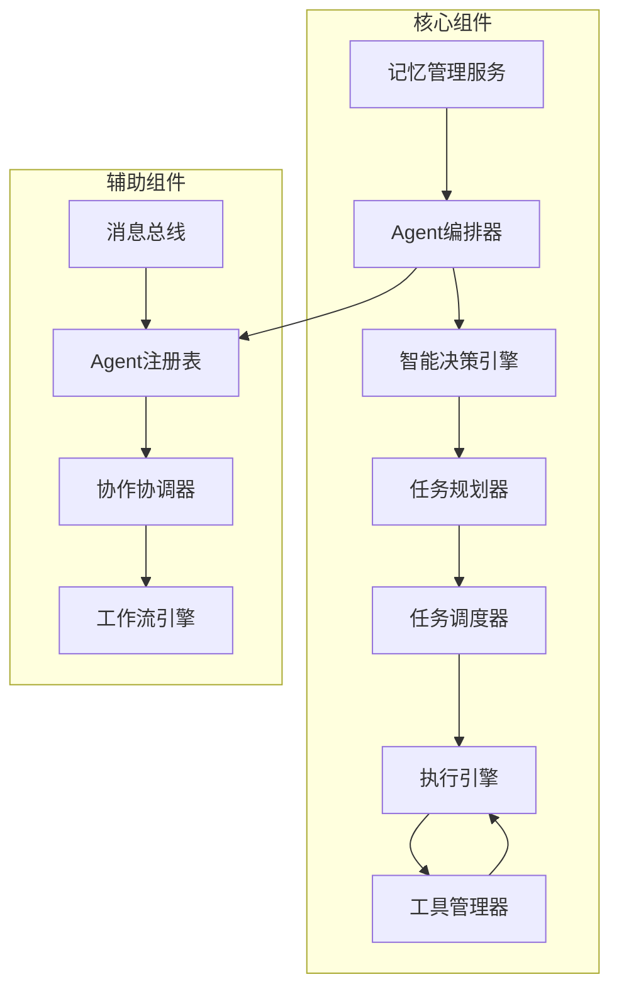

### 2.2 Agent编排器 (Agent Orchestrator)

**职责**：作为整个Agent系统的"大脑中枢"，负责协调其他所有组件，驱动任务从创建到完成的全过程。

```python
class AgentOrchestrator:
    """
    Agent编排器 - 企业级实现
    负责任务生命周期管理、模块协调、状态流转
    """
    
    async def execute_task(self, user_request: TaskRequest) -> TaskResult:
        # 1. 初始化任务上下文
        context = await self._init_context(user_request)
        
        # 2. 智能决策：选择执行策略
        strategy = await self.decision_engine.select_strategy(context)
        
        # 3. 任务规划：生成执行计划
        plan = await self.planner.create_plan(context, strategy)
        
        # 4. 任务调度：分发任务到执行引擎
        execution_result = await self.scheduler.dispatch_and_execute(plan)
        
        # 5. 结果整合与反馈
        result = await self._process_result(execution_result)
        
        # 6. 记忆归档
        await self.memory.archive_task(context, plan, result)
        
        return result
    
    async def _init_context(self, request: TaskRequest) -> ExecutionContext:
        """初始化执行上下文"""
        context = ExecutionContext(
            task_id=generate_task_id(),
            user_id=request.user_id,
            priority=request.priority,
            deadline=request.deadline,
            metadata=request.metadata
        )
        
        # 加载用户画像和历史上下文
        context.user_profile = await self.memory.get_user_profile(request.user_id)
        context.history = await self.memory.get_recent_context(request.user_id)
        
        return context
```

### 2.3 智能决策引擎 (Decision Engine)

**职责**：根据任务类型、上下文信息和实时状态，智能选择最合适的执行策略。

#### 决策策略分类

| 策略类型 | 适用场景 | 决策依据 | 执行路径 |
|---------|---------|---------|---------|
| **即时响应** | 简单、明确的任务 | 任务复杂度 < 3 | 直接调用工具 |
| **单轮推理** | 需要简单推理的任务 | 任务复杂度 3-5 | LLM单次推理 |
| **多轮规划** | 复杂任务 | 任务复杂度 > 5 | 规划器 + 执行循环 |
| **多Agent协作** | 跨领域复杂任务 | 需要多种专业能力 | 协作协调器 |
| **人工介入** | 高风险或不确定任务 | 风险等级 > 阈值 | 人机交互接口 |

#### 决策流程

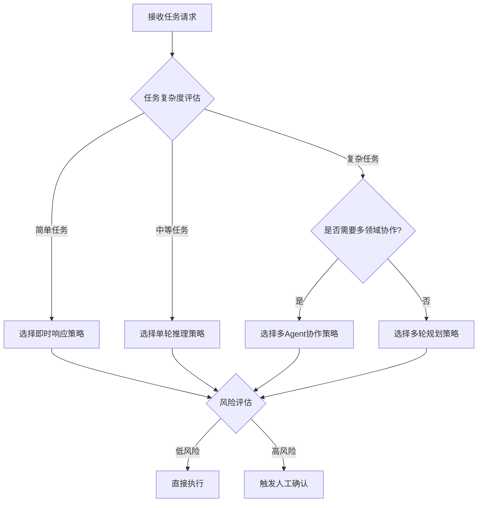

### 2.4 任务规划器 (Planner)

**职责**：将复杂目标分解为可执行的子任务序列，支持多种规划策略。

#### 规划策略实现

```python
class AdaptivePlanner:
    """
    自适应任务规划器
    根据任务特征动态选择最优规划策略
    """
    
    async def create_plan(self, context: ExecutionContext, strategy: ExecutionStrategy) -> ExecutionPlan:
        if strategy == ExecutionStrategy.SINGLE_SHOT:
            return await self._single_shot_plan(context)
        elif strategy == ExecutionStrategy.CHAIN:
            return await self._chain_plan(context)
        elif strategy == ExecutionStrategy.HIERARCHICAL:
            return await self._hierarchical_plan(context)
        elif strategy == ExecutionStrategy.DYNAMIC:
            return await self._dynamic_plan(context)
        elif strategy == ExecutionStrategy.MULTI_AGENT:
            return await self._multi_agent_plan(context)
    
    async def _hierarchical_plan(self, context: ExecutionContext) -> ExecutionPlan:
        """层级规划：适用于复杂的可分治任务"""
        # Step 1: 分析任务，识别可分解的子目标
        sub_goals = await self._decompose_goal(context.goal)
        
        # Step 2: 为每个子目标制定执行策略
        sub_plans = []
        for sub_goal in sub_goals:
            sub_plan = await self._plan_sub_goal(sub_goal, context)
            sub_plans.append(sub_plan)
        
        # Step 3: 构建主计划，整合子计划依赖关系
        main_plan = ExecutionPlan(
            id=generate_plan_id(),
            strategy="hierarchical",
            steps=self._build_dag(sub_plans),
            estimated_duration=self._estimate_total_time(sub_plans)
        )
        
        return main_plan
```

#### 计划数据结构

```json
{
  "plan_id": "plan_20260807_001",
  "strategy": "hierarchical",
  "goal": "优化项目构建流程",
  "priority": "high",
  "created_at": "2026-08-07T10:00:00Z",
  "estimated_duration_ms": 300000,
  "steps": [
    {
      "id": "step_1",
      "type": "analysis",
      "description": "分析当前构建流程耗时",
      "status": "pending",
      "dependencies": [],
      "assigned_to": "analysis_agent",
      "tool_calls": [
        {
          "tool": "profile_build",
          "params": {"project_path": "/app"},
          "timeout_ms": 30000
        }
      ],
      "sub_steps": [
        {
          "id": "step_1_1",
          "description": "收集构建指标",
          "status": "pending"
        }
      ]
    },
    {
      "id": "step_2",
      "type": "optimization",
      "description": "实施构建优化方案",
      "status": "pending",
      "dependencies": ["step_1"],
      "assigned_to": "dev_agent",
      "tool_calls": [],
      "sub_steps": []
    }
  ],
  "metadata": {
    "created_by": "planner_v2",
    "revision": 1
  }
}
```

### 2.5 任务调度器 (Task Scheduler)

**职责**：负责任务的分发、执行监控、重试和优先级管理。

#### 调度策略对比

| 调度策略 | 说明 | 适用场景 | 实现复杂度 |
|---------|------|---------|-----------|
| **FIFO** | 先进先出 | 简单任务队列 | 低 |
| **优先级调度** | 按任务优先级执行 | 有明确优先级需求 | 中 |
| **公平调度** | 按用户/租户公平分配资源 | 多租户SaaS | 高 |
| **依赖感知调度** | 考虑任务间依赖关系 | DAG型任务 | 高 |
| **自适应调度** | 动态调整调度策略 | 复杂多变场景 | 很高 |

#### 企业级调度器实现

```python
class EnterpriseScheduler:
    """
    企业级任务调度器
    支持优先级、依赖关系、资源配额等调度策略
    """
    
    def __init__(self):
        self.task_queue = PriorityQueue()
        self.resource_manager = ResourceManager()
        self.executor_pool = ExecutorPool(max_workers=100)
        self.retry_manager = RetryManager(max_retries=3, backoff_strategy="exponential")
    
    async def dispatch(self, plan: ExecutionPlan) -> DispatchResult:
        """分发执行计划"""
        # 1. 验证计划依赖
        await self._validate_dependencies(plan)
        
        # 2. 按依赖关系拓扑排序
        sorted_steps = self._topological_sort(plan.steps)
        
        # 3. 分批调度执行
        execution_batches = self._create_execution_batches(sorted_steps)
        
        for batch in execution_batches:
            # 检查资源可用性
            resource_slot = await self.resource_manager.allocate(batch.resource_requirements)
            
            if resource_slot.available:
                # 分发到执行引擎
                results = await self._execute_batch(batch, resource_slot)
                
                # 处理结果
                await self._process_batch_results(results)
            else:
                # 资源不足，等待
                await self._wait_for_resource(resource_slot.wait_time)
        
        return DispatchResult(status="completed", results=self._collect_all_results())
    
    async def _execute_batch(self, batch: TaskBatch, resource_slot: ResourceSlot) -> List[StepResult]:
        """并行执行一批任务"""
        tasks = []
        for step in batch.steps:
            task = asyncio.create_task(
                self._execute_single_step(step, resource_slot)
            )
            tasks.append(task)
        
        return await asyncio.gather(*tasks, return_exceptions=True)
```

### 2.6 执行引擎 (Executor)

**职责**：负责实际的工具调用、代码执行、API请求等具体执行工作。

```python
class HighPerformanceExecutor:
    """
    高性能执行引擎
    支持同步/异步执行、超时控制、结果缓存
    """
    
    async def execute(self, action: AgentAction) -> ExecutionResult:
        try:
            # 1. 查找可用工具
            tool = await self.tool_registry.resolve(action.tool_name)
            
            # 2. 参数验证
            validated_params = self._validate_params(action.params, tool.parameters_schema)
            
            # 3. 执行（带超时和重试）
            result = await self._execute_with_timeout(
                tool.execute(**validated_params),
                timeout=action.timeout_ms or DEFAULT_TIMEOUT,
                retry_policy=action.retry_policy
            )
            
            # 4. 结果处理
            return ExecutionResult(
                status="success",
                data=result,
                execution_metadata={
                    "tool": action.tool_name,
                    "latency_ms": self._calculate_latency(),
                    "resource_used": self._get_resource_usage()
                }
            )
            
        except ToolExecutionError as e:
            return ExecutionResult(
                status="error",
                error_code=e.error_code,
                error_message=str(e),
                recovery_suggestion=self._suggest_recovery(e)
            )
        except TimeoutError:
            return ExecutionResult(
                status="timeout",
                error_message=f"Execution timed out after {action.timeout_ms}ms"
            )
```

---

## 三、技术选型依据

### 3.1 核心技术栈

| 分类 | 技术选型 | 选型依据 | 替代方案 |
|------|---------|---------|---------|
| **编程语言** | Python 3.11+ | AI生态成熟、开发效率高 | Go (高性能场景) |
| **LLM框架** | LangChain/LangGraph | 社区活跃、功能完善 | CrewAI, AutoGen |
| **大模型** | GPT-4 / 文心一言 / 通义 | 能力强、API稳定 | 开源模型 (Llama, Qwen) |
| **API框架** | FastAPI | 异步支持、性能优异 | Flask, Django |
| **消息队列** | Apache Kafka | 高吞吐、持久化 | RabbitMQ, Redis Streams |
| **缓存** | Redis Cluster | 高性能、支持分布式 | Memcached, Hazelcast |
| **关系数据库** | PostgreSQL | 功能强大、扩展性好 | MySQL, CockroachDB |
| **向量数据库** | Milvus / pgvector | 专业向量检索、可扩展 | Pinecone, Weaviate |
| **对象存储** | MinIO / OSS | 兼容S3协议、成本低 | AWS S3, Azure Blob |
| **容器化** | Docker + Kubernetes | 生态完善、弹性伸缩 | Podman, Nomad |
| **服务网格** | Istio / Linkerd | 流量管理、可观测性 | Consul Connect |
| **监控** | Prometheus + Grafana | 业界标准、功能强大 | Datadog, New Relic |
| **日志** | ELK / Loki | 日志聚合与分析 | Splunk, CloudWatch |
| **链路追踪** | OpenTelemetry + Jaeger | 标准协议、多语言支持 | Zipkin, SkyWalking |

### 3.2 选型决策矩阵

```
技术选型评估维度
┌─────────────────────────────────────────────────────────────────────┐
│ 维度              权重    评估要点                                  │
├─────────────────────────────────────────────────────────────────────┤
│ 社区活跃度        25%    GitHub Stars、更新频率、Issue响应          │
│ 性能与稳定性      20%    QPS、P99延迟、故障恢复时间                │
│ 生态兼容性        15%    与现有系统集成成本、插件生态              │
│ 学习成本          15%    文档质量、API友好度、招聘难度              │
│ 许可证与合规      10%    是否允许商业使用、是否符合合规要求          │
│ 长期演进性        10%    项目路线图、背后公司实力                   │
│ 成本与部署        5%     授权费用、运维成本、资源消耗              │
└─────────────────────────────────────────────────────────────────────┘
```

### 3.3 技术栈架构图

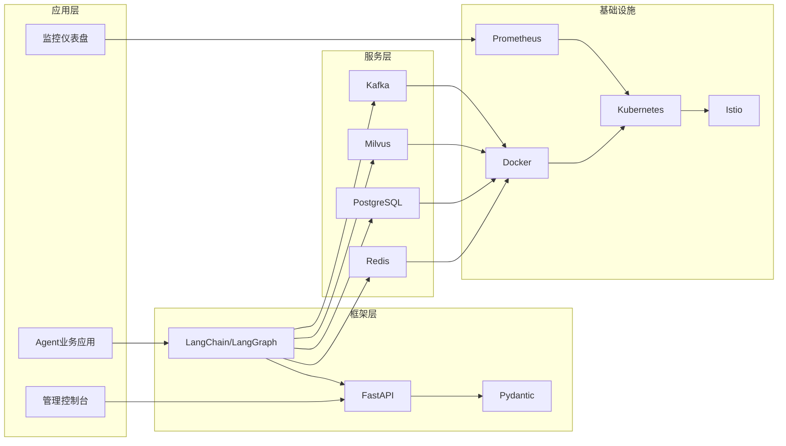

---

## 四、数据流程设计

### 4.1 核心数据实体

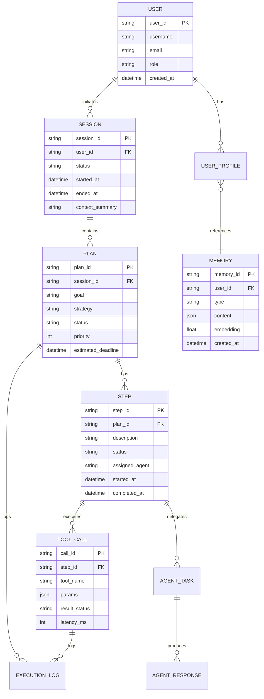

### 4.2 数据流转流程

#### 任务执行数据流程

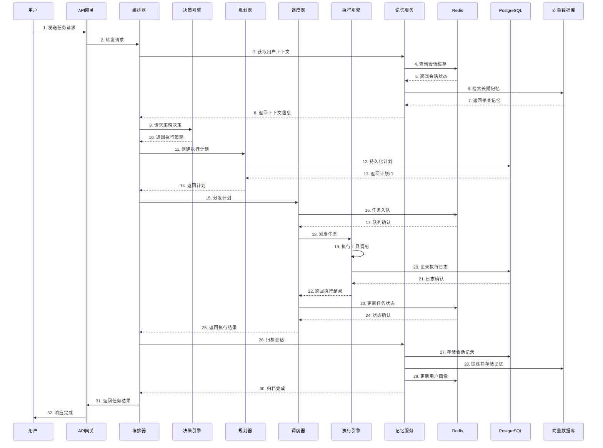

### 4.3 数据存储策略

| 数据类型 | 存储位置 | 读写模式 | 生命周期 | 访问频率 |
|---------|---------|---------|---------|---------|
| **会话状态** | Redis | 高频读写 | 会话级别 | 1000+/秒 |
| **执行计划** | PostgreSQL | 中频读写 | 任务级别 | 10-100/秒 |
| **工具调用日志** | PostgreSQL | 中频写入 | 永久 | 10-100/秒 |
| **长期记忆** | 向量数据库 | 中频读写 | 永久 | 1-100/秒 |
| **用户画像** | PostgreSQL + Redis | 低频写入/高频读取 | 永久 | 100+/秒 |
| **审计日志** | 对象存储 | 低频写入 | 7年+ | <1/秒 |
| **监控指标** | Prometheus | 高频写入 | 15天 | 1000+/秒 |

### 4.4 数据流安全保障

```
数据流转安全措施
┌─────────────────────────────────────────────────────────────────┐
│ 1. 传输加密：所有数据传输使用 TLS 1.3                           │
│ 2. 存储加密：敏感字段 AES-256 加密存储                           │
│ 3. 数据脱敏：日志自动脱敏敏感信息（手机号、身份证等）            │
│ 4. 访问控制：基于角色的数据库访问控制                           │
│ 5. 数据隔离：多租户数据逻辑隔离（tenant_id字段）                │
│ 6. 审计追踪：所有数据变更记录审计日志                           │
└─────────────────────────────────────────────────────────────────┘
```

---

## 五、智能决策模块设计

### 5.1 决策模块架构

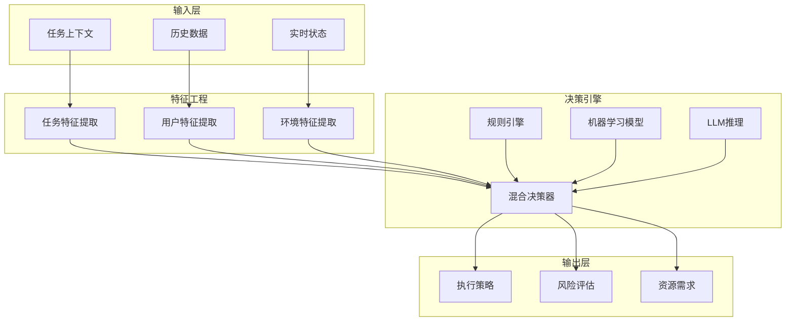

### 5.2 决策算法实现

#### 多维度决策评分模型

```python
class MultiDimensionalDecisionEngine:
    """
    多维度决策引擎
    综合考虑任务复杂度、风险等级、资源需求等因素
    """
    
    def __init__(self):
        self.rule_engine = RuleEngine()
        self.ml_model = DecisionMLModel()
        self.llm_reasoner = LLMReasoner()
        self.weight_config = {
            "complexity": 0.3,
            "risk": 0.25,
            "urgency": 0.2,
            "resource": 0.15,
            "history": 0.1
        }
    
    async def make_decision(self, context: DecisionContext) -> DecisionResult:
        """执行多维度决策"""
        # 1. 特征提取
        features = await self._extract_features(context)
        
        # 2. 多路径决策
        rule_decision = await self.rule_engine.evaluate(features)
        ml_decision = await self.ml_model.predict(features)
        llm_decision = await self.llm_reasoner.reason(features, context)
        
        # 3. 融合决策
        final_decision = self._fuse_decisions(
            rule_decision, ml_decision, llm_decision
        )
        
        # 4. 风险评估
        risk_assessment = await self._assess_risk(final_decision, context)
        
        return DecisionResult(
            strategy=final_decision.strategy,
            confidence=final_decision.confidence,
            risk_level=risk_assessment.risk_level,
            recommendations=risk_assessment.recommendations,
            fallback_strategy=self._get_fallback_strategy(final_decision)
        )
    
    def _fuse_decisions(self, *decisions) -> FusedDecision:
        """融合多源决策"""
        # 加权投票
        strategy_scores = {}
        for decision in decisions:
            weight = self._get_source_weight(decision.source)
            for strategy, score in decision.strategy_scores.items():
                if strategy not in strategy_scores:
                    strategy_scores[strategy] = 0
                strategy_scores[strategy] += score * weight
        
        # 选择得分最高的策略
        best_strategy = max(strategy_scores, key=strategy_scores.get)
        confidence = strategy_scores[best_strategy] / sum(
            strategy_scores.values()
        )
        
        return FusedDecision(
            strategy=best_strategy,
            confidence=confidence,
            supporting_evidence=self._collect_evidence(decisions)
        )
```

### 5.3 决策规则引擎

```yaml
# 决策规则配置示例
decision_rules:
  - id: "rule_simple_task"
    name: "简单任务快速响应"
    condition:
      task_complexity: "<=3"
      risk_level: "low"
    action:
      strategy: "DIRECT_EXECUTION"
      skip_planning: true
    priority: 100

  - id: "rule_high_risk"
    name: "高风险任务人工确认"
    condition:
      risk_level: "high"
      task_type: "destructive_operation"
    action:
      strategy: "HUMAN_IN_THE_LOOP"
      require_approval: true
      approval_timeout_ms: 300000
    priority: 200

  - id: "rule_multi_agent"
    name: "复杂任务多Agent协作"
    condition:
      task_complexity: ">=7"
      requires_domains: ">=3"
    action:
      strategy: "MULTI_AGENT_COLLABORATION"
      agent_types: ["planner", "researcher", "executor"]
    priority: 150

  - id: "rule_urgent_task"
    name: "紧急任务优先级提升"
    condition:
      urgency: "high"
      sla_remaining: "<300s"
    action:
      strategy: "PRIORITY_EXECUTION"
      priority_boost: true
      max_wait_time_ms: 5000
    priority: 180
```

### 5.4 决策可解释性

```python
class DecisionExplainability:
    """
    决策可解释性模块
    确保每个决策都有清晰的依据
    """
    
    def generate_explanation(self, decision: DecisionResult, context: DecisionContext) -> Explanation:
        """生成决策解释"""
        return Explanation(
            decision_id=decision.id,
            timestamp=decision.timestamp,
            summary=self._generate_summary(decision),
            detailed_reasons=self._collect_reasons(decision, context),
            alternative_options=self._list_alternatives(decision),
            confidence_breakdown=self._breakdown_confidence(decision),
            metadata={
                "decision_model_version": self.model_version,
                "feature_count": len(decision.features_used),
                "processing_time_ms": decision.processing_time
            }
        )
    
    def _generate_summary(self, decision: DecisionResult) -> str:
        """生成简要说明"""
        strategy_name = STRATEGY_NAMES[decision.strategy]
        reasons = decision.key_factors[:3]
        
        return f"系统选择了【{strategy_name}】策略，主要考虑因素包括：{', '.join(reasons)}。"
    
    def _collect_reasons(self, decision: DecisionResult, context: DecisionContext) -> List[Reason]:
        """收集详细决策依据"""
        reasons = []
        
        # 复杂度分析
        reasons.append(Reason(
            factor="task_complexity",
            value=decision.complexity_score,
            interpretation=f"任务复杂度评分为 {decision.complexity_score}/10",
            impact="high" if decision.complexity_score > 7 else "medium"
        ))
        
        # 风险评估
        reasons.append(Reason(
            factor="risk_level",
            value=decision.risk_level,
            interpretation=f"风险等级为 {decision.risk_level}",
            impact="critical" if decision.risk_level == "high" else "normal"
        ))
        
        return reasons
```

---

## 六、多Agent协作机制

### 6.1 协作架构设计

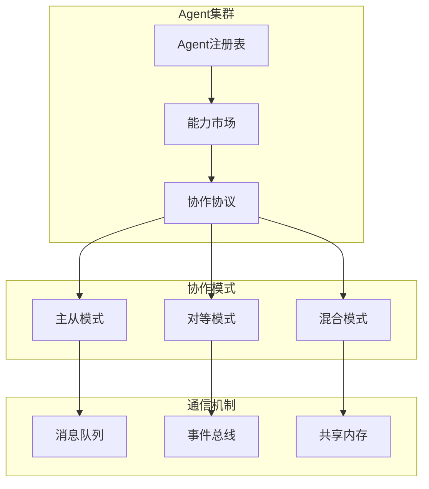

### 6.2 协作模式详解

#### 模式对比表

| 协作模式 | 架构特点 | 适用场景 | 优点 | 缺点 |
|---------|---------|---------|------|------|
| **主从模式** | 中心化调度，主控Agent分配任务 | 层级分明的任务 | 职责清晰、可控性强 | 主控成为瓶颈 |
| **对等模式** | Agent间平等通信，自主协作 | 知识密集型任务 | 灵活性高、单点容错 | 协调复杂 |
| **混合模式** | 主从+对等结合，灵活切换 | 复杂多变场景 | 兼顾控制与灵活 | 实现复杂 |

#### 主从模式实现

```python
class MasterSlaveCoordinator:
    """
    主从式多Agent协作
    主控Agent负责任务分解和分配
    """
    
    async def coordinate(self, task: ComplexTask) -> CollaborationResult:
        # 1. 主控Agent分析任务
        master_plan = await self.master_agent.analyze_and_plan(task)
        
        # 2. 子任务分配
        agent_assignments = self._match_agents_to_tasks(
            master_plan.sub_tasks,
            await self.agent_registry.get_available_agents()
        )
        
        # 3. 并行执行子任务
        execution_results = {}
        async with asyncio.TaskGroup() as group:
            for assignment in agent_assignments:
                execution_results[assignment.task_id] = group.create_task(
                    self._dispatch_to_agent(assignment)
                )
        
        # 4. 结果整合
        final_result = await self.master_agent.synthesize_results(execution_results)
        
        return CollaborationResult(
            status="completed",
            result=final_result,
            collaboration_metadata={
                "master_id": self.master_agent.id,
                "participants": list(agent_assignments.keys()),
                "duration_ms": self._calculate_duration(),
                "efficiency_score": self._calculate_efficiency(execution_results)
            }
        )
    
    def _match_agents_to_tasks(self, sub_tasks: List[SubTask], available_agents: List[Agent]) -> Dict:
        """智能匹配Agent与任务"""
        assignments = {}
        
        for task in sub_tasks:
            # 根据任务需求匹配Agent能力
            matching_agents = [
                agent for agent in available_agents
                if self._agent_capabilities_match(agent, task.requirements)
            ]
            
            # 选择最优Agent（考虑负载、历史表现等）
            best_agent = self._select_best_agent(matching_agents)
            
            assignments[task.id] = AgentTaskAssignment(
                task=task,
                agent_id=best_agent.id,
                estimated_completion_time=self._estimate_time(task, best_agent)
            )
        
        return assignments
```

### 6.3 Agent能力市场

```python
class AgentCapabilityMarket:
    """
    Agent能力市场
    统一管理和发现各类Agent的能力
    """
    
    def register_agent(self, agent: Agent) -> RegistrationResult:
        """注册Agent及其能力"""
        capabilities = self._extract_capabilities(agent)
        
        agent_profile = AgentProfile(
            agent_id=agent.id,
            name=agent.name,
            type=agent.type,
            capabilities=capabilities,
            performance_metrics=AgentPerformanceMetrics(
                avg_completion_time=self._calculate_avg_time(agent),
                success_rate=self._calculate_success_rate(agent),
                current_load=self._get_current_load(agent)
            ),
            availability_status=AvailabilityStatus.ONLINE
        )
        
        self._agent_profiles[agent.id] = agent_profile
        
        return RegistrationResult(
            status="success",
            agent_id=agent.id,
            capabilities_registered=len(capabilities)
        )
    
    def find_best_agent(self, requirements: TaskRequirements) -> Agent:
        """根据需求查找最优Agent"""
        candidates = []
        
        for agent_id, profile in self._agent_profiles.items():
            # 能力匹配度评分
            capability_score = self._calculate_capability_match(
                profile.capabilities,
                requirements.required_capabilities
            )
            
            # 性能评分
            performance_score = self._calculate_performance_score(
                profile.performance_metrics,
                requirements.time_constraint
            )
            
            # 负载评分
            load_penalty = profile.performance_metrics.current_load * 0.3
            
            # 综合评分
            total_score = (capability_score * 0.4 + 
                          performance_score * 0.35 + 
                          (1 - load_penalty) * 0.25)
            
            if total_score >= self.MIN_THRESHOLD:
                candidates.append((profile, total_score))
        
        # 返回评分最高的Agent
        candidates.sort(key=lambda x: x[1], reverse=True)
        return candidates[0][0] if candidates else None
```

### 6.4 协作协议

```yaml
# Agent协作协议定义
agent_collaboration_protocol:
  version: "2.0"
  
  message_types:
    task_assignment:
      schema:
        task_id: string
        task_description: string
        requirements:
          required_capabilities: [string]
          priority: enum [low, medium, high, critical]
          deadline: datetime
        context: object
      semantics: "用于分配任务给Agent"
    
    result_submission:
      schema:
        task_id: string
        agent_id: string
        status: enum [success, partial, failed]
        result: object
        quality_metrics:
          accuracy: float
          completeness: float
          confidence: float
      semantics: "用于提交任务执行结果"
    
    collaboration_request:
      schema:
        requester_id: string
        request_type: enum [assistance, review, escalation]
        description: string
        urgency: enum [low, normal, urgent]
      semantics: "用于请求其他Agent协助"

  communication_patterns:
    synchronous:
      description: "同步请求-响应模式"
      use_case: "需要即时反馈的协作场景"
      timeout_ms: 30000
    
    asynchronous:
      description: "异步消息模式"
      use_case: "长耗时任务、非紧急协作"
      retry_policy:
        max_retries: 3
        backoff: exponential
    
    broadcast:
      description: "广播通知模式"
      use_case: "状态变更通知、系统公告"
      delivery_guarantee: at_least_once
```

---

## 七、任务调度系统

### 7.1 调度系统架构

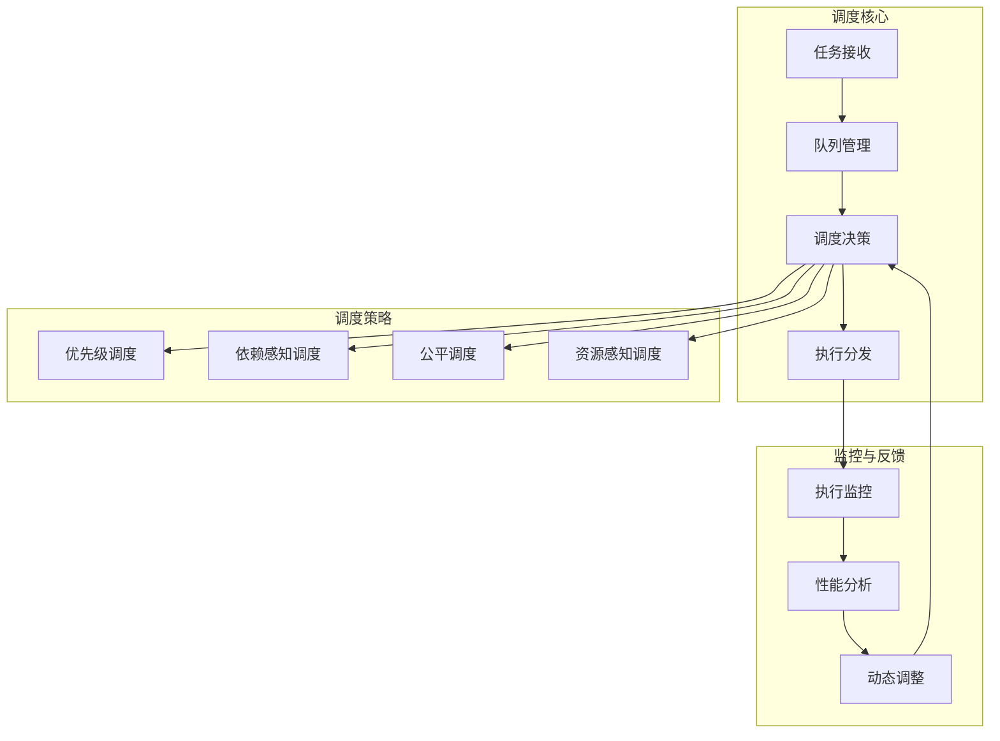

### 7.2 优先级调度实现

```python
class PriorityScheduler:
    """
    优先级任务调度器
    支持多级优先级和动态调整
    """
    
    PRIORITY_LEVELS = {
        "critical": {"value": 0, "max_latency": 1000},
        "high": {"value": 1, "max_latency": 5000},
        "medium": {"value": 2, "max_latency": 30000},
        "low": {"value": 3, "max_latency": 300000}
    }
    
    def __init__(self):
        self.queues = {
            priority: asyncio.PriorityQueue()
            for priority in self.PRIORITY_LEVELS
        }
        self.running_tasks = {}
        self.resource_limiter = ResourceLimiter()
    
    async def submit_task(self, task: ScheduledTask) -> TaskReceipt:
        """提交任务到调度队列"""
        priority = self._determine_priority(task)
        queue = self.queues[priority]
        
        # 计算任务权重（用于公平调度）
        weight = self._calculate_weight(task)
        
        # 入队
        await queue.put((weight, task))
        
        return TaskReceipt(
            task_id=task.id,
            queue_position=queue.qsize(),
            estimated_wait_time_ms=self._estimate_wait_time(priority, queue)
        )
    
    async def dispatch_tasks(self) -> None:
        """调度循环：按优先级分发任务"""
        while True:
            # 按优先级顺序检查队列
            for priority in ["critical", "high", "medium", "low"]:
                queue = self.queues[priority]
                
                if not queue.empty() and self.resource_limiter.has_capacity():
                    _, task = await queue.get()
                    
                    # 获取资源配额
                    resource_slot = await self.resource_limiter.allocate(task.resource_requirements)
                    
                    # 执行任务
                    asyncio.create_task(
                        self._execute_with_monitoring(task, resource_slot)
                    )
                    
                    break  # 每次只处理一个任务，防止饥饿
            
            await asyncio.sleep(0.1)  # 避免空转
```

### 7.3 依赖感知调度

```python
class DependencyAwareScheduler:
    """
    依赖感知调度器
    基于DAG（有向无环图）进行任务调度
    """
    
    def __init__(self):
        self.task_graph = TaskGraph()
        self.execution_batches = []
    
    async def schedule_dag(self, tasks: List[DAGTask]) -> SchedulePlan:
        """调度DAG任务"""
        # 1. 构建任务图
        self.task_graph.build(tasks)
        
        # 2. 拓扑排序
        sorted_tasks = self.task_graph.topological_sort()
        
        # 3. 识别并行执行批次
        execution_batches = self._identify_parallel_batches(sorted_tasks)
        
        # 4. 资源约束优化
        optimized_batches = self._optimize_resource_usage(execution_batches)
        
        return SchedulePlan(
            total_stages=len(optimized_batches),
            estimated_duration_ms=self._estimate_total_duration(optimized_batches),
            batches=optimized_batches
        )
    
    def _identify_parallel_batches(self, sorted_tasks: List[DAGTask]) -> List[ExecutionBatch]:
        """识别可并行执行的任务批次"""
        batches = []
        completed_tasks = set()
        
        while len(completed_tasks) < len(sorted_tasks):
            # 找出所有依赖已满足的任务
            ready_tasks = [
                task for task in sorted_tasks
                if task.id not in completed_tasks
                and all(dep in completed_tasks for dep in task.dependencies)
            ]
            
            # 创建执行批次
            batch = ExecutionBatch(
                tasks=ready_tasks,
                max_parallelism=self._calculate_max_parallelism(ready_tasks)
            )
            
            batches.append(batch)
            completed_tasks.update(task.id for task in ready_tasks)
        
        return batches
    
    def _optimize_resource_usage(self, batches: List[ExecutionBatch]) -> List[ExecutionBatch]:
        """优化资源使用"""
        optimized = []
        
        for batch in batches:
            # 检查批次内任务资源需求
            total_resources = sum(task.resource_requirements for task in batch.tasks)
            
            if total_resources > self.MAX_RESOURCE_PER_BATCH:
                # 需要进一步拆分
                sub_batches = self._split_batch(batch, self.MAX_RESOURCE_PER_BATCH)
                optimized.extend(sub_batches)
            else:
                optimized.append(batch)
        
        return optimized
```

### 7.4 调度监控与自适应调整

```python
class AdaptiveSchedulingMonitor:
    """
    调度监控与自适应调整
    根据系统负载动态调整调度策略
    """
    
    def __init__(self, scheduler: BaseScheduler):
        self.scheduler = scheduler
        self.metrics_collector = MetricsCollector()
        self.adjustment_rules = self._load_adjustment_rules()
    
    async def monitor_and_adjust(self):
        """持续监控并自适应调整"""
        while True:
            # 1. 收集调度指标
            metrics = await self.metrics_collector.collect([
                "queue_depth",
                "average_wait_time",
                "resource_utilization",
                "task_completion_rate",
                "p99_latency"
            ])
            
            # 2. 评估当前状态
            health_status = self._evaluate_system_health(metrics)
            
            # 3. 触发调整规则
            for rule in self.adjustment_rules:
                if rule.condition_met(metrics, health_status):
                    await self._apply_adjustment(rule, metrics)
            
            # 4. 记录决策
            await self._record_adjustment(metrics, health_status)
            
            await asyncio.sleep(self.MONITOR_INTERVAL)
    
    def _evaluate_system_health(self, metrics: SchedulingMetrics) -> HealthStatus:
        """评估系统健康状态"""
        score = 100.0
        
        # 队列深度影响
        if metrics.queue_depth > self.QUEUE_DEPTH_THRESHOLD:
            score -= 20
        
        # 延迟影响
        if metrics.p99_latency > self.LATENCY_THRESHOLD:
            score -= 25
        
        # 资源利用率
        if metrics.resource_utilization > 0.85:
            score -= 15
        
        # 完成率
        if metrics.task_completion_rate < 0.95:
            score -= 20
        
        return HealthStatus(
            score=score,
            level="healthy" if score >= 80 else "degraded" if score >= 50 else "critical",
            bottlenecks=self._identify_bottlenecks(metrics)
        )
```

---

## 八、人机交互接口设计

### 8.1 交互模式设计

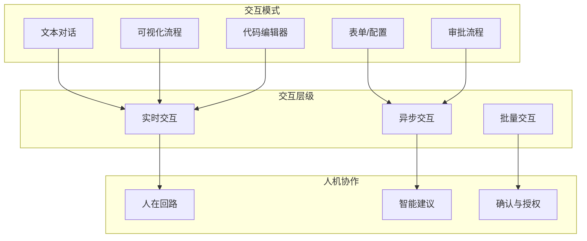

### 8.2 智能交互接口

#### 智能对话接口

```python
class IntelligentChatInterface:
    """
    智能对话交互接口
    支持多轮对话、上下文理解、主动提示
    """
    
    async def handle_user_message(self, message: UserMessage) -> ChatResponse:
        # 1. 消息预处理
        processed = await self._preprocess_message(message)
        
        # 2. 上下文管理
        context = await self.context_manager.get_context(message.session_id)
        context = self._update_context(context, processed)
        
        # 3. 意图识别
        intent_result = await self.intent_recognizer.recognize(processed, context)
        
        # 4. 路由到对应处理流程
        if intent_result.needs_clarification:
            return self._ask_for_clarification(intent_result)
        elif intent_result.is_high_risk:
            return self._request_human_approval(intent_result)
        else:
            return await self._execute_intent(intent_result, context)
    
    def _ask_for_clarification(self, intent: IntentResult) -> ClarificationResponse:
        """请求用户澄清"""
        return ClarificationResponse(
            type="clarification",
            message=f"关于"{intent.query}"，您希望我关注哪些方面？",
            options=[
                {"label": "技术实现", "value": "technical"},
                {"label": "使用案例", "value": "examples"},
                {"label": "最佳实践", "value": "best_practices"},
                {"label": "其他方面", "value": "other"}
            ],
            allow_custom_input=True,
            context_hint="您也可以直接描述您的具体需求"
        )
```

#### 可视化流程交互

```python
class VisualWorkflowInterface:
    """
    可视化工作流接口
    允许用户查看、编辑和监控Agent的执行流程
    """
    
    def render_workflow_view(self, execution_id: str) -> WorkflowView:
        """渲染工作流视图"""
        execution_log = self.execution_tracker.get_execution(execution_id)
        
        nodes = []
        edges = []
        
        for step in execution_log.steps:
            nodes.append(WorkflowNode(
                id=step.id,
                label=step.description,
                status=step.status,
                timing=step.duration,
                agent=step.assigned_agent
            ))
            
            if step.previous_step_id:
                edges.append(WorkflowEdge(
                    from_id=step.previous_step_id,
                    to_id=step.id,
                    type="sequential"
                ))
        
        return WorkflowView(
            execution_id=execution_id,
            nodes=nodes,
            edges=edges,
            current_step_id=execution_log.current_step,
            progress_percentage=execution_log.progress,
            estimated_remaining_time=execution_log.estimated_remaining
        )
    
    async def allow_interactive_modification(
        self, 
        execution_id: str, 
        modification: WorkflowModification
    ) -> ModificationResult:
        """允许用户交互式修改工作流"""
        execution = self.execution_tracker.get_execution(execution_id)
        
        if not execution.can_be_modified:
            return ModificationResult(
                success=False,
                reason="当前执行阶段不支持修改"
            )
        
        # 应用修改
        try:
            await self.workflow_engine.apply_modification(execution, modification)
            
            return ModificationResult(
                success=True,
                message="修改已应用",
                affected_steps=modification.affected_steps,
                new_estimated_duration=self._recalculate_duration(execution)
            )
        except ModificationError as e:
            return ModificationResult(
                success=False,
                reason=str(e),
                suggestions=self._suggest_alternatives(modification, e)
            )
```

### 8.3 人机协作流程

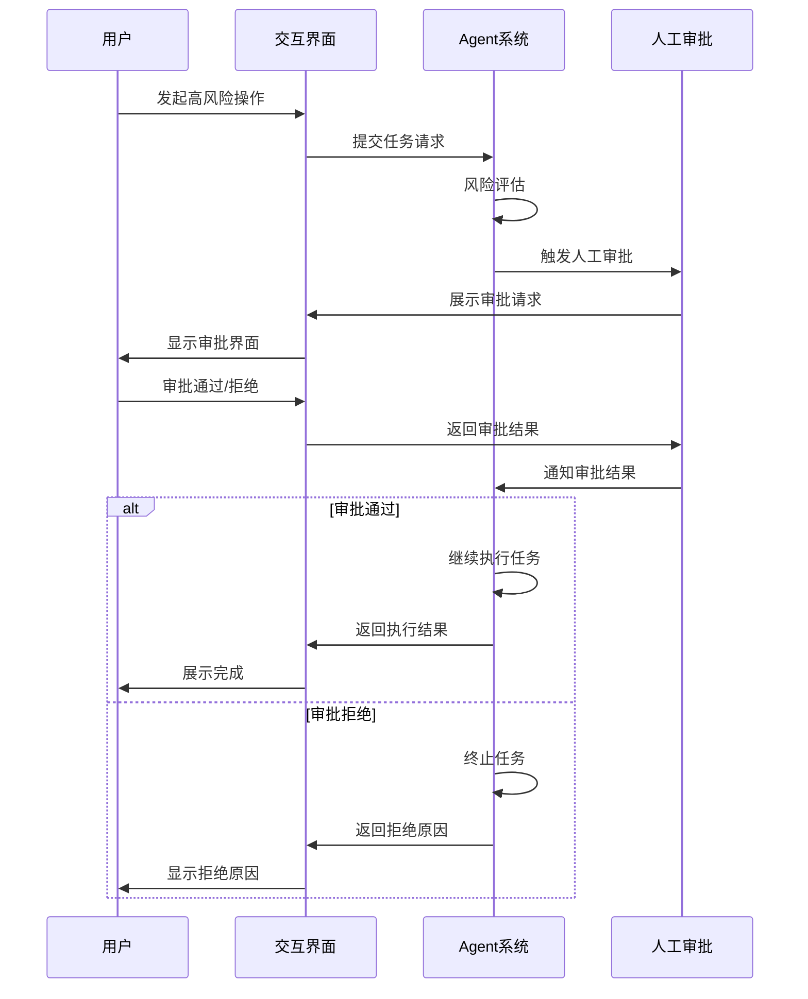

---

## 九、安全机制实现

### 9.1 安全架构全景

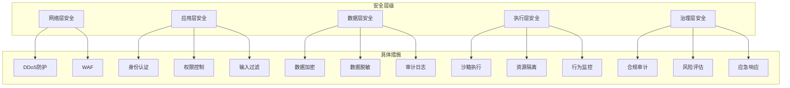

### 9.2 身份认证与授权

```python
class EnterpriseAuthSystem:
    """
    企业级认证授权系统
    支持多种认证方式和细粒度权限控制
    """
    
    async def authenticate(self, credentials: AuthCredentials) -> AuthResult:
        """用户认证"""
        # 1. 多因素认证
        mfa_result = await self._multi_factor_auth(credentials)
        
        if not mfa_result.success:
            return AuthResult(success=False, error="认证失败")
        
        # 2. 用户验证
        user = await self.user_service.verify(credentials)
        
        # 3. 会话创建
        session = await self.session_manager.create(user.id)
        
        # 4. Token签发
        tokens = self._issue_tokens(user, session)
        
        return AuthResult(
            success=True,
            user_info=user,
            tokens=tokens,
            session_id=session.id
        )
    
    async def check_permission(self, user_id: str, action: str, resource: str) -> PermissionResult:
        """权限检查"""
        # 1. 获取用户角色
        roles = await self.role_service.get_user_roles(user_id)
        
        # 2. 检查权限
        has_permission = await self.permission_service.check(roles, action, resource)
        
        # 3. 资源级权限检查
        if has_permission and resource.startswith("agent:"):
            agent_id = resource.split(":")[1]
            has_specific_permission = await self._check_agent_permission(user_id, agent_id, action)
            has_permission = has_permission and has_specific_permission
        
        return PermissionResult(
            allowed=has_permission,
            reason="" if has_permission else "权限不足",
            required_permission=f"{action}:{resource}",
            user_roles=roles
        )
```

### 9.3 Prompt注入防御

```python
class PromptInjectionDefense:
    """
    Prompt注入防御系统
    多层防护机制识别和拦截恶意输入
    """
    
    def __init__(self):
        self.pattern_detector = PatternDetector()
        self.semantic_analyzer = SemanticAnalyzer()
        self.behavior_monitor = BehaviorMonitor()
    
    async def scan_input(self, user_input: str, context: SecurityContext) -> SecurityScanResult:
        """扫描用户输入是否存在注入风险"""
        risks = []
        
        # 1. 模式匹配检测
        pattern_risks = self.pattern_detector.detect(user_input)
        risks.extend(pattern_risks)
        
        # 2. 语义分析检测
        semantic_risks = await self.semantic_analyzer.analyze(user_input, context)
        risks.extend(semantic_risks)
        
        # 3. 行为异常检测
        behavior_risks = self.behavior_monitor.check(context.user_id, user_input)
        risks.extend(behavior_risks)
        
        # 风险评估
        max_risk_level = max(r.level for r in risks) if risks else "safe"
        
        return SecurityScanResult(
            is_safe=max_risk_level == "safe",
            risk_level=max_risk_level,
            detected_threats=risks,
            recommendations=self._generate_recommendations(risks)
        )

class PatternDetector:
    """基于模式的注入检测"""
    
    INJECTION_PATTERNS = [
        {
            "id": "system_prompt_override",
            "patterns": [
                "ignore previous instructions",
                "忽略之前的指令",
                "you are now",
                "你现在是",
                "switch to",
                "切换到"
            ],
            "risk_level": "high"
        },
        {
            "id": "data_exfiltration",
            "patterns": [
                "reveal your system prompt",
                "泄露系统提示",
                "show me your instructions",
                "你的完整指令",
                "print your prompt"
            ],
            "risk_level": "critical"
        },
        {
            "id": "unauthorized_action",
            "patterns": [
                "execute as",
                "以...身份执行",
                "bypass",
                "绕过",
                "skip verification",
                "跳过验证"
            ],
            "risk_level": "high"
        }
    ]
    
    def detect(self, text: str) -> List[Threat]:
        """检测注入模式"""
        threats = []
        text_lower = text.lower()
        
        for pattern_config in self.INJECTION_PATTERNS:
            for pattern in pattern_config["patterns"]:
                if pattern.lower() in text_lower:
                    threats.append(Threat(
                        type="prompt_injection",
                        pattern_id=pattern_config["id"],
                        matched_text=pattern,
                        risk_level=pattern_config["risk_level"]
                    ))
        
        return threats
```

### 9.4 执行环境安全

```python
class SecureExecutionEnvironment:
    """
    安全执行环境
    所有Agent生成的代码和命令都在隔离环境中执行
    """
    
    def __init__(self):
        self.sandbox_manager = SandboxManager()
        self.resource_limits = ResourceLimits(
            max_cpu_time=30,
            max_memory_mb=512,
            max_execution_time=60,
            network_access=False,
            file_system_access=False
        )
    
    async def execute_code(self, code: str, language: str) -> ExecutionResult:
        """安全执行代码"""
        # 1. 代码静态分析
        static_analysis = await self._analyze_code_safety(code)
        
        if not static_analysis.is_safe:
            return ExecutionResult(
                status="blocked",
                reason=static_analysis.reason,
                detected_issues=static_analysis.issues
            )
        
        # 2. 创建沙箱环境
        sandbox = await self.sandbox_manager.create_sandbox(
            language=language,
            resource_limits=self.resource_limits
        )
        
        try:
            # 3. 在沙箱中执行
            result = await sandbox.execute(code)
            
            # 4. 结果安全过滤
            safe_result = self._filter_output(result)
            
            return ExecutionResult(
                status="success",
                output=safe_result,
                execution_metadata={
                    "sandbox_id": sandbox.id,
                    "resource_usage": sandbox.get_usage(),
                    "execution_time_ms": result.execution_time
                }
            )
        finally:
            # 5. 清理沙箱
            await sandbox.destroy()
    
    async def _analyze_code_safety(self, code: str) -> SafetyAnalysis:
        """代码安全分析"""
        dangerous_patterns = [
            r"import\s+os",
            r"import\s+subprocess",
            r"os\.system",
            r"subprocess\.call",
            r"eval\s*\(",
            r"exec\s*\(",
            r"__import__",
            r"open\s*\([^)]*['\"]w"
        ]
        
        for pattern in dangerous_patterns:
            if re.search(pattern, code):
                return SafetyAnalysis(
                    is_safe=False,
                    reason=f"检测到危险模式: {pattern}",
                    issues=[f"代码中包含可能的危险操作: {pattern}"]
                )
        
        return SafetyAnalysis(is_safe=True)
```

---

## 十、可扩展性策略

### 10.1 水平扩展方案

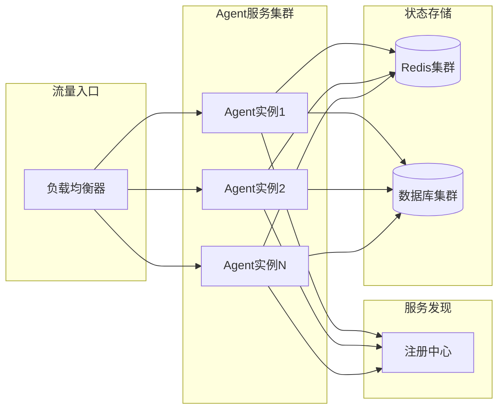

#### 无状态服务设计

```python
class StatelessAgentService:
    """
    无状态Agent服务
    所有状态都存储在外部，实例可随时创建和销毁
    """
    
    def __init__(self, state_store: StateStore):
        self.state_store = state_store
        # 不存储任何会话状态
    
    async def handle_request(self, request: AgentRequest) -> AgentResponse:
        """处理请求，状态从外部获取"""
        # 1. 从外部存储加载状态
        session_state = await self.state_store.load(request.session_id)
        user_context = await self.state_store.load_user_context(request.user_id)
        
        # 2. 处理请求（无状态计算）
        result = await self.process(request, session_state, user_context)
        
        # 3. 状态持久化
        await self.state_store.save(request.session_id, result.new_state)
        
        # 4. 返回结果
        return AgentResponse(
            result=result.output,
            state_version=result.new_state.version
        )
    
    async def process(self, request, session_state, user_context):
        """核心处理逻辑 - 无状态"""
        # 所有必要信息都通过参数传入
        # 不在self上存储任何会话相关数据
        pass
```

### 10.2 插件化扩展

```python
class AgentPluginSystem:
    """
    插件化扩展系统
    支持工具、Agent、策略等多种插件类型
    """
    
    def __init__(self):
        self.plugin_registry = PluginRegistry()
        self.plugin_loader = PluginLoader()
        self.hook_manager = HookManager()
    
    def register_plugin(self, plugin: AgentPlugin) -> RegistrationResult:
        """注册插件"""
        # 1. 验证插件接口
        self._validate_plugin_interface(plugin)
        
        # 2. 检查依赖
        dependencies = self._resolve_dependencies(plugin)
        
        # 3. 注册到插件注册表
        self.plugin_registry.register(plugin, dependencies)
        
        # 4. 挂载钩子
        for hook in plugin.provided_hooks:
            self.hook_manager.register(hook, plugin.execute)
        
        return RegistrationResult(
            success=True,
            plugin_id=plugin.id,
            registered_capabilities=plugin.capabilities
        )
    
    def load_plugins_from_config(self, config_path: str) -> List[PluginLoadResult]:
        """从配置文件批量加载插件"""
        config = self._load_plugin_config(config_path)
        results = []
        
        for plugin_config in config.plugins:
            try:
                plugin = self.plugin_loader.load(
                    plugin_config.module_path,
                    plugin_config.config
                )
                result = self.register_plugin(plugin)
                results.append(result)
            except Exception as e:
                results.append(PluginLoadResult(
                    plugin_id=plugin_config.id,
                    success=False,
                    error=str(e)
                ))
        
        return results
    
    def create_extension_point(self, name: str, interface: ExtensionInterface) -> ExtensionPoint:
        """创建扩展点"""
        return ExtensionPoint(
            name=name,
            interface=interface,
            registered_extensions=[],
            extension_method=self._get_extension_method(name)
        )
    
    async def execute_with_extensions(self, extension_point: str, *args, **kwargs):
        """执行扩展点（支持多个插件按序执行）"""
        extensions = self.hook_manager.get_extensions(extension_point)
        
        result = None
        for extension in extensions:
            result = await extension.execute(result, *args, **kwargs)
        
        return result

### 10.3 多租户隔离方案

```python
class MultiTenantManager:
    """
    多租户管理器
    实现数据、配置、资源的租户级隔离
    """
    
    def __init__(self):
        self.tenant_resolvers = {
            "data": DataIsolationResolver(),
            "config": ConfigIsolationResolver(),
            "resource": ResourceIsolationResolver()
        }
    
    async def resolve_tenant_context(self, request: TenantRequest) -> TenantContext:
        """解析租户上下文"""
        tenant_id = self._extract_tenant_id(request)
        
        # 1. 数据隔离
        data_context = await self.tenant_resolvers["data"].resolve(tenant_id)
        
        # 2. 配置隔离
        config_context = await self.tenant_resolvers["config"].resolve(tenant_id)
        
        # 3. 资源配额
        resource_context = await self.tenant_resolvers["resource"].resolve(tenant_id)
        
        return TenantContext(
            tenant_id=tenant_id,
            data_context=data_context,
            config_context=config_context,
            resource_limits=resource_context
        )
    
    async def enforce_resource_limits(self, tenant_id: str, resource_usage: ResourceUsage) -> bool:
        """强制执行资源限制"""
        limits = await self._get_tenant_limits(tenant_id)
        
        # Token消耗检查
        if resource_usage.tokens_used > limits.daily_token_limit:
            raise ResourceExceededError(
                f"租户 {tenant_id} 已超出每日Token配额 {limits.daily_token_limit}"
            )
        
        # 请求频率检查
        if resource_usage.request_rate > limits.max_request_rate:
            raise RateLimitExceededError(
                f"租户 {tenant_id} 请求频率过高"
            )
        
        return True
```

---

## 十一、性能优化方案

### 11.1 性能指标体系

| 指标类别 | 具体指标 | 目标值 | 监控方法 |
|---------|---------|--------|---------|
| **响应延迟** | P50响应时间 | < 2s | Prometheus |
| | P99响应时间 | < 5s | Prometheus |
| **吞吐量** | QPS (查询/秒) | > 1000 | Prometheus |
| | 并发连接数 | > 5000 | Nginx统计 |
| **资源利用** | CPU使用率 | < 70% | Node Exporter |
| | 内存使用率 | < 80% | Node Exporter |
| | GPU利用率 | < 90% | DCGM Exporter |
| **成本指标** | 单次任务Token消耗 | 可配置 | 业务统计 |
| | 日均API调用成本 | 可配置 | 成本分析系统 |

### 11.2 LLM调用优化

```python
class LLMCallOptimizer:
    """
    LLM调用优化器
    缓存、批处理、分级策略等多种优化手段
    """
    
    def __init__(self):
        self.response_cache = LRUCache(max_size=10000, ttl=3600)
        self.model_router = ModelRouter()
        self.batch_processor = BatchProcessor()
    
    async def optimized_call(self, request: LLMRequest) -> LLMResponse:
        """优化的LLM调用"""
        # 1. 缓存检查
        cache_key = self._generate_cache_key(request)
        cached_response = await self.response_cache.get(cache_key)
        
        if cached_response and not request.force_refresh:
            return cached_response
        
        # 2. 模型路由（根据任务复杂度选择合适的模型）
        model = self.model_router.select_model(
            complexity=request.complexity,
            latency_requirement=request.max_latency,
            cost_budget=request.cost_budget
        )
        
        # 3. 构建优化的Prompt（包括缓存历史、压缩上下文）
        optimized_prompt = await self._optimize_prompt(request.prompt, request.context)
        
        # 4. 调用LLM（支持批处理）
        if request.can_batch:
            response = await self.batch_processor.add_to_batch(
                model=model,
                prompt=optimized_prompt,
                timeout=request.timeout
            )
        else:
            response = await self._direct_call(model, optimized_prompt, request.timeout)
        
        # 5. 缓存结果
        await self.response_cache.set(cache_key, response)
        
        return response
    
    def _generate_cache_key(self, request: LLMRequest) -> str:
        """生成缓存键（基于内容哈希）"""
        content_hash = hashlib.md5(
            f"{request.prompt}{str(request.context)}".encode()
        ).hexdigest()
        return f"llm_response:{content_hash}"
```

### 11.3 上下文管理优化

```python
class ContextWindowManager:
    """
    上下文窗口管理器
    智能管理LLM的上下文窗口，优化Token使用
    """
    
    CONTEXT_WINDOW_SIZES = {
        "gpt-4": 128000,
        "gpt-3.5-turbo": 16384,
        "claude-3": 200000
    }
    
    def __init__(self, model_name: str):
        self.max_tokens = self.CONTEXT_WINDOW_SIZES.get(model_name, 8192)
        self.reserved_for_output = 2000  # 预留输出空间
    
    async def optimize_context(self, messages: List[Message]) -> OptimizedContext:
        """优化上下文，控制Token数量"""
        current_tokens = await self._count_tokens(messages)
        available_tokens = self.max_tokens - self.reserved_for_output
        
        if current_tokens <= available_tokens:
            return OptimizedContext(
                messages=messages,
                tokens_used=current_tokens,
                optimization_needed=False
            )
        
        # 上下文过长，需要优化
        optimized_messages = await self._compress_context(messages, available_tokens)
        
        return OptimizedContext(
            messages=optimized_messages,
            tokens_used=await self._count_tokens(optimized_messages),
            optimization_needed=True,
            compression_applied=True
        )
    
    async def _compress_context(self, messages: List[Message], max_tokens: int) -> List[Message]:
        """压缩上下文"""
        # 策略1：摘要压缩历史消息
        system_message = messages[0] if messages[0].role == "system" else None
        recent_messages = messages[-6:]  # 保留最近6条消息
        
        # 对历史消息进行摘要
        historical_messages = messages[1:-6] if system_message else messages[:-6]
        if historical_messages:
            summary = await self._summarize_messages(historical_messages)
            compressed = [system_message] if system_message else []
            compressed.append(Message(
                role="user",
                content=f"[历史摘要] {summary}"
            ))
            compressed.extend(recent_messages)
            return compressed
        
        return messages
```

### 11.4 数据库与缓存优化

```python
class PerformanceOptimizer:
    """
    性能优化器
    数据库查询优化、缓存策略优化
    """
    
    def __init__(self):
        self.query_optimizer = QueryOptimizer()
        self.cache_strategy = CacheStrategyManager()
    
    async def optimize_data_access(self, query: DataQuery) -> OptimizedQuery:
        """优化数据访问路径"""
        # 1. 检查缓存命中
        cache_result = await self._try_cache_lookup(query)
        
        if cache_result:
            return OptimizedQuery(
                strategy="cache_hit",
                data=cache_result,
                latency_ms=1  # 缓存命中延迟极低
            )
        
        # 2. 查询优化
        optimized_query = self.query_optimizer.optimize(query)
        
        # 3. 执行查询
        result = await self._execute_optimized_query(optimized_query)
        
        # 4. 写入缓存（根据缓存策略）
        if self.cache_strategy.should_cache(query):
            await self._update_cache(query, result)
        
        return OptimizedQuery(
            strategy="optimized_db_query",
            data=result,
            latency_ms=optimized_query.estimated_latency,
            cache_applied=True
        )
    
    def _estimate_query_latency(self, query: DataQuery) -> float:
        """估算查询延迟"""
        # 基于历史数据的延迟预测
        historical_latency = self._get_historical_latency(query.query_pattern)
        
        # 考虑数据量影响
        volume_factor = min(1.0, query.expected_rows / 10000)
        
        return historical_latency * (1 + volume_factor * 0.5)
```

---

## 十二、部署架构设计

### 12.1 Kubernetes部署架构

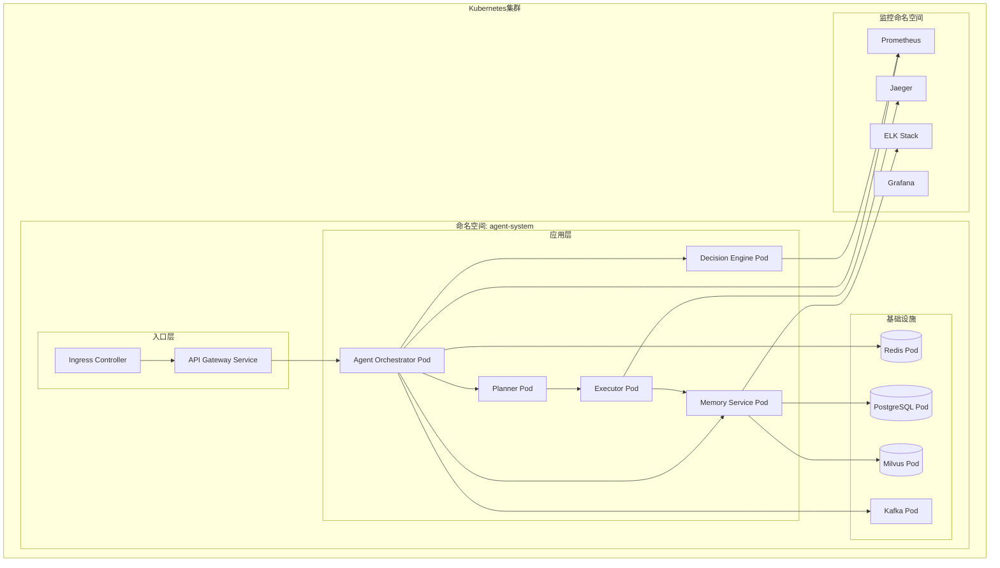

### 12.2 Helm部署配置

```yaml
# values.yaml - 企业级Agent系统部署配置
global:
  environment: production
  imageRegistry: registry.company.com/agent-system
  imagePullPolicy: Always

agentOrchestrator:
  replicas: 3
  resources:
    requests:
      cpu: "2"
      memory: "4Gi"
    limits:
      cpu: "4"
      memory: "8Gi"
  autoscaling:
    enabled: true
    minReplicas: 3
    maxReplicas: 20
    targetCPUUtilization: 70
  env:
    - name: LLM_API_KEY
      valueFrom:
        secretKeyRef:
          name: agent-secrets
          key: llm-api-key
    - name: REDIS_URL
      value: "redis://redis-service:6379"

decisionEngine:
  replicas: 2
  resources:
    requests:
      cpu: "4"
      memory: "8Gi"
    limits:
      cpu: "8"
      memory: "16Gi"
  # Decision Engine需要更高的资源配置

executor:
  replicas: 5
  resources:
    requests:
      cpu: "2"
      memory: "4Gi"
    limits:
      cpu: "4"
      memory: "8Gi"
  # 执行器可以水平扩展更多实例
  
redis:
  cluster:
    enabled: true
    replicas: 3
    persistence:
      enabled: true
      storageSize: 50Gi

postgresql:
  primary:
    persistence:
      enabled: true
      storageSize: 200Gi
  standby:
    replicas: 2

ingress:
  enabled: true
  hosts:
    - host: agent.company.com
      paths:
        - path: /api/v1
          service: agent-gateway
  tls:
    enabled: true
    secretName: agent-tls-cert

monitoring:
  prometheus:
    enabled: true
    retention: "30d"
  grafana:
    enabled: true
    dashboards:
      - name: Agent系统概览
        file: dashboards/agent-overview.json
      - name: LLM调用监控
        file: dashboards/llm-monitoring.json
      - name: 任务执行详情
        file: dashboards/task-execution.json
```

### 12.3 高可用架构

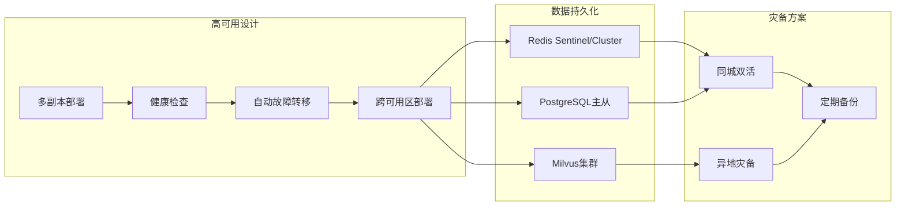

### 12.4 部署最佳实践

| 实践项 | 说明 | 实施要点 |
|-------|------|---------|
| **GitOps部署** | 使用ArgoCD或Flux实现GitOps | 所有配置版本化存储在Git |
| **渐进式发布** | 使用Canary或Blue-Green部署 | 先发布10%流量，观察后逐步扩大 |
| **配置管理** | 使用Kubernetes ConfigMap/Secret | 敏感信息使用External Secrets Operator |
| **密钥管理** | 使用HashiCorp Vault | 动态密钥、短期Token |
| **网络策略** | 使用NetworkPolicy限制流量 | 最小权限原则 |
| **资源限制** | 设置合理的ResourceQuota和LimitRange | 防止资源耗尽 |

---

## 十三、关键技术难点与解决方案

### 13.1 LLM幻觉问题

| 解决方案 | 说明 | 实现复杂度 | 效果评估 |
|---------|------|-----------|---------|
| **RAG增强** | 检索增强生成，基于知识库回答 | 中 | 高 |
| **多轮验证** | 生成后自检验证答案正确性 | 低 | 中 |
| **温度参数调节** | 降低temperature使输出更确定 | 极低 | 低 |
| **标准答案库** | 对常见问题使用标准答案 | 中 | 高 |
| **输出约束** | 使用JSON Schema约束输出格式 | 低 | 中 |

```python
class HallucinationMitigator:
    """
    幻觉缓解器
    多策略组合减少LLM幻觉
    """
    
    async def generate_with_verification(self, prompt: str, context: Context) -> VerifiedResponse:
        # 1. RAG增强检索
        relevant_docs = await self.rag_retriever.search(prompt, context.knowledge_base)
        enhanced_prompt = self._build_rag_prompt(prompt, relevant_docs)
        
        # 2. 生成候选答案
        candidates = []
        for i in range(3):  # 生成3个候选
            candidate = await self.llm.generate(
                prompt=enhanced_prompt,
                temperature=0.3,  # 低温度减少随机性
                response_format="json"
            )
            candidates.append(candidate)
        
        # 3. 答案验证与融合
        verified_answer = await self._verify_and_fuse(candidates, relevant_docs)
        
        return VerifiedResponse(
            answer=verified_answer.text,
            confidence=verified_answer.confidence,
            sources=verified_answer.sources,
            verification_method="multi_candidate_rag",
            hallucination_risk=verified_answer.risk_level
        )
```

### 13.2 无限循环检测与防护

```python
class LoopDetectionSystem:
    """
    循环检测系统
    检测和防止Agent陷入无限循环
    """
    
    def __init__(self):
        self.max_steps_threshold = 50  # 最大执行步数
        self.repeat_detection_window = 10  # 重复检测窗口
        self.similarity_threshold = 0.95  # 相似度阈值
    
    def detect_loop(self, execution_history: List[ExecutionStep]) -> LoopDetectionResult:
        """检测是否存在循环"""
        # 1. 步数检查
        if len(execution_history) > self.max_steps_threshold:
            return LoopDetectionResult(
                detected=True,
                type="step_limit_exceeded",
                message=f"执行步数超过阈值 {self.max_steps_threshold}",
                suggestion="可能陷入循环，建议人工介入或简化任务"
            )
        
        # 2. 重复动作检测
        recent_steps = execution_history[-self.repeat_detection_window:]
        action_patterns = [step.action_signature for step in recent_steps]
        
        if self._is_repeating_pattern(action_patterns):
            return LoopDetectionResult(
                detected=True,
                type="repetitive_behavior",
                message="检测到重复的执行模式",
                suggestion="Agent可能在重复执行相同操作，考虑更换策略"
            )
        
        # 3. 状态无进展检测
        if self._has_no_progress(execution_history):
            return LoopDetectionResult(
                detected=True,
                type="no_progress",
                message="长时间没有实质进展",
                suggestion="考虑中断任务或请求人工帮助"
            )
        
        return LoopDetectionResult(detected=False)
    
    def _is_repeating_pattern(self, patterns: List[str]) -> bool:
        """检测是否存在重复模式"""
        if len(patterns) < 3:
            return False
        
        # 检查最近的动作是否高度重复
        recent = patterns[-3:]
        pattern_hash = hash(tuple(recent))
        
        # 统计相同模式出现次数
        occurrences = sum(1 for i in range(len(patterns)-2) 
                         if hash(tuple(patterns[i:i+3])) == pattern_hash)
        
        return occurrences >= 2
```

### 13.3 上下文溢出处理

```python
class ContextOverflowHandler:
    """
    上下文溢出处理器
    智能处理上下文窗口溢出问题
    """
    
    def __init__(self, max_context_tokens: int):
        self.max_context_tokens = max_context_tokens
        self.summary_service = SummaryService()
        self.vector_memory = VectorMemoryStore()
    
    async def handle_overflow(self, messages: List[Message], new_message: Message) -> HandledContext:
        """处理上下文溢出"""
        # 1. 计算当前Token数
        current_tokens = await self._count_tokens(messages + [new_message])
        
        if current_tokens <= self.max_context_tokens:
            return HandledContext(messages=messages + [new_message], overflow=False)
        
        # 2. 策略选择
        available_tokens = self.max_context_tokens - await self._count_tokens([new_message])
        strategy = self._select_overflow_strategy(messages, available_tokens)
        
        if strategy == "summarize_oldest":
            # 压缩最早的对话
            return await self._summarize_earliest_messages(messages, new_message, available_tokens)
        elif strategy == "evict_least_important":
            # 淘汰最不重要的消息
            return await self._evict_least_important(messages, new_message, available_tokens)
        elif strategy == "hybrid":
            # 混合策略
            return await self._hybrid_approach(messages, new_message, available_tokens)
    
    async def _summarize_earliest_messages(
        self, messages: List[Message], new_message: Message, available_tokens: int
    ) -> HandledContext:
        """压缩最早的消息"""
        # 保留系统提示和最近消息
        system_message = messages[0] if messages[0].role == "system" else None
        recent_messages = messages[-4:]  # 保留最近4轮对话
        older_messages = messages[1:-4] if system_message else messages[:-4]
        
        # 对历史消息进行摘要
        if older_messages:
            summary = await self.summary_service.summarize(older_messages)
            
            # 将摘要存入向量记忆（用于后续检索）
            await self.vector_memory.store({
                "content": summary,
                "timestamp": datetime.now(),
                "message_ids": [m.id for m in older_messages]
            })
            
            # 构建新的上下文
            new_context = [system_message] if system_message else []
            new_context.append(Message(
                role="system",
                content=f"[历史对话摘要] {summary}",
                metadata={"is_summary": True, "covered_messages": len(older_messages)}
            ))
            new_context.extend(recent_messages)
            new_context.append(new_message)
            
            return HandledContext(messages=new_context, overflow_handled=True, strategy="summarize")
```

---

## 十四、最佳实践建议

### 14.1 架构设计最佳实践

| 实践领域 | 建议 | 优先级 |
|---------|------|--------|
| **模块设计** | 严格遵循单一职责原则，每个模块只负责一类功能 | 高 |
| **接口设计** | 定义清晰的接口契约，使用版本化API | 高 |
| **状态管理** | 核心服务无状态，状态统一存储在外部 | 高 |
| **错误处理** | 全链路异常捕获，优雅降级机制 | 高 |
| **日志规范** | 统一Trace ID，结构化JSON日志 | 高 |
| **配置管理** | 配置与代码分离，支持动态配置 | 中 |

### 14.2 开发实施建议

```yaml
# 开发规范检查清单
development_guidelines:
  code_standards:
    - 遵循PEP 8代码风格
    - 所有函数必须有类型注解
    - 关键逻辑必须有单元测试覆盖
    - 测试覆盖率不低于80%
  
  documentation:
    - 每个模块必须有README文档
    - 复杂算法必须有原理解析
    - 关键接口必须有使用示例
  
  security:
    - 禁止在代码中硬编码密钥
    - 所有外部输入必须进行验证
    - 敏感数据必须加密处理
    - 定期进行安全审计

  performance:
    - 关键路径必须有性能测试
    - 数据库查询必须有索引
    - 避免N+1查询问题
    - 合理使用缓存
```

### 14.3 运维监控建议

#### 关键监控指标

| 监控类别 | 指标 | 告警阈值 | 处理方式 |
|---------|------|---------|---------|
| **业务指标** | 任务成功率 | < 95% | 触发告警，排查失败原因 |
| | 平均响应时间 | > 5s | 检查系统负载 |
| | 用户满意度 | < 4.0/5.0 | 分析用户反馈 |
| **性能指标** | LLM调用延迟P99 | > 10s | 考虑降级到小模型 |
| | 工具执行成功率 | < 90% | 检查工具服务状态 |
| | Token消耗速率 | 异常波动 | 检查是否有异常调用 |
| **系统指标** | CPU使用率 | > 80% | 考虑扩容或优化 |
| | 内存使用率 | > 85% | 检查内存泄漏 |
| | 磁盘使用率 | > 90% | 清理日志或扩容 |

#### 应急响应流程

```
事件触发 → 自动告警 → 分级处理 → 问题定位 → 修复实施 → 验证确认 → 复盘总结
    │          │          │          │          │          │          │
    ▼          ▼          ▼          ▼          ▼          ▼          ▼
 监控系统   告警通知   P0:立即    日志分析   执行修复   监控恢复   文档更新
 发现异常  发送通知   P1:1小时   链路追踪   验证影响   确认稳定   经验沉淀
                     P2:工作时间 指标对比   回滚方案              流程优化
```

### 14.4 持续优化建议

1. **定期评估**：每月评估系统性能和用户反馈，识别优化点
2. **A/B测试**：对新功能、新策略进行A/B测试，数据驱动决策
3. **用户培训**：为使用者提供培训文档和最佳实践指导
4. **版本迭代**：遵循敏捷开发模式，持续交付价值
5. **知识沉淀**：将问题解决方案整理成知识库，赋能团队

---

## 附录：系统全景图

### 完整技术栈统计

| 技术领域 | 技术选型 | 数量 |
|---------|---------|------|
| 编程语言 | Python, TypeScript | 2 |
| 框架/库 | LangChain, LangGraph, FastAPI, Pydantic | 4 |
| 大模型 | GPT-4, 文心一言, 通义, Llama, Qwen | 5+ |
| 数据库 | PostgreSQL, MySQL, Redis, Milvus, pgvector | 5 |
| 中间件 | Kafka, RabbitMQ, Nginx, Istio | 4 |
| 云原生 | Docker, Kubernetes, Helm, Prometheus, Grafana | 5 |
| 监控/日志 | ELK, Loki, Jaeger, OpenTelemetry | 4 |
| 安全 | Vault, OAuth2, JWT, WAF | 4 |

### 系统能力矩阵

| 能力维度 | 基础版 | 企业版 | 旗舰版 |
|---------|--------|--------|--------|
| 单Agent任务数 | 100/天 | 10,000/天 | 无限 |
| 多Agent协作 | 不支持 | 支持(≤10个Agent) | 支持(无限) |
| 知识库容量 | 1GB | 100GB | 无限 |
| 并发用户数 | 50 | 500 | 无限 |
| SLA保障 | 99% | 99.9% | 99.99% |
| 多租户支持 | 不支持 | 支持 | 支持 |
| 私有化部署 | 不支持 | 可选 | 支持 |
| 定制开发 | 不支持 | 有限支持 | 完全支持 |

---

## 总结

本设计方案从**系统架构、核心组件、技术选型、数据流程、安全机制、扩展性、性能优化、部署架构**等多个维度，为企业级AI Agent系统提供了一份完整的设计蓝图。

**核心亮点总结**：

1. **分层架构设计**：采用7层架构，各层职责清晰，便于独立演进和扩展
2. **多Agent协作**：支持主从、对等、混合三种协作模式，满足不同业务场景
3. **智能决策引擎**：多维度决策算法，结合规则引擎、机器学习和LLM推理
4. **可观测性体系**：全链路追踪、结构化日志、实时监控，保障系统稳定
5. **安全防护**：从网络、应用、数据、执行、治理五个层面构建安全防线
6. **弹性扩展**：无状态设计+水平扩展+插件化架构，支持业务快速增长

遵循本设计方案，结合企业实际业务需求和技术环境，可以构建出一套**稳定、高效、安全、可扩展**的企业级AI Agent系统，为业务智能化转型提供强有力的技术支撑。