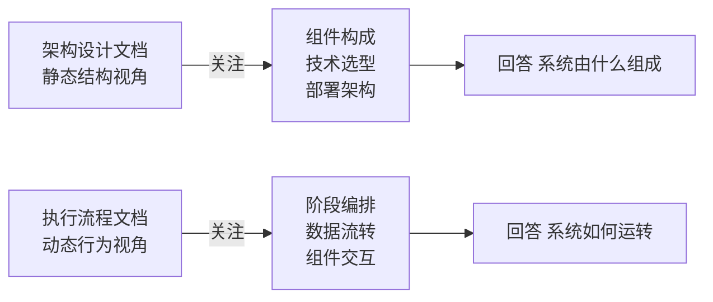
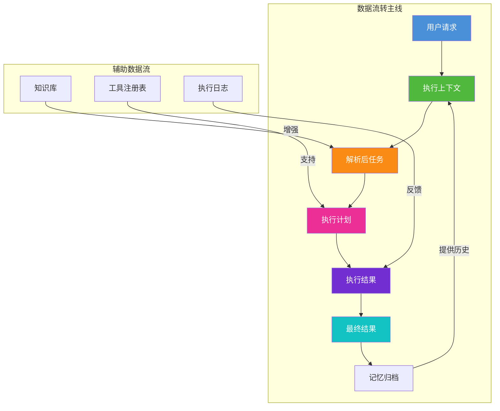
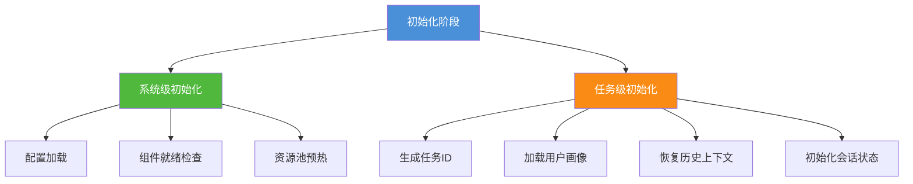
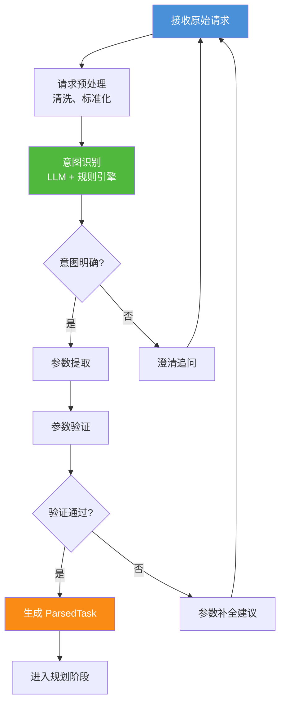
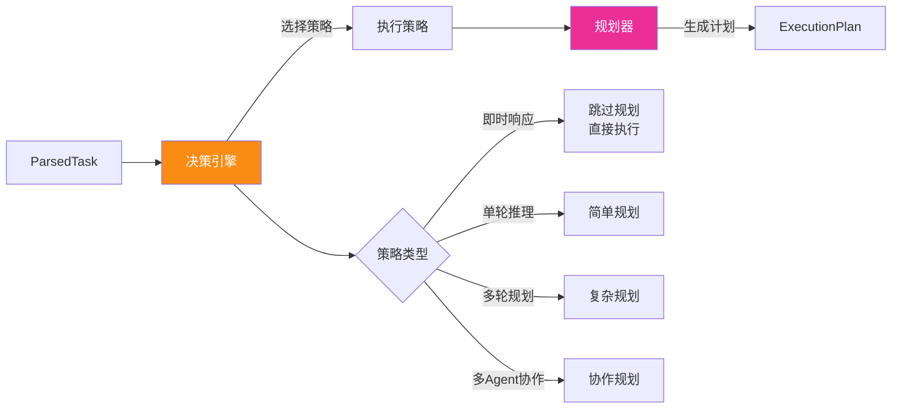
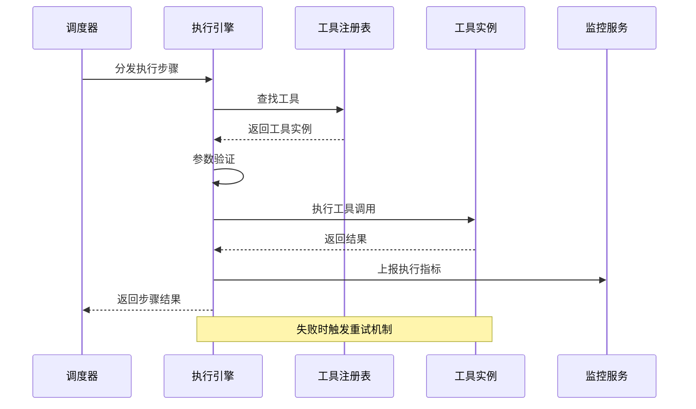
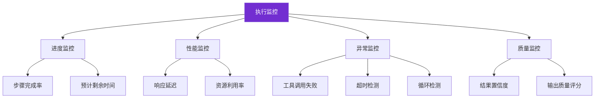
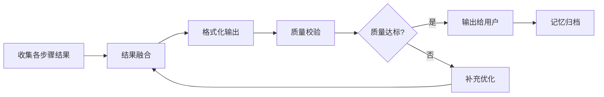
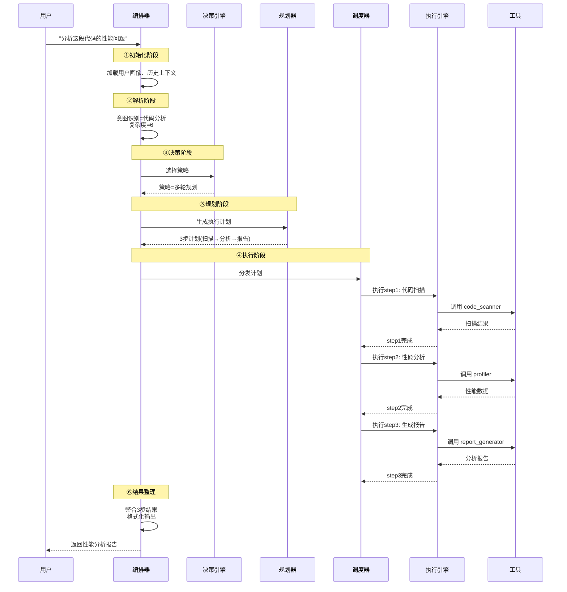

# Agent 执行流程详解

> **文档说明**：本文档详细阐述 Agent 执行流程的关键阶段、核心组件交互方式及数据流转路径。内容涵盖初始化阶段、任务接收与解析、规划与决策过程、工具调用机制、执行监控与反馈、结果整理与输出等完整环节，并结合 [1企业级Agent系统完整设计方案.md](file:///m:/note-book/agent/3Agent%20架构设计/1企业级Agent系统完整设计方案.md) 说明各阶段的具体实现方式、技术选型依据及可能的优化策略。

## 目录

- [一、引言](#一引言)
- [二、Agent 执行流程总览](#二agent-执行流程总览)
- [三、初始化阶段](#三初始化阶段)
- [四、任务接收与解析阶段](#四任务接收与解析阶段)
- [五、规划与决策过程](#五规划与决策过程)
- [六、工具调用机制](#六工具调用机制)
- [七、执行监控与反馈](#七执行监控与反馈)
- [八、结果整理与输出](#八结果整理与输出)
- [九、完整执行流程案例](#九完整执行流程案例)
- [十、技术选型依据汇总](#十技术选型依据汇总)
- [十一、优化策略](#十一优化策略)
- [十二、总结](#十二总结)

---

## 一、引言

### 1.1 文档定位

Agent 的执行流程是整个系统运作的核心脉络。一个设计良好的执行流程决定了 Agent 能否**准确理解用户意图、高效规划任务、可靠执行操作、合理反馈结果**。本文档聚焦于 Agent 执行流程的全生命周期剖析，从初始化到结果输出，逐阶段拆解关键机制。

### 1.2 与架构设计文档的关系

本文档是 [1企业级Agent系统完整设计方案.md](file:///m:/note-book/agent/3Agent%20架构设计/1企业级Agent系统完整设计方案.md) 的深度补充。架构设计文档侧重于**系统静态结构**（组件构成、技术选型、部署架构），而本文档侧重于**系统动态行为**（组件如何协作、数据如何流转、流程如何编排）。



---

## 二、Agent 执行流程总览

### 2.1 六大关键阶段

Agent 的完整执行流程可划分为六个核心阶段，每个阶段承担明确的职责：


### 2.2 各阶段职责概览

| 阶段 | 核心职责 | 主要组件 | 输入 | 输出 |
|------|---------|---------|------|------|
| **① 初始化** | 系统启动、资源加载、上下文准备 | 配置中心、记忆服务 | 启动配置 | ExecutionContext |
| **② 任务接收与解析** | 接收请求、意图识别、参数提取 | API网关、编排器 | 用户请求 | ParsedTask |
| **③ 规划与决策** | 策略选择、任务分解、计划生成 | 决策引擎、规划器 | ParsedTask | ExecutionPlan |
| **④ 工具调用执行** | 按计划执行、调用工具 | 调度器、执行引擎 | ExecutionPlan | ExecutionResult |
| **⑤ 执行监控与反馈** | 进度追踪、异常处理、动态调整 | 监控服务、调度器 | 执行状态 | 监控指标、调整指令 |
| **⑥ 结果整理与输出** | 结果整合、格式化、记忆归档 | 编排器、记忆服务 | ExecutionResult | FinalResult |

### 2.3 端到端数据流转图



---

## 三、初始化阶段

### 3.1 阶段目标

初始化阶段是 Agent 执行流程的起点，目标是**为任务执行准备好一切必要的运行环境和上下文信息**。该阶段虽然不直接产生业务结果，但直接影响后续所有阶段的执行质量。

### 3.2 初始化内容详解



#### 3.2.1 系统级初始化

系统级初始化在服务启动时完成，属于一次性操作：

| 初始化项 | 说明 | 技术实现 |
|---------|------|---------|
| **配置加载** | 从配置中心加载运行参数 | Nacos / Apollo 动态配置 |
| **组件就绪检查** | 验证所有依赖组件可用 | 健康检查接口 + 超时重试 |
| **资源池预热** | 预创建数据库连接、缓存连接 | 连接池技术 |
| **模型加载** | 预加载常用 LLM 模型 | 模型缓存 + 懒加载策略 |

#### 3.2.2 任务级初始化

每次任务执行前的上下文准备，对应架构设计文档中编排器的 `_init_context` 方法：

```python
class InitializationPhase:
    """
    初始化阶段实现
    对应架构设计文档中 AgentOrchestrator._init_context()
    """
    
    async def initialize(self, request: TaskRequest) -> ExecutionContext:
        """完整的初始化流程"""
        context = ExecutionContext()
        
        # Step 1: 生成唯一任务标识
        context.task_id = self._generate_task_id()
        context.trace_id = self._generate_trace_id()  # 链路追踪ID
        
        # Step 2: 加载用户画像
        context.user_profile = await self.memory.get_user_profile(
            request.user_id
        )
        
        # Step 3: 恢复历史上下文
        context.history = await self.memory.get_recent_context(
            request.user_id,
            limit=10  # 最近10轮对话
        )
        
        # Step 4: 初始化会话状态
        context.session_state = SessionState(
            started_at=datetime.now(),
            priority=request.priority,
            deadline=request.deadline,
            metadata=request.metadata
        )
        
        # Step 5: 预加载可能需要的资源
        await self._preload_resources(context)
        
        return context
    
    async def _preload_resources(self, context: ExecutionContext):
        """预加载资源（基于用户历史行为预测）"""
        # 根据用户历史，预测可能需要的工具
        predicted_tools = await self._predict_needed_tools(context)
        context.preloaded_tools = predicted_tools
        
        # 预加载相关知识
        if context.user_profile.frequent_topics:
            context.preloaded_knowledge = await self.knowledge_base.search(
                context.user_profile.frequent_topics,
                top_k=5
            )
```

### 3.3 上下文数据结构

执行上下文是贯穿整个流程的核心数据载体：

```json
{
  "task_id": "task_20260807_001",
  "trace_id": "trace_abc123",
  "user_profile": {
    "user_id": "user_001",
    "preferences": {"language": "zh-CN", "response_style": "detailed"},
    "frequent_topics": ["技术架构", "代码优化"],
    "skill_level": "advanced"
  },
  "history": [
    {"role": "user", "content": "上次问的架构设计问题", "timestamp": "..."},
    {"role": "assistant", "content": "上次回答的内容", "timestamp": "..."}
  ],
  "session_state": {
    "started_at": "2026-08-07T10:00:00Z",
    "priority": "normal",
    "deadline": "2026-08-07T10:05:00Z",
    "retry_count": 0
  },
  "preloaded_tools": ["code_analyzer", "search_engine"],
  "preloaded_knowledge": [...]
}
```

### 3.4 优化策略

| 优化点 | 策略 | 预期收益 |
|-------|------|---------|
| **历史上下文加载** | 增量加载 + LRU缓存 | 减少 60% DB查询 |
| **用户画像缓存** | Redis缓存 + 定期刷新 | 响应时间 < 5ms |
| **资源预加载** | 基于用户行为预测 | 减少 40% 工具加载延迟 |
| **配置热更新** | 配置中心监听 + 动态生效 | 无需重启服务 |

---

## 四、任务接收与解析阶段

### 4.1 阶段目标

将用户的原始请求转化为 Agent 可理解的结构化任务描述，核心是**意图识别**和**参数提取**。

### 4.2 解析流程详解



### 4.3 意图识别实现

意图识别是解析阶段的核心，采用**规则 + LLM**混合策略：

```python
class IntentRecognizer:
    """
    意图识别器
    结合规则匹配和LLM推理
    """
    
    async def recognize(self, raw_input: str, context: ExecutionContext) -> Intent:
        # 1. 规则匹配（快速路径）
        rule_intent = self._rule_based_match(raw_input)
        if rule_intent and rule_intent.confidence > 0.9:
            return rule_intent
        
        # 2. LLM 推理（精确路径）
        llm_intent = await self._llm_based_recognize(raw_input, context)
        
        # 3. 融合结果
        final_intent = self._merge_intents(rule_intent, llm_intent)
        
        # 4. 上下文消歧
        if final_intent.confidence < 0.7:
            final_intent = await self._disambiguate_with_context(
                final_intent, context
            )
        
        return final_intent
    
    async def _llm_based_recognize(self, input: str, context: ExecutionContext) -> Intent:
        """基于LLM的意图识别"""
        prompt = self._build_intent_prompt(input, context)
        response = await self.llm.generate(prompt)
        return self._parse_intent_response(response)
```

### 4.4 解析后任务结构

```python
@dataclass
class ParsedTask:
    """解析后的任务表示"""
    task_id: str
    intent: str               # 用户意图：analyze, generate, search...
    goal: str                 # 任务目标描述
    parameters: Dict          # 提取的参数
    constraints: List[str]   # 约束条件
    expected_output: str      # 期望输出类型
    priority: Priority        # 任务优先级
    estimated_complexity: int # 预估复杂度 1-10
```

---

## 五、规划与决策过程

### 5.1 阶段目标

根据解析后的任务，选择最优执行策略并生成详细的执行计划。这是 Agent 智能性的核心体现。

### 5.2 决策与规划的关系



### 5.3 决策引擎详解

决策引擎根据架构设计文档中的五类策略进行选择：

| 策略 | 触发条件 | 规划深度 | 典型场景 |
|------|---------|---------|---------|
| **即时响应** | 复杂度 ≤ 3 | 无需规划 | 简单查询、格式转换 |
| **单轮推理** | 复杂度 3-5 | 单步计划 | 文本生成、代码解释 |
| **多轮规划** | 复杂度 > 5 | 多步DAG | 复杂分析、多步骤任务 |
| **多Agent协作** | 跨领域任务 | 协作计划 | 综合报告、大型项目 |
| **人工介入** | 风险 > 阈值 | 确认后规划 | 高危操作、不确定任务 |

### 5.4 规划器实现

规划器将目标分解为可执行的步骤序列，对应架构设计文档中的 `AdaptivePlanner`：

```python
class PlanningPhase:
    """规划阶段实现"""
    
    async def create_plan(self, task: ParsedTask, strategy: str) -> ExecutionPlan:
        if strategy == "SINGLE_SHOT":
            return await self._simple_plan(task)
        elif strategy == "HIERARCHICAL":
            return await self._hierarchical_plan(task)
    
    async def _hierarchical_plan(self, task: ParsedTask) -> ExecutionPlan:
        # 1. 目标分解
        sub_goals = await self._decompose_goal(task.goal)
        
        # 2. 识别依赖关系
        dependencies = self._analyze_dependencies(sub_goals)
        
        # 3. 构建执行DAG
        steps = self._build_execution_dag(sub_goals, dependencies)
        
        # 4. 资源估算
        for step in steps:
            step.estimated_duration = await self._estimate_step_duration(step)
        
        return ExecutionPlan(
            plan_id=self._generate_plan_id(),
            steps=steps,
            strategy="hierarchical"
        )
```

### 5.5 执行计划示例

```json
{
  "plan_id": "plan_001",
  "goal": "分析项目代码质量并生成报告",
  "steps": [
    {
      "id": "step_1",
      "description": "扫描代码结构",
      "tool": "code_scanner",
      "dependencies": [],
      "status": "pending"
    },
    {
      "id": "step_2", 
      "description": "运行静态分析",
      "tool": "static_analyzer",
      "dependencies": ["step_1"],
      "status": "pending"
    },
    {
      "id": "step_3",
      "description": "生成质量报告",
      "tool": "report_generator",
      "dependencies": ["step_2"],
      "status": "pending"
    }
  ]
}
```

---

## 六、工具调用机制

### 6.1 阶段目标

按照执行计划，调用合适的工具完成各步骤的具体操作。这是 Agent 从"思考"到"行动"的转换环节。

### 6.2 工具调用流程



### 6.3 工具调用核心实现

```python
class ToolInvocationPhase:
    """工具调用阶段实现"""
    
    async def execute_step(self, step: PlanStep) -> StepResult:
        # 1. 查找工具
        tool = await self.tool_registry.resolve(step.tool_name)
        
        # 2. 参数验证与转换
        params = self._validate_and_transform(
            step.params, 
            tool.parameters_schema
        )
        
        # 3. 执行（带超时和重试）
        result = await self._execute_with_retry(
            tool.execute,
            params=params,
            timeout=step.timeout_ms,
            max_retries=3
        )
        
        # 4. 结果验证
        validated = self._validate_result(result, tool.output_schema)
        
        return StepResult(
            step_id=step.id,
            status="success",
            data=validated,
            execution_time_ms=result.latency_ms
        )
    
    async def _execute_with_retry(self, func, **kwargs):
        """带重试机制的执行"""
        for attempt in range(kwargs.get('max_retries', 3)):
            try:
                return await asyncio.wait_for(
                    func(**kwargs['params']),
                    timeout=kwargs['timeout'] / 1000
                )
            except (TimeoutError, ToolError) as e:
                if attempt == kwargs['max_retries'] - 1:
                    raise
                await asyncio.sleep(2 ** attempt)  # 指数退避
```

### 6.4 工具类型与调用方式

| 工具类型 | 调用方式 | 超时设置 | 重试策略 | 示例 |
|---------|---------|---------|---------|------|
| **本地工具** | 同步函数调用 | 5-30s | 不重试 | 文件读取、计算 |
| **API工具** | HTTP请求 | 10-60s | 指数退避3次 | 搜索、翻译 |
| **LLM工具** | 模型推理 | 30-120s | 不重试 | 文本生成、推理 |
| **数据库工具** | SQL查询 | 5-10s | 快速重试1次 | 数据查询、写入 |

### 6.5 优化策略

| 优化方向 | 具体策略 | 效果 |
|---------|---------|------|
| **并行调用** | 无依赖步骤并行执行 | 提速 40-60% |
| **结果缓存** | 相同参数缓存工具结果 | 减少 30% 重复调用 |
| **连接复用** | HTTP连接池复用 | 降低 50% 连接开销 |
| **超时熔断** | 连续失败触发熔断 | 避免级联故障 |

---

## 七、执行监控与反馈

### 7.1 阶段目标

实时追踪执行进度，处理异常情况，必要时动态调整执行计划。

### 7.2 监控维度



### 7.3 异常处理机制

```python
class ExecutionMonitor:
    """执行监控与异常处理"""
    
    async def monitor_execution(self, plan: ExecutionPlan):
        async for event in self.event_stream:
            if event.type == "step_completed":
                await self._handle_step_completion(event)
            elif event.type == "step_failed":
                await self._handle_step_failure(event)
            elif event.type == "timeout":
                await self._handle_timeout(event)
    
    async def _handle_step_failure(self, event):
        """步骤失败处理"""
        if event.retry_count < MAX_RETRIES:
            # 策略1: 重试
            await self._retry_step(event.step_id)
        elif self._has_alternative_tool(event.step):
            # 策略2: 切换备用工具
            await self._switch_to_alternative(event.step_id)
        else:
            # 策略3: 重新规划
            await self._replan_from_failure(event)
```

### 7.4 动态调整策略

| 异常类型 | 检测方式 | 调整策略 |
|---------|---------|---------|
| **工具超时** | 超时计时器 | 重试或切换工具 |
| **结果质量低** | 置信度评分 | 补充上下文重新执行 |
| **循环检测** | 步骤重复模式识别 | 中断并重新规划 |
| **资源不足** | 资源监控 | 降级执行或排队等待 |

---

## 八、结果整理与输出

### 8.1 阶段目标

将多步骤的执行结果整合为用户可理解的最终输出，并将本次执行经验归档到记忆系统。

### 8.2 结果整理流程



### 8.3 结果整合实现

```python
class ResultAggregation:
    """结果整理与输出"""
    
    async def aggregate(self, execution_results: List[StepResult]) -> FinalResult:
        # 1. 收集所有步骤结果
        raw_results = self._collect_results(execution_results)
        
        # 2. 智能融合（可能使用LLM）
        if len(raw_results) > 1:
            fused = await self._intelligent_fuse(raw_results)
        else:
            fused = raw_results[0]
        
        # 3. 格式化输出
        formatted = await self._format_output(fused, self.context.user_profile)
        
        # 4. 质量校验
        quality = self._assess_quality(formatted)
        
        return FinalResult(
            content=formatted,
            quality_score=quality.score,
            sources=self._collect_sources(execution_results)
        )
```

### 8.4 记忆归档

```python
async def archive_to_memory(self, context, plan, result):
    """将执行经验归档到记忆系统"""
    # 短期记忆：会话上下文
    await self.memory.save_short_term(
        context.task_id, 
        {"plan": plan, "result": result}
    )
    
    # 长期记忆：提炼的经验
    if result.quality_score > 0.8:
        insight = await self._extract_insight(context, result)
        await self.memory.save_long_term(insight)
    
    # 更新用户画像
    await self.memory.update_user_profile(
        context.user_id,
        new_interest=self._infer_user_interest(result)
    )
```

---

## 九、完整执行流程案例

### 9.1 案例：用户请求"分析这段代码的性能问题"



---

## 十、技术选型依据汇总

| 阶段 | 关键技术 | 选型依据 | 替代方案 |
|------|---------|---------|---------|
| **初始化** | Redis + 配置中心 | 高性能缓存 + 动态配置 | Memcached |
| **任务解析** | LLM + 规则引擎 | 精度 + 速度平衡 | 纯LLM/纯规则 |
| **决策** | 多维度评分模型 | 综合考量多因素 | 决策树 |
| **规划** | DAG + 层级分解 | 支持复杂依赖 | 线性规划 |
| **工具调用** | 异步IO + 连接池 | 高并发低延迟 | 同步调用 |
| **监控** | 事件驱动 + 时序DB | 实时 + 可追溯 | 轮询 + 日志 |
| **结果整合** | LLM融合 + 模板 | 智能且可控 | 纯模板 |

---

## 十一、优化策略

### 11.1 全局优化策略

| 优化方向 | 策略 | 适用阶段 | 预期收益 |
|---------|------|---------|---------|
| **缓存** | 结果缓存、上下文缓存 | 解析、工具调用 | 减少 50% 重复计算 |
| **预加载** | 预测性资源加载 | 初始化 | 降低 40% 首次延迟 |
| **并行化** | 无依赖步骤并行执行 | 执行 | 提速 60% |
| **流式输出** | 边执行边输出结果 | 输出 | 用户感知延迟降低 70% |
| **降级** | 高负载时简化流程 | 全流程 | 保障核心功能可用 |

### 11.2 流程编排优化

```python
class OptimizedOrchestrator:
    """优化后的编排器"""
    
    async def execute_task(self, request):
        # 优化1: 流式输出 - 边生成边返回
        async with self.stream_context() as stream:
            # 优化2: 并行初始化
            context = await asyncio.gather(
                self._load_user_profile(request.user_id),
                self._load_history(request.user_id),
                self._preload_tools(request)
            )
            
            # 优化3: 快速路径 - 简单任务跳过规划
            if self._is_simple_task(request):
                result = await self._fast_path_execute(request, context)
                stream.send(result)
                return
            
            # 正常流程
            plan = await self._create_plan(request, context)
            
            # 优化4: 并行执行无依赖步骤
            async for partial_result in self._parallel_execute(plan):
                stream.send(partial_result)  # 流式输出
            
            await self._archive(context, plan, final_result)
```

---

## 十二、总结

### 12.1 执行流程核心要点

1. **六阶段闭环**：初始化 → 解析 → 规划 → 执行 → 监控 → 输出，形成完整闭环
2. **上下文贯穿**：ExecutionContext 作为核心数据载体贯穿全流程
3. **决策驱动**：决策引擎的选择影响后续所有阶段的行为
4. **监控保障**：全流程监控确保执行可控、可追溯、可调整
5. **记忆闭环**：执行结果归档到记忆，反哺未来任务

### 12.2 设计哲学

```
┌─────────────────────────────────────────────┐
│         Agent 执行流程设计哲学                │
├─────────────────────────────────────────────┤
│                                             │
│  感知 → 理解 → 思考 → 行动 → 反馈 → 学习    │
│                                             │
│  对应人类解决问题的认知过程                  │
│  每个环节都可独立优化、可观测、可回退        │
│                                             │
└─────────────────────────────────────────────┘
```

### 12.3 与架构设计文档的呼应

本文档的执行流程与 [1企业级Agent系统完整设计方案.md](file:///m:/note-book/agent/3Agent%20架构设计/1企业级Agent系统完整设计方案.md) 的对应关系：

| 执行流程阶段 | 架构设计对应组件 | 架构文档章节 |
|------------|----------------|-------------|
| 初始化 | 记忆管理服务、配置中心 | 二、核心组件 - 2.2 编排器 |
| 任务解析 | API网关、编排器 | 二、核心组件 - 2.2 编排器 |
| 规划决策 | 决策引擎、规划器 | 二、核心组件 - 2.3/2.4 |
| 工具调用 | 调度器、执行引擎 | 二、核心组件 - 2.5/2.6 |
| 执行监控 | 监控告警、日志中心 | 一、系统架构 - 基础设施层 |
| 结果整理 | 编排器、记忆服务 | 二、核心组件 - 2.2 编排器 |

通过本文档的动态视角与架构设计文档的静态视角相结合，读者可以全面理解 Agent 系统**"由什么组成"**以及**"如何运转"**的完整图景。