# Agent 核心工作流程：Observe → Think → Act 深度解析

> **文档说明**：本文档从系统架构设计角度出发，详细阐述 Agent 如何实现"Observe → Think → Act"核心工作流程。内容涵盖三个阶段的具体实现方式、关键组件、数据流转过程、技术选型，以及三阶段之间的衔接机制和协同工作原理，配合伪代码、架构图和流程图辅助说明。

## 目录

- [一、引言](#一引言)
- [二、核心工作流程总览](#二核心工作流程总览)
- [三、Observe 阶段：感知与数据采集](#三observe-阶段感知与数据采集)
- [四、Think 阶段：决策与推理](#四think-阶段决策与推理)
- [五、Act 阶段：执行与反馈](#五act-阶段执行与反馈)
- [六、三阶段衔接与协同工作](#六三阶段衔接与协同工作)
- [七、完整伪代码实现](#七完整伪代码实现)
- [八、端到端案例演示](#八端到端案例演示)
- [九、技术选型与对比分析](#九技术选型与对比分析)
- [十、总结与展望](#十总结与展望)

---

## 一、引言

### 1.1 为什么是 Observe-Think-Act

"Observe → Think → Act" 框架源于对人类认知行为的模拟，也是经典的感知-思考-行动（Sense-Plan-Act）范式在 Agent 系统中的具体体现。这一循环构成了 Agent 最核心的工作模式：

- **Observe（感知）**：像人的感官系统，Agent 需要从环境中获取信息
- **Think（思考）**：像人的大脑，Agent 需要对信息进行处理、推理和决策
- **Act（行动）**：像人的行动系统，Agent 需要执行具体操作并产生效果

这三个阶段并非简单的线性流程，而是**循环迭代、动态反馈**的闭环系统——Act 的执行结果会反馈到 Observe 阶段，形成新的感知输入，驱动新一轮的思考和行动。

### 1.2 文档定位

本文档是 `3Agent 架构设计` 系列文档的核心补充，聚焦于 Agent **最本质的运行机制**：

| 已有文档 | 视角 | 关注点 |
|---------|------|--------|
| `1企业级Agent系统完整设计方案.md` | 系统整体架构 | 组件构成、技术选型、部署 |
| `2Agent执行流程详解.md` | 任务执行生命周期 | 初始化→解析→规划→执行→输出 |
| **本文档** | Agent 核心工作循环 | 感知→思考→行动的内在机制 |

---

## 二、核心工作流程总览

### 2.1 三阶段架构全景

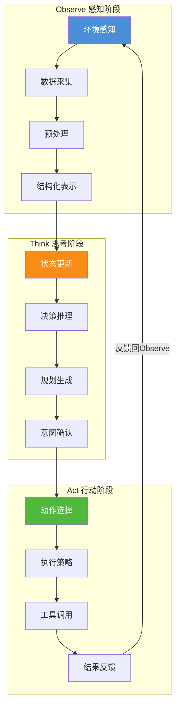

### 2.2 各阶段核心职责

| 阶段 | 核心职责 | 类比 | 关键问题 |
|------|---------|------|---------|
| **Observe** | 感知环境、采集数据、格式化信息 | 人的"眼睛/耳朵" | 我看到了什么？发生了什么变化？ |
| **Think** | 分析状态、推理决策、规划行动 | 人的"大脑" | 应该做什么？怎么做？ |
| **Act** | 执行操作、调用工具、产生效果 | 人的"手脚" | 执行效果如何？下一步怎么做？ |

### 2.3 闭环工作模式

Observe-Think-Act 形成一个**持续的感知-思考-行动闭环**：

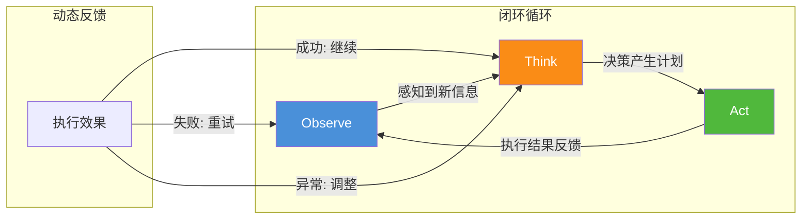

### 2.4 数据流转总览

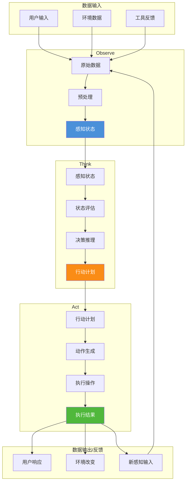

---

## 三、Observe 阶段：感知与数据采集

### 3.1 阶段核心职责

Observe 阶段是 Agent 与外界交互的**入口**，负责从各类数据源获取信息并转化为内部可用的结构化表示。其核心职责可概括为：

> **"通过多种感知渠道采集原始数据，经过清洗和预处理，生成能够反映当前环境状态的结构化感知信息，为 Think 阶段提供高质量的输入。"**

### 3.2 感知架构设计

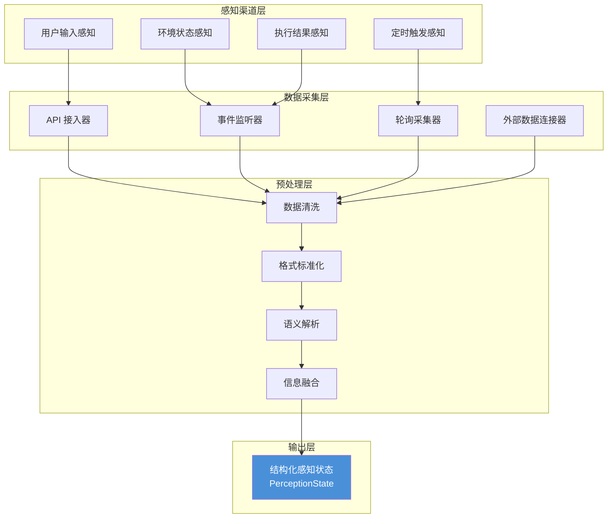

### 3.3 感知渠道详解

#### 3.3.1 用户输入感知

用户输入是最主要的感知来源，通过 API 网关接入：

| 输入类型 | 数据格式 | 采集方式 | 示例 |
|---------|---------|---------|------|
| **文本输入** | UTF-8 字符串 | HTTP POST / WebSocket | 聊天消息、指令文本 |
| **结构化输入** | JSON / Form | HTTP API | 表单数据、配置信息 |
| **文件上传** | Binary (PDF/Image/Code) | Multipart Upload | 文档、图片、代码文件 |
| **语音输入** | Audio Stream | WebRTC / Media API | 语音指令 |

**采集实现**：

```python
class UserInputPerception:
    """用户输入感知器"""
    
    async def perceive(self, request: IncomingRequest) -> RawData:
        """采集用户输入数据"""
        raw_data = RawData(
            source="user_input",
            timestamp=datetime.now(),
            data=self._extract_data(request),
            metadata=self._extract_metadata(request)
        )
        
        # 记录原始输入日志
        await self.logger.log_raw_input(raw_data)
        
        return raw_data
    
    def _extract_data(self, request: IncomingRequest) -> Any:
        """从请求中提取数据"""
        if request.content_type == "text":
            return request.payload.text
        elif request.content_type == "structured":
            return json.loads(request.payload)
        elif request.content_type == "file":
            return self.file_service.store(request.payload)
```

#### 3.3.2 环境状态感知

环境状态感知使 Agent 能够感知运行环境的变化：

| 感知类型 | 数据源 | 采集频率 | 用途 |
|---------|--------|---------|------|
| **系统状态** | 服务器监控API | 实时/定时 | 资源可用情况 |
| **数据变化** | 数据库变更监听 | 实时事件 | 数据同步触发 |
| **外部事件** | 消息队列/订阅 | 实时事件 | 业务事件响应 |
| **时间触发** | 定时器/调度器 | 定时触发 | 周期任务执行 |

```python
class EnvironmentPerception:
    """环境状态感知器"""
    
    def __init__(self):
        self.event_bus = EventBus()
        self.polling_scheduler = AsyncScheduler()
        self.listeners = []
    
    async def start(self):
        """启动环境感知"""
        # 事件订阅监听
        self.event_bus.subscribe("data.change", self._on_data_change)
        self.event_bus.subscribe("system.alert", self._on_system_alert)
        
        # 定时轮询采集
        self.polling_scheduler.add_job(
            interval=30,
            callback=self._collect_system_metrics
        )
        
        # 注册动态监听器
        await self._register_listeners()
    
    async def perceive(self) -> List[RawData]:
        """采集当前环境状态快照"""
        data_snapshots = []
        
        # 采集系统指标
        metrics = await self._collect_system_metrics()
        data_snapshots.append(RawData(
            source="system_metrics",
            data=metrics,
            timestamp=datetime.now()
        ))
        
        # 检查待处理事件
        pending_events = await self.event_bus.get_pending()
        for event in pending_events:
            data_snapshots.append(RawData(
                source="event",
                data=event,
                timestamp=event.timestamp
            ))
        
        return data_snapshots
```

#### 3.3.3 执行结果感知

执行结果感知是 Act→Observe 反馈闭环的关键：

```python
class ExecutionResultPerception:
    """执行结果感知器 - 闭环反馈"""
    
    async def perceive(self, execution_result: ExecutionResult) -> FeedbackData:
        """从执行结果中提取感知信息"""
        return FeedbackData(
            task_id=execution_result.task_id,
            status=execution_result.status,
            outcome=self._extract_outcome(execution_result),
            side_effects=self._detect_side_effects(execution_result),
            metrics={
                "success_rate": execution_result.success_rate,
                "latency_ms": execution_result.total_latency,
                "resource_used": execution_result.resources
            },
            next_observation=execution_result.next_expected_state
        )
```

### 3.4 数据预处理机制

#### 3.4.1 预处理流水线

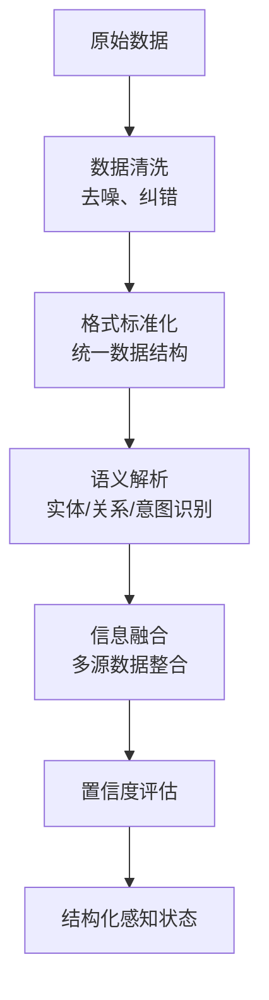

#### 3.4.2 数据清洗

```python
class DataCleaner:
    """数据清洗器"""
    
    def clean(self, raw_data: RawData) -> CleanData:
        """清洗原始数据"""
        cleaned = self._remove_noise(raw_data)
        cleaned = self._correct_errors(cleaned)
        cleaned = self._validate_schema(cleaned)
        return cleaned
    
    def _remove_noise(self, data: RawData) -> CleanData:
        """去除噪声"""
        if data.format == "text":
            return self._clean_text(data)
        elif data.format == "structured":
            return self._clean_structured(data)
    
    def _clean_text(self, data: RawData) -> CleanData:
        return CleanData(
            content=self._normalize_whitespace(data.content),
            removed_noise=self._detect_and_remove_noise(data.content),
            language=self._detect_language(data.content),
            confidence=self._assess_quality(data.content)
        )
```

#### 3.4.3 语义解析

```python
class SemanticParser:
    """语义解析器"""
    
    async def parse(self, cleaned_data: CleanData) -> ParsedData:
        """语义解析 - 实体关系提取"""
        # 使用LLM进行深度语义分析
        entities = await self._extract_entities(cleaned_data)
        relations = await self._extract_relations(cleaned_data)
        intent = await self._infer_intent(cleaned_data)
        
        return ParsedData(
            entities=entities,
            relations=relations,
            intent=intent,
            key_facts=self._extract_key_facts(cleaned_data)
        )
```

#### 3.4.4 信息融合

```python
class PerceptionStateBuilder:
    """感知状态构建器"""
    
    def build(self, parsed_data_list: List[ParsedData], context: AgentContext) -> PerceptionState:
        """融合多源感知数据，构建统一感知状态"""
        return PerceptionState(
            timestamp=datetime.now(),
            current_goal=self._infer_current_goal(parsed_data_list, context),
            entities=self._merge_entities(parsed_data_list),
            relevant_context=self._extract_relevant_context(parsed_data_list, context),
            uncertainty=self._assess_uncertainty(parsed_data_list),
            confidence_score=self._calculate_confidence(parsed_data_list),
            data_staleness=self._check_freshness(parsed_data_list)
        )
```

### 3.5 感知状态数据结构

```json
{
  "perception_state": {
    "timestamp": "2026-08-07T10:30:00Z",
    "current_goal": "分析代码性能问题",
    "entities": [
      {"name": "main.py", "type": "file", "relevance": 0.95},
      {"name": "性能", "type": "concept", "relevance": 0.8}
    ],
    "relevant_context": {
      "user_profile": {...},
      "recent_history": [...],
      "available_tools": ["code_analyzer", "profiler"]
    },
    "uncertainty": {
      "unknown_entities": [],
      "ambiguous_intent": false,
      "data_gaps": ["缺少项目依赖信息"]
    },
    "confidence_score": 0.87,
    "data_staleness_ms": 120
  }
}
```

### 3.6 技术选型

| 子模块 | 技术选型 | 选型依据 |
|--------|---------|---------|
| **API 接入** | FastAPI / gRPC | 高性能异步、类型安全 |
| **事件监听** | Kafka / Redis Pub/Sub | 高吞吐、实时性 |
| **语义解析** | LLM + 规则引擎 | 精度与速度平衡 |
| **数据融合** | 向量数据库（Milvus） | 相似性检索、语义匹配 |
| **状态存储** | Redis + PostgreSQL | 实时查询 + 持久化 |

---

## 四、Think 阶段：决策与推理

### 4.1 阶段核心职责

Think 阶段是 Agent 的**决策大脑**，负责将感知到的信息转化为可执行的决策。其核心职责可概括为：

> **"基于感知状态和历史知识，评估当前情境、推理可能的行动方案、生成最优行动计划，是 Agent 智能性的核心体现。"**

### 4.2 思考架构设计

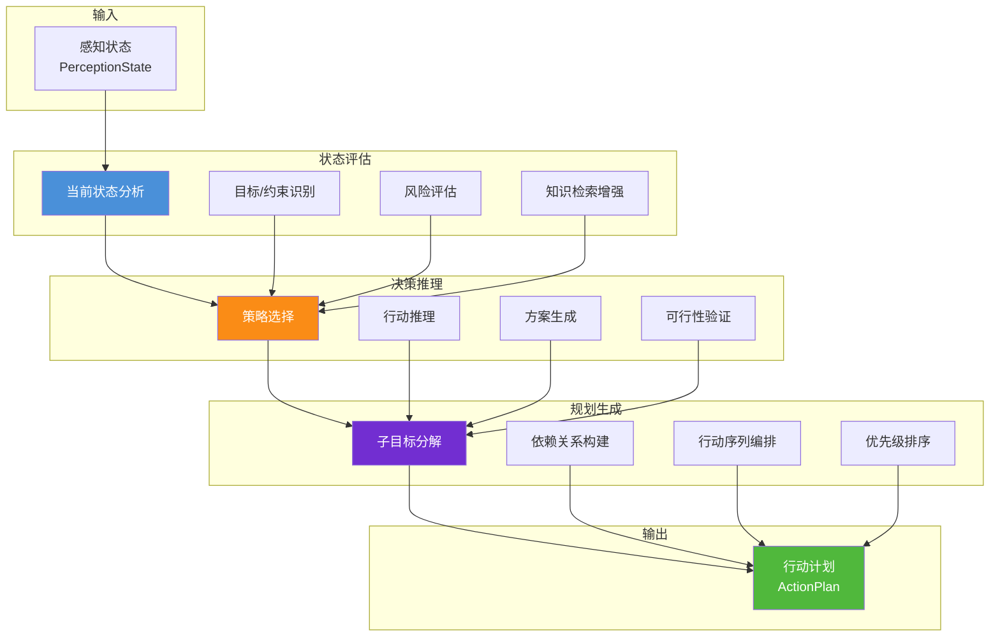

### 4.3 状态评估机制

#### 4.3.1 状态分析

```python
class StateEvaluator:
    """状态评估器"""
    
    async def evaluate(self, perception: PerceptionState, memory: MemorySystem) -> EvaluatedState:
        """评估当前状态"""
        return EvaluatedState(
            situation=self._analyze_situation(perception),
            goals=self._identify_goals(perception),
            constraints=self._extract_constraints(perception),
            risks=self._assess_risks(perception),
            knowledge=self._retrieve_relevant_knowledge(perception, memory)
        )
    
    def _analyze_situation(self, perception: PerceptionState) -> Situation:
        """分析当前情境"""
        return Situation(
            type=self._classify_situation(perception),
            complexity=self._estimate_complexity(perception),
            urgency=self._assess_urgency(perception),
            opportunity=self._detect_opportunity(perception)
        )
    
    def _assess_risks(self, perception: PerceptionState) -> RiskAssessment:
        """风险评估"""
        risk_factors = []
        
        # 检查数据不确定性
        if perception.uncertainty.data_gaps:
            risk_factors.append(RiskFactor(
                type="data_quality",
                level="medium",
                description=f"存在 {len(perception.uncertainty.data_gaps)} 个数据缺口"
            ))
        
        # 检查任务风险
        for entity in perception.entities:
            if entity.tags and "high_risk" in entity.tags:
                risk_factors.append(RiskFactor(
                    type="operation_risk",
                    level="high",
                    description=f"操作 {entity.name} 存在高风险"
                ))
        
        return RiskAssessment(
            factors=risk_factors,
            overall_level=self._calculate_overall_risk(risk_factors),
            mitigation_suggestions=self._suggest_mitigations(risk_factors)
        )
```

#### 4.3.2 知识检索增强

```python
class KnowledgeRetriever:
    """知识检索器 - RAG增强"""
    
    async def retrieve(self, query: str, context: AgentContext) -> KnowledgeContext:
        """检索相关知识"""
        # 向量检索
        semantic_results = await self.vector_db.search(
            query=self._embed_query(query),
            top_k=5
        )
        
        # 关键词检索
        keyword_results = await self.knowledge_base.search_by_keywords(
            keywords=self._extract_keywords(query)
        )
        
        # 融合结果
        merged = self._merge_ranked_results(semantic_results, keyword_results)
        
        # 去重和排序
        deduplicated = self._deduplicate(merged)
        ranked = self._rank_by_relevance(deduplicated, context)
        
        return KnowledgeContext(
            relevant_documents=ranked[:3],
            inferred_concepts=self._extract_concepts(ranked),
            confidence_boost=0.1 * len(ranked[:3])
        )
```

### 4.4 决策推理过程

#### 4.4.1 决策框架

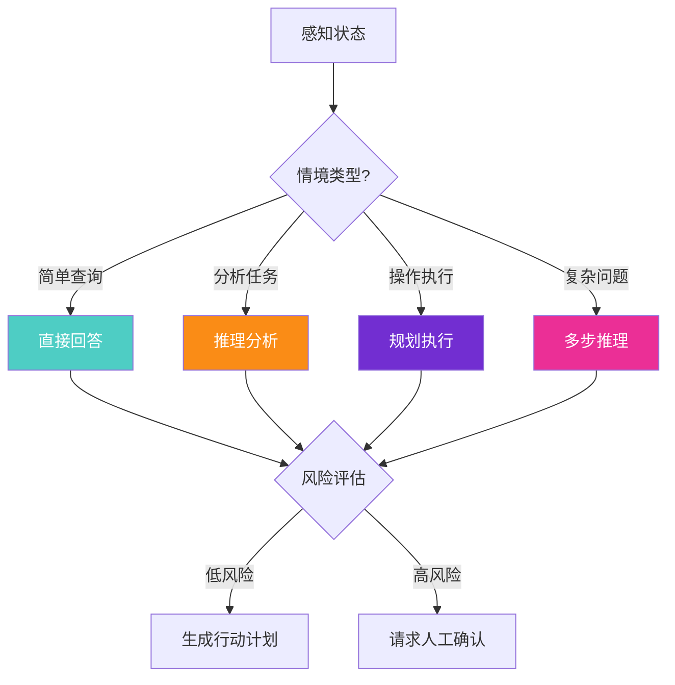

#### 4.4.2 多步推理实现

```python
class DecisionEngine:
    """决策引擎"""
    
    async def decide(self, evaluated_state: EvaluatedState) -> Decision:
        """核心决策逻辑"""
        # 1. 策略选择
        strategy = await self._select_strategy(evaluated_state)
        
        # 2. 方案生成
        action_options = await self._generate_options(strategy, evaluated_state)
        
        # 3. 可行性评估
        feasible_options = self._filter_feasible(action_options, evaluated_state)
        
        # 4. 最优选择
        best_option = self._select_optimal(feasible_options, evaluated_state)
        
        return Decision(
            strategy=strategy,
            chosen_option=best_option,
            alternatives=feasible_options[1:],
            reasoning_chain=self._record_reasoning(strategy, feasible_options, best_option),
            confidence=self._calculate_confidence(best_option, evaluated_state)
        )
    
    async def _select_strategy(self, state: EvaluatedState) -> Strategy:
        """选择执行策略"""
        complexity = state.situation.complexity
        risk_level = state.risks.overall_level
        
        if complexity <= 2 and risk_level == "low":
            return Strategy.DIRECT_RESPONSE
        elif complexity <= 4:
            return Strategy.REASONING
        elif complexity <= 7:
            return Strategy.PLANNING
        else:
            return Strategy.MULTI_STEP_REASONING
    
    async def _generate_options(self, strategy: Strategy, state: EvaluatedState) -> List[ActionOption]:
        """生成多个行动方案"""
        if strategy == Strategy.DIRECT_RESPONSE:
            return [self._create_direct_response(state)]
        else:
            # 使用LLM生成多个候选方案
            prompt = self._build_generation_prompt(strategy, state)
            raw_options = await self.llm.generate_options(prompt, n=3)
            return self._parse_options(raw_options)
```

### 4.5 规划生成

#### 4.5.1 行动规划器

```python
class ActionPlanner:
    """行动规划器"""
    
    async def plan(self, decision: Decision, state: EvaluatedState) -> ActionPlan:
        """生成详细行动计划"""
        if decision.strategy == Strategy.DIRECT_RESPONSE:
            return self._simple_plan(decision, state)
        else:
            return self._detailed_plan(decision, state)
    
    async def _detailed_plan(self, decision: Decision, state: EvaluatedState) -> ActionPlan:
        """详细规划 - 层级任务分解"""
        # Step 1: 分解子目标
        sub_goals = await self._decompose_goal(decision.chosen_option.goal)
        
        # Step 2: 为每个子目标生成行动步骤
        steps = []
        for sub_goal in sub_goals:
            sub_steps = await self._plan_sub_goal(sub_goal, state)
            steps.extend(sub_steps)
        
        # Step 3: 构建依赖关系图
        dependency_graph = self._build_dependency_graph(steps)
        
        # Step 4: 优化执行顺序
        optimized_steps = self._optimize_order(steps, dependency_graph)
        
        # Step 5: 估算时间和资源
        for step in optimized_steps:
            step.estimated_duration = self._estimate_duration(step)
            step.required_resources = self._estimate_resources(step)
        
        return ActionPlan(
            plan_id=self._generate_plan_id(),
            goal=decision.chosen_option.goal,
            steps=optimized_steps,
            estimated_total_duration=self._sum_durations(optimized_steps),
            risk_mitigation=decision.chosen_option.mitigation,
            fallback_strategy=self._prepare_fallback(optimized_steps)
        )
    
    def _build_dependency_graph(self, steps: List[PlanStep]) -> DependencyGraph:
        """构建步骤依赖关系图"""
        graph = DependencyGraph()
        
        for step in steps:
            graph.add_node(step)
            # 分析依赖
            deps = self._find_dependencies(step, steps)
            for dep in deps:
                graph.add_edge(dep, step)
        
        return graph
```

#### 4.5.2 行动计划数据结构

```json
{
  "action_plan": {
    "plan_id": "plan_001",
    "goal": "优化数据库查询性能",
    "strategy": "PLANNING",
    "created_at": "2026-08-07T10:30:00Z",
    "steps": [
      {
        "id": "step_1",
        "description": "分析慢查询日志",
        "tool_to_use": "log_analyzer",
        "params": {"log_type": "slow_query", "time_range": "last_24h"},
        "dependencies": [],
        "priority": "high",
        "estimated_duration_ms": 5000,
        "status": "pending"
      },
      {
        "id": "step_2",
        "description": "识别性能瓶颈",
        "tool_to_use": "profiler",
        "params": {"target": "db_queries", "depth": "deep"},
        "dependencies": ["step_1"],
        "priority": "high",
        "estimated_duration_ms": 10000,
        "status": "pending"
      },
      {
        "id": "step_3",
        "description": "生成优化方案",
        "tool_to_use": "llm_reasoner",
        "params": {"analysis_result_ref": "step_2_output"},
        "dependencies": ["step_2"],
        "priority": "medium",
        "estimated_duration_ms": 3000,
        "status": "pending"
      }
    ],
    "estimated_total_duration_ms": 18000,
    "risk_mitigation": ["数据备份"],
    "fallback_strategy": "回滚至优化前状态"
  }
}
```

### 4.6 状态管理方法

#### 4.6.1 思维链追踪

```python
class ThinkingTrace:
    """思维链追踪 - 可解释的决策过程"""
    
    def __init__(self):
        self.steps = []
        self.current_step = None
    
    def record_step(self, step_type: str, content: Any, confidence: float):
        """记录推理步骤"""
        trace_step = TraceStep(
            type=step_type,
            content=content,
            confidence=confidence,
            timestamp=datetime.now(),
            context_snapshot=self._snapshot_context()
        )
        self.steps.append(trace_step)
        self.current_step = trace_step
    
    def get_chain(self) -> List[TraceStep]:
        """获取完整思维链"""
        return self.steps
    
    def get_summary(self) -> TraceSummary:
        """获取思维链摘要"""
        return TraceSummary(
            total_steps=len(self.steps),
            reasoning_types=self._count_by_type(),
            avg_confidence=self._calculate_avg_confidence(),
            key_decision_points=self._identify_key_decisions()
        )
```

#### 4.6.2 决策状态管理

```python
class DecisionStateManager:
    """决策状态管理器"""
    
    def __init__(self):
        self.state_history = deque(maxlen=100)
        self.current_state = None
        self.state_transitions = []
    
    def transition_to(self, new_state: DecisionState, reason: str):
        """状态转换"""
        old_state = self.current_state
        
        # 记录转换
        transition = StateTransition(
            from_state=old_state,
            to_state=new_state,
            reason=reason,
            timestamp=datetime.now()
        )
        self.state_transitions.append(transition)
        
        # 更新当前状态
        self.current_state = new_state
        self.state_history.append(new_state)
    
    def get_current_state(self) -> DecisionState:
        """获取当前决策状态"""
        return self.current_state
    
    def get_state_progression(self) -> List[StateTransition]:
        """获取状态演进轨迹"""
        return self.state_transitions
```

### 4.7 技术选型

| 子模块 | 技术选型 | 选型依据 |
|--------|---------|---------|
| **推理引擎** | LLM (GPT-4/文心一言) | 通用推理、强泛化能力 |
| **规则引擎** | Drools / JSON Rules | 可解释、可配置 |
| **知识检索** | Milvus + Elasticsearch | 向量+关键词混合检索 |
| **状态管理** | Redis + 状态机模式 | 快速状态读写 |
| **决策追踪** | 思维链(CoT) + 树搜索 | 可解释性、多路径探索 |

---

## 五、Act 阶段：执行与反馈

### 5.1 阶段核心职责

Act 阶段是 Agent 的**执行终端**，负责将思考阶段生成的行动计划转化为实际的操作行为，并收集执行结果反馈给感知阶段。其核心职责可概括为：

> **"将抽象的行动计划翻译为具体的工具调用和操作序列，在执行过程中实时监控状态、处理异常，并将执行结果整理后反馈给感知阶段，形成闭环。"**

### 5.2 执行架构设计

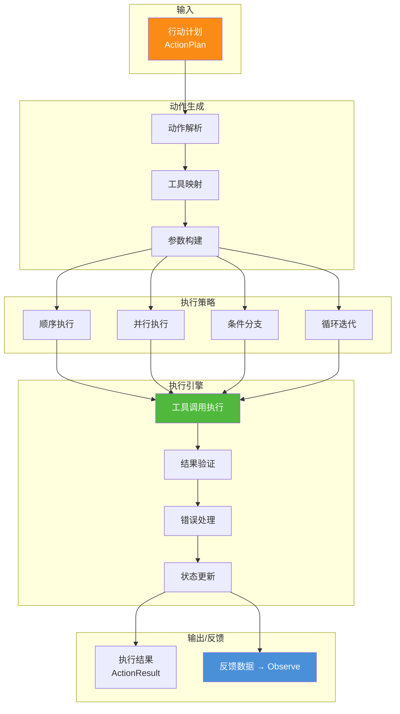

### 5.3 动作生成机制

#### 5.3.1 动作解析与映射

```python
class ActionGenerator:
    """动作生成器"""
    
    def __init__(self, tool_registry: ToolRegistry):
        self.tool_registry = tool_registry
    
    def generate_actions(self, plan: ActionPlan) -> List[ActionCall]:
        """将行动计划转换为可执行的动作序列"""
        actions = []
        
        for step in plan.steps:
            # 解析步骤，映射到具体工具
            tool = self.tool_registry.resolve(step.tool_to_use)
            
            # 构建动作调用
            action = ActionCall(
                step_id=step.id,
                tool=tool,
                params=self._resolve_params(step.params, plan),
                timeout_ms=step.estimated_duration * 3,  # 3倍安全系数
                retry_policy=self._get_retry_policy(step)
            )
            actions.append(action)
        
        return actions
    
    def _resolve_params(self, params: Dict, plan: ActionPlan) -> Dict:
        """解析参数引用"""
        resolved = {}
        for key, value in params.items():
            if isinstance(value, str) and value.startswith("step_"):
                # 引用其他步骤的输出
                ref_step_id = value.split("_")[0]
                resolved[key] = plan.get_step_output(ref_step_id)
            else:
                resolved[key] = value
        return resolved
```

#### 5.3.2 执行策略选择

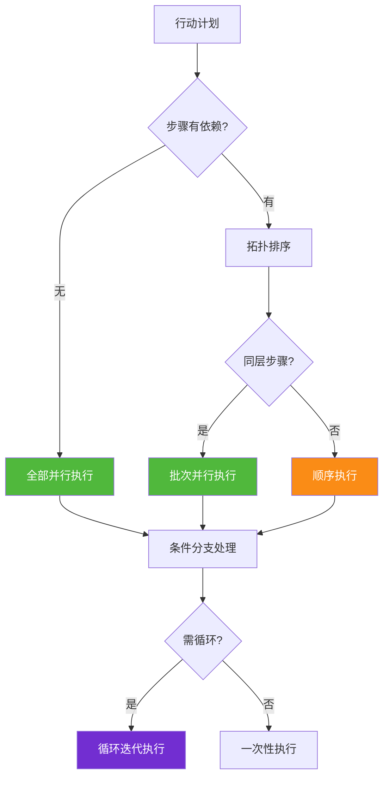

### 5.4 执行引擎实现

#### 5.4.1 核心执行器

```python
class ActionExecutor:
    """动作执行器"""
    
    async def execute(self, actions: List[ActionCall]) -> ActionResult:
        """执行动作序列"""
        execution_context = ExecutionContext()
        
        # Step 1: 初始化执行环境
        await self._prepare_execution(execution_context)
        
        # Step 2: 按策略执行动作
        results = await self._execute_strategy(actions, execution_context)
        
        # Step 3: 结果验证和整合
        validated_result = await self._validate_and_assemble(results)
        
        # Step 4: 生成执行结果
        return ActionResult(
            status=validated_result.status,
            outputs=validated_result.outputs,
            execution_trace=execution_context.trace,
            metrics=execution_context.metrics,
            next_state_hint=validated_result.next_state
        )
    
    async def _execute_strategy(self, actions: List[ActionCall], context: ExecutionContext):
        """选择并执行最优策略"""
        # 构建执行计划
        execution_plan = self._build_execution_plan(actions)
        
        results = []
        for batch in execution_plan.batches:
            if batch.execution_mode == "parallel":
                # 并行执行
                batch_results = await asyncio.gather(*[
                    self._execute_single(action, context)
                    for action in batch.actions
                ], return_exceptions=True)
            else:
                # 顺序执行
                batch_results = []
                for action in batch.actions:
                    result = await self._execute_single(action, context)
                    batch_results.append(result)
                    
                    # 检查是否需要提前返回
                    if self._should_stop(result, context):
                        break
            
            results.extend(batch_results)
            
            # 更新执行上下文
            context.update_from_batch(batch_results)
        
        return results
    
    async def _execute_single(self, action: ActionCall, context: ExecutionContext) -> IndividualResult:
        """执行单个动作"""
        for attempt in range(action.retry_policy.max_retries):
            try:
                # 执行工具调用
                raw_result = await asyncio.wait_for(
                    action.tool.execute(**action.params),
                    timeout=action.timeout_ms / 1000
                )
                
                # 验证结果
                validated = self._validate_result(raw_result, action.tool.output_schema)
                
                return IndividualResult(
                    step_id=action.step_id,
                    status="success",
                    data=validated,
                    execution_time_ms=context.get_elapsed_time()
                )
                
            except Exception as e:
                if attempt == action.retry_policy.max_retries - 1:
                    return IndividualResult(
                        step_id=action.step_id,
                        status="failed",
                        error=str(e),
                        error_type=type(e).__name__,
                        suggestions=self._get_fallback_suggestion(action, e)
                    )
                # 重试等待
                await asyncio.sleep(2 ** attempt)
```

#### 5.4.2 执行结果数据结构

```json
{
  "action_result": {
    "status": "completed",
    "outputs": {
      "step_1_output": {
        "log_analysis": {
          "total_queries": 15000,
          "slow_queries": 342,
          "top_slow_patterns": ["SELECT * FROM orders...", "JOIN users..."]
        }
      },
      "step_2_output": {
        "bottleneck_analysis": {
          "critical_query": "SELECT * FROM orders",
          "bottleneck_type": "missing_index",
          "impact_score": 0.85
        }
      },
      "step_3_output": {
        "optimization_plan": {
          "recommendations": [
            "添加索引 idx_orders(create_time)",
            "优化 JOIN 顺序",
            "使用覆盖索引"
          ],
          "estimated_improvement": "60-80%"
        }
      }
    },
    "execution_trace": [
      {"step": "step_1", "status": "completed", "duration_ms": 5234},
      {"step": "step_2", "status": "completed", "duration_ms": 10156},
      {"step": "step_3", "status": "completed", "duration_ms": 2891}
    ],
    "metrics": {
      "total_duration_ms": 18281,
      "success_rate": 1.0,
      "tools_used": ["log_analyzer", "profiler", "llm_reasoner"]
    },
    "next_state_hint": "建议执行数据库优化操作"
  }
}
```

### 5.5 反馈处理机制

#### 5.5.1 结果反馈到 Observe

```python
class FeedbackProcessor:
    """反馈处理器 - Act→Observe 闭环"""
    
    async def process(self, action_result: ActionResult) -> PerceptionUpdate:
        """处理执行结果，生成感知更新"""
        # 1. 提取关键信息
        state_change = self._extract_state_changes(action_result)
        
        # 2. 生成新的感知输入
        new_perception_input = PerceptionInput(
            source="action_feedback",
            changes_detected=state_change,
            new_data=self._extract_output_data(action_result),
            needs_observation=self._determine_need_for_reobserve(action_result)
        )
        
        # 3. 返回给 Observe 阶段
        return PerceptionUpdate(
            input=new_perception_input,
            continue_loop=action_result.status == "partial_success",
            new_goal_suggestion=action_result.next_state_hint
        )
    
    def _determine_need_for_reobserve(self, result: ActionResult) -> bool:
        """判断是否需要重新感知"""
        # 成功：结束当前循环
        if result.status == "completed":
            return False
        
        # 部分成功：需要继续
        if result.status == "partial_success":
            return True
        
        # 失败：需要重试或调整
        if result.status == "failed":
            return True
        
        return False
```

### 5.6 技术选型

| 子模块 | 技术选型 | 选型依据 |
|--------|---------|---------|
| **动作调度** | asyncio + 调度器模式 | 高并发、可组合 |
| **工具执行** | 适配器模式 + 插件机制 | 灵活扩展、统一接口 |
| **错误处理** | 重试器 + 熔断器 | 容错、稳定性 |
| **状态追踪** | 执行日志 + Trace ID | 可追溯、可调试 |
| **反馈管道** | 事件队列 + 观察者模式 | 解耦、可扩展 |

---

## 六、三阶段衔接与协同工作

### 6.1 阶段间交互接口

```mermaid
sequenceDiagram
    participant O as Observe
    participant T as Think
    participant A as Act
    participant FB as Feedback Loop

    O->>T: PerceptionState
    T->>T: 状态评估 → 决策推理 → 规划生成
    T->>A: ActionPlan
    A->>A: 动作生成 → 执行 → 结果验证
    A->>FB: ActionResult
    FB->>O: PerceptionUpdate
    O->>T: 更新后的 PerceptionState
    Note over O,T,A: 持续循环直到任务完成
```

### 6.2 数据流转路径

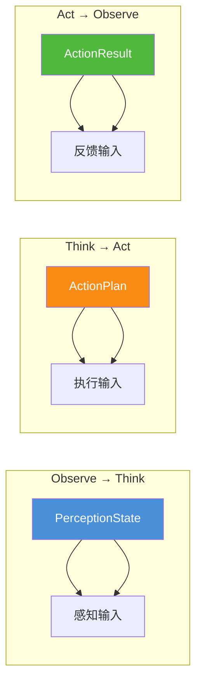

### 6.3 协同工作原理

#### 6.3.1 迭代式改进循环

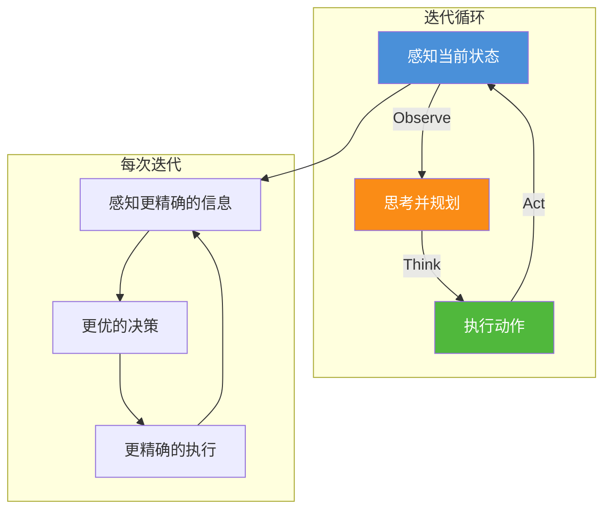

#### 6.3.2 渐进式完善机制

| 迭代轮次 | Observe | Think | Act | 目的 |
|---------|---------|-------|-----|------|
| **第1轮** | 采集初始信息 | 生成初步方案 | 执行初步操作 | 获取基础数据 |
| **第2轮** | 感知执行结果 | 修正/优化方案 | 执行改进操作 | 逐步完善 |
| **第3轮** | 感知详细信息 | 精细调整策略 | 执行精确操作 | 精细优化 |
| **第N轮** | 感知最终状态 | 确认完成条件 | 结束/补充操作 | 完成任务 |

### 6.4 接口契约定义

#### Observe→Think 接口

```python
class ObserveThinkInterface:
    """Observe 到 Think 的数据契约"""
    
    @dataclass
    class PerceptionInput:
        observation_id: str
        timestamp: datetime
        raw_observations: List[RawData]
        processed_state: PerceptionState
        confidence: float
        uncertainty_flags: List[str]
    
    @staticmethod
    def validate_input(input_data: PerceptionInput) -> ValidationResult:
        """验证输入数据完整性"""
        checks = [
            bool(input_data.processed_state),
            input_data.confidence >= 0.5,
            len(input_data.raw_observations) > 0
        ]
        return ValidationResult(all(checks), 
            missing_fields=[f"check_{i}" for i, c in enumerate(checks) if not c])
```

#### Think→Act 接口

```python
class ThinkActInterface:
    """Think 到 Act 的数据契约"""
    
    @dataclass
    class ActionPlanInput:
        plan_id: str
        goal: str
        steps: List[PlanStep]
        dependencies: DAG
        resource_requirements: ResourceProfile
        success_criteria: List[Criterion]
    
    @staticmethod
    def validate_plan(plan: ActionPlanInput) -> ValidationResult:
        """验证行动计划可执行性"""
        checks = [
            len(plan.steps) > 0,
            all(step.tool_to_use in AVAILABLE_TOOLS for step in plan.steps),
            plan.success_criteria is not None
        ]
        return ValidationResult(all(checks), [])
```

#### Act→Observe 接口

```python
class ActObserveInterface:
    """Act 到 Observe 的数据契约"""
    
    @dataclass
    class FeedbackOutput:
        execution_id: str
        status: str  # completed, partial, failed
        output_data: Dict
        state_changes_detected: List[Change]
        need_reobservation: bool
        suggested_next_action: Optional[str]
    
    @staticmethod
    def generate_observation_input(feedback: FeedbackOutput) -> ObservationRequest:
        """将反馈转换为新的观察请求"""
        return ObservationRequest(
            trigger_type="action_feedback",
            source_id=feedback.execution_id,
            data_to_observe=feedback.state_changes_detected,
            priority="high" if feedback.status == "partial" else "normal",
            context={
                "previous_execution_id": feedback.execution_id,
                "previous_status": feedback.status
            }
        )
```

---

## 七、完整伪代码实现

### 7.1 主循环框架

```python
class ObserveThinkActAgent:
    """
    Observe-Think-Act 核心循环实现
    体现三阶段协同工作的完整流程
    """
    
    def __init__(self, config: AgentConfig):
        # 初始化各阶段组件
        self.observe_phase = ObservePhase(config.perception)
        self.think_phase = ThinkPhase(config.reasoning)
        self.act_phase = ActPhase(config.execution)
        
        # 状态管理
        self.current_state = AgentState.IDLE
        self.observation_history = []
        self.plan_history = []
        self.execution_history = []
        
        # 迭代控制
        self.max_iterations = config.max_iterations  # 默认10
        self.iteration_count = 0
    
    async def run(self, initial_input: AgentInput) -> AgentOutput:
        """
        主循环：Observe → Think → Act → Feedback
        """
        self.current_state = AgentState.RUNNING
        current_input = initial_input
        
        try:
            while self.iteration_count < self.max_iterations:
                # ============ Observe 阶段 ============
                perception = await self._observe(current_input)
                
                # 检查：信息是否充足
                if not self._has_sufficient_information(perception):
                    # 需要更多信息，继续观察
                    current_input = self._request_more_information(perception)
                    continue
                
                # ============ Think 阶段 ============
                decision = await self._think(perception)
                
                # 检查：是否需要人工介入
                if decision.requires_human_approval:
                    approval = await self._request_human_approval(decision)
                    if not approval.approved:
                        return AgentOutput(
                            status="cancelled",
                            reason="User rejected the action",
                            history=self._build_history()
                        )
                
                # 生成行动计划
                action_plan = await self._plan(decision, perception)
                
                # ============ Act 阶段 ============
                execution_result = await self._act(action_plan)
                
                # 记录历史
                self.observation_history.append(perception)
                self.plan_history.append(action_plan)
                self.execution_history.append(execution_result)
                self.iteration_count += 1
                
                # ============ 反馈检查 ============
                if execution_result.status == "completed":
                    # 任务完成
                    return AgentOutput(
                        status="completed",
                        final_output=execution_result.final_output,
                        iteration_count=self.iteration_count,
                        history=self._build_history()
                    )
                elif execution_result.status == "partial_success":
                    # 部分成功，使用反馈继续
                    current_input = execution_result.feedback_for_next_iteration
                    continue
                elif execution_result.status == "need_more_info":
                    # 需要更多信息
                    current_input = execution_result.info_request
                    continue
                else:  # failed
                    # 尝试使用替代方案
                    if self._has_fallback(decision):
                        current_input = self._get_fallback_input(decision, execution_result)
                        continue
                    else:
                        return AgentOutput(
                            status="failed",
                            error=execution_result.error,
                            history=self._build_history()
                        )
            
            # 达到最大迭代次数
            return AgentOutput(
                status="max_iterations_reached",
                partial_result=self._get_best_partial_result(),
                iteration_count=self.iteration_count,
                history=self._build_history()
            )
            
        except Exception as e:
            return AgentOutput(
                status="error",
                error=str(e),
                history=self._build_history()
            )
        finally:
            self.current_state = AgentState.IDLE
    
    async def _observe(self, input_data) -> PerceptionState:
        """Observe 阶段实现"""
        raw_data = await self.observe_phase.collect(input_data)
        processed_data = await self.observe_phase.preprocess(raw_data)
        perception_state = await self.observe_phase.build_state(processed_data)
        return perception_state
    
    async def _think(self, perception_state: PerceptionState) -> Decision:
        """Think 阶段实现"""
        evaluation = await self.think_phase.evaluate(perception_state)
        decision = await self.think_phase.reason(evaluation)
        return decision
    
    async def _plan(self, decision: Decision, perception: PerceptionState) -> ActionPlan:
        """规划生成"""
        plan = await self.think_phase.plan(decision, perception)
        return plan
    
    async def _act(self, plan: ActionPlan) -> ExecutionResult:
        """Act 阶段实现"""
        actions = await self.act_phase.generate_actions(plan)
        result = await self.act_phase.execute(actions)
        return result
```

---

## 八、端到端案例演示

### 8.1 案例：智能客服处理退换货请求

#### 初始输入

```
用户输入: "我想退昨天买的那件衬衫，尺码不合适"
```

#### 迭代过程

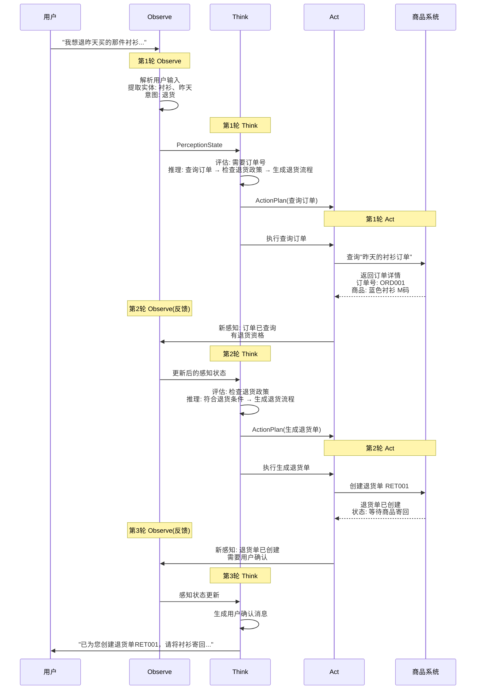

#### 状态流转表

| 轮次 | Observe 输出 | Think 决策 | Act 执行 | 反馈 |
|------|-------------|-----------|---------|------|
| **1** | 识别"退货衬衫"意图 | 需要查询订单 | 查询订单信息 | 获取订单号和详情 |
| **2** | 订单已查询成功 | 检查退货政策 | 生成退货单 | 退货单创建完成 |
| **3** | 退货单已创建 | 通知用户后续步骤 | 发送确认消息 | 任务完成 |

---

## 九、技术选型与对比分析

### 9.1 三阶段技术选型汇总

| 阶段 | 核心技术 | 辅助技术 | 选型依据 |
|------|---------|---------|---------|
| **Observe** | LLM + 规则引擎 | Kafka/Milvus | 多源数据融合、实时性 |
| **Think** | LLM (CoT) + 状态机 | 向量数据库 | 推理能力、可解释性 |
| **Act** | 插件化工具执行器 | 熔断器/重试器 | 扩展性、稳定性 |

### 9.2 关键设计决策对比

| 设计维度 | 方案A: 同步串行 | 方案B: 异步并行 | 方案C: 混合模式 |
|---------|---------------|---------------|---------------|
| **Observe** | 单源轮询 | 多源事件驱动 | 事件+轮询混合 |
| **Think** | 单次LLM调用 | 多轮自反思 | 启发式+LLM混合 |
| **Act** | 顺序执行 | 并行执行 | 按依赖关系混合 |
| **响应速度** | 慢 | 快 | 最优 |
| **实现复杂度** | 低 | 高 | 中等 |
| **适用场景** | 简单任务 | 高并发场景 | 通用场景✓ |

---

## 十、总结与展望

### 10.1 核心要点总结

本文档从系统架构设计角度，详细阐述了 Agent "Observe → Think → Act" 核心工作流程：

1. **Observe 阶段**：通过多种感知渠道采集数据，经过清洗和语义解析，构建结构化的感知状态，为思考阶段提供高质量输入

2. **Think 阶段**：基于感知状态进行状态评估、决策推理和行动规划，生成包含依赖关系和执行顺序的详细行动计划

3. **Act 阶段**：将行动计划转换为具体的工具调用，按策略执行并处理异常，生成执行结果并反馈给感知阶段

4. **闭环机制**：Act 的执行结果反馈到 Observe，形成新的感知输入，驱动新一轮的思考和行动，实现迭代式改进

### 10.2 与系列文档的关系

本文档是 `3Agent 架构设计` 系列文档的核心补充：

| 文档 | 视角 | 对应本文档内容 |
|------|------|--------------|
| [企业级Agent系统完整设计方案](file:///m:/note-book/agent/3Agent%20架构设计/1企业级Agent系统完整设计方案.md) | 系统整体 | 三阶段的组件构成 |
| [Agent执行流程详解](file:///m:/note-book/agent/3Agent%20架构设计/2Agent执行流程详解.md) | 任务生命周期 | 三阶段的时间序列展开 |
| **本文档** | 核心工作循环 | 三阶段的内在机制和协同方式 |

### 10.3 演进方向

| 方向 | 说明 |
|------|------|
| **更智能的感知** | 多模态融合感知、主动式信息获取 |
| **更灵活的思考** | 自主规划学习、跨任务经验迁移 |
| **更安全的行动** | 可解释的行动验证、安全边界自动检测 |
| **更高效的循环** | 自适应迭代、提前终止条件优化 |

