# ReAct Agent 工作流程深度解析

> **文档说明**：本文档详细阐述 ReAct Agent 的完整工作流程，从初始化阶段开始，系统分析 Thought（思考）、Action（行动）、Observation（观察）三个核心环节的具体实现机制。内容涵盖架构设计、关键组件交互、数据流向、决策逻辑、状态管理及循环终止条件，并通过伪代码和案例演示辅助说明。

## 目录

- [一、引言：ReAct 模式的核心思想](#一引言react-模式的核心思想)
- [二、ReAct 架构设计与核心组件](#二react-架构设计与核心组件)
- [三、初始化阶段：环境搭建与状态准备](#三初始化阶段环境搭建与状态准备)
- [四、Thought-Action-Observation 循环详解](#四thought-action-observation-循环详解)
- [五、状态管理与循环控制](#五状态管理与循环控制)
- [六、信息传递与数据流向](#六信息传递与数据流向)
- [七、完整伪代码实现](#七完整伪代码实现)
- [八、端到端案例演示](#八端到端案例演示)
- [九、ReAct 的优势与挑战](#九react-的优势与挑战)
- [十、总结与展望](#十总结与展望)

---

## 一、引言：ReAct 模式的核心思想

### 1.1 什么是 ReAct

ReAct（Reasoning + Acting）是一种由 **Yao et al. 2022** 提出的 Agent 设计范式，其核心思想是将 **推理（Reasoning）** 与 **行动（Acting）** 交替进行，让 LLM 在每一步都同时生成：

- **Thought（思考）**：分析当前状态，规划下一步行动
- **Action（行动）**：选择并调用具体工具
- **Observation（观察）**：获取行动结果，更新认知

这种模式的核心优势在于：LLM 不仅是一个决策器，更是一个**持续进行的推理过程**——它可以在每一步都展示自己的思考逻辑，并且基于观察结果动态调整策略。

### 1.2 ReAct 与 OTA 的核心区别

| 维度 | OTA（Observe-Think-Act） | ReAct（Reasoning + Acting） |
|------|------------------------|---------------------------|
| **决策主体** | 系统模块协调决策 | LLM 主导所有决策 |
| **推理透明度** | 可通过日志追踪，但不展示思考过程 | 每步生成 Thought，推理过程完全可见 |
| **循环控制** | 由系统架构控制循环 | 由 LLM 自身判断何时结束 |
| **模块边界** | 各阶段由不同组件实现 | 三个环节统一在 LLM 调用中完成 |
| **工具调用** | 外部调度器决定调用 | LLM 直接生成工具调用指令 |
| **适用场景** | 固定流程、确定性任务 | 开放式问题、需要灵活推理 |

### 1.3 ReAct 的核心价值

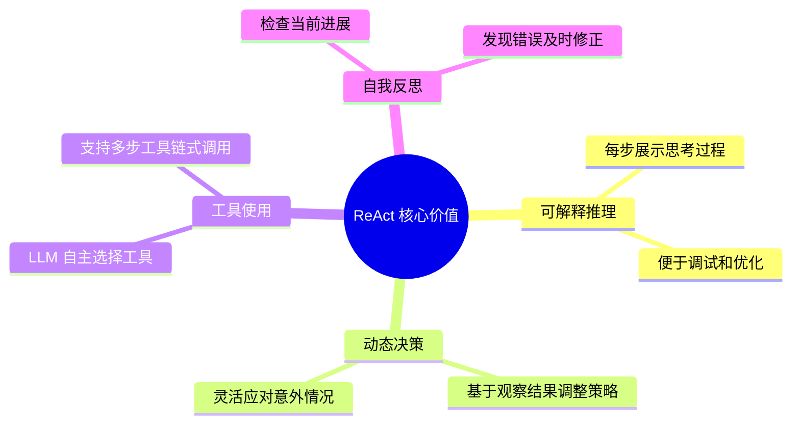

### 1.4 文档定位

本文档是 `3Agent 架构设计` 系列文档的重要补充，聚焦于 **ReAct Agent 的具体工作实现**：

| 已有文档 | 视角 | 本文档补充 |
|---------|------|-----------|
| `1企业级Agent系统完整设计方案.md` | 系统整体架构 | ReAct 模式的架构实现 |
| `2Agent执行流程详解.md` | 任务执行生命周期 | ReAct 的循环执行机制 |
| `3Agent核心工作流程_Observe_Think_Act.md` | OTA 通用模式 | ReAct 与 OTA 的对比与互补 |
| **本文档** | ReAct 具体实现 | Thought-Action-Observation 循环的深入分析 |

---

## 二、ReAct 架构设计与核心组件

### 2.1 ReAct 整体架构

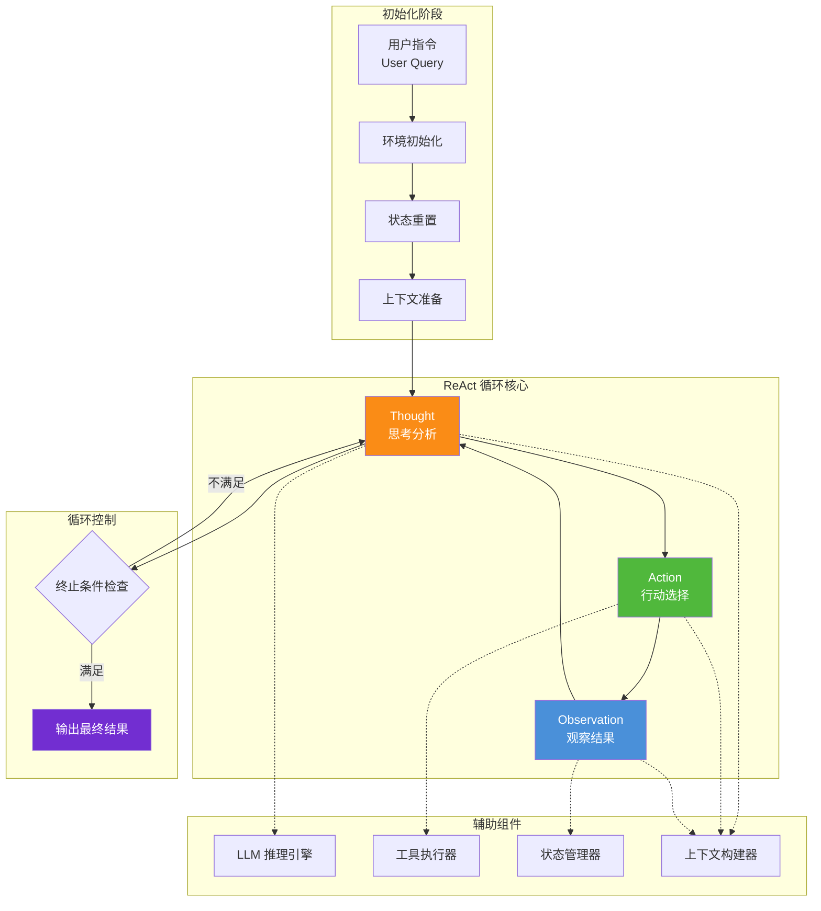

### 2.2 核心组件详解

#### 2.2.1 LLM 推理引擎

LLM 是 ReAct Agent 的**大脑**，负责生成 Thought、Action 决策，并读取 Observation 结果进行新一轮推理。

```python
class LLMInferenceEngine:
    """LLM 推理引擎"""
    
    def __init__(self, model_config: ModelConfig):
        self.llm = self._init_llm(model_config)
        self.tokenizer = self._init_tokenizer(model_config)
    
    async def generate_react_step(self, 
                                    context_messages: List[Dict],
                                    tools: List[ToolDefinition]) -> ReActStep:
        """生成单步 ReAct 输出"""
        # 构建 ReAct Prompt
        prompt = self._build_react_prompt(context_messages, tools)
        
        # 调用 LLM
        response = await self.llm.chat(
            messages=prompt,
            temperature=0.7,  # 创造性推理需要较高温度
            max_tokens=200
        )
        
        # 解析响应为 ReActStep
        return self._parse_react_response(response)
    
    def _build_react_prompt(self, context: List[Dict], 
                               tools: List[ToolDefinition]) -> List[Dict]:
        """构建 ReAct 专用 Prompt"""
        system_message = self._get_system_prompt(tools)
        return [system_message] + context
    
    def _get_system_prompt(self, tools: List[ToolDefinition]) -> Dict:
        """获取 ReAct 系统提示"""
        tools_description = self._format_tools_description(tools)
        
        return {
            "role": "system",
            "content": f"""你是一个智能 Agent。对于用户的每个请求，你需要交替进行思考和行动。

可用工具：
{tools_description}

对于每一步，请严格按照以下格式输出：

Thought: [你的思考过程，分析当前状态并规划下一步]
Action: [工具名称]
Action Input: [工具调用参数，JSON格式]

如果任务完成或不需要更多工具，输出：
Thought: [总结思考]
Final Answer: [最终回答]"""
        }
    
    def _parse_react_response(self, response: LLMResponse) -> ReActStep:
        """解析 LLM 响应"""
        content = response.content
        
        if "Final Answer:" in content:
            return self._parse_final_answer(content)
        else:
            return self._parse_action_step(content)
    
    def _parse_action_step(self, content: str) -> ReActStep:
        """解析行动步骤"""
        thought = self._extract_field(content, "Thought:")
        action = self._extract_field(content, "Action:")
        action_input = self._extract_field(content, "Action Input:")
        
        return ReActStep(
            type="action",
            thought=thought,
            action=action,
            action_input=json.loads(action_input) if action_input else {},
            raw_response=content
        )
    
    def _parse_final_answer(self, content: str) -> ReActStep:
        """解析最终回答"""
        thought = self._extract_field(content, "Thought:")
        final_answer = self._extract_field(content, "Final Answer:")
        
        return ReActStep(
            type="final",
            thought=thought,
            final_answer=final_answer,
            raw_response=content
        )
```

#### 2.2.2 工具执行器

工具执行器负责解析 Action 指令并执行对应工具。

```python
class ToolExecutor:
    """工具执行器"""
    
    def __init__(self, tool_registry: ToolRegistry):
        self.tool_registry = tool_registry
    
    async def execute(self, action_step: ReActStep) -> ObservationResult:
        """执行工具调用"""
        tool_name = action_step.action
        tool_params = action_step.action_input
        
        # 从注册表获取工具
        tool = self.tool_registry.get_tool(tool_name)
        
        if tool is None:
            return ObservationResult(
                success=False,
                observation=f"错误：未找到工具 '{tool_name}'",
                error="tool_not_found"
            )
        
        try:
            # 执行工具
            result = await tool.execute(**tool_params)
            
            return ObservationResult(
                success=True,
                observation=str(result),
                tool_name=tool_name,
                tool_params=tool_params,
                execution_time_ms=result.execution_time
            )
        except Exception as e:
            return ObservationResult(
                success=False,
                observation=f"工具执行错误：{str(e)}",
                error=str(e)
            )
    
    def register_tool(self, tool: Tool):
        """注册新工具"""
        self.tool_registry.register(tool)
```

#### 2.2.3 状态管理器

状态管理器负责维护对话历史、循环状态和任务进度。

```python
class StateManager:
    """ReAct 状态管理器"""
    
    def __init__(self, max_iterations: int = 10):
        self.max_iterations = max_iterations
        self.iteration_count = 0
        self.message_history = []
        self.current_state = AgentState.INITIALIZING
    
    def initialize(self, user_query: str):
        """初始化状态"""
        self.iteration_count = 0
        self.message_history = [
            {"role": "user", "content": user_query}
        ]
        self.current_state = AgentState.THINKING
    
    def add_react_step(self, step: ReActStep, 
                         observation: ObservationResult = None):
        """添加 ReAct 步骤到历史"""
        self.iteration_count += 1
        
        # 记录 Thought 和 Action
        self.message_history.append({
            "role": "assistant",
            "content": f"Thought: {step.thought}\nAction: {step.action}\nAction Input: {json.dumps(step.action_input)}"
        })
        
        # 记录 Observation（如果有）
        if observation:
            self.message_history.append({
                "role": "user",
                "content": f"Observation: {observation.observation}"
            })
    
    def should_terminate(self, step: ReActStep) -> bool:
        """检查是否应该终止循环"""
        # 条件1：LLM 给出了最终答案
        if step.type == "final":
            return True
        
        # 条件2：达到最大迭代次数
        if self.iteration_count >= self.max_iterations:
            return True
        
        # 条件3：连续错误次数过多（可扩展）
        return False
    
    def get_progress(self) -> ProgressReport:
        """获取当前进度"""
        return ProgressReport(
            iteration=self.iteration_count,
            max_iterations=self.max_iterations,
            state=self.current_state,
            history_length=len(self.message_history)
        )
```

#### 2.2.4 上下文构建器

上下文构建器负责将对话历史和当前 Observation 构建为 LLM 的输入上下文。

```python
class ContextBuilder:
    """上下文构建器"""
    
    def __init__(self, max_context_tokens: int = 4000):
        self.max_tokens = max_context_tokens
    
    def build(self, state_manager: StateManager, 
                 new_observation: ObservationResult = None) -> List[Dict]:
        """构建 LLM 输入上下文"""
        messages = state_manager.message_history.copy()
        
        # 如果有新的 Observation，添加到上下文
        if new_observation:
            messages.append({
                "role": "user",
                "content": f"Observation: {new_observation.observation}"
            })
        
        # 检查 Token 长度，截断过长的历史
        messages = self._truncate_if_needed(messages)
        
        return messages
    
    def _truncate_if_needed(self, messages: List[Dict]) -> List[Dict]:
        """如果超过 Token 限制则截断历史"""
        total_tokens = sum(
            self._count_tokens(m["content"]) for m in messages
        )
        
        if total_tokens <= self.max_tokens:
            return messages
        
        # 保留系统消息、用户查询和最近的交互
        truncated = []
        reserved_tokens = 0
        
        # 从后往前保留
        for msg in reversed(messages):
            msg_tokens = self._count_tokens(msg["content"])
            if reserved_tokens + msg_tokens > self.max_tokens * 0.8:
                break
            truncated.insert(0, msg)
            reserved_tokens += msg_tokens
        
        # 添加截断通知
        if len(truncated) < len(messages):
            truncated.insert(0, {
                "role": "system",
                "content": "[历史被截断，仅保留最近的交互记录]"
            })
        
        return truncated
    
    def _count_tokens(self, text: str) -> int:
        """Token 计数"""
        return len(text.split())  # 简化实现
```

### 2.3 组件交互关系

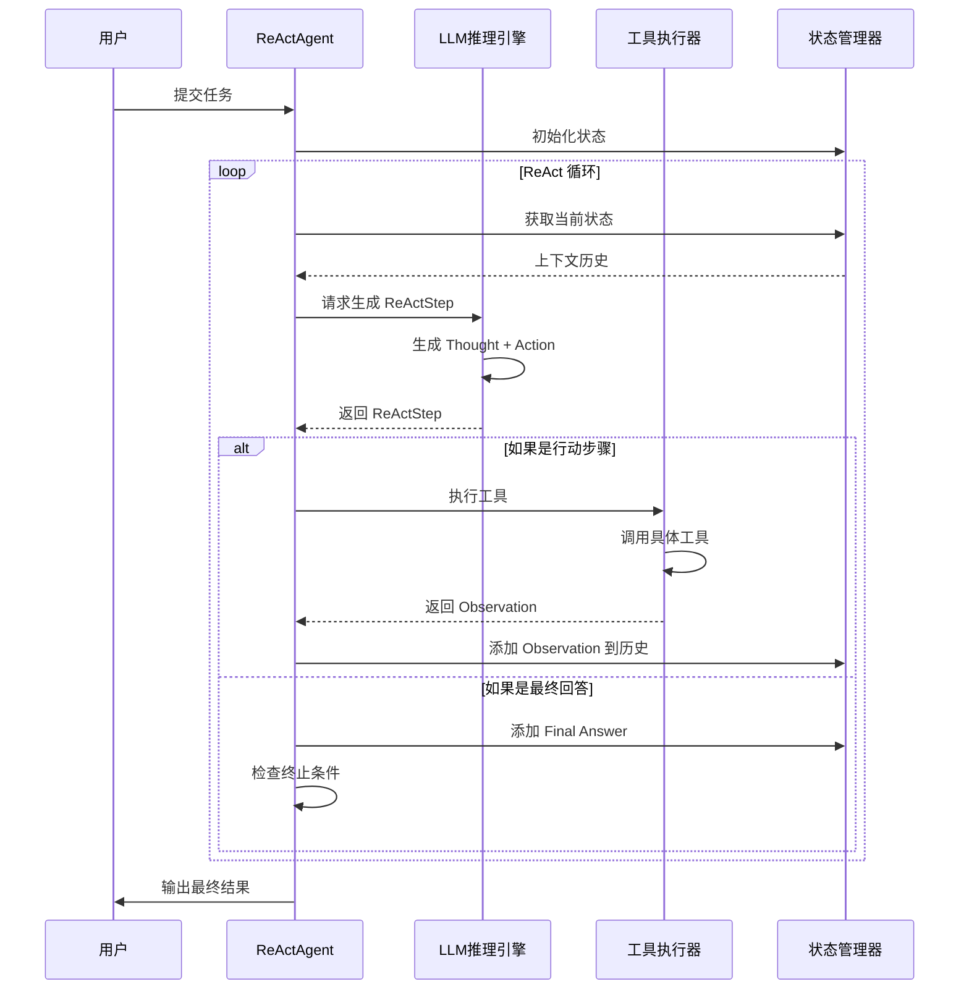

---

## 三、初始化阶段：环境搭建与状态准备

### 3.1 初始化流程

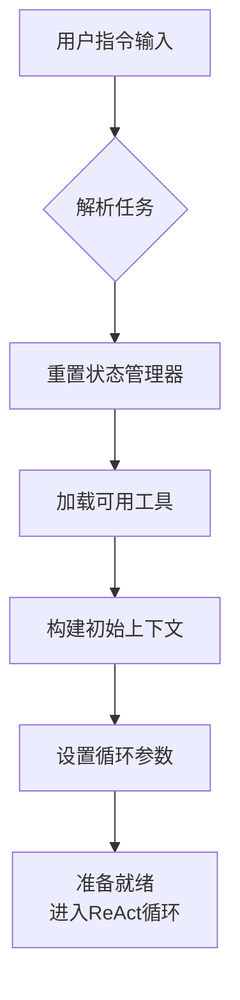

### 3.2 任务解析

```python
class TaskParser:
    """任务解析器"""
    
    def parse(self, user_input: str) -> ParsedTask:
        """解析用户任务"""
        return ParsedTask(
            raw_input=user_input,
            intent=self._extract_intent(user_input),
            entities=self._extract_entities(user_input),
            constraints=self._extract_constraints(user_input),
            complexity=self._assess_complexity(user_input)
        )
    
    def _extract_intent(self, input_text: str) -> str:
        """提取用户意图"""
        # 使用简单的关键词匹配或 LLM 分析
        intents = {
            "查询": ["查询", "查找", "搜索", "找"],
            "创建": ["创建", "新建", "添加", "写"],
            "修改": ["修改", "更新", "编辑", "改变"],
            "删除": ["删除", "移除", "清空"],
            "分析": ["分析", "统计", "对比", "计算"]
        }
        
        for intent, keywords in intents.items():
            if any(kw in input_text for kw in keywords):
                return intent
        return "通用"
    
    def _assess_complexity(self, input_text: str) -> str:
        """评估任务复杂度"""
        # 简单的长度和结构分析
        if len(input_text) > 100 or "并且" in input_text or "同时" in input_text:
            return "复杂"
        return "简单"
```

### 3.3 工具加载与注册

```python
class ToolRegistry:
    """工具注册表"""
    
    def __init__(self):
        self.tools = {}
        self.tool_descriptions = []
    
    def register(self, tool: Tool):
        """注册工具"""
        self.tools[tool.name] = tool
        self.tool_descriptions.append({
            "name": tool.name,
            "description": tool.description,
            "parameters": tool.parameters_schema
        })
    
    def get_tool(self, name: str) -> Tool:
        """获取工具"""
        return self.tools.get(name)
    
    def get_all_descriptions(self) -> List[Dict]:
        """获取所有工具描述"""
        return self.tool_descriptions


# 初始化示例
def initialize_tools() -> ToolRegistry:
    """初始化工具注册表"""
    registry = ToolRegistry()
    
    # 注册计算器工具
    registry.register(Tool(
        name="calculator",
        description="执行数学计算，包括加、减、乘、除等基本运算",
        parameters_schema={
            "expression": {"type": "string", "description": "数学表达式，如 '2 + 3 * 4'"}
        },
        execute=lambda expr: eval(expr)  # 简化示例
    ))
    
    # 注册天气查询工具
    registry.register(Tool(
        name="weather_lookup",
        description="查询指定城市的当前天气状况",
        parameters_schema={
            "city": {"type": "string", "description": "城市名称，如 '北京'"}
        },
        execute=lambda city: f"{city}当前温度25°C，晴"
    ))
    
    # 注册文档搜索工具
    registry.register(Tool(
        name="search_documents",
        description="在知识库中搜索相关文档",
        parameters_schema={
            "query": {"type": "string", "description": "搜索关键词"},
            "top_k": {"type": "integer", "description": "返回结果数量"}
        },
        execute=lambda query, top_k=5: [f"文档{i}: 关于{query}的内容" for i in range(top_k)]
    ))
    
    return registry
```

### 3.4 初始上下文构建

```python
class InitialContextBuilder:
    """初始上下文构建器"""
    
    def build(self, user_query: str, tools: List[Dict]) -> List[Dict]:
        """构建初始对话上下文"""
        system_prompt = self._build_system_prompt(tools)
        
        return [
            system_prompt,
            {"role": "user", "content": user_query}
        ]
    
    def _build_system_prompt(self, tools: List[Dict]) -> Dict:
        """构建系统提示"""
        tools_text = self._format_tools(tools)
        
        system_content = f"""你是一个智能Agent。对于每个任务，你需要使用"思考-行动-观察"循环来解决。

## 可用工具
{tools_text}

## 工作流程
对于每一步，请按以下格式输出：

1. Thought: 思考当前状态，分析需要什么信息，规划下一步
2. Action: 选择要使用的工具名称
3. Action Input: 工具调用的JSON格式参数

当任务完成时，输出：
1. Thought: 总结任务完成情况
2. Final Answer: 直接回答用户的问题

## 示例
用户问题：计算15加27
Thought: 用户想要计算15加27，我需要使用计算器工具。
Action: calculator
Action Input: {{"expression": "15 + 27"}}

## 注意事项
- 每次只做一个行动
- 仔细观察结果，基于观察决定下一步
- 如果工具失败，尝试其他方法
- 不要编造信息，只基于观察到的结果"""
        
        return {
            "role": "system",
            "content": system_content
        }
    
    def _format_tools(self, tools: List[Dict]) -> str:
        """格式化工具描述"""
        formatted = []
        for tool in tools:
            params = json.dumps(tool["parameters"], ensure_ascii=False, indent=2)
            formatted.append(f"""工具名: {tool['name']}
描述: {tool['description']}
参数: {params}""")
        return "\n\n".join(formatted)
```

---

## 四、Thought-Action-Observation 循环详解

### 4.1 循环整体流程

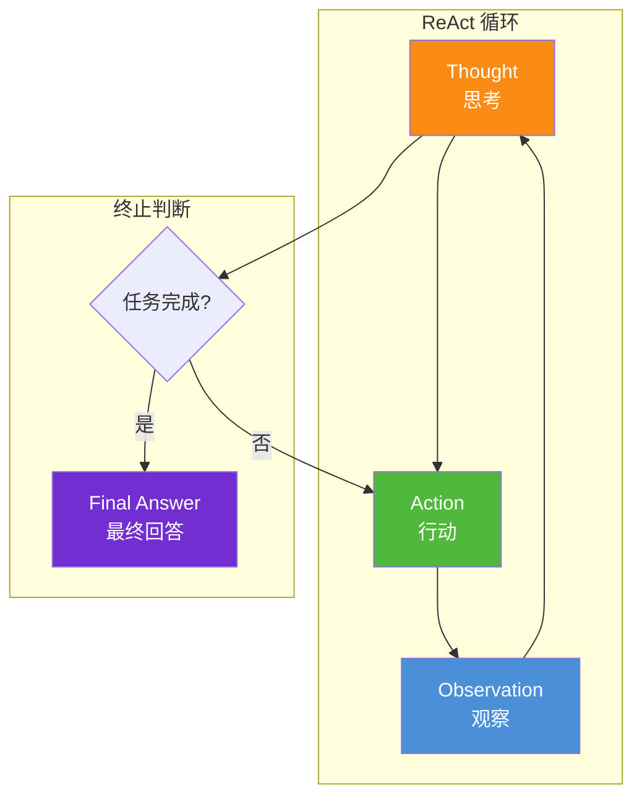

### 4.2 Thought（思考）阶段

#### 4.2.1 Thought 的本质

Thought 是 ReAct 的**推理核心**，LLM 在这一步需要：
1. **分析当前状态**：回顾之前的所有交互历史，理解当前进展
2. **评估信息缺口**：判断还缺少哪些信息
3. **规划下一步**：决定应该采取什么行动
4. **反思调整**：如果之前的行动失败，思考新的策略

#### 4.2.2 Thought 生成机制

```python
class ThoughtGenerator:
    """思考生成器"""
    
    async def generate(self, context: List[Dict], 
                        tools: List[ToolDefinition]) -> Thought:
        """生成思考过程"""
        # 构建 LLM Prompt
        prompt = self._build_thought_prompt(context, tools)
        
        # LLM 生成
        response = await self.llm.generate(prompt)
        
        # 提取思考内容
        thought_text = self._extract_thought(response)
        
        return Thought(
            content=thought_text,
            reasoning_type=self._classify_reasoning(thought_text),
            confidence=self._assess_confidence(thought_text)
        )
    
    def _build_thought_prompt(self, context: List[Dict], 
                               tools: List[ToolDefinition]) -> str:
        """构建思考 Prompt"""
        recent_observations = self._get_recent_observations(context)
        completed_actions = self._get_completed_actions(context)
        
        return f"""基于以下信息进行思考：

已完成的行动：{completed_actions}
最近的观察结果：{recent_observations}

请思考：
1. 当前任务进展如何？
2. 还需要什么信息？
3. 下一步应该采取什么行动？"""
    
    def _classify_reasoning(self, thought: str) -> str:
        """分类推理类型"""
        if "分析" in thought or "评估" in thought:
            return "分析推理"
        elif "因为" in thought or "所以" in thought:
            return "因果推理"
        elif "尝试" in thought or "应该" in thought:
            return "规划推理"
        elif "检查" in thought or "验证" in thought:
            return "验证推理"
        return "通用推理"
```

#### 4.2.3 Thought 分类体系

| 推理类型 | 说明 | 示例 |
|---------|------|------|
| **分析推理** | 分析当前状态和信息 | "分析当前数据，发现缺失订单信息" |
| **规划推理** | 规划下一步行动 | "应该先查询用户订单，再检查库存" |
| **因果推理** | 因果关系推导 | "因为查询失败，所以需要换用关键词搜索" |
| **验证推理** | 验证当前结果 | "检查返回结果是否包含所有必要字段" |
| **反思推理** | 反思并调整策略 | "之前的方法效率太低，改用并行查询" |

### 4.3 Action（行动）阶段

#### 4.3.1 Action 的决策逻辑

Action 是将 Thought 转化为**具体工具调用**的过程：

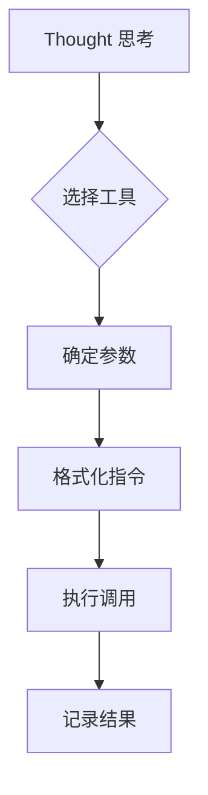

#### 4.3.2 Action 生成实现

```python
class ActionGenerator:
    """行动生成器"""
    
    def __init__(self, tool_executor: ToolExecutor):
        self.executor = tool_executor
    
    async def generate_and_execute(self, thought: Thought, 
                                     context: List[Dict]) -> ActionResult:
        """生成并执行行动"""
        # Step 1: 根据 Thought 选择工具
        tool_name = self._select_tool(thought, context)
        
        # Step 2: 构建参数
        params = self._build_params(tool_name, thought, context)
        
        # Step 3: 格式化行动指令
        action = Action(
            tool_name=tool_name,
            params=params,
            thought_ref=thought.id
        )
        
        # Step 4: 执行行动
        execution_result = await self.executor.execute(action)
        
        return ActionResult(
            action=action,
            execution=execution_result
        )
    
    def _select_tool(self, thought: Thought, context: List[Dict]) -> str:
        """根据思考选择工具"""
        # 分析 thought 中的意图关键词
        keywords = self._extract_keywords(thought.content)
        
        # 匹配最合适的工具
        for tool_name, tool in self.available_tools.items():
            if any(kw in tool.description for kw in keywords):
                return tool_name
        
        # 默认返回最通用的工具
        return "general_tool"
    
    def _build_params(self, tool_name: str, thought: Thought, 
                        context: List[Dict]) -> Dict:
        """构建工具参数"""
        # 从 context 中提取必要的参数值
        params = {}
        
        # 解析 thought 中的行动意图
        action_intent = self._parse_action_intent(thought.content)
        
        # 根据工具要求填充参数
        tool_schema = self.tool_registry.get_schema(tool_name)
        for param_name, param_spec in tool_schema.items():
            if param_name in action_intent:
                params[param_name] = action_intent[param_name]
            else:
                # 从最近的 Observation 中尝试获取
                params[param_name] = self._extract_from_observations(
                    param_name, context
                )
        
        return params
```

#### 4.3.3 行动类型划分

| 行动类型 | 说明 | 示例 |
|---------|------|------|
| **查询行动** | 获取信息 | search_documents, database_query |
| **操作行动** | 执行操作 | create_record, update_config |
| **分析行动** | 数据分析 | calculate, analyze_data |
| **创建行动** | 创建内容 | generate_text, create_document |
| **验证行动** | 检查结果 | validate_result, check_status |

### 4.4 Observation（观察）阶段

#### 4.4.1 Observation 的信息提取

Observation 是从工具执行结果中**提取关键信息**并反馈给 LLM 的过程：

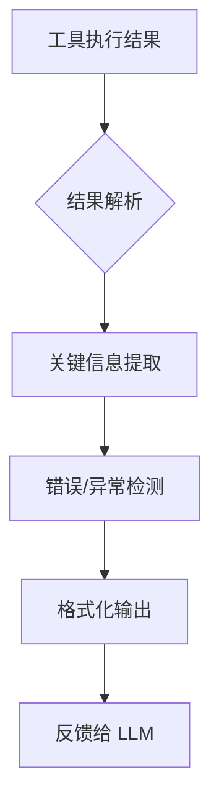

#### 4.4.2 Observation 处理实现

```python
class ObservationProcessor:
    """观察处理器"""
    
    def process(self, execution_result: ExecutionResult) -> Observation:
        """处理工具执行结果"""
        # Step 1: 解析原始结果
        parsed_result = self._parse_result(execution_result.raw_output)
        
        # Step 2: 提取关键信息
        key_findings = self._extract_key_information(parsed_result)
        
        # Step 3: 检测错误和异常
        errors = self._detect_errors(execution_result, parsed_result)
        
        # Step 4: 计算结果摘要
        summary = self._summarize_result(parsed_result, errors)
        
        return Observation(
            original_result=execution_result.raw_output,
            parsed_result=parsed_result,
            key_findings=key_findings,
            errors=errors,
            summary=summary,
            is_successful=len(errors) == 0
        )
    
    def _extract_key_information(self, parsed_result: Dict) -> List[Finding]:
        """提取关键信息"""
        findings = []
        
        # 检查常见字段
        if "data" in parsed_result:
            findings.append(Finding(
                type="data",
                content=f"获取到数据：{len(parsed_result['data'])}条记录"
            ))
        
        if "result" in parsed_result:
            findings.append(Finding(
                type="result",
                content=f"执行结果：{parsed_result['result']}"
            ))
        
        if "error" in parsed_result:
            findings.append(Finding(
                type="error",
                content=f"出现错误：{parsed_result['error']}"
            ))
        
        return findings
    
    def _summarize_result(self, parsed_result: Dict, 
                            errors: List[Error]) -> str:
        """生成结果摘要"""
        if errors:
            error_summary = "; ".join(e.message for e in errors)
            return f"工具执行出现问题：{error_summary}"
        
        # 简洁摘要
        if isinstance(parsed_result, str):
            return f"工具返回：{parsed_result[:100]}..."
        elif isinstance(parsed_result, dict):
            keys = list(parsed_result.keys())[:5]
            return f"工具返回结果，包含字段：{', '.join(keys)}"
        else:
            return f"工具成功执行，返回类型：{type(parsed_result).__name__}"
```

#### 4.4.3 Observation 的价值

| 价值维度 | 说明 | 对循环的影响 |
|---------|------|-------------|
| **信息反馈** | 将执行结果传回 LLM | 驱动下一轮 Thought |
| **错误检测** | 发现执行失败 | 触发错误恢复或重试 |
| **进度追踪** | 记录每步进展 | 支持多步任务的逐步完成 |
| **质量保证** | 验证结果有效性 | 避免错误积累 |

### 4.5 三环节的信息传递

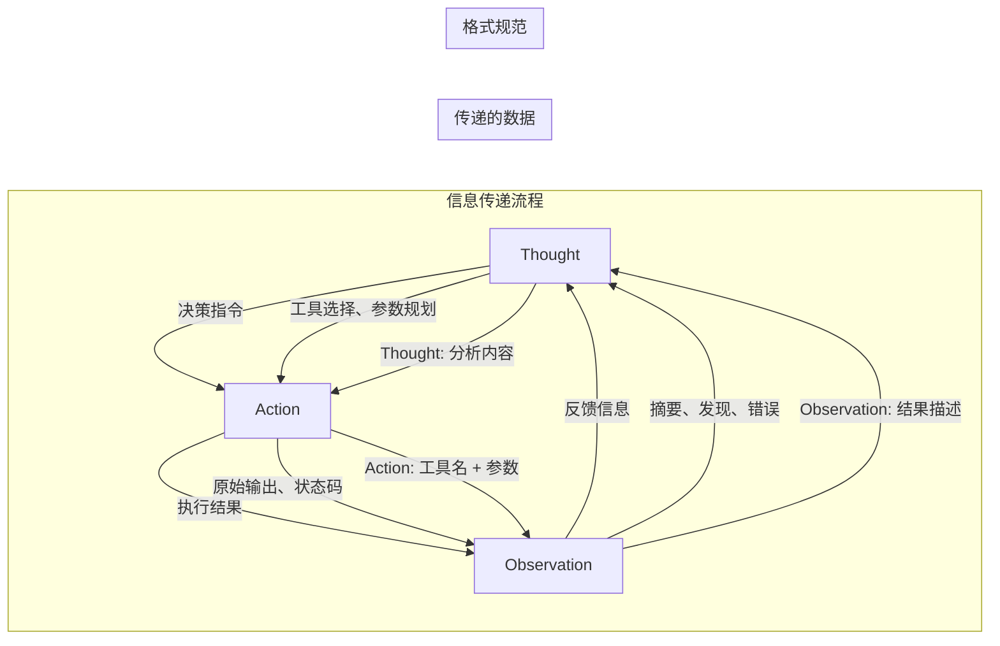

---

## 五、状态管理与循环控制

### 5.1 状态定义

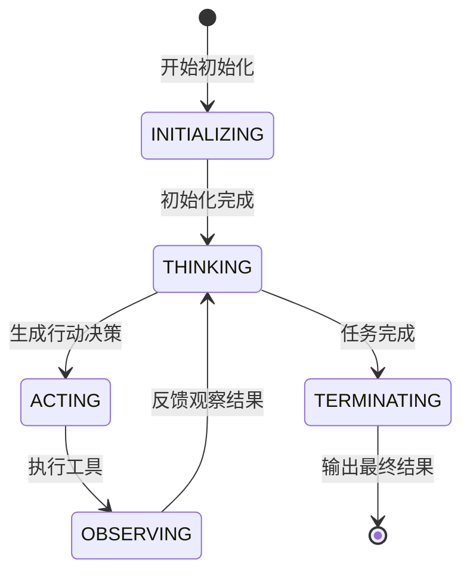

### 5.2 循环终止条件

#### 5.2.1 终止条件类型

| 条件类型 | 说明 | 检测方式 |
|---------|------|---------|
| **任务完成** | LLM 判定任务已解决 | 检查 Final Answer |
| **最大迭代** | 达到最大循环次数 | 计数器检查 |
| **Token 限制** | 上下文 Token 超限 | Token 计数 |
| **连续错误** | 多次执行失败 | 错误计数 |
| **超时** | 执行时间过长 | 计时器 |

#### 5.2.2 终止检测实现

```python
class TerminationDetector:
    """终止检测器"""
    
    def __init__(self, config: TerminationConfig):
        self.max_iterations = config.max_iterations  # 默认15
        self.max_total_tokens = config.max_total_tokens  # 默认10000
        self.max_consecutive_errors = config.max_errors  # 默认3
        self.timeout_seconds = config.timeout  # 默认300
    
    def check(self, state: AgentState, iteration: int, 
                total_tokens: int, consecutive_errors: int,
                elapsed_time: float, last_step: ReActStep) -> TerminationCheck:
        """检查是否应该终止"""
        reasons = []
        
        # 条件1：LLM 判定完成
        if last_step.type == "final":
            return TerminationCheck(
                should_terminate=True,
                reason="LLM判定任务完成",
                final_answer=last_step.final_answer
            )
        
        # 条件2：达到最大迭代次数
        if iteration >= self.max_iterations:
            reasons.append(f"达到最大迭代次数({self.max_iterations})")
        
        # 条件3：Token 超限
        if total_tokens >= self.max_total_tokens:
            reasons.append(f"Token 使用超限({total_tokens}/{self.max_total_tokens})")
        
        # 条件4：连续错误
        if consecutive_errors >= self.max_consecutive_errors:
            reasons.append(f"连续错误过多({consecutive_errors}次)")
        
        # 条件5：超时
        if elapsed_time >= self.timeout_seconds:
            reasons.append(f"执行超时({elapsed_time:.1f}秒)")
        
        should_terminate = len(reasons) > 0
        
        return TerminationCheck(
            should_terminate=should_terminate,
            reason="; ".join(reasons) if reasons else None,
            iteration=iteration,
            total_tokens=total_tokens,
            elapsed_time=elapsed_time
        )
```

### 5.3 循环控制策略

#### 5.3.1 自适应循环

```python
class AdaptiveLoopController:
    """自适应循环控制器"""
    
    def __init__(self):
        self.iteration_history = []
    
    def adjust_strategy(self, current_step: ReActStep,
                          observation: Observation) -> AdjustedStrategy:
        """根据当前情况调整循环策略"""
        # 分析历史模式
        if self._detect_loop_pattern():
            return self._apply_break_strategy()
        
        if self._detect_progress_stagnation():
            return self._apply_exploration_strategy()
        
        return AdjustedStrategy(
            continue_loop=True,
            hint=None
        )
    
    def _detect_loop_pattern(self) -> bool:
        """检测是否陷入循环"""
        # 检查最近的行动是否重复
        if len(self.iteration_history) < 3:
            return False
        
        recent_actions = [h.action for h in self.iteration_history[-3:]]
        if len(set(recent_actions)) == 1:
            return True  # 相同的行动连续执行3次
        
        # 检查是否在相同的思考上打转
        recent_thoughts = [h.thought for h in self.iteration_history[-3:]]
        if self._text_similarity(recent_thoughts[0], recent_thoughts[-1]) > 0.8:
            return True
        
        return False
    
    def _apply_break_strategy(self) -> AdjustedStrategy:
        """应用打破循环策略"""
        return AdjustedStrategy(
            continue_loop=True,
            hint="检测到重复行动，尝试使用不同的方法解决问题"
        )
    
    def _detect_progress_stagnation(self) -> bool:
        """检测是否进展停滞"""
        if len(self.iteration_history) < 5:
            return False
        
        # 检查最近的 Observation 是否没有实质进展
        recent_observations = [
            h.observation for h in self.iteration_history[-5:]
        ]
        
        # 如果所有观察结果都显示失败或无意义
        success_count = sum(1 for obs in recent_observations 
                          if obs and obs.is_successful)
        return success_count <= 1  # 5步中只有不到1步成功
```

---

## 六、信息传递与数据流向

### 6.1 完整数据流图

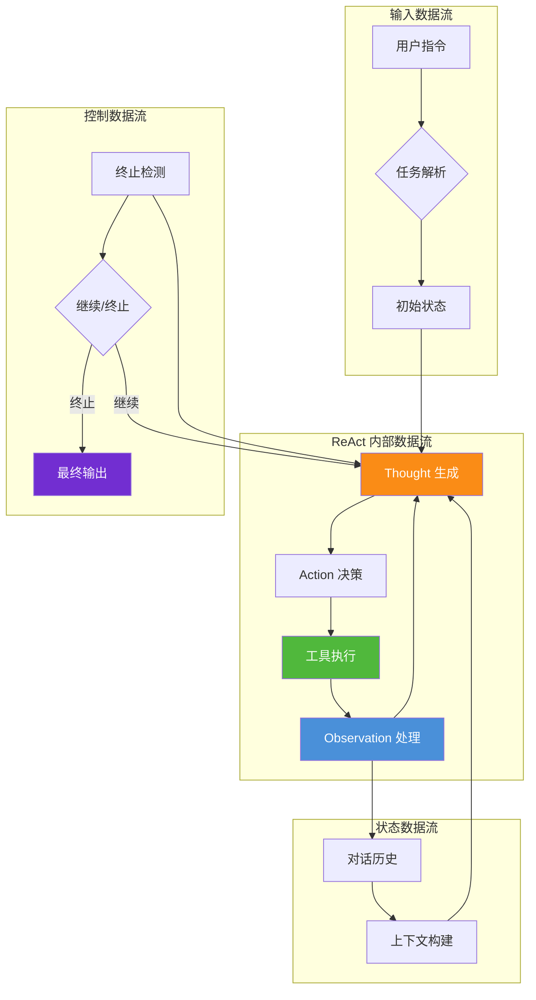

### 6.2 消息格式规范

#### 6.2.1 Thought 消息格式

```json
{
  "type": "thought",
  "iteration": 3,
  "content": "分析目前的进展：我已经查询了用户订单，现在需要检查库存是否充足。由于订单信息显示有3件商品，我需要使用库存查询工具检查每件商品的可用库存。",
  "reasoning_type": "规划推理",
  "confidence": 0.85,
  "metadata": {
    "based_on_observations": ["第2轮查询结果"],
    "gap_identified": "库存信息",
    "next_step_plan": "查询库存"
  }
}
```

#### 6.2.2 Action 消息格式

```json
{
  "type": "action",
  "iteration": 3,
  "tool_name": "inventory_check",
  "parameters": {
    "product_ids": ["P001", "P002", "P003"],
    "warehouse": "北京仓"
  },
  "reasoning": "需要检查这3个商品在北京仓的库存情况",
  "expected_output": "每个商品的可用库存数量",
  "timeout_ms": 5000
}
```

#### 6.2.3 Observation 消息格式

```json
{
  "type": "observation",
  "iteration": 3,
  "source_action_id": "action_003",
  "success": true,
  "result_summary": "3个商品的库存查询成功",
  "key_findings": [
    {"product": "P001", "stock": 150, "status": "充足"},
    {"product": "P002", "stock": 5, "status": "偏低"},
    {"product": "P003", "stock": 0, "status": "缺货"}
  ],
  "errors": [],
  "raw_output": {"P001": 150, "P002": 5, "P003": 0}
}
```

### 6.3 数据持久化

```python
class ReActLogger:
    """ReAct 过程记录器"""
    
    def __init__(self, log_dir: str = "./react_logs"):
        self.log_dir = log_dir
        self.current_session_id = None
    
    def start_session(self, user_query: str) -> str:
        """开始新会话"""
        self.current_session_id = f"session_{datetime.now().strftime('%Y%m%d_%H%M%S')}"
        session_info = {
            "session_id": self.current_session_id,
            "start_time": datetime.now().isoformat(),
            "user_query": user_query,
            "steps": []
        }
        self._save_session_info(session_info)
        return self.current_session_id
    
    def log_step(self, iteration: int, step_data: Dict):
        """记录单步"""
        log_entry = {
            "iteration": iteration,
            "timestamp": datetime.now().isoformat(),
            **step_data
        }
        
        # 追加到会话日志
        session_file = f"{self.log_dir}/{self.current_session_id}.json"
        with open(session_file, 'r') as f:
            session_data = json.load(f)
        
        session_data["steps"].append(log_entry)
        self._save_session_info(session_data)
    
    def end_session(self, final_result: Dict):
        """结束会话"""
        session_file = f"{self.log_dir}/{self.current_session_id}.json"
        with open(session_file, 'r') as f:
            session_data = json.load(f)
        
        session_data["end_time"] = datetime.now().isoformat()
        session_data["final_result"] = final_result
        session_data["total_iterations"] = len(session_data["steps"])
        
        self._save_session_info(session_data)
    
    def _save_session_info(self, data: Dict):
        """保存会话信息"""
        os.makedirs(self.log_dir, exist_ok=True)
        filepath = f"{self.log_dir}/{self.current_session_id}.json"
        with open(filepath, 'w') as f:
            json.dump(data, f, ensure_ascii=False, indent=2)
```

---

## 七、完整伪代码实现

### 7.1 ReAct Agent 主类

```python
class ReActAgent:
    """
    ReAct Agent 完整实现
    
    核心循环：Thought -> Action -> Observation
    由 LLM 自主驱动循环，结合终止条件控制
    """
    
    def __init__(self, config: AgentConfig):
        # 核心组件
        self.llm_engine = LLMInferenceEngine(config.model)
        self.tool_executor = ToolExecutor(config.tools)
        self.state_manager = StateManager(config.max_iterations)
        self.context_builder = ContextBuilder(config.max_context_tokens)
        self.termination_detector = TerminationDetector(config.termination)
        self.adaptive_controller = AdaptiveLoopController()
        self.logger = ReActLogger()
    
    async def run(self, user_query: str) -> AgentResponse:
        """
        运行 ReAct Agent
        
        完整流程：
        1. 初始化
        2. 进入 Thought-Action-Observation 循环
        3. 检测终止条件
        4. 输出最终结果
        """
        # ============ 初始化阶段 ============
        await self._initialize(user_query)
        
        # ============ 进入 ReAct 循环 ============
        consecutive_errors = 0
        total_tokens_used = 0
        start_time = time.time()
        last_step = None
        
        try:
            while True:
                # ---------- 构建上下文 ----------
                context = self.context_builder.build(
                    self.state_manager
                )
                
                # ---------- Thought 阶段：LLM 生成思考 ----------
                react_step = await self.llm_engine.generate_react_step(
                    context, self.tool_executor.available_tools
                )
                
                last_step = react_step
                self.state_manager.current_state = AgentState.THINKING
                
                # 记录 Thought
                self.state_manager.add_thought(react_step.thought)
                
                # ---------- 终止检查 ----------
                elapsed = time.time() - start_time
                total_tokens_used += self._estimate_tokens(react_step.raw_response)
                
                termination = self.termination_detector.check(
                    state=self.state_manager.current_state,
                    iteration=self.state_manager.iteration_count,
                    total_tokens=total_tokens_used,
                    consecutive_errors=consecutive_errors,
                    elapsed_time=elapsed,
                    last_step=react_step
                )
                
                if termination.should_terminate:
                    if last_step.type == "final":
                        # 正常完成
                        return self._build_success_response(
                            last_step, total_tokens_used, elapsed
                        )
                    else:
                        # 异常终止
                        return self._build_failure_response(
                            termination, last_step, total_tokens_used, elapsed
                        )
                
                # ---------- Action 阶段：执行行动 ----------
                self.state_manager.current_state = AgentState.ACTING
                
                action_result = await self.tool_executor.execute(
                    react_step.action, react_step.action_input
                )
                
                # ---------- Observation 阶段：处理观察 ----------
                self.state_manager.current_state = AgentState.OBSERVING
                
                observation = self.observation_processor.process(
                    action_result
                )
                
                # 错误统计
                if not observation.is_successful:
                    consecutive_errors += 1
                else:
                    consecutive_errors = 0
                
                # 记录到历史
                self.state_manager.add_observation(observation)
                
                # 自适应策略检查
                adjusted = self.adaptive_controller.adjust_strategy(
                    react_step, observation
                )
                if adjusted.hint:
                    self.state_manager.add_system_hint(adjusted.hint)
                
                # ---------- 日志记录 ----------
                self.logger.log_step(
                    self.state_manager.iteration_count,
                    {
                        "thought": react_step.thought,
                        "action": react_step.action,
                        "action_input": react_step.action_input,
                        "observation": observation.summary,
                        "success": observation.is_successful
                    }
                )
        
        except Exception as e:
            # 异常处理
            return AgentResponse(
                status="error",
                final_answer=f"Agent 执行出现异常：{str(e)}",
                iteration_count=self.state_manager.iteration_count,
                total_tokens=total_tokens_used,
                elapsed_time=time.time() - start_time,
                error=str(e),
                history=self.state_manager.get_history()
            )
    
    async def _initialize(self, user_query: str):
        """初始化 Agent 状态"""
        self.state_manager.initialize(user_query)
        self.logger.start_session(user_query)
        
        # 添加系统提示
        system_prompt = self._build_system_prompt()
        self.state_manager.add_system_message(system_prompt)
    
    def _build_success_response(self, final_step, total_tokens, elapsed):
        """构建成功响应"""
        self.logger.end_session({
            "status": "success",
            "answer": final_step.final_answer
        })
        
        return AgentResponse(
            status="completed",
            final_answer=final_step.final_answer,
            thought_process=self.state_manager.get_thought_history(),
            iteration_count=self.state_manager.iteration_count,
            total_tokens=total_tokens,
            elapsed_time=elapsed,
            tools_used=self.state_manager.get_tools_used(),
            confidence=self._estimate_confidence(final_step)
        )
    
    def _build_failure_response(self, termination, last_step, 
                                   total_tokens, elapsed):
        """构建失败响应"""
        self.logger.end_session({
            "status": "terminated",
            "reason": termination.reason
        })
        
        return AgentResponse(
            status="terminated",
            final_answer=f"任务未能完成。原因：{termination.reason}",
            partial_answer=last_step.final_answer if last_step.type == "final" else None,
            iteration_count=self.state_manager.iteration_count,
            total_tokens=total_tokens,
            elapsed_time=elapsed,
            reason=termination.reason,
            history=self.state_manager.get_history()
        )
```

### 7.2 使用示例

```python
# ReAct Agent 使用示例
async def main():
    # 配置 Agent
    config = AgentConfig(
        model=ModelConfig(
            name="gpt-4",
            temperature=0.7,
            max_tokens=2000
        ),
        tools=ToolConfig(
            available_tools=[
                "calculator",
                "weather_lookup",
                "search_documents",
                "code_executor",
                "file_operations"
            ]
        ),
        max_iterations=15,
        max_context_tokens=4000,
        max_total_tokens=10000
    )
    
    # 创建 Agent
    agent = ReActAgent(config)
    
    # 运行任务
    user_query = "北京今天的天气怎么样？如果温度超过30度，帮我推荐一个避暑的地方"
    
    response = await agent.run(user_query)
    
    # 输出结果
    print(f"状态: {response.status}")
    print(f"最终回答: {response.final_answer}")
    print(f"迭代次数: {response.iteration_count}")
    print(f"使用Token: {response.total_tokens}")
    print(f"耗时: {response.elapsed_time:.1f}秒")
    
    # 查看思考过程
    print("\n思考过程:")
    for i, thought in enumerate(response.thought_process, 1):
        print(f"  第{i}步: {thought[:50]}...")
```

---

## 八、端到端案例演示

### 8.1 案例：多步数据查询与分析

#### 任务描述

用户请求："查询上个月北京地区的销售额，如果超过100万，分析主要增长来源"

#### 执行过程

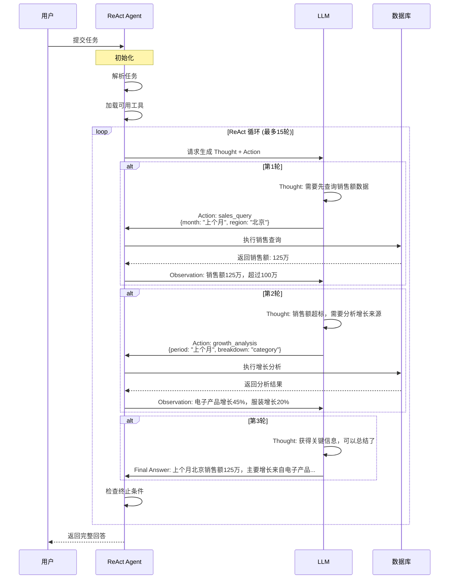

#### 完整交互记录

**第 1 轮：**

| 环节 | 内容 |
|------|------|
| **Thought** | 首先需要获取上个月北京地区的销售数据。我应该使用 sales_query 工具，指定时间范围为上个月，地区为北京。 |
| **Action** | 工具：sales_query<br/>参数：{`month`: "2026-07", `region`: "北京"} |
| **Observation** | 查询成功。上个月（2026年7月）北京地区总销售额为 **1,250,000元**，超过100万阈值。 |

**第 2 轮：**

| 环节 | 内容 |
|------|------|
| **Thought** | 销售额确实超过了100万。现在需要分析增长来源。我应该使用 growth_analysis 工具，按品类细分销售数据，找出主要增长来源。 |
| **Action** | 工具：growth_analysis<br/>参数：{`period`: "2026-07", `breakdown`: "category", `compare_with`: "2026-06"} |
| **Observation** | 分析完成。对比上月增长：<br/>- 电子产品：增长 **45%**（从30万增至43.5万）<br/>- 服装：增长 **20%**（从25万增至30万）<br/>- 食品：增长 **5%**（从35万增至36.75万）<br/>电子产品贡献了主要增长。 |

**第 3 轮：**

| 环节 | 内容 |
|------|------|
| **Thought** | 现在我已经获得了所有必要的信息。销售额超过100万，主要增长来自电子产品（45%增长）和服装（20%增长）。我可以总结并回答用户了。 |
| **Final Answer** | 根据查询结果，上个月（2026年7月）北京地区销售额为 **125万元**，确实超过了100万的阈值。<br/><br/>主要增长来源分析：<br/>1. **电子产品**：增长45%，从30万增至43.5万，贡献了最大的增长份额<br/>2. **服装**：增长20%，从25万增至30万<br/>3. **食品**：增长5%，相对稳定<br/><br/>结论：电子产品是销售增长的主要驱动力。 |

#### 数据统计

| 指标 | 数值 |
|------|------|
| **总迭代次数** | 3 轮 |
| **成功迭代** | 3 轮 |
| **失败迭代** | 0 轮 |
| **使用工具** | sales_query, growth_analysis |
| **总 Token** | 约 3,200 |
| **执行时间** | 约 8.5 秒 |

---

## 九、ReAct 的优势与挑战

### 9.1 核心优势

| 优势 | 说明 | 对比传统方案 |
|------|------|-------------|
| **可解释推理** | 每步都展示 Thought，过程透明 | 传统方案是黑箱，难以理解决策逻辑 |
| **动态决策** | 基于 Observation 灵活调整策略 | 传统方案是预定义流程，缺乏灵活性 |
| **工具自主选择** | LLM 自主决定使用哪个工具 | 传统方案需硬编码工具调用逻辑 |
| **自我纠错** | 发现错误后自动反思并尝试其他方法 | 传统方案错误处理能力有限 |
| **开放式问题** | 擅长处理复杂、多步骤的开放式问题 | 传统方案在开放式任务上表现差 |

### 9.2 潜在挑战

| 挑战 | 说明 | 影响程度 | 应对策略 |
|------|------|---------|---------|
| **不可预测性** | LLM 输出具有随机性，相同输入可能产生不同路径 | 中 | 设置温度参数、增加约束 |
| **成本较高** | 每轮都调用 LLM，Token 消耗大 | 高 | 优化 Prompt、使用小模型 |
| **循环风险** | 可能陷入无限循环或死循环 | 高 | 设置最大迭代数、检测循环模式 |
| **推理质量** | Thought 质量依赖 LLM 能力 | 高 | 选用强模型、优化系统提示 |
| **响应延迟** | 多轮 LLM 调用导致延迟较高 | 中 | 异步优化、流式输出 |
| **幻觉问题** | LLM 可能生成虚假的 Thought 或 Action | 中 | 验证工具结果、添加安全检查 |

### 9.3 ReAct 与 OTA 的互补关系

| 场景 | 推荐模式 | 原因 |
|------|---------|------|
| **固定流程任务** | OTA | 流程确定，可预测，效率更高 |
| **开放式问题** | ReAct | 需要灵活推理和动态决策 |
| **多步复杂任务** | ReAct | 需要中间推理和策略调整 |
| **高安全要求** | OTA + ReAct | OTA 做安全约束，ReAct 做灵活推理 |
| **实时性要求** | OTA | 减少 LLM 调用次数 |
| **可解释性要求** | ReAct | Thought 过程天然可解释 |

### 9.4 改进方向

#### 9.4.1 ReAct + Reflection（反思）

```python
class ReActWithReflection(ReActAgent):
    """带反思能力的 ReAct Agent"""
    
    async def _reflect(self, thought: Thought, 
                        observation: Observation) -> Reflection:
        """对当前步骤进行反思"""
        reflection_prompt = f"""
        请反思以下交互是否有效：
        Thought: {thought.content}
        Observation: {observation.summary}
        
        评估：
        1. 当前步骤是否有效推进了任务？
        2. 下一步是否需要调整策略？
        3. 有没有遗漏的信息或更好的方法？
        """
        
        reflection_result = await self.llm.generate(reflection_prompt)
        
        return Reflection(
            is_effective=self._parse_effectiveness(reflection_result),
            strategy_adjustment=self._parse_adjustment(reflection_result),
            suggestions=self._parse_suggestions(reflection_result)
        )
```

#### 9.4.2 ReAct + Planning（规划）

```python
class PlannedReActAgent(ReActAgent):
    """带规划能力的 ReAct Agent"""
    
    async def _create_initial_plan(self, user_query: str) -> Plan:
        """创建初始计划"""
        plan_prompt = f"""
        在执行之前，请先为以下任务制定执行计划：
        任务：{user_query}
        
        请输出：
        1. 任务分解（子步骤列表）
        2. 每步使用的工具
        3. 预期结果
        4. 风险评估
        """
        
        plan_result = await self.llm.generate(plan_prompt)
        return self._parse_plan(plan_result)
    
    async def _update_plan(self, current_plan: Plan, 
                             observation: Observation) -> Plan:
        """根据观察结果更新计划"""
        update_prompt = f"""
        原计划：{current_plan.to_text()}
        当前观察：{observation.summary}
        
        请评估计划是否需要调整，并输出更新后的计划。
        """
        
        updated_result = await self.llm.generate(update_prompt)
        return self._parse_plan(updated_result)
```

---

## 十、总结与展望

### 10.1 核心要点总结

本文档详细阐述了 ReAct Agent 的完整工作流程，核心要点包括：

1. **ReAct 的本质**：通过 Thought-Action-Observation 循环，让 LLM 不仅做决策，还展示完整的推理过程
2. **三环节交互**：
   - **Thought**：分析状态、规划下一步、选择工具
   - **Action**：执行工具调用、获取原始结果
   - **Observation**：处理结果、提取信息、反馈给 LLM
3. **循环控制**：通过最大迭代次数、Token 限制、循环检测等机制确保循环可靠终止
4. **信息传递**：标准化的消息格式，支持 Thought、Action、Observation 之间的无缝衔接
5. **状态管理**：完整的对话历史、进度追踪、自适应策略调整

### 10.2 技术实现要点

| 技术点 | 实现方式 | 关键注意事项 |
|--------|---------|-------------|
| **LLM 驱动** | LLM 生成 ReAct 步骤 | 选择强推理模型、优化温度参数 |
| **工具注册** | ToolRegistry 统一管理 | 清晰的工具描述、准确的参数定义 |
| **循环终止** | TerminationDetector 多条件检测 | 设置合理阈值、实现优雅终止 |
| **上下文管理** | ContextBuilder 动态截断 | 保留关键信息、控制 Token 开销 |
| **错误恢复** | AdaptiveLoopController 自适应 | 检测循环模式、提供破局提示 |

### 10.3 与系列文档的关系

| 文档 | 视角 | 本文档补充 |
|------|------|-----------|
| `1企业级Agent系统完整设计方案.md` | 系统整体架构 | ReAct 在架构中的实现位置 |
| `2Agent执行流程详解.md` | 任务执行生命周期 | ReAct 循环的执行细节 |
| `3Agent核心工作流程_Observe_Think_Act.md` | OTA 通用模式 | ReAct 与 OTA 的对比分析 |
| **本文档** | ReAct 具体实现 | Thought-Action-Observation 的深入解析 |

### 10.4 未来发展趋势

| 趋势方向 | 说明 | 预期影响 |
|---------|------|---------|
| **多模态 ReAct** | 支持图像、语音等多模态输入 | 扩展应用场景 |
| **ReAct + Agent 集群** | 多个 ReAct Agent 协作 | 处理更复杂任务 |
| **轻量化 ReAct** | 使用小模型实现快速推理 | 降低成本、提升速度 |
| **可解释性增强** | 更详细的 Thought 追踪和可视化 | 提升信任度和可调试性 |
| **ReAct 学习** | Agent 从历史交互中学习优化 | 持续改进性能 |
