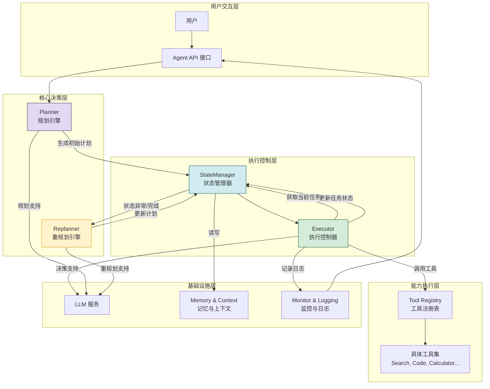
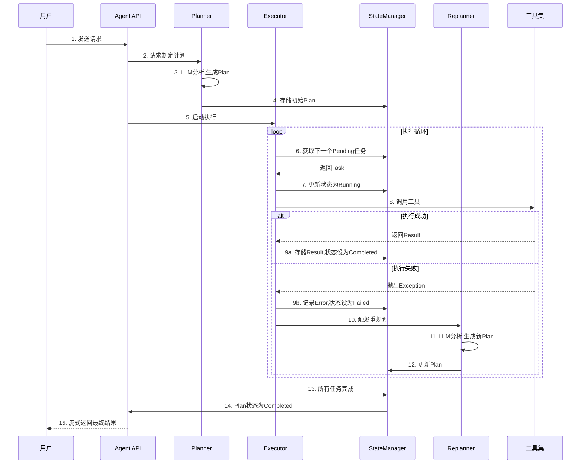
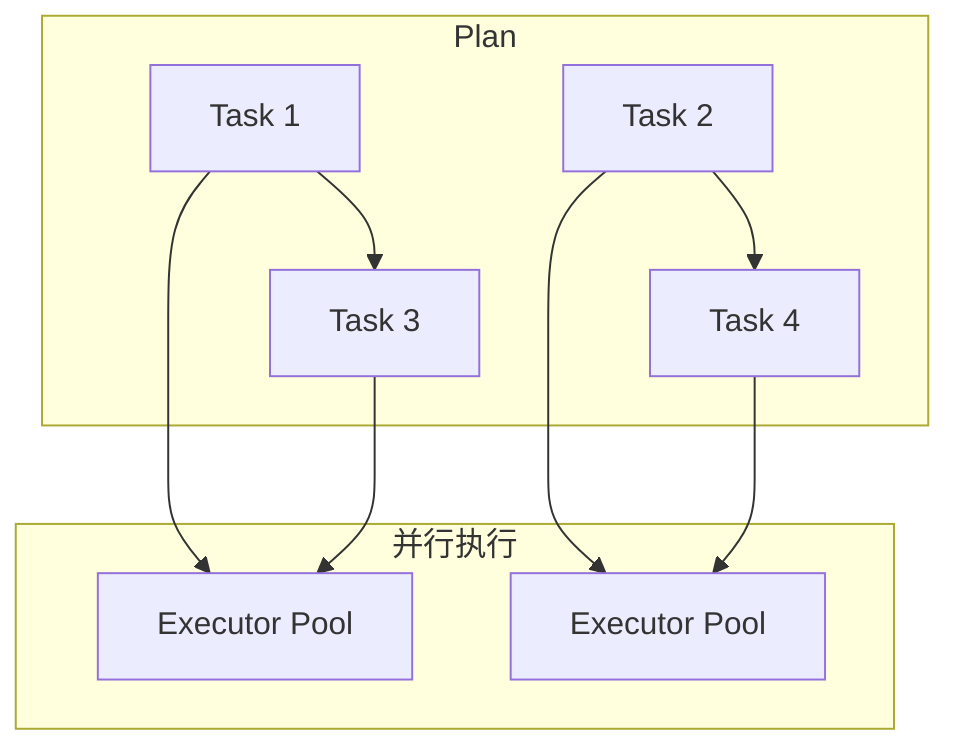

# Plan-and-Execute Agent 完整实现方案

> 文档定位:系统阐述 Plan-and-Execute (PE) Agent 的核心设计思想、系统架构、关键组件实现、工作流程与工程落地细节,为开发者提供可直接参考的实现蓝图。
>
> 阅读建议:本文建议结合 [38Agent核心工作流程_Observe_Think_Act.md](./38Agent核心工作流程_Observe_Think_Act.md) 与 [39ReAct_Agent工作流程详解.md](./39ReAct_Agent工作流程详解.md) 一并阅读,对比 ReAct (Reasoning + Acting) 与 Plan-and-Execute (Planning + Execution) 的适用场景与架构差异。

---

## 目录

- [一、Plan-and-Execute 模式概述](#一plan-and-execute-模式概述)
- [二、系统架构设计](#二系统架构设计)
- [三、核心组件划分与实现](#三核心组件划分与实现)
- [四、关键算法与数据结构](#四关键算法与数据结构)
- [五、完整工作流程设计](#五完整工作流程设计)
- [六、组件交互与通信机制](#六组件交互与通信机制)
- [七、异常处理与容错机制](#七异常处理与容错机制)
- [八、性能优化策略](#八性能优化策略)
- [九、技术难点与解决方案](#九技术难点与解决方案)
- [十、总结与展望](#十总结与展望)

---

## 一、Plan-and-Execute 模式概述

### 1.1 什么是 Plan-and-Execute

**Plan-and-Execute (PE)** 是一种经典的 Agent 设计模式,其核心思想是将复杂任务的解决过程**解耦为两个独立阶段**:

1. **规划阶段 (Planning)**: Agent 首先对用户请求进行深入分析,制定一个完整、可执行的计划 (Plan),包含一系列有序的子任务 (Tasks)。
2. **执行阶段 (Execution)**: Agent 严格按照制定的计划,逐步执行每个子任务,并根据执行结果进行状态更新。

与 ReAct (Reasoning + Acting) 模式的"边思考边行动"不同,PE 模式强调"先规划,后执行",具有更强的计划性和可预测性。

### 1.2 核心思想与优势

#### 1.2.1 核心思想

*   **解耦**: 将"制定计划"与"执行计划"分离,降低单一 LLM 调用的复杂度。
*   **可控**: 计划是显式的、可检查的,开发者和用户可以干预。
*   **可靠**: 每个步骤独立执行,失败时可单独重试或调整,而不影响全局。

#### 1.2.2 相比 ReAct 的优势

| 维度 | ReAct (Reason + Act) | Plan-and-Execute (Plan + Execute) |
| :--- | :--- | :--- |
| **决策粒度** | 每一步都进行推理和决策,动态调整 | 先做全局规划,再逐步执行,中间可重规划 |
| **可预测性** | 较低,难以预测下一步行为 | 较高,计划明确,执行路径清晰 |
| **可解释性** | 需要分析推理链才能理解 | 计划本身即为最高层解释 |
| **稳定性** | 容易陷入循环或偏离目标 | 有明确的停止条件和检查点 |
| **适用场景** | 探索性、不确定性任务 | 结构化、可分解的复杂任务 |
| **开销** | Token 消耗较大 (每步都要推理) | 前期规划消耗 Token,执行阶段相对稳定 |

### 1.3 适用场景

PE 模式特别适用于以下场景:
*   **复杂工作流自动化**: 例如 "分析业务需求 -> 生成技术方案 -> 编写单元测试 -> 生成部署文档"。
*   **多步骤数据处理**: 例如 "从数据库提取数据 -> 清洗数据 -> 进行统计分析 -> 生成可视化图表"。
*   **代码重构与迁移**: 将大型代码库的重构任务分解为多个可执行的重构步骤。
*   **需要人工审核的流程**: 在规划完成后,用户可以先审核计划,确认无误后再执行。

---

## 二、系统架构设计

### 2.1 整体架构图

Plan-and-Execute Agent 采用分层、模块化的架构设计,主要由五大核心模块组成:



### 2.2 架构分层说明

1.  **用户交互层**: 提供 Agent 的对外接口,接收用户输入,输出执行结果,支持流式响应。
2.  **核心决策层**:
    *   **Planner**: 初始规划器,负责将用户需求转化为详细的执行计划。
    *   **Replanner**: 动态调整器,在执行过程中根据反馈对计划进行修正、补充或终止。
3.  **执行控制层**:
    *   **Executor**: 执行控制器,负责从计划中取出任务、调用工具、处理结果。
    *   **StateManager**: 状态管理器,维护计划和任务的生命周期状态,是整个系统的状态单一事实来源 (Single Source of Truth)。
4.  **能力执行层**: 封装 Agent 可用的所有具体能力 (Tools),通过统一接口注册和调用。
5.  **基础设施层**: 提供 LLM 服务、上下文记忆、日志监控等基础支撑。

---

## 三、核心组件划分与实现

### 3.1 Planner (规划引擎)

Planner 是 PE Agent 的"大脑",负责理解用户意图并制定行动计划。

#### 3.1.1 核心职责

*   **意图理解**: 精确解析用户的自然语言请求,提取核心目标、约束条件和期望输出。
*   **任务分解**: 将复杂目标分解为一系列逻辑相关、可独立执行的子任务。
*   **依赖管理**: 分析子任务之间的依赖关系 (如数据依赖、时序依赖),确定执行顺序。
*   **工具匹配**: 为每个子任务匹配合适的工具和调用方式。

#### 3.1.2 实现示例 (Python)

```python
from typing import List, Dict, Any
from pydantic import BaseModel

class Task(BaseModel):
    id: str
    description: str
    tool_name: str
    tool_args: Dict[str, Any]
    status: str = "pending"  # pending, running, completed, failed
    result: Any = None
    error: str = None
    depends_on: List[str] = [] # 依赖的任务ID列表

class Plan(BaseModel):
    id: str
    user_goal: str
    tasks: List[Task]
    current_task_index: int = 0
    status: str = "active" # active, completed, failed, cancelled

class Planner:
    def __init__(self, llm_client, tool_registry):
        self.llm = llm_client
        self.tool_registry = tool_registry

    def create_initial_plan(self, user_input: str) -> Plan:
        """根据用户输入生成初始计划"""
        # 1. 获取可用工具描述
        available_tools = self.tool_registry.get_all_tools_description()

        # 2. 构造 Prompt, 让 LLM 分解任务
        prompt = f"""
        你是一个任务规划专家。请将以下用户请求分解为一系列可执行的任务。
        可用工具列表:
        {available_tools}

        用户请求: "{user_input}"

        请生成一个 JSON 格式的计划,包含:
        - plan_id: 唯一的计划ID
        - tasks: 任务列表,每个任务包含:
            - id: 唯一的任务ID (如 task_1)
            - description: 任务的具体描述
            - tool_name: 需要使用的工具名称
            - tool_args: 工具参数 (JSON对象)
            - depends_on: 依赖的任务ID列表 (如 ["task_1"], 空列表表示无依赖)

        确保任务顺序合理,依赖正确,并最终能完成用户请求。
        """
        
        # 3. 调用 LLM 生成计划
        response = self.llm.generate_json(prompt)
        
        # 4. 解析并验证计划
        plan_data = response.get("plan", response) # 兼容不同返回格式
        plan = Plan(**plan_data)
        
        return plan
```

### 3.2 Executor (执行控制器)

Executor 是 PE Agent 的"肢体",负责严格按照计划执行任务。

#### 3.2.1 核心职责

*   **任务调度**: 从计划中取出状态为 `pending` 且依赖已满足的任务。
*   **工具调用**: 调用对应的工具执行任务,捕获结果或异常。
*   **结果处理**: 分析工具执行结果,判断任务是否成功。
*   **状态流转**: 实时更新任务的状态 (`running` -> `completed` 或 `failed`)。

#### 3.2.2 实现示例 (Python)

```python
import time

class Executor:
    def __init__(self, state_manager, tool_registry, replanner):
        self.state_manager = state_manager
        self.tool_registry = tool_registry
        self.replanner = replanner

    def execute_plan(self, plan_id: str):
        """执行计划的主循环"""
        while True:
            # 1. 获取当前可执行的任务
            task = self.state_manager.get_next_executable_task(plan_id)
            
            if not task:
                # 没有可执行任务,检查计划是否结束
                plan = self.state_manager.get_plan(plan_id)
                if all(t.status == "completed" for t in plan.tasks):
                    self.state_manager.update_plan_status(plan_id, "completed")
                    print("✅ 计划执行成功!")
                    return
                elif plan.status == "active":
                    # 可能是卡住了,触发重规划
                    print("⚠️  没有可执行任务,触发重规划...")
                    self.replanner.replan(plan_id)
                    continue
                else:
                    print("🛑 计划已终止。")
                    return

            # 2. 执行任务
            self.state_manager.update_task_status(plan_id, task.id, "running")
            print(f"🚀 执行任务: {task.description}")

            try:
                tool = self.tool_registry.get_tool(task.tool_name)
                # (可选) 使用 LLM 优化参数,处理自然语言输入
                # optimized_args = self._optimize_args_with_llm(task.description, task.tool_args)
                result = tool.execute(**task.tool_args)
                
                # 3. 处理结果
                self.state_manager.update_task_result(plan_id, task.id, result)
                self.state_manager.update_task_status(plan_id, task.id, "completed")
                print(f"✅ 任务完成: {task.description}")

            except Exception as e:
                # 4. 处理异常
                error_msg = str(e)
                print(f"❌ 任务失败: {task.description} - 错误: {error_msg}")
                self.state_manager.update_task_status(plan_id, task.id, "failed")
                self.state_manager.update_task_error(plan_id, task.id, error_msg)
                
                # 5. 触发重规划
                self.replanner.replan(plan_id, failed_task_id=task.id)
            
            time.sleep(0.5) # 模拟执行间隔

    def _optimize_args_with_llm(self, description: str, args: Dict[str, Any]) -> Dict[str, Any]:
        """使用 LLM 优化工具参数,处理模糊的任务描述"""
        # 实现细节略
        pass
```

### 3.3 Replanner (重规划引擎)

Replanner 是 PE Agent 的"应变中枢",在执行过程中动态调整计划。

#### 3.3.1 触发时机

*   **任务失败**: 某个子任务执行失败,无法继续。
*   **环境变化**: 执行过程中检测到环境改变 (如 API 下线、权限不足)。
*   **新信息**: 任务执行结果中包含了新信息,可能影响后续步骤。
*   **路径阻塞**: 当前所有待执行任务的依赖均无法满足,陷入死锁。

#### 3.3.2 实现示例 (Python)

```python
class Replanner:
    def __init__(self, llm_client, state_manager):
        self.llm = llm_client
        self.state_manager = state_manager

    def replan(self, plan_id: str, failed_task_id: str = None):
        """重新规划任务"""
        plan = self.state_manager.get_plan(plan_id)
        history = self._get_execution_history(plan)

        # 构造重规划 Prompt
        prompt = f"""
        你是一个应变专家。当前任务执行遇到了问题,需要重新规划。
        
        原始目标: "{plan.user_goal}"
        执行历史: {history}
        当前任务列表: {[t.dict() for t in plan.tasks]}
        失败任务: {failed_task_id}

        请根据执行历史,重新生成一个可行的后续计划。你可以:
        1. 跳过失败的任务
        2. 用其他任务替代
        3. 调整后续任务的参数或顺序
        4. 如果无法完成,请终止计划

        输出新的 JSON 格式计划。
        """
        
        try:
            new_plan_data = self.llm.generate_json(prompt)
            # 更新计划
            self.state_manager.update_plan(plan_id, new_plan_data)
            print("🔄 计划已更新!")
        except Exception as e:
            # 如果无法重新规划,则终止计划
            print(f"❌ 重规划失败,终止计划。原因: {str(e)}")
            self.state_manager.update_plan_status(plan_id, "failed")

    def _get_execution_history(self, plan: Plan) -> str:
        """获取执行历史摘要"""
        history = []
        for task in plan.tasks:
            if task.status == "completed":
                history.append(f"✅ 完成任务: {task.description} -> 结果: {task.result}")
            elif task.status == "failed":
                history.append(f"❌ 失败任务: {task.description} -> 错误: {task.error}")
        return "\n".join(history)
```

### 3.4 StateManager (状态管理器)

StateManager 是系统的"状态大脑",负责维护所有计划和任务的实时状态。

#### 3.4.1 核心职责

*   **状态存储**: 存储所有 Plan 和 Task 的状态信息。
*   **状态查询**: 提供查询接口,获取计划进度、任务状态等。
*   **状态流转**: 原子性地更新状态,确保并发安全。
*   **依赖检查**: 验证任务的依赖关系是否已满足。

#### 3.4.2 实现示例 (使用简单的内存存储,实际可替换为 Redis/MongoDB)

```python
class StateManager:
    def __init__(self):
        self.plans: Dict[str, Plan] = {}

    def create_plan(self, plan: Plan):
        self.plans[plan.id] = plan

    def get_plan(self, plan_id: str) -> Plan:
        return self.plans.get(plan_id)

    def update_plan_status(self, plan_id: str, status: str):
        plan = self.get_plan(plan_id)
        if plan:
            plan.status = status

    def update_plan(self, plan_id: str, new_plan_data: dict):
        # 根据新的数据重建或更新计划
        old_plan = self.get_plan(plan_id)
        if old_plan:
            # 保留已完成的任务
            completed_tasks = [t for t in old_plan.tasks if t.status == "completed"]
            # 合并新老任务 (这里简化处理,直接用新计划的任务列表,但保留已完成的)
            new_tasks = [Task(**t) for t in new_plan_data.get("tasks", [])]
            
            # 确保已完成的任务保留在新计划中,状态不丢失
            final_tasks = []
            existing_ids = set()
            
            # 1. 添加所有已完成的任务
            for ct in completed_tasks:
                 # 如果新计划中没有这个任务,或者状态冲突,保留旧的已完成状态
                 matching_new = next((t for t in new_tasks if t.id == ct.id), None)
                 if matching_new:
                     matching_new.status = "completed"
                     matching_new.result = ct.result
                 else:
                     final_tasks.append(ct)
                     existing_ids.add(ct.id)
            
            # 2. 添加新计划中未完成的任务
            for nt in new_tasks:
                if nt.id not in existing_ids and nt.status not in ["completed"]:
                    final_tasks.append(nt)

            old_plan.tasks = final_tasks

    def update_task_status(self, plan_id: str, task_id: str, status: str):
        plan = self.get_plan(plan_id)
        if plan:
            for task in plan.tasks:
                if task.id == task_id:
                    task.status = status
                    break

    def update_task_result(self, plan_id: str, task_id: str, result: Any):
        plan = self.get_plan(plan_id)
        if plan:
            for task in plan.tasks:
                if task.id == task_id:
                    task.result = result
                    break

    def update_task_error(self, plan_id: str, task_id: str, error: str):
        plan = self.get_plan(plan_id)
        if plan:
            for task in plan.tasks:
                if task.id == task_id:
                    task.error = error
                    break

    def get_next_executable_task(self, plan_id: str) -> Task:
        """获取下一个可执行的任务 (依赖已满足,状态为 pending)"""
        plan = self.get_plan(plan_id)
        if not plan or plan.status != "active":
            return None
            
        for task in plan.tasks:
            if task.status == "pending":
                # 检查依赖
                deps_met = all(
                    self._is_task_completed(plan, dep_id) 
                    for dep_id in task.depends_on
                )
                if deps_met:
                    return task
        return None

    def _is_task_completed(self, plan: Plan, task_id: str) -> bool:
        for task in plan.tasks:
            if task.id == task_id:
                return task.status == "completed"
        return False
```

---

## 四、关键算法与数据结构

### 4.1 计划与任务数据结构 (Pydantic 模型)

使用 Pydantic 定义严格的数据结构,确保类型安全。

```python
from pydantic import BaseModel, Field
from typing import List, Dict, Any, Optional
from enum import Enum
from datetime import datetime

class TaskStatus(str, Enum):
    PENDING = "pending"
    RUNNING = "running"
    COMPLETED = "completed"
    FAILED = "failed"
    SKIPPED = "skipped"

class Task(BaseModel):
    id: str = Field(..., description="唯一任务ID")
    description: str = Field(..., description="任务的自然语言描述")
    tool_name: str = Field(..., description="需要调用的工具名称")
    tool_args: Dict[str, Any] = Field(default_factory=dict, description="工具参数")
    status: TaskStatus = TaskStatus.PENDING
    result: Optional[Any] = Field(default=None, description="工具执行结果")
    error: Optional[str] = Field(default=None, description="错误信息")
    depends_on: List[str] = Field(default_factory=list, description="依赖的任务ID列表")
    created_at: datetime = Field(default_factory=datetime.utcnow)
    updated_at: datetime = Field(default_factory=datetime.utcnow)

class PlanStatus(str, Enum):
    ACTIVE = "active"
    COMPLETED = "completed"
    FAILED = "failed"
    CANCELLED = "cancelled"

class Plan(BaseModel):
    id: str = Field(..., description="唯一计划ID")
    user_goal: str = Field(..., description="用户原始目标")
    tasks: List[Task] = Field(default_factory=list, description="任务列表")
    status: PlanStatus = PlanStatus.ACTIVE
    current_task_index: int = 0
    created_at: datetime = Field(default_factory=datetime.utcnow)
    updated_at: datetime = Field(default_factory=datetime.utcnow)
```

### 4.2 任务依赖拓扑排序算法

在生成计划后,需要对任务进行拓扑排序,确保依赖关系正确。

```python
def topological_sort(tasks: List[Task]) -> List[Task]:
    """
    对任务列表进行拓扑排序
    确保所有依赖项在其后续任务之前完成
    """
    task_map = {t.id: t for t in tasks}
    in_degree = {t.id: 0 for t in tasks}
    adjacency_list = {t.id: [] for t in tasks}

    # 构建邻接表
    for task in tasks:
        for dep_id in task.depends_on:
            if dep_id in task_map:
                adjacency_list[dep_id].append(task.id)
                in_degree[task.id] += 1

    # Kahn 算法
    queue = [task_id for task_id, degree in in_degree.items() if degree == 0]
    sorted_tasks = []

    while queue:
        current_id = queue.pop(0)
        sorted_tasks.append(task_map[current_id])
        
        for neighbor_id in adjacency_list[current_id]:
            in_degree[neighbor_id] -= 1
            if in_degree[neighbor_id] == 0:
                queue.append(neighbor_id)

    # 如果排序后的任务数量与原始数量不一致,说明存在循环依赖
    if len(sorted_tasks) != len(tasks):
        raise ValueError("任务列表中存在循环依赖!")

    return sorted_tasks
```

### 4.3 LLM 驱动的 Prompt 模板

高质量的 Prompt 是 LLM 生成可靠计划的关键。

#### 4.3.1 Planner Prompt 模板

```python
PLANNER_PROMPT_TEMPLATE = """
You are an expert task planner. Your goal is to break down the user's high-level request into a sequence of executable tasks.

# Available Tools
{tools_description}

# User Request
"{user_request}"

# Task Decomposition Requirements
1. Analyze the user's goal carefully.
2. Break it down into a logical sequence of tasks that can accomplish the goal.
3. Each task should be atomic and self-contained.
4. Use the provided tools to accomplish each task.
5. Define the dependencies between tasks.

# Output Format
Provide a JSON object with the following structure:
```json
{{
  "plan_id": "plan_{{timestamp}}",
  "user_goal": "{{user_request}}",
  "tasks": [
    {{
      "id": "task_1",
      "description": "Detailed description of task 1",
      "tool_name": "tool_to_use",
      "tool_args": {{
        "param1": "value1"
      }},
      "depends_on": []
    }},
    {{
      "id": "task_2",
      "description": "Detailed description of task 2, depending on task 1",
      "tool_name": "another_tool",
      "tool_args": {{
        "input": "{{task_1_result}}" // Use placeholder for previous results
      }},
      "depends_on": ["task_1"]
    }}
  ]
}}
```
IMPORTANT: 
- The task list should be comprehensive and cover all aspects of the user's request.
- Ensure the dependencies are correct.
- Use place like `{{task_id}}` in arguments to reference results of previous tasks.
"""
```

#### 4.3.2 Replanner Prompt 模板

```python
REPLANNER_PROMPT_TEMPLATE = """
You are an expert at recovering from failures. A task execution has failed, and you need to create a new plan to achieve the original goal.

# Original Goal
"{user_goal}"

# Execution History
{execution_history}

# Current Task Plan (including failed tasks)
{current_plan}

# Failed Task ID
{failed_task_id}

# Re-planning Requirements
1. Analyze why the task failed (if possible from the error message).
2. Create a new, revised plan to achieve the original goal.
3. You can:
   - Remove or replace the failed task
   - Modify the arguments of subsequent tasks
   - Change the order of tasks
   - Add new tasks to handle the failure
4. If the original goal is no longer achievable, provide a clear explanation and an alternative partial solution.

# Output Format
Provide a JSON object with the new plan structure.
```json
{{
  "tasks": [
      // The new sequence of tasks, including completed tasks
  ]
}}
```
"""
```

---

## 五、完整工作流程设计

### 5.1 系统核心工作流



### 5.2 流程步骤详解

1.  **初始化**: 用户通过 API 提交请求,系统生成唯一的 Plan ID。
2.  **规划阶段**: Planner 接收请求,结合可用工具列表,调用 LLM 生成初始执行计划。
3.  **计划存储**: StateManager 持久化初始计划,所有任务状态为 `pending`。
4.  **执行循环启动**: Executor 开始执行循环。
5.  **任务调度**: Executor 向 StateManager 请求下一个可执行的任务。StateManager 返回第一个状态为 `pending` 且依赖已满足的任务。
6.  **任务执行**: Executor 将任务状态更新为 `running`,然后调用对应的 Tool。
7.  **结果处理**:
    *   **成功**: Executor 捕获工具返回结果,更新任务状态为 `completed`,并保存结果。
    *   **失败**: Executor 捕获异常,更新任务状态为 `failed`,记录错误信息。
8.  **重规划触发**: 如果任务失败,Executor 将事件上报给 Replanner。
9.  **动态调整**: Replanner 分析失败原因和执行历史,调用 LLM 生成新的后续计划。
10. **计划更新**: StateManager 更新计划,保留已完成的任务,替换失败的任务。
11. **循环结束**: 当所有任务状态均为 `completed` (或计划被标记为 `failed`/`cancelled`) 时,执行循环结束。
12. **结果返回**: API 层汇总所有任务结果,格式化后返回给用户。

---

## 六、组件交互与通信机制

### 6.1 同步 vs 异步通信

*   **Planner -> StateManager**: 同步,需要立即确认计划已存储。
*   **Executor -> StateManager**: 同步,高频读写状态信息。
*   **Executor -> Tools**: 多为同步调用,但对于长时间运行的工具(如数据分析),应支持异步调用。
*   **Executor -> Replanner**: 同步,遇到失败时立即触发重规划。
*   **内部模块与基础设施**: 与 LLM、Memory 的通信采用异步,避免阻塞主流程。

### 6.2 事件驱动机制 (Event-Driven)

为了提高系统的解耦性和可扩展性,推荐在关键节点引入事件驱动机制。

```mermaid
flowchart TB
    subgraph 事件总线 (Event Bus)
        E1[TaskCompletedEvent]
        E2[TaskFailedEvent]
        E3[PlanUpdatedEvent]
        E4[PlanCompletedEvent]
    end

    subgraph 事件发布者
        Executor
        StateManager
    end

    subgraph 事件订阅者
        Monitor[日志/监控系统]
        Notifier[通知系统]
        UserInterface[前端UI]
        Replanner
    end

    Executor -- "发布 TaskCompletedEvent" --> E1
    Executor -- "发布 TaskFailedEvent" --> E2
    StateManager -- "发布 PlanUpdatedEvent" --> E3
    StateManager -- "发布 PlanCompletedEvent" --> E4

    E1 -- "订阅" --> Monitor
    E1 -- "订阅" --> Notifier
    E2 -- "订阅" --> Replanner
    E2 -- "订阅" --> Monitor
    E3 -- "订阅" --> UserInterface
    E4 -- "订阅" --> UserInterface
    E4 -- "订阅" --> Notifier
```

**优势**:
*   **解耦**: 核心逻辑与外围系统 (如监控、UI) 解耦。
*   **扩展**: 易于新增功能,如添加数据分析事件订阅者。
*   **响应**: 实现组件间的实时响应,特别是失败处理。

### 6.3 上下文传递

*   **全局上下文**: 存储在 StateManager 中,包括用户请求、计划状态、所有已完成任务的结果。
*   **局部传递**: Executor 在执行每个任务时,会将之前任务的结果作为参数传递给工具。
*   **Prompt 注入**: Planner 和 Replanner 在构造 Prompt 时,会注入当前的全局上下文 (如执行历史),以确保规划的连贯性。

---

## 七、异常处理与容错机制

### 7.1 异常分类与处理策略

| 异常类型 | 产生位置 | 影响范围 | 处理策略 |
| :--- | :--- | :--- | :--- |
| **LLM 调用超时/失败** | Planner, Replanner | 单个计划 | 重试机制 (带指数退避),若多次失败则终止。 |
| **工具调用失败** | Executor | 单个任务 | 捕获异常,标记任务为 `failed`,触发 Replanner。 |
| **参数错误** | Executor, Tools | 单个任务 | 触发 Replanner,让 LLM 修正参数。 |
| **依赖死锁** | StateManager, Executor | 整个计划 | 检测循环依赖,强制终止或触发重规划。 |
| **系统级错误** | 基础设施层 | 所有计划 | 熔断机制,返回系统繁忙错误。 |

### 7.2 重试与降级策略

#### 7.2.1 LLM 调用重试

```python
import time
import random

def retry_llm_call(llm_func, *args, max_retries=3, **kwargs):
    """带指数退避的 LLM 重试"""
    for attempt in range(max_retries):
        try:
            return llm_func(*args, **kwargs)
        except Exception as e:
            if attempt == max_retries - 1:
                raise e
            wait_time = (2 ** attempt) + random.uniform(0, 1)
            print(f"LLM call failed, retrying in {wait_time:.2f}s...")
            time.sleep(wait_time)
```

#### 7.2.2 降级方案 (Fallback)

在 Replanner 多次失败后,应提供降级方案:
*   **部分成功**: 返回计划中已完成的部分结果,并说明哪些部分未能完成。
*   **人工干预**: 向用户报告失败原因,建议用户手动完成剩余步骤。
*   **切换策略**: 放弃复杂的 Plan-and-Execute 模式,降级为简单的 ReAct 模式或直接由 LLM 回答。

### 7.3 循环依赖检测

在 StateManager 的 `get_next_executable_task` 方法中,应包含死锁检测。

```python
def get_next_executable_task(self, plan_id: str) -> Task:
    plan = self.get_plan(plan_id)
    pending_tasks = [t for t in plan.tasks if t.status == "pending"]
    
    executable = []
    for task in pending_tasks:
        deps_met = all(
            self._is_task_completed(plan, dep_id) 
            for dep_id in task.depends_on
        )
        if deps_met:
            executable.append(task)
            
    if not executable and pending_tasks:
        # 检测到死锁: 有待执行任务,但都无法执行
        # 原因: 所有 pending 任务的依赖都是另一个 pending 任务 (循环依赖) 或 failed 任务
        for task in pending_tasks:
            for dep_id in task.depends_on:
                dep_task = self._get_task(plan, dep_id)
                if dep_task and dep_task.status == "failed":
                    # 依赖的任务失败了,所以这个任务也无法执行
                    task.status = "failed" # 级联失败
                    
        # 检查是否还有可执行的任务,如果没有就触发重规划
        return self.get_next_executable_task(plan_id) # 递归重试
        
    return executable[0] if executable else None
```

---

## 八、性能优化策略

### 8.1 并发执行

对于没有依赖关系的任务,Executor 应支持并行执行,以显著提升效率。



**实现思路**:
1. 维护一个任务就绪队列 (Ready Queue)。
2. Executor 池中的空闲线程/协程从就绪队列中获取任务。
3. 任务完成后,检查其后续任务是否满足依赖,满足则放入就绪队列。

### 8.2 LLM 调用优化

*   **Prompt 缓存**: 对于相似的规划请求,尝试复用之前的 Prompt 和结果。
*   **模型选择**:
    *   **Planner/Replanner**: 使用能力强、支持长上下文的模型 (如 GPT-4)。
    *   **Executor 参数优化**: 使用轻量级模型 (如 GPT-3.5-turbo) 即可,因为任务描述相对简单。
*   **Token 预算控制**: 严格控制单次 Prompt 的 Token 数量,避免超长上下文导致 LLM 性能下降。

### 8.3 状态存储优化

*   **内存数据库**: 使用 Redis 等内存数据库存储 StateManager 的状态,确保高频读写的低延迟。
*   **状态快照**: 定期将计划状态持久化到磁盘 (如 MongoDB),支持系统重启后的断点续跑。
*   **读写分离**: 查询操作只读副本,更新操作走主库。

---

## 九、技术难点与解决方案

### 9.1 LLM 生成计划的可靠性

*   **难点**: LLM 可能生成不符合 JSON 格式、依赖关系错误、或无法执行的计划。
*   **解决方案**:
    1.  **强制 JSON 输出**: 使用 LLM 的 `response_format` 参数强制输出 JSON。
    2.  **Schema 验证**: 使用 Pydantic 或 JSON Schema 对生成的计划进行严格校验。
    3.  **错误重试与修正**: 如果校验失败,将错误信息反馈给 LLM,要求其修正。
    4.  **Few-Shot 示例**: 在 Prompt 中提供高质量的规划示例 (Few-Shot),引导 LLM 学习正确的规划模式。

### 9.2 动态参数引用与结果传递

*   **难点**: LLM 在生成计划时,无法预知后续任务的具体结果,导致无法硬编码参数。例如,任务 B 需要使用任务 A 生成的 ID。
*   **解决方案**:
    1.  **占位符机制**: 在工具参数中使用特殊占位符,如 `{{task_1.result.id}}`。
    2.  **参数插值器**: 实现一个参数插值器,在任务执行前,根据依赖关系,用前序任务的实际结果替换占位符。
    3.  **示例**:

    ```python
    def interpolate_args(args: dict, results_map: dict) -> dict:
        """根据前序任务结果插值替换参数"""
        import re
        def replace_placeholder(match):
            path = match.group(1).split('.')
            value = results_map
            for key in path:
                if isinstance(value, dict) and key in value:
                    value = value[key]
                else:
                    return match.group(0) # 找不到就不替换
            return str(value)

        args_str = json.dumps(args)
        # 匹配 {{task_id.key.subkey}} 格式
        interpolated_str = re.sub(r'\{\{(.*?)\}\}', replace_placeholder, args_str)
        return json.loads(interpolated_str)
    ```

### 9.3 计划的动态调整 (Re-planning)

*   **难点**: 执行过程中的重规划可能导致状态混乱,例如:新计划的任务 ID 与旧计划冲突,或新计划未考虑已完成任务的结果。
*   **解决方案**:
    1.  **状态合并策略**: 在 `StateManager.update_plan` 中,明确规定合并规则:保留所有 `completed` 状态的任务,用 `active` 状态的新任务替换 `pending` 或 `failed` 的旧任务。
    2. **上下文注入**: 重规划时,必须将所有已完成任务的结果摘要注入 Prompt,让 LLM 知晓当前进度。
    3. **原子操作**: 计划更新必须作为一个原子事务,要么全部成功,要么保持原状,防止数据不一致。

### 9.4 长链路任务的可靠性

*   **难点**: 对于包含数十甚至上百个步骤的长链路任务,任何一个中间环节的失败都可能导致全局失败。
*   **解决方案**:
    1.  **检查点 (Checkpoint)**: 引入阶段性检查点,在关键步骤完成后要求用户确认或自动保存。
    2.  **容错任务**: 允许某些任务标记为 `optional` 或 `best-effort`,失败后不影响全局。
    3.  **断点续跑**: 系统崩溃后,可根据 `StateManager` 中保存的状态,从上次中断处继续执行,而不是从头开始。

---

## 十、总结与展望

Plan-and-Execute Agent 通过将“规划”与“执行”解耦,提供了一种结构化、可控性强的任务解决范式。本文详细阐述了其系统架构、核心组件 (Planner, Executor, Replanner, StateManager)、关键算法与工作流程,并提供了完整的 Python 实现示例。

**未来展望**:
1.  **LLM 规划能力的增强**: 随着 LLM 对工具使用和逻辑推理能力的持续增强,生成复杂、稳健计划的能力将显著提升。
2.  **自主学习与进化**: Agent 可通过执行历史反馈,学习如何制定更好的计划,形成从“计划 -> 执行 -> 反馈 -> 优化”的闭环。
3.  **与其他 Agent 模式融合**: Plan-and-Execute 可与 ReAct、AutoGen 等模式融合,形成更灵活的混合 Agent 架构。例如,在一个高层计划下的每个子任务内部,使用 ReAct 模式进行动态决策。
4.  **垂直领域的深度应用**: 在代码生成、数据分析、企业流程自动化等垂直领域,Plan-and-Execute 模式将成为主流的实现范式。

通过本文的学习,开发者应能独立设计和实现一个健壮的 Plan-and-Execute Agent,并将其应用于实际业务场景中。
