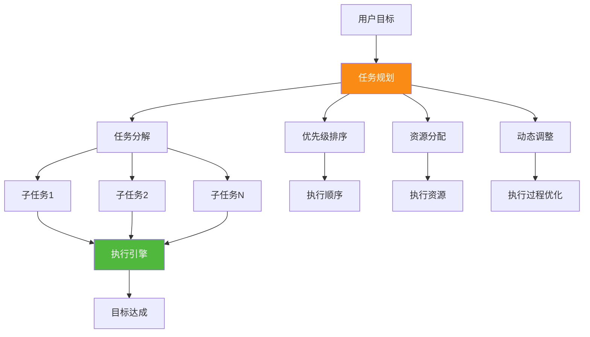
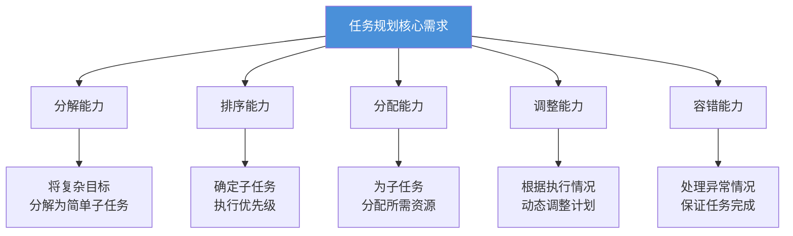
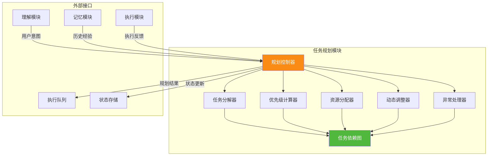
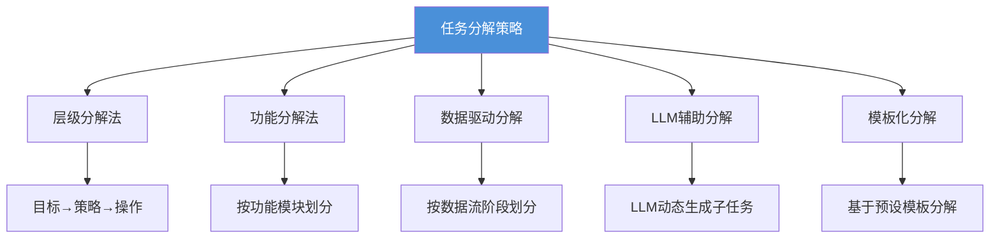
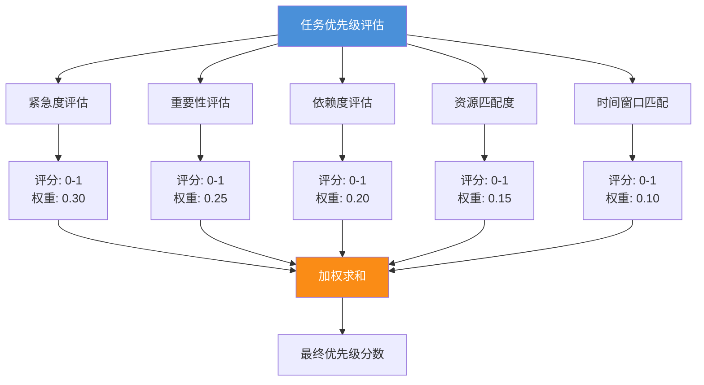
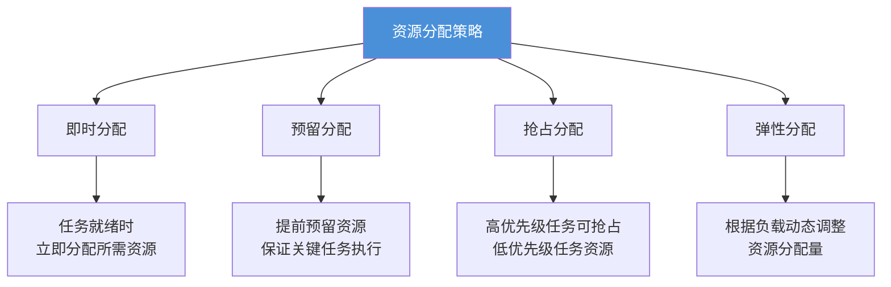
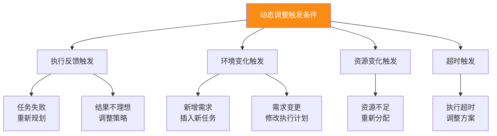

# Agent 任务规划机制：从任务分解到动态执行的完整实现

> **文档说明**：本文档从系统架构设计角度出发，详细阐述 Agent 实现任务规划的完整机制与流程。内容涵盖任务规划模块的核心功能、与其他模块的交互方式、关键算法实现、数据结构设计及具体工作流程，配合伪代码、架构图和流程图辅助说明。

## 目录

- [一、任务规划概述与定位](#一任务规划概述与定位)
- [二、任务规划模块架构设计](#二任务规划模块架构设计)
- [三、数据结构设计](#三数据结构设计)
- [四、任务分解策略](#四任务分解策略)
- [五、优先级排序方法](#五优先级排序方法)
- [六、资源分配机制](#六资源分配机制)
- [七、动态调整逻辑](#七动态调整逻辑)
- [八、异常处理方案](#八异常处理方案)
- [九、完整工作流程与伪代码实现](#九完整工作流程与伪代码实现)
- [十、与其他模块的交互设计](#十与其他模块的交互设计)
- [十一、端到端案例演示](#十一端到端案例演示)
- [十二、总结与展望](#十二总结与展望)
- [参考资料](#参考资料)

---

## 一、任务规划概述与定位

### 1.1 什么是 Agent 任务规划

任务规划（Task Planning）是 Agent 系统的核心功能之一，指 Agent 将用户的复杂目标分解为一系列可执行的子任务，并对这些子任务进行排序、资源分配和动态调整的过程。它是连接"理解用户意图"与"执行具体动作"的关键桥梁。



### 1.2 任务规划在 Agent 系统中的定位

| 模块 | 位置 | 核心职责 |
| :--- | :--- | :--- |
| **感知模块** | 输入层 | 接收用户指令和环境数据 |
| **理解模块** | 语义层 | 解析用户意图，理解目标含义 |
| **规划模块** | 决策层 | **本文档核心**：任务分解与调度 |
| **执行模块** | 执行层 | 执行具体任务，调用工具 |
| **记忆模块** | 存储层 | 存储历史经验和中间状态 |

### 1.3 任务规划的核心能力需求



---

## 二、任务规划模块架构设计

### 2.1 模块整体架构



### 2.2 核心子模块职责

#### 2.2.1 任务分解器

负责将复杂目标分解为可执行的子任务。

| 能力 | 说明 | 技术实现 |
| :--- | :--- | :--- |
| **层级分解** | 从目标到策略再到操作 | 层级任务网络（HTN） |
| **并行识别** | 识别可并行执行的任务 | 依赖图分析 |
| **粒度控制** | 控制子任务的粒度 | 模板+LLM动态生成 |

#### 2.2.2 优先级计算器

基于多维度因素计算任务的执行优先级。

```python
# 代码示例：优先级计算模型
class PriorityCalculator:
    """任务优先级计算器"""
    
    def __init__(self):
        # 优先级影响因子及权重
        self.factors = {
            "urgency": 0.30,        # 紧急度
            "importance": 0.25,     # 重要性
            "dependency": 0.20,     # 依赖关系
            "resource": 0.15,       # 资源需求
            "deadline": 0.10        # 时间约束
        }
    
    def calculate(self, task, context):
        """
        计算任务优先级
        
        Args:
            task: 任务对象
            context: 上下文信息
            
        Returns:
            优先级分数 (0-1)
        """
        scores = {}
        
        # 1. 紧急度评分
        scores['urgency'] = self._assess_urgency(task, context)
        
        # 2. 重要性评分
        scores['importance'] = self._assess_importance(task, context)
        
        # 3. 依赖关系评分
        scores['dependency'] = self._assess_dependency(task, context)
        
        # 4. 资源需求评分
        scores['resource'] = self._assess_resource(task, context)
        
        # 5. 时间约束评分
        scores['deadline'] = self._assess_deadline(task, context)
        
        # 加权求和
        priority = sum(
            scores[factor] * weight 
            for factor, weight in self.factors.items()
        )
        
        return priority
    
    def _assess_urgency(self, task, context):
        """评估紧急度"""
        if task.deadline:
            remaining_time = task.deadline - context.get("current_time", datetime.now())
            remaining_seconds = remaining_time.total_seconds()
            if remaining_seconds < 3600:  # 1小时内
                return 1.0
            elif remaining_seconds < 86400:  # 1天内
                return 0.7
            else:
                return 0.3
        return 0.5
    
    def _assess_importance(self, task, context):
        """评估重要性"""
        return task.importance_weight
    
    def _assess_dependency(self, task, context):
        """评估依赖关系"""
        dependents = len(task.dependents)
        return min(1.0, dependents * 0.2)
    
    def _assess_resource(self, task, context):
        """评估资源需求"""
        resource_available = context.get("available_resources", 100)
        resource_needed = sum(r.amount for r in task.required_resources)
        
        if resource_needed <= resource_available:
            return 1.0
        else:
            return resource_available / max(resource_needed, 1)
    
    def _assess_deadline(self, task, context):
        """评估时间约束"""
        if task.deadline:
            remaining = (task.deadline - context.get("current_time", datetime.now())).total_seconds()
            total = task.duration_estimate
            if total > 0:
                return min(1.0, total / max(remaining, 1))
        return 0.5
```

#### 2.2.3 资源分配器

根据任务需求和系统资源进行合理分配。

#### 2.2.4 动态调整器

监控执行状态，根据反馈动态调整规划。

#### 2.2.5 异常处理器

处理执行过程中的异常情况。

---

## 三、数据结构设计

### 3.1 任务数据结构

```python
# 代码示例：任务相关数据结构
from dataclasses import dataclass, field
from typing import List, Dict, Optional
from enum import Enum
from datetime import datetime
import uuid

class TaskStatus(Enum):
    """任务状态枚举"""
    PENDING = "pending"              # 待执行
    READY = "ready"                  # 就绪（依赖已满足）
    RUNNING = "running"              # 执行中
    PAUSED = "paused"                # 已暂停
    COMPLETED = "completed"          # 已完成
    FAILED = "failed"                # 执行失败
    CANCELLED = "cancelled"          # 已取消
    BLOCKED = "blocked"              # 被阻塞

class TaskType(Enum):
    """任务类型枚举"""
    ANALYSIS = "analysis"            # 分析类
    EXECUTION = "execution"          # 执行类
    COMMUNICATION = "communication"  # 通信类
    MANAGEMENT = "management"        # 管理类
    VERIFICATION = "verification"   # 验证类

class ResourceType(Enum):
    """资源类型枚举"""
    COMPUTE = "compute"              # 计算资源
    MEMORY = "memory"                # 内存资源
    TOOL = "tool"                    # 工具资源
    DATA = "data"                    # 数据资源
    TIME = "time"                    # 时间资源

@dataclass
class ResourceRequirement:
    """资源需求描述"""
    resource_type: ResourceType
    amount: float
    description: str = ""

@dataclass
class TaskDependency:
    """任务依赖关系"""
    task_id: str
    dependency_type: str = "finish_to_start"
    lag_time: float = 0

@dataclass
class Task:
    """核心任务数据结构"""
    # 基本信息
    task_id: str = field(default_factory=lambda: str(uuid.uuid4()))
    name: str = ""
    description: str = ""
    task_type: TaskType = TaskType.EXECUTION
    status: TaskStatus = TaskStatus.PENDING
    
    # 层级关系
    parent_id: Optional[str] = None
    child_ids: List[str] = field(default_factory=list)
    level: int = 0
    
    # 依赖关系
    dependencies: List[TaskDependency] = field(default_factory=list)
    dependents: List[str] = field(default_factory=list)
    
    # 时间信息
    created_at: datetime = field(default_factory=datetime.now)
    planned_start: Optional[datetime] = None
    planned_end: Optional[datetime] = None
    actual_start: Optional[datetime] = None
    actual_end: Optional[datetime] = None
    deadline: Optional[datetime] = None
    duration_estimate: float = 0
    
    # 优先级信息
    priority_score: float = 0.5
    importance_weight: float = 0.5
    
    # 资源需求
    required_resources: List[ResourceRequirement] = field(default_factory=list)
    allocated_resources: List[ResourceRequirement] = field(default_factory=list)
    
    # 执行信息
    assigned_agent: Optional[str] = None
    execution_context: Dict = field(default_factory=dict)
    result: Optional[Dict] = None
    error_message: Optional[str] = None
    retry_count: int = 0
    max_retries: int = 3
    
    # 元数据
    tags: List[str] = field(default_factory=list)
    metadata: Dict = field(default_factory=dict)
```

### 3.2 任务依赖图结构

```python
# 代码示例：任务依赖图
class TaskDependencyGraph:
    """任务依赖图"""
    
    def __init__(self):
        self.nodes: Dict[str, Task] = {}
        self.adjacency_list: Dict[str, List[str]] = {}
        self.in_degree: Dict[str, int] = {}
    
    def add_task(self, task: Task):
        """添加任务节点"""
        self.nodes[task.task_id] = task
        if task.task_id not in self.adjacency_list:
            self.adjacency_list[task.task_id] = []
        if task.task_id not in self.in_degree:
            self.in_degree[task.task_id] = 0
    
    def add_dependency(self, from_id: str, to_id: str, 
                       dep_type: str = "finish_to_start"):
        """添加依赖关系"""
        if from_id not in self.adjacency_list:
            self.adjacency_list[from_id] = []
        self.adjacency_list[from_id].append(to_id)
        self.in_degree[to_id] = self.in_degree.get(to_id, 0) + 1
        
        if from_id in self.nodes and to_id in self.nodes:
            dep = TaskDependency(task_id=from_id, dependency_type=dep_type)
            self.nodes[to_id].dependencies.append(dep)
            self.nodes[from_id].dependents.append(to_id)
    
    def get_ready_tasks(self) -> List[Task]:
        """获取就绪任务"""
        ready_tasks = []
        for task_id, task in self.nodes.items():
            if task.status == TaskStatus.PENDING:
                if self._are_dependencies_met(task_id):
                    ready_tasks.append(task)
                    task.status = TaskStatus.READY
        return ready_tasks
    
    def _are_dependencies_met(self, task_id: str) -> bool:
        """检查依赖是否满足"""
        if task_id not in self.nodes:
            return False
        
        task = self.nodes[task_id]
        for dep in task.dependencies:
            dep_task = self.nodes.get(dep.task_id)
            if dep_task and dep_task.status != TaskStatus.COMPLETED:
                return False
        return True
    
    def detect_cycles(self) -> List[List[str]]:
        """检测循环依赖"""
        cycles = []
        visited = set()
        rec_stack = set()
        
        def dfs_cycle(node, path):
            visited.add(node)
            rec_stack.add(node)
            path.append(node)
            
            for neighbor in self.adjacency_list.get(node, []):
                if neighbor not in visited:
                    if dfs_cycle(neighbor, path):
                        return True
                elif neighbor in rec_stack:
                    cycle_start = path.index(neighbor)
                    cycle = path[cycle_start:]
                    cycles.append(cycle)
                    return True
            
            path.pop()
            rec_stack.remove(node)
            return False
        
        for node in self.nodes:
            if node not in visited:
                dfs_cycle(node, [])
        
        return cycles
    
    def get_parallel_groups(self) -> List[List[Task]]:
        """获取可并行执行的任务组"""
        levels = {}
        in_degree = {tid: len(t.dependencies) for tid, t in self.nodes.items()}
        
        queue = [tid for tid, deg in in_degree.items() if deg == 0]
        current_level = 0
        
        while queue:
            level_tasks = []
            next_queue = []
            
            for tid in queue:
                level_tasks.append(self.nodes[tid])
                
                for neighbor in self.adjacency_list.get(tid, []):
                    in_degree[neighbor] -= 1
                    if in_degree[neighbor] == 0:
                        next_queue.append(neighbor)
            
            if level_tasks:
                levels[current_level] = level_tasks
                current_level += 1
            
            queue = next_queue
        
        return list(levels.values())
```

### 3.3 资源状态数据结构

```python
# 代码示例：资源管理数据结构
@dataclass
class SystemResourceState:
    """系统资源状态"""
    total_compute: float = 100.0
    used_compute: float = 0.0
    reserved_compute: float = 0.0
    total_memory: float = 64.0
    used_memory: float = 0.0
    reserved_memory: float = 0.0
    available_tools: List[str] = field(default_factory=list)
    busy_tools: List[str] = field(default_factory=list)
    
    @property
    def available_compute(self) -> float:
        return self.total_compute - self.used_compute - self.reserved_compute
    
    @property
    def available_memory(self) -> float:
        return self.total_memory - self.used_memory - self.reserved_memory

class ResourceManager:
    """资源管理器"""
    
    def __init__(self, initial_state: SystemResourceState):
        self.state = initial_state
        self.resource_locks = {}
    
    def can_allocate(self, requirements: List[ResourceRequirement]) -> bool:
        """检查是否能满足资源需求"""
        for req in requirements:
            if req.resource_type == ResourceType.COMPUTE:
                if req.amount > self.state.available_compute:
                    return False
            elif req.resource_type == ResourceType.MEMORY:
                if req.amount > self.state.available_memory:
                    return False
            elif req.resource_type == ResourceType.TOOL:
                if req.description not in self.state.available_tools:
                    return False
        return True
    
    def allocate(self, task_id: str, requirements: List[ResourceRequirement]) -> bool:
        """为任务分配资源"""
        if not self.can_allocate(requirements):
            return False
        
        for req in requirements:
            if req.resource_type == ResourceType.COMPUTE:
                self.state.used_compute += req.amount
            elif req.resource_type == ResourceType.MEMORY:
                self.state.used_memory += req.amount
            elif req.resource_type == ResourceType.TOOL:
                if req.description in self.state.available_tools:
                    self.state.available_tools.remove(req.description)
                    self.state.busy_tools.append(req.description)
        
        self.resource_locks[task_id] = requirements
        return True
    
    def release(self, task_id: str):
        """释放任务占用的资源"""
        if task_id not in self.resource_locks:
            return
        
        requirements = self.resource_locks.pop(task_id)
        for req in requirements:
            if req.resource_type == ResourceType.COMPUTE:
                self.state.used_compute -= req.amount
            elif req.resource_type == ResourceType.MEMORY:
                self.state.used_memory -= req.amount
            elif req.resource_type == ResourceType.TOOL:
                if req.description in self.state.busy_tools:
                    self.state.busy_tools.remove(req.description)
                    self.state.available_tools.append(req.description)
```

---

## 四、任务分解策略

### 4.1 分解策略分类



### 4.2 层级分解法

#### 4.2.1 HTN（层级任务网络）实现

```python
# 代码示例：层级任务分解
class HierarchicalTaskDecomposer:
    """层级任务分解器"""
    
    def __init__(self, llm_client=None):
        self.llm_client = llm_client
        self.decomposition_templates = {}
    
    def decompose(self, goal: str, depth: int = 3) -> Task:
        """对目标进行层级分解"""
        root_task = Task(
            name=goal,
            description=goal,
            task_type=TaskType.MANAGEMENT,
            level=0
        )
        self._recursive_decompose(root_task, depth, current_level=0)
        return root_task
    
    def _recursive_decompose(self, parent_task: Task, max_depth: int, 
                              current_level: int):
        """递归分解"""
        if current_level >= max_depth:
            parent_task.task_type = TaskType.EXECUTION
            return
        
        sub_goals = self._generate_sub_goals(parent_task, current_level)
        sub_tasks = []
        
        for i, sub_goal in enumerate(sub_goals):
            sub_task = Task(
                name=sub_goal["name"],
                description=sub_goal["description"],
                task_type=self._infer_task_type(sub_goal),
                parent_id=parent_task.task_id,
                level=current_level + 1,
                duration_estimate=sub_goal.get("duration", 60),
                importance_weight=sub_goal.get("importance", 0.5)
            )
            
            if i > 0 and sub_goal.get("depends_on_previous", True):
                dep = TaskDependency(
                    task_id=sub_tasks[i-1].task_id,
                    dependency_type="finish_to_start"
                )
                sub_task.dependencies.append(dep)
            
            sub_tasks.append(sub_task)
            parent_task.child_ids.append(sub_task.task_id)
        
        for sub_task in sub_tasks:
            self._recursive_decompose(sub_task, max_depth, current_level + 1)
    
    def _generate_sub_goals(self, parent_task: Task, level: int) -> List[Dict]:
        """生成子目标"""
        template_key = f"{parent_task.task_type}_{level}"
        if template_key in self.decomposition_templates:
            return self.decomposition_templates[template_key]
        
        if self.llm_client:
            return self._llm_generate_sub_goals(parent_task, level)
        
        return self._default_decomposition(parent_task, level)
    
    def _llm_generate_sub_goals(self, parent_task: Task, level: int) -> List[Dict]:
        """使用 LLM 生成子目标"""
        prompt = f"""请将以下任务分解为 {level + 1} 级子任务：

任务名称：{parent_task.name}
任务描述：{parent_task.description}
当前层级：{level}

请生成 3-5 个具体的子任务，每个子任务包含 name, description, duration, importance, depends_on_previous。"""
        
        # 实际调用 LLM
        return [
            {
                "name": f"{parent_task.name} - 子任务{i+1}",
                "description": f"执行第 {i+1} 部分",
                "duration": 60 * (i + 1),
                "importance": 0.8 - i * 0.1,
                "depends_on_previous": i > 0
            }
            for i in range(3)
        ]
    
    def _default_decomposition(self, parent_task: Task, level: int) -> List[Dict]:
        """默认分解策略"""
        defaults = {
            TaskType.ANALYSIS: [
                {"name": "数据收集", "description": "收集相关数据", "duration": 60, "importance": 0.9},
                {"name": "数据分析", "description": "分析数据", "duration": 120, "importance": 0.8},
                {"name": "结果报告", "description": "整理分析结果", "duration": 30, "importance": 0.7}
            ],
            TaskType.EXECUTION: [
                {"name": "准备工作", "description": "准备执行环境", "duration": 30, "importance": 0.9},
                {"name": "核心执行", "description": "执行核心任务", "duration": 180, "importance": 1.0},
                {"name": "验证结果", "description": "验证执行结果", "duration": 60, "importance": 0.8}
            ]
        }
        return defaults.get(parent_task.task_type, defaults[TaskType.EXECUTION])
    
    def _infer_task_type(self, sub_goal: Dict) -> TaskType:
        """推断任务类型"""
        name = sub_goal.get("name", "")
        if any(kw in name for kw in ["分析", "研究", "调查"]):
            return TaskType.ANALYSIS
        elif any(kw in name for kw in ["执行", "实施", "完成"]):
            return TaskType.EXECUTION
        elif any(kw in name for kw in ["沟通", "交流", "通知"]):
            return TaskType.COMMUNICATION
        else:
            return TaskType.EXECUTION
```

### 4.3 LLM 辅助分解

```python
# 代码示例：LLM 辅助分解的 Prompt 设计
class DecompositionPromptTemplates:
    """分解 Prompt 模板库"""
    
    SYSTEM_PROMPT = """你是一个专业的任务规划专家，擅长将复杂目标分解为可执行的子任务。

你的分解原则：
1. 每个子任务必须具体、可执行
2. 子任务之间的依赖关系必须清晰
3. 子任务粒度适中（通常 15 分钟 - 2 小时）
4. 优先识别可并行的任务
5. 考虑资源约束和时间要求"""
    
    DECOMPOSE_PROMPT = """请将以下目标分解为子任务：

目标：{goal}

上下文信息：
- 任务类型：{task_type}
- 执行环境：{environment}
- 时间约束：{time_constraint}
- 资源约束：{resource_constraint}

请以 JSON 格式输出分解结果。"""
```

---

## 五、优先级排序方法

### 5.1 多维度优先级评估模型



### 5.2 优先级排序算法

```python
# 代码示例：多种排序算法实现
class TaskPrioritySorter:
    """任务优先级排序器"""
    
    def __init__(self):
        self.calculator = PriorityCalculator()
    
    def sort_tasks(self, tasks: List[Task], 
                    method: str = "weighted") -> List[Task]:
        """对任务进行排序"""
        if method == "weighted":
            return self._weighted_sort(tasks)
        elif method == "critical_path":
            return self._critical_path_sort(tasks)
        elif method == "deadline_driven":
            return self._deadline_driven_sort(tasks)
        else:
            return self._weighted_sort(tasks)
    
    def _weighted_sort(self, tasks: List[Task]) -> List[Task]:
        """加权排序"""
        context = self._get_context()
        scored_tasks = []
        for task in tasks:
            score = self.calculator.calculate(task, context)
            scored_tasks.append((task, score))
        
        scored_tasks.sort(key=lambda x: x[1], reverse=True)
        return [task for task, _ in scored_tasks]
    
    def _critical_path_sort(self, tasks: List[Task]) -> List[Task]:
        """关键路径排序"""
        graph = self._build_dependency_graph(tasks)
        critical_path = self._find_critical_path(graph)
        critical_set = set(critical_path)
        
        sorted_tasks = []
        for task_id in critical_path:
            task = self._find_task(tasks, task_id)
            if task:
                sorted_tasks.append(task)
        
        for task in tasks:
            if task.task_id not in critical_set:
                sorted_tasks.append(task)
        
        return sorted_tasks
    
    def _deadline_driven_sort(self, tasks: List[Task]) -> List[Task]:
        """截止日期驱动排序"""
        has_deadline = [t for t in tasks if t.deadline]
        no_deadline = [t for t in tasks if not t.deadline]
        
        has_deadline.sort(key=lambda t: t.deadline)
        no_deadline.sort(key=lambda t: t.priority_score, reverse=True)
        
        return has_deadline + no_deadline
    
    def _build_dependency_graph(self, tasks: List[Task]) -> Dict:
        """构建依赖图"""
        graph = {}
        for task in tasks:
            graph[task.task_id] = [
                dep.task_id for dep in task.dependencies
            ]
        return graph
    
    def _find_critical_path(self, graph: Dict) -> List[str]:
        """查找关键路径"""
        longest_paths = {}
        
        def dfs(node, visited):
            if node in longest_paths:
                return longest_paths[node]
            if node in visited:
                return []
            
            visited.add(node)
            path = [node]
            
            max_suffix = []
            for neighbor in graph.get(node, []):
                suffix = dfs(neighbor, visited)
                if len(suffix) > len(max_suffix):
                    max_suffix = suffix
            
            longest_paths[node] = path + max_suffix
            return longest_paths[node]
        
        longest_path = []
        for node in graph:
            path = dfs(node, set())
            if len(path) > len(longest_path):
                longest_path = path
        
        return longest_path
    
    def _find_task(self, tasks: List[Task], task_id: str) -> Optional[Task]:
        """按 ID 查找任务"""
        for task in tasks:
            if task.task_id == task_id:
                return task
        return None
    
    def _get_context(self):
        """获取当前上下文"""
        return {
            "current_time": datetime.now(),
            "available_resources": 80
        }
```

### 5.3 优先级动态调整

```python
# 代码示例：动态优先级调整
class DynamicPriorityAdjuster:
    """动态优先级调整器"""
    
    def __init__(self):
        self.adjustment_rules = []
        self._setup_default_rules()
    
    def _setup_default_rules(self):
        """注册默认规则"""
        self.adjustment_rules = [
            self._deadline_urgency_rule,
            self._critical_path_rule,
            self._starvation_prevention_rule
        ]
    
    def adjust_priorities(self, tasks: List[Task], 
                           context: Dict) -> List[Task]:
        """根据规则动态调整优先级"""
        for rule in self.adjustment_rules:
            tasks = rule(tasks, context)
        return tasks
    
    def _deadline_urgency_rule(self, tasks: List[Task], 
                                context: Dict) -> List[Task]:
        """截止日期紧急度规则"""
        now = context.get("current_time", datetime.now())
        threshold = 24 * 3600  # 24小时
        
        for task in tasks:
            if task.deadline:
                remaining = (task.deadline - now).total_seconds()
                if 0 < remaining < threshold:
                    urgency_factor = 1.0 + (threshold - remaining) / threshold
                    task.priority_score *= urgency_factor
        
        return tasks
    
    def _critical_path_rule(self, tasks: List[Task], 
                             context: Dict) -> List[Task]:
        """关键路径规则"""
        for task in tasks:
            if len(task.dependents) > 2:
                task.priority_score *= 1.5
        
        return tasks
    
    def _starvation_prevention_rule(self, tasks: List[Task], 
                                     context: Dict) -> List[Task]:
        """防止饿死规则"""
        now = context.get("current_time", datetime.now())
        max_wait = 4 * 3600  # 4小时
        
        for task in tasks:
            if task.planned_start:
                wait_time = (now - task.planned_start).total_seconds()
                if wait_time > max_wait:
                    task.priority_score = min(1.0, task.priority_score * 2.0)
        
        return tasks
```

---

## 六、资源分配机制

### 6.1 资源分配策略



### 6.2 资源分配算法

```python
# 代码示例：资源分配器实现
class ResourceAllocator:
    """资源分配器"""
    
    def __init__(self, resource_manager: ResourceManager):
        self.resource_manager = resource_manager
        self.allocation_strategies = {
            "immediate": self._immediate_allocation,
            "reserved": self._reserved_allocation,
            "preemptive": self._preemptive_allocation,
            "elastic": self._elastic_allocation
        }
    
    def allocate(self, tasks: List[Task], 
                  strategy: str = "immediate") -> Dict[str, bool]:
        """为任务分配资源"""
        if strategy in self.allocation_strategies:
            return self.allocation_strategies[strategy](tasks)
        else:
            return self._immediate_allocation(tasks)
    
    def _immediate_allocation(self, tasks: List[Task]) -> Dict[str, bool]:
        """即时分配策略"""
        results = {}
        sorted_tasks = sorted(tasks, 
                               key=lambda t: t.priority_score, 
                               reverse=True)
        
        for task in sorted_tasks:
            if self.resource_manager.can_allocate(task.required_resources):
                success = self.resource_manager.allocate(
                    task.task_id, task.required_resources
                )
                results[task.task_id] = success
            else:
                results[task.task_id] = False
        
        return results
    
    def _reserved_allocation(self, tasks: List[Task]) -> Dict[str, bool]:
        """预留分配策略"""
        results = {}
        critical_tasks = [
            t for t in tasks 
            if t.priority_score > 0.8 or t.deadline
        ]
        non_critical_tasks = [
            t for t in tasks 
            if t.priority_score <= 0.8 and not t.deadline
        ]
        
        for task in critical_tasks:
            if self.resource_manager.can_allocate(task.required_resources):
                success = self.resource_manager.allocate(
                    task.task_id, task.required_resources
                )
                results[task.task_id] = success
            else:
                results[task.task_id] = False
        
        for task in non_critical_tasks:
            if self.resource_manager.can_allocate(task.required_resources):
                success = self.resource_manager.allocate(
                    task.task_id, task.required_resources
                )
                results[task.task_id] = success
            else:
                results[task.task_id] = False
        
        return results
    
    def _preemptive_allocation(self, tasks: List[Task]) -> Dict[str, bool]:
        """抢占分配策略"""
        results = {}
        sorted_tasks = sorted(tasks, 
                               key=lambda t: t.priority_score, 
                               reverse=True)
        
        for task in sorted_tasks:
            if self.resource_manager.can_allocate(task.required_resources):
                success = self.resource_manager.allocate(
                    task.task_id, task.required_resources
                )
                results[task.task_id] = success
            else:
                # 尝试抢占低优先级任务的资源
                low_priority_tasks = [
                    t for t in sorted_tasks 
                    if t.status == TaskStatus.RUNNING
                    and t.priority_score < task.priority_score * 0.5
                ]
                
                for low_task in low_priority_tasks:
                    low_task.status = TaskStatus.PAUSED
                    self.resource_manager.release(low_task.task_id)
                
                success = self.resource_manager.allocate(
                    task.task_id, task.required_resources
                )
                results[task.task_id] = success
        
        return results
    
    def _elastic_allocation(self, tasks: List[Task]) -> Dict[str, bool]:
        """弹性分配策略"""
        results = {}
        total_demand = sum(
            sum(r.amount for r in t.required_resources)
            for t in tasks
        )
        total_available = self.resource_manager.state.available_compute
        
        if total_demand <= total_available:
            for task in tasks:
                success = self.resource_manager.allocate(
                    task.task_id, task.required_resources
                )
                results[task.task_id] = success
        else:
            scale_factor = total_available / total_demand
            for task in tasks:
                scaled_requirements = [
                    ResourceRequirement(
                        resource_type=r.resource_type,
                        amount=r.amount * scale_factor,
                        description=r.description
                    )
                    for r in task.required_resources
                ]
                success = self.resource_manager.allocate(
                    task.task_id, scaled_requirements
                )
                results[task.task_id] = success
        
        return results
```

---

## 七、动态调整逻辑

### 7.1 动态调整触发条件



### 7.2 动态调整实现

```python
# 代码示例：动态调整管理器
class DynamicAdjuster:
    """动态调整器"""
    
    def __init__(self, task_graph: TaskDependencyGraph,
                 resource_manager: ResourceManager):
        self.task_graph = task_graph
        self.resource_manager = resource_manager
        self.adjustment_history = []
    
    def handle_execution_feedback(self, task_id: str, 
                                    execution_result: Dict) -> Dict:
        """处理执行反馈"""
        task = self.task_graph.nodes.get(task_id)
        if not task:
            return {"need_adjustment": False}
        
        status = execution_result.get("status")
        
        if status == "success":
            task.status = TaskStatus.COMPLETED
            task.result = execution_result
            self._propagate_completion(task_id)
            return {"need_adjustment": False}
        
        elif status == "failed":
            return self._handle_failure(task, execution_result)
        
        elif status == "partial":
            completed_part = execution_result.get("completed_part", 0.5)
            task.metadata['progress'] = completed_part
            return {"need_adjustment": False}
    
    def _handle_failure(self, task: Task, 
                         execution_result: Dict) -> Dict:
        """处理任务失败"""
        task.retry_count += 1
        task.error_message = execution_result.get("error", "Unknown error")
        
        if task.re