# Agent 工具选择决策机制深度解析

> 文档定位:系统阐述 AI Agent 在任务执行过程中,如何从工具集合中选择最合适工具的完整决策机制,涵盖触发条件、决策流程、评估指标、优先级排序、异常处理与场景案例,为 Agent 开发者提供可落地的算法框架与工程实现指导。
>
> 阅读建议:本文是 Agent 架构设计系列的关键组成,建议结合 [36企业级Agent系统完整设计方案.md](./36企业级Agent系统完整设计方案.md)、[37Agent执行流程详解.md](./37Agent执行流程详解.md)、[39ReAct_Agent工作流程详解.md](./39ReAct_Agent工作流程详解.md)、[40Plan-and-Execute_Agent完整实现方案.md](./40Plan-and-Execute_Agent完整实现方案.md) 一并阅读。

---

## 目录

- [一、工具选择机制概述](#一工具选择机制概述)
- [二、工具选择的触发条件](#二工具选择的触发条件)
- [三、完整决策流程设计](#三完整决策流程设计)
- [四、核心评估指标体系](#四核心评估指标体系)
- [五、优先级排序规则](#五优先级排序规则)
- [六、决策算法与伪代码实现](#六决策算法与伪代码实现)
- [七、异常处理策略](#七异常处理策略)
- [八、不同场景下的工具选择案例分析](#八不同场景下的工具选择案例分析)
- [九、性能优化与实践指导](#九性能优化与实践指导)
- [十、总结与展望](#十总结与展望)

---

## 一、工具选择机制概述

### 1.1 什么是工具选择决策

**工具选择决策(Tool Selection Decision)** 是指 Agent 在任务执行过程中,依据当前子任务的需求、可用工具的能力描述、历史调用经验与资源约束,从工具集合中选择**最合适的一个或多个工具**来完成任务的认知过程。

它是 Agent 决策回路中的**选择性决策环节**,与"下一步做什么"的规划决策、"是否完成"的终止决策共同构成完整的 Agent 决策体系。

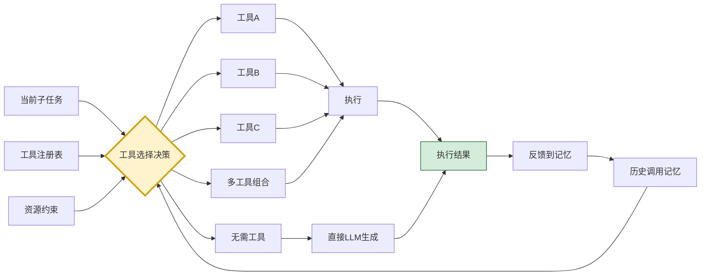

### 1.2 工具选择的核心挑战

| 挑战类型 | 具体表现 | 影响 |
|---------|---------|------|
| **能力匹配模糊** | 工具能力描述与任务需求的语义对齐困难 | 选错工具导致任务失败 |
| **工具数量庞大** | 工具注册表中可能有数十甚至数百个工具 | 全量评估开销大,决策延迟高 |
| **成本差异巨大** | 不同工具的调用成本(时间、金钱、算力)差异大 | 成本失控 |
| **历史经验稀疏** | 新工具或冷门工具缺乏历史调用数据 | 难以评估可靠性 |
| **组合爆炸** | 多工具组合的可能性呈指数级增长 | 难以穷举评估 |
| **动态环境** | 工具可用性、性能随时间变化 | 静态决策失效 |
| **副作用风险** | 部分工具(如发送邮件、删除文件)有不可逆副作用 | 误用造成损失 |

### 1.3 工具选择在 Agent 架构中的位置

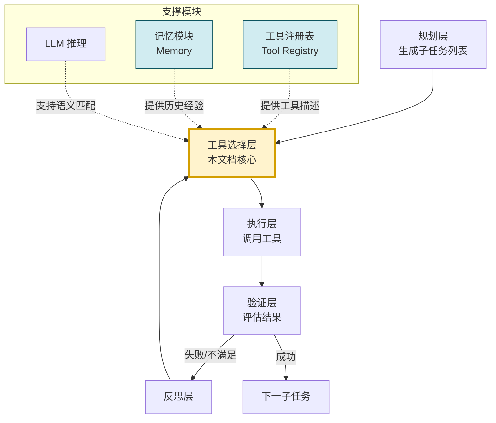

### 1.4 工具选择的核心价值

1. **提升成功率**:选择能力匹配的工具是任务成功的前提。
2. **控制成本**:在多个可用工具中选择成本最低的。
3. **增强可靠性**:优先选择历史成功率高的工具。
4. **降低风险**:对有副作用的工具进行审慎决策。
5. **优化效率**:避免无效的工具调用尝试。

---

## 二、工具选择的触发条件

### 2.1 触发条件全景

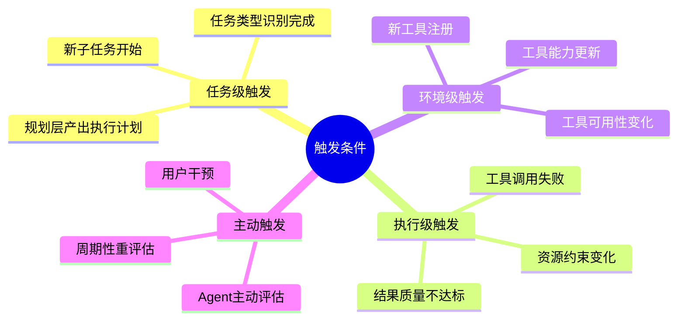

### 2.2 任务级触发条件

#### 2.2.1 新子任务开始

最核心的触发条件。当规划层产出一个新的子任务,或 Agent 从任务队列中取出下一个待执行子任务时,触发工具选择决策。

```python
def on_new_subtask(subtask: SubTask) -> ToolSelectionResult:
    """新子任务开始时触发工具选择"""
    # 1. 识别任务类型
    task_type = self.task_classifier.classify(subtask)
    
    # 2. 触发工具选择
    if task_type.requires_tool:
        return self.tool_selector.select(subtask)
    else:
        # 不需要工具,直接由LLM处理
        return ToolSelectionResult(use_llm_directly=True)
```

#### 2.2.2 任务类型识别完成

当 Agent 通过任务分析,识别出当前任务的类型(如信息检索、代码执行、数据计算、外部通信)后,根据任务类型触发对应的工具子集筛选。

### 2.3 执行级触发条件

#### 2.3.1 工具调用失败

当先前选择的工具调用失败时,触发重新选择。这是**容错型触发**,需要避免选择相同的失败工具(除非是临时性故障)。

```python
def on_tool_failure(subtask: SubTask, failed_tool: Tool, 
                     error: Exception) -> ToolSelectionResult:
    """工具失败时触发重新选择"""
    # 记录失败,降低该工具的优先级
    self.memory.record_failure(
        subtask_id=subtask.id,
        tool_id=failed_tool.id,
        error_type=type(error).__name__,
        error_message=str(error)
    )
    
    # 排除失败工具,重新选择
    return self.tool_selector.select(
        subtask, 
        exclude_tools=[failed_tool.id]
    )
```

#### 2.3.2 结果质量不达标

工具调用成功,但产出的结果质量低于预期阈值时,触发选择替代工具或补充工具。

#### 2.3.3 资源约束变化

当任务执行过程中,资源预算(如剩余 Token、剩余时间、剩余调用次数)发生显著变化时,可能需要重新选择更节省资源的工具。

### 2.4 环境级触发条件

- **工具可用性变化**:工具的可用性会动态变化(如 API 下线、服务过载),需要感知并触发切换。
- **新工具注册**:动态注册的新工具可能比现有工具更适合当前任务,应触发重新评估。

### 2.5 触发条件汇总表

| 触发条件 | 触发时机 | 决策性质 | 紧急度 |
|---------|---------|---------|:------:|
| 新子任务开始 | 子任务从队列取出 | 主动决策 | 中 |
| 工具调用失败 | 异常捕获 | 被动容错 | 高 |
| 结果质量不达标 | 结果验证后 | 主动优化 | 中 |
| 资源约束变化 | 预算监控触发 | 主动调整 | 中-高 |
| 工具不可用 | 健康检查触发 | 被动切换 | 高 |
| 新工具注册 | 动态注册回调 | 主动评估 | 低 |
| 周期性重评估 | 定时器触发 | 主动优化 | 低 |

---

## 三、完整决策流程设计

### 3.1 决策流程全景

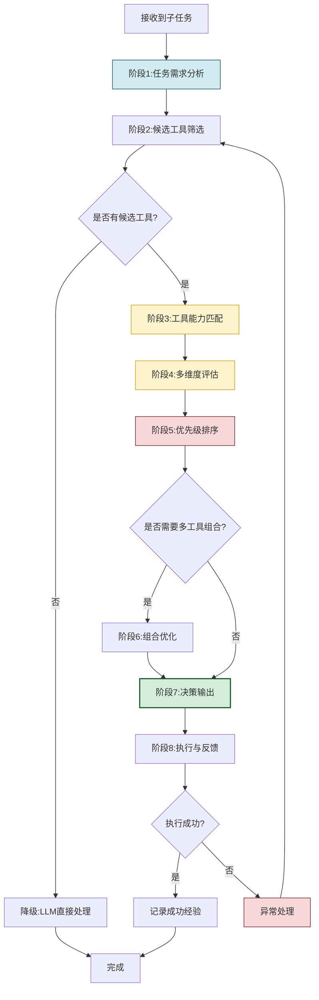

### 3.2 阶段详解

#### 3.2.1 阶段 1:任务需求分析

深入分析子任务,提取出对工具选择有用的结构化信息:

```python
def analyze_task_requirements(subtask: SubTask) -> TaskRequirements:
    """分析任务需求,提取工具选择关键信息"""
    return TaskRequirements(
        # 1. 任务类型(信息检索/代码执行/数据计算/外部通信/内容生成)
        task_type=self.classify_task_type(subtask),
        # 2. 输入数据特征(类型、格式、规模)
        input_modalities=self.identify_input_modalities(subtask),
        input_format=self.detect_input_format(subtask),
        data_scale=self.estimate_data_scale(subtask),
        # 3. 输出要求(格式、精度、时效性)
        output_format=subtask.expected_output_format,
        precision_requirement=subtask.precision_level,
        latency_requirement=subtask.max_latency_ms,
        # 4. 约束条件
        budget_constraint=subtask.token_budget,
        security_level=subtask.security_level,
        # 5. 关键能力需求(必须具备的能力)
        required_capabilities=self.extract_required_capabilities(subtask),
        # 6. 偏好(可选的偏好,如优先开源工具)
        preferences=subtask.tool_preferences,
    )
```

#### 3.2.2 阶段 2:候选工具筛选

从工具注册表中快速筛选出可能的候选工具,避免全量评估:

```python
def filter_candidate_tools(requirements: TaskRequirements,
                              tool_registry: ToolRegistry) -> list[Tool]:
    """快速筛选候选工具(粗筛)"""
    candidates = []
    for tool in tool_registry.get_all_tools():
        # 筛选条件1:工具当前可用
        if not tool.is_available():
            continue
        # 筛选条件2:工具能力类型匹配
        if not self._capability_type_match(tool, requirements.task_type):
            continue
        # 筛选条件3:满足必须具备的能力
        if not self._has_required_capabilities(tool, requirements.required_capabilities):
            continue
        # 筛选条件4:支持输入数据格式
        if not self._supports_input_format(tool, requirements.input_format):
            continue
        # 筛选条件5:满足安全级别要求
        if tool.safety_level < requirements.security_level:
            continue
        candidates.append(tool)
    return candidates
```

#### 3.2.3 阶段 3:工具能力匹配

对候选工具进行细粒度的能力匹配评估,使用 LLM 进行语义级别的匹配判断:

```python
def evaluate_capability_match(tool: Tool, 
                                requirements: TaskRequirements) -> float:
    """评估工具能力与任务需求的匹配度(0-1)"""
    prompt = f"""请评估以下工具的能力与任务需求的匹配度。

任务描述: {requirements.task_description}
任务类型: {requirements.task_type}
必须能力: {requirements.required_capabilities}

工具名称: {tool.name}
工具描述: {tool.description}
工具能力: {tool.capabilities}
工具参数: {tool.parameters}

请从以下维度评估匹配度(0-1分):
1. 功能匹配度:工具能否完成核心任务?
2. 输入适配度:工具能否处理任务输入?
3. 输出适配度:工具输出是否满足要求?
4. 约束满足度:工具是否满足任务的约束?

输出JSON格式: {{"functionality": 0.0, "input_fit": 0.0, 
              "output_fit": 0.0, "constraint_fit": 0.0, "overall": 0.0}}
"""
    result = self.llm.generate_json(prompt)
    return result["overall"]
```

#### 3.2.4 阶段 4:多维度评估

对每个候选工具进行多维度综合评估,详见第四节。

#### 3.2.5 阶段 5:优先级排序

根据综合评分对候选工具排序,详见第五节。

#### 3.2.6 阶段 6:组合优化

当单一工具无法完成任务时,需要选择多个工具组合:

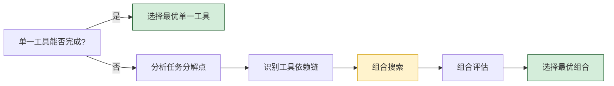

#### 3.2.7 阶段 7:决策输出

```python
@dataclass
class ToolSelectionResult:
    """工具选择决策结果"""
    selected_tools: list[Tool]              # 选定的工具(可多个)
    call_parameters: list[dict]             # 每个工具的调用参数
    fallback_tools: list[Tool]             # 备选工具(主工具失败时使用)
    confidence: float                       # 决策置信度
    reasoning: str                          # 决策理由(可解释性)
    estimated_cost: dict                    # 预估成本
    risk_assessment: str                    # 风险评估
```

#### 3.2.8 阶段 8:执行与反馈

执行工具调用,并将结果反馈到记忆模块,用于优化未来的选择决策。

---

## 四、核心评估指标体系

### 4.1 指标体系架构

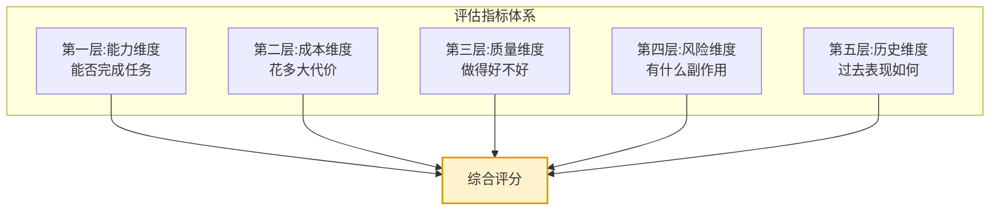

### 4.2 五大维度指标详解

#### 4.2.1 能力匹配度(Capability Match)

衡量工具能力与任务需求的吻合程度,是最重要的评估维度。

| 子指标 | 含义 | 度量方式 |
|-------|------|---------|
| 功能匹配度 | 工具能否完成核心功能 | LLM 语义评估(0-1) |
| 输入适配度 | 工具能否处理任务输入 | 输入类型对比 |
| 输出适配度 | 工具输出是否满足要求 | 输出格式对比 |
| 约束满足度 | 工具是否满足任务约束 | 约束逐项检查 |
| 参数完备性 | 任务所需参数是否齐全 | 参数覆盖率 |

#### 4.2.2 调用成本(Call Cost)

| 子指标 | 含义 | 度量单位 |
|-------|------|---------|
| 时间成本 | 工具调用的平均延迟 | 毫秒(ms) |
| 金钱成本 | 调用工具的费用 | 元/次 |
| Token 成本 | 调用消耗的 LLM Token 数 | Token 数 |
| 算力成本 | 调用消耗的计算资源 | FLOPs |
| 带宽成本 | 调用消耗的网络带宽 | KB |

#### 4.2.3 历史成功率(Historical Success Rate)

```python
def compute_historical_success_rate(tool: Tool, 
                                      task_type: str,
                                      memory: Memory) -> dict:
    """计算工具的历史成功率"""
    history = memory.get_tool_history(
        tool_id=tool.id,
        task_type=task_type,
        recent_n=100  # 最近100次调用
    )
    
    if not history:
        # 冷启动:无历史数据,给予中等先验分
        return {
            "success_rate": 0.5,
            "confidence": 0.1,
            "sample_size": 0
        }
    
    success_count = sum(1 for h in history if h.success)
    success_rate = success_count / len(history)
    
    # 按时间衰减加权(近期调用权重更高)
    weighted_success = 0
    total_weight = 0
    for i, h in enumerate(history):
        weight = 0.95 ** (len(history) - i - 1)
        weighted_success += weight * (1.0 if h.success else 0.0)
        total_weight += weight
    
    weighted_rate = weighted_success / total_weight if total_weight else 0
    
    return {
        "success_rate": success_rate,
        "weighted_success_rate": weighted_rate,
        "confidence": min(1.0, len(history) / 30),
        "sample_size": len(history)
    }
```

#### 4.2.4 输出质量(Output Quality)

| 子指标 | 含义 | 度量方式 |
|-------|------|---------|
| 准确性 | 输出结果的正确程度 | 事后验证/LLM 评估 |
| 完整性 | 输出是否覆盖所有要求 | 缺失项检查 |
| 时效性 | 数据是否为最新 | 时间戳检查 |
| 一致性 | 多次调用结果是否稳定 | 方差计算 |
| 格式规范 | 输出格式是否符合要求 | 格式校验 |

#### 4.2.5 副作用风险(Side-Effect Risk)

| 子指标 | 含义 | 风险等级 |
|-------|------|:------:|
| 可逆性 | 操作是否可撤销 | 高/中/低 |
| 影响范围 | 影响多少用户/数据 | 高/中/低 |
| 数据安全 | 是否涉及敏感数据 | 高/中/低 |
| 依赖性 | 是否依赖外部服务 | 高/中/低 |
| 失败影响 | 失败时的后果严重度 | 高/中/低 |

### 4.3 指标归一化与权重设计

```python
class ToolEvaluationScorer:
    """工具评估评分器"""
    
    DEFAULT_WEIGHTS = {
        "capability": 0.35,   # 能力匹配度最重要
        "cost": 0.15,         # 成本
        "history": 0.25,      # 历史成功率
        "quality": 0.15,       # 输出质量
        "risk": 0.10,         # 副作用风险
    }
    
    TASK_WEIGHTS = {
        "information_retrieval": {
            "capability": 0.40, "cost": 0.20, "history": 0.20,
            "quality": 0.15, "risk": 0.05
        },
        "code_execution": {
            "capability": 0.45, "cost": 0.10, "history": 0.25,
            "quality": 0.10, "risk": 0.10
        },
        "data_deletion": {
            "capability": 0.30, "cost": 0.05, "history": 0.20,
            "quality": 0.15, "risk": 0.30
        },
    }
    
    def score(self, tool: Tool, requirements: TaskRequirements,
              memory: Memory) -> dict:
        weights = self.TASK_WEIGHTS.get(
            requirements.task_type, self.DEFAULT_WEIGHTS
        )
        scores = {
            "capability": self._score_capability(tool, requirements),
            "cost": self._score_cost(tool, requirements),
            "history": self._score_history(tool, requirements, memory),
            "quality": self._score_quality(tool, requirements, memory),
            "risk": self._score_risk(tool, requirements),
        }
        total = sum(scores[k] * weights[k] for k in scores)
        return {
            "total_score": round(total, 4),
            "dimension_scores": scores,
            "weights": weights,
        }
    
    def _score_cost(self, tool: Tool, requirements: TaskRequirements) -> float:
        cost_ratio = tool.estimated_cost / max(requirements.budget, 1)
        return max(0.0, 1.0 - cost_ratio)
    
    def _score_risk(self, tool: Tool, requirements: TaskRequirements) -> float:
        risk_score = 1.0
        if tool.is_irreversible:
            risk_score -= 0.3
        if tool.affects_multiple_users:
            risk_score -= 0.2
        if tool.requires_confirmation:
            risk_score -= 0.1
        return max(0.0, risk_score)
```

---

## 五、优先级排序规则

### 5.1 排序规则全景

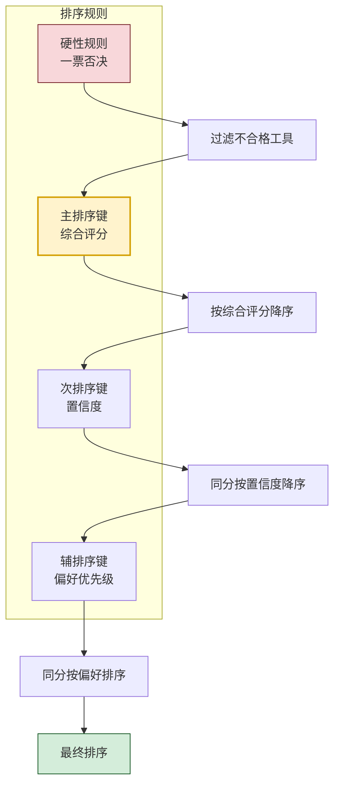

### 5.2 硬性规则(一票否决)

| 规则 | 说明 |
|-----|------|
| 能力完全不匹配 | 工具功能与任务类型完全不符 |
| 预算超限 | 工具预估成本超出预算上限 |
| 安全级别不足 | 工具安全级别低于任务要求 |
| 工具不可用 | 工具当前处于下线/故障状态 |
| 权限不足 | Agent 无权调用该工具 |
| 已被任务明确排除 | 任务要求排除特定工具(如前次失败的工具) |

### 5.3 主排序键:综合评分

```python
def sort_by_total_score(tools_with_scores: list) -> list:
    """按综合评分降序排序"""
    return sorted(tools_with_scores, key=lambda x: x["total_score"], reverse=True)
```

### 5.4 次排序键:置信度

当综合评分相近(差值小于 0.05)时,优先选择历史样本量大、置信度高的工具:

```python
def sort_with_confidence(tools_with_scores: list) -> list:
    """综合评分+置信度双重排序"""
    return sorted(tools_with_scores, key=lambda x: (
        -round(x["total_score"], 2),
        -x["dimension_scores"]["history"]["confidence"]
    ))
```

### 5.5 辅排序键:偏好优先级

| 偏好类型 | 优先级 |
|---------|:------:|
| 内置工具 > 第三方工具 | 内置优先 |
| 开源工具 > 闭源工具 | 开源优先 |
| 本地工具 > 远程工具 | 本地优先 |
| 缓存命中 > 实时调用 | 缓存优先 |
| 官方工具 > 社区工具 | 官方优先 |

### 5.6 特殊优先规则

#### 5.6.1 安全优先规则

对高风险任务(如删除数据、发送邮件),优先选择需要确认的工具:

```python
def apply_safety_priority(tools: list, requirements: TaskRequirements) -> list:
    if requirements.security_level >= SecurityLevel.HIGH:
        tools = sorted(tools, key=lambda t: (
            not t.is_irreversible,
            t.requires_confirmation,
            -t["total_score"]
        ))
    return tools
```

#### 5.6.2 成本敏感规则

```python
def apply_cost_sensitivity(tools: list, requirements: TaskRequirements) -> list:
    if requirements.cost_sensitivity == "high":
        for tool in tools:
            tool["total_score"] = (
                tool["total_score"] * 0.6 +
                tool["dimension_scores"]["cost"] * 0.4
            )
        tools = sorted(tools, key=lambda t: -t["total_score"])
    return tools
```

---

## 六、决策算法与伪代码实现

### 6.1 完整决策算法

```python
"""
Agent 工具选择决策器 - 完整实现示例
综合运用任务分析、候选筛选、多维评估、优先级排序、异常处理
"""
import time
from dataclasses import dataclass, field
from typing import Optional
from enum import Enum


class TaskType(Enum):
    INFORMATION_RETRIEVAL = "information_retrieval"
    CODE_EXECUTION = "code_execution"
    DATA_COMPUTATION = "data_computation"
    EXTERNAL_COMMUNICATION = "external_communication"
    CONTENT_GENERATION = "content_generation"
    FILE_OPERATION = "file_operation"


class SafetyLevel(Enum):
    LOW = 1
    MEDIUM = 2
    HIGH = 3
    CRITICAL = 4


@dataclass
class TaskRequirements:
    """任务需求结构"""
    task_description: str
    task_type: TaskType
    required_capabilities: list[str] = field(default_factory=list)
    input_format: str = "text"
    output_format: str = "text"
    budget: float = 1.0
    max_latency_ms: int = 10000
    security_level: SafetyLevel = SafetyLevel.LOW
    cost_sensitivity: str = "medium"


@dataclass
class Tool:
    """工具描述"""
    id: str
    name: str
    description: str
    capabilities: list[str]
    safety_level: SafetyLevel
    estimated_cost: float
    estimated_latency_ms: int
    is_irreversible: bool = False
    requires_confirmation: bool = False
    is_available: bool = True


@dataclass
class ToolSelectionResult:
    """工具选择决策结果"""
    selected_tool: Optional[Tool]
    call_parameters: dict
    fallback_tools: list[Tool]
    confidence: float
    reasoning: str
    estimated_cost: float
    risk_assessment: str
    use_llm_directly: bool = False


class ToolSelectionDecisionMaker:
    """工具选择决策器"""

    def __init__(self, llm_client, tool_registry, memory):
        self.llm = llm_client
        self.tool_registry = tool_registry
        self.memory = memory
        self.scorer = ToolEvaluationScorer()

    def select(self, subtask, exclude_tools: list[str] = None) -> ToolSelectionResult:
        """执行完整的工具选择决策流程"""
        exclude_tools = exclude_tools or []

        # 阶段1:任务需求分析
        requirements = self._analyze_requirements(subtask)
        if not self._requires_tool(requirements):
            return ToolSelectionResult(
                selected_tool=None, call_parameters={}, fallback_tools=[],
                confidence=0.8,
                reasoning="任务类型不需要工具,直接由LLM处理",
                estimated_cost=0.0, risk_assessment="无风险",
                use_llm_directly=True
            )

        # 阶段2:候选工具筛选
        candidates = self._filter_candidates(requirements, exclude_tools)
        if not candidates:
            return self._handle_no_candidates(requirements)

        # 阶段3-4:能力匹配与多维度评估
        scored_candidates = []
        for tool in candidates:
            scores = self.scorer.score(tool, requirements, self.memory)
            scored_candidates.append({"tool": tool, **scores})

        # 阶段5:优先级排序
        ranked = self._rank_tools(scored_candidates, requirements)

        # 阶段6:组合优化(如需要)
        if self._needs_combination(requirements):
            combination = self._find_best_combination(ranked, requirements)
            if combination:
                return self._build_combination_result(combination, requirements)

        # 阶段7:决策输出
        if not ranked:
            return self._handle_no_candidates(requirements)

        best = ranked[0]
        fallback = [item["tool"] for item in ranked[1:3]]

        return ToolSelectionResult(
            selected_tool=best["tool"],
            call_parameters=self._generate_call_parameters(best["tool"], subtask),
            fallback_tools=fallback,
            confidence=best["total_score"],
            reasoning=self._generate_reasoning(best, requirements),
            estimated_cost=best["tool"].estimated_cost,
            risk_assessment=self._assess_risk(best["tool"], requirements)
        )

    def _analyze_requirements(self, subtask) -> TaskRequirements:
        prompt = f"""分析以下子任务,提取工具选择所需的需求信息:
子任务描述: {subtask.description}
预期输出: {subtask.expected_output}
请输出JSON格式的任务需求分析。"""
        result = self.llm.generate_json(prompt)
        return TaskRequirements(
            task_description=subtask.description,
            task_type=TaskType(result.get("task_type", "content_generation")),
            required_capabilities=result.get("required_capabilities", []),
        )

    def _requires_tool(self, requirements: TaskRequirements) -> bool:
        no_tool_types = {TaskType.CONTENT_GENERATION}
        return requirements.task_type not in no_tool_types

    def _filter_candidates(self, requirements, exclude):
        candidates = []
        for tool in self.tool_registry.get_all_tools():
            if tool.id in exclude or not tool.is_available:
                continue
            if tool.safety_level < requirements.security_level:
                continue
            if tool.estimated_cost > requirements.budget:
                continue
            if not self._capability_type_match(tool, requirements.task_type):
                continue
            candidates.append(tool)
        return candidates

    def _capability_type_match(self, tool, task_type) -> bool:
        type_capability_map = {
            TaskType.INFORMATION_RETRIEVAL: {"search", "retrieve", "query"},
            TaskType.CODE_EXECUTION: {"execute", "run_code", "compile"},
            TaskType.DATA_COMPUTATION: {"calculate", "compute", "analyze"},
            TaskType.FILE_OPERATION: {"read_file", "write_file", "delete_file"},
        }
        required = type_capability_map.get(task_type, set())
        if not required:
            return True
        tool_caps = set(c.lower() for c in tool.capabilities)
        return bool(required & tool_caps)

    def _rank_tools(self, scored_candidates, requirements):
        if requirements.security_level >= SafetyLevel.HIGH:
            return sorted(scored_candidates, key=lambda x: (
                not x["tool"].is_irreversible,
                x["tool"].requires_confirmation,
                -x["total_score"]
            ))
        return sorted(scored_candidates, key=lambda x: (
            -round(x["total_score"], 2),
            -x["dimension_scores"].get("history", {}).get("confidence", 0)
        ))

    def _needs_combination(self, requirements) -> bool:
        return len(requirements.required_capabilities) > 3

    def _find_best_combination(self, ranked, requirements):
        covered = set()
        combination = []
        for item in ranked:
            tool = item["tool"]
            new_caps = set(tool.capabilities) - covered
            if new_caps:
                combination.append(item)
                covered.update(new_caps)
            if covered.issuperset(requirements.required_capabilities):
                return combination
        return combination if combination else None

    def _generate_call_parameters(self, tool, subtask) -> dict:
        prompt = f"根据子任务生成工具调用参数:\n子任务: {subtask.description}\n工具: {tool.name}"
        return self.llm.generate_json(prompt)

    def _generate_reasoning(self, best, requirements) -> str:
        tool = best["tool"]
        scores = best["dimension_scores"]
        return (f"选择工具 '{tool.name}',综合评分 {best['total_score']:.2f}。"
                f"能力匹配度 {scores['capability']:.2f},"
                f"历史成功率 {scores['history']:.2f}。")

    def _assess_risk(self, tool, requirements) -> str:
        if tool.is_irreversible and requirements.security_level >= SafetyLevel.HIGH:
            return "高风险:不可逆操作,建议人工确认"
        elif tool.is_irreversible:
            return "中风险:不可逆操作"
        return "低风险:可逆操作"

    def _handle_no_candidates(self, requirements) -> ToolSelectionResult:
        return ToolSelectionResult(
            selected_tool=None, call_parameters={}, fallback_tools=[],
            confidence=0.1,
            reasoning=f"未找到满足要求的工具(任务类型: {requirements.task_type})",
            estimated_cost=0.0, risk_assessment="无法评估",
            use_llm_directly=True
        )
```

### 6.2 决策树形式的简化算法

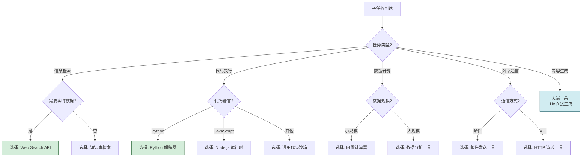

---

## 七、异常处理策略

### 7.1 异常场景全景

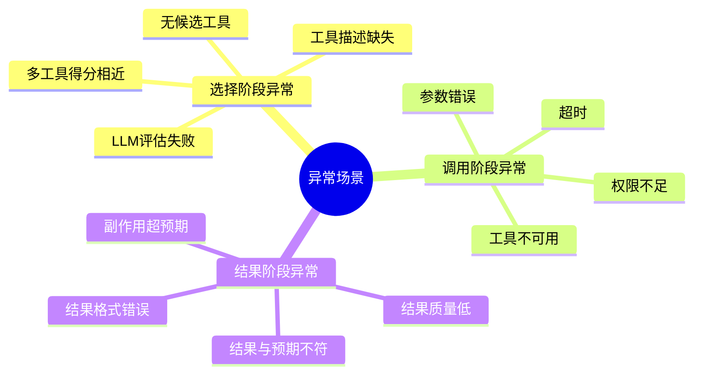

### 7.2 无候选工具处理

```python
def handle_no_candidates(requirements: TaskRequirements) -> ToolSelectionResult:
    """无候选工具的处理策略"""
    # 策略1:降级为LLM直接处理
    if requirements.task_type in [TaskType.CONTENT_GENERATION, 
                                    TaskType.INFORMATION_RETRIEVAL]:
        return ToolSelectionResult(
            selected_tool=None, call_parameters={}, fallback_tools=[],
            confidence=0.3,
            reasoning="无可用工具,降级为LLM直接处理(准确度可能降低)",
            estimated_cost=0.0, risk_assessment="低风险",
            use_llm_directly=True
        )
    # 策略2:请求人工介入
    return ToolSelectionResult(
        selected_tool=None, call_parameters={}, fallback_tools=[],
        confidence=0.0,
        reasoning="无可用工具且无法降级,需人工介入",
        estimated_cost=0.0, risk_assessment="无法完成",
        use_llm_directly=False
    )
```

### 7.3 工具调用失败处理

```python
def handle_tool_failure(subtask, failed_tool, error, 
                         fallback_tools, decision_maker) -> dict:
    """工具调用失败的处理"""
    decision_maker.memory.record_failure(
        tool_id=failed_tool.id,
        error_type=type(error).__name__,
        timestamp=time.time()
    )
    
    # 策略1:尝试备选工具
    for fallback in fallback_tools:
        try:
            if decision_maker._is_error_recoverable(error):
                result = fallback.execute(subtask.parameters)
                return {"success": True, "result": result, "tool_used": fallback}
        except Exception as e:
            continue
    
    # 策略2:重试原工具(限临时性错误)
    if decision_maker._is_transient_error(error):
        for attempt in range(3):
            time.sleep(2 ** attempt)
            try:
                result = failed_tool.execute(subtask.parameters)
                return {"success": True, "result": result, "tool_used": failed_tool}
            except Exception:
                continue
    
    # 策略3:降级处理
    return {"success": False, "reason": "所有工具均失败", "need_human": True}


def _is_transient_error(error: Exception) -> bool:
    """判断是否为临时性错误(可重试)"""
    transient_errors = ["TimeoutError", "ConnectionError", 
                        "ServiceUnavailable", "RateLimitExceeded"]
    return type(error).__name__ in transient_errors
```

### 7.4 LLM 评估失败处理

```python
def handle_llm_evaluation_failure(tool: Tool, 
                                    requirements: TaskRequirements) -> float:
    """LLM评估失败时,降级为规则匹配"""
    score = 0.0
    required_caps = set(requirements.required_capabilities)
    tool_caps = set(c.lower() for c in tool.capabilities)
    if required_caps:
        score += 0.5 * (len(required_caps & tool_caps) / len(required_caps))
    if self._capability_type_match(tool, requirements.task_type):
        score += 0.3
    history = self.memory.get_tool_history(tool.id, requirements.task_type.value)
    if history:
        success_rate = sum(1 for h in history if h.success) / len(history)
        score += 0.2 * success_rate
    return min(1.0, score)
```

### 7.5 异常处理策略汇总表

| 异常场景 | 触发条件 | 处理策略 | 是否通知用户 |
|---------|---------|---------|:----------:|
| 无候选工具 | 筛选后候选为空 | 降级LLM处理或人工介入 | 是 |
| 工具不可用 | 健康检查失败 | 切换备选工具 | 否 |
| 工具调用超时 | 超过最大延迟 | 切换或重试 | 否 |
| 工具调用失败 | 抛出异常 | 切换备选或重试 | 否(多次失败时通知) |
| 参数错误 | 参数校验失败 | 重新生成参数 | 否 |
| 结果格式错误 | 输出不符格式 | 重新调用或后处理 | 否 |
| 结果质量低 | 评分低于阈值 | 切换工具或补充 | 否(严重时通知) |
| 副作用超预期 | 影响范围扩大 | 立即停止,人工介入 | 是 |
| LLM评估失败 | LLM超时或返回错误 | 降级为规则匹配 | 否 |
| 所有工具失败 | 备选也全部失败 | 降级输出或人工介入 | 是 |

---

## 八、不同场景下的工具选择案例分析

### 8.1 场景一:信息检索任务

**任务**:查询"2026 年某新能源汽车销量数据"。

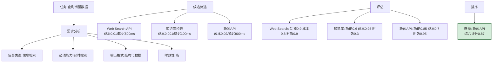

**分析**:虽然知识库成本最低,但时效性差;Web Search 功能强但时效性不如新闻 API;对于"销量数据"这种时效性要求高的信息,新闻 API 是最优选择。

### 8.2 场景二:代码执行任务

**任务**:执行用户提交的 Python 数据分析代码。

| 候选工具 | 能力匹配 | 安全性 | 成本 | 历史成功率 | 综合评分 |
|---------|:-------:|:------:|:----:|:---------:|:-------:|
| Python 沙箱 | 0.95 | 高(隔离) | 0.7 | 0.92 | **0.88** |
| 本地解释器 | 0.95 | 低(无隔离) | 0.9 | 0.95 | 0.82 |
| 远程执行服务 | 0.90 | 高(隔离) | 0.6 | 0.85 | 0.78 |

**分析**:本地解释器性能最好但安全性低;Python 沙箱在安全性与性能间取得平衡,是执行用户代码的最佳选择。

### 8.3 场景三:高风险数据删除任务

**任务**:删除数据库中的过期用户数据。

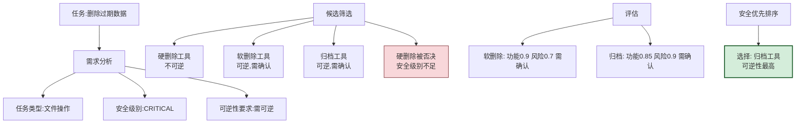

**分析**:对高风险任务,安全优先规则生效,硬删除被一票否决;在软删除与归档中,归档的可逆性更高,风险更低,成为最优选择。

### 8.4 场景四:多工具组合任务

**任务**:从网页抓取数据,清洗后进行统计分析,生成图表。

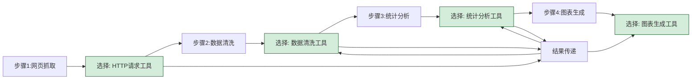

**分析**:此任务需要 4 个工具的组合,每个步骤的工具选择独立进行,但需要考虑数据格式在工具间的传递兼容性。

### 8.5 场景五:工具失败后的切换

**任务**:调用某 API 获取天气数据,但 API 宕机。

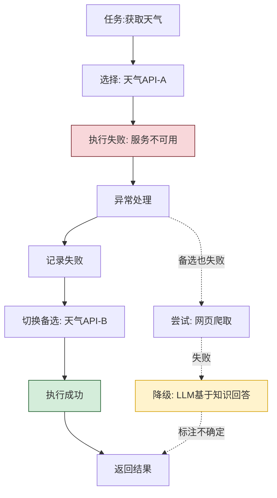

**分析**:工具失败时,按备选链依次尝试,直到找到可用工具;所有工具失败时降级为 LLM 直接回答,但需标注不确定性。

### 8.6 案例对比与规律总结

| 场景 | 核心决策因素 | 关键规则 | 决策难度 |
|-----|:----------:|---------|:--------:|
| 信息检索 | 时效性、准确性 | 时效优先 | 中 |
| 代码执行 | 安全性、兼容性 | 安全优先 | 中 |
| 数据删除 | 可逆性、安全级别 | 安全一票否决 | 高 |
| 多工具组合 | 数据传递兼容性 | 组合优化 | 高 |
| 失败切换 | 备选可用性 | 容错链 | 中 |

---

## 九、性能优化与实践指导

### 9.1 性能优化策略

#### 9.1.1 工具描述索引化

```python
class ToolIndex:
    """工具描述索引,加速候选筛选"""
    
    def __init__(self):
        self.type_index = {}
        self.capability_index = {}
    
    def build_index(self, tools: list[Tool]):
        for tool in tools:
            for task_type in self._infer_task_types(tool):
                self.type_index.setdefault(task_type, []).append(tool)
            for cap in tool.capabilities:
                self.capability_index.setdefault(cap.lower(), []).append(tool)
    
    def search(self, requirements: TaskRequirements) -> list[Tool]:
        candidates = set()
        type_tools = self.type_index.get(requirements.task_type, [])
        candidates.update(type_tools)
        for cap in requirements.required_capabilities:
            candidates.update(self.capability_index.get(cap.lower(), []))
        return list(candidates)
```

#### 9.1.2 决策结果缓存

```python
class DecisionCache:
    """决策结果缓存"""
    
    def __init__(self, ttl: int = 3600):
        self.cache = {}
        self.ttl = ttl
    
    def get(self, task_signature: str) -> Optional[ToolSelectionResult]:
        if task_signature in self.cache:
            entry = self.cache[task_signature]
            if time.time() - entry["timestamp"] < self.ttl:
                return entry["result"]
        return None
    
    def set(self, task_signature: str, result: ToolSelectionResult):
        self.cache[task_signature] = {
            "result": result, "timestamp": time.time()
        }
```

#### 9.1.3 并行评估

```python
import concurrent.futures

def parallel_evaluate(candidates: list[Tool], 
                       requirements: TaskRequirements,
                       llm_client) -> list[dict]:
    """并行评估多个候选工具"""
    results = []
    with concurrent.futures.ThreadPoolExecutor(max_workers=5) as executor:
        futures = {
            executor.submit(evaluate_capability_match, tool, requirements, llm_client): tool
            for tool in candidates
        }
        for future in concurrent.futures.as_completed(futures):
            tool = futures[future]
            try:
                score = future.result()
                results.append({"tool": tool, "capability_score": score})
            except Exception:
                score = rule_based_match(tool, requirements)
                results.append({"tool": tool, "capability_score": score})
    return results
```

### 9.2 最佳实践清单

| 实践领域 | 最佳实践 |
|---------|---------|
| **工具描述规范** | 每个工具必须有清晰、结构化的能力描述 |
| **能力标注标准化** | 使用统一的能力标签体系 |
| **历史数据积累** | 持续记录工具调用的成功/失败数据 |
| **冷启动处理** | 新工具给予中等先验分 |
| **定期重评估** | 工具能力与可用性会变化 |
| **备选链设计** | 每次决策都准备 2-3 个备选工具 |
| **降级机制** | 工具全失败时,有明确的降级路径 |
| **人机协作** | 高风险工具调用前,要求用户确认 |
| **成本监控** | 实时监控工具调用的成本消耗 |
| **决策可解释** | 每次决策附带理由,便于审计与调试 |

### 9.3 常见陷阱与避坑指南

| 陷阱 | 表现 | 规避方法 |
|-----|------|---------|
| 能力描述模糊 | 工具描述不清导致匹配错误 | 强制结构化能力描述 |
| 历史数据偏置 | 只用历史成功率,新工具永远选不上 | 冷启动给予先验分 |
| 忽略副作用 | 只看功能,忽略不可逆操作 | 强制风险评估 |
| 无备选方案 | 主工具失败后无路可走 | 强制备选链 |
| 成本失控 | 选了功能强但昂贵的工具 | 预算约束 + 成本敏感规则 |
| 决策延迟高 | 工具多时全量评估慢 | 索引化 + 缓存 + 并行 |
| 无降级机制 | 工具全失败时僵死 | 设计明确的降级路径 |

---

## 十、总结与展望

### 10.1 核心要点回顾

1. **工具选择是 Agent 决策回路的核心环节**,决定了任务执行的成败、成本与风险。
2. **触发条件多样**:新子任务开始、工具失败、质量不达标、环境变化等,需根据触发条件调整决策策略。
3. **决策流程分八阶段**:任务分析→候选筛选→能力匹配→多维度评估→优先级排序→组合优化→决策输出→执行反馈。
4. **评估指标体系分五维**:能力匹配度、调用成本、历史成功率、输出质量、副作用风险,通过加权融合形成综合评分。
5. **优先级排序分层级**:硬性规则一票否决→主排序键(综合评分)→次排序键(置信度)→辅排序键(偏好)。
6. **异常处理要分层**:选择异常降级处理,调用异常切换备选,结果异常重新决策,全失败降级输出。
7. **不同场景策略不同**:信息检索重时效,代码执行重安全,数据删除重可逆,组合任务重兼容。

### 10.2 工具选择决策成熟度模型

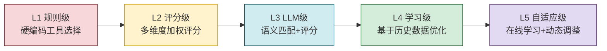

### 10.3 未来发展方向

1. **学习型决策**:Agent 从历史调用中学习工具选择策略,持续优化决策模型。
2. **多 Agent 协同决策**:多个 Agent 共享工具使用经验,集体优化选择策略。
3. **工具能力自描述**:工具能自动生成与更新自己的能力描述。
4. **动态工具市场**:Agent 运行时动态发现并注册新工具。
5. **决策可解释性**:向用户清晰展示工具选择的理由与依据。
6. **成本感知优化**:在保证质量的前提下,自动寻找成本最低的工具组合。

### 10.4 给开发者的实践建议

1. **从规则开始**:先用简单的规则匹配实现基础功能,再逐步引入 LLM 评估与学习机制。
2. **重视工具描述**:投入精力设计规范化的工具描述,这是高质量选择的基础。
3. **积累历史数据**:从第一天起就记录工具调用数据,为后续学习打基础。
4. **设计容错链**:永远准备备选方案,避免单点失败。
5. **成本可视化**:让 Agent 与用户都能感知工具调用的成本。
6. **高风险拦截**:对不可逆操作设计强制确认机制。
7. **持续优化**:定期复盘工具选择决策,识别并改进薄弱环节。

---

> **相关文档**
>
> - [36企业级Agent系统完整设计方案.md](./36企业级Agent系统完整设计方案.md):企业级 Agent 的整体架构,工具选择是其中的核心模块。
> - [37Agent执行流程详解.md](./37Agent执行流程详解.md):工具选择位于执行流程的关键环节。
> - [39ReAct_Agent工作流程详解.md](./39ReAct_Agent工作流程详解.md):ReAct 模式中的工具选择决策。
> - [40Plan-and-Execute_Agent完整实现方案.md](./40Plan-and-Execute_Agent完整实现方案.md):Plan-Execute 模式中的工具调用。
> - [41Agent任务规划机制详解.md](./41Agent任务规划机制详解.md):规划层产出子任务,触发工具选择。
> - [../1基础概念/3Agent核心组成模块详解.md](../1基础概念/3Agent核心组成模块详解.md):工具调用是 Agent 的核心组成模块。
> - [../1基础概念/12Agent自主决策机制深度解析.md](../1基础概念/12Agent自主决策机制深度解析.md):工具选择是自主决策的关键应用。
