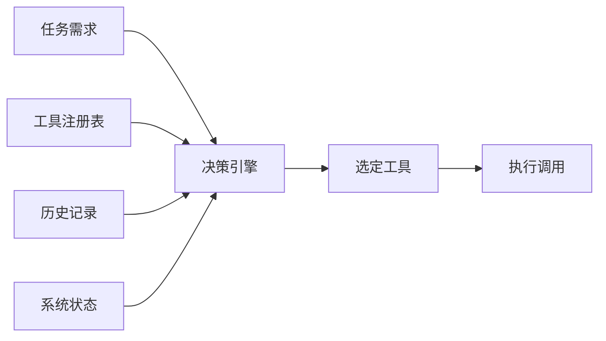
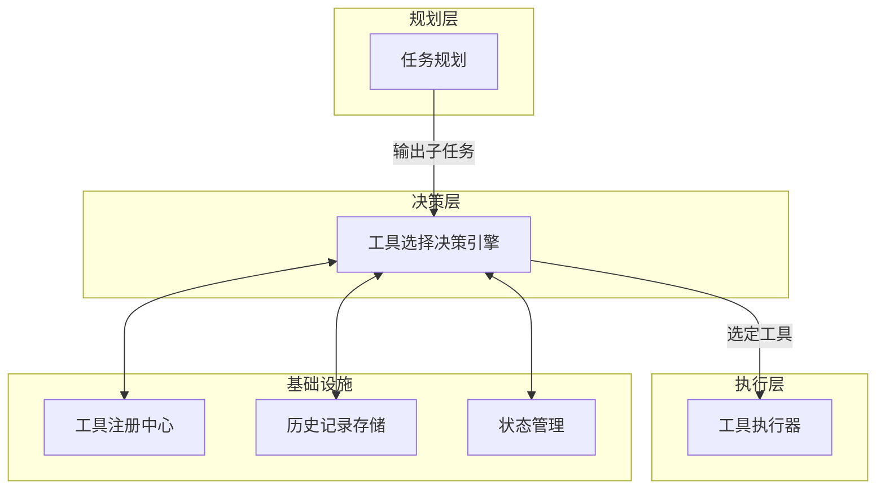
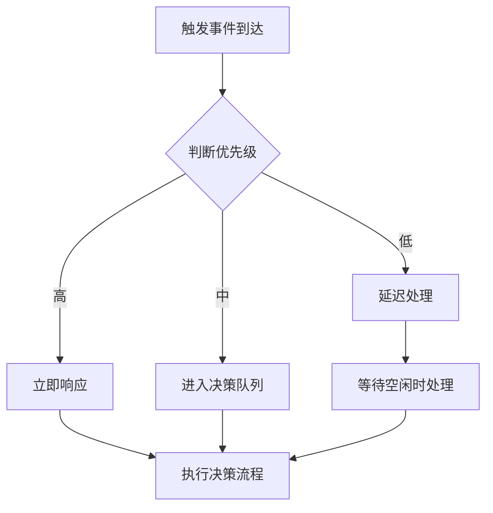
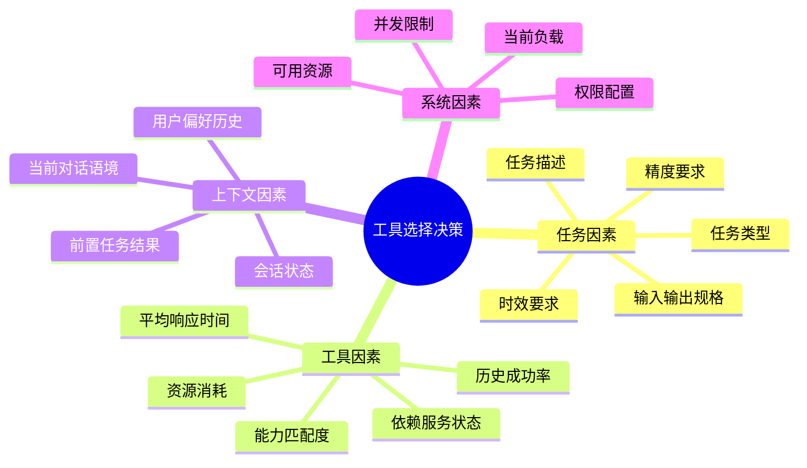
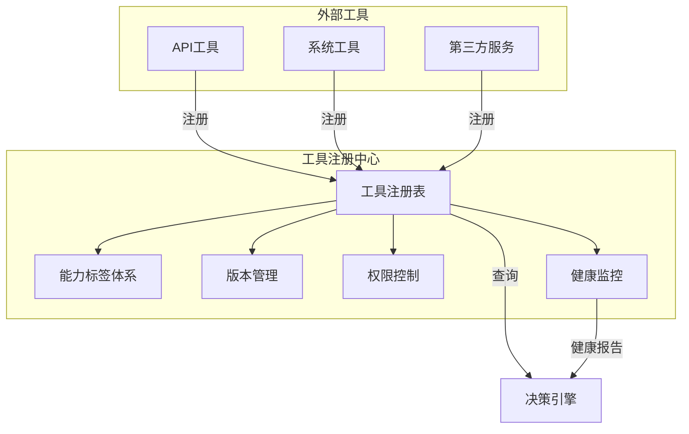
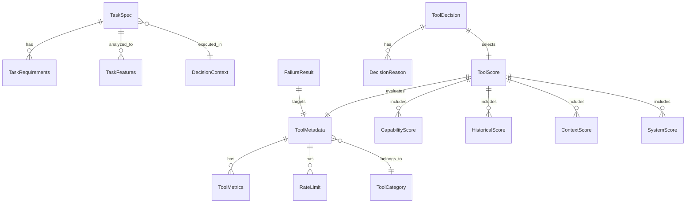
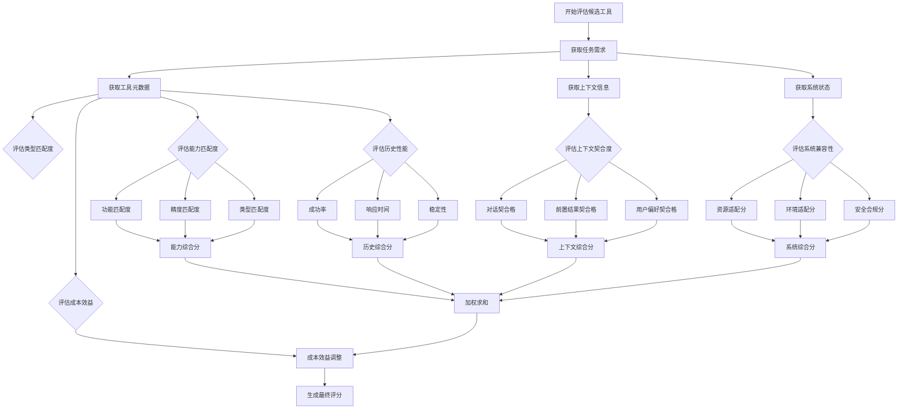
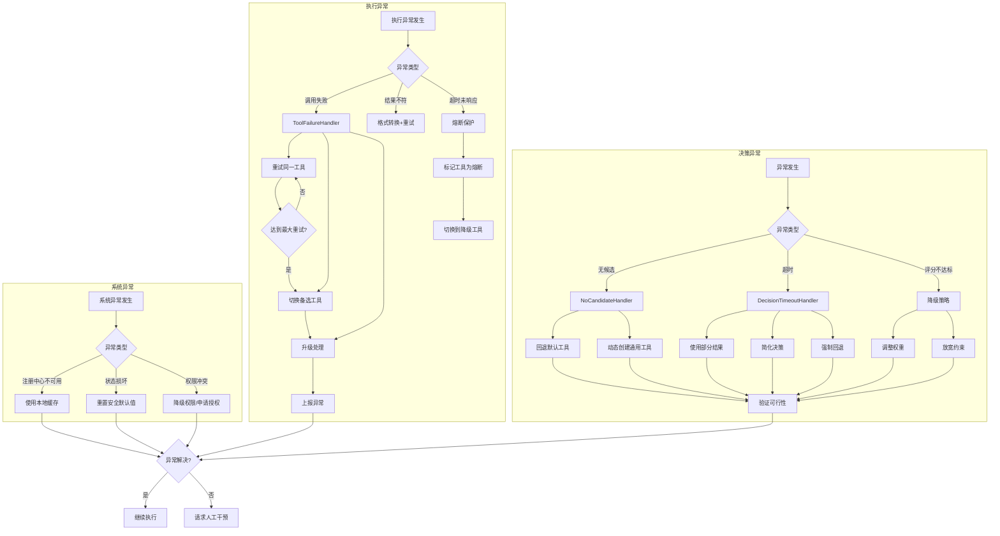
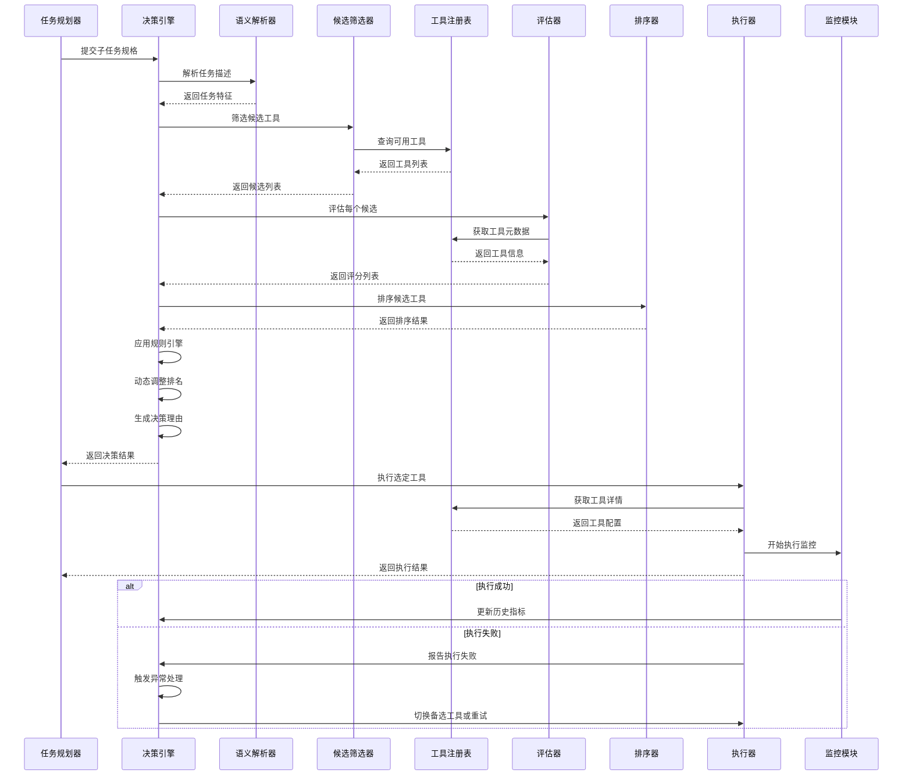

# Agent 工具选择决策机制详解

---

## 目录

- [一、概述与架构定位](#一概述与架构定位)
- [二、工具选择的触发条件](#二工具选择的触发条件)
- [三、决策流程关键因素分析](#三决策流程关键因素分析)
- [四、工具注册中心与能力描述](#四工具注册中心与能力描述)
- [五、候选工具筛选算法](#五候选工具筛选算法)
- [六、多维度能力评估与评分算法](#六多维度能力评估与评分算法)
- [七、工具调用优先级排序方法](#七工具调用优先级排序方法)
- [八、异常情况处理策略](#八异常情况处理策略)
- [九、核心数据结构设计](#九核心数据结构设计)
- [十、完整决策流程伪代码实现](#十完整决策流程伪代码实现)
- [十一、逻辑流程图解](#十一逻辑流程图解)
- [十二、端到端案例演示](#十二端到端案例演示)
- [十三、总结与最佳实践](#十三总结与最佳实践)

---

## 一、概述与架构定位

### 1.1 工具选择决策的定义

工具选择决策（Tool Selection Decision）是 Agent 在执行任务过程中，根据当前任务需求、系统状态和历史数据，从可用工具集合中筛选出最优工具或工具组合的过程。



### 1.2 在 Agent 架构中的位置

工具选择决策是 Agent 系统中 **决策层** 的核心组件，连接任务规划层与执行层。



### 1.3 决策流程总览

```mermaid
flowchart TD
    Start([子任务就绪]) --> Trigger{触发条件满足?}
    Trigger -->|是| Retrieve[检索候选工具]
    Trigger -->|否| Wait[等待或重新规划]
    Wait --> Start
    
    Retrieve --> Filter[能力筛选与匹配]
    Filter --> Score[多维度评分计算]
    Score --> Rank[优先级排序]
    Rank --> Check{评分是否达标?}
    Check -->|是| Select[选定最优工具]
    Check -->|否| Exception[异常处理]
    Exception --> Fallback[降级策略/重新规划]
    Select --> Execute[进入执行阶段]
    Fallback --> Start
    Execute --> End([执行结果反馈])

    style Start fill:#4a90d9,style=End fill:#50b83c,style=Exception fill:#f53f3f,style=Trigger fill:#fa8c16
```

---

## 二、工具选择的触发条件

### 2.1 触发条件分类

工具选择决策的触发分为以下几类：

| 触发类型 | 触发条件 | 说明 |
| --- | --- | --- |
| **任务驱动** | 子任务状态变为 `READY` | 规划器分配的子任务已就绪，需要确定执行工具 |
| **事件驱动** | 系统事件或外部事件发生 | 如工具调用失败、上下文变化、用户打断等 |
| **状态驱动** | 系统负载或资源状态变化 | 如当前工具过载、有新工具注册等 |
| **用户主动** | 用户指定工具或请求特定功能 | 需检查工具可用性与权限 |

### 2.2 触发机制设计

```python
class ToolSelectorTrigger:
    """工具选择触发器"""
    
    def __init__(self, decision_engine):
        self.engine = decision_engine
        self.trigger_handlers = {
            "TASK_READY": self._handle_task_ready,
            "TOOL_FAILED": self._handle_tool_failed,
            "STATE_CHANGED": self._handle_state_change,
            "USER_REQUEST": self._handle_user_request,
        }

    def on_event(self, event_type, context):
        """事件入口：根据事件类型分发处理"""
        handler = self.trigger_handlers.get(event_type)
        if handler:
            return handler(context)
        return None

    def _handle_task_ready(self, task):
        """子任务就绪触发"""
        candidates = self.engine.get_candidates(task)
        ranked = self.engine.rank_tools(candidates, task)
        return self.engine.select_best(ranked, task)

    def _handle_tool_failed(self, failure_info):
        """工具失败后重选（排除失败工具）"""
        task = failure_info["task"]
        failed_tool_id = failure_info["tool_id"]
        candidates = self.engine.get_candidates(task, exclude=[failed_tool_id])
        # 标记失败工具的历史记录
        self.engine.record_failure(failed_tool_id)
        ranked = self.engine.rank_tools(candidates, task)
        return self.engine.select_best(ranked, task)

    def _handle_state_change(self, state_info):
        """状态变更触发：如系统负载过高时切换工具"""
        if state_info.get("high_load"):
            return self.engine.switch_to_lightweight_tool(state_info["task"])
        return None

    def _handle_user_request(self, user_spec):
        """用户指定工具"""
        tool = self.engine.get_tool_by_id(user_spec["tool_id"])
        if tool and tool.is_available():
            return tool
        return self.engine.get_candidates(user_spec["task"])  # 回退到自动选择
```

### 2.3 触发优先级



**优先级定义：**

| 优先级 | 触发类型 | 响应时间要求 |
| --- | --- | --- |
| P0 | 用户主动请求 | 立即响应 |
| P1 | 工具调用失败 | 快速响应（ms级） |
| P2 | 子任务就绪 | 常规响应 |
| P3 | 状态变更通知 | 可延迟处理 |

---

## 三、决策流程关键因素分析

### 3.1 核心决策因素模型



### 3.2 各因素详解

#### 3.2.1 任务因素

```python
@dataclass
class TaskSpec:
    """任务规格"""
    task_id: str
    task_type: TaskType          # 如 DATA_QUERY, CODE_EXEC, FILE_OP
    description: str            # 自然语言描述
    input_schema: Dict          # 输入数据结构
    output_schema: Dict         # 期望输出结构
    requirements: TaskRequirements

@dataclass
class TaskRequirements:
    """任务需求约束"""
    min_precision: float = 0.0   # 最低精度要求
    max_latency_ms: int = 5000   # 最大延迟
    max_resource: ResourceType = None  # 资源上限
    must_include: List[str] = None     # 必须包含的能力
    must_exclude: List[str] = None     # 必须排除的能力
```

**任务类型映射表：**

| TaskType | 典型工具类别 | 示例 |
| --- | --- | --- |
| `DATA_QUERY` | 数据库查询、API调用 | SQL查询、HTTP请求 |
| `CODE_EXEC` | 代码执行器、沙箱 | Python运行器、Node运行器 |
| `FILE_OP` | 文件读写工具 | 文件管理器、压缩工具 |
| `SEARCH` | 搜索、索引查询 | 全文搜索、向量搜索 |
| `NOTIFICATION` | 消息推送、邮件 | 邮件发送、IM通知 |
| `CALCULATION` | 数学计算、公式引擎 | 计算器、公式求值器 |
| `VISUALIZATION` | 图表生成、渲染 | 图表绘制、PDF生成 |

#### 3.2.2 工具因素

```python
@dataclass
class ToolMetrics:
    """工具性能指标（来自历史统计）"""
    total_calls: int = 0
    success_rate: float = 1.0       # 历史成功率 0-1
    avg_latency_ms: float = 0       # 平均响应时间
    p99_latency_ms: float = 0        # 99分位响应时间
    avg_cpu_usage: float = 0        # 平均CPU占用
    avg_memory_usage: float = 0     # 平均内存占用
    error_rate: float = 0           # 错误率
    last_updated: datetime = None   # 最后更新时间
```

#### 3.2.3 上下文因素

```python
@dataclass
class DecisionContext:
    """决策上下文"""
    conversation_history: List[Message]        # 对话历史
    previous_results: List[TaskResult]         # 前置任务执行结果
    user_preferences: UserPreferences         # 用户偏好设置
    session_state: SessionState                # 会话状态
    environment: EnvironmentState              # 环境状态
```

#### 3.2.4 系统因素

```python
@dataclass
class SystemLoad:
    """系统负载状态"""
    cpu_usage: float          # 当前CPU使用率 0-1
    memory_usage: float       # 当前内存使用率 0-1
    active_connections: int   # 活跃连接数
    queue_depth: int          # 等待队列深度
    available_threads: int    # 可用线程数
    timestamp: datetime       # 采样时间
```

### 3.3 因素权重动态调整

不同场景下各因素的权重应动态调整：

| 场景 | 任务因素权重 | 工具因素权重 | 上下文因素权重 | 系统因素权重 |
| --- | --- | --- | --- | --- |
| 实时性要求高 | 0.4 | 0.3 | 0.1 | 0.2 |
| 精度要求高 | 0.5 | 0.25 | 0.15 | 0.1 |
| 批量处理 | 0.3 | 0.4 | 0.1 | 0.2 |
| 用户偏好优先 | 0.3 | 0.2 | 0.4 | 0.1 |
| 资源紧张 | 0.3 | 0.4 | 0.1 | 0.2 |

```python
class WeightAdjuster:
    """动态权重调整器"""

    SCENARIO_WEIGHTS = {
        "realtime": {"task": 0.4, "tool": 0.3, "context": 0.1, "system": 0.2},
        "precision": {"task": 0.5, "tool": 0.25, "context": 0.15, "system": 0.1},
        "batch": {"task": 0.3, "tool": 0.4, "context": 0.1, "system": 0.2},
        "user_pref": {"task": 0.3, "tool": 0.2, "context": 0.4, "system": 0.1},
        "resource_constrained": {"task": 0.3, "tool": 0.4, "context": 0.1, "system": 0.2},
    }

    def get_weights(self, scenario: str = "realtime") -> dict:
        return self.SCENARIO_WEIGHTS.get(scenario, self.SCENARIO_WEIGHTS["realtime"])

    def adaptive_weights(self, system_load: SystemLoad) -> dict:
        """根据系统负载自适应调整权重"""
        base = self.SCENARIO_WEIGHTS["realtime"].copy()
        if system_load.cpu_usage > 0.8 or system_load.memory_usage > 0.8:
            base["system"] += 0.15
            base["tool"] -= 0.1
        if system_load.queue_depth > 100:
            base["system"] += 0.1
        # 归一化
        total = sum(base.values())
        return {k: v / total for k, v in base.items()}
```

---

## 四、工具注册中心与能力描述

### 4.1 工具注册中心架构



### 4.2 工具元数据描述

```python
@dataclass
class ToolMetadata:
    """工具元数据"""
    tool_id: str                    # 唯一标识符
    tool_name: str                  # 工具名称
    description: str                # 功能描述
    category: ToolCategory          # 工具分类
    capabilities: List[str]          # 能力标签列表
    input_schema: Dict               # 输入参数结构定义
    output_schema: Dict              # 输出结构定义
    version: str                     # 版本号
    owner: str                       # 负责人
    status: ToolStatus               # 工具状态
    
    # 历史统计
    metrics: ToolMetrics = None
    
    # 依赖关系
    dependencies: List[str] = None   # 依赖的其他工具ID
    
    # 成本与配额
    cost_per_call: float = 0.0       # 单次调用成本
    rate_limit: RateLimit = None     # 速率限制
    
    # 环境配置
    environments: List[str] = None   # 支持的环境
    requires_auth: bool = False      # 是否需要认证
    
    # 工具优先级建议
    default_priority: int = 5        # 默认优先级 1-10

class ToolCategory(Enum):
    """工具分类"""
    DATA_QUERY = "data_query"          # 数据查询
    CODE_EXEC = "code_exec"            # 代码执行
    FILE_OP = "file_operation"         # 文件操作
    SEARCH = "search"                  # 搜索检索
    NOTIFICATION = "notification"      # 通知推送
    CALCULATION = "calculation"        # 计算求值
    VISUALIZATION = "visualization"    # 可视化
    SYSTEM = "system"                  # 系统操作
    INTEGRATION = "integration"        # 集成对接
    AI_MODEL = "ai_model"              # AI模型调用

class ToolStatus(Enum):
    """工具状态"""
    ACTIVE = "active"                  # 正常可用
    BETA = "beta"                      # 测试中
    DEPRECATED = "deprecated"          # 即将废弃
    MAINTENANCE = "maintenance"        # 维护中
    OFFLINE = "offline"                # 不可用

@dataclass
class RateLimit:
    """速率限制"""
    max_calls_per_minute: int
    max_calls_per_hour: int
    max_concurrent_calls: int
    cooldown_seconds: int = 0
```

### 4.3 能力标签体系设计

```python
class CapabilityTagSystem:
    """能力标签体系"""
    
    # 核心能力维度
    DIMENSIONS = {
        "data_access": {
            "tags": ["read", "write", "query", "index", "stream"],
            "weight": 1.0
        },
        "compute": {
            "tags": ["transform", "aggregate", "filter", "sort", "join"],
            "weight": 1.0
        },
        "communication": {
            "tags": ["send", "receive", "notify", "publish", "subscribe"],
            "weight": 0.8
        },
        "execution": {
            "tags": ["run", "compile", "deploy", "invoke", "schedule"],
            "weight": 1.2
        },
        "intelligence": {
            "tags": ["analyze", "predict", "classify", "generate", "summarize"],
            "weight": 1.5
        }
    }

    def compute_capability_score(self, tool: ToolMetadata, 
                                task_requirements: List[str]) -> float:
        """计算工具能力匹配度"""
        score = 0.0
        matched_dimensions = set()
        
        for cap in tool.capabilities:
            for dim, config in self.DIMENSIONS.items():
                if cap in config["tags"]:
                    matched_dimensions.add(dim)
                    if cap in task_requirements:
                        score += config["weight"] * 1.0
                    else:
                        score += config["weight"] * 0.3
        
        # 惩罚不匹配的必需能力
        for req in task_requirements:
            if req not in tool.capabilities:
                score -= 0.5
        
        return max(0.0, min(1.0, score / len(self.DIMENSIONS)))
```

### 4.4 工具注册表实现

```python
class ToolRegistry:
    """工具注册表"""
    
    def __init__(self):
        self._tools: Dict[str, ToolMetadata] = {}
        self._category_index: Dict[ToolCategory, List[str]] = defaultdict(list)
        self._capability_index: Dict[str, List[str]] = defaultdict(list)
        self._status_index: Dict[ToolStatus, List[str]] = defaultdict(list)
    
    def register(self, metadata: ToolMetadata):
        """注册新工具"""
        self._tools[metadata.tool_id] = metadata
        self._category_index[metadata.category].append(metadata.tool_id)
        for cap in metadata.capabilities:
            self._capability_index[cap].append(metadata.tool_id)
        self._status_index[metadata.status].append(metadata.tool_id)
    
    def unregister(self, tool_id: str):
        """注销工具"""
        if tool_id in self._tools:
            meta = self._tools.pop(tool_id)
            self._category_index[meta.category].remove(tool_id)
            for cap in meta.capabilities:
                self._capability_index[cap].remove(tool_id)
            self._status_index[meta.status].remove(tool_id)
    
    def get_tool(self, tool_id: str) -> ToolMetadata:
        """获取单个工具"""
        return self._tools.get(tool_id)
    
    def query(self, 
              categories: List[ToolCategory] = None,
              capabilities: List[str] = None,
              statuses: List[ToolStatus] = None) -> List[ToolMetadata]:
        """按条件查询工具"""
        candidate_ids = set(self._tools.keys())
        
        if categories:
            category_ids = set()
            for cat in categories:
                category_ids.update(self._category_index.get(cat, []))
            candidate_ids &= category_ids
        
        if capabilities:
            cap_ids = set()
            for cap in capabilities:
                cap_ids.update(self._capability_index.get(cap, []))
            candidate_ids &= cap_ids
        
        if statuses:
            status_ids = set()
            for st in statuses:
                status_ids.update(self._status_index.get(st, []))
            candidate_ids &= status_ids
        
        return [self._tools[tid] for tid in candidate_ids]
    
    def get_available_tools(self) -> List[ToolMetadata]:
        """获取所有可用工具"""
        return self.query(statuses=[ToolStatus.ACTIVE, ToolStatus.BETA])
    
    def update_metrics(self, tool_id: str, metrics: ToolMetrics):
        """更新工具性能指标"""
        if tool_id in self._tools:
            self._tools[tool_id].metrics = metrics
```

---

## 五、候选工具筛选算法

### 5.1 筛选流程

```mermaid
flowchart TD
    A[接收任务需求] --> B[语义解析提取特征]
    B --> C[第一层筛选：类别匹配]
    C --> D[第二层筛选：能力匹配]
    D --> E[第三层筛选：约束检查]
    E --> F[第四层筛选：健康状态]
    F --> G[生成候选工具列表]
    
    subgraph 筛选维度
        C
        D
        E
        F
    end
    
    style A fill:#4a90d9,style=G fill:#50b83c
```

### 5.2 语义解析与特征提取

```python
class TaskSemanticParser:
    """任务语义解析器"""
    
    # 任务类型关键词映射
    TYPE_KEYWORDS = {
        "DATA_QUERY": ["查询", "搜索", "查找", "获取", "读取", "检索", "query", "search", "find", "get"],
        "CODE_EXEC": ["执行", "运行", "计算", "编译", "运行代码", "execute", "run", "calculate", "compile"],
        "FILE_OP": ["文件", "读写", "保存", "上传", "下载", "file", "write", "read", "save", "upload"],
        "NOTIFICATION": ["发送", "通知", "推送", "邮件", "消息", "send", "notify", "push", "email", "message"],
        "CALCULATION": ["计算", "求值", "统计", "汇总", "公式", "calc", "compute", "evaluate", "statistic"],
        "VISUALIZATION": ["图表", "可视化", "绘制", "生成报告", "chart", "visualize", "graph", "report"]
    }
    
    # 能力关键词映射
    CAPABILITY_KEYWORDS = {
        "read": ["读取", "查询", "获取", "读取", "read", "fetch", "retrieve"],
        "write": ["写入", "保存", "创建", "写入", "write", "save", "create"],
        "transform": ["转换", "格式", "解析", "转换", "transform", "convert", "parse"],
        "aggregate": ["统计", "汇总", "聚合", "aggregate", "summarize", "total"],
        "analyze": ["分析", "评估", "检测", "analyze", "evaluate", "detect"],
        "generate": ["生成", "创建", "制作", "generate", "create", "produce"]
    }
    
    def parse(self, task_description: str) -> TaskFeatures:
        """解析任务描述，提取特征"""
        description_lower = task_description.lower()
        
        # 提取任务类型
        detected_types = self._detect_types(description_lower)
        
        # 提取能力需求
        required_capabilities = self._detect_capabilities(description_lower)
        
        # 提取约束条件
        constraints = self._extract_constraints(task_description)
        
        return TaskFeatures(
            detected_types=detected_types,
            required_capabilities=required_capabilities,
            constraints=constraints,
            original_description=task_description
        )
    
    def _detect_types(self, text: str) -> List[TaskType]:
        """检测任务类型"""
        detected = set()
        for type_name, keywords in self.TYPE_KEYWORDS.items():
            if any(kw in text for kw in keywords):
                detected.add(TaskType[type_name])
        if not detected:
            detected.add(TaskType.CALCULATION)  # 默认类型
        return list(detected)
    
    def _detect_capabilities(self, text: str) -> List[str]:
        """检测能力需求"""
        detected = set()
        for cap, keywords in self.CAPABILITY_KEYWORDS.items():
            if any(kw in text for kw in keywords):
                detected.add(cap)
        return list(detected)
    
    def _extract_constraints(self, text: str) -> Dict:
        """提取约束条件"""
        constraints = {}
        
        # 时间约束
        time_pattern = re.compile(r'(\d+)\s*(秒|毫秒|分钟|小时|秒内|ms|s|min|h)', re.IGNORECASE)
        time_match = time_pattern.search(text)
        if time_match:
            constraints['max_latency'] = self._parse_time(time_match.group(1), time_match.group(2))
        
        # 精度约束
        if '精确' in text or '准确' in text:
            constraints['high_precision'] = True
        
        # 数量约束
        count_pattern = re.compile(r'最多\s*(\d+)\s*(条|次|个|项)')
        count_match = count_pattern.search(text)
        if count_match:
            constraints['max_results'] = int(count_match.group(1))
        
        return constraints
    
    def _parse_time(self, value: str, unit: str) -> int:
        """解析时间单位为毫秒"""
        value = int(value)
        unit = unit.lower()
        if unit in ('秒', 's'):
            return value * 1000
        elif unit in ('毫秒', 'ms'):
            return value
        elif unit in ('分钟', 'min'):
            return value * 60000
        elif unit in ('小时', 'h'):
            return value * 3600000
        return value


@dataclass
class TaskFeatures:
    """任务特征"""
    detected_types: List[TaskType]
    required_capabilities: List[str]
    constraints: Dict
    original_description: str
```

### 5.3 多维度筛选实现

```python
class ToolCandidateFilter:
    """候选工具筛选器"""
    
    def __init__(self, registry: ToolRegistry):
        self.registry = registry
        self.parser = TaskSemanticParser()
    
    def filter_candidates(self, 
                          task_features: TaskFeatures,
                          max_candidates: int = 10) -> List[ToolMetadata]:
        """筛选候选工具"""
        candidates = self.registry.get_available_tools()
        
        # 第一层：类别匹配
        candidates = self._filter_by_category(candidates, task_features.detected_types)
        
        # 第二层：能力匹配
        candidates = self._filter_by_capability(candidates, task_features.required_capabilities)
        
        # 第三层：约束检查
        candidates = self._filter_by_constraints(candidates, task_features.constraints)
        
        # 第四层：健康状态检查
        candidates = self._filter_by_health(candidates)
        
        # 按匹配度排序并返回前N个
        candidates = self._rank_by_relevance(candidates, task_features)
        
        return candidates[:max_candidates]
    
    def _filter_by_category(self, tools: List[ToolMetadata], 
                            types: List[TaskType]) -> List[ToolMetadata]:
        """按类别筛选"""
        if not types:
            return tools
        # 类别映射关系
        category_mapping = {
            TaskType.DATA_QUERY: [ToolCategory.DATA_QUERY, ToolCategory.SEARCH],
            TaskType.CODE_EXEC: [ToolCategory.CODE_EXEC, ToolCategory.AI_MODEL],
            TaskType.FILE_OP: [ToolCategory.FILE_OP, ToolCategory.SYSTEM],
            TaskType.NOTIFICATION: [ToolCategory.NOTIFICATION],
            TaskType.CALCULATION: [ToolCategory.CALCULATION, ToolCategory.DATA_QUERY],
            TaskType.VISUALIZATION: [ToolCategory.VISUALIZATION]
        }
        
        valid_categories = set()
        for t in types:
            valid_categories.update(category_mapping.get(t, []))
        
        filtered = [t for t in tools if t.category in valid_categories]
        
        # 如果筛选后为空，返回全部活跃工具
        if not filtered:
            filtered = tools
        
        return filtered
    
    def _filter_by_capability(self, tools: List[ToolMetadata],
                               capabilities: List[str]) -> List[ToolMetadata]:
        """按能力筛选"""
        if not capabilities:
            return tools
        
        # 至少匹配一个能力即可
        filtered = []
        for tool in tools:
            if any(cap in tool.capabilities for cap in capabilities):
                filtered.append(tool)
        
        return filtered if filtered else tools
    
    def _filter_by_constraints(self, tools: List[ToolMetadata],
                                constraints: Dict) -> List[ToolMetadata]:
        """按约束条件筛选"""
        if not constraints:
            return tools
        
        filtered = []
        for tool in tools:
            meets_all = True
            
            if 'max_latency' in constraints and tool.metrics:
                if tool.metrics.avg_latency_ms > constraints['max_latency']:
                    meets_all = False
            
            if tool.rate_limit:
                if constraints.get('max_results', 0) > tool.rate_limit.max_calls_per_minute:
                    meets_all = False
            
            if meets_all:
                filtered.append(tool)
        
        return filtered if filtered else tools
    
    def _filter_by_health(self, tools: List[ToolMetadata]) -> List[ToolMetadata]:
        """按健康状态筛选"""
        return [t for t in tools if t.status == ToolStatus.ACTIVE]
    
    def _rank_by_relevance(self, tools: List[ToolMetadata],
                            features: TaskFeatures) -> List[ToolMetadata]:
        """按相关性排序"""
        scored = []
        for tool in tools:
            score = self._compute_relevance_score(tool, features)
            scored.append((tool, score))
        
        scored.sort(key=lambda x: x[1], reverse=True)
        return [t for t, _ in scored]
    
    def _compute_relevance_score(self, tool: ToolMetadata,
                                  features: TaskFeatures) -> float:
        """计算相关性分数"""
        score = 0.0
        
        # 类型匹配得分
        category_mapping = {
            TaskType.DATA_QUERY: ToolCategory.DATA_QUERY,
            TaskType.CODE_EXEC: ToolCategory.CODE_EXEC,
            TaskType.FILE_OP: ToolCategory.FILE_OP,
            TaskType.NOTIFICATION: ToolCategory.NOTIFICATION,
            TaskType.CALCULATION: ToolCategory.CALCULATION,
            TaskType.VISUALIZATION: ToolCategory.VISUALIZATION
        }
        
        for task_type in features.detected_types:
            expected_cat = category_mapping.get(task_type)
            if tool.category == expected_cat:
                score += 0.4
        
        # 能力匹配得分
        matched_caps = sum(1 for cap in features.required_capabilities 
                          if cap in tool.capabilities)
        total_caps = len(features.required_capabilities) or 1
        score += (matched_caps / total_caps) * 0.4
        
        # 历史成功率加分
        if tool.metrics:
            score += tool.metrics.success_rate * 0.2
        
        return score
```

---

## 六、多维度能力评估与评分算法

### 6.1 评估维度体系

```mermaid
graph TD
    subgraph "评估维度"
        A[能力匹配度]
        B[历史性能]
        C[上下文契合度]
        D[系统兼容性]
        E[成本效益]
    end
    
    A --> A1[功能匹配]
    A --> A2[精度匹配]
    A --> A3[类型匹配]
    
    B --> B1[成功率]
    B --> B2[响应时间]
    B --> B3[稳定性]
    
    C --> C1[对话上下文]
    C --> C2[前置结果]
    C --> C3[用户偏好]
    
    D --> D1[资源需求]
    D --> D2[环境要求]
    D --> D3[安全合规]
    
    E --> E1[调用成本]
    E --> E2[维护成本]
    E --> E3[效率指标]
    
    style A fill:#4a90d9,style=B fill:#50b83c,style=C fill:#fa8c16,style=D fill:#722ed1,style=E fill:#eb2f96
```

### 6.2 能力匹配度评估

```python
class CapabilityEvaluator:
    """能力匹配度评估器"""
    
    def evaluate(self, tool: ToolMetadata, 
                 task_spec: TaskSpec) -> float:
        """综合评估工具与任务的能力匹配度"""
        scores = []
        
        # 功能匹配度
        func_score = self._evaluate_function_match(tool, task_spec)
        scores.append(("function", func_score, 0.4))
        
        # 精度匹配度
        precision_score = self._evaluate_precision_match(tool, task_spec)
        scores.append(("precision", precision_score, 0.3))
        
        # 类型匹配度
        type_score = self._evaluate_type_match(tool, task_spec)
        scores.append(("type", type_score, 0.3))
        
        # 加权求和
        total_weight = sum(w for _, _, w in scores)
        weighted_sum = sum(s * w for _, s, w in scores)
        
        return weighted_sum / total_weight if total_weight > 0 else 0.0
    
    def _evaluate_function_match(self, tool: ToolMetadata, 
                                  task_spec: TaskSpec) -> float:
        """评估功能匹配度"""
        if not task_spec.requirements.must_include:
            return 0.5  # 无明确要求时给出中性分数
        
        matched = sum(1 for req in task_spec.requirements.must_include 
                     if self._capability_satisfies(tool, req))
        total = len(task_spec.requirements.must_include)
        return matched / total if total > 0 else 0.5
    
    def _capability_satisfies(self, tool: ToolMetadata, 
                               requirement: str) -> bool:
        """检查工具是否满足特定能力要求"""
        # 直接匹配
        if requirement in tool.capabilities:
            return True
        
        # 语义等价匹配
        equivalence_map = {
            "read": ["query", "fetch", "retrieve", "search"],
            "write": ["save", "create", "store", "update"],
            "transform": ["convert", "parse", "format", "process"],
            "aggregate": ["summarize", "total", "group", "combine"],
            "analyze": ["evaluate", "detect", "examine", "assess"],
            "generate": ["create", "produce", "build", "compose"]
        }
        
        for key, synonyms in equivalence_map.items():
            if requirement == key and any(syn in tool.capabilities for syn in synonyms):
                return True
        
        return False
    
    def _evaluate_precision_match(self, tool: ToolMetadata,
                                    task_spec: TaskSpec) -> float:
        """评估精度匹配度"""
        required_precision = task_spec.requirements.min_precision
        
        # 从工具元数据中推断精度能力
        tool_precision = self._infer_precision(tool)
        
        if tool_precision >= required_precision:
            return 1.0  # 工具精度满足要求
        elif tool_precision >= required_precision * 0.8:
            return 0.7  # 接近要求
        else:
            return tool_precision  # 返回实际精度作为分数
    
    def _infer_precision(self, tool: ToolMetadata) -> float:
        """推断工具的精度能力"""
        # AI模型类工具通常精度较高
        if tool.category == ToolCategory.AI_MODEL:
            return 0.95
        # 数据查询类依赖数据源精度
        if tool.category == ToolCategory.DATA_QUERY:
            return 0.85
        # 文件操作类精度取决于存储
        if tool.category == ToolCategory.FILE_OP:
            return 0.80
        # 计算类精度取决于算法
        if tool.category == ToolCategory.CALCULATION:
            return 0.90
        return 0.70  # 默认精度
    
    def _evaluate_type_match(self, tool: ToolMetadata,
                               task_spec: TaskSpec) -> float:
        """评估类型匹配度"""
        category_mapping = {
            TaskType.DATA_QUERY: ToolCategory.DATA_QUERY,
            TaskType.CODE_EXEC: ToolCategory.CODE_EXEC,
            TaskType.FILE_OP: ToolCategory.FILE_OP,
            TaskType.NOTIFICATION: ToolCategory.NOTIFICATION,
            TaskType.CALCULATION: ToolCategory.CALCULATION,
            TaskType.VISUALIZATION: ToolCategory.VISUALIZATION
        }
        
        expected = category_mapping.get(task_spec.task_type)
        if expected and tool.category == expected:
            return 1.0
        elif expected and tool.category in self._get_related_categories(expected):
            return 0.6
        else:
            return 0.3
    
    def _get_related_categories(self, category: ToolCategory) -> List[ToolCategory]:
        """获取相关工具类别"""
        relations = {
            ToolCategory.DATA_QUERY: [ToolCategory.SEARCH, ToolCategory.INTEGRATION],
            ToolCategory.CODE_EXEC: [ToolCategory.AI_MODEL, ToolCategory.SYSTEM],
            ToolCategory.FILE_OP: [ToolCategory.SYSTEM, ToolCategory.INTEGRATION],
            ToolCategory.NOTIFICATION: [ToolCategory.INTEGRATION],
            ToolCategory.CALCULATION: [ToolCategory.DATA_QUERY, ToolCategory.AI_MODEL],
            ToolCategory.VISUALIZATION: [ToolCategory.DATA_QUERY, ToolCategory.AI_MODEL]
        }
        return relations.get(category, [])
```

### 6.3 历史性能评估

```python
class HistoricalPerformanceEvaluator:
    """历史性能评估器"""
    
    def evaluate(self, tool: ToolMetadata) -> float:
        """评估历史性能"""
        if not tool.metrics or tool.metrics.total_calls == 0:
            return 0.5  # 无历史数据时给出中性分数
        
        scores = [
            self._evaluate_success_rate(tool.metrics),
            self._evaluate_latency(tool.metrics),
            self._evaluate_stability(tool.metrics)
        ]
        weights = [0.4, 0.3, 0.3]
        
        return sum(s * w for s, w in zip(scores, weights))
    
    def _evaluate_success_rate(self, metrics: ToolMetrics) -> float:
        """评估成功率"""
        rate = metrics.success_rate
        # 95%以上满分，线性递减
        if rate >= 0.95:
            return 1.0
        elif rate >= 0.90:
            return 0.9
        elif rate >= 0.80:
            return 0.8
        elif rate >= 0.70:
            return 0.6
        else:
            return rate  # 低于70%使用实际值
    
    def _evaluate_latency(self, metrics: ToolMetrics) -> float:
        """评估响应时间"""
        avg_lat = metrics.avg_latency_ms
        p99_lat = metrics.p99_latency_ms
        
        # 综合考虑平均和峰值
        if avg_lat < 100:
            score = 1.0
        elif avg_lat < 500:
            score = 0.9
        elif avg_lat < 1000:
            score = 0.8
        elif avg_lat < 3000:
            score = 0.6
        elif avg_lat < 5000:
            score = 0.4
        else:
            score = 0.2
        
        # P99惩罚
        if p99_lat > avg_lat * 3:
            score *= 0.8
        
        return score
    
    def _evaluate_stability(self, metrics: ToolMetrics) -> float:
        """评估稳定性"""
        total = metrics.total_calls
        error_rate = metrics.error_rate
        
        # 样本量加权
        sample_weight = min(1.0, total / 100)  # 至少100次调用才有完整置信度
        
        # 错误率评分
        if error_rate < 0.01:
            err_score = 1.0
        elif error_rate < 0.05:
            err_score = 0.9
        elif error_rate < 0.10:
            err_score = 0.7
        elif error_rate < 0.20:
            err_score = 0.5
        else:
            err_score = 0.3
        
        return err_score * sample_weight + 0.5 * (1 - sample_weight)
```

### 6.4 上下文契合度评估

```python
class ContextFitnessEvaluator:
    """上下文契合度评估器"""
    
    def evaluate(self, tool: ToolMetadata, 
                 context: DecisionContext,
                 task_spec: TaskSpec) -> float:
        """评估上下文契合度"""
        scores = [
            self._evaluate_conversation_fit(tool, context),
            self._evaluate_previous_results_fit(tool, context, task_spec),
            self._evaluate_user_preference_fit(tool, context)
        ]
        weights = [0.3, 0.3, 0.4]
        
        return sum(s * w for s, w in zip(scores, weights))
    
    def _evaluate_conversation_fit(self, tool: ToolMetadata,
                                     context: DecisionContext) -> float:
        """评估与当前对话的契合度"""
        if not context.conversation_history:
            return 0.5
        
        # 检查工具是否与近期对话主题相关
        recent_messages = context.conversation_history[-5:]  # 最近5条
        relevant_mentions = 0
        
        for msg in recent_messages:
            content = msg.content.lower()
            if any(cap in content for cap in tool.capabilities):
                relevant_mentions += 1
            if tool.tool_name.lower() in content:
                relevant_mentions += 2  # 直接提及加权
        
        return min(1.0, relevant_mentions / len(recent_messages))
    
    def _evaluate_previous_results_fit(self, tool: ToolMetadata,
                                        context: DecisionContext,
                                        task_spec: TaskSpec) -> float:
        """评估与前置任务结果的契合度"""
        if not context.previous_results:
            return 0.5
        
        # 检查前置任务的输出是否能作为该工具的输入
        last_result = context.previous_results[-1]
        
        # 输入输出兼容性检查
        if self._check_io_compatibility(last_result, tool, task_spec):
            return 0.9
        
        # 类型兼容性
        if last_result.result_type == task_spec.task_type:
            return 0.7
        
        return 0.4
    
    def _check_io_compatibility(self, prev_result: TaskResult,
                                  tool: ToolMetadata,
                                  task_spec: TaskSpec) -> bool:
        """检查输入输出兼容性"""
        # 如果前置结果的输出格式匹配工具的输入格式
        if (prev_result.output_schema and 
            tool.input_schema and
            self._schemas_compatible(prev_result.output_schema, tool.input_schema)):
            return True
        return False
    
    def _schemas_compatible(self, schema1: Dict, schema2: Dict) -> bool:
        """检查两个数据结构是否兼容"""
        if not schema1 or not schema2:
            return False
        
        # 检查字段是否有交集
        fields1 = set(schema1.keys()) if isinstance(schema1, dict) else set()
        fields2 = set(schema2.keys()) if isinstance(schema2, dict) else set()
        
        overlap = fields1 & fields2
        return len(overlap) >= len(fields1) * 0.5  # 至少50%字段重叠
    
    def _evaluate_user_preference_fit(self, tool: ToolMetadata,
                                        context: DecisionContext) -> float:
        """评估用户偏好契合度"""
        prefs = context.user_preferences
        if not prefs:
            return 0.5
        
        score = 0.5  # 基础分
        
        # 检查用户历史上是否偏好该工具
        if tool.tool_id in prefs.preferred_tools:
            score = 1.0
        elif tool.category in prefs.preferred_categories:
            score = 0.9
        
        # 检查用户是否明确排斥
        if tool.tool_id in prefs.excluded_tools:
            score = 0.0
        elif tool.category in prefs.excluded_categories:
            score = 0.2
        
        return score
```

### 6.5 系统兼容性评估

```python
class SystemCompatibilityEvaluator:
    """系统兼容性评估器"""
    
    def evaluate(self, tool: ToolMetadata,
                 system_load: SystemLoad,
                 environment: EnvironmentState = None) -> float:
        """评估系统兼容性"""
        scores = [
            self._evaluate_resource_fit(tool, system_load),
            self._evaluate_environment_fit(tool, environment),
            self._evaluate_security_fit(tool, environment)
        ]
        weights = [0.4, 0.3, 0.3]
        
        return sum(s * w for s, w in zip(scores, weights))
    
    def _evaluate_resource_fit(self, tool: ToolMetadata,
                                system_load: SystemLoad) -> float:
        """评估资源适配度"""
        # 工具资源需求
        required_cpu = self._infer_cpu_requirement(tool)
        required_mem = self._infer_memory_requirement(tool)
        
        # 当前可用资源
        available_cpu = max(0, 1 - system_load.cpu_usage)
        available_mem = max(0, 1 - system_load.memory_usage)
        
        cpu_score = 1.0 if available_cpu >= required_cpu else available_cpu / required_cpu
        mem_score = 1.0 if available_mem >= required_mem else available_mem / required_mem
        
        return min(1.0, cpu_score * 0.5 + mem_score * 0.5)
    
    def _infer_cpu_requirement(self, tool: ToolMetadata) -> float:
        """推断CPU需求"""
        requirements = {
            ToolCategory.AI_MODEL: 0.6,
            ToolCategory.CODE_EXEC: 0.4,
            ToolCategory.VISUALIZATION: 0.5,
            ToolCategory.CALCULATION: 0.3,
            ToolCategory.DATA_QUERY: 0.2,
            ToolCategory.SEARCH: 0.2,
            ToolCategory.FILE_OP: 0.1,
            ToolCategory.NOTIFICATION: 0.1,
            ToolCategory.SYSTEM: 0.2
        }
        return requirements.get(tool.category, 0.3)
    
    def _infer_memory_requirement(self, tool: ToolMetadata) -> float:
        """推断内存需求"""
        requirements = {
            ToolCategory.AI_MODEL: 0.7,
            ToolCategory.VISUALIZATION: 0.5,
            ToolCategory.CODE_EXEC: 0.5,
            ToolCategory.DATA_QUERY: 0.4,
            ToolCategory.CALCULATION: 0.3,
            ToolCategory.SEARCH: 0.3,
            ToolCategory.FILE_OP: 0.2,
            ToolCategory.NOTIFICATION: 0.1,
            ToolCategory.SYSTEM: 0.2
        }
        return requirements.get(tool.category, 0.3)
    
    def _evaluate_environment_fit(self, tool: ToolMetadata,
                                    environment: EnvironmentState) -> float:
        """评估环境适配度"""
        if not environment:
            return 0.5
        
        score = 0.5
        
        # 检查工具是否支持当前环境
        if tool.environments and environment.current_env in tool.environments:
            score += 0.3
        
        # 检查依赖服务是否可用
        if tool.dependencies:
            available_deps = sum(
                1 for dep in tool.dependencies
                if dep in environment.available_services
            )
            dep_score = available_deps / len(tool.dependencies)
            score += dep_score * 0.2
        
        return min(1.0, score)
    
    def _evaluate_security_fit(self, tool: ToolMetadata,
                                 environment: EnvironmentState) -> float:
        """评估安全合规"""
        if not environment:
            return 0.5
        
        # 检查权限
        if tool.requires_auth and not environment.has_auth:
            return 0.0  # 需要认证但无认证能力
        
        # 检查数据合规
        if environment.data_sensitivity == "high":
            if tool.category in [ToolCategory.AI_MODEL, ToolCategory.CODE_EXEC]:
                return 0.3  # 敏感数据限制使用
        
        return 0.8
```

### 6.6 成本效益评估

```python
class CostEfficiencyEvaluator:
    """成本效益评估器"""
    
    def evaluate(self, tool: ToolMetadata,
                 task_spec: TaskSpec) -> float:
        """评估成本效益"""
        if tool.cost_per_call == 0:
            return 1.0  # 免费工具满分
        
        # 计算效益成本比
        value_score = self._estimate_value(tool, task_spec)
        cost_score = self._estimate_cost(tool)
        
        if cost_score == 0:
            return 0.5
        
        return value_score / cost_score
    
    def _estimate_value(self, tool: ToolMetadata,
                         task_spec: TaskSpec) -> float:
        """估算工具价值"""
        value = 0.5
        
        # 能力价值
        capability_value = len(tool.capabilities) * 0.05
        value += min(0.3, capability_value)
        
        # 效率价值
        if tool.metrics:
            if tool.metrics.avg_latency_ms < 1000:
                value += 0.2
            elif tool.metrics.avg_latency_ms < 5000:
                value += 0.1
        
        return min(1.0, value)
    
    def _estimate_cost(self, tool: ToolMetadata) -> float:
        """估算使用成本"""
        cost = tool.cost_per_call
        
        # 成本分档
        if cost <= 0.001:
            return 0.2  # 极低成本
        elif cost <= 0.01:
            return 0.4  # 低成本
        elif cost <= 0.1:
            return 0.6  # 中等成本
        elif cost <= 1.0:
            return 0.8  # 高成本
        else:
            return 1.0  # 极高成本
```

### 6.7 综合评分计算

```python
class ToolScoringCalculator:
    """工具评分计算器"""
    
    def __init__(self):
        self.capability_evaluator = CapabilityEvaluator()
        self.historical_evaluator = HistoricalPerformanceEvaluator()
        self.context_evaluator = ContextFitnessEvaluator()
        self.system_evaluator = SystemCompatibilityEvaluator()
        self.cost_evaluator = CostEfficiencyEvaluator()
        self.weight_adjuster = WeightAdjuster()
    
    def calculate_scores(self, 
                         tool: ToolMetadata,
                         task_spec: TaskSpec,
                         context: DecisionContext,
                         system_load: SystemLoad,
                         scenario: str = "realtime") -> ToolScore:
        """计算工具的多维度评分"""
        
        # 获取当前场景的权重
        weights = self.weight_adjuster.get_weights(scenario)
        
        # 各维度评分
        capability_score = self.capability_evaluator.evaluate(tool, task_spec)
        historical_score = self.historical_evaluator.evaluate(tool)
        context_score = self.context_evaluator.evaluate(tool, context, task_spec)
        system_score = self.system_evaluator.evaluate(tool, system_load)
        cost_score = self.cost_evaluator.evaluate(tool, task_spec)
        
        # 加权计算总分
        overall_score = (
            capability_score * weights["task"] +
            historical_score * weights["tool"] +
            context_score * weights["context"] +
            system_score * weights["system"]
        )
        
        # 成本效益作为调整因子
        overall_score *= (0.8 + 0.2 * cost_score)
        
        return ToolScore(
            tool_id=tool.tool_id,
            tool_name=tool.tool_name,
            overall_score=min(1.0, max(0.0, overall_score)),
            dimension_scores={
                "capability": capability_score,
                "historical": historical_score,
                "context": context_score,
                "system": system_score,
                "cost": cost_score
            },
            weights_used=weights,
            timestamp=datetime.now()
        )


@dataclass
class ToolScore:
    """工具评分结果"""
    tool_id: str
    tool_name: str
    overall_score: float
    dimension_scores: Dict[str, float]
    weights_used: Dict[str, float]
    timestamp: datetime
```

---

## 七、工具调用优先级排序方法

### 7.1 排序策略概览

```mermaid
graph TD
    A[评分完成] --> B{选择排序策略}
    B --> C[分数降序排序]
    B --> D[规则优先级排序]
    B --> E[稳定性加权排序]
    B --> F[成本效益排序]
    
    C --> G[输出排序结果]
    D --> G
    E --> G
    F --> G
    
    subgraph "排序策略"
        C
        D
        E
        F
    end
    
    style A fill:#4a90d9,style=G fill:#50b83c
```

### 7.2 基础排序算法

```python
class ToolPrioritySorter:
    """工具优先级排序器"""
    
    def sort(self, scores: List[ToolScore],
              strategy: str = "score_desc") -> List[ToolScore]:
        """
        根据策略排序
        
        Args:
            scores: 工具评分列表
            strategy: 排序策略
            
        Returns:
            排序后的评分列表
        """
        strategies = {
            "score_desc": self._sort_by_score_desc,
            "rule_based": self._sort_by_rules,
            "stability_weighted": self._sort_by_stability,
            "cost_efficient": self._sort_by_cost_efficiency,
            "hybrid": self._sort_hybrid,
        }
        
        sorter = strategies.get(strategy, self._sort_by_score_desc)
        return sorter(scores)
    
    def _sort_by_score_desc(self, scores: List[ToolScore]) -> List[ToolScore]:
        """按分数降序排列"""
        return sorted(scores, key=lambda s: s.overall_score, reverse=True)
    
    def _sort_by_rules(self, scores: List[ToolScore]) -> List[ToolScore]:
        """基于规则的优先级排序"""
        # 规则1：必须包含能力的工具优先
        # 规则2：历史成功率高的优先
        # 规则3：响应时间快的优先
        
        def rule_key(score: ToolScore):
            # 构建复合排序键
            d = score.dimension_scores
            return (
                d.get("capability", 0) * 100,  # 能力分
                d.get("historical", 0) * 10,   # 历史分
                -d.get("system", 0),            # 系统分（资源越少越好）
                score.overall_score              # 总分兜底
            )
        
        return sorted(scores, key=rule_key, reverse=True)
    
    def _sort_by_stability(self, scores: List[ToolScore]) -> List[ToolScore]:
        """稳定性加权排序"""
        # 对稳定性给予额外权重
        adjusted = []
        for score in scores:
            stability = score.dimension_scores.get("historical", 0)
            adjustment = 1.0 + (stability - 0.5) * 0.3  # 稳定性高的得到加成
            adjusted_score = score.overall_score * adjustment
            adjusted.append((score, adjusted_score))
        
        adjusted.sort(key=lambda x: x[1], reverse=True)
        return [s for s, _ in adjusted]
    
    def _sort_by_cost_efficiency(self, scores: List[ToolScore]) -> List[ToolScore]:
        """成本效益排序"""
        def efficiency_key(score: ToolScore):
            capability = score.dimension_scores.get("capability", 0)
            cost = 1 - score.dimension_scores.get("cost", 0)  # 成本分转为成本因子
            if cost == 0:
                return float('inf')
            return capability / cost
        
        return sorted(scores, key=efficiency_key, reverse=True)
    
    def _sort_hybrid(self, scores: List[ToolScore]) -> List[ToolScore]:
        """混合排序策略"""
        # 综合多种策略
        final_scores = {}
        
        for strategy_func in [self._sort_by_score_desc, 
                              self._sort_by_stability,
                              self._sort_by_cost_efficiency]:
            sorted_result = strategy_func(scores)
            for rank, score in enumerate(sorted_result):
                if score.tool_id not in final_scores:
                    final_scores[score.tool_id] = 0
                final_scores[score.tool_id] += (len(scores) - rank)
        
        # 根据综合排名得分重新排序
        return sorted(scores, 
                      key=lambda s: final_scores.get(s.tool_id, 0), 
                      reverse=True)
```

### 7.3 规则优先级定义

```python
class PriorityRuleEngine:
    """优先级规则引擎"""
    
    RULES = [
        # 规则1：强制排除规则
        {
            "name": "排除不可用工具",
            "priority": 1,
            "condition": lambda tool: tool.status != ToolStatus.ACTIVE,
            "action": "exclude"
        },
        # 规则2：安全约束
        {
            "name": "安全等级限制",
            "priority": 2,
            "condition": lambda tool, context: (
                tool.requires_auth and 
                not context.environment.has_auth
            ),
            "action": "exclude"
        },
        # 规则3：强制包含
        {
            "name": "必须包含能力",
            "priority": 3,
            "condition": lambda tool, task: (
                task.requirements.must_include and
                not any(cap in tool.capabilities 
                       for cap in task.requirements.must_include)
            ),
            "action": "downgrade",
            "penalty": 0.3
        },
        # 规则4：用户指定
        {
            "name": "用户指定工具",
            "priority": 4,
            "condition": lambda tool, context: (
                tool.tool_id in context.user_preferences.preferred_tools
            ),
            "action": "boost",
            "bonus": 0.5
        },
        # 规则5：性能阈值
        {
            "name": "延迟限制",
            "priority": 5,
            "condition": lambda tool, task: (
                task.requirements.max_latency_ms and
                tool.metrics and
                tool.metrics.avg_latency_ms > task.requirements.max_latency_ms
            ),
            "action": "downgrade",
            "penalty": 0.2
        },
        # 规则6：成本限制
        {
            "name": "预算限制",
            "priority": 6,
            "condition": lambda tool, context: (
                context.budget_remaining < tool.cost_per_call
            ),
            "action": "exclude"
        }
    ]
    
    def apply_rules(self, scores: List[ToolScore],
                     task_spec: TaskSpec,
                     context: DecisionContext) -> List[ToolScore]:
        """应用规则"""
        modified_scores = []
        
        for score in scores:
            tool = score.tool_metadata  # 需要在评分中保留工具引用
            penalty = 1.0
            exclude = False
            
            for rule in self.RULES:
                if self._check_condition(rule, tool, task_spec, context):
                    if rule["action"] == "exclude":
                        exclude = True
                        break
                    elif rule["action"] == "downgrade":
                        penalty *= (1 - rule.get("penalty", 0))
                    elif rule["action"] == "boost":
                        penalty += rule.get("bonus", 0)
            
            if not exclude:
                adjusted_score = score.overall_score * penalty
                modified_scores.append((score, adjusted_score))
        
        # 排序
        modified_scores.sort(key=lambda x: x[1], reverse=True)
        return [s for s, _ in modified_scores]
    
    def _check_condition(self, rule: Dict, tool: ToolMetadata,
                          task_spec: TaskSpec,
                          context: DecisionContext) -> bool:
        """检查规则条件"""
        try:
            # 支持不同的条件函数签名
            import inspect
            sig = inspect.signature(rule["condition"])
            params = list(sig.parameters.keys())
            
            if len(params) == 1:
                return rule["condition"](tool)
            elif len(params) == 2:
                return rule["condition"](tool, task_spec)
            elif len(params) == 3:
                return rule["condition"](tool, task_spec, context)
            else:
                return False
        except Exception:
            return False
```

### 7.4 多级排序与降级策略

```mermaid
flowchart TD
    A[初步排序] --> B{评分差距大?}
    B -->|是| C[直接选定最高分工具]
    B -->|否| D[进入二级评估]
    
    D --> E{历史数据充分?}
    E -->|是| F[基于历史表现微调]
    E -->|否| G[基于能力标签匹配]
    
    F --> H{差距仍小?}
    G --> H
    H -->|是| I[随机选择+记录偏好]
    H -->|否| C
    
    C --> J[选定工具]
    I --> J
    J --> K{执行可行?}
    K -->|是| L[交付最终结果]
    K -->|否| M[降级到备选工具]
    M --> N[重新评估次优选项]

    style C fill:#50b83c,style=D fill:#fa8c16,style=M fill:#f53f3f
```

### 7.5 动态调整机制

```python
class DynamicRanker:
    """动态排名调整器"""
    
    def __init__(self):
        self.adjustment_history: List[RankAdjustment] = []
    
    def adjust_rankings(self, 
                          scores: List[ToolScore],
                          context: DecisionContext,
                          system_load: SystemLoad) -> List[ToolScore]:
        """动态调整排名"""
        adjustments = []
        
        # 调整1：新工具探索奖励
        adjustments.extend(self._new_tool_bonus(scores))
        
        # 调整2：近期成功加成
        adjustments.extend(self._recent_success_bonus(scores, context))
        
        # 调整3：负载均衡调整
        adjustments.extend(self._load_balance_adjustment(scores, system_load))
        
        # 应用所有调整
        adjusted_scores = scores.copy()
        for adj in adjustments:
            idx = next((i for i, s in enumerate(adjusted_scores) 
                       if s.tool_id == adj.tool_id), -1)
            if idx >= 0:
                new_score = adjusted_scores[idx].overall_score + adj.delta
                adjusted_scores[idx] = adjusted_scores[idx]._replace(
                    overall_score=max(0, min(1, new_score))
                )
                self.adjustment_history.append(adj)
        
        # 重新排序
        return sorted(adjusted_scores, 
                     key=lambda s: s.overall_score, 
                     reverse=True)
    
    def _new_tool_bonus(self, scores: List[ToolScore]) -> List[RankAdjustment]:
        """新工具探索奖励"""
        adjustments = []
        for score in scores:
            if score.dimension_scores.get("historical", 0) < 0.3:
                # 历史数据少的工具给予探索奖励
                adjustments.append(RankAdjustment(
                    tool_id=score.tool_id,
                    delta=0.05,
                    reason="new_tool_exploration"
                ))
        return adjustments
    
    def _recent_success_bonus(self, scores: List[ToolScore],
                               context: DecisionContext) -> List[RankAdjustment]:
        """近期成功加成"""
        adjustments = []
        
        if context.previous_results:
            recent_success_tools = [
                r.tool_id for r in context.previous_results[-3:]
                if r.status == "success"
            ]
            
            for score in scores:
                if score.tool_id in recent_success_tools:
                    adjustments.append(RankAdjustment(
                        tool_id=score.tool_id,
                        delta=0.03,
                        reason="recent_success"
                    ))
        
        return adjustments
    
    def _load_balance_adjustment(self, scores: List[ToolScore],
                                   system_load: SystemLoad) -> List[RankAdjustment]:
        """负载均衡调整"""
        adjustments = []
        
        # 高负载时优先选择轻量级工具
        if system_load.cpu_usage > 0.8:
            for score in scores:
                if score.dimension_scores.get("system", 0) > 0.7:
                    adjustments.append(RankAdjustment(
                        tool_id=score.tool_id,
                        delta=0.04,
                        reason="load_balance_lightweight"
                    ))
        
        return adjustments


@dataclass
class RankAdjustment:
    """排名调整记录"""
    tool_id: str
    delta: float
    reason: str
    timestamp: datetime = field(default_factory=datetime.now)
```

---

## 八、异常情况处理策略

### 8.1 异常分类与处理矩阵

```mermaid
graph TD
    subgraph "决策过程异常"
        A[无候选工具]
        B[评分全部不达标]
        C[决策超时]
    end
    
    subgraph "执行阶段异常"
        D[工具调用失败]
        E[结果格式不符]
        F[超时未响应]
    end
    
    subgraph "系统级异常"
        G[注册中心不可用]
        H[状态管理异常]
        I[权限配置冲突]
    end
    
    A --> J[回退策略]
    B --> K[人工介入/通用工具]
    C --> L[超时重试/降级]
    D --> M[自动重试+切换备选]
    E --> N[格式转换+重试]
    F --> O[超时熔断+切换]
    G --> P[缓存查询/应急模式]
    H --> Q[重置状态/降级]
    I --> R[权限申诉/管理员干预]
    
    style J fill:#fa8c16,style=M fill:#50b83c,style=R fill:#f53f3f
```

### 8.2 异常处理策略详解

#### 8.2.1 无候选工具

```python
class NoCandidateHandler:
    """无候选工具处理器"""
    
    def __init__(self, registry: ToolRegistry):
        self.registry = registry
        self.fallback_tools: Dict[str, List[str]] = {
            "default": ["generic_code_executor", "default_api_caller"],
            "search": ["full_text_search", "vector_search_fallback"],
            "data": ["sql_fallback", "csv_reader"],
        }
    
    def handle(self, task_spec: TaskSpec) -> ToolMetadata:
        """处理无候选工具情况"""
        logger.warning(f"No candidate tools for task: {task_spec.task_id}")
        
        # 策略1：使用默认回退工具
        fallback_id = self._select_fallback(task_spec)
        fallback_tool = self.registry.get_tool(fallback_id)
        
        if fallback_tool and fallback_tool.is_available():
            return fallback_tool
        
        # 策略2：动态创建通用工具
        return self._create_generic_tool(task_spec)
    
    def _select_fallback(self, task_spec: TaskSpec) -> str:
        """选择回退工具"""
        # 根据任务类型选择对应的回退工具
        task_type = task_spec.task_type.value
        fallbacks = self.fallback_tools.get(task_type, 
                                            self.fallback_tools["default"])
        
        # 选择第一个可用的回退工具
        for tool_id in fallbacks:
            tool = self.registry.get_tool(tool_id)
            if tool and tool.is_available():
                return tool_id
        
        return self.fallback_tools["default"][0]
    
    def _create_generic_tool(self, task_spec: TaskSpec) -> ToolMetadata:
        """动态创建通用工具"""
        return ToolMetadata(
            tool_id="dynamic_generic",
            tool_name="通用执行器",
            description="系统自动创建的通用执行工具",
            category=ToolCategory.SYSTEM,
            capabilities=["run", "execute", "transform"],
            input_schema=task_spec.input_schema,
            output_schema=task_spec.output_schema,
            status=ToolStatus.ACTIVE,
            is_dynamic=True
        )
```

#### 8.2.2 工具调用失败

```python
class ToolFailureHandler:
    """工具调用失败处理器"""
    
    MAX_RETRIES = 3
    RETRY_DELAY_BASE = 1.0  # 秒
    
    def __init__(self, registry: ToolRegistry):
        self.registry = registry
        self.failure_history: Dict[str, List[FailureRecord]] = {}
    
    def handle_failure(self, 
                        failed_tool_id: str,
                        task_spec: TaskSpec,
                        context: DecisionContext,
                        system_load: SystemLoad,
                        attempt: int = 0) -> FailureResult:
        """处理工具调用失败"""
        # 记录失败
        self._record_failure(failed_tool_id, attempt)
        
        # 判断失败类型
        failure_type = self._classify_failure(attempt, system_load)
        
        if failure_type == "RETRY":
            return self._retry_same_tool(failed_tool_id, task_spec)
        elif failure_type == "SWITCH":
            return self._switch_to_alternative(failed_tool_id, task_spec, 
                                                  context, system_load)
        elif failure_type == "ESCALATE":
            return self._escalate_failure(failed_tool_id, task_spec)
        else:  # ABORT
            return FailureResult(
                action="ABORT",
                message="超过最大重试次数，任务终止",
                alternatives_tried=attempt
            )
    
    def _retry_same_tool(self, tool_id: str, 
                          task_spec: TaskSpec) -> FailureResult:
        """重试同一工具"""
        delay = self.RETRY_DELAY_BASE * (2 ** len(
            self.failure_history.get(tool_id, [])
        ))
        
        return FailureResult(
            action="RETRY",
            tool_id=tool_id,
            delay_before_retry=delay,
            message=f"重试工具 {tool_id}，等待 {delay}s"
        )
    
    def _switch_to_alternative(self, failed_id: str,
                                task_spec: TaskSpec,
                                context: DecisionContext,
                                system_load: SystemLoad) -> FailureResult:
        """切换到备选工具"""
        # 获取备选工具列表（排除已失败的）
        all_tools = self.registry.get_available_tools()
        alternatives = [t for t in all_tools 
                       if t.tool_id not in self._get_failed_ids()]
        
        if alternatives:
            # 选择最接近的备选
            best_alt = self._find_best_alternative(
                alternatives, task_spec, context
            )
            if best_alt:
                return FailureResult(
                    action="SWITCH",
                    tool_id=best_alt.tool_id,
                    message=f"切换到备选工具 {best_alt.tool_name}"
                )
        
        # 没有备选，强制重试
        return self._retry_same_tool(failed_id, task_spec)
    
    def _escalate_failure(self, tool_id: str,
                           task_spec: TaskSpec) -> FailureResult:
        """升级处理"""
        return FailureResult(
            action="ESCALATE",
            message=f"工具 {tool_id} 连续失败，需要人工介入",
            task_id=task_spec.task_id
        )
    
    def _classify_failure(self, attempt: int,
                           system_load: SystemLoad) -> str:
        """分类失败类型"""
        if attempt >= self.MAX_RETRIES:
            return "ABORT"
        
        if attempt == 0:
            return "RETRY"  # 首次失败直接重试
        
        if system_load.queue_depth > 50:
            return "SWITCH"  # 高负载时倾向切换
        
        return "RETRY" if attempt < 2 else "SWITCH"
    
    def _record_failure(self, tool_id: str, attempt: int):
        """记录失败"""
        if tool_id not in self.failure_history:
            self.failure_history[tool_id] = []
        
        self.failure_history[tool_id].append(FailureRecord(
            timestamp=datetime.now(),
            attempt=attempt
        ))
    
    def _get_failed_ids(self) -> set:
        """获取近期失败的工具ID"""
        cutoff = datetime.now() - timedelta(minutes=5)
        failed = set()
        
        for tool_id, records in self.failure_history.items():
            recent = [r for r in records if r.timestamp > cutoff]
            if len(recent) >= 2:  # 5分钟内失败2次以上
                failed.add(tool_id)
        
        return failed


@dataclass
class FailureRecord:
    """失败记录"""
    timestamp: datetime
    attempt: int


@dataclass
class FailureResult:
    """失败处理结果"""
    action: str                    # RETRY, SWITCH, ESCALATE, ABORT
    tool_id: str = None            # 目标工具ID
    delay_before_retry: float = 0  # 重试延迟
    message: str = ""              # 描述信息
    task_id: str = ""              # 关联任务ID
    alternatives_tried: int = 0    # 已尝试的备选数量
```

#### 8.2.3 决策超时

```python
class DecisionTimeoutHandler:
    """决策超时处理器"""
    
    DEFAULT_TIMEOUT_MS = 3000  # 默认超时时间
    
    def __init__(self, timeout_ms: int = None):
        self.timeout_ms = timeout_ms or self.DEFAULT_TIMEOUT_MS
        self.timeout_count: Dict[str, int] = {}
    
    def handle_timeout(self, 
                        task_spec: TaskSpec,
                        partial_result: List[ToolScore] = None) -> TimeoutResult:
        """处理决策超时"""
        task_id = task_spec.task_id
        self.timeout_count[task_id] = self.timeout_count.get(task_id, 0) + 1
        
        count = self.timeout_count[task_id]
        
        if count <= 1:
            # 首次超时：返回部分结果
            return self._handle_first_timeout(partial_result, task_spec)
        elif count <= 3:
            # 多次超时：简化决策
            return self._handle_repeated_timeout(task_spec)
        else:
            # 严重超时：强制回退
            return self._handle_critical_timeout(task_spec)
    
    def _handle_first_timeout(self, 
                               partial_result: List[ToolScore],
                               task_spec: TaskSpec) -> TimeoutResult:
        """首次超时处理"""
        if partial_result and len(partial_result) > 0:
            # 使用当前最优部分结果
            best = max(partial_result, key=lambda s: s.overall_score)
            return TimeoutResult(
                status="PARTIAL",
                selected_tool_id=best.tool_id,
                confidence=0.6,
                message="使用部分决策结果，未完成全面评估"
            )
        
        return self._handle_repeated_timeout(task_spec)
    
    def _handle_repeated_timeout(self, 
                                  task_spec: TaskSpec) -> TimeoutResult:
        """重复超时处理"""
        # 简化决策：跳过复杂评估
        simplified_tool = self._quick_select(task_spec)
        if simplified_tool:
            return TimeoutResult(
                status="SIMPLIFIED",
                selected_tool_id=simplified_tool.tool_id,
                confidence=0.4,
                message="使用简化决策，仅基于基本匹配"
            )
        
        return self._handle_critical_timeout(task_spec)
    
    def _handle_critical_timeout(self, 
                                  task_spec: TaskSpec) -> TimeoutResult:
        """严重超时处理"""
        return TimeoutResult(
            status="ABORT",
            message=f"决策超时 {self.timeout_count[task_spec.task_id]} 次，任务挂起",
            requires_manual_intervention=True
        )
    
    def _quick_select(self, task_spec: TaskSpec) -> ToolMetadata:
        """快速选择（简化版）"""
        registry = ToolRegistry()
        available = registry.get_available_tools()
        
        # 仅按类别匹配
        category_mapping = {
            TaskType.DATA_QUERY: ToolCategory.DATA_QUERY,
            TaskType.CODE_EXEC: ToolCategory.CODE_EXEC,
            TaskType.FILE_OP: ToolCategory.FILE_OP,
        }
        
        expected = category_mapping.get(task_spec.task_type)
        for tool in available:
            if tool.category == expected:
                return tool
        
        return available[0] if available else None


@dataclass
class TimeoutResult:
    """超时处理结果"""
    status: str                         # PARTIAL, SIMPLIFIED, ABORT
    selected_tool_id: str = None        # 选定的工具ID
    confidence: float = 0.0             # 置信度
    message: str = ""                   # 描述信息
    requires_manual_intervention: bool = False
```

#### 8.2.4 系统级异常

```python
class SystemExceptionHandler:
    """系统级异常处理器"""
    
    def __init__(self):
        self.emergency_mode = False
        self.local_cache: Dict[str, ToolMetadata] = {}
    
    def handle_registry_unavailable(self) -> RegistryResult:
        """处理注册中心不可用"""
        logger.error("Tool registry unavailable, entering emergency mode")
        self.emergency_mode = True
        
        # 使用本地缓存
        cached_tools = list(self.local_cache.values())
        
        if cached_tools:
            return RegistryResult(
                status="EMERGENCY_CACHE",
                tools=cached_tools,
                message="使用本地缓存工具，功能可能受限"
            )
        
        return RegistryResult(
            status="NO_TOOLS",
            message="无可用工具，系统处于离线状态",
            requires_manual_intervention=True
        )
    
    def handle_state_corruption(self, 
                                  state: SystemLoad) -> StateResult:
        """处理状态损坏"""
        # 重置为安全默认值
        safe_state = SystemLoad(
            cpu_usage=0.5,
            memory_usage=0.5,
            active_connections=10,
            queue_depth=0,
            available_threads=10,
            timestamp=datetime.now()
        )
        
        return StateResult(
            status="RESET",
            safe_state=safe_state,
            message="系统状态已重置为安全默认值"
        )
    
    def handle_permission_conflict(self, 
                                    tool: ToolMetadata,
                                    user_perms: List[str]) -> PermissionResult:
        """处理权限冲突"""
        missing_perms = [p for p in tool.required_permissions 
                        if p not in user_perms]
        
        # 尝试降级权限
        if self._can_downgrade_tool(tool, missing_perms):
            safe_version = self._get_safe_version(tool)
            return PermissionResult(
                status="DOWNGRADED",
                tool_id=safe_version.tool_id,
                message=f"工具已降级以适配当前权限"
            )
        
        # 需要管理员授权
        return PermissionResult(
            status="DENIED",
            required_permissions=missing_perms,
            message=f"缺少权限 {missing_perms}，需要管理员授权",
            requires_admin_approval=True
        )
    
    def _can_downgrade_tool(self, tool: ToolMetadata, 
                              missing_perms: List[str]) -> bool:
        """判断工具是否可以降级"""
        return tool.has_safe_mode and len(missing_perms) <= 2
    
    def _get_safe_version(self, tool: ToolMetadata) -> ToolMetadata:
        """获取工具的安全版本"""
        safe_copy = ToolMetadata(
            tool_id=f"{tool.tool_id}_safe",
            tool_name=f"{tool.tool_name} (安全模式)",
            description=tool.description,
            category=tool.category,
            capabilities=[c for c in tool.capabilities 
                         if c in self.SAFE_CAPABILITIES],
            status=ToolStatus.ACTIVE
        )
        return safe_copy
    
    # 定义安全模式下允许的能力
    SAFE_CAPABILITIES = [
        "read", "query", "search", "retrieve",
        "transform", "convert", "parse",
    ]


@dataclass
class RegistryResult:
    """注册中心结果"""
    status: str
    tools: List[ToolMetadata] = None
    message: str = ""
    requires_manual_intervention: bool = False


@dataclass
class StateResult:
    """状态处理结果"""
    status: str
    safe_state: SystemLoad = None
    message: str = ""


@dataclass
class PermissionResult:
    """权限处理结果"""
    status: str
    tool_id: str = None
    required_permissions: List[str] = field(default_factory=list)
    message: str = ""
    requires_admin_approval: bool = False
```

### 8.3 异常恢复流程

```mermaid
flowchart TD
    A[异常发生] --> B{异常类型判断}
    B -->|候选工具缺失| C[回退默认工具]
    B -->|工具调用失败| D[重试/切换备选]
    B -->|决策超时| E[使用部分结果/简化]
    B -->|系统异常| F[应急模式处理]
    
    C --> G[验证可行性]
    D --> G
    E --> G
    F --> G
    
    G -->|可行| H[执行降级方案]
    G -->|不可行| I[上报用户/管理员]
    
    H --> J[记录异常日志]
    I --> J
    J --> K[更新恢复状态]
    K --> L[通知相关模块]

    style A fill:#f53f3f,style=H fill:#fa8c16,style=I fill:#f53f3f
```

### 8.4 熔断与降级机制

```python
class CircuitBreaker:
    """熔断器"""
    
    def __init__(self, 
                 failure_threshold: int = 5,
                 recovery_timeout: float = 60.0):
        self.failure_threshold = failure_threshold
        self.recovery_timeout = recovery_timeout
        
        self.failure_count: Dict[str, int] = {}
        self.last_failure_time: Dict[str, datetime] = {}
        self.state: Dict[str, str] = {}  # CLOSED, OPEN, HALF_OPEN
    
    def execute(self, tool_id: str, 
                action: Callable,
                fallback_action: Callable = None) -> Any:
        """执行操作（带熔断保护）"""
        current_state = self.state.get(tool_id, "CLOSED")
        
        if current_state == "OPEN":
            # 检查是否进入恢复等待
            if self._can_attempt_recovery(tool_id):
                self.state[tool_id] = "HALF_OPEN"
                logger.info(f"Circuit for {tool_id} entering HALF_OPEN")
            else:
                # 熔断中，直接使用降级
                if fallback_action:
                    return fallback_action()
                raise CircuitOpenError(f"Tool {tool_id} circuit is open")
        
        try:
            result = action()
            # 成功：重置计数
            self.failure_count[tool_id] = 0
            self.state[tool_id] = "CLOSED"
            return result
        except Exception as e:
            # 失败：累加计数
            self.failure_count[tool_id] = self.failure_count.get(tool_id, 0) + 1
            self.last_failure_time[tool_id] = datetime.now()
            
            if self.failure_count[tool_id] >= self.failure_threshold:
                self.state[tool_id] = "OPEN"
                logger.warning(
                    f"Circuit for {tool_id} opened after "
                    f"{self.failure_count[tool_id]} failures"
                )
            
            # 尝试降级
            if fallback_action:
                return fallback_action()
            raise
    
    def _can_attempt_recovery(self, tool_id: str) -> bool:
        """检查是否可以尝试恢复"""
        last_failure = self.last_failure_time.get(tool_id)
        if not last_failure:
            return True
        elapsed = (datetime.now() - last_failure).total_seconds()
        return elapsed >= self.recovery_timeout


class ToolDegradationManager:
    """工具降级管理器"""
    
    def __init__(self, registry: ToolRegistry):
        self.registry = registry
        self.degradation_levels: Dict[str, int] = {}
    
    def get_degraded_version(self, 
                              original_tool_id: str,
                              task_spec: TaskSpec) -> ToolMetadata:
        """获取降级版本的工具"""
        level = self.degradation_levels.get(original_tool_id, 0)
        
        if level == 0:
            return self.registry.get_tool(original_tool_id)
        
        # 定义降级链
        degradation_chain = {
            "high_precision_tool": ["medium_precision", "standard_tool", "generic"],
            "fast_response_tool": ["stable_tool", "basic_tool", "generic"],
            "complex_ai_tool": ["light_ai", "rule_based", "rule_engine"],
        }
        
        # 查找降级链
        original = self.registry.get_tool(original_tool_id)
        if original and original.deprecation_chain:
            chain = original.deprecation_chain
            if level < len(chain):
                degraded_id = chain[level]
                degraded_tool = self.registry.get_tool(degraded_id)
                if degraded_tool:
                    return degraded_tool
        
        # 使用通用降级
        generic = self._get_generic_alternative(task_spec)
        if generic:
            return generic
        
        # 最后回退
        return self._create_minimal_tool(task_spec)
    
    def _get_generic_alternative(self, 
                                  task_spec: TaskSpec) -> ToolMetadata:
        """获取通用替代工具"""
        generic_candidates = self.registry.query(
            capabilities=["run", "execute", "transform"],
            statuses=[ToolStatus.ACTIVE]
        )
        return generic_candidates[0] if generic_candidates else None
    
    def _create_minimal_tool(self, task_spec: TaskSpec) -> ToolMetadata:
        """创建最小化工具"""
        return ToolMetadata(
            tool_id="minimal_fallback",
            tool_name="最小化执行器",
            description="仅支持基础功能的降级工具",
            category=ToolCategory.SYSTEM,
            capabilities=["run"],
            input_schema=task_spec.input_schema,
            output_schema={"result": "string"},
            status=ToolStatus.ACTIVE,
            is_minimal=True
        )
    
    def record_degradation(self, tool_id: str, level: int):
        """记录降级"""
        self.degradation_levels[tool_id] = level
```

---

## 九、核心数据结构设计

### 9.1 数据结构关系图



### 9.2 核心数据类定义

```python
from dataclasses import dataclass, field
from typing import List, Dict, Optional, Any, Tuple
from enum import Enum
from datetime import datetime
from collections import defaultdict
import uuid


class TaskType(Enum):
    """任务类型"""
    DATA_QUERY = "data_query"
    CODE_EXEC = "code_execution"
    FILE_OP = "file_operation"
    SEARCH = "search"
    NOTIFICATION = "notification"
    CALCULATION = "calculation"
    VISUALIZATION = "visualization"


class ResourceType(Enum):
    """资源类型"""
    CPU = "cpu"
    MEMORY = "memory"
    DISK = "disk"
    NETWORK = "network"


@dataclass
class TaskRequirements:
    """任务需求约束"""
    min_precision: float = 0.0
    max_latency_ms: int = 5000
    max_resource: ResourceType = None
    must_include: List[str] = field(default_factory=list)
    must_exclude: List[str] = field(default_factory=list)


@dataclass
class TaskSpec:
    """任务规格"""
    task_id: str = field(default_factory=lambda: str(uuid.uuid4()))
    task_type: TaskType = TaskType.CALCULATION
    description: str = ""
    input_schema: Dict = field(default_factory=dict)
    output_schema: Dict = field(default_factory=dict)
    requirements: TaskRequirements = field(default_factory=TaskRequirements)
    priority: int = 5
    deadline: Optional[datetime] = None


@dataclass
class TaskFeatures:
    """任务特征（语义解析结果）"""
    detected_types: List[TaskType] = field(default_factory=list)
    required_capabilities: List[str] = field(default_factory=list)
    constraints: Dict = field(default_factory=dict)
    original_description: str = ""


class ToolCategory(Enum):
    """工具分类"""
    DATA_QUERY = "data_query"
    CODE_EXEC = "code_exec"
    FILE_OP = "file_operation"
    SEARCH = "search"
    NOTIFICATION = "notification"
    CALCULATION = "calculation"
    VISUALIZATION = "visualization"
    SYSTEM = "system"
    INTEGRATION = "integration"
    AI_MODEL = "ai_model"


class ToolStatus(Enum):
    """工具状态"""
    ACTIVE = "active"
    BETA = "beta"
    DEPRECATED = "deprecated"
    MAINTENANCE = "maintenance"
    OFFLINE = "offline"


@dataclass
class RateLimit:
    """速率限制"""
    max_calls_per_minute: int = 60
    max_calls_per_hour: int = 1000
    max_concurrent_calls: int = 5
    cooldown_seconds: int = 0


@dataclass
class ToolMetrics:
    """工具性能指标"""
    total_calls: int = 0
    success_rate: float = 1.0
    avg_latency_ms: float = 0
    p99_latency_ms: float = 0
    avg_cpu_usage: float = 0
    avg_memory_usage: float = 0
    error_rate: float = 0
    last_updated: Optional[datetime] = None


@dataclass
class ToolMetadata:
    """工具元数据"""
    tool_id: str
    tool_name: str
    description: str
    category: ToolCategory
    capabilities: List[str]
    version: str = "1.0.0"
    owner: str = "system"
    status: ToolStatus = ToolStatus.ACTIVE
    
    input_schema: Dict = field(default_factory=dict)
    output_schema: Dict = field(default_factory=dict)
    
    metrics: ToolMetrics = field(default_factory=ToolMetrics)
    dependencies: List[str] = field(default_factory=list)
    cost_per_call: float = 0.0
    rate_limit: Optional[RateLimit] = None
    environments: List[str] = field(default_factory=list)
    requires_auth: bool = False
    default_priority: int = 5
    
    @property
    def is_available(self) -> bool:
        """检查工具是否可用"""
        return self.status == ToolStatus.ACTIVE
    
    @property
    def has_safe_mode(self) -> bool:
        """是否支持安全模式"""
        return "safe_mode" in self.capabilities


@dataclass
class SystemLoad:
    """系统负载状态"""
    cpu_usage: float = 0.0
    memory_usage: float = 0.0
    active_connections: int = 0
    queue_depth: int = 0
    available_threads: int = 0
    timestamp: datetime = field(default_factory=datetime.now)


@dataclass
class EnvironmentState:
    """环境状态"""
    current_env: str = "production"
    available_services: List[str] = field(default_factory=list)
    has_auth: bool = True
    data_sensitivity: str = "normal"


@dataclass
class UserPreferences:
    """用户偏好"""
    preferred_tools: List[str] = field(default_factory=list)
    preferred_categories: List[ToolCategory] = field(default_factory=list)
    excluded_tools: List[str] = field(default_factory=list)
    excluded_categories: List[ToolCategory] = field(default_factory=list)


@dataclass
class Message:
    """消息"""
    role: str  # user, assistant, system
    content: str
    timestamp: datetime = field(default_factory=datetime.now)


@dataclass
class TaskResult:
    """任务执行结果"""
    result_id: str = field(default_factory=lambda: str(uuid.uuid4()))
    task_id: str = ""
    tool_id: str = ""
    status: str = "success"  # success, failed, partial
    output: Any = None
    output_schema: Dict = field(default_factory=dict)
    result_type: TaskType = TaskType.CALCULATION
    duration_ms: float = 0
    error_message: str = ""
    timestamp: datetime = field(default_factory=datetime.now)


@dataclass
class DecisionContext:
    """决策上下文"""
    conversation_history: List[Message] = field(default_factory=list)
    previous_results: List[TaskResult] = field(default_factory=list)
    user_preferences: UserPreferences = field(default_factory=UserPreferences)
    session_state: Dict = field(default_factory=dict)
    environment: Optional[EnvironmentState] = None
    budget_remaining: float = float('inf')
    max_tool_calls: int = 100


@dataclass
class CapabilityScore:
    """能力评估分"""
    function_match: float = 0.0
    precision_match: float = 0.0
    type_match: float = 0.0
    total: float = 0.0


@dataclass
class HistoricalScore:
    """历史性能分"""
    success_rate: float = 0.0
    latency_score: float = 0.0
    stability_score: float = 0.0
    total: float = 0.0


@dataclass
class ContextScore:
    """上下文契合分"""
    conversation_fit: float = 0.0
    previous_result_fit: float = 0.0
    user_preference_fit: float = 0.0
    total: float = 0.0


@dataclass
class SystemScore:
    """系统兼容性分"""
    resource_fit: float = 0.0
    environment_fit: float = 0.0
    security_fit: float = 0.0
    total: float = 0.0


@dataclass
class ToolScore:
    """工具综合评分"""
    tool_id: str
    tool_name: str
    tool_metadata: ToolMetadata
    
    overall_score: float = 0.0
    confidence: float = 0.0
    
    capability_score: CapabilityScore = field(default_factory=CapabilityScore)
    historical_score: HistoricalScore = field(default_factory=HistoricalScore)
    context_score: ContextScore = field(default_factory=ContextScore)
    system_score: SystemScore = field(default_factory=SystemScore)
    cost_score: float = 0.0
    
    weights_used: Dict[str, float] = field(default_factory=dict)
    scoring_timestamp: datetime = field(default_factory=datetime.now)


@dataclass
class DecisionReason:
    """决策理由"""
    factor: str
    weight: float
    score_contribution: float
    description: str


@dataclass
class ToolDecision:
    """工具选择决策结果"""
    decision_id: str = field(default_factory=lambda: str(uuid.uuid4()))
    task_id: str = ""
    selected_tool: Optional[ToolScore] = None
    alternative_tools: List[ToolScore] = field(default_factory=list)
    confidence: float = 0.0
    reasoning: List[DecisionReason] = field(default_factory=list)
    decision_timestamp: datetime = field(default_factory=datetime.now)
    execution_plan: Dict = field(default_factory=dict)


# 类型别名
Callable = type(lambda: None)  # 用于类型注解
```

### 9.3 数据结构使用示例

```python
# 创建任务规格
task = TaskSpec(
    task_type=TaskType.DATA_QUERY,
    description="查询最新的销售数据并生成报告",
    input_schema={"date_range": "string", "category": "string"},
    output_schema={"total_sales": "number", "report": "string"},
    requirements=TaskRequirements(
        min_precision=0.9,
        max_latency_ms=3000,
        must_include=["query", "aggregate"]
    )
)

# 创建工具元数据
tool = ToolMetadata(
    tool_id="sql_query_tool",
    tool_name="SQL查询工具",
    description="支持复杂SQL查询的高性能数据库工具",
    category=ToolCategory.DATA_QUERY,
    capabilities=["read", "query", "aggregate", "filter", "transform"],
    status=ToolStatus.ACTIVE,
    metrics=ToolMetrics(
        total_calls=15000,
        success_rate=0.98,
        avg_latency_ms=250,
        p99_latency_ms=800,
        error_rate=0.02
    )
)

# 创建决策上下文
context = DecisionContext(
    conversation_history=[
        Message(role="user", content="帮我查一下上个月的销售额")
    ],
    previous_results=[],
    user_preferences=UserPreferences(
        preferred_tools=["sql_query_tool"]
    ),
    environment=EnvironmentState(
        current_env="production",
        has_auth=True
    )
)

# 创建系统负载
system_load = SystemLoad(
    cpu_usage=0.45,
    memory_usage=0.60,
    active_connections=25,
    queue_depth=5,
    available_threads=8
)

# 获取可用工具
registry = ToolRegistry()
available_tools = registry.get_available_tools()
```

---

## 十、完整决策流程伪代码实现

### 10.1 决策引擎核心类

```python
class ToolSelectionDecisionEngine:
    """工具选择决策引擎 - 核心实现"""
    
    def __init__(self, 
                 registry: ToolRegistry,
                 trigger: ToolSelectorTrigger,
                 filter: ToolCandidateFilter,
                 scoring: ToolScoringCalculator,
                 sorter: ToolPrioritySorter,
                 rule_engine: PriorityRuleEngine,
                 dynamic_ranker: DynamicRanker,
                 circuit_breaker: CircuitBreaker,
                 timeout_handler: DecisionTimeoutHandler,
                 failure_handler: ToolFailureHandler,
                 system_handler: SystemExceptionHandler):
        self.registry = registry
        self.trigger = trigger
        self.filter = filter
        self.scoring = scoring
        self.sorter = sorter
        self.rule_engine = rule_engine
        self.dynamic_ranker = dynamic_ranker
        self.circuit_breaker = circuit_breaker
        self.timeout_handler = timeout_handler
        self.failure_handler = failure_handler
        self.system_handler = system_handler
        
        self.decision_log: List[ToolDecision] = []
    
    def select_tool(self,
                   task_spec: TaskSpec,
                   context: DecisionContext,
                   system_load: SystemLoad,
                   scenario: str = "realtime",
                   timeout_ms: int = None) -> ToolDecision:
        """
        选择工具 - 主入口
        
        Args:
            task_spec: 任务规格
            context: 决策上下文
            system_load: 系统负载
            scenario: 场景类型
            timeout_ms: 超时时间
            
        Returns:
            工具选择决策结果
        """
        timeout_ms = timeout_ms or self.timeout_handler.timeout_ms
        
        try:
            # 开始决策计时
            start_time = time.time()
            
            # ========== Step 1: 语义解析 ==========
            task_features = self._parse_task(task_spec)
            
            # ========== Step 2: 候选筛选 ==========
            candidates = self._filter_candidates(task_features, task_spec)
            
            if not candidates:
                # 无候选工具异常处理
                return self._handle_no_candidates(task_spec, context)
            
            # ========== Step 3: 多维度评估 ==========
            tool_scores = self._evaluate_candidates(
                candidates, task_spec, context, system_load, scenario
            )
            
            # 检查超时
            elapsed = (time.time() - start_time) * 1000
            if elapsed > timeout_ms:
                partial_result = [s for s in tool_scores if s.overall_score > 0.5]
                return self._handle_timeout(task_spec, partial_result)
            
            # ========== Step 4: 规则应用 ==========
            adjusted_scores = self._apply_rules(tool_scores, task_spec, context)
            
            # ========== Step 5: 动态调整 ==========
            final_scores = self._dynamic_adjust(adjusted_scores, context, system_load)
            
            # ========== Step 6: 优先级排序 ==========
            sorted_scores = self._sort_scores(final_scores, scenario)
            
            # ========== Step 7: 最终选择 ==========
            decision = self._make_final_decision(
                sorted_scores, task_spec, context
            )
            
            # ========== Step 8: 记录决策 ==========
            self._log_decision(decision)
            
            return decision
            
        except Exception as e:
            logger.error(f"Tool selection failed: {e}")
            return self._create_fallback_decision(task_spec, str(e))
    
    def _parse_task(self, task_spec: TaskSpec) -> TaskFeatures:
        """语义解析任务"""
        return self.filter.parser.parse(task_spec.description)
    
    def _filter_candidates(self, 
                          features: TaskFeatures,
                          task_spec: TaskSpec) -> List[ToolMetadata]:
        """筛选候选工具"""
        # 排除已熔断的工具
        candidates = self.filter.filter_candidates(features)
        
        # 应用must_exclude约束
        if task_spec.requirements.must_exclude:
            candidates = [
                t for t in candidates 
                if not any(excl in t.capabilities 
                          for excl in task_spec.requirements.must_exclude)
            ]
        
        # 排除已熔断的工具
        healthy_candidates = [
            t for t in candidates
            if self.circuit_breaker.state.get(t.tool_id, "CLOSED") != "OPEN"
        ]
        
        return healthy_candidates or candidates
    
    def _evaluate_candidates(self,
                              candidates: List[ToolMetadata],
                              task_spec: TaskSpec,
                              context: DecisionContext,
                              system_load: SystemLoad,
                              scenario: str) -> List[ToolScore]:
        """评估候选工具"""
        scores = []
        
        for tool in candidates:
            try:
                # 使用熔断器保护评估过程
                score = self.circuit_breaker.execute(
                    tool_id=tool.tool_id,
                    action=lambda: self.scoring.calculate_scores(
                        tool, task_spec, context, system_load, scenario
                    ),
                    fallback_action=lambda: self._quick_evaluate(
                        tool, task_spec, context
                    )
                )
                scores.append(score)
            except Exception as e:
                logger.warning(f"Failed to evaluate tool {tool.tool_id}: {e}")
                scores.append(self._create_minimum_score(tool))
        
        return scores
    
    def _quick_evaluate(self,
                        tool: ToolMetadata,
                        task_spec: TaskSpec,
                        context: DecisionContext) -> ToolScore:
        """快速评估（降级方案）"""
        return ToolScore(
            tool_id=tool.tool_id,
            tool_name=tool.tool_name,
            tool_metadata=tool,
            overall_score=0.5,  # 中性分数
            confidence=0.3  # 低置信度
        )
    
    def _create_minimum_score(self, tool: ToolMetadata) -> ToolScore:
        """创建最低分数"""
        return ToolScore(
            tool_id=tool.tool_id,
            tool_name=tool.tool_name,
            tool_metadata=tool,
            overall_score=0.1,
            confidence=0.1
        )
    
    def _apply_rules(self,
                     scores: List[ToolScore],
                     task_spec: TaskSpec,
                     context: DecisionContext) -> List[ToolScore]:
        """应用优先级规则"""
        return self.rule_engine.apply_rules(scores, task_spec, context)
    
    def _dynamic_adjust(self,
                        scores: List[ToolScore],
                        context: DecisionContext,
                        system_load: SystemLoad) -> List[ToolScore]:
        """动态调整排名"""
        return self.dynamic_ranker.adjust_rankings(scores, context, system_load)
    
    def _sort_scores(self,
                     scores: List[ToolScore],
                     scenario: str) -> List[ToolScore]:
        """排序工具评分"""
        strategy_map = {
            "realtime": "score_desc",
            "precision": "rule_based",
            "batch": "cost_efficient",
            "user_pref": "rule_based",
            "resource_constrained": "stability_weighted",
        }
        
        strategy = strategy_map.get(scenario, "hybrid")
        return self.sorter.sort(scores, strategy=strategy)
    
    def _make_final_decision(self,
                              sorted_scores: List[ToolScore],
                              task_spec: TaskSpec,
                              context: DecisionContext) -> ToolDecision:
        """做出最终决策"""
        if not sorted_scores:
            return self._create_fallback_decision(task_spec, "无可用工具")
        
        # 选择最优工具
        best = sorted_scores[0]
        
        # 检查置信度
        confidence = self._calculate_decision_confidence(best, sorted_scores)
        
        # 生成决策理由
        reasoning = self._generate_reasoning(best, sorted_scores, task_spec)
        
        # 生成执行计划
        execution_plan = self._create_execution_plan(best, task_spec)
        
        # 选择备选工具（Top 3）
        alternatives = sorted_scores[1:4] if len(sorted_scores) > 1 else []
        
        return ToolDecision(
            task_id=task_spec.task_id,
            selected_tool=best,
            alternative_tools=alternatives,
            confidence=confidence,
            reasoning=reasoning,
            execution_plan=execution_plan
        )
    
    def _calculate_decision_confidence(self,
                                        best: ToolScore,
                                        all_scores: List[ToolScore]) -> float:
        """计算决策置信度"""
        if len(all_scores) == 1:
            return 0.9  # 唯一候选
        
        # 基于分数差距计算
        score_gap = best.overall_score - all_scores[1].overall_score if len(all_scores) > 1 else 1.0
        
        # 基于分数绝对值
        score_level = best.overall_score
        
        # 综合置信度
        confidence = 0.5 * score_level + 0.3 * min(score_gap * 3, 1.0) + 0.2 * best.confidence
        
        return min(1.0, confidence)
    
    def _generate_reasoning(self,
                             best: ToolScore,
                             all_scores: List[ToolScore],
                             task_spec: TaskSpec) -> List[DecisionReason]:
        """生成决策理由"""
        reasons = []
        
        # 能力匹配理由
        cap_score = best.capability_score.total
        reasons.append(DecisionReason(
            factor="能力匹配",
            weight=0.35,
            score_contribution=cap_score * 0.35,
            description=f"工具 {best.tool_name} 在能力匹配方面得分 {cap_score:.2f}"
        ))
        
        # 历史表现理由
        hist_score = best.historical_score.total
        reasons.append(DecisionReason(
            factor="历史表现",
            weight=0.25,
            score_contribution=hist_score * 0.25,
            description=f"历史成功率 {best.tool_metadata.metrics.success_rate:.1%}，平均延迟 {best.tool_metadata.metrics.avg_latency_ms}ms"
        ))
        
        # 上下文契合理由
        ctx_score = best.context_score.total
        reasons.append(DecisionReason(
            factor="上下文契合",
            weight=0.20,
            score_contribution=ctx_score * 0.20,
            description=f"与当前对话历史和前置任务的契合度 {ctx_score:.2f}"
        ))
        
        return reasons
    
    def _create_execution_plan(self,
                                selected: ToolScore,
                                task_spec: TaskSpec) -> Dict:
        """创建执行计划"""
        return {
            "tool_id": selected.tool_id,
            "tool_name": selected.tool_name,
            "execution_mode": "direct",  # direct, pipeline, parallel
            "input_mapping": self._map_inputs(task_spec, selected),
            "output_mapping": self._map_outputs(task_spec, selected),
            "estimated_duration_ms": selected.tool_metadata.metrics.avg_latency_ms,
            "fallback_plan": {
                "on_failure": "switch_to_alternative",
                "max_retries": 2,
                "alternative_tools": [alt.tool_id for alt in selected]
            }
        }
    
    def _map_inputs(self, task_spec: TaskSpec, tool: ToolScore) -> Dict:
        """映射输入参数"""
        mapping = {}
        tool_input_keys = set(tool.tool_metadata.input_schema.keys())
        task_input_keys = set(task_spec.input_schema.keys())
        
        for key in task_input_keys & tool_input_keys:
            mapping[key] = key
        
        return mapping
    
    def _map_outputs(self, task_spec: TaskSpec, tool: ToolScore) -> Dict:
        """映射输出结果"""
        mapping = {}
        tool_output_keys = set(tool.tool_metadata.output_schema.keys())
        task_output_keys = set(task_spec.output_schema.keys())
        
        for key in tool_output_keys & task_output_keys:
            mapping[key] = key
        
        return mapping
    
    def _handle_no_candidates(self,
                                task_spec: TaskSpec,
                                context: DecisionContext) -> ToolDecision:
        """处理无候选工具"""
        handler = NoCandidateHandler(self.registry)
        fallback_tool = handler.handle(task_spec)
        
        if fallback_tool:
            fallback_score = ToolScore(
                tool_id=fallback_tool.tool_id,
                tool_name=fallback_tool.tool_name,
                tool_metadata=fallback_tool,
                overall_score=0.4,
                confidence=0.2
            )
            
            return ToolDecision(
                task_id=task_spec.task_id,
                selected_tool=fallback_score,
                confidence=0.2,
                reasoning=[DecisionReason(
                    factor="降级选择",
                    weight=0,
                    score_contribution=0.4,
                    description="无匹配工具，使用回退方案"
                )],
                execution_plan={
                    "tool_id": fallback_tool.tool_id,
                    "execution_mode": "fallback",
                    "warning": "此为降级方案，可能不完美匹配任务需求"
                }
            )
        
        return self._create_fallback_decision(task_spec, "无可用工具，任务无法执行")
    
    def _handle_timeout(self,
                         task_spec: TaskSpec,
                         partial_result: List[ToolScore]) -> ToolDecision:
        """处理决策超时"""
        timeout_result = self.timeout_handler.handle_timeout(task_spec, partial_result)
        
        if timeout_result.status == "ABORT":
            return self._create_fallback_decision(
                task_spec, "决策超时，任务已挂起", requires_manual=True
            )
        
        # 使用部分结果或简化决策
        if timeout_result.selected_tool_id:
            tool = self.registry.get_tool(timeout_result.selected_tool_id)
            if tool:
                score = self._quick_evaluate(tool, task_spec, DecisionContext())
                return ToolDecision(
                    task_id=task_spec.task_id,
                    selected_tool=score,
                    confidence=timeout_result.confidence,
                    reasoning=[DecisionReason(
                        factor="超时降级",
                        weight=0,
                        score_contribution=timeout_result.confidence,
                        description=timeout_result.message
                    )]
                )
        
        return self._create_fallback_decision(task_spec, timeout_result.message)
    
    def _create_fallback_decision(self,
                                   task_spec: TaskSpec,
                                   reason: str,
                                   requires_manual: bool = False) -> ToolDecision:
        """创建降级决策"""
        return ToolDecision(
            task_id=task_spec.task_id,
            selected_tool=None,
            confidence=0.0,
            reasoning=[DecisionReason(
                factor="系统降级",
                weight=0,
                score_contribution=0.0,
                description=reason
            )],
            execution_plan={
                "status": "failed",
                "requires_manual_intervention": requires_manual,
                "reason": reason
            }
        )
    
    def _log_decision(self, decision: ToolDecision):
        """记录决策日志"""
        self.decision_log.append(decision)
        
        # 保留最近100条决策
        if len(self.decision_log) > 100:
            self.decision_log = self.decision_log[-100:]
        
        logger.info(
            f"Tool selection decision: task={decision.task_id}, "
            f"tool={decision.selected_tool.tool_id if decision.selected_tool else 'None'}, "
            f"confidence={decision.confidence:.2f}"
        )


# 简化版伪代码（核心逻辑示意）
class SimpleToolSelector:
    """简化版工具选择器 - 用于理解核心逻辑"""
    
    def select_tool(self, task: TaskSpec, context: DecisionContext) -> ToolDecision:
        """简化版选择流程"""
        
        # 1. 解析任务
        features = self._parse(task.description)
        
        # 2. 查找候选
        candidates = self._find_candidates(features)
        
        # 3. 评估每个候选
        for tool in candidates:
            score = self._evaluate(tool, task, context)
        
        # 4. 排序
        ranked = self._rank(candidates, scores)
        
        # 5. 选择最优
        best = ranked[0]
        
        # 6. 返回决策
        return ToolDecision(selected_tool=best)
```

### 10.2 伪代码调用流程

```python
# 使用示例
def main():
    # 初始化决策引擎
    engine = ToolSelectionDecisionEngine(
        registry=ToolRegistry(),
        trigger=ToolSelectorTrigger(),
        filter=ToolCandidateFilter(),
        scoring=ToolScoringCalculator(),
        sorter=ToolPrioritySorter(),
        rule_engine=PriorityRuleEngine(),
        dynamic_ranker=DynamicRanker(),
        circuit_breaker=CircuitBreaker(),
        timeout_handler=DecisionTimeoutHandler(),
        failure_handler=ToolFailureHandler(),
        system_handler=SystemExceptionHandler()
    )
    
    # 创建任务
    task = TaskSpec(
        task_type=TaskType.DATA_QUERY,
        description="查询上个月销售额最高的5个产品",
        input_schema={"time_range": "string"},
        output_schema={"products": "list", "total": "number"},
        requirements=TaskRequirements(
            min_precision=0.9,
            max_latency_ms=5000,
            must_include=["query", "aggregate", "sort"]
        )
    )
    
    # 创建上下文
    context = DecisionContext(
        conversation_history=[
            Message(role="user", content="帮我分析一下销售数据")
        ],
        environment=EnvironmentState(
            current_env="production",
            has_auth=True
        )
    )
    
    # 获取系统状态
    system_load = SystemLoad.get_current()
    
    # 执行工具选择
    decision = engine.select_tool(
        task_spec=task,
        context=context,
        system_load=system_load,
        scenario="realtime",
        timeout_ms=3000
    )
    
    # 处理决策结果
    if decision.selected_tool:
        print(f"Selected tool: {decision.selected_tool.tool_name}")
        print(f"Confidence: {decision.confidence}")
        print(f"Reasoning: {[r.description for r in decision.reasoning]}")
        
        # 执行工具
        executor = ToolExecutor()
        result = executor.execute(decision.selected_tool, task, decision.execution_plan)
        
        # 处理结果
        if result.status == "success":
            return result.output
        else:
            # 处理失败
            failure_result = engine.failure_handler.handle_failure(
                decision.selected_tool.tool_id,
                task,
                context,
                system_load
            )
    else:
        print("Tool selection failed, manual intervention required")
        return None


if __name__ == "__main__":
    main()
```

---

## 十一、逻辑流程图解

### 11.1 完整决策流程

```mermaid
flowchart TD
    subgraph "触发阶段"
        A[任务就绪/事件触发] --> B{触发类型判断}
        B -->|任务驱动| C[解析任务规格]
        B -->|事件驱动| C
        B -->|用户主动| C
        B -->|状态变化| C
    end
    
    subgraph "分析阶段"
        C --> D[语义解析提取特征]
        D --> E[识别任务类型]
        D --> F[提取能力需求]
        D --> G[解析约束条件]
    end
    
    subgraph "筛选阶段"
        E --> H[类别匹配筛选]
        F --> I[能力标签筛选]
        G --> J[约束条件筛选]
        H --> K[生成候选列表]
        I --> K
        J --> K
    end
    
    subgraph "评估阶段"
        K --> L{候选数量检查}
        L -->|无候选| M[异常处理-无候选]
        L -->|有候选| N[多维度评分计算]
        N --> N1[能力匹配评估]
        N --> N2[历史性能评估]
        N --> N3[上下文契合评估]
        N --> N4[系统兼容评估]
        N --> N5[成本效益评估]
    end
    
    subgraph "决策阶段"
        M --> O[回退/创建默认工具]
        N1 --> P[综合加权评分]
        N2 --> P
        N3 --> P
        N4 --> P
        N5 --> P
        P --> Q[应用规则引擎]
        Q --> R[动态排名调整]
        R --> S[优先级排序]
        S --> T{选择最优工具}
        T --> U[生成决策结果]
    end
    
    subgraph "执行反馈"
        U --> V[交付执行计划]
        V --> W[执行工具调用]
        W --> X{执行结果}
        X -->|成功| Y[更新历史指标]
        X -->|失败| Z[异常处理-调用失败]
        Z --> Z1[重试/切换备选]
        Z1 --> Z2[升级/降级]
    end
    
    style A fill:#4a90d9,style=U fill:#50b83c,style=M fill:#fa8c16,style=Z fill:#f53f3f
```

### 11.2 评分计算流程



### 11.3 异常处理流程



### 11.4 组件交互时序图



---

## 十二、端到端案例演示

### 12.1 案例一：数据分析任务

#### 场景描述

用户请求："帮我分析上个月的销售数据，找出销售额最高的产品Top5，并生成可视化图表"

#### 完整决策过程

```python
# Step 1: 创建任务规格
task = TaskSpec(
    task_id="task_001",
    task_type=TaskType.DATA_QUERY,
    description="分析上个月销售数据，找出Top5产品并生成图表",
    input_schema={"date_range": "2024-01"},
    output_schema={"ranked_products": "list", "chart": "image"},
    requirements=TaskRequirements(
        min_precision=0.95,
        max_latency_ms=10000,
        must_include=["read", "aggregate", "sort", "generate"]
    )
)

# Step 2: 创建上下文
context = DecisionContext(
    conversation_history=[
        Message(role="user", content="帮我分析销售数据"),
        Message(role="assistant", content="好的，我来为您分析")
    ],
    environment=EnvironmentState(
        current_env="production",
        has_auth=True,
        data_sensitivity="normal"
    )
)

# Step 3: 语义解析结果
features = TaskFeatures(
    detected_types=[TaskType.DATA_QUERY, TaskType.VISUALIZATION],
    required_capabilities=["read", "aggregate", "sort", "generate", "query", "analyze"],
    constraints={"max_latency": 10000, "high_precision": True},
    original_description="分析上个月销售数据，找出Top5产品并生成图表"
)

# Step 4: 候选筛选
candidates = [
    ToolMetadata(
        tool_id="tool_001",
        tool_name="SQL查询+Chart生成",
        category=ToolCategory.DATA_QUERY,
        capabilities=["read", "query", "aggregate", "sort", "generate", "transform"],
        status=ToolStatus.ACTIVE,
        metrics=ToolMetrics(total_calls=15000, success_rate=0.96, 
                           avg_latency_ms=800, p99_latency_ms=2000)
    ),
    ToolMetadata(
        tool_id="tool_002",
        tool_name="Python数据分析+matplotlib",
        category=ToolCategory.CODE_EXEC,
        capabilities=["read", "aggregate", "sort", "analyze", "generate", "transform"],
        status=ToolStatus.ACTIVE,
        metrics=ToolMetrics(total_calls=8000, success_rate=0.92,
                           avg_latency_ms=2500, p99_latency_ms=5000)
    ),
    ToolMetadata(
        tool_id="tool_003",
        tool_name="BI报表工具",
        category=ToolCategory.DATA_QUERY,
        capabilities=["read", "query", "aggregate", "generate", "visualize"],
        status=ToolStatus.ACTIVE,
        metrics=ToolMetrics(total_calls=5000, success_rate=0.98,
                           avg_latency_ms=1200, p99_latency_ms=3000)
    )
]

# Step 5: 多维度评估结果
scores = [
    ToolScore(
        tool_id="tool_001",
        tool_name="SQL查询+Chart生成",
        tool_metadata=candidates[0],
        overall_score=0.87,
        confidence=0.85,
        capability_score=CapabilityScore(
            function_match=0.95,
            precision_match=0.85,
            type_match=1.0,
            total=0.93
        ),
        historical_score=HistoricalScore(
            success_rate=0.96, latency_score=0.88, stability_score=0.90, total=0.91
        ),
        context_score=ContextScore(
            conversation_fit=0.8, previous_result_fit=0.7, 
            user_preference_fit=0.9, total=0.8
        ),
        system_score=SystemScore(
            resource_fit=0.9, environment_fit=0.85, 
            security_fit=0.95, total=0.9
        ),
        cost_score=0.95
    ),
    ToolScore(
        tool_id="tool_002",
        tool_name="Python数据分析+matplotlib",
        tool_metadata=candidates[1],
        overall_score=0.78,
        confidence=0.72,
        capability_score=CapabilityScore(
            function_match=0.92, precision_match=0.95,
            type_match=0.6, total=0.82
        ),
        historical_score=HistoricalScore(
            success_rate=0.92, latency_score=0.6, stability_score=0.75, total=0.74
        ),
        context_score=ContextScore(
            conversation_fit=0.85, previous_result_fit=0.8, 
            user_preference_fit=0.7, total=0.78
        ),
        system_score=SystemScore(
            resource_fit=0.6, environment_fit=0.7, 
            security_fit=0.85, total=0.72
        ),
        cost_score=0.7
    ),
    ToolScore(
        tool_id="tool_003",
        tool_name="BI报表工具",
        tool_metadata=candidates[2],
        overall_score=0.72,
        confidence=0.68,
        capability_score=CapabilityScore(
            function_match=0.80, precision_match=0.90,
            type_match=0.8, total=0.83
        ),
        historical_score=HistoricalScore(
            success_rate=0.98, latency_score=0.75, stability_score=0.95, total=0.89
        ),
        context_score=ContextScore(
            conversation_fit=0.7, previous_result_fit=0.6, 
            user_preference_fit=0.85, total=0.72
        ),
        system_score=SystemScore(
            resource_fit=0.75, environment_fit=0.8, 
            security_fit=0.9, total=0.82
        ),
        cost_score=0.6
    )
]

# Step 6: 排序与决策
# 排序结果：tool_001 (0.87) > tool_002 (0.78) > tool_003 (0.72)
# 最终选择：tool_001

decision = ToolDecision(
    task_id="task_001",
    selected_tool=scores[0],  # tool_001
    alternative_tools=scores[1:],
    confidence=0.85,
    reasoning=[
        DecisionReason(
            factor="能力匹配",
            weight=0.35,
            score_contribution=0.326,
            description="工具在能力匹配方面得分 0.93，能满足读取、聚合、排序、生成等所有需求"
        ),
        DecisionReason(
            factor="历史表现",
            weight=0.25,
            score_contribution=0.228,
            description="历史成功率 96%，平均延迟 800ms，稳定性良好"
        ),
        DecisionReason(
            factor="上下文契合",
            weight=0.20,
            score_contribution=0.16,
            description="与当前对话主题高度契合，用户可能偏好此类工具"
        )
    ],
    execution_plan={
        "tool_id": "tool_001",
        "tool_name": "SQL查询+Chart生成",
        "execution_mode": "direct",
        "input_mapping": {"date_range": "date_range"},
        "output_mapping": {"ranked_products": "ranked_products", "chart": "chart"},
        "estimated_duration_ms": 800,
        "fallback_plan": {
            "on_failure": "switch_to_alternative",
            "max_retries": 2,
            "alternative_tools": ["tool_002", "tool_003"]
        }
    }
)
```

### 12.2 案例二：异常处理

#### 场景描述

工具 `tool_001` 调用失败，需要自动处理异常。

#### 异常处理过程

```python
# 工具调用失败
failure_info = {
    "tool_id": "tool_001",
    "task": task_001,
    "error": "Connection timeout",
    "attempt": 0
}

# Step 1: 首次失败 - 立即重试
failure_handler = ToolFailureHandler(registry)
result_1 = failure_handler.handle_failure(
    failed_tool_id="tool_001",
    task_spec=task_001,
    context=context,
    system_load=SystemLoad(cpu_usage=0.3, memory_usage=0.4),
    attempt=0
)
# result_1.action = "RETRY"
# result_1.delay_before_retry = 1.0

# Step 2: 重试仍然失败 - 切换备选
result_2 = failure_handler.handle_failure(
    failed_tool_id="tool_001",
    task_spec=task_001,
    context=context,
    system_load=SystemLoad(cpu_usage=0.85, memory_usage=0.9),  # 系统负载高
    attempt=2
)
# result_2.action = "SWITCH" (因为系统负载高)
# result_2.tool_id = "tool_002"

# Step 3: 切换到备选工具
# 使用 tool_002 (Python数据分析+matplotlib) 继续执行
```

### 12.3 案例三：系统恢复

#### 场景描述

决策过程中遇到注册中心不可用。

#### 恢复过程

```python
# Step 1: 检测注册中心不可用
try:
    tools = registry.query()
except RegistryUnavailableError as e:
    # 触发系统异常处理
    system_handler = SystemExceptionHandler()
    
    # Step 2: 进入应急模式
    result = system_handler.handle_registry_unavailable()
    # result.status = "EMERGENCY_CACHE"
    # result.tools = [从本地缓存加载的工具列表]
    
    # Step 3: 使用缓存工具继续决策
    if result.status == "EMERGENCY_CACHE":
        cached_tools = result.tools
        # 使用缓存工具完成决策流程
        decision = engine.select_tool_with_cached_tools(
            cached_tools, task_spec, context, system_load
        )
        # 可能选择到次优工具，但保证任务不中断
    
    # Step 4: 记录异常以便后续排查
    logger.error(f"Registry unavailable, using {len(cached_tools)} cached tools")
    notify_admin("注册中心异常，已切换到应急模式")
```

---

## 十三、总结与最佳实践

### 13.1 核心概念回顾

| 概念 | 说明 | 关键模块 |
| --- | --- | --- |
| **工具选择决策** | Agent 从工具集中选出最优工具的过程 | `ToolSelectionDecisionEngine` |
| **语义解析** | 将自然语言任务转化为结构化特征 | `TaskSemanticParser` |
| **候选筛选** | 缩小工具搜索范围的预过滤过程 | `ToolCandidateFilter` |
| **多维度评估** | 从能力、历史、上下文、系统等角度打分 | `CapabilityEvaluator` 等 |
| **优先级排序** | 根据评分和规则对候选工具排序 | `ToolPrioritySorter` |
| **异常处理** | 处理决策和执行中的各类异常 | `ToolFailureHandler` 等 |
| **熔断降级** | 在故障情况下保护系统的容错机制 | `CircuitBreaker`, `ToolDegradationManager` |

### 13.2 决策流程总结

```mermaid
graph TD
    A[触发] --> B[解析]
    B --> C[筛选]
    C --> D[评估]
    D --> E[排序]
    E --> F[决策]
    F --> G[执行]
    G --> H[反馈]
    H --> A
    
    style A fill:#4a90d9,style=F fill:#50b83c,style=G fill:#fa8c16
```

**关键步骤：**

1. **触发**：响应任务就绪、事件、用户请求等
2. **解析**：将任务描述转化为结构化特征
3. **筛选**：从全部工具中筛选出候选集
4. **评估**：对每个候选进行多维度评分
5. **排序**：按评分和规则排序
6. **决策**：选择最优工具并生成执行计划
7. **执行**：调用选定的工具
8. **反馈**：将结果更新到历史记录中

### 13.3 最佳实践建议

#### 13.3.1 工具注册

| 建议 | 说明 | 实施要点 |
| --- | --- | --- |
| **完善能力标签** | 为工具定义清晰的能力标签 | 覆盖所有可识别的功能关键词 |
| **维护性能指标** | 定期更新工具的性能统计 | 建立自动化指标收集管道 |
| **设置合理分类** | 工具分类要适中 | 过细增加复杂度，过粗降低匹配精度 |
| **配置依赖关系** | 明确工具间的依赖 | 便于系统兼容性评估 |

#### 13.3.2 评分算法调优

| 建议 | 说明 | 实施要点 |
| --- | --- | --- |
| **动态权重** | 根据场景调整评估维度权重 | 监控决策效果，持续优化 |
| **历史数据积累** | 新工具先收集足够数据 | 至少 100 次调用后再全信任 |
| **探索奖励** | 为新工具提供探索机会 | 避免"胜者通吃"的马太效应 |
| **置信度判断** | 提供决策置信度给上层 | 高风险操作需要高置信度 |

#### 13.3.3 异常处理

| 建议 | 说明 | 实施要点 |
| --- | --- | --- |
| **多层降级** | 准备多级备选方案 | 从理想方案到最小可用方案 |
| **快速失败** | 发现异常立即处理 | 避免无效等待 |
| **熔断阈值** | 设置合理的熔断条件 | 平衡保护能力和恢复速度 |
| **详细日志** | 记录所有异常处理过程 | 便于故障排查和优化 |

#### 13.3.4 监控与优化

| 建议 | 说明 | 实施要点 |
| --- | --- | --- |
| **决策准确率** | 监控决策的正确性 | 引入人工评估或结果反馈 |
| **决策耗时** | 监控决策过程耗时 | 识别性能瓶颈 |
| **工具利用率** | 监控各工具的调用频率 | 识别工具冷热度 |
| **异常发生率** | 监控各类异常的发生频率 | 发现系统性问题 |

### 13.4 常见问题解答

#### Q1: 如何避免工具选择的"冷启动"问题？

**A:** 可以通过以下方式解决：
- 新工具先在测试环境充分验证
- 使用类似工具的历史数据作为参考
- 为新工具设置较低但非零的默认分数
- 引入"探索-利用"机制，平衡新老工具

#### Q2: 当多个工具评分相同时怎么办？

**A:** 采用以下策略进行打破僵局：
- 引入额外的评估维度（如维护成本）
- 使用随机选择增加探索性
- 基于近期使用历史做加权调整
- 参考用户偏好或当前负载

#### Q3: 如何量化决策效果的好坏？

**A:** 可以建立以下评估指标：
- **任务完成率**：决策后任务的成功执行比例
- **平均效率**：从决策到执行完成的总耗时
- **资源利用率**：决策后执行的资源消耗合理性
- **用户满意度**：用户对工具调用结果的评价

#### Q4: 决策超时时间应该设置多长？

**A:** 应根据场景特点设置：
- **实时场景**（如对话响应）：1-3秒
- **常规场景**（如后台任务）：5-10秒
- **离线场景**（如批量处理）：30秒以上

超时时间应足够完成基本的筛选和评估，同时要避免用户等待过长。

#### Q5: 如何扩展支持新的工具类型？

**A:** 扩展步骤：
1. 在 `ToolCategory` 枚举中添加新类型
2. 在 `ToolSelectorTrigger` 中添加新的触发条件
3. 在 `TaskSemanticParser` 中添加类型关键词映射
4. 在 `CapabilityTagSystem` 中添加新能力标签
5. 更新 `ToolCandidateFilter` 和 `CapabilityEvaluator` 中的映射关系

### 13.5 后续学习资源

| 资源类型 | 名称 | 说明 |
| --- | --- | --- |
| **官方文档** | LangChain Agent Docs | 了解业界主流 Agent 实现 |
| **开源项目** | AutoGen | 微软的多 Agent 对话框架 |
| **技术博客** | Medium: "Building Tool-Using Agents" | 工具使用 Agent 最佳实践 |
| **标准规范** | MCP (Model Context Protocol) | 模型上下文协议规范 |
| **研究论文** | "Toolformer: Language Models Teach Themselves to Use Tools" | 工具使用的理论研究 |

---

## 附录

### 附录A：术语表

| 术语 | 英文 | 说明 |
| --- | --- | --- |
| Agent | - | 智能体，具有自主决策能力的程序实体 |
| Tool | - | Agent 可以调用的外部功能模块 |
| Tool Selection | - | Agent 从工具集中选择合适工具的过程 |
| Tool Registry | - | 工具注册中心，管理所有可用工具 |
| ToolMetadata | - | 工具元数据，描述工具的属性和能力 |
| Candidate | - | 候选工具，经过初步筛选的工具子集 |
| Filtering | - | 筛选过程，从全部工具中缩小搜索范围 |
| Evaluation | - | 评估过程，对候选工具进行多维度打分 |
| Scoring | - | 评分计算，生成工具的综合评分 |
| Ranking | - | 排序过程，按评分和规则排列候选工具 |
| Exception Handling | - | 异常处理，处理决策和执行中的异常 |
| Circuit Breaker | - | 熔断器，在故障时隔离问题组件 |
| Degradation | - | 降级，使用次优方案替代原方案 |
| Fallback | - | 回退，使用默认方案兜底 |
| Context | - | 上下文，包括对话历史、系统状态等信息 |
| Feature | - | 特征，从任务描述中提取的结构化信息 |

### 附录B：配置参数默认值

| 参数 | 默认值 | 说明 |
| --- | --- | --- |
| `max_candidates` | 10 | 候选工具最大数量 |
| `timeout_ms` | 3000 | 决策超时时间（毫秒） |
| `max_retries` | 3 | 工具调用最大重试次数 |
| `retry_delay_base` | 1.0 | 重试延迟基数（秒） |
| `failure_threshold` | 5 | 熔断器触发阈值 |
| `recovery_timeout` | 60.0 | 熔断器恢复时间（秒） |
| `min_sample_size` | 100 | 历史数据最小样本量 |
| `default_confidence` | 0.5 | 默认置信度 |

### 附录C：评分权重配置

| 场景 | 任务因素 | 工具因素 | 上下文因素 | 系统因素 |
| --- | --- | --- | --- | --- |
| 实时性高 | 0.40 | 0.30 | 0.10 | 0.20 |
| 精度要求高 | 0.50 | 0.25 | 0.15 | 0.10 |
| 批量处理 | 0.30 | 0.40 | 0.10 | 0.20 |
| 用户偏好 | 0.30 | 0.20 | 0.40 | 0.10 |
| 资源紧张 | 0.30 | 0.40 | 0.10 | 0.20 |

---

**文档版本**: v1.0.0  
**更新日期**: 2024年  
**作者**: Agent 架构设计团队  
**状态**: 正式发布