# Agent 工具调用失败管理机制详解

> 文档定位:系统阐述 AI Agent 在工具调用过程中,如何检测、分类、处理、恢复与分析工具调用失败的完整机制,涵盖失败检测方法、失败分类体系、重试策略、降级处理方案、错误记录分析机制以及基于历史失败数据的调用优化,为 Agent 开发者提供可落地的容错框架与工程实现指导。
>
> 阅读建议:本文是 Agent 架构设计系列的关键组成,建议结合 [42Agent工具选择决策机制深度解析.md](./42Agent工具选择决策机制深度解析.md)、[37Agent执行流程详解.md](./37Agent执行流程详解.md)、[39ReAct_Agent工作流程详解.md](./39ReAct_Agent工作流程详解.md)、[40Plan-and-Execute_Agent完整实现方案.md](./40Plan-and-Execute_Agent完整实现方案.md) 一并阅读,以理解失败管理机制在 Agent 整体架构中的定位。

---

## 目录

- [一、工具调用失败管理概述](#一工具调用失败管理概述)
- [二、失败检测方法](#二失败检测方法)
- [三、失败分类体系](#三失败分类体系)
- [四、重试策略设计](#四重试策略设计)
- [五、降级处理方案](#五降级处理方案)
- [六、错误信息记录与分析机制](#六错误信息记录与分析机制)
- [七、基于历史失败数据的调用优化](#七基于历史失败数据的调用优化)
- [八、完整流程设计与实现](#八完整流程设计与实现)
- [九、典型场景案例分析](#九典型场景案例分析)
- [十、总结与最佳实践](#十总结与最佳实践)

---

## 一、工具调用失败管理概述

### 1.1 什么是工具调用失败管理

**工具调用失败管理(Tool Call Failure Management)** 是指 Agent 在执行工具调用过程中,当调用出现异常、超时、返回错误或结果不符合预期时,通过**系统化的检测、分类、恢复与分析机制**,保障任务继续推进或安全降级的完整容错体系。

它是 Agent 执行回路中的**韧性保障环节**,与工具选择决策、任务规划、结果验证共同构成完整的 Agent 执行保障体系。没有失败管理的 Agent 是脆弱的——一次网络抖动就可能导致整个任务链中断。

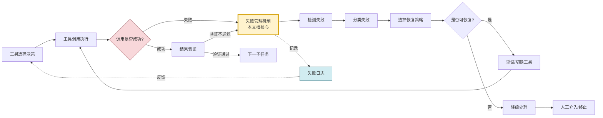

### 1.2 为什么失败管理至关重要

| 维度 | 无失败管理的后果 | 有失败管理的收益 |
|-----|----------------|----------------|
| **任务连续性** | 单点失败导致整个任务链中断 | 自动恢复,任务持续推进 |
| **用户体验** | 用户频繁收到错误提示 | 静默恢复或优雅降级 |
| **系统稳定性** | 网络抖动、服务波动导致大面积失败 | 容错吸收,稳定性大幅提升 |
| **成本控制** | 无差别重试导致成本浪费 | 智能重试,精准降级,成本可控 |
| **可观测性** | 失败原因不透明,难以排查 | 完整记录,可追溯可分析 |
| **持续进化** | 同样的错误反复发生 | 基于历史数据持续优化 |

### 1.3 失败管理在 Agent 架构中的位置

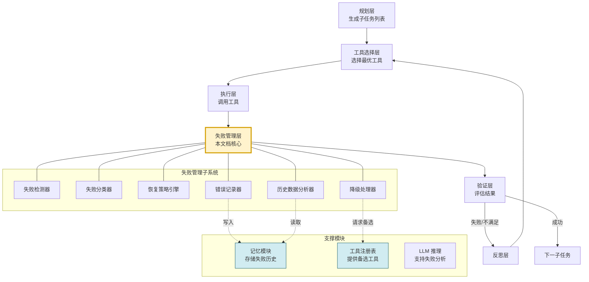

### 1.4 失败管理的核心目标

1. **快速检测**:在第一时间发现工具调用异常,避免无效等待。
2. **精准分类**:区分临时性故障与永久性故障,选择正确的恢复策略。
3. **智能恢复**:对可恢复的失败自动重试或切换工具,最小化人工干预。
4. **优雅降级**:对不可恢复的失败安全降级,避免任务完全中断。
5. **完整记录**:记录每一次失败的完整上下文,支撑后续分析与优化。
6. **持续学习**:从历史失败中学习,优化未来的工具选择与调用策略。

### 1.5 失败管理的核心原则

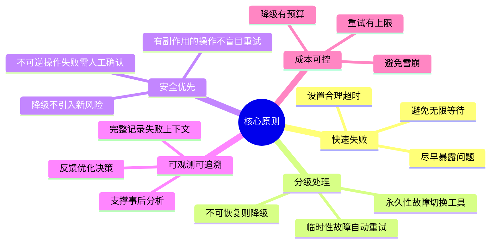

---

## 二、失败检测方法

### 2.1 失败检测方法全景

工具调用的失败可能在三个阶段发生:**调用前**(参数/权限问题)、**调用中**(超时/网络中断)、**调用后**(返回结果异常)。失败检测需要覆盖全生命周期。

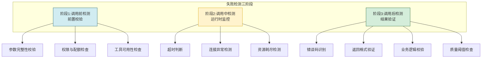

### 2.2 超时判断

#### 2.2.1 超时检测原理

超时是最常见的工具调用失败类型。合理的超时设置需要平衡**等待容忍度**与**任务时效性**。

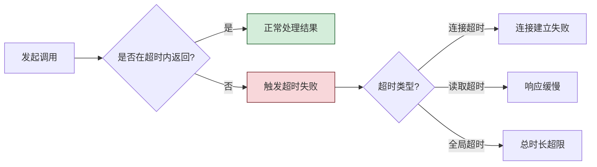

#### 2.2.2 多级超时设计

```python
import time
from dataclasses import dataclass
from typing import Optional, Any


@dataclass
class TimeoutConfig:
    """多级超时配置"""
    connect_timeout_ms: int = 3000      # 连接建立超时
    read_timeout_ms: int = 15000        # 单次读取超时
    total_timeout_ms: int = 30000       # 全局总超时
    retry_total_timeout_ms: int = 120000  # 含重试的总超时


class TimeoutDetector:
    """超时检测器"""

    def __init__(self, config: TimeoutConfig):
        self.config = config

    def execute_with_timeout(self, tool, params: dict) -> dict:
        """带多级超时的工具执行"""
        start_time = time.time()

        # 阶段1:连接超时检测
        try:
            connection = self._connect_with_timeout(
                tool, self.config.connect_timeout_ms
            )
        except TimeoutError:
            return self._build_timeout_result(
                "connect_timeout",
                f"连接工具 {tool.name} 超时({self.config.connect_timeout_ms}ms)",
                elapsed_ms=int((time.time() - start_time) * 1000)
            )

        # 阶段2:读取超时检测(单次读取)
        try:
            raw_result = self._read_with_timeout(
                connection, self.config.read_timeout_ms
            )
        except TimeoutError:
            return self._build_timeout_result(
                "read_timeout",
                f"读取工具 {tool.name} 响应超时({self.config.read_timeout_ms}ms)",
                elapsed_ms=int((time.time() - start_time) * 1000)
            )

        # 阶段3:全局超时检测
        elapsed_ms = int((time.time() - start_time) * 1000)
        if elapsed_ms > self.config.total_timeout_ms:
            return self._build_timeout_result(
                "total_timeout",
                f"工具 {tool.name} 全局超时(已耗时{elapsed_ms}ms)",
                elapsed_ms=elapsed_ms
            )

        return {"success": True, "result": raw_result, "elapsed_ms": elapsed_ms}

    def _connect_with_timeout(self, tool, timeout_ms: int):
        """带连接超时的连接建立"""
        # 实际实现使用异步或线程池控制超时
        deadline = time.time() + timeout_ms / 1000
        connection = tool.connect()
        while time.time() < deadline:
            if connection.is_ready():
                return connection
            time.sleep(0.05)
        raise TimeoutError("连接超时")

    def _read_with_timeout(self, connection, timeout_ms: int):
        """带读取超时的数据读取"""
        deadline = time.time() + timeout_ms / 1000
        while time.time() < deadline:
            if connection.has_data():
                return connection.read()
            time.sleep(0.05)
        raise TimeoutError("读取超时")

    def _build_timeout_result(self, timeout_type: str,
                               message: str, elapsed_ms: int) -> dict:
        return {
            "success": False,
            "error_type": "timeout",
            "timeout_type": timeout_type,
            "message": message,
            "elapsed_ms": elapsed_ms
        }
```

#### 2.2.3 超时配置策略

| 工具类型 | 连接超时 | 读取超时 | 全局超时 | 说明 |
|---------|:-------:|:-------:|:-------:|------|
| 本地文件操作 | 500ms | 2s | 5s | 本地操作应快速完成 |
| 本地代码执行 | 1s | 10s | 30s | 视代码复杂度而定 |
| 远程 API 调用 | 3s | 15s | 30s | 网络延迟需预留余量 |
| 大模型推理 | 5s | 60s | 120s | 推理耗时长 |
| 数据库查询 | 2s | 10s | 30s | 视查询复杂度而定 |
| 批量数据处理 | 5s | 120s | 300s | 批量任务耗时长 |

### 2.3 错误码识别

#### 2.3.1 错误码识别流程

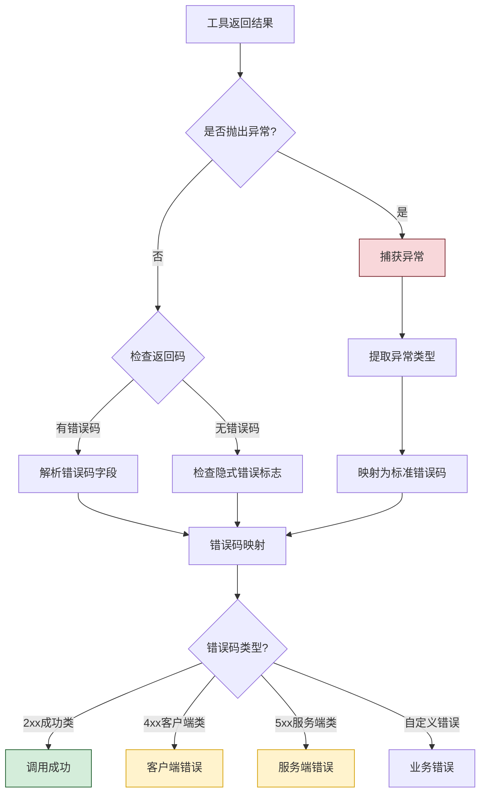

#### 2.3.2 错误码识别实现

```python
from enum import Enum
from dataclasses import dataclass


class StandardErrorCode(Enum):
    """标准错误码枚举"""
    # 成功类
    SUCCESS = "SUCCESS_0000"

    # 客户端错误类(4xx)
    BAD_REQUEST = "CLIENT_4000"          # 参数错误
    UNAUTHORIZED = "CLIENT_4010"         # 未授权
    FORBIDDEN = "CLIENT_4030"            # 无权限
    NOT_FOUND = "CLIENT_4040"            # 资源不存在
    RATE_LIMITED = "CLIENT_4290"         # 限流
    PARAM_INVALID = "CLIENT_4220"        # 参数校验失败

    # 服务端错误类(5xx)
    INTERNAL_ERROR = "SERVER_5000"       # 内部错误
    UNAVAILABLE = "SERVER_5030"          # 服务不可用
    GATEWAY_TIMEOUT = "SERVER_5040"      # 网关超时

    # 网络错误类
    CONNECTION_ERROR = "NETWORK_0001"    # 连接失败
    DNS_ERROR = "NETWORK_0002"           # DNS解析失败
    SSL_ERROR = "NETWORK_0003"           # SSL证书错误

    # 工具内部错误类
    TOOL_EXECUTION_ERROR = "TOOL_0001"   # 工具执行异常
    TOOL_CONFIG_ERROR = "TOOL_0002"      # 工具配置错误
    TOOL_RESOURCE_ERROR = "TOOL_0003"    # 工具资源不足

    # 超时类
    TIMEOUT = "TIMEOUT_0001"             # 超时

    # 未知错误
    UNKNOWN = "UNKNOWN_9999"


@dataclass
class ErrorDetectionResult:
    """错误检测结果"""
    is_success: bool
    error_code: StandardErrorCode
    error_message: str
    raw_error: Any = None
    is_retryable: bool = False
    is_transient: bool = False


class ErrorCodeDetector:
    """错误码识别器"""

    # HTTP状态码到标准错误码的映射
    HTTP_CODE_MAP = {
        200: StandardErrorCode.SUCCESS,
        400: StandardErrorCode.BAD_REQUEST,
        401: StandardErrorCode.UNAUTHORIZED,
        403: StandardErrorCode.FORBIDDEN,
        404: StandardErrorCode.NOT_FOUND,
        422: StandardErrorCode.PARAM_INVALID,
        429: StandardErrorCode.RATE_LIMITED,
        500: StandardErrorCode.INTERNAL_ERROR,
        503: StandardErrorCode.UNAVAILABLE,
        504: StandardErrorCode.GATEWAY_TIMEOUT,
    }

    # 可重试的错误码(临时性故障)
    RETRYABLE_CODES = {
        StandardErrorCode.RATE_LIMITED,
        StandardErrorCode.UNAVAILABLE,
        StandardErrorCode.GATEWAY_TIMEOUT,
        StandardErrorCode.CONNECTION_ERROR,
        StandardErrorCode.TIMEOUT,
        StandardErrorCode.INTERNAL_ERROR,
    }

    # 临时性错误码(可能自行恢复)
    TRANSIENT_CODES = {
        StandardErrorCode.RATE_LIMITED,
        StandardErrorCode.UNAVAILABLE,
        StandardErrorCode.GATEWAY_TIMEOUT,
        StandardErrorCode.CONNECTION_ERROR,
        StandardErrorCode.TIMEOUT,
    }

    def detect(self, tool_result: Any, exception: Exception = None) -> ErrorDetectionResult:
        """识别工具调用的错误码"""
        # 情况1:抛出异常
        if exception is not None:
            return self._detect_from_exception(exception)

        # 情况2:返回结果中包含错误码
        if isinstance(tool_result, dict):
            return self._detect_from_dict(tool_result)

        # 情况3:返回结果为None或空
        if tool_result is None:
            return ErrorDetectionResult(
                is_success=False,
                error_code=StandardErrorCode.TOOL_EXECUTION_ERROR,
                error_message="工具返回空结果",
                is_retryable=False,
                is_transient=False
            )

        # 情况4:成功
        return ErrorDetectionResult(
            is_success=True,
            error_code=StandardErrorCode.SUCCESS,
            error_message="调用成功",
            is_retryable=False,
            is_transient=False
        )

    def _detect_from_exception(self, exc: Exception) -> ErrorDetectionResult:
        """从异常中识别错误码"""
        exc_map = {
            "ConnectionError": (StandardErrorCode.CONNECTION_ERROR, True, True),
            "TimeoutError": (StandardErrorCode.TIMEOUT, True, True),
            "PermissionError": (StandardErrorCode.FORBIDDEN, False, False),
            "FileNotFoundError": (StandardErrorCode.NOT_FOUND, False, False),
            "ValueError": (StandardErrorCode.PARAM_INVALID, False, False),
            "KeyError": (StandardErrorCode.PARAM_INVALID, False, False),
            "ssl.SSLError": (StandardErrorCode.SSL_ERROR, False, False),
            "socket.gaierror": (StandardErrorCode.DNS_ERROR, True, True),
        }

        exc_type_name = type(exc).__name__
        for pattern, (code, retryable, transient) in exc_map.items():
            if pattern in exc_type_name or pattern in str(type(exc)):
                return ErrorDetectionResult(
                    is_success=False,
                    error_code=code,
                    error_message=str(exc),
                    raw_error=exc,
                    is_retryable=retryable,
                    is_transient=transient
                )

        return ErrorDetectionResult(
            is_success=False,
            error_code=StandardErrorCode.UNKNOWN,
            error_message=f"未知异常: {exc_type_name}: {str(exc)}",
            raw_error=exc,
            is_retryable=False,
            is_transient=False
        )

    def _detect_from_dict(self, result: dict) -> ErrorDetectionResult:
        """从字典结果中识别错误码"""
        # 检查标准返回格式: {"success": bool, "error_code": str, ...}
        if "success" in result:
            if result["success"]:
                return ErrorDetectionResult(
                    is_success=True,
                    error_code=StandardErrorCode.SUCCESS,
                    error_message="调用成功"
                )
            raw_code = result.get("error_code", "UNKNOWN_9999")
            code = self._parse_error_code(raw_code)
            return ErrorDetectionResult(
                is_success=False,
                error_code=code,
                error_message=result.get("error_message", "未知错误"),
                is_retryable=code in self.RETRYABLE_CODES,
                is_transient=code in self.TRANSIENT_CODES
            )

        # 检查HTTP风格返回: {"status_code": int, "body": ...}
        if "status_code" in result:
            status = result["status_code"]
            code = self.HTTP_CODE_MAP.get(status, StandardErrorCode.UNKNOWN)
            return ErrorDetectionResult(
                is_success=200 <= status < 300,
                error_code=code,
                error_message=result.get("error", f"HTTP {status}"),
                is_retryable=code in self.RETRYABLE_CODES,
                is_transient=code in self.TRANSIENT_CODES
            )

        # 无错误标志,视为成功
        return ErrorDetectionResult(
            is_success=True,
            error_code=StandardErrorCode.SUCCESS,
            error_message="调用成功"
        )

    def _parse_error_code(self, raw_code: str) -> StandardErrorCode:
        """解析原始错误码为标准错误码"""
        try:
            return StandardErrorCode(raw_code)
        except ValueError:
            return StandardErrorCode.UNKNOWN
```

### 2.4 返回结果验证

#### 2.4.1 结果验证的三个层次

即使工具调用没有抛出异常、返回了成功码,结果本身仍可能存在问题。结果验证是失败检测的**最后一道防线**。

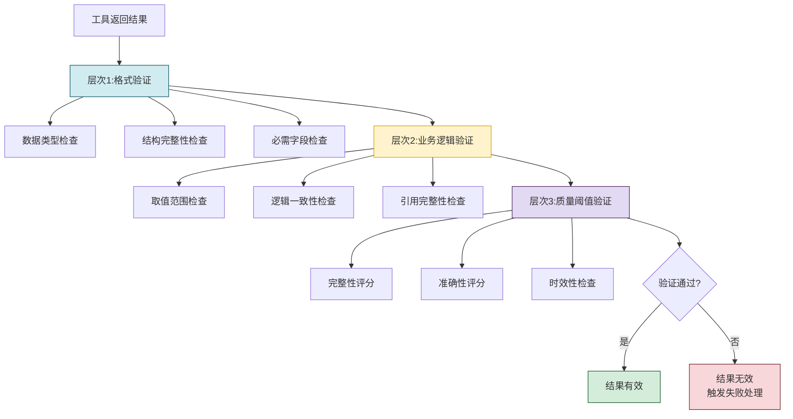

#### 2.4.2 结果验证实现

```python
from typing import Any, Optional
from dataclasses import dataclass, field


@dataclass
class ValidationRule:
    """验证规则定义"""
    rule_type: str           # required_field | type_check | range_check | regex | custom
    field_path: str          # 字段路径(支持 a.b.c 嵌套)
    expected: Any = None     # 期望值/类型/范围
    error_message: str = ""  # 验证失败的错误信息


@dataclass
class ValidationResult:
    """验证结果"""
    is_valid: bool
    score: float = 1.0                    # 质量评分(0-1)
    errors: list[str] = field(default_factory=list)
    warnings: list[str] = field(default_factory=list)


class ResultValidator:
    """返回结果验证器"""

    def __init__(self, validation_rules: list[ValidationRule] = None,
                 quality_threshold: float = 0.7):
        self.rules = validation_rules or []
        self.quality_threshold = quality_threshold

    def validate(self, result: Any, expected_schema: dict = None) -> ValidationResult:
        """验证返回结果"""
        errors = []
        warnings = []
        checks_passed = 0
        checks_total = 0

        # 层次1:格式验证
        if expected_schema:
            format_result = self._validate_format(result, expected_schema)
            errors.extend(format_result.errors)
            checks_total += format_result.checks_total
            checks_passed += format_result.checks_passed

        # 层次2:规则验证
        for rule in self.rules:
            checks_total += 1
            if self._apply_rule(result, rule):
                checks_passed += 1
            else:
                errors.append(rule.error_message or
                              f"规则验证失败: {rule.field_path}")

        # 层次3:空值检查
        checks_total += 1
        if self._is_empty_result(result):
            errors.append("返回结果为空")
        else:
            checks_passed += 1

        # 计算质量评分
        score = checks_passed / checks_total if checks_total > 0 else 0.0

        is_valid = len(errors) == 0 and score >= self.quality_threshold

        return ValidationResult(
            is_valid=is_valid,
            score=round(score, 4),
            errors=errors,
            warnings=warnings
        )

    def _validate_format(self, result: Any, schema: dict) -> 'FormatCheckResult':
        """格式验证"""
        errors = []
        checks_passed = 0
        checks_total = 0

        for field_name, field_spec in schema.items():
            checks_total += 1
            expected_type = field_spec.get("type")
            is_required = field_spec.get("required", True)

            # 检查字段是否存在
            if isinstance(result, dict):
                value = result.get(field_name)
            else:
                value = getattr(result, field_name, None)

            if value is None:
                if is_required:
                    errors.append(f"缺少必需字段: {field_name}")
                else:
                    checks_passed += 1
                continue

            # 检查类型
            if expected_type and not isinstance(value, expected_type):
                errors.append(
                    f"字段 {field_name} 类型错误: 期望 {expected_type}, "
                    f"实际 {type(value)}"
                )
            else:
                checks_passed += 1

        return FormatCheckResult(
            errors=errors,
            checks_passed=checks_passed,
            checks_total=checks_total
        )

    def _apply_rule(self, result: Any, rule: ValidationRule) -> bool:
        """应用单条验证规则"""
        value = self._extract_value(result, rule.field_path)
        if value is None:
            return False

        if rule.rule_type == "required_field":
            return value is not None
        elif rule.rule_type == "type_check":
            return isinstance(value, rule.expected)
        elif rule.rule_type == "range_check":
            min_val, max_val = rule.expected
            return min_val <= value <= max_val
        elif rule.rule_type == "regex":
            import re
            return bool(re.match(rule.expected, str(value)))
        return True

    def _extract_value(self, result: Any, path: str) -> Any:
        """从嵌套结构中提取值(支持 a.b.c 路径)"""
        current = result
        for key in path.split("."):
            if isinstance(current, dict):
                current = current.get(key)
            else:
                current = getattr(current, key, None)
            if current is None:
                return None
        return current

    def _is_empty_result(self, result: Any) -> bool:
        """检查结果是否为空"""
        if result is None:
            return True
        if isinstance(result, (str, list, dict)) and len(result) == 0:
            return True
        return False


@dataclass
class FormatCheckResult:
    """格式检查结果"""
    errors: list[str]
    checks_passed: int
    checks_total: int
```

### 2.5 失败检测方法汇总

| 检测方法 | 检测阶段 | 检测内容 | 适用场景 |
|---------|:-------:|---------|---------|
| **参数校验** | 调用前 | 参数完整性、类型、范围 | 所有工具调用 |
| **权限检查** | 调用前 | 调用权限、配额余量 | 受控工具调用 |
| **可用性检查** | 调用前 | 工具健康状态 | 远程工具调用 |
| **连接超时** | 调用中 | 连接建立时间 | 网络工具调用 |
| **读取超时** | 调用中 | 响应读取时间 | 所有工具调用 |
| **全局超时** | 调用中 | 总执行时长 | 所有工具调用 |
| **异常捕获** | 调用中 | 运行时异常 | 所有工具调用 |
| **错误码识别** | 调用后 | 返回的错误码 | 有标准返回格式的工具 |
| **格式验证** | 调用后 | 结果结构完整性 | 结构化输出工具 |
| **业务逻辑验证** | 调用后 | 结果逻辑合理性 | 业务工具调用 |
| **质量阈值检查** | 调用后 | 结果质量评分 | LLM相关工具 |

---

## 三、失败分类体系

### 3.1 失败分类架构

精准的失败分类是选择正确恢复策略的前提。不同类型的失败需要截然不同的处理方式——对永久性故障盲目重试只会浪费资源。

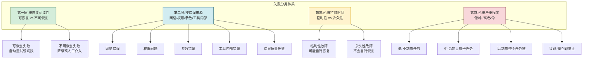

### 3.2 按错误来源分类

#### 3.2.1 五大错误类别详解

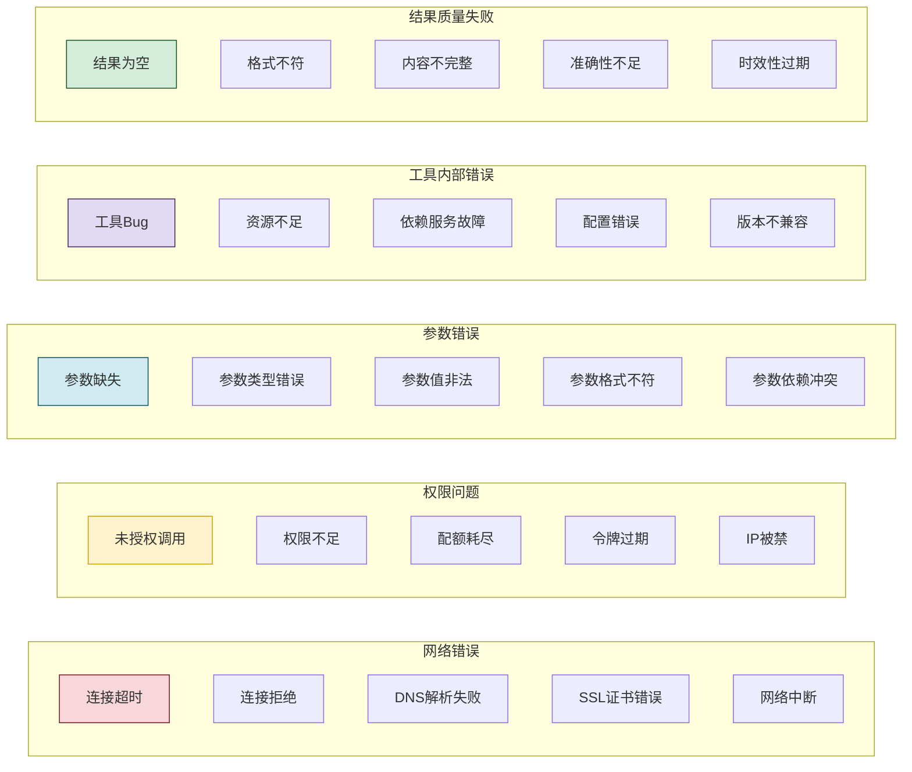

#### 3.2.2 失败分类实现

```python
from enum import Enum
from dataclasses import dataclass
from typing import Optional


class FailureCategory(Enum):
    """失败大类"""
    NETWORK_ERROR = "network_error"         # 网络错误
    PERMISSION_ERROR = "permission_error"   # 权限问题
    PARAMETER_ERROR = "parameter_error"     # 参数错误
    TOOL_INTERNAL_ERROR = "tool_internal"   # 工具内部错误
    QUALITY_FAILURE = "quality_failure"     # 结果质量失败
    UNKNOWN_FAILURE = "unknown_failure"     # 未知失败


class FailureSubType(Enum):
    """失败子类型"""
    # 网络错误子类型
    CONNECTION_TIMEOUT = "connection_timeout"
    CONNECTION_REFUSED = "connection_refused"
    DNS_FAILURE = "dns_failure"
    SSL_ERROR = "ssl_error"
    NETWORK_INTERRUPTED = "network_interrupted"

    # 权限问题子类型
    UNAUTHORIZED = "unauthorized"
    FORBIDDEN = "forbidden"
    QUOTA_EXCEEDED = "quota_exceeded"
    TOKEN_EXPIRED = "token_expired"
    IP_BLOCKED = "ip_blocked"

    # 参数错误子类型
    MISSING_PARAM = "missing_param"
    TYPE_ERROR = "type_error"
    INVALID_VALUE = "invalid_value"
    FORMAT_MISMATCH = "format_mismatch"
    PARAM_CONFLICT = "param_conflict"

    # 工具内部错误子类型
    TOOL_BUG = "tool_bug"
    RESOURCE_EXHAUSTED = "resource_exhausted"
    DEPENDENCY_FAILURE = "dependency_failure"
    CONFIG_ERROR = "config_error"
    VERSION_INCOMPATIBLE = "version_incompatible"

    # 结果质量失败子类型
    EMPTY_RESULT = "empty_result"
    FORMAT_VIOLATION = "format_violation"
    INCOMPLETE_CONTENT = "incomplete_content"
    LOW_ACCURACY = "low_accuracy"
    OUTDATED_CONTENT = "outdated_content"


class Recoverability(Enum):
    """可恢复性"""
    FULLY_RECOVERABLE = "fully_recoverable"    # 完全可恢复(重试即可)
    CONDITIONALLY_RECOVERABLE = "conditional"   # 有条件可恢复(需调整后重试)
    NOT_RECOVERABLE = "not_recoverable"          # 不可恢复(需降级或人工)


class Persistence(Enum):
    """持续性"""
    TRANSIENT = "transient"     # 临时性(可能自行恢复)
    INTERMITTENT = "intermittent"  # 间歇性(时好时坏)
    PERMANENT = "permanent"     # 永久性(不会自行恢复)


class Severity(Enum):
    """严重程度"""
    LOW = 1       # 不影响任务
    MEDIUM = 2    # 影响当前子任务
    HIGH = 3      # 影响整个任务链
    CRITICAL = 4  # 需立即停止


@dataclass
class FailureClassification:
    """失败分类结果"""
    category: FailureCategory
    sub_type: FailureSubType
    recoverability: Recoverability
    persistence: Persistence
    severity: Severity
    description: str
    recommended_action: str
    retry_count_limit: int = 3
    retry_delay_ms: int = 1000


class FailureClassifier:
    """失败分类器"""

    # 分类规则映射表
    CLASSIFICATION_RULES = {
        # 网络错误类
        StandardErrorCode.CONNECTION_ERROR: FailureClassification(
            category=FailureCategory.NETWORK_ERROR,
            sub_type=FailureSubType.CONNECTION_REFUSED,
            recoverability=Recoverability.FULLY_RECOVERABLE,
            persistence=Persistence.TRANSIENT,
            severity=Severity.MEDIUM,
            description="网络连接失败",
            recommended_action="重试或切换网络环境",
            retry_count_limit=3,
            retry_delay_ms=2000
        ),
        StandardErrorCode.DNS_ERROR: FailureClassification(
            category=FailureCategory.NETWORK_ERROR,
            sub_type=FailureSubType.DNS_FAILURE,
            recoverability=Recoverability.NOT_RECOVERABLE,
            persistence=Persistence.PERMANENT,
            severity=Severity.HIGH,
            description="DNS解析失败,域名可能不存在或网络配置错误",
            recommended_action="检查域名或切换工具",
            retry_count_limit=1,
            retry_delay_ms=1000
        ),
        StandardErrorCode.TIMEOUT: FailureClassification(
            category=FailureCategory.NETWORK_ERROR,
            sub_type=FailureSubType.CONNECTION_TIMEOUT,
            recoverability=Recoverability.FULLY_RECOVERABLE,
            persistence=Persistence.TRANSIENT,
            severity=Severity.MEDIUM,
            description="请求超时",
            recommended_action="增加超时时间后重试或切换工具",
            retry_count_limit=3,
            retry_delay_ms=3000
        ),

        # 权限问题类
        StandardErrorCode.UNAUTHORIZED: FailureClassification(
            category=FailureCategory.PERMISSION_ERROR,
            sub_type=FailureSubType.UNAUTHORIZED,
            recoverability=Recoverability.NOT_RECOVERABLE,
            persistence=Persistence.PERMANENT,
            severity=Severity.HIGH,
            description="未授权访问",
            recommended_action="检查认证信息或切换有权限的工具",
            retry_count_limit=0,
            retry_delay_ms=0
        ),
        StandardErrorCode.FORBIDDEN: FailureClassification(
            category=FailureCategory.PERMISSION_ERROR,
            sub_type=FailureSubType.FORBIDDEN,
            recoverability=Recoverability.NOT_RECOVERABLE,
            persistence=Persistence.PERMANENT,
            severity=Severity.HIGH,
            description="权限不足",
            recommended_action="申请权限或切换工具",
            retry_count_limit=0,
            retry_delay_ms=0
        ),
        StandardErrorCode.RATE_LIMITED: FailureClassification(
            category=FailureCategory.PERMISSION_ERROR,
            sub_type=FailureSubType.QUOTA_EXCEEDED,
            recoverability=Recoverability.CONDITIONALLY_RECOVERABLE,
            persistence=Persistence.TRANSIENT,
            severity=Severity.MEDIUM,
            description="调用频率超限",
            recommended_action="等待后重试或切换备选工具",
            retry_count_limit=5,
            retry_delay_ms=5000
        ),

        # 参数错误类
        StandardErrorCode.PARAM_INVALID: FailureClassification(
            category=FailureCategory.PARAMETER_ERROR,
            sub_type=FailureSubType.INVALID_VALUE,
            recoverability=Recoverability.CONDITIONALLY_RECOVERABLE,
            persistence=Persistence.PERMANENT,
            severity=Severity.MEDIUM,
            description="参数校验失败",
            recommended_action="修正参数后重试",
            retry_count_limit=2,
            retry_delay_ms=500
        ),
        StandardErrorCode.BAD_REQUEST: FailureClassification(
            category=FailureCategory.PARAMETER_ERROR,
            sub_type=FailureSubType.FORMAT_MISMATCH,
            recoverability=Recoverability.CONDITIONALLY_RECOVERABLE,
            persistence=Persistence.PERMANENT,
            severity=Severity.MEDIUM,
            description="请求格式错误",
            recommended_action="检查参数格式后重试",
            retry_count_limit=2,
            retry_delay_ms=500
        ),

        # 工具内部错误类
        StandardErrorCode.INTERNAL_ERROR: FailureClassification(
            category=FailureCategory.TOOL_INTERNAL_ERROR,
            sub_type=FailureSubType.TOOL_BUG,
            recoverability=Recoverability.FULLY_RECOVERABLE,
            persistence=Persistence.TRANSIENT,
            severity=Severity.MEDIUM,
            description="工具内部错误",
            recommended_action="重试或切换备选工具",
            retry_count_limit=2,
            retry_delay_ms=2000
        ),
        StandardErrorCode.UNAVAILABLE: FailureClassification(
            category=FailureCategory.TOOL_INTERNAL_ERROR,
            sub_type=FailureSubType.DEPENDENCY_FAILURE,
            recoverability=Recoverability.FULLY_RECOVERABLE,
            persistence=Persistence.TRANSIENT,
            severity=Severity.HIGH,
            description="服务不可用",
            recommended_action="等待恢复后重试或切换工具",
            retry_count_limit=3,
            retry_delay_ms=5000
        ),
        StandardErrorCode.TOOL_RESOURCE_ERROR: FailureClassification(
            category=FailureCategory.TOOL_INTERNAL_ERROR,
            sub_type=FailureSubType.RESOURCE_EXHAUSTED,
            recoverability=Recoverability.CONDITIONALLY_RECOVERABLE,
            persistence=Persistence.INTERMITTENT,
            severity=Severity.MEDIUM,
            description="工具资源不足",
            recommended_action="等待资源释放后重试或切换工具",
            retry_count_limit=3,
            retry_delay_ms=3000
        ),

        # 超时类
        StandardErrorCode.GATEWAY_TIMEOUT: FailureClassification(
            category=FailureCategory.NETWORK_ERROR,
            sub_type=FailureSubType.CONNECTION_TIMEOUT,
            recoverability=Recoverability.FULLY_RECOVERABLE,
            persistence=Persistence.TRANSIENT,
            severity=Severity.MEDIUM,
            description="网关超时",
            recommended_action="重试或切换工具",
            retry_count_limit=3,
            retry_delay_ms=3000
        ),
    }

    DEFAULT_CLASSIFICATION = FailureClassification(
        category=FailureCategory.UNKNOWN_FAILURE,
        sub_type=FailureSubType.CONNECTION_TIMEOUT,  # 占位
        recoverability=Recoverability.NOT_RECOVERABLE,
        persistence=Persistence.PERMANENT,
        severity=Severity.HIGH,
        description="未知失败类型",
        recommended_action="人工分析处理",
        retry_count_limit=0,
        retry_delay_ms=0
    )

    def classify(self, error_code: StandardErrorCode,
                 error_message: str = "") -> FailureClassification:
        """对失败进行分类"""
        classification = self.CLASSIFICATION_RULES.get(
            error_code, self.DEFAULT_CLASSIFICATION
        )
        if error_message:
            classification.description = f"{classification.description}: {error_message}"
        return classification
```

### 3.3 失败分类决策矩阵

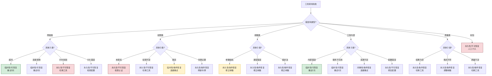

### 3.4 失败分类汇总表

| 失败大类 | 子类型 | 持续性 | 可恢复性 | 严重度 | 推荐处理 | 重试上限 |
|---------|-------|:------:|:-------:|:------:|---------|:-------:|
| **网络错误** | 超时 | 临时 | 可恢复 | 中 | 退避重试 | 3 |
| **网络错误** | 连接拒绝 | 临时 | 可恢复 | 中 | 退避重试 | 3 |
| **网络错误** | DNS失败 | 永久 | 不可恢复 | 高 | 切换工具 | 0 |
| **网络错误** | SSL错误 | 永久 | 不可恢复 | 高 | 检查配置 | 0 |
| **权限问题** | 未授权 | 永久 | 不可恢复 | 高 | 检查认证 | 0 |
| **权限问题** | 权限不足 | 永久 | 不可恢复 | 高 | 切换工具 | 0 |
| **权限问题** | 限流 | 临时 | 条件恢复 | 中 | 退避重试 | 5 |
| **权限问题** | 令牌过期 | 永久 | 条件恢复 | 中 | 刷新令牌 | 1 |
| **参数错误** | 参数缺失 | 永久 | 条件恢复 | 中 | 修正参数 | 2 |
| **参数错误** | 类型错误 | 永久 | 条件恢复 | 中 | 修正参数 | 2 |
| **参数错误** | 值非法 | 永久 | 条件恢复 | 中 | 修正参数 | 2 |
| **工具内部** | 内部错误 | 临时 | 可恢复 | 中 | 重试 | 2 |
| **工具内部** | 服务不可用 | 临时 | 可恢复 | 高 | 退避重试 | 3 |
| **工具内部** | 资源不足 | 间歇 | 条件恢复 | 中 | 退避重试 | 3 |
| **工具内部** | 配置错误 | 永久 | 不可恢复 | 高 | 修复配置 | 0 |
| **质量失败** | 结果为空 | 永久 | 条件恢复 | 中 | 切换工具 | 1 |
| **质量失败** | 格式不符 | 永久 | 条件恢复 | 中 | 调整参数 | 2 |
| **质量失败** | 质量不足 | 永久 | 条件恢复 | 中 | 切换工具 | 1 |

---

## 四、重试策略设计

### 4.1 重试策略全景

重试是处理临时性故障的首选手段。但**无脑重试**不仅无法解决问题,还会加剧服务压力、浪费成本。好的重试策略需要回答四个核心问题:**何时重试**、**重试几次**、**间隔多久**、**如何退避**。

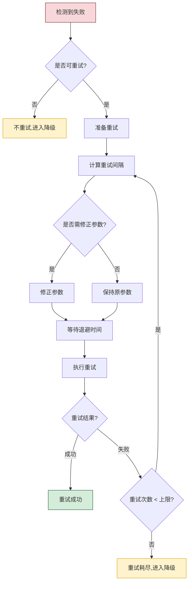

### 4.2 重试条件判断

#### 4.2.1 可重试性判断矩阵

```python
class RetryabilityChecker:
    """可重试性判断器"""

    def __init__(self, classifier: FailureClassifier):
        self.classifier = classifier

    def should_retry(self, failure: FailureClassification,
                     attempt_count: int,
                     has_side_effect: bool = False) -> tuple[bool, str]:
        """判断是否应该重试"""
        # 规则1:不可恢复的失败不重试
        if failure.recoverability == Recoverability.NOT_RECOVERABLE:
            return False, f"失败不可恢复({failure.category.value}),不重试"

        # 规则2:超过重试次数上限不重试
        if attempt_count >= failure.retry_count_limit:
            return False, f"已达重试上限({failure.retry_count_limit}次)"

        # 规则3:有副作用的操作谨慎重试
        if has_side_effect:
            if failure.persistence == Persistence.PERMANENT:
                return False, "永久性故障且有副作用,不重试"
            # 临时性故障且有副作用,需要确认操作幂等性
            if not self._is_idempotent(failure):
                return False, "操作非幂等且有副作用,不重试"

        # 规则4:致命错误不重试
        if failure.severity == Severity.CRITICAL:
            return False, "致命错误,不重试,需人工介入"

        return True, "满足重试条件"

    def _is_idempotent(self, failure: FailureClassification) -> bool:
        """判断操作是否幂等(重试安全)"""
        # 超时类失败通常幂等(请求可能未到达服务端)
        if failure.sub_type in [
            FailureSubType.CONNECTION_TIMEOUT,
            FailureSubType.NETWORK_INTERRUPTED,
        ]:
            return True
        # 限流类失败幂等
        if failure.sub_type == FailureSubType.QUOTA_EXCEEDED:
            return True
        # 其他情况默认不幂等
        return False
```

#### 4.2.2 重试条件汇总

| 条件 | 可重试 | 说明 |
|-----|:------:|------|
| 临时性故障 + 幂等操作 | ✅ | 安全重试 |
| 临时性故障 + 非幂等操作 | ⚠️ | 需确认后重试 |
| 永久性故障 | ❌ | 重试无意义 |
| 超过重试上限 | ❌ | 避免无限重试 |
| 有副作用 + 永久故障 | ❌ | 可能造成重复副作用 |
| 致命错误 | ❌ | 需立即停止 |
| 限流类故障 | ✅ | 退避后重试 |

### 4.3 退避算法

#### 4.3.1 退避算法对比

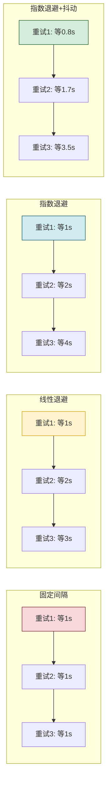

#### 4.3.2 退避算法实现

```python
import random
import time
from abc import ABC, abstractmethod


class BackoffStrategy(ABC):
    """退避策略抽象基类"""

    @abstractmethod
    def get_delay(self, attempt: int) -> float:
        """计算第 attempt 次重试的延迟时间(秒)"""
        pass

    @abstractmethod
    def get_strategy_name(self) -> str:
        """策略名称"""
        pass


class FixedBackoff(BackoffStrategy):
    """固定间隔退避"""

    def __init__(self, delay_seconds: float = 1.0):
        self.delay = delay_seconds

    def get_delay(self, attempt: int) -> float:
        return self.delay

    def get_strategy_name(self) -> str:
        return "fixed"


class LinearBackoff(BackoffStrategy):
    """线性退避:delay = base * attempt"""

    def __init__(self, base_delay: float = 1.0, max_delay: float = 60.0):
        self.base_delay = base_delay
        self.max_delay = max_delay

    def get_delay(self, attempt: int) -> float:
        return min(self.base_delay * attempt, self.max_delay)

    def get_strategy_name(self) -> str:
        return "linear"


class ExponentialBackoff(BackoffStrategy):
    """指数退避:delay = base * 2^(attempt-1)"""

    def __init__(self, base_delay: float = 1.0, max_delay: float = 60.0):
        self.base_delay = base_delay
        self.max_delay = max_delay

    def get_delay(self, attempt: int) -> float:
        delay = self.base_delay * (2 ** (attempt - 1))
        return min(delay, self.max_delay)

    def get_strategy_name(self) -> str:
        return "exponential"


class ExponentialBackoffWithJitter(BackoffStrategy):
    """指数退避 + 抖动(推荐)

    抖动避免多个客户端同步重试导致的"惊群效应"
    delay = random(0, base * 2^(attempt-1))
    """

    def __init__(self, base_delay: float = 1.0, max_delay: float = 60.0):
        self.base_delay = base_delay
        self.max_delay = max_delay

    def get_delay(self, attempt: int) -> float:
        ceiling = min(self.base_delay * (2 ** (attempt - 1)), self.max_delay)
        return random.uniform(0, ceiling)

    def get_strategy_name(self) -> str:
        return "exponential_jitter"


class DecorrelatedJitterBackoff(BackoffStrategy):
    """去相关抖动退避(高级)

    delay = min(max_delay, random(base, last_delay * 3))
    适合高并发场景,有效分散重试压力
    """

    def __init__(self, base_delay: float = 1.0, max_delay: float = 60.0):
        self.base_delay = base_delay
        self.max_delay = max_delay
        self.last_delay = base_delay

    def get_delay(self, attempt: int) -> float:
        delay = random.uniform(self.base_delay, self.last_delay * 3)
        delay = min(delay, self.max_delay)
        self.last_delay = delay
        return delay

    def get_strategy_name(self) -> str:
        return "decorrelated_jitter"
```

#### 4.3.3 退避算法选择指南

| 算法 | 适用场景 | 优点 | 缺点 |
|-----|---------|------|------|
| **固定间隔** | 简单场景,低并发 | 实现简单 | 可能加剧拥塞 |
| **线性退避** | 中等并发 | 压力逐步释放 | 退避不够明显 |
| **指数退避** | 一般场景 | 快速退避,有效减压 | 多客户端同步重试 |
| **指数+抖动** ⭐ | 高并发,分布式 | 分散重试,避免惊群 | 延迟不可预测 |
| **去相关抖动** | 超高并发 | 最优分散效果 | 实现复杂 |

### 4.4 重试执行器

```python
from dataclasses import dataclass, field
from typing import Callable, Any, Optional


@dataclass
class RetryConfig:
    """重试配置"""
    max_attempts: int = 3                    # 最大重试次数
    backoff_strategy: BackoffStrategy = None  # 退避策略
    retry_on: set = None                      # 仅对这些错误码重试
    skip_retry_on: set = None                 # 跳过这些错误码
    timeout_per_retry_ms: int = 30000         # 每次重试的超时
    total_timeout_ms: int = 120000            # 总超时(含所有重试)
    param_modifier: Callable = None           # 参数修正函数
    has_side_effect: bool = False             # 是否有副作用


@dataclass
class RetryResult:
    """重试结果"""
    success: bool
    final_result: Any = None
    attempts: int = 0
    total_delay_ms: int = 0
    failure_history: list = field(default_factory=list)
    last_error: Optional[str] = None


class RetryExecutor:
    """重试执行器"""

    def __init__(self, config: RetryConfig,
                 detector: ErrorCodeDetector,
                 classifier: FailureClassifier):
        self.config = config
        self.detector = detector
        self.classifier = classifier
        if config.backoff_strategy is None:
            self.backoff = ExponentialBackoffWithJitter()
        else:
            self.backoff = config.backoff_strategy

    def execute_with_retry(self, tool, params: dict,
                           has_side_effect: bool = None) -> RetryResult:
        """带重试的工具执行"""
        if has_side_effect is None:
            has_side_effect = self.config.has_side_effect
        result = RetryResult(success=False)
        start_time = time.time()
        current_params = params.copy()

        for attempt in range(1, self.config.max_attempts + 1):
            result.attempts = attempt

            # 检查总超时
            elapsed_ms = int((time.time() - start_time) * 1000)
            if elapsed_ms > self.config.total_timeout_ms:
                result.last_error = "总超时耗尽,停止重试"
                break

            # 执行工具调用
            try:
                raw_result = tool.execute(current_params)
                exception = None
            except Exception as e:
                raw_result = None
                exception = e

            # 检测错误
            detection = self.detector.detect(raw_result, exception)

            if detection.is_success:
                result.success = True
                result.final_result = raw_result
                break

            # 分类失败
            failure = self.classifier.classify(
                detection.error_code, detection.error_message
            )

            # 记录失败历史
            result.failure_history.append({
                "attempt": attempt,
                "error_code": detection.error_code.value,
                "failure_category": failure.category.value,
                "failure_sub_type": failure.sub_type.value,
                "error_message": detection.error_message,
                "elapsed_ms": elapsed_ms
            })
            result.last_error = detection.error_message

            # 判断是否应该重试
            checker = RetryabilityChecker(self.classifier)
            should_retry, reason = checker.should_retry(
                failure, attempt, has_side_effect
            )

            if not should_retry:
                result.last_error = f"{reason}: {detection.error_message}"
                break

            # 检查重试条件过滤
            if self.config.retry_on and detection.error_code not in self.config.retry_on:
                result.last_error = f"错误码不在重试列表中: {detection.error_code}"
                break
            if self.config.skip_retry_on and detection.error_code in self.config.skip_retry_on:
                result.last_error = f"错误码在跳过列表中: {detection.error_code}"
                break

            # 如果是最后一次,不再等待
            if attempt >= self.config.max_attempts:
                break

            # 计算退避时间
            delay = self.backoff.get_delay(attempt)
            delay_ms = int(delay * 1000)
            result.total_delay_ms += delay_ms

            # 参数修正(如刷新令牌)
            if self.config.param_modifier and failure.sub_type == FailureSubType.TOKEN_EXPIRED:
                current_params = self.config.param_modifier(current_params)

            # 等待退避
            time.sleep(delay)

        return result
```

### 4.5 重试策略配置模板

```python
# 不同场景的重试策略配置模板
RETRY_TEMPLATES = {
    # 模板1:只读API调用(安全重试)
    "read_only_api": RetryConfig(
        max_attempts=3,
        backoff_strategy=ExponentialBackoffWithJitter(base_delay=1.0, max_delay=30.0),
        timeout_per_retry_ms=15000,
        total_timeout_ms=60000,
        has_side_effect=False
    ),

    # 模板2:写操作API(谨慎重试)
    "write_api": RetryConfig(
        max_attempts=2,
        backoff_strategy=ExponentialBackoff(base_delay=2.0, max_delay=20.0),
        retry_on={StandardErrorCode.TIMEOUT, StandardErrorCode.CONNECTION_ERROR,
                  StandardErrorCode.UNAVAILABLE},
        timeout_per_retry_ms=20000,
        total_timeout_ms=90000,
        has_side_effect=True
    ),

    # 模板3:限流场景(长退避)
    "rate_limited": RetryConfig(
        max_attempts=5,
        backoff_strategy=ExponentialBackoffWithJitter(base_delay=5.0, max_delay=120.0),
        retry_on={StandardErrorCode.RATE_LIMITED},
        timeout_per_retry_ms=30000,
        total_timeout_ms=300000,
        has_side_effect=False
    ),

    # 模板4:本地工具(快速重试)
    "local_tool": RetryConfig(
        max_attempts=2,
        backoff_strategy=FixedBackoff(delay_seconds=0.5),
        timeout_per_retry_ms=5000,
        total_timeout_ms=15000,
        has_side_effect=False
    ),

    # 模板5:不可重试(一次性操作)
    "no_retry": RetryConfig(
        max_attempts=1,
        backoff_strategy=FixedBackoff(delay_seconds=0),
        timeout_per_retry_ms=30000,
        total_timeout_ms=30000,
        has_side_effect=True
    ),
}
```

---

## 五、降级处理方案

### 5.1 降级处理全景

当重试耗尽或失败不可恢复时,Agent 需要通过**降级处理**来保障任务尽可能继续推进。降级不是放弃,而是在**降低质量预期或功能范围**的前提下,寻找替代方案完成任务。

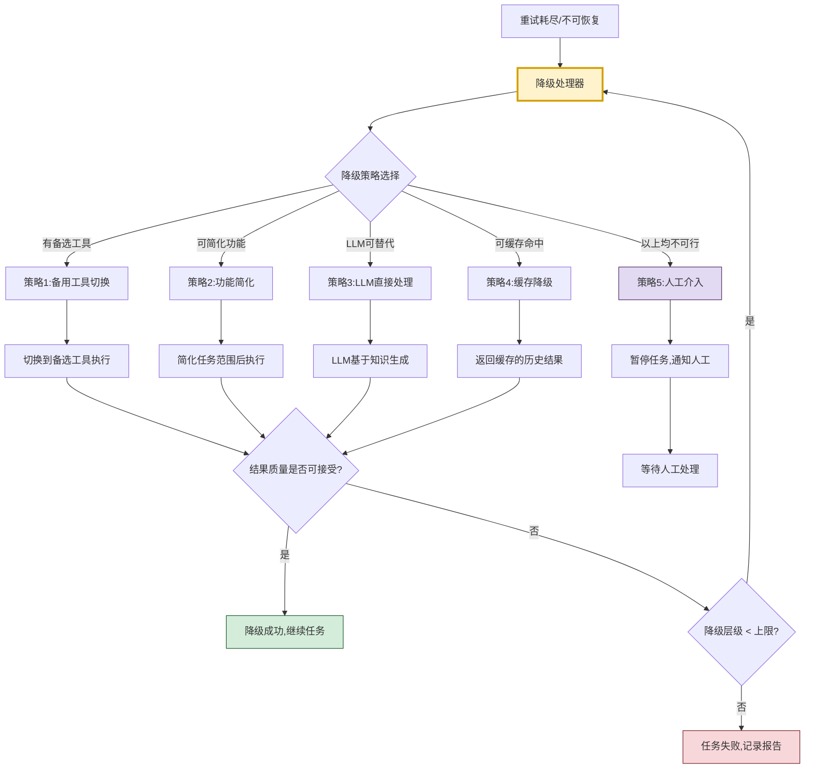

### 5.2 降级策略详解

#### 5.2.1 策略一:备用工具切换

当主工具失败时,优先尝试功能等价的备选工具。这要求在工具选择阶段就预先准备好备选链。

```python
@dataclass
class FallbackTool:
    """备选工具描述"""
    tool: Any                         # 备选工具实例
    capability_overlap: float         # 与主工具的能力重叠度(0-1)
    param_transformer: Callable = None # 参数转换函数
    quality_degradation: float = 0.0  # 质量下降预期(0-1)


class FallbackToolSwitcher:
    """备用工具切换器"""

    def __init__(self, fallback_chain: list[FallbackTool]):
        self.fallback_chain = sorted(
            fallback_chain,
            key=lambda f: f.capability_overlap,
            reverse=True
        )

    def try_fallbacks(self, original_params: dict,
                      original_failure: FailureClassification) -> dict:
        """依次尝试备选工具"""
        for i, fallback in enumerate(self.fallback_chain):
            try:
                # 参数转换
                params = original_params
                if fallback.param_transformer:
                    params = fallback.param_transformer(original_params)

                # 执行备选工具
                result = fallback.tool.execute(params)

                # 记录降级信息
                return {
                    "success": True,
                    "result": result,
                    "tool_used": fallback.tool.name,
                    "fallback_level": i + 1,
                    "quality_degradation": fallback.quality_degradation,
                    "original_failure": original_failure.description
                }
            except Exception as e:
                # 记录备选失败,继续尝试下一个
                continue

        return {
            "success": False,
            "reason": "所有备选工具均失败",
            "fallback_level": len(self.fallback_chain)
        }
```

#### 5.2.2 策略二:功能简化

当没有等价备选工具时,通过**降低任务要求**来适配现有工具的能力。

```python
class FunctionalitySimplifier:
    """功能简化器"""

    SIMPLIFICATION_STRATEGIES = {
        # 策略:减少返回字段
        "reduce_fields": {
            "description": "只返回核心字段,省略次要字段",
            "quality_impact": "low",
            "applicable": ["data_extraction", "api_query"]
        },
        # 策略:降低精度要求
        "reduce_precision": {
            "description": "降低数值精度或结果粒度",
            "quality_impact": "low",
            "applicable": ["computation", "statistics"]
        },
        # 策略:缩小范围
        "narrow_scope": {
            "description": "缩小查询范围或时间窗口",
            "quality_impact": "medium",
            "applicable": ["search", "retrieval"]
        },
        # 策略:分批处理
        "batch_processing": {
            "description": "将大任务拆分为小批次处理",
            "quality_impact": "low",
            "applicable": ["bulk_operation", "data_processing"]
        },
        # 策略:跳过非核心步骤
        "skip_optional": {
            "description": "跳过可选的增强步骤,只保留核心流程",
            "quality_impact": "medium",
            "applicable": ["multi_step_task"]
        },
    }

    def simplify(self, task_requirements: dict,
                 failure: FailureClassification) -> dict:
        """根据失败情况生成简化方案"""
        task_type = task_requirements.get("task_type", "general")
        simplifications = []

        for strategy_name, strategy in self.SIMPLIFICATION_STRATEGIES.items():
            if task_type in strategy["applicable"]:
                simplifications.append({
                    "strategy": strategy_name,
                    "description": strategy["description"],
                    "quality_impact": strategy["quality_impact"],
                    "modified_requirements": self._apply_simplification(
                        task_requirements, strategy_name
                    )
                })

        # 按质量影响排序(低影响优先)
        simplifications.sort(key=lambda s: {
            "low": 0, "medium": 1, "high": 2
        }[s["quality_impact"]])

        return {
            "available_simplifications": simplifications,
            "recommended": simplifications[0] if simplifications else None
        }

    def _apply_simplification(self, requirements: dict,
                               strategy: str) -> dict:
        """应用简化策略到需求"""
        modified = requirements.copy()
        if strategy == "reduce_fields":
            modified["required_fields"] = modified.get("core_fields", [])
            modified["optional_fields"] = []
        elif strategy == "reduce_precision":
            modified["precision_level"] = "low"
        elif strategy == "narrow_scope":
            modified["scope"] = "narrowed"
        elif strategy == "batch_processing":
            modified["batch_size"] = 10
        elif strategy == "skip_optional":
            modified["skip_enhancement"] = True
        return modified
```

#### 5.2.3 策略三:LLM 直接处理

当所有工具都不可用时,可以让 LLM 基于自身知识直接生成结果。这种方式需**明确标注不确定性**,因为 LLM 可能产生幻觉。

```python
class LLMFallbackHandler:
    """LLM 降级处理器"""

    def __init__(self, llm_client):
        self.llm = llm_client

    def fallback_to_llm(self, subtask, tool_failure: FailureClassification) -> dict:
        """降级为 LLM 直接处理"""
        prompt = f"""你是一个智能助手。原本应通过工具完成的任务因工具故障需要你直接处理。

【原始任务】{subtask.description}

【工具失败原因】{tool_failure.description}

【处理要求】
1. 基于你的知识尽可能完成任务
2. 由于未使用专业工具,请在结果中明确标注:
   - 哪些部分是基于你的知识推断的
   - 哪些信息可能不够准确或时效性不足
   - 建议用户后续通过专业工具验证的内容
3. 如果任务确实无法在没有工具的情况下完成,请诚实说明

【输出格式】
{{
    "result": "你的处理结果",
    "confidence": 0.0-1.0,
    "limitations": ["局限性说明列表"],
    "verification_needed": ["需要后续验证的内容"]
}}
"""
        result = self.llm.generate_json(prompt)

        return {
            "success": True,
            "result": result["result"],
            "fallback_method": "llm_direct",
            "confidence": result.get("confidence", 0.5),
            "limitations": result.get("limitations", []),
            "verification_needed": result.get("verification_needed", []),
            "original_failure": tool_failure.description
        }
```

#### 5.2.4 策略四:缓存降级

对于时效性要求不高的任务,可以返回缓存的历史结果。

```python
import hashlib
import json


class CacheFallbackHandler:
    """缓存降级处理器"""

    def __init__(self, cache_store, max_cache_age_seconds: int = 3600):
        self.cache = cache_store
        self.max_cache_age = max_cache_age_seconds

    def fallback_to_cache(self, tool_name: str, params: dict,
                          failure: FailureClassification) -> dict:
        """降级为缓存结果"""
        cache_key = self._generate_cache_key(tool_name, params)

        cached = self.cache.get(cache_key)
        if cached is None:
            return {
                "success": False,
                "reason": "无可用缓存",
                "fallback_method": "cache"
            }

        # 检查缓存时效性
        cache_age = time.time() - cached.get("timestamp", 0)
        if cache_age > self.max_cache_age:
            return {
                "success": False,
                "reason": f"缓存已过期(年龄:{cache_age:.0f}秒)",
                "fallback_method": "cache"
            }

        return {
            "success": True,
            "result": cached["result"],
            "fallback_method": "cache",
            "cache_age_seconds": cache_age,
            "is_stale": True,
            "original_failure": failure.description,
            "warning": f"返回的是{cache_age:.0f}秒前的缓存结果,可能不是最新数据"
        }

    def _generate_cache_key(self, tool_name: str, params: dict) -> str:
        """生成缓存键"""
        param_hash = hashlib.md5(
            json.dumps(params, sort_keys=True).encode()
        ).hexdigest()
        return f"tool_cache:{tool_name}:{param_hash}"
```

#### 5.2.5 策略五:人工介入触发

当所有自动降级方案都不可行时,触发人工介入。

```python
from enum import Enum


class HumanInterventionLevel(Enum):
    """人工介入级别"""
    NOTIFY_ONLY = "notify_only"      # 仅通知,Agent继续等待
    CONFIRM_DECISION = "confirm"      # 需人工确认决策
    TAKE_OVER = "take_over"           # 人工接管任务
    EMERGENCY_STOP = "emergency"      # 紧急停止


class HumanInterventionHandler:
    """人工介入处理器"""

    def __init__(self, notification_channel):
        self.channel = notification_channel

    def trigger_intervention(self, subtask, failure: FailureClassification,
                              escalation_path: list) -> dict:
        """触发人工介入"""
        # 确定介入级别
        level = self._determine_intervention_level(failure)

        # 构建通知内容
        notification = {
            "level": level.value,
            "task_id": subtask.id,
            "task_description": subtask.description,
            "failure_category": failure.category.value,
            "failure_description": failure.description,
            "severity": failure.severity.name,
            "escalation_path": escalation_path,
            "timestamp": time.time(),
            "recommended_actions": self._get_recommended_actions(failure),
            "context": {
                "attempted_tools": [s.get("tool") for s in escalation_path],
                "failure_history": [s.get("failure") for s in escalation_path]
            }
        }

        # 发送通知
        self.channel.send(notification)

        return {
            "success": False,
            "status": "awaiting_human",
            "intervention_level": level.value,
            "notification_sent": True,
            "task_paused": True
        }

    def _determine_intervention_level(self,
                                       failure: FailureClassification) -> HumanInterventionLevel:
        """根据失败严重程度确定介入级别"""
        if failure.severity == Severity.CRITICAL:
            return HumanInterventionLevel.EMERGENCY_STOP
        elif failure.severity == Severity.HIGH:
            return HumanInterventionLevel.TAKE_OVER
        elif failure.severity == Severity.MEDIUM:
            return HumanInterventionLevel.CONFIRM_DECISION
        else:
            return HumanInterventionLevel.NOTIFY_ONLY

    def _get_recommended_actions(self,
                                  failure: FailureClassification) -> list[str]:
        """获取建议的人工操作"""
        actions_map = {
            FailureCategory.PERMISSION_ERROR: [
                "检查API密钥和认证信息",
                "确认调用权限是否足够",
                "联系工具管理员申请权限"
            ],
            FailureCategory.NETWORK_ERROR: [
                "检查网络连接状态",
                "确认目标服务是否可达",
                "检查防火墙和代理设置"
            ],
            FailureCategory.TOOL_INTERNAL_ERROR: [
                "查看工具日志排查内部错误",
                "确认工具配置是否正确",
                "联系工具维护团队"
            ],
            FailureCategory.PARAMETER_ERROR: [
                "检查参数格式和取值范围",
                "对照API文档确认参数规范",
                "使用调试模式验证参数"
            ],
        }
        return actions_map.get(failure.category, ["分析失败原因并手动处理"])
```

### 5.3 降级决策引擎

```python
class DegradationEngine:
    """降级决策引擎"""

    def __init__(self, fallback_switcher: FallbackToolSwitcher,
                 simplifier: FunctionalitySimplifier,
                 llm_handler: LLMFallbackHandler,
                 cache_handler: CacheFallbackHandler,
                 human_handler: HumanInterventionHandler):
        self.fallback_switcher = fallback_switcher
        self.simplifier = simplifier
        self.llm_handler = llm_handler
        self.cache_handler = cache_handler
        self.human_handler = human_handler

    def handle_failure(self, subtask, params: dict,
                       failure: FailureClassification,
                       escalation_path: list = None) -> dict:
        """处理工具调用失败,执行降级"""
        escalation_path = escalation_path or []
        max_escalation_level = 4  # 最大降级层级

        if len(escalation_path) >= max_escalation_level:
            # 已达最大降级层级,触发人工介入
            return self.human_handler.trigger_intervention(
                subtask, failure, escalation_path
            )

        # 按优先级依次尝试降级策略
        strategies = self._select_strategies(failure, subtask)

        for strategy_name, strategy_func in strategies:
            result = strategy_func(subtask, params, failure)

            if result.get("success"):
                result["degradation_strategy"] = strategy_name
                result["escalation_level"] = len(escalation_path) + 1
                return result
            else:
                escalation_path.append({
                    "strategy": strategy_name,
                    "failure": result.get("reason", "未知原因")
                })

        # 所有策略都失败,触发人工介入
        return self.human_handler.trigger_intervention(
            subtask, failure, escalation_path
        )

    def _select_strategies(self, failure: FailureClassification,
                            subtask) -> list:
        """根据失败类型选择降级策略(按优先级排序)"""
        strategies = []

        # 策略1:备用工具切换(优先级最高,质量损失最小)
        if self.fallback_chain_available(subtask):
            strategies.append((
                "fallback_tool",
                lambda s, p, f: self.fallback_switcher.try_fallbacks(p, f)
            ))

        # 策略2:缓存降级(适合时效性不高的任务)
        if self._is_cacheable(subtask):
            strategies.append((
                "cache",
                lambda s, p, f: self.cache_handler.fallback_to_cache(
                    s.tool_name, p, f
                )
            ))

        # 策略3:功能简化(适合可降级要求的任务)
        if self._is_simplifiable(subtask):
            strategies.append((
                "simplify",
                lambda s, p, f: self._try_simplified(s, p, f)
            ))

        # 策略4:LLM直接处理(适合知识类任务)
        if self._is_llm_capable(subtask):
            strategies.append((
                "llm_direct",
                lambda s, p, f: self.llm_handler.fallback_to_llm(s, f)
            ))

        return strategies

    def _try_simplified(self, subtask, params, failure):
        """尝试简化后执行"""
        simplification = self.simplifier.simplify(
            subtask.requirements, failure
        )
        recommended = simplification.get("recommended")
        if not recommended:
            return {"success": False, "reason": "无可用简化方案"}

        # 使用简化后的需求重新选择工具并执行
        modified_reqs = recommended["modified_requirements"]
        # ... 重新选择工具并执行的逻辑 ...
        return {
            "success": True,
            "result": "简化后的结果",
            "simplification": recommended["strategy"]
        }

    def fallback_chain_available(self, subtask) -> bool:
        return hasattr(subtask, 'fallback_tools') and len(subtask.fallback_tools) > 0

    def _is_cacheable(self, subtask) -> bool:
        return getattr(subtask, 'cacheable', False)

    def _is_simplifiable(self, subtask) -> bool:
        return getattr(subtask, 'simplifiable', True)

    def _is_llm_capable(self, subtask) -> bool:
        non_llm_tasks = {"file_delete", "send_email", "database_write"}
        return subtask.task_type not in non_llm_tasks
```

### 5.4 降级策略选择矩阵

| 失败类型 | 首选降级 | 次选降级 | 最终降级 |
|---------|---------|---------|---------|
| **网络错误(临时)** | 备用工具切换 | 缓存降级 | LLM处理 |
| **网络错误(永久)** | 备用工具切换 | 功能简化 | 人工介入 |
| **权限问题** | 功能简化 | LLM处理 | 人工介入 |
| **参数错误** | 功能简化 | LLM处理 | 人工介入 |
| **工具内部错误** | 备用工具切换 | 功能简化 | 人工介入 |
| **质量失败** | 备用工具切换 | 功能简化 | 人工介入 |
| **致命错误** | 人工介入 | — | — |

### 5.5 降级质量标注

降级后的结果必须**明确标注质量状态**,让下游消费者知晓结果的可靠性。

```python
@dataclass
class DegradedResult:
    """降级结果(带质量标注)"""
    value: Any                              # 结果值
    is_degraded: bool = True                # 是否为降级结果
    degradation_method: str = ""            # 降级方法
    quality_score: float = 1.0              # 质量评分(0-1)
    confidence: float = 1.0                 # 置信度(0-1)
    is_stale: bool = False                  # 是否为过期数据
    limitations: list[str] = None           # 局限性说明
    verification_needed: list[str] = None   # 需验证内容
    warning: str = ""                       # 警告信息

    def to_dict(self) -> dict:
        return {
            "value": self.value,
            "metadata": {
                "is_degraded": self.is_degraded,
                "degradation_method": self.degradation_method,
                "quality_score": self.quality_score,
                "confidence": self.confidence,
                "is_stale": self.is_stale,
                "limitations": self.limitations or [],
                "verification_needed": self.verification_needed or [],
                "warning": self.warning
            }
        }
```

---

## 六、错误信息记录与分析机制

### 6.1 错误记录架构

完整的错误记录是事后分析、持续优化的基础。错误记录需要捕获**完整的失败上下文**,而不仅仅是错误消息。

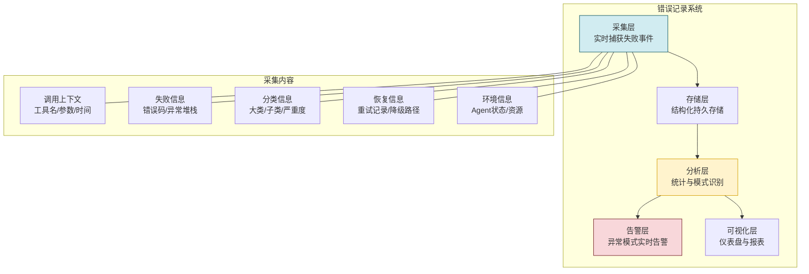

### 6.2 错误记录数据结构

```python
from dataclasses import dataclass, field
from datetime import datetime
from typing import Any, Optional
import uuid


@dataclass
class FailureRecord:
    """失败记录(完整失败事件)"""
    # 基本标识
    record_id: str = field(default_factory=lambda: str(uuid.uuid4()))
    timestamp: float = field(default_factory=time.time)

    # 任务上下文
    agent_id: str = ""                       # Agent 实例ID
    session_id: str = ""                     # 会话ID
    task_id: str = ""                        # 任务ID
    subtask_id: str = ""                     # 子任务ID
    subtask_description: str = ""            # 子任务描述

    # 工具调用上下文
    tool_id: str = ""                        # 工具ID
    tool_name: str = ""                      # 工具名称
    tool_version: str = ""                   # 工具版本
    call_params: dict = field(default_factory=dict)  # 调用参数
    attempt_number: int = 1                  # 第几次尝试

    # 失败信息
    error_code: str = ""                     # 标准错误码
    error_message: str = ""                  # 错误消息
    exception_type: str = ""                 # 异常类型
    exception_stack: str = ""                # 异常堆栈
    raw_response: Any = None                 # 原始返回

    # 分类信息
    failure_category: str = ""               # 失败大类
    failure_sub_type: str = ""               # 失败子类型
    recoverability: str = ""                 # 可恢复性
    persistence: str = ""                    # 持续性
    severity: str = ""                       # 严重程度

    # 恢复信息
    retry_attempted: bool = False            # 是否尝试重试
    retry_count: int = 0                     # 重试次数
    retry_delays_ms: list[int] = field(default_factory=list)  # 重试延迟
    degradation_used: str = ""               # 使用的降级策略
    degradation_result: str = ""             # 降级结果
    final_outcome: str = ""                  # 最终结果(success/degraded/failed)

    # 性能信息
    latency_ms: int = 0                      # 本次调用延迟
    total_time_ms: int = 0                   # 总耗时(含重试)
    tokens_consumed: int = 0                 # Token消耗

    # 环境信息
    agent_state: str = ""                    # Agent当时状态
    available_tools_count: int = 0           # 可用工具数量
    memory_usage: str = ""                   # 内存使用
    concurrent_tasks: int = 0                # 并发任务数

    def to_dict(self) -> dict:
        return {k: v for k, v in self.__dict__.items()}
```

### 6.3 错误记录器

```python
class FailureRecorder:
    """错误记录器"""

    def __init__(self, storage_backend):
        self.storage = storage_backend
        self.buffer = []
        self.buffer_size = 100
        self.flush_interval_seconds = 5
        self.last_flush = time.time()

    def record(self, failure_record: FailureRecord):
        """记录一条失败"""
        # 添加到缓冲区
        self.buffer.append(failure_record.to_dict())

        # 满足条件则刷盘
        if (len(self.buffer) >= self.buffer_size or
                time.time() - self.last_flush > self.flush_interval_seconds):
            self._flush()

    def _flush(self):
        """将缓冲区数据刷入持久化存储"""
        if not self.buffer:
            return

        try:
            self.storage.batch_insert(self.buffer)
            self.buffer.clear()
            self.last_flush = time.time()
        except Exception as e:
            # 记录失败不影响主流程
            print(f"Warning: 失败记录刷盘异常: {e}")

    def build_record(self, subtask, tool, params: dict,
                     detection: ErrorDetectionResult,
                     classification: FailureClassification,
                     retry_result: RetryResult = None,
                     degradation_result: dict = None) -> FailureRecord:
        """构建完整的失败记录"""
        record = FailureRecord(
            task_id=subtask.task_id,
            subtask_id=subtask.id,
            subtask_description=subtask.description,
            tool_id=tool.id,
            tool_name=tool.name,
            call_params=self._sanitize_params(params),
            error_code=detection.error_code.value,
            error_message=detection.error_message,
            failure_category=classification.category.value,
            failure_sub_type=classification.sub_type.value,
            recoverability=classification.recoverability.value,
            persistence=classification.persistence.value,
            severity=classification.severity.name,
        )

        if retry_result:
            record.retry_attempted = True
            record.retry_count = retry_result.attempts
            record.retry_delays_ms = [
                h.get("elapsed_ms", 0) for h in retry_result.failure_history
            ]
            record.total_time_ms = retry_result.total_delay_ms

        if degradation_result:
            record.degradation_used = degradation_result.get("degradation_strategy", "")
            record.degradation_result = degradation_result.get("success", False)
            record.final_outcome = "degraded" if degradation_result.get("success") else "failed"
        else:
            record.final_outcome = "failed"

        return record

    def _sanitize_params(self, params: dict) -> dict:
        """脱敏处理(移除敏感信息)"""
        sensitive_keys = {"password", "token", "secret", "api_key", "credential"}
        sanitized = {}
        for k, v in params.items():
            if k.lower() in sensitive_keys:
                sanitized[k] = "***REDACTED***"
            elif isinstance(v, dict):
                sanitized[k] = self._sanitize_params(v)
            else:
                sanitized[k] = v
        return sanitized
```

### 6.4 错误分析引擎

```python
from collections import defaultdict


class FailureAnalyzer:
    """错误分析引擎"""

    def __init__(self, storage_backend):
        self.storage = storage_backend

    def analyze_failures(self, time_range_hours: int = 24) -> dict:
        """分析指定时间范围内的失败数据"""
        records = self.storage.query(
            start_time=time.time() - time_range_hours * 3600,
            end_time=time.time()
        )

        return {
            "summary": self._compute_summary(records),
            "by_category": self._group_by_category(records),
            "by_tool": self._group_by_tool(records),
            "by_severity": self._group_by_severity(records),
            "trends": self._analyze_trends(records),
            "patterns": self._identify_patterns(records),
            "top_failures": self._get_top_failures(records, top_n=10),
            "recovery_effectiveness": self._analyze_recovery(records)
        }

    def _compute_summary(self, records: list) -> dict:
        """计算汇总指标"""
        total = len(records)
        if total == 0:
            return {"total_failures": 0}

        recovered = sum(1 for r in records if r["final_outcome"] == "success")
        degraded = sum(1 for r in records if r["final_outcome"] == "degraded")
        failed = sum(1 for r in records if r["final_outcome"] == "failed")

        return {
            "total_failures": total,
            "recovery_rate": recovered / total,
            "degradation_rate": degraded / total,
            "failure_rate": failed / total,
            "avg_retry_count": sum(r.get("retry_count", 0) for r in records) / total,
            "avg_recovery_time_ms": sum(r.get("total_time_ms", 0) for r in records) / total
        }

    def _group_by_category(self, records: list) -> dict:
        """按失败大类分组统计"""
        groups = defaultdict(lambda: {"count": 0, "tools": set()})
        for r in records:
            cat = r.get("failure_category", "unknown")
            groups[cat]["count"] += 1
            groups[cat]["tools"].add(r.get("tool_name", ""))
        return {
            cat: {"count": v["count"], "tools": list(v["tools"])}
            for cat, v in groups.items()
        }

    def _group_by_tool(self, records: list) -> dict:
        """按工具分组统计"""
        groups = defaultdict(lambda: {
            "total_failures": 0, "categories": defaultdict(int)
        })
        for r in records:
            tool = r.get("tool_name", "unknown")
            groups[tool]["total_failures"] += 1
            groups[tool]["categories"][r.get("failure_category", "unknown")] += 1
        return {
            tool: {
                "total_failures": v["total_failures"],
                "categories": dict(v["categories"])
            }
            for tool, v in groups.items()
        }

    def _group_by_severity(self, records: list) -> dict:
        """按严重程度分组"""
        severity_counts = defaultdict(int)
        for r in records:
            severity_counts[r.get("severity", "UNKNOWN")] += 1
        return dict(severity_counts)

    def _analyze_trends(self, records: list) -> dict:
        """分析趋势(按小时聚合)"""
        hourly = defaultdict(lambda: {"failures": 0, "recovered": 0})
        for r in records:
            hour = int(r.get("timestamp", 0)) // 3600
            hourly[hour]["failures"] += 1
            if r.get("final_outcome") in ("success", "degraded"):
                hourly[hour]["recovered"] += 1

        sorted_hours = sorted(hourly.keys())
        return {
            "hourly_data": [
                {
                    "hour": h,
                    "failures": hourly[h]["failures"],
                    "recovered": hourly[h]["recovered"]
                }
                for h in sorted_hours
            ],
            "trend": "increasing" if self._is_increasing(sorted_hours, hourly) else "stable"
        }

    def _is_increasing(self, sorted_hours, hourly) -> bool:
        """判断失败是否呈上升趋势"""
        if len(sorted_hours) < 3:
            return False
        recent = sum(hourly[h]["failures"] for h in sorted_hours[-3:])
        earlier = sum(hourly[h]["failures"] for h in sorted_hours[:3])
        return recent > earlier * 1.5

    def _identify_patterns(self, records: list) -> list:
        """识别失败模式"""
        patterns = []

        # 模式1:某工具连续失败
        tool_streaks = self._find_failure_streaks(records, "tool_name")
        for tool, streak in tool_streaks.items():
            if streak >= 3:
                patterns.append({
                    "type": "consecutive_tool_failure",
                    "tool": tool,
                    "streak": streak,
                    "severity": "high",
                    "recommendation": f"工具 {tool} 连续失败{streak}次,建议暂时移出候选"
                })

        # 模式2:某错误码高频出现
        error_code_counts = defaultdict(int)
        for r in records:
            error_code_counts[r.get("error_code", "")] += 1
        for code, count in error_code_counts.items():
            if count >= 10:
                patterns.append({
                    "type": "frequent_error_code",
                    "error_code": code,
                    "count": count,
                    "severity": "medium",
                    "recommendation": f"错误码 {code} 出现{count}次,需排查根因"
                })

        # 模式3:特定参数组合导致失败
        param_failure = self._find_param_correlation(records)
        for param_pattern, count in param_failure.items():
            if count >= 5:
                patterns.append({
                    "type": "param_induced_failure",
                    "param_pattern": param_pattern,
                    "count": count,
                    "severity": "medium",
                    "recommendation": f"参数模式 {param_pattern} 多次导致失败"
                })

        return patterns

    def _find_failure_streaks(self, records: list, key: str) -> dict:
        """找出连续失败的序列"""
        sorted_records = sorted(records, key=lambda r: r.get("timestamp", 0))
        streaks = defaultdict(int)
        current = defaultdict(int)
        last_value = {}

        for r in sorted_records:
            value = r.get(key, "")
            if value == last_value.get(key):
                current[value] += 1
            else:
                if last_value.get(key):
                    streaks[last_value[key]] = max(
                        streaks[last_value[key]], current[last_value[key]]
                    )
                current[value] = 1
                last_value[key] = value

        return dict(streaks)

    def _find_param_correlation(self, records: list) -> dict:
        """发现参数与失败的关联"""
        correlations = defaultdict(int)
        for r in records:
            params = r.get("call_params", {})
            for key, value in params.items():
                if isinstance(value, (str, int, float, bool)):
                    correlations[f"{key}={value}"] += 1
        return dict(correlations)

    def _get_top_failures(self, records: list, top_n: int = 10) -> list:
        """获取Top N失败"""
        failure_counts = defaultdict(int)
        for r in records:
            key = f"{r.get('tool_name', '')}:{r.get('error_code', '')}"
            failure_counts[key] += 1

        sorted_failures = sorted(
            failure_counts.items(), key=lambda x: x[1], reverse=True
        )
        return [
            {"failure": k, "count": v}
            for k, v in sorted_failures[:top_n]
        ]

    def _analyze_recovery(self, records: list) -> dict:
        """分析恢复策略效果"""
        strategy_stats = defaultdict(lambda: {
            "total": 0, "success": 0
        })
        for r in records:
            strategy = r.get("degradation_used", "none")
            strategy_stats[strategy]["total"] += 1
            if r.get("final_outcome") in ("success", "degraded"):
                strategy_stats[strategy]["success"] += 1

        return {
            strategy: {
                "total": stats["total"],
                "success_rate": stats["success"] / stats["total"]
                if stats["total"] > 0 else 0
            }
            for strategy, stats in strategy_stats.items()
        }
```

### 6.5 告警机制

```python
class FailureAlerter:
    """失败告警器"""

    ALERT_RULES = {
        # 规则1:单工具失败率超过阈值
        "high_tool_failure_rate": {
            "condition": lambda stats: stats.get("failure_rate", 0) > 0.3,
            "severity": "high",
            "message": "工具 {tool_name} 失败率 {failure_rate:.1%},超过30%阈值"
        },
        # 规则2:致命错误出现
        "critical_error": {
            "condition": lambda stats: stats.get("severity") == "CRITICAL",
            "severity": "critical",
            "message": "出现致命错误,需立即处理"
        },
        # 规则3:失败趋势上升
        "increasing_failure_trend": {
            "condition": lambda stats: stats.get("trend") == "increasing",
            "severity": "medium",
            "message": "失败趋势上升,近3小时失败数是早期的1.5倍以上"
        },
        # 规则4:连续失败
        "consecutive_failures": {
            "condition": lambda stats: stats.get("streak", 0) >= 5,
            "severity": "high",
            "message": "工具 {tool_name} 连续失败 {streak} 次"
        },
    }

    def check_and_alert(self, analysis_result: dict) -> list:
        """检查告警规则并发送告警"""
        alerts = []
        for rule_name, rule in self.ALERT_RULES.items():
            if rule["condition"](analysis_result):
                alert = {
                    "rule": rule_name,
                    "severity": rule["severity"],
                    "message": rule["message"].format(**analysis_result),
                    "timestamp": time.time(),
                    "analysis_snapshot": analysis_result
                }
                alerts.append(alert)
                self._send_alert(alert)
        return alerts

    def _send_alert(self, alert: dict):
        """发送告警(实际实现对接告警系统)"""
        print(f"[ALERT-{alert['severity'].upper()}] {alert['message']}")
```

---

## 七、基于历史失败数据的调用优化

### 7.1 历史数据驱动优化全景

失败管理的最终目标是**从失败中学习**,持续优化未来的工具调用决策。通过积累的历史失败数据,Agent 可以在工具选择、参数生成、重试策略、降级决策等环节做出更明智的选择。

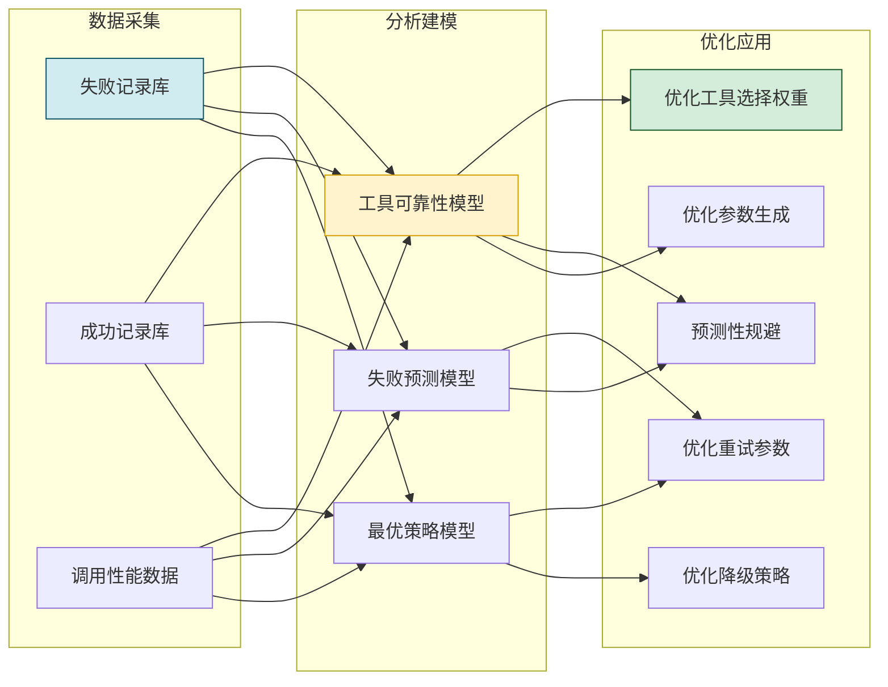

### 7.2 工具可靠性模型

```python
from collections import deque
from dataclasses import dataclass


@dataclass
class ToolReliabilityModel:
    """工具可靠性模型"""
    tool_id: str
    # 基础统计
    total_calls: int = 0
    total_successes: int = 0
    total_failures: int = 0
    # 按失败类型统计
    failure_by_category: dict = None
    failure_by_sub_type: dict = None
    # 时间加权统计(近期数据权重更高)
    recent_results: deque = None  # 最近的调用结果(成功/失败)
    recent_window: int = 100      # 滑动窗口大小
    # 性能统计
    avg_latency_ms: float = 0.0
    latency_p95_ms: float = 0.0
    latency_p99_ms: float = 0.0
    # 趋势指标
    failure_trend: str = "stable"  # increasing/stable/decreasing
    # 最后更新时间
    last_updated: float = 0.0

    def __post_init__(self):
        if self.recent_results is None:
            self.recent_results = deque(maxlen=self.recent_window)
        if self.failure_by_category is None:
            self.failure_by_category = {}
        if self.failure_by_sub_type is None:
            self.failure_by_sub_type = {}

    @property
    def success_rate(self) -> float:
        """总体成功率"""
        if self.total_calls == 0:
            return 0.5  # 冷启动先验
        return self.total_successes / self.total_calls

    @property
    def recent_success_rate(self) -> float:
        """近期成功率(时间加权)"""
        if not self.recent_results:
            return 0.5
        # 指数衰减加权
        weighted_sum = 0.0
        total_weight = 0.0
        for i, result in enumerate(self.recent_results):
            weight = 0.95 ** (len(self.recent_results) - i - 1)
            weighted_sum += weight * (1.0 if result else 0.0)
            total_weight += weight
        return weighted_sum / total_weight if total_weight > 0 else 0.5

    @property
    def reliability_score(self) -> float:
        """综合可靠性评分(0-1)"""
        # 融合总体成功率和近期成功率
        overall = self.success_rate
        recent = self.recent_success_rate
        # 近期数据权重更高
        score = 0.3 * overall + 0.7 * recent
        # 趋势惩罚
        if self.failure_trend == "increasing":
            score *= 0.9
        return round(max(0.0, min(1.0, score)), 4)


class ReliabilityModelManager:
    """可靠性模型管理器"""

    def __init__(self, storage_backend):
        self.storage = storage_backend
        self.models: dict[str, ToolReliabilityModel] = {}
        self._load_models()

    def _load_models(self):
        """从存储加载历史模型"""
        # 从持久化存储加载...
        pass

    def update_model(self, tool_id: str, call_result: dict):
        """更新工具的可靠性模型"""
        if tool_id not in self.models:
            self.models[tool_id] = ToolReliabilityModel(tool_id=tool_id)

        model = self.models[tool_id]
        model.total_calls += 1
        model.last_updated = time.time()

        if call_result.get("success"):
            model.total_successes += 1
            model.recent_results.append(True)
        else:
            model.total_failures += 1
            model.recent_results.append(False)
            # 记录失败类型
            category = call_result.get("failure_category", "unknown")
            model.failure_by_category[category] = \
                model.failure_by_category.get(category, 0) + 1

        # 更新延迟统计
        latency = call_result.get("latency_ms", 0)
        model.avg_latency_ms = (
            (model.avg_latency_ms * (model.total_calls - 1) + latency)
            / model.total_calls
        )

        # 更新趋势
        model.failure_trend = self._compute_trend(model)

    def _compute_trend(self, model: ToolReliabilityModel) -> str:
        """计算失败趋势"""
        if len(model.recent_results) < 10:
            return "stable"

        results = list(model.recent_results)
        mid = len(results) // 2
        early_failures = sum(1 for r in results[:mid] if not r)
        recent_failures = sum(1 for r in results[mid:] if not r)

        early_rate = early_failures / mid
        recent_rate = recent_failures / (len(results) - mid)

        if recent_rate > early_rate * 1.5:
            return "increasing"
        elif recent_rate < early_rate * 0.5:
            return "decreasing"
        return "stable"

    def get_reliability_score(self, tool_id: str,
                               task_type: str = None) -> float:
        """获取工具可靠性评分"""
        model = self.models.get(tool_id)
        if model is None:
            return 0.5  # 冷启动先验

        base_score = model.reliability_score

        # 按任务类型调整(如果工具在某些任务类型上表现更好)
        if task_type:
            type_specific = self._get_task_type_score(tool_id, task_type)
            base_score = 0.6 * base_score + 0.4 * type_specific

        return base_score

    def _get_task_type_score(self, tool_id: str, task_type: str) -> float:
        """获取工具在特定任务类型上的得分"""
        # 从更细粒度的历史数据中查询
        # 简化实现:返回基础得分
        model = self.models.get(tool_id)
        return model.reliability_score if model else 0.5
```

### 7.3 失败预测模型

```python
class FailurePredictor:
    """失败预测器"""

    def __init__(self, reliability_manager: ReliabilityModelManager):
        self.reliability = reliability_manager

    def predict_failure_probability(self, tool_id: str, params: dict,
                                     context: dict = None) -> dict:
        """预测工具调用的失败概率"""
        context = context or {}
        probabilities = {}

        # 1. 基于历史可靠性
        base_reliability = self.reliability.get_reliability_score(tool_id)
        probabilities["base"] = 1.0 - base_reliability

        # 2. 基于参数模式
        param_risk = self._assess_param_risk(tool_id, params)
        probabilities["param_risk"] = param_risk

        # 3. 基于时间模式(某些时段工具更不稳定)
        time_risk = self._assess_time_risk(tool_id)
        probabilities["time_risk"] = time_risk

        # 4. 基于环境状态(并发量、资源等)
        env_risk = self._assess_environment_risk(context)
        probabilities["env_risk"] = env_risk

        # 5. 基于趋势
        trend_risk = self._assess_trend_risk(tool_id)
        probabilities["trend_risk"] = trend_risk

        # 综合概率
        overall = (
            0.35 * probabilities["base"] +
            0.20 * probabilities["param_risk"] +
            0.15 * probabilities["time_risk"] +
            0.15 * probabilities["env_risk"] +
            0.15 * probabilities["trend_risk"]
        )

        return {
            "overall_failure_probability": round(overall, 4),
            "risk_breakdown": probabilities,
            "is_high_risk": overall > 0.4,
            "recommendation": self._get_recommendation(overall)
        }

    def _assess_param_risk(self, tool_id: str, params: dict) -> float:
        """评估参数风险"""
        model = self.reliability.models.get(tool_id)
        if not model:
            return 0.2

        # 检查参数是否匹配历史上失败的参数模式
        risk = 0.1  # 基础风险
        for key, value in params.items():
            pattern = f"{key}={value}"
            # 如果这个参数模式历史失败率较高
            failure_count = model.failure_by_sub_type.get(pattern, 0)
            if failure_count > 3:
                risk += 0.1
        return min(0.8, risk)

    def _assess_time_risk(self, tool_id: str) -> float:
        """评估时间风险"""
        hour = time.localtime().tm_hour
        # 假设凌晨2-5点是维护窗口,风险较高
        if 2 <= hour <= 5:
            return 0.3
        # 高峰时段(9-11, 14-17)可能限流
        if hour in [9, 10, 11, 14, 15, 16, 17]:
            return 0.2
        return 0.1

    def _assess_environment_risk(self, context: dict) -> float:
        """评估环境风险"""
        risk = 0.1
        # 高并发时风险增加
        concurrent = context.get("concurrent_tasks", 1)
        if concurrent > 10:
            risk += 0.2
        # 内存紧张时风险增加
        if context.get("memory_pressure", False):
            risk += 0.2
        return min(0.6, risk)

    def _assess_trend_risk(self, tool_id: str) -> float:
        """评估趋势风险"""
        model = self.reliability.models.get(tool_id)
        if not model:
            return 0.2
        if model.failure_trend == "increasing":
            return 0.4
        elif model.failure_trend == "decreasing":
            return 0.1
        return 0.2

    def _get_recommendation(self, probability: float) -> str:
        """根据失败概率给出建议"""
        if probability > 0.6:
            return "高失败风险:建议直接使用备选工具或降级策略"
        elif probability > 0.4:
            return "中等风险:建议准备备选方案,缩短重试间隔"
        elif probability > 0.2:
            return "低风险:正常调用,保持默认重试策略"
        else:
            return "极低风险:正常调用即可"
```

### 7.4 调用决策优化器

```python
class CallDecisionOptimizer:
    """基于历史数据的调用决策优化器"""

    def __init__(self, reliability_manager: ReliabilityModelManager,
                 failure_predictor: FailurePredictor):
        self.reliability = reliability_manager
        self.predictor = failure_predictor

    def optimize_tool_selection(self, candidate_tools: list,
                                 task_requirements: dict) -> list:
        """优化工具选择排序(基于历史可靠性)"""
        scored_tools = []
        for tool in candidate_tools:
            # 基础可靠性评分
            reliability = self.reliability.get_reliability_score(
                tool.id, task_requirements.get("task_type")
            )
            # 预测失败概率
            prediction = self.predictor.predict_failure_probability(
                tool.id, task_requirements.get("params", {})
            )
            # 调整后的得分:可靠性高 + 风险低 = 高分
            adjusted_score = reliability * (1 - prediction["overall_failure_probability"] * 0.5)

            scored_tools.append({
                "tool": tool,
                "reliability_score": reliability,
                "failure_probability": prediction["overall_failure_probability"],
                "adjusted_score": adjusted_score,
                "risk_assessment": prediction["recommendation"]
            })

        # 按调整后得分排序
        scored_tools.sort(key=lambda x: x["adjusted_score"], reverse=True)
        return scored_tools

    def optimize_retry_config(self, tool_id: str,
                               base_config: RetryConfig) -> RetryConfig:
        """基于历史数据优化重试配置"""
        model = self.reliability.models.get(tool_id)
        if not model:
            return base_config  # 无历史数据,保持默认

        optimized = RetryConfig(
            max_attempts=base_config.max_attempts,
            backoff_strategy=base_config.backoff_strategy,
            retry_on=base_config.retry_on,
            skip_retry_on=base_config.skip_retry_on,
            timeout_per_retry_ms=base_config.timeout_per_retry_ms,
            total_timeout_ms=base_config.total_timeout_ms,
            has_side_effect=base_config.has_side_effect
        )

        # 根据历史失败类型调整重试次数
        dominant_failure = max(
            model.failure_by_category.items(),
            key=lambda x: x[1],
            default=("unknown", 0)
        )
        if dominant_failure[0] == "network_error":
            # 网络错误适合多重试
            optimized.max_attempts = max(optimized.max_attempts, 4)
        elif dominant_failure[0] == "permission_error":
            # 权限错误不适合重试
            optimized.max_attempts = 1
        elif dominant_failure[0] == "parameter_error":
            # 参数错误适合修正后重试
            optimized.max_attempts = 2

        # 根据平均延迟调整超时
        if model.avg_latency_ms > 0:
            # 设置为平均延迟的3倍,覆盖95%的情况
            optimized.timeout_per_retry_ms = max(
                optimized.timeout_per_retry_ms,
                int(model.avg_latency_ms * 3)
            )

        # 根据趋势调整
        if model.failure_trend == "increasing":
            # 失败上升趋势,增加退避时间
            if isinstance(optimized.backoff_strategy, ExponentialBackoff):
                optimized.backoff_strategy = ExponentialBackoffWithJitter(
                    base_delay=optimized.backoff_strategy.base_delay * 1.5,
                    max_delay=optimized.backoff_strategy.max_delay
                )

        return optimized

    def optimize_degradation_strategy(self, tool_id: str,
                                       task_type: str) -> dict:
        """基于历史数据优化降级策略优先级"""
        model = self.reliability.models.get(tool_id)

        # 默认降级优先级
        default_priority = [
            "fallback_tool",
            "cache",
            "simplify",
            "llm_direct",
            "human"
        ]

        if not model:
            return {"priority": default_priority, "reason": "使用默认优先级"}

        # 根据历史降级效果调整优先级
        strategy_success_rates = {}
        for strategy in default_priority:
            # 查询该策略的历史成功率
            # 简化实现:使用默认值
            strategy_success_rates[strategy] = 0.5

        # 按成功率排序
        optimized_priority = sorted(
            default_priority[:-1],  # 排除human(始终最后)
            key=lambda s: strategy_success_rates.get(s, 0),
            reverse=True
        )
        optimized_priority.append("human")

        return {
            "priority": optimized_priority,
            "strategy_success_rates": strategy_success_rates,
            "reason": "基于历史降级效果优化"
        }

    def should_preemptively_avoid(self, tool_id: str) -> tuple[bool, str]:
        """判断是否应预防性规避某工具"""
        model = self.reliability.models.get(tool_id)
        if not model:
            return False, "无历史数据"

        # 条件1:近期成功率极低
        if model.recent_success_rate < 0.3 and len(model.recent_results) >= 10:
            return True, f"近期成功率仅{model.recent_success_rate:.1%},建议规避"

        # 条件2:失败趋势持续上升
        if model.failure_trend == "increasing" and model.recent_success_rate < 0.5:
            return True, "失败趋势上升且成功率低于50%"

        # 条件3:连续失败
        recent_list = list(model.recent_results)
        if len(recent_list) >= 5 and not any(recent_list[-5:]):
            return True, "最近5次调用全部失败"

        return False, "工具状态正常"
```

### 7.5 闭环优化流程

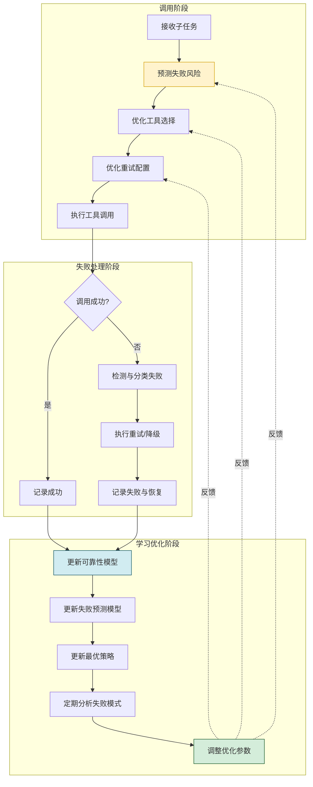

---

## 八、完整流程设计与实现

### 8.1 失败管理完整流程

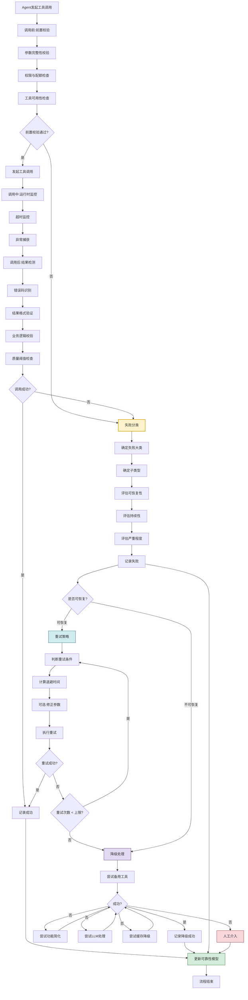

### 8.2 失败管理器完整实现

```python
"""
Agent 工具调用失败管理器 - 完整实现
整合失败检测、分类、重试、降级、记录与学习优化
"""


class ToolFailureManager:
    """工具调用失败管理器(核心编排器)"""

    def __init__(self, config: dict = None):
        self.config = config or {}

        # 初始化各组件
        self.detector = ErrorCodeDetector()
        self.classifier = FailureClassifier()
        self.validator = ResultValidator(
            quality_threshold=self.config.get("quality_threshold", 0.7)
        )
        self.timeout_detector = TimeoutDetector(
            TimeoutConfig(
                connect_timeout_ms=self.config.get("connect_timeout_ms", 3000),
                read_timeout_ms=self.config.get("read_timeout_ms", 15000),
                total_timeout_ms=self.config.get("total_timeout_ms", 30000)
            )
        )
        self.recorder = FailureRecorder(
            storage_backend=self.config.get("storage")
        )
        self.reliability_manager = ReliabilityModelManager(
            storage_backend=self.config.get("storage")
        )
        self.predictor = FailurePredictor(self.reliability_manager)
        self.optimizer = CallDecisionOptimizer(
            self.reliability_manager, self.predictor
        )
        self.analyzer = FailureAnalyzer(
            storage_backend=self.config.get("storage")
        )
        self.alerter = FailureAlerter()

        # 降级组件(按需初始化)
        self.degradation_engine = None  # 需要时再初始化

    def execute_tool_call(self, subtask, tool, params: dict,
                          fallback_chain: list = None) -> dict:
        """执行完整的工具调用(含失败管理)"""
        call_context = {
            "subtask": subtask,
            "tool": tool,
            "params": params,
            "start_time": time.time(),
            "attempt": 0,
            "escalation_path": []
        }

        # 阶段1:调用前 — 预测风险并优化
        risk_assessment = self.predictor.predict_failure_probability(
            tool.id, params
        )
        if risk_assessment["is_high_risk"] and fallback_chain:
            # 高风险时优先考虑备选工具
            best_fallback = self._select_best_fallback(fallback_chain)
            if best_fallback and self._is_better_than_current(
                best_fallback, tool
            ):
                call_context["original_tool"] = tool
                call_context["tool"] = best_fallback
                tool = best_fallback

        # 阶段2:构建重试配置(基于历史数据优化)
        retry_config = self._get_optimized_retry_config(tool)
        retry_executor = RetryExecutor(
            config=retry_config,
            detector=self.detector,
            classifier=self.classifier
        )

        # 阶段3:执行带重试的工具调用
        retry_result = retry_executor.execute_with_retry(
            tool=tool,
            params=params,
            has_side_effect=getattr(tool, 'has_side_effect', False)
        )

        # 阶段4:处理结果
        if retry_result.success:
            # 验证结果质量
            validation = self.validator.validate(
                retry_result.final_result,
                expected_schema=getattr(subtask, 'expected_schema', None)
            )
            if validation.is_valid:
                return self._build_success_result(
                    retry_result, tool, call_context
                )
            else:
                # 质量不达标,视为失败
                detection = ErrorDetectionResult(
                    is_success=False,
                    error_code=StandardErrorCode.TOOL_EXECUTION_ERROR,
                    error_message=f"结果质量不达标: {validation.errors}"
                )
                classification = self.classifier.classify(
                    detection.error_code, detection.error_message
                )
        else:
            # 重试失败,获取最后的失败信息
            if retry_result.failure_history:
                last_failure = retry_result.failure_history[-1]
                detection = ErrorDetectionResult(
                    is_success=False,
                    error_code=StandardErrorCode(last_failure["error_code"]),
                    error_message=last_failure["error_message"]
                )
                classification = self.classifier.classify(
                    detection.error_code, detection.error_message
                )
            else:
                detection = ErrorDetectionResult(
                    is_success=False,
                    error_code=StandardErrorCode.UNKNOWN,
                    error_message=retry_result.last_error or "未知失败"
                )
                classification = self.classifier.classify(
                    detection.error_code, detection.error_message
                )

        # 阶段5:记录失败
        failure_record = self.recorder.build_record(
            subtask=subtask,
            tool=tool,
            params=params,
            detection=detection,
            classification=classification,
            retry_result=retry_result
        )
        self.recorder.record(failure_record)

        # 阶段6:降级处理
        degradation_result = self._handle_degradation(
            subtask, params, classification,
            fallback_chain, call_context["escalation_path"]
        )

        # 阶段7:更新可靠性模型
        self.reliability_manager.update_model(tool.id, {
            "success": False,
            "failure_category": classification.category.value,
            "latency_ms": int((time.time() - call_context["start_time"]) * 1000)
        })

        if degradation_result.get("success"):
            # 降级成功,记录并返回
            self.recorder.record(self.recorder.build_record(
                subtask=subtask, tool=tool, params=params,
                detection=detection, classification=classification,
                degradation_result=degradation_result
            ))
            return degradation_result
        else:
            # 降级也失败,返回最终失败
            return {
                "success": False,
                "error": detection.error_message,
                "failure_category": classification.category.value,
                "degradation_attempted": True,
                "degradation_failed_reason": degradation_result.get("reason"),
                "total_time_ms": int(
                    (time.time() - call_context["start_time"]) * 1000
                ),
                "need_human_intervention": degradation_result.get(
                    "status"
                ) == "awaiting_human"
            }

    def _get_optimized_retry_config(self, tool) -> RetryConfig:
        """获取优化后的重试配置"""
        base_config = RETRY_TEMPLATES.get(
            getattr(tool, 'retry_template', 'read_only_api'),
            RETRY_TEMPLATES["read_only_api"]
        )
        return self.optimizer.optimize_retry_config(tool.id, base_config)

    def _handle_degradation(self, subtask, params, classification,
                            fallback_chain, escalation_path) -> dict:
        """执行降级处理"""
        if self.degradation_engine is None:
            self._init_degradation_engine(fallback_chain or [])

        return self.degradation_engine.handle_failure(
            subtask=subtask,
            params=params,
            failure=classification,
            escalation_path=escalation_path
        )

    def _init_degradation_engine(self, fallback_tools: list):
        """初始化降级引擎"""
        fallback_chain = [
            FallbackTool(tool=t, capability_overlap=0.8)
            for t in fallback_tools
        ]
        self.degradation_engine = DegradationEngine(
            fallback_switcher=FallbackToolSwitcher(fallback_chain),
            simplifier=FunctionalitySimplifier(),
            llm_handler=LLMFallbackHandler(
                llm_client=self.config.get("llm_client")
            ),
            cache_handler=CacheFallbackHandler(
                cache_store=self.config.get("cache_store")
            ),
            human_handler=HumanInterventionHandler(
                notification_channel=self.config.get("notification_channel")
            )
        )

    def _select_best_fallback(self, fallback_chain: list):
        """选择最佳备选工具"""
        if not fallback_chain:
            return None
        best = None
        best_score = 0
        for tool in fallback_chain:
            score = self.reliability_manager.get_reliability_score(tool.id)
            if score > best_score:
                best_score = score
                best = tool
        return best

    def _is_better_than_current(self, fallback, current) -> bool:
        """判断备选工具是否优于当前工具"""
        fallback_score = self.reliability_manager.get_reliability_score(
            fallback.id
        )
        current_score = self.reliability_manager.get_reliability_score(
            current.id
        )
        return fallback_score > current_score * 1.2  # 显著优于才切换

    def _build_success_result(self, retry_result, tool, context) -> dict:
        """构建成功结果"""
        # 更新可靠性模型
        self.reliability_manager.update_model(tool.id, {
            "success": True,
            "latency_ms": retry_result.attempts * 1000  # 简化
        })
        return {
            "success": True,
            "result": retry_result.final_result,
            "tool_used": tool.name,
            "attempts": retry_result.attempts,
            "total_delay_ms": retry_result.total_delay_ms,
            "is_retried": retry_result.attempts > 1,
            "total_time_ms": int(
                (time.time() - context["start_time"]) * 1000
            )
        }

    def get_health_report(self, time_range_hours: int = 24) -> dict:
        """获取健康报告"""
        analysis = self.analyzer.analyze_failures(time_range_hours)
        alerts = self.alerter.check_and_alert(analysis)
        return {
            "analysis": analysis,
            "alerts": alerts,
            "timestamp": time.time()
        }
```

---

## 九、典型场景案例分析

### 9.1 场景一:网络抖动导致的API调用超时

**场景描述**:Agent 调用天气 API 获取数据,因网络抖动导致连接超时。

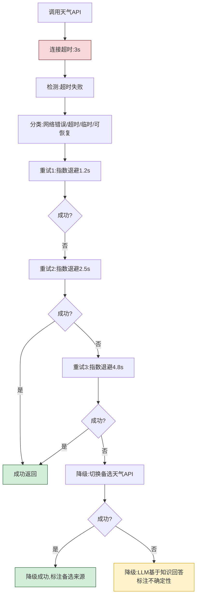

**关键处理**:
- 失败分类为"网络错误/超时/临时性/可恢复"
- 使用指数退避+抖动重试3次
- 重试耗尽后切换备选天气API
- 备选也失败时LLM降级,标注"基于知识推断,非实时数据"

### 9.2 场景二:API令牌过期导致权限失败

**场景描述**:Agent 调用数据库查询工具,因认证令牌过期返回401错误。

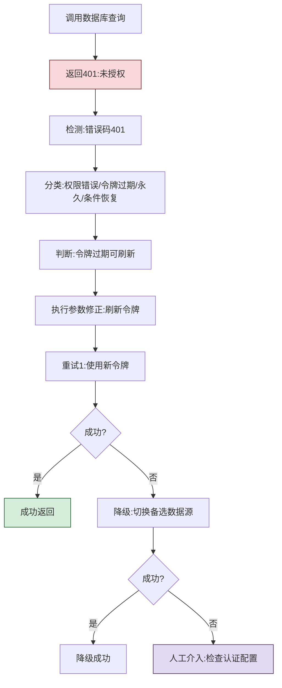

**关键处理**:
- 识别为"令牌过期"子类型,虽属权限类但可条件恢复
- 触发参数修正函数刷新令牌
- 使用新令牌重试1次
- 刷新失败则切换备选数据源
- 最终降级为人工介入

### 9.3 场景三:高并发导致API限流

**场景描述**:Agent 在高峰期调用搜索API,触发429限流。

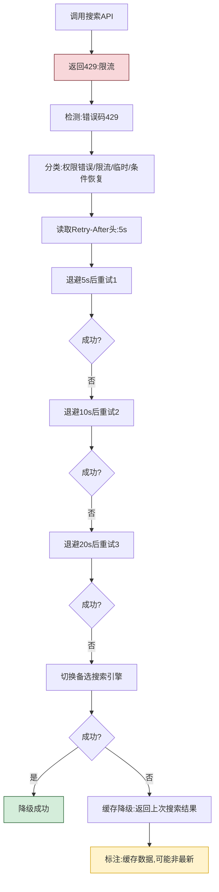

**关键处理**:
- 识别为"限流"子类型,临时性故障
- 读取响应头中的`Retry-After`作为首次退避时间
- 退避时间递增(5s→10s→20s),最多重试3次
- 重试耗尽后切换备选搜索引擎
- 备选也失败时返回缓存结果,标注过期状态

### 9.4 场景四:工具内部Bug导致结果异常

**场景描述**:Agent 调用数据分析工具,工具执行成功但返回结果格式错误。

```mermaid
flowchart TD
    A[调用数据分析工具] --> B[工具返回结果]
    B --> C[错误码:成功]
    C --> D[结果验证:格式检查]
    D --> E[发现:必需字段缺失]
    E --> F[分类:质量失败/格式不符/永久/条件恢复]
    F --> G[降级:功能简化<br/>只提取可用字段]
    G --> H{简化后可用?}
    H -- 是 --> I[降级成功,标注不完整]
    H -- 否 --> J[切换备选分析工具]
    J --> K{成功?}
    K -- 是 --> L[降级成功]
    K -- 否 --> M[人工介入:报告工具Bug]

    style E fill:#f8d7da,stroke:#721c24
    style I fill:#d4edda,stroke:#155724
    style M fill:#e2d9f3,stroke:#4a235a
```

**关键处理**:
- 工具返回成功码,但结果验证发现格式问题
- 分类为"质量失败",不重试(永久性故障)
- 首选降级:功能简化,提取可用部分
- 简化不可行则切换备选工具
- 最终降级为人工介入,报告工具Bug

### 9.5 场景五:不可逆操作失败需人工确认

**场景描述**:Agent 调用数据删除工具,执行过程中发生内部错误,需确认是否已部分执行。

```mermaid
flowchart TD
    A[调用数据删除工具] --> B[内部错误:执行中断]
    B --> C[检测:异常捕获]
    C --> D[分类:工具内部错误/Bug/间歇/可恢复]
    D --> E{有副作用且不可逆?}
    E -- 是 --> F[不自动重试]
    F --> G[检查操作日志:确认执行状态]
    G --> H{是否已部分执行?}
    H -- 是 --> I[触发人工介入:CRITICAL级别]
    H -- 不确定 --> I
    H -- 否 --> J[尝试重试1次]
    J --> K{成功?}
    K -- 是 --> L[成功完成]
    K -- 否 --> I

    style B fill:#f8d7da,stroke:#721c24
    style I fill:#e2d9f3,stroke:#4a235a,stroke-width:3px
    style L fill:#d4edda,stroke:#155724
```

**关键处理**:
- 识别为不可逆操作,不自动重试
- 先检查操作日志确认执行状态
- 如已部分执行或状态不明,立即触发人工介入
- 确认未执行时才尝试重试1次
- 人工介入级别为CRITICAL(紧急停止)

### 9.6 场景对比总结

| 场景 | 失败类型 | 恢复策略 | 降级策略 | 关键原则 |
|-----|---------|---------|---------|---------|
| 网络超时 | 临时/可恢复 | 指数退避重试3次 | 备选工具→LLM | 自动恢复优先 |
| 令牌过期 | 永久/条件恢复 | 刷新令牌后重试1次 | 备选数据源→人工 | 参数修正后重试 |
| API限流 | 临时/条件恢复 | 长退避重试3次 | 备选引擎→缓存 | 尊重回退指示 |
| 结果异常 | 永久/条件恢复 | 不重试 | 功能简化→备选→人工 | 质量验证兜底 |
| 不可逆失败 | 间歇/有风险 | 不自动重试 | 人工介入 | 安全优先 |

---

## 十、总结与最佳实践

### 10.1 核心要点回顾

```mermaid
mindmap
  root((失败管理核心))
    检测
      三阶段检测
        调用前校验
        调用中监控
        调用后验证
      多级超时
      错误码识别
      结果验证
    分类
      五大错误类别
        网络错误
        权限问题
        参数错误
        工具内部错误
        质量失败
      四维属性
        可恢复性
        持续性
        严重程度
        推荐处理
    恢复
      重试策略
        可重试性判断
        退避算法
        重试执行器
      降级处理
        备用工具切换
        功能简化
        LLM降级
        缓存降级
        人工介入
    学习
      可靠性模型
      失败预测
      决策优化
      闭环反馈
```

### 10.2 失败管理成熟度模型

```mermaid
flowchart LR
    L1[L1 基础级<br/>简单异常捕获] --> L2[L2 规则级<br/>分类+重试+降级]
    L2 --> L3[L3 分析级<br/>记录+统计+告警]
    L3 --> L4[L4 学习级<br/>可靠性模型+预测]
    L4 --> L5[L5 自适应级<br/>闭环优化+自动调参]

    style L1 fill:#f8d7da,stroke:#721c24
    style L2 fill:#fff3cd,stroke:#d39e00
    style L3 fill:#d1ecf1,stroke:#0c5460
    style L4 fill:#d4edda,stroke:#155724
    style L5 fill:#e2d9f3,stroke:#4a235a
```

| 成熟度等级 | 核心能力 | 特征描述 |
|:---------:|---------|---------|
| **L1 基础级** | 异常捕获 | try-catch捕获异常,记录错误消息 |
| **L2 规则级** | 分类+重试+降级 | 失败分类,自动重试,降级处理 |
| **L3 分析级** | 记录+统计+告警 | 完整记录,统计分析,异常告警 |
| **L4 学习级** | 可靠性模型+预测 | 基于历史数据建模,预测失败风险 |
| **L5 自适应级** | 闭环优化+自动调参 | 自适应调整策略,持续自动优化 |

### 10.3 最佳实践清单

| 实践领域 | 最佳实践 |
|---------|---------|
| **超时设计** | 多级超时(连接/读取/全局),根据工具类型差异化配置 |
| **错误分类** | 建立标准化错误码体系,精准分类到子类型 |
| **重试策略** | 指数退避+抖动为默认策略,有副作用操作谨慎重试 |
| **降级设计** | 每次工具选择都准备备选链,设计明确的降级路径 |
| **幂等性** | 对有副作用的操作确保幂等性,保障重试安全 |
| **结果验证** | 三层验证(格式/逻辑/质量),不信任工具的成功码 |
| **错误记录** | 完整记录失败上下文,脱敏敏感信息 |
| **可靠性建模** | 时间加权统计,区分总体成功率和近期成功率 |
| **预防性规避** | 连续失败的工具暂时移出候选,趋势恶化时预警 |
| **人工介入** | 不可逆操作失败必须人工确认,CRITICAL级别紧急停止 |
| **闭环优化** | 失败数据反馈到工具选择和参数优化,形成学习闭环 |
| **成本控制** | 重试有上限,降级有预算,避免雪崩效应 |

### 10.4 常见陷阱与规避

| 陷阱 | 危害 | 规避方法 |
|-----|------|---------|
| **无脑重试** | 加剧服务压力,浪费成本 | 分类判断可重试性,设置重试上限 |
| **忽略幂等性** | 重复执行副作用操作 | 重试前检查幂等性,非幂等不重试 |
| **重试风暴** | 多个客户端同步重试 | 使用抖动退避分散重试 |
| **无降级方案** | 单点失败导致任务中断 | 预设备选链,设计降级路径 |
| **忽略结果验证** | 工具返回错误数据被使用 | 三层结果验证兜底 |
| **失败记录不全** | 无法分析根因,无法学习 | 完整记录失败上下文 |
| **无可靠性学习** | 同样错误反复发生 | 建立可靠性模型,持续优化 |
| **不可逆操作自动重试** | 造成不可挽回的损失 | 不可逆操作失败必须人工确认 |

### 10.5 与系列其他文档的关系

本文档是 Agent 架构设计系列的关键组成,与以下文档密切相关:

- [42Agent工具选择决策机制深度解析.md](./42Agent工具选择决策机制深度解析.md):工具选择是失败管理的前置环节,失败管理的降级策略依赖工具选择阶段准备的备选链。
- [37Agent执行流程详解.md](./37Agent执行流程详解.md):失败管理是执行流程中的关键容错环节。
- [39ReAct_Agent工作流程详解.md](./39ReAct_Agent工作流程详解.md):ReAct 模式中的工具调用失败需要失败管理机制保障。
- [40Plan-and-Execute_Agent完整实现方案.md](./40Plan-and-Execute_Agent完整实现方案.md):Plan-Execute 模式中的子任务执行需要失败管理保障。
- [41Agent任务规划机制详解.md](./41Agent任务规划机制详解.md):任务规划需考虑工具调用的失败可能性,设计合理的回滚机制。

### 10.6 给开发者的实践建议

1. **从基础级开始**:先实现简单的异常捕获和固定间隔重试,再逐步引入分类、降级、学习机制。
2. **重视错误分类**:投入精力设计标准化的错误码体系,这是精准恢复策略的基础。
3. **默认指数+抖动**:将指数退避+抖动作为默认重试策略,适用于大多数场景。
4. **永远准备Plan B**:在工具选择阶段就准备好备选链,不要等到失败才临时寻找替代方案。
5. **不可逆操作特殊处理**:对删除、发送等不可逆操作,失败时必须人工确认,绝不可自动重试。
6. **从第一天起记录数据**:失败数据是学习优化的燃料,即使初期不分析也要先记录。
7. **定期复盘失败模式**:每周/每月分析失败数据,识别高频失败的工具和参数模式。
8. **建立健康度看板**:实时监控工具可靠性变化,对趋势恶化的工具及时预警。
9. **测试容错链路**:不仅要测试正常流程,还要主动注入故障测试恢复和降级链路。
10. **持续迭代优化**:失败管理不是一次性工程,需要根据线上数据持续调优策略参数。

---

> **相关文档**
>
> - [42Agent工具选择决策机制深度解析.md](./42Agent工具选择决策机制深度解析.md):工具选择决策机制,失败管理的上游环节
> - [37Agent执行流程详解.md](./37Agent执行流程详解.md):Agent 执行流程,失败管理的整体上下文
> - [39ReAct_Agent工作流程详解.md](./39ReAct_Agent工作流程详解.md):ReAct 模式中的工具调用与容错
> - [40Plan-and-Execute_Agent完整实现方案.md](./40Plan-and-Execute_Agent完整实现方案.md):Plan-Execute 模式中的失败处理
> - [41Agent任务规划机制详解.md](./41Agent任务规划机制详解.md):任务规划与失败回滚机制
> - [36企业级Agent系统完整设计方案.md](./36企业级Agent系统完整设计方案.md):企业级 Agent 的整体容错架构
