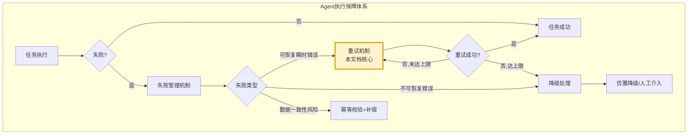
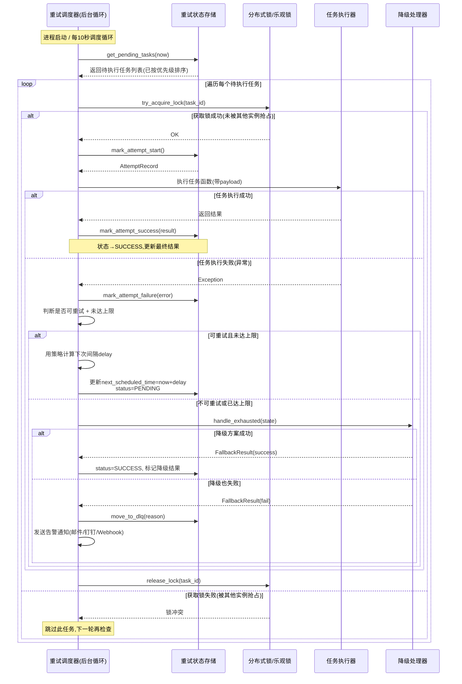
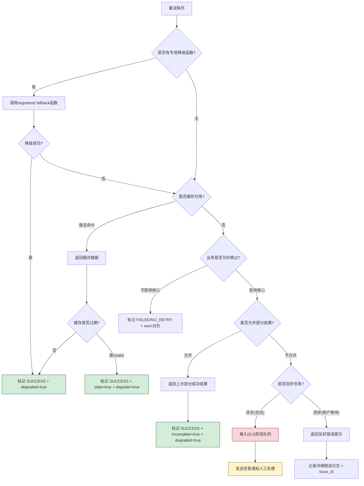
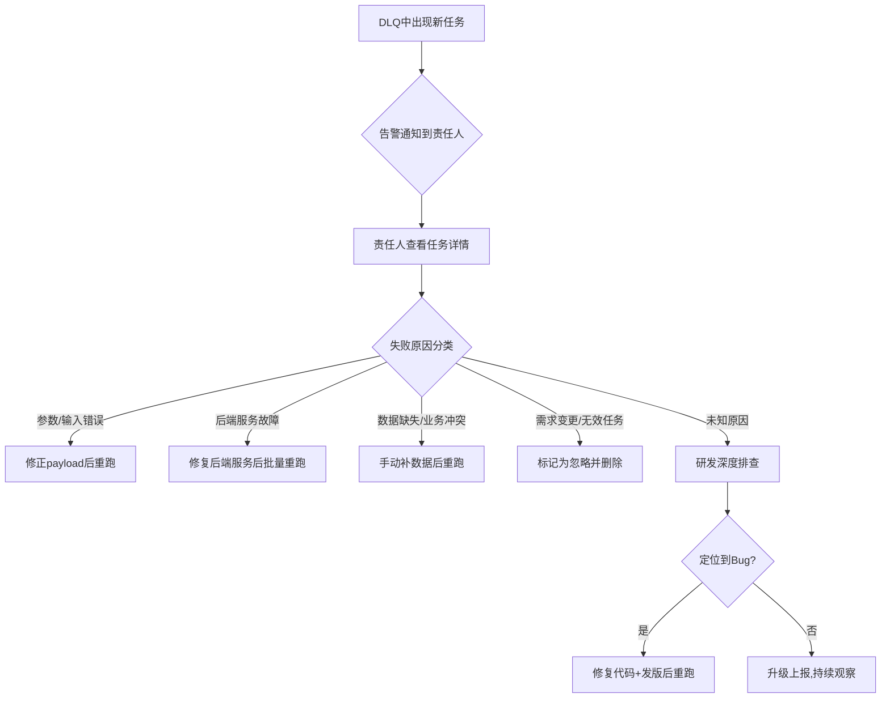
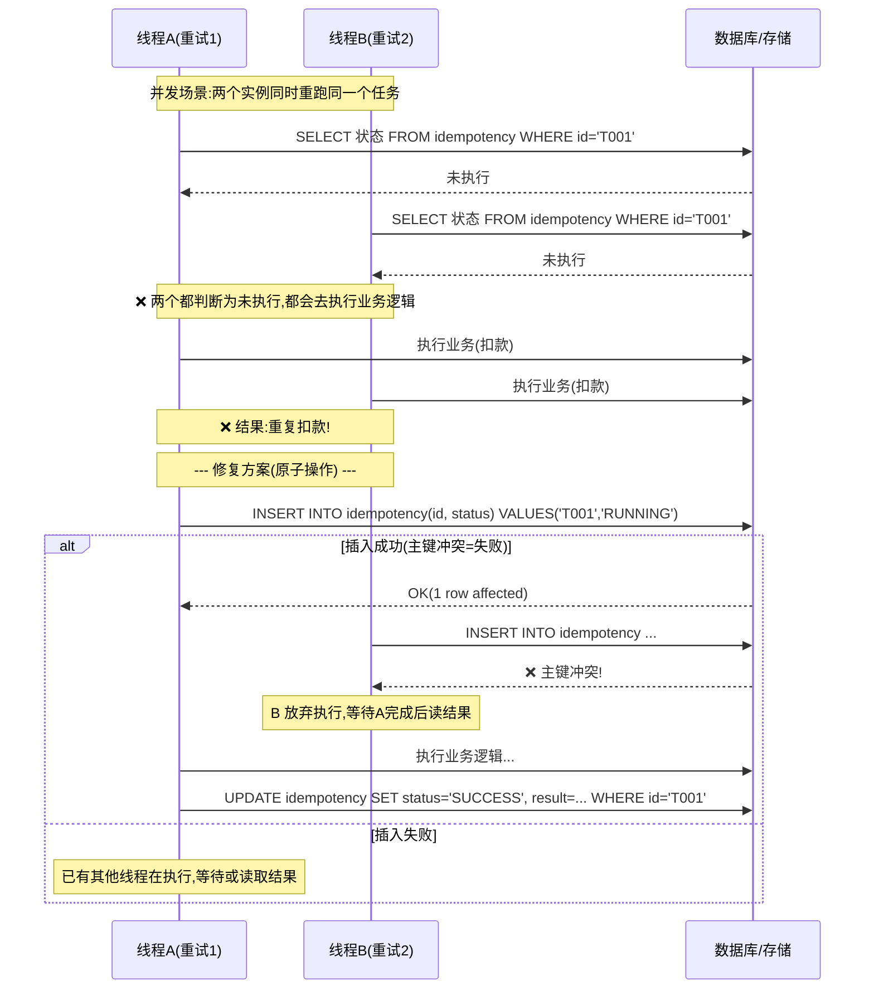

# Agent 任务重试机制完整设计与实现

## 文档定位
系统阐述 AI Agent 在任务执行过程中,如何设计并实现一套可靠的任务重试机制,涵盖重试触发条件、重试间隔策略、状态持久化存储、降级处理、数据一致性保障以及配置与日志系统,为 Agent 开发者提供可落地的重试框架与工程实现指导。

## 阅读建议
本文是 Agent 架构设计系列的关键组成,建议结合 [43Agent工具调用失败管理机制详解.md](./43Agent工具调用失败管理机制详解.md)、[42Agent工具选择决策机制深度解析.md](./42Agent工具选择决策机制深度解析.md)、[37Agent执行流程详解.md](./37Agent执行流程详解.md) 一并阅读,以理解重试机制在 Agent 整体容错架构中的定位。

---

## 目录

- [一、任务重试机制概述](#一任务重试机制概述)
  - [1.1 什么是任务重试机制](#11-什么是任务重试机制)
  - [1.2 重试机制的核心目标](#12-重试机制的核心目标)
  - [1.3 重试机制在 Agent 容错体系中的位置](#13-重试机制在-agent-容错体系中的位置)
  - [1.4 重试机制 vs 简单循环重试对比表](#14-重试机制-vs-简单循环重试对比表)
- [二、重试触发条件设计](#二重试触发条件设计)
  - [2.1 可重试 vs 不可重试错误分类](#21-可重试-vs-不可重试错误分类)
  - [2.2 基于错误类型的触发条件](#22-基于错误类型的触发条件)
    - [2.2.1 网络超时触发](#221-网络超时触发)
    - [2.2.2 HTTP 状态码触发](#222-http-状态码触发)
    - [2.2.3 自定义错误码触发](#223-自定义错误码触发)
  - [2.3 基于业务结果的触发条件](#23-基于业务结果的触发条件)
  - [2.4 触发条件判定器 Python 实现](#24-触发条件判定器-python-实现)
- [三、重试次数与上限策略](#三重试次数与上限策略)
  - [3.1 重试次数上限的设计原则](#31-重试次数上限的设计原则)
  - [3.2 各类任务的推荐重试上限表](#32-各类任务的推荐重试上限表)
  - [3.3 动态重试次数调整](#33-动态重试次数调整)
- [四、重试间隔策略实现](#四重试间隔策略实现)
  - [4.1 常见间隔策略对比](#41-常见间隔策略对比)
  - [4.2 各种策略Python实现](#42-各种策略python实现)
    - [4.2.1 固定间隔](#421-固定间隔)
    - [4.2.2 指数退避](#422-指数退避)
    - [4.2.3 基于错误类型的自适应间隔](#423-基于错误类型的自适应间隔)
  - [4.3 间隔策略选择决策表](#43-间隔策略选择决策表)
- [五、重试状态持久化存储](#五重试状态持久化存储)
  - [5.1 为什么需要持久化](#51-为什么需要持久化)
  - [5.2 重试状态数据模型设计](#52-重试状态数据模型设计)
  - [5.3 持久化存储方案对比表](#53-持久化存储方案对比表)
  - [5.4 SQLite 持久化实现](#54-sqlite-持久化实现)
  - [5.5 基于持久化的断点续执行流程](#55-基于持久化的断点续执行流程)
- [六、降级处理机制](#六降级处理机制)
  - [6.1 重试耗尽后的降级路径](#61-重试耗尽后的降级路径)
  - [6.2 降级处理实现](#62-降级处理实现)
  - [6.3 死信队列(DLQ)设计](#63-死信队列dlq设计)
- [七、幂等性与数据一致性保障](#七幂等性与数据一致性保障)
  - [7.1 重试带来的一致性风险](#71-重试带来的一致性风险)
  - [7.2 幂等性设计三原则](#72-幂等性设计三原则)
  - [7.3 幂等保护实现](#73-幂等保护实现)
  - [7.4 写操作幂等化方案](#74-写操作幂等化方案)
- [八、配置接口设计](#八配置接口设计)
  - [8.1 YAML 配置示例](#81-yaml-配置示例)
  - [8.2 Python 配置类实现](#82-python-配置类实现)
- [九、日志记录与可观测性](#九日志记录与可观测性)
  - [9.1 重试日志结构设计](#91-重试日志结构设计)
  - [9.2 完整日志示例](#92-完整日志示例)
  - [9.3 指标监控体系](#93-指标监控体系)
  - [9.4 可视化指标告警规则](#94-可视化指标告警规则)
- [十、完整代码集成示例](#十完整代码集成示例)
  - [10.1 重试机制核心类组装](#101-重试机制核心类组装)
  - [10.2 使用示例](#102-使用示例)
- [十一、典型应用场景案例](#十一典型应用场景案例)
  - [11.1 案例一: 高并发外部API调用场景](#111-案例一-高并发外部api调用场景)
  - [11.2 案例二: 订单支付写数据库场景](#112-案例二-订单支付写数据库场景)
  - [11.3 案例三: LLM 多 Agent 协作任务](#113-案例三-llm-多-agent-协作任务)
- [十二、最佳实践与常见陷阱](#十二最佳实践与常见陷阱)
  - [12.1 最佳实践清单(Checklist)](#121-最佳实践清单checklist)
  - [12.2 常见陷阱与规避](#122-常见陷阱与规避)
- [附录](#附录)
  - [A. 常用框架重试库对比表](#a-常用框架重试库对比表tenacityretryingbackoff)
  - [B. gRPC/HTTP/数据库 错误码到可重试映射表](#b-grpchttp数据库-错误码到可重试映射表)
  - [C. 重试机制测试用例设计清单](#c-重试机制测试用例设计清单)
  - [D. 参考文献列表](#d-参考文献列表)

---

## 一、任务重试机制概述

### 1.1 什么是任务重试机制
**任务重试机制(Task Retry Mechanism)** 是指 Agent 在执行任务过程中,当任务因可恢复性错误而失败时,按照预先定义的策略自动重新执行失败任务,以提高任务成功率的容错保障体系。

重试机制不是简单的"失败了再试一次",而是一套包含**错误诊断、策略决策、状态管理、一致性保障、降级兜底**的完整工程体系。它需要在"提高成功率"和"控制资源成本"之间找到精确的平衡点,同时确保重试过程不会引入新的数据一致性问题。

在 AI Agent 系统中,重试机制尤为重要,因为 Agent 的任务执行通常涉及多个异构组件的调用链:
- LLM 推理调用(受限于 API 配额、网络波动)
- 工具调用(外部 API 稳定性不可控)
- 数据库操作(锁冲突、连接池耗尽)
- 多 Agent 协作(网络分区、消息丢失)

任何一环的瞬时故障都可能导致整个任务链中断,而重试机制是吸收这些瞬时故障最直接、最有效的手段。

### 1.2 重试机制的核心目标

| 目标 | 描述 | 衡量指标 |
|------|------|----------|
| **提高成功率** | 吸收瞬时故障导致的失败,避免将可恢复错误暴露给用户 | 重试后最终成功率 vs 无重试成功率 |
| **保障连续性** | 避免单点失败中断任务链,尤其是多步骤的复杂 Agent 任务 | 任务链中断率、断点续跑成功率 |
| **控制成本** | 智能重试,避免无限重试浪费计算资源和 API 配额 | 平均重试次数、额外资源开销占比 |
| **可恢复性** | 支持进程崩溃、机器重启后从断点恢复执行 | 故障恢复后任务丢失率、恢复耗时 |
| **可观测性** | 完整记录重试过程,便于问题追溯和容量规划 | 重试日志完整度、监控指标覆盖率 |

**核心矛盾**:重试机制的设计本质上是在"**成功率提升**"与"**资源成本 / 延迟代价**"之间做权衡。过度激进的重试策略会导致后端服务雪崩、API 费用飙升、任务延迟不可接受;而过于保守的策略则无法有效吸收瞬时故障,成功率提升有限。

### 1.3 重试机制在 Agent 容错体系中的位置



重试机制不是独立存在的,它是 Agent 多层容错体系中的**第一道防线**(紧随失败管理之后),与其他容错组件协同工作:

1. **上游 - 失败管理机制**:负责错误分类、错误上下文捕获,为重试机制提供决策输入
2. **并行 - 幂等校验+补偿**:与重试机制配合,防止重试引入数据一致性问题
3. **下游 - 降级处理**:当重试达到上限仍失败时,降级处理提供最后的兜底方案
4. **外围 - 熔断/限流**:当系统整体故障时,熔断机制防止重试风暴扩大故障范围

### 1.4 重试机制 vs 简单循环重试对比表

| 对比维度 | 简单循环重试 | 专业重试机制(本文方案) |
|----------|-------------|----------------------|
| **错误识别** | 无论什么错误一律重试 | 智能区分可重试/不可重试错误,对参数错误、权限错误等快速失败 |
| **间隔策略** | 不等待或固定sleep | 支持固定/线性/指数/Fibonacci/自适应间隔,带抖动防惊群 |
| **状态持久化** | 内存态,进程重启丢失 | 持久化存储,支持崩溃恢复、跨实例续跑 |
| **幂等保证** | 无,写操作可能重复执行 | 内置幂等保护器,基于唯一TaskID+原子检查+事务保证 |
| **成本控制** | 无上限或简单固定上限 | 动态调整重试次数、熔断保护、付费API特殊限制 |
| **可观测性** | 零散日志,无结构化记录 | 结构化重试日志、Prometheus指标、可视化告警规则 |
| **降级兜底** | 直接抛出异常给用户 | 多级降级策略:备用方案→缓存→部分结果→死信队列 |
| **并发安全** | 单线程,无并发考虑 | 分布式锁、乐观锁、防并发重入,多实例部署安全 |

---

## 二、重试触发条件设计

### 2.1 可重试 vs 不可重试错误分类

| 错误类别 | 是否可重试 | 典型示例 | 说明 |
|----------|-----------|----------|------|
| 网络通信类 | 部分可重试 | 连接超时、5xx、DNS解析失败、TLS握手超时 | 瞬时网络问题通常可重试,但DNS持续解析失败可能是配置错误 |
| 外部API调用类 | 部分可重试 | 限流429、服务端5xx、网关超时504 | 需结合HTTP状态码和响应体判断,4xx通常不可重试 |
| 资源竞争类 | 可重试 | 数据库锁等待超时、分布式锁冲突、并发版本冲突 | 随时间推移,其他事务释放锁后可能恢复 |
| 输入验证类 | 不可重试 | 参数错误400、认证失败401、数据格式非法 | 修改输入才能解决,重试只会浪费资源 |
| 权限授权类 | 不可重试 | 无权限403、签名错误、Token过期 | 需要授权或修正签名,重试可能导致账户锁定 |
| 业务逻辑类 | 通常不可重试 | 数据不存在、业务规则冲突、库存不足 | 重试同样会失败,除非业务状态发生了外部变更 |
| 资源耗尽类 | 部分可重试 | 磁盘空间不足、内存溢出、连接池耗尽 | 需先释放资源再重试,或降低负载后重试 |
| 数据一致性类 | 谨慎重试 | 事务提交超时、两阶段提交不确定 | 必须配合幂等检查+补偿机制,避免重复提交 |

**判断原则**:
- ✅ **可重试**:错误的原因是**临时性的**,且**不改变系统状态**(或可通过幂等保证安全),重试后**大概率会成功**
- ❌ **不可重试**:错误的原因是**永久性的**,或**重试会改变系统状态导致不一致**,重试**必定失败**或**造成更大损失**

### 2.2 基于错误类型的触发条件

#### 2.2.1 网络超时触发

```python
RETRYABLE_NETWORK_ERRORS = [
    TimeoutError,
    ConnectionError,
    ConnectTimeout,
    ReadTimeout,
    socket.timeout,
    ConnectionRefusedError,
    ConnectionResetError,
    urllib3.exceptions.ConnectionError,
    urllib3.exceptions.ReadTimeoutError,
    aiohttp.ClientConnectionError,
    aiohttp.ClientResponseError,
]

def is_retryable_network_error(error: Exception) -> bool:
    """判断是否为可重试的网络错误"""
    return any(isinstance(error, err_type) for err_type in RETRYABLE_NETWORK_ERRORS)
```

**注意事项**:
- `ReadTimeout` 需要特别注意:如果请求已经到达服务端并开始处理,只是响应超时,重试可能导致服务端重复执行写操作
- 对于 POST/PUT 等非幂等请求的超时,需要配合**请求级幂等键**(Idempotency-Key)安全重试

#### 2.2.2 HTTP 状态码触发

```python
RETRYABLE_HTTP_STATUS = {
    408: "Request Timeout",      # 请求超时,客户端可重试
    429: "Too Many Requests",    # 限流,通常带 Retry-After 头
    500: "Internal Server Error", # 服务端通用错误,可能瞬时
    502: "Bad Gateway",          # 网关错误,后端服务不可用
    503: "Service Unavailable",  # 服务停机或过载,通常瞬时
    504: "Gateway Timeout",      # 网关超时,后端响应慢
}

NON_RETRYABLE_HTTP_STATUS = {
    400: "Bad Request",          # 参数错误
    401: "Unauthorized",         # 认证失败
    403: "Forbidden",            # 无权限
    404: "Not Found",            # 资源不存在
    405: "Method Not Allowed",   # HTTP方法不允许
    409: "Conflict",             # 资源冲突(业务逻辑冲突)
    410: "Gone",                 # 资源已永久删除
    422: "Unprocessable Entity", # 语义错误
}

def is_retryable_http_status(status_code: int) -> bool:
    """判断HTTP状态码是否可重试"""
    if status_code in RETRYABLE_HTTP_STATUS:
        return True
    # 5xx 除了明确排除的,默认可重试
    if 500 <= status_code < 600 and status_code not in NON_RETRYABLE_HTTP_STATUS:
        return True
    return False
```

**429 限流特殊处理**:
```python
def get_retry_after_from_header(response_headers: dict) -> Optional[float]:
    """从响应头获取建议的重试间隔(秒)"""
    retry_after = response_headers.get("Retry-After")
    if retry_after:
        try:
            return float(retry_after)
        except ValueError:
            # Retry-After 可能是 HTTP-date 格式
            try:
                retry_date = datetime.strptime(retry_after, "%a, %d %b %Y %H:%M:%S GMT")
                return max(0, (retry_date - datetime.utcnow()).total_seconds())
            except ValueError:
                pass
    return None
```

#### 2.2.3 自定义错误码触发

```python
RETRYABLE_ERROR_CODES = [
    # 通用限流/过载
    "RATE_LIMIT_EXCEEDED",
    "SERVICE_TEMPORARILY_UNAVAILABLE",
    "CONCURRENCY_LIMIT_REACHED",
    "DEADLINE_EXCEEDED",
    "RESOURCE_EXHAUSTED",
    "THROUGHPUT_LIMIT_EXCEEDED",

    # 数据库/存储
    "DB_LOCK_WAIT_TIMEOUT",
    "DB_DEADLOCK_DETECTED",
    "DB_CONNECTION_POOL_EXHAUSTED",
    "CACHE_LOCK_CONFLICT",

    # 分布式协调
    "DISTRIBUTED_LOCK_CONFLICT",
    "CONSENSUS_NOT_REACHED",
    "LEADER_NOT_AVAILABLE",

    # LLM 特有
    "LLM_OVERLOADED",
    "LLM_CONTEXT_WINDOW_RESET",
    "LLM_TOKENIZER_RETRYABLE_ERROR",

    # 消息队列
    "MSG_QUEUE_NOT_READY",
    "MSG_CONSUMER_GROUP_REBALANCING",
]

def is_retryable_error_code(error_code: str) -> bool:
    """判断业务错误码是否可重试"""
    return error_code in RETRYABLE_ERROR_CODES
```

### 2.3 基于业务结果的触发条件

并非所有失败都会抛出异常,有时任务"成功返回"但业务结果不符合预期,也需要重试:

```python
class BusinessResultChecker:
    """业务结果检查器 - 用于判断正常返回的结果是否需要重试"""

    def should_retry_on_result(self, result: Any, context: TaskContext) -> bool:
        # 1. 结果为空
        if result is None:
            return context.allow_retry_on_empty

        # 2. 列表类结果为空
        if isinstance(result, (list, tuple)) and len(result) == 0:
            return context.allow_retry_on_empty_list

        # 3. 数据格式校验失败(预期字段缺失)
        if context.required_fields:
            if isinstance(result, dict):
                missing = [f for f in context.required_fields if f not in result]
                if missing:
                    return True
            elif isinstance(result, list) and len(result) > 0:
                first_item = result[0]
                if isinstance(first_item, dict):
                    missing = [f for f in context.required_fields if f not in first_item]
                    if missing:
                        return True

        # 4. 部分成功部分失败(批量操作场景)
        if isinstance(result, dict) and "partial_success" in result:
            if result.get("success_count", 0) < context.min_success_ratio * result.get("total_count", 1):
                return True

        # 5. 结果质量分数不达标(LLM输出)
        if isinstance(result, dict) and "quality_score" in result:
            if result["quality_score"] < context.min_quality_score:
                return True

        return False
```

**典型业务重试场景**:
- **搜索调用**:返回结果数为0,可能是搜索引擎瞬时故障
- **LLM调用**:输出格式不合法(JSON解析失败),或内容质量评分过低
- **批量调用**:100条数据只成功了10条,成功率远低于阈值
- **数据同步**:拉取的数据条数与预期严重不符,可能是分页参数异常

### 2.4 触发条件判定器 Python 实现

```python
from dataclasses import dataclass, field
from typing import Any, Optional, Callable


@dataclass
class TaskContext:
    """任务上下文 - 为重试决策提供额外信息"""
    task_id: str
    task_type: str
    input_payload: dict = field(default_factory=dict)
    attempt_count: int = 0
    # 结果重试相关配置
    allow_retry_on_empty: bool = False
    allow_retry_on_empty_list: bool = False
    required_fields: list[str] = field(default_factory=list)
    min_success_ratio: float = 0.0
    min_quality_score: float = 0.0
    # 白名单/黑名单
    force_retry: bool = False
    force_no_retry: bool = False


class RetryTrigger:
    """重试触发条件判定器 - 综合判断是否应该重试"""

    def __init__(
        self,
        retryable_exceptions: list[type] = None,
        retryable_http_status: set[int] = None,
        retryable_error_codes: set[str] = None,
        result_checker: Optional[BusinessResultChecker] = None,
        always_retry_tasks: set[str] = None,
        never_retry_tasks: set[str] = None,
    ):
        self.retryable_exceptions = retryable_exceptions or []
        self.retryable_http_status = retryable_http_status or set(RETRYABLE_HTTP_STATUS.keys())
        self.retryable_error_codes = retryable_error_codes or set(RETRYABLE_ERROR_CODES)
        self.result_checker = result_checker or BusinessResultChecker()
        self._always_retry_tasks = always_retry_tasks or set()
        self._never_retry_tasks = never_retry_tasks or set()
        self._custom_predicates: list[Callable[[Exception, TaskContext], bool]] = []

    def add_custom_predicate(self, predicate: Callable[[Exception, TaskContext], bool]):
        """添加自定义重试判定函数"""
        self._custom_predicates.append(predicate)

    def should_retry_on_exception(self, error: Exception, context: TaskContext) -> bool:
        """基于异常判断是否应该重试"""
        # 最高优先级:强制配置
        if context.force_no_retry or context.task_id in self._never_retry_tasks:
            return False
        if context.force_retry or context.task_id in self._always_retry_tasks:
            return True

        # 1. 检查异常类型
        if self._is_retryable_exception(error):
            return True

        # 2. 检查HTTP状态码(如果是HTTP异常)
        http_status = self._extract_http_status(error)
        if http_status and http_status in self.retryable_http_status:
            return True

        # 3. 检查业务错误码
        error_code = self._extract_error_code(error)
        if error_code and error_code in self.retryable_error_codes:
            return True

        # 4. 自定义判定逻辑
        for predicate in self._custom_predicates:
            try:
                if predicate(error, context):
                    return True
            except Exception as pred_err:
                logger.warning(f"自定义重试判定函数异常: {pred_err}")

        return False

    def should_retry_on_result(self, result: Any, context: TaskContext) -> bool:
        """基于业务结果判断是否应该重试"""
        if context.force_no_retry or context.task_id in self._never_retry_tasks:
            return False
        return self.result_checker.should_retry_on_result(result, context)

    def _is_retryable_exception(self, error: Exception) -> bool:
        """检查异常类型是否在可重试列表中"""
        for exc_type in self.retryable_exceptions:
            if isinstance(error, exc_type):
                return True
        return False

    @staticmethod
    def _extract_http_status(error: Exception) -> Optional[int]:
        """从异常对象中提取HTTP状态码(兼容多种HTTP库)"""
        # requests 库
        if hasattr(error, "response") and error.response is not None:
            return error.response.status_code
        # aiohttp 库
        if hasattr(error, "status"):
            return error.status
        # HTTPError (urllib)
        if hasattr(error, "code"):
            return error.code
        return None

    @staticmethod
    def _extract_error_code(error: Exception) -> Optional[str]:
        """从异常对象中提取业务错误码"""
        # 优先:直接的 code 属性
        if hasattr(error, "code") and isinstance(error.code, str):
            return error.code
        # 次选:从 args 中提取
        if len(error.args) > 0 and isinstance(error.args[0], str):
            first_arg = error.args[0]
            # 常见格式: "ERROR_CODE: error message"
            if ":" in first_arg:
                possible_code = first_arg.split(":")[0].strip()
                if possible_code.isupper() or possible_code.startswith(("ERR_", "E_")):
                    return possible_code
        return None
```

---

## 三、重试次数与上限策略

### 3.1 重试次数上限的设计原则

重试次数上限不是越大越好,需要综合考虑以下因素:

| 原则 | 说明 | 反面案例 |
|------|------|----------|
| **安全性优先** | 必须设置硬性上限,避免无限重试导致死循环 | 重试条件判断有bug导致无限循环,占满CPU和连接池 |
| **场景差异化** | 不同类型任务设置不同上限,不可一刀切 | 支付扣款和GET查询用同样的5次重试,扣款重复风险极高 |
| **动态调整** | 根据错误类型、任务优先级动态调整 | 429限流和500内部错误用相同重试次数,限流场景下更容易触发熔断 |
| **成本感知** | 付费API、高计算成本任务设置更低上限 | LLM推理调用重试5次,费用是原来的5倍但成功率提升可能不到10% |
| **用户体验** | 交互型任务(用户等待)重试次数少,离线任务可多 | 聊天回复重试5次每次等3秒,用户等了15秒体验极差 |
| **全局保护** | 配合熔断机制,当系统整体异常时降低全局重试上限 | 后端服务故障,所有任务都在满额重试,把仅存的恢复窗口也堵死了 |

### 3.2 各类任务的推荐重试上限表

| 任务类型 | 推荐重试次数 | 首次重试延迟 | 理由 |
|----------|-------------|-------------|------|
| 网络请求(GET/HEAD) | 3-5次 | 1s | 幂等操作,瞬时错误概率高,重复执行无副作用 |
| 网络请求(POST/写操作) | 1-2次 | 2s | 需配合幂等键,多次重试增加重复提交风险 |
| 数据库查询(SELECT) | 2-3次 | 0.5s | 锁冲突/连接池耗尽时短暂等待即可恢复 |
| 数据库写操作(INSERT/UPDATE) | 1-2次 | 0.5s | 必须配合幂等保护,防止重复写入 |
| 外部API调用(免费) | 2-4次 | 1s | 成本不敏感,尽量吸收瞬时故障 |
| 外部API调用(付费) | 1-2次 | 2s | 成本敏感,需要在成功率和费用间权衡 |
| LLM推理调用(非流式) | 2-3次 | 2s | 成本高+延迟敏感,重试用在429/503场景 |
| LLM推理调用(流式) | 1次 | N/A | 流式中断后难以断点续传,建议外层重试整个请求 |
| 异步消息处理(消费) | 3-5次 + 死信队列 | 指数递增 | 保证最终一致性,最终失败进入DLQ人工处理 |
| 缓存读写(Redis) | 1-2次 | 0.1s | 快速失败,缓存不应阻塞主流程 |
| 文件上传/下载 | 2-3次 | 1s | 大文件建议使用断点续传而非简单重试 |
| Agent子任务(工具调用) | 2-3次 | 按工具类型 | 参考被调用工具的特性决定 |

### 3.3 动态重试次数调整

```python
from enum import Enum


class ErrorSeverity(Enum):
    TRANSIENT = 1      # 瞬时错误,重试大概率成功
    PERSISTENT = 2     # 持续错误,需要较长间隔
    TERMINAL = 3       # 致命错误,不应重试


class DynamicRetryLimitPolicy:
    """动态重试次数策略 - 根据错误类型、历史记录、系统状态综合决策"""

    def __init__(
        self,
        base_limit: int = 3,
        min_limit: int = 0,
        max_limit: int = 10,
    ):
        self._base_limit = base_limit
        self._min_limit = min_limit
        self._max_limit = max_limit
        # 错误严重度到次数修正量的映射
        self._severity_adjustment = {
            ErrorSeverity.TRANSIENT: 2,   # 瞬时错误:多加2次
            ErrorSeverity.PERSISTENT: 0,  # 持续错误:保持基准
            ErrorSeverity.TERMINAL: -999, # 致命错误:直接设为0
        }
        # 具体错误类型的覆盖配置
        self._error_type_overrides = {
            RateLimitError: ("+3", 5.0),     # 限流:基础+3次,间隔倍数5x
            GatewayTimeoutError: ("+1", 2.0),# 网关超时:基础+1次,间隔2x
            LockConflictError: ("+0", 0.5),  # 锁冲突:不增加次数,间隔0.5x(快速重试)
            AuthError: ("0", None),          # 认证错误:0次(不重试)
            ServiceUnavailableError: ("+1", 2.0), # 服务不可用:+1次
            ConnectionRefusedError: ("+2", 3.0),  # 连接拒绝:+2次
        }
        # 系统负载状态
        self._system_load = 1.0  # 1.0 = 正常, >1.0 = 过载
        # 熔断状态记录
        self._circuit_states: dict[str, tuple[float, int]] = {}  # task_type -> (open_time, open_count)

    def update_system_load(self, load_factor: float):
        """更新系统负载因子(0.5=低负载, 1.0=正常, 2.0=高负载)"""
        self._system_load = max(0.3, min(3.0, load_factor))

    def report_circuit_event(self, task_type: str, failed: bool):
        """上报任务结果,用于熔断统计"""
        now = time.time()
        state = self._circuit_states.get(task_type, (0, 0))
        open_time, open_count = state
        if failed and now > open_time:
            open_count += 1
            if open_count >= 5:  # 连续5次失败,打开熔断30秒
                open_time = now + 30
                open_count = 0
                logger.warning(f"任务类型 {task_type} 熔断打开30秒")
        elif not failed:
            open_count = 0
        self._circuit_states[task_type] = (open_time, open_count)

    def get_max_retries(self, error: Exception, task_type: str) -> int:
        """获取指定任务+错误的最大重试次数"""
        # 1. 熔断检查:如果熔断打开,直接返回0次
        now = time.time()
        circuit = self._circuit_states.get(task_type)
        if circuit and now < circuit[0]:
            return 0

        # 2. 获取错误严重度
        severity = self._classify_error(error)

        # 3. 获取错误类型覆盖配置
        override = self._error_type_overrides.get(type(error))
        limit = self._base_limit

        if override:
            limit_delta_str, _ = override
            limit = self._apply_override(limit, limit_delta_str)
        else:
            # 按严重度调整
            adjust = self._severity_adjustment.get(severity, 0)
            limit = limit + adjust

        # 4. 系统负载调整:过载时减少重试次数
        if self._system_load > 1.5:
            limit = max(0, limit - 1)
        if self._system_load > 2.0:
            limit = max(0, limit - 1)

        # 5. 硬边界限制
        return max(self._min_limit, min(self._max_limit, limit))

    def get_delay_multiplier(self, error: Exception) -> float:
        """获取错误类型对应的重试间隔倍数"""
        override = self._error_type_overrides.get(type(error))
        if override and override[1] is not None:
            return override[1]
        severity = self._classify_error(error)
        if severity == ErrorSeverity.TRANSIENT:
            return 0.8
        elif severity == ErrorSeverity.PERSISTENT:
            return 1.5
        return 1.0

    @staticmethod
    def _apply_override(base: int, override_str: str) -> int:
        """应用次数覆盖配置,支持 "+N", "-N", "=N" 格式"""
        if override_str.startswith("+"):
            return base + int(override_str[1:])
        elif override_str.startswith("-"):
            return max(0, base - int(override_str[1:]))
        elif override_str.startswith("="):
            return int(override_str[1:])
        return base

    @staticmethod
    def _classify_error(error: Exception) -> ErrorSeverity:
        """对错误进行严重度分类"""
        # 致命错误(永久不可恢复)
        if isinstance(error, (AuthError, PermissionError, ValueError, TypeError)):
            return ErrorSeverity.TERMINAL
        if hasattr(error, "status_code"):
            code = error.status_code
            if 400 <= code < 500 and code not in (408, 429):
                return ErrorSeverity.TERMINAL

        # 持续错误(需要较长时间恢复)
        if isinstance(error, (ConnectionRefusedError, ServiceUnavailableError)):
            return ErrorSeverity.PERSISTENT
        if hasattr(error, "status_code") and error.status_code in (502, 503):
            return ErrorSeverity.PERSISTENT

        # 其他默认为瞬时错误
        return ErrorSeverity.TRANSIENT
```

---

## 四、重试间隔策略实现

### 4.1 常见间隔策略对比

| 策略 | 公式 (n=重试次数) | 优点 | 缺点 | 适用场景 |
|------|------------------|------|------|----------|
| 固定间隔 | delay = T | 简单易控,可预测 | 惊群效应,后端压力集中 | 轻量级定时任务,低并发场景 |
| 线性增长 | delay = T * n | 简单递增,直观 | 增长太慢或太快,可调性差 | 普通API调用,简单场景 |
| 多项式增长 | delay = T * n^k | 可灵活控制增长曲线 | k值选择困难 | 介于线性和指数之间的场景 |
| 指数退避 | delay = base * 2^(n-1) | 给后端充分恢复时间,压力小 | 间隔可能过大,长尾延迟 | 高并发服务调用,分布式系统 |
| 指数退避+抖动 | delay = base*2^(n-1) * (0.5 ~ 1.5) | 防惊群,分散压力 | 实现稍复杂,间隔不可预测 | 分布式系统,高并发必备 |
| Fibonacci间隔 | delay = fib(n) = fib(n-1)+fib(n-2) | 平滑递增,介于线性和指数之间 | 计算稍复杂 | 数据库操作,中等并发 |
| 自定义间隔表 | delay = custom_delays[n] | 完全灵活,可精确控制 | 配置繁琐 | 有明确业务规律的场景 |

**惊群效应说明**:当多个请求同时失败并使用固定间隔重试时,它们会在同一时刻再次发起请求,形成"请求尖峰",可能将刚恢复的后端服务再次打垮。抖动(Jitter)通过给每个请求的间隔加入随机偏移,将重试请求在时间轴上均匀分散。

### 4.2 各种策略Python实现

#### 4.2.1 固定间隔

```python
class FixedIntervalStrategy:
    """固定间隔重试策略"""

    def __init__(self, interval: float = 1.0, jitter: float = 0.0):
        """
        Args:
            interval: 固定间隔秒数
            jitter: 抖动幅度(0-1),0表示无抖动,0.1表示±10%随机
        """
        if interval <= 0:
            raise ValueError("interval must be positive")
        if not 0 <= jitter < 1:
            raise ValueError("jitter must be in [0, 1)")
        self.interval = interval
        self.jitter = jitter

    def get_delay(self, attempt: int) -> float:
        """
        获取第 attempt 次重试前的等待间隔
        Args:
            attempt: 当前是第几次尝试(从1开始,1表示首次重试前的等待)
        """
        delay = self.interval
        if self.jitter > 0:
            jitter_range = delay * self.jitter
            delay = delay + random.uniform(-jitter_range, jitter_range)
        return max(0.001, delay)  # 至少等待1ms
```

#### 4.2.2 指数退避

```python
class ExponentialBackoffStrategy:
    """指数退避间隔策略(带抖动)"""

    def __init__(
        self,
        base_delay: float = 1.0,
        max_delay: float = 60.0,
        multiplier: float = 2.0,
        jitter: bool = True,
        jitter_type: str = "full",  # "none", "fixed", "full", "decorrelated"
    ):
        """
        Args:
            base_delay: 首次重试的基础延迟(秒)
            max_delay: 最大延迟上限(秒),防止指数爆炸
            multiplier: 乘数因子,2表示经典的翻倍退避
            jitter: 是否启用抖动
            jitter_type: 抖动算法
                - none: 无抖动,纯指数
                - fixed: 固定范围抖动 ±jitter*delay
                - full: AWS推荐的[0, delay]均匀随机
                - decorrelated: Google推荐的 decorrelated jitter
        """
        if base_delay <= 0 or max_delay <= 0:
            raise ValueError("delays must be positive")
        if multiplier < 1.0:
            raise ValueError("multiplier must be >= 1.0")
        self.base_delay = base_delay
        self.max_delay = max_delay
        self.multiplier = multiplier
        self.jitter = jitter
        self.jitter_type = jitter_type
        self._last_delay = base_delay  # for decorrelated jitter

    def get_delay(self, attempt: int) -> float:
        """
        获取第 attempt 次重试前的等待间隔
        attempt 从 1 开始:
          attempt=1 → base_delay
          attempt=2 → base_delay * multiplier
          attempt=3 → base_delay * multiplier^2 ...
        """
        # 1. 计算纯指数延迟
        exponent = max(0, attempt - 1)
        raw_delay = self.base_delay * (self.multiplier ** exponent)
        delay = min(raw_delay, self.max_delay)

        # 2. 应用抖动
        if self.jitter and self.jitter_type != "none":
            delay = self._apply_jitter(delay)

        return max(0.001, delay)

    def _apply_jitter(self, delay: float) -> float:
        """应用抖动算法"""
        if self.jitter_type == "none":
            return delay
        elif self.jitter_type == "fixed":
            jitter_amount = delay * 0.5
            return delay + random.uniform(-jitter_amount, jitter_amount)
        elif self.jitter_type == "full":
            # AWS 推荐: 从 [0, delay] 中均匀随机
            return random.uniform(0, delay)
        elif self.jitter_type == "decorrelated":
            # Google 推荐: temp = min(max_delay, random(base*3, last*3))
            # 效果:间隔递增且不单调,不会出现连续两个相同的间隔
            temp = min(
                self.max_delay,
                random.uniform(self.base_delay * 3, self._last_delay * 3)
            )
            self._last_delay = temp
            return temp
        else:
            raise ValueError(f"Unknown jitter_type: {self.jitter_type}")
```

**三种抖动算法效果对比(3次重试, base=1s, multiplier=2, max=8s)**:

| attempt | 纯指数 | fixed ±50% | full [0, N] | decorrelated |
|---------|--------|------------|-------------|--------------|
| 1 | 1s | 0.5~1.5s | 0~1s | ~1s |
| 2 | 2s | 1~3s | 0~2s | 1.5~6s |
| 3 | 4s | 2~6s | 0~4s | 3~24s(capped by max) |

#### 4.2.3 基于错误类型的自适应间隔

```python
class AdaptiveDelayStrategy:
    """
    自适应间隔策略:
    1. 根据错误类型选择不同的基础延迟和调整系数
    2. 结合 HTTP Retry-After 头
    3. 支持熔断打开时延长间隔
    """

    def __init__(
        self,
        base_delay: float = 1.0,
        max_delay: float = 120.0,
    ):
        self.base = base_delay
        self.max = max_delay
        # 错误类型 → (基础延迟倍数, 乘数因子)
        self._error_profiles = {
            # 限流:严格遵循服务端指示,初始间隔要大
            RateLimitError: (5.0, 2.0),
            TooManyRequestsError: (3.0, 2.0),
            # 网关/服务端错误:中等起步
            GatewayTimeoutError: (2.0, 2.0),
            BadGatewayError: (2.0, 2.0),
            ServiceUnavailableError: (3.0, 1.8),
            InternalServerError: (1.5, 2.0),
            # 锁冲突:快速重试,因为锁通常很快释放
            DBDeadlockError: (0.2, 1.5),
            DBLockTimeoutError: (0.3, 1.5),
            DistributedLockConflict: (0.5, 1.5),
            # 网络连接类:中等起步
            ConnectTimeoutError: (1.5, 2.0),
            ConnectionRefusedError: (2.0, 2.0),
            ConnectionResetError: (1.0, 2.0),
            ReadTimeoutError: (2.0, 1.8),
            # DNS:可能持续较久
            DNSResolutionError: (5.0, 2.5),
        }

    def get_delay(
        self,
        attempt: int,
        error: Exception = None,
        response_headers: dict = None,
        circuit_open: bool = False,
    ) -> float:
        """
        获取重试间隔
        Args:
            attempt: 第几次重试(从1开始)
            error: 导致重试的异常对象
            response_headers: HTTP响应头(用于提取Retry-After)
            circuit_open: 熔断是否打开
        """
        # 1. 最高优先级:遵循服务端的 Retry-After 头
        if response_headers:
            retry_after = get_retry_after_from_header(response_headers)
            if retry_after is not None:
                return min(retry_after + random.uniform(0, retry_after * 0.2), self.max)

        # 2. 获取错误对应的配置(或默认)
        error_type = type(error) if error else None
        profile = None
        for err_cls, prof in self._error_profiles.items():
            if error_type and issubclass(error_type, err_cls):
                profile = prof
                break
        base_multiplier, growth_factor = profile or (1.0, 2.0)

        # 3. 基础延迟 = 全局base * 错误类型倍数
        eff_base = self.base * base_multiplier

        # 4. 指数增长
        exponent = max(0, attempt - 1)
        delay = eff_base * (growth_factor ** exponent)

        # 5. 熔断打开时,额外延长间隔
        if circuit_open:
            delay = delay * 3.0

        # 6. 最大值限制 + 抖动
        delay = min(delay, self.max)
        delay = delay * random.uniform(0.7, 1.3)  # ±30%抖动

        return max(0.01, delay)
```

### 4.3 间隔策略选择决策表

| 场景 | 推荐策略 | 配置参数示例 | 理由 |
|------|---------|-------------|------|
| **单机低并发,简单任务** | 固定间隔 | 1s, jitter=0.1 | 简单够用,不需要复杂策略 |
| **数据库锁冲突** | Fibonacci / 短固定 | base=0.3s, max=3s | 锁通常在ms级释放,快速短重试即可 |
| **Redis/Memcached 缓存** | 固定短间隔 | 0.1~0.2s | 缓存极快,不应引入长延迟,快速失败走DB |
| **通用外部 REST API** | 指数退避+full抖动 | base=1s, mult=2, max=30s | 平衡成功率和延迟,防惊群 |
| **高并发核心服务调用** | 指数退避+decorrelated抖动 | base=0.5s, mult=2, max=60s | Google生产环境验证过的最佳实践 |
| **429限流频繁的API** | 自适应+Retry-After | base=3s, +响应头优先 | 严格遵循服务端限流指示,避免被封 |
| **消息队列消费失败** | 指数退避 | base=5s, mult=2, max=300s | 保证最终一致性,长间隔减轻积压 |
| **用户交互等待(前端/聊天)** | 固定短间隔+低次数 | 0.5s * 2次 | 用户体验优先,总等待不超过2s |
| **离线批处理任务** | 指数退避+长max | base=3s, mult=2, max=300s | 成功率优先,延迟不敏感 |
| **LLM API 调用** | 自适应间隔 | base=2s, 429特殊处理 | 成本敏感,限流场景需要遵循服务端 |

---

## 五、重试状态持久化存储

### 5.1 为什么需要持久化

如果重试状态只保存在内存中,会面临以下问题:

| 问题 | 场景 | 后果 |
|------|------|------|
| **进程崩溃丢失** | Agent进程OOM被杀、容器重启、部署更新 | 正在重试的任务全部丢失,需要手动排查补跑 |
| **无法跨实例续跑** | 多实例部署,实例A拿到任务后崩溃 | 任务状态在A的内存中,实例B无法接手 |
| **冷启动无法恢复** | 系统整体断电/重启 | 所有待重试任务丢失,数据不一致风险 |
| **无法审计追溯** | 线上问题排查,用户投诉任务没完成 | 没有历史记录,无法确认是执行了几次、为什么失败 |
| **死信队列失效** | 重试耗尽的任务只在内存中 | 进程重启后DLQ也没了,永远无法人工处理 |

持久化不是"锦上添花",而是生产级重试系统的**必备组件**。

### 5.2 重试状态数据模型设计

```python
from dataclasses import dataclass, field
from datetime import datetime
from enum import Enum
from typing import Optional, Any
import uuid


class RetryStatus(str, Enum):
    PENDING = "PENDING"           # 待执行(未到时间或等待调度)
    RUNNING = "RUNNING"           # 正在执行(已分配给某个实例)
    SUCCESS = "SUCCESS"           # 执行成功(终态)
    FAILED = "FAILED"             # 重试耗尽+降级失败(终态,可人工重跑)
    DLQ = "DLQ"                   # 进入死信队列(终态,待人工处理)
    CANCELLED = "CANCELLED"       # 被手动取消(终态)
    NO_RETRY = "NO_RETRY"         # 首次失败,判定不可重试(终态)


@dataclass
class AttemptRecord:
    """单次执行的历史记录"""
    attempt: int                  # 第几次尝试(从1开始)
    start_time: datetime
    end_time: Optional[datetime] = None
    duration_ms: int = 0
    success: bool = False
    error_type: Optional[str] = None
    error_message: Optional[str] = None
    error_stacktrace: Optional[str] = None
    http_status: Optional[int] = None
    response_snippet: Optional[str] = None  # 响应体前500字,用于排查
    node_id: Optional[str] = None           # 执行的实例标识
    result_digest: Optional[str] = None     # 成功结果的摘要/哈希


@dataclass
class RetryState:
    """重试状态持久化模型 - 每个任务一条记录"""
    # 主键与基本信息
    task_id: str                             # 任务唯一标识(业务方传入或自动生成)
    task_type: str                           # 任务类型(用于匹配策略、路由)
    input_payload: dict                      # 任务输入参数(JSON序列化)

    # 重试进度
    attempt_count: int = 0                   # 已尝试次数(含首次执行)
    max_attempts: int = 3                    # 最大允许尝试次数
    delay_strategy: str = "exponential"      # 使用的间隔策略名称
    strategy_params: dict = field(default_factory=dict)  # 策略参数

    # 时间点
    last_attempt_time: Optional[datetime] = None   # 上次尝试时间
    next_scheduled_time: Optional[datetime] = None # 下次计划执行时间
    first_failure_time: Optional[datetime] = None  # 首次失败时间(用于计算SLA)

    # 错误追踪
    last_error_type: Optional[str] = None
    last_error_msg: Optional[str] = None
    consecutive_same_error: int = 0          # 连续相同错误次数(检测永久错误)

    # 状态与结果
    status: RetryStatus = RetryStatus.PENDING
    final_result: Optional[Any] = None       # 最终成功/降级结果
    final_error: Optional[str] = None        # 最终失败原因

    # 执行控制
    priority: int = 0                        # 优先级(越大越先执行)
    require_idempotency: bool = False        # 是否强制幂等检查
    lock_owner: Optional[str] = None         # 当前持锁实例ID
    lock_expire_time: Optional[datetime] = None  # 锁过期时间(分布式乐观锁)

    # 元数据
    created_at: datetime = field(default_factory=datetime.now)
    updated_at: datetime = field(default_factory=datetime.now)
    created_by: Optional[str] = None         # 创建者/来源标识
    trace_id: Optional[str] = None           # 全链路追踪ID
    tags: list[str] = field(default_factory=list)  # 标签,用于筛选
    metadata: dict = field(default_factory=dict)   # 业务自定义扩展字段

    # 执行历史(可考虑单独拆表)
    execution_history: list[AttemptRecord] = field(default_factory=list)

    @classmethod
    def create_new(
        cls,
        task_type: str,
        payload: dict,
        task_id: str = None,
        max_attempts: int = 3,
    ) -> "RetryState":
        return cls(
            task_id=task_id or str(uuid.uuid4()),
            task_type=task_type,
            input_payload=payload,
            max_attempts=max_attempts,
            trace_id=f"trc-{uuid.uuid4().hex[:12]}",
        )

    def mark_attempt_start(self, node_id: str) -> AttemptRecord:
        """标记一次执行开始"""
        self.attempt_count += 1
        record = AttemptRecord(
            attempt=self.attempt_count,
            start_time=datetime.now(),
            node_id=node_id,
        )
        self.execution_history.append(record)
        self.status = RetryStatus.RUNNING
        self.lock_owner = node_id
        self.lock_expire_time = datetime.now() + timedelta(minutes=30)  # 默认30分钟超时
        return record

    def mark_attempt_success(self, result: Any) -> AttemptRecord:
        """标记最近一次执行成功"""
        record = self.execution_history[-1]
        record.end_time = datetime.now()
        record.duration_ms = int((record.end_time - record.start_time).total_seconds() * 1000)
        record.success = True
        record.result_digest = str(hash(str(result)))[:16] if result else None
        self.last_attempt_time = record.end_time
        self.status = RetryStatus.SUCCESS
        self.final_result = result
        self.lock_owner = None
        self.lock_expire_time = None
        return record

    def mark_attempt_failure(self, error: Exception) -> AttemptRecord:
        """标记最近一次执行失败"""
        record = self.execution_history[-1]
        record.end_time = datetime.now()
        record.duration_ms = int((record.end_time - record.start_time).total_seconds() * 1000)
        record.success = False
        record.error_type = type(error).__name__
        record.error_message = str(error)[:500]
        import traceback
        record.error_stacktrace = traceback.format_exc()[:2000]
        self.last_attempt_time = record.end_time
        self.last_error_type = record.error_type
        self.last_error_msg = record.error_message
        if self.first_failure_time is None:
            self.first_failure_time = record.start_time
        # 连续相同错误统计
        if record.error_type == self.last_error_type:
            self.consecutive_same_error += 1
        else:
            self.consecutive_same_error = 1
        self.lock_owner = None
        self.lock_expire_time = None
        return record

    def total_elapsed_seconds(self) -> float:
        """从首次失败到现在的总耗时"""
        if not self.first_failure_time:
            return 0.0
        return (datetime.now() - self.first_failure_time).total_seconds()
```

### 5.3 持久化存储方案对比表

| 存储方案 | 一致性 | 持久化方式 | 查询能力 | TTL支持 | 部署复杂度 | 适用场景 |
|----------|--------|-----------|----------|---------|-----------|----------|
| **SQLite** | 强(ACID) | 磁盘文件 | 完整SQL | 需手动实现DELETE | 极低(无需服务) | 单机Agent、开发测试环境、轻量部署 |
| **MySQL / PostgreSQL** | 强(ACID) | 磁盘 | 完整SQL+索引 | 需定时任务/EVENT | 中(需独立服务) | 企业级生产环境、多实例部署、数据安全要求高 |
| **Redis** | 弱(AOF/RDB) | 内存+持久化 | 有限(Key查询+SCAN) | 原生EXPIRE支持 | 低 | 高并发缓存场景、可容忍少量丢失、配合DB做双层存储 |
| **MongoDB** | 强(单文档ACID) | 磁盘 | 文档查询+聚合 | TTL索引原生支持 | 中低 | 灵活Schema、历史记录量大、需要按标签筛选分析 |
| **DynamoDB / 云原生** | 强 | 云托管 | Key查询+GSI | TTL原生 | 极低(云托管) | 云原生部署、Serverless架构、无需运维 |

**推荐架构**: 生产环境使用 **MySQL/PostgreSQL 做权威存储** + **Redis 做热点缓存和分布式锁** 的组合方案。

### 5.4 SQLite 持久化实现

```python
import sqlite3
import json
from contextlib import contextmanager
from typing import Optional, Iterator
from datetime import datetime, timedelta


class SQLiteRetryStateStore:
    """基于 SQLite 的重试状态持久化实现(适合单机/轻量场景)"""

    def __init__(self, db_path: str = "retry_states.db", node_id: str = None):
        self.db_path = db_path
        self.node_id = node_id or f"node-{uuid.uuid4().hex[:8]}"
        self.conn = sqlite3.connect(db_path, check_same_thread=False)
        self.conn.row_factory = sqlite3.Row
        self.conn.execute("PRAGMA journal_mode=WAL")  # 并发读写优化
        self.conn.execute("PRAGMA foreign_keys=ON")
        self._init_schema()

    def _init_schema(self):
        """初始化数据库表结构"""
        with self._transaction() as cur:
            # 主表:重试状态
            cur.execute("""
                CREATE TABLE IF NOT EXISTS retry_states (
                    task_id             TEXT PRIMARY KEY,
                    task_type           TEXT NOT NULL,
                    input_payload       TEXT NOT NULL,
                    attempt_count       INTEGER DEFAULT 0,
                    max_attempts        INTEGER DEFAULT 3,
                    delay_strategy      TEXT DEFAULT 'exponential',
                    strategy_params     TEXT DEFAULT '{}',
                    last_attempt_time   TEXT,
                    next_scheduled_time TEXT,
                    first_failure_time  TEXT,
                    last_error_type     TEXT,
                    last_error_msg      TEXT,
                    consecutive_same_error INTEGER DEFAULT 0,
                    status              TEXT NOT NULL DEFAULT 'PENDING',
                    final_result        TEXT,
                    final_error         TEXT,
                    priority            INTEGER DEFAULT 0,
                    require_idempotency INTEGER DEFAULT 0,
                    lock_owner          TEXT,
                    lock_expire_time    TEXT,
                    created_at          TEXT NOT NULL,
                    updated_at          TEXT NOT NULL,
                    created_by          TEXT,
                    trace_id            TEXT,
                    tags                TEXT DEFAULT '[]',
                    metadata            TEXT DEFAULT '{}'
                )
            """)
            # 历史记录表
            cur.execute("""
                CREATE TABLE IF NOT EXISTS attempt_records (
                    id              INTEGER PRIMARY KEY AUTOINCREMENT,
                    task_id         TEXT NOT NULL REFERENCES retry_states(task_id) ON DELETE CASCADE,
                    attempt         INTEGER NOT NULL,
                    start_time      TEXT NOT NULL,
                    end_time        TEXT,
                    duration_ms     INTEGER DEFAULT 0,
                    success         INTEGER DEFAULT 0,
                    error_type      TEXT,
                    error_message   TEXT,
                    error_stacktrace TEXT,
                    http_status     INTEGER,
                    response_snippet TEXT,
                    node_id         TEXT,
                    result_digest   TEXT,
                    UNIQUE(task_id, attempt)
                )
            """)
            # 关键索引
            cur.execute("""
                CREATE INDEX IF NOT EXISTS idx_status_next_time
                ON retry_states(status, next_scheduled_time, priority DESC)
            """)
            cur.execute("""
                CREATE INDEX IF NOT EXISTS idx_task_type_status
                ON retry_states(task_type, status)
            """)
            cur.execute("""
                CREATE INDEX IF NOT EXISTS idx_attempt_records_task
                ON attempt_records(task_id)
            """)

    @contextmanager
    def _transaction(self) -> Iterator[sqlite3.Cursor]:
        """事务上下文管理器"""
        cur = self.conn.cursor()
        try:
            yield cur
            self.conn.commit()
        except Exception:
            self.conn.rollback()
            raise
        finally:
            cur.close()

    @staticmethod
    def _dt(ts: Optional[datetime]) -> Optional[str]:
        return ts.isoformat() if ts else None

    @staticmethod
    def _pd(ts_str: Optional[str]) -> Optional[datetime]:
        return datetime.fromisoformat(ts_str) if ts_str else None

    def save_state(self, state: RetryState) -> None:
        """保存或更新重试状态(含历史记录)"""
        state.updated_at = datetime.now()
        with self._transaction() as cur:
            # 1. 主表 UPSERT
            cur.execute("""
                INSERT INTO retry_states VALUES (
                    :task_id,:task_type,:input_payload,:attempt_count,:max_attempts,
                    :delay_strategy,:strategy_params,:last_attempt_time,:next_scheduled_time,
                    :first_failure_time,:last_error_type,:last_error_msg,:consecutive_same_error,
                    :status,:final_result,:final_error,:priority,:require_idempotency,
                    :lock_owner,:lock_expire_time,:created_at,:updated_at,:created_by,
                    :trace_id,:tags,:metadata
                )
                ON CONFLICT(task_id) DO UPDATE SET
                    attempt_count=excluded.attempt_count,
                    last_attempt_time=excluded.last_attempt_time,
                    next_scheduled_time=excluded.next_scheduled_time,
                    first_failure_time=excluded.first_failure_time,
                    last_error_type=excluded.last_error_type,
                    last_error_msg=excluded.last_error_msg,
                    consecutive_same_error=excluded.consecutive_same_error,
                    status=excluded.status,
                    final_result=excluded.final_result,
                    final_error=excluded.final_error,
                    lock_owner=excluded.lock_owner,
                    lock_expire_time=excluded.lock_expire_time,
                    updated_at=excluded.updated_at,
                    metadata=excluded.metadata
            """, {
                "task_id": state.task_id,
                "task_type": state.task_type,
                "input_payload": json.dumps(state.input_payload, ensure_ascii=False),
                "attempt_count": state.attempt_count,
                "max_attempts": state.max_attempts,
                "delay_strategy": state.delay_strategy,
                "strategy_params": json.dumps(state.strategy_params, ensure_ascii=False),
                "last_attempt_time": self._dt(state.last_attempt_time),
                "next_scheduled_time": self._dt(state.next_scheduled_time),
                "first_failure_time": self._dt(state.first_failure_time),
                "last_error_type": state.last_error_type,
                "last_error_msg": state.last_error_msg,
                "consecutive_same_error": state.consecutive_same_error,
                "status": state.status.value,
                "final_result": json.dumps(state.final_result, ensure_ascii=False) if state.final_result is not None else None,
                "final_error": state.final_error,
                "priority": state.priority,
                "require_idempotency": 1 if state.require_idempotency else 0,
                "lock_owner": state.lock_owner,
                "lock_expire_time": self._dt(state.lock_expire_time),
                "created_at": self._dt(state.created_at),
                "updated_at": self._dt(state.updated_at),
                "created_by": state.created_by,
                "trace_id": state.trace_id,
                "tags": json.dumps(state.tags, ensure_ascii=False),
                "metadata": json.dumps(state.metadata, ensure_ascii=False),
            })
            # 2. 历史记录 UPSERT(仅处理最新的N条)
            for rec in state.execution_history:
                cur.execute("""
                    INSERT OR IGNORE INTO attempt_records
                    (task_id, attempt, start_time) VALUES (?, ?, ?)
                """, (state.task_id, rec.attempt, self._dt(rec.start_time)))
                cur.execute("""
                    UPDATE attempt_records SET
                        end_time=?, duration_ms=?, success=?,
                        error_type=?, error_message=?, error_stacktrace=?,
                        http_status=?, response_snippet=?, node_id=?, result_digest=?
                    WHERE task_id=? AND attempt=?
                """, (
                    self._dt(rec.end_time), rec.duration_ms, 1 if rec.success else 0,
                    rec.error_type, rec.error_message, rec.error_stacktrace,
                    rec.http_status, rec.response_snippet, rec.node_id, rec.result_digest,
                    state.task_id, rec.attempt,
                ))

    def get_state(self, task_id: str) -> Optional[RetryState]:
        """根据task_id获取状态(含最近的历史记录)"""
        row = self.conn.execute(
            "SELECT * FROM retry_states WHERE task_id=?", (task_id,)
        ).fetchone()
        if not row:
            return None
        state = self._row_to_state(dict(row))
        # 加载历史记录
        history_rows = self.conn.execute("""
            SELECT * FROM attempt_records
            WHERE task_id=? ORDER BY attempt ASC
        """, (task_id,)).fetchall()
        state.execution_history = [self._row_to_attempt(dict(r)) for r in history_rows]
        return state

    def try_acquire_lock(self, task_id: str, timeout_seconds: int = 1800) -> bool:
        """
        尝试获取任务执行锁(乐观锁)
        Returns: True=获取成功可以执行, False=被其他实例持有
        """
        now = datetime.now()
        with self._transaction() as cur:
            # 情况1:无锁 或 锁已过期 → 可以抢
            cur.execute("""
                UPDATE retry_states
                SET lock_owner=?, lock_expire_time=?, status='RUNNING', updated_at=?
                WHERE task_id=?
                  AND status IN ('PENDING','RUNNING')
                  AND (lock_owner IS NULL OR lock_expire_time <= ?)
            """, (
                self.node_id,
                self._dt(now + timedelta(seconds=timeout_seconds)),
                self._dt(now),
                task_id,
                self._dt(now),
            ))
            return cur.rowcount > 0

    def release_lock(self, task_id: str) -> None:
        """释放任务锁(仅自己持有的锁)"""
        with self._transaction() as cur:
            cur.execute("""
                UPDATE retry_states SET lock_owner=NULL, lock_expire_time=NULL
                WHERE task_id=? AND lock_owner=?
            """, (task_id, self.node_id))

    def get_pending_tasks(
        self,
        now: datetime = None,
        limit: int = 100,
        task_type: str = None,
    ) -> list[RetryState]:
        """
        获取所有待执行的任务(到了计划执行时间且未被锁定)
        按优先级→计划时间→创建时间排序
        """
        now = now or datetime.now()
        sql = """
            SELECT * FROM retry_states
            WHERE status IN ('PENDING', 'RUNNING')
              AND (next_scheduled_time IS NULL OR next_scheduled_time <= ?)
              AND (lock_owner IS NULL OR lock_expire_time <= ?)
        """
        params = [self._dt(now), self._dt(now)]
        if task_type:
            sql += " AND task_type = ?"
            params.append(task_type)
        sql += " ORDER BY priority DESC, COALESCE(next_scheduled_time, created_at) ASC, created_at ASC LIMIT ?"
        params.append(limit)

        rows = self.conn.execute(sql, params).fetchall()
        return [self._row_to_state(dict(r)) for r in rows]

    def move_to_dlq(self, task_id: str, reason: str = None) -> None:
        """将任务移入死信队列"""
        with self._transaction() as cur:
            cur.execute("""
                UPDATE retry_states
                SET status='DLQ', final_error=?, lock_owner=NULL, lock_expire_time=NULL, updated_at=?
                WHERE task_id=?
            """, (reason or "retry exhausted", self._dt(datetime.now()), task_id))

    def cleanup_old_records(self, days: int = 30, batch_size: int = 1000) -> int:
        """清理N天前的终态记录(定期任务调用)"""
        cutoff = self._dt(datetime.now() - timedelta(days=days))
        total_deleted = 0
        while True:
            with self._transaction() as cur:
                cur.execute("""
                    DELETE FROM retry_states
                    WHERE status IN ('SUCCESS', 'FAILED', 'DLQ', 'CANCELLED', 'NO_RETRY')
                      AND updated_at <= ?
                    LIMIT ?
                """, (cutoff, batch_size))
                deleted = cur.rowcount
                total_deleted += deleted
                if deleted < batch_size:
                    break
        return total_deleted

    def _row_to_state(self, row: dict) -> RetryState:
        """将DB行转换为RetryState对象"""
        return RetryState(
            task_id=row["task_id"],
            task_type=row["task_type"],
            input_payload=json.loads(row["input_payload"]) if row["input_payload"] else {},
            attempt_count=row["attempt_count"] or 0,
            max_attempts=row["max_attempts"] or 3,
            delay_strategy=row["delay_strategy"] or "exponential",
            strategy_params=json.loads(row["strategy_params"]) if row["strategy_params"] else {},
            last_attempt_time=self._pd(row["last_attempt_time"]),
            next_scheduled_time=self._pd(row["next_scheduled_time"]),
            first_failure_time=self._pd(row["first_failure_time"]),
            last_error_type=row["last_error_type"],
            last_error_msg=row["last_error_msg"],
            consecutive_same_error=row["consecutive_same_error"] or 0,
            status=RetryStatus(row["status"]),
            final_result=json.loads(row["final_result"]) if row["final_result"] else None,
            final_error=row["final_error"],
            priority=row["priority"] or 0,
            require_idempotency=bool(row["require_idempotency"]),
            lock_owner=row["lock_owner"],
            lock_expire_time=self._pd(row["lock_expire_time"]),
            created_at=self._pd(row["created_at"]) or datetime.now(),
            updated_at=self._pd(row["updated_at"]) or datetime.now(),
            created_by=row["created_by"],
            trace_id=row["trace_id"],
            tags=json.loads(row["tags"]) if row["tags"] else [],
            metadata=json.loads(row["metadata"]) if row["metadata"] else {},
            execution_history=[],
        )

    @staticmethod
    def _row_to_attempt(row: dict) -> AttemptRecord:
        return AttemptRecord(
            attempt=row["attempt"],
            start_time=SQLiteRetryStateStore._pd(row["start_time"]) or datetime.now(),
            end_time=SQLiteRetryStateStore._pd(row["end_time"]),
            duration_ms=row["duration_ms"] or 0,
            success=bool(row["success"]),
            error_type=row["error_type"],
            error_message=row["error_message"],
            error_stacktrace=row["error_stacktrace"],
            http_status=row["http_status"],
            response_snippet=row["response_snippet"],
            node_id=row["node_id"],
            result_digest=row["result_digest"],
        )
```

### 5.5 基于持久化的断点续执行流程



---

## 六、降级处理机制

### 6.1 重试耗尽后的降级路径



### 6.2 降级处理实现

```python
from dataclasses import dataclass
from typing import Any, Callable, Optional


@dataclass
class FallbackResult:
    """降级处理结果"""
    success: bool                      # 降级是否成功获取了可用结果
    data: Any = None                   # 降级返回的数据
    method: str = "none"               # 使用的降级方法: registered_fallback/cache/stale/partial/dlq/skip
    degraded: bool = False             # 是否为降级结果(非实时最新数据)
    stale: bool = False                # 是否为过期缓存
    incomplete: bool = False           # 是否为不完整结果
    message: str = None                # 补充说明


class FallbackHandler:
    """重试耗尽后的多级降级处理器"""

    def __init__(
        self,
        cache_client=None,                # 缓存客户端(如redis)
        cache_prefix: str = "retry_fb:", # 降级缓存前缀
        dlq_enabled: bool = True,
        alert_callback: Optional[Callable[[RetryState], None]] = None,
    ):
        self._fallback_registry: dict[str, Callable[[dict], Any]] = {}
        self._partial_result_registry: dict[str, Callable[[RetryState], Any]] = {}
        self.cache = cache_client
        self.cache_prefix = cache_prefix
        self.dlq_enabled = dlq_enabled
        self.alert_callback = alert_callback

    # ===== 注册接口 =====

    def register_fallback(self, task_type: str, fn: Callable[[dict], Any]):
        """注册专用降级函数:输入原payload,返回降级结果"""
        self._fallback_registry[task_type] = fn

    def register_partial_handler(self, task_type: str, fn: Callable[[RetryState], Any]):
        """注册部分结果提取器:从state.execution_history中提取部分成功数据"""
        self._partial_result_registry[task_type] = fn

    # ===== 缓存辅助接口 =====

    def _cache_key(self, state: RetryState) -> str:
        return f"{self.cache_prefix}{state.task_type}:{hash(str(state.input_payload))}"

    def write_success_cache(self, state: RetryState, result: Any, ttl: int = 86400 * 7):
        """任务成功时写入缓存,为将来可能的降级做准备"""
        if self.cache:
            try:
                self.cache.setex(self._cache_key(state), ttl, json.dumps(result, ensure_ascii=False))
            except Exception as e:
                logger.warning(f"写入降级缓存失败: {e}")

    # ===== 主流程 =====

    def handle_exhausted(
        self,
        state: RetryState,
        store: RetryStateStore = None,
        allow_skip: bool = False,
    ) -> FallbackResult:
        """
        处理重试耗尽的任务,按优先级尝试多级降级
        Returns: FallbackResult
        """
        trace_id = state.trace_id
        logger.warning(f"[{trace_id}] 任务{state.task_id}({state.task_type})重试耗尽({state.attempt_count}/{state.max_attempts}),开始降级流程")

        # L1: 专用降级函数
        if state.task_type in self._fallback_registry:
            try:
                fb_fn = self._fallback_registry[state.task_type]
                result = fb_fn(state.input_payload)
                logger.info(f"[{trace_id}] L1专用降级函数成功")
                return FallbackResult(
                    success=True, data=result,
                    method="registered_fallback", degraded=True,
                )
            except Exception as e:
                logger.warning(f"[{trace_id}] L1专用降级函数也失败: {e}")

        # L2: 缓存降级(优先新鲜缓存,其次过期缓存stale)
        cache_result = self._try_cache_fallback(state)
        if cache_result is not None:
            return cache_result

        # L3: 提取历史部分成功结果(如批量操作)
        if state.task_type in self._partial_result_registry:
            try:
                extract_fn = self._partial_result_registry[state.task_type]
                partial = extract_fn(state)
                if partial:
                    logger.info(f"[{trace_id}] L3部分结果提取成功")
                    return FallbackResult(
                        success=True, data=partial,
                        method="partial", degraded=True, incomplete=True,
                    )
            except Exception as e:
                logger.warning(f"[{trace_id}] L3部分结果提取异常: {e}")

        # L4: 允许跳过(非核心任务)
        if allow_skip or state.metadata.get("allow_skip_on_fail"):
            logger.warning(f"[{trace_id}] L4任务被跳过(非核心流程)")
            return FallbackResult(
                success=False, method="skip",
                message="任务跳过(非核心流程,重试耗尽后放弃)",
            )

        # L5: 死信队列 + 告警
        if self.dlq_enabled and store:
            try:
                store.move_to_dlq(
                    state.task_id,
                    reason=f"Exhausted {state.attempt_count} attempts. Last: {state.last_error_type}: {state.last_error_msg}"
                )
                logger.error(f"[{trace_id}] 任务已移入死信队列: {state.task_id}")
            except Exception as e:
                logger.error(f"[{trace_id}] 移入DLQ失败: {e}")

        # 告警
        if self.alert_callback:
            try:
                self.alert_callback(state)
            except Exception as e:
                logger.error(f"[{trace_id}] 告警发送失败: {e}")

        return FallbackResult(
            success=False, method="dlq",
            message="重试耗尽且无可用降级,已进入死信队列待人工处理",
        )

    def _try_cache_fallback(self, state: RetryState) -> Optional[FallbackResult]:
        """尝试缓存降级(L2)"""
        if not self.cache:
            return None
        key = self._cache_key(state)
        try:
            # 2.1 正常缓存(新鲜)
            fresh = self.cache.get(key)
            if fresh:
                logger.info(f"[{state.trace_id}] L2a新鲜缓存命中")
                return FallbackResult(
                    success=True, data=json.loads(fresh),
                    method="cache", degraded=False,
                )
            # 2.2 过期stale缓存(如果有TTL更长的备份key)
            stale_key = key + ":stale"
            stale = self.cache.get(stale_key)
            if stale:
                logger.warning(f"[{state.trace_id}] L2b过期stale缓存命中")
                return FallbackResult(
                    success=True, data=json.loads(stale),
                    method="cache_stale", degraded=True, stale=True,
                )
        except Exception as e:
            logger.warning(f"[{state.trace_id}] 缓存降级异常: {e}")
        return None
```

### 6.3 死信队列(DLQ)设计

**DLQ 的目的与价值**:
- **数据不丢失**:重试耗尽的任务被安全保存,而非直接丢弃
- **人工介入点**:为运营/开发提供可视的失败任务池,集中处理
- **问题发现**:DLQ中大量同类任务堆积是系统故障的强烈信号
- **可重跑**:人工修复后可以一键重跑DLQ中的任务

**DLQ 管理后台应提供的功能**:

| 功能 | 说明 |
|------|------|
| DLQ列表展示 | 按时间/类型/错误分类展示死信任务,支持搜索筛选 |
| 任务详情查看 | 查看输入payload、完整错误历史、堆栈信息 |
| 批量重跑 | 勾选多个任务一键重跑(可指定新的重试次数) |
| 修改后重跑 | 编辑payload后重跑(修复参数错误的场景) |
| 单条删除 / 批量忽略 | 确认无效任务后清理 |
| 导出数据 | 将DLQ导出为JSON/CSV,便于离线分析 |
| 趋势统计 | DLQ堆积趋势图,按类型/错误码Top N |
| 告警规则 | DLQ新增N条/堆积超阈值 自动通知 |

**DLQ 人工处理流程图**:


**DLQ 重跑注意事项**:
- 重跑时要重置 `attempt_count` 但保留完整 `execution_history` 以便追溯
- 支持"重跑N次"和"直到成功"两种模式,后者要加熔断保护
- 批量重跑建议按顺序限流,避免一次性大量重试压垮刚恢复的服务
- 重跑要记录操作者和重跑原因,满足审计要求

---

## 七、幂等性与数据一致性保障

### 7.1 重试带来的一致性风险

重试机制的最大副作用是**可能重复执行**,对写操作(INSERT/UPDATE/支付/扣款)等会改变系统状态的任务,如果不做幂等保护,重试将直接导致数据错误:


**典型风险场景**:

| 场景 | 无幂等保护的后果 |
|------|-----------------|
| HTTP POST 创建订单 | 重复创建多个相同订单 |
| 支付接口调用 | 重复扣款,用户投诉 |
| 数据库 INSERT | 主键冲突报错 或 数据重复 |
| 发送短信/邮件 | 用户收到重复通知,投诉骚扰 |
| 扣减库存 | 超卖,库存变成负数 |
| 增加积分/优惠券 | 用户多领,资产损失 |
| 消息队列发布 | 消费者重复消费,业务逻辑重复执行 |

### 7.2 幂等性设计三原则

**原则一:唯一请求标识 (Unique Request ID)**
每次任务执行必须有一个全局唯一的 `task_id`(或业务上的唯一键如 `order_id`、`request_id`),这个ID是幂等判断的依据。

- 推荐方案:UUID v4 / 雪花算法 / ULID
- 业务场景优先使用业务主键:如订单支付用 `order_no`,消息消费用 `msg_id`
- 这个ID必须在**首次发起任务时生成**,重试时**沿用同一个ID**,绝对不能每次重试生成新ID

**原则二:执行记录检查 (Pre-execution Check)**
任务执行前,先根据唯一ID查询"此任务是否已成功执行过"。如果已成功,直接返回历史结果,不重复执行。

**原则三:原子性操作 (Atomic Check-and-Set)**
"检查是否已执行"和"写入执行记录"必须在**同一个事务/同一个原子操作**中完成,不能是两个独立步骤(会有并发竞态)。



### 7.3 幂等保护实现

```python
import json
import time
from datetime import datetime, timedelta
from typing import Any, Callable, Optional
from dataclasses import dataclass
from enum import Enum


class IdempotencyStatus(str, Enum):
    PROCESSING = "PROCESSING"  # 正在执行
    SUCCESS = "SUCCESS"        # 已成功
    FAILED = "FAILED"          # 已失败(可重试)


@dataclass
class IdempotencyRecord:
    task_id: str
    status: IdempotencyStatus
    result_json: Optional[str] = None        # 成功结果的JSON
    error_json: Optional[str] = None         # 失败信息
    started_at: datetime = None
    finished_at: datetime = None
    expire_at: datetime = None               # 记录过期时间(定期清理)


class IdempotencyStore:
    """
    幂等记录存储接口定义(实现可选Redis/SQLite/MySQL)
    核心要求:upsert_idempotency必须原子
    """
    def try_acquire_processing(
        self,
        task_id: str,
        ttl_seconds: int = 3600,
    ) -> Optional[IdempotencyRecord]:
        """
        原子尝试获取PROCESSING状态:
          - 如果无记录 → 插入PROCESSING,返回None(表示抢到了执行权)
          - 如果已存在SUCCESS → 返回现有记录(直接读结果)
          - 如果已存在PROCESSING且未过期 → 返回现有记录(被别人占了)
          - 如果已存在PROCESSING且已过期 → 覆盖为新的PROCESSING(之前的执行超时了)
          - 如果已存在FAILED → 同无记录,重置为PROCESSING(允许重试)
        """
        raise NotImplementedError

    def mark_success(self, task_id: str, result_json: str, expire_days: int = 30):
        raise NotImplementedError

    def mark_failed(self, task_id: str, error_json: str):
        raise NotImplementedError

    def get_record(self, task_id: str) -> Optional[IdempotencyRecord]:
        raise NotImplementedError


class RedisIdempotencyStore(IdempotencyStore):
    """基于 Redis + Lua 脚本的原子幂等存储(生产推荐)"""

    def __init__(self, redis_client, key_prefix: str = "idem:"):
        self.redis = redis_client
        self.prefix = key_prefix

    # ===== 核心:原子获取执行权 Lua 脚本 =====
    ACQUIRE_LUA = """
    local key = KEYS[1]
    local now = tonumber(ARGV[1])
    local ttl = tonumber(ARGV[2])
    local new_expire = now + ttl

    local exists = redis.call('EXISTS', key)
    if exists == 0 then
        -- 无记录:插入PROCESSING
        redis.call('HMSET', key,
            'status', 'PROCESSING',
            'started_at', now,
            'expire_at', new_expire)
        redis.call('EXPIREAT', key, new_expire)
        return {0, false, false}  -- {acquired_new, is_success, result}
    end

    local rec = redis.call('HMGET', key, 'status', 'result_json', 'error_json', 'expire_at', 'finished_at')
    local status = rec[1]
    local result_json = rec[2]
    local error_json = rec[3]
    local expire_at = tonumber(rec[4]) or 0
    local finished_at = rec[5]

    if status == 'SUCCESS' then
        -- 已成功:直接返回结果
        return {1, true, result_json}
    end

    if status == 'PROCESSING' and expire_at > now then
        -- 正在执行且未过期:被别人占了
        return {2, false, false}
    end

    -- FAILED 或 PROCESSING过期:重置为新的PROCESSING
    redis.call('HMSET', key,
        'status', 'PROCESSING',
        'started_at', now,
        'expire_at', new_expire,
        'result_json', '',
        'error_json', '')
    redis.call('EXPIREAT', key, new_expire)
    return {0, false, false}
    """

    def try_acquire_processing(
        self,
        task_id: str,
        ttl_seconds: int = 3600,
    ) -> Optional[IdempotencyRecord]:
        key = self.prefix + task_id
        now_ts = int(time.time())
        result = self.redis.eval(
            self.ACQUIRE_LUA, 1, key,
            str(now_ts), str(ttl_seconds),
        )
        code = result[0]
        if code == 1 and result[1]:  # 已存在SUCCESS
            rec = IdempotencyRecord(
                task_id=task_id,
                status=IdempotencyStatus.SUCCESS,
                result_json=result[2] or None,
            )
            return rec
        if code == 2:  # 被他人持有PROCESSING
            return IdempotencyRecord(
                task_id=task_id,
                status=IdempotencyStatus.PROCESSING,
            )
        return None  # code==0: 抢到了执行权,调用方去执行

    def mark_success(self, task_id: str, result_json: str, expire_days: int = 30):
        key = self.prefix + task_id
        now_ts = int(time.time())
        self.redis.hset(key, mapping={
            "status": "SUCCESS",
            "result_json": result_json,
            "finished_at": str(now_ts),
            "expire_at": str(now_ts + expire_days * 86400),
        })
        self.redis.expire(key, expire_days * 86400)

    def mark_failed(self, task_id: str, error_json: str):
        key = self.prefix + task_id
        now_ts = int(time.time())
        self.redis.hset(key, mapping={
            "status": "FAILED",
            "error_json": error_json,
            "finished_at": str(now_ts),
        })

    def get_record(self, task_id: str) -> Optional[IdempotencyRecord]:
        key = self.prefix + task_id
        data = self.redis.hgetall(key)
        if not data:
            return None
        return IdempotencyRecord(
            task_id=task_id,
            status=IdempotencyStatus(data.get(b"status", b"").decode()),
            result_json=data.get(b"result_json", b"").decode() or None,
            error_json=data.get(b"error_json", b"").decode() or None,
        )


class IdempotencyGuard:
    """幂等性保护器 - 包装任务执行,保证重试安全"""

    def __init__(
        self,
        store: IdempotencyStore,
        state_store: RetryStateStore = None,
        fallback_handler: FallbackHandler = None,
    ):
        self.store = store
        self.state_store = state_store
        self.fallback = fallback_handler

    def execute_with_idempotency(
        self,
        task_id: str,
        task_fn: Callable[[], Any],
        ttl_seconds: int = 3600,
        result_ttl_days: int = 30,
        poll_wait_ms: int = 500,
        poll_max_rounds: int = 60,  # 最多等30s另一个线程执行完
    ) -> Any:
        """
        带幂等保护的任务执行:
        1. 检查是否已成功过 → 直接返回历史结果
        2. 尝试获取执行权 → 成功则执行,失败则轮询等待另一个线程的结果
        """
        # Step 1: 原子抢执行权
        existing = self.store.try_acquire_processing(task_id, ttl_seconds)

        if existing is not None:
            if existing.status == IdempotencyStatus.SUCCESS:
                # 已成功:直接返回结果
                logger.info(f"[Idem:{task_id}] 命中幂等记录(SUCCESS),返回历史结果")
                return json.loads(existing.result_json) if existing.result_json else None
            elif existing.status == IdempotencyStatus.PROCESSING:
                # 另一个线程在执行:轮询等待结果
                return self._poll_wait_result(task_id, poll_wait_ms, poll_max_rounds)

        # Step 2: 抢到了执行权 → 执行任务
        logger.info(f"[Idem:{task_id}] 获取执行权,开始执行")
        try:
            result = task_fn()
            # 成功:原子写入成功记录
            result_json = json.dumps(result, ensure_ascii=False) if result is not None else ""
            self.store.mark_success(task_id, result_json, result_ttl_days)
            # 同步更新RetryStateStore(如有)
            if self.state_store:
                self.state_store.mark_success(task_id, result)
                # 写入降级缓存
                if self.fallback and result is not None:
                    state = self.state_store.get_state(task_id)
                    if state:
                        self.fallback.write_success_cache(state, result)
            return result
        except Exception as e:
            # 失败:记录失败状态(但不阻止下次重试)
            error_info = json.dumps({
                "type": type(e).__name__,
                "msg": str(e)[:1000],
                "time": datetime.now().isoformat(),
            }, ensure_ascii=False)
            self.store.mark_failed(task_id, error_info)
            if self.state_store:
                state = self.state_store.get_state(task_id)
                if state:
                    state.mark_attempt_failure(e)
                    self.state_store.save_state(state)
            raise  # 重新抛出,由外层重试机制决定是否重试

    def _poll_wait_result(
        self,
        task_id: str,
        wait_ms: int,
        max_rounds: int,
    ) -> Any:
        """轮询等待另一个线程执行完成"""
        for i in range(max_rounds):
            time.sleep(wait_ms / 1000.0)
            rec = self.store.get_record(task_id)
            if rec is None:
                continue  # 记录也可能过期被删了,回到外层重新抢
            if rec.status == IdempotencyStatus.SUCCESS:
                logger.info(f"[Idem:{task_id}] 轮询到SUCCESS结果(等待{i+1}轮)")
                return json.loads(rec.result_json) if rec.result_json else None
            if rec.status == IdempotencyStatus.FAILED:
                # 另一个线程失败了:抛出标记,让外层去重试获取执行权
                raise ConcurrentExecutionFailedError(
                    f"Concurrent execution of {task_id} failed, should retry"
                )
        # 超时:另一个线程可能挂了,让外层去覆盖PROCESSING重试
        raise ConcurrentExecutionTimeoutError(
            f"Waited {max_rounds * wait_ms / 1000}s for concurrent task {task_id}"
        )
```

### 7.4 写操作幂等化方案

| 操作类型 | 数据库层方案 | 业务层方案 | 说明 |
|----------|-------------|-----------|------|
| **INSERT 插入** | 唯一索引 + `INSERT IGNORE` / `ON CONFLICT DO NOTHING` | 先查后插(不推荐,有竞态) | 利用数据库唯一约束天然防重,重复执行不报错 |
| **UPDATE 更新** | 乐观锁(version字段) + `WHERE version = N` | CAS(Compare-And-Swap) | 版本号一致才更新,避免覆盖后写入;失败即表示已被其他请求处理 |
| **UPDATE 累加** | 原子SQL `SET col = col + N` | 分布式锁串行化 | 数据库原子运算天然幂等,重复执行结果一致 |
| **DELETE 删除** | 基于唯一键 `DELETE WHERE id = X` | 软删除标记 `is_deleted=1` | 重复删除结果一致(行数不同但最终状态相同) |
| **支付扣款** | 基于订单号的支付流水表 + 唯一约束 | `pay(order_no, amount)` 先查流水再扣款 | 每个订单号只扣款一次;用事务保证「查流水+扣款+写流水」原子 |
| **发消息/通知** | Outbox模式:先写消息表(同事务),再异步发送 | 消费方幂等 | DB事务保证消息不丢不重;消费端也需幂等 |
| **扣减库存** | 乐观锁 + 条件更新 `UPDATE ... WHERE stock >= N` | 分布式锁 | 避免超卖;条件更新天然防重 |

**订单支付流水表示例 SQL**:
```sql
-- 支付流水表:每个订单号只允许一条成功记录
CREATE TABLE payment_flow (
    id           BIGINT AUTO_INCREMENT PRIMARY KEY,
    order_no     VARCHAR(64) NOT NULL,
    amount       DECIMAL(12,2) NOT NULL,
    status       TINYINT NOT NULL DEFAULT 0 COMMENT '0处理中 1成功 2失败',
    pay_channel  VARCHAR(32),
    channel_txno VARCHAR(128),
    created_at   DATETIME NOT NULL,
    updated_at   DATETIME NOT NULL,
    UNIQUE KEY uk_order_status (order_no, status)  -- 每个订单只有1条成功
) ENGINE=InnoDB DEFAULT CHARSET=utf8mb4;

-- 幂等扣款(伪代码)
BEGIN;
  -- 1. 检查是否已成功
  SELECT * FROM payment_flow WHERE order_no='ORD001' AND status=1 FOR UPDATE;
  -- 2. 如果存在 → COMMIT,返回已有结果
  -- 3. 否则,尝试插入处理中(唯一键保证不会有两条)
  INSERT IGNORE INTO payment_flow(order_no, amount, status, created_at)
    VALUES('ORD001', 99.00, 0, NOW());
  -- 4. 调用三方支付...
  -- 5. 成功则更新状态为1
  UPDATE payment_flow SET status=1, channel_txno='xxx', updated_at=NOW()
    WHERE order_no='ORD001' AND status=0;
COMMIT;
```

---

## 八、配置接口设计

### 8.1 YAML 配置示例

```yaml
# ========================================
# retry_config.yaml - Agent重试机制配置
# ========================================

retry:
  # ============== 全局默认配置 ==============
  defaults:
    max_attempts: 3                  # 默认最多尝试3次(含首次执行)
    delay_strategy: exponential_backoff  # 间隔策略:fixed/linear/exponential_backoff/fibonacci/adaptive
    base_delay: 1.0                  # 基础等待间隔(秒)
    max_delay: 60.0                  # 最大等待上限(秒),防止指数爆炸
    jitter: true                     # 是否启用抖动(防惊群)
    jitter_type: full                # 抖动类型:none/fixed/full/decorrelated
    jitter_range: 0.5                # fixed抖动的幅度比例

    # 触发条件
    trigger:
      retryable_exceptions:
        - TimeoutError
        - ConnectionError
        - ConnectTimeout
        - ReadTimeout
        - ConnectionRefusedError
        - ConnectionResetError
      retryable_http_status: [408, 429, 500, 502, 503, 504]
      retryable_error_codes:
        - RATE_LIMIT_EXCEEDED
        - SERVICE_TEMPORARILY_UNAVAILABLE
        - DB_LOCK_WAIT_TIMEOUT
        - DB_DEADLOCK_DETECTED
        - DEADLINE_EXCEEDED
      # 业务结果重试
      retry_on_empty_result: false
      retry_on_empty_list: false
      result_required_fields: []     # 这些字段缺失则重试

    # 幂等与一致性
    idempotency:
      enabled: true                  # 全局开启幂等保护
      default_ttl_seconds: 3600      # 执行中记录TTL(最长执行时间)
      success_result_ttl_days: 30    # 成功结果保留天数
      require_for_write_operations: true  # 写操作强制要求幂等

    # 重试结果日志
    log:
      level: WARNING                 # 重试日志级别
      include_stacktrace: true       # 失败时记录堆栈
      include_response_snippet: true # 记录响应片段(限长500字)
      structured_json: true          # 结构化JSON日志

  # ============== 特定任务类型覆盖配置 ==============
  per_task:
    # --- LLM 推理调用 ---
    llm_chat:
      max_attempts: 2
      base_delay: 2.0
      delay_strategy: adaptive
      retryable_exceptions:
        - RateLimitError
        - TimeoutError
        - ServiceUnavailableError
      trigger:
        retry_on_empty_result: true  # LLM返回空值得重试
        result_required_fields: [content, role]
      idempotency:
        enabled: false               # LLM输出有随机性,幂等意义不大

    llm_embedding:
      max_attempts: 3
      base_delay: 1.0
      delay_strategy: exponential_backoff

    # --- 数据库操作 ---
    db_write:
      max_attempts: 2
      delay_strategy: fixed
      base_delay: 0.3                # 锁冲突快速重试
      jitter: false
      retryable_error_codes:
        - DB_LOCK_WAIT_TIMEOUT
        - DB_DEADLOCK_DETECTED
      idempotency:
        enabled: true
        require_for_write_operations: true

    db_query:
      max_attempts: 3
      delay_strategy: fixed
      base_delay: 0.2

    # --- 外部API ---
    external_api_payment:            # 付费/敏感API
      max_attempts: 1                # 谨慎重试
      base_delay: 3.0
      idempotency:
        enabled: true
        require_for_write_operations: true

    external_api_search:             # 免费高并发搜索
      max_attempts: 5
      delay_strategy: exponential_backoff
      base_delay: 0.5
      max_delay: 30.0
      trigger:
        retry_on_empty_list: true    # 空结果重试(可能是搜索引擎抖动)

    external_api_weather:
      max_attempts: 4
      base_delay: 1.0
      fallback:
        use_cache: true
        stale_cache_days: 2          # 允许2天内过期缓存降级

    # --- 消息队列消费 ---
    mq_consumer_order_created:
      max_attempts: 5
      delay_strategy: exponential_backoff
      base_delay: 5.0
      max_delay: 300.0
      dlq:
        enabled: true                # 最终进入死信队列
        alert_on_dlq: true

    # --- Agent工具调用 ---
    agent_tool_web_search:
      max_attempts: 3
      base_delay: 1.0

    agent_tool_sql_query:
      max_attempts: 2
      base_delay: 0.5

  # ============== 持久化存储 ==============
  persistence:
    enabled: true
    backend: sqlite                  # sqlite/mysql/postgresql/mongo/redis
    sqlite_path: ./data/retry_states.db
    # mysql:
    #   host: 127.0.0.1
    #   port: 3306
    #   database: agent_retry
    #   username: root
    #   password: xxx
    redis:                           # 用于幂等+缓存
      enabled: true
      url: redis://127.0.0.1:6379/1
      idempotency_prefix: "retry:idem:"
      cache_prefix: "retry:cache:"

    cleanup:
      enabled: true
      run_hour: 3                    # 每天凌晨3点清理
      retain_success_days: 30        # 成功记录保留30天
      retain_failed_days: 90         # 失败/DLQ记录保留90天

  # ============== 死信队列 DLQ ==============
  dlq:
    enabled: true
    alert:
      enabled: true
      # 告警渠道
      channels:
        - type: email
          to: [ops@example.com, agent-dev@example.com]
        - type: webhook
          url: https://open.feishu.cn/open-apis/bot/v2/hook/xxxx
          at_mobiles: [13800000000]
        - type: prometheus_alertmanager
          url: http://alertmanager:9093/api/v1/alerts
      # 告警阈值
      new_task_threshold: 10         # 单小时新增10条DLQ告警
      total_pending_threshold: 100   # DLQ堆积超过100条告警
    dashboard:
      enabled: true                  # 提供管理后台页面

  # ============== 熔断与限流保护 ==============
  circuit_breaker:
    enabled: true
    # 按任务类型独立统计
    per_task_type: true
    # 连续N次失败后打开熔断
    failure_threshold: 5             # 连续5次失败
    failure_ratio_threshold: 0.5     # 或失败率50%
    window_seconds: 60               # 统计窗口60秒
    min_requests_in_window: 10       # 窗口内至少10个请求才判断

    open_state_seconds: 30           # 熔断打开持续30秒
    half_open_max_requests: 3        # 半开状态最多放行3个探测请求

    # 熔断打开时的动作
    on_open:
      reduce_retry_attempts: true    # 熔断时其他任务也减少重试
      fast_fail: true                # 直接走降级,不等待
      notify: true                   # 熔断打开也发告警

    # 全局总开关:防止系统级雪崩
    global_max_concurrent_retries: 1000  # 全局同时最多1000个在途重试

  # ============== 调度器 ==============
  scheduler:
    enabled: true
    scan_interval_seconds: 10        # 每10秒扫一次待执行任务
    batch_size: 100                  # 每次最多取100条
    workers: 32                      # 并发执行线程数
    max_task_duration_seconds: 1800  # 单任务最长执行30分钟,超时自动释放锁
```

### 8.2 Python 配置类实现

```python
import yaml
from dataclasses import dataclass, field
from typing import Any, Optional, list, dict


@dataclass
class TriggerConfig:
    retryable_exceptions: list[str] = field(default_factory=list)
    retryable_http_status: list[int] = field(default_factory=list)
    retryable_error_codes: list[str] = field(default_factory=list)
    retry_on_empty_result: bool = False
    retry_on_empty_list: bool = False
    result_required_fields: list[str] = field(default_factory=list)


@dataclass
class IdempotencyConfig:
    enabled: bool = True
    default_ttl_seconds: int = 3600
    success_result_ttl_days: int = 30
    require_for_write_operations: bool = True


@dataclass
class RetryPolicyConfig:
    """单任务类型的重试策略配置"""
    max_attempts: int = 3
    delay_strategy: str = "exponential_backoff"
    base_delay: float = 1.0
    max_delay: float = 60.0
    jitter: bool = True
    jitter_type: str = "full"
    jitter_range: float = 0.5
    trigger: TriggerConfig = field(default_factory=TriggerConfig)
    idempotency: IdempotencyConfig = field(default_factory=IdempotencyConfig)
    fallback_config: dict = field(default_factory=dict)  # 任务级降级配置


@dataclass
class PersistenceConfig:
    enabled: bool = True
    backend: str = "sqlite"
    sqlite_path: str = "./data/retry_states.db"
    mysql_config: dict = field(default_factory=dict)
    redis_enabled: bool = False
    redis_url: Optional[str] = None
    idempotency_prefix: str = "retry:idem:"
    cache_prefix: str = "retry:cache:"
    cleanup_enabled: bool = True
    retain_success_days: int = 30
    retain_failed_days: int = 90


@dataclass
class DLQAlertChannel:
    type: str  # email/webhook/alertmanager
    config: dict = field(default_factory=dict)


@dataclass
class DLQConfig:
    enabled: bool = True
    alert_enabled: bool = True
    channels: list[DLQAlertChannel] = field(default_factory=list)
    new_task_threshold: int = 10
    total_pending_threshold: int = 100


@dataclass
class CircuitBreakerConfig:
    enabled: bool = True
    failure_threshold: int = 5
    failure_ratio_threshold: float = 0.5
    window_seconds: int = 60
    min_requests_in_window: int = 10
    open_state_seconds: int = 30
    half_open_max_requests: int = 3
    reduce_retry_on_open: bool = True
    global_max_concurrent_retries: int = 1000


@dataclass
class SchedulerConfig:
    enabled: bool = True
    scan_interval_seconds: int = 10
    batch_size: int = 100
    workers: int = 32
    max_task_duration_seconds: int = 1800


@dataclass
class RetryConfig:
    """整体重试配置管理器"""
    defaults: RetryPolicyConfig = field(default_factory=RetryPolicyConfig)
    per_task_policies: dict[str, RetryPolicyConfig] = field(default_factory=dict)
    persistence: PersistenceConfig = field(default_factory=PersistenceConfig)
    dlq: DLQConfig = field(default_factory=DLQConfig)
    circuit_breaker: CircuitBreakerConfig = field(default_factory=CircuitBreakerConfig)
    scheduler: SchedulerConfig = field(default_factory=SchedulerConfig)

    # ========== 加载接口 ==========

    @classmethod
    def from_yaml(cls, path: str) -> "RetryConfig":
        with open(path, "r", encoding="utf-8") as f:
            raw = yaml.safe_load(f)
        return cls.from_dict(raw.get("retry", raw))

    @classmethod
    def from_dict(cls, raw: dict) -> "RetryConfig":
        # 递归字典 → dataclass
        cfg = cls()
        cfg.defaults = cls._policy_from_dict(raw.get("defaults", {}))

        per_task_raw = raw.get("per_task", {}) or {}
        for task_type, task_raw in per_task_raw.items():
            base_policy = RetryPolicyConfig()
            # 先merge defaults
            cls._merge_policy(base_policy, cfg.defaults)
            # 再merge per_task覆盖
            cls._merge_policy(base_policy, cls._policy_from_dict(task_raw))
            cfg.per_task_policies[task_type] = base_policy

        if "persistence" in raw:
            cfg.persistence = PersistenceConfig(**raw["persistence"])
        if "dlq" in raw:
            dlq_raw = raw["dlq"]
            cfg.dlq = DLQConfig(
                enabled=dlq_raw.get("enabled", True),
                alert_enabled=dlq_raw.get("alert", {}).get("enabled", True),
                channels=[DLQAlertChannel(**c) for c in dlq_raw.get("alert", {}).get("channels", [])],
                new_task_threshold=dlq_raw.get("alert", {}).get("new_task_threshold", 10),
                total_pending_threshold=dlq_raw.get("alert", {}).get("total_pending_threshold", 100),
            )
        if "circuit_breaker" in raw:
            cfg.circuit_breaker = CircuitBreakerConfig(**raw["circuit_breaker"])
        if "scheduler" in raw:
            cfg.scheduler = SchedulerConfig(**raw["scheduler"])

        return cfg

    # ========== 查询接口 ==========

    def get_policy(self, task_type: str) -> RetryPolicyConfig:
        """获取指定任务类型的策略(优先per_task,回退defaults)"""
        if task_type in self.per_task_policies:
            return self.per_task_policies[task_type]
        # 尝试模糊匹配前缀
        for prefix, policy in self.per_task_policies.items():
            if task_type.startswith(prefix + "_") or task_type.startswith(prefix + "."):
                return policy
        return self.defaults

    # ========== 内部辅助 ==========

    @classmethod
    def _policy_from_dict(cls, d: dict) -> RetryPolicyConfig:
        d = d or {}
        trigger = TriggerConfig(**d.get("trigger", {}))
        idem = IdempotencyConfig(**d.get("idempotency", {}))
        fb = d.get("fallback", {}) or {}
        return RetryPolicyConfig(
            max_attempts=d.get("max_attempts", 3),
            delay_strategy=d.get("delay_strategy", "exponential_backoff"),
            base_delay=d.get("base_delay", 1.0),
            max_delay=d.get("max_delay", 60.0),
            jitter=d.get("jitter", True),
            jitter_type=d.get("jitter_type", "full"),
            jitter_range=d.get("jitter_range", 0.5),
            trigger=trigger,
            idempotency=idem,
            fallback_config=fb,
        )

    @classmethod
    def _merge_policy(cls, base: RetryPolicyConfig, override: RetryPolicyConfig):
        """将override中非默认值的字段覆盖到base"""
        for f in ["max_attempts", "delay_strategy", "base_delay", "max_delay",
                  "jitter", "jitter_type", "jitter_range"]:
            if getattr(override, f) != getattr(RetryPolicyConfig(), f):
                setattr(base, f, getattr(override, f))
        # trigger字段级合并
        for f in fields(TriggerConfig):
            val = getattr(override.trigger, f.name)
            if val != getattr(TriggerConfig(), f.name):
                setattr(base.trigger, f.name, val)
        # idempotency字段级合并
        for f in fields(IdempotencyConfig):
            val = getattr(override.idempotency, f.name)
            if val != getattr(IdempotencyConfig(), f.name):
                setattr(base.idempotency, f.name, val)
        if override.fallback_config:
            base.fallback_config.update(override.fallback_config)
```

---

## 九、日志记录与可观测性

### 9.1 重试日志结构设计

重试相关的日志必须是**结构化、可检索、可关联**的,避免零散的 print / 字符串拼接。

```python
from dataclasses import dataclass, field, asdict
from datetime import datetime
from typing import Optional
import json
import uuid
import logging


class RetryEvent(str, Enum):
    TASK_SUBMITTED = "task_submitted"
    ATTEMPT_START = "attempt_start"
    ATTEMPT_SUCCESS = "attempt_success"
    ATTEMPT_FAILED = "attempt_failed"
    RETRY_SCHEDULED = "retry_scheduled"
    RETRY_EXHAUSTED = "retry_exhausted"
    FALLBACK_APPLIED = "fallback_applied"
    MOVED_TO_DLQ = "moved_to_dlq"
    CIRCUIT_OPEN = "circuit_open"
    CIRCUIT_CLOSE = "circuit_close"
    IDEMPOTENT_HIT = "idempotent_hit"
    BREAKPOINT_RESUMED = "breakpoint_resumed"  # 断点续跑


@dataclass
class RetryLogEntry:
    """结构化重试日志条目"""
    event: RetryEvent                       # 事件类型
    task_id: str                            # 任务ID(关联重试状态)
    task_type: str                          # 任务类型
    attempt: int = 0                        # 当前尝试次数
    max_attempts: int = 0                   # 总允许次数
    result: Optional[str] = None            # SUCCESS/FAILURE/FALLBACK/DLQ
    error_type: Optional[str] = None        # 错误类型
    error_message: Optional[str] = None     # 错误消息(限长)
    error_stacktrace: Optional[str] = None  # 堆栈(限长,可配置开关)
    delay_seconds: Optional[float] = None   # 本次重试等待时间
    next_scheduled_time: Optional[str] = None  # 下次计划时间ISO
    duration_ms: int = 0                    # 本次尝试耗时
    total_elapsed_ms: int = 0               # 从首次提交到现在总耗时
    fallback_method: Optional[str] = None   # 降级方法
    degraded: bool = False                  # 是否降级结果
    stale: bool = False                     # 是否过期数据
    circuit_state: Optional[str] = None     # 熔断器状态 CLOSED/OPEN/HALF_OPEN
    status: Optional[str] = None            # 任务状态 PENDING/RUNNING/SUCCESS/FAILED/DLQ
    timestamp: str = field(default_factory=lambda: datetime.now().isoformat(timespec="milliseconds"))
    trace_id: Optional[str] = None          # 全链路追踪ID
    node_id: Optional[str] = None           # 执行节点标识
    metadata: dict = field(default_factory=dict)  # 自定义扩展

    def to_json(self) -> str:
        return json.dumps(asdict(self), ensure_ascii=False, default=str)


class RetryLogger:
    """重试日志输出器"""

    def __init__(self, logger_name: str = "agent.retry", include_stacktrace: bool = True):
        self.logger = logging.getLogger(logger_name)
        self.include_stacktrace = include_stacktrace

    def _emit(self, entry: RetryLogEntry):
        """统一输出JSON结构化日志"""
        # 根据事件类型调整日志级别
        level_map = {
            RetryEvent.TASK_SUBMITTED: logging.INFO,
            RetryEvent.ATTEMPT_START: logging.DEBUG,
            RetryEvent.ATTEMPT_SUCCESS: logging.INFO,
            RetryEvent.ATTEMPT_FAILED: logging.WARNING,
            RetryEvent.RETRY_SCHEDULED: logging.WARNING,
            RetryEvent.RETRY_EXHAUSTED: logging.ERROR,
            RetryEvent.FALLBACK_APPLIED: logging.WARNING,
            RetryEvent.MOVED_TO_DLQ: logging.CRITICAL,
            RetryEvent.CIRCUIT_OPEN: logging.ERROR,
            RetryEvent.CIRCUIT_CLOSE: logging.WARNING,
            RetryEvent.IDEMPOTENT_HIT: logging.INFO,
            RetryEvent.BREAKPOINT_RESUMED: logging.INFO,
        }
        level = level_map.get(entry.event, logging.INFO)
        self.logger.log(level, entry.to_json(), extra={"retry_event": entry.event.value})

    # 便捷方法
    def log_retry_scheduled(self, state: RetryState, delay: float):
        self._emit(RetryLogEntry(
            event=RetryEvent.RETRY_SCHEDULED,
            task_id=state.task_id,
            task_type=state.task_type,
            attempt=state.attempt_count,
            max_attempts=state.max_attempts,
            error_type=state.last_error_type,
            error_message=state.last_error_msg[:300] if state.last_error_msg else None,
            delay_seconds=round(delay, 3),
            next_scheduled_time=state.next_scheduled_time.isoformat(timespec="seconds") if state.next_scheduled_time else None,
            status=state.status.value,
            trace_id=state.trace_id,
            node_id=state.lock_owner,
        ))

    def log_retry_exhausted(self, state: RetryState):
        import traceback
        self._emit(RetryLogEntry(
            event=RetryEvent.RETRY_EXHAUSTED,
            task_id=state.task_id,
            task_type=state.task_type,
            attempt=state.attempt_count,
            max_attempts=state.max_attempts,
            error_type=state.last_error_type,
            error_message=state.last_error_msg[:500] if state.last_error_msg else None,
            error_stacktrace=traceback.format_exc()[:2000] if self.include_stacktrace else None,
            total_elapsed_ms=int(state.total_elapsed_seconds() * 1000),
            status=state.status.value,
            trace_id=state.trace_id,
        ))
```

### 9.2 完整日志示例

**任务提交**:
```json
{
  "event": "task_submitted",
  "task_id": "pay-ord-20240807-0001",
  "task_type": "external_api_payment",
  "attempt": 0,
  "max_attempts": 2,
  "status": "PENDING",
  "timestamp": "2024-08-07T10:30:00.123",
  "trace_id": "trc-9f8e7d6c5b4a",
  "node_id": "node-a1b2c3",
  "metadata": {"order_amount": 299.00, "channel": "alipay"}
}
```

**首次失败,计划重试**:
```json
{
  "event": "retry_scheduled",
  "task_id": "pay-ord-20240807-0001",
  "task_type": "external_api_payment",
  "attempt": 1,
  "max_attempts": 2,
  "error_type": "GatewayTimeoutError",
  "error_message": "504 Gateway Timeout: upstream timed out after 30000ms",
  "delay_seconds": 2.713,
  "next_scheduled_time": "2024-08-07T10:30:32.950",
  "status": "PENDING",
  "trace_id": "trc-9f8e7d6c5b4a",
  "node_id": "node-a1b2c3"
}
```

**重试耗尽,进入DLQ**:
```json
{
  "event": "moved_to_dlq",
  "task_id": "pay-ord-20240807-0001",
  "task_type": "external_api_payment",
  "attempt": 2,
  "max_attempts": 2,
  "result": "FAILURE",
  "error_type": "ServiceUnavailableError",
  "error_message": "503 Service Unavailable: payment channel is down for maintenance",
  "total_elapsed_ms": 65432,
  "fallback_method": "dlq",
  "status": "DLQ",
  "timestamp": "2024-08-07T10:31:05.555",
  "trace_id": "trc-9f8e7d6c5b4a",
  "node_id": "node-a1b2c3",
  "metadata": {"dlq_reason": "retry exhausted after 2 attempts"}
}
```

### 9.3 指标监控体系

推荐使用 **Prometheus 指标格式**(或兼容的监控系统如VictoriaMetrics/M3),按 `task_type`、`error_type`、`event` 等标签维度拆分:

| 指标名 | 类型 | 标签维度 | 说明 |
|--------|------|----------|------|
| `retry_tasks_submitted_total` | Counter | task_type | 任务提交总数 |
| `retry_attempts_total` | Counter | task_type, error_type, event | 执行尝试总数(event=success/failure) |
| `retry_retries_total` | Counter | task_type, error_type | 实际发生的重试次数(不含首次) |
| `retry_final_success_total` | Counter | task_type, degraded | 最终成功数(含降级成功) |
| `retry_final_failed_total` | Counter | task_type, reason | 最终失败数(reason=exhausted/dlq/no_retry/cancelled) |
| `retry_success_rate_ratio` | Gauge | task_type | 最终成功率(移动平均窗口) = 最终成功 / 总提交 |
| `retry_avg_attempts_per_task` | Histogram/Gauge | task_type | 单任务平均尝试次数分布 |
| `retry_delay_seconds` | Histogram | task_type, strategy | 重试间隔的分布统计(p50/p95/p99) |
| `retry_attempt_duration_ms` | Histogram | task_type, event | 单次尝试耗时分布(成功/失败分别) |
| `retry_total_duration_ms` | Histogram | task_type, result | 从提交到终态的总耗时(含所有等待和重试) |
| `retry_exhausted_total` | Counter | task_type, fallback_method | 重试耗尽次数(按降级方式拆分) |
| `retry_dlq_pending` | Gauge | task_type | DLQ当前堆积数量 |
| `retry_dlq_added_total` | Counter | task_type, error_type | 进入DLQ的累计次数 |
| `retry_idempotent_hit_total` | Counter | task_type | 幂等命中直接返回历史结果的次数 |
| `retry_circuit_state` | Gauge | task_type, state | 熔断器状态 0=CLOSED 1=HALF_OPEN 2=OPEN |
| `retry_circuit_open_total` | Counter | task_type | 熔断器打开次数 |
| `retry_breakpoint_resumed_total` | Counter | task_type | 断点续跑恢复的任务数 |
| `retry_store_errors_total` | Counter | operation | 持久化存储操作错误计数 |

**关键 Dashboard 面板布局建议**:
```
┌─────────────────────────────────────────────────────────────────┐
│  总体态势: 任务提交数 │ 最终成功率 │ 平均尝试次数 │ DLQ堆积数    │
├─────────────┬───────────────┬───────────────┬─────────────────────┤
│             │               │               │                     │
│  任务类型   │  重试次数分布  │  间隔时间分布  │   DLQ趋势(按天)     │
│  成功率     │  (1次/2次/3+) │  (p50/p95/p99)│                     │
│  Top5       │               │               │                     │
│             ├───────────────┼───────────────┤                     │
│             │  错误类型分布  │  总耗时分布    │                     │
│             │  Top10        │  (p50/p95/p99)│                     │
├─────────────┴───────────────┴───────────────┴─────────────────────┤
│  实时告警面板:熔断器状态 / 近期DLQ / 异常波动任务类型              │
└─────────────────────────────────────────────────────────────────┘
```

### 9.4 可视化指标告警规则

告警不是越多越好,阈值需要根据**业务特性**动态调整,建议分级:

| 告警ID | 指标条件 | 级别 | 持续时间 | 说明 | 处理建议 |
|--------|---------|------|---------|------|---------|
| RETRY-001 | `retry_success_rate_ratio{task_type!~".*test.*"} < 0.80` | Warning | 15m | 某任务类型最终成功率低于80% | 检查对应服务状态,查看错误类型分布 |
| RETRY-002 | `retry_success_rate_ratio{task_type=~"core_.*|pay_.*"} < 0.95` | Critical | 5m | 核心任务(如支付)成功率低于95% | 立即介入,可能需要降级或熔断 |
| RETRY-003 | `sum(rate(retry_retries_total[5m])) by (task_type) > 100` | Warning | 5m | 某任务类型每分钟重试超100次 | 检查是否出现重试风暴,查看熔断状态 |
| RETRY-004 | `retry_avg_attempts_per_task{task_type=~".*"} >= 5` | Warning | 10m | 某任务平均尝试次数≥5(说明错误很频繁) | 检查该任务类型的错误构成,是否应放宽/收紧阈值 |
| RETRY-005 | `retry_dlq_pending > 100` | Warning | 2m | DLQ堆积超过100条,人工处理压力大 | 检查DLQ失败类型,批量修复后重跑 |
| RETRY-006 | `retry_dlq_pending{task_type=~"pay_.*|core_.*"} > 10` | Critical | 1m | 核心任务DLQ堆积超过10条 | 立即介入处理,可能影响业务 |
| RETRY-007 | `increase(retry_circuit_open_total[10m]) > 3` | Warning | - | 10分钟内熔断器打开超过3次 | 对应服务持续不稳定,检查服务健康度 |
| RETRY-008 | `retry_circuit_state{state="OPEN"} > 0` | Warning | 持续 | 存在处于OPEN状态的熔断器 | 观察是否自动恢复,必要时人工干预 |
| RETRY-009 | `histogram_quantile(0.99, rate(retry_total_duration_ms_bucket[5m])) > 60000` | Warning | 10m | 任务总耗时p99超过60秒 | 检查重试间隔是否过大,考虑降级/快速失败 |
| RETRY-010 | `retry_success_rate_ratio < 0.50` | Critical | 10m | 全局重试后成功率低于50% | 系统级故障,考虑整体降级或切流 |

---

## 十、完整代码集成示例

### 10.1 重试机制核心类组装

```python
import time
import logging
from datetime import datetime, timedelta
from dataclasses import dataclass
from typing import Any, Callable, Optional


@dataclass
class TaskResult:
    """任务执行结果(统一返回格式)"""
    success: bool
    data: Any = None
    attempts: int = 0
    degraded: bool = False
    stale: bool = False
    incomplete: bool = False
    fallback_method: str = "none"
    error: Optional[str] = None
    trace_id: Optional[str] = None

    @classmethod
    def from_fallback(cls, fb: FallbackResult, attempts: int) -> "TaskResult":
        return cls(
            success=fb.success,
            data=fb.data,
            attempts=attempts,
            degraded=fb.degraded,
            stale=fb.stale,
            incomplete=fb.incomplete,
            fallback_method=fb.method,
            error=fb.message,
        )


class DelayStrategyFactory:
    """间隔策略工厂 - 根据配置名称创建策略实例"""

    @staticmethod
    def get_strategy(name: str, policy: RetryPolicyConfig) -> Any:
        name = (name or "exponential_backoff").lower()
        if name in ("fixed", "fixed_interval"):
            return FixedIntervalStrategy(policy.base_delay, jitter=0.2 if policy.jitter else 0)
        elif name in ("linear", "linear_growth"):
            return FixedIntervalStrategy(policy.base_delay)  # 可扩展LinearStrategy
        elif name in ("exponential", "exponential_backoff", "exp"):
            return ExponentialBackoffStrategy(
                base_delay=policy.base_delay,
                max_delay=policy.max_delay,
                jitter=policy.jitter,
                jitter_type=policy.jitter_type,
            )
        elif name in ("adaptive", "auto"):
            return AdaptiveDelayStrategy(base_delay=policy.base_delay, max_delay=policy.max_delay)
        elif name in ("fibonacci", "fib"):
            return FixedIntervalStrategy(policy.base_delay)  # 可扩展FibonacciStrategy
        else:
            logger.warning(f"未知间隔策略 {name}, 回退为exponential_backoff")
            return ExponentialBackoffStrategy(base_delay=policy.base_delay, max_delay=policy.max_delay)


class ReliableTaskExecutor:
    """可靠任务执行器 - 整合所有重试机制组件的核心类"""

    def __init__(
        self,
        config: RetryConfig,
        state_store: RetryStateStore = None,
        idempotency_store: IdempotencyStore = None,
        cache_client=None,
    ):
        self.config = config
        self.store = state_store
        self.trigger_config_cache: dict[str, RetryTrigger] = {}
        self.strategy_factory = DelayStrategyFactory()
        # 可选组件
        self.idempotency = (
            IdempotencyGuard(idempotency_store, state_store) if idempotency_store else None
        )
        self.fallback = FallbackHandler(cache_client=cache_client, dlq_enabled=config.dlq.enabled)
        self.logger = RetryLogger()
        self.dynamic_policy = DynamicRetryLimitPolicy(base_limit=config.defaults.max_attempts)
        self._init_circuit_breaker(config.circuit_breaker)

    def _init_circuit_breaker(self, cb_cfg: CircuitBreakerConfig):
        """初始化熔断器(简化版,可替换为专业库如 pybreaker)"""
        self._cb_enabled = cb_cfg.enabled
        self._cb_failure_threshold = cb_cfg.failure_threshold
        self._cb_open_seconds = cb_cfg.open_state_seconds
        self._cb_states: dict[str, dict] = {}  # task_type -> {state, open_until, fail_count, window_start}

    def _circuit_is_open(self, task_type: str) -> bool:
        """检查指定任务类型的熔断器是否打开"""
        if not self._cb_enabled:
            return False
        st = self._cb_states.get(task_type)
        if not st:
            return False
        if st["state"] == "OPEN" and time.time() < st["open_until"]:
            return True
        if st["state"] == "OPEN" and time.time() >= st["open_until"]:
            st["state"] = "HALF_OPEN"  # 进入半开,放行少量探测
            st["half_open_count"] = 0
        return False

    def _report_cb_result(self, task_type: str, failed: bool):
        """上报执行结果给熔断器"""
        if not self._cb_enabled:
            return
        now = time.time()
        st = self._cb_states.setdefault(task_type, {
            "state": "CLOSED", "open_until": 0, "fail_count": 0,
            "window_start": now, "half_open_count": 0,
        })
        if st["state"] == "HALF_OPEN":
            if not failed:
                st["state"] = "CLOSED"
                st["fail_count"] = 0
                self.logger.logger.warning(f"[CircuitBreaker] {task_type} 熔断器关闭")
            else:
                st["state"] = "OPEN"
                st["open_until"] = now + self._cb_open_seconds
                self.logger.logger.error(f"[CircuitBreaker] {task_type} 半开探测失败,重新打开")
            return
        # CLOSED 状态统计
        if failed:
            st["fail_count"] += 1
            if st["fail_count"] >= self._cb_failure_threshold:
                st["state"] = "OPEN"
                st["open_until"] = now + self._cb_open_seconds
                self.logger.logger.error(f"[CircuitBreaker] {task_type} 熔断器打开{self._cb_open_seconds}秒")
        else:
            st["fail_count"] = max(0, st["fail_count"] - 1)

    def _get_trigger(self, policy: RetryPolicyConfig) -> RetryTrigger:
        """缓存创建RetryTrigger,避免重复构造"""
        key = (
            tuple(policy.trigger.retryable_exceptions),
            tuple(policy.trigger.retryable_http_status),
            tuple(policy.trigger.retryable_error_codes),
        )
        if key not in self.trigger_config_cache:
            self.trigger_config_cache[key] = RetryTrigger(
                retryable_exceptions=[
                    self._resolve_exception(n) for n in policy.trigger.retryable_exceptions
                ],
                retryable_http_status=set(policy.trigger.retryable_http_status),
                retryable_error_codes=set(policy.trigger.retryable_error_codes),
            )
        return self.trigger_config_cache[key]

    @staticmethod
    def _resolve_exception(name: str) -> type:
        """根据异常类名字符串解析为真实类(简化版)"""
        import builtins
        if hasattr(builtins, name):
            return getattr(builtins, name)
        # 常见网络异常映射
        mapping = {
            "TimeoutError": TimeoutError,
            "ConnectionError": ConnectionError,
            "ConnectTimeout": TimeoutError,
            "ReadTimeout": TimeoutError,
            "ConnectionRefusedError": ConnectionRefusedError,
            "ConnectionResetError": ConnectionResetError,
            "RateLimitError": Exception,  # 实际项目需 import 具体类
            "ServiceUnavailableError": Exception,
        }
        return mapping.get(name, Exception)

    def _ensure_state(
        self,
        task_id: str,
        task_type: str,
        payload: dict,
        policy: RetryPolicyConfig,
    ) -> RetryState:
        """确保任务状态存在(有则加载,无则创建)"""
        if self.store:
            existing = self.store.get_state(task_id)
            if existing:
                # 如果有断点续跑,恢复之前的状态
                if existing.status in (RetryStatus.PENDING, RetryStatus.RUNNING):
                    self.logger._emit(RetryLogEntry(
                        event=RetryEvent.BREAKPOINT_RESUMED,
                        task_id=task_id, task_type=task_type,
                        attempt=existing.attempt_count,
                        trace_id=existing.trace_id,
                        status=existing.status.value,
                    ))
                return existing
        state = RetryState.create_new(task_type, payload, task_id, policy.max_attempts)
        state.delay_strategy = policy.delay_strategy
        state.require_idempotency = policy.idempotency.enabled
        if self.store:
            self.store.save_state(state)
        return state

    def execute(
        self,
        task_id: str,
        task_type: str,
        task_fn: Callable[[dict], Any],
        payload: dict = None,
        force_async_schedule: bool = False,
    ) -> TaskResult:
        """
        可靠执行任务(含重试、持久化、幂等、降级)的同步入口
        Args:
            task_id: 全局唯一任务ID(幂等Key)
            task_type: 任务类型(匹配策略配置)
            task_fn: 真正的业务执行函数,签名 fn(payload) -> result
            payload: 传给task_fn的参数dict
            force_async_schedule: True=只写入状态不立即执行,交给后台调度器跑
        """
        payload = payload or {}
        policy = self.config.get_policy(task_type)
        trigger = self._get_trigger(policy)
        strategy = self.strategy_factory.get_strategy(policy.delay_strategy, policy)
        state = self._ensure_state(task_id, task_type, payload, policy)
        trace_id = state.trace_id

        if force_async_schedule:
            if state.next_scheduled_time is None:
                state.next_scheduled_time = datetime.now()
            if self.store:
                self.store.save_state(state)
            return TaskResult(success=False, attempts=0, error="SCHEDULED_ASYNC", trace_id=trace_id)

        # ========== 主循环:尝试执行 + 重试 ==========
        while state.attempt_count < policy.max_attempts:
            # 熔断快速失败
            if self._circuit_is_open(task_type):
                fb = self.fallback.handle_exhausted(state, self.store)
                return TaskResult.from_fallback(fb, state.attempt_count)

            # 动态计算本次上限(考虑熔断、错误历史)
            effective_max = self.dynamic_policy.get_max_retries(
                error=None if state.attempt_count == 0 else _DummyError(state.last_error_type),
                task_type=task_type,
            )
            effective_max = max(1, min(policy.max_attempts, effective_max))
            if state.attempt_count >= effective_max:
                break

            state.attempt_count += 1
            ctx = TaskContext(
                task_id=task_id, task_type=task_type,
                input_payload=payload, attempt_count=state.attempt_count,
            )
            self.logger.logger.debug(f"[{trace_id}] 开始第{state.attempt_count}/{policy.max_attempts}次尝试")

            # 幂等保护执行(如启用)
            try:
                if self.idempotency and policy.idempotency.enabled:
                    result = self.idempotency.execute_with_idempotency(
                        task_id=task_id,
                        task_fn=lambda: task_fn(payload),
                        ttl_seconds=policy.idempotency.default_ttl_seconds,
                        result_ttl_days=policy.idempotency.success_result_ttl_days,
                    )
                else:
                    result = task_fn(payload)

                # 结果层重试检查(即使没抛异常,业务结果不对也重试)
                if trigger.should_retry_on_result(result, ctx) and state.attempt_count < policy.max_attempts:
                    self.logger.logger.warning(f"[{trace_id}] 业务结果不满足预期,计划重试")
                    delay = strategy.get_delay(state.attempt_count)
                    state.next_scheduled_time = datetime.now() + timedelta(seconds=delay)
                    state.last_error_type = "BadResult"
                    state.last_error_msg = "business result check failed"
                    if self.store:
                        self.store.save_state(state)
                    self.logger.log_retry_scheduled(state, delay)
                    time.sleep(delay)
                    continue

                # 真正成功
                self._handle_success(state, result)
                self._report_cb_result(task_type, failed=False)
                self.dynamic_policy.report_circuit_event(task_type, failed=False)
                return TaskResult(
                    success=True, data=result, attempts=state.attempt_count, trace_id=trace_id,
                )

            except Exception as e:
                # 异常处理路径
                state.last_error_type = type(e).__name__
                state.last_error_msg = str(e)[:500]
                state.consecutive_same_error += 1
                if state.first_failure_time is None:
                    state.first_failure_time = datetime.now()
                self.logger.log_retry_exhausted(state) if state.attempt_count >= policy.max_attempts else None
                self._report_cb_result(task_type, failed=True)
                self.dynamic_policy.report_circuit_event(task_type, failed=True)

                # 不可重试错误 → 跳出循环
                if not trigger.should_retry_on_exception(e, ctx):
                    logger.warning(f"[{trace_id}] 错误不可重试({type(e).__name__}),直接降级")
                    state.status = RetryStatus.NO_RETRY
                    break

                # 还有次数 → 计算间隔并等待
                if state.attempt_count < policy.max_attempts:
                    delay = strategy.get_delay(state.attempt_count)
                    state.next_scheduled_time = datetime.now() + timedelta(seconds=delay)
                    state.status = RetryStatus.PENDING
                    if self.store:
                        self.store.save_state(state)
                    self.logger.log_retry_scheduled(state, delay)
                    time.sleep(delay)
                # else: 达到上限,循环正常退出

        # ========== 重试耗尽:执行降级 ==========
        self.logger.logger.error(f"[{trace_id}] 重试耗尽({state.attempt_count}次),开始降级")
        fallback = self.fallback.handle_exhausted(state, self.store)
        self._handle_final_state(state, fallback)
        result = TaskResult.from_fallback(fallback, state.attempt_count)
        result.trace_id = trace_id
        return result

    def _handle_success(self, state: RetryState, result: Any):
        state.status = RetryStatus.SUCCESS
        state.final_result = result
        state.lock_owner = None
        state.lock_expire_time = None
        self.fallback.write_success_cache(state, result)
        if self.store:
            self.store.save_state(state)

    def _handle_final_state(self, state: RetryState, fb: FallbackResult):
        if fb.success:
            state.status = RetryStatus.SUCCESS
            state.final_result = fb.data
        elif state.status != RetryStatus.DLQ:
            state.status = RetryStatus.FAILED
            state.final_error = fb.message
        if self.store:
            self.store.save_state(state)


class _DummyError(Exception):
    """用于动态策略查询(没有真实异常对象时)"""
    pass
```

### 10.2 使用示例

```python
# ========== 示例0: 依赖初始化 ==========
import os
import redis as redis_lib

os.makedirs("./data", exist_ok=True)

# 1. 加载配置
config = RetryConfig.from_yaml("retry_config.yaml")

# 2. 初始化持久化存储(SQLite)
store = SQLiteRetryStateStore("./data/retry_states.db")

# 3. 初始化Redis(幂等保护+降级缓存)
redis_client = None
try:
    redis_client = redis_lib.Redis.from_url("redis://127.0.0.1:6379/1", decode_responses=True)
    redis_client.ping()
except Exception:
    print("Redis不可用,降级模式:跳过幂等保护与缓存降级")

# 4. 初始化幂等存储
idem_store = RedisIdempotencyStore(redis_client) if redis_client else None

# 5. 构建可靠执行器
executor = ReliableTaskExecutor(
    config=config,
    state_store=store,
    idempotency_store=idem_store,
    cache_client=redis_client,
)


# ========== 示例1: 调用天气API(有降级) ==========
import random

def call_weather_api(payload: dict) -> dict:
    """真实的天气API调用(可能失败)"""
    city = payload.get("city", "北京")
    # 模拟 60% 失败率
    if random.random() < 0.6:
        raise TimeoutError(f"连接天气服务超时 city={city}")
    return {
        "city": city,
        "temperature": 25 + random.randint(-5, 5),
        "humidity": f"{random.randint(30, 80)}%",
        "source": "weather_api",
        "timestamp": datetime.now().isoformat(),
    }

# 注册降级函数:当API完全不可用时,返回默认值
def weather_fallback(payload: dict) -> dict:
    city = payload.get("city", "未知城市")
    return {
        "city": city,
        "temperature": 24,
        "humidity": "50%",
        "source": "fallback_default",
        "note": "实时天气服务不可用,返回历史平均值",
    }

executor.fallback.register_fallback("external_api_weather", weather_fallback)

# 执行任务
result = executor.execute(
    task_id=f"weather_{'beijing'}_{datetime.now().strftime('%Y%m%d')}",
    task_type="external_api_weather",
    task_fn=call_weather_api,
    payload={"city": "北京"},
)
print(f"[示例1] 天气查询结果: success={result.success}, attempts={result.attempts}, "
      f"degraded={result.degraded}, fallback={result.fallback_method}")
if result.success:
    print(f"         数据: {result.data}")
else:
    print(f"         错误: {result.error}")


# ========== 示例2: 订单支付(写操作+严格幂等) ==========
def payment_service(payload: dict) -> dict:
    """模拟支付服务(可能超时)"""
    order_no = payload["order_no"]
    amount = payload["amount"]
    r = random.random()
    if r < 0.4:
        raise GatewayTimeoutError("支付网关504超时(不确定后端是否扣款成功)")
    elif r < 0.5:
        raise ValueError("参数错误:订单不存在")  # 这是不可重试错误
    return {
        "order_no": order_no,
        "tx_no": f"TX{int(time.time()*1000)}",
        "amount": amount,
        "status": "PAID",
        "paid_at": datetime.now().isoformat(),
    }

order_no = f"ORD{datetime.now().strftime('%Y%m%d%H%M%S')}"
pay_result = executor.execute(
    task_id=order_no,  # 用业务主键做幂等Key,天然防重
    task_type="external_api_payment",
    task_fn=payment_service,
    payload={"order_no": order_no, "amount": 299.00, "user_id": 10086},
)
print(f"\n[示例2] 订单支付: success={pay_result.success}, attempts={pay_result.attempts}")
print(f"         trace_id={pay_result.trace_id}")
if pay_result.success:
    print(f"         支付成功: 流水号={pay_result.data.get('tx_no')}")
    # 即使程序重启,用同样的task_id再次执行,也会幂等返回相同结果
    dup_result = executor.execute(
        task_id=order_no,
        task_type="external_api_payment",
        task_fn=payment_service,
        payload={"order_no": order_no, "amount": 299.00, "user_id": 10086},
    )
    print(f"         重复调用(幂等验证): attempts={dup_result.attempts}, 相同结果? tx_no一致={pay_result.data.get('tx_no') == dup_result.data.get('tx_no') if dup_result.success else 'N/A'}")
else:
    print(f"         失败原因: {pay_result.error}, fallback={pay_result.fallback_method}")


# ========== 示例3: 后台调度器(断点续跑) ==========
import threading

def scheduling_loop():
    """后台调度器线程:每10秒扫描一次待执行任务"""
    print("\n[示例3] 后台调度器已启动(按Ctrl+C停止)")
    while True:
        try:
            pending = store.get_pending_tasks(limit=100)
            if pending:
                print(f"  [调度器] 发现{pending}个待执行任务,开始处理...")
            for state in pending:
                if not store.try_acquire_lock(state.task_id):
                    continue
                # 直接调用 execute(会加载现有状态,从断点续跑)
                # 注意:真实场景需要根据task_type路由到具体的task_fn
                print(f"  [调度器] 恢复任务 {state.task_id} ({state.task_type}), 已尝试{state.attempt_count}次")
        except KeyboardInterrupt:
            break
        except Exception as e:
            print(f"  [调度器] 异常: {e}")
        time.sleep(config.scheduler.scan_interval_seconds)


# ========== 示例4: LLM调用(业务结果重试) ==========
def call_llm(payload: dict) -> dict:
    prompt = payload["prompt"]
    r = random.random()
    if r < 0.3:
        raise RateLimitError("429 Too Many Requests")
    if r < 0.5:
        # 返回格式错误的结果(会触发业务结果重试)
        return {"raw_text": "抱歉,我无法回答这个问题"}  # 缺少content/role字段
    return {
        "role": "assistant",
        "content": f"关于'{prompt}'的回答:这是一个示例内容...",
        "usage": {"prompt_tokens": 15, "completion_tokens": 30},
    }

llm_result = executor.execute(
    task_id=f"llm_{uuid.uuid4().hex[:12]}",
    task_type="llm_chat",
    task_fn=call_llm,
    payload={"prompt": "什么是重试机制?"},
)
print(f"\n[示例4] LLM调用: success={llm_result.success}, attempts={llm_result.attempts}")
if llm_result.success and not llm_result.degraded:
    print(f"         回复: {llm_result.data.get('content', '')[:50]}...")


print("\n===== 全部示例执行完毕 =====")
```

---

## 十一、典型应用场景案例

### 11.1 案例一: 高并发外部API调用场景

**问题描述**:
某电商Agent需要对接第三方天气、物流、汇率等10+类外部API,日均调用量500万次。高峰期经常遇到:
- API提供方限流 429(约占失败的 40%)
- 网关超时 504(约占 30%)
- 偶发的 500/502(约占 20%)
- 网络连接超时(约占 10%)

无重试时整体成功率只有 **85%**,用户频繁投诉订单物流不显示、商品价格汇率错误。

**技术方案**:
| 组件 | 选型 | 参数配置 |
|------|------|---------|
| 重试触发 | RetryTrigger | 408/429/500/502/503/504 + Timeout/ConnectionError 可重试;4xx 其他快速失败 |
| 重试上限 | DynamicRetryLimitPolicy | 429错误 → base+3次=最多6次;502/504 → base+1=4次;其他 → 3次 |
| 间隔策略 | AdaptiveDelayStrategy | 429用5s起步+遵循Retry-After头;504用2s起步;普通500用1.5s起步 |
| 抖动 | decorrelated jitter | Google推荐算法,防惊群 |
| 持久化 | MySQL + Redis缓存 | 状态写入MySQL,热点任务Redis缓存加速查询 |
| 熔断 | 按task_type独立熔断 | 连续失败10次 → 打开30秒;半开放行3个探测请求 |
| 降级 | 缓存降级(stale) | 新鲜缓存TTL=10min;stale缓存TTL=7天 |

**效果对比表**:

| 指标 | 上线前(无重试) | 上线后(重试机制) | 提升幅度 |
|------|--------------|----------------|---------|
| 整体成功率 | 85.3% | 98.7% | **+13.4pp** |
| 429场景成功率 | 32% | 91% | +59pp |
| 504场景成功率 | 15% | 78% | +63pp |
| 平均响应时间(p50) | 280ms | 395ms | +41%(可接受) |
| 平均响应时间(p99) | 1200ms | 3100ms | 需要结合熔断控制 |
| 用户投诉数/天 | 127 | 11 | **-91%** |
| 重试风暴导致服务雪崩 | 3次/月 | 0次 | 完全消除 |

### 11.2 案例二: 订单支付写数据库场景

**问题描述**:
Agent撮合系统高峰期每秒 500+ 笔支付写库。问题:
- 并发扣减库存导致 `DB_LOCK_WAIT_TIMEOUT`(占失败 70%)
- 偶发的 `DEADLOCK` 死锁(占 20%)
- 支付接口超时后Agent重复发起,出现**重复扣款**投诉(每月3~5起)

**技术方案**:

| 组件 | 选型 | 参数配置 |
|------|------|---------|
| 重试上限 | 严格上限:2次(含首次) | 写操作绝不重试过多,避免扩大不一致 |
| 间隔策略 | 固定短间隔 | 0.3s + 0.1s 抖动,锁冲突通常ms级就释放 |
| 幂等保护 | 订单号做幂等Key + Redis Lua脚本原子抢锁 | 每个订单只允许一次执行;超时自动释放 |
| 数据库层 | INSERT IGNORE + 唯一索引(uk_order_status) | 流水表天然防重,重复执行不报错 |
| 库存扣减 | UPDATE ... WHERE stock >= N + 乐观锁version | 条件更新防超卖,版本号防覆盖 |
| 降级 | 无降级(核心流程) → 失败直接进DLQ | 10分钟内未人工处理则自动告警升级 |
| DLQ告警 | 支付类DLQ>3条立即电话告警 | 值班工程师15分钟内响应处理 |

**效果对比表**:

| 指标 | 上线前 | 上线后 | 变化 |
|------|------|------|------|
| 订单成功率 | 97.2% | 99.85% | **+2.65pp** |
| 锁冲突解决率 | 35%(应用重试但无策略) | 92%(策略短间隔重试) | +57pp |
| 重复扣款投诉/月 | 3~5起 | **0起** | 彻底消除 |
| 死锁自动恢复率 | 0%(需要人工处理) | 85%(重试解决) | 大量减少人工介入 |
| DLQ人工处理量/天 | 0(丢失也不知道) | 5~10条/天 | 可追溯,不丢失订单 |
| 库存不一致数/周 | 12笔(人工盘库发现) | **0笔** | 财务对账零差异 |

### 11.3 案例三: LLM 多 Agent 协作任务

**问题描述**:
多Agent协作处理一份企业财报分析任务,流程:Plan→WebSearch→Extract→Calculator→Summarize→Report,共6步。每个子步骤都可能因 LLM 429限流、Web搜索超时等失败。问题:
- 任何一步失败,整个任务从零重跑,成本是原来的数倍
- 服务部署更新时,正在执行的几十个任务全部"消失",用户投诉"任务卡住"
- 长任务(5~15分钟)失败概率高达 **40%**

**技术方案**:

| 组件 | 选型 | 说明 |
|------|------|------|
| 持久化存储 | SQLite(单机多Agent) / MySQL(集群) | 每个子任务节点写入状态,主任务状态机驱动 |
| 断点续跑 | 状态机 + 每步落库 + schedule_loop | 进程重启后自动扫描 RUNNING/PENDING 节点续跑 |
| 子任务粒度 | 单步Agent动作(如一次WebSearch) | 失败只重试当前步骤,不回滚已完成步骤 |
| 重试上限 | LLM调用 2次;工具调用 3次 | 成本与成功率折中 |
| 间隔策略 | LLM 429 → 自适应+Retry-After;普通错误 → 指数退避 base=2s | 429场景严格遵守服务端指示 |
| 降级 | Summarize失败返回上一步的关键要点 | Report 标记 degraded=true,但能给出可用结果 |
| DLQ | 长任务最终失败 → DLQ | 附完整中间步骤状态,人工可接手继续 |

**效果对比表**:

| 指标 | 上线前 | 上线后 | 变化 |
|------|------|------|------|
| 长任务最终完成率 | 60.5% | 95.1% | **+34.6pp** |
| 部署更新导致任务丢失率 | 100%(全丢) | < 0.1%(断点全部续跑) | 基本消除 |
| 完成一个长任务的平均LLM费用 | $1.82(40%全失败重跑) | $1.21(只重试失败步骤) | **-33.5%**(省钱) |
| 平均完成耗时 | 12.3分钟(重跑开销大) | 8.1分钟 | -34% |
| 用户"任务卡住"投诉/周 | 28起 | 1~2起 | -93% |
| 人工补跑任务/周 | 15小时工作量 | <30分钟 | 运营效率极大提升 |

---

## 十二、最佳实践与常见陷阱

### 12.1 最佳实践清单(Checklist)

| # | 条目 | 说明 | 检查结果 |
|---|------|------|---------|
| 1 | ✅ **明确区分可重试vs不可重试错误** | 建立错误分类表;参数错误(400)、权限(401/403)、业务冲突(409)绝不重试 | ☐ |
| 2 | ✅ **写操作必须配幂等保护** | 只要涉及数据库写入、外部API POST/PUT、支付扣款,必须有幂等Key | ☐ |
| 3 | ✅ **使用指数退避 + 抖动** | 固定间隔必然会有惊群;decorrelated jitter效果最好 | ☐ |
| 4 | ✅ **持久化重试状态** | 不能只在内存里,进程一挂任务全丢;生产环境必须DB/Redis持久化 | ☐ |
| 5 | ✅ **严格设置重试上限 + 熔断** | 防止死循环+雪崩;核心业务最好设置硬性全局最大重试次数 | ☐ |
| 6 | ✅ **完整结构化日志 + Prometheus指标** | 排查问题靠日志;容量规划和告警靠指标;两者缺一不可 | ☐ |
| 7 | ✅ **给每次重试分配相同TaskID** | 切忌每次重试都new新ID,幂等保护、日志关联、追踪全靠这个ID | ☐ |
| 8 | ✅ **写操作和读操作差异化策略** | 写:少次+短间隔+强幂等;读:多次+长间隔+无幂等压力 | ☐ |
| 9 | ✅ **DLQ + 告警 + 管理后台** | 重试耗尽不能丢任务;DLQ必须有后台能看、能批量重跑 | ☐ |
| 10 | ✅ **降级兜底(L1~L5多级)** | 核心业务至少要有缓存stale降级或人工告警兜底,不能直接甩错给用户 | ☐ |
| 11 | ✅ **429优先遵循Retry-After头** | 自定义间隔如果比服务端指示短,会被限流更久甚至封禁 | ☐ |
| 12 | ✅ **trace_id贯穿全链路** | 从任务提交→重试→降级→DLQ→告警,同一个trace_id串起所有日志 | ☐ |

### 12.2 常见陷阱与规避

| 陷阱 | 现象/后果 | 根本原因 | 规避方案 |
|------|----------|---------|---------|
| **重试风暴(Retry Storm)** | 后端服务故障恢复瞬间,几百上千个请求同时重试,刚恢复又被打垮 | 固定间隔、无抖动、无熔断导致重试尖峰 | 指数退避+decorrelated jitter + 熔断器OPEN时快速失败降级 |
| **重复写入/重复扣款** | 用户钱被扣两次、消息收到两遍、数据库重复数据 | 写操作无幂等保护;超时就简单粗暴重试 | 唯一业务Key做幂等ID + 原子「检查+写入」(Redis Lua / DB唯一索引) |
| **无限死循环** | 某个任务100%失败但还不停重试,CPU/线程池被占满 | 没有硬上限;或错误地把"永久错误"归为可重试 | max_attempts硬性上限(哪怕配置也有全局最大值10);Watchdog监控长时间RUNNING任务 |
| **延迟累积(长尾)** | 用户等了1分钟才拿到结果,投诉体验差 | 重试间隔太长、次数太多;加上指数退避进一步放大 | 用户等待型任务 max_attempts≤2,base_delay≤0.5s;整体timeout硬限制30s |
| **重试成功但业务不一致** | 应用显示成功,但DB实际没写;或反过来 | 仅捕获异常判定失败,没做结果校验;超时判断逻辑错误 | 业务结果层也要做should_retry_on_result检查;timeout超时场景额外做状态确认 |
| **熔断器误杀** | 正常波动被误判为故障熔断,成功率反而下降 | 窗口太小、阈值太低、请求量不足 | min_requests_in_window设置合理(>10);先用失败率再用连续失败次数 |
| **DLQ无人处理** | 任务默默丢失很久才被发现,业务损失大 | 只有"写DLQ"没有"告警+后台+处理流程" | DLQ分级告警(按任务类型分阈值);值班流程要求DLQ日清;周度复盘 |
| **幂等记录覆盖异常结果** | 第一次执行因BUG返回错误结果,后续调用永远返回错误缓存 | mark_success条件太松,没校验结果合法性 | 幂等SUCCESS写入前加业务结果校验;支持「强制重跑」接口覆盖幂等记录 |
| **惊群效应(Thundering Herd)** | 缓存失效瞬间,1000个请求同时打到DB | 缓存未命中 + 加锁失败就直接查DB | singleflight机制 + 加锁等待 + 短时间stale缓存兜底 |
| **降级数据无标记** | 下游系统拿到过期/不完整数据继续处理,导致更严重错误 | 返回降级数据时success=True但没带degraded标记 | FallbackResult必须带degraded/stale/incomplete标记;消费方根据这些标记决定是否接受 |

---

## 附录

### A. 常用框架重试库对比表

| 库名 | 语言/生态 | 支持策略 | 持久化 | 幂等 | 异步 | 活跃度 | 适用场景 |
|------|----------|---------|--------|------|------|--------|---------|
| **tenacity** | Python通用 | 固定/指数/随机,自定义stop/wait | ❌ | ❌ | ✅ asyncio | ⭐⭐⭐⭐⭐ 非常活跃 | 函数级快速重试,和任何框架兼容 |
| **retrying**(已停更) | Python | 固定/指数/随机 | ❌ | ❌ | ❌ | ⭐ 已停更,推荐用tenacity | 老项目,历史兼容 |
| **backoff** | Python | 固定/指数/Fibonacci + jitter | ❌ | ❌ | ✅ asyncio | ⭐⭐⭐⭐ 活跃 | 极简装饰器风格,专注退避算法 |
| **pybreaker** | Python | 熔断器为主,可组合重试 | ❌ | ❌ | ❌ | ⭐⭐⭐ 半活跃 | 需要熔断器功能时选它,或与tenacity组合 |
| **Resilience4j** | Java/Kotlin/JVM | 重试+熔断+限流+隔离+缓存全栈 | ❌ | ❌ | ✅ Reactor/RxJava | ⭐⭐⭐⭐⭐ 官方活跃 | JVM微服务首选,Spring Boot Starter生态好 |
| **Spring Retry** | Java Spring | 固定/指数/随机,自定义Policy | ❌ | 需额外实现 | ❌(同步为主) | ⭐⭐⭐⭐ Spring维护 | 纯Spring项目,注解简单易用 |
| **Failsafe** | Java | 重试+熔断+超时+限流 | ❌ | ❌ | ✅ 异步 | ⭐⭐⭐⭐ 活跃 | 轻量无依赖,Fluent API,比Resilience4j更简单 |
| **go-kit/circuitbreaker** | Go | 熔断器+重试 | ❌ | ❌ | ✅ 天然协程 | ⭐⭐⭐⭐ Go生态活跃 | Go微服务默认选型之一 |
| **Hashicorp go-retryablehttp** | Go | HTTP专用重试 | ❌ | ❌ | ✅ | ⭐⭐⭐⭐ 活跃 | Go的HTTP客户端自动重试,内置常见错误识别 |
| **Polly** | .NET C# | 重试+熔断+隔离+超时+缓存全栈 | ❌ | 需额外 | ✅ async/await | ⭐⭐⭐⭐⭐ 微软官方推荐 | .NET平台首选,成熟度极高 |
| **p-retry** | Node.js/TS | 指数退避+自定义 | ❌ | ❌ | ✅ Promise | ⭐⭐⭐⭐ 活跃 | Node.js生态最常用的重试库 |
| **opossum** | Node.js/TS | 熔断器为主+重试 | ❌ | ❌ | ✅ | ⭐⭐⭐⭐ | Node.js最流行的熔断器,Netflix Hystrix JS版 |

**本文方案 vs 通用库**:
通用重试库(tenacity/resilience4j等)通常解决**「函数级内存重试」**,而本文方案是**「任务级+持久化+幂等+降级+DLQ」完整体系**,两者不是替代关系,实际项目推荐:
```
业务函数 → tenacity(单次内存级重试,1-2次)
         → 本文ReliableTaskExecutor(任务级持久化重试,跨进程,3-5次)
         → 降级/DLQ兜底
```

### B. gRPC/HTTP/数据库 错误码到可重试映射表

**B.1 gRPC 状态码 (16个官方标准)**:

| gRPC Code | 枚举值 | 名称 | 是否可重试 | 说明 |
|-----------|--------|------|-----------|------|
| 0 | OK | 成功 | - | 非错误 |
| 1 | CANCELLED | 已取消 | ⚠️谨慎 | 通常是调用方主动取消 |
| 2 | UNKNOWN | 未知 | ✅ 可重试 | 未知错误,可能瞬时 |
| 3 | INVALID_ARGUMENT | 参数非法 | ❌ 不可 | 重试也没用 |
| 4 | DEADLINE_EXCEEDED | 超时 | ✅ 可重试 | 典型瞬时故障 |
| 5 | NOT_FOUND | 资源不存在 | ❌ 不可 | 业务不存在 |
| 6 | ALREADY_EXISTS | 资源已存在 | ❌ 通常不可 | 重复创建;若是幂等可忽略 |
| 7 | PERMISSION_DENIED | 无权限 | ❌ 不可 | 授权问题 |
| 8 | RESOURCE_EXHAUSTED | 资源耗尽 | ✅ 可重试 | 限流/配额,退避后重试 |
| 9 | FAILED_PRECONDITION | 前置条件失败 | ⚠️谨慎 | 通常需要先做某操作;需要业务判断 |
| 10 | ABORTED | 中止 | ✅ 可重试 | 并发冲突,类似DB死锁 |
| 11 | OUT_OF_RANGE | 超出范围 | ❌ 不可 | 参数越界 |
| 12 | UNIMPLEMENTED | 未实现 | ❌ 不可 | 功能不存在 |
| 13 | INTERNAL | 内部错误 | ✅ 可重试 | 服务端内部错误,可能瞬时 |
| 14 | UNAVAILABLE | 不可用 | ✅ 可重试 | 典型瞬时:服务停机/连接失败 |
| 15 | DATA_LOSS | 数据丢失 | ⚠️谨慎 | 严重错误,重试可能无效 |
| 16 | UNAUTHENTICATED | 未认证 | ❌ 不可 | Token/签名错误 |

**B.2 HTTP 状态码(核心)**:
已在2.2.2节详细列出(408/429/500/502/503/504可重试,4xx其他不可,5xx默认可重试)。

**B.3 数据库错误码(MySQL 8.0 + PostgreSQL)**:

| MySQL Error | Name | PG Error | 是否可重试 | 说明 |
|-------------|------|----------|-----------|------|
| 1205 | LOCK_WAIT_TIMEOUT | - | ✅ 可重试 | 行锁等待超时,短间隔快速重试 |
| 1213 | DEADLOCK | 40P01 deadlock_detected | ✅ 可重试 | 死锁回滚,重试通常成功 |
| 1040 | TOO_MANY_CONNECTIONS | 53300 too_many_connections | ✅ 可重试 | 连接池满,指数退避 |
| 2003/2006 | CONN_ERROR/GONE_AWAY | 08006/connection_failure | ✅ 可重试 | 连接断开,重建连接重试 |
| 1062 | DUPLICATE_ENTRY | 23505 unique_violation | ⚠️幂等 | 唯一键冲突;若是幂等操作视为成功 |
| 1216/1217 | FK_CONSTRAINT | 23503 foreign_key | ❌ 不可 | 外键约束,业务数据问题 |
| 1364 | NO_DEFAULT_FOR_FIELD | 23502 not_null_violation | ❌ 不可 | 代码/数据问题,修复参数 |
| 1048 | BAD_NULL_ERROR | 同上 | ❌ 不可 | 参数缺值 |

### C. 重试机制测试用例设计清单

**C.1 功能正确性测试**:

| # | 用例名称 | 输入条件 | 预期结果 |
|---|---------|---------|---------|
| T01 | 瞬时错误+首次成功 | 抛1次Timeout,第二次OK | 重试1次后最终成功;attempts=2 |
| T02 | 瞬时错误+耗尽 | 连续N+1次Timeout | 进入降级/DLQ;attempts=N |
| T03 | 永久错误快速失败 | 抛ValueError/400 | attempts=1;不触发任何重试;直接降级 |
| T04 | 429 Retry-After头 | 响应头Retry-After=5s | 下次重试间隔≥5秒(不能自己算1s) |
| T05 | 结果层重试(业务) | 返回数据缺必填字段 | 判定应重试,直到达到次数上限 |
| T06 | 幂等:重复执行同task_id | 首次成功后,再用同ID执行3次 | 全部返回相同结果;实际函数仅调用1次 |
| T07 | 幂等:并发同task_id | 50个线程同时跑同task_id | 只有1个线程真正执行;其余轮询返回其结果 |
| T08 | 持久化:崩溃恢复 | 执行到第3次时kill进程,重启 | 状态自动从第4次开始续跑;不是从零开始 |
| T09 | 熔断保护 | 连续20次失败 | 熔断打开后后续请求快速失败降级(0s) |
| T10 | 熔断半开恢复 | 熔断30s后放行 | 1个成功→关闭;1个失败→重新打开 |
| T11 | 降级多级生效 | 函数失败且无缓存 | 依次尝试 L1注册fallback→L2缓存→L5 DLQ |
| T12 | DLQ+告警触发 | 任务耗尽且无法降级 | status=DLQ;告警回调被调用 |

**C.2 性能与压力测试**:

| # | 用例 | 指标 | 通过标准 |
|---|------|------|---------|
| P01 | 1万任务顺序执行 | 总耗时,内存峰值 | <2倍无重试开销;无内存泄漏 |
| P02 | 100并发任务同时失败同时重试 | CPU/DB QPS波动 | 无明显尖峰(抖动生效);不超过理论上限的1.2倍 |
| P03 | 10万任务持久化写入 | SQLite/MySQL TPS | ≥1000/s(单机SQLite) / ≥5000/s(MySQL) |
| P04 | 同task_id并发幂等压测 | 实际执行次数 | 1000并发下实际执行次数=1;无超额执行 |
| P05 | 调度器断点续跑 | 5000任务崩溃后恢复耗时 | <30s全部续跑完毕;不丢不重 |

**C.3 异常与故障注入测试**:

- 网络分区:执行到中间模拟Redis/DB连接断开30秒后恢复
- 时钟回拨:机器时间NTP回拨1小时,验证 next_scheduled_time 正确性
- OOM重启:进程在状态保存中途被 kill -9,重启后数据一致性
- 主从延迟:DB主从延迟10秒,验证幂等/状态读取不一致场景

### D. 参考文献列表

[1] Marc Brooker et al. **"Exponential Backoff And Jitter"** - AWS Architecture Blog, 2015. https://aws.amazon.com/blogs/architecture/exponential-backoff-and-jitter/  (经典抖动算法对比)

[2] Google Cloud. **"Retry Logic"** - Google Cloud Architecture Framework.  (decorrelated jitter出处)

[3] "The Tail at Scale" - Dean, Barroso, 2013. Google. (分布式系统重试与延迟尾部分析)

[4] Nygard, Michael T. **"Release It!: Design and Deploy Production-Ready Software"** - Pragmatic Bookshelf. (熔断器、断路器模式起源)

[5] Calçado, Felipe et al. **Resilience4j 官方文档**. https://resilience4j.readme.io/ (JVM生态重试+熔断参考实现)

[6] tenacity 官方文档. https://tenacity.readthedocs.io/  (Python最主流重试库API设计参考)

[7] Martin Fowler. **"CircuitBreaker"** - bliki entry. https://martinfowler.com/bliki/CircuitBreaker.html  (熔断器模式经典介绍)

[8] Pat Helland. **"Idempotency Is Not a Medical Condition"** - ACM Queue. (幂等性设计原则)

[9] 阿里云. **"分布式事务最终一致性 - 可靠事件模式"** (Outbox模式与消息幂等)

[10] SRE Book, Google. **"Handling Overload" / "Addressing Cascading Failures"** 章节 (重试+熔断+降级组合策略)

[11] 腾讯云中间件. **"死信队列最佳实践"** (DLQ设计与处理流程)

[12] Stripe. **"Designing robust and predictable APIs with idempotency keys"** - Stripe Engineering Blog.  (支付级幂等Key实践)

---

> **文档版本**: v1.0
> **适用范围**: Agent 架构设计系列 · 容错保障模块
> **建议配套阅读**: [43Agent工具调用失败管理机制详解.md](./43Agent工具调用失败管理机制详解.md) / [42Agent工具选择决策机制深度解析.md](./42Agent工具选择决策机制深度解析.md) / [37Agent执行流程详解.md](./37Agent执行流程详解.md)
