# Agent 执行状态保存机制完整设计方案

## 文档定位
系统阐述 AI Agent 在任务执行过程中,如何设计并实现一套完整的执行状态保存机制,涵盖状态数据类型与结构、分层存储策略、更新频率与时机、持久化方式、状态恢复机制、并发一致性保障、性能优化以及错误处理策略,为 Agent 开发者提供可落地的状态管理框架,确保 Agent 在重启或异常中断后能够准确恢复到之前的执行状态。

## 阅读建议
本文是 Agent 架构设计系列的关键组成,建议结合 [44Agent任务重试机制完整设计与实现.md](./44Agent任务重试机制完整设计与实现.md)、[43Agent工具调用失败管理机制详解.md](./43Agent工具调用失败管理机制详解.md)、[41Agent任务规划机制详解.md](./41Agent任务规划机制详解.md)、[37Agent执行流程详解.md](./37Agent执行流程详解.md) 一并阅读,以理解状态保存在 Agent 整体容错与恢复架构中的定位。

---

## 目录

- [一、执行状态保存机制概述](#一执行状态保存机制概述)
  - [1.1 什么是执行状态保存](#11-什么是执行状态保存)
  - [1.2 为什么需要状态保存](#12-为什么需要状态保存)
  - [1.3 状态保存在 Agent 架构中的位置](#13-状态保存在-agent-架构中的位置)
  - [1.4 状态保存 vs 简单日志记录](#14-状态保存-vs-简单日志记录)
- [二、状态数据的类型与结构](#二状态数据的类型与结构)
  - [2.1 状态数据分类体系](#21-状态数据分类体系)
  - [2.2 任务执行状态](#22-任务执行状态)
  - [2.3 子任务执行状态](#23-子任务执行状态)
  - [2.4 中间结果数据](#24-中间结果数据)
  - [2.5 上下文与环境状态](#25-上下文与环境状态)
  - [2.6 完整状态数据模型](#26-完整状态数据模型)
- [三、存储位置与分层存储策略](#三存储位置与分层存储策略)
  - [3.1 分层存储架构](#31-分层存储架构)
  - [3.2 内存层:工作状态](#32-内存层工作状态)
  - [3.3 缓存层:热状态](#33-缓存层热状态)
  - [3.4 持久化层:冷状态](#34-持久化层冷状态)
  - [3.5 存储方案对比](#35-存储方案对比)
- [四、更新频率与时机策略](#四更新频率与时机策略)
  - [4.1 更新时机分类](#41-更新时机分类)
  - [4.2 检查点(Checkpoint)策略](#42-检查点checkpoint策略)
  - [4.3 事件驱动更新](#43-事件驱动更新)
  - [4.4 时间驱动更新](#44-时间驱动更新)
  - [4.5 更新频率权衡](#45-更新频率权衡)
- [五、持久化方式实现](#五持久化方式实现)
  - [5.1 持久化方式对比](#51-持久化方式对比)
  - [5.2 文件系统持久化](#52-文件系统持久化)
  - [5.3 数据库持久化](#53-数据库持久化)
  - [5.4 混合持久化方案](#54-混合持久化方案)
  - [5.5 序列化方案选择](#55-序列化方案选择)
- [六、状态恢复机制](#六状态恢复机制)
  - [6.1 恢复流程设计](#61-恢复流程设计)
  - [6.2 恢复点选择策略](#62-恢复点选择策略)
  - [6.3 状态校验与修复](#63-状态校验与修复)
  - [6.4 恢复后的上下文重建](#64-恢复后的上下文重建)
- [七、并发执行的状态一致性](#七并发执行的状态一致性)
  - [7.1 并发状态冲突问题](#71-并发状态冲突问题)
  - [7.2 锁机制实现](#72-锁机制实现)
  - [7.3 乐观并发控制](#73-乐观并发控制)
  - [7.4 状态分片与隔离](#74-状态分片与隔离)
  - [7.5 分布式状态一致性](#75-分布式状态一致性)
- [八、性能影响与优化](#八性能影响与优化)
  - [8.1 性能影响分析](#81-性能影响分析)
  - [8.2 异步持久化](#82-异步持久化)
  - [8.3 增量保存](#83-增量保存)
  - [8.4 状态压缩](#84-状态压缩)
  - [8.5 性能优化策略汇总](#85-性能优化策略汇总)
- [九、错误处理策略](#九错误处理策略)
  - [9.1 保存失败处理](#91-保存失败处理)
  - [9.2 恢复失败处理](#92-恢复失败处理)
  - [9.3 数据损坏处理](#93-数据损坏处理)
  - [9.4 部分恢复处理](#94-部分恢复处理)
- [十、完整实现方案](#十完整实现方案)
  - [10.1 状态管理器架构](#101-状态管理器架构)
  - [10.2 核心代码实现](#102-核心代码实现)
  - [10.3 完整工作流程](#103-完整工作流程)
- [十一、总结与最佳实践](#十一总结与最佳实践)

---

## 一、执行状态保存机制概述

### 1.1 什么是执行状态保存

**执行状态保存(Execution State Persistence)** 是指 Agent 在任务执行过程中,将当前执行进度、中间结果、上下文环境等关键状态信息**系统化地持久化存储**,使得 Agent 在因重启、崩溃、超时或其他异常中断后,能够从保存的状态准确恢复执行,而非从头开始。

状态保存机制是 Agent **容错能力**和**连续执行能力**的核心基础设施。它将 Agent 从"瞬时执行体"提升为"可中断可恢复的持续系统",是支撑长程任务、高可靠性 Agent 应用的关键。

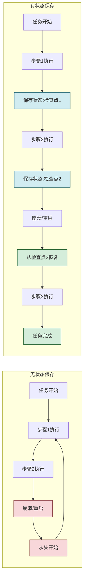

### 1.2 为什么需要状态保存

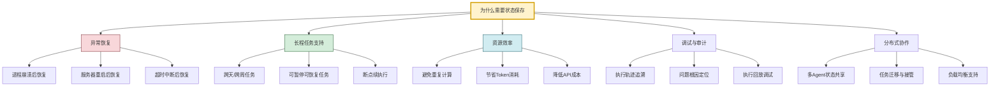

| 需求场景 | 无状态保存的后果 | 有状态保存的收益 |
|---------|----------------|----------------|
| **进程崩溃** | 任务从头开始,已完成工作丢失 | 从最近检查点恢复,损失最小化 |
| **服务器重启** | 所有进行中任务失败 | 重启后自动恢复执行 |
| **长程任务** | 必须一次执行完成,不可中断 | 可暂停可恢复,灵活调度 |
| **重复计算** | 相同步骤反复执行 | 跳过已完成步骤,节省成本 |
| **问题排查** | 只有日志,无法重现执行状态 | 可加载历史状态进行回放调试 |
| **任务迁移** | 无法将任务转移到其他节点 | 状态序列化后可在任意节点恢复 |

### 1.3 状态保存在 Agent 架构中的位置

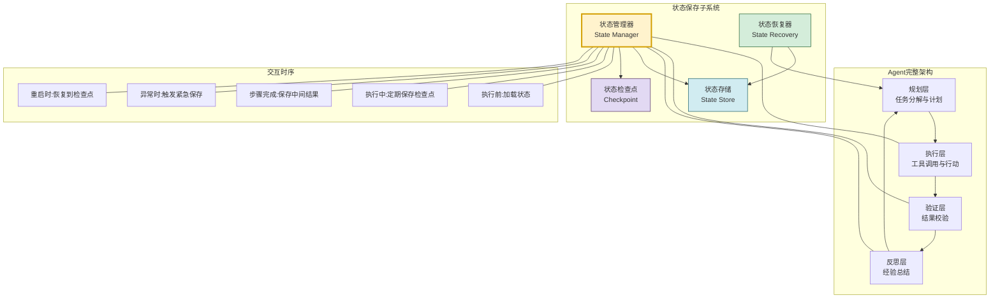

状态保存子系统贯穿 Agent 执行的全生命周期:
- **执行前**:从存储中加载历史状态,恢复执行上下文
- **执行中**:按照检查点策略定期保存状态快照
- **步骤完成时**:保存中间结果和进度信息
- **异常发生时**:触发紧急状态保存,最大限度保留进度
- **重启恢复时**:从最近的有效检查点恢复执行

### 1.4 状态保存 vs 简单日志记录

| 维度 | 简单日志记录 | 状态保存机制 |
|------|------------|------------|
| **目的** | 记录发生了什么(可读) | 保存执行到哪了(可恢复) |
| **数据结构** | 非结构化文本 | 结构化数据模型 |
| **可恢复性** | 不可恢复,仅人工阅读 | 可程序化恢复执行 |
| **完整性** | 可选记录,可能遗漏 | 完整状态,无遗漏 |
| **一致性** | 无一致性保证 | 事务性保证 |
| **查询能力** | 文本搜索 | 结构化查询 |
| **性能影响** | 极小(追加写) | 中等(序列化+持久化) |
| **适用场景** | 调试、审计 | 容错、恢复、断点续执行 |

**核心区别**:日志是给人看的"历史记录",状态保存是给机器用的"存档点"。两者互补而非替代,成熟的 Agent 系统同时具备两者。

---

## 二、状态数据的类型与结构

### 2.1 状态数据分类体系

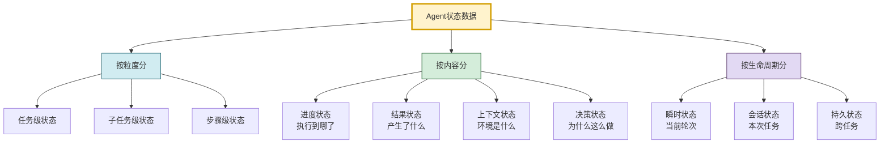

### 2.2 任务执行状态

任务级状态记录整个任务的宏观执行情况,是最高层的状态抽象。

```python
from dataclasses import dataclass, field
from typing import Any, Optional
from enum import Enum
import time
import uuid


class TaskStatus(Enum):
    """任务状态枚举"""
    PENDING = "pending"           # 待执行
    RUNNING = "running"           # 执行中
    PAUSED = "paused"             # 已暂停
    COMPLETED = "completed"       # 已完成
    FAILED = "failed"             # 已失败
    CANCELLED = "cancelled"       # 已取消
    WAITING_INPUT = "waiting_input"  # 等待用户输入


@dataclass
class TaskExecutionState:
    """任务执行状态(任务级)"""
    # 基本标识
    task_id: str = field(default_factory=lambda: str(uuid.uuid4()))
    parent_task_id: Optional[str] = None   # 父任务ID(支持任务嵌套)

    # 任务描述
    task_description: str = ""
    task_type: str = ""                     # 任务类型
    priority: int = 5                       # 优先级(1-10)

    # 执行进度
    status: TaskStatus = TaskStatus.PENDING
    total_subtasks: int = 0                 # 子任务总数
    completed_subtasks: int = 0             # 已完成子任务数
    current_subtask_id: Optional[str] = None  # 当前执行的子任务ID
    progress_percentage: float = 0.0        # 进度百分比

    # 时间信息
    created_at: float = field(default_factory=time.time)
    started_at: Optional[float] = None
    last_updated_at: float = field(default_factory=time.time)
    completed_at: Optional[float] = None
    estimated_remaining_seconds: float = 0.0

    # 执行计划
    execution_plan: list[dict] = field(default_factory=list)    # 执行计划(子任务序列)
    plan_version: int = 1                                       # 计划版本(支持计划调整)

    # 执行上下文
    agent_id: str = ""                      # 执行Agent ID
    user_id: str = ""                       # 用户ID
    session_id: str = ""                    # 会话ID

    # 结果与错误
    final_result: Any = None                # 最终结果
    error_info: Optional[dict] = None       # 错误信息
    retry_count: int = 0                    # 重试次数

    # 检查点引用
    last_checkpoint_id: Optional[str] = None  # 最后检查点ID

    # 元数据
    metadata: dict = field(default_factory=dict)

    def update_progress(self):
        """更新进度百分比"""
        if self.total_subtasks > 0:
            self.progress_percentage = round(
                self.completed_subtasks / self.total_subtasks * 100, 2
            )
        self.last_updated_at = time.time()

    def to_dict(self) -> dict:
        return {
            "task_id": self.task_id,
            "parent_task_id": self.parent_task_id,
            "task_description": self.task_description,
            "task_type": self.task_type,
            "priority": self.priority,
            "status": self.status.value,
            "total_subtasks": self.total_subtasks,
            "completed_subtasks": self.completed_subtasks,
            "current_subtask_id": self.current_subtask_id,
            "progress_percentage": self.progress_percentage,
            "created_at": self.created_at,
            "started_at": self.started_at,
            "last_updated_at": self.last_updated_at,
            "completed_at": self.completed_at,
            "execution_plan": self.execution_plan,
            "plan_version": self.plan_version,
            "agent_id": self.agent_id,
            "user_id": self.user_id,
            "session_id": self.session_id,
            "final_result": self.final_result,
            "error_info": self.error_info,
            "retry_count": self.retry_count,
            "last_checkpoint_id": self.last_checkpoint_id,
            "metadata": self.metadata
        }
```

### 2.3 子任务执行状态

子任务级状态记录每个子任务的具体执行细节,是断点续执行的核心依据。

```python
class SubtaskStatus(Enum):
    """子任务状态"""
    NOT_STARTED = "not_started"
    IN_PROGRESS = "in_progress"
    AWAITING_TOOL = "awaiting_tool"        # 等待工具返回
    AWAITING_LLM = "awaiting_llm"          # 等待LLM推理
    COMPLETED = "completed"
    FAILED = "failed"
    SKIPPED = "skipped"                    # 被跳过(条件不满足)
    BLOCKED = "blocked"                    # 被阻塞(依赖未完成)


@dataclass
class SubtaskExecutionState:
    """子任务执行状态"""
    # 标识
    subtask_id: str = field(default_factory=lambda: str(uuid.uuid4()))
    task_id: str = ""                      # 所属任务ID
    parent_subtask_id: Optional[str] = None  # 父子任务ID

    # 描述
    subtask_description: str = ""
    subtask_type: str = ""                 # 子任务类型
    sequence_order: int = 0                # 执行顺序

    # 执行状态
    status: SubtaskStatus = SubtaskStatus.NOT_STARTED
    attempt_count: int = 0                 # 尝试次数

    # 工具调用信息
    tool_calls: list[dict] = field(default_factory=list)  # 工具调用历史
    current_tool_call: Optional[dict] = None               # 当前工具调用
    tool_call_index: int = 0                               # 当前工具调用索引

    # 输入输出
    input_data: Any = None                 # 输入数据
    intermediate_results: list[Any] = field(default_factory=list)  # 中间结果
    output_result: Any = None              # 最终输出

    # 依赖关系
    dependencies: list[str] = field(default_factory=list)  # 依赖的子任务ID
    dependents: list[str] = field(default_factory=list)    # 依赖于本子任务的ID

    # 条件与分支
    condition: Optional[str] = None        # 执行条件
    branch_taken: Optional[str] = None     # 已选择的分支

    # 时间
    started_at: Optional[float] = None
    completed_at: Optional[float] = None
    timeout_seconds: float = 300.0         # 超时时间

    # 错误
    last_error: Optional[dict] = None      # 最后错误信息

    # LLM推理上下文
    llm_context: list[dict] = field(default_factory=list)  # LLM对话上下文
    reasoning_trace: list[str] = field(default_factory=list)  # 推理轨迹

    def is_resumable(self) -> bool:
        """判断子任务是否可恢复执行"""
        return self.status in [
            SubtaskStatus.IN_PROGRESS,
            SubtaskStatus.AWAITING_TOOL,
            SubtaskStatus.AWAITING_LLM,
            SubtaskStatus.NOT_STARTED
        ]

    def get_resume_point(self) -> dict:
        """获取恢复点信息"""
        return {
            "subtask_id": self.subtask_id,
            "status": self.status.value,
            "tool_call_index": self.tool_call_index,
            "intermediate_count": len(self.intermediate_results),
            "last_error": self.last_error
        }
```

### 2.4 中间结果数据

中间结果是执行过程中产生的数据,是状态保存中**体积最大**的部分,需要特殊管理。

```python
@dataclass
class IntermediateResult:
    """中间结果数据"""
    result_id: str = field(default_factory=lambda: str(uuid.uuid4()))
    subtask_id: str = ""                   # 产生该结果的子任务
    task_id: str = ""                      # 所属任务

    # 结果内容
    result_type: str = ""                  # 结果类型(text/json/binary/reference)
    content: Any = None                    # 结果内容
    content_hash: str = ""                 # 内容哈希(用于去重)

    # 来源
    source: str = ""                       # 来源(tool_name/llm/computed)
    tool_call_id: Optional[str] = None     # 对应的工具调用ID

    # 大小与存储
    size_bytes: int = 0                    # 数据大小
    storage_location: str = "inline"       # 存储位置(inline/external)
    external_ref: Optional[str] = None     # 外部存储引用(如文件路径)

    # 时间
    created_at: float = field(default_factory=time.time)

    # 依赖标记
    consumed_by: list[str] = field(default_factory=list)  # 被哪些后续步骤使用
    is_cached: bool = False                # 是否为缓存结果


class IntermediateResultManager:
    """中间结果管理器"""

    INLINE_THRESHOLD = 4096  # 4KB以下内联存储,否则外部存储

    def __init__(self, external_storage=None):
        self.results: dict[str, IntermediateResult] = {}
        self.external_storage = external_storage  # 外部存储(文件系统/对象存储)
        self.task_results: dict[str, list[str]] = {}  # task_id -> result_ids

    def store(self, task_id: str, subtask_id: str,
              content: Any, result_type: str = "json",
              source: str = "tool") -> str:
        """存储中间结果"""
        import hashlib
        import json

        # 计算大小和哈希
        content_str = json.dumps(content, ensure_ascii=False) if not isinstance(content, str) else content
        size = len(content_str.encode('utf-8'))
        content_hash = hashlib.md5(content_str.encode('utf-8')).hexdigest()

        result = IntermediateResult(
            task_id=task_id,
            subtask_id=subtask_id,
            result_type=result_type,
            content=content,
            content_hash=content_hash,
            source=source,
            size_bytes=size
        )

        # 大数据外部存储
        if size > self.INLINE_THRESHOLD and self.external_storage:
            ext_path = self.external_storage.store(content_str, content_hash)
            result.storage_location = "external"
            result.external_ref = ext_path
            result.content = None  # 内联内容清空
        else:
            result.storage_location = "inline"

        self.results[result.result_id] = result
        if task_id not in self.task_results:
            self.task_results[task_id] = []
        self.task_results[task_id].append(result.result_id)

        return result.result_id

    def retrieve(self, result_id: str) -> Any:
        """检索中间结果"""
        result = self.results.get(result_id)
        if not result:
            return None

        if result.storage_location == "inline":
            return result.content
        elif result.storage_location == "external" and self.external_storage:
            return self.external_storage.retrieve(result.external_ref)
        return None

    def get_task_results(self, task_id: str) -> list[IntermediateResult]:
        """获取任务的所有中间结果"""
        result_ids = self.task_results.get(task_id, [])
        return [self.results[rid] for rid in result_ids]

    def cleanup_task(self, task_id: str, keep_final: bool = True):
        """清理任务的中间结果(释放空间)"""
        result_ids = self.task_results.get(task_id, [])
        for rid in result_ids:
            result = self.results.get(rid)
            if result and result.external_ref and self.external_storage:
                self.external_storage.delete(result.external_ref)
            del self.results[rid]
        self.task_results[task_id] = []
```

### 2.5 上下文与环境状态

上下文状态记录 Agent 执行时的环境信息,恢复时需要重建这些环境。

```python
@dataclass
class ContextEnvironmentState:
    """上下文与环境状态"""
    # Agent状态
    agent_id: str = ""
    agent_role: str = ""                   # Agent角色设定
    agent_capabilities: list[str] = field(default_factory=list)  # 能力列表

    # 可用工具
    available_tools: list[dict] = field(default_factory=list)  # 可用工具列表
    tool_configs: dict = field(default_factory=dict)           # 工具配置

    # LLM配置
    llm_model: str = ""                    # 使用的模型
    llm_params: dict = field(default_factory=dict)  # 温度、top_p等参数
    system_prompt: str = ""                # 系统提示词

    # 对话上下文
    conversation_history: list[dict] = field(default_factory=list)  # 对话历史
    context_window_used: int = 0           # 已用上下文窗口大小

    # 用户信息
    user_id: str = ""
    user_preferences: dict = field(default_factory=dict)  # 用户偏好

    # 记忆引用
    memory_refs: list[str] = field(default_factory=list)  # 相关记忆条目ID
    retrieved_knowledge: list[dict] = field(default_factory=list)  # 检索到的知识

    # 执行环境
    execution_env: str = ""                # 执行环境(local/cloud)
    resource_limits: dict = field(default_factory=dict)  # 资源限制
    timezone: str = "UTC"                  # 时区

    # 会话信息
    session_id: str = ""
    session_start_time: float = field(default_factory=time.time)

    def to_snapshot(self) -> dict:
        """生成环境快照"""
        return {
            "agent_id": self.agent_id,
            "agent_role": self.agent_role,
            "available_tools": [t.get("name") for t in self.available_tools],
            "llm_model": self.llm_model,
            "llm_params": self.llm_params,
            "system_prompt": self.system_prompt,
            "conversation_history_length": len(self.conversation_history),
            "context_window_used": self.context_window_used,
            "user_id": self.user_id,
            "session_id": self.session_id,
            "memory_refs": self.memory_refs,
            "execution_env": self.execution_env,
            "snapshot_time": time.time()
        }
```

### 2.6 完整状态数据模型

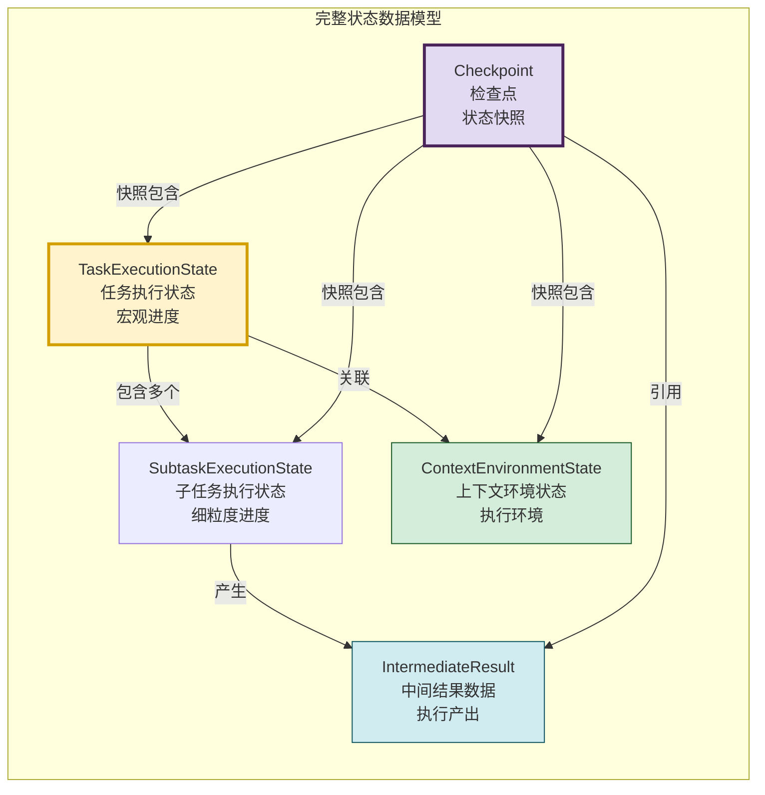

```python
@dataclass
class Checkpoint:
    """检查点:某一时刻的完整状态快照"""
    checkpoint_id: str = field(default_factory=lambda: str(uuid.uuid4()))
    task_id: str = ""

    # 快照类型
    checkpoint_type: str = "scheduled"  # scheduled/manual/emergency/pre-step/post-step

    # 状态快照
    task_state: Optional[dict] = None
    subtask_states: list[dict] = field(default_factory=list)
    context_state: Optional[dict] = None

    # 中间结果引用(不内联大对象,仅引用)
    result_refs: list[str] = field(default_factory=list)

    # 元信息
    created_at: float = field(default_factory=time.time)
    state_version: str = "1.0"             # 状态格式版本(支持迁移)
    size_bytes: int = 0                    # 快照大小
    checksum: str = ""                     # 校验和(验证完整性)

    # 恢复信息
    is_valid: bool = True                  # 是否有效(可能被标记为损坏)
    recovery_count: int = 0                # 被恢复次数

    def compute_checksum(self) -> str:
        """计算校验和"""
        import hashlib
        import json
        content = json.dumps({
            "task_state": self.task_state,
            "subtask_states": self.subtask_states,
            "context_state": self.context_state
        }, sort_keys=True)
        self.checksum = hashlib.md5(content.encode()).hexdigest()
        self.size_bytes = len(content.encode())
        return self.checksum

    def verify_integrity(self) -> bool:
        """验证检查点完整性"""
        return self.compute_checksum() == self.checksum
```

---

## 三、存储位置与分层存储策略

### 3.1 分层存储架构

不同类型的状态数据具有不同的访问模式和持久性要求,采用分层存储策略可以平衡性能与可靠性。

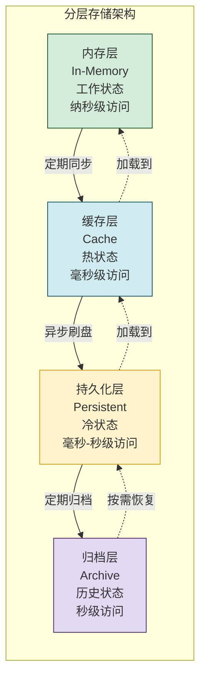

### 3.2 内存层:工作状态

内存层存储 Agent 当前正在使用的活跃状态,访问速度最快但易失。

```python
class InMemoryStateStore:
    """内存状态存储(工作状态)"""

    def __init__(self):
        self.task_states: dict[str, TaskExecutionState] = {}
        self.subtask_states: dict[str, SubtaskExecutionState] = {}
        self.context_states: dict[str, ContextEnvironmentState] = {}  # by task_id
        self.active_checkpoints: dict[str, Checkpoint] = {}           # by task_id
        self._locks: dict[str, threading.Lock] = {}                   # per-task锁

    def get_lock(self, task_id: str) -> threading.Lock:
        """获取任务级锁"""
        if task_id not in self._locks:
            self._locks[task_id] = threading.Lock()
        return self._locks[task_id]

    def save_task_state(self, state: TaskExecutionState):
        """保存任务状态到内存"""
        with self.get_lock(state.task_id):
            self.task_states[state.task_id] = state

    def get_task_state(self, task_id: str) -> Optional[TaskExecutionState]:
        """从内存获取任务状态"""
        return self.task_states.get(task_id)

    def save_subtask_state(self, state: SubtaskExecutionState):
        """保存子任务状态"""
        with self.get_lock(state.task_id):
            self.subtask_states[state.subtask_id] = state

    def get_subtask_states(self, task_id: str) -> list[SubtaskExecutionState]:
        """获取任务的所有子任务状态"""
        return [s for s in self.subtask_states.values() if s.task_id == task_id]

    def evict_completed(self, max_retained: int = 100):
        """驱逐已完成的任务状态(释放内存)"""
        completed_ids = [
            tid for tid, state in self.task_states.items()
            if state.status in [TaskStatus.COMPLETED, TaskStatus.FAILED, TaskStatus.CANCELLED]
        ]
        # 保留最近的max_retained个已完成任务
        if len(completed_ids) > max_retained:
            completed_ids.sort(
                key=lambda tid: self.task_states[tid].completed_at or 0
            )
            for tid in completed_ids[:-max_retained]:
                del self.task_states[tid]
                # 清理关联的子任务状态
                self.subtask_states = {
                    sid: s for sid, s in self.subtask_states.items()
                    if s.task_id != tid
                }
```

### 3.3 缓存层:热状态

缓存层存储频繁访问但不需要持久化的状态,使用 Redis 等内存数据库实现。

```python
class CacheStateStore:
    """缓存状态存储(热状态)"""

    def __init__(self, redis_client, default_ttl: int = 3600):
        self.redis = redis_client
        self.default_ttl = default_ttl  # 默认过期时间(秒)

    def save_checkpoint(self, checkpoint: Checkpoint, ttl: int = None):
        """保存检查点到缓存"""
        import json
        key = f"checkpoint:{checkpoint.task_id}:{checkpoint.checkpoint_id}"
        data = json.dumps(checkpoint.__dict__, default=str)
        self.redis.setex(key, ttl or self.default_ttl, data)

    def get_latest_checkpoint(self, task_id: str) -> Optional[Checkpoint]:
        """获取任务最新的缓存检查点"""
        pattern = f"checkpoint:{task_id}:*"
        keys = self.redis.keys(pattern)
        if not keys:
            return None

        # 按创建时间找最新的
        latest_key = max(keys, key=lambda k: self.redis.hget(k, "created_at") or 0)
        import json
        data = self.redis.get(latest_key)
        if data:
            return Checkpoint(**json.loads(data))
        return None

    def save_task_state(self, task_id: str, state_dict: dict, ttl: int = None):
        """保存任务状态到缓存"""
        import json
        key = f"task_state:{task_id}"
        self.redis.setex(key, ttl or self.default_ttl, json.dumps(state_dict))

    def get_task_state(self, task_id: str) -> Optional[dict]:
        """从缓存获取任务状态"""
        import json
        key = f"task_state:{task_id}"
        data = self.redis.get(key)
        return json.loads(data) if data else None

    def invalidate(self, task_id: str):
        """使任务相关缓存失效"""
        patterns = [f"checkpoint:{task_id}:*", f"task_state:{task_id}"]
        for pattern in patterns:
            keys = self.redis.keys(pattern)
            if keys:
                self.redis.delete(*keys)
```

### 3.4 持久化层:冷状态

持久化层存储需要长期保留的状态,使用文件系统或数据库实现。

```python
class PersistentStateStore:
    """持久化状态存储(冷状态)"""

    def __init__(self, db_connection):
        self.db = db_connection
        self._init_schema()

    def _init_schema(self):
        """初始化数据库表结构"""
        self.db.execute("""
            CREATE TABLE IF NOT EXISTS task_states (
                task_id TEXT PRIMARY KEY,
                state_data TEXT NOT NULL,
                created_at REAL NOT NULL,
                updated_at REAL NOT NULL,
                status TEXT NOT NULL,
                checksum TEXT NOT NULL
            )
        """)
        self.db.execute("""
            CREATE TABLE IF NOT EXISTS checkpoints (
                checkpoint_id TEXT PRIMARY KEY,
                task_id TEXT NOT NULL,
                checkpoint_data TEXT NOT NULL,
                checkpoint_type TEXT NOT NULL,
                created_at REAL NOT NULL,
                checksum TEXT NOT NULL,
                is_valid INTEGER DEFAULT 1,
                FOREIGN KEY (task_id) REFERENCES task_states(task_id)
            )
        """)
        self.db.execute("""
            CREATE TABLE IF NOT EXISTS intermediate_results (
                result_id TEXT PRIMARY KEY,
                task_id TEXT NOT NULL,
                subtask_id TEXT NOT NULL,
                content TEXT,
                external_ref TEXT,
                content_hash TEXT,
                size_bytes INTEGER,
                created_at REAL NOT NULL
            )
        """)
        self.db.execute("""
            CREATE INDEX IF NOT EXISTS idx_checkpoints_task
            ON checkpoints(task_id, created_at DESC)
        """)
        self.db.commit()

    def save_state(self, task_id: str, state_data: dict,
                   status: str) -> bool:
        """持久化保存状态"""
        import json
        import hashlib

        data_str = json.dumps(state_data, ensure_ascii=False, default=str)
        checksum = hashlib.md5(data_str.encode()).hexdigest()
        now = time.time()

        try:
            self.db.execute("""
                INSERT OR REPLACE INTO task_states
                (task_id, state_data, created_at, updated_at, status, checksum)
                VALUES (?, ?, ?, ?, ?, ?)
            """, (task_id, data_str, state_data.get("created_at", now),
                  now, status, checksum))
            self.db.commit()
            return True
        except Exception as e:
            self.db.rollback()
            return False

    def load_state(self, task_id: str) -> Optional[dict]:
        """加载持久化的状态"""
        import json
        cursor = self.db.execute(
            "SELECT state_data, checksum FROM task_states WHERE task_id = ?",
            (task_id,)
        )
        row = cursor.fetchone()
        if not row:
            return None

        data_str, stored_checksum = row
        # 验证完整性
        actual_checksum = hashlib.md5(data_str.encode()).hexdigest()
        if actual_checksum != stored_checksum:
            raise ValueError(f"状态数据校验失败: task_id={task_id}")

        return json.loads(data_str)

    def save_checkpoint(self, checkpoint: Checkpoint) -> bool:
        """保存检查点"""
        import json
        data_str = json.dumps(checkpoint.__dict__, default=str)
        try:
            self.db.execute("""
                INSERT OR REPLACE INTO checkpoints
                (checkpoint_id, task_id, checkpoint_data, checkpoint_type,
                 created_at, checksum, is_valid)
                VALUES (?, ?, ?, ?, ?, ?, ?)
            """, (checkpoint.checkpoint_id, checkpoint.task_id, data_str,
                  checkpoint.checkpoint_type, checkpoint.created_at,
                  checkpoint.checksum, 1 if checkpoint.is_valid else 0))
            self.db.commit()
            return True
        except Exception:
            self.db.rollback()
            return False

    def get_latest_checkpoint(self, task_id: str) -> Optional[Checkpoint]:
        """获取最新的有效检查点"""
        import json
        cursor = self.db.execute("""
            SELECT checkpoint_data FROM checkpoints
            WHERE task_id = ? AND is_valid = 1
            ORDER BY created_at DESC LIMIT 1
        """, (task_id,))
        row = cursor.fetchone()
        if row:
            return Checkpoint(**json.loads(row[0]))
        return None

    def get_checkpoints(self, task_id: str, limit: int = 10) -> list[Checkpoint]:
        """获取任务的检查点列表"""
        import json
        cursor = self.db.execute("""
            SELECT checkpoint_data FROM checkpoints
            WHERE task_id = ? AND is_valid = 1
            ORDER BY created_at DESC LIMIT ?
        """, (task_id, limit))
        return [Checkpoint(**json.loads(row[0])) for row in cursor.fetchall()]

    def cleanup_old_checkpoints(self, task_id: str, keep_count: int = 5):
        """清理旧检查点,只保留最近的N个"""
        cursor = self.db.execute("""
            SELECT checkpoint_id FROM checkpoints
            WHERE task_id = ? AND is_valid = 1
            ORDER BY created_at DESC
        """, (task_id,))
        all_ids = [row[0] for row in cursor.fetchall()]
        if len(all_ids) > keep_count:
            old_ids = all_ids[keep_count:]
            placeholders = ",".join("?" * len(old_ids))
            self.db.execute(
                f"DELETE FROM checkpoints WHERE checkpoint_id IN ({placeholders})",
                old_ids
            )
            self.db.commit()
```

### 3.5 存储方案对比

| 存储层 | 技术 | 访问速度 | 持久性 | 容量 | 成本 | 适用场景 |
|--------|------|---------|--------|------|------|---------|
| **内存层** | Python dict/对象 | 纳秒级 | 进程内 | 受限于RAM | 低 | 当前活跃任务的工作状态 |
| **缓存层** | Redis/Memcached | 毫秒级 | 短期(TTL) | 大 | 中 | 频繁访问的热状态、最近检查点 |
| **持久化层** | SQLite/PostgreSQL | 毫秒-秒级 | 永久 | 大 | 中 | 需要长期保留的完整状态 |
| **归档层** | 文件系统/对象存储 | 秒级 | 永久 | 极大 | 低 | 历史任务归档、大数据中间结果 |

---

## 四、更新频率与时机策略

### 4.1 更新时机分类

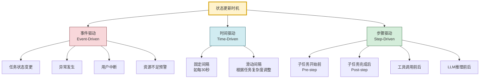

### 4.2 检查点(Checkpoint)策略

检查点是状态保存的核心机制,在关键节点创建完整的状态快照。


```python
class CheckpointStrategy:
    """检查点策略"""

    def __init__(self):
        self.strategies = {
            "pre_step": False,       # 每步开始前
            "post_step": True,       # 每步完成后(推荐)
            "scheduled": True,       # 定时检查点
            "emergency": True,       # 紧急检查点
            "manual": True,          # 手动触发
        }
        self.scheduled_interval = 30  # 定时检查点间隔(秒)
        self.max_checkpoints = 10     # 最大保留检查点数

    def should_checkpoint(self, event_type: str,
                          context: dict = None) -> bool:
        """判断是否应该创建检查点"""
        context = context or {}

        # 紧急检查点:总是执行
        if event_type == "emergency":
            return self.strategies["emergency"]

        # 手动检查点:总是执行
        if event_type == "manual":
            return self.strategies["manual"]

        # 步骤后检查点
        if event_type == "post_step" and self.strategies["post_step"]:
            return True

        # 步骤前检查点
        if event_type == "pre_step" and self.strategies["pre_step"]:
            return True

        # 定时检查点
        if event_type == "scheduled" and self.strategies["scheduled"]:
            last_checkpoint_time = context.get("last_checkpoint_time", 0)
            if time.time() - last_checkpoint_time >= self.scheduled_interval:
                return True

        return False

    def get_checkpoint_type(self, event_type: str) -> str:
        """获取检查点类型"""
        type_map = {
            "pre_step": "pre-step",
            "post_step": "post-step",
            "scheduled": "scheduled",
            "emergency": "emergency",
            "manual": "manual"
        }
        return type_map.get(event_type, "scheduled")


class CheckpointManager:
    """检查点管理器"""

    def __init__(self, persistent_store: PersistentStateStore,
                 cache_store: CacheStateStore = None,
                 strategy: CheckpointStrategy = None):
        self.persistent = persistent_store
        self.cache = cache_store
        self.strategy = strategy or CheckpointStrategy()
        self.last_checkpoint_time: dict[str, float] = {}  # task_id -> time

    def create_checkpoint(self, task_state: TaskExecutionState,
                          subtask_states: list[SubtaskExecutionState],
                          context_state: ContextEnvironmentState,
                          result_refs: list[str],
                          event_type: str = "post_step") -> Optional[Checkpoint]:
        """创建检查点"""
        # 检查是否应该创建
        context = {
            "last_checkpoint_time": self.last_checkpoint_time.get(
                task_state.task_id, 0
            )
        }
        if not self.strategy.should_checkpoint(event_type, context):
            return None

        # 创建检查点
        checkpoint = Checkpoint(
            task_id=task_state.task_id,
            checkpoint_type=self.strategy.get_checkpoint_type(event_type),
            task_state=task_state.to_dict(),
            subtask_states=[s.__dict__ for s in subtask_states],
            context_state=context_state.to_snapshot() if context_state else None,
            result_refs=result_refs
        )

        # 计算校验和
        checkpoint.compute_checksum()

        # 保存到持久化层
        if not self.persistent.save_checkpoint(checkpoint):
            return None

        # 同时保存到缓存(加速恢复)
        if self.cache:
            self.cache.save_checkpoint(checkpoint, ttl=3600)

        # 更新最后检查点时间
        self.last_checkpoint_time[task_state.task_id] = time.time()

        # 清理旧检查点
        self.persistent.cleanup_old_checkpoints(
            task_state.task_id, self.strategy.max_checkpoints
        )

        # 更新任务状态中的检查点引用
        task_state.last_checkpoint_id = checkpoint.checkpoint_id

        return checkpoint

    def get_latest_checkpoint(self, task_id: str) -> Optional[Checkpoint]:
        """获取最新的有效检查点"""
        # 先查缓存
        if self.cache:
            cached = self.cache.get_latest_checkpoint(task_id)
            if cached and cached.verify_integrity():
                return cached

        # 再查持久化层
        return self.persistent.get_latest_checkpoint(task_id)

    def create_emergency_checkpoint(self, task_state: TaskExecutionState,
                                      subtask_states: list[SubtaskExecutionState],
                                      context_state: ContextEnvironmentState,
                                      result_refs: list[str]) -> Optional[Checkpoint]:
        """创建紧急检查点(异常时调用)"""
        return self.create_checkpoint(
            task_state, subtask_states, context_state,
            result_refs, event_type="emergency"
        )
```

### 4.3 事件驱动更新

```python
from enum import Enum


class StateEvent(Enum):
    """状态变更事件"""
    TASK_STARTED = "task_started"
    TASK_PAUSED = "task_paused"
    TASK_RESUMED = "task_resumed"
    TASK_COMPLETED = "task_completed"
    TASK_FAILED = "task_failed"
    SUBTASK_STARTED = "subtask_started"
    SUBTASK_COMPLETED = "subtask_completed"
    SUBTASK_FAILED = "subtask_failed"
    TOOL_CALL_START = "tool_call_start"
    TOOL_CALL_END = "tool_call_end"
    LLM_CALL_START = "llm_call_start"
    LLM_CALL_END = "llm_call_end"
    PLAN_UPDATED = "plan_updated"
    ERROR_OCCURRED = "error_occurred"
    USER_INTERRUPT = "user_interrupt"
    RESOURCE_WARNING = "resource_warning"


class EventDrivenStateUpdater:
    """事件驱动的状态更新器"""

    def __init__(self, checkpoint_manager: CheckpointManager,
                 in_memory_store: InMemoryStateStore):
        self.checkpoint_mgr = checkpoint_manager
        self.memory = in_memory_store
        self.event_handlers: dict[StateEvent, callable] = {}
        self._register_handlers()

    def _register_handlers(self):
        """注册事件处理器"""
        self.event_handlers = {
            StateEvent.TASK_STARTED: self._handle_task_started,
            StateEvent.SUBTASK_STARTED: self._handle_subtask_started,
            StateEvent.SUBTASK_COMPLETED: self._handle_subtask_completed,
            StateEvent.SUBTASK_FAILED: self._handle_subtask_failed,
            StateEvent.TOOL_CALL_END: self._handle_tool_call_end,
            StateEvent.ERROR_OCCURRED: self._handle_error,
            StateEvent.USER_INTERRUPT: self._handle_interrupt,
        }

    def handle_event(self, event: StateEvent, **kwargs):
        """处理状态变更事件"""
        handler = self.event_handlers.get(event)
        if handler:
            handler(**kwargs)

    def _handle_task_started(self, task_state: TaskExecutionState, **kwargs):
        """任务开始"""
        task_state.status = TaskStatus.RUNNING
        task_state.started_at = time.time()
        self.memory.save_task_state(task_state)
        self._create_checkpoint(task_state, "pre_step")

    def _handle_subtask_started(self, task_state: TaskExecutionState,
                                 subtask_state: SubtaskExecutionState, **kwargs):
        """子任务开始"""
        subtask_state.status = SubtaskStatus.IN_PROGRESS
        subtask_state.started_at = time.time()
        task_state.current_subtask_id = subtask_state.subtask_id
        self.memory.save_subtask_state(subtask_state)
        self.memory.save_task_state(task_state)

    def _handle_subtask_completed(self, task_state: TaskExecutionState,
                                    subtask_state: SubtaskExecutionState, **kwargs):
        """子任务完成"""
        subtask_state.status = SubtaskStatus.COMPLETED
        subtask_state.completed_at = time.time()
        task_state.completed_subtasks += 1
        task_state.update_progress()
        self.memory.save_subtask_state(subtask_state)
        self.memory.save_task_state(task_state)
        # 步骤完成后创建检查点
        self._create_checkpoint(task_state, "post_step")

    def _handle_subtask_failed(self, task_state: TaskExecutionState,
                                subtask_state: SubtaskExecutionState,
                                error: dict, **kwargs):
        """子任务失败"""
        subtask_state.status = SubtaskStatus.FAILED
        subtask_state.last_error = error
        self.memory.save_subtask_state(subtask_state)
        self.memory.save_task_state(task_state)
        # 失败时创建紧急检查点
        self._create_checkpoint(task_state, "emergency")

    def _handle_tool_call_end(self, task_state: TaskExecutionState,
                               subtask_state: SubtaskExecutionState,
                               tool_result: dict, **kwargs):
        """工具调用结束"""
        subtask_state.tool_calls.append(tool_result)
        subtask_state.tool_call_index += 1
        self.memory.save_subtask_state(subtask_state)

    def _handle_error(self, task_state: TaskExecutionState,
                      subtask_states: list, error: dict, **kwargs):
        """错误发生"""
        task_state.error_info = error
        self.memory.save_task_state(task_state)
        self._create_checkpoint(task_state, "emergency")

    def _handle_interrupt(self, task_state: TaskExecutionState,
                          subtask_states: list, **kwargs):
        """用户中断"""
        task_state.status = TaskStatus.PAUSED
        self.memory.save_task_state(task_state)
        self._create_checkpoint(task_state, "emergency")

    def _create_checkpoint(self, task_state: TaskExecutionState,
                           event_type: str):
        """创建检查点"""
        subtask_states = self.memory.get_subtask_states(task_state.task_id)
        self.checkpoint_mgr.create_checkpoint(
            task_state=task_state,
            subtask_states=subtask_states,
            context_state=None,  # 从上下文管理器获取
            result_refs=[],
            event_type=event_type
        )
```

### 4.4 时间驱动更新

```python
import threading


class ScheduledCheckpointThread:
    """定时检查点线程"""

    def __init__(self, checkpoint_manager: CheckpointManager,
                 in_memory_store: InMemoryStateStore,
                 interval: int = 30):
        self.checkpoint_mgr = checkpoint_manager
        self.memory = in_memory_store
        self.interval = interval
        self._running = False
        self._thread = None

    def start(self):
        """启动定时检查点"""
        self._running = True
        self._thread = threading.Thread(target=self._run, daemon=True)
        self._thread.start()

    def stop(self):
        """停止定时检查点"""
        self._running = False
        if self._thread:
            self._thread.join(timeout=5)

    def _run(self):
        """定时执行检查点"""
        while self._running:
            time.sleep(self.interval)
            # 为所有运行中的任务创建检查点
            for task_id, task_state in self.memory.task_states.items():
                if task_state.status == TaskStatus.RUNNING:
                    try:
                        subtask_states = self.memory.get_subtask_states(task_id)
                        self.checkpoint_mgr.create_checkpoint(
                            task_state=task_state,
                            subtask_states=subtask_states,
                            context_state=None,
                            result_refs=[],
                            event_type="scheduled"
                        )
                    except Exception as e:
                        # 定时检查点失败不影响主流程
                        print(f"定时检查点失败 task={task_id}: {e}")
```

### 4.5 更新频率权衡

| 更新频率 | 优点 | 缺点 | 适用场景 |
|---------|------|------|---------|
| **每步更新(post_step)** | 恢复时损失最小(最多重执行1步) | I/O频繁,性能影响大 | 关键任务、步骤耗时长 |
| **定时更新(30s)** | 性能影响可控 | 最多丢失30秒的进度 | 一般任务、步骤耗时短 |
| **事件驱动更新** | 仅在状态变更时保存,效率高 | 可能遗漏中间状态 | 大多数场景的推荐方案 |
| **仅紧急更新** | 性能影响最小 | 恢复时可能丢失大量进度 | 非关键任务、可重执行 |
| **混合策略** ⭐ | 兼顾性能与可靠性 | 实现复杂 | 生产环境推荐 |

**推荐混合策略**:事件驱动(状态变更)+ 步骤后检查点(关键节点)+ 定时检查点(兜底保障)+ 紧急检查点(异常保护)。

---

## 五、持久化方式实现

### 5.1 持久化方式对比

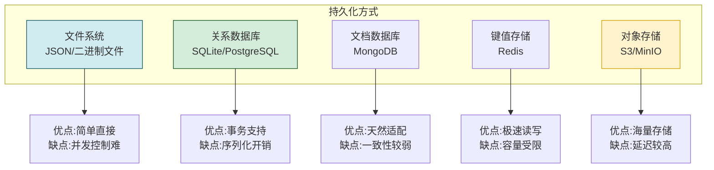

| 持久化方式 | 性能 | 可靠性 | 并发支持 | 查询能力 | 复杂度 | 推荐场景 |
|-----------|------|--------|---------|---------|--------|---------|
| **JSON文件** | 中 | 中 | 弱 | 无 | 低 | 单机、简单场景 |
| **SQLite** | 高 | 高 | 中 | SQL | 低 | 单机、中小规模 ⭐ |
| **PostgreSQL** | 高 | 极高 | 强 | SQL | 中 | 分布式、大规模 |
| **MongoDB** | 高 | 高 | 中 | 文档查询 | 中 | 文档型状态 |
| **Redis** | 极高 | 中 | 强 | 键查询 | 低 | 缓存、热状态 |
| **S3/对象存储** | 低 | 极高 | 强 | 无 | 低 | 大数据归档 |

### 5.2 文件系统持久化

```python
import os
import json
import hashlib
from pathlib import Path


class FileSystemStateStore:
    """文件系统状态存储"""

    def __init__(self, base_dir: str = "./agent_states"):
        self.base_dir = Path(base_dir)
        self.base_dir.mkdir(parents=True, exist_ok=True)

    def _get_task_dir(self, task_id: str) -> Path:
        """获取任务状态目录"""
        task_dir = self.base_dir / task_id
        task_dir.mkdir(parents=True, exist_ok=True)
        return task_dir

    def save_state(self, task_id: str, state_data: dict,
                   status: str) -> bool:
        """保存状态到文件"""
        import tempfile

        task_dir = self._get_task_dir(task_id)
        state_file = task_dir / "current_state.json"

        data_str = json.dumps(state_data, ensure_ascii=False, default=str, indent=2)
        checksum = hashlib.md5(data_str.encode()).hexdigest()

        # 原子写入:先写临时文件,再重命名
        temp_file = task_dir / "state.tmp"
        try:
            with open(temp_file, 'w', encoding='utf-8') as f:
                f.write(data_str)
                f.write(f"\n# checksum: {checksum}")

            # 原子重命名
            temp_file.replace(state_file)
            return True
        except Exception as e:
            if temp_file.exists():
                temp_file.unlink()
            return False

    def load_state(self, task_id: str) -> Optional[dict]:
        """从文件加载状态"""
        state_file = self.base_dir / task_id / "current_state.json"
        if not state_file.exists():
            return None

        try:
            with open(state_file, 'r', encoding='utf-8') as f:
                content = f.read()

            # 分离数据和校验和
            lines = content.strip().split('\n')
            checksum_line = lines[-1]
            data_str = '\n'.join(lines[:-1])

            stored_checksum = checksum_line.replace("# checksum: ", "").strip()
            actual_checksum = hashlib.md5(data_str.encode()).hexdigest()

            if actual_checksum != stored_checksum:
                raise ValueError(f"状态文件校验失败: {state_file}")

            return json.loads(data_str)
        except Exception as e:
            return None

    def save_checkpoint(self, checkpoint: Checkpoint) -> bool:
        """保存检查点到文件"""
        task_dir = self._get_task_dir(checkpoint.task_id)
        checkpoint_dir = task_dir / "checkpoints"
        checkpoint_dir.mkdir(exist_ok=True)

        checkpoint_file = checkpoint_dir / f"{checkpoint.checkpoint_id}.json"
        data_str = json.dumps(checkpoint.__dict__, default=str, indent=2)

        # 原子写入
        temp_file = checkpoint_dir / f"{checkpoint.checkpoint_id}.tmp"
        try:
            with open(temp_file, 'w', encoding='utf-8') as f:
                f.write(data_str)
            temp_file.replace(checkpoint_file)
            return True
        except Exception:
            if temp_file.exists():
                temp_file.unlink()
            return False

    def save_large_result(self, content: str, content_hash: str) -> str:
        """保存大中间结果到文件"""
        results_dir = self.base_dir / "large_results"
        results_dir.mkdir(exist_ok=True)

        # 使用哈希作为文件名(自动去重)
        result_file = results_dir / f"{content_hash}.dat"
        if not result_file.exists():
            with open(result_file, 'w', encoding='utf-8') as f:
                f.write(content)
        return str(result_file)
```

### 5.3 数据库持久化

数据库持久化已在 [3.4 持久化层](#34-持久化层冷状态) 中详细实现,此处补充事务性保存方案。

```python
class TransactionalStateStore:
    """事务性状态存储"""

    def __init__(self, db_connection):
        self.db = db_connection

    def save_state_transactional(self, task_state: dict,
                                  subtask_states: list[dict],
                                  checkpoint: dict = None) -> bool:
        """事务性保存(保证原子性)"""
        try:
            self.db.execute("BEGIN TRANSACTION")

            # 1. 保存任务状态
            self._upsert_task_state(task_state)

            # 2. 保存子任务状态
            for st_state in subtask_states:
                self._upsert_subtask_state(st_state)

            # 3. 保存检查点(如果提供)
            if checkpoint:
                self._insert_checkpoint(checkpoint)

            self.db.execute("COMMIT")
            return True
        except Exception as e:
            self.db.execute("ROLLBACK")
            return False

    def _upsert_task_state(self, state: dict):
        """插入或更新任务状态"""
        import json
        import hashlib
        data_str = json.dumps(state, ensure_ascii=False, default=str)
        checksum = hashlib.md5(data_str.encode()).hexdigest()

        self.db.execute("""
            INSERT OR REPLACE INTO task_states
            (task_id, state_data, created_at, updated_at, status, checksum)
            VALUES (?, ?, ?, ?, ?, ?)
        """, (state["task_id"], data_str, state.get("created_at", time.time()),
              time.time(), state.get("status", "running"), checksum))

    def _upsert_subtask_state(self, state: dict):
        """插入或更新子任务状态"""
        import json
        self.db.execute("""
            INSERT OR REPLACE INTO subtask_states
            (subtask_id, task_id, state_data, updated_at)
            VALUES (?, ?, ?, ?)
        """, (state["subtask_id"], state["task_id"],
              json.dumps(state, default=str), time.time()))

    def _insert_checkpoint(self, checkpoint: dict):
        """插入检查点"""
        import json
        self.db.execute("""
            INSERT INTO checkpoints
            (checkpoint_id, task_id, checkpoint_data, checkpoint_type,
             created_at, checksum, is_valid)
            VALUES (?, ?, ?, ?, ?, ?, 1)
        """, (checkpoint["checkpoint_id"], checkpoint["task_id"],
              json.dumps(checkpoint, default=str),
              checkpoint.get("checkpoint_type", "manual"),
              checkpoint.get("created_at", time.time()),
              checkpoint.get("checksum", "")))
```

### 5.4 混合持久化方案

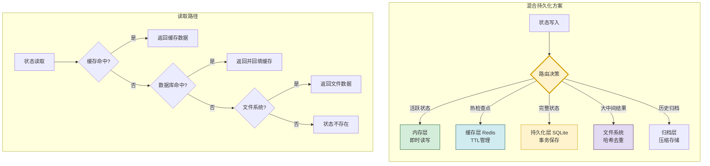

```python
class HybridStateStore:
    """混合持久化存储(推荐方案)"""

    def __init__(self):
        self.memory = InMemoryStateStore()
        self.cache = None  # CacheStateStore(redis_client)
        self.persistent = None  # PersistentStateStore(db_conn)
        self.file_store = FileSystemStateStore()
        self.result_manager = IntermediateResultManager(self.file_store)

    def save_full_state(self, task_state: TaskExecutionState,
                        subtask_states: list[SubtaskExecutionState],
                        context_state: ContextEnvironmentState,
                        intermediate_results: list[tuple] = None,
                        create_checkpoint: bool = True) -> bool:
        """保存完整状态(混合存储)"""
        # 1. 保存到内存(即时可用)
        self.memory.save_task_state(task_state)
        for st in subtask_states:
            self.memory.save_subtask_state(st)

        # 2. 保存中间结果(大数据走文件系统)
        if intermediate_results:
            for task_id, subtask_id, content, r_type, source in intermediate_results:
                self.result_manager.store(task_id, subtask_id, content, r_type, source)

        # 3. 保存到持久化层(事务性)
        if self.persistent:
            result_refs = [
                r.result_id for r in self.result_manager.get_task_results(task_state.task_id)
            ]
            success = self.persistent.save_state(
                task_state.task_id, task_state.to_dict(), task_state.status.value
            )
            if not success:
                return False

        # 4. 创建检查点
        if create_checkpoint:
            result_refs = [
                r.result_id for r in self.result_manager.get_task_results(task_state.task_id)
            ]
            # checkpoint_mgr创建检查点...

        return True

    def load_full_state(self, task_id: str) -> Optional[dict]:
        """加载完整状态(多级查询)"""
        # 1. 先查内存
        task_state = self.memory.get_task_state(task_id)
        if task_state and task_state.status == TaskStatus.RUNNING:
            subtask_states = self.memory.get_subtask_states(task_id)
            return {
                "task_state": task_state,
                "subtask_states": subtask_states,
                "source": "memory"
            }

        # 2. 查缓存
        if self.cache:
            cached = self.cache.get_task_state(task_id)
            if cached:
                # 重建内存状态
                task_state = TaskExecutionState(**cached)
                return {
                    "task_state": task_state,
                    "subtask_states": [],
                    "source": "cache"
                }

        # 3. 查持久化层
        if self.persistent:
            state_dict = self.persistent.load_state(task_id)
            if state_dict:
                task_state = TaskExecutionState(**state_dict)
                # 回填内存
                self.memory.save_task_state(task_state)
                return {
                    "task_state": task_state,
                    "subtask_states": [],
                    "source": "persistent"
                }

        return None
```

### 5.5 序列化方案选择

| 序列化格式 | 速度 | 体积 | 可读性 | 类型支持 | 推荐场景 |
|-----------|------|------|--------|---------|---------|
| **JSON** | 中 | 中 | 好 | 基本类型 | 通用、可调试 ⭐ |
| **Pickle** | 快 | 小 | 无 | 全部Python类型 | 内部使用、高性能 |
| **MessagePack** | 快 | 小 | 无 | 基本类型 | 高性能、跨语言 |
| **Protocol Buffers** | 快 | 极小 | 无 | 需schema | 强类型、跨语言 |
| **YAML** | 慢 | 大 | 极好 | 基本类型 | 配置文件 |

**推荐**:状态数据使用 JSON(可调试、通用),大中间结果使用原始二进制存储,高性能场景内部使用 Pickle。

---

## 六、状态恢复机制

### 6.1 恢复流程设计

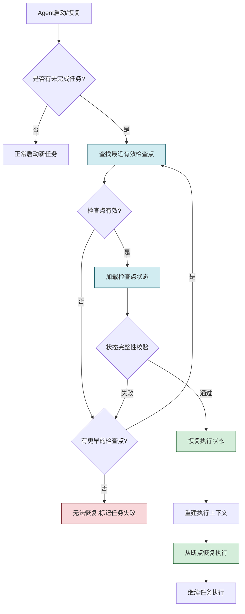

### 6.2 恢复点选择策略

```python
class RecoveryPointSelector:
    """恢复点选择器"""

    def __init__(self, persistent_store: PersistentStateStore):
        self.persistent = persistent_store

    def select_recovery_point(self, task_id: str) -> Optional[Checkpoint]:
        """选择最佳恢复点"""
        # 获取所有有效检查点(按时间倒序)
        checkpoints = self.persistent.get_checkpoints(task_id, limit=10)
        if not checkpoints:
            return None

        # 从最新开始逐个验证
        for cp in checkpoints:
            if self._is_valid_checkpoint(cp):
                return cp

        return None

    def _is_valid_checkpoint(self, checkpoint: Checkpoint) -> bool:
        """验证检查点是否有效可用"""
        # 1. 校验和验证
        if not checkpoint.verify_integrity():
            return False

        # 2. 检查状态完整性
        if not checkpoint.task_state:
            return False

        # 3. 检查是否为可恢复状态
        task_status = checkpoint.task_state.get("status")
        if task_status in ["completed", "cancelled"]:
            return False  # 已完成或已取消的任务不需要恢复

        # 4. 检查关联的中间结果是否存在
        for ref_id in checkpoint.result_refs:
            # 验证中间结果是否可用
            pass

        return True

    def get_recovery_plan(self, checkpoint: Checkpoint) -> dict:
        """制定恢复计划"""
        task_state = checkpoint.task_state
        subtask_states = checkpoint.subtask_states

        # 找到需要重新执行的子任务
        completed_subtask_ids = [
            s["subtask_id"] for s in subtask_states
            if s.get("status") == "completed"
        ]
        in_progress_subtask = next(
            (s for s in subtask_states if s.get("status") == "in_progress"),
            None
        )
        pending_subtasks = [
            s for s in subtask_states
            if s.get("status") in ["not_started", "blocked"]
        ]

        return {
            "checkpoint_id": checkpoint.checkpoint_id,
            "task_id": checkpoint.task_id,
            "recovery_strategy": self._determine_strategy(in_progress_subtask),
            "completed_subtasks": completed_subtask_ids,
            "resume_subtask": in_progress_subtask["subtask_id"] if in_progress_subtask else None,
            "resume_from_step": in_progress_subtask.get("tool_call_index", 0) if in_progress_subtask else 0,
            "pending_subtasks": [s["subtask_id"] for s in pending_subtasks],
            "progress_before_crash": task_state.get("progress_percentage", 0)
        }

    def _determine_strategy(self, in_progress_subtask: dict) -> str:
        """确定恢复策略"""
        if not in_progress_subtask:
            return "continue_from_next"

        status = in_progress_subtask.get("status")
        if status == "in_progress":
            tool_index = in_progress_subtask.get("tool_call_index", 0)
            if tool_index > 0:
                return "retry_from_last_tool"  # 从最后一个工具调用重试
            else:
                return "retry_subtask_from_start"  # 子任务从头重试
        return "continue_from_next"
```

### 6.3 状态校验与修复

```python
class StateValidator:
    """状态校验与修复器"""

    def validate_recovered_state(self, checkpoint: Checkpoint) -> dict:
        """校验恢复的状态"""
        issues = []
        warnings = []

        # 1. 任务状态校验
        task_state = checkpoint.task_state
        if not task_state:
            issues.append("任务状态缺失")
        else:
            if not task_state.get("task_id"):
                issues.append("任务ID缺失")
            if not task_state.get("execution_plan"):
                warnings.append("执行计划缺失,需要重新规划")
            if task_state.get("total_subtasks", 0) == 0:
                warnings.append("子任务总数为0")

        # 2. 子任务状态校验
        subtask_states = checkpoint.subtask_states
        if not subtask_states:
            issues.append("子任务状态缺失")
        else:
            for st in subtask_states:
                if not st.get("subtask_id"):
                    issues.append(f"子任务ID缺失: {st}")
                if st.get("status") == "completed" and not st.get("output_result"):
                    warnings.append(f"子任务{st.get('subtask_id')}标记完成但无输出")

        # 3. 依赖关系校验
        dep_issues = self._validate_dependencies(subtask_states)
        issues.extend(dep_issues)

        # 4. 中间结果引用校验
        for ref_id in checkpoint.result_refs:
            # 验证中间结果是否存在
            pass

        return {
            "is_valid": len(issues) == 0,
            "issues": issues,
            "warnings": warnings,
            "can_auto_repair": self._can_auto_repair(issues)
        }

    def _validate_dependencies(self, subtask_states: list[dict]) -> list[str]:
        """验证子任务依赖关系"""
        issues = []
        all_ids = {s["subtask_id"] for s in subtask_states if s.get("subtask_id")}

        for st in subtask_states:
            for dep_id in st.get("dependencies", []):
                if dep_id not in all_ids:
                    issues.append(
                        f"子任务{st.get('subtask_id')}依赖不存在的子任务{dep_id}"
                    )
            # 检查依赖是否已完成
            for dep_id in st.get("dependencies", []):
                dep_state = next(
                    (s for s in subtask_states if s.get("subtask_id") == dep_id),
                    None
                )
                if dep_state and dep_state.get("status") != "completed":
                    if st.get("status") == "in_progress":
                        issues.append(
                            f"子任务{st.get('subtask_id')}正在执行,但其依赖{dep_id}未完成"
                        )
        return issues

    def _can_auto_repair(self, issues: list[str]) -> bool:
        """判断是否可以自动修复"""
        non_repairable = ["任务状态缺失", "子任务状态缺失", "任务ID缺失"]
        return not any(any(nr in issue for nr in non_repairable) for issue in issues)

    def repair_state(self, checkpoint: Checkpoint,
                     validation_result: dict) -> Checkpoint:
        """修复状态问题"""
        if not validation_result["can_auto_repair"]:
            raise ValueError("状态存在不可修复的问题")

        repaired = checkpoint
        warnings = validation_result["warnings"]

        # 修复1:执行计划缺失 → 重新规划
        if any("执行计划缺失" in w for w in warnings):
            # 触发重新规划
            pass

        # 修复2:子任务完成但无输出 → 标记为需重新执行
        for st in repaired.subtask_states:
            if st.get("status") == "completed" and not st.get("output_result"):
                st["status"] = "not_started"
                st["repair_note"] = "自动修复:标记为重新执行(原输出缺失)"

        # 修复3:依赖未完成但子任务在执行 → 重置为blocked
        for st in repaired.subtask_states:
            if st.get("status") == "in_progress":
                deps = st.get("dependencies", [])
                for dep_id in deps:
                    dep = next(
                        (s for s in repaired.subtask_states
                         if s.get("subtask_id") == dep_id), None
                    )
                    if dep and dep.get("status") != "completed":
                        st["status"] = "blocked"
                        st["repair_note"] = f"自动修复:依赖{dep_id}未完成,设为blocked"
                        break

        # 重新计算校验和
        repaired.compute_checksum()
        return repaired
```

### 6.4 恢复后的上下文重建

```python
class ContextRebuilder:
    """上下文重建器"""

    def __init__(self, memory_store, tool_registry):
        self.memory = memory_store
        self.tools = tool_registry

    def rebuild_context(self, checkpoint: Checkpoint,
                        task_state: TaskExecutionState) -> ContextEnvironmentState:
        """从检查点重建执行上下文"""
        context = ContextEnvironmentState()

        # 从检查点恢复基础上下文
        if checkpoint.context_state:
            cs = checkpoint.context_state
            context.agent_id = cs.get("agent_id", "")
            context.agent_role = cs.get("agent_role", "")
            context.llm_model = cs.get("llm_model", "")
            context.llm_params = cs.get("llm_params", {})
            context.system_prompt = cs.get("system_prompt", "")
            context.user_id = cs.get("user_id", "")
            context.session_id = cs.get("session_id", "")
            context.memory_refs = cs.get("memory_refs", [])

        # 重建可用工具列表
        context.available_tools = self.tools.get_available_tools()

        # 从记忆中检索相关上下文
        if task_state.task_description:
            relevant_memories = self.memory.retrieve(
                query=task_state.task_description,
                top_k=5
            )
            context.retrieved_knowledge = [
                {"content": m.content, "relevance": m.importance}
                for m in relevant_memories
            ]

        # 重建对话历史(从子任务状态中提取)
        conversation = []
        for st in checkpoint.subtask_states:
            if st.get("status") == "completed":
                # 添加已完成的推理上下文
                if st.get("llm_context"):
                    conversation.extend(st["llm_context"][-2:])  # 保留最近2轮
        context.conversation_history = conversation

        # 计算已用上下文窗口
        context.context_window_used = sum(
            len(str(m.get("content", ""))) // 4
            for m in conversation
        )

        return context
```

---

## 七、并发执行的状态一致性

### 7.1 并发状态冲突问题

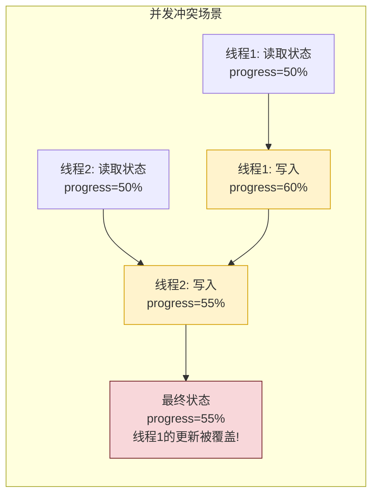

并发执行时可能出现的问题:
- **写-写冲突**:多个线程同时更新同一状态,后写入的覆盖先写入的
- **读-写不一致**:读取到部分更新的中间状态
- **检查点不一致**:检查点捕获到不一致的中间状态
- **子任务依赖违反**:依赖子任务未完成就开始执行后续子任务

### 7.2 锁机制实现

```python
import threading
from contextlib import contextmanager


class StateLockManager:
    """状态锁管理器"""

    def __init__(self):
        # 任务级锁
        self._task_locks: dict[str, threading.RLock] = {}
        # 子任务级锁
        self._subtask_locks: dict[str, threading.RLock] = {}
        # 全局锁(保护锁字典本身)
        self._global_lock = threading.Lock()

    @contextmanager
    def task_lock(self, task_id: str):
        """获取任务级锁(上下文管理器)"""
        lock = self._get_task_lock(task_id)
        lock.acquire()
        try:
            yield lock
        finally:
            lock.release()

    @contextmanager
    def subtask_lock(self, subtask_id: str):
        """获取子任务级锁"""
        lock = self._get_subtask_lock(subtask_id)
        lock.acquire()
        try:
            yield lock
        finally:
            lock.release()

    def _get_task_lock(self, task_id: str) -> threading.RLock:
        with self._global_lock:
            if task_id not in self._task_locks:
                self._task_locks[task_id] = threading.RLock()
            return self._task_locks[task_id]

    def _get_subtask_lock(self, subtask_id: str) -> threading.RLock:
        with self._global_lock:
            if subtask_id not in self._subtask_locks:
                self._subtask_locks[subtask_id] = threading.RLock()
            return self._subtask_locks[subtask_id]


class ConcurrentStateStore:
    """线程安全的状态存储"""

    def __init__(self, lock_manager: StateLockManager = None):
        self.locks = lock_manager or StateLockManager()
        self._task_states: dict[str, TaskExecutionState] = {}
        self._subtask_states: dict[str, SubtaskExecutionState] = {}

    def update_task_state(self, task_id: str,
                          updater: callable) -> TaskExecutionState:
        """线程安全地更新任务状态"""
        with self.locks.task_lock(task_id):
            state = self._task_states.get(task_id)
            if state is None:
                raise ValueError(f"任务状态不存在: {task_id}")
            # 执行更新函数
            updater(state)
            state.last_updated_at = time.time()
            self._task_states[task_id] = state
            return state

    def update_subtask_state(self, subtask_id: str,
                              updater: callable) -> SubtaskExecutionState:
        """线程安全地更新子任务状态"""
        with self.locks.subtask_lock(subtask_id):
            state = self._subtask_states.get(subtask_id)
            if state is None:
                raise ValueError(f"子任务状态不存在: {subtask_id}")
            updater(state)
            self._subtask_states[subtask_id] = state
            return state

    def create_checkpoint_safe(self, task_id: str) -> Checkpoint:
        """线程安全地创建检查点"""
        with self.locks.task_lock(task_id):
            task_state = self._task_states.get(task_id)
            subtask_states = [
                s for s in self._subtask_states.values()
                if s.task_id == task_id
            ]
            # 创建检查点时持有锁,保证状态一致性
            checkpoint = Checkpoint(
                task_id=task_id,
                task_state=task_state.to_dict() if task_state else None,
                subtask_states=[s.__dict__ for s in subtask_states]
            )
            checkpoint.compute_checksum()
            return checkpoint
```

### 7.3 乐观并发控制

```python
class OptimisticConcurrencyController:
    """乐观并发控制器(适合低冲突场景)"""

    def __init__(self):
        self._versions: dict[str, int] = {}  # task_id -> version

    def get_version(self, task_id: str) -> int:
        """获取当前版本号"""
        return self._versions.get(task_id, 0)

    def update_with_version_check(self, task_id: str,
                                   expected_version: int,
                                   updater: callable) -> tuple[bool, int]:
        """带版本检查的更新(乐观锁)"""
        current_version = self._versions.get(task_id, 0)

        if current_version != expected_version:
            # 版本不匹配,说明有其他线程已更新
            return False, current_version

        # 执行更新
        updater()

        # 版本递增
        new_version = current_version + 1
        self._versions[task_id] = new_version
        return True, new_version

    def retry_with_backoff(self, task_id: str, updater: callable,
                           max_retries: int = 3) -> bool:
        """带退避的重试"""
        for attempt in range(max_retries):
            version = self.get_version(task_id)
            success, new_version = self.update_with_version_check(
                task_id, version, updater
            )
            if success:
                return True
            # 退避等待
            time.sleep(0.1 * (2 ** attempt))
        return False
```

### 7.4 状态分片与隔离

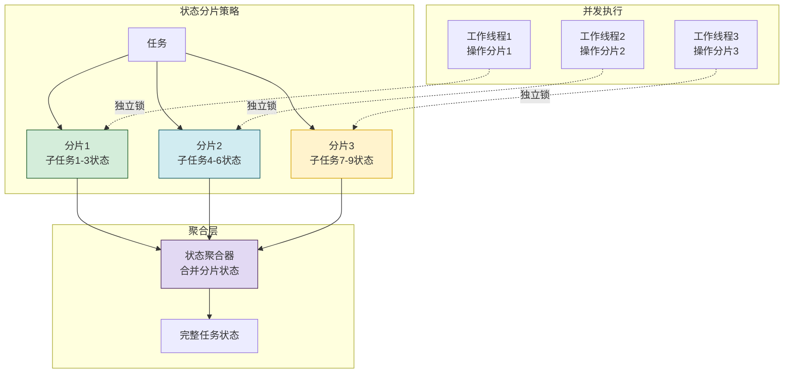

```python
class ShardedStateStore:
    """分片状态存储"""

    def __init__(self, shard_count: int = 4):
        self.shard_count = shard_count
        self.shards: list[dict] = [{} for _ in range(shard_count)]
        self.shard_locks: list[threading.RLock] = [
            threading.RLock() for _ in range(shard_count)
        ]

    def _get_shard(self, key: str) -> int:
        """根据键计算分片号"""
        return hash(key) % self.shard_count

    def put(self, key: str, value: Any):
        """写入分片"""
        shard_idx = self._get_shard(key)
        with self.shard_locks[shard_idx]:
            self.shards[shard_idx][key] = value

    def get(self, key: str) -> Any:
        """读取分片"""
        shard_idx = self._get_shard(key)
        with self.shard_locks[shard_idx]:
            return self.shards[shard_idx].get(key)

    def get_all(self) -> dict:
        """获取所有数据(聚合)"""
        result = {}
        for i, shard in enumerate(self.shards):
            with self.shard_locks[i]:
                result.update(shard)
        return result
```

### 7.5 分布式状态一致性

```python
class DistributedStateCoordinator:
    """分布式状态协调器"""

    def __init__(self, node_id: str, cluster_nodes: list[str]):
        self.node_id = node_id
        self.cluster = cluster_nodes
        self.raft_state = "follower"  # follower/candidate/leader
        self.term = 0
        self.commit_index = 0

    def propose_state_change(self, task_id: str,
                              change: dict) -> bool:
        """提议状态变更(需集群多数同意)"""
        if self.raft_state != "leader":
            return False

        # 1. 将变更写入日志
        log_entry = {
            "term": self.term,
            "task_id": task_id,
            "change": change,
            "timestamp": time.time()
        }

        # 2. 发送给所有follower
        agree_count = 1  # 自己同意
        for node in self.cluster:
            if node != self.node_id:
                if self._send_to_follower(node, log_entry):
                    agree_count += 1

        # 3. 多数同意则提交
        majority = len(self.cluster) // 2 + 1
        if agree_count >= majority:
            self._commit_change(log_entry)
            self.commit_index += 1
            return True

        return False

    def _send_to_follower(self, node: str, entry: dict) -> bool:
        """发送日志条目给follower(简化实现)"""
        return True

    def _commit_change(self, entry: dict):
        """提交变更"""
        pass
```

### 7.6 并发一致性策略选择

| 策略 | 实现复杂度 | 性能影响 | 适用场景 | 冲突频率 |
|------|----------|---------|---------|---------|
| **任务级锁** | 低 | 中 | 单任务内并发子任务 | 低 |
| **子任务级锁** | 中 | 低 | 子任务独立执行 | 极低 |
| **乐观并发** | 中 | 低(无冲突时) | 读多写少 | 低 |
| **状态分片** | 高 | 低 | 大规模并发 | 极低 |
| **分布式共识** | 极高 | 高 | 多节点集群 | 任意 |

---

## 八、性能影响与优化

### 8.1 性能影响分析

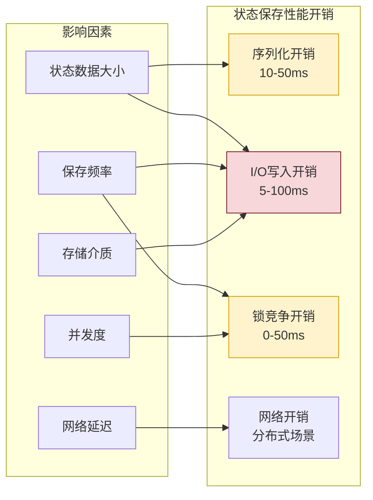

### 8.2 异步持久化

```python
import queue
import threading


class AsyncPersistenceWorker:
    """异步持久化工作器"""

    def __init__(self, persistent_store, worker_count: int = 2):
        self.store = persistent_store
        self.queue: queue.Queue = queue.Queue(maxsize=1000)
        self.workers: list[threading.Thread] = []
        self.worker_count = worker_count
        self._running = False

    def start(self):
        """启动工作线程"""
        self._running = True
        for i in range(self.worker_count):
            t = threading.Thread(target=self._worker_loop, daemon=True)
            t.start()
            self.workers.append(t)

    def stop(self):
        """停止工作线程"""
        self._running = False
        # 发送停止信号
        for _ in range(self.worker_count):
            self.queue.put(None)
        for t in self.workers:
            t.join(timeout=10)

    def submit_save(self, task_id: str, state_data: dict,
                    priority: int = 5):
        """提交异步保存任务"""
        try:
            self.queue.put({
                "type": "save_state",
                "task_id": task_id,
                "state_data": state_data,
                "priority": priority,
                "timestamp": time.time()
            }, timeout=5)
            return True
        except queue.Full:
            return False

    def submit_checkpoint(self, checkpoint: Checkpoint, priority: int = 3):
        """提交异步检查点保存"""
        try:
            self.queue.put({
                "type": "save_checkpoint",
                "checkpoint": checkpoint,
                "priority": priority,
                "timestamp": time.time()
            }, timeout=5)
            return True
        except queue.Full:
            return False

    def _worker_loop(self):
        """工作线程循环"""
        while self._running:
            try:
                item = self.queue.get(timeout=5)
                if item is None:
                    break
                self._process_item(item)
            except queue.Empty:
                continue
            except Exception as e:
                # 工作线程异常不影响主流程
                continue

    def _process_item(self, item: dict):
        """处理保存任务"""
        if item["type"] == "save_state":
            self.store.save_state(
                item["task_id"], item["state_data"],
                item["state_data"].get("status", "running")
            )
        elif item["type"] == "save_checkpoint":
            self.store.save_checkpoint(item["checkpoint"])

    def flush(self, timeout: float = 30):
        """等待所有队列任务完成"""
        self.queue.join()
```

### 8.3 增量保存

```python
class IncrementalStateSaver:
    """增量状态保存器"""

    def __init__(self, persistent_store):
        self.store = persistent_store
        self.last_saved_state: dict[str, dict] = {}  # task_id -> last_state

    def save_incremental(self, task_id: str,
                          current_state: dict) -> bool:
        """增量保存(只保存变化部分)"""
        last_state = self.last_saved_state.get(task_id, {})

        # 计算差异
        diff = self._compute_diff(last_state, current_state)

        if not diff:
            return True  # 无变化,无需保存

        # 只保存变化部分
        patch = {
            "task_id": task_id,
            "diff": diff,
            "timestamp": time.time(),
            "base_version": last_state.get("_version", 0)
        }

        # 应用补丁到持久化层
        success = self.store.save_state(task_id, current_state,
                                         current_state.get("status", "running"))
        if success:
            current_state["_version"] = last_state.get("_version", 0) + 1
            self.last_saved_state[task_id] = current_state.copy()

        return success

    def _compute_diff(self, old: dict, new: dict) -> dict:
        """计算状态差异"""
        diff = {}
        for key in set(list(old.keys()) + list(new.keys())):
            old_val = old.get(key)
            new_val = new.get(key)
            if old_val != new_val:
                diff[key] = {
                    "old": old_val,
                    "new": new_val
                }
        return diff
```

### 8.4 状态压缩

```python
import gzip
import json


class StateCompressor:
    """状态压缩器"""

    COMPRESSION_THRESHOLD = 1024  # 1KB以上才压缩

    def compress_state(self, state_data: dict) -> tuple[bytes, bool]:
        """压缩状态数据"""
        data_str = json.dumps(state_data, ensure_ascii=False, default=str)
        data_bytes = data_str.encode('utf-8')

        if len(data_bytes) < self.COMPRESSION_THRESHOLD:
            return data_bytes, False  # 不压缩

        compressed = gzip.compress(data_bytes, compresslevel=6)
        return compressed, True

    def decompress_state(self, data: bytes, is_compressed: bool) -> dict:
        """解压状态数据"""
        if is_compressed:
            data_bytes = gzip.decompress(data)
        else:
            data_bytes = data

        return json.loads(data_bytes.decode('utf-8'))
```

### 8.5 性能优化策略汇总

| 优化策略 | 原理 | 效果 | 实现复杂度 | 推荐度 |
|---------|------|------|----------|--------|
| **异步持久化** | 写入操作不阻塞主线程 | 响应延迟降低 80%+ | 中 | ⭐⭐⭐⭐⭐ |
| **增量保存** | 只保存变化部分 | I/O量降低 70%+ | 中 | ⭐⭐⭐⭐ |
| **状态压缩** | gzip压缩大状态 | 存储空间降低 60%+ | 低 | ⭐⭐⭐⭐ |
| **批量写入** | 合并多个小写入 | I/O次数降低 50%+ | 低 | ⭐⭐⭐⭐ |
| **写时复制(CoW)** | 读取时不阻塞写入 | 读延迟降低 | 高 | ⭐⭐⭐ |
| **分级存储** | 热数据内存,冷数据磁盘 | 整体性能提升 | 中 | ⭐⭐⭐⭐⭐ |
| **延迟写入** | 非关键数据延迟批量写 | 峰值性能提升 | 中 | ⭐⭐⭐ |
| **预分配空间** | 预分配存储空间 | 减少动态分配开销 | 低 | ⭐⭐ |

---

## 九、错误处理策略

### 9.1 保存失败处理

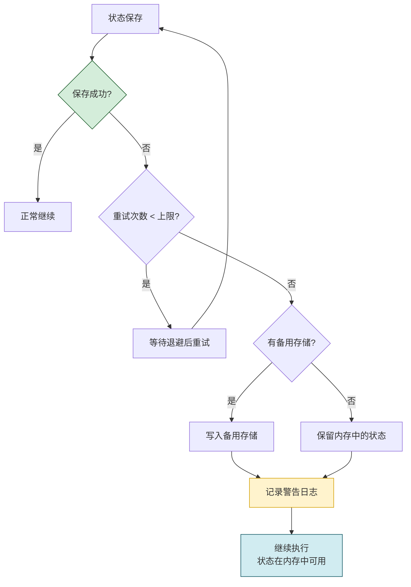

```python
class StateSaveErrorHandler:
    """状态保存错误处理器"""

    def __init__(self, primary_store, fallback_store=None):
        self.primary = primary_store
        self.fallback = fallback_store
        self.max_retries = 3
        self.retry_delays = [0.1, 0.5, 2.0]

    def save_with_recovery(self, task_id: str, state_data: dict,
                           status: str) -> bool:
        """带恢复机制的保存"""
        for attempt in range(self.max_retries):
            try:
                if self.primary.save_state(task_id, state_data, status):
                    return True
            except Exception as e:
                # 记录错误
                pass

            # 退避等待
            if attempt < self.max_retries - 1:
                time.sleep(self.retry_delays[attempt])

        # 主存储全部失败,尝试备用存储
        if self.fallback:
            try:
                if self.fallback.save_state(task_id, state_data, status):
                    return True
            except Exception:
                pass

        # 所有存储都失败,状态仅在内存中
        # 记录严重警告
        return False
```

### 9.2 恢复失败处理

```python
class StateRecoveryErrorHandler:
    """状态恢复错误处理器"""

    def recover_with_fallback(self, task_id: str,
                               recovery_selector: RecoveryPointSelector,
                               validator: StateValidator) -> dict:
        """带降级的恢复"""
        # 1. 尝试从最新检查点恢复
        checkpoint = recovery_selector.select_recovery_point(task_id)

        if checkpoint is None:
            return {
                "success": False,
                "reason": "无可用检查点",
                "action": "restart_from_beginning"
            }

        # 2. 验证检查点
        validation = validator.validate_recovered_state(checkpoint)

        if not validation["is_valid"]:
            if validation["can_auto_repair"]:
                # 尝试自动修复
                try:
                    checkpoint = validator.repair_state(checkpoint, validation)
                except Exception:
                    # 修复失败,尝试更早的检查点
                    return self._try_earlier_checkpoint(task_id, recovery_selector, validator)
            else:
                # 不可修复,尝试更早的检查点
                return self._try_earlier_checkpoint(task_id, recovery_selector, validator)

        return {
            "success": True,
            "checkpoint": checkpoint,
            "validation": validation
        }

    def _try_earlier_checkpoint(self, task_id: str,
                                 selector: RecoveryPointSelector,
                                 validator: StateValidator) -> dict:
        """尝试更早的检查点"""
        # 获取所有检查点,逐个尝试
        checkpoints = selector.persistent.get_checkpoints(task_id, limit=10)

        for cp in checkpoints[1:]:  # 跳过已尝试的最新检查点
            validation = validator.validate_recovered_state(cp)
            if validation["is_valid"] or validation["can_auto_repair"]:
                if validation["can_auto_repair"]:
                    try:
                        cp = validator.repair_state(cp, validation)
                    except Exception:
                        continue
                return {
                    "success": True,
                    "checkpoint": cp,
                    "validation": validation,
                    "note": "使用了较早的检查点"
                }

        return {
            "success": False,
            "reason": "所有检查点均不可用",
            "action": "restart_from_beginning"
        }
```

### 9.3 数据损坏处理

```python
class DataCorruptionHandler:
    """数据损坏处理器"""

    def handle_corruption(self, task_id: str,
                          corruption_type: str) -> dict:
        """处理数据损坏"""
        handlers = {
            "checksum_mismatch": self._handle_checksum_mismatch,
            "parse_error": self._handle_parse_error,
            "missing_field": self._handle_missing_field,
            "version_mismatch": self._handle_version_mismatch,
        }

        handler = handlers.get(corruption_type, self._handle_unknown)
        return handler(task_id)

    def _handle_checksum_mismatch(self, task_id: str) -> dict:
        """校验和不匹配"""
        return {
            "action": "try_earlier_checkpoint",
            "message": f"任务{task_id}状态数据校验失败,尝试更早的检查点"
        }

    def _handle_parse_error(self, task_id: str) -> dict:
        """解析错误"""
        return {
            "action": "quarantine_and_restart",
            "message": f"任务{task_id}状态数据损坏,隔离损坏数据并从头开始"
        }

    def _handle_missing_field(self, task_id: str) -> dict:
        """字段缺失"""
        return {
            "action": "repair_with_defaults",
            "message": f"任务{task_id}状态缺少字段,使用默认值修复"
        }

    def _handle_version_mismatch(self, task_id: str) -> dict:
        """版本不匹配"""
        return {
            "action": "migrate_or_restart",
            "message": f"任务{task_id}状态版本不兼容,尝试迁移或从头开始"
        }

    def _handle_unknown(self, task_id: str) -> dict:
        """未知损坏"""
        return {
            "action": "restart_from_beginning",
            "message": f"任务{task_id}状态损坏原因未知,从头开始"
        }
```

### 9.4 部分恢复处理

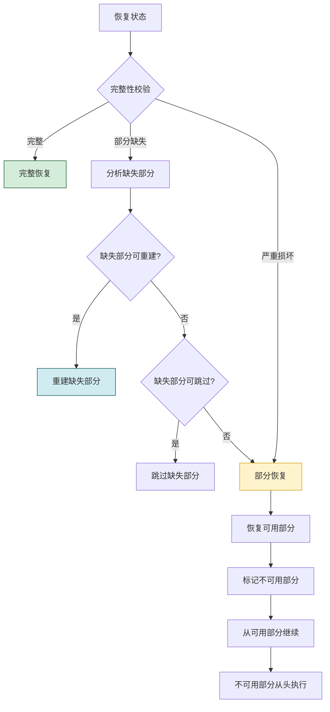

### 9.5 错误处理策略汇总

| 错误类型 | 处理策略 | 优先级 | 说明 |
|---------|---------|:------:|------|
| **保存失败(临时)** | 退避重试 | 高 | 瞬时故障可自行恢复 |
| **保存失败(持久)** | 降级到备用存储 | 高 | 保证状态不丢失 |
| **恢复失败(校验)** | 尝试更早检查点 | 高 | 回退到可用状态 |
| **恢复失败(无检查点)** | 从头开始执行 | 中 | 最大限度保证任务完成 |
| **数据损坏** | 隔离+修复/重启 | 高 | 防止损坏数据扩散 |
| **部分恢复** | 可用部分继续+缺失部分重做 | 中 | 最大化利用已有进度 |
| **版本不兼容** | 迁移或重启 | 中 | 支持状态格式演进 |

---

## 十、完整实现方案

### 10.1 状态管理器架构

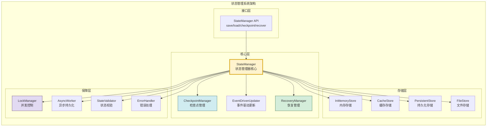

### 10.2 核心代码实现

```python
"""
Agent 执行状态保存机制 - 完整实现
整合分层存储、检查点、恢复、并发控制、性能优化与错误处理
"""


class StateManager:
    """状态管理器(核心编排器)"""

    def __init__(self, config: dict = None):
        self.config = config or {}

        # 存储层初始化
        self.memory = InMemoryStateStore()
        self.persistent = self._init_persistent_store()
        self.file_store = FileSystemStateStore(
            self.config.get("state_dir", "./agent_states")
        )
        self.result_manager = IntermediateResultManager(self.file_store)

        # 核心组件
        self.checkpoint_mgr = CheckpointManager(
            self.persistent, strategy=CheckpointStrategy()
        )
        self.event_updater = EventDrivenStateUpdater(
            self.checkpoint_mgr, self.memory
        )
        self.recovery_selector = RecoveryPointSelector(self.persistent)
        self.validator = StateValidator()
        self.context_rebuilder = None  # 需要时初始化

        # 保障组件
        self.lock_mgr = StateLockManager()
        self.async_worker = AsyncPersistenceWorker(self.persistent)
        self.error_handler = StateSaveErrorHandler(self.persistent, self.file_store)

        # 启动异步工作器
        self.async_worker.start()

        # 启动定时检查点
        self.scheduled_checkpoint = ScheduledCheckpointThread(
            self.checkpoint_mgr, self.memory,
            interval=self.config.get("checkpoint_interval", 30)
        )
        self.scheduled_checkpoint.start()

    def _init_persistent_store(self):
        """初始化持久化存储"""
        import sqlite3
        db_path = self.config.get("db_path", ":memory:")
        conn = sqlite3.connect(db_path, check_same_thread=False)
        return PersistentStateStore(conn)

    def save_state(self, task_state: TaskExecutionState,
                   subtask_states: list[SubtaskExecutionState],
                   context_state: ContextEnvironmentState = None,
                   intermediate_results: list = None,
                   create_checkpoint: bool = False,
                   checkpoint_type: str = "post_step") -> bool:
        """保存完整状态"""
        task_id = task_state.task_id

        with self.lock_mgr.task_lock(task_id):
            # 1. 保存到内存(即时可用)
            self.memory.save_task_state(task_state)
            for st in subtask_states:
                self.memory.save_subtask_state(st)

            # 2. 保存中间结果
            result_refs = []
            if intermediate_results:
                for task_id, subtask_id, content, r_type, source in intermediate_results:
                    ref = self.result_manager.store(
                        task_id, subtask_id, content, r_type, source
                    )
                    result_refs.append(ref)

            # 3. 异步保存到持久化层(不阻塞主线程)
            self.async_worker.submit_save(
                task_id, task_state.to_dict(), priority=5
            )

            # 4. 创建检查点(如果需要)
            if create_checkpoint:
                checkpoint = self.checkpoint_mgr.create_checkpoint(
                    task_state, subtask_states, context_state,
                    result_refs, event_type=checkpoint_type
                )
                if checkpoint:
                    task_state.last_checkpoint_id = checkpoint.checkpoint_id

            return True

    def load_state(self, task_id: str) -> Optional[dict]:
        """加载状态(多级查询)"""
        # 1. 查内存
        task_state = self.memory.get_task_state(task_id)
        if task_state:
            subtask_states = self.memory.get_subtask_states(task_id)
            return {
                "task_state": task_state,
                "subtask_states": subtask_states,
                "source": "memory"
            }

        # 2. 查持久化层
        state_dict = self.persistent.load_state(task_id)
        if state_dict:
            task_state = TaskExecutionState(**state_dict)
            # 回填内存
            self.memory.save_task_state(task_state)
            return {
                "task_state": task_state,
                "subtask_states": [],
                "source": "persistent"
            }

        return None

    def recover_state(self, task_id: str) -> dict:
        """从检查点恢复状态"""
        # 1. 选择恢复点
        checkpoint = self.recovery_selector.select_recovery_point(task_id)
        if not checkpoint:
            return {
                "success": False,
                "reason": "无可用检查点",
                "action": "restart"
            }

        # 2. 验证状态
        validation = self.validator.validate_recovered_state(checkpoint)
        if not validation["is_valid"]:
            if validation["can_auto_repair"]:
                try:
                    checkpoint = self.validator.repair_state(
                        checkpoint, validation
                    )
                except Exception as e:
                    return {
                        "success": False,
                        "reason": f"状态修复失败: {e}",
                        "action": "restart"
                    }
            else:
                return {
                    "success": False,
                    "reason": f"状态不可用: {validation['issues']}",
                    "action": "restart"
                }

        # 3. 恢复状态
        task_state = TaskExecutionState(**checkpoint.task_state)
        subtask_states = [
            SubtaskExecutionState(**st) for st in checkpoint.subtask_states
        ]

        # 4. 回填内存
        self.memory.save_task_state(task_state)
        for st in subtask_states:
            self.memory.save_subtask_state(st)

        # 5. 制定恢复计划
        recovery_plan = self.recovery_selector.get_recovery_plan(checkpoint)

        # 6. 更新检查点恢复计数
        checkpoint.recovery_count += 1

        return {
            "success": True,
            "task_state": task_state,
            "subtask_states": subtask_states,
            "recovery_plan": recovery_plan,
            "validation": validation
        }

    def create_emergency_checkpoint(self, task_id: str) -> bool:
        """创建紧急检查点(异常时调用)"""
        with self.lock_mgr.task_lock(task_id):
            task_state = self.memory.get_task_state(task_id)
            if not task_state:
                return False
            subtask_states = self.memory.get_subtask_states(task_id)
            result_refs = [
                r.result_id for r in self.result_manager.get_task_results(task_id)
            ]
            checkpoint = self.checkpoint_mgr.create_emergency_checkpoint(
                task_state, subtask_states, None, result_refs
            )
            return checkpoint is not None

    def get_running_tasks(self) -> list[str]:
        """获取所有运行中的任务ID"""
        return [
            tid for tid, state in self.memory.task_states.items()
            if state.status == TaskStatus.RUNNING
        ]

    def shutdown(self):
        """优雅关闭:刷盘所有状态"""
        # 1. 停止定时检查点
        self.scheduled_checkpoint.stop()

        # 2. 为所有运行中任务创建最终检查点
        for task_id in self.get_running_tasks():
            self.create_emergency_checkpoint(task_id)

        # 3. 等待异步队列完成
        self.async_worker.flush()
        self.async_worker.stop()
```

### 10.3 完整工作流程

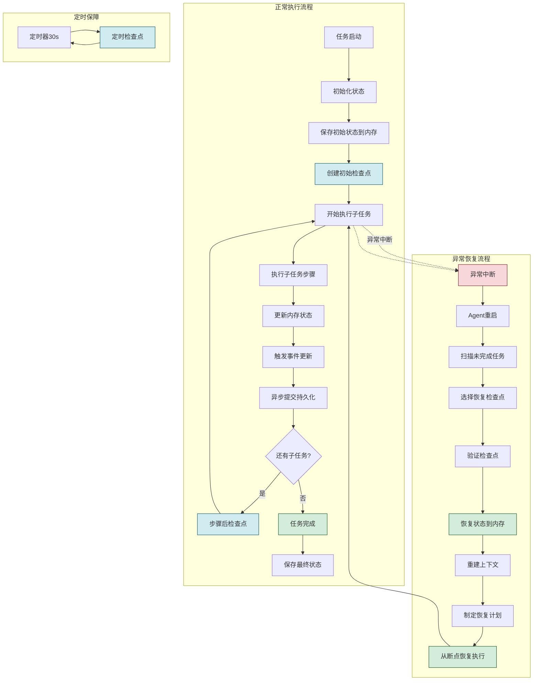

---

## 十一、总结与最佳实践

### 11.1 核心要点回顾

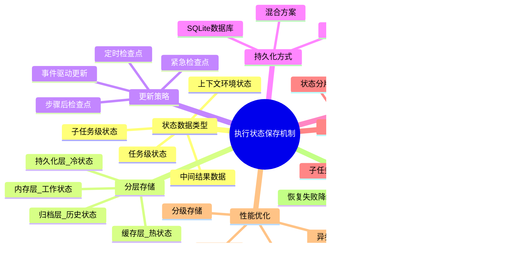

### 11.2 最佳实践清单

| 实践领域 | 最佳实践 | 优先级 |
|---------|---------|:------:|
| **存储策略** | 采用内存+持久化的混合分层存储 | 高 |
| **更新策略** | 事件驱动为主+定时检查点兜底+步骤后检查点+紧急检查点 | 高 |
| **检查点管理** | 保留最近5-10个检查点,自动清理旧检查点 | 高 |
| **持久化方式** | SQLite(单机)或PostgreSQL(分布式)+文件系统(大中间结果) | 高 |
| **并发控制** | 任务级RLock+子任务级锁,低冲突场景用乐观并发 | 高 |
| **性能优化** | 异步持久化+增量保存+状态压缩 | 高 |
| **完整性保障** | 每个检查点计算校验和,恢复时验证 | 高 |
| **原子写入** | 文件写入使用临时文件+重命名保证原子性 | 高 |
| **错误恢复** | 保存失败降级到备用存储,恢复失败尝试更早检查点 | 高 |
| **优雅关闭** | 关闭时为运行中任务创建最终检查点,等待异步队列完成 | 中 |
| **状态版本化** | 状态格式加版本号,支持未来格式迁移 | 中 |
| **大结果外置** | 超过4KB的中间结果存储到文件系统,状态中只保留引用 | 中 |
| **资源清理** | 任务完成后清理中间结果释放空间 | 中 |
| **可观测性** | 记录状态保存/恢复的完整日志,支持审计追溯 | 中 |

### 11.3 常见陷阱与规避

| 陷阱 | 危害 | 规避方法 |
|------|------|---------|
| **同步持久化阻塞主线程** | 任务执行延迟增大 | 使用异步持久化工作器 |
| **检查点过频** | I/O压力大,性能下降 | 合理设置检查点间隔和策略 |
| **检查点过疏** | 恢复时损失大,重复执行多 | 定时检查点作为兜底保障 |
| **无并发控制** | 状态被覆盖,数据不一致 | 使用任务级锁保护状态更新 |
| **无校验和验证** | 损坏数据被当作有效状态使用 | 每个检查点计算并验证校验和 |
| **非原子写入** | 写入过程中崩溃导致数据损坏 | 临时文件+重命名保证原子性 |
| **内存中状态不持久化** | 进程崩溃状态全丢 | 定期将内存状态刷盘 |
| **大结果内联存储** | 状态体积膨胀,序列化变慢 | 大数据外置文件系统 |
| **不清理旧检查点** | 存储空间持续增长 | 保留最近N个,自动清理 |
| **恢复后不验证** | 使用不一致的状态执行 | 恢复后必须校验完整性 |

### 11.4 成熟度模型


| 成熟度 | 核心能力 | 适用场景 |
|:------:|---------|---------|
| **L1** | 内存状态+日志记录 | 原型开发、演示 |
| **L2** | 定期检查点+基本恢复 | 单机、简单任务 |
| **L3** | 分层存储+异步持久化 | 单机生产环境 ⭐ |
| **L4** | 并发安全+一致性保障 | 多线程并发执行 |
| **L5** | 分布式+自恢复+自修复 | 集群部署、高可用 |

### 11.5 与系列其他文档的关系

- [44Agent任务重试机制完整设计与实现.md](./44Agent任务重试机制完整设计与实现.md):重试机制依赖状态保存来记录重试次数和中间状态
- [43Agent工具调用失败管理机制详解.md](./43Agent工具调用失败管理机制详解.md):失败管理中的降级处理需要状态保存支撑
- [41Agent任务规划机制详解.md](./41Agent任务规划机制详解.md):任务规划结果需要持久化保存以支持断点续执行
- [37Agent执行流程详解.md](./37Agent执行流程详解.md):执行流程的每一步都涉及状态的保存与更新
- [38Agent核心工作流程_Observe_Think_Act.md](./38Agent核心工作流程_Observe_Think_Act.md):OTA循环中的状态需要持久化保障

### 11.6 给开发者的实践建议

1. **从L2开始**:先实现基本的检查点和恢复机制,再逐步引入分层存储和异步持久化
2. **异步优先**:所有持久化操作都应异步执行,避免阻塞Agent主流程
3. **校验和必备**:每个检查点必须计算校验和,这是数据完整性的最后防线
4. **原子写入**:文件写入必须使用"临时文件+重命名"模式,杜绝写入中断导致的数据损坏
5. **混合策略**:事件驱动+定时+步骤后+紧急的混合检查点策略是最稳健的方案
6. **分级存储**:内存(工作)、缓存(热)、持久化(冷)三级存储平衡性能与可靠性
7. **大结果外置**:超过4KB的中间结果存储到文件系统,状态中只保留引用
8. **优雅关闭**:关闭时创建最终检查点,等待异步队列完成,确保无数据丢失
9. **定期测试恢复**:定期模拟崩溃恢复,验证状态保存机制的有效性
10. **监控状态健康**:监控检查点创建成功率、恢复成功率、存储空间使用率

---

> **相关文档**
>
> - [44Agent任务重试机制完整设计与实现.md](./44Agent任务重试机制完整设计与实现.md):重试机制的状态持久化基础
> - [43Agent工具调用失败管理机制详解.md](./43Agent工具调用失败管理机制详解.md):失败管理的状态恢复支撑
> - [41Agent任务规划机制详解.md](./41Agent任务规划机制详解.md):任务规划结果的持久化保存
> - [37Agent执行流程详解.md](./37Agent执行流程详解.md):执行流程中的状态管理
> - [38Agent核心工作流程_Observe_Think_Act.md](./38Agent核心工作流程_Observe_Think_Act.md):OTA循环的状态持久化
