# Agent 任务中断与恢复机制完整设计方案

> **文档定位**:本文档系统阐述 Agent 任务中断与恢复的完整机制设计,涵盖中断触发、状态保存、恢复流程、数据持久化四大核心环节。在 [44Agent任务重试机制完整设计与实现.md](44Agent任务重试机制完整设计与实现.md) 处理"失败后重试"的基础上,本文聚焦"中断后恢复",解决 Agent 在长时间运行任务中遇到外部中断、资源不足、主动暂停等场景时,如何准确保存执行现场并在条件允许时无缝恢复。
>
> **阅读建议**:建议先阅读 [45Agent执行状态保存机制完整设计方案.md](45Agent执行状态保存机制完整设计方案.md) 了解状态保存的基础,再阅读本文深入中断恢复机制。可结合 [40Plan-and-Execute_Agent完整实现方案.md](40Plan-and-Execute_Agent完整实现方案.md) 理解中断恢复在规划执行型 Agent 中的应用。

---

## 目录

- [一、引言:为什么需要任务中断与恢复](#一引言为什么需要任务中断与恢复)
- [二、整体架构设计](#二整体架构设计)
- [三、可中断任务类型与边界条件](#三可中断任务类型与边界条件)
- [四、中断触发机制](#四中断触发机制)
- [五、任务状态快照设计](#五任务状态快照设计)
- [六、状态保存与持久化方案](#六状态保存与持久化方案)
- [七、中断信号捕获与处理逻辑](#七中断信号捕获与处理逻辑)
- [八、恢复流程设计](#八恢复流程设计)
- [九、状态验证与一致性检查](#九状态验证与一致性检查)
- [十、完整实现示例](#十完整实现示例)
- [十一、总结与最佳实践](#十一总结与最佳实践)

---

## 一、引言:为什么需要任务中断与恢复

### 1.1 现实场景的挑战

Agent 在执行长程任务时,常常面临需要中断的场景:

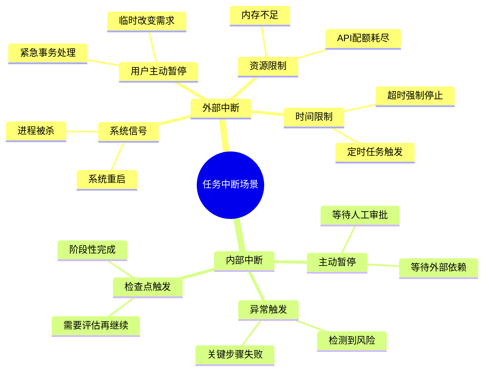

### 1.2 无中断恢复机制的后果

| 场景 | 无恢复机制 | 有恢复机制 |
|------|----------|----------|
| **长程调研中断** | 全部重来,浪费数小时工作 | 从最近检查点继续 |
| **批量处理中断** | 已处理数据丢失,需重新处理 | 已处理部分保留,只处理剩余 |
| **多步推理中断** | 中间结论丢失,推理链断裂 | 恢复中间状态,继续推理 |
| **代码生成中断** | 已生成代码丢失 | 恢复上下文,继续生成 |
| **审批等待** | 阻塞等待或放弃任务 | 暂停保存,审批后恢复 |

### 1.3 中断 vs 重试的区别

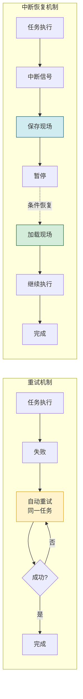

| 对比维度 | 重试机制 | 中断恢复机制 |
|---------|---------|------------|
| **触发原因** | 执行失败 | 外部/内部中断信号 |
| **执行对象** | 重新执行同一任务 | 从中断点继续 |
| **状态处理** | 重置初始状态 | 保存并恢复中间状态 |
| **时间间隔** | 立即或短暂延迟后 | 可能数小时甚至数天 |
| **目标** | 克服瞬时故障 | 跨越长时间中断 |
| **参考文档** | [44Agent任务重试机制](44Agent任务重试机制完整设计与实现.md) | 本文档 |

### 1.4 核心设计目标

1. **准确性**:恢复后状态与中断前完全一致
2. **完整性**:所有执行上下文不丢失
3. **高效性**:状态保存和恢复的开销最小化
4. **可靠性**:持久化存储不因系统崩溃丢失
5. **灵活性**:支持多种中断原因和恢复时机

---

## 二、整体架构设计

### 2.1 中断恢复系统架构总览

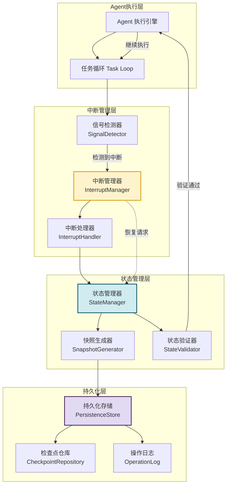

### 2.2 核心组件职责

| 组件 | 职责 | 关键接口 |
|------|------|---------|
| **InterruptManager** | 统一管理中断信号的接收、分类、分发 | `register_handler()`, `trigger_interrupt()` |
| **SignalDetector** | 实时检测各类中断信号(信号、事件、条件) | `detect()`, `subscribe()` |
| **InterruptHandler** | 处理中断,协调状态保存和暂停 | `handle()`, `pause()`, `resume()` |
| **StateManager** | 管理任务状态的保存、加载、验证 | `save_state()`, `load_state()`, `verify()` |
| **SnapshotGenerator** | 生成任务状态快照 | `generate_snapshot()`, `serialize()` |
| **StateValidator** | 恢复时验证状态一致性和有效性 | `validate()`, `check_consistency()` |
| **PersistenceStore** | 将状态持久化到外部存储 | `persist()`, `retrieve()`, `delete()` |
| **CheckpointRepository** | 管理检查点的生命周期 | `create()`, `list()`, `cleanup()` |
| **OperationLog** | 记录操作日志,支持回放和审计 | `append()`, `replay()` |

### 2.3 中断恢复完整流程

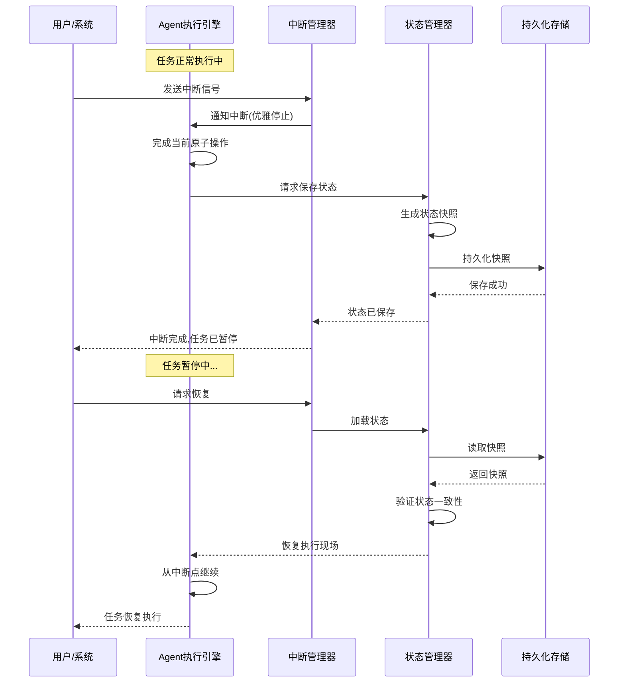

---

## 三、可中断任务类型与边界条件

### 3.1 可中断任务类型分类

并非所有任务都适合中断,需要根据任务特性判断可中断性:

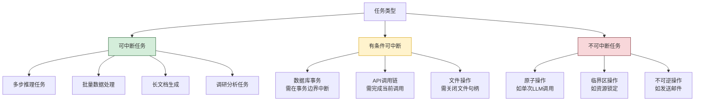

### 3.2 可中断任务的边界条件

#### 3.2.1 可中断点定义

**可中断点**是任务执行过程中允许安全中断的位置。在这些位置,系统状态是完整且可恢复的。

```python
from enum import Enum
from dataclasses import dataclass
from typing import Any, Callable

class Interruptibility(Enum):
    """任务可中断性枚举"""
    FULLY_INTERRUPTIBLE = "fully_interruptible"      # 完全可中断
    CONDITIONAL = "conditional"                      # 有条件可中断
    NON_INTERRUPTIBLE = "non_interruptible"           # 不可中断


@dataclass
class TaskStep:
    """任务步骤定义"""
    step_id: str
    name: str
    interruptibility: Interruptibility
    safe_interrupt_points: list[str]    # 安全中断点列表
    pre_interrupt_hook: Callable = None  # 中断前钩子(清理资源)
    post_resume_hook: Callable = None    # 恢复后钩子(重建资源)


# 示例:定义一个可中断的调研任务
research_task_steps = [
    TaskStep(
        step_id="collect_sources",
        name="收集数据源",
        interruptibility=Interruptibility.FULLY_INTERRUPTIBLE,
        safe_interrupt_points=["after_each_source", "before_analysis"]
    ),
    TaskStep(
        step_id="analyze_data",
        name="分析数据",
        interruptibility=Interruptibility.CONDITIONAL,
        safe_interrupt_points=["after_each_analysis_chunk"],
        pre_interrupt_hook=lambda: save_intermediate_results()
    ),
    TaskStep(
        step_id="generate_report",
        name="生成报告",
        interruptibility=Interruptibility.CONDITIONAL,
        safe_interrupt_points=["after_each_section"],
        post_resume_hook=lambda: rebuild_context_window()
    ),
    TaskStep(
        step_id="send_email",
        name="发送报告邮件",
        interruptibility=Interruptibility.NON_INTERRUPTIBLE,
        safe_interrupt_points=[]  # 不可中断
    )
]
```

#### 3.2.2 边界条件判定规则

| 条件 | 判定规则 | 处理策略 |
|------|---------|---------|
| **当前操作是否原子** | 单次 LLM 调用、单次 DB 写入为原子操作 | 等待原子操作完成再中断 |
| **是否持有锁资源** | 检查是否持有文件锁、DB 锁、分布式锁 | 释放锁后中断,恢复时重新获取 |
| **是否在事务中** | 检查是否在 DB 事务或分布式事务中 | 提交或回滚事务后中断 |
| **是否在临界区** | 检查是否在代码临界区 | 离开临界区后中断 |
| **是否有未刷新缓冲** | 检查是否有未写入的缓冲数据 | 刷新缓冲后中断 |

### 3.3 中断安全点设计

```python
class SafeInterruptPoint:
    """安全中断点"""

    def __init__(self, point_id: str, condition: str,
                 pre_actions: list[Callable] = None,
                 post_actions: list[Callable] = None):
        self.point_id = point_id
        self.condition = condition
        self.pre_actions = pre_actions or []    # 中断前执行
        self.post_actions = post_actions or []  # 恢复后执行


class InterruptSafeExecutor:
    """中断安全执行器"""

    def __init__(self):
        self.interrupt_points: dict[str, SafeInterruptPoint] = {}
        self.current_interrupt_point: str = None

    def register_interrupt_point(self, point: SafeInterruptPoint):
        """注册安全中断点"""
        self.interrupt_points[point.point_id] = point

    async def execute_with_interrupt_check(self, step_id: str,
                                             point_id: str,
                                             action: Callable):
        """在安全中断点执行操作"""
        point = self.interrupt_points.get(point_id)
        if point:
            # 执行中断前动作(如保存中间状态)
            for pre_action in point.pre_actions:
                await pre_action()

        self.current_interrupt_point = point_id

        # 检查是否有挂起的中断信号
        if self._has_pending_interrupt():
            await self._handle_pending_interrupt(point_id)
            return None

        # 执行实际操作
        result = await action()

        # 执行中断后动作(恢复时执行)
        # 这些动作会被记录,在恢复时执行
        self._record_post_actions(point_id, point.post_actions if point else [])

        return result
```

---

## 四、中断触发机制

### 4.1 中断信号类型

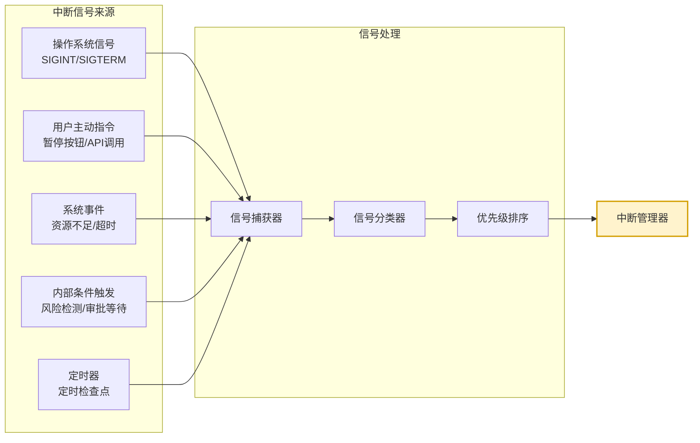

### 4.2 中断信号定义

```python
from enum import Enum
from dataclasses import dataclass, field
import time

class InterruptType(Enum):
    """中断类型"""
    USER_PAUSE = "user_pause"              # 用户主动暂停
    SYSTEM_SIGNAL = "system_signal"        # 系统信号(SIGINT等)
    RESOURCE_LIMIT = "resource_limit"      # 资源限制
    TIMEOUT = "timeout"                    # 超时
    APPROVAL_WAIT = "approval_wait"        # 等待审批
    RISK_DETECTED = "risk_detected"        # 检测到风险
    CHECKPOINT = "checkpoint"              # 定时检查点
    ERROR_RECOVERY = "error_recovery"      # 错误恢复


class InterruptPriority(Enum):
    """中断优先级"""
    LOW = 1       # 可延迟处理(如检查点)
    MEDIUM = 2    # 尽快处理(如审批等待)
    HIGH = 3      # 立即处理(如资源不足)
    CRITICAL = 4  # 强制中断(如系统信号)


@dataclass
class InterruptSignal:
    """中断信号"""
    signal_id: str
    interrupt_type: InterruptType
    priority: InterruptPriority
    reason: str
    timestamp: float = field(default_factory=time.time)
    source: str = ""                     # 信号来源
    metadata: dict = field(default_factory=dict)
    can_resume: bool = True              # 是否可恢复
    resume_condition: str = ""           # 恢复条件描述


@dataclass
class InterruptContext:
    """中断上下文"""
    signal: InterruptSignal
    task_id: str
    step_id: str
    interrupt_point: str
    handled_at: float = None
    state_snapshot_id: str = ""
```

### 4.3 信号检测与捕获

```python
import signal
import asyncio
from typing import Optional

class SignalDetector:
    """信号检测器:捕获各类中断信号"""

    def __init__(self, interrupt_manager):
        self.interrupt_manager = interrupt_manager
        self.pending_signals: asyncio.Queue = asyncio.Queue()
        self._setup_system_signal_handlers()

    def _setup_system_signal_handlers(self):
        """注册系统信号处理器"""
        # SIGINT (Ctrl+C)
        signal.signal(signal.SIGINT, self._handle_system_signal)
        # SIGTERM (终止信号)
        signal.signal(signal.SIGTERM, self._handle_system_signal)

    def _handle_system_signal(self, signum, frame):
        """处理系统信号"""
        signal_map = {
            signal.SIGINT: InterruptType.SYSTEM_SIGNAL,
            signal.SIGTERM: InterruptType.SYSTEM_SIGNAL
        }
        interrupt_type = signal_map.get(signum, InterruptType.SYSTEM_SIGNAL)

        sig = InterruptSignal(
            signal_id=f"sys_{signum}_{int(time.time())}",
            interrupt_type=interrupt_type,
            priority=InterruptPriority.CRITICAL,
            reason=f"Received system signal {signum}",
            source="system"
        )
        # 异步放入队列
        asyncio.create_task(self.pending_signals.put(sig))

    async def detect_user_pause(self, task_id: str,
                                  reason: str = "User requested pause"):
        """检测用户暂停请求"""
        sig = InterruptSignal(
            signal_id=f"user_{task_id}_{int(time.time())}",
            interrupt_type=InterruptType.USER_PAUSE,
            priority=InterruptPriority.MEDIUM,
            reason=reason,
            source="user",
            can_resume=True
        )
        await self.pending_signals.put(sig)

    async def detect_resource_limit(self, resource: str,
                                      current_usage: float,
                                      threshold: float):
        """检测资源限制"""
        if current_usage > threshold:
            sig = InterruptSignal(
                signal_id=f"res_{resource}_{int(time.time())}",
                interrupt_type=InterruptType.RESOURCE_LIMIT,
                priority=InterruptPriority.HIGH,
                reason=f"Resource {resource} usage {current_usage} exceeds threshold {threshold}",
                source="monitor",
                metadata={"resource": resource, "usage": current_usage}
            )
            await self.pending_signals.put(sig)

    async def detect_timeout(self, task_id: str, elapsed: float,
                               limit: float):
        """检测超时"""
        if elapsed > limit:
            sig = InterruptSignal(
                signal_id=f"timeout_{task_id}_{int(time.time())}",
                interrupt_type=InterruptType.TIMEOUT,
                priority=InterruptPriority.HIGH,
                reason=f"Task {task_id} timed out after {elapsed}s",
                source="timer"
            )
            await self.pending_signals.put(sig)

    async def listen(self):
        """持续监听信号"""
        while True:
            sig = await self.pending_signals.get()
            await self.interrupt_manager.handle_signal(sig)
```

### 4.4 中断管理器

```python
class InterruptManager:
    """中断管理器:统一管理中断信号"""

    def __init__(self, state_manager):
        self.state_manager = state_manager
        self.active_interrupts: dict[str, InterruptContext] = {}
        self.signal_handlers: dict[InterruptType, list] = {}
        self.is_paused = False

    def register_handler(self, interrupt_type: InterruptType,
                          handler: Callable):
        """注册中断处理器"""
        self.signal_handlers.setdefault(interrupt_type, []).append(handler)

    async def handle_signal(self, signal: InterruptSignal):
        """处理中断信号"""
        # 创建中断上下文
        context = InterruptContext(
            signal=signal,
            task_id=self.state_manager.current_task_id,
            step_id=self.state_manager.current_step_id,
            interrupt_point=self.state_manager.current_interrupt_point
        )

        # 记录活跃中断
        self.active_interrupts[signal.signal_id] = context

        # 根据优先级处理
        if signal.priority == InterruptPriority.CRITICAL:
            # 立即中断
            await self._immediate_interrupt(context)
        else:
            # 延迟到安全点中断
            await self._deferred_interrupt(context)

    async def _immediate_interrupt(self, context: InterruptContext):
        """立即中断(强制)"""
        # 执行预中断钩子
        await self.state_manager.execute_pre_interrupt_hooks()

        # 保存状态
        snapshot_id = await self.state_manager.save_state(context)

        context.handled_at = time.time()
        context.state_snapshot_id = snapshot_id

        # 标记暂停
        self.is_paused = True

        # 执行特定类型处理器
        handlers = self.signal_handlers.get(
            context.signal.interrupt_type, []
        )
        for handler in handlers:
            await handler(context)

    async def _deferred_interrupt(self, context: InterruptContext):
        """延迟中断(等待安全点)"""
        # 标记有挂起的中断
        self.state_manager.pending_interrupt = context

        # 在下一个安全中断点处理
        # (实际处理在 SafeInterruptExecutor 中触发)

    async def resume(self, task_id: str) -> bool:
        """恢复任务"""
        # 加载状态
        loaded = await self.state_manager.load_state(task_id)
        if not loaded:
            return False

        # 验证状态
        if not await self.state_manager.verify_state(task_id):
            return False

        # 执行恢复后钩子
        await self.state_manager.execute_post_resume_hooks()

        self.is_paused = False
        return True
```

---

## 五、任务状态快照设计

### 5.1 状态快照数据结构

任务状态快照是中断恢复的核心,必须完整记录 Agent 的执行现场:

```mermaid
flowchart TB
    subgraph 任务状态快照组成
        S1[执行上下文<br/>ExecutionContext]
        S2[任务进度<br/>TaskProgress]
        S3[中间结果<br/>IntermediateResults]
        S4[变量状态<br/>VariableState]
        S5[资源引用<br/>ResourceHandles]
        S6[中断元信息<br/>InterruptMeta]
    end

    S1 --> D1[当前任务ID]
    S1 --> D2[当前步骤ID]
    S1 --> D3[调用栈]
    S1 --> D4[Agent配置]

    S2 --> D5[已完成步骤]
    S2 --> D6[当前步骤进度]
    S2 --> D7[剩余步骤]

    S3 --> D8[各步骤输出]
    S3 --> D9[LLM对话历史]
    S3 --> D10[工具调用记录]

    S4 --> D11[全局变量]
    S4 --> D12[局部变量]
    S4 --> D13[上下文窗口内容]

    S5 --> D14[打开的文件]
    S5 --> D15[DB连接]
    S5 --> D16[网络会话]

    S6 --> D17[中断原因]
    S6 --> D18[中断时间]
    S6 --> D19[恢复条件]

    style S1 fill:#d1ecf1,stroke:#0c5460
    style S2 fill:#d4edda,stroke:#155724
    style S3 fill:#fff3cd,stroke:#d39e00
    style S4 fill:#e2d9f3,stroke:#4a235a
    style S5 fill:#fce4ec,stroke:#880e4f
    style S6 fill:#e3f2fd,stroke:#0d47a1
```

### 5.2 快照数据结构实现

```python
from dataclasses import dataclass, field
from typing import Any, Optional
import json
import uuid

@dataclass
class ExecutionContext:
    """执行上下文"""
    task_id: str
    agent_id: str
    current_step_id: str
    current_step_name: str
    call_stack: list[dict]             # 调用栈
    agent_config: dict                 # Agent 配置
    interrupt_point_id: str = ""      # 当前中断点


@dataclass
class TaskProgress:
    """任务进度"""
    total_steps: int
    completed_steps: list[str]        # 已完成步骤ID列表
    current_step_index: int
    remaining_steps: list[str]        # 剩余步骤ID列表
    step_progress: float              # 当前步骤进度 0.0-1.0
    overall_progress: float           # 总体进度 0.0-1.0


@dataclass
class IntermediateResults:
    """中间结果"""
    step_outputs: dict[str, Any]     # 各步骤输出
    llm_messages: list[dict]          # LLM对话历史
    tool_calls: list[dict]            # 工具调用记录
    reasoning_chain: list[str]        # 推理链
    retrieved_context: list[str]     # 检索到的上下文


@dataclass
class VariableState:
    """变量状态"""
    global_variables: dict[str, Any]
    local_variables: dict[str, Any]
    context_window: str               # 上下文窗口内容
    memory_snapshot: dict             # 记忆系统快照


@dataclass
class ResourceHandle:
    """资源引用(序列化形式)"""
    resource_type: str                 # file/db_connection/network
    resource_id: str
    state: dict                       # 资源状态(可重建所需信息)
    can_recreate: bool                 # 是否可重建


@dataclass
class InterruptMeta:
    """中断元信息"""
    interrupt_type: str
    reason: str
    interrupted_at: float
    can_resume: bool
    resume_condition: str
    estimated_resume_time: Optional[float] = None


@dataclass
class TaskStateSnapshot:
    """任务状态快照(完整)"""
    snapshot_id: str
    task_id: str
    version: str                      # 快照格式版本
    created_at: float

    execution_context: ExecutionContext
    task_progress: TaskProgress
    intermediate_results: IntermediateResults
    variable_state: VariableState
    resource_handles: list[ResourceHandle]
    interrupt_meta: InterruptMeta

    checksum: str = ""                # 校验和
    previous_snapshot_id: str = ""   # 前一个快照(链式)

    def to_dict(self) -> dict:
        """转换为字典"""
        return {
            "snapshot_id": self.snapshot_id,
            "task_id": self.task_id,
            "version": self.version,
            "created_at": self.created_at,
            "execution_context": self.execution_context.__dict__,
            "task_progress": self.task_progress.__dict__,
            "intermediate_results": {
                "step_outputs": self.intermediate_results.step_outputs,
                "llm_messages": self.intermediate_results.llm_messages,
                "tool_calls": self.intermediate_results.tool_calls,
                "reasoning_chain": self.intermediate_results.reasoning_chain,
                "retrieved_context": self.intermediate_results.retrieved_context
            },
            "variable_state": {
                "global_variables": self.variable_state.global_variables,
                "local_variables": self.variable_state.local_variables,
                "context_window": self.variable_state.context_window,
                "memory_snapshot": self.variable_state.memory_snapshot
            },
            "resource_handles": [r.__dict__ for r in self.resource_handles],
            "interrupt_meta": self.interrupt_meta.__dict__,
            "checksum": self.checksum,
            "previous_snapshot_id": self.previous_snapshot_id
        }
```

### 5.3 快照存储格式

快照采用 JSON 格式存储,便于跨平台和可读性:

```json
{
    "snapshot_id": "snap_20260807_001",
    "task_id": "task_research_001",
    "version": "1.0",
    "created_at": 1723017600.0,
    "execution_context": {
        "task_id": "task_research_001",
        "agent_id": "agent_research_001",
        "current_step_id": "step_3",
        "current_step_name": "分析数据",
        "call_stack": [
            {"function": "run_research", "line": 45}
        ],
        "agent_config": {
            "model": "gpt-4",
            "temperature": 0.7,
            "max_tokens": 4096
        },
        "interrupt_point_id": "after_data_chunk_2"
    },
    "task_progress": {
        "total_steps": 5,
        "completed_steps": ["step_1", "step_2"],
        "current_step_index": 3,
        "remaining_steps": ["step_4", "step_5"],
        "step_progress": 0.5,
        "overall_progress": 0.5
    },
    "intermediate_results": {
        "step_outputs": {
            "step_1": {"sources": ["source_a", "source_b"]},
            "step_2": {"cleaned_data": [...]}
        },
        "llm_messages": [
            {"role": "user", "content": "..."},
            {"role": "assistant", "content": "..."}
        ],
        "tool_calls": [
            {"tool": "search", "args": {...}, "result": {...}}
        ]
    },
    "variable_state": {
        "global_variables": {
            "research_topic": "AI Agent",
            "target_report_length": 5000
        },
        "local_variables": {
            "current_chunk_index": 2,
            "pending_analysis": [...]
        },
        "context_window": "...",
        "memory_snapshot": {...}
    },
    "resource_handles": [
        {
            "resource_type": "file",
            "resource_id": "temp_analysis.json",
            "state": {"path": "/tmp/temp_analysis.json"},
            "can_recreate": true
        }
    ],
    "interrupt_meta": {
        "interrupt_type": "user_pause",
        "reason": "User requested pause",
        "interrupted_at": 1723017600.0,
        "can_resume": true,
        "resume_condition": "user_approval",
        "estimated_resume_time": null
    },
    "checksum": "sha256:abcdef...",
    "previous_snapshot_id": "snap_20260807_000"
}
```

---

## 六、状态保存与持久化方案

### 6.1 持久化存储架构

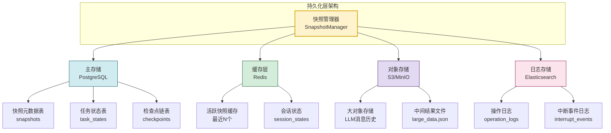

### 6.2 存储格式设计

#### 6.2.1 数据库表结构

```sql
-- 快照元数据表
CREATE TABLE snapshots (
    snapshot_id VARCHAR(64) PRIMARY KEY,
    task_id VARCHAR(64) NOT NULL,
    version VARCHAR(16) NOT NULL,
    created_at TIMESTAMP NOT NULL,
    execution_context JSONB NOT NULL,
    task_progress JSONB NOT NULL,
    variable_state JSONB NOT NULL,
    interrupt_meta JSONB NOT NULL,
    intermediate_results_ref VARCHAR(256),  -- 大对象引用
    resource_handles JSONB,
    checksum VARCHAR(128) NOT NULL,
    previous_snapshot_id VARCHAR(64),
    status VARCHAR(32) DEFAULT 'active',  -- active/archived/deleted
    INDEX idx_task_id (task_id),
    INDEX idx_created_at (created_at)
);

-- 任务状态表
CREATE TABLE task_states (
    task_id VARCHAR(64) PRIMARY KEY,
    task_name VARCHAR(256),
    status VARCHAR(32) NOT NULL,  -- running/paused/resumed/completed
    current_snapshot_id VARCHAR(64),
    created_at TIMESTAMP NOT NULL,
    last_updated TIMESTAMP NOT NULL,
    resume_count INT DEFAULT 0,
    FOREIGN KEY (current_snapshot_id) REFERENCES snapshots(snapshot_id)
);

-- 操作日志表
CREATE TABLE operation_logs (
    log_id BIGSERIAL PRIMARY KEY,
    task_id VARCHAR(64) NOT NULL,
    snapshot_id VARCHAR(64),
    operation VARCHAR(64) NOT NULL,  -- save/load/verify/cleanup
    operation_data JSONB,
    timestamp TIMESTAMP NOT NULL,
    success BOOLEAN NOT NULL,
    error_message TEXT,
    INDEX idx_task_id (task_id),
    INDEX idx_snapshot_id (snapshot_id)
);
```

#### 6.2.2 大对象分离存储

对于 LLM 消息历史、大型中间结果等大对象,采用对象存储分离:

```python
class LargeObjectStore:
    """大对象存储(基于文件系统或对象存储)"""

    def __init__(self, base_path: str = "./snapshots/objects"):
        self.base_path = Path(base_path)
        self.base_path.mkdir(parents=True, exist_ok=True)

    async def store(self, key: str, data: Any) -> str:
        """存储大对象,返回引用ID"""
        obj_id = f"obj_{hashlib.md5(key.encode()).hexdigest()[:16]}"
        file_path = self.base_path / f"{obj_id}.json"

        with open(file_path, 'w', encoding='utf-8') as f:
            json.dump(data, f, ensure_ascii=False, default=str)

        return str(file_path)

    async def retrieve(self, ref: str) -> Any:
        """读取大对象"""
        with open(ref, 'r', encoding='utf-8') as f:
            return json.load(f)

    async def delete(self, ref: str):
        """删除大对象"""
        path = Path(ref)
        if path.exists():
            path.unlink()
```

### 6.3 快照生成器

```python
import hashlib
import json

class SnapshotGenerator:
    """快照生成器"""

    VERSION = "1.0"

    def __init__(self, large_object_store: LargeObjectStore):
        self.large_object_store = large_object_store

    async def generate(self, task_id: str,
                         execution_context: ExecutionContext,
                         task_progress: TaskProgress,
                         intermediate_results: IntermediateResults,
                         variable_state: VariableState,
                         resource_handles: list[ResourceHandle],
                         interrupt_meta: InterruptMeta,
                         previous_snapshot_id: str = "") -> TaskStateSnapshot:

        # 大对象分离存储
        results_ref = await self.large_object_store.store(
            key=f"{task_id}_results_{time.time()}",
            data={
                "step_outputs": intermediate_results.step_outputs,
                "llm_messages": intermediate_results.llm_messages,
                "tool_calls": intermediate_results.tool_calls,
                "reasoning_chain": intermediate_results.reasoning_chain,
                "retrieved_context": intermediate_results.retrieved_context
            }
        )

        # 生成快照
        snapshot = TaskStateSnapshot(
            snapshot_id=f"snap_{task_id}_{int(time.time()*1000)}",
            task_id=task_id,
            version=self.VERSION,
            created_at=time.time(),
            execution_context=execution_context,
            task_progress=task_progress,
            intermediate_results=intermediate_results,
            variable_state=variable_state,
            resource_handles=resource_handles,
            interrupt_meta=interrupt_meta,
            previous_snapshot_id=previous_snapshot_id
        )

        # 计算校验和
        snapshot.checksum = self._calculate_checksum(snapshot)

        return snapshot

    def _calculate_checksum(self, snapshot: TaskStateSnapshot) -> str:
        """计算快照校验和"""
        data = snapshot.to_dict()
        # 排除 checksum 字段本身
        data.pop("checksum", None)
        # 序列化并计算哈希
        content = json.dumps(data, sort_keys=True, default=str)
        return f"sha256:{hashlib.sha256(content.encode()).hexdigest()}"
```

### 6.4 持久化存储实现

```python
class PersistenceStore:
    """持久化存储"""

    def __init__(self, db_connection, cache_client,
                 large_object_store: LargeObjectStore):
        self.db = db_connection
        self.cache = cache_client
        self.large_object_store = large_object_store

    async def save_snapshot(self, snapshot: TaskStateSnapshot):
        """保存快照"""
        # 1. 大对象存储
        results_ref = await self.large_object_store.store(
            key=snapshot.snapshot_id,
            data={
                "step_outputs": snapshot.intermediate_results.step_outputs,
                "llm_messages": snapshot.intermediate_results.llm_messages,
                "tool_calls": snapshot.intermediate_results.tool_calls
            }
        )

        # 2. 主存储(数据库)
        query = """
            INSERT INTO snapshots
            (snapshot_id, task_id, version, created_at,
             execution_context, task_progress, variable_state,
             interrupt_meta, intermediate_results_ref,
             resource_handles, checksum, previous_snapshot_id, status)
            VALUES ($1, $2, $3, $4, $5, $6, $7, $8, $9, $10, $11, $12, 'active')
        """
        await self.db.execute(query,
            snapshot.snapshot_id,
            snapshot.task_id,
            snapshot.version,
            snapshot.created_at,
            json.dumps(snapshot.execution_context.__dict__),
            json.dumps(snapshot.task_progress.__dict__),
            json.dumps(snapshot.variable_state.__dict__),
            json.dumps(snapshot.interrupt_meta.__dict__),
            results_ref,
            json.dumps([r.__dict__ for r in snapshot.resource_handles]),
            snapshot.checksum,
            snapshot.previous_snapshot_id
        )

        # 3. 缓存(活跃快照)
        await self.cache.setex(
            f"snapshot:{snapshot.snapshot_id}",
            3600,  # 1小时过期
            json.dumps(snapshot.to_dict(), default=str)
        )

        # 4. 记录日志
        await self._log_operation(
            snapshot.task_id, snapshot.snapshot_id,
            "save", {"size": len(json.dumps(snapshot.to_dict()))},
            success=True
        )

    async def load_snapshot(self, snapshot_id: str) -> Optional[TaskStateSnapshot]:
        """加载快照"""
        # 1. 先查缓存
        cached = await self.cache.get(f"snapshot:{snapshot_id}")
        if cached:
            data = json.loads(cached)
            return self._dict_to_snapshot(data)

        # 2. 查数据库
        query = "SELECT * FROM snapshots WHERE snapshot_id = $1"
        row = await self.db.fetchrow(query, snapshot_id)
        if not row:
            return None

        # 3. 加载大对象
        results_data = await self.large_object_store.retrieve(
            row['intermediate_results_ref']
        )

        # 4. 重建快照对象
        snapshot = self._rebuild_snapshot(row, results_data)

        # 5. 回填缓存
        await self.cache.setex(
            f"snapshot:{snapshot_id}",
            3600,
            json.dumps(snapshot.to_dict(), default=str)
        )

        return snapshot

    async def get_latest_snapshot(self, task_id: str) -> Optional[TaskStateSnapshot]:
        """获取任务最新的快照"""
        query = """
            SELECT snapshot_id FROM snapshots
            WHERE task_id = $1 AND status = 'active'
            ORDER BY created_at DESC LIMIT 1
        """
        row = await self.db.fetchrow(query, task_id)
        if not row:
            return None
        return await self.load_snapshot(row['snapshot_id'])

    async def cleanup_old_snapshots(self, task_id: str, keep_count: int = 5):
        """清理旧快照,只保留最近N个"""
        query = """
            UPDATE snapshots SET status = 'archived'
            WHERE task_id = $1 AND snapshot_id NOT IN (
                SELECT snapshot_id FROM snapshots
                WHERE task_id = $1 AND status = 'active'
                ORDER BY created_at DESC LIMIT $2
            )
        """
        await self.db.execute(query, task_id, keep_count)

    async def _log_operation(self, task_id: str, snapshot_id: str,
                              operation: str, data: dict, success: bool,
                              error: str = ""):
        """记录操作日志"""
        query = """
            INSERT INTO operation_logs
            (task_id, snapshot_id, operation, operation_data,
             timestamp, success, error_message)
            VALUES ($1, $2, $3, $4, $5, $6, $7)
        """
        await self.db.execute(query,
            task_id, snapshot_id, operation,
            json.dumps(data), time.time(), success, error
        )

    def _rebuild_snapshot(self, row, results_data) -> TaskStateSnapshot:
        """从数据库行重建快照对象"""
        # (实现略,根据表结构重建)
        pass
```

---

## 七、中断信号捕获与处理逻辑

### 7.1 中断处理流程

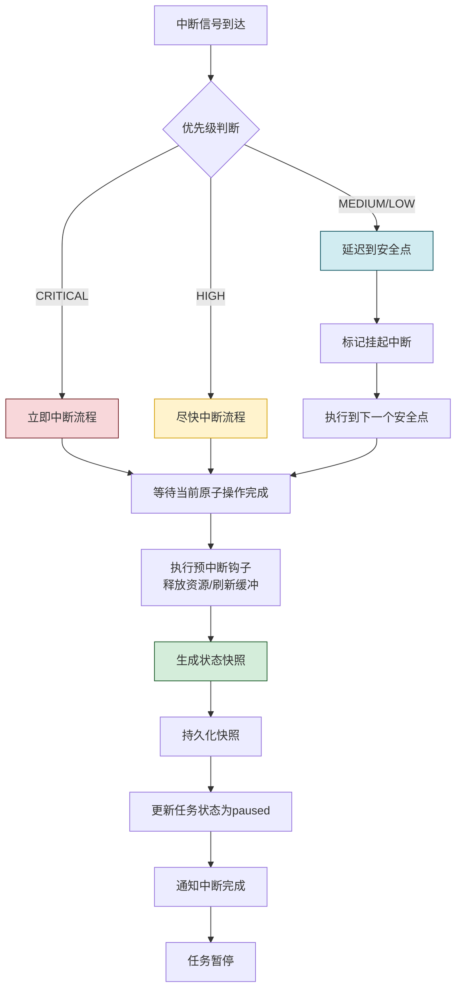

### 7.2 中断处理器实现

```python
class InterruptHandler:
    """中断处理器"""

    def __init__(self, state_manager, snapshot_generator,
                 persistence_store):
        self.state_manager = state_manager
        self.snapshot_generator = snapshot_generator
        self.persistence_store = persistence_store

    async def handle_interrupt(self, context: InterruptContext):
        """处理中断"""
        try:
            # Step 1: 等待安全中断点
            await self._wait_for_safe_point(context)

            # Step 2: 执行预中断钩子
            await self._execute_pre_interrupt_hooks(context)

            # Step 3: 收集当前状态
            current_state = await self.state_manager.collect_current_state()

            # Step 4: 生成快照
            snapshot = await self.snapshot_generator.generate(
                task_id=context.task_id,
                execution_context=current_state.execution_context,
                task_progress=current_state.task_progress,
                intermediate_results=current_state.intermediate_results,
                variable_state=current_state.variable_state,
                resource_handles=current_state.resource_handles,
                interrupt_meta=self._build_interrupt_meta(context),
                previous_snapshot_id=current_state.previous_snapshot_id
            )

            # Step 5: 持久化快照
            await self.persistence_store.save_snapshot(snapshot)

            # Step 6: 更新任务状态
            await self.state_manager.update_task_status(
                context.task_id, "paused", snapshot.snapshot_id
            )

            # Step 7: 记录中断事件
            await self._log_interrupt_event(context, snapshot)

            context.handled_at = time.time()
            context.state_snapshot_id = snapshot.snapshot_id

            return snapshot

        except Exception as e:
            await self._handle_interrupt_failure(context, e)
            raise

    async def _wait_for_safe_point(self, context: InterruptContext):
        """等待安全中断点"""
        if context.signal.priority == InterruptPriority.CRITICAL:
            # 立即中断,不等待
            return

        # 等待当前操作完成或到达安全点
        timeout = 30 if context.signal.priority == InterruptPriority.HIGH else 300
        start = time.time()

        while time.time() - start < timeout:
            if self.state_manager.at_safe_interrupt_point():
                return
            await asyncio.sleep(0.1)

        # 超时后强制中断
        await self.state_manager.force_interrupt()

    async def _execute_pre_interrupt_hooks(self, context: InterruptContext):
        """执行预中断钩子(清理资源)"""
        # 1. 刷新缓冲区
        await self.state_manager.flush_buffers()

        # 2. 关闭文件句柄(记录以便恢复)
        await self.state_manager.close_file_handles()

        # 3. 提交或回滚事务
        await self.state_manager.handle_transactions()

        # 4. 释放锁
        await self.state_manager.release_locks()

        # 5. 记录资源状态
        await self.state_manager.record_resource_states()

    def _build_interrupt_meta(self, context: InterruptContext) -> InterruptMeta:
        """构建中断元信息"""
        return InterruptMeta(
            interrupt_type=context.signal.interrupt_type.value,
            reason=context.signal.reason,
            interrupted_at=time.time(),
            can_resume=context.signal.can_resume,
            resume_condition=context.signal.resume_condition,
            estimated_resume_time=context.signal.metadata.get("estimated_resume_time")
        )
```

### 7.3 在 Agent 执行循环中集成中断检测

```python
class InterruptibleAgent:
    """支持中断的 Agent"""

    def __init__(self, interrupt_manager, state_manager):
        self.interrupt_manager = interrupt_manager
        self.state_manager = state_manager

    async def run_task(self, task: Task) -> TaskResult:
        """运行可中断的任务"""
        self.state_manager.current_task_id = task.id

        # 检查是否有可恢复的任务
        if await self.state_manager.has_resumable_state(task.id):
            # 恢复执行
            return await self._resume_task(task)
        else:
            # 从头开始
            return await self._start_task(task)

    async def _start_task(self, task: Task) -> TaskResult:
        """开始新任务"""
        steps = task.steps
        completed_steps = []

        for i, step in enumerate(steps):
            # 检查中断信号
            if self.interrupt_manager.is_paused:
                # 保存状态后退出
                await self.state_manager.save_current_state(
                    task.id, step.id, completed_steps, i
                )
                return TaskResult(
                    status="paused",
                    task_id=task.id,
                    completed_steps=completed_steps
                )

            # 在安全点检查中断
            await self._check_interrupt_at_safe_point(step)

            # 执行步骤
            result = await self._execute_step(step)
            completed_steps.append(step.id)

            # 定期保存检查点
            if i % 5 == 0:  # 每5步保存一次
                await self.state_manager.save_checkpoint(
                    task.id, step.id, completed_steps, i
                )

        return TaskResult(
            status="completed",
            task_id=task.id,
            completed_steps=completed_steps
        )

    async def _resume_task(self, task: Task) -> TaskResult:
        """恢复任务"""
        # 加载状态
        snapshot = await self.state_manager.load_latest_snapshot(task.id)
        if not snapshot:
            return await self._start_task(task)

        # 验证状态
        if not await self.state_manager.verify_snapshot(snapshot):
            # 状态不一致,从头开始
            return await self._start_task(task)

        # 重建执行现场
        await self.state_manager.rebuild_context(snapshot)

        # 从中断点继续
        completed_steps = snapshot.task_progress.completed_steps
        remaining_steps = snapshot.task_progress.remaining_steps

        for step_id in remaining_steps:
            step = task.get_step(step_id)

            # 检查中断
            if self.interrupt_manager.is_paused:
                await self.state_manager.save_current_state(
                    task.id, step_id, completed_steps,
                    snapshot.task_progress.current_step_index
                )
                return TaskResult(
                    status="paused",
                    task_id=task.id,
                    completed_steps=completed_steps
                )

            result = await self._execute_step(step)
            completed_steps.append(step.id)

        return TaskResult(
            status="completed",
            task_id=task.id,
            completed_steps=completed_steps
        )

    async def _check_interrupt_at_safe_point(self, step: Step):
        """在安全点检查中断"""
        if not step.safe_interrupt_points:
            return

        for point_id in step.safe_interrupt_points:
            # 执行到安全点
            await self._reach_safe_point(point_id)

            # 检查是否有挂起的中断
            if self.interrupt_manager.has_pending_interrupt():
                # 处理中断
                await self.interrupt_manager.handle_pending_interrupt(
                    task_id=self.state_manager.current_task_id,
                    step_id=step.id,
                    interrupt_point=point_id
                )
                # 中断处理后退出
                raise InterruptException(
                    f"Interrupted at safe point {point_id}"
                )

    async def _execute_step(self, step: Step):
        """执行单个步骤(子类实现)"""
        raise NotImplementedError
```

---

## 八、恢复流程设计

### 8.1 恢复流程总览

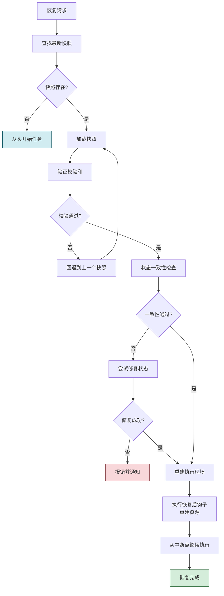

### 8.2 恢复流程实现

```python
class RecoveryManager:
    """恢复管理器"""

    def __init__(self, state_manager, persistence_store,
                 state_validator):
        self.state_manager = state_manager
        self.persistence_store = persistence_store
        self.state_validator = state_validator

    async def recover_task(self, task_id: str) -> RecoveryResult:
        """恢复任务"""
        try:
            # Step 1: 查找最新快照
            snapshot = await self.persistence_store.get_latest_snapshot(task_id)
            if not snapshot:
                return RecoveryResult(
                    success=False,
                    reason="No snapshot found",
                    action="start_fresh"
                )

            # Step 2: 验证快照
            validation = await self.state_validator.validate(snapshot)
            if not validation.is_valid:
                # 尝试回退到上一个快照
                if snapshot.previous_snapshot_id:
                    return await self._recover_from_previous(snapshot)
                else:
                    return RecoveryResult(
                        success=False,
                        reason=f"Snapshot validation failed: {validation.errors}",
                        action="start_fresh"
                    )

            # Step 3: 重建执行现场
            await self.state_manager.rebuild_context(snapshot)

            # Step 4: 执行恢复后钩子
            await self.state_manager.execute_post_resume_hooks()

            # Step 5: 更新任务状态
            await self.state_manager.update_task_status(
                task_id, "resumed", snapshot.snapshot_id
            )

            # Step 6: 记录恢复事件
            await self._log_recovery_event(task_id, snapshot)

            return RecoveryResult(
                success=True,
                snapshot_id=snapshot.snapshot_id,
                resume_from_step=snapshot.execution_context.current_step_id,
                completed_steps=snapshot.task_progress.completed_steps
            )

        except Exception as e:
            return RecoveryResult(
                success=False,
                reason=str(e),
                action="manual_intervention"
            )

    async def _recover_from_previous(self, current_snapshot) -> RecoveryResult:
        """从上一个快照恢复"""
        prev_snapshot = await self.persistence_store.load_snapshot(
            current_snapshot.previous_snapshot_id
        )
        if not prev_snapshot:
            return RecoveryResult(
                success=False,
                reason="No previous snapshot available",
                action="start_fresh"
            )

        # 递归尝试
        return await self.recover_task(prev_snapshot.task_id)
```

### 8.3 状态重建

```python
class StateRebuilder:
    """状态重建器"""

    async def rebuild_context(self, snapshot: TaskStateSnapshot):
        """从快照重建执行现场"""
        # 1. 恢复执行上下文
        await self._restore_execution_context(snapshot.execution_context)

        # 2. 恢复任务进度
        self.task_progress = snapshot.task_progress

        # 3. 恢复中间结果
        await self._restore_intermediate_results(snapshot.intermediate_results)

        # 4. 恢复变量状态
        await self._restore_variables(snapshot.variable_state)

        # 5. 重建资源引用
        await self._rebuild_resources(snapshot.resource_handles)

        # 6. 恢复记忆系统
        await self._restore_memory(snapshot.variable_state.memory_snapshot)

    async def _restore_execution_context(self, ctx: ExecutionContext):
        """恢复执行上下文"""
        self.current_task_id = ctx.task_id
        self.current_step_id = ctx.current_step_id
        self.agent_config = ctx.agent_config
        # 注意:调用栈需要重建

    async def _restore_intermediate_results(self, results: IntermediateResults):
        """恢复中间结果"""
        self.step_outputs = results.step_outputs
        self.llm_messages = results.llm_messages
        self.tool_calls = results.tool_calls
        self.reasoning_chain = results.reasoning_chain
        self.retrieved_context = results.retrieved_context

    async def _restore_variables(self, var_state: VariableState):
        """恢复变量"""
        self.global_variables = var_state.global_variables
        self.local_variables = var_state.local_variables
        self.context_window = var_state.context_window

    async def _rebuild_resources(self, handles: list[ResourceHandle]):
        """重建资源引用"""
        for handle in handles:
            if handle.can_recreate:
                if handle.resource_type == "file":
                    # 重新打开文件
                    path = handle.state.get("path")
                    self.file_handles[handle.resource_id] = open(path, 'a')
                elif handle.resource_type == "db_connection":
                    # 重新建立DB连接
                    await self._recreate_db_connection(handle.state)
                elif handle.resource_type == "network":
                    # 重新建立网络会话
                    await self._recreate_network_session(handle.state)
```

---

## 九、状态验证与一致性检查

### 9.1 验证机制设计

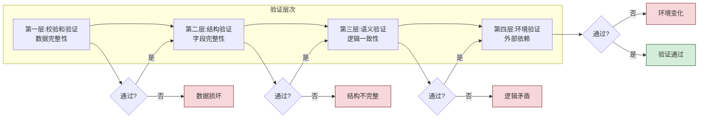

### 9.2 状态验证器实现

```python
class StateValidator:
    """状态验证器"""

    async def validate(self, snapshot: TaskStateSnapshot) -> ValidationResult:
        """完整验证"""
        errors = []

        # 1. 校验和验证
        if not self._verify_checksum(snapshot):
            errors.append("Checksum mismatch: data may be corrupted")
            return ValidationResult(is_valid=False, errors=errors)

        # 2. 结构验证
        struct_errors = self._validate_structure(snapshot)
        errors.extend(struct_errors)

        # 3. 语义验证
        semantic_errors = await self._validate_semantics(snapshot)
        errors.extend(semantic_errors)

        # 4. 环境验证
        env_errors = await self._validate_environment(snapshot)
        errors.extend(env_errors)

        return ValidationResult(
            is_valid=len(errors) == 0,
            errors=errors
        )

    def _verify_checksum(self, snapshot: TaskStateSnapshot) -> bool:
        """验证校验和"""
        expected = snapshot.checksum
        actual = self._calculate_checksum(snapshot)
        return expected == actual

    def _validate_structure(self, snapshot: TaskStateSnapshot) -> list[str]:
        """结构验证"""
        errors = []

        # 检查必填字段
        if not snapshot.task_id:
            errors.append("Missing task_id")
        if not snapshot.execution_context.current_step_id:
            errors.append("Missing current_step_id")

        # 检查进度一致性
        progress = snapshot.task_progress
        if progress.current_step_index < 0 or \
           progress.current_step_index > progress.total_steps:
            errors.append("Invalid step index")

        if len(progress.completed_steps) > progress.total_steps:
            errors.append("Completed steps exceed total steps")

        return errors

    async def _validate_semantics(self, snapshot: TaskStateSnapshot) -> list[str]:
        """语义验证"""
        errors = []

        # 检查步骤输出与步骤的对应关系
        completed = set(snapshot.task_progress.completed_steps)
        outputs = set(snapshot.intermediate_results.step_outputs.keys())
        if not completed.issubset(outputs):
            missing = completed - outputs
            errors.append(f"Missing outputs for completed steps: {missing}")

        # 检查中断点是否有效
        step_id = snapshot.execution_context.current_step_id
        if step_id and not self._is_valid_interrupt_point(step_id):
            errors.append(f"Invalid interrupt point: {step_id}")

        # 检查变量引用有效性
        for var_name, var_value in snapshot.variable_state.global_variables.items():
            if not self._is_valid_variable(var_name, var_value):
                errors.append(f"Invalid variable: {var_name}")

        return errors

    async def _validate_environment(self, snapshot: TaskStateSnapshot) -> list[str]:
        """环境验证"""
        errors = []

        # 检查资源是否仍可用
        for handle in snapshot.resource_handles:
            if not await self._check_resource_available(handle):
                errors.append(
                    f"Resource unavailable: {handle.resource_type}:{handle.resource_id}"
                )

        # 检查外部依赖是否变化
        # (如数据库表结构、API端点等)

        return errors

    async def _check_resource_available(self, handle: ResourceHandle) -> bool:
        """检查资源是否可用"""
        if handle.resource_type == "file":
            path = handle.state.get("path", "")
            return Path(path).exists()
        elif handle.resource_type == "db_connection":
            # 检查数据库是否可连接
            return True  # 简化
        return True
```

### 9.3 一致性检查策略

| 检查类型 | 检查内容 | 失败处理 |
|---------|---------|---------|
| **数据完整性** | 校验和是否匹配 | 回退到上一个快照 |
| **结构完整性** | 必填字段是否存在 | 标记损坏,人工介入 |
| **步骤一致性** | 已完成步骤与输出对应 | 补充缺失输出或回退 |
| **变量有效性** | 变量类型和值是否合理 | 重置为默认值 |
| **资源可用性** | 外部资源是否仍存在 | 尝试重建或跳过 |
| **环境一致性** | Agent 配置是否变化 | 提示用户确认 |

---

## 十、完整实现示例

### 10.1 端到端使用示例

```python
async def demo_interruptible_agent():
    """演示可中断 Agent 的完整流程"""

    # 初始化组件
    persistence = PersistenceStore(db, cache, large_obj_store)
    snapshot_gen = SnapshotGenerator(large_obj_store)
    state_manager = StateManager(persistence)
    validator = StateValidator()
    interrupt_manager = InterruptManager(state_manager)
    recovery = RecoveryManager(state_manager, persistence, validator)

    # 创建可中断 Agent
    agent = InterruptibleAgent(interrupt_manager, state_manager)

    # 定义长程任务
    task = Task(
        id="task_research_001",
        name="AI Agent 市场调研",
        steps=[
            Step("step_1", "收集数据源", Interruptibility.FULLY_INTERRUPTIBLE),
            Step("step_2", "清洗数据", Interruptibility.CONDITIONAL),
            Step("step_3", "分析数据", Interruptibility.CONDITIONAL),
            Step("step_4", "生成报告", Interruptibility.FULLY_INTERRUPTIBLE),
            Step("step_5", "发送邮件", Interruptibility.NON_INTERRUPTIBLE)
        ]
    )

    # 场景1:正常执行
    result = await agent.run_task(task)
    print(f"结果: {result.status}")  # completed

    # 场景2:执行中用户暂停
    # (模拟在第3步中断)
    await interrupt_manager.handle_signal(InterruptSignal(
        signal_id="sig_001",
        interrupt_type=InterruptType.USER_PAUSE,
        priority=InterruptPriority.MEDIUM,
        reason="用户需要处理紧急事务"
    ))

    result = await agent.run_task(task)
    print(f"结果: {result.status}")  # paused

    # 场景3:一段时间后恢复
    recovery_result = await recovery.recover_task(task.id)
    if recovery_result.success:
        # 从第3步继续执行
        result = await agent.run_task(task)
        print(f"恢复后结果: {result.status}")  # completed
```

### 10.2 检查点策略示例

```python
class CheckpointStrategy:
    """检查点策略"""

    @staticmethod
    async def periodic_checkpoint(agent, task, interval_steps: int = 5):
        """定期检查点"""
        step_count = 0
        for step in task.steps:
            await agent.execute_step(step)
            step_count += 1
            if step_count % interval_steps == 0:
                await agent.save_checkpoint()

    @staticmethod
    async def milestone_checkpoint(agent, task, milestones: list[str]):
        """里程碑检查点"""
        for step in task.steps:
            await agent.execute_step(step)
            if step.id in milestones:
                await agent.save_checkpoint(tag="milestone")

    @staticmethod
    async def adaptive_checkpoint(agent, task, complexity_threshold: float = 0.7):
        """自适应检查点(基于步骤复杂度)"""
        for step in task.steps:
            await agent.execute_step(step)
            if step.complexity > complexity_threshold:
                await agent.save_checkpoint(tag="high_complexity")
```

---

## 十一、总结与最佳实践

### 11.1 核心设计要点

| 要点 | 说明 |
|------|------|
| **可中断性分级** | 根据任务特性划分完全可中断、有条件可中断、不可中断 |
| **安全中断点** | 在任务定义中明确安全中断点,确保状态完整 |
| **分层持久化** | 元数据走 DB,大对象走对象存储,活跃快照走缓存 |
| **校验和机制** | 快照生成时计算校验和,恢复时验证数据完整性 |
| **多层验证** | 校验和→结构→语义→环境四层验证 |
| **链式快照** | 快照之间形成链表,支持回退到上一个有效快照 |
| **资源重建** | 资源引用序列化,恢复时按需重建 |

### 11.2 最佳实践建议

1. **合理设计安全中断点**:在任务步骤的关键位置定义安全点
2. **避免过度频繁的快照**:快照有成本,按需或定期保存
3. **大对象分离存储**:避免快照过大影响性能
4. **设计快照清理策略**:避免快照无限累积
5. **测试恢复流程**:定期演练中断恢复,确保可靠性
6. **监控快照健康度**:监控快照生成成功率和恢复成功率
7. **版本兼容性**:快照格式版本化,支持向后兼容

### 11.3 与系列文档关系

| 文档 | 主题 | 本文关系 |
|------|------|---------|
| [44Agent任务重试机制完整设计与实现.md](44Agent任务重试机制完整设计与实现.md) | 失败后重试 | 本文处理中断后恢复,二者互补 |
| [45Agent执行状态保存机制完整设计方案.md](45Agent执行状态保存机制完整设计方案.md) | 状态保存基础 | 本文是其在中断恢复场景的深度应用 |
| [40Plan-and-Execute_Agent完整实现方案.md](40Plan-and-Execute_Agent完整实现方案.md) | 规划执行型 Agent | 中断恢复是其关键能力 |
| [38Agent核心工作流程_Observe_Think_Act.md](38Agent核心工作流程_Observe_Think_Act.md) | OTA 工作流 | 中断恢复支持长程 OTA 循环 |

---

> **核心结论**:Agent 任务中断与恢复机制是支撑长程任务可靠执行的关键基础设施。通过"可中断性分级、安全中断点设计、分层状态快照、四层验证机制、链式快照回退"五大核心设计,Agent 能够在面对用户暂停、系统信号、资源限制等中断场景时,准确保存执行现场并在条件允许时无缝恢复,显著提升任务的可靠性和用户体验。
