# 长期运行 Agent 任务系统架构设计完整方案

> 在企业级 Agent 应用中，许多复杂任务需要持续运行数天甚至数周，例如：长周期数据分析、批量文档处理、持续监控与告警、多轮深度研究等。传统的"一次性请求-响应"模式无法支撑此类场景。本文系统性地设计了一套能够稳定运行长期任务的 Agent 系统架构，涵盖任务生命周期管理、状态持久化、错误恢复、资源控制与优先级调度五大核心能力。

---

## 目录

1. [核心挑战分析](#1-核心挑战分析)
2. [整体架构设计](#2-整体架构设计)
3. [任务生命周期管理](#3-任务生命周期管理)
4. [状态持久化机制](#4-状态持久化机制)
5. [错误恢复策略](#5-错误恢复策略)
6. [资源占用控制](#6-资源占用控制)
7. [任务优先级调度](#7-任务优先级调度)
8. [核心组件划分与职责](#8-核心组件划分与职责)
9. [数据流转流程](#9-数据流转流程)
10. [关键技术选型](#10-关键技术选型)
11. [性能优化建议](#11-性能优化建议)
12. [完整代码实现](#12-完整代码实现)
13. [监控与运维](#13-监控与运维)
14. [总结](#14-总结)

---

## 1. 核心挑战分析

### 1.1 长期运行任务的特征

长期运行 Agent 任务与传统短任务有本质区别：

| 维度 | 短任务（秒级/分钟级） | 长期任务（小时/天/周级） |
|------|---------------------|------------------------|
| 执行时长 | < 5 分钟 | 数小时 ~ 数周 |
| 中断概率 | 极低 | 几乎必然发生（进程崩溃、网络抖动、服务重启） |
| 状态数据量 | KB 级 | MB ~ GB 级 |
| 资源占用 | 一次性分配 | 需动态调整与释放 |
| 并发管理 | 简单串行 | 需要队列、调度、限流 |
| 可观测性 | 日志即可 | 需全链路监控、断点恢复 |

### 1.2 五大核心挑战

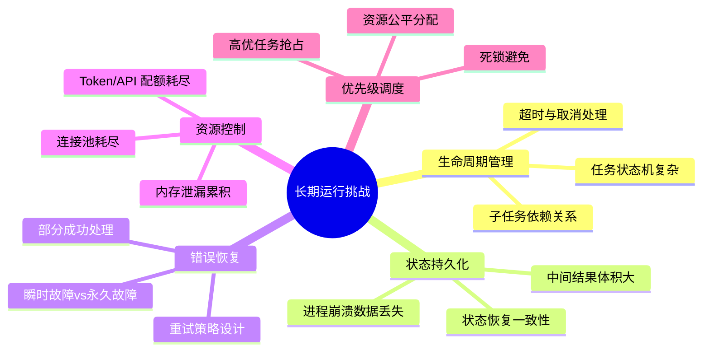

### 1.3 典型场景示例

- **场景 A**：对 10 万份合同进行条款抽取与风险分析（耗时约 3 天）
- **场景 B**：持续监控竞品价格变化并生成日报（7×24 小时运行）
- **场景 C**：多步骤学术研究，包含文献检索、阅读、综述撰写（耗时 1~2 周）

这些场景共同要求：**即使底层基础设施发生故障，任务也能从断点恢复继续执行，而不会从头开始。**

---

## 2. 整体架构设计

### 2.1 分层架构总览

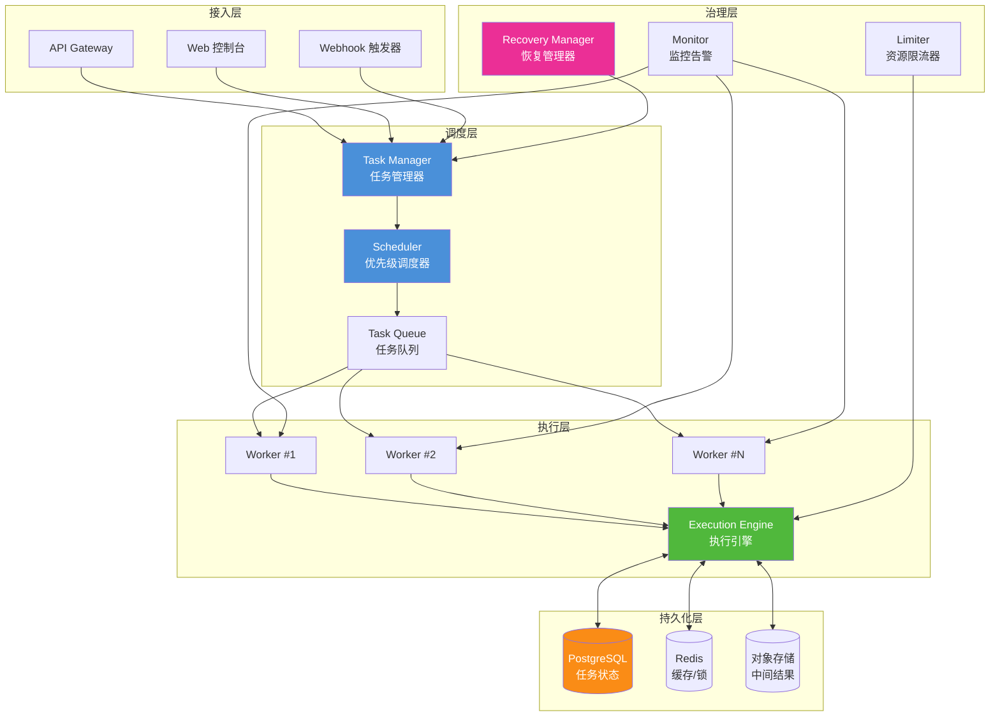

### 2.2 设计原则

1. **幂等性优先**：所有任务操作支持重复执行而不产生副作用
2. **状态外置**：任务状态不依赖进程内存，全部持久化到外部存储
3. **故障隔离**：单个任务崩溃不影响其他任务，Worker 之间相互独立
4. **可观测性**：任务全生命周期状态可查、可追溯
5. **弹性伸缩**：Worker 数量可根据负载动态扩缩容

---

## 3. 任务生命周期管理

### 3.1 任务状态机设计

长期任务需要一套完整的状态机来管理生命周期：

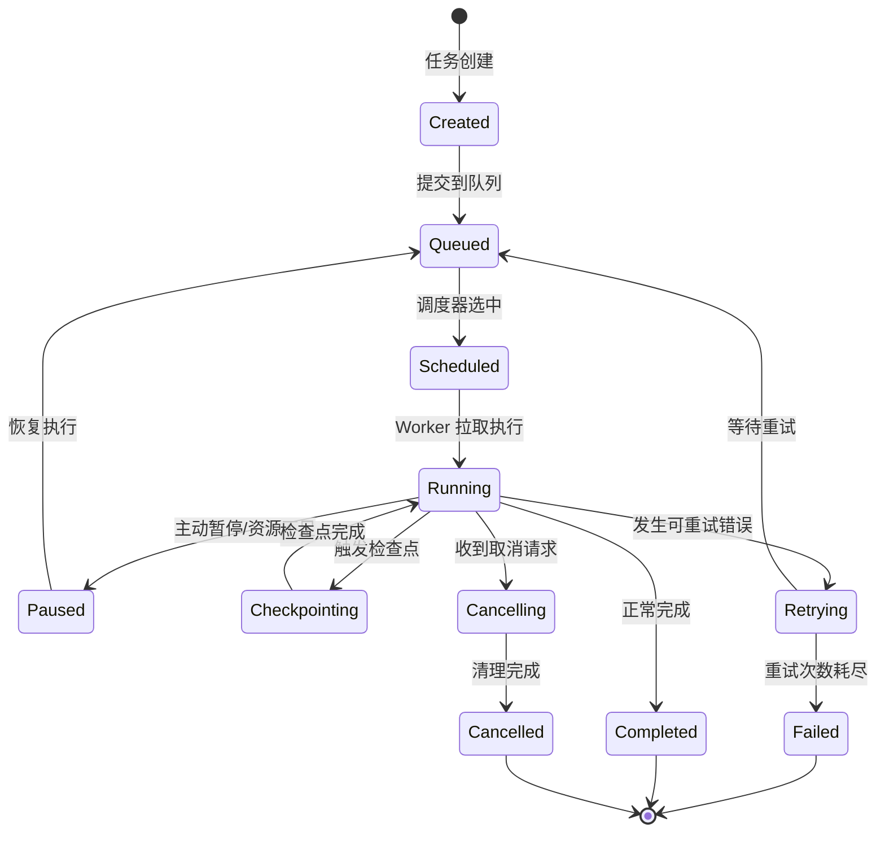

### 3.2 状态定义

```python
from enum import Enum

class TaskState(str, Enum):
    """任务生命周期状态"""
    CREATED = "created"           # 已创建，未提交
    QUEUED = "queued"             # 已入队，等待调度
    SCHEDULED = "scheduled"       # 已调度，待 Worker 拉取
    RUNNING = "running"           # 正在执行
    PAUSED = "paused"             # 已暂停（可恢复）
    CHECKPOINTING = "checkpointing"  # 正在保存检查点
    RETRYING = "retrying"         # 等待重试
    CANCELLING = "cancelling"     # 正在取消清理
    CANCELLED = "cancelled"       #已取消
    COMPLETED = "completed"       # 已完成
    FAILED = "failed"             # 已失败
```

### 3.3 任务模型设计

```python
from pydantic import BaseModel, Field
from typing import Optional, Any, Dict, List
from datetime import datetime
import uuid

class Task(BaseModel):
    """长期运行任务模型"""
    task_id: str = Field(default_factory=lambda: str(uuid.uuid4()))
    name: str                                    # 任务名称
    type: str                                    # 任务类型
    payload: Dict[str, Any]                      # 任务参数
    priority: int = 5                            # 优先级 1-10，10最高
    state: TaskState = TaskState.CREATED
    
    # 时间信息
    created_at: datetime = Field(default_factory=datetime.utcnow)
    started_at: Optional[datetime] = None
    finished_at: Optional[datetime] = None
    timeout_seconds: int = 86400 * 7            # 默认超时 7 天
    
    # 重试配置
    max_retries: int = 5                         # 最大重试次数
    retry_count: int = 0                         # 当前重试次数
    retry_delay_seconds: int = 60                # 初始重试延迟
    
    # 检查点信息
    checkpoint_key: Optional[str] = None         # 最近检查点存储路径
    last_checkpoint_at: Optional[datetime] = None
    
    # 进度信息
    progress: float = 0.0                        # 0.0 ~ 1.0
    current_step: Optional[str] = None           # 当前执行步骤
    
    # 资源限制
    max_memory_mb: int = 2048                    # 内存上限
    max_tokens: int = 1_000_000                  # LLM Token 上限
    used_tokens: int = 0                         # 已用 Token
    
    # 依赖关系
    dependencies: List[str] = []                 # 依赖的前置任务 ID
    subtasks: List[str] = []                     # 子任务 ID 列表
    
    # 结果
    result: Optional[Any] = None
    error: Optional[str] = None
```

### 3.4 子任务与依赖管理

长期任务通常需要拆分为多个子任务：

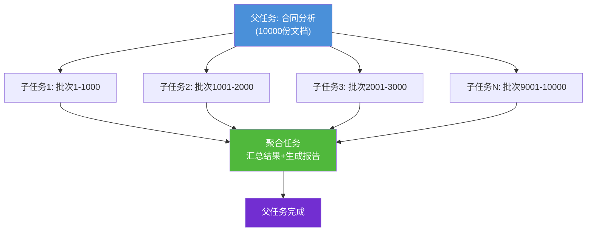

```python
class TaskDAG:
    """任务有向无环图管理器"""
    
    def __init__(self):
        self.tasks: Dict[str, Task] = {}
        self.dependencies: Dict[str, List[str]] = {}  # task_id -> 依赖的task_ids
    
    def can_execute(self, task_id: str) -> bool:
        """检查任务是否所有依赖都已完成"""
        for dep_id in self.dependencies.get(task_id, []):
            dep = self.tasks.get(dep_id)
            if not dep or dep.state != TaskState.COMPLETED:
                return False
        return True
    
    def get_ready_tasks(self) -> List[Task]:
        """获取所有可执行的任务（依赖已完成）"""
        return [
            task for task_id, task in self.tasks.items()
            if task.state == TaskState.QUEUED and self.can_execute(task_id)
        ]
```

---

## 4. 状态持久化机制

### 4.1 持久化分层策略

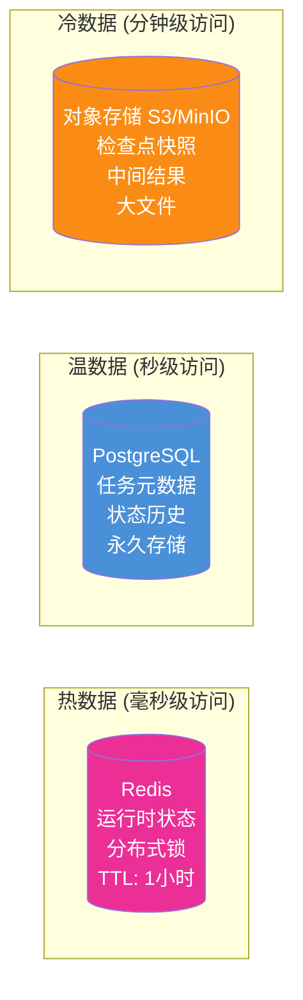

| 数据类型 | 存储介质 | 访问频率 | 保留策略 | 典型大小 |
|---------|---------|---------|---------|---------|
| 运行时状态 | Redis | 高频（每秒） | TTL 1 小时 | < 1 KB |
| 任务元数据 | PostgreSQL | 中频（每分钟） | 永久 | < 10 KB |
| 检查点快照 | 对象存储 | 低频（每 5 分钟） | 7 天 | 1~100 MB |
| 中间结果 | 对象存储 | 偶尔 | 30 天 | 10 KB~1 GB |
| 执行日志 | Elasticsearch | 排查时 | 90 天 | 可变 |

### 4.2 检查点（Checkpoint）机制

检查点是长期任务最关键的机制：定期将任务执行状态保存到外部存储，崩溃后可从最近检查点恢复。

```python
import pickle
import json
from abc import ABC, abstractmethod
from typing import Any

class CheckpointManager(ABC):
    """检查点管理器抽象接口"""
    
    @abstractmethod
    def save(self, task_id: str, state: dict) -> str:
        """保存检查点，返回检查点key"""
        pass
    
    @abstractmethod
    def load(self, checkpoint_key: str) -> dict:
        """加载检查点"""
        pass
    
    @abstractmethod
    def list_checkpoints(self, task_id: str) -> list:
        """列出任务的所有检查点"""
        pass

class S3CheckpointManager(CheckpointManager):
    """基于对象存储的检查点管理器"""
    
    def __init__(self, s3_client, bucket: str):
        self.s3 = s3_client
        self.bucket = bucket
    
    def save(self, task_id: str, state: dict) -> str:
        import time
        timestamp = int(time.time())
        key = f"checkpoints/{task_id}/{timestamp}.json"
        
        # 序列化状态（大对象用pickle，小对象用json）
        data = json.dumps({
            "task_id": task_id,
            "timestamp": timestamp,
            "state": state
        }, ensure_ascii=False, default=str)
        
        self.s3.put_object(
            Bucket=self.bucket,
            Key=key,
            Body=data.encode('utf-8'),
            ContentType='application/json'
        )
        return key
    
    def load(self, checkpoint_key: str) -> dict:
        response = self.s3.get_object(
            Bucket=self.bucket,
            Key=checkpoint_key
        )
        data = json.loads(response['Body'].read().decode('utf-8'))
        return data["state"]
    
    def list_checkpoints(self, task_id: str) -> list:
        response = self.s3.list_objects_v2(
            Bucket=self.bucket,
            Prefix=f"checkpoints/{task_id}/"
        )
        if 'Contents' not in response:
            return []
        return sorted(
            [obj['Key'] for obj in response['Contents']],
            reverse=True  # 最近的在前
        )
```

### 4.3 检查点触发策略

```python
class CheckpointPolicy:
    """检查点触发策略"""
    
    def __init__(self, 
                 interval_seconds: int = 300,
                 step_interval: int = 10,
                 memory_threshold_mb: int = 500):
        self.interval_seconds = interval_seconds  # 时间触发：5分钟
        self.step_interval = step_interval        # 步骤触发：每10步
        self.memory_threshold_mb = memory_threshold_mb  # 内存触发
    
    def should_checkpoint(self, 
                          task: Task, 
                          last_checkpoint_time: datetime,
                          steps_since_checkpoint: int,
                          current_memory_mb: int) -> bool:
        """判断是否需要触发检查点"""
        now = datetime.utcnow()
        
        # 1. 时间触发
        if (now - last_checkpoint_time).total_seconds() >= self.interval_seconds:
            return True
        
        # 2. 步骤触发
        if steps_since_checkpoint >= self.step_interval:
            return True
        
        # 3. 内存触发（防止内存累积导致丢失过多进度）
        if current_memory_mb >= self.memory_threshold_mb:
            return True
        
        return False
```

### 4.4 数据库表结构设计

```sql
-- 任务主表
CREATE TABLE tasks (
    task_id          VARCHAR(64) PRIMARY KEY,
    name             VARCHAR(256) NOT NULL,
    type             VARCHAR(64) NOT NULL,
    payload          JSONB NOT NULL,
    priority         INT DEFAULT 5,
    state            VARCHAR(32) NOT NULL DEFAULT 'created',
    
    created_at       TIMESTAMP DEFAULT CURRENT_TIMESTAMP,
    started_at       TIMESTAMP,
    finished_at      TIMESTAMP,
    timeout_seconds  INT DEFAULT 604800,
    
    max_retries      INT DEFAULT 5,
    retry_count      INT DEFAULT 0,
    retry_delay_seconds INT DEFAULT 60,
    
    checkpoint_key   VARCHAR(512),
    last_checkpoint_at TIMESTAMP,
    
    progress         FLOAT DEFAULT 0.0,
    current_step     VARCHAR(256),
    
    max_memory_mb    INT DEFAULT 2048,
    max_tokens       INT DEFAULT 1000000,
    used_tokens      INT DEFAULT 0,
    
    dependencies     JSONB DEFAULT '[]',
    subtasks         JSONB DEFAULT '[]',
    
    result           JSONB,
    error            TEXT,
    
    INDEX idx_state_priority (state, priority DESC),
    INDEX idx_created_at (created_at),
    INDEX idx_state_scheduled (state, started_at)
);

-- 状态变更历史表（审计追踪）
CREATE TABLE task_state_history (
    id           BIGSERIAL PRIMARY KEY,
    task_id      VARCHAR(64) NOT NULL,
    from_state   VARCHAR(32),
    to_state     VARCHAR(32) NOT NULL,
    reason       TEXT,
    changed_at   TIMESTAMP DEFAULT CURRENT_TIMESTAMP,
    changed_by   VARCHAR(64),
    
    FOREIGN KEY (task_id) REFERENCES tasks(task_id),
    INDEX idx_task_id (task_id),
    INDEX idx_changed_at (changed_at)
);

-- 检查点索引表
CREATE TABLE checkpoints (
    id           BIGSERIAL PRIMARY KEY,
    task_id      VARCHAR(64) NOT NULL,
    storage_key  VARCHAR(512) NOT NULL,
    size_bytes   BIGINT,
    step_number  INT,
    created_at   TIMESTAMP DEFAULT CURRENT_TIMESTAMP,
    
    FOREIGN KEY (task_id) REFERENCES tasks(task_id),
    INDEX idx_task_id_created (task_id, created_at DESC)
);
```

---

## 5. 错误恢复策略

### 5.1 错误分类体系

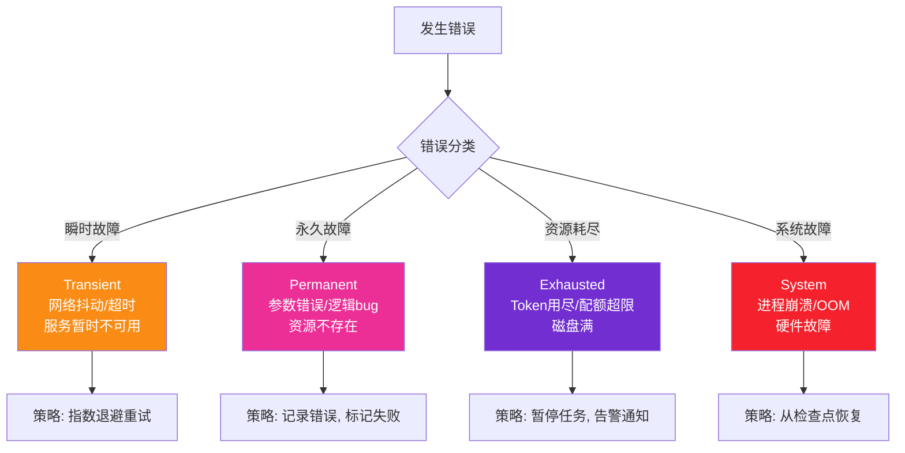

### 5.2 错误分类器

```python
from enum import Enum

class ErrorType(Enum):
    TRANSIENT = "transient"      # 瞬时错误，可重试
    PERMANENT = "permanent"      # 永久错误，不可重试
    RESOURCE = "resource"        # 资源耗尽，需等待或扩容
    SYSTEM = "system"            # 系统级故障，需从检查点恢复

class ErrorClassifier:
    """错误分类器"""
    
    TRANSIENT_PATTERNS = [
        "timeout", "connection reset", "temporarily unavailable",
        "rate limit", "503", "502", "connection refused"
    ]
    
    PERMANENT_PATTERNS = [
        "invalid argument", "not found", "permission denied",
        "unauthorized", "bad request", "400", "404", "403"
    ]
    
    RESOURCE_PATTERNS = [
        "quota exceeded", "out of memory", "disk full",
        "token limit", "too many requests"
    ]
    
    @classmethod
    def classify(cls, error: Exception) -> ErrorType:
        error_msg = str(error).lower()
        
        for pattern in cls.PERMANENT_PATTERNS:
            if pattern in error_msg:
                return ErrorType.PERMANENT
        
        for pattern in cls.RESOURCE_PATTERNS:
            if pattern in error_msg:
                return ErrorType.RESOURCE
        
        for pattern in cls.TRANSIENT_PATTERNS:
            if pattern in error_msg:
                return ErrorType.TRANSIENT
        
        # 默认按系统故障处理
        return ErrorType.SYSTEM
```

### 5.3 指数退避重试策略

```python
import random
import time

class RetryPolicy:
    """指数退避重试策略"""
    
    def __init__(self,
                 max_retries: int = 5,
                 initial_delay: float = 1.0,
                 max_delay: float = 3600.0,
                 multiplier: float = 2.0,
                 jitter: bool = True):
        self.max_retries = max_retries
        self.initial_delay = initial_delay
        self.max_delay = max_delay
        self.multiplier = multiplier
        self.jitter = jitter
    
    def get_delay(self, retry_count: int) -> float:
        """计算第 N 次重试的延迟时间（秒）"""
        delay = self.initial_delay * (self.multiplier ** retry_count)
        delay = min(delay, self.max_delay)
        
        if self.jitter:
            # 添加抖动，防止多个任务同时重试（惊群效应）
            delay = delay * (0.5 + random.random() * 0.5)
        
        return delay
    
    def should_retry(self, error_type: ErrorType, retry_count: int) -> bool:
        """判断是否应该重试"""
        if error_type == ErrorType.PERMANENT:
            return False
        if retry_count >= self.max_retries:
            return False
        return True
```

重试延迟时间表示例：

| 重试次数 | 基础延迟 | 含抖动后 | 累计等待 |
|---------|---------|---------|---------|
| 1 | 1s | 0.5~1s | ~1s |
| 2 | 2s | 1~2s | ~3s |
| 3 | 4s | 2~4s | ~7s |
| 4 | 8s | 4~8s | ~15s |
| 5 | 16s | 8~16s | ~31s |
| 6 | 32s | 16~32s | ~63s |
| 7 | 64s | 32~64s | ~127s |
| 8 | 128s | 64~128s | ~255s |

### 5.4 断路器模式

防止持续失败的任务拖垮整个系统：

```python
from datetime import datetime, timedelta

class CircuitBreaker:
    """断路器：防止故障扩散"""
    
    def __init__(self, 
                 failure_threshold: int = 5,
                 recovery_timeout: int = 300,
                 half_open_max_calls: int = 3):
        self.failure_threshold = failure_threshold
        self.recovery_timeout = recovery_timeout
        self.half_open_max_calls = half_open_max_calls
        
        self.failure_count = 0
        self.state = "closed"  # closed / open / half_open
        self.last_failure_time = None
        self.half_open_calls = 0
    
    def can_execute(self) -> bool:
        """是否允许执行"""
        if self.state == "closed":
            return True
        elif self.state == "open":
            # 检查是否到了恢复时间
            if (datetime.utcnow() - self.last_failure_time).total_seconds() > self.recovery_timeout:
                self.state = "half_open"
                self.half_open_calls = 0
                return True
            return False
        elif self.state == "half_open":
            if self.half_open_calls < self.half_open_max_calls:
                self.half_open_calls += 1
                return True
            return False
    
    def record_success(self):
        """记录成功"""
        if self.state == "half_open":
            self.state = "closed"
        self.failure_count = 0
    
    def record_failure(self):
        """记录失败"""
        self.failure_count += 1
        self.last_failure_time = datetime.utcnow()
        
        if self.state == "half_open":
            self.state = "open"
        elif self.failure_count >= self.failure_threshold:
            self.state = "open"
```

### 5.5 恢复流程

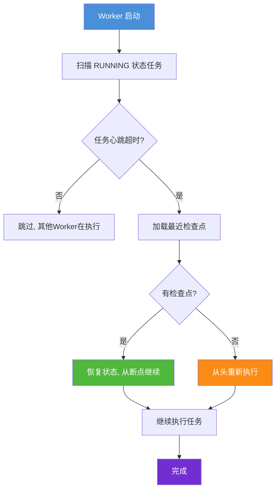

```python
class RecoveryManager:
    """恢复管理器：处理崩溃后的任务恢复"""
    
    def __init__(self, db, checkpoint_mgr: CheckpointManager, heartbeat_timeout: int = 120):
        self.db = db
        self.checkpoint_mgr = checkpoint_mgr
        self.heartbeat_timeout = heartbeat_timeout
    
    def recover_stale_tasks(self):
        """恢复所有心跳超时的运行中任务"""
        # 查找心跳超时的 RUNNING 任务
        stale_tasks = self.db.query("""
            SELECT * FROM tasks 
            WHERE state = 'running'
              AND last_heartbeat_at < NOW() - INTERVAL '%s seconds'
        """ % self.heartbeat_timeout)
        
        for task_row in stale_tasks:
            self._recover_task(task_row)
    
    def _recover_task(self, task_row):
        """恢复单个任务"""
        task = Task(**task_row)
        
        # 更新状态为重试中
        task.state = TaskState.RETRYING
        task.retry_count += 1
        self.db.update_task(task)
        
        if task.retry_count > task.max_retries:
            # 超过最大重试次数，标记失败
            task.state = TaskState.FAILED
            task.error = "Max retries exceeded during recovery"
            self.db.update_task(task)
            return
        
        # 重新入队等待执行
        task.state = TaskState.QUEUED
        self.db.update_task(task)
    
    def restore_from_checkpoint(self, task: Task) -> dict:
        """从检查点恢复任务状态"""
        if not task.checkpoint_key:
            return {}
        
        return self.checkpoint_mgr.load(task.checkpoint_key)
```

---

## 6. 资源占用控制

### 6.1 资源限制维度

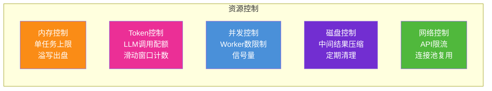

### 6.2 内存控制：溢写出盘机制

长期任务处理大量数据时，内存会持续增长。通过将不活跃的中间结果溢写到磁盘来控制内存：

```python
import os
import tempfile
from collections import OrderedDict

class SpillableCache:
    """可溢写的缓存：内存超出阈值时，将LRU数据写到磁盘"""
    
    def __init__(self, 
                 max_memory_items: int = 1000,
                 spill_dir: str = None):
        self.max_memory_items = max_memory_items
        self.spill_dir = spill_dir or tempfile.mkdtemp(prefix="agent_spill_")
        self.memory_cache: OrderedDict = OrderedDict()
        self.disk_index: dict = {}  # key -> file_path
        os.makedirs(self.spill_dir, exist_ok=True)
    
    def get(self, key: str):
        """获取数据：先查内存，再查磁盘"""
        if key in self.memory_cache:
            # 命中内存，移到末尾（LRU）
            self.memory_cache.move_to_end(key)
            return self.memory_cache[key]
        
        if key in self.disk_index:
            # 从磁盘加载
            file_path = self.disk_index[key]
            with open(file_path, 'rb') as f:
                import pickle
                value = pickle.load(f)
            
            # 加载回内存
            self._evict_if_needed()
            self.memory_cache[key] = value
            return value
        
        return None  # 未找到
    
    def put(self, key: str, value):
        """存入数据"""
        self._evict_if_needed()
        self.memory_cache[key] = value
        self.memory_cache.move_to_end(key)
    
    def _evict_if_needed(self):
        """内存满时溢写最久未使用的数据到磁盘"""
        while len(self.memory_cache) >= self.max_memory_items:
            # 弹出最久未使用的
            key, value = self.memory_cache.popitem(last=False)
            
            # 写入磁盘
            file_path = os.path.join(self.spill_dir, f"{key}.pkl")
            with open(file_path, 'wb') as f:
                import pickle
                pickle.dump(value, f)
            self.disk_index[key] = file_path
    
    def cleanup(self):
        """清理所有磁盘文件"""
        for file_path in self.disk_index.values():
            try:
                os.remove(file_path)
            except OSError:
                pass
        self.disk_index.clear()
```

### 6.3 Token 消耗控制

```python
from datetime import datetime, timedelta

class TokenBudgetManager:
    """Token 预算管理器：防止 LLM 调用成本失控"""
    
    def __init__(self, 
                 daily_limit: int = 10_000_000,
                 per_task_limit: int = 1_000_000,
                 warning_threshold: float = 0.8):
        self.daily_limit = daily_limit
        self.per_task_limit = per_task_limit
        self.warning_threshold = warning_threshold
        
        # Redis key 前缀
        self.redis = None  # 注入 Redis 客户端
    
    async def check_budget(self, task_id: str, estimated_tokens: int) -> bool:
        """检查是否有足够的 Token 预算"""
        # 检查任务级预算
        task_used = await self._get_task_usage(task_id)
        if task_used + estimated_tokens > self.per_task_limit:
            return False
        
        # 检查全局日预算
        daily_used = await self._get_daily_usage()
        if daily_used + estimated_tokens > self.daily_limit:
            return False
        
        return True
    
    async def record_usage(self, task_id: str, tokens_used: int):
        """记录 Token 使用量"""
        await self._incr_task_usage(task_id, tokens_used)
        await self._incr_daily_usage(tokens_used)
        
        # 检查是否接近阈值
        task_used = await self._get_task_usage(task_id)
        if task_used >= self.per_task_limit * self.warning_threshold:
            # 触发告警
            pass
    
    async def _get_task_usage(self, task_id: str) -> int:
        key = f"tokens:task:{task_id}"
        val = await self.redis.get(key)
        return int(val) if val else 0
    
    async def _get_daily_usage(self) -> int:
        today = datetime.utcnow().strftime("%Y%m%d")
        key = f"tokens:daily:{today}"
        val = await self.redis.get(key)
        return int(val) if val else 0
    
    async def _incr_task_usage(self, task_id: str, tokens: int):
        key = f"tokens:task:{task_id}"
        await self.redis.incrby(key, tokens)
    
    async def _incr_daily_usage(self, tokens: int):
        today = datetime.utcnow().strftime("%Y%m%d")
        key = f"tokens:daily:{today}"
        await self.redis.incrby(key, tokens)
        # 设置过期时间为 2 天
        await self.redis.expire(key, 86400 * 2)
```

### 6.4 并发控制与信号量

```python
import asyncio
from contextlib import asynccontextmanager

class ResourceManager:
    """资源管理器：统一管理并发、内存、Token"""
    
    def __init__(self, 
                 max_concurrent_tasks: int = 10,
                 max_llm_calls_per_minute: int = 60):
        self.task_semaphore = asyncio.Semaphore(max_concurrent_tasks)
        self.llm_rate_limiter = RateLimiter(max_llm_calls_per_minute, 60)
        self.active_tasks: dict = {}
    
    @asynccontextmanager
    async def acquire_task_slot(self, task_id: str):
        """获取任务执行槽位"""
        await self.task_semaphore.acquire()
        self.active_tasks[task_id] = datetime.utcnow()
        try:
            yield
        finally:
            del self.active_tasks[task_id]
            self.task_semaphore.release()
    
    @asynccontextmanager
    async def acquire_llm_slot(self):
        """获取 LLM 调用槽位（限流）"""
        await self.llm_rate_limiter.acquire()
        yield


class RateLimiter:
    """滑动窗口限流器"""
    
    def __init__(self, max_calls: int, window_seconds: int):
        self.max_calls = max_calls
        self.window_seconds = window_seconds
        self.calls: list = []
        self.lock = asyncio.Lock()
    
    async def acquire(self):
        async with self.lock:
            now = time.time()
            # 清除过期记录
            self.calls = [t for t in self.calls if t > now - self.window_seconds]
            
            if len(self.calls) >= self.max_calls:
                # 等待直到有可用槽位
                wait_time = self.calls[0] + self.window_seconds - now
                await asyncio.sleep(max(0.1, wait_time))
                # 递归重试
                await self.acquire()
            else:
                self.calls.append(now)
```

---

## 7. 任务优先级调度

### 7.1 优先级队列设计

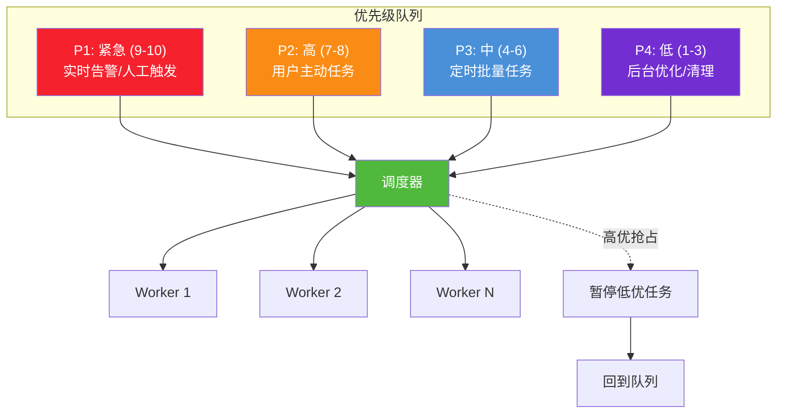

### 7.2 调度器实现

```python
import heapq
import asyncio
from datetime import datetime

class PriorityScheduler:
    """优先级调度器"""
    
    def __init__(self, max_workers: int = 10):
        self.max_workers = max_workers
        # 优先级队列：(负优先级, 创建时间, 任务ID) 
        # 用负优先级是因为 heapq 是最小堆
        self.queue: list = []
        self.lock = asyncio.Lock()
        self.active_count = 0
        self.condition = asyncio.Condition()
    
    async def submit(self, task: Task):
        """提交任务到优先级队列"""
        async with self.lock:
            # 优先级越高，数值越大，取负后越小，越早被调度
            priority_score = -task.priority
            heapq.heappush(self.queue, (priority_score, task.created_at, task.task_id, task))
        
        # 通知等待的 Worker
        async with self.condition:
            self.condition.notify(1)
    
    async def acquire_next(self) -> Task:
        """获取下一个要执行的任务（阻塞直到有任务可用）"""
        async with self.condition:
            while True:
                async with self.lock:
                    if self.queue and self.active_count < self.max_workers:
                        _, _, _, task = heapq.heappop(self.queue)
                        self.active_count += 1
                        return task
                
                # 等待新任务或 Worker 释放
                await self.condition.wait()
    
    async def release(self):
        """释放一个执行槽位"""
        async with self.lock:
            self.active_count -= 1
        async with self.condition:
            self.condition.notify(1)
    
    async def preempt(self, task_id: str) -> bool:
        """抢占：暂停指定任务（用于高优任务抢占低优任务）"""
        async with self.lock:
            for i, (_, _, tid, task) in enumerate(self.queue):
                if tid == task_id:
                    task.state = TaskState.PAUSED
                    # 重新入队，降低优先级
                    task.priority = max(1, task.priority - 2)
                    heapq.heapreplace(self.queue, (-task.priority, datetime.utcnow(), tid, task))
                    return True
        return False
```

### 7.3 公平性保障

防止低优先级任务长期"饥饿"：

```python
class FairScheduler(PriorityScheduler):
    """带公平性保障的调度器"""
    
    def __init__(self, max_workers: int = 10, aging_interval: int = 3600):
        super().__init__(max_workers)
        self.aging_interval = aging_interval  # 每 1 小时提升 1 级优先级
    
    async def acquire_next(self) -> Task:
        """获取下一个任务，应用 aging 机制"""
        async with self.condition:
            while True:
                async with self.lock:
                    if self.queue and self.active_count < self.max_workers:
                        # 应用 aging：等待时间长的任务自动提升优先级
                        now = datetime.utcnow()
                        updated_queue = []
                        while self.queue:
                            priority, created, tid, task = heapq.heappop(self.queue)
                            wait_seconds = (now - created).total_seconds()
                            age_bonus = int(wait_seconds / self.aging_interval)
                            adjusted_priority = priority - age_bonus  # 提升优先级
                            heapq.heappush(updated_queue, (adjusted_priority, created, tid, task))
                        
                        self.queue = updated_queue
                        
                        if self.queue:
                            _, _, _, task = heapq.heappop(self.queue)
                            self.active_count += 1
                            return task
                
                await self.condition.wait()
```

### 7.4 调度策略对比

| 策略 | 优点 | 缺点 | 适用场景 |
|------|------|------|---------|
| 纯优先级 | 高优任务响应快 | 低优任务饥饿 | 实时系统 |
| 时间轮转 | 公平性好 | 无法区分优先级 | 同质任务 |
| 优先级+Aging | 兼顾优先级与公平 | 实现复杂 | **长期任务系统（推荐）** |
| 加权公平队列 | 可控的资源共享 | 调参复杂 | 多租户场景 |

---

## 8. 核心组件划分与职责

### 8.1 组件总览

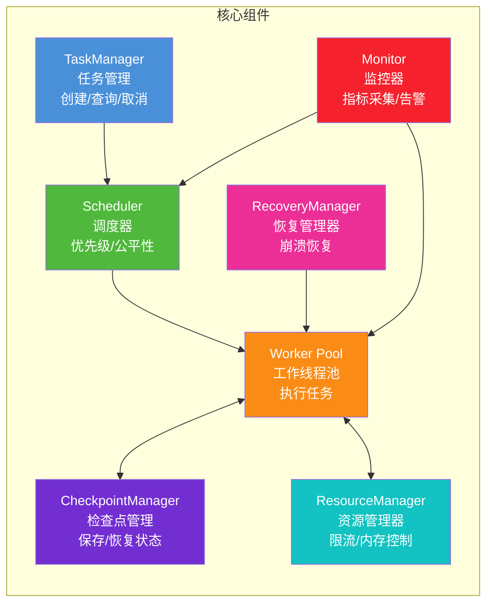

### 8.2 各组件职责

| 组件 | 核心职责 | 关键接口 |
|------|---------|---------|
| **TaskManager** | 任务 CRUD、状态流转、查询 | `create_task()`, `cancel_task()`, `get_status()` |
| **Scheduler** | 优先级调度、公平性保障、抢占 | `submit()`, `acquire_next()`, `preempt()` |
| **Worker Pool** | 执行任务、心跳上报、检查点触发 | `execute()`, `heartbeat()`, `checkpoint()` |
| **CheckpointManager** | 状态序列化、存储、加载 | `save()`, `load()`, `list_checkpoints()` |
| **RecoveryManager** | 崩溃检测、任务恢复、重试 | `recover_stale_tasks()`, `restore_from_checkpoint()` |
| **ResourceManager** | 并发控制、Token 限流、内存管理 | `acquire_slot()`, `check_budget()` |
| **Monitor** | 指标采集、告警、日志聚合 | `record_metric()`, `alert()` |

---

## 9. 数据流转流程

### 9.1 完整数据流

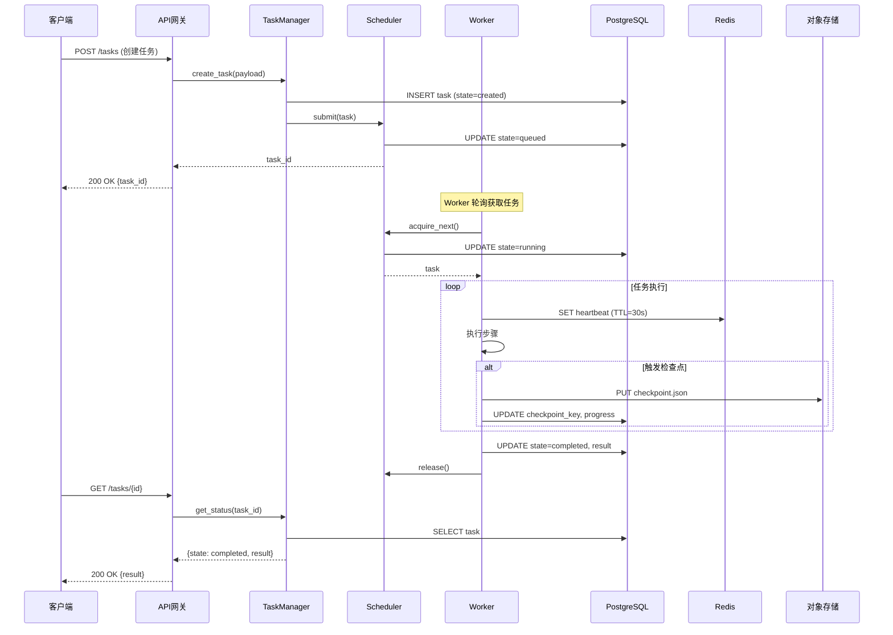

### 9.2 崩溃恢复数据流

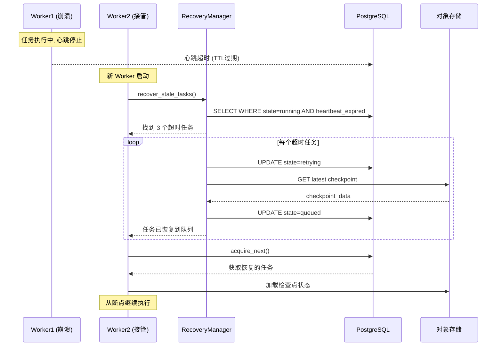

---

## 10. 关键技术选型

### 10.1 技术栈对比

| 维度 | 方案 A（推荐） | 方案 B | 方案 C |
|------|--------------|--------|--------|
| **语言** | Python 3.11+ (asyncio) | Go (goroutine) | Java (Spring) |
| **任务队列** | Redis + 自研调度 | Celery + Redis | Kafka |
| **状态存储** | PostgreSQL | MongoDB | MySQL |
| **缓存/锁** | Redis | Redis | Hazelcast |
| **检查点存储** | MinIO/S3 | Redis (大value) | PostgreSQL (LOB) |
| **监控** | Prometheus + Grafana | Datadog | ELK |
| **部署** | Docker + K8s | Docker Compose | 裸机 |

### 10.2 选型理由

**推荐方案（方案 A）的核心考量：**

1. **Python + asyncio**：Agent 系统大量调用 LLM API，IO 密集型场景，asyncio 天然适合；Python 生态中 LangChain、LlamaIndex 等框架成熟

2. **Redis 而非 Celery**：Celery 的任务状态管理较弱，不适合需要细粒度状态机和检查点的长期任务；自研调度器可完全控制优先级、抢占、aging 逻辑

3. **PostgreSQL 而非 MongoDB**：任务状态需要强一致性（ACID），JSONB 字段同时支持灵活的 payload 存储

4. **MinIO/S3 存检查点**：检查点数据可能很大（MB~GB 级），不适合放数据库；对象存储天然支持大文件、版本管理、生命周期清理

### 10.3 核心依赖清单

```txt
# requirements.txt
fastapi==0.104.1           # API 框架
uvicorn==0.24.0            # ASGI 服务器
sqlalchemy[asyncio]==2.0.23 # ORM
asyncpg==0.29.0            # PostgreSQL 异步驱动
redis[hiredis]==5.0.1      # Redis 客户端
aioboto3==12.0.0           # S3 异步客户端
pydantic==2.5.2            # 数据校验
prometheus-client==0.19.0  # 监控指标
structlog==23.2.0          # 结构化日志
tenacity==8.2.3            # 重试库
```

---

## 11. 性能优化建议

### 11.1 性能优化全景

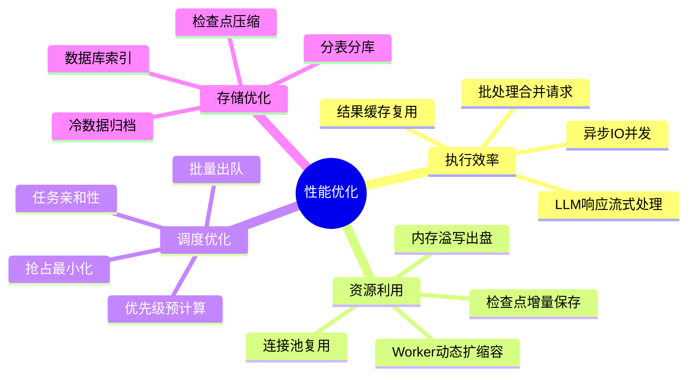

### 11.2 关键优化点

#### 优化 1：LLM 调用批处理

```python
class BatchLLMCaller:
    """LLM 批处理调用器：合并多个小请求为一个大请求"""
    
    def __init__(self, llm_client, max_batch_size: int = 20, wait_timeout: float = 0.5):
        self.llm = llm_client
        self.max_batch_size = max_batch_size
        self.wait_timeout = wait_timeout
        self.pending: list = []
        self.lock = asyncio.Lock()
        self.condition = asyncio.Condition()
    
    async def call(self, prompt: str) -> str:
        """提交单个请求，等待批处理结果"""
        future = asyncio.Future()
        async with self.lock:
            self.pending.append((prompt, future))
            if len(self.pending) >= self.max_batch_size:
                # 立即触发批处理
                batch = self.pending
                self.pending = []
                asyncio.create_task(self._execute_batch(batch))
            return await future
    
    async def _execute_batch(self, batch: list):
        """执行批处理"""
        prompts = [p for p, _ in batch]
        try:
            # 合并为一次 LLM 调用
            results = await self.llm.batch_complete(prompts)
            for (_, future), result in zip(batch, results):
                future.set_result(result)
        except Exception as e:
            for _, future in batch:
                future.set_exception(e)
```

#### 优化 2：检查点增量保存

```python
class IncrementalCheckpoint:
    """增量检查点：只保存变化的部分"""
    
    def __init__(self, base_checkpoint_manager: CheckpointManager):
        self.base = base_checkpoint_manager
        self.last_full_checkpoint: dict = {}
    
    async def save(self, task_id: str, current_state: dict) -> str:
        """保存增量检查点"""
        # 计算差异
        diff = self._compute_diff(self.last_full_checkpoint, current_state)
        
        if not diff:
            return None  # 无变化
        
        # 如果差异过大，保存全量
        if len(diff) > len(current_state) * 0.5:
            key = await self.base.save(task_id, {
                "type": "full",
                "state": current_state
            })
            self.last_full_checkpoint = current_state.copy()
        else:
            key = await self.base.save(task_id, {
                "type": "incremental",
                "diff": diff,
                "base_key": self._last_key
            })
        
        self._last_key = key
        return key
    
    def _compute_diff(self, old: dict, new: dict) -> dict:
        """计算两个状态字典的差异"""
        diff = {}
        for key in new:
            if key not in old or old[key] != new[key]:
                diff[key] = new[key]
        return diff
```

#### 优化 3：Worker 动态扩缩容

```python
class AutoScalingWorkerPool:
    """自动扩缩容 Worker 池"""
    
    def __init__(self, 
                 min_workers: int = 2,
                 max_workers: int = 50,
                 scale_up_threshold: int = 10,    # 队列积压超过 10 个
                 scale_down_threshold: int = 2,   # 空闲 Worker 超过 2 个
                 check_interval: int = 60):
        self.min_workers = min_workers
        self.max_workers = max_workers
        self.scale_up_threshold = scale_up_threshold
        self.scale_down_threshold = scale_down_threshold
        self.check_interval = check_interval
        self.current_workers = min_workers
    
    async def auto_scale(self, scheduler: PriorityScheduler):
        """定时检查并调整 Worker 数量"""
        while True:
            await asyncio.sleep(self.check_interval)
            
            queue_size = len(scheduler.queue)
            idle_workers = scheduler.max_workers - scheduler.active_count
            
            if queue_size > self.scale_up_threshold and self.current_workers < self.max_workers:
                # 扩容
                new_count = min(
                    self.current_workers + max(1, queue_size // 5),
                    self.max_workers
                )
                await self._scale_to(new_count)
            
            elif idle_workers > self.scale_down_threshold and self.current_workers > self.min_workers:
                # 缩容
                new_count = max(self.current_workers - 2, self.min_workers)
                await self._scale_to(new_count)
    
    async def _scale_to(self, target: int):
        """调整到目标 Worker 数量"""
        if target > self.current_workers:
            # 启动新 Worker
            for _ in range(target - self.current_workers):
                asyncio.create_task(self._start_worker())
        else:
            # 通知多余 Worker 优雅停止
            for _ in range(self.current_workers - target):
                asyncio.create_task(self._stop_worker())
        
        self.current_workers = target
```

### 11.3 性能基准参考

| 场景 | 未优化 | 优化后 | 优化手段 |
|------|--------|--------|---------|
| 1000 文档处理 | 120 分钟 | 35 分钟 | 批处理 + 并发 |
| 检查点保存 (100MB) | 8s | 2s | 增量 + 压缩 |
| 任务恢复 | 15s | 3s | 并行加载 |
| LLM 调用 | 串行 2s/次 | 并发 0.3s/次 | 异步 + 限流 |
| 内存占用 (10k任务) | 8GB | 1.2GB | 溢写出盘 |

---

## 12. 完整代码实现

### 12.1 任务执行引擎核心

```python
import asyncio
import logging
from contextlib import asynccontextmanager
from datetime import datetime

logger = logging.getLogger(__name__)

class TaskExecutionEngine:
    """任务执行引擎：协调所有组件完成任务执行"""
    
    def __init__(self,
                 task_manager: 'TaskManager',
                 scheduler: PriorityScheduler,
                 checkpoint_mgr: CheckpointManager,
                 resource_mgr: ResourceManager,
                 recovery_mgr: RecoveryManager,
                 checkpoint_policy: CheckpointPolicy):
        self.task_manager = task_manager
        self.scheduler = scheduler
        self.checkpoint_mgr = checkpoint_mgr
        self.resource_mgr = resource_mgr
        self.recovery_mgr = recovery_mgr
        self.checkpoint_policy = checkpoint_policy
        self.running = False
    
    async def start(self, worker_count: int = 10):
        """启动执行引擎"""
        self.running = True
        
        # 启动恢复流程
        await self.recovery_mgr.recover_stale_tasks()
        
        # 启动 Worker 协程
        workers = [
            asyncio.create_task(self._worker_loop(f"worker-{i}"))
            for i in range(worker_count)
        ]
        
        # 启动监控协程
        monitor = asyncio.create_task(self._monitor_loop())
        
        logger.info(f"Engine started with {worker_count} workers")
        
        # 等待所有 Worker（正常情况下不会退出）
        await asyncio.gather(*workers, monitor)
    
    async def stop(self):
        """优雅停止"""
        self.running = False
        logger.info("Engine stopping...")
    
    async def _worker_loop(self, worker_id: str):
        """Worker 主循环"""
        logger.info(f"Worker {worker_id} started")
        
        while self.running:
            try:
                # 获取下一个任务
                task = await self.scheduler.acquire_next()
                
                # 执行任务
                async with self.resource_mgr.acquire_task_slot(task.task_id):
                    await self._execute_task(worker_id, task)
                    
            except asyncio.CancelledError:
                logger.info(f"Worker {worker_id} cancelled")
                break
            except Exception as e:
                logger.error(f"Worker {worker_id} error: {e}", exc_info=True)
                await asyncio.sleep(1)  # 防止错误时疯狂循环
        
        logger.info(f"Worker {worker_id} stopped")
    
    async def _execute_task(self, worker_id: str, task: Task):
        """执行单个任务"""
        logger.info(f"[{worker_id}] Starting task {task.task_id}")
        
        # 更新任务状态
        task.state = TaskState.RUNNING
        task.started_at = datetime.utcnow()
        await self.task_manager.update_task(task)
        
        # 尝试从检查点恢复
        context = {}
        if task.checkpoint_key:
            try:
                context = self.checkpoint_mgr.load(task.checkpoint_key)
                logger.info(f"[{worker_id}] Restored task {task.task_id} from checkpoint")
            except Exception as e:
                logger.warning(f"[{worker_id}] Failed to load checkpoint: {e}")
        
        steps_since_checkpoint = 0
        last_checkpoint_time = datetime.utcnow()
        
        try:
            # 执行任务步骤
            async for step_result in self._run_task_steps(task, context):
                steps_since_checkpoint += 1
                task.progress = step_result.get("progress", task.progress)
                task.current_step = step_result.get("step_name")
                task.used_tokens += step_result.get("tokens_used", 0)
                
                # 发送心跳
                await self.task_manager.send_heartbeat(task.task_id)
                
                # 检查是否需要检查点
                if self.checkpoint_policy.should_checkpoint(
                    task, last_checkpoint_time, steps_since_checkpoint,
                    current_memory_mb=0  # 实际从 psutil 获取
                ):
                    task.state = TaskState.CHECKPOINTING
                    await self.task_manager.update_task(task)
                    
                    checkpoint_key = self.checkpoint_mgr.save(
                        task.task_id,
                        {"context": context, "progress": task.progress}
                    )
                    task.checkpoint_key = checkpoint_key
                    task.last_checkpoint_at = datetime.utcnow()
                    task.state = TaskState.RUNNING
                    steps_since_checkpoint = 0
                    last_checkpoint_time = datetime.utcnow()
                    await self.task_manager.update_task(task)
            
            # 任务完成
            task.state = TaskState.COMPLETED
            task.finished_at = datetime.utcnow()
            task.progress = 1.0
            await self.task_manager.update_task(task)
            logger.info(f"[{worker_id}] Task {task.task_id} completed")
            
        except Exception as e:
            await self._handle_task_error(worker_id, task, e)
        
        finally:
            await self.scheduler.release()
    
    async def _run_task_steps(self, task: Task, context: dict):
        """执行任务的具体步骤（子类实现）"""
        # 示例：模拟多步骤任务
        total_steps = task.payload.get("total_steps", 10)
        for i in range(total_steps):
            if context.get("last_completed_step", -1) >= i:
                continue  # 跳过已完成的步骤
            
            # 模拟执行步骤
            await asyncio.sleep(1)
            
            context["last_completed_step"] = i
            
            yield {
                "step_name": f"step_{i}",
                "progress": (i + 1) / total_steps,
                "tokens_used": 100
            }
    
    async def _handle_task_error(self, worker_id: str, task: Task, error: Exception):
        """处理任务执行错误"""
        error_type = ErrorClassifier.classify(error)
        logger.error(f"[{worker_id}] Task {task.task_id} error ({error_type.value}): {error}")
        
        if error_type == ErrorType.PERMANENT:
            # 永久错误，直接失败
            task.state = TaskState.FAILED
            task.error = str(error)
            task.finished_at = datetime.utcnow()
            await self.task_manager.update_task(task)
        
        else:
            # 可重试错误，重新入队
            task.state = TaskState.RETRYING
            task.retry_count += 1
            task.error = str(error)
            
            if task.retry_count > task.max_retries:
                task.state = TaskState.FAILED
                task.finished_at = datetime.utcnow()
            else:
                # 计算重试延迟
                retry_policy = RetryPolicy(max_retries=task.max_retries)
                delay = retry_policy.get_delay(task.retry_count)
                await asyncio.sleep(delay)
                task.state = TaskState.QUEUED
            
            await self.task_manager.update_task(task)
    
    async def _monitor_loop(self):
        """监控循环：定期检查超时任务"""
        while self.running:
            try:
                await asyncio.sleep(60)
                # 检查超时任务
                await self.recovery_mgr.recover_stale_tasks()
            except Exception as e:
                logger.error(f"Monitor error: {e}", exc_info=True)
```

### 12.2 TaskManager 实现

```python
class TaskManager:
    """任务管理器：负责任务的 CRUD 和状态流转"""
    
    def __init__(self, db_session, redis_client):
        self.db = db_session
        self.redis = redis_client
    
    async def create_task(self, task: Task) -> Task:
        """创建任务"""
        await self.db.execute(
            """INSERT INTO tasks (task_id, name, type, payload, priority, state, 
               max_retries, timeout_seconds, max_memory_mb, max_tokens, dependencies)
               VALUES ($1, $2, $3, $4, $5, $6, $7, $8, $9, $10, $11)""",
            task.task_id, task.name, task.type, task.payload, task.priority,
            task.state.value, task.max_retries, task.timeout_seconds,
            task.max_memory_mb, task.max_tokens, task.dependencies
        )
        return task
    
    async def update_task(self, task: Task):
        """更新任务状态"""
        await self.db.execute(
            """UPDATE tasks SET state=$1, started_at=$2, finished_at=$3,
               progress=$4, current_step=$5, checkpoint_key=$6,
               last_checkpoint_at=$7, retry_count=$8, used_tokens=$9,
               result=$10, error=$11 WHERE task_id=$12""",
            task.state.value, task.started_at, task.finished_at,
            task.progress, task.current_step, task.checkpoint_key,
            task.last_checkpoint_at, task.retry_count, task.used_tokens,
            task.result, task.error, task.task_id
        )
    
    async def get_task(self, task_id: str) -> Optional[Task]:
        """查询任务"""
        row = await self.db.fetchrow(
            "SELECT * FROM tasks WHERE task_id=$1", task_id
        )
        return Task(**dict(row)) if row else None
    
    async def cancel_task(self, task_id: str) -> bool:
        """取消任务"""
        task = await self.get_task(task_id)
        if not task:
            return False
        
        if task.state in [TaskState.COMPLETED, TaskState.FAILED, TaskState.CANCELLED]:
            return False
        
        task.state = TaskState.CANCELLING
        await self.update_task(task)
        return True
    
    async def send_heartbeat(self, task_id: str):
        """发送心跳"""
        await self.redis.set(
            f"heartbeat:{task_id}", 
            datetime.utcnow().isoformat(),
            ex=30  # 30秒过期
        )
```

---

## 13. 监控与运维

### 13.1 监控指标体系

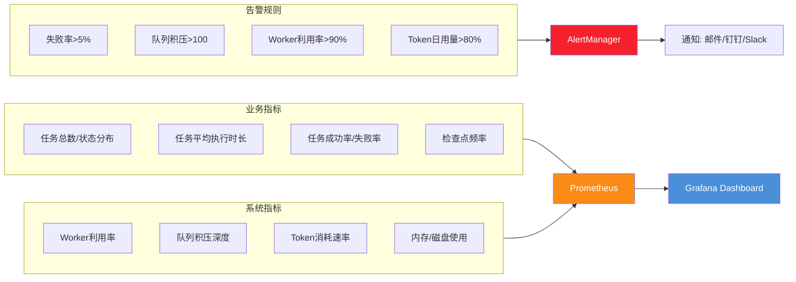

### 13.2 核心监控指标

```python
from prometheus_client import Counter, Gauge, Histogram

# 任务相关指标
TASKS_TOTAL = Counter(
    'agent_tasks_total', 'Total tasks created', ['type', 'state']
)
TASK_DURATION = Histogram(
    'agent_task_duration_seconds', 'Task execution duration',
    buckets=[60, 300, 600, 1800, 3600, 7200, 86400, 604800]
)
TASK_RETRY_COUNT = Counter(
    'agent_task_retries_total', 'Total task retries'
)

# 系统相关指标
QUEUE_DEPTH = Gauge('agent_queue_depth', 'Tasks waiting in queue')
ACTIVE_WORKERS = Gauge('agent_active_workers', 'Currently active workers')
CHECKPOINT_DURATION = Histogram(
    'agent_checkpoint_duration_seconds', 'Checkpoint save duration'
)
TOKEN_USAGE = Counter(
    'agent_token_usage_total', 'LLM token usage', ['task_type']
)

class MetricsCollector:
    """指标采集器"""
    
    @staticmethod
    def record_task_created(task_type: str):
        TASKS_TOTAL.labels(type=task_type, state='created').inc()
    
    @staticmethod
    def record_task_completed(task_type: str, duration: float):
        TASKS_TOTAL.labels(type=task_type, state='completed').inc()
        TASK_DURATION.observe(duration)
    
    @staticmethod
    def record_task_failed(task_type: str, duration: float):
        TASKS_TOTAL.labels(type=task_type, state='failed').inc()
        TASK_DURATION.observe(duration)
    
    @staticmethod
    def update_queue_depth(depth: int):
        QUEUE_DEPTH.set(depth)
    
    @staticmethod
    def record_checkpoint(duration: float):
        CHECKPOINT_DURATION.observe(duration)
    
    @staticmethod
    def record_token_usage(task_type: str, tokens: int):
        TOKEN_USAGE.labels(task_type=task_type).inc(tokens)
```

### 13.3 告警规则配置

```yaml
# prometheus_alerts.yml
groups:
  - name: agent_system
    rules:
      # 任务失败率告警
      - alert: HighTaskFailureRate
        expr: |
          rate(agent_tasks_total{state="failed"}[5m]) 
          / rate(agent_tasks_total[5m]) > 0.05
        for: 10m
        labels:
          severity: critical
        annotations:
          summary: "任务失败率超过 5%"
      
      # 队列积压告警
      - alert: QueueBacklog
        expr: agent_queue_depth > 100
        for: 5m
        labels:
          severity: warning
        annotations:
          summary: "任务队列积压 {{ $value }} 个"
      
      # Worker 利用率过高
      - alert: HighWorkerUtilization
        expr: |
          agent_active_workers / 10 > 0.9
        for: 10m
        labels:
          severity: warning
        annotations:
          summary: "Worker 利用率超过 90%"
      
      # Token 用量告警
      - alert: TokenBudgetWarning
        expr: |
          increase(agent_token_usage_total[24h]) > 8000000
        for: 5m
        labels:
          severity: warning
        annotations:
          summary: "日 Token 消耗超过预算 80%"
```

### 13.4 运维最佳实践

| 运维项 | 频率 | 操作 |
|--------|------|------|
| 检查点清理 | 每日 | 删除已完成任务超过 7 天的检查点 |
| 日志归档 | 每日 | 将 7 天前日志归档到对象存储 |
| 数据库维护 | 每周 | VACUUM ANALYZE，重建索引 |
| 容量评估 | 每周 | 评估队列深度趋势，调整 Worker 数 |
| 演练恢复 | 每月 | 模拟 Worker 崩溃，验证恢复流程 |
| 配额审查 | 每月 | 审查 Token/API 配额使用情况 |

---

## 14. 总结

### 14.1 核心设计要点回顾

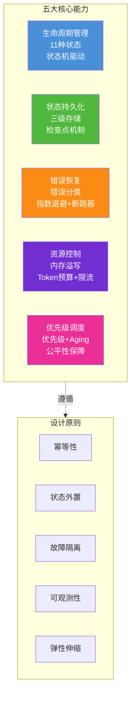

### 14.2 关键设计决策

| 决策点 | 选择 | 理由 |
|--------|------|------|
| 状态存储 | Redis + PostgreSQL + S3 三级 | 不同访问模式适配不同存储 |
| 检查点策略 | 时间+步骤+内存三重触发 | 平衡恢复效率与保存开销 |
| 重试策略 | 指数退避 + 抖动 | 避免惊群效应 |
| 调度策略 | 优先级 + Aging | 兼顾响应速度与公平性 |
| 错误处理 | 分类 + 断路器 | 防止故障扩散 |
| 部署方式 | 多 Worker + 动态扩缩容 | 应对负载波动 |

### 14.3 适用场景与扩展方向

**本文方案适用于：**
- 需要持续运行数小时到数周的任务
- 对任务可靠性要求高（不能因故障丢失进度）
- 需要优先级管理的多任务并发场景
- LLM 驱动的 Agent 自动化任务

**可扩展方向：**
1. **分布式 Worker**：跨机器部署 Worker，通过消息队列协调
2. **多租户隔离**：引入租户概念，资源配额按租户划分
3. **DAG 工作流**：支持复杂的任务依赖图（Airflow 风格）
4. **人机协同**：任务可在特定步骤暂停，等待人工审核后继续
5. **成本优化**：基于历史数据预测任务资源需求，智能选择执行时机

---

> **参考来源：**
> - Google, "Reliable Task Scheduling at Scale" (Google Cloud Architecture)
> - Microsoft, "Azure Durable Functions - Checkpointing and Replay"
> - Apache Airflow 官方文档 - Task Lifecycle
> - Netflix, "Conductor: A Microservices Orchestrator"
> - Temporal.io - Durable Execution Pattern
