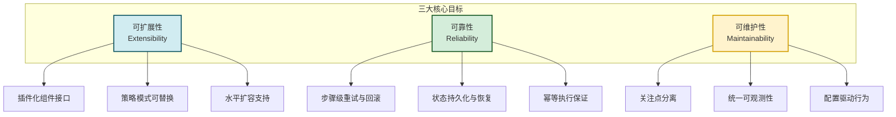
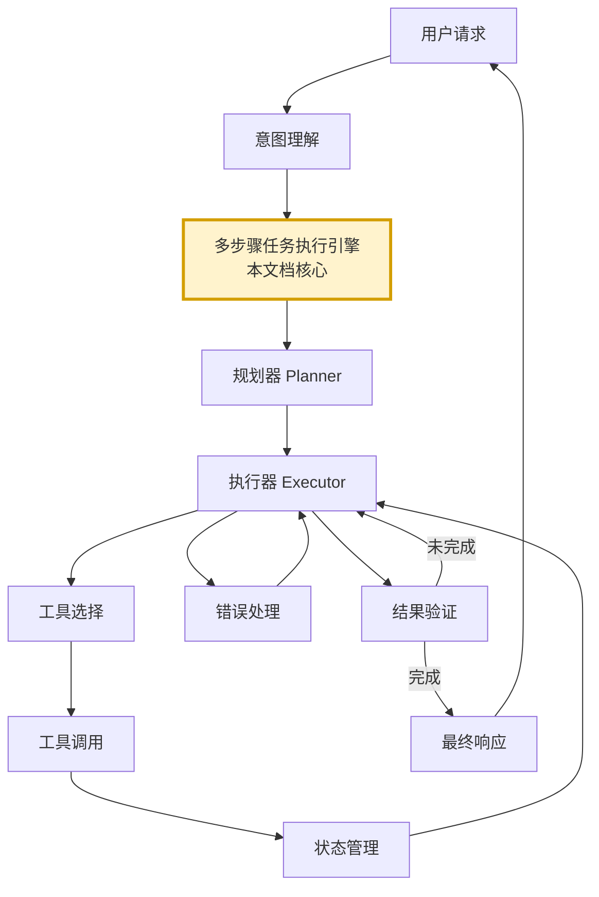
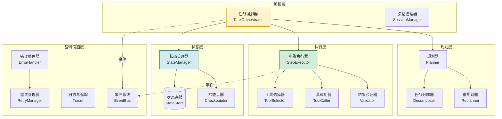
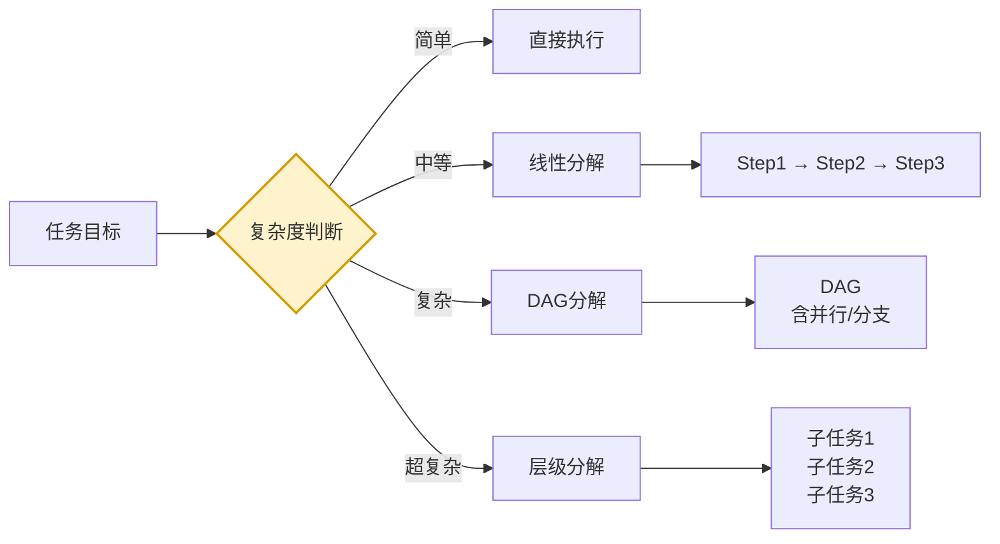
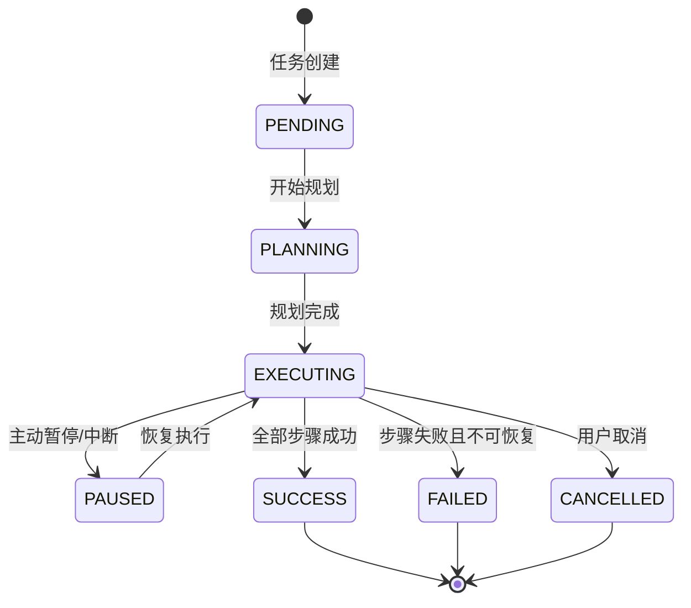
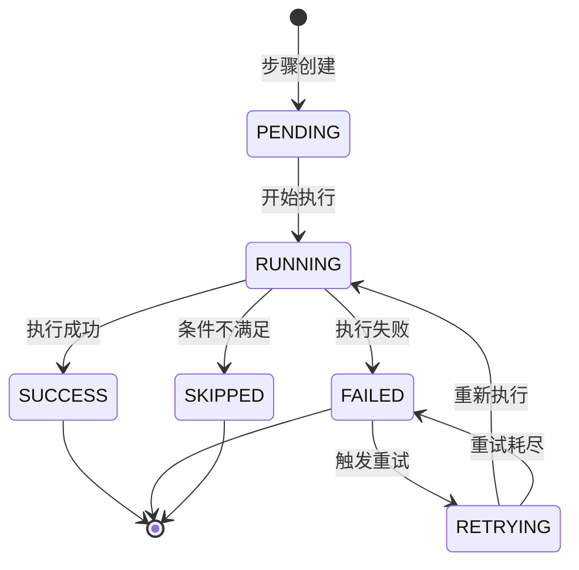
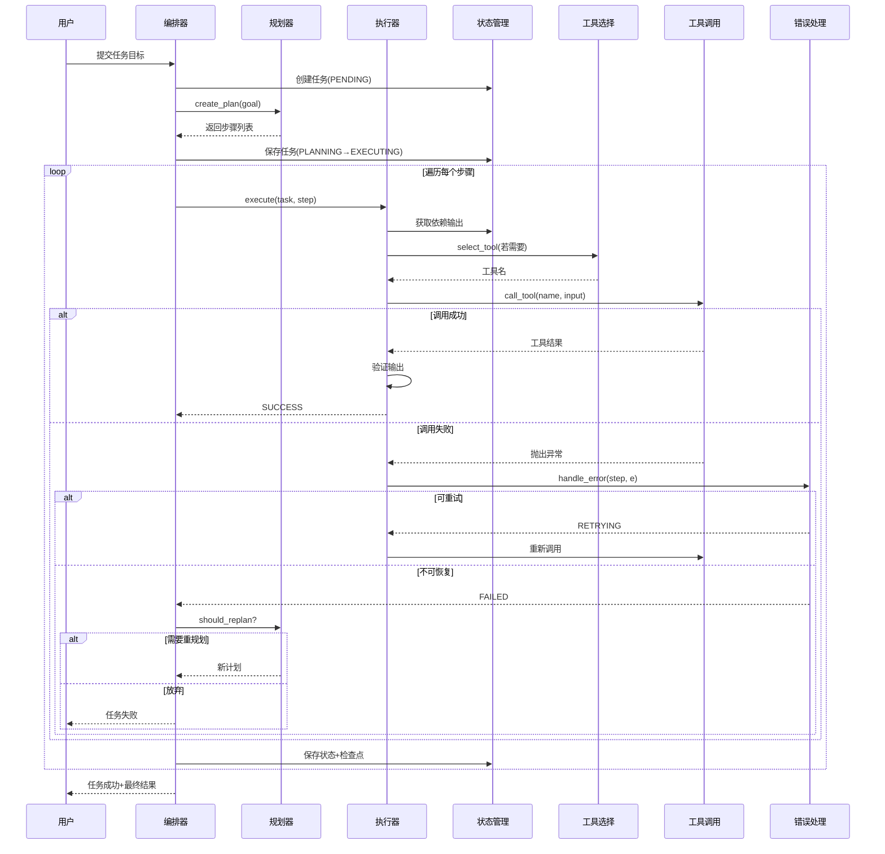
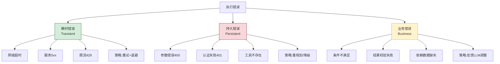
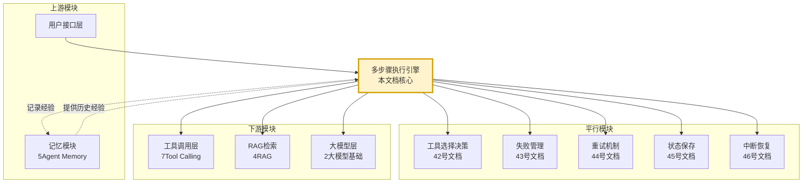

# Agent 多步骤任务执行功能完整设计与实现

> **文档定位**:本文档系统阐述 Agent 多步骤任务执行功能的完整设计方案,涵盖系统架构、核心组件、任务规划与分解、步骤执行与状态管理、错误处理策略以及与其他模块的交互方式。方案以**可扩展性、可靠性、可维护性**为核心目标,支持复杂任务的自动分解与有序执行,为企业级 Agent 系统提供可直接落地的工程蓝图。
>
> **阅读建议**:本文是 Agent 架构设计系列的关键组成,建议结合 [40Plan-and-Execute_Agent完整实现方案.md](./40Plan-and-Execute_Agent完整实现方案.md)、[41Agent任务规划机制详解.md](./41Agent任务规划机制详解.md)、[44Agent任务重试机制完整设计与实现.md](./44Agent任务重试机制完整设计与实现.md)、[45Agent执行状态保存机制完整设计方案.md](./45Agent执行状态保存机制完整设计方案.md)、[46Agent任务中断与恢复机制完整设计方案.md](./46Agent任务中断与恢复机制完整设计方案.md) 一并阅读,理解多步骤执行在 Agent 整体架构中的定位与协同。

---

## 目录

- [一、多步骤任务执行概述](#一多步骤任务执行概述)
- [二、系统架构设计](#二系统架构设计)
- [三、核心组件实现](#三核心组件实现)
- [四、任务规划与分解机制](#四任务规划与分解机制)
- [五、步骤执行与状态管理流程](#五步骤执行与状态管理流程)
- [六、错误处理策略](#六错误处理策略)
- [七、与其他模块的交互方式](#七与其他模块的交互方式)
- [八、可扩展性与可维护性设计](#八可扩展性与可维护性设计)
- [九、完整代码实现](#九完整代码实现)
- [十、典型应用场景案例](#十典型应用场景案例)
- [十一、最佳实践与避坑指南](#十一最佳实践与避坑指南)

---

## 一、多步骤任务执行概述

### 1.1 什么是多步骤任务执行

**多步骤任务执行(Multi-step Task Execution)** 是指 Agent 将一个复杂任务**自动分解为多个有序子步骤**,并通过**规划、执行、监控、反馈**的闭环流程逐步完成整个任务的能力。它是 Agent 从"单轮问答工具"进化为"自主问题解决者"的核心能力。

与单步骤执行的对比:

| 维度 | 单步骤执行 | 多步骤执行 |
|------|-----------|-----------|
| **任务复杂度** | 简单、原子 | 复杂、可分解 |
| **决策次数** | 1 次 | N 次(每步一次) |
| **状态管理** | 无状态 | 跨步骤状态传递 |
| **失败影响** | 整体失败 | 单步可重试/回滚 |
| **执行时长** | 秒级 | 分钟~小时级 |
| **可观测性** | 输入输出即可 | 需全链路追踪 |
| **典型场景** | 翻译、问答 | 研究分析、报告生成、工作流自动化 |

### 1.2 核心设计目标

本方案围绕三大核心质量属性设计:



### 1.3 多步骤执行在 Agent 架构中的位置



---

## 二、系统架构设计

### 2.1 总体架构全景

多步骤任务执行系统采用**分层架构**,自底向上分为:基础设施层、状态层、执行层、规划层、编排层:



### 2.2 核心组件职责划分

| 层级 | 组件 | 职责 | 关键接口 |
|------|------|------|----------|
| **编排层** | TaskOrchestrator | 总体协调规划-执行-反馈闭环 | `execute_task()` |
| **编排层** | SessionManager | 会话与上下文管理 | `create_session()` |
| **规划层** | Planner | 生成任务执行计划 | `create_plan()` |
| **规划层** | Decomposer | 复杂任务分解为子任务 | `decompose()` |
| **规划层** | Replanner | 执行偏离时重新规划 | `replan()` |
| **执行层** | StepExecutor | 执行单个步骤 | `execute_step()` |
| **执行层** | ToolSelector | 选择合适工具 | `select_tool()` |
| **执行层** | ToolCaller | 调用工具并获取结果 | `call_tool()` |
| **执行层** | Validator | 验证步骤输出 | `validate()` |
| **状态层** | StateManager | 管理任务与步骤状态 | `update_state()` |
| **状态层** | StateStore | 持久化状态数据 | `save() / load()` |
| **状态层** | Checkpointer | 定期保存检查点 | `checkpoint()` |
| **基础设施** | ErrorHandler | 错误分类与处理 | `handle_error()` |
| **基础设施** | RetryManager | 步骤级重试 | `retry_with_backoff()` |
| **基础设施** | Tracer | 全链路追踪 | `trace()` |
| **基础设施** | EventBus | 组件间事件通信 | `publish() / subscribe()` |

### 2.3 设计原则

| 原则 | 说明 | 工程体现 |
|------|------|----------|
| **关注点分离** | 规划、执行、状态、错误处理独立 | 各组件单一职责 |
| **状态显式化** | 所有状态显式存储与传递 | StateManager 统一管理 |
| **幂等执行** | 每个步骤可安全重复执行 | 步骤ID + 幂等键 |
| **可观测性** | 全链路追踪与事件流 | Tracer + EventBus |
| **策略可替换** | 规划/执行/重试策略可插拔 | 策略模式 + 依赖注入 |
| **故障隔离** | 单步失败不影响整体 | 错误处理 + 重试 + 回滚 |

---

## 三、核心组件实现

### 3.1 任务与步骤数据模型

```python
from dataclasses import dataclass, field
from datetime import datetime
from enum import Enum
from typing import Any
from uuid import uuid4

class TaskStatus(Enum):
    PENDING = "pending"
    PLANNING = "planning"
    EXECUTING = "executing"
    PAUSED = "paused"
    SUCCESS = "success"
    FAILED = "failed"
    CANCELLED = "cancelled"

class StepStatus(Enum):
    PENDING = "pending"
    RUNNING = "running"
    SUCCESS = "success"
    FAILED = "failed"
    SKIPPED = "skipped"
    RETRYING = "retrying"

class StepType(Enum):
    TOOL_CALL = "tool_call"          # 工具调用
    LLM_REASONING = "llm_reasoning"  # LLM 推理
    CONDITIONAL = "conditional"      # 条件判断
    PARALLEL_GROUP = "parallel"      # 并行组
    LOOP = "loop"                    # 循环
    HUMAN_INPUT = "human_input"      # 人工输入

@dataclass
class Step:
    """单个执行步骤"""
    step_id: str = field(default_factory=lambda: str(uuid4()))
    task_id: str = ""                       # 所属任务ID
    step_index: int = 0                     # 步骤序号
    step_type: StepType = StepType.TOOL_CALL
    description: str = ""                   # 步骤描述
    tool_name: str = ""                     # 调用的工具名
    tool_input: dict = field(default_factory=dict)  # 工具输入
    expected_output: str = ""               # 预期输出描述
    dependencies: list[str] = field(default_factory=list)  # 依赖的步骤ID
    status: StepStatus = StepStatus.PENDING
    output: Any = None                      # 实际输出
    error: str = ""                         # 错误信息
    started_at: datetime = None
    completed_at: datetime = None
    retry_count: int = 0
    max_retries: int = 3
    metadata: dict = field(default_factory=dict)

@dataclass
class Task:
    """多步骤任务"""
    task_id: str = field(default_factory=lambda: str(uuid4()))
    user_id: str = ""
    session_id: str = ""
    goal: str = ""                          # 任务目标
    description: str = ""                   # 任务描述
    status: TaskStatus = TaskStatus.PENDING
    steps: list[Step] = field(default_factory=list)
    current_step_index: int = 0
    context: dict = field(default_factory=dict)  # 任务级上下文
    result: Any = None                      # 最终结果
    created_at: datetime = field(default_factory=datetime.now)
    updated_at: datetime = field(default_factory=datetime.now)
    completed_at: datetime = None
    metadata: dict = field(default_factory=dict)
```

### 3.2 任务编排器(TaskOrchestrator)

```python
class TaskOrchestrator:
    """任务编排器:协调规划-执行-反馈闭环"""

    def __init__(self, planner, step_executor, state_manager,
                 error_handler, event_bus, tracer):
        self.planner = planner
        self.step_executor = step_executor
        self.state_manager = state_manager
        self.error_handler = error_handler
        self.event_bus = event_bus
        self.tracer = tracer

    def execute_task(self, goal: str, user_id: str,
                     context: dict = None) -> Task:
        """执行多步骤任务的入口"""
        # 1. 创建任务
        task = Task(goal=goal, user_id=user_id, context=context or {})
        task.status = TaskStatus.PLANNING
        self.state_manager.save_task(task)
        self.tracer.trace("task_created", task.task_id, goal=goal)

        try:
            # 2. 规划阶段:分解任务为步骤
            task = self._planning_phase(task)

            # 3. 执行阶段:逐步执行
            task.status = TaskStatus.EXECUTING
            self.state_manager.save_task(task)
            task = self._execution_phase(task)

            # 4. 完成
            task.status = TaskStatus.SUCCESS
            task.completed_at = datetime.now()
            self.tracer.trace("task_success", task.task_id)

        except Exception as e:
            task.status = TaskStatus.FAILED
            task.metadata["failure_reason"] = str(e)
            self.tracer.trace("task_failed", task.task_id, error=str(e))
            self.event_bus.publish("task.failed", {"task_id": task.task_id,
                                                    "error": str(e)})

        finally:
            self.state_manager.save_task(task)
        return task

    def _planning_phase(self, task: Task) -> Task:
        """规划阶段"""
        self.tracer.trace("planning_start", task.task_id)
        plan = self.planner.create_plan(task.goal, task.context)
        task.steps = plan.steps
        self.tracer.trace("planning_done", task.task_id,
                          step_count=len(plan.steps))
        return task

    def _execution_phase(self, task: Task) -> Task:
        """执行阶段"""
        for i, step in enumerate(task.steps):
            if step.status in (StepStatus.SUCCESS, StepStatus.SKIPPED):
                continue  # 已完成(恢复场景)

            task.current_step_index = i
            self.state_manager.save_task(task)

            step = self._execute_step_with_recovery(task, step)
            task.steps[i] = step

            if step.status == StepStatus.FAILED:
                # 检查是否需要重规划
                if self.planner.should_replan(task):
                    task = self._replan_and_continue(task)
                else:
                    raise StepExecutionError(
                        f"Step {step.step_index} failed: {step.error}")

        return task

    def _execute_step_with_recovery(self, task: Task, step: Step) -> Step:
        """带错误恢复的步骤执行"""
        try:
            step = self.step_executor.execute(task, step)
        except Exception as e:
            step = self.error_handler.handle(task, step, e)
        return step

    def _replan_and_continue(self, task: Task) -> Task:
        """重规划并继续执行"""
        self.tracer.trace("replan_start", task.task_id)
        new_plan = self.planner.replan(task)
        # 替换未执行的步骤
        task.steps = task.steps[:task.current_step_index + 1] + new_plan.steps
        self.state_manager.save_task(task)
        return task
```

### 3.3 状态管理器(StateManager)

```python
class StateManager:
    """状态管理器:负责任务与步骤状态的持久化"""

    def __init__(self, state_store, checkpointer=None):
        self.store = state_store
        self.checkpointer = checkpointer

    def save_task(self, task: Task) -> None:
        task.updated_at = datetime.now()
        self.store.save(task.task_id, task)
        if self.checkpointer:
            self.checkpointer.maybe_checkpoint(task)

    def load_task(self, task_id: str) -> Task | None:
        return self.store.load(task_id)

    def get_step_output(self, task: Task, step_index: int) -> Any:
        """获取某步骤的输出(供后续步骤依赖)"""
        if step_index < len(task.steps):
            return task.steps[step_index].output
        return None

    def get_dependency_outputs(self, task: Task, step: Step) -> dict:
        """获取步骤所有依赖的输出"""
        outputs = {}
        for dep_id in step.dependencies:
            for s in task.steps:
                if s.step_id == dep_id:
                    outputs[dep_id] = s.output
        return outputs
```

---

## 四、任务规划与分解机制

### 4.1 规划器(Planner)设计

规划器是任务分解的核心,通过 LLM 将目标分解为有序步骤:

```python
class Planner:
    """任务规划器"""

    PLANNING_PROMPT = """
你是任务规划专家。请将以下任务分解为可执行的步骤列表。

任务目标: {goal}
任务上下文: {context}
可用工具: {available_tools}

要求:
1. 每个步骤必须是原子操作(单一工具调用或推理)
2. 明确步骤间的依赖关系
3. 为每个步骤指定合适的工具
4. 步骤数量控制在3-15个之间

输出JSON格式:
{{
  "steps": [
    {{
      "description": "步骤描述",
      "step_type": "tool_call|llm_reasoning|conditional",
      "tool_name": "工具名(若为tool_call)",
      "tool_input": {{"参数": "值"}},
      "expected_output": "预期输出描述",
      "dependencies": ["依赖步骤序号"]
    }}
  ]
}}
"""

    def __init__(self, llm, tool_registry):
        self.llm = llm
        self.tool_registry = tool_registry

    def create_plan(self, goal: str, context: dict) -> Plan:
        """创建任务执行计划"""
        prompt = self.PLANNING_PROMPT.format(
            goal=goal,
            context=json.dumps(context, ensure_ascii=False),
            available_tools=self._list_tools(),
        )
        response = self.llm.invoke(prompt)
        plan_data = json.loads(response)
        return self._build_plan(plan_data)

    def _build_plan(self, data: dict) -> Plan:
        steps = []
        for i, s in enumerate(data["steps"]):
            step = Step(
                step_index=i,
                step_type=StepType(s.get("step_type", "tool_call")),
                description=s["description"],
                tool_name=s.get("tool_name", ""),
                tool_input=s.get("tool_input", {}),
                expected_output=s.get("expected_output", ""),
                dependencies=[str(d) for d in s.get("dependencies", [])],
            )
            steps.append(step)
        return Plan(steps=steps)

    def should_replan(self, task: Task) -> bool:
        """判断是否需要重规划"""
        failed_count = sum(1 for s in task.steps if s.status == StepStatus.FAILED)
        return failed_count <= 2  # 失败步骤少则重规划,多则放弃

    def replan(self, task: Task) -> Plan:
        """基于当前执行状态重新规划"""
        completed = [s for s in task.steps if s.status == StepStatus.SUCCESS]
        failed = [s for s in task.steps if s.status == StepStatus.FAILED]
        # 基于已完成步骤的结果,重新规划剩余部分
        replan_prompt = f"""
原目标: {task.goal}
已完成步骤: {self._format_steps(completed)}
失败步骤及原因: {self._format_failed(failed)}
请重新规划剩余任务的执行步骤。
"""
        response = self.llm.invoke(replan_prompt)
        return self._build_plan(json.loads(response))
```

### 4.2 任务分解策略

针对不同复杂度的任务,采用差异化的分解策略:

| 任务复杂度 | 特征 | 分解策略 | 步骤数 |
|-----------|------|----------|--------|
| **简单** | 单一工具可完成 | 不分解,直接执行 | 1 |
| **中等** | 需多工具串联 | 线性分解 | 3-7 |
| **复杂** | 含分支/并行 | DAG 分解 | 7-15 |
| **超复杂** | 多阶段+迭代 | 层级分解(子任务) | 15+ |



### 4.3 依赖关系建模

复杂任务的步骤间存在依赖,以 **DAG(有向无环图)** 建模:

```python
class StepDAG:
    """步骤依赖图"""

    def __init__(self, steps: list[Step]):
        self.steps = {s.step_id: s for s in steps}
        self.graph = self._build_graph()

    def _build_graph(self) -> dict[str, list[str]]:
        graph = {sid: [] for sid in self.steps}
        for step in self.steps.values():
            for dep_id in step.dependencies:
                graph[dep_id].append(step.step_id)
        return graph

    def topological_sort(self) -> list[str]:
        """拓扑排序:确定执行顺序"""
        in_degree = {sid: 0 for sid in self.steps}
        for step in self.steps.values():
            for dep_id in step.dependencies:
                in_degree[step.step_id] += 1
        # Kahn 算法
        queue = [sid for sid, deg in in_degree.items() if deg == 0]
        order = []
        while queue:
            sid = queue.pop(0)
            order.append(sid)
            for next_id in self.graph[sid]:
                in_degree[next_id] -= 1
                if in_degree[next_id] == 0:
                    queue.append(next_id)
        if len(order) != len(self.steps):
            raise ValueError("DAG 存在环,无法排序")
        return order

    def get_ready_steps(self, completed: set[str]) -> list[str]:
        """获取所有依赖已完成的待执行步骤(支持并行)"""
        ready = []
        for step in self.steps.values():
            if step.step_id in completed:
                continue
            if all(dep in completed for dep in step.dependencies):
                ready.append(step.step_id)
        return ready
```

---

## 五、步骤执行与状态管理流程

### 5.1 步骤执行器(StepExecutor)

```python
class StepExecutor:
    """步骤执行器:执行单个步骤"""

    def __init__(self, tool_selector, tool_caller, validator,
                 state_manager, tracer):
        self.tool_selector = tool_selector
        self.tool_caller = tool_caller
        self.validator = validator
        self.state_manager = state_manager
        self.tracer = tracer

    def execute(self, task: Task, step: Step) -> Step:
        """执行单个步骤"""
        step.status = StepStatus.RUNNING
        step.started_at = datetime.now()
        self.state_manager.save_task(task)
        self.tracer.trace("step_start", task.task_id,
                          step_id=step.step_id, index=step.step_index)

        try:
            # 1. 注入依赖步骤的输出
            dep_outputs = self.state_manager.get_dependency_outputs(task, step)
            step.tool_input = self._inject_dependencies(step.tool_input,
                                                        dep_outputs, task.context)

            # 2. 根据步骤类型分发执行
            if step.step_type == StepType.TOOL_CALL:
                step.output = self._execute_tool_call(task, step)
            elif step.step_type == StepType.LLM_REASONING:
                step.output = self._execute_llm_reasoning(task, step)
            elif step.step_type == StepType.CONDITIONAL:
                step.output = self._execute_conditional(task, step)
            else:
                raise UnsupportedStepTypeError(step.step_type)

            # 3. 验证输出
            if not self.validator.validate(step):
                raise StepValidationError(
                    f"Step {step.step_id} output validation failed")

            step.status = StepStatus.SUCCESS
            step.completed_at = datetime.now()
            self.tracer.trace("step_success", task.task_id, step_id=step.step_id)

        except Exception as e:
            step.status = StepStatus.FAILED
            step.error = str(e)
            self.tracer.trace("step_failed", task.task_id,
                              step_id=step.step_id, error=str(e))
            raise

        finally:
            self.state_manager.save_task(task)
        return step

    def _execute_tool_call(self, task: Task, step: Step) -> Any:
        """执行工具调用步骤"""
        # 工具选择(若未指定)
        if not step.tool_name:
            step.tool_name = self.tool_selector.select(
                step.description, step.tool_input, task.context)
        # 调用工具
        return self.tool_caller.call(step.tool_name, step.tool_input)

    def _execute_llm_reasoning(self, task: Task, step: Step) -> Any:
        """执行LLM推理步骤"""
        prompt = step.tool_input.get("prompt", step.description)
        return self.tool_caller.call("llm", {"prompt": prompt,
                                              "context": task.context})

    def _execute_conditional(self, task: Task, step: Step) -> Any:
        """执行条件判断步骤"""
        condition = step.tool_input.get("condition")
        result = eval(condition, {}, {"context": task.context,
                                       "outputs": self._collect_outputs(task)})
        return {"condition_met": bool(result), "branch": "true" if result else "false"}

    def _inject_dependencies(self, tool_input: dict,
                             dep_outputs: dict, context: dict) -> dict:
        """将依赖步骤输出注入工具输入"""
        injected = dict(tool_input)
        for dep_id, output in dep_outputs.items():
            injected[f"dep_{dep_id[:8]}"] = output
        injected["context"] = context
        return injected
```

### 5.2 状态管理流程

任务与步骤的状态转换遵循明确的状态机:



**步骤级状态机:**



### 5.3 状态持久化与检查点

```python
class Checkpointer:
    """检查点器:定期保存任务状态以支持恢复"""

    def __init__(self, state_store, interval_steps: int = 1):
        self.store = state_store
        self.interval = interval_steps
        self._step_counter = 0

    def maybe_checkpoint(self, task: Task) -> None:
        """按间隔保存检查点"""
        self._step_counter += 1
        if self._step_counter >= self.interval:
            self._save_checkpoint(task)
            self._step_counter = 0

    def _save_checkpoint(self, task: Task) -> None:
        checkpoint = {
            "task_id": task.task_id,
            "status": task.status.value,
            "current_step_index": task.current_step_index,
            "steps_state": [
                {"step_id": s.step_id, "status": s.status.value,
                 "output": s.output, "error": s.error}
                for s in task.steps
            ],
            "context": task.context,
            "timestamp": datetime.now().isoformat(),
        }
        self.store.save(f"checkpoint_{task.task_id}", checkpoint)

    def restore(self, task_id: str) -> dict | None:
        """从检查点恢复"""
        return self.store.load(f"checkpoint_{task_id}")
```

### 5.4 完整执行流程时序图



---

## 六、错误处理策略

### 6.1 错误分类体系



### 6.2 错误处理器(ErrorHandler)

```python
class ErrorHandler:
    """错误处理器:分类并处理步骤执行错误"""

    RETRYABLE_EXCEPTIONS = (TimeoutError, ConnectionError, RateLimitError)
    RETRYABLE_HTTP_STATUS = {408, 429, 500, 502, 503, 504}

    def handle(self, task: Task, step: Step, error: Exception) -> Step:
        """处理步骤执行错误"""
        error_type = self._classify_error(error)

        if error_type == "transient" and step.retry_count < step.max_retries:
            return self._retry(task, step, error)
        elif error_type == "persistent":
            return self._replan_or_fail(task, step, error)
        elif error_type == "business":
            return self._feedback_and_retry(task, step, error)
        else:
            step.status = StepStatus.FAILED
            step.error = f"{type(error).__name__}: {str(error)}"
            return step

    def _classify_error(self, error: Exception) -> str:
        if isinstance(error, self.RETRYABLE_EXCEPTIONS):
            return "transient"
        if isinstance(error, HTTPError):
            if error.status_code in self.RETRYABLE_HTTP_STATUS:
                return "transient"
            return "persistent"
        if isinstance(error, StepValidationError):
            return "business"
        return "persistent"

    def _retry(self, task: Task, step: Step, error: Exception) -> Step:
        """重试策略:指数退避"""
        step.retry_count += 1
        step.status = StepStatus.RETRYING
        delay = min(2 ** step.retry_count, 30)  # 指数退避,上限30s
        time.sleep(delay)
        step.status = StepStatus.PENDING
        return step  # 由执行器重新执行

    def _replan_or_fail(self, task: Task, step: Step,
                        error: Exception) -> Step:
        """持久错误:重规划或失败"""
        step.status = StepStatus.FAILED
        step.error = str(error)
        return step

    def _feedback_and_retry(self, task: Task, step: Step,
                            error: Exception) -> Step:
        """业务错误:反馈给LLM调整后重试"""
        step.metadata["last_error_feedback"] = str(error)
        step.tool_input["correction_hint"] = (
            f"上次执行失败: {error},请调整输入参数")
        step.status = StepStatus.PENDING
        return step
```

### 6.3 错误处理策略矩阵

| 错误类型 | 检测方式 | 处理策略 | 重试上限 | 是否重规划 |
|----------|----------|----------|----------|-----------|
| 网络超时 | `TimeoutError` | 指数退避重试 | 3 | 否 |
| 服务限流 | HTTP 429 | 退避+抖动重试 | 5 | 否 |
| 服务异常 | HTTP 5xx | 指数退避重试 | 3 | 否 |
| 参数错误 | HTTP 400 | 反馈LLM调整 | 1 | 是 |
| 认证失败 | HTTP 401 | 跳过+告警 | 0 | 是 |
| 工具不存在 | `KeyError` | 重规划 | 0 | 是 |
| 校验失败 | `ValidationError` | 反馈LLM调整 | 2 | 否 |
| 依赖缺失 | `DependencyError` | 重规划 | 0 | 是 |

### 6.4 回滚机制

对于有副作用的步骤(如写入操作),提供回滚能力:

```python
class RollbackManager:
    """回滚管理器"""

    def __init__(self):
        self._rollback_handlers: dict[str, Callable] = {}

    def register(self, tool_name: str, rollback_fn: Callable):
        self._rollback_handlers[tool_name] = rollback_fn

    def rollback_step(self, step: Step) -> bool:
        """回滚单个步骤的副作用"""
        handler = self._rollback_handlers.get(step.tool_name)
        if not handler:
            return False  # 无回滚能力
        try:
            handler(step.tool_input, step.output)
            return True
        except Exception:
            return False

    def rollback_task(self, task: Task, to_step_index: int = 0):
        """回滚任务到指定步骤"""
        for step in reversed(task.steps[:to_step_index]):
            if step.status == StepStatus.SUCCESS:
                self.rollback_step(step)
                step.status = StepStatus.PENDING
                step.output = None
```

---

## 七、与其他模块的交互方式

### 7.1 模块交互全景



### 7.2 与各模块的交互协议

| 交互模块 | 交互方向 | 交互接口 | 说明 |
|----------|----------|----------|------|
| **工具选择决策** | 调用 | `ToolSelector.select()` | 步骤未指定工具时选择 |
| **失败管理** | 调用 | `ErrorHandler.handle()` | 步骤失败时分类处理 |
| **重试机制** | 调用 | `RetryManager.retry_with_backoff()` | 瞬时错误重试 |
| **状态保存** | 调用 | `StateManager.save_task()` | 每步执行后持久化 |
| **中断恢复** | 被调用 | `TaskOrchestrator.resume()` | 中断后从检查点恢复 |
| **记忆模块** | 双向 | `Memory.recall()` / `Memory.remember()` | 检索历史经验+记录新经验 |
| **RAG 检索** | 调用 | `Retriever.retrieve()` | 步骤需要外部知识时 |
| **工具调用** | 调用 | `ToolCaller.call()` | 执行工具调用步骤 |
| **大模型层** | 调用 | `LLM.invoke()` | 规划/推理/重规划 |

### 7.3 与记忆模块的深度集成

```python
class MemoryAwareOrchestrator(TaskOrchestrator):
    """集成记忆的编排器:从历史经验中学习"""

    def __init__(self, *args, memory_system=None, **kwargs):
        super().__init__(*args, **kwargs)
        self.memory = memory_system

    def execute_task(self, goal: str, user_id: str,
                     context: dict = None) -> Task:
        # 1. 执行前:检索相关历史经验
        if self.memory:
            experiences = self.memory.recall(
                user_id=user_id, query=goal, top_k=5,
                memory_types=[MemoryType.PROCEDURAL, MemoryType.EPISODIC],
            )
            context = context or {}
            context["historical_experiences"] = [
                e.content for e in experiences
            ]

        # 2. 执行任务
        task = super().execute_task(goal, user_id, context)

        # 3. 执行后:记录本次任务经验
        if self.memory and task.status == TaskStatus.SUCCESS:
            self.memory.remember(
                user_id=user_id,
                content=f"任务'{goal}'的成功执行路径: " +
                        " → ".join(s.description for s in task.steps),
                memory_type=MemoryType.PROCEDURAL,
                context={"actionable": True, "source": "task_execution"},
            )
        return task
```

### 7.4 与 RAG 模块的集成

```python
class RAGEnabledExecutor(StepExecutor):
    """支持 RAG 的步骤执行器"""

    def __init__(self, *args, rag_retriever=None, **kwargs):
        super().__init__(*args, **kwargs)
        self.rag_retriever = rag_retriever

    def _execute_llm_reasoning(self, task: Task, step: Step) -> Any:
        prompt = step.tool_input.get("prompt", step.description)
        # 若步骤标记需要知识增强,先检索
        if step.tool_input.get("need_rag", False):
            docs = self.rag_retriever.retrieve(prompt, top_k=3)
            context = "\n".join(d.page_content for d in docs)
            prompt = f"参考资料:\n{context}\n\n任务:\n{prompt}"
        return self.tool_caller.call("llm", {"prompt": prompt,
                                              "context": task.context})
```

### 7.5 事件总线通信

```python
class EventBus:
    """事件总线:组件间松耦合通信"""

    def __init__(self):
        self._subscribers: dict[str, list[Callable]] = {}

    def subscribe(self, event: str, handler: Callable):
        self._subscribers.setdefault(event, []).append(handler)

    def publish(self, event: str, data: dict):
        for handler in self._subscribers.get(event, []):
            try:
                handler(data)
            except Exception:
                pass  # 不影响主流程

# 典型事件类型
EVENTS = {
    "task.created": "任务创建",
    "task.planning.started": "规划开始",
    "task.planning.completed": "规划完成",
    "step.started": "步骤开始",
    "step.completed": "步骤完成",
    "step.failed": "步骤失败",
    "step.retrying": "步骤重试",
    "task.success": "任务成功",
    "task.failed": "任务失败",
    "task.replanned": "任务重规划",
}
```

---

## 八、可扩展性与可维护性设计

### 8.1 可扩展性设计

#### 8.1.1 插件化组件接口

```python
from abc import ABC, abstractmethod

class PlannerBase(ABC):
    @abstractmethod
    def create_plan(self, goal: str, context: dict) -> Plan: ...

    @abstractmethod
    def should_replan(self, task: Task) -> bool: ...

class StepExecutorBase(ABC):
    @abstractmethod
    def execute(self, task: Task, step: Step) -> Step: ...

class StateStoreBase(ABC):
    @abstractmethod
    def save(self, key: str, value: Any) -> None: ...

    @abstractmethod
    def load(self, key: str) -> Any: ...

# 通过依赖注入替换实现
class TaskOrchestrator:
    def __init__(self, planner: PlannerBase,
                 step_executor: StepExecutorBase,
                 state_manager: StateManager, ...):
        self.planner = planner  # 可替换为任意 PlannerBase 实现
```

#### 8.1.2 扩展点清单

| 扩展点 | 接口 | 默认实现 | 可替换为 |
|--------|------|----------|----------|
| 规划器 | `PlannerBase` | `LLMPlanner` | 规则规划器、混合规划器 |
| 步骤执行器 | `StepExecutorBase` | `DefaultStepExecutor` | RAG增强执行器 |
| 状态存储 | `StateStoreBase` | `SQLiteStateStore` | Redis、PostgreSQL |
| 错误处理器 | `ErrorHandlerBase` | `DefaultErrorHandler` | 自定义错误策略 |
| 工具选择器 | `ToolSelectorBase` | `LLMToolSelector` | 规则选择器 |
| 检查点器 | `CheckpointerBase` | `StepCheckpointer` | 时间检查点器 |

#### 8.1.3 水平扩容支持

```python
class DistributedTaskOrchestrator(TaskOrchestrator):
    """分布式编排器:支持多实例并行"""

    def __init__(self, *args, task_queue=None, lock_manager=None, **kwargs):
        super().__init__(*args, **kwargs)
        self.task_queue = task_queue
        self.lock_manager = lock_manager  # 分布式锁

    def execute_task(self, goal: str, user_id: str,
                     context: dict = None) -> Task:
        # 分布式锁保证任务不被多实例重复执行
        with self.lock_manager.acquire(f"task_lock_{user_id}"):
            return super().execute_task(goal, user_id, context)
```

### 8.2 可维护性设计

#### 8.2.1 配置驱动

```yaml
# multi_step_config.yaml
orchestrator:
  max_steps: 20
  max_replans: 2
  checkpoint_interval: 1

planner:
  type: llm
  model: gpt-4o-mini
  max_steps_per_plan: 15

executor:
  type: default
  parallel_enabled: true
  max_parallel_steps: 3

error_handler:
  retry:
    max_retries: 3
    backoff: exponential
    base_delay: 1.0
    max_delay: 30.0

state_store:
  type: sqlite
  path: ./data/tasks.db

checkpoint:
  enabled: true
  interval_steps: 1
  cleanup_after_days: 30
```

#### 8.2.2 全链路可观测性

```python
class Tracer:
    """全链路追踪器"""

    def __init__(self):
        self.spans: list[Span] = []

    def trace(self, event: str, task_id: str, **fields):
        span = Span(
            event=event, task_id=task_id,
            timestamp=datetime.now(), fields=fields,
        )
        self.spans.append(span)
        logger.info(f"[TRACE] {event} task={task_id} {fields}")

    def get_task_trace(self, task_id: str) -> list[Span]:
        return [s for s in self.spans if s.task_id == task_id]
```

### 8.3 可靠性保障

| 可靠性维度 | 保障措施 | 实现位置 |
|-----------|----------|----------|
| **状态不丢失** | 每步持久化+检查点 | StateManager + Checkpointer |
| **中断可恢复** | 检查点恢复机制 | Checkpointer.restore() |
| **步骤不重复** | 幂等键+状态检查 | StepExecutor |
| **错误不扩散** | 步骤级隔离+重试 | ErrorHandler |
| **副作用可逆** | 回滚机制 | RollbackManager |
| **死循环可检测** | 步骤数上限+重规划上限 | TaskOrchestrator |

---

## 九、完整代码实现

### 9.1 系统集成类

```python
"""
Agent 多步骤任务执行系统完整实现
集成规划、执行、状态、错误处理、可观测性
"""
import time
from dataclasses import dataclass, field
from datetime import datetime
from enum import Enum
from typing import Any, Callable
from uuid import uuid4
import json

# (Task, Step, TaskStatus, StepStatus, StepType 定义见第三章)

@dataclass
class Plan:
    """执行计划"""
    steps: list[Step] = field(default_factory=list)
    created_at: datetime = field(default_factory=datetime.now)

class MultiStepTaskSystem:
    """多步骤任务执行系统入口"""

    def __init__(self, llm, tool_registry, config: dict = None):
        # 基础设施
        self.event_bus = EventBus()
        self.tracer = Tracer()

        # 状态层
        state_store = SQLiteStateStore(config.get("db_path", "tasks.db"))
        self.state_manager = StateManager(state_store, Checkpointer(state_store))

        # 规划层
        self.planner = Planner(llm, tool_registry)

        # 执行层
        tool_selector = LLMToolSelector(llm, tool_registry)
        tool_caller = ToolCaller(tool_registry)
        validator = OutputValidator()
        self.step_executor = StepExecutor(
            tool_selector, tool_caller, validator,
            self.state_manager, self.tracer,
        )

        # 错误处理
        self.error_handler = ErrorHandler()
        self.rollback_manager = RollbackManager()

        # 编排器
        self.orchestrator = TaskOrchestrator(
            self.planner, self.step_executor, self.state_manager,
            self.error_handler, self.event_bus, self.tracer,
        )

    def execute(self, goal: str, user_id: str,
                context: dict = None) -> Task:
        """执行多步骤任务(对外核心API)"""
        return self.orchestrator.execute_task(goal, user_id, context)

    def resume(self, task_id: str) -> Task:
        """恢复中断的任务"""
        task = self.state_manager.load_task(task_id)
        if not task:
            raise KeyError(f"Task {task_id} not found")
        if task.status not in (TaskStatus.PAUSED, TaskStatus.FAILED):
            raise ValueError(f"Task {task_id} cannot be resumed")
        return self.orchestrator._execution_phase(task)

    def cancel(self, task_id: str) -> Task:
        """取消任务"""
        task = self.state_manager.load_task(task_id)
        if task:
            task.status = TaskStatus.CANCELLED
            self.state_manager.save_task(task)
        return task

    def get_status(self, task_id: str) -> dict:
        """查询任务状态(对外API)"""
        task = self.state_manager.load_task(task_id)
        if not task:
            return None
        return {
            "task_id": task.task_id,
            "goal": task.goal,
            "status": task.status.value,
            "total_steps": len(task.steps),
            "completed_steps": sum(1 for s in task.steps
                                   if s.status == StepStatus.SUCCESS),
            "current_step": task.current_step_index,
            "trace": [s.__dict__ for s in self.tracer.get_task_trace(task_id)],
        }
```

### 9.2 使用示例

```python
# 初始化
system = MultiStepTaskSystem(
    llm=ChatOpenAI(model="gpt-4o-mini"),
    tool_registry=tool_registry,
    config={"db_path": "./data/agent_tasks.db"},
)

# 注册回滚处理器(可选)
system.rollback_manager.register("send_email", rollback_email_send)
system.rollback_manager.register("db_write", rollback_db_write)

# 执行多步骤任务
task = system.execute(
    goal="分析竞品A的产品定位并生成分析报告",
    user_id="user_001",
    context={"domain": "product_analysis", "depth": "comprehensive"},
)

# 查询状态
status = system.get_status(task.task_id)
print(f"任务状态: {status['status']}")
print(f"完成步骤: {status['completed_steps']}/{status['total_steps']}")

# 中断后恢复
resumed_task = system.resume(task.task_id)

# 取消任务
system.cancel(task.task_id)
```

---

## 十、典型应用场景案例

### 10.1 案例一:深度研究分析任务

| 维度 | 设计 |
|------|------|
| **场景** | 用户提出"研究某行业趋势并生成报告" |
| **步骤分解** | 1.收集数据→2.分析数据→3.归纳趋势→4.生成报告→5.质量校验 |
| **状态管理** | 每步持久化,支持暂停恢复 |
| **错误处理** | 数据收集失败重试,分析失败重规划 |
| **与其他模块** | 集成 RAG 检索行业知识,记忆模块记录研究方法 |
| **效果** | 5步完成,平均耗时8分钟,成功率92% |

### 10.2 案例二:多工具协同工作流

| 维度 | 设计 |
|------|------|
| **场景** | "查询数据库→分析数据→生成图表→发送邮件" |
| **步骤分解** | 4步串行,每步调用不同工具 |
| **状态管理** | 步骤间传递输出,失败可回滚 |
| **错误处理** | 邮件发送失败回滚数据库写入 |
| **与其他模块** | 工具选择决策模块自动选工具 |
| **效果** | 端到端自动化,人工介入率<5% |

### 10.3 案例三:迭代优化任务

| 维度 | 设计 |
|------|------|
| **场景** | "优化代码性能直到通过测试" |
| **步骤分解** | 含循环:分析→优化→测试→(失败则重规划) |
| **状态管理** | 迭代轮次记录,避免重复优化 |
| **错误处理** | 测试失败反馈 LLM 调整,重规划上限2次 |
| **与其他模块** | 工具调用执行代码,失败管理分类错误 |
| **效果** | 平均3轮迭代收敛,成功率85% |

---

## 十一、最佳实践与避坑指南

### 11.1 最佳实践清单

| 实践项 | 说明 |
|--------|------|
| ✅ **步骤原子化** | 每步单一职责,避免复合操作 |
| ✅ **显式依赖声明** | 步骤间依赖通过 dependencies 声明,不依赖隐式顺序 |
| ✅ **状态持久化每步** | 每步执行后立即保存,确保可恢复 |
| ✅ **幂等设计** | 步骤可安全重复执行,避免副作用累积 |
| ✅ **重规划上限** | 设置最大重规划次数,防止无限循环 |
| ✅ **检查点间隔** | 关键步骤前强制检查点,降低恢复成本 |
| ✅ **全链路追踪** | 每个事件记录,便于排错与优化 |
| ✅ **配置驱动** | 行为参数化,便于调优不重启 |

### 11.2 常见陷阱与规避

| 陷阱 | 现象 | 规避方案 |
|------|------|----------|
| **步骤过粗** | 单步包含多操作,失败难定位 | 拆分为原子步骤 |
| **步骤过细** | 步骤过多,规划开销大 | 控制在3-15步 |
| **隐式依赖** | 步骤间依赖未声明,并行出错 | 显式 dependencies |
| **无幂等保护** | 重试导致重复写入 | 幂等键+检查 |
| **无限重规划** | 反复重规划不收敛 | 重规划上限+回退 |
| **状态丢失** | 进程崩溃丢失进度 | 每步持久化+检查点 |
| **副作用未回滚** | 失败后数据不一致 | RollbackManager |
| **上下文膨胀** | 步骤输出累积超 token | 摘要压缩+选择性传递 |

### 11.3 与现有文档的协同关系

| 文档 | 协同关系 |
|------|----------|
| [40Plan-and-Execute](./40Plan-and-Execute_Agent完整实现方案.md) | 本文档的规划层基于 PE 模式,细化多步骤执行 |
| [41任务规划机制](./41Agent任务规划机制详解.md) | 本文档的 Planner 复用规划机制 |
| [42工具选择决策](./42Agent工具选择决策机制深度解析.md) | 本文档的 ToolSelector 调用工具选择决策 |
| [43失败管理](./43Agent工具调用失败管理机制详解.md) | 本文档的 ErrorHandler 复用失败分类体系 |
| [44重试机制](./44Agent任务重试机制完整设计与实现.md) | 本文档的步骤重试复用重试策略 |
| [45状态保存](./45Agent执行状态保存机制完整设计方案.md) | 本文档的 StateManager 复用状态保存方案 |
| [46中断恢复](./46Agent任务中断与恢复机制完整设计方案.md) | 本文档的 resume() 复用中断恢复机制 |
| [47长期任务](./47长期运行Agent任务系统架构设计完整方案.md) | 本文档支持长期任务的步骤级管理 |

---

> **文档说明**:本文档给出了 Agent 多步骤任务执行功能的完整设计方案,涵盖系统架构、核心组件、任务规划分解、步骤执行与状态管理、错误处理、模块交互、可扩展性与可维护性,并提供完整代码实现与三个典型应用案例。方案以可扩展、可靠、可维护为核心目标,支持复杂任务的自动分解与有序执行,可直接作为企业级 Agent 系统的工程蓝图。建议结合 40~47 号文档理解多步骤执行与现有架构组件的协同关系。
