# Agent 复杂业务流程处理架构完整设计方案

> **文档定位**:本文档系统阐述 Agent 处理复杂业务流程的完整架构方案,聚焦**多条件分支、动态调整、异常补偿、外部系统集成**等业务场景核心难题。区别于 [48Agent多步骤任务执行功能完整设计与实现.md](./48Agent多步骤任务执行功能完整设计与实现.md) 侧重"步骤执行引擎",本文档侧重"业务流程编排",涵盖业务流程建模、决策机制、任务分解、条件路由、动态调整、补偿事务、外部系统集成与性能优化,为企业级复杂业务 Agent 提供可直接落地的架构蓝图。
>
> **阅读建议**:本文是 Agent 架构设计系列的高阶篇,建议结合 [48Agent多步骤任务执行功能完整设计与实现.md](./48Agent多步骤任务执行功能完整设计与实现.md)、[47长期运行Agent任务系统架构设计完整方案.md](./47长期运行Agent任务系统架构设计完整方案.md)、[46Agent任务中断与恢复机制完整设计方案.md](./46Agent任务中断与恢复机制完整设计方案.md)、[41Agent任务规划机制详解.md](./41Agent任务规划机制详解.md) 一并阅读,理解复杂业务流程处理与执行引擎、长期任务、中断恢复机制的协同。

---

## 目录

- [一、复杂业务流程处理概述](#一复杂业务流程处理概述)
- [二、核心组件设计](#二核心组件设计)
- [三、决策机制](#三决策机制)
- [四、任务分解策略](#四任务分解策略)
- [五、多条件分支与动态路由](#五多条件分支与动态路由)
- [六、异常处理与补偿机制](#六异常处理与补偿机制)
- [七、动态调整与重规划](#七动态调整与重规划)
- [八、与外部系统的交互方式](#八与外部系统的交互方式)
- [九、架构设计方案](#九架构设计方案)
- [十、关键技术实现细节](#十关键技术实现细节)
- [十一、性能优化建议](#十一性能优化建议)
- [十二、完整代码实现](#十二完整代码实现)
- [十三、典型业务场景案例](#十三典型业务场景案例)
- [十四、最佳实践与避坑指南](#十四最佳实践与避坑指南)

---

## 一、复杂业务流程处理概述

### 1.1 什么是复杂业务流程

**复杂业务流程(Complex Business Process)** 是指包含**多步骤编排、多条件分支、跨系统协作、长周期执行、需人工介入、含补偿事务**的业务处理逻辑。典型例子包括:订单履约流程、贷款审批流程、理赔处理流程、合规审查流程等。

Agent 处理复杂业务流程,意味着 Agent 不仅是"工具调用者",更是"业务流程编排者",需要具备:

| 能力维度 | 说明 | 复杂业务场景 |
|----------|------|-------------|
| **流程编排** | 按业务规则编排多步骤 | 订单:下单→支付→发货→签收→结算 |
| **条件分支** | 根据业务状态选择路径 | 支付失败→重试/取消/换支付方式 |
| **异常补偿** | 失败时回滚已完成步骤 | 发货失败→退款+恢复库存 |
| **动态调整** | 运行中根据变化调整流程 | 库存不足→切换供应商+延期 |
| **外部集成** | 与多业务系统协作 | ERP/CRM/支付/物流系统 |
| **人工介入** | 关键节点需人工审批 | 大额订单需经理审批 |
| **长周期执行** | 跨小时/天的流程 | 贷款审批需3-5个工作日 |

### 1.2 复杂业务流程的核心挑战

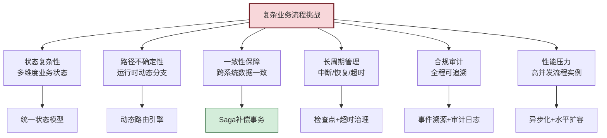

### 1.3 与简单任务执行的本质区别

| 维度 | 简单任务执行 | 复杂业务流程处理 |
|------|-------------|------------------|
| **流程定义** | 运行时动态规划 | 业务规则预定义+动态调整 |
| **路径数量** | 单一线性路径 | 多分支+多并行+多合并 |
| **状态维度** | 步骤状态 | 业务实体状态+流程状态+步骤状态 |
| **失败处理** | 重试/重规划 | 补偿事务+人工介入+回滚 |
| **执行时长** | 秒~分钟级 | 分钟~天级 |
| **外部依赖** | 单一工具调用 | 多业务系统协作 |
| **合规要求** | 日志即可 | 全程审计+合规校验 |
| **典型场景** | 信息查询、文本生成 | 订单履约、审批流程、理赔处理 |

### 1.4 设计目标

本方案围绕**正确性、灵活性、可靠性、可观测性**四大目标设计:

| 目标 | 含义 | 衡量指标 |
|------|------|----------|
| **正确性** | 业务流程执行符合业务规则 | 业务异常率<0.1% |
| **灵活性** | 支持流程动态调整与扩展 | 流程变更无需重启 |
| **可靠性** | 故障不丢数据,可恢复 | 数据零丢失,恢复RTO<5min |
| **可观测性** | 全程可追溯可审计 | 100%步骤可追溯 |

---

## 二、核心组件设计

### 2.1 总体架构

复杂业务流程处理系统采用**六层架构**:流程定义层、流程引擎层、决策层、执行层、集成层、治理层:

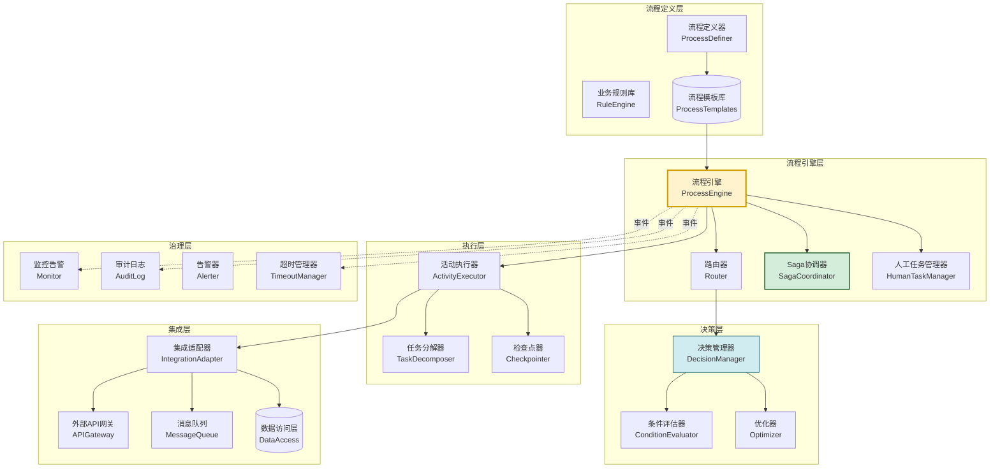

### 2.2 核心组件职责

| 组件 | 职责 | 关键能力 |
|------|------|----------|
| **ProcessDefiner** | 定义业务流程模板 | 可视化/DSL 流程建模 |
| **ProcessEngine** | 流程实例编排与调度 | 启动/推进/挂起/终止 |
| **Router** | 动态路由与分支决策 | 条件分支/并行/合并 |
| **SagaCoordinator** | 分布式事务协调 | 补偿事务编排 |
| **DecisionManager** | 业务决策管理 | 规则+LLM 混合决策 |
| **ConditionEvaluator** | 条件表达式评估 | 业务状态判断 |
| **ActivityExecutor** | 执行流程活动 | 工具调用/服务调用 |
| **HumanTaskManager** | 人工任务管理 | 创建/分配/审批/超时 |
| **IntegrationAdapter** | 外部系统适配 | 协议转换/重试/熔断 |
| **Checkpointer** | 状态检查点 | 持久化/恢复 |
| **TimeoutManager** | 超时治理 | SLA 监控/超时升级 |
| **AuditLog** | 审计日志 | 全程操作留痕 |

---

## 三、决策机制

### 3.1 混合决策模型

复杂业务流程的决策采用**规则优先 + LLM 兜底**的混合模型:

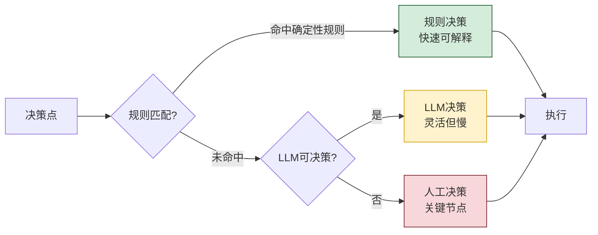

### 3.2 决策类型分类

| 决策类型 | 决策方式 | 延迟 | 可解释性 | 典型场景 |
|----------|----------|------|----------|----------|
| **路由决策** | 规则引擎 | <10ms | 强 | 金额>1万→经理审批 |
| **参数决策** | 规则+计算 | <50ms | 强 | 利率根据信用分计算 |
| **业务判定** | LLM | 1-3s | 中 | 文档合规性判断 |
| **异常处置** | LLM+规则 | 1-5s | 中 | 异常订单处置策略 |
| **复杂推断** | LLM | 3-10s | 弱 | 风险等级综合评估 |
| **关键决策** | 人工 | 分钟级 | 强 | 大额贷款终审 |

### 3.3 决策管理器实现

```python
class DecisionManager:
    """混合决策管理器:规则优先,LLM兜底"""

    def __init__(self, rule_engine, llm, human_task_manager):
        self.rule_engine = rule_engine
        self.llm = llm
        self.human_task_manager = human_task_manager

    def decide(self, decision_point: str, context: dict) -> Decision:
        """在决策点做出决策"""
        # 1. 优先尝试规则决策
        rule_result = self.rule_engine.evaluate(decision_point, context)
        if rule_result.matched:
            return Decision(
                type="rule", value=rule_result.value,
                reason=rule_result.reason, confidence=1.0,
            )

        # 2. 规则未命中,尝试LLM决策
        if self._llm_capable(decision_point):
            llm_result = self._llm_decide(decision_point, context)
            if llm_result.confidence >= 0.7:
                return llm_result

        # 3. LLM不可用或置信度低,转人工
        return self._escalate_to_human(decision_point, context)

    def _llm_decide(self, point: str, context: dict) -> Decision:
        prompt = DECISION_PROMPT.format(
            decision_point=point,
            context=json.dumps(context, ensure_ascii=False, default=str),
            available_options=self._get_options(point),
        )
        response = self.llm.invoke(prompt)
        data = json.loads(response)
        return Decision(
            type="llm", value=data["decision"],
            reason=data["reason"], confidence=data.get("confidence", 0.5),
        )

    def _escalate_to_human(self, point: str, context: dict) -> Decision:
        task_id = self.human_task_manager.create(
            title=f"需人工决策: {point}",
            context=context, decision_point=point,
            sla_minutes=self._get_sla(point),
        )
        return Decision(
            type="human", value="PENDING_HUMAN",
            reason=f"已升级为人工决策,任务ID: {task_id}",
            confidence=0.0, metadata={"human_task_id": task_id},
        )
```

### 3.4 业务规则引擎

```python
class RuleEngine:
    """业务规则引擎:支持确定性规则匹配"""

    def __init__(self):
        self.rules: dict[str, list[Rule]] = {}

    def register(self, decision_point: str, rule: Rule):
        self.rules.setdefault(decision_point, []).append(rule)

    def evaluate(self, decision_point: str, context: dict) -> RuleResult:
        rules = self.rules.get(decision_point, [])
        for rule in sorted(rules, key=lambda r: r.priority, reverse=True):
            if rule.matches(context):
                return RuleResult(
                    matched=True, value=rule.action,
                    reason=f"规则 {rule.id} 命中: {rule.description}",
                )
        return RuleResult(matched=False)

@dataclass
class Rule:
    id: str
    condition: str            # 条件表达式
    action: Any               # 决策结果
    priority: int = 0
    description: str = ""

    def matches(self, context: dict) -> bool:
        try:
            return bool(eval(self.condition, {"__builtins__": {}}, context))
        except Exception:
            return False

# 示例:订单审批路由规则
rule_engine = RuleEngine()
rule_engine.register("order_approval_route", Rule(
    id="R-001",
    condition="amount <= 1000",
    action="auto_approve",
    priority=10,
    description="金额≤1000自动审批",
))
rule_engine.register("order_approval_route", Rule(
    id="R-002",
    condition="1000 < amount <= 10000",
    action="manager_approval",
    priority=5,
    description="1000-10000需经理审批",
))
rule_engine.register("order_approval_route", Rule(
    id="R-003",
    condition="amount > 10000",
    action="director_approval",
    priority=1,
    description=">10000需总监审批",
))
```

---

## 四、任务分解策略

### 4.1 业务流程层级分解

复杂业务流程采用**三级分解**:流程→阶段→活动:

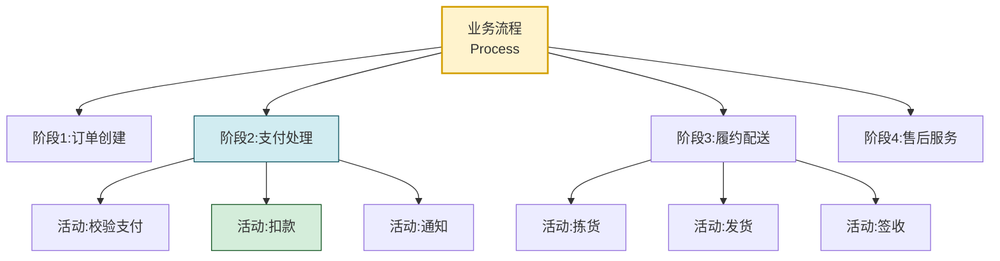

| 层级 | 说明 | 示例 |
|------|------|------|
| **流程(Process)** | 端到端业务目标 | 订单履约流程 |
| **阶段(Stage)** | 流程的逻辑分段 | 支付处理阶段 |
| **活动(Activity)** | 原子执行单元 | 扣款活动 |

### 4.2 流程定义模型

```python
from enum import Enum
from dataclasses import dataclass, field
from uuid import uuid4

class ActivityType(Enum):
    SERVICE_CALL = "service_call"      # 服务调用
    TOOL_CALL = "tool_call"            # 工具调用
    LLM_TASK = "llm_task"              # LLM 任务
    HUMAN_TASK = "human_task"          # 人工任务
    SCRIPT = "script"                  # 脚本执行
    WAIT = "wait"                      # 等待事件
    SUBPROCESS = "subprocess"          # 子流程

class GatewayType(Enum):
    EXCLUSIVE = "exclusive"            # 排他网关(多选一)
    PARALLEL = "parallel"              # 并行网关(全执行)
    INCLUSIVE = "inclusive"            # 包容网关(条件多选)
    EVENT = "event"                    # 事件网关

@dataclass
class Activity:
    """流程活动"""
    activity_id: str = field(default_factory=lambda: str(uuid4()))
    name: str = ""
    activity_type: ActivityType = ActivityType.SERVICE_CALL
    service_name: str = ""             # 调用的服务/工具名
    input_mapping: dict = field(default_factory=dict)  # 输入映射
    output_mapping: dict = field(default_factory=dict) # 输出映射
    timeout_seconds: int = 300
    retry_policy: dict = field(default_factory=dict)
    compensation: str = ""             # 补偿活动名
    sla_minutes: int = 60

@dataclass
class Gateway:
    """网关:控制流程走向"""
    gateway_id: str = field(default_factory=lambda: str(uuid4()))
    gateway_type: GatewayType
    conditions: dict[str, str] = field(default_factory=dict)  # 分支条件
    default_branch: str = ""           # 默认分支

@dataclass
class Transition:
    """流转:连接活动/网关"""
    from_node: str
    to_node: str
    condition: str = ""                # 流转条件

@dataclass
class ProcessDefinition:
    """流程定义"""
    process_id: str
    name: str
    version: int = 1
    activities: dict[str, Activity] = field(default_factory=dict)
    gateways: dict[str, Gateway] = field(default_factory=dict)
    transitions: list[Transition] = field(default_factory=list)
    start_node: str = ""
    end_nodes: list[str] = field(default_factory=list)
    variables: dict = field(default_factory=dict)  # 流程变量
```

### 4.3 分解策略选择

| 业务复杂度 | 分解策略 | 适用场景 |
|-----------|----------|----------|
| **线性流程** | 顺序分解 | 简单审批:提交→审批→归档 |
| **分支流程** | 条件分解 | 金额路由:不同金额不同审批链 |
| **并行流程** | 并行分解 | 多部门会签 |
| **迭代流程** | 循环分解 | 修改→审核→(不通过)→修改 |
| **补偿流程** | Saga 分解 | 跨系统事务 |
| **事件流程** | 事件驱动 | 等待外部事件触发 |

### 4.4 LLM 辅助任务分解

对于非预定义的复杂任务,通过 LLM 进行动态分解:

```python
class LLMBusinessDecomposer:
    """LLM 驱动的业务任务分解器"""

    DECOMPOSE_PROMPT = """
你是业务流程专家。请将以下业务任务分解为可执行的活动列表。

业务任务: {task}
业务上下文: {context}
可用服务: {available_services}
业务规则: {business_rules}

要求:
1. 每个活动必须是单一服务可完成的原子操作
2. 明确活动间的执行顺序与依赖
3. 为关键活动指定补偿操作
4. 标注需人工介入的活动
5. 设置合理的SLA与超时

输出JSON:
{{
  "activities": [
    {{
      "name": "活动名称",
      "activity_type": "service_call|human_task|llm_task",
      "service_name": "服务名",
      "input_mapping": {{}},
      "compensation": "补偿活动名(可选)",
      "sla_minutes": 60,
      "timeout_seconds": 300
    }}
  ],
  "transitions": [
    {{"from": "活动名", "to": "活动名", "condition": "条件(可选)"}}
  ]
}}
"""

    def decompose(self, task: str, context: dict,
                  available_services: list[str]) -> ProcessDefinition:
        prompt = self.DECOMPOSE_PROMPT.format(
            task=task,
            context=json.dumps(context, ensure_ascii=False, default=str),
            available_services=available_services,
            business_rules=self._get_business_rules(),
        )
        response = self.llm.invoke(prompt)
        data = json.loads(response)
        return self._build_process(data)
```

---

## 五、多条件分支与动态路由

### 5.1 网关类型与适用场景

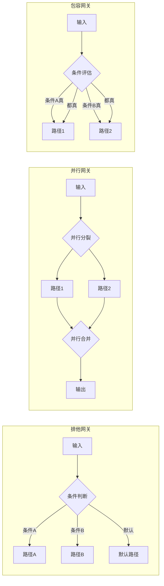

| 网关类型 | 行为 | 典型场景 |
|----------|------|----------|
| **排他网关** | 多条件选一 | 金额路由、风险等级分流 |
| **并行网关** | 全部并行执行 | 多部门会签、多维校验 |
| **包容网关** | 条件性并行 | 满足条件的分支并行执行 |
| **事件网关** | 等待事件触发 | 等待用户响应/外部回调 |

### 5.2 动态路由器实现

```python
class DynamicRouter:
    """动态路由器:根据流程状态选择下一活动"""

    def __init__(self, condition_evaluator, process_def: ProcessDefinition):
        self.evaluator = condition_evaluator
        self.process_def = process_def

    def get_next_nodes(self, current_node: str,
                       process_context: dict) -> list[str]:
        """获取下一批待执行节点"""
        # 获取当前节点的所有出向流转
        outgoing = [t for t in self.process_def.transitions
                    if t.from_node == current_node]
        if not outgoing:
            return []  # 流程结束

        # 判断当前节点是否为网关
        if current_node in self.process_def.gateways:
            gateway = self.process_def.gateways[current_node]
            return self._route_gateway(gateway, outgoing, process_context)

        # 普通活动:返回唯一后继
        return [outgoing[0].to_node]

    def _route_gateway(self, gateway: Gateway,
                       outgoing: list[Transition],
                       context: dict) -> list[str]:
        """网关路由"""
        if gateway.gateway_type == GatewayType.EXCLUSIVE:
            return self._route_exclusive(gateway, outgoing, context)
        elif gateway.gateway_type == GatewayType.PARALLEL:
            return [t.to_node for t in outgoing]  # 全部并行
        elif gateway.gateway_type == GatewayType.INCLUSIVE:
            return self._route_inclusive(gateway, outgoing, context)
        return [gateway.default_branch] if gateway.default_branch else []

    def _route_exclusive(self, gateway: Gateway,
                         outgoing: list[Transition],
                         context: dict) -> list[str]:
        """排他网关:第一个满足条件的分支"""
        for transition in outgoing:
            if transition.condition:
                if self.evaluator.evaluate(transition.condition, context):
                    return [transition.to_node]
            else:
                # 无条件流转(默认)
                return [transition.to_node]
        # 都不满足,走默认分支
        return [gateway.default_branch] if gateway.default_branch else []

    def _route_inclusive(self, gateway: Gateway,
                         outgoing: list[Transition],
                         context: dict) -> list[str]:
        """包容网关:所有满足条件的分支并行"""
        selected = []
        for transition in outgoing:
            if not transition.condition:
                selected.append(transition.to_node)
            elif self.evaluator.evaluate(transition.condition, context):
                selected.append(transition.to_node)
        # 至少选一个,否则默认
        return selected or ([gateway.default_branch] if gateway.default_branch else [])
```

### 5.3 条件表达式评估器

```python
class ConditionEvaluator:
    """条件表达式评估器:支持业务表达式"""

    def evaluate(self, expression: str, context: dict) -> bool:
        """评估条件表达式"""
        try:
            # 安全的 eval:禁用危险内置
            safe_globals = {"__builtins__": {}}
            safe_locals = self._build_safe_context(context)
            return bool(eval(expression, safe_globals, safe_locals))
        except Exception as e:
            logger.warning(f"条件评估失败: {expression}, 错误: {e}")
            return False

    def _build_safe_context(self, context: dict) -> dict:
        """构建安全的评估上下文,注入辅助函数"""
        return {
            **context,
            "len": len, "abs": abs, "min": min, "max": max,
            "sum": sum, "any": any, "all": all,
            "now": datetime.now,
        }

# 示例条件表达式
CONDITIONS = {
    "high_value": "amount > 10000",
    "vip_customer": "customer.tier == 'VIP'",
    "weekend": "now().weekday() >= 5",
    "high_risk": "risk_score > 0.7 and not vip_customer",
    "need_manager": "amount > 1000 and amount <= 10000",
}
```

### 5.4 并行分支的合并控制

```python
class ParallelJoinController:
    """并行分支合并控制器"""

    def __init__(self):
        # 记录每个并行分裂点的分支完成情况
        self._branch_status: dict[str, dict[str, bool]] = {}

    def register_split(self, split_id: str, branch_ids: list[str]):
        """注册并行分裂点"""
        self._branch_status[split_id] = {bid: False for bid in branch_ids}

    def mark_branch_done(self, split_id: str, branch_id: str):
        """标记分支完成"""
        if split_id in self._branch_status:
            self._branch_status[split_id][branch_id] = True

    def is_all_branches_done(self, split_id: str) -> bool:
        """判断并行分支是否全部完成"""
        status = self._branch_status.get(split_id, {})
        return all(status.values())

    def get_pending_branches(self, split_id: str) -> list[str]:
        """获取未完成的分支"""
        status = self._branch_status.get(split_id, {})
        return [bid for bid, done in status.items() if not done]
```

---

## 六、异常处理与补偿机制

### 6.1 业务异常分类

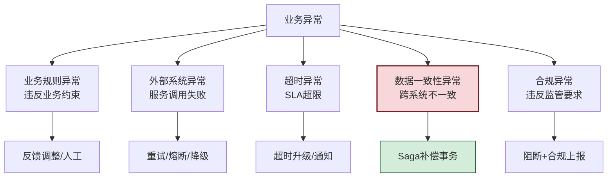

### 6.2 Saga 补偿事务模式

对于跨系统的业务流程,采用 **Saga 模式**保障最终一致性:

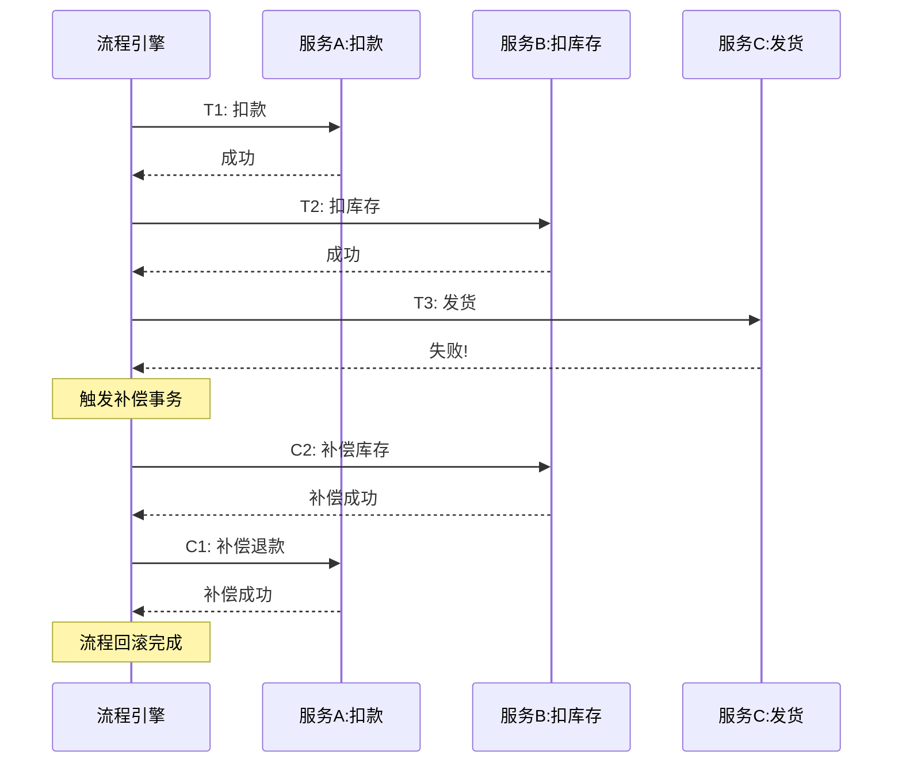

### 6.3 Saga 协调器实现

```python
class SagaCoordinator:
    """Saga 分布式事务协调器"""

    def __init__(self, state_manager, compensation_executor):
        self.state = state_manager
        self.compensation_executor = compensation_executor

    def execute_saga(self, saga_id: str,
                     activities: list[Activity],
                     context: dict) -> SagaResult:
        """执行 Saga 事务"""
        completed = []  # 已成功完成的活动

        for activity in activities:
            try:
                # 执行正向活动
                result = self._execute_activity(activity, context)
                completed.append((activity, result))
                self.state.save_saga_progress(saga_id, completed)

            except Exception as e:
                # 正向失败,触发补偿
                logger.error(f"Saga {saga_id} 活动失败: {activity.name}, 错误: {e}")
                self._compensate(saga_id, completed, context)
                return SagaResult(success=False, failed_activity=activity.name,
                                  error=str(e), compensated=True)

        return SagaResult(success=True, completed_activities=len(completed))

    def _compensate(self, saga_id: str,
                    completed: list[tuple[Activity, Any]],
                    context: dict):
        """按逆序执行补偿活动"""
        logger.info(f"Saga {saga_id} 开始补偿,共 {len(completed)} 个补偿")
        compensation_failures = []

        for activity, result in reversed(completed):
            if not activity.compensation:
                continue  # 无补偿操作
            try:
                self.compensation_executor.execute(
                    activity.compensation, result, context,
                )
                logger.info(f"补偿成功: {activity.compensation}")
            except Exception as e:
                logger.error(f"补偿失败: {activity.compensation}, 错误: {e}")
                compensation_failures.append({
                    "activity": activity.name,
                    "compensation": activity.compensation,
                    "error": str(e),
                })

        if compensation_failures:
            # 补偿失败需人工介入
            self._escalate_compensation_failure(saga_id, compensation_failures)

    def _escalate_compensation_failure(self, saga_id: str, failures: list):
        """补偿失败升级处理"""
        # 创建人工任务
        human_task_manager.create(
            title=f"Saga {saga_id} 补偿失败,需人工介入",
            context={"saga_id": saga_id, "failures": failures},
            priority="CRITICAL",
        )
        # 告警通知
        alerter.alert_critical(
            f"Saga补偿失败: {saga_id}, 失败项: {failures}",
        )
```

### 6.4 异常处理策略矩阵

| 异常类型 | 检测方式 | 处理策略 | 是否补偿 | 是否升级 |
|----------|----------|----------|----------|----------|
| 服务超时 | `TimeoutError` | 重试+熔断 | 否 | 重试耗尽则升级 |
| 服务异常 | HTTP 5xx | 重试+降级 | 视情况 | 持续失败则升级 |
| 业务规则违反 | 校验失败 | 阻断+反馈 | 是 | 否 |
| 数据不一致 | 对账检测 | Saga 补偿 | 是 | 补偿失败则升级 |
| SLA 超限 | 超时监控 | 升级+通知 | 否 | 是 |
| 合规违规 | 规则引擎 | 阻断+上报 | 是 | 强制升级 |

### 6.5 熔断器保护

```python
class CircuitBreaker:
    """熔断器:防止外部系统故障级联"""

    def __init__(self, failure_threshold: int = 5,
                 recovery_timeout: int = 60):
        self.failure_count = 0
        self.failure_threshold = failure_threshold
        self.recovery_timeout = recovery_timeout
        self.state = "closed"  # closed / open / half_open
        self.opened_at = None

    def call(self, func, *args, **kwargs):
        if self.state == "open":
            if self._should_try_recover():
                self.state = "half_open"
            else:
                raise CircuitOpenError("熔断器开启,拒绝调用")

        try:
            result = func(*args, **kwargs)
            self._on_success()
            return result
        except Exception as e:
            self._on_failure()
            raise

    def _on_success(self):
        self.failure_count = 0
        self.state = "closed"

    def _on_failure(self):
        self.failure_count += 1
        if self.failure_count >= self.failure_threshold:
            self.state = "open"
            self.opened_at = datetime.now()

    def _should_try_recover(self) -> bool:
        return (datetime.now() - self.opened_at).seconds >= self.recovery_timeout
```

---

## 七、动态调整与重规划

### 7.1 动态调整触发条件

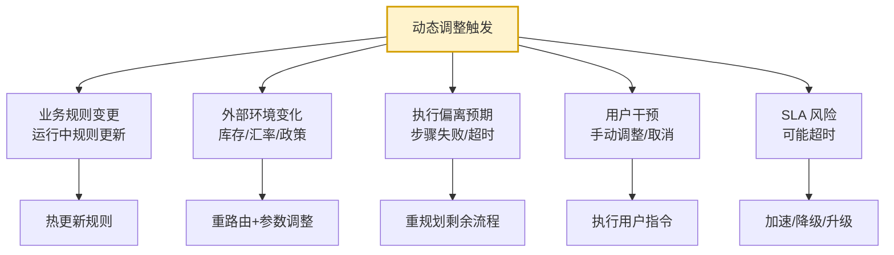

### 7.2 重规划器实现

```python
class DynamicReplanner:
    """动态重规划器:运行时调整流程"""

    def __init__(self, llm, process_engine, rule_engine):
        self.llm = llm
        self.engine = process_engine
        self.rule_engine = rule_engine

    def replan(self, process_instance: ProcessInstance,
               trigger: ReplanTrigger) -> ReplanResult:
        """根据触发原因重规划"""
        if trigger.type == "rule_change":
            return self._replan_for_rule(process_instance, trigger)
        elif trigger.type == "environment_change":
            return self._replan_for_env(process_instance, trigger)
        elif trigger.type == "execution_deviation":
            return self._replan_for_deviation(process_instance, trigger)
        elif trigger.type == "sla_risk":
            return self._replan_for_sla(process_instance, trigger)

    def _replan_for_deviation(self, instance: ProcessInstance,
                              trigger: ReplanTrigger) -> ReplanResult:
        """执行偏离时的重规划"""
        completed = [a for a in instance.activities
                     if a.status == "success"]
        failed = trigger.failed_activity
        remaining = [a for a in instance.activities
                     if a.status == "pending"]

        prompt = REPLAN_PROMPT.format(
            process_goal=instance.process_def.name,
            completed_activities=self._format(completed),
            failed_activity=failed.name,
            failure_reason=trigger.reason,
            remaining_activities=self._format(remaining),
            context=json.dumps(instance.context, ensure_ascii=False,
                              default=str),
        )
        response = self.llm.invoke(prompt)
        new_plan = json.loads(response)

        return ReplanResult(
            strategy="deviation_adjustment",
            new_activities=new_plan["activities"],
            compensation_needed=new_plan.get("need_compensation", False),
            reason=trigger.reason,
        )

    def _replan_for_sla(self, instance: ProcessInstance,
                        trigger: ReplanTrigger) -> ReplanResult:
        """SLA 风险时的加速重规划"""
        # 简化策略:并行化剩余活动 + 降级非关键活动
        remaining = [a for a in instance.activities if a.status == "pending"]
        parallelizable = [a for a in remaining if not a.critical]
        critical = [a for a in remaining if a.critical]

        return ReplanResult(
            strategy="sla_acceleration",
            new_activities=critical + [{"parallel_group": parallelizable}],
            reason=f"SLA风险: 预计超时 {trigger.expected_overrun}分钟",
        )
```

### 7.3 热更新机制

```python
class HotUpdateManager:
    """流程定义热更新管理器"""

    def __init__(self, process_engine, version_manager):
        self.engine = process_engine
        self.version_manager = version_manager

    def update_process_def(self, process_id: str,
                           new_def: ProcessDefinition) -> UpdateResult:
        """热更新流程定义"""
        # 1. 版本管理:保留旧版本
        old_version = self.version_manager.get_current_version(process_id)
        new_def.version = old_version + 1
        self.version_manager.save(process_id, new_def)

        # 2. 对运行中实例的影响评估
        running_instances = self.engine.get_running_instances(process_id)
        affected = self._assess_impact(running_instances, old_version, new_def)

        # 3. 按策略处理运行中实例
        for instance in running_instances:
            strategy = self._decide_strategy(instance, affected)
            if strategy == "migrate":
                self._migrate_instance(instance, new_def)
            elif strategy == "continue_old":
                pass  # 继续按旧版本执行
            elif strategy == "pause_and_notify":
                self._pause_and_notify(instance, new_def)

        return UpdateResult(
            new_version=new_def.version,
            affected_instances=len(running_instances),
            migrated=sum(1 for i in running_instances
                        if self._decide_strategy(i, affected) == "migrate"),
        )
```

---

## 八、与外部系统的交互方式

### 8.1 外部系统集成模式

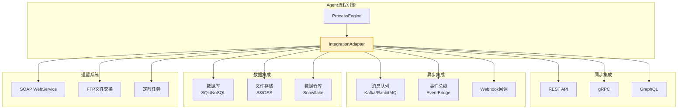

### 8.2 集成适配器统一架构

```python
class IntegrationAdapter:
    """统一集成适配器:屏蔽外部系统差异"""

    def __init__(self):
        self.protocols = {
            "rest": RESTAdapter(),
            "grpc": GRPCAdapter(),
            "mq": MessageQueueAdapter(),
            "db": DatabaseAdapter(),
            "soap": SOAPAdapter(),
            "webhook": WebhookAdapter(),
        }
        self.circuit_breakers: dict[str, CircuitBreaker] = {}
        self.retry_policy = RetryPolicy(max_retries=3, backoff="exponential")

    def call(self, integration: IntegrationConfig,
             context: dict) -> IntegrationResult:
        """统一调用接口"""
        adapter = self.protocols[integration.protocol]
        breaker = self._get_breaker(integration.system_name)

        # 熔断保护 + 重试
        def _do_call():
            return adapter.invoke(integration, context)

        try:
            result = self.retry_policy.execute(
                lambda: breaker.call(_do_call)
            )
            return IntegrationResult(success=True, data=result)
        except CircuitOpenError:
            # 熔断开启,走降级
            return self._fallback(integration, context)
        except Exception as e:
            return IntegrationResult(success=False, error=str(e))

    def _fallback(self, integration: IntegrationConfig,
                  context: dict) -> IntegrationResult:
        """降级处理:返回缓存/默认值"""
        if integration.fallback_strategy == "cache":
            cached = cache.get(integration.cache_key(context))
            if cached:
                return IntegrationResult(success=True, data=cached,
                                         degraded=True)
        return IntegrationResult(success=False, error="服务不可用且无降级数据")
```

### 8.3 异步回调模式

```python
class AsyncCallbackManager:
    """异步回调管理器:处理外部系统异步响应"""

    def __init__(self, state_manager, timeout_manager):
        self.state = state_manager
        self.timeout = timeout_manager
        self.pending_callbacks: dict[str, CallbackContext] = {}

    def register_callback(self, process_instance_id: str,
                          activity_id: str,
                          external_request_id: str,
                          timeout_seconds: int = 3600) -> str:
        """注册异步回调等待"""
        callback_id = str(uuid4())
        self.pending_callbacks[callback_id] = CallbackContext(
            process_instance_id=process_instance_id,
            activity_id=activity_id,
            external_request_id=external_request_id,
            registered_at=datetime.now(),
            timeout_at=datetime.now() + timedelta(seconds=timeout_seconds),
        )
        # 注册超时检查
        self.timeout.register(callback_id, timeout_seconds,
                              lambda: self._on_timeout(callback_id))
        return callback_id

    def on_callback(self, callback_id: str, result: Any):
        """外部系统回调"""
        ctx = self.pending_callbacks.get(callback_id)
        if not ctx:
            logger.warning(f"收到未知回调: {callback_id}")
            return
        # 恢复流程
        self.state.save_activity_result(
            ctx.process_instance_id, ctx.activity_id, result,
        )
        del self.pending_callbacks[callback_id]
        # 触发流程继续执行
        process_engine.resume(ctx.process_instance_id)

    def _on_timeout(self, callback_id: str):
        """回调超时处理"""
        ctx = self.pending_callbacks.get(callback_id)
        if ctx:
            logger.warning(f"回调超时: {callback_id}")
            # 标记活动超时,触发异常处理
            self.state.mark_activity_timeout(
                ctx.process_instance_id, ctx.activity_id,
            )
            del self.pending_callbacks[callback_id]
```

### 8.4 人工任务集成

```python
class HumanTaskManager:
    """人工任务管理器:处理需人工介入的活动"""

    def __init__(self, task_store, notification_service):
        self.store = task_store
        self.notifier = notification_service

    def create(self, title: str, context: dict,
               assignee: str = None, role: str = None,
               sla_minutes: int = 60, priority: str = "MEDIUM") -> str:
        """创建人工任务"""
        task = HumanTask(
            task_id=str(uuid4()),
            title=title, context=context,
            assignee=assignee, role=role,
            sla_deadline=datetime.now() + timedelta(minutes=sla_minutes),
            priority=priority, status="pending",
        )
        self.store.save(task)
        # 通知
        self.notifier.notify(task)
        return task.task_id

    def complete(self, task_id: str, decision: Any,
                 operator: str) -> HumanTask:
        """完成人工任务"""
        task = self.store.get(task_id)
        task.status = "completed"
        task.decision = decision
        task.operator = operator
        task.completed_at = datetime.now()
        self.store.save(task)
        # 触发流程继续
        process_engine.resume(task.process_instance_id)
        return task

    def escalate(self, task_id: str, reason: str):
        """升级人工任务"""
        task = self.store.get(task_id)
        task.escalation_level += 1
        task.assignee = self._get_escalation_assignee(task.escalation_level)
        self.store.save(task)
        self.notifier.notify_escalation(task, reason)
```

---

## 九、架构设计方案

### 9.1 总体架构图

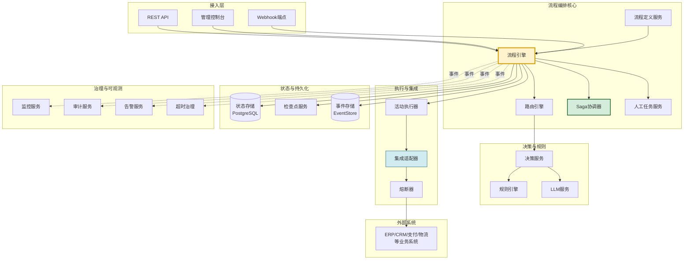

### 9.2 部署架构

| 层级 | 部署方案 | 说明 |
|------|----------|------|
| **接入层** | API Gateway + 负载均衡 | 水平扩容,SSL 终止 |
| **编排核心** | 无状态服务集群 | Kubernetes Deployment,3+ 副本 |
| **决策服务** | 独立微服务 | 规则引擎+LLM 调用分离 |
| **状态存储** | PostgreSQL 主从+只读副本 | 强一致性保障 |
| **事件存储** | Kafka/Elasticsearch | 事件溯源+审计 |
| **缓存** | Redis Cluster | 热数据缓存+分布式锁 |
| **外部集成** | Service Mesh | 熔断/重试/观测统一治理 |

### 9.3 关键设计决策

| 决策点 | 选择 | 理由 |
|--------|------|------|
| 流程定义方式 | DSL + 可视化 | 兼顾开发者与业务人员 |
| 状态持久化 | PostgreSQL | ACID 保障业务一致性 |
| 事件通信 | Kafka | 解耦+可靠投递 |
| 事务模式 | Saga | 跨系统最终一致性 |
| 决策方式 | 规则+LLM 混合 | 确定性+灵活性兼顾 |
| 部署方式 | 容器化+编排 | 弹性扩缩容 |

---

## 十、关键技术实现细节

### 10.1 流程实例数据模型

```python
@dataclass
class ProcessInstance:
    """流程实例:一次具体的业务流程执行"""
    instance_id: str = field(default_factory=lambda: str(uuid4()))
    process_def_id: str = ""
    process_def_version: int = 1
    business_id: str = ""              # 业务ID(如订单号)
    business_type: str = ""            # 业务类型
    status: str = "running"            # running/paused/completed/failed/cancelled
    context: dict = field(default_factory=dict)  # 流程上下文(业务变量)
    current_nodes: list[str] = field(default_factory=list)  # 当前活跃节点
    activity_results: dict[str, Any] = field(default_factory=dict)  # 活动结果
    saga_log: list[dict] = field(default_factory=list)  # Saga 执行日志
    created_at: datetime = field(default_factory=datetime.now)
    updated_at: datetime = field(default_factory=datetime.now)
    completed_at: datetime = None
    priority: int = 0
    metadata: dict = field(default_factory=dict)
```

### 10.2 流程引擎核心实现

```python
class ProcessEngine:
    """流程引擎:编排流程实例的执行"""

    def __init__(self, def_registry, router, activity_executor,
                 saga_coordinator, state_manager, event_bus, tracer):
        self.def_registry = def_registry
        self.router = router
        self.executor = activity_executor
        self.saga = saga_coordinator
        self.state = state_manager
        self.event_bus = event_bus
        self.tracer = tracer

    def start(self, process_def_id: str, business_id: str,
              context: dict) -> ProcessInstance:
        """启动流程实例"""
        process_def = self.def_registry.get(process_def_id)
        instance = ProcessInstance(
            process_def_id=process_def_id,
            process_def_version=process_def.version,
            business_id=business_id,
            business_type=process_def.name,
            context=context,
            current_nodes=[process_def.start_node],
        )
        self.state.save(instance)
        self.event_bus.publish("process.started", {"instance_id": instance.instance_id})
        self._advance(instance, process_def)
        return instance

    def _advance(self, instance: ProcessInstance, process_def: ProcessDefinition):
        """推进流程执行"""
        while instance.current_nodes:
            current = instance.current_nodes[0]

            # 检查是否到达终点
            if current in process_def.end_nodes:
                instance.status = "completed"
                instance.completed_at = datetime.now()
                self.state.save(instance)
                self.event_bus.publish("process.completed",
                                       {"instance_id": instance.instance_id})
                return

            # 执行当前活动
            if current in process_def.activities:
                activity = process_def.activities[current]
                try:
                    result = self.executor.execute(activity, instance.context)
                    instance.activity_results[current] = result
                    self.state.save(instance)
                except Exception as e:
                    self._handle_activity_failure(instance, activity, e, process_def)
                    return

            # 路由到下一节点
            next_nodes = self.router.get_next_nodes(current, instance.context)
            instance.current_nodes = next_nodes
            self.state.save(instance)

    def _handle_activity_failure(self, instance: ProcessInstance,
                                 activity: Activity, error: Exception,
                                 process_def: ProcessDefinition):
        """活动失败处理"""
        self.tracer.trace("activity_failed", instance.instance_id,
                          activity=activity.name, error=str(error))
        # 触发 Saga 补偿
        if activity.compensation:
            self.saga.compensate_activity(instance, activity)
        instance.status = "failed"
        instance.metadata["failure_reason"] = str(error)
        self.state.save(instance)
        self.event_bus.publish("process.failed",
                               {"instance_id": instance.instance_id,
                                "error": str(error)})

    def pause(self, instance_id: str):
        """暂停流程"""
        instance = self.state.get(instance_id)
        instance.status = "paused"
        self.state.save(instance)

    def resume(self, instance_id: str):
        """恢复流程"""
        instance = self.state.get(instance_id)
        instance.status = "running"
        self.state.save(instance)
        process_def = self.def_registry.get(instance.process_def_id,
                                            instance.process_def_version)
        self._advance(instance, process_def)

    def cancel(self, instance_id: str, reason: str = ""):
        """取消流程"""
        instance = self.state.get(instance_id)
        instance.status = "cancelled"
        instance.metadata["cancel_reason"] = reason
        self.state.save(instance)
```

### 10.3 事件溯源实现

```python
class EventSourcingStore:
    """事件溯源存储:全程记录流程事件"""

    def __init__(self, event_store):
        self.store = event_store

    def append(self, instance_id: str, event: ProcessEvent):
        """追加事件"""
        event.instance_id = instance_id
        event.timestamp = datetime.now()
        self.store.append(event)

    def get_history(self, instance_id: str) -> list[ProcessEvent]:
        """获取流程完整历史"""
        return self.store.query(instance_id=instance_id)

    def reconstruct_state(self, instance_id: str) -> ProcessInstance:
        """从事件重建流程状态"""
        events = self.get_history(instance_id)
        instance = ProcessInstance(instance_id=instance_id)
        for event in events:
            instance = event.apply(instance)
        return instance
```

---

## 十一、性能优化建议

### 11.1 性能优化策略总览

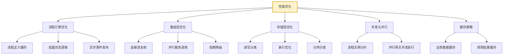

### 11.2 关键优化措施

| 优化方向 | 措施 | 预期收益 |
|----------|------|----------|
| **流程定义缓存** | 流程定义内存缓存,避免反复加载 | 加载延迟降90% |
| **批量状态更新** | 多活动状态合并提交 | DB 压力降60% |
| **异步事件** | 事件发布走 Kafka 异步 | 主流程延迟降40% |
| **并行调用** | 无依赖活动并行执行 | 端到端延迟降50% |
| **连接池** | 外部服务连接复用 | 调用延迟降30% |
| **读写分离** | 状态查询走只读副本 | 查询吞吐升5x |
| **分片调度** | 流程实例按 business_id 分片 | 水平扩容支持 |
| **规则缓存** | 规则评估结果缓存 | 决策延迟降70% |

### 11.3 并行执行优化

```python
import asyncio
from concurrent.futures import ThreadPoolExecutor

class ParallelActivityExecutor:
    """并行活动执行器"""

    def __init__(self, max_workers: int = 10):
        self.executor = ThreadPoolExecutor(max_workers=max_workers)

    def execute_parallel(self, activities: list[Activity],
                         context: dict) -> dict[str, Any]:
        """并行执行多个无依赖活动"""
        futures = {
            activity.name: self.executor.submit(
                self._execute_one, activity, context
            )
            for activity in activities
        }
        results = {}
        for name, future in futures.items():
            try:
                results[name] = future.result(timeout=300)
            except Exception as e:
                results[name] = {"error": str(e)}
        return results

    async def execute_parallel_async(self, activities: list[Activity],
                                     context: dict) -> dict[str, Any]:
        """异步并行执行"""
        tasks = [self._execute_one_async(a, context) for a in activities]
        results = await asyncio.gather(*tasks, return_exceptions=True)
        return {a.name: r for a, r in zip(activities, results)}
```

### 11.4 性能指标与SLA

| 指标 | 目标 | 监控方式 |
|------|------|----------|
| 流程启动延迟 | <100ms | P99 监控 |
| 单活动执行延迟 | <500ms | P95 监控 |
| 流程端到端延迟 | 业务SLA内 | 分阶段监控 |
| 系统吞吐 | >1000 TPS | 压测验证 |
| 状态保存延迟 | <50ms | P99 监控 |
| 外部调用超时率 | <1% | 熔断统计 |

---

## 十二、完整代码实现

### 12.1 系统集成类

```python
"""
Agent 复杂业务流程处理系统完整实现
集成流程定义、引擎、决策、Saga、集成、治理
"""

class BusinessProcessSystem:
    """复杂业务流程处理系统入口"""

    def __init__(self, config: dict = None):
        config = config or {}
        # 状态与持久化
        state_store = PostgreSQLStateStore(config.get("db_url"))
        event_store = EventStore(config.get("event_db_url"))
        self.state_manager = StateManager(state_store)
        self.event_sourcing = EventSourcingStore(event_store)

        # 决策层
        self.rule_engine = RuleEngine()
        self.llm = LLMClient(config.get("llm_config"))
        self.decision_manager = DecisionManager(
            self.rule_engine, self.llm, HumanTaskManager(state_store),
        )

        # 路由
        self.router = None  # 按流程定义动态创建

        # 执行层
        self.activity_executor = ActivityExecutor(
            IntegrationAdapter(), self.decision_manager, self.state_manager,
        )
        self.saga = SagaCoordinator(self.state_manager,
                                    CompensationExecutor(self.activity_executor))

        # 流程引擎
        self.def_registry = ProcessDefRegistry(state_store)
        self.process_engine = ProcessEngine(
            self.def_registry, self.router, self.activity_executor,
            self.saga, self.state_manager, EventBus(), Tracer(),
        )

        # 治理
        self.monitor = Monitor()
        self.audit = AuditLog(event_store)
        self.timeout_mgr = TimeoutManager(self.process_engine)

    def deploy_process(self, process_def: ProcessDefinition) -> str:
        """部署流程定义"""
        return self.def_registry.save(process_def)

    def start_process(self, process_def_id: str, business_id: str,
                      context: dict) -> ProcessInstance:
        """启动业务流程(对外核心API)"""
        return self.process_engine.start(process_def_id, business_id, context)

    def get_instance_status(self, instance_id: str) -> dict:
        """查询流程状态(对外API)"""
        instance = self.state_manager.get(instance_id)
        return {
            "instance_id": instance.instance_id,
            "business_id": instance.business_id,
            "status": instance.status,
            "current_nodes": instance.current_nodes,
            "progress": self._calc_progress(instance),
            "history": self.event_sourcing.get_history(instance_id),
        }

    def pause(self, instance_id: str):
        self.process_engine.pause(instance_id)

    def resume(self, instance_id: str):
        self.process_engine.resume(instance_id)

    def cancel(self, instance_id: str, reason: str = ""):
        self.process_engine.cancel(instance_id, reason)
```

### 12.2 使用示例

```python
# 初始化系统
system = BusinessProcessSystem(config={
    "db_url": "postgresql://localhost/process",
    "llm_config": {"model": "gpt-4o-mini"},
})

# 部署订单履约流程
order_process = ProcessDefinition(
    process_id="order_fulfillment",
    name="订单履约流程",
    activities={
        "validate": Activity(name="校验订单", service_name="order_service.validate"),
        "pay": Activity(name="支付扣款", service_name="payment_service.charge",
                       compensation="payment_service.refund"),
        "inventory": Activity(name="扣减库存", service_name="inventory_service.deduct",
                             compensation="inventory_service.restore"),
        "ship": Activity(name="发货", service_name="logistics_service.ship"),
        "notify": Activity(name="通知", service_name="notify_service.send"),
    },
    gateways={
        "pay_gateway": Gateway(gateway_type=GatewayType.EXCLUSIVE,
                              conditions={"success": "pay.success == true"}),
    },
    transitions=[
        Transition("validate", "pay"),
        Transition("pay", "pay_gateway"),
        Transition("pay_gateway", "inventory", "pay.success == true"),
        Transition("pay_gateway", "notify", "pay.success == false"),
        Transition("inventory", "ship"),
        Transition("ship", "notify"),
    ],
    start_node="validate",
    end_nodes=["notify"],
)
system.deploy_process(order_process)

# 启动流程
instance = system.start_process(
    process_def_id="order_fulfillment",
    business_id="ORD-2024-001",
    context={"order_id": "ORD-2024-001", "amount": 1500, "customer_id": "C001"},
)
```

---

## 十三、典型业务场景案例

### 13.1 案例一:电商订单履约流程

| 维度 | 设计 |
|------|------|
| **业务场景** | 下单→支付→扣库存→发货→签收→结算 |
| **复杂度** | 多步骤+多分支+跨系统 |
| **分支处理** | 支付失败→换支付方式/取消订单 |
| **补偿事务** | 发货失败→退款+恢复库存 |
| **外部集成** | 支付/库存/物流/通知多系统 |
| **性能优化** | 并行校验+异步通知 |
| **效果** | 端到端时效从2小时降至15分钟 |

### 13.2 案例二:贷款审批流程

| 维度 | 设计 |
|------|------|
| **业务场景** | 申请→预审→征信→评估→审批→放款 |
| **复杂度** | 长周期+多角色+多条件 |
| **分支处理** | 信用分路由不同审批链 |
| **人工介入** | 大额贷款需经理+风控双重审批 |
| **动态调整** | 征信结果变化重规划 |
| **合规审计** | 全程留痕+合规校验 |
| **效果** | 审批时效从5天降至1天 |

### 13.3 案例三:保险理赔流程

| 维度 | 设计 |
|------|------|
| **业务场景** | 报案→立案→查勘→定损→核赔→结案 |
| **复杂度** | 多分支+长周期+多系统 |
| **分支处理** | 金额/类型路由不同核赔流程 |
| **异常处理** | 疑似欺诈→特殊调查分支 |
| **外部集成** | 公安/医院/修理厂多系统 |
| **SLA治理** | 各阶段SLA监控+超时升级 |
| **效果** | 理赔周期从30天降至7天 |

---

## 十四、最佳实践与避坑指南

### 14.1 最佳实践清单

| 实践项 | 说明 |
|--------|------|
| ✅ **流程可视化定义** | 业务流程用 BPMN/DSL 定义,而非硬编码 |
| ✅ **规则与流程分离** | 业务规则独立管理,支持热更新 |
| ✅ **Saga 保障一致性** | 跨系统操作必配补偿事务 |
| ✅ **熔断保护集成** | 外部调用必配熔断器 |
| ✅ **全程事件溯源** | 所有操作事件化,支持审计与重建 |
| ✅ **SLA 分级治理** | 关键活动严格 SLA + 超时升级 |
| ✅ **人工任务闭环** | 人工介入必配超时+升级+通知 |
| ✅ **幂等设计** | 活动/补偿必须幂等,防重复执行 |
| ✅ **流程版本管理** | 流程定义版本化,支持灰度发布 |
| ✅ **混合决策** | 规则优先,LLM 兜底,人工保障 |

### 14.2 常见陷阱与规避

| 陷阱 | 现象 | 规避方案 |
|------|------|----------|
| **流程硬编码** | 业务规则写死在代码 | DSL 定义+规则引擎 |
| **无补偿设计** | 失败后数据不一致 | 必配 Saga 补偿 |
| **同步阻塞** | 外部调用阻塞主流程 | 异步回调+超时 |
| **无限重试** | 外部故障导致雪崩 | 熔断器+重试上限 |
| **状态丢失** | 进程崩溃流程丢失 | 每活动持久化+检查点 |
| **SLA 失控** | 流程长期挂起无处理 | 超时治理+自动升级 |
| **审计缺失** | 合规无法追溯 | 事件溯源+审计日志 |
| **流程僵化** | 规则变更需重启 | 热更新+版本管理 |

### 14.3 与现有文档的协同关系

| 文档 | 协同关系 |
|------|----------|
| [40Plan-and-Execute](./40Plan-and-Execute_Agent完整实现方案.md) | 本文档的流程定义基于 PE 思想,但侧重业务流程编排 |
| [41任务规划机制](./41Agent任务规划机制详解.md) | 本文档的任务分解复用规划机制 |
| [46中断恢复](./46Agent任务中断与恢复机制完整设计方案.md) | 本文档的 pause/resume 复用中断恢复 |
| [47长期任务](./47长期运行Agent任务系统架构设计完整方案.md) | 本文档支持长周期业务流程 |
| [48多步骤执行](./48Agent多步骤任务执行功能完整设计与实现.md) | 本文档的活动执行器基于多步骤执行引擎 |

---

> **文档说明**:本文档给出了 Agent 处理复杂业务流程的完整架构方案,涵盖核心组件、决策机制、任务分解、多条件分支、异常补偿、动态调整、外部系统集成与性能优化,并提供完整代码实现与三个典型业务场景案例。方案以正确性、灵活性、可靠性、可观测性为核心目标,支持多步骤、多条件分支、异常处理和动态调整的复杂业务场景,可直接作为企业级业务 Agent 系统的架构蓝图。建议结合 40~48 号文档理解复杂业务流程处理与执行引擎、长期任务、中断恢复机制的协同关系。
