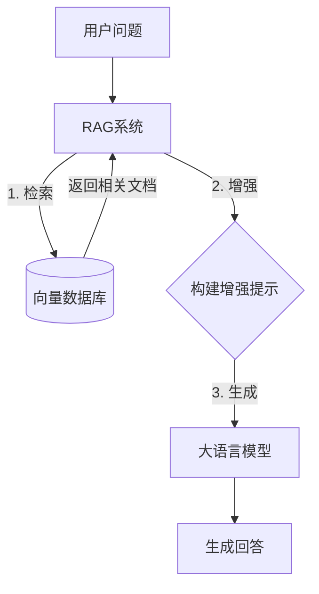
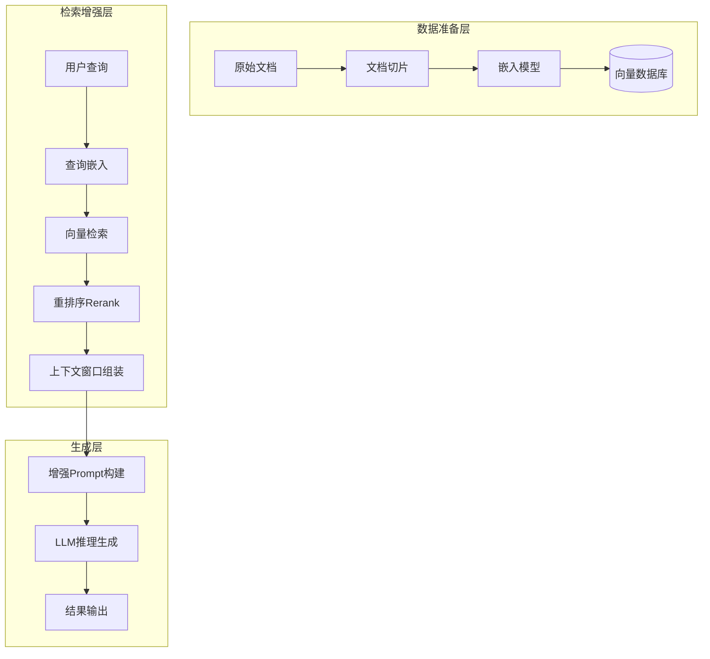
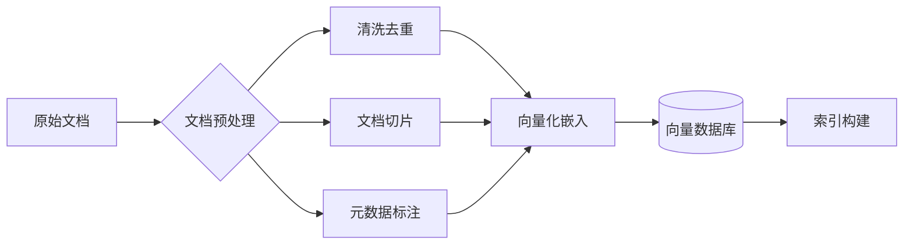
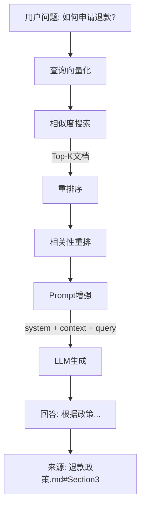
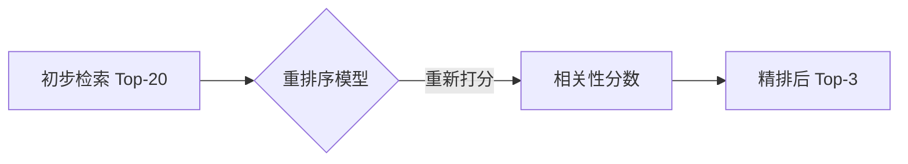
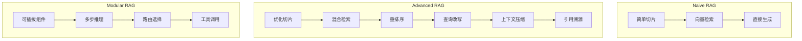
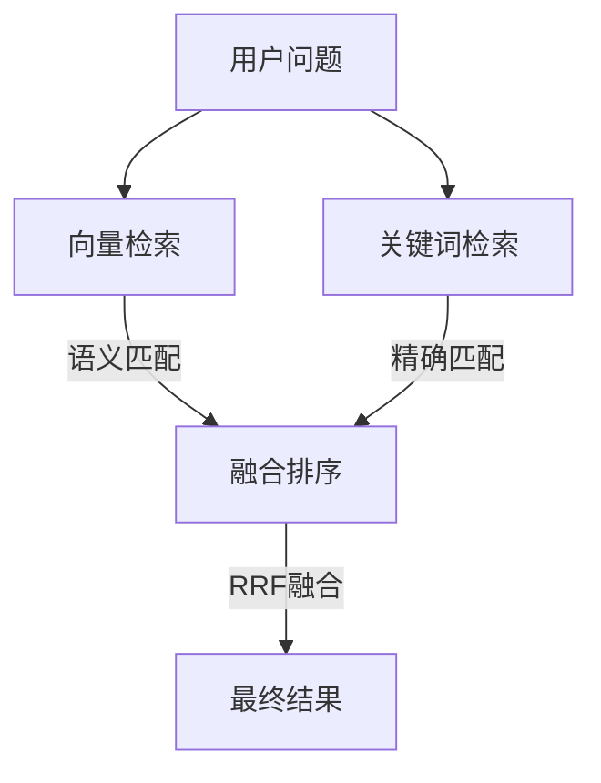
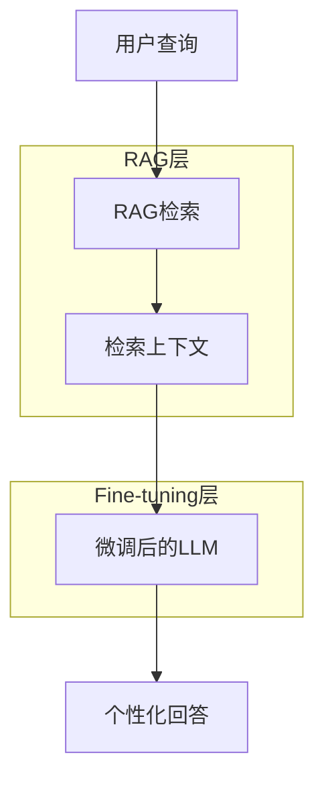
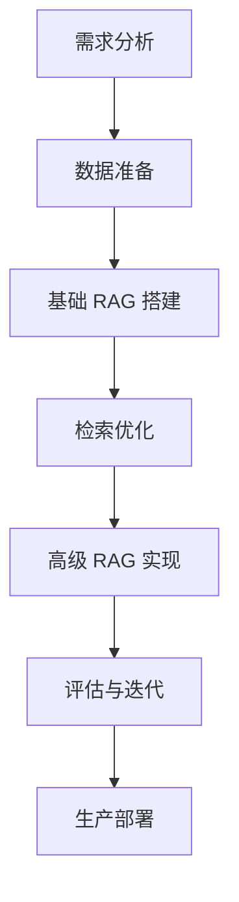

# RAG 检索增强生成技术深度解析

## 一、RAG 的定义与核心概念

### 1.1 什么是 RAG

RAG（Retrieval-Augmented Generation，检索增强生成）是一种将**信息检索系统**与**大语言模型生成能力**相结合的技术框架。它允许模型在生成回答前，先从外部知识库中检索相关信息，从而克服传统 LLM 的知识滞后和幻觉问题。



### 1.2 RAG 的核心优势

| 维度 | 传统 LLM | RAG 增强 |
| :--- | :--- | :--- |
| **知识时效性** | 训练数据截止日期 | 实时更新知识库 |
| **事实准确性** | 可能产生幻觉 | 基于真实文档 |
| **可解释性** | 黑箱输出 | 可溯源至源文档 |
| **知识更新成本** | 需要重新训练 | 仅需更新向量库 |
| **领域适应性** | 通用知识 | 专业领域定制 |

### 1.3 RAG 的发展历程

- **2020年**：Meta 提出 RAG 论文，奠定理论基础
- **2023年**：LangChain、LlamaIndex 等框架流行，RAG 成为 LLM 应用标配
- **2024年**：从简单 RAG 演进到高级 RAG（Advanced RAG）和模块化 RAG（Modular RAG）

---

## 二、RAG 的核心架构与工作流程

### 2.1 RAG 系统完整架构



### 2.2 RAG 工作流程详解

#### 步骤一：数据索引阶段（离线）



**关键环节**：
- **文档切片（Chunking）**：将长文档切分为适合嵌入的小段（通常 500-1000 字符）
- **向量化（Embedding）**：使用嵌入模型将文本转换为高维向量
- **索引构建**：建立向量索引以支持快速近似最近邻搜索（ANN）

#### 步骤二：在线问答阶段



---

## 三、RAG 的关键技术组件

### 3.1 嵌入模型（Embedding Models）

嵌入模型负责将文本转换为向量表示，是 RAG 的"眼睛"。

#### 主流嵌入模型对比

| 模型 | 提供商 | 维度 | 适用场景 |
| :--- | :--- | :--- | :--- |
| **text-embedding-3-small** | OpenAI | 1536 | 通用场景，成本优化 |
| **text-embedding-3-large** | OpenAI | 3072 | 高质量要求，语义丰富 |
| **bge-large-zh** | BAAI | 1024 | 中文场景优化 |
| **m3e-base** | 海上智能 | 768 | 中文短文本 |
| **e5-large** | Google | 1024 | 多语种通用 |

#### 嵌入模型选择要点

```python
# 代码示例：嵌入模型调用
from sentence_transformers import SentenceTransformer

# 加载中文优化模型
model = SentenceTransformer('BAAI/bge-large-zh-v1.5')

# 文档向量化
documents = [
    "RAG 是检索增强生成技术",
    "向量数据库存储嵌入向量",
    "余弦相似度衡量语义相关性"
]

embeddings = model.encode(documents, normalize_embeddings=True)
# 输出: [3, 1024] 维度矩阵
```

### 3.2 向量数据库

向量数据库是 RAG 的"记忆库"，高效存储和检索嵌入向量。

#### 主流向量数据库对比

| 数据库 | 类型 | 特点 | 适用场景 |
| :--- | :--- | :--- | :--- |
| **Pinecone** | 全托管云服务 | 无需运维，扩展性强 | 企业级生产环境 |
| **Milvus** | 开源分布式 | 高性能，千亿级向量 | 大规模数据场景 |
| **Chroma** | 轻量级嵌入式 | 简单易用，原型开发 | 快速验证和本地开发 |
| **FAISS** | Meta AI 库 | 高性能搜索 | 研究和高性能需求 |
| **Elasticsearch** | 混合检索 | 关键词+向量混合搜索 | 需要关键词检索的场景 |

#### 向量检索核心算法

- **暴力搜索（Brute-Force）**：计算所有向量间的距离，适用于小规模数据
- **近似最近邻（ANN）**：
  - **HNSW**：层次化导航小世界图，高召回率
  - **IVF**：倒排索引，高吞吐量
  - **PQ**：乘积量化，高压缩率

```python
# 代码示例：使用 FAISS 构建向量索引
import faiss
import numpy as np

# 创建 IVF 索引
dimension = 1024
nlist = 100  # 聚类中心数量

quantizer = faiss.IndexFlatL2(dimension)
index = faiss.IndexIVFFlat(quantizer, dimension, nlist, faiss.METRIC_L2)

# 训练和添加向量
index.train(embeddings.astype('float32'))
index.add(embeddings.astype('float32'))

# 查询
query_vector = model.encode(["如何申请退款"])
D, I = index.search(query_vector.astype('float32'), k=5)
# D: 距离数组, I: 索引数组
```

### 3.3 文档切片策略

文档切片质量直接影响 RAG 的检索效果。

#### 切片方法对比

| 方法 | 说明 | 优点 | 缺点 |
| :--- | :--- | :--- | :--- |
| **固定长度切片** | 按字符数均匀分割 | 简单高效 | 可能切断语义 |
| **句子级切片** | 按句子边界分割 | 语义完整 | 长度不均匀 |
| **段落级切片** | 按段落结构分割 | 保持逻辑完整 | 可能过长或过短 |
| **语义切片** | 基于语义边界分割 | 最符合语义 | 计算复杂度高 |
| **递归切片** | 按字符→句子→段落递归 | 灵活适应 | 参数调优复杂 |

#### 最佳实践：递归切片

```python
# 代码示例：递归字符切片
from langchain.text_splitter import RecursiveCharacterTextSplitter

text_splitter = RecursiveCharacterTextSplitter(
    chunk_size=500,          # 目标块大小
    chunk_overlap=100,        # 重叠部分（保持上下文）
    length_function=len,
    separators=["\n\n", "\n", "。", "！", "？", "；", "，", ""]
)

chunks = text_splitter.split_documents(documents)
# 优先按段落分割，然后按句子，最后按字符
```

### 3.4 重排序模型（Reranker）

重排序模型对初步检索结果进行精排，提升相关性。



#### 主流重排序模型
- **bge-reranker-large**：BAAI 出品，中文优化
- **ms-marco-MiniLM-L-6-v2**：Microsoft 出品，英文优化
- **gpt-rerank**：LLM 作为重排序器，效果最佳但成本高

---

## 四、高级 RAG（Advanced RAG）技术

### 4.1 从基础 RAG 到高级 RAG 的演进



### 4.2 查询改写（Query Rewriting）

对模糊的用户问题进行改写，提升检索准确率。

```python
# 代码示例：查询改写
from langchain.chains.query_constructor.base import get_query_constructor_prompt

# 原始查询："怎么退款"
# 改写为：
rewritten_query = """
如何申请退款？
退款流程是什么？
退款政策有哪些？
退款条件是什么？
"""
```

#### 改写策略
- **子问题分解**：将复合问题拆解为多个子问题
- **假设性文档**：基于问题生成假设性答案作为检索线索
- **HyDE（假设性文档嵌入）**：用生成的假设文档进行向量检索

### 4.3 混合检索（Hybrid Search）

结合向量检索（语义）和关键词检索（精确）的优势。



#### Reciprocal Rank Fusion (RRF) 算法

```python
# 代码示例：RRF 融合
def rrf_fusion(rank_lists, k=60):
    """
    倒数排名融合
    rank_lists: 多个检索结果的排名列表
    k: 平滑因子
    """
    scores = {}
    for rank_list in rank_lists:
        for rank, doc_id in enumerate(rank_list, 1):
            scores[doc_id] = scores.get(doc_id, 0) + 1.0 / (k + rank)
    return sorted(scores.items(), key=lambda x: x[1], reverse=True)
```

### 4.4 上下文压缩与筛选

从检索到的文档中提取最相关的片段，减少上下文长度。

```python
# 代码示例：上下文压缩
from langchain.retrievers.contextual_compression import ContextualCompressionRetriever
from langchain.retrievers.document_compressors import LLMChainExtractor

# 基础检索器
base_retriever = vector_store.as_retriever(search_kwargs={"k": 10})

# 压缩器：使用 LLM 提取相关内容
compressor = LLMChainExtractor.from_llm(llm)

# 压缩检索器
compression_retriever = ContextualCompressionRetriever(
    base_compressor=compressor,
    base_retriever=base_retriever
)

# 检索结果更精炼
compressed_docs = compression_retriever.get_relevant_documents(query)
```

---

## 五、RAG 与其他技术的对比

### 5.1 RAG vs Fine-tuning（微调）

| 维度 | RAG | Fine-tuning |
| :--- | :--- | :--- |
| **知识更新** | 实时更新，成本低 | 需要重新训练，成本高 |
| **可解释性** | 可溯源至文档 | 黑箱，不易解释 |
| **适用场景** | 知识密集型问答 | 风格转换、特定任务 |
| **部署成本** | 中等（需向量库） | 高（需GPU资源） |
| **领域适应性** | 强，支持多领域 | 定制化强，泛化弱 |
| **技术复杂度** | 中等 | 较高 |

#### 何时选择 RAG
- 需要实时或频繁更新的知识
- 需要引用和溯源的场景
- 预算有限的项目
- 通用知识问答

#### 何时选择 Fine-tuning
- 特定写作风格或格式
- 特定语言或方言
- 结构化输出需求
- 低延迟、高吞吐要求

### 5.2 RAG vs 长上下文窗口

| 维度 | RAG | Long Context |
| :--- | :--- | :--- |
| **文档规模** | 支持海量文档 | 受限于上下文窗口（128K-1M） |
| **知识更新** | 动态更新 | 需要重新注入 |
| **检索效率** | 高效向量检索 | 全量注入 |
| **成本** | 检索成本低 | 长上下文调用成本高 |
| **准确性** | 基于精确检索 | 可能受长文本干扰 |

### 5.3 最佳实践：RAG + Fine-tuning 组合



**组合优势**：
- RAG 提供实时知识支撑
- Fine-tuning 提供个性化输出风格
- 兼顾准确性和用户体验

---

## 六、RAG 的应用场景

### 6.1 企业知识库问答

```markdown
**场景**：员工查询公司政策、产品文档、技术规范

**技术方案**：
1. 数据源：Confluence、SharePoint、内部Wiki
2. 切片策略：按文档结构和语义切片
3. 嵌入模型：bge-large-zh（中文优化）
4. 向量数据库：Milvus（大规模）或 Chroma（小规模）
5. 前端：企业微信/钉钉机器人集成
```

### 6.2 智能客服系统

```markdown
**场景**：电商、金融行业的客户咨询自动应答

**技术方案**：
1. 数据源：产品手册、FAQ、政策文档、历史工单
2. 特色功能：
   - 意图识别和多轮对话
   - 情感分析和转人工机制
   - 会话上下文管理
3. 关键指标：
   - 首次应答准确率 ≥ 90%
   - 人工转接率 ≤ 15%
   - 平均响应时间 ≤ 2秒
```

### 6.3 法律文档分析

```markdown
**场景**：合同审查、法律条文查询、案例检索

**技术方案**：
1. 数据源：法律法规、合同模板、判例库
2. 特殊要求：
   - 精准的法律术语匹配
   - 引用溯源和版本管理
   - 专业的法律推理
3. 嵌入模型：法律领域专用嵌入（如 LawBERT）
```

### 6.4 医疗知识查询

```markdown
**场景**：医生辅助诊疗、药物信息查询、医学文献检索

**技术方案**：
1. 数据源：医学教科书、临床指南、药品说明书
2. 合规要求：
   - 医疗专业术语准确
   - 必须标注信息来源
   - 免责声明和审核机制
3. 嵌入模型：医学领域专用嵌入（如 BioBERT）
```

---

## 七、RAG 实现代码示例

### 7.1 完整 RAG 系统实现

```python
# 代码示例：基于 LangChain 的完整 RAG 系统
from langchain_community.document_loaders import DirectoryLoader
from langchain.text_splitter import RecursiveCharacterTextSplitter
from langchain_community.embeddings import HuggingFaceEmbeddings
from langchain_community.vectorstores import Chroma
from langchain.chains import RetrievalQA
from langchain_community.llms import Ollama

class RAGSystem:
    def __init__(self, docs_path, persist_directory):
        """
        初始化 RAG 系统
        :param docs_path: 文档目录
        :param persist_directory: 向量库持久化路径
        """
        self.docs_path = docs_path
        self.persist_directory = persist_directory
        
        # 初始化嵌入模型
        self.embeddings = HuggingFaceEmbeddings(
            model_name="BAAI/bge-large-zh-v1.5",
            model_kwargs={'device': 'cuda'}  # 使用 GPU
        )
        
        # 初始化 LLM
        self.llm = Ollama(model="qwen2.5:7b")
        
        # 初始化向量数据库
        self.vectorstore = None
        self.qa_chain = None

    def load_and_process_documents(self):
        """加载和处理文档"""
        # 1. 加载文档
        loader = DirectoryLoader(
            self.docs_path,
            glob="**/*.{txt,md,pdf}",
            recursive=True
        )
        documents = loader.load()
        print(f"加载了 {len(documents)} 个文档")
        
        # 2. 文档切片
        text_splitter = RecursiveCharacterTextSplitter(
            chunk_size=500,
            chunk_overlap=100,
            separators=["\n\n", "\n", "。", "！", "？", "；", "，"]
        )
        chunks = text_splitter.split_documents(documents)
        print(f"切分为 {len(chunks)} 个文本块")
        
        # 3. 创建向量数据库
        self.vectorstore = Chroma.from_documents(
            documents=chunks,
            embedding=self.embeddings,
            persist_directory=self.persist_directory
        )
        self.vectorstore.persist()
        print("向量数据库创建完成")

    def build_qa_chain(self):
        """构建问答链"""
        if not self.vectorstore:
            raise ValueError("请先加载文档")
        
        # 创建检索器
        retriever = self.vectorstore.as_retriever(
            search_kwargs={"k": 5}  # 返回 Top-5 相关文档
        )
        
        # 创建问答链
        self.qa_chain = RetrievalQA.from_chain_type(
            llm=self.llm,
            chain_type="stuff",  # 将所有检索内容放入 prompt
            retriever=retriever,
            return_source_documents=True  # 返回源文档
        )
        
        print("问答链构建完成")

    def query(self, question):
        """查询"""
        if not self.qa_chain:
            raise ValueError("请先构建问答链")
        
        result = self.qa_chain.invoke({"query": question})
        
        return {
            "answer": result["result"],
            "sources": [
                {
                    "source": doc.metadata["source"],
                    "content": doc.page_content[:100]
                }
                for doc in result["source_documents"]
            ]
        }

# 使用示例
if __name__ == "__main__":
    # 初始化 RAG 系统
    rag = RAGSystem(
        docs_path="./knowledge_base",
        persist_directory="./chroma_db"
    )
    
    # 处理文档
    rag.load_and_process_documents()
    
    # 构建问答链
    rag.build_qa_chain()
    
    # 查询
    result = rag.query("如何申请退款？")
    print(f"回答: {result['answer']}")
    print(f"来源: {result['sources']}")
```

### 7.2 高级 RAG 实现（含重排序）

```python
# 代码示例：带重排序的高级 RAG
from langchain.retrievers import ContextualCompressionRetriever
from langchain.retrievers.document_compressors import EmbeddingsFilter

class AdvancedRAGSystem(RAGSystem):
    def __init__(self, *args, **kwargs):
        super().__init__(*args, **kwargs)
        self.compression_retriever = None

    def build_advanced_retriever(self):
        """构建高级检索器"""
        # 基础检索器
        base_retriever = self.vectorstore.as_retriever(
            search_kwargs={"k": 20}  # 初步检索更多候选
        )
        
        # 嵌入过滤器（基于相似度筛选）
        embeddings_filter = EmbeddingsFilter(
            embeddings=self.embeddings,
            similarity_threshold=0.75  # 相似度阈值
        )
        
        # 压缩检索器
        self.compression_retriever = ContextualCompressionRetriever(
            base_compressor=embeddings_filter,
            base_retriever=base_retriever
        )
        
        # 重新构建问答链（使用压缩检索器）
        self.qa_chain = RetrievalQA.from_chain_type(
            llm=self.llm,
            chain_type="map_reduce",  # 先总结再汇总
            retriever=self.compression_retriever,
            return_source_documents=True
        )

    def query_with_confidence(self, question, confidence_threshold=0.7):
        """带置信度的查询"""
        result = self.qa_chain.invoke({"query": question})
        
        # 计算平均相似度
        if result["source_documents"]:
            avg_similarity = sum(
                doc.metadata.get("similarity", 0) 
                for doc in result["source_documents"]
            ) / len(result["source_documents"])
            
            is_confident = avg_similarity >= confidence_threshold
        else:
            is_confident = False
            avg_similarity = 0
        
        return {
            "answer": result["result"],
            "confident": is_confident,
            "confidence_score": avg_similarity,
            "needs_human_review": not is_confident
        }
```

---

## 八、RAG 的挑战与解决方案

### 8.1 常见问题与对策

| 问题 | 表现 | 解决方案 |
| :--- | :--- | :--- |
| **检索不准确** | 召回无关文档 | 优化嵌入模型、增加重排序 |
| **上下文冲突** | 不同文档信息矛盾 | 实现冲突检测和优先级策略 |
| **回答不完整** | 遗漏关键信息 | 增大 Top-K、实现多轮检索 |
| **响应延迟** | 检索+生成耗时长 | 缓存、异步处理 |
| **知识过时** | 文档未及时更新 | 增量更新、定时同步 |

### 8.2 评估体系

#### 检索效果评估指标

```python
# 代码示例：RAG 评估
from langchain.evaluation import load_evaluator
from langchain.schema import Document

def evaluate_rag_system(rag_system, test_queries, ground_truths):
    """
    评估 RAG 系统
    :param test_queries: 测试问题列表
    :param ground_truths: 标准答案
    """
    evaluator = load_evaluator("ragas")
    
    results = []
    for query, ground_truth in zip(test_queries, ground_truths):
        # 获取 RAG 回答
        response = rag_system.query(query)
        
        # 评估
        eval_result = evaluator.evaluate_chain(
            chain=rag_system.qa_chain,
            question=query,
            answer=response["answer"],
            ground_truths=[ground_truth],
            contexts=[doc.page_content for doc in response["source_documents"]]
        )
        
        results.append({
            "query": query,
            "faithfulness": eval_result["scores"]["faithfulness"],      # 忠实度
            "relevancy": eval_result["scores"]["answer_relevancy"],    # 相关性
            "context_precision": eval_result["scores"]["context_precision"],  # 精度
            "context_recall": eval_result["scores"]["context_recall"]        # 召回率
        })
    
    # 计算平均指标
    avg_metrics = {
        "avg_faithfulness": sum(r["faithfulness"] for r in results) / len(results),
        "avg_relevancy": sum(r["relevancy"] for r in results) / len(results),
        "avg_precision": sum(r["context_precision"] for r in results) / len(results),
        "avg_recall": sum(r["context_recall"] for r in results) / len(results)
    }
    
    return avg_metrics
```

#### 核心评估指标
- **忠实度（Faithfulness）**：回答是否完全基于检索到的上下文
- **相关性（Relevancy）**：回答对问题的相关程度
- **上下文精度（Context Precision）**：检索到的文档中相关信息的比例
- **上下文召回（Context Recall）**：所需信息被检索到的比例

### 8.3 未来优化方向

| 方向 | 技术 | 预期效果 |
| :--- | :--- | :--- |
| **多模态 RAG** | 结合图像、表格、代码 | 支持更多类型的知识查询 |
| **Graph RAG** | 引入知识图谱 | 提升关系推理能力 |
| **Agent RAG** | Agent 驱动的动态检索 | 更灵活的查询处理 |
| **实时 RAG** | 流式处理和实时更新 | 支持实时数据场景 |

---

## 九、总结与最佳实践

### 9.1 RAG 实施路线图



### 9.2 关键成功要素

1. **高质量数据**：保证知识库的准确性、完整性和时效性
2. **合理的切片策略**：兼顾语义完整性和检索粒度
3. **优化的嵌入模型**：选择适合领域的嵌入模型
4. **有效的重排序**：提升检索结果的相关性
5. **完善的评估体系**：持续监控和改进

### 9.3 常见陷阱

- **过度追求完美检索**：平衡准确率和召回率
- **忽略查询改写**：直接用原问题检索效果差
- **上下文冗余**：过多无关信息干扰生成
- **缺乏溯源机制**：用户信任度降低

---

## 参考文献

1. **RAG: Retrieval-Augmented Generation for Knowledge-Intensive NLP Tasks** - Lewis et al., NeurIPS 2020
2. **LangChain: Building Applications with LLMs** - LangChain, 2024
3. **LlamaIndex: Data Framework for LLM Applications** - LlamaIndex, 2024
4. **Advanced RAG Techniques** - Liu et al., 2024
5. **RAGAS: Evaluation Framework for RAG** - RAGAS Team, 2024
