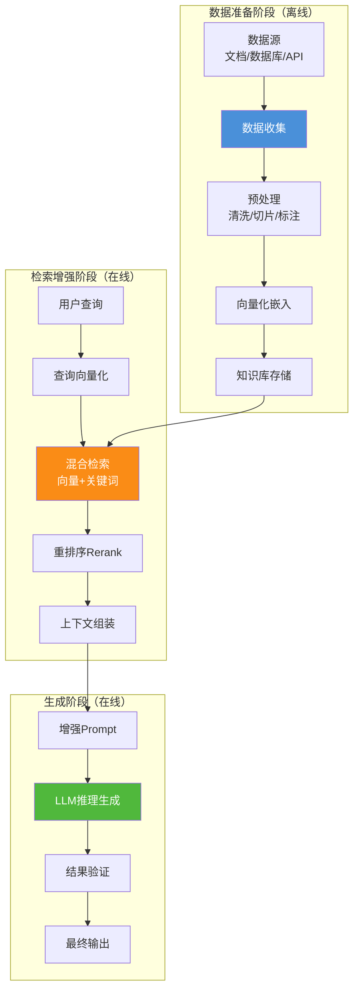
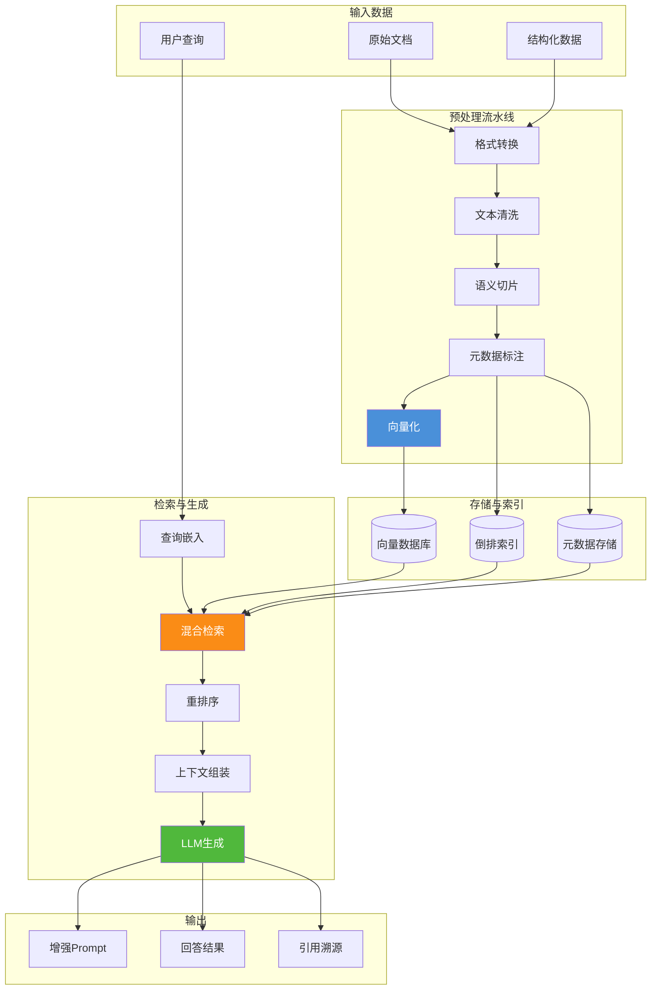
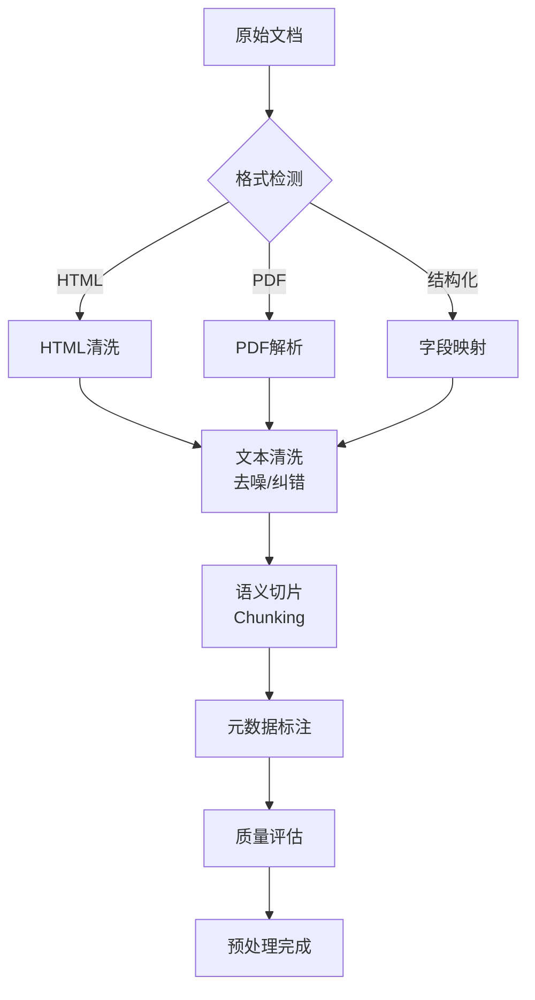
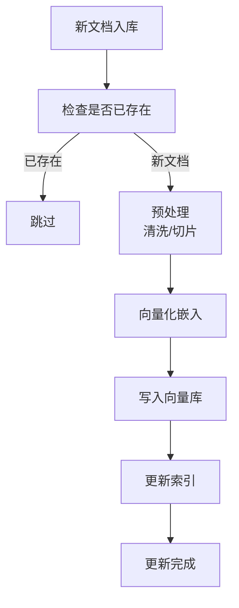
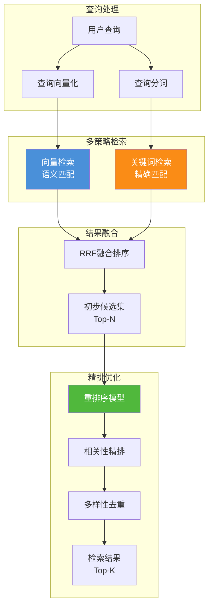

# RAG 检索增强生成：整体工作流程深度解析

> **文档说明**：本文档详细阐述检索增强生成（RAG）技术的完整工作流程，从数据收集、预处理、知识库构建到检索增强和内容生成，系统性分析各阶段的具体实现方式、关键组件、数据流转过程及技术选型，并提供伪代码和流程图辅助说明。

## 目录

- [一、引言](#一引言)
- [二、RAG 整体工作流程总览](#二rag-整体工作流程总览)
- [三、数据收集与预处理阶段](#三数据收集与预处理阶段)
- [四、知识库构建方法](#四知识库构建方法)
- [五、检索模块工作原理](#五检索模块工作原理)
- [六、生成模块工作原理](#六生成模块工作原理)
- [七、关键技术点与优化策略](#七关键技术点与优化策略)
- [八、完整伪代码实现](#八完整伪代码实现)
- [九、端到端案例演示](#九端到端案例演示)
- [十、总结与展望](#十总结与展望)

---

## 一、引言

### 1.1 为什么需要 RAG 工作流程详解

在之前的文档中，我们介绍了 RAG 的基本概念、核心组件和应用场景。然而，要真正将 RAG 技术落地到生产环境中，需要深入理解其完整工作流程中的每一个环节：

- **数据如何采集和清洗？** 原始数据格式多样、质量参差，需要系统化的预处理流水线
- **知识库如何构建？** 向量化、索引策略直接影响检索效率
- **检索如何实现？** 向量相似度计算、关键词匹配、重排序等技术细节
- **生成如何优化？** 上下文注入、Prompt 工程、结果验证

### 1.2 文档定位

本文档聚焦于 RAG 的**端到端工作流程实现**，与已有文档形成互补：

| 已有文档 | 侧重点 | 本文档 |
|---------|--------|--------|
| `1RAG检索增强生成详解.md` | RAG 概念、组件、架构 | RAG 工作流程的完整实现 |
| | 技术选型对比 | 各阶段的深入技术细节 |
| | 应用场景概述 | 数据流转与接口设计 |

---

## 二、RAG 整体工作流程总览

### 2.1 工作流程全景图



### 2.2 各阶段核心职责

| 阶段 | 核心职责 | 关键问题 | 类比 |
|------|---------|---------|------|
| **数据收集与预处理** | 从多源采集数据，清洗、切片、格式化 | 数据质量如何保证？切片粒度如何选择？ | 图书馆的书籍采购和编目 |
| **知识库构建** | 将文本转换为向量，建立可索引的存储 | 用什么嵌入模型？向量库如何选择？ | 图书馆的分类和上架 |
| **检索模块** | 根据查询检索最相关的文档片段 | 如何计算相似度？如何融合多种检索方式？ | 图书馆的检索系统 |
| **生成模块** | 利用检索结果引导 LLM 生成准确回答 | 如何注入上下文？如何避免幻觉？ | 图书馆的参考咨询服务 |

### 2.3 数据流转总览



### 2.4 工作流程分类

RAG 的工作流程可分为两大阶段：

| 类型 | 阶段 | 执行时机 | 核心操作 |
|------|------|---------|---------|
| **离线批处理** | 数据准备 | 知识库更新时 | 文档采集、切片、向量化、索引构建 |
| **在线实时处理** | 检索增强+生成 | 用户查询时 | 查询嵌入、检索、重排序、Prompt增强、LLM生成 |

---

## 三、数据收集与预处理阶段

### 3.1 阶段核心职责

数据收集与预处理是 RAG 系统的**基石**，直接决定了知识库的质量和检索效果：

> **"从多源异构数据中采集原始信息，经过清洗、切片、标注等处理，生成高质量的文本块，为知识库构建提供可靠输入。"**

### 3.2 数据源分类与接入

#### 3.2.1 常见数据源

| 数据源类型 | 示例 | 数据格式 | 接入方式 |
|-----------|------|---------|---------|
| **文档文件** | PDF、Word、Markdown、TXT | 非结构化文本 | 文件解析器（PyPDF、python-docx） |
| **数据库** | MySQL、PostgreSQL、MongoDB | 结构化数据 | SQL 查询/ORM 导出 |
| **API 接口** | 业务系统、外部服务 | JSON/XML | HTTP 请求抓取 |
| **实时流** | Kafka、消息队列 | 流式数据 | 流式消费处理 |
| **网页内容** | 企业门户、Wiki 系统 | HTML | 爬虫+HTML解析 |
| **代码仓库** | Git、GitHub | 代码文件 | Git API + 代码解析器 |

#### 3.2.2 数据采集实现

```python
class DataCollector:
    """多源数据采集器"""
    
    def __init__(self, config: CollectorConfig):
        self.sources = config.sources
        self.parsers = self._init_parsers()
    
    async def collect_all(self) -> List[RawDocument]:
        """从所有配置的数据源采集数据"""
        tasks = []
        for source in self.sources:
            if source.type == "file":
                tasks.append(self._collect_from_files(source))
            elif source.type == "database":
                tasks.append(self._collect_from_database(source))
            elif source.type == "api":
                tasks.append(self._collect_from_api(source))
        results = await asyncio.gather(*tasks)
        return [doc for sublist in results for doc in sublist]
```

### 3.3 数据预处理流水线

#### 3.3.1 预处理流程图



#### 3.3.2 文本清洗

```python
class TextCleaner:
    """文本清洗器"""
    
    def clean(self, raw_document: RawDocument) -> CleanText:
        """清洗原始文本"""
        text = raw_document.content
        # 去除HTML标签
        text = self._remove_html_tags(text)
        # 去除特殊字符
        text = self._remove_special_chars(text)
        # 统一空白符
        text = self._normalize_whitespace(text)
        # 检测语言
        language = self._detect_language(text)
        return CleanText(content=text, language=language)
    
    def _remove_special_chars(self, text: str) -> str:
        """移除特殊字符，保留中英文、数字、标点"""
        import re
        pattern = r'[^\u4e00-\u9fa5a-zA-Z0-9\s，。！？；：""''（）《》\-…·]'
        return re.sub(pattern, '', text)
```

#### 3.3.3 语义切片策略

切片是预处理中最关键的环节，直接影响检索粒度和效果。

**切片策略对比：**

| 策略 | 说明 | 适用场景 | 优点 | 缺点 |
|------|------|---------|------|------|
| **固定长度切片** | 按字符数均匀切分 | 简单文本 | 简单高效 | 切断语义 |
| **句子级切片** | 按句子边界切分 | 短文本 | 语义完整 | 长度不均 |
| **段落级切片** | 按段落结构切分 | 文章/文档 | 保持逻辑 | 粒度难控 |
| **递归切片** | 多层级递归切分 | 通用场景 | 灵活适应 | 参数调优 |
| **语义切片** | 基于语义边界切分 | 高质量要求 | 最符合语义 | 计算复杂 |

**递归切片实现（推荐）：**

```python
class SemanticChunker:
    """语义切片器 - 递归策略"""
    
    def __init__(self, chunk_size: int = 500, overlap: int = 100):
        self.chunk_size = chunk_size
        self.overlap = overlap
        self.separators = ["\n\n", "\n", "。", "！", "？", "；", "，", ""]
    
    def chunk(self, text: str) -> List[str]:
        """递归切片"""
        return self._recursive_split(text, 0)
    
    def _recursive_split(self, text: str, level: int) -> List[str]:
        """递归分割"""
        if len(text) <= self.chunk_size or level >= len(self.separators) - 1:
            return self._hard_split(text)
        
        separator = self.separators[level]
        if separator and separator in text:
            splits = text.split(separator)
            # 检查分割后是否都足够短
            if all(len(s) <= self.chunk_size for s in splits):
                return self._merge_with_overlap(splits, separator)
            # 继续递归分割较长的部分
            result = []
            for s in splits:
                if len(s) > self.chunk_size:
                    result.extend(self._recursive_split(s, level + 1))
                else:
                    result.append(s)
            return self._merge_with_overlap(result, separator)
        else:
            return self._recursive_split(text, level + 1)
    
    def _merge_with_overlap(self, splits: List[str], separator: str) -> List[str]:
        """带重叠的合并"""
        merged = []
        current = ""
        for split in splits:
            candidate = current + separator + split if current else split
            if len(candidate) <= self.chunk_size:
                current = candidate
            else:
                if current:
                    merged.append(current)
                if len(split) > self.chunk_size:
                    merged.extend(self._hard_split(split))
                    current = ""
                else:
                    current = split
        if current:
            merged.append(current)
        return merged
    
    def _hard_split(self, text: str) -> List[str]:
        """硬切分"""
        chunks = []
        step = self.chunk_size - self.overlap
        for i in range(0, len(text), step):
            chunk = text[i:i + self.chunk_size]
            if chunk:
                chunks.append(chunk)
        return chunks
```

### 3.4 数据质量保障

| 评估维度 | 检查项 | 合格标准 | 处理策略 |
|---------|--------|---------|---------|
| **完整性** | 文本是否完整 | 无截断、缺页 | 截断文本标记为低质量 |
| **准确性** | 内容是否正确 | 人工抽检/交叉验证 | 错误内容过滤 |
| **一致性** | 格式是否统一 | 统一编码和标点 | 格式标准化 |
| **时效性** | 内容是否过期 | 定期检查更新 | 过期内容标记/删除 |
| **相关性** | 内容是否相关 | 与业务场景匹配 | 无关内容过滤 |

---

## 四、知识库构建方法

### 4.1 阶段核心职责

知识库构建是 RAG 系统的**存储枢纽**，负责将预处理后的文本数据转换为可高效检索的格式：

> **"将预处理好的文本块通过嵌入模型转换为向量，结合原始文本和元数据，存入向量数据库和倒排索引，构建起可快速检索的知识存储体系。"**

### 4.2 向量化嵌入

#### 4.2.1 嵌入模型选择

| 模型 | 提供商 | 维度 | 特点 | 适用场景 |
|------|--------|------|------|---------|
| **text-embedding-3-large** | OpenAI | 3072 | 高语义精度 | 通用高质量需求 |
| **bge-large-zh-v1.5** | BAAI | 1024 | 中文优化 | 中文业务场景 |
| **m3e-large** | 海上智能 | 1024 | 中文短文本 | 中文短文本场景 |
| **e5-large-v2** | Google | 1024 | 多语种 | 多语言场景 |
| **gte-large** | 阿里 | 1024 | 中文优化 | 中文检索场景 |

**选择要点：**
- 语义匹配能力：在业务领域测试检索效果
- 维度与性能：高维度精度高但成本大
- 语言支持：选择针对目标语言优化的模型
- 成本考量：API 调用费用 vs 本地部署成本

#### 4.2.2 向量化实现

```python
class EmbeddingService:
    """向量化服务"""
    
    def __init__(self, model_name: str = "BAAI/bge-large-zh-v1.5"):
        self.model = SentenceTransformer(model_name)
        self.batch_size = 32
    
    async def embed_chunks(self, chunks: List[str]) -> List[np.ndarray]:
        """批量向量化文本块"""
        batches = [chunks[i:i + self.batch_size] 
                   for i in range(0, len(chunks), self.batch_size)]
        embeddings = []
        for batch in batches:
            batch_embeddings = self.model.encode(
                batch, 
                normalize_embeddings=True,
                show_progress_bar=True
            )
            embeddings.extend(batch_embeddings)
        return embeddings
    
    def embed_text(self, text: str) -> np.ndarray:
        """单文本向量化"""
        return self.model.encode(text, normalize_embeddings=True)
```

### 4.3 向量数据库存储

#### 4.3.1 向量数据库对比

| 数据库 | 类型 | 核心特性 | 适用场景 |
|--------|------|---------|---------|
| **Milvus** | 开源分布式 | 千亿级向量、高吞吐 | 大规模生产环境 |
| **Pinecone** | 全托管云 | 零运维、自动扩展 | 企业级 SaaS |
| **Weaviate** | 开源混合 | 向量+关键词混合 | 需要混合检索 |
| **Chroma** | 轻量级嵌入式 | 简单易用 | 原型/中小项目 |
| **FAISS** | Meta AI 库 | 高性能 CPU/GPU | 研究/高性能需求 |
| **Elasticsearch** | 搜索引擎 | 文本+向量检索 | 全文检索场景 |

#### 4.3.2 向量索引策略

| 索引算法 | 说明 | 优点 | 适用场景 |
|---------|------|------|---------|
| **HNSW** | 层次化导航小世界图 | 高召回率、稳定 | 高精度需求 |
| **IVF** | 倒排索引 | 高吞吐量 | 大规模数据 |
| **PQ** | 乘积量化 | 高压缩率 | 海量数据存储 |
| **Flat** | 暴力搜索 | 100% 召回率 | 小数据集（<10万） |

#### 4.3.3 向量存储实现

```python
class VectorStoreManager:
    """向量存储管理器"""
    
    def __init__(self, collection_name: str, dimension: int):
        self.client = chromadb.Client()
        self.collection = self.client.create_collection(
            name=collection_name,
            metadata={"hnsw:space": "cosine"}
        )
        self.dimension = dimension
    
    async def upsert(self, ids: List[str], embeddings: List[List[float]],
                      documents: List[str], metadatas: List[Dict]):
        """批量写入向量数据"""
        self.collection.upsert(
            ids=ids,
            embeddings=embeddings,
            documents=documents,
            metadatas=metadatas
        )
    
    async def search(self, query_embedding: List[float], top_k: int = 5,
                      filters: Dict = None) -> List[SearchResult]:
        """向量检索"""
        results = self.collection.query(
            query_embeddings=[query_embedding],
            n_results=top_k,
            where=filters
        )
        return [SearchResult(
            id=id, content=doc, metadata=meta, distance=dist
        ) for id, doc, meta, dist in zip(
            results['ids'][0], results['documents'][0],
            results['metadatas'][0], results['distances'][0]
        )]
```

### 4.4 知识库更新机制

#### 4.4.1 更新策略

| 更新类型 | 说明 | 触发条件 | 实现方式 |
|---------|------|---------|---------|
| **全量更新** | 重建整个知识库 | 定期/手动触发 | 重新处理所有文档 |
| **增量更新** | 添加新文档 | 新文档入库 | 只处理新增文档 |
| **实时更新** | 即时更新 | 事件触发 | 流式处理管道 |

#### 4.4.2 增量更新流程



---

## 五、检索模块工作原理

### 5.1 阶段核心职责

检索模块是 RAG 系统的**信息引擎**，负责从知识库中找到与用户查询最相关的内容：

> **"将用户查询转化为向量和关键词，通过多种检索策略从知识库中检索候选文档，经过重排序精排后返回最相关的 Top-K 结果。"**

### 5.2 检索模块架构



### 5.3 向量检索详解

#### 5.3.1 余弦相似度计算

向量检索的核心是计算查询向量与知识库中各文档向量的相似度：

**余弦相似度公式：**

$$
\text{sim}(\mathbf{q}, \mathbf{d}) = \frac{\mathbf{q} \cdot \mathbf{d}}{\|\mathbf{q}\| \cdot \|\mathbf{d}\|}
$$

**Python 实现：**

```python
import numpy as np

def cosine_similarity(query_vec: np.ndarray, doc_vec: np.ndarray) -> float:
    """计算余弦相似度"""
    dot_product = np.dot(query_vec, doc_vec)
    norm_product = np.linalg.norm(query_vec) * np.linalg.norm(doc_vec)
    if norm_product == 0:
        return 0.0
    return dot_product / norm_product

def batch_cosine_similarity(query_vec: np.ndarray, 
                              doc_matrix: np.ndarray) -> np.ndarray:
    """批量计算余弦相似度"""
    doc_norms = np.linalg.norm(doc_matrix, axis=1)
    doc_norms = np.where(doc_norms == 0, 1e-10, doc_norms)
    query_norm = np.linalg.norm(query_vec)
    similarities = doc_matrix.dot(query_vec) / (doc_norms * query_norm)
    return similarities
```

#### 5.3.2 常见相似度度量对比

| 度量方法 | 公式 | 特点 | 适用场景 |
|---------|------|------|---------|
| **余弦相似度** | $\frac{q \cdot d}{\|q\| \cdot \|d\|}$ | 衡量方向相似性 | 文本嵌入（推荐） |
| **欧氏距离** | $\|q - d\|_2$ | 衡量绝对距离 | 需绝对距离场景 |
| **内积** | $q \cdot d$ | 计算简单 | 点积搜索 |

### 5.4 关键词检索详解

#### 5.4.1 BM25 算法

BM25 是信息检索中最经典的关键词匹配算法：

$$
\text{score}(D, Q) = \sum_{i=1}^{n} \text{IDF}(q_i) \cdot \frac{f(q_i, D) \cdot (k_1 + 1)}{f(q_i, D) + k_1 \cdot (1 - b + b \cdot \frac{|D|}{\text{avgdl}})}
$$

**参数说明：**
- $f(q_i, D)$：词频
- $|D|$：文档长度
- $\text{avgdl}$：平均文档长度
- $k_1$：词频饱和参数（通常 1.2-2.0）
- $b$：长度归一化参数（通常 0.75）

**IDF 计算：**

$$
\text{IDF}(q_i) = \ln\left(1 + \frac{N - n(q_i) + 0.5}{n(q_i) + 0.5}\right)
$$

#### 5.4.2 BM25 实现

```python
class BM25Searcher:
    """BM25 关键词检索器"""
    
    def __init__(self, k1: float = 1.5, b: float = 0.75):
        self.k1 = k1
        self.b = b
        self.inverted_index = {}
        self.doc_lengths = {}
        self.avgdl = 0
        self.total_docs = 0
    
    def build_index(self, documents: List[IndexedDoc]):
        """构建倒排索引"""
        self.total_docs = len(documents)
        total_length = 0
        
        for doc in documents:
            self.doc_lengths[doc.id] = len(doc.tokens)
            total_length += len(doc.tokens)
            
            for token in set(doc.tokens):
                if token not in self.inverted_index:
                    self.inverted_index[token] = []
                tf = doc.tokens.count(token)
                self.inverted_index[token].append({
                    'doc_id': doc.id,
                    'term_freq': tf
                })
        
        self.avgdl = total_length / self.total_docs if self.total_docs > 0 else 1
    
    def search(self, query_tokens: List[str], top_k: int) -> List[ScoredDoc]:
        """BM25 检索"""
        scores = {}
        
        for token in query_tokens:
            if token in self.inverted_index:
                df = len(self.inverted_index[token])
                idf = np.log(1 + (self.total_docs - df + 0.5) / (df + 0.5))
                
                for posting in self.inverted_index[token]:
                    doc_id = posting['doc_id']
                    tf = posting['term_freq']
                    doc_length = self.doc_lengths.get(doc_id, self.avgdl)
                    
                    numerator = tf * (self.k1 + 1)
                    denominator = tf + self.k1 * (1 - self.b + self.b * doc_length / self.avgdl)
                    score = idf * numerator / denominator
                    
                    scores[doc_id] = scores.get(doc_id, 0.0) + score
        
        sorted_docs = sorted(scores.items(), key=lambda x: x[1], reverse=True)
        return [ScoredDoc(doc_id=id, score=score) for id, score in sorted_docs[:top_k]]
```

### 5.5 混合检索策略

#### 5.5.1 RRF 融合算法

RRF（Reciprocal Rank Fusion）是融合多种检索结果的经典算法：

$$
\text{RRF\_score}(d) = \sum_{r \in R} \frac{1}{k + \text{rank}_r(d)}
$$

其中 $k$ 是平滑因子（通常为 60）。

```python
class RRFFusion:
    """倒数排名融合"""
    
    def __init__(self, k: int = 60):
        self.k = k
    
    def fuse(self, rank_lists: List[List[str]]) -> List[FusedResult]:
        """融合多个排名列表"""
        scores = {}
        for rank_list in rank_lists:
            for rank, doc_id in enumerate(rank_list, start=1):
                scores[doc_id] = scores.get(doc_id, 0.0) + 1.0 / (self.k + rank)
        fused = sorted(scores.items(), key=lambda x: x[1], reverse=True)
        return [FusedResult(doc_id=id, fused_score=score) for id, score in fused]
```

#### 5.5.2 混合检索实现

```python
class HybridRetriever:
    """混合检索器"""
    
    def __init__(self, vector_retriever, keyword_retriever, 
                 fusion: RRFFusion):
        self.vector_retriever = vector_retriever
        self.keyword_retriever = keyword_retriever
        self.fusion = fusion
    
    async def retrieve(self, query: str, top_k: int = 5) -> List[RerankedDoc]:
        """混合检索"""
        # Step 1: 向量检索
        vector_results = await self.vector_retriever.search(query, top_k=50)
        vector_ranks = [r.id for r in vector_results]
        
        # Step 2: 关键词检索
        keyword_results = self.keyword_retriever.search(query, top_k=50)
        keyword_ranks = [r.doc_id for r in keyword_results]
        
        # Step 3: RRF 融合
        fused_results = self.fusion.fuse([vector_ranks, keyword_ranks])
        
        # Step 4: 映射回完整结果
        result_map = {r.id: r for r in vector_results}
        result_map.update({r.doc_id: r for r in keyword_results})
        
        final_results = []
        for fused in fused_results[:top_k]:
            doc = result_map.get(fused.doc_id)
            if doc:
                final_results.append(RerankedDoc(
                    id=doc.id,
                    content=doc.content,
                    metadata=doc.metadata,
                    score=fused.fused_score
                ))
        
        return final_results
```

### 5.6 重排序（Rerank）

#### 5.6.1 重排序模型

```python
class Reranker:
    """重排序器"""
    
    def __init__(self, model_name: str = "bge-reranker-large"):
        self.model = SentenceTransformer(model_name)
    
    async def rerank(self, query: str, documents: List[RerankedDoc],
                      top_k: int = 5) -> List[RerankedDoc]:
        """重排序"""
        # 构建查询-文档对
        pairs = [(query, doc.content) for doc in documents]
        
        # 批量计算相关性分数
        scores = self.model.predict(pairs, batch_size=32)
        
        # 排序并取 Top-K
        ranked = sorted(
            zip(documents, scores),
            key=lambda x: x[1],
            reverse=True
        )[:top_k]
        
        return [RerankedDoc(
            id=doc.id, content=doc.content,
            metadata=doc.metadata,
            score=float(score)
        ) for doc, score in ranked]
```

#### 5.6.2 多样性去重

```python
class DiversitySelector:
    """多样性选择器"""
    
    def select(self, documents: List[RerankedDoc], 
                target_count: int) -> List[RerankedDoc]:
        """选择多样化的结果"""
        if len(documents) <= target_count:
            return documents
        
        selected = [documents[0]]
        remaining = documents[1:]
        
        while len(selected) < target_count and remaining:
            best_idx = 0
            best_diversity_score = -float('inf')
            
            for i, doc in enumerate(remaining):
                max_sim = max(
                    self._compute_similarity(doc, sel) 
                    for sel in selected
                )
                # 多样性分数 = 分数 * (1 - 相似度)
                score = doc.score * (1 - max_sim)
                if score > best_diversity_score:
                    best_diversity_score = score
                    best_idx = i
            
            selected.append(remaining.pop(best_idx))
        
        return selected
    
    def _compute_similarity(self, doc1, doc2) -> float:
        """计算文本相似度"""
        # 使用简单的词重叠度
        words1 = set(doc1.content.split())
        words2 = set(doc2.content.split())
        if not words1 or not words2:
            return 0.5
        overlap = len(words1 & words2)
        total = len(words1 | words2)
        return overlap / total if total > 0 else 0.5
```