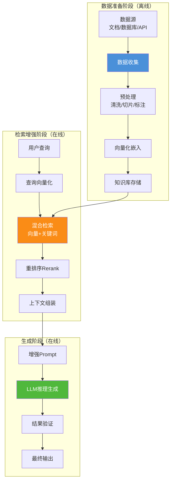
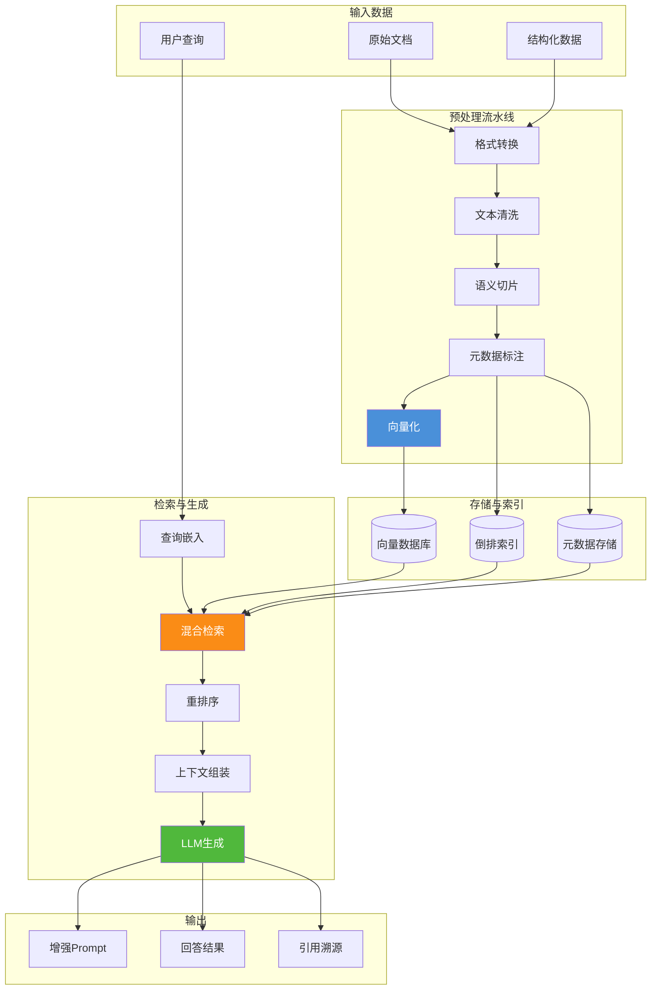
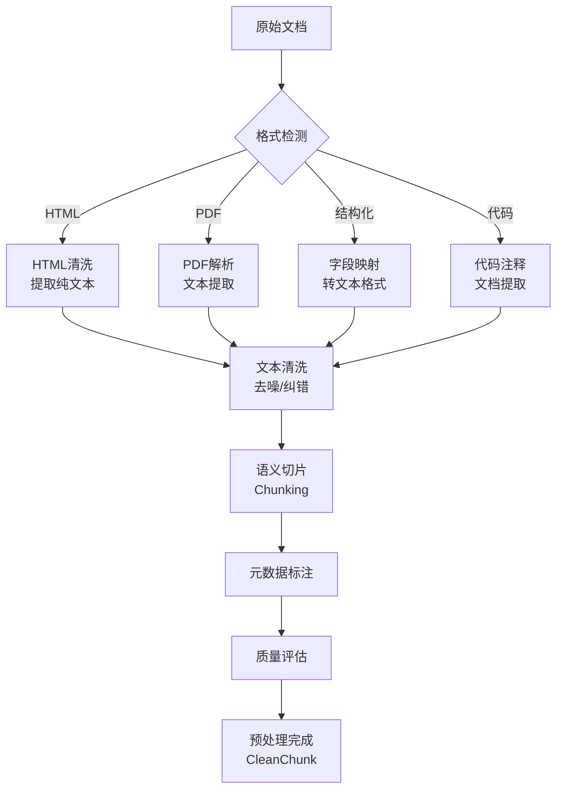
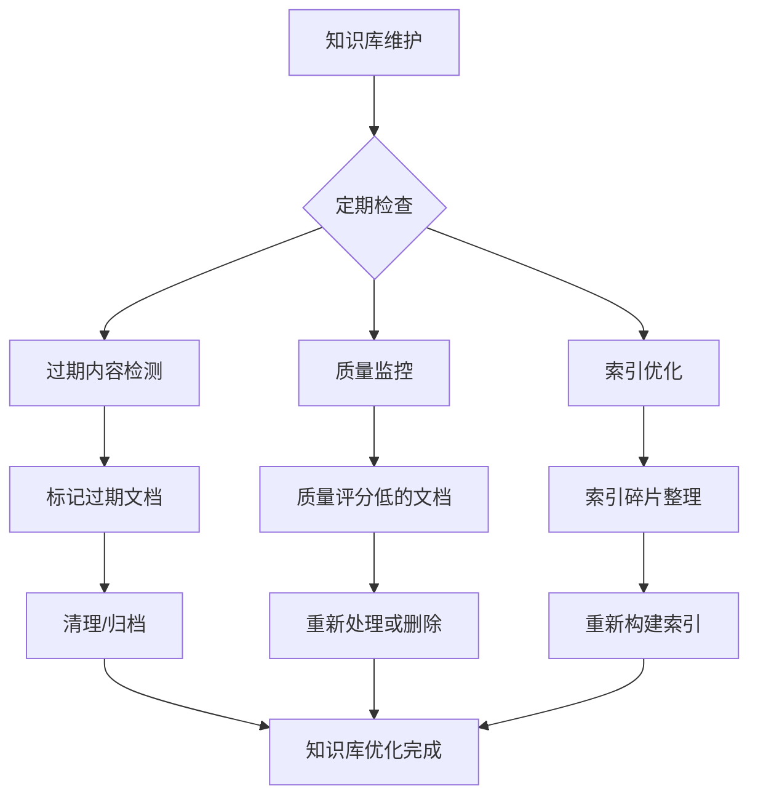
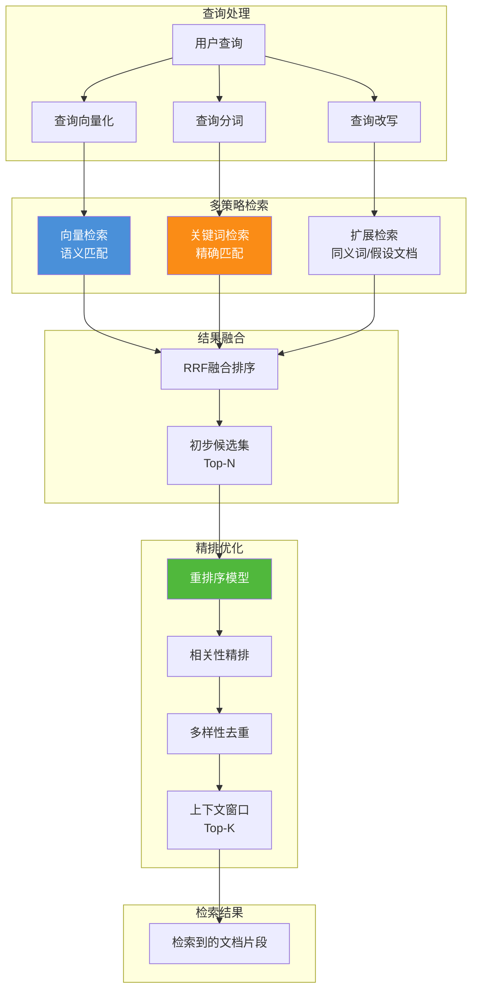

# RAG 检索增强生成：整体工作流程深度解析

> **文档说明**：本文档详细阐述检索增强生成（RAG）技术的完整工作流程，从数据收集、预处理、知识库构建到检索增强和内容生成，系统性分析各阶段的具体实现方式、关键组件、数据流转过程及技术选型，并提供伪代码和流程图辅助说明。

## 目录

- [一、引言](#一引言)
- [二、RAG 整体工作流程总览](#二rag-整体工作流程总览)
- [三、数据收集与预处理阶段](#三数据收集与预处理阶段)
- [四、知识库构建方法](#四知识库构建方法)
- [五、检索模块工作原理](#五检索模块工作原理)
- [六、生成模块工作原理](#六生成模块工作原理)
- [七、关键技术点与优化策略](#七关键技术点与优化策略)
- [八、完整伪代码实现](#八完整伪代码实现)
- [九、端到端案例演示](#九端到端案例演示)
- [十、总结与展望](#十总结与展望)

---

## 一、引言

### 1.1 为什么需要 RAG 工作流程详解

在之前的文档中，我们介绍了 RAG 的基本概念、核心组件和应用场景。然而，要真正将 RAG 技术落地到生产环境中，需要深入理解其完整工作流程中的每一个环节：

- **数据如何采集和清洗？** 原始数据格式多样、质量参差，需要系统化的预处理流水线
- **知识库如何构建？** 向量化、索引策略直接影响检索效率
- **检索如何实现？** 向量相似度计算、关键词匹配、重排序等技术细节
- **生成如何优化？** 上下文注入、Prompt 工程、结果验证

### 1.2 文档定位

本文档聚焦于 RAG 的**端到端工作流程实现**，与已有文档形成互补：

| 已有文档 | 侧重点 | 本文档 |
|---------|--------|--------|
| `1RAG检索增强生成详解.md` | RAG 概念、组件、架构 | RAG 工作流程的完整实现 |
| | 技术选型对比 | 各阶段的深入技术细节 |
| | 应用场景概述 | 数据流转与接口设计 |

---

## 二、RAG 整体工作流程总览

### 2.1 工作流程全景图



### 2.2 各阶段核心职责

| 阶段 | 核心职责 | 关键问题 | 类比 |
|------|---------|---------|------|
| **数据收集与预处理** | 从多源采集数据，清洗、切片、格式化 | 数据质量如何保证？切片粒度如何选择？ | 图书馆的书籍采购和编目 |
| **知识库构建** | 将文本转换为向量，建立可索引的存储 | 用什么嵌入模型？向量库如何选择？ | 图书馆的分类和上架 |
| **检索模块** | 根据查询检索最相关的文档片段 | 如何计算相似度？如何融合多种检索方式？ | 图书馆的检索系统 |
| **生成模块** | 利用检索结果引导 LLM 生成准确回答 | 如何注入上下文？如何避免幻觉？ | 图书馆的参考咨询服务 |

### 2.3 数据流转总览



### 2.4 工作流程分类

RAG 的工作流程可分为两大阶段：

| 类型 | 阶段 | 执行时机 | 核心操作 |
|------|------|---------|---------|
| **离线批处理** | 数据准备 | 知识库更新时 | 文档采集、切片、向量化、索引构建 |
| **在线实时处理** | 检索增强+生成 | 用户查询时 | 查询嵌入、检索、重排序、Prompt增强、LLM生成 |

---

## 三、数据收集与预处理阶段

### 3.1 阶段核心职责

数据收集与预处理是 RAG 系统的**基石**，直接决定了知识库的质量和检索效果：

> **"从多源异构数据中采集原始信息，经过清洗、切片、标注等处理，生成高质量的文本块，为知识库构建提供可靠输入。"**

### 3.2 数据源分类与接入

#### 3.2.1 常见数据源

| 数据源类型 | 示例 | 数据格式 | 接入方式 |
|-----------|------|---------|---------|
| **文档文件** | PDF、Word、Markdown、TXT | 非结构化文本 | 文件解析器（PyPDF、python-docx） |
| **数据库** | MySQL、PostgreSQL、MongoDB | 结构化数据 | SQL 查询/ORM 导出 |
| **API 接口** | 业务系统、外部服务 | JSON/XML | HTTP 请求抓取 |
| **实时流** | Kafka、消息队列 | 流式数据 | 流式消费处理 |
| **网页内容** | 企业门户、Wiki 系统 | HTML | 爬虫+HTML解析 |
| **代码仓库** | Git、GitHub | 代码文件 | Git API + 代码解析器 |

#### 3.2.2 数据采集实现

```python
class DataCollector:
    """多源数据采集器"""
    
    def __init__(self, config: CollectorConfig):
        self.sources = config.sources
        self.parsers = self._init_parsers()
    
    async def collect_all(self) -> List[RawDocument]:
        """从所有配置的数据源采集数据"""
        tasks = []
        for source in self.sources:
            if source.type == "file":
                tasks.append(self._collect_from_files(source))
            elif source.type == "database":
                tasks.append(self._collect_from_database(source))
            elif source.type == "api":
                tasks.append(self._collect_from_api(source))
            elif source.type == "stream":
                tasks.append(self._collect_from_stream(source))
        
        results = await asyncio.gather(*tasks)
        return [doc for sublist in results for doc in sublist]
    
    async def _collect_from_files(self, source: DataSource) -> List[RawDocument]:
        """从文件系统采集"""
        documents = []
        for file_path in glob.glob(source.path, recursive=True):
            parser = self.parsers.get(self._get_extension(file_path))
            if parser:
                content = await parser.parse(file_path)
                documents.append(RawDocument(
                    id=generate_id(),
                    source=source.name,
                    content=content,
                    metadata={"file_path": file_path, "type": "file"},
                    collected_at=datetime.now()
                ))
        return documents
    
    async def _collect_from_database(self, source: DataSource) -> List[RawDocument]:
        """从数据库采集"""
        records = await self.db.query(source.query)
        documents = []
        for record in records:
            documents.append(RawDocument(
                id=generate_id(),
                source=source.name,
                content=self._record_to_text(record),
                metadata={"table": source.table, "record_id": record.id},
                collected_at=datetime.now()
            ))
        return documents
```

### 3.3 数据预处理流水线

#### 3.3.1 预处理流程图



#### 3.3.2 文本清洗

```python
class TextCleaner:
    """文本清洗器"""
    
    def clean(self, raw_document: RawDocument) -> CleanText:
        """清洗原始文本"""
        text = raw_document.content
        
        # Step 1: 去除HTML标签
        if self._is_html(text):
            text = self._remove_html_tags(text)
        
        # Step 2: 去除特殊字符
        text = self._remove_special_characters(text)
        
        # Step 3: 统一空白符
        text = self._normalize_whitespace(text)
        
        # Step 4: 去除页眉页脚
        text = self._remove_headers_footers(text)
        
        # Step 5: 语言检测
        language = self._detect_language(text)
        
        return CleanText(
            content=text,
            language=language,
            cleaning_stats=self._get_stats(raw_document.content, text)
        )
    
    def _remove_special_characters(self, text: str) -> str:
        """移除特殊字符"""
        # 保留：中文、英文、数字、标点、换行
        pattern = r'[^\u4e00-\u9fa5a-zA-Z0-9\s，。！？；：""''（）《》\-—…·]'
        return re.sub(pattern, '', text)
    
    def _normalize_whitespace(self, text: str) -> str:
        """统一空白符"""
        # 合并多余空行
        text = re.sub(r'\n{3,}', '\n\n', text)
        # 合并多余空格
        text = re.sub(r' {3,}', '  ', text)
        # 去除行尾空格
        text = '\n'.join(line.rstrip() for line in text.split('\n'))
        return text.strip()
```

#### 3.3.3 语义切片策略

切片是预处理中最关键的环节，直接影响检索粒度和效果。

**切片策略对比：**

| 策略 | 说明 | 适用场景 | 优点 | 缺点 |
|------|------|---------|------|------|
| **固定长度切片** | 按字符数均匀切分 | 简单文本 | 简单高效 | 切断语义 |
| **句子级切片** | 按句子边界切分 | 短文本 | 语义完整 | 长度不均 |
| **段落级切片** | 按段落结构切分 | 文章/文档 | 保持逻辑 | 粒度难控 |
| **递归切片** | 多层级递归切分 | 通用场景 | 灵活适应 | 参数调优 |
| **语义切片** | 基于语义边界切分 | 高质量要求 | 最符合语义 | 计算复杂 |

**递归切片实现（推荐）：**

```python
class SemanticChunker:
    """语义切片器"""
    
    def __init__(self, config: ChunkConfig):
        self.chunk_size = config.chunk_size  # 目标大小
        self.chunk_overlap = config.overlap  # 重叠大小
        self.separators = config.separators  # 分隔符优先级
    
    def chunk(self, clean_text: CleanText) -> List<TextChunk>:
        """将文本切片"""
        chunks = self._recursive_split(clean_text.content)
        return [TextChunk(
            id=generate_id(),
            content=chunk,
            metadata=clean_text.metadata,
            token_count=self._count_tokens(chunk),
            chunk_index=idx
        ) for idx, chunk in enumerate(chunks)]
    
    def _recursive_split(self, text: str) -> List[str]:
        """递归分割"""
        # 如果文本已经足够短，直接返回
        if len(text) <= self.chunk_size:
            return [text]
        
        # 尝试按分隔符分割
        for separator in self.separators:
            if separator in text:
                splits = text.split(separator)
                # 如果分割后都足够短，返回结果
                if all(len(split) <= self.chunk_size for split in splits):
                    return self._merge_with_overlap(splits, separator)
                # 否则继续递归分割较长的部分
                result = []
                for split in splits:
                    if len(split) > self.chunk_size:
                        result.extend(self._recursive_split(split))
                    else:
                        result.append(split)
                return self._merge_with_overlap(result, separator)
        
        # 没有合适的分隔符，按字符硬切
        return self._hard_split(text)
    
    def _merge_with_overlap(self, splits: List[str], separator: str) -> List[str]:
        """带重叠的合并"""
        merged = []
        current = ""
        for split in splits:
            candidate = current + separator + split if current else split
            if len(candidate) <= self.chunk_size:
                current = candidate
            else:
                if current:
                    merged.append(current)
                # 处理超长切片
                if len(split) > self.chunk_size:
                    merged.extend(self._hard_split(split))
                    current = ""
                else:
                    current = split
        if current:
            merged.append(current)
        return merged
    
    def _hard_split(self, text: str) -> List[str]:
        """硬切分（按字符数）"""
        chunks = []
        for i in range(0, len(text), self.chunk_size - self.chunk_overlap):
            chunk = text[i:i + self.chunk_size]
            if chunk:
                chunks.append(chunk)
        return chunks
```

#### 3.3.4 元数据标注

```python
class MetadataAnnotator:
    """元数据标注器"""
    
    def annotate(self, chunk: TextChunk, document: RawDocument) -> AnnotatedChunk:
        """标注元数据"""
        return AnnotatedChunk(
            id=chunk.id,
            content=chunk.content,
            metadata={
                # 基础元数据
                "source": document.source,
                "source_type": document.metadata.get("type", "unknown"),
                "created_at": document.collected_at.isoformat(),
                # 内容元数据
                "token_count": chunk.token_count,
                "char_count": len(chunk.content),
                "chunk_index": chunk.chunk_index,
                # 业务元数据
                "tags": self._extract_tags(chunk.content),
                "language": self._detect_language(chunk.content),
                "quality_score": self._assess_quality(chunk.content)
            }
        )
    
    def _extract_tags(self, content: str) -> List[str]:
        """提取关键词标签"""
        # 使用关键词提取算法
        keywords = self.keyword_extractor.extract(content, top_k=5)
        return [kw.text for kw in keywords]
    
    def _assess_quality(self, content: str) -> float:
        """评估文本质量"""
        score = 1.0
        # 检查内容长度
        if len(content) < 50:
            score *= 0.6
        elif len(content) < 100:
            score *= 0.8
        # 检查语言一致性
        if self._count_chinese(content) > 0 and self._count_english(content) > 0:
            score *= 0.9  # 混合语言适度降分
        return score
```

### 3.4 数据质量保障

#### 3.4.1 质量评估体系

| 评估维度 | 检查项 | 合格标准 | 处理策略 |
|---------|--------|---------|---------|
| **完整性** | 文本是否完整 | 无截断、缺页 | 截断文本标记为低质量 |
| **准确性** | 内容是否正确 | 人工抽检/交叉验证 | 错误内容过滤 |
| **一致性** | 格式是否统一 | 统一的编码和标点 | 格式标准化 |
| **时效性** | 内容是否过期 | 定期检查更新 | 过期内容标记/删除 |
| **相关性** | 内容是否相关 | 与业务场景匹配 | 无关内容过滤 |

#### 3.4.2 质量评分实现

```python
class QualityAssessor:
    """质量评估器"""
    
    def assess(self, chunk: AnnotatedChunk) -> QualityReport:
        """评估数据质量"""
        scores = {
            "completeness": self._check_completeness(chunk),
            "accuracy": self._check_accuracy(chunk),
            "consistency": self._check_consistency(chunk),
            "freshness": self._check_freshness(chunk),
            "relevance": self._check_relevance(chunk)
        }
        
        overall_score = sum(scores.values()) / len(scores)
        
        return QualityReport(
            chunk_id=chunk.id,
            scores=scores,
            overall_score=overall_score,
            passed=overall_score >= self.config.min_quality_score,
            issues=self._identify_issues(scores)
        )
```

---

## 四、知识库构建方法

### 4.1 阶段核心职责

知识库构建是 RAG 系统的**存储枢纽**，负责将预处理后的文本数据转换为可高效检索的格式：

> **"将预处理好的文本块通过嵌入模型转换为向量，结合原始文本和元数据，存入向量数据库和倒排索引，构建起可快速检索的知识存储体系。"**

### 4.2 向量化嵌入

#### 4.2.1 嵌入模型选择

嵌入模型的质量直接决定语义匹配的精度：

| 模型 | 提供商 | 维度 | 特点 | 适用场景 |
|------|--------|------|------|---------|
| **text-embedding-3-large** | OpenAI | 3072 | 高语义精度 | 通用高质量需求 |
| **bge-large-zh-v1.5** | BAAI | 1024 | 中文优化 | 中文业务场景 |
| **m3e-large** | 海上智能 | 1024 | 中文短文本 | 中文短文本场景 |
| **e5-large-v2** | Google | 1024 | 多语种 | 多语言场景 |
| **gte-large** | 阿里 | 1024 | 中文优化 | 中文检索场景 |

**选择要点：**
- **语义匹配能力**：在你的业务领域中测试模型的检索效果
- **维度与性能**：高维度精度高但存储和计算成本大
- **语言支持**：选择针对目标语言优化的模型
- **成本考量**：API 调用费用 vs 本地部署成本
- **更新频率**：模型是否持续更新和优化

#### 4.2.2 向量化实现

```python
class EmbeddingService:
    """向量化服务"""
    
    def __init__(self, model_config: EmbeddingConfig):
        self.model = self._load_model(model_config)
        self.batch_size = model_config.batch_size
        self.normalize = model_config.normalize
    
    async def embed_chunks(self, chunks: List[AnnotatedChunk]) -> List[EmbeddedChunk]:
        """批量向量化文本块"""
        # 分批处理
        batches = self._batch_chunks(chunks, self.batch_size)
        embedded_chunks = []
        
        for batch in batches:
            # 提取文本内容
            texts = [chunk.content for chunk in batch]
            
            # 批量嵌入
            embeddings = await self.model.embed(
                texts=texts,
                normalize_embeddings=self.normalize
            )
            
            # 构建嵌入结果
            for chunk, embedding in zip(batch, embeddings):
                embedded_chunks.append(EmbeddedChunk(
                    id=chunk.id,
                    content=chunk.content,
                    metadata=chunk.metadata,
                    embedding=embedding,  # numpy array
                    embedding_model=self.model.name,
                    embedded_at=datetime.now()
                ))
        
        return embedded_chunks
    
    def _batch_chunks(self, chunks: List, batch_size: int) -> List[List]:
        """分批"""
        return [chunks[i:i + batch_size] for i in range(0, len(chunks), batch_size)]
```

#### 4.2.3 嵌入数据结构

```json
{
  "embedded_chunk": {
    "id": "chunk_001",
    "content": "退款政策：用户在购买后7天内可申请无理由退款...",
    "metadata": {
      "source": "refund_policy.md",
      "source_type": "markdown",
      "token_count": 85,
      "tags": ["退款", "政策", "无理由"],
      "language": "zh-CN",
      "quality_score": 0.95
    },
    "embedding": [0.023, -0.156, 0.089, ...],
    "embedding_dim": 1024,
    "embedding_model": "bge-large-zh-v1.5",
    "embedded_at": "2026-08-07T10:30:00Z"
  }
}
```

### 4.3 向量数据库存储

#### 4.3.1 向量数据库对比

| 数据库 | 类型 | 核心特性 | 适用场景 |
|--------|------|---------|---------|
| **Milvus** | 开源分布式 | 千亿级向量、高吞吐量、多种索引 | 大规模生产环境 |
| **Pinecone** | 全托管云 | 零运维、自动扩展 | 企业级 SaaS |
| **Weaviate** | 开源混合 | 向量+关键词混合检索 | 需要混合检索 |
| **Chroma** | 轻量级嵌入式 | 简单易用、本地部署 | 原型/中小项目 |
| **FAISS** | Meta AI 库 | 高性能 CPU/GPU 搜索 | 研究/高性能需求 |
| **Elasticsearch** | 搜索引擎 | 成熟的文本+向量检索 | 全文检索场景 |

#### 4.3.2 向量索引策略

向量数据库的索引决定了检索效率和准确率的平衡：

| 索引算法 | 说明 | 优点 | 缺点 | 适用场景 |
|---------|------|------|------|---------|
| **HNSW** | 层次化导航小世界图 | 高召回率、稳定 | 内存占用大 | 高精度需求 |
| **IVF** | 倒排索引 | 高吞吐量 | 召回率依赖聚类 | 大规模数据 |
| **PQ** | 乘积量化 | 高压缩率、低内存 | 精度略有损失 | 海量数据存储 |
| **Flat** | 暴力搜索 | 100% 召回率 | 慢、高内存 | 小数据集（<10万） |

**索引选择建议：**
- 数据量 < 10万：使用 **Flat**（暴力搜索，100% 准确率）
- 数据量 10万-1000万：使用 **HNSW** 或 **IVF**
- 数据量 > 1000万：使用 **PQ** 或组合索引

#### 4.3.3 向量存储实现

```python
class VectorStoreManager:
    """向量存储管理器"""
    
    def __init__(self, store_config: StoreConfig):
        self.store = self._init_vector_store(store_config)
        self.index = self._init_index(store_config)
    
    async def upsert_chunks(self, embedded_chunks: List[EmbeddedChunk]):
        """批量写入向量数据"""
        # 准备数据
        ids = [chunk.id for chunk in embedded_chunks]
        embeddings = [chunk.embedding for chunk in embedded_chunks]
        documents = [chunk.content for chunk in embedded_chunks]
        metadatas = [chunk.metadata for chunk in embedded_chunks]
        
        # 写入向量数据库
        await self.store.upsert(
            ids=ids,
            embeddings=embeddings,
            documents=documents,
            metadatas=metadatas
        )
        
        # 构建/更新索引
        await self._update_index(embedded_chunks)
        
        return WriteResult(
            inserted=len(embedded_chunks),
            updated=0,
            timestamp=datetime.now()
        )
    
    async def search(self, query_embedding: List[float], top_k: int, 
                     filters: Dict = None) -> List[SearchResult]:
        """向量检索"""
        results = await self.store.query(
            query_embeddings=[query_embedding],
            n_results=top_k,
            where=filters  # 元数据过滤
        )
        
        return [SearchResult(
            id=id,
            content=doc,
            metadata=meta,
            distance=dist  # 距离/相似度
        ) for id, doc, meta, dist in zip(
            results['ids'][0],
            results['documents'][0],
            results['metadatas'][0],
            results['distances'][0]
        )]
```

### 4.4 倒排索引构建

#### 4.4.1 关键词索引

关键词索引支持高效的精确匹配和全文检索：

```python
class InvertedIndexBuilder:
    """倒排索引构建器"""
    
    def build(self, embedded_chunks: List[EmbeddedChunk]) -> InvertedIndex:
        """构建倒排索引"""
        index = InvertedIndex()
        
        for chunk in embedded_chunks:
            # 分词
            terms = self._tokenize(chunk.content, chunk.metadata.get("language", "zh"))
            
            # 为每个词建立倒排链
            for term in set(terms):  # 去重
                if term not in index.postings:
                    index.postings[term] = PostingList()
                
                # 记录词频和位置
                term_freq = terms.count(term)
                positions = [i for i, t in enumerate(terms) if t == term]
                
                index.postings[term].add(Posting(
                    doc_id=chunk.id,
                    frequency=term_freq,
                    positions=positions
                ))
        
        # 计算文档频率（用于 BM25）
        index.doc_frequency = {
            term: len(posting_list.postings)
            for term, posting_list in index.postings.items()
        }
        
        index.total_docs = len(embedded_chunks)
        
        return index
    
    def _tokenize(self, text: str, language: str) -> List[str]:
        """分词"""
        if language == "zh":
            # 中文分词（使用 jieba 或其他中文分词库）
            return self.chinese_tokenizer.cut(text)
        else:
            # 英文分词
            return self.english_tokenizer.tokenize(text.lower())
```

#### 4.4.2 元数据索引

元数据索引支持结构化的过滤查询：

```python
class MetadataIndex:
    """元数据索引"""
    
    def __init__(self):
        self.field_indices = {}  # 字段名 → 值 → 文档ID集合
    
    def index_chunk(self, chunk_id: str, metadata: Dict):
        """索引文档元数据"""
        for field_name, field_value in metadata.items():
            if field_name not in self.field_indices:
                self.field_indices[field_name] = {}
            
            # 将字段值转为可索引的键
            key = self._normalize_value(field_value)
            
            if key not in self.field_indices[field_name]:
                self.field_indices[field_name][key] = set()
            
            self.field_indices[field_name][key].add(chunk_id)
    
    def query(self, filters: Dict) -> Set[str]:
        """根据条件查询"""
        result_sets = None
        
        for field_name, expected_value in filters.items():
            if field_name in self.field_indices:
                key = self._normalize_value(expected_value)
                matching_docs = self.field_indices[field_name].get(key, set())
                
                if result_sets is None:
                    result_sets = matching_docs.copy()
                else:
                    result_sets &= matching_docs  # 交集
            
            if result_sets is not None and len(result_sets) == 0:
                break  # 提前终止
        
        return result_sets or set()
```

### 4.5 知识库更新机制

#### 4.5.1 更新策略

| 更新类型 | 说明 | 触发条件 | 实现方式 |
|---------|------|---------|---------|
| **全量更新** | 重建整个知识库 | 定期/手动触发 | 重新处理所有文档 |
| **增量更新** | 添加新文档 | 新文档入库 | 只处理新增文档 |
| **实时更新** | 即时更新 | 事件触发 | 流式处理管道 |
| **定时同步** | 定期检查 | 定时任务 | 轮询检查变化 |

#### 4.5.2 增量更新实现

```python
class IncrementalUpdater:
    """增量更新器"""
    
    async def update(self, new_documents: List[RawDocument]):
        """增量更新知识库"""
        # Step 1: 过滤已存在的文档
        existing_ids = await self.store.get_existing_ids()
        new_docs = [doc for doc in new_documents if doc.id not in existing_ids]
        
        if not new_docs:
            return UpdateResult(added=0, updated=0)
        
        # Step 2: 预处理新文档
        cleaned_chunks = await self.preprocessor.process(new_docs)
        
        # Step 3: 向量化
        embedded_chunks = await self.embedder.embed_chunks(cleaned_chunks)
        
        # Step 4: 写入向量数据库
        await self.vector_store.upsert_chunks(embedded_chunks)
        
        # Step 5: 更新倒排索引
        await self.inverted_index.update(embedded_chunks)
        
        # Step 6: 更新元数据索引
        await self.metadata_index.update(embedded_chunks)
        
        return UpdateResult(
            added=len(embedded_chunks),
            updated=0,
            timestamp=datetime.now()
        )
```

#### 4.5.3 知识库维护



---

## 五、检索模块工作原理

### 5.1 阶段核心职责

检索模块是 RAG 系统的**信息引擎**，负责从知识库中找到与用户查询最相关的内容：

> **"将用户查询转化为向量和关键词，通过多种检索策略从知识库中检索候选文档，经过重排序精排后返回最相关的 Top-K 结果。"**

### 5.2 检索模块架构



### 5.3 向量检索详解

#### 5.3.1 查询向量化

```python
class QueryEncoder:
    """查询编码器"""
    
    def __init__(self, embedding_service: EmbeddingService):
        self.embedder = embedding_service
    
    async def encode(self, query: str) -> QueryVector:
        """将用户查询编码为向量"""
        # Step 1: 查询预处理
        cleaned_query = self._preprocess_query(query)
        
        # Step 2: 查询向量化
        query_embedding = await self.embedder.embed_text(cleaned_query)
        
        # Step 3: 归一化
        if self.config.normalize:
            query_embedding = self._normalize(query_embedding)
        
        return QueryVector(
            original_query=query,
            processed_query=cleaned_query,
            embedding=query_embedding,
            model=self.embedder.model_name
        )
    
    def _preprocess_query(self, query: str) -> str:
        """查询预处理"""
        # 去除多余空白
        query = ' '.join(query.split())
        # 去除尾部标点
        query = query.rstrip('？?！!。.')
        # 统一大小写
        query = query.lower() if self.config.lowercase else query
        return query
```

#### 5.3.2 向量相似度计算

向量检索的核心是计算查询向量与知识库中各文档向量的相似度：

**余弦相似度（Cosine Similarity）：**

$$
\text{sim}(\mathbf{q}, \mathbf{d}) = \frac{\mathbf{q} \cdot \mathbf{d}}{\|\mathbf{q}\| \cdot \|\mathbf{d}\|}
$$

其中 $\mathbf{q}$ 是查询向量，$\mathbf{d}$ 是文档向量。

**Python 实现：**

```python
import numpy as np

def cosine_similarity(query_vec: np.ndarray, doc_vec: np.ndarray) -> float:
    """计算余弦相似度"""
    # 点积
    dot_product = np.dot(query_vec, doc_vec)
    # 范数乘积
    norm_product = np.linalg.norm(query_vec) * np.linalg.norm(doc_vec)
    # 避免除零
    if norm_product == 0:
        return 0.0
    # 余弦相似度
    return dot_product / norm_product

def batch_cosine_similarity(query_vec: np.ndarray, 
                              doc_matrix: np.ndarray) -> np.ndarray:
    """批量计算余弦相似度"""
    # 文档向量矩阵的范数
    doc_norms = np.linalg.norm(doc_matrix, axis=1)
    # 避免除零
    doc_norms = np.where(doc_norms == 0, 1e-10, doc_norms)
    # 查询向量范数
    query_norm = np.linalg.norm(query_vec)
    # 矩阵乘法批量计算
    similarities = doc_matrix.dot(query_vec) / (doc_norms * query_norm)
    return similarities
```

**常见相似度度量对比：**

| 度量方法 | 公式 | 特点 | 适用场景 |
|---------|------|------|---------|
| **余弦相似度** | $\frac{q \cdot d}{\|q\| \cdot \|d\|}$ | 衡量方向相似性，不受长度影响 | 文本嵌入（推荐） |
| **欧氏距离** | $\|q - d\|_2$ | 衡量绝对距离，受长度影响 | 需要绝对距离的场景 |
| **内积** | $q \cdot d$ | 计算简单，需要归一化 | 点积搜索（FastText） |
| **Jaccard 相似度** | $\frac{|q \cap d|}{|q \cup d|}$ | 集合相似度 | 关键词重叠度 |

#### 5.3.3 近似最近邻搜索（ANN）

大规模向量检索使用 ANN 算法加速搜索：

```python
class ANNIndex:
    """近似最近邻索引"""
    
    def __init__(self, dimension: int, index_type: str = "hnsw"):
        self.dimension = dimension
        self.index_type = index_type
        self.index = self._init_index()
    
    def _init_index(self):
        """初始化索引"""
        if self.index_type == "hnsw":
            # HNSW 索引
            return faiss.IndexHNSWFlat(self.dimension, 16)  # 16个连接
        elif self.index_type == "ivf":
            # IVF 索引
            nlist = 100  # 聚类中心数
            quantizer = faiss.IndexFlatL2(self.dimension)
            return faiss.IndexIVFFlat(quantizer, self.dimension, nlist)
        elif self.index_type == "pq":
            # PQ 索引
            return faiss.IndexPQ(self.dimension, 64, 8)  # 64个子空间，8位编码
    
    def build(self, vectors: np.ndarray):
        """构建索引"""
        vectors = vectors.astype('float32')
        if hasattr(self.index, 'train'):
            self.index.train(vectors)
        self.index.add(vectors)
    
    def search(self, query_vector: np.ndarray, top_k: int) -> SearchResult:
        """搜索最近邻"""
        query = query_vector.astype('float32').reshape(1, -1)
        distances, indices = self.index.search(query, top_k)
        
        return SearchResult(
            distances=distances[0],  # 距离数组
            indices=indices[0]       # 索引数组
        )
```

### 5.4 关键词检索详解

#### 5.4.1 BM25 算法

BM25 是信息检索中最经典的关键词匹配算法：

$$
\text{score}(D, Q) = \sum_{i=1}^{n} \text{IDF}(q_i) \cdot \frac{f(q_i, D) \cdot (k_1 + 1)}{f(q_i, D) + k_1 \cdot (1 - b + b \cdot \frac{|D|}{\text{avgdl}})}
$$

其中：
- $f(q_i, D)$：词项 $q_i$ 在文档 $D$ 中的词频
- $|D|$：文档 $D$ 的长度（词数）
- $\text{avgdl}$：所有文档的平均长度
- $k_1$：词频饱和参数（通常 1.2-2.0）
- $b$：文档长度归一化参数（通常 0.75）
- $\text{IDF}(q_i)$：逆文档频率

$$
\text{IDF}(q_i) = \ln\left(1 + \frac{N - n(q_i) + 0.5}{n(q_i) + 0.5}\right)
$$

其中 $N$ 是文档总数，$n(q_i)$ 是包含词项 $q_i$ 的文档数。

#### 5.4.2 BM25 实现

```python
class BM25Searcher:
    """BM25 关键词检索器"""
    
    def __init__(self, k1: float = 1.5, b: float = 0.75):
        self.k1 = k1
        self.b = b
        self.inverted_index = {}
        self.doc_lengths = {}
        self.avgdl = 0
        self.total_docs = 0
    
    def index(self, documents: List[IndexedDoc]):
        """构建索引"""
        self.total_docs = len(documents)
        total_length = 0
        
        for doc in documents:
            # 记录文档长度
            self.doc_lengths[doc.id] = len(doc.tokens)
            total_length += len(doc.tokens)
            
            # 构建倒排索引
            for token in set(doc.tokens):
                if token not in self.inverted_index:
                    self.inverted_index[token] = []
                
                # 记录词频和位置
                term_freq = doc.tokens.count(token)
                positions = [i for i, t in enumerate(doc.tokens) if t == token]
                self.inverted_index[token].append({
                    'doc_id': doc.id,
                    'term_freq': term_freq,
                    'positions': positions
                })
        
        # 计算平均文档长度
        self.avgdl = total_length / self.total_docs if self.total_docs > 0 else 1
    
    def search(self, query_tokens: List[str], top_k: int) -> List[ScoredDoc]:
        """BM25 检索"""
        scores = {}
        
        for token in query_tokens:
            if token in self.inverted_index:
                # 计算 IDF
                df = len(self.inverted_index[token])  # 包含该词的文档数
                idf = np.log(1 + (self.total_docs - df + 0.5) / (df + 0.5))
                
                # 对每个包含该词的文档计算分数
                for posting in self.inverted_index[token]:
                    doc_id = posting['doc_id']
                    tf = posting['term_freq']
                    doc_length = self.doc_lengths.get(doc_id, self.avgdl)
                    
                    # BM25 分数计算
                    numerator = tf * (self.k1 + 1)
                    denominator = tf + self.k1 * (1 - self.b + self.b * doc_length / self.avgdl)
                    score = idf * numerator / denominator
                    
                    if doc_id not in scores:
                        scores[doc_id] = 0.0
                    scores[doc_id] += score
        
        # 排序并返回 Top-K
        sorted_docs = sorted(scores.items(), key=lambda x: x[1], reverse=True)
        return [ScoredDoc(doc_id=doc_id, score=score) 
                for doc_id, score in sorted_docs[:top_k]]
```

#### 5.4.3 关键词匹配增强

```python
class KeywordEnhancer:
    """关键词增强器"""
    
    def enhance_query(self, query: str, language: str = "zh")