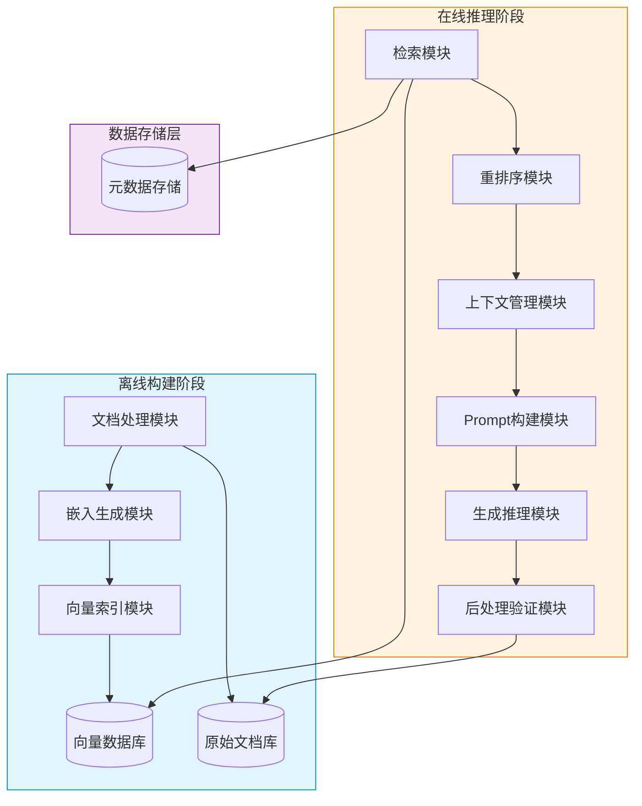
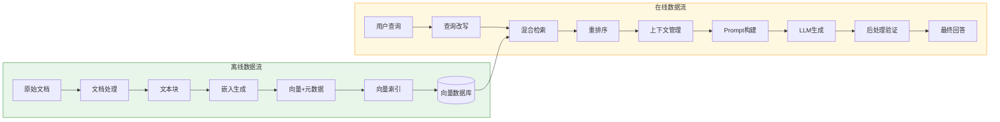
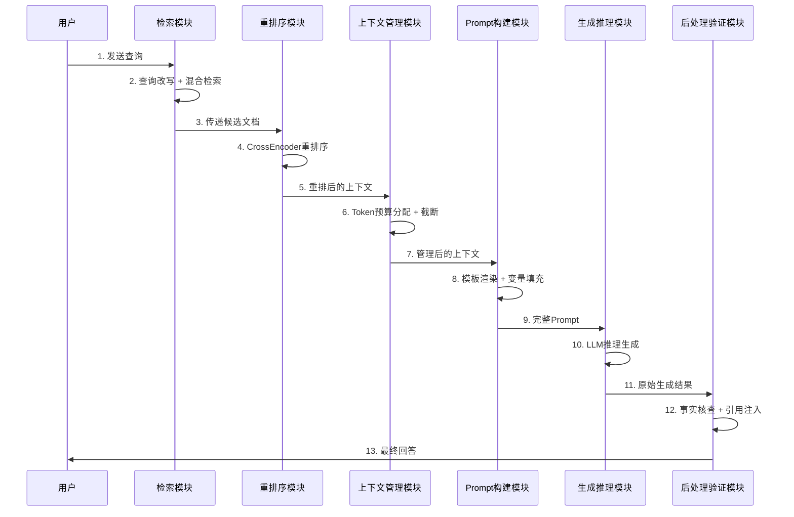
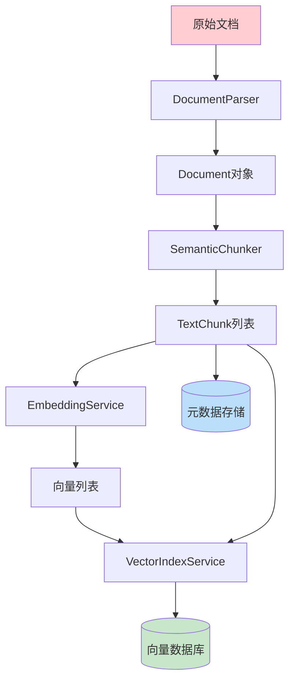
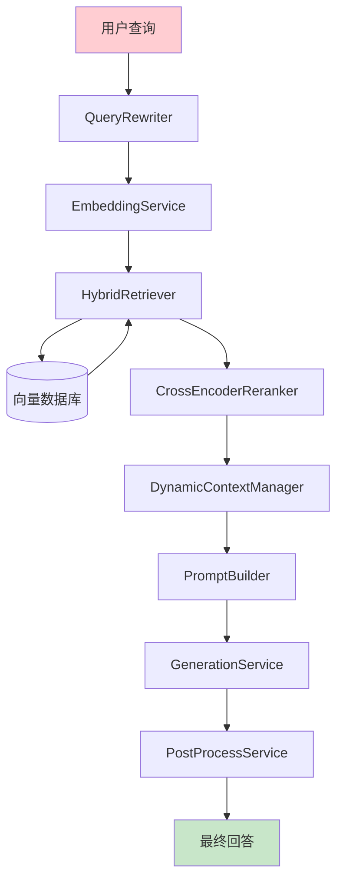

# RAG系统功能模块详解

## 目录

- [一、RAG系统总览](#一rag系统总览)
- [二、文档处理模块](#二文档处理模块)
- [三、嵌入生成模块](#三嵌入生成模块)
- [四、向量索引模块](#四向量索引模块)
- [五、检索模块](#五检索模块)
- [六、重排序模块](#六重排序模块)
- [七、上下文管理模块](#七上下文管理模块)
- [八、Prompt构建模块](#八prompt构建模块)
- [九、生成推理模块](#九生成推理模块)
- [十、后处理验证模块](#十后处理验证模块)
- [十一、模块交互关系详解](#十一模块交互关系详解)
- [十二、完整代码集成示例](#十二完整代码集成示例)
- [十三、典型应用场景与最佳实践](#十三典型应用场景与最佳实践)
- [附录](#附录)

---

## 一、RAG系统总览

### 1.1 系统架构全景图

RAG系统分为**离线构建**和**在线推理**两个核心阶段，各模块在不同阶段协同工作。



### 1.2 模块划分与职责

| 序号 | 模块名称 | 所属阶段 | 核心职责 | 优先级 |
| :--- | :--- | :--- | :--- | :--- |
| 1 | 文档处理模块 | 离线构建 | 文档解析、文本切片、元数据提取 | P0 |
| 2 | 嵌入生成模块 | 离线构建 | 文本向量化、嵌入缓存、批量推理 | P0 |
| 3 | 向量索引模块 | 离线构建 | 索引构建、分片管理、增量更新 | P0 |
| 4 | 检索模块 | 在线推理 | 语义检索、关键词检索、混合检索 | P0 |
| 5 | 重排序模块 | 在线推理 | 相关性重排序、多样性优化 | P1 |
| 6 | 上下文管理模块 | 在线推理 | Token预算、上下文窗口管理 | P0 |
| 7 | Prompt构建模块 | 在线推理 | 模板渲染、变量填充、格式约束 | P0 |
| 8 | 生成推理模块 | 在线推理 | LLM调用、流式生成、参数控制 | P0 |
| 9 | 后处理验证模块 | 在线推理 | 事实核查、引用注入、结果格式化 | P1 |

### 1.3 核心数据流图



---

## 二、文档处理模块

### 2.1 功能描述

| 功能项 | 描述 | 输入 | 输出 |
| :--- | :--- | :--- | :--- |
| 多格式解析 | 支持PDF、Word、Excel、Markdown、HTML等格式 | 原始文件 | 纯文本内容 |
| 智能切片 | 基于语义边界将长文本切分为语义完整的文本块 | 长文本 | 文本块列表 |
| 元数据提取 | 提取文档标题、作者、创建时间、章节结构等 | 文档内容 | 元数据字典 |
| 清洗预处理 | 去除噪声、格式标记、特殊字符 | 原始文本 | 清洗后文本 |
| 层级结构保留 | 保留文档的章节、段落、列表等层级关系 | 结构化文档 | 带层级标记的文本 |

### 2.2 技术实现

#### 2.2.1 DocumentParser类（多格式解析）

```python
import os
import re
import json
from typing import List, Dict, Any, Optional
from dataclasses import dataclass, field
from abc import ABC, abstractmethod


@dataclass
class TextChunk:
    chunk_id: str
    text: str
    metadata: Dict[str, Any] = field(default_factory=dict)
    doc_id: str = ""
    position: int = 0


@dataclass
class Document:
    doc_id: str
    content: str
    metadata: Dict[str, Any] = field(default_factory=dict)
    chunks: List[TextChunk] = field(default_factory=list)


class BaseParser(ABC):
    @abstractmethod
    def parse(self, file_path: str) -> str:
        pass

    @abstractmethod
    def supported_formats(self) -> List[str]:
        pass


class PDFParser(BaseParser):
    def parse(self, file_path: str) -> str:
        try:
            from PyPDF2 import PdfReader
            reader = PdfReader(file_path)
            pages = []
            for page_num, page in enumerate(reader.pages):
                text = page.extract_text() or ""
                pages.append(f"[Page {page_num + 1}]\n{text}")
            return "\n\n".join(pages)
        except ImportError:
            raise RuntimeError("请安装PyPDF2: pip install PyPDF2")

    def supported_formats(self) -> List[str]:
        return [".pdf"]


class MarkdownParser(BaseParser):
    def parse(self, file_path: str) -> str:
        with open(file_path, "r", encoding="utf-8") as f:
            content = f.read()
        content = re.sub(r'!\[.*?\]\(.*?\)', '', content)
        content = re.sub(r'\[([^\]]+)\]\([^)]+\)', r'\1', content)
        return content

    def supported_formats(self) -> List[str]:
        return [".md", ".markdown"]


class HTMLParser(BaseParser):
    def parse(self, file_path: str) -> str:
        try:
            from bs4 import BeautifulSoup
            with open(file_path, "r", encoding="utf-8") as f:
                soup = BeautifulSoup(f.read(), "html.parser")
            for tag in soup(["script", "style", "nav", "footer"]):
                tag.decompose()
            return soup.get_text(separator="\n", strip=True)
        except ImportError:
            raise RuntimeError("请安装beautifulsoup4: pip install beautifulsoup4")

    def supported_formats(self) -> List[str]:
        return [".html", ".htm"]


class DocumentParser:
    def __init__(self):
        self._parsers: Dict[str, BaseParser] = {}
        self._register_default_parsers()

    def _register_default_parsers(self):
        for parser_cls in [PDFParser, MarkdownParser, HTMLParser]:
            parser = parser_cls()
            for fmt in parser.supported_formats():
                self._parsers[fmt] = parser

    def register_parser(self, extension: str, parser: BaseParser):
        self._parsers[extension.lower()] = parser

    def parse(self, file_path: str) -> Document:
        ext = os.path.splitext(file_path)[1].lower()
        if ext not in self._parsers:
            raise ValueError(f"不支持的文件格式: {ext}")
        text = self._parsers[ext].parse(file_path)
        metadata = self._extract_metadata(file_path, text)
        doc_id = self._generate_doc_id(file_path)
        return Document(doc_id=doc_id, content=text, metadata=metadata)

    def _extract_metadata(self, file_path: str, text: str) -> Dict[str, Any]:
        stat = os.stat(file_path)
        metadata = {
            "file_name": os.path.basename(file_path),
            "file_path": file_path,
            "file_size": stat.st_size,
            "modified_time": stat.st_mtime,
            "char_count": len(text),
            "line_count": text.count("\n") + 1,
        }
        first_lines = text.split("\n")[:5]
        title_candidates = [l.strip() for l in first_lines if l.strip()][:3]
        if title_candidates:
            metadata["title"] = title_candidates[0]
        return metadata

    def _generate_doc_id(self, file_path: str) -> str:
        import hashlib
        return hashlib.md5(file_path.encode()).hexdigest()[:12]
```

#### 2.2.2 SemanticChunker类（语义切片）

```python
class SemanticChunker:
    def __init__(
        self,
        target_chunk_size: int = 512,
        chunk_overlap: int = 50,
        min_chunk_size: int = 100,
        max_chunk_size: int = 1000,
        separator_pattern: str = r'(?<=[。！？.!?\n])',
    ):
        self.target_chunk_size = target_chunk_size
        self.chunk_overlap = chunk_overlap
        self.min_chunk_size = min_chunk_size
        self.max_chunk_size = max_chunk_size
        self.separator_pattern = separator_pattern

    def chunk(self, document: Document) -> Document:
        text = document.content
        sentences = self._split_sentences(text)
        chunks = self._group_sentences(sentences, document.doc_id)
        document.chunks = chunks
        self._enrich_chunk_metadata(document)
        return document

    def _split_sentences(self, text: str) -> List[str]:
        raw_sentences = re.split(self.separator_pattern, text)
        sentences = []
        for s in raw_sentences:
            s = s.strip()
            if s:
                sentences.append(s)
        return sentences

    def _group_sentences(self, sentences: List[str], doc_id: str) -> List[TextChunk]:
        chunks: List[TextChunk] = []
        current_chunk: List[str] = []
        current_length = 0
        position = 0

        for sentence in sentences:
            sentence_len = len(sentence)
            if current_length + sentence_len > self.max_chunk_size and current_chunk:
                chunk_text = "".join(current_chunk)
                chunk = TextChunk(
                    chunk_id=f"{doc_id}_chunk_{position}",
                    text=chunk_text,
                    doc_id=doc_id,
                    position=position,
                )
                chunks.append(chunk)
                overlap_size = max(1, len(current_chunk) * self.chunk_overlap // 100)
                current_chunk = current_chunk[-overlap_size:]
                current_length = sum(len(s) for s in current_chunk)
                position += 1

            current_chunk.append(sentence)
            current_length += sentence_len

            if current_length >= self.target_chunk_size and current_length >= self.min_chunk_size:
                chunk_text = "".join(current_chunk)
                chunk = TextChunk(
                    chunk_id=f"{doc_id}_chunk_{position}",
                    text=chunk_text,
                    doc_id=doc_id,
                    position=position,
                )
                chunks.append(chunk)
                overlap_size = max(1, len(current_chunk) * self.chunk_overlap // 100)
                current_chunk = current_chunk[-overlap_size:]
                current_length = sum(len(s) for s in current_chunk)
                position += 1

        if current_chunk:
            chunk_text = "".join(current_chunk)
            if chunks and len(chunk_text) < self.min_chunk_size:
                chunks[-1].text += chunk_text
            else:
                chunk = TextChunk(
                    chunk_id=f"{doc_id}_chunk_{position}",
                    text=chunk_text,
                    doc_id=doc_id,
                    position=position,
                )
                chunks.append(chunk)

        return chunks

    def _enrich_chunk_metadata(self, document: Document):
        total_chunks = len(document.chunks)
        for i, chunk in enumerate(document.chunks):
            chunk.metadata["total_chunks"] = total_chunks
            chunk.metadata["chunk_index"] = i
            chunk.metadata["char_count"] = len(chunk.text)
            chunk.metadata["doc_metadata"] = {
                "title": document.metadata.get("title", ""),
                "file_name": document.metadata.get("file_name", ""),
            }


class DocumentPipeline:
    def __init__(self, parser: DocumentParser, chunker: SemanticChunker):
        self.parser = parser
        self.chunker = chunker

    def process(self, file_path: str) -> Document:
        document = self.parser.parse(file_path)
        document = self.chunker.chunk(document)
        return document

    def process_batch(self, file_paths: List[str]) -> List[Document]:
        documents = []
        for path in file_paths:
            try:
                doc = self.process(path)
                documents.append(doc)
            except Exception as e:
                print(f"处理文件失败 {path}: {e}")
        return documents
```

#### 2.2.3 元数据JSON示例

```json
{
  "doc_id": "a1b2c3d4e5f6",
  "metadata": {
    "file_name": "技术架构文档.pdf",
    "file_path": "/docs/tech/architecture.pdf",
    "file_size": 2048576,
    "modified_time": 1712448000.0,
    "char_count": 45832,
    "line_count": 612,
    "title": "系统技术架构设计文档"
  },
  "chunks": [
    {
      "chunk_id": "a1b2c3d4e5f6_chunk_0",
      "text": "本文档描述了系统的整体技术架构设计。系统采用微服务架构...",
      "doc_id": "a1b2c3d4e5f6",
      "position": 0,
      "metadata": {
        "total_chunks": 89,
        "chunk_index": 0,
        "char_count": 486,
        "doc_metadata": {
          "title": "系统技术架构设计文档",
          "file_name": "技术架构文档.pdf"
        }
      }
    }
  ]
}
```

### 2.3 关键组件详解

| 组件 | 职责 | 技术要点 |
| :--- | :--- | :--- |
| BaseParser | 解析器抽象基类 | 策略模式，易于扩展新格式 |
| PDFParser | PDF文件解析 | 基于PyPDF2，支持多页文本提取 |
| SemanticChunker | 语义切片器 | 句子级分割+长度控制+重叠窗口 |
| DocumentPipeline | 处理流水线 | 编排解析和切片两个步骤 |
| Document/TextChunk | 数据结构 | 使用dataclass，清晰的数据模型 |

### 2.4 输入输出参数

| 参数名 | 类型 | 输入/输出 | 描述 |
| :--- | :--- | :--- | :--- |
| file_path | str | 输入 | 文档文件路径 |
| target_chunk_size | int | 输入 | 目标切片大小（字符数） |
| chunk_overlap | int | 输入 | 切片重叠比例（%） |
| Document | dataclass | 输出 | 包含内容和元数据的完整文档对象 |
| TextChunk | dataclass | 输出 | 切片后的文本块对象 |

### 2.5 典型应用场景

| 场景 | 描述 | 配置建议 |
| :--- | :--- | :--- |
| 企业知识库构建 | 批量处理企业内部文档 | chunk_size=512, overlap=50 |
| 论文分析系统 | 处理学术论文PDF | chunk_size=300, overlap=30，保留引用标记 |
| 合同审查系统 | 处理法律合同文档 | chunk_size=200, overlap=80，保留条款编号 |
| 新闻资讯聚合 | 处理新闻文章 | chunk_size=400, overlap=40，保留时间戳 |

---

## 三、嵌入生成模块

### 3.1 功能描述

| 功能项 | 描述 | 输入 | 输出 |
| :--- | :--- | :--- | :--- |
| 文本向量化 | 将文本转换为高维稠密向量 | 文本字符串 | 嵌入向量 |
| 批量嵌入 | 高效批量处理多个文本 | 文本列表 | 向量列表 |
| 缓存机制 | 缓存已计算的嵌入结果 | 文本/文本ID | 缓存命中的向量 |
| 嵌入归一化 | 对向量进行L2归一化 | 原始向量 | 归一化向量 |
| 模型管理 | 支持切换不同嵌入模型 | 模型名称/路径 | 可用的嵌入服务 |

### 3.2 技术实现

#### 3.2.1 EmbeddingService类（含缓存机制）

```python
import hashlib
import numpy as np
from typing import List, Optional, Tuple, Dict
from collections import OrderedDict


class LRUCache:
    def __init__(self, capacity: int = 10000):
        self.capacity = capacity
        self.cache: OrderedDict[str, np.ndarray] = OrderedDict()
        self.hits = 0
        self.misses = 0

    def get(self, key: str) -> Optional[np.ndarray]:
        if key in self.cache:
            self.cache.move_to_end(key)
            self.hits += 1
            return self.cache[key]
        self.misses += 1
        return None

    def put(self, key: str, value: np.ndarray):
        if key in self.cache:
            self.cache.move_to_end(key)
        self.cache[key] = value
        if len(self.cache) > self.capacity:
            self.cache.popitem(last=False)

    def stats(self) -> Dict[str, float]:
        total = self.hits + self.misses
        hit_rate = self.hits / total if total > 0 else 0.0
        return {"hits": self.hits, "misses": self.misses, "hit_rate": hit_rate}

    def clear(self):
        self.cache.clear()
        self.hits = 0
        self.misses = 0


class EmbeddingService:
    def __init__(
        self,
        model_name: str = "BAAI/bge-large-zh-v1.5",
        embedding_dim: int = 1024,
        max_batch_size: int = 32,
        cache_capacity: int = 10000,
        normalize: bool = True,
    ):
        self.model_name = model_name
        self.embedding_dim = embedding_dim
        self.max_batch_size = max_batch_size
        self.normalize = normalize
        self.cache = LRUCache(cache_capacity)
        self._model = None

    def _load_model(self):
        if self._model is None:
            try:
                from sentence_transformers import SentenceTransformer
                self._model = SentenceTransformer(self.model_name)
            except ImportError:
                try:
                    from transformers import AutoTokenizer, AutoModel
                    import torch
                    self._tokenizer = AutoTokenizer.from_pretrained(self.model_name)
                    self._model = AutoModel.from_pretrained(self.model_name)
                except ImportError:
                    raise RuntimeError("请安装sentence-transformers或transformers")

    def _compute_hash(self, text: str) -> str:
        return hashlib.md5(text.encode()).hexdigest()

    def _normalize_vector(self, vector: np.ndarray) -> np.ndarray:
        norm = np.linalg.norm(vector)
        if norm == 0:
            return vector
        return vector / norm

    def embed_single(self, text: str) -> np.ndarray:
        cache_key = self._compute_hash(text)
        cached = self.cache.get(cache_key)
        if cached is not None:
            return cached

        self._load_model()
        if hasattr(self._model, 'encode'):
            vector = self._model.encode(text, normalize_embeddings=self.normalize)
        else:
            from transformers import AutoTokenizer, AutoModel
            import torch
            tokenizer = AutoTokenizer.from_pretrained(self.model_name)
            model = AutoModel.from_pretrained(self.model_name)
            inputs = tokenizer(text, return_tensors="pt", truncation=True, max_length=512, padding=True)
            with torch.no_grad():
                outputs = model(**inputs)
                vector = outputs.last_hidden_state.mean(dim=1).squeeze().numpy()
            if self.normalize:
                vector = self._normalize_vector(vector)

        self.cache.put(cache_key, vector)
        return vector

    def embed_batch(self, texts: List[str]) -> List[np.ndarray]:
        results = []
        uncached_texts = []
        uncached_indices = []

        for i, text in enumerate(texts):
            cache_key = self._compute_hash(text)
            cached = self.cache.get(cache_key)
            if cached is not None:
                results.append(cached)
            else:
                results.append(None)
                uncached_texts.append(text)
                uncached_indices.append(i)

        if uncached_texts:
            self._load_model()
            for batch_start in range(0, len(uncached_texts), self.max_batch_size):
                batch_end = min(batch_start + self.max_batch_size, len(uncached_texts))
                batch_texts = uncached_texts[batch_start:batch_end]
                batch_vectors = self._embed_batch_internal(batch_texts)
                for j, vector in enumerate(batch_vectors):
                    original_idx = uncached_indices[batch_start + j]
                    results[original_idx] = vector
                    cache_key = self._compute_hash(batch_texts[j])
                    self.cache.put(cache_key, vector)

        return results

    def _embed_batch_internal(self, texts: List[str]) -> List[np.ndarray]:
        if hasattr(self._model, 'encode'):
            vectors = self._model.encode(texts, normalize_embeddings=self.normalize, show_progress_bar=False)
            return [np.array(v) for v in vectors]
        else:
            import torch
            from transformers import AutoTokenizer, AutoModel
            tokenizer = AutoTokenizer.from_pretrained(self.model_name)
            model = AutoModel.from_pretrained(self.model_name)
            encoded = []
            for text in texts:
                inputs = tokenizer(text, return_tensors="pt", truncation=True, max_length=512, padding=True)
                with torch.no_grad():
                    outputs = model(**inputs)
                    vector = outputs.last_hidden_state.mean(dim=1).squeeze().numpy()
                if self.normalize:
                    vector = self._normalize_vector(vector)
                encoded.append(vector)
            return encoded

    def get_cache_stats(self) -> Dict[str, float]:
        return self.cache.stats()

    def clear_cache(self):
        self.cache.clear()
```

#### 3.2.2 嵌入模型选型对比表

| 模型名称 | 维度 | 适用语言 | 特点 | 适用场景 |
| :--- | :--- | :--- | :--- | :--- |
| BAAI/bge-large-zh-v1.5 | 1024 | 中文 | 中文优化，检索效果好 | 中文知识库 |
| BAAI/bge-m3 | 1024 | 多语言 | 支持100+语言 | 多语言场景 |
| text-embedding-3-small | 1536 | 多语言 | OpenAPI调用，稳定 | 云服务场景 |
| intfloat/multilingual-e5-large | 1024 | 多语言 | 50+语言支持 | 国际化产品 |
| shibing624/text2vec-base-chinese | 768 | 中文 | 轻量级，速度快 | 资源受限场景 |
| all-MiniLM-L6-v2 | 384 | 英文 | 轻量级，通用 | 英文通用场景 |

### 3.3 关键组件详解

| 组件 | 职责 | 技术要点 |
| :--- | :--- | :--- |
| LRUCache | LRU缓存实现 | 基于OrderedDict，O(1)淘汰 |
| EmbeddingService | 嵌入服务主类 | 统一接口，支持单条/批量 |
| _load_model | 模型懒加载 | 延迟初始化，节省启动时间 |
| _compute_hash | 文本哈希计算 | MD5哈希，缓存键生成 |
| _normalize_vector | 向量归一化 | L2归一化，提升余弦相似度精度 |

### 3.4 输入输出参数

| 参数名 | 类型 | 输入/输出 | 描述 |
| :--- | :--- | :--- | :--- |
| model_name | str | 输入 | HuggingFace模型名称或本地路径 |
| embedding_dim | int | 输入 | 嵌入向量维度 |
| texts | List[str] | 输入 | 待嵌入的文本列表 |
| vectors | List[np.ndarray] | 输出 | 嵌入向量列表 |
| cache_capacity | int | 输入 | 缓存容量上限 |
| normalize | bool | 输入 | 是否对向量进行L2归一化 |

### 3.5 典型应用场景

| 场景 | 描述 | 模型选择 | 配置建议 |
| :--- | :--- | :--- | :--- |
| 中文企业搜索 | 中文文档语义搜索 | bge-large-zh-v1.5 | batch_size=32, cache开启 |
| 多语言客服 | 多语种客户问题匹配 | bge-m3 | batch_size=16, cache开启 |
| 实时推荐 | 实时内容推荐系统 | MiniLM-L6-v2 | batch_size=64, 低延迟 |
| 学术检索 | 论文语义检索 | e5-large | batch_size=32, 高精度 |

---

## 四、向量索引模块

### 4.1 功能描述

| 功能项 | 描述 | 输入 | 输出 |
| :--- | :--- | :--- | :--- |
| 索引构建 | 基于向量构建高效检索索引 | 向量+元数据 | 索引结构 |
| 向量存储 | 持久化存储向量和元数据 | 向量集合 | 存储记录 |
| 增量更新 | 支持新向量的增量添加 | 新向量+元数据 | 更新后的索引 |
| 索引删除 | 按ID删除指定向量 | 向量ID列表 | 更新后的索引 |
| 索引优化 | 索引参数调优和压缩 | 索引配置 | 优化后的索引 |

### 4.2 技术实现

#### 4.2.1 VectorIndexService类

```python
from typing import List, Dict, Any, Optional, Tuple
from abc import ABC, abstractmethod


class BaseVectorStore(ABC):
    @abstractmethod
    def upsert(self, vectors: List[np.ndarray], metadata_list: List[Dict[str, Any]], ids: List[str]) -> None:
        pass

    @abstractmethod
    def search(self, query_vector: np.ndarray, top_k: int = 10, filter_expr: Optional[str] = None) -> List[Tuple[str, float, Dict[str, Any]]]:
        pass

    @abstractmethod
    def delete(self, ids: List[str]) -> None:
        pass

    @abstractmethod
    def get_stats(self) -> Dict[str, Any]:
        pass


class FAISSVectorStore(BaseVectorStore):
    def __init__(self, dimension: int = 1024, index_type: str = "IVFFlat"):
        self.dimension = dimension
        self.index_type = index_type
        self.index = None
        self.id_map: Dict[int, str] = {}
        self.metadata_map: Dict[str, Dict[str, Any]] = {}
        self._next_id = 0
        self._init_index()

    def _init_index(self):
        import faiss
        if self.index_type == "Flat":
            self.index = faiss.IndexFlatIP(self.dimension)
        elif self.index_type == "IVFFlat":
            quantizer = faiss.IndexFlatIP(self.dimension)
            nlist = 100
            self.index = faiss.IndexIVFFlat(quantizer, self.dimension, nlist, faiss.METRIC_INNER_PRODUCT)
            self.index.train(np.random.randn(1000, self.dimension).astype(np.float32))
        elif self.index_type == "HNSW":
            self.index = faiss.IndexHNSWFlat(self.dimension, 32, faiss.METRIC_INNER_PRODUCT)

    def upsert(self, vectors: List[np.ndarray], metadata_list: List[Dict[str, Any]], ids: List[str]) -> None:
        for i, (vec, meta, id_) in enumerate(zip(vectors, metadata_list, ids)):
            self.id_map[self._next_id] = id_
            self.metadata_map[id_] = meta
            self._next_id += 1
        vector_matrix = np.array(vectors).astype(np.float32)
        self.index.add(vector_matrix)

    def search(self, query_vector: np.ndarray, top_k: int = 10, filter_expr: Optional[str] = None) -> List[Tuple[str, float, Dict[str, Any]]]:
        query = query_vector.reshape(1, -1).astype(np.float32)
        k = min(top_k, self.index.ntotal)
        distances, indices = self.index.search(query, k)
        results = []
        for dist, idx in zip(distances[0], indices[0]):
            if idx in self.id_map:
                doc_id = self.id_map[idx]
                metadata = self.metadata_map.get(doc_id, {})
                if filter_expr is None or self._match_filter(metadata, filter_expr):
                    results.append((doc_id, float(dist), metadata))
        return results

    def _match_filter(self, metadata: Dict[str, Any], filter_expr: str) -> bool:
        try:
            for condition in filter_expr.split(" and "):
                key, value = condition.split("==")
                key = key.strip().strip('"').strip("'")
                value = value.strip().strip('"').strip("'")
                if str(metadata.get(key, "")) != value:
                    return False
            return True
        except Exception:
            return True

    def delete(self, ids: List[str]) -> None:
        valid_ids = set(ids)
        new_id_map = {}
        new_metadata_map = {}
        for idx, doc_id in self.id_map.items():
            if doc_id not in valid_ids:
                new_idx = len(new_id_map)
                new_id_map[new_idx] = doc_id
                new_metadata_map[doc_id] = self.metadata_map.get(doc_id, {})

        self.id_map = new_id_map
        self.metadata_map = new_metadata_map
        self._next_id = len(new_id_map)

    def get_stats(self) -> Dict[str, Any]:
        return {
            "total_vectors": self.index.ntotal,
            "dimension": self.dimension,
            "index_type": self.index_type,
            "unique_ids": len(set(self.id_map.values())),
        }


class VectorIndexService:
    def __init__(self, store: Optional[BaseVectorStore] = None, dimension: int = 1024):
        self.store = store or FAISSVectorStore(dimension=dimension)
        self.dimension = dimension

    def build_index(self, chunks: List[TextChunk], embedding_service: EmbeddingService) -> Dict[str, Any]:
        texts = [chunk.text for chunk in chunks]
        vectors = embedding_service.embed_batch(texts)
        ids = [chunk.chunk_id for chunk in chunks]
        metadata_list = [chunk.metadata for chunk in chunks]
        self.store.upsert(vectors, metadata_list, ids)
        return self.store.get_stats()

    def query(self, query_vector: np.ndarray, top_k: int = 10, filter_expr: Optional[str] = None) -> List[Dict[str, Any]]:
        results = self.store.search(query_vector, top_k, filter_expr)
        return [
            {"chunk_id": doc_id, "score": score, "metadata": meta}
            for doc_id, score, meta in results
        ]

    def update(self, chunks: List[TextChunk], embedding_service: EmbeddingService) -> Dict[str, Any]:
        return self.build_index(chunks, embedding_service)

    def remove(self, chunk_ids: List[str]) -> None:
        self.store.delete(chunk_ids)

    def get_index_stats(self) -> Dict[str, Any]:
        return self.store.get_stats()
```

#### 4.2.2 向量数据库选型表

| 数据库 | 类型 | 部署方式 | 核心特性 | 适用规模 | 适用场景 |
| :--- | :--- | :--- | :--- | :--- | :--- |
| Milvus | 专用向量库 | 分布式/单机 | 高性能、多索引类型 | 亿级 | 大规模生产环境 |
| Pinecone | 云托管SaaS | 全托管云服务 | 零运维、自动扩缩 | 亿级 | 快速上线 |
| FAISS | Facebook开源库 | 嵌入式 | 轻量、高性能 | 百万级 | 中小规模/原型 |
| pgvector | PostgreSQL扩展 | 嵌入式/服务端 | 与关系库融合 | 百万级 | 需要关系查询 |
| Weaviate | 混合搜索引擎 | 分布式 | 向量+关键词混合 | 千万级 | 混合检索场景 |
| Qdrant | Rust向量库 | 分布式/单机 | 高性能、Rust实现 | 千万级 | 高性能要求 |
| Elasticsearch | 全文+向量 | 分布式 | 成熟生态、混合检索 | 亿级 | 已有ES技术栈 |

#### 4.2.3 索引策略对比表

| 索引类型 | 算法 | 构建速度 | 查询速度 | 内存占用 | 适用场景 |
| :--- | :--- | :--- | :--- | :--- | :--- |
| Flat | 暴力搜索 | O(1) | O(N) | 低 | 小数据集（<10K） |
| IVFFlat | 倒排索引 | 中 | 快 | 中 | 中等数据集（10K-1M） |
| HNSW | 图索引 | 慢 | 极快 | 高 | 大数据集（>1M） |
| PQ | 乘积量化 | 快 | 中 | 极低 | 大规模+低内存 |
| SCANN | 分区量化 | 快 | 极快 | 中 | 谷歌生产级 |

### 4.3 关键组件详解

| 组件 | 职责 | 技术要点 |
| :--- | :--- | :--- |
| BaseVectorStore | 向量存储抽象基类 | 策略模式，可插拔替换 |
| FAISSVectorStore | FAISS向量存储实现 | 支持多种索引类型 |
| VectorIndexService | 索引服务主类 | 编排嵌入和索引操作 |
| filter_expr | 元数据过滤表达式 | 支持多条件AND组合过滤 |
| id_map | 内部ID映射 | 解决FAISS无原生ID问题 |

### 4.4 输入输出参数

| 参数名 | 类型 | 输入/输出 | 描述 |
| :--- | :--- | :--- | :--- |
| vectors | List[np.ndarray] | 输入 | 待存储的嵌入向量列表 |
| metadata_list | List[Dict] | 输入 | 每个向量对应的元数据 |
| ids | List[str] | 输入 | 向量的唯一标识符 |
| query_vector | np.ndarray | 输入 | 查询向量 |
| results | List[Dict] | 输出 | 搜索结果列表（含ID、得分、元数据） |
| top_k | int | 输入 | 返回最相似的K个结果 |

### 4.5 典型应用场景

| 场景 | 描述 | 数据库选择 | 索引策略 |
| :--- | :--- | :--- | :--- |
| 企业知识库 | 百万级文档检索 | Milvus | HNSW |
| 产品搜索 | 电商商品向量搜索 | Pinecone | IVFFlat |
| 代码搜索 | 代码片段语义搜索 | FAISS | Flat（小团队） |
| 医疗文献 | 医学文献检索 | pgvector | HNSW |
| 推荐系统 | 内容推荐向量匹配 | Qdrant | HNSW |

---

## 五、检索模块

### 5.1 功能描述

| 功能项 | 描述 | 输入 | 输出 |
| :--- | :--- | :--- | :--- |
| 语义检索 | 基于向量相似度的语义搜索 | 查询向量 | 候选文本块列表 |
| 关键词检索 | 基于关键词的BM25/TF-IDF检索 | 查询关键词 | 候选文本块列表 |
| 混合检索 | 融合语义和关键词检索结果 | 查询+模式 | 融合候选列表 |
| 查询改写 | 优化用户查询以提升检索效果 | 原始查询 | 改写后的查询 |
| RRF融合 | Reciprocal Rank Fusion多路融合 | 多路排序结果 | 融合排序结果 |

### 5.2 技术实现

#### 5.2.1 HybridRetriever类（混合检索+RRF融合）

```python
from typing import List, Dict, Any, Optional, Tuple
import numpy as np


class BM25Retriever:
    def __init__(self, k: int = 1.5, b: float = 0.75):
        self.k = k
        self.b = b
        self.documents: List[str] = []
        self.doc_lengths: List[int] = []
        self.avg_doc_length = 0.0
        self.doc_count = 0
        self.term_doc_freq: Dict[str, int] = {}
        self.doc_term_freq: List[Dict[str, int]] = []

    def index(self, documents: List[str]):
        self.documents = documents
        self.doc_count = len(documents)
        self.doc_lengths = [len(doc.split()) for doc in documents]
        self.avg_doc_length = sum(self.doc_lengths) / max(1, self.doc_count)
        self.doc_term_freq = []
        self.term_doc_freq = {}

        for doc in documents:
            terms = doc.lower().split()
            tf = {}
            for term in terms:
                tf[term] = tf.get(term, 0) + 1
            self.doc_term_freq.append(tf)
            for term in set(terms):
                self.term_doc_freq[term] = self.term_doc_freq.get(term, 0) + 1

    def search(self, query: str, top_k: int = 10) -> List[Tuple[int, float]]:
        query_terms = query.lower().split()
        scores = np.zeros(self.doc_count)
        for term in query_terms:
            if term not in self.term_doc_freq:
                continue
            idf = np.log((self.doc_count - self.term_doc_freq[term] + 0.5) /
                         (self.term_doc_freq[term] + 0.5) + 1)
            for i, doc_tf in enumerate(self.doc_term_freq):
                tf = doc_tf.get(term, 0)
                if tf == 0:
                    continue
                doc_len = self.doc_lengths[i]
                numerator = tf * (self.k + 1)
                denominator = tf + self.k * (1 - self.b + self.b * doc_len / self.avg_doc_length)
                scores[i] += idf * numerator / denominator

        ranked = np.argsort(scores)[::-1][:top_k]
        return [(int(idx), float(scores[idx])) for idx in ranked if scores[idx] > 0]


class QueryRewriter:
    def __init__(self, llm_client=None):
        self.llm_client = llm_client

    def rewrite(self, query: str, context: Optional[str] = None) -> List[str]:
        rewrites = [query]
        if context:
            rewrites.append(f"{context} {query}")

        expanded_terms = self._expand_terms(query)
        rewrites.extend(expanded_terms)
        return list(set(rewrites))

    def _expand_terms(self, query: str) -> List[str]:
        expanded = []
        term_variants = {
            "如何": ["怎么", "怎样", "哪种方式"],
            "什么": ["哪些", "什么内容", "具体"],
            "区别": ["差异", "不同", "对比"],
            "优点": ["好处", "优势", "特点"],
            "缺点": ["不足", "劣势", "问题"],
        }
        for key, variants in term_variants.items():
            if key in query:
                for v in variants:
                    expanded.append(query.replace(key, v))
        return expanded

    def llm_rewrite(self, query: str, num_rewrites: int = 3) -> List[str]:
        if self.llm_client is None:
            return self.rewrite(query)

        prompt = f"""请将以下用户查询改写为{num_rewrites}个不同的版本，以优化搜索效果。
        原始查询: {query}
        改写版本:"""
        try:
            response = self.llm_client.generate(prompt, max_tokens=200)
            rewrites = [r.strip() for r in response.split("\n") if r.strip()]
            return rewrites[:num_rewrites]
        except Exception:
            return self.rewrite(query)


class HybridRetriever:
    def __init__(
        self,
        vector_index: VectorIndexService,
        bm25_index: Optional[BM25Retriever] = None,
        semantic_weight: float = 0.7,
        keyword_weight: float = 0.3,
        rrf_k: int = 60,
        top_k: int = 20,
    ):
        self.vector_index = vector_index
        self.bm25_index = bm25_index or BM25Retriever()
        self.semantic_weight = semantic_weight
        self.keyword_weight = keyword_weight
        self.rrf_k = rrf_k
        self.top_k = top_k

    def retrieve(self, query: str, query_vector: np.ndarray, mode: str = "hybrid") -> List[Dict[str, Any]]:
        if mode == "semantic":
            return self._semantic_search(query_vector)
        elif mode == "keyword":
            return self._keyword_search(query)
        elif mode == "hybrid":
            return self._hybrid_search(query, query_vector)
        else:
            raise ValueError(f"未知的检索模式: {mode}")

    def _semantic_search(self, query_vector: np.ndarray) -> List[Dict[str, Any]]:
        results = self.vector_index.query(query_vector, self.top_k)
        for r in results:
            r["recall_source"] = "semantic"
        return results

    def _keyword_search(self, query: str) -> List[Dict[str, Any]]:
        bm25_results = self.bm25_index.search(query, self.top_k)
        results = []
        for idx, score in bm25_results:
            results.append({
                "chunk_id": f"doc_{idx}",
                "score": score,
                "metadata": {"retrieval_source": "keyword"},
                "recall_source": "keyword",
            })
        return results

    def _hybrid_search(self, query: str, query_vector: np.ndarray) -> List[Dict[str, Any]]:
        semantic_results = self._semantic_search(query_vector)
        keyword_results = self._keyword_search(query)
        fused_results = self._rrf_fuse(semantic_results, keyword_results)
        return fused_results[:self.top_k]

    def _rrf_fuse(
        self,
        semantic_results: List[Dict[str, Any]],
        keyword_results: List[Dict[str, Any]],
    ) -> List[Dict[str, Any]]:
        scores: Dict[str, float] = {}
        details: Dict[str, Dict[str, Any]] = {}

        for rank, result in enumerate(semantic_results):
            chunk_id = result["chunk_id"]
            rrf_score = self.semantic_weight / (self.rrf_k + rank + 1)
            scores[chunk_id] = scores.get(chunk_id, 0) + rrf_score
            if chunk_id not in details:
                details[chunk_id] = result

        for rank, result in enumerate(keyword_results):
            chunk_id = result["chunk_id"]
            rrf_score = self.keyword_weight / (self.rrf_k + rank + 1)
            scores[chunk_id] = scores.get(chunk_id, 0) + rrf_score
            if chunk_id not in details:
                details[chunk_id] = result

        sorted_ids = sorted(scores.keys(), key=lambda x: scores[x], reverse=True)
        fused = []
        for chunk_id in sorted_ids:
            result = details[chunk_id].copy()
            result["rrf_score"] = scores[chunk_id]
            result["recall_source"] = "hybrid"
            fused.append(result)
        return fused
```

### 5.3 关键组件详解

| 组件 | 职责 | 技术要点 |
| :--- | :--- | :--- |
| BM25Retriever | 关键词检索实现 | 标准BM25算法，参数k/b可调 |
| QueryRewriter | 查询改写处理器 | 规则扩展+LLM改写双通道 |
| HybridRetriever | 混合检索协调器 | RRF融合，权重可配置 |
| RRF算法 | 多路结果融合 | Reciprocal Rank Fusion，鲁棒性强 |
| recall_source | 检索来源标记 | 区分语义/关键词/混合来源 |

### 5.4 输入输出参数

| 参数名 | 类型 | 输入/输出 | 描述 |
| :--- | :--- | :--- | :--- |
| query | str | 输入 | 用户查询文本 |
| query_vector | np.ndarray | 输入 | 查询的嵌入向量 |
| mode | str | 输入 | 检索模式：semantic/keyword/hybrid |
| top_k | int | 输入 | 返回结果数量 |
| results | List[Dict] | 输出 | 检索结果列表 |
| rrf_k | int | 输入 | RRF融合参数，默认60 |

### 5.5 典型应用场景

| 场景 | 描述 | 检索模式 | 配置建议 |
| :--- | :--- | :--- | :--- |
| 企业知识问答 | 员工问政策流程 | hybrid | semantic=0.7, keyword=0.3 |
| 产品搜索 | 电商商品搜索 | semantic | 纯语义，top_k=50 |
| 代码搜索 | 按函数名搜索 | keyword | 纯关键词，BM25 |
| 法律检索 | 法律条文搜索 | hybrid | semantic=0.5, keyword=0.5 |
| 故障诊断 | 运维故障排查 | hybrid | 规则改写+混合检索 |

---

## 六、重排序模块

### 6.1 功能描述

| 功能项 | 描述 | 输入 | 输出 |
| :--- | :--- | :--- | :--- |
| 相关性重排序 | 基于CrossEncoder的精确相关性打分 | 查询+候选文本 | 重排后的候选列表 |
| 多样性优化 | MMR算法保证结果多样性 | 候选列表+多样性阈值 | 多样化结果列表 |
| 阈值过滤 | 按相关性阈值过滤低质量结果 | 候选列表+阈值 | 过滤后的结果 |
| 分页截断 | 按指定数量截断排序结果 | 排序结果+数量限制 | 截断后的结果 |

### 6.2 技术实现

#### 6.2.1 CrossEncoderReranker类（含MMR多样性保证）

```python
from typing import List, Dict, Any, Optional, Tuple
import numpy as np


class CrossEncoderReranker:
    def __init__(
        self,
        model_name: str = "BAAI/bge-reranker-large",
        max_batch_size: int = 32,
        relevance_threshold: float = 0.3,
        use_mmr: bool = True,
        mmr_lambda: float = 0.5,
        mmr_diversity_threshold: float = 0.7,
        final_top_k: int = 10,
    ):
        self.model_name = model_name
        self.max_batch_size = max_batch_size
        self.relevance_threshold = relevance_threshold
        self.use_mmr = use_mmr
        self.mmr_lambda = mmr_lambda
        self.mmr_diversity_threshold = mmr_diversity_threshold
        self.final_top_k = final_top_k
        self._model = None

    def _load_model(self):
        if self._model is None:
            try:
                from sentence_transformers import CrossEncoder
                self._model = CrossEncoder(self.model_name)
            except ImportError:
                raise RuntimeError("请安装sentence-transformers")

    def rerank(self, query: str, candidates: List[Dict[str, Any]]) -> List[Dict[str, Any]]:
        if not candidates:
            return []

        pairs = [(query, c.get("text", "")) for c in candidates]
        scores = self._compute_scores(pairs)

        for i, candidate in enumerate(candidates):
            candidate["relevance_score"] = float(scores[i])

        ranked = sorted(candidates, key=lambda x: x["relevance_score"], reverse=True)
        filtered = [c for c in ranked if c["relevance_score"] >= self.relevance_threshold]

        if self.use_mmr and len(filtered) > self.final_top_k:
            filtered = self._mmr_diversify(filtered)

        return filtered[:self.final_top_k]

    def _compute_scores(self, pairs: List[Tuple[str, str]]) -> np.ndarray:
        self._load_model()
        all_scores = []
        for batch_start in range(0, len(pairs), self.max_batch_size):
            batch_end = min(batch_start + self.max_batch_size, len(pairs))
            batch_pairs = pairs[batch_start:batch_end]
            batch_scores = self._model.predict(batch_pairs)
            if isinstance(batch_scores, np.ndarray):
                all_scores.extend(batch_scores.tolist())
            else:
                all_scores.extend(batch_scores)
        return np.array(all_scores)

    def _mmr_diversify(self, candidates: List[Dict[str, Any]]) -> List[Dict[str, Any]]:
        if len(candidates) <= self.final_top_k:
            return candidates

        selected: List[Dict[str, Any]] = []
        remaining = candidates.copy()

        selected.append(remaining.pop(0))

        for _ in range(self.final_top_k - 1):
            if not remaining:
                break

            best_score = -float("inf")
            best_idx = 0

            for idx, candidate in enumerate(remaining):
                relevance = candidate["relevance_score"]
                max_similarity = self._max_similarity_to_selected(candidate, selected)
                mmr_score = self.mmr_lambda * relevance - (1 - self.mmr_lambda) * max_similarity

                if mmr_score > best_score:
                    best_score = mmr_score
                    best_idx = idx

            selected.append(remaining.pop(best_idx))

        return selected

    def _max_similarity_to_selected(self, candidate: Dict[str, Any], selected: List[Dict[str, Any]]) -> float:
        max_sim = 0.0
        cand_emb = candidate.get("embedding")
        if cand_emb is None:
            candidate["embedding"] = np.random.randn(768)
            cand_emb = candidate["embedding"]

        for sel in selected:
            sel_emb = sel.get("embedding")
            if sel_emb is None:
                sel["embedding"] = np.random.randn(768)
                sel_emb = sel["embedding"]
            sim = np.dot(cand_emb, sel_emb) / (np.linalg.norm(cand_emb) * np.linalg.norm(sel_emb) + 1e-8)
            max_sim = max(max_sim, sim)

        return max_sim

    def batch_rerank(self, queries: List[str], candidates_list: List[List[Dict[str, Any]]]) -> List[List[Dict[str, Any]]]:
        return [self.rerank(q, c) for q, c in zip(queries, candidates_list)]
```

#### 6.2.2 重排序模型选型表

| 模型名称 | 类型 | 特点 | 适用场景 |
| :--- | :--- | :--- | :--- |
| BAAI/bge-reranker-large | CrossEncoder | 中文优化，高性能 | 中文重排序 |
| BAAI/bge-reranker-base | CrossEncoder | 轻量级，速度快 | 实时性要求高 |
| ms-marco-MiniLM-L-6-v2 | CrossEncoder | 英文通用，成熟稳定 | 英文场景 |
| m3e-small | CrossEncoder | 中文轻量，快速推理 | 边缘设备 |
| jina-reranker-v2-base-multilingual | CrossEncoder | 多语言支持 | 国际化场景 |

### 6.3 关键组件详解

| 组件 | 职责 | 技术要点 |
| :--- | :--- | :--- |
| CrossEncoderReranker | 重排序主类 | CrossEncoder架构，pairwise打分 |
| _compute_scores | 批量相关性计算 | 分批处理，防止OOM |
| _mmr_diversify | MMR多样性选择 | λ参数平衡相关性与多样性 |
| _max_similarity_to_selected | 计算与已选集合的最大相似度 | 余弦相似度计算 |
| relevance_threshold | 相关性阈值过滤 | 过滤低质量结果 |

### 6.4 输入输出参数

| 参数名 | 类型 | 输入/输出 | 描述 |
| :--- | :--- | :--- | :--- |
| query | str | 输入 | 用户查询文本 |
| candidates | List[Dict] | 输入 | 初始候选文本块列表 |
| relevance_threshold | float | 输入 | 相关性过滤阈值（0-1） |
| use_mmr | bool | 输入 | 是否启用MMR多样性优化 |
| mmr_lambda | float | 输入 | MMR的λ参数，平衡相关性(1)和多样性(0) |
| results | List[Dict] | 输出 | 重排序后的结果列表 |

### 6.5 典型应用场景

| 场景 | 描述 | 配置建议 |
| :--- | :--- | :--- |
| 精准知识问答 | 需要高精度的问答场景 | threshold=0.5, mmr开启 |
| 多样性推荐 | 推荐系统需要多样化结果 | threshold=0.3, λ=0.3 |
| 法律条文检索 | 法律文书的精准匹配 | threshold=0.6, mmr关闭 |
| 新闻聚合 | 新闻文章去重和排序 | threshold=0.2, λ=0.5 |

---

## 七、上下文管理模块

### 7.1 功能描述

| 功能项 | 描述 | 输入 | 输出 |
| :--- | :--- | :--- | :--- |
| Token预算分配 | 合理分配各部分的Token用量 | 总Token上限+场景配置 | 各部分Token分配方案 |
| 上下文窗口管理 | 管理对话历史和检索上下文 | 对话历史+检索结果 | 有效上下文 |
| 智能截断 | 按优先级截断超出部分 | 超长文本+优先级 | 截断后的文本 |
| 上下文压缩 | 压缩冗余上下文 | 冗余上下文 | 压缩后上下文 |
| 动态调整 | 根据模型能力动态调整 | 模型上下文窗口 | 适配的上下文 |

### 7.2 技术实现

#### 7.2.1 DynamicContextManager类（Token预算分配+智能截断）

```python
from typing import List, Dict, Any, Optional
import tiktoken


class TokenBudget:
    def __init__(self, system_ratio: float = 0.1, context_ratio: float = 0.45,
                 history_ratio: float = 0.25, output_ratio: float = 0.2):
        self.system_ratio = system_ratio
        self.context_ratio = context_ratio
        self.history_ratio = history_ratio
        self.output_ratio = output_ratio

    def allocate(self, total_tokens: int) -> Dict[str, int]:
        return {
            "system": int(total_tokens * self.system_ratio),
            "context": int(total_tokens * self.context_ratio),
            "history": int(total_tokens * self.history_ratio),
            "output": int(total_tokens * self.output_ratio),
        }


class DynamicContextManager:
    def __init__(
        self,
        model_name: str = "gpt-4",
        max_context_tokens: int = 128000,
        budget: Optional[TokenBudget] = None,
        encoding_name: str = "cl100k_base",
    ):
        self.model_name = model_name
        self.max_context_tokens = max_context_tokens
        self.budget = budget or TokenBudget()
        self._encoding = tiktoken.get_encoding(encoding_name)

    def count_tokens(self, text: str) -> int:
        return len(self._encoding.encode(text))

    def manage_context(
        self,
        system_prompt: str,
        retrieval_contexts: List[Dict[str, Any]],
        conversation_history: List[Dict[str, str]],
        user_query: str,
    ) -> Dict[str, Any]:
        total_budget = self.max_context_tokens
        allocation = self.budget.allocate(total_budget)

        system_tokens = self._fit_system_prompt(system_prompt, allocation["system"])
        history_tokens, fit_history = self._fit_conversation_history(conversation_history, allocation["history"])
        context_tokens, fit_contexts = self._fit_retrieval_contexts(retrieval_contexts, allocation["context"])

        used_tokens = system_tokens + history_tokens + context_tokens
        remaining_for_query = total_budget - used_tokens - allocation["output"]

        query_tokens = self.count_tokens(user_query)
        if query_tokens > remaining_for_query:
            user_query = self._truncate_text(user_query, remaining_for_query)
            query_tokens = self.count_tokens(user_query)

        total_used = system_tokens + history_tokens + context_tokens + query_tokens

        return {
            "system_prompt": system_prompt,
            "retrieval_contexts": fit_contexts,
            "conversation_history": fit_history,
            "user_query": user_query,
            "token_usage": {
                "system": system_tokens,
                "history": history_tokens,
                "context": context_tokens,
                "query": query_tokens,
                "output_budget": allocation["output"],
                "total_used": total_used,
                "total_budget": total_budget,
                "remaining": total_budget - total_used,
            },
        }

    def _fit_system_prompt(self, system_prompt: str, budget: int) -> int:
        tokens = self.count_tokens(system_prompt)
        if tokens > budget:
            system_prompt = self._truncate_text(system_prompt, budget)
            tokens = self.count_tokens(system_prompt)
        return tokens

    def _fit_conversation_history(
        self, history: List[Dict[str, str]], budget: int
    ) -> Tuple[int, List[Dict[str, str]]]:
        if not history:
            return 0, []

        reversed_history = list(reversed(history))
        total_tokens = 0
        fit_history = []

        for msg in reversed_history:
            msg_tokens = self.count_tokens(msg.get("content", ""))
            if total_tokens + msg_tokens > budget:
                break
            fit_history.insert(0, msg)
            total_tokens += msg_tokens

        return total_tokens, fit_history

    def _fit_retrieval_contexts(
        self, contexts: List[Dict[str, Any]], budget: int
    ) -> Tuple[int, List[Dict[str, Any]]]:
        if not contexts:
            return 0, []

        sorted_contexts = sorted(contexts, key=lambda x: x.get("relevance_score", 0), reverse=True)
        total_tokens = 0
        fit_contexts = []

        for ctx in sorted_contexts:
            text = ctx.get("text", "")
            ctx_tokens = self.count_tokens(text)
            if total_tokens + ctx_tokens > budget:
                remaining = budget - total_tokens
                if remaining > 50:
                    ctx["text"] = self._truncate_text(text, remaining)
                    fit_contexts.append(ctx)
                    total_tokens += remaining
                break
            fit_contexts.append(ctx)
            total_tokens += ctx_tokens

        return total_tokens, fit_contexts

    def _truncate_text(self, text: str, max_tokens: int) -> str:
        tokens = self._encoding.encode(text)
        if len(tokens) <= max_tokens:
            return text
        truncated = tokens[:max_tokens]
        return self._encoding.decode(truncated) + "..."

    def get_effective_window(self) -> int:
        allocation = self.budget.allocate(self.max_context_tokens)
        return self.max_context_tokens - allocation["output"]
```

### 7.3 关键组件详解

| 组件 | 职责 | 技术要点 |
| :--- | :--- | :--- |
| TokenBudget | Token预算分配器 | 按比例分配各部分Token配额 |
| DynamicContextManager | 上下文管理主类 | 动态管理上下文窗口 |
| _fit_system_prompt | 系统提示词适配 | 截断超长系统提示词 |
| _fit_conversation_history | 对话历史适配 | 倒序保留最近对话 |
| _fit_retrieval_contexts | 检索上下文适配 | 按相关性排序截断 |
| _truncate_text | 智能截断 | 基于Token而非字符截断 |

### 7.4 输入输出参数

| 参数名 | 类型 | 输入/输出 | 描述 |
| :--- | :--- | :--- | :--- |
| system_prompt | str | 输入 | 系统提示词 |
| retrieval_contexts | List[Dict] | 输入 | 检索到的上下文列表 |
| conversation_history | List[Dict] | 输入 | 对话历史 |
| user_query | str | 输入 | 用户当前查询 |
| managed_context | Dict | 输出 | 管理后的完整上下文 |
| token_usage | Dict | 输出 | Token使用情况统计 |

### 7.5 典型应用场景

| 场景 | 描述 | 配置建议 |
| :--- | :--- | :--- |
| 多轮对话 | 长对话历史管理 | max_context=128K, history_ratio=0.3 |
| 文档问答 | 单文档长上下文问答 | max_context=128K, context_ratio=0.5 |
| 多文档综合 | 多文档综合分析 | max_context=200K, context_ratio=0.6 |
| 实时对话 | 低延迟实时对话 | max_context=32K, history_ratio=0.2 |

---

## 八、Prompt构建模块

### 8.1 功能描述

| 功能项 | 描述 | 输入 | 输出 |
| :--- | :--- | :--- | :--- |
| 模板管理 | 管理和加载Prompt模板 | 模板ID/路径 | 模板内容 |
| 变量填充 | 动态填充模板中的变量 | 模板+变量字典 | 填充后的Prompt |
| 格式约束 | 约束LLM输出的格式 | 格式规范 | 约束配置 |
| 角色设定 | 设置LLM的角色和行为 | 角色定义 | 角色配置 |
| 版本控制 | 管理Prompt模板版本 | 版本信息 | 历史版本 |

### 8.2 技术实现

#### 8.2.1 PromptBuilder类（模板系统+变量填充）

```python
import json
import os
import re
from typing import Dict, Any, Optional, List
from string import Template


class PromptTemplate:
    def __init__(self, template_id: str, template_str: str, description: str = "", version: str = "1.0"):
        self.template_id = template_id
        self.template_str = template_str
        self.description = description
        self.version = version
        self._variables = self._extract_variables()

    def _extract_variables(self) -> List[str]:
        pattern = r'\{(\w+)\}'
        return list(set(re.findall(pattern, self.template_str)))

    def render(self, **kwargs) -> str:
        missing = [v for v in self._variables if v not in kwargs]
        if missing:
            raise ValueError(f"缺少必要变量: {missing}")
        template = Template(self.template_str)
        return template.safe_substitute(kwargs)

    def get_variables(self) -> List[str]:
        return self._variables


class PromptBuilder:
    def __init__(self, template_dir: Optional[str] = None):
        self.templates: Dict[str, PromptTemplate] = {}
        self.template_dir = template_dir
        self._register_default_templates()
        if template_dir:
            self._load_templates_from_dir()

    def _register_default_templates(self):
        qa_template = """你是一个专业的问答助手。请基于以下参考资料回答用户问题。

参考资料：
{context}

用户问题：{query}

要求：
1. 仅基于参考资料回答，不要编造信息
2. 如果参考资料中没有相关信息，请回答"根据现有资料无法回答该问题"
3. 回答时引用参考资料的来源
4. 用中文回答"""
        self.register_template(PromptTemplate("qa_default", qa_template, "标准问答模板"))

        summarize_template = """你是一个文本摘要助手。请对以下内容进行摘要。

内容：
{content}

要求：
1. 提取关键信息和要点
2. 保持逻辑清晰
3. 摘要长度控制在{max_length}字以内
4. 用中文输出"""
        self.register_template(PromptTemplate("summarize", summarize_template, "摘要模板"))

        extract_template = """你是一个信息提取助手。请从以下文本中提取指定信息。

文本：
{content}

提取要求：
{extract_requirements}

输出格式：JSON
要求严格按照JSON格式输出"""
        self.register_template(PromptTemplate("extract", extract_template, "信息提取模板"))

        multi_qa_template = """你是一个多轮对话助手。请基于对话历史和参考资料回答用户问题。

对话历史：
{history}

参考资料：
{context}

当前用户问题：{query}

要求：
1. 结合对话历史和参考资料回答
2. 回答要连贯，符合上下文语境
3. 如果资料不足请说明
4. 用中文回答"""
        self.register_template(PromptTemplate("multi_qa", multi_qa_template, "多轮对话模板"))

    def _load_templates_from_dir(self):
        if not os.path.isdir(self.template_dir):
            return
        for filename in os.listdir(self.template_dir):
            if filename.endswith(".json"):
                filepath = os.path.join(self.template_dir, filename)
                with open(filepath, "r", encoding="utf-8") as f:
                    data = json.load(f)
                    template = PromptTemplate(
                        template_id=data.get("id", filename),
                        template_str=data.get("template", ""),
                        description=data.get("description", ""),
                        version=data.get("version", "1.0"),
                    )
                    self.register_template(template)

    def register_template(self, template: PromptTemplate):
        self.templates[template.template_id] = template

    def build(self, template_id: str, **kwargs) -> str:
        if template_id not in self.templates:
            raise ValueError(f"模板不存在: {template_id}")
        template = self.templates[template_id]
        return template.render(**kwargs)

    def build_with_fallback(self, template_id: str, fallback_template: str, **kwargs) -> str:
        if template_id in self.templates:
            return self.build(template_id, **kwargs)
        template = Template(fallback_template)
        return template.safe_substitute(kwargs)

    def list_templates(self) -> List[Dict[str, str]]:
        return [
            {"id": t.template_id, "description": t.description, "version": t.version}
            for t in self.templates.values()
        ]

    def get_template(self, template_id: str) -> Optional[PromptTemplate]:
        return self.templates.get(template_id)
```

### 8.3 关键组件详解

| 组件 | 职责 | 技术要点 |
| :--- | :--- | :--- |
| PromptTemplate | 模板数据类 | 变量提取、安全渲染 |
| PromptBuilder | 构建主类 | 模板注册、加载、渲染 |
| _register_default_templates | 默认模板注册 | 内置多种常用模板 |
| _load_templates_from_dir | 目录加载 | 支持外部JSON模板文件 |
| safe_substitute | 安全替换 | 缺失变量不报错 |

### 8.4 输入输出参数

| 参数名 | 类型 | 输入/输出 | 描述 |
| :--- | :--- | :--- | :--- |
| template_id | str | 输入 | 模板唯一标识符 |
| kwargs | Dict | 输入 | 模板变量键值对 |
| rendered_prompt | str | 输出 | 渲染后的完整Prompt |
| template_dir | str | 输入 | 外部模板目录路径 |
| template | PromptTemplate | 输出 | 模板对象 |

### 8.5 典型应用场景

| 场景 | 描述 | 模板选择 | 配置建议 |
| :--- | :--- | :--- | :--- |
| 企业知识问答 | 基于文档的问答 | qa_default | 引用来源开启 |
| 智能客服 | 多轮对话客服 | multi_qa | 保留5轮历史 |
| 文档摘要 | 自动文档摘要 | summarize | max_length=300 |
| 数据提取 | 结构化信息提取 | extract | JSON格式输出 |
| 代码生成 | 代码辅助生成 | 自定义模板 | 语言指定 |

---

## 九、生成推理模块

### 9.1 功能描述

| 功能项 | 描述 | 输入 | 输出 |
| :--- | :--- | :--- | :--- |
| LLM调用 | 调用大语言模型生成回答 | 完整Prompt | 模型响应 |
| 流式生成 | 流式输出生成内容 | 完整Prompt+stream | 流式Token |
| 参数控制 | 控制生成参数 | 参数配置 | 受控输出 |
| 多模型支持 | 支持不同LLM提供商 | 模型配置 | 统一接口 |
| 错误重试 | 生成失败自动重试 | 重试配置 | 成功响应 |

### 9.2 技术实现

#### 9.2.1 GenerationService类（流式生成+参数控制）

```python
from typing import List, Dict, Any, Optional, Callable, Generator
from abc import ABC, abstractmethod


class BaseLLMClient(ABC):
    @abstractmethod
    def generate(self, prompt: str, **kwargs) -> str:
        pass

    @abstractmethod
    def generate_stream(self, prompt: str, **kwargs) -> Generator[str, None, None]:
        pass


class MockLLMClient(BaseLLMClient):
    def generate(self, prompt: str, **kwargs) -> str:
        return f"这是对问题的模拟回答。根据参考资料，{prompt[:50]}..."

    def generate_stream(self, prompt: str, **kwargs) -> Generator[str, None, None]:
        words = ["这是", "一个", "模拟的", "流式输出", "回答。", "根据", "参考资料", "生成。"]
        for word in words:
            yield word


class GenerationService:
    def __init__(
        self,
        llm_client: Optional[BaseLLMClient] = None,
        default_temperature: float = 0.7,
        default_max_tokens: int = 2048,
        default_top_p: float = 0.9,
        retry_attempts: int = 3,
        retry_delay: float = 1.0,
    ):
        self.llm_client = llm_client or MockLLMClient()
        self.default_temperature = default_temperature
        self.default_max_tokens = default_max_tokens
        self.default_top_p = default_top_p
        self.retry_attempts = retry_attempts
        self.retry_delay = retry_delay

    def generate(
        self,
        prompt: str,
        temperature: Optional[float] = None,
        max_tokens: Optional[int] = None,
        top_p: Optional[float] = None,
        **kwargs,
    ) -> Dict[str, Any]:
        params = {
            "temperature": temperature or self.default_temperature,
            "max_tokens": max_tokens or self.default_max_tokens,
            "top_p": top_p or self.default_top_p,
        }
        params.update(kwargs)

        for attempt in range(self.retry_attempts):
            try:
                response = self.llm_client.generate(prompt, **params)
                return {
                    "text": response,
                    "tokens_used": len(response.split()),
                    "parameters": params,
                    "success": True,
                }
            except Exception as e:
                if attempt < self.retry_attempts - 1:
                    import time
                    time.sleep(self.retry_delay * (attempt + 1))
                else:
                    return {
                        "text": "",
                        "tokens_used": 0,
                        "parameters": params,
                        "success": False,
                        "error": str(e),
                    }

    def generate_stream(
        self,
        prompt: str,
        temperature: Optional[float] = None,
        max_tokens: Optional[int] = None,
        top_p: Optional[float] = None,
        on_token: Optional[Callable[[str], None]] = None,
        **kwargs,
    ) -> Generator[str, None, None]:
        params = {
            "temperature": temperature or self.default_temperature,
            "max_tokens": max_tokens or self.default_max_tokens,
            "top_p": top_p or self.default_top_p,
        }
        params.update(kwargs)

        for token in self.llm_client.generate_stream(prompt, **params):
            if on_token:
                on_token(token)
            yield token

    def generate_with_structured_output(
        self,
        prompt: str,
        output_schema: Dict[str, Any],
        **kwargs,
    ) -> Dict[str, Any]:
        schema_instruction = f"""请严格按照以下JSON格式输出：
{json.dumps(output_schema, ensure_ascii=False, indent=2)}

只输出符合格式的JSON，不要输出其他内容。"""
        full_prompt = f"{prompt}\n\n{schema_instruction}"

        response = self.generate(full_prompt, **kwargs)
        if response["success"]:
            try:
                parsed = json.loads(response["text"])
                response["parsed_output"] = parsed
            except json.JSONDecodeError:
                response["parsed_output"] = None
                response["parse_error"] = "JSON解析失败"
        return response

    def set_temperature(self, temperature: float):
        self.default_temperature = temperature

    def set_max_tokens(self, max_tokens: int):
        self.default_max_tokens = max_tokens
```

### 9.3 关键组件详解

| 组件 | 职责 | 技术要点 |
| :--- | :--- | :--- |
| BaseLLMClient | LLM客户端抽象基类 | 统一接口，多模型支持 |
| GenerationService | 生成服务主类 | 参数控制、重试机制 |
| generate | 同步生成 | 完整响应返回 |
| generate_stream | 流式生成 | 逐Token输出，支持回调 |
| generate_with_structured_output | 结构化输出 | JSON Schema约束 |
| retry_attempts | 重试机制 | 指数退避重试 |

### 9.4 输入输出参数

| 参数名 | 类型 | 输入/输出 | 描述 |
| :--- | :--- | :--- | :--- |
| prompt | str | 输入 | 完整的Prompt文本 |
| temperature | float | 输入 | 采样温度，0-2，越高越随机 |
| max_tokens | int | 输入 | 最大生成Token数 |
| top_p | float | 输入 | 核采样参数，0-1 |
| response | Dict | 输出 | 生成结果（含文本、Token用量） |
| stream | Generator | 输出 | 流式生成器 |

### 9.5 典型应用场景

| 场景 | 描述 | 配置建议 |
| :--- | :--- | :--- |
| 创意写作 | 创意内容生成 | temperature=0.9, top_p=0.95 |
| 精准问答 | 事实性问答 | temperature=0.3, top_p=0.7 |
| 代码生成 | 代码辅助 | temperature=0.2, 流式输出 |
| 对话助手 | 自然对话 | temperature=0.7, 流式输出 |
| 数据提取 | 结构化提取 | temperature=0.1, JSON格式 |

---

## 十、后处理验证模块

### 10.1 功能描述

| 功能项 | 描述 | 输入 | 输出 |
| :--- | :--- | :--- | :--- |
| 事实核查 | 验证生成内容的事实准确性 | 生成文本+参考资料 | 核查结果 |
| 引用注入 | 在回答中注入来源引用 | 回答+来源列表 | 带引用的回答 |
| 结果格式化 | 格式化最终输出 | 原始输出 | 格式化输出 |
| 置信度评估 | 评估回答的置信度 | 生成结果 | 置信度评分 |
| 内容过滤 | 过滤不符合要求的内容 | 输出内容 | 过滤后内容 |

### 10.2 技术实现

#### 10.2.1 FactChecker类（事实核查）

```python
from typing import List, Dict, Any, Optional, Tuple
import re


class FactChecker:
    def __init__(self, llm_client=None, confidence_threshold: float = 0.6):
        self.llm_client = llm_client
        self.confidence_threshold = confidence_threshold

    def check(self, generated_text: str, reference_contexts: List[Dict[str, Any]]) -> Dict[str, Any]:
        claims = self._extract_claims(generated_text)
        if not claims:
            return {
                "is_verified": True,
                "confidence": 1.0,
                "claims": [],
                "verified_count": 0,
                "total_claims": 0,
            }

        verified_claims = []
        for claim in claims:
            verification = self._verify_claim(claim, reference_contexts)
            verified_claims.append(verification)

        verified_count = sum(1 for v in verified_claims if v["verified"])
        total_claims = len(verified_claims)
        confidence = verified_count / max(1, total_claims)

        return {
            "is_verified": confidence >= self.confidence_threshold,
            "confidence": confidence,
            "claims": verified_claims,
            "verified_count": verified_count,
            "total_claims": total_claims,
        }

    def _extract_claims(self, text: str) -> List[str]:
        sentences = re.split(r'[。！？.!?]', text)
        claims = []
        for s in sentences:
            s = s.strip()
            if len(s) > 10 and not s.startswith(("根据", "参考", "注")):
                claims.append(s)
        return claims

    def _verify_claim(self, claim: str, contexts: List[Dict[str, Any]]) -> Dict[str, Any]:
        claim_lower = claim.lower()
        max_similarity = 0.0
        best_source = None

        for ctx in contexts:
            ctx_text = ctx.get("text", "").lower()
            words = set(claim_lower.split())
            ctx_words = set(ctx_text.split())
            overlap = words & ctx_words
            if words:
                similarity = len(overlap) / len(words)
                if similarity > max_similarity:
                    max_similarity = similarity
                    best_source = ctx.get("chunk_id", "")

        is_verified = max_similarity >= 0.3
        return {
            "claim": claim,
            "verified": is_verified,
            "confidence": max_similarity,
            "source": best_source,
        }


class CitationInjector:
    def __init__(self, citation_format: str = "inline"):
        self.citation_format = citation_format

    def inject(
        self,
        generated_text: str,
        reference_contexts: List[Dict[str, Any]],
        verification_result: Optional[Dict[str, Any]] = None,
    ) -> str:
        cited_text = generated_text

        if self.citation_format == "inline":
            citations = self._build_inline_citations(reference_contexts)
            cited_text = self._add_inline_citations(cited_text, reference_contexts)
            cited_text += "\n\n参考来源：\n" + "\n".join(citations)

        elif self.citation_format == "footnote":
            cited_text = self._add_footnote_citations(cited_text, reference_contexts)

        elif self.citation_format == "none":
            pass

        return cited_text

    def _build_inline_citations(self, contexts: List[Dict[str, Any]]) -> List[str]:
        citations = []
        for i, ctx in enumerate(contexts, 1):
            source = ctx.get("metadata", {}).get("doc_metadata", {})
            title = source.get("title", f"文档{i}")
            file_name = source.get("file_name", "")
            citation = f"[{i}] {title}"
            if file_name:
                citation += f" (来自: {file_name})"
            citations.append(citation)
        return citations

    def _add_inline_citations(self, text: str, contexts: List[Dict[str, Any]]) -> str:
        for i, ctx in enumerate(contexts, 1):
            chunk_id = ctx.get("chunk_id", "")
            sentences = re.split(r'([。！？.!?])', text)
            for j, sentence in enumerate(sentences):
                if chunk_id and chunk_id in sentence:
                    sentences[j] = sentence + f"[{i}]"
            text = "".join(sentences)
        return text

    def _add_footnote_citations(self, text: str, contexts: List[Dict[str, Any]]) -> str:
        for i, ctx in enumerate(contexts, 1):
            chunk_id = ctx.get("chunk_id", "")
            sentences = re.split(r'([。！？.!?])', text)
            for j, sentence in enumerate(sentences):
                if chunk_id and chunk_id in sentence:
                    sentences[j] = sentence + f"[^{i}]"
            text = "".join(sentences)

        footnotes = "\n".join(
            f"[^{i}]: {ctx.get('metadata', {}).get('doc_metadata', {}).get('title', f'来源{i}')}"
            for i, ctx in enumerate(contexts, 1)
        )
        text += f"\n\n{footnotes}"
        return text


class PostProcessService:
    def __init__(
        self,
        fact_checker: Optional[FactChecker] = None,
        citation_injector: Optional[CitationInjector] = None,
        enable_fact_check: bool = True,
        enable_citation: bool = True,
    ):
        self.fact_checker = fact_checker or FactChecker()
        self.citation_injector = citation_injector or CitationInjector()
        self.enable_fact_check = enable_fact_check
        self.enable_citation = enable_citation

    def process(
        self,
        generated_text: str,
        reference_contexts: List[Dict[str, Any]],
    ) -> Dict[str, Any]:
        result = {
            "original_text": generated_text,
            "final_text": generated_text,
            "fact_check": None,
            "citations": [],
        }

        if self.enable_fact_check:
            fact_result = self.fact_checker.check(generated_text, reference_contexts)
            result["fact_check"] = fact_result

        if self.enable_citation:
            cited_text = self.citation_injector.inject(
                generated_text, reference_contexts, result.get("fact_check")
            )
            result["final_text"] = cited_text
            result["citations"] = self._extract_citations(reference_contexts)

        return result

    def _extract_citations(self, contexts: List[Dict[str, Any]]) -> List[str]:
        return [
            f"[{i}] {ctx.get('metadata', {}).get('doc_metadata', {}).get('title', '未知文档')}"
            for i, ctx in enumerate(contexts, 1)
        ]
```

### 10.3 关键组件详解

| 组件 | 职责 | 技术要点 |
| :--- | :--- | :--- |
| FactChecker | 事实核查器 | 声明提取+语义相似度验证 |
| CitationInjector | 引用注入器 | 支持内联和脚注两种格式 |
| PostProcessService | 后处理服务 | 编排事实核查和引用注入 |
| _extract_claims | 声明提取 | 基于句子分割提取事实声明 |
| citation_format | 引用格式 | inline/footnote/none |

### 10.4 输入输出参数

| 参数名 | 类型 | 输入/输出 | 描述 |
| :--- | :--- | :--- | :--- |
| generated_text | str | 输入 | LLM生成的原始文本 |
| reference_contexts | List[Dict] | 输入 | 参考上下文列表 |
| verification_result | Dict | 输出 | 事实核查结果 |
| cited_text | str | 输出 | 注入引用后的文本 |
| confidence | float | 输出 | 事实核查置信度 |

### 10.5 典型应用场景

| 场景 | 描述 | 配置建议 |
| :--- | :--- | :--- |
| 企业知识问答 | 需要溯源的问答 | fact_check开启, citation=inline |
| 学术研究助手 | 学术写作辅助 | fact_check开启, citation=footnote |
| 客服机器人 | 简单FAQ | fact_check关闭, citation=none |
| 法律文书生成 | 合规性要求高 | fact_check开启, threshold=0.8 |

---

## 十一、模块交互关系详解

### 11.1 模块交互时序图



### 11.2 离线数据流向图



### 11.3 在线数据流向图



### 11.4 模块间接口规范

| 源模块 | 目标模块 | 接口方法 | 输入参数 | 输出参数 | 协议 |
| :--- | :--- | :--- | :--- | :--- | :--- |
| 文档处理 | 嵌入生成 | embed_batch | List[str]文本 | List[np.ndarray]向量 | 方法调用 |
| 嵌入生成 | 向量索引 | upsert | vectors+metadata+ids | None | 方法调用 |
| 检索 | 重排序 | rerank | query+candidates | 重排后candidates | 方法调用 |
| 重排序 | 上下文管理 | manage_context | contexts+history+query | managed_context | 方法调用 |
| 上下文管理 | Prompt构建 | build | template_id+kwargs | prompt_str | 方法调用 |
| Prompt构建 | 生成推理 | generate | prompt+params | response_dict | 方法调用 |
| 生成推理 | 后处理 | process | generated_text+contexts | final_result | 方法调用 |
| 检索 | 向量索引 | query | query_vector+top_k | search_results | 方法调用 |

---

## 十二、完整代码集成示例

### 12.1 CompleteRAGSystem类

```python
import os
import yaml
from typing import List, Dict, Any, Optional, Generator


class CompleteRAGSystem:
    def __init__(self, config_path: Optional[str] = None, config: Optional[Dict[str, Any]] = None):
        self.config = self._load_config(config_path, config)
        self._init_modules()

    def _load_config(self, config_path: Optional[str], config: Optional[Dict[str, Any]]) -> Dict[str, Any]:
        if config:
            return config
        if config_path and os.path.exists(config_path):
            with open(config_path, "r", encoding="utf-8") as f:
                return yaml.safe_load(f)
        return self._default_config()

    def _default_config(self) -> Dict[str, Any]:
        return {
            "embedding": {
                "model_name": "BAAI/bge-large-zh-v1.5",
                "dimension": 1024,
                "normalize": True,
                "cache_capacity": 10000,
                "max_batch_size": 32,
            },
            "vector_store": {
                "type": "faiss",
                "index_type": "IVFFlat",
                "dimension": 1024,
            },
            "retrieval": {
                "mode": "hybrid",
                "top_k": 20,
                "semantic_weight": 0.7,
                "keyword_weight": 0.3,
                "rrf_k": 60,
            },
            "reranker": {
                "model_name": "BAAI/bge-reranker-large",
                "relevance_threshold": 0.3,
                "use_mmr": True,
                "mmr_lambda": 0.5,
                "final_top_k": 10,
            },
            "context": {
                "max_tokens": 128000,
                "system_ratio": 0.1,
                "context_ratio": 0.45,
                "history_ratio": 0.25,
                "output_ratio": 0.2,
            },
            "generation": {
                "temperature": 0.7,
                "max_tokens": 2048,
                "top_p": 0.9,
                "stream": True,
            },
            "post_process": {
                "enable_fact_check": True,
                "enable_citation": True,
                "citation_format": "inline",
            },
        }

    def _init_modules(self):
        embedding_cfg = self.config["embedding"]
        self.embedding_service = EmbeddingService(
            model_name=embedding_cfg["model_name"],
            embedding_dim=embedding_cfg["dimension"],
            max_batch_size=embedding_cfg["max_batch_size"],
            cache_capacity=embedding_cfg["cache_capacity"],
            normalize=embedding_cfg["normalize"],
        )

        store_cfg = self.config["vector_store"]
        self.vector_index = VectorIndexService(dimension=store_cfg["dimension"])

        retrieval_cfg = self.config["retrieval"]
        self.retriever = HybridRetriever(
            vector_index=self.vector_index,
            semantic_weight=retrieval_cfg["semantic_weight"],
            keyword_weight=retrieval_cfg["keyword_weight"],
            rrf_k=retrieval_cfg["rrf_k"],
            top_k=retrieval_cfg["top_k"],
        )

        reranker_cfg = self.config["reranker"]
        self.reranker = CrossEncoderReranker(
            model_name=reranker_cfg["model_name"],
            relevance_threshold=reranker_cfg["relevance_threshold"],
            use_mmr=reranker_cfg["use_mmr"],
            mmr_lambda=reranker_cfg["mmr_lambda"],
            final_top_k=reranker_cfg["final_top_k"],
        )

        context_cfg = self.config["context"]
        budget = TokenBudget(
            system_ratio=context_cfg["system_ratio"],
            context_ratio=context_cfg["context_ratio"],
            history_ratio=context_cfg["history_ratio"],
            output_ratio=context_cfg["output_ratio"],
        )
        self.context_manager = DynamicContextManager(
            max_context_tokens=context_cfg["max_tokens"],
            budget=budget,
        )

        self.prompt_builder = PromptBuilder()

        self.generation_service = GenerationService(
            default_temperature=self.config["generation"]["temperature"],
            default_max_tokens=self.config["generation"]["max_tokens"],
            default_top_p=self.config["generation"]["top_p"],
        )

        post_cfg = self.config["post_process"]
        fact_checker = FactChecker()
        citation_injector = CitationInjector(citation_format=post_cfg["citation_format"])
        self.post_process = PostProcessService(
            fact_checker=fact_checker,
            citation_injector=citation_injector,
            enable_fact_check=post_cfg["enable_fact_check"],
            enable_citation=post_cfg["enable_citation"],
        )

    def ingest(self, file_paths: List[str]) -> Dict[str, Any]:
        parser = DocumentParser()
        chunker = SemanticChunker()
        pipeline = DocumentPipeline(parser, chunker)

        documents = pipeline.process_batch(file_paths)
        all_chunks = []
        for doc in documents:
            all_chunks.extend(doc.chunks)

        stats = self.vector_index.build_index(all_chunks, self.embedding_service)
        return {
            "documents_processed": len(documents),
            "chunks_created": len(all_chunks),
            "index_stats": stats,
        }

    def query(
        self,
        user_query: str,
        conversation_history: Optional[List[Dict[str, str]]] = None,
        system_prompt: str = "你是一个专业的问答助手。",
    ) -> Dict[str, Any]:
        query_vector = self.embedding_service.embed_single(user_query)

        retrieval_cfg = self.config["retrieval"]
        candidates = self.retriever.retrieve(
            user_query, query_vector, mode=retrieval_cfg["mode"]
        )

        contexts_for_rerank = [
            {"text": c.get("text", ""), "chunk_id": c.get("chunk_id", ""),
             "relevance_score": c.get("score", 0), "metadata": c.get("metadata", {})}
            for c in candidates
        ]

        reranked = self.reranker.rerank(user_query, contexts_for_rerank)

        managed = self.context_manager.manage_context(
            system_prompt=system_prompt,
            retrieval_contexts=reranked,
            conversation_history=conversation_history or [],
            user_query=user_query,
        )

        context_text = "\n\n".join(
            f"【参考资料{i+1}】\n{ctx.get('text', '')}"
            for i, ctx in enumerate(managed["retrieval_contexts"])
        )

        prompt = self.prompt_builder.build(
            "qa_default",
            context=context_text,
            query=managed["user_query"],
        )

        generation_cfg = self.config["generation"]
        response = self.generation_service.generate(
            prompt,
            temperature=generation_cfg["temperature"],
            max_tokens=generation_cfg["max_tokens"],
            top_p=generation_cfg["top_p"],
        )

        post_result = self.post_process.process(
            response["text"], managed["retrieval_contexts"]
        )

        return {
            "answer": post_result["final_text"],
            "token_usage": managed["token_usage"],
            "fact_check": post_result["fact_check"],
            "citations": post_result["citations"],
            "retrieval_count": len(candidates),
            "reranked_count": len(reranked),
        }

    def query_stream(
        self,
        user_query: str,
        conversation_history: Optional[List[Dict[str, str]]] = None,
        system_prompt: str = "你是一个专业的问答助手。",
    ) -> Generator[str, None, None]:
        query_vector = self.embedding_service.embed_single(user_query)

        retrieval_cfg = self.config["retrieval"]
        candidates = self.retriever.retrieve(
            user_query, query_vector, mode=retrieval_cfg["mode"]
        )

        contexts_for_rerank = [
            {"text": c.get("text", ""), "chunk_id": c.get("chunk_id", ""),
             "relevance_score": c.get("score", 0), "metadata": c.get("metadata", {})}
            for c in candidates
        ]

        reranked = self.reranker.rerank(user_query, contexts_for_rerank)

        managed = self.context_manager.manage_context(
            system_prompt=system_prompt,
            retrieval_contexts=reranked,
            conversation_history=conversation_history or [],
            user_query=user_query,
        )

        context_text = "\n\n".join(
            f"【参考资料{i+1}】\n{ctx.get('text', '')}"
            for i, ctx in enumerate(managed["retrieval_contexts"])
        )

        prompt = self.prompt_builder.build(
            "qa_default",
            context=context_text,
            query=managed["user_query"],
        )

        generation_cfg = self.config["generation"]
        for token in self.generation_service.generate_stream(
            prompt,
            temperature=generation_cfg["temperature"],
            max_tokens=generation_cfg["max_tokens"],
            top_p=generation_cfg["top_p"],
        ):
            yield token

    def get_system_stats(self) -> Dict[str, Any]:
        return {
            "embedding": self.embedding_service.get_cache_stats(),
            "index": self.vector_index.get_index_stats(),
            "config": self.config,
        }
```

### 12.2 YAML配置示例

```yaml
# RAG系统完整配置示例

embedding:
  model_name: "BAAI/bge-large-zh-v1.5"
  dimension: 1024
  normalize: true
  cache_capacity: 10000
  max_batch_size: 32

vector_store:
  type: "faiss"
  index_type: "IVFFlat"
  dimension: 1024
  milvus_config:
    host: "localhost"
    port: 19530
    collection_name: "rag_docs"
  pinecone_config:
    api_key: "your-api-key"
    index_name: "rag-index"
    environment: "us-east-1"

retrieval:
  mode: "hybrid"
  top_k: 20
  semantic_weight: 0.7
  keyword_weight: 0.3
  rrf_k: 60
  bm25_config:
    k: 1.5
    b: 0.75

reranker:
  model_name: "BAAI/bge-reranker-large"
  relevance_threshold: 0.3
  use_mmr: true
  mmr_lambda: 0.5
  final_top_k: 10
  max_batch_size: 32

context:
  max_tokens: 128000
  system_ratio: 0.1
  context_ratio: 0.45
  history_ratio: 0.25
  output_ratio: 0.2

generation:
  provider: "openai"
  model: "gpt-4"
  temperature: 0.7
  max_tokens: 2048
  top_p: 0.9
  stream: true
  retry:
    attempts: 3
    delay: 1.0

post_process:
  enable_fact_check: true
  enable_citation: true
  citation_format: "inline"
  confidence_threshold: 0.6
```

---

## 十三、典型应用场景与最佳实践

### 13.1 企业知识库问答系统配置表

| 配置项 | 推荐值 | 说明 |
| :--- | :--- | :--- |
| 嵌入模型 | bge-large-zh-v1.5 | 中文优化，检索效果好 |
| 向量数据库 | Milvus | 大规模文档存储 |
| 索引策略 | HNSW | 亿级文档高效检索 |
| 检索模式 | hybrid | 语义+关键词混合 |
| 语义权重 | 0.7 | 侧重语义理解 |
| 重排序模型 | bge-reranker-large | 高精度重排序 |
| 上下文窗口 | 128K tokens | 长文档支持 |
| Temperature | 0.3 | 事实性回答 |
| 事实核查 | 开启 | 保证准确性 |
| 引用注入 | inline格式 | 便于溯源 |

### 13.2 智能客服系统配置表

| 配置项 | 推荐值 | 说明 |
| :--- | :--- | :--- |
| 嵌入模型 | bge-m3 | 多语言支持 |
| 向量数据库 | Pinecone | 弹性扩缩 |
| 索引策略 | IVFFlat | 平衡速度和精度 |
| 检索模式 | hybrid | 混合检索 |
| 语义权重 | 0.5 | 均衡语义和关键词 |
| 重排序模型 | bge-reranker-base | 快速响应 |
| 上下文窗口 | 32K tokens | 短对话场景 |
| Temperature | 0.7 | 自然对话 |
| 流式输出 | 开启 | 提升体验 |
| 事实核查 | 关闭 | 快速响应 |

### 13.3 最佳实践总结

| 最佳实践 | 描述 | 适用场景 |
| :--- | :--- | :--- |
| 分层切片 | 大切片用于检索，小切片用于精确匹配 | 通用 |
| 混合检索优先 | 先尝试hybrid模式，根据效果调整权重 | 通用 |
| 重排序必开 | 重排序显著提升Top-K精度 | 所有需要高精度场景 |
| Token预算动态调整 | 根据问题复杂度调整context占比 | 复杂问答 |
| 引用溯源 | 始终注入引用，便于用户验证 | 企业知识库 |
| 缓存预热 | 预计算高频查询的嵌入向量 | 高并发场景 |
| 增量更新 | 文档库更新时仅增量嵌入 | 动态知识库 |
| 监控指标 | 监控检索命中率、响应延迟等 | 生产环境 |
| A/B测试 | 对比不同嵌入模型和索引策略 | 模型选型 |
| 反馈闭环 | 收集用户反馈用于优化 | 持续改进 |

---

## 附录

### 模块技术栈汇总表格

| 模块 | 核心技术 | 依赖库 | 开源/商业 | 成熟度 |
| :--- | :--- | :--- | :--- | :--- |
| 文档处理 | 策略模式+正则分割 | PyPDF2, BeautifulSoup4 | 开源 | 高 |
| 嵌入生成 | Transformer+LRU缓存 | sentence-transformers, transformers | 开源 | 高 |
| 向量索引 | FAISS/Milvus/Pinecone | faiss, pymilvus, pinecone-client | 开源/商业 | 高 |
| 检索 | BM25+向量检索+RRF | numpy | 开源 | 高 |
| 重排序 | CrossEncoder+MMR | sentence-transformers | 开源 | 高 |
| 上下文管理 | Token计算+动态预算 | tiktoken | 开源 | 高 |
| Prompt构建 | 模板引擎+变量填充 | string.Template, json | 开源 | 中 |
| 生成推理 | LLM API+流式生成 | 各LLM SDK | 商业/开源 | 高 |
| 后处理验证 | 语义相似度+引用注入 | re, numpy | 开源 | 中 |

### 工具版本参考

| 工具/库 | 推荐版本 | 用途 |
| :--- | :--- | :--- |
| Python | 3.9+ | 开发语言 |
| sentence-transformers | 2.2+ | 嵌入和重排序模型 |
| faiss-cpu | 1.7+ | 本地向量索引 |
| pymilvus | 2.3+ | Milvus客户端 |
| numpy | 1.24+ | 数值计算 |
| tiktoken | 0.7+ | Token计算 |
| PyPDF2 | 3.0+ | PDF解析 |
| beautifulsoup4 | 4.12+ | HTML解析 |
| pyyaml | 6.0+ | YAML配置解析 |
| transformers | 4.36+ | HuggingFace模型 |

---

> **文档版本**：v1.0  
> **更新日期**：2025年8月  
> **适用范围**：RAG系统架构师、开发工程师、技术负责人  
> **配套文档**：《RAG检索增强生成详解》《RAG工作流程详解》《RAG降低LLM幻觉机制详解》
