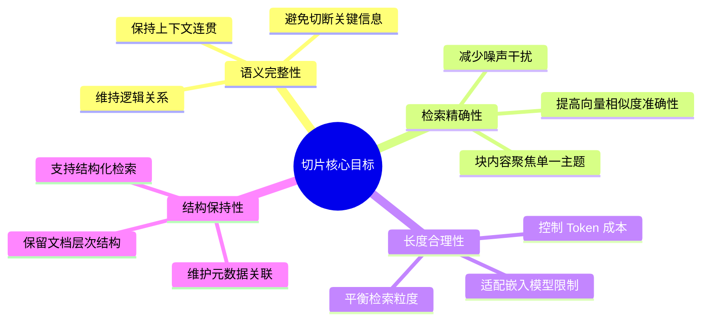
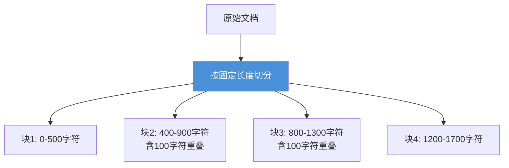
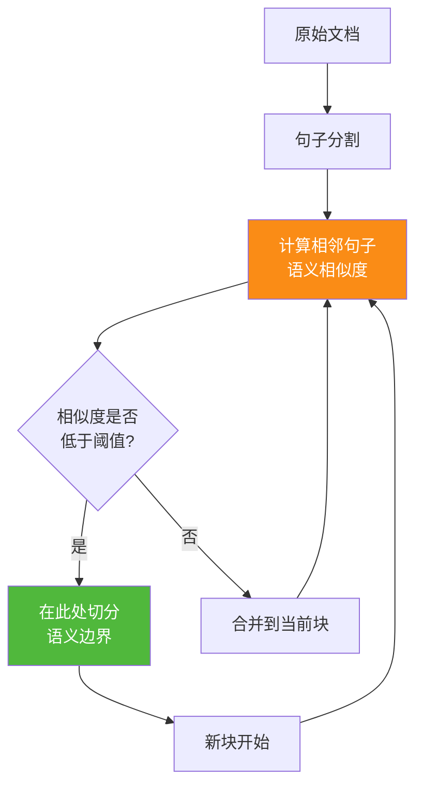
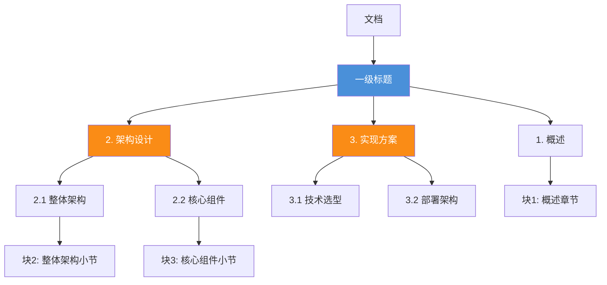
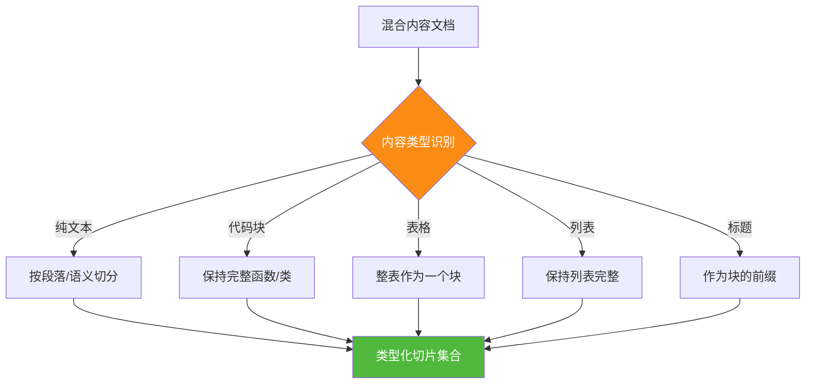
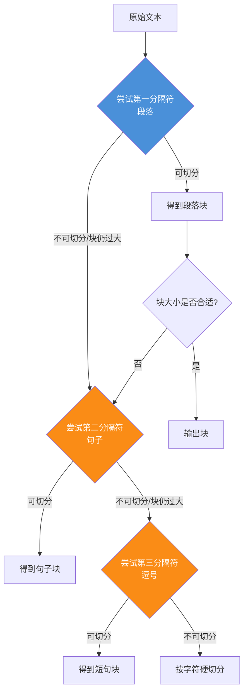
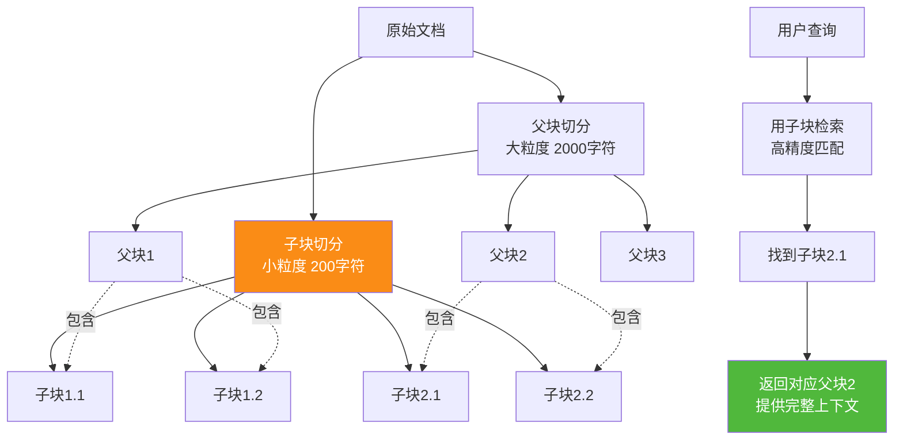
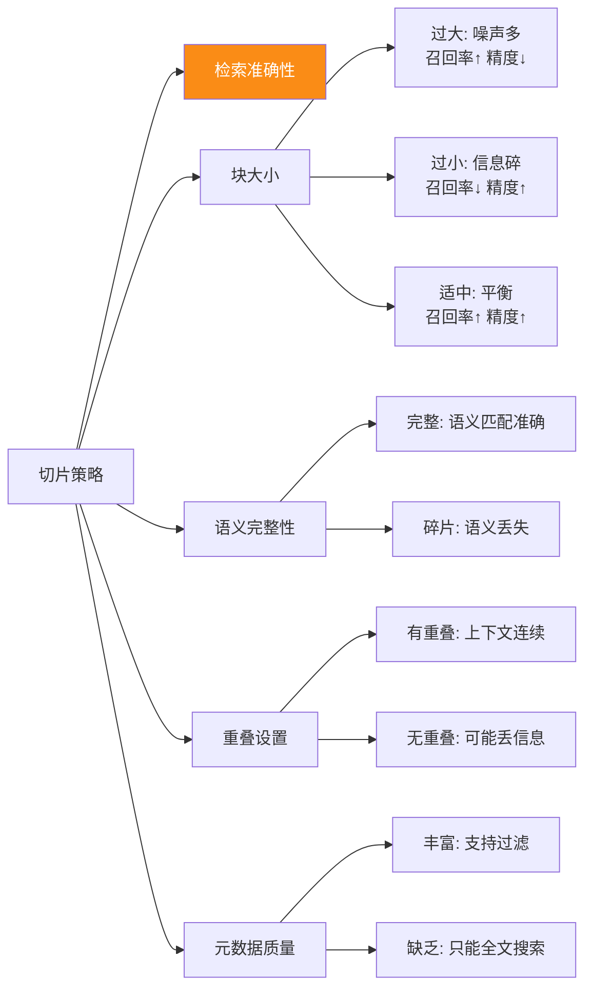
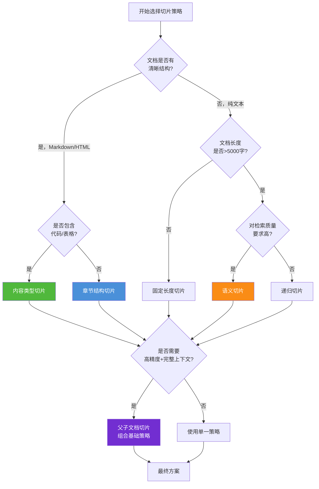
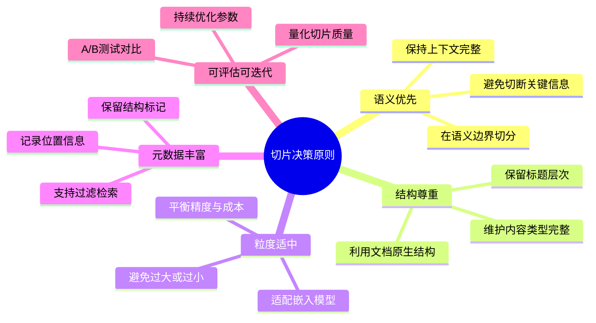

# RAG 文档切片策略深度解析

> **文档说明**：本文档系统阐述 RAG 系统中文档切片（Document Chunking）的各种策略，详细分析基于字符长度、语义相关性、章节结构、内容类型等不同维度切片方法的原理、适用场景、实施步骤与优缺点，并分析各策略对 RAG 检索准确性和生成质量的影响，提供实际应用中的策略选择与组合指导原则。

## 目录

- [一、引言：文档切片的重要性](#一引言文档切片的重要性)
- [二、基于字符长度的切片策略](#二基于字符长度的切片策略)
- [三、基于语义相关性的切片策略](#三基于语义相关性的切片策略)
- [四、基于章节结构的切片策略](#四基于章节结构的切片策略)
- [五、基于内容类型的切片策略](#五基于内容类型的切片策略)
- [六、高级切片策略](#六高级切片策略)
- [七、切片策略对 RAG 系统的影响](#七切片策略对-rag-系统的影响)
- [八、策略选择与组合指导原则](#八策略选择与组合指导原则)
- [九、完整实现示例](#九完整实现示例)
- [十、总结与最佳实践](#十总结与最佳实践)

---

## 一、引言：文档切片的重要性

### 1.1 为什么需要文档切片

在 RAG（检索增强生成）系统中，原始文档通常篇幅较长、内容复杂，无法直接用于检索和生成。文档切片是将长文档分割为合理大小的文本块（Chunk）的过程，这一环节直接决定了 RAG 系统的整体性能。


### 1.2 切片质量对 RAG 的影响

切片质量影响 RAG 系统的多个环节：

| 影响环节 | 切片过大 | 切片过小 | 理想切片 |
|---------|---------|---------|---------|
| **检索精度** | 噪声多，召回不相关内容 | 信息碎片化，语义不完整 | 语义完整且聚焦 |
| **上下文质量** | 冗余信息多，稀释重点 | 缺少背景，难以理解 | 包含完整上下文 |
| **Token 成本** | 消耗 Token 多，成本高 | 需要拼接多块，拼接复杂 | 适中且高效 |
| **生成质量** | 上下文噪声干扰生成 | 信息不足导致幻觉 | 提供精准依据 |
| **检索速度** | 向量维度大，检索慢 | 向量数量多，索引大 | 平衡速度与精度 |

### 1.3 切片策略的核心目标



### 1.4 文档定位

本文档是 `4RAG 检索增强生成` 系列的重要补充，专注于切片这一关键环节：

| 已有文档 | 侧重 | 本文档补充 |
|---------|------|-----------|
| `52RAG工作流程详解.md` | 切片作为预处理一环的概览 | 切片策略的深入对比与实现 |
| `54RAG系统功能模块详解.md` | 切片模块的功能描述 | 各类切片算法的原理与代码 |
| `55AdvancedRAG高级检索增强生成详解.md` | 高级 RAG 技术整体 | 切片环节的精细化优化 |

---

## 二、基于字符长度的切片策略

### 2.1 策略原理

基于字符长度的切片是最基础、最简单的策略，按固定字符数将文档均匀分割。这是所有切片策略的起点，也是生产环境中最常见的基线方案。

**核心思想**：将文档视为字符序列，按预设长度窗口滑动切分。



### 2.2 实施步骤

1. **确定块大小**：根据嵌入模型限制（通常 512-2048 Token）设定目标字符数
2. **设置重叠窗口**：相邻块之间保留一定重叠（通常 10%-20%），避免切断语义
3. **滑动切分**：从文档起始位置按步长滑动切分
4. **边界处理**：处理文档末尾不足一块的剩余内容

### 2.3 实现代码

```python
class FixedLengthChunker:
    """固定长度切片器"""
    
    def __init__(self, chunk_size: int = 500, overlap: int = 100):
        """
        Args:
            chunk_size: 每块字符数
            overlap: 相邻块重叠字符数
        """
        self.chunk_size = chunk_size
        self.overlap = overlap
        self.step = chunk_size - overlap  # 滑动步长
    
    def chunk(self, text: str) -> List[TextChunk]:
        """切分文档"""
        if len(text) <= self.chunk_size:
            return [TextChunk(
                content=text,
                start_pos=0,
                end_pos=len(text),
                chunk_index=0
            )]
        
        chunks = []
        start = 0
        idx = 0
        
        while start < len(text):
            # 截取一块
            end = min(start + self.chunk_size, len(text))
            chunk_content = text[start:end]
            
            chunks.append(TextChunk(
                content=chunk_content,
                start_pos=start,
                end_pos=end,
                chunk_index=idx,
                metadata={
                    "strategy": "fixed_length",
                    "chunk_size": self.chunk_size,
                    "overlap": self.overlap
                }
            ))
            
            # 滑动到下一位置
            start += self.step
            idx += 1
        
        return chunks
```

### 2.4 适用场景

| 场景 | 适用性 | 原因 |
|------|--------|------|
| **纯文本日志** | 高度适用 | 无结构，内容均匀 |
| **简单 FAQ 文档** | 适用 | 内容短小独立 |
| **批量处理流水线** | 适用 | 速度快，可并行 |
| **作为基线对比** | 适用 | 简单可控 |
| **结构化文档（PDF/HTML）** | 不推荐 | 破坏结构语义 |
| **代码文档** | 不推荐 | 可能切断函数 |

### 2.5 优缺点

| 维度 | 优点 | 缺点 |
|------|------|------|
| **实现难度** | 简单，几行代码 | - |
| **执行速度** | 极快，O(n) | - |
| **可预测性** | 块大小均匀，易于管理 | - |
| **语义完整性** | - | 经常切断句子、段落 |
| **上下文连贯** | 重叠部分提供部分上下文 | 仍可能丢失关键关联 |
| **检索精度** | - | 噪声多，主题分散 |

---

## 三、基于语义相关性的切片策略

### 3.1 策略原理

基于语义相关性的切片策略通过分析文本内容的语义连贯性来决定切分位置，旨在让每个文本块在语义上保持完整和聚焦。

**核心思想**：在语义边界（句子结束、话题转换）处切分，而非机械地按字符数切分。



### 3.2 语义边界检测方法

#### 3.2.1 基于句子分割

最基础的语义切片以句子为单位：

```python
import re
from typing import List

class SentenceSplitter:
    """句子分割器"""
    
    def split(self, text: str, language: str = "zh") -> List[str]:
        """按句子分割文本"""
        if language == "zh":
            # 中文句子边界
            pattern = r'[。！？；\n]+'
        else:
            # 英文句子边界
            pattern = r'[.!?]+\s+'
        
        # 分割并保留分隔符
        sentences = re.split(pattern, text)
        sentences = [s.strip() for s in sentences if s.strip()]
        
        return sentences
```

#### 3.2.2 基于嵌入相似度

通过计算相邻句子向量的相似度，识别语义转换点：

```python
import numpy as np
from sentence_transformers import SentenceTransformer

class SemanticBoundaryDetector:
    """语义边界检测器"""
    
    def __init__(self, model_name: str = "all-MiniLM-L6-v2"):
        self.model = SentenceTransformer(model_name)
    
    def detect_boundaries(self, sentences: List[str], 
                            threshold: float = 0.5) -> List[int]:
        """检测语义边界位置"""
        # 编码所有句子
        embeddings = self.model.encode(sentences)
        
        # 计算相邻句子的余弦相似度
        similarities = []
        for i in range(len(embeddings) - 1):
            sim = self._cosine_similarity(embeddings[i], embeddings[i + 1])
            similarities.append(sim)
        
        # 识别相似度骤降的位置（语义边界）
        boundaries = []
        for i, sim in enumerate(similarities):
            if sim < threshold:
                boundaries.append(i + 1)  # 边界在 i 和 i+1 之间
        
        return boundaries
    
    def _cosine_similarity(self, vec1: np.ndarray, vec2: np.ndarray) -> float:
        """计算余弦相似度"""
        dot = np.dot(vec1, vec2)
        norm = np.linalg.norm(vec1) * np.linalg.norm(vec2)
        return dot / norm if norm > 0 else 0
```

### 3.3 实施步骤

1. **句子分割**：将文档拆分为句子序列
2. **语义计算**：编码每个句子并计算相邻句子相似度
3. **边界识别**：识别相似度低于阈值的位置作为切分点
4. **块组装**：将相邻句子组合成块，直到达到目标大小或遇到边界

### 3.4 完整实现

```python
class SemanticChunker:
    """基于语义的切片器"""
    
    def __init__(self, model_name: str = "all-MiniLM-L6-v2",
                 similarity_threshold: float = 0.5,
                 max_chunk_size: int = 500,
                 min_chunk_size: int = 100):
        self.boundary_detector = SemanticBoundaryDetector(model_name)
        self.sentence_splitter = SentenceSplitter()
        self.similarity_threshold = similarity_threshold
        self.max_chunk_size = max_chunk_size
        self.min_chunk_size = min_chunk_size
    
    def chunk(self, text: str) -> List[TextChunk]:
        """语义切片"""
        # Step 1: 句子分割
        sentences = self.sentence_splitter.split(text)
        if len(sentences) <= 1:
            return [TextChunk(content=text, chunk_index=0)]
        
        # Step 2: 检测语义边界
        boundaries = self.boundary_detector.detect_boundaries(
            sentences, self.similarity_threshold
        )
        
        # Step 3: 基于边界组装块
        chunks = []
        current_sentences = []
        current_size = 0
        chunk_idx = 0
        
        for i, sentence in enumerate(sentences):
            current_sentences.append(sentence)
            current_size += len(sentence)
            
            # 检查是否应该切分
            should_split = False
            if i + 1 in boundaries and current_size >= self.min_chunk_size:
                should_split = True  # 语义边界 + 达到最小长度
            elif current_size >= self.max_chunk_size:
                should_split = True  # 达到最大长度
            
            if should_split:
                chunk_content = "".join(current_sentences)
                chunks.append(TextChunk(
                    content=chunk_content,
                    chunk_index=chunk_idx,
                    metadata={
                        "strategy": "semantic",
                        "sentence_count": len(current_sentences),
                        "boundary_detected": i + 1 in boundaries
                    }
                ))
                current_sentences = []
                current_size = 0
                chunk_idx += 1
        
        # 处理剩余内容
        if current_sentences:
            chunk_content = "".join(current_sentences)
            chunks.append(TextChunk(
                content=chunk_content,
                chunk_index=chunk_idx,
                metadata={"strategy": "semantic"}
            ))
        
        return chunks
```

### 3.5 适用场景

| 场景 | 适用性 | 原因 |
|------|--------|------|
| **长文章/博客** | 高度适用 | 话题转换自然 |
| **技术文档** | 适用 | 不同主题章节边界清晰 |
| **新闻内容** | 适用 | 段落语义独立 |
| **对话记录** | 适用 | 话题切换明显 |
| **实时处理** | 不推荐 | 需要嵌入计算，速度慢 |
| **超大规模数据** | 不推荐 | 计算成本高 |

### 3.6 优缺点

| 维度 | 优点 | 缺点 |
|------|------|------|
| **语义完整性** | 块内语义连贯 | - |
| **检索精度** | 主题聚焦，精度高 | - |
| **生成质量** | 上下文完整，幻觉少 | - |
| **计算成本** | - | 需嵌入模型，成本高 |
| **处理速度** | - | 比固定长度慢 10-50 倍 |
| **参数调优** | - | 阈值需根据数据调整 |

---

## 四、基于章节结构的切片策略

### 4.1 策略原理

基于章节结构的切片策略利用文档自身的层次结构（标题、章节、段落）进行切分，保留文档的逻辑组织。

**核心思想**：尊重文档的天然结构，在章节边界处切分。



### 4.2 Markdown 文档结构化切片

Markdown 文档具有清晰的标题层次，非常适合结构化切片：

```python
import re
from dataclasses import dataclass

@dataclass
class DocumentSection:
    """文档章节"""
    title: str
    level: int  # 标题层级
    content: str
    parent: str = None  # 父章节标题
    children: List[str] = None  # 子章节标题列表

class MarkdownStructureChunker:
    """Markdown 结构化切片器"""
    
    def __init__(self, max_section_length: int = 1000,
                 min_section_length: int = 100):
        self.max_section_length = max_section_length
        self.min_section_length = min_section_length
    
    def chunk(self, markdown_text: str) -> List[TextChunk]:
        """按章节结构切片"""
        # Step 1: 解析 Markdown 结构
        sections = self._parse_markdown_structure(markdown_text)
        
        # Step 2: 根据章节生成切片
        chunks = []
        chunk_idx = 0
        
        for section in sections:
            # 如果章节过长，进一步切分
            if len(section.content) > self.max_section_length:
                sub_chunks = self._split_long_section(section)
                for sub in sub_chunks:
                    sub.chunk_index = chunk_idx
                    chunks.append(sub)
                    chunk_idx += 1
            # 如果章节过短，与下一个合并
            elif len(section.content) < self.min_section_length:
                # 合并逻辑（简化示例）
                chunks.append(self._create_chunk(section, chunk_idx))
                chunk_idx += 1
            else:
                chunks.append(self._create_chunk(section, chunk_idx))
                chunk_idx += 1
        
        return chunks
    
    def _parse_markdown_structure(self, text: str) -> List[DocumentSection]:
        """解析 Markdown 标题结构"""
        lines = text.split('\n')
        sections = []
        current_section = None
        content_buffer = []
        
        # 标题正则
        header_pattern = re.compile(r'^(#{1,6})\s+(.+)$')
        
        for line in lines:
            match = header_pattern.match(line)
            if match:
                # 保存前一个章节
                if current_section:
                    current_section.content = '\n'.join(content_buffer)
                    sections.append(current_section)
                
                # 开始新章节
                level = len(match.group(1))
                title = match.group(2).strip()
                current_section = DocumentSection(
                    title=title,
                    level=level,
                    content=""
                )
                content_buffer = [line]  # 包含标题行
            else:
                content_buffer.append(line)
        
        # 保存最后一个章节
        if current_section:
            current_section.content = '\n'.join(content_buffer)
            sections.append(current_section)
        
        return sections
    
    def _split_long_section(self, section: DocumentSection) -> List[TextChunk]:
        """切分过长章节"""
        # 按段落切分
        paragraphs = section.content.split('\n\n')
        
        chunks = []
        current_content = f"## {section.title}\n\n"
        
        for para in paragraphs:
            if len(current_content) + len(para) > self.max_section_length:
                if len(current_content) > len(f"## {section.title}\n\n"):
                    chunks.append(TextChunk(
                        content=current_content,
                        metadata={
                            "strategy": "markdown_structure",
                            "section_title": section.title,
                            "section_level": section.level,
                            "split_reason": "max_length_exceeded"
                        }
                    ))
                current_content = f"## {section.title}（续）\n\n{para}"
            else:
                current_content += para + '\n\n'
        
        if current_content:
            chunks.append(TextChunk(
                content=current_content,
                metadata={
                    "strategy": "markdown_structure",
                    "section_title": section.title,
                    "section_level": section.level
                }
            ))
        
        return chunks
    
    def _create_chunk(self, section: DocumentSection, idx: int) -> TextChunk:
        """创建切片"""
        return TextChunk(
            content=section.content,
            chunk_index=idx,
            metadata={
                "strategy": "markdown_structure",
                "section_title": section.title,
                "section_level": section.level
            }
        )
```

### 4.3 适用场景

| 场景 | 适用性 | 原因 |
|------|--------|------|
| **技术文档** | 高度适用 | 标题层次清晰 |
| **产品手册** | 高度适用 | 章节结构完整 |
| **学术论文** | 适用 | 标准章节划分 |
| **法律文件** | 适用 | 条款结构明确 |
| **纯文本/日志** | 不适用 | 无结构信息 |
| **对话记录** | 不适用 | 无章节概念 |

### 4.4 优缺点

| 维度 | 优点 | 缺点 |
|------|------|------|
| **结构保留** | 完整保留文档层次 | - |
| **元数据丰富** | 切片带章节标题 | - |
| **可导航性** | 支持按章节检索 | - |
| **通用性** | - | 依赖文档格式 |
| **处理复杂度** | - | 需解析不同格式 |
| **长度均匀性** | - | 章节长度差异大 |

---

## 五、基于内容类型的切片策略

### 5.1 策略原理

基于内容类型的切片策略根据文档中不同内容元素（文本、表格、代码、图片说明）的特性采用不同的切分方式。

**核心思想**：不同类型的内容有不同的语义边界，应分别处理。



### 5.2 内容类型识别与处理

```python
import re
from enum import Enum

class ContentType(Enum):
    """内容类型枚举"""
    TEXT = "text"
    CODE = "code"
    TABLE = "table"
    LIST = "list"
    HEADING = "heading"
    QUOTE = "quote"
    IMAGE = "image"

class ContentTypeChunker:
    """基于内容类型的切片器"""
    
    def __init__(self, max_text_length: int = 500,
                 max_code_length: int = 1500):
        self.max_text_length = max_text_length
        self.max_code_length = max_code_length
    
    def chunk(self, text: str) -> List[TextChunk]:
        """按内容类型切片"""
        # Step 1: 识别内容块
        content_blocks = self._identify_content_blocks(text)
        
        # Step 2: 按类型分别处理
        chunks = []
        chunk_idx = 0
        
        for block in content_blocks:
            typed_chunks = self._process_by_type(block)
            for chunk in typed_chunks:
                chunk.chunk_index = chunk_idx
                chunks.append(chunk)
                chunk_idx += 1
        
        return chunks
    
    def _identify_content_blocks(self, text: str) -> List[ContentBlock]:
        """识别不同类型的内容块"""
        blocks = []
        lines = text.split('\n')
        i = 0
        
        while i < len(lines):
            line = lines[i]
            
            # 代码块
            if line.strip().startswith('```'):
                block, next_i = self._extract_code_block(lines, i)
                blocks.append(block)
                i = next_i
            # 表格
            elif '|' in line and i + 1 < len(lines) and '---' in lines[i + 1]:
                block, next_i = self._extract_table(lines, i)
                blocks.append(block)
                i = next_i
            # 标题
            elif line.strip().startswith('#'):
                blocks.append(ContentBlock(
                    type=ContentType.HEADING,
                    content=line,
                    start_line=i
                ))
                i += 1
            # 列表
            elif re.match(r'^[\s]*[-*+]\s', line) or re.match(r'^[\s]*\d+\.\s', line):
                block, next_i = self._extract_list(lines, i)
                blocks.append(block)
                i = next_i
            # 普通文本
            else:
                block, next_i = self._extract_text(lines, i)
                if block:
                    blocks.append(block)
                i = next_i
        
        return blocks
    
    def _extract_code_block(self, lines: List[str], start: int) -> tuple:
        """提取代码块"""
        content_lines = [lines[start]]
        i = start + 1
        while i < len(lines) and not lines[i].strip().startswith('```'):
            content_lines.append(lines[i])
            i += 1
        if i < len(lines):
            content_lines.append(lines[i])  # 结束的 ```
            i += 1
        
        return ContentBlock(
            type=ContentType.CODE,
            content='\n'.join(content_lines),
            start_line=start
        ), i
    
    def _extract_table(self, lines: List[str], start: int) -> tuple:
        """提取表格"""
        content_lines = [lines[start]]
        i = start + 1
        while i < len(lines) and '|' in lines[i]:
            content_lines.append(lines[i])
            i += 1
        
        return ContentBlock(
            type=ContentType.TABLE,
            content='\n'.join(content_lines),
            start_line=start
        ), i
    
    def _extract_list(self, lines: List[str], start: int) -> tuple:
        """提取列表"""
        content_lines = [lines[start]]
        i = start + 1
        list_pattern = re.compile(r'^[\s]*[-*+]\s|^[\s]*\d+\.\s')
        while i < len(lines) and (list_pattern.match(lines[i]) or lines[i].strip() == ''):
            content_lines.append(lines[i])
            i += 1
        
        return ContentBlock(
            type=ContentType.LIST,
            content='\n'.join(content_lines),
            start_line=start
        ), i
    
    def _extract_text(self, lines: List[str], start: int) -> tuple:
        """提取普通文本"""
        content_lines = []
        i = start
        while i < len(lines):
            line = lines[i]
            # 遇到特殊内容类型则停止
            if (line.strip().startswith('```') or 
                line.strip().startswith('#') or
                re.match(r'^[\s]*[-*+]\s', line) or
                re.match(r'^[\s]*\d+\.\s', line)):
                break
            content_lines.append(line)
            i += 1
        
        if not content_lines:
            return None, i
        
        return ContentBlock(
            type=ContentType.TEXT,
            content='\n'.join(content_lines),
            start_line=start
        ), i
    
    def _process_by_type(self, block: ContentBlock) -> List[TextChunk]:
        """按类型处理内容块"""
        if block.type == ContentType.CODE:
            # 代码块尽量保持完整
            return self._process_code(block)
        elif block.type == ContentType.TABLE:
            # 表格作为一个整体
            return [TextChunk(
                content=block.content,
                metadata={
                    "strategy": "content_type",
                    "content_type": "table",
                    "start_line": block.start_line
                }
            )]
        elif block.type == ContentType.LIST:
            # 列表保持完整
            return [TextChunk(
                content=block.content,
                metadata={
                    "strategy": "content_type",
                    "content_type": "list"
                }
            )]
        else:
            # 文本按长度切分
            return self._process_text(block)
    
    def _process_code(self, block: ContentBlock) -> List[TextChunk]:
        """处理代码块"""
        if len(block.content) <= self.max_code_length:
            return [TextChunk(
                content=block.content,
                metadata={
                    "strategy": "content_type",
                    "content_type": "code",
                    "complete": True
                }
            )]
        
        # 过长代码按函数/类边界切分
        # 简化实现：按函数定义切分
        chunks = []
        func_pattern = re.compile(r'^(def|class|function|func)\s+', re.MULTILINE)
        parts = func_pattern.split(block.content)
        
        for i, part in enumerate(parts):
            if part.strip():
                chunks.append(TextChunk(
                    content=part if i == 0 else f"```python\n{part}```",
                    metadata={
                        "strategy": "content_type",
                        "content_type": "code",
                        "complete": False,
                        "part_index": i
                    }
                ))
        
        return chunks
    
    def _process_text(self, block: ContentBlock) -> List[TextChunk]:
        """处理文本块"""
        if len(block.content) <= self.max_text_length:
            return [TextChunk(
                content=block.content,
                metadata={
                    "strategy": "content_type",
                    "content_type": "text"
                }
            )]
        
        # 按段落切分
        paragraphs = block.content.split('\n\n')
        chunks = []
        current = ""
        
        for para in paragraphs:
            if len(current) + len(para) > self.max_text_length:
                if current:
                    chunks.append(TextChunk(
                        content=current,
                        metadata={"strategy": "content_type", "content_type": "text"}
                    ))
                current = para
            else:
                current = current + '\n\n' + para if current else para
        
        if current:
            chunks.append(TextChunk(
                content=current,
                metadata={"strategy": "content_type", "content_type": "text"}
            ))
        
        return chunks
```

### 5.3 适用场景

| 场景 | 适用性 | 原因 |
|------|--------|------|
| **技术文档（含代码）** | 高度适用 | 代码块保持完整 |
| **数据报告（含表格）** | 高度适用 | 表格不被拆散 |
| **API 文档** | 高度适用 | 代码示例完整 |
| **混合内容文档** | 高度适用 | 各类型分别处理 |
| **纯文本小说** | 一般 | 无特殊内容类型 |
| **纯代码仓库** | 一般 | 可用专门代码切片 |

### 5.4 优缺点

| 维度 | 优点 | 缺点 |
|------|------|------|
| **内容完整性** | 代码、表格不被破坏 | - |
| **类型化检索** | 支持按类型过滤 | - |
| **生成质量** | 结构化内容便于引用 | - |
| **实现复杂度** | - | 需识别多种内容类型 |
| **通用性** | - | 针对特定格式 |
| **维护成本** | - | 规则较多 |

---

## 六、高级切片策略

### 6.1 递归切片策略

递归切片是 LangChain 默认推荐的策略，通过多层级分隔符递归切分，兼顾灵活性和语义完整性。

#### 6.1.1 原理



#### 6.1.2 实现

```python
class RecursiveChunker:
    """递归切片器"""
    
    def __init__(self, chunk_size: int = 500, overlap: int = 100,
                 separators: List[str] = None):
        self.chunk_size = chunk_size
        self.overlap = overlap
        
        # 默认分隔符优先级（从大到小）
        self.separators = separators or [
            "\n\n",   # 段落
            "\n",     # 行
            "。",     # 中文句号
            "！",     # 感叹号
            "？",     # 问号
            "；",     # 分号
            "，",     # 逗号
            " ",      # 空格
            ""        # 字符级
        ]
    
    def chunk(self, text: str) -> List[TextChunk]:
        """递归切片"""
        chunks = self._recursive_split(text, 0)
        
        # 添加重叠
        if self.overlap > 0:
            chunks = self._add_overlap(chunks)
        
        # 添加元数据
        for i, chunk in enumerate(chunks):
            chunk.chunk_index = i
            chunk.metadata = {
                "strategy": "recursive",
                "chunk_size": self.chunk_size,
                "overlap": self.overlap
            }
        
        return chunks
    
    def _recursive_split(self, text: str, level: int) -> List[str]:
        """递归分割"""
        # 如果文本已足够短，直接返回
        if len(text) <= self.chunk_size:
            return [text]
        
        # 如果已到最低层级，按字符硬切
        if level >= len(self.separators) - 1:
            return self._hard_split(text)
        
        separator = self.separators[level]
        
        if separator == "":
            return self._hard_split(text)
        
        # 按当前分隔符切分
        if separator in text:
            splits = text.split(separator)
            
            # 检查切分后是否都足够短
            if all(len(s) <= self.chunk_size for s in splits):
                # 合并过小的块
                return self._merge_small_chunks(splits, separator)
            else:
                # 对过大的块继续递归
                result = []
                for split in splits:
                    if len(split) > self.chunk_size:
                        result.extend(self._recursive_split(split, level + 1))
                    else:
                        result.append(split)
                return self._merge_small_chunks(result, separator)
        else:
            # 当前分隔符不存在，尝试下一层级
            return self._recursive_split(text, level + 1)
    
    def _merge_small_chunks(self, splits: List[str], separator: str) -> List[str]:
        """合并过小的块"""
        merged = []
        current = ""
        
        for split in splits:
            candidate = current + separator + split if current else split
            if len(candidate) <= self.chunk_size:
                current = candidate
            else:
                if current:
                    merged.append(current)
                current = split
        
        if current:
            merged.append(current)
        
        return merged
    
    def _hard_split(self, text: str) -> List[str]:
        """字符级硬切分"""
        chunks = []
        step = self.chunk_size - self.overlap
        for i in range(0, len(text), step):
            chunk = text[i:i + self.chunk_size]
            if chunk:
                chunks.append(chunk)
        return chunks
    
    def _add_overlap(self, chunks: List[str]) -> List[TextChunk]:
        """添加重叠"""
        if len(chunks) <= 1:
            return [TextChunk(content=c) for c in chunks]
        
        result = [TextChunk(content=chunks[0])]
        
        for i in range(1, len(chunks)):
            # 从前一块末尾取重叠部分
            prev_tail = chunks[i - 1][-self.overlap:] if len(chunks[i - 1]) > self.overlap else chunks[i - 1]
            # 拼接到当前块
            result.append(TextChunk(content=prev_tail + chunks[i]))
        
        return result
```

### 6.2 父子文档切片策略

父子文档切片（Parent-Document Chunking）将文档切分为不同粒度的块，检索时用小块匹配，生成时用大块提供上下文。



```python
class ParentDocumentChunker:
    """父子文档切片器"""
    
    def __init__(self, parent_size: int = 2000, child_size: int = 200,
                 parent_overlap: int = 200, child_overlap: int = 50):
        self.parent_size = parent_size
        self.child_size = child_size
        self.parent_overlap = parent_overlap
        self.child_overlap = child_overlap
    
    def chunk(self, text: str) -> Dict[str, List]:
        """切分为父子文档"""
        # Step 1: 切分父块
        parent_chunks = self._split_to_size(text, self.parent_size, 
                                              self.parent_overlap)
        
        # Step 2: 为每个父块切分子块
        child_parent_mapping = {}  # 子块ID -> 父块ID
        all_child_chunks = []
        
        for parent_idx, parent_text in enumerate(parent_chunks):
            child_chunks = self._split_to_size(parent_text, self.child_size,
                                                 self.child_overlap)
            
            for child_idx, child_text in enumerate(child_chunks):
                child_id = f"parent_{parent_idx}_child_{child_idx}"
                child_parent_mapping[child_id] = parent_idx
                all_child_chunks.append({
                    "id": child_id,
                    "content": child_text,
                    "parent_id": parent_idx
                })
        
        return {
            "parent_chunks": parent_chunks,
            "child_chunks": all_child_chunks,
            "mapping": child_parent_mapping
        }
    
    def _split_to_size(self, text: str, size: int, overlap: int) -> List[str]:
        """按大小切分"""
        if len(text) <= size:
            return [text]
        
        chunks = []
        step = size - overlap
        for i in range(0, len(text), step):
            chunk = text[i:i + size]
            if chunk:
                chunks.append(chunk)
        return chunks
```

### 6.3 滑动窗口 + 语义增强策略

结合滑动窗口的简单性和语义检测的准确性：

```python
class SlidingSemanticChunker:
    """滑动窗口 + 语义增强切片器"""
    
    def __init__(self, window_size: int = 500, step_size: int = 300,
                 semantic_model: str = "all-MiniLM-L6-v2"):
        self.window_size = window_size
        self.step_size = step_size
        self.embedder = SentenceTransformer(semantic_model)
    
    def chunk(self, text: str) -> List[TextChunk]:
        """滑动窗口切分 + 语义边界调整"""
        # Step 1: 滑动窗口初始切分
        raw_chunks = []
        for i in range(0, len(text), self.step_size):
            raw_chunk = text[i:i + self.window_size]
            if raw_chunk:
                raw_chunks.append({
                    "content": raw_chunk,
                    "start": i,
                    "end": min(i + self.window_size, len(text))
                })
        
        # Step 2: 语义边界调整
        adjusted_chunks = []
        for raw in raw_chunks:
            adjusted = self._adjust_to_semantic_boundary(raw, text)
            adjusted_chunks.append(adjusted)
        
        # Step 3: 去重重叠部分
        final_chunks = self._deduplicate_overlap(adjusted_chunks)
        
        return final_chunks
    
    def _adjust_to_semantic_boundary(self, raw_chunk: Dict, 
                                        full_text: str) -> TextChunk:
        """调整到最近的语义边界"""
        content = raw_chunk["content"]
        start = raw_chunk["start"]
        end = raw_chunk["end"]
        
        # 寻找结束位置附近最近的句子边界
        boundary_chars = "。！？.\n"
        search_range = 50  # 在前后50字符内搜索
        
        # 向后搜索边界
        for i in range(end, min(end + search_range, len(full_text))):
            if full_text[i] in boundary_chars:
                end = i + 1
                content = full_text[start:end]
                break
        
        # 向前搜索边界（如果块开始位置在句子中间）
        for i in range(start, max(start - search_range, 0), -1):
            if full_text[i] in boundary_chars:
                start = i + 1
                content = full_text[start:end]
                break
        
        return TextChunk(
            content=content,
            start_pos=start,
            end_pos=end,
            metadata={"strategy": "sliding_semantic"}
        )
```

---

## 七、切片策略对 RAG 系统的影响

### 7.1 对检索准确性的影响



### 7.2 对生成质量的影响

| 切片策略 | 生成质量影响 | 原因 |
|---------|------------|------|
| **固定长度（小）** | 信息不足，易幻觉 | 上下文不完整 |
| **固定长度（大）** | 噪声多，可能跑题 | 包含不相关信息 |
| **语义切片** | 质量高，回答准确 | 上下文聚焦且完整 |
| **结构化切片** | 质量高，可引用 | 保留章节信息 |
| **内容类型切片** | 代码/表格引用准确 | 结构化内容完整 |
| **父子文档** | 上下文最完整 | 检索精准+上下文充足 |

### 7.3 性能指标对比

| 策略 | 检索精度 | 生成质量 | 处理速度 | Token 成本 |
|------|---------|---------|---------|-----------|
| **固定长度** | ⭐⭐ | ⭐⭐ | ⭐⭐⭐⭐⭐ | ⭐⭐⭐ |
| **语义切片** | ⭐⭐⭐⭐ | ⭐⭐⭐⭐ | ⭐⭐ | ⭐⭐⭐⭐ |
| **章节结构** | ⭐⭐⭐⭐ | ⭐⭐⭐⭐ | ⭐⭐⭐ | ⭐⭐⭐ |
| **内容类型** | ⭐⭐⭐⭐ | ⭐⭐⭐⭐⭐ | ⭐⭐⭐ | ⭐⭐⭐⭐ |
| **递归切片** | ⭐⭐⭐ | ⭐⭐⭐ | ⭐⭐⭐⭐ | ⭐⭐⭐ |
| **父子文档** | ⭐⭐⭐⭐⭐ | ⭐⭐⭐⭐⭐ | ⭐⭐ | ⭐⭐ |

---

## 八、策略选择与组合指导原则

### 8.1 选择决策树



### 8.2 按文档类型推荐

| 文档类型 | 推荐策略 | 备选策略 | 说明 |
|---------|---------|---------|------|
| **技术文档（MD）** | 章节结构 + 内容类型 | 递归切片 | 保留标题和代码块 |
| **学术论文** | 章节结构 | 语义切片 | 按章节/段落切分 |
| **FAQ 问答对** | 固定长度（小） | - | 每条作为一个块 |
| **法律文件** | 章节结构 | 内容类型 | 按条款切分 |
| **产品手册** | 章节结构 | 递归切片 | 按功能模块切分 |
| **新闻文章** | 语义切片 | 递归切片 | 按话题切分 |
| **代码文档** | 内容类型 | - | 代码块完整保留 |
| **对话记录** | 语义切片 | 固定长度 | 按话题切分 |
| **日志文件** | 固定长度 | - | 按时间窗口切分 |

### 8.3 按应用场景推荐

| 应用场景 | 推荐策略 | 原因 |
|---------|---------|------|
| **企业知识库** | 章节结构 + 父子文档 | 高精度检索 + 完整上下文 |
| **客服系统** | 语义切片 | 话题聚焦，快速响应 |
| **代码助手** | 内容类型切片 | 代码完整，可引用 |
| **学术研究** | 章节结构 | 按论文结构组织 |
| **实时问答** | 固定长度 | 速度优先 |
| **高精度问答** | 语义切片 + 父子文档 | 精度+上下文双保障 |

### 8.4 组合策略指导

#### 8.4.1 常用组合方案


#### 8.4.2 组合实现示例

```python
class HybridChunker:
    """混合切片器 - 组合多种策略"""
    
    def __init__(self, config: ChunkerConfig):
        self.structure_chunker = MarkdownStructureChunker(
            max_section_length=config.max_section_length
        )
        self.content_chunker = ContentTypeChunker(
            max_text_length=config.max_text_length
        )
        self.recursive_chunker = RecursiveChunker(
            chunk_size=config.chunk_size,
            overlap=config.overlap
        )
    
    def chunk(self, text: str, doc_format: str = "markdown") -> List[TextChunk]:
        """混合切片"""
        # Step 1: 结构化切分（如果适用）
        if doc_format == "markdown":
            sections = self.structure_chunker.chunk(text)
        else:
            # 非结构化文档用递归切片
            sections = self.recursive_chunker.chunk(text)
            return sections
        
        # Step 2: 对每个章节按内容类型细化
        final_chunks = []
        chunk_idx = 0
        
        for section in sections:
            # 如果章节内容较长，按内容类型细化
            if len(section.content) > 1000:
                typed_chunks = self.content_chunker.chunk(section.content)
                for chunk in typed_chunks:
                    chunk.chunk_index = chunk_idx
                    chunk.metadata.update(section.metadata or {})
                    final_chunks.append(chunk)
                    chunk_idx += 1
            else:
                # 短章节保持完整
                section.chunk_index = chunk_idx
                final_chunks.append(section)
                chunk_idx += 1
        
        return final_chunks
```

### 8.5 参数调优建议

| 参数 | 推荐范围 | 调优原则 |
|------|---------|---------|
| **chunk_size** | 300-1000 字符 | 根据嵌入模型限制和内容密度调整 |
| **overlap** | chunk_size 的 10%-20% | 保证上下文连续性，不宜过大 |
| **similarity_threshold** | 0.4-0.6 | 值越低切分越少，值越高切分越多 |
| **min_chunk_size** | 50-100 字符 | 避免过小碎片 |
| **max_section_length** | 1000-2000 字符 | 避免单章节过大 |

---

## 九、完整实现示例

### 9.1 统一切片框架

```python
from enum import Enum
from typing import List, Dict, Optional

class ChunkingStrategy(Enum):
    """切片策略枚举"""
    FIXED_LENGTH = "fixed_length"
    SEMANTIC = "semantic"
    MARKDOWN_STRUCTURE = "markdown_structure"
    CONTENT_TYPE = "content_type"
    RECURSIVE = "recursive"
    PARENT_DOCUMENT = "parent_document"

class UnifiedChunker:
    """统一切片框架"""
    
    def __init__(self):
        self.chunkers = {
            ChunkingStrategy.FIXED_LENGTH: FixedLengthChunker(),
            ChunkingStrategy.SEMANTIC: SemanticChunker(),
            ChunkingStrategy.MARKDOWN_STRUCTURE: MarkdownStructureChunker(),
            ChunkingStrategy.CONTENT_TYPE: ContentTypeChunker(),
            ChunkingStrategy.RECURSIVE: RecursiveChunker(),
            ChunkingStrategy.PARENT_DOCUMENT: ParentDocumentChunker()
        }
    
    def chunk(self, text: str, strategy: ChunkingStrategy,
              **kwargs) -> List[TextChunk]:
        """按指定策略切片"""
        chunker = self._get_chunker(strategy, **kwargs)
        return chunker.chunk(text)
    
    def _get_chunker(self, strategy: ChunkingStrategy, **kwargs):
        """获取配置好的切片器"""
        chunker = self.chunkers.get(strategy)
        if not chunker:
            raise ValueError(f"Unknown strategy: {strategy}")
        
        # 应用配置
        if "chunk_size" in kwargs and hasattr(chunker, 'chunk_size'):
            chunker.chunk_size = kwargs["chunk_size"]
        if "overlap" in kwargs and hasattr(chunker, 'overlap'):
            chunker.overlap = kwargs["overlap"]
        
        return chunker
    
    def auto_select(self, text: str, doc_format: str = None) -> ChunkingStrategy:
        """自动选择策略"""
        # 简单的自动选择逻辑
        if doc_format == "markdown" or text.count('#') > 3:
            return ChunkingStrategy.MARKDOWN_STRUCTURE
        elif '```' in text or '|' in text:
            return ChunkingStrategy.CONTENT_TYPE
        elif len(text) > 5000:
            return ChunkingStrategy.SEMANTIC
        else:
            return ChunkingStrategy.RECURSIVE


# 使用示例
chunker = UnifiedChunker()

# 自动选择
strategy = chunker.auto_select(long_text, doc_format="markdown")
chunks = chunker.chunk(long_text, strategy, chunk_size=500, overlap=100)

# 手动指定
chunks = chunker.chunk(text, ChunkingStrategy.PARENT_DOCUMENT,
                       parent_size=2000, child_size=200)
```

### 9.2 切片质量评估

```python
class ChunkQualityEvaluator:
    """切片质量评估器"""
    
    def evaluate(self, chunks: List[TextChunk]) -> QualityReport:
        """评估切片质量"""
        metrics = {
            "total_chunks": len(chunks),
            "avg_length": self._avg_length(chunks),
            "length_variance": self._length_variance(chunks),
            "avg_completeness": self._avg_completeness(chunks),
            "topic_focus": self._topic_focus_score(chunks),
            "overlap_ratio": self._overlap_ratio(chunks)
        }
        
        # 综合评分
        score = self._calculate_score(metrics)
        
        return QualityReport(
            metrics=metrics,
            overall_score=score,
            recommendations=self._get_recommendations(metrics)
        )
    
    def _avg_length(self, chunks: List[TextChunk]) -> float:
        return sum(len(c.content) for c in chunks) / len(chunks) if chunks else 0
    
    def _length_variance(self, chunks: List[TextChunk]) -> float:
        lengths = [len(c.content) for c in chunks]
        if not lengths:
            return 0
        avg = sum(lengths) / len(lengths)
        return sum((l - avg) ** 2 for l in lengths) / len(lengths)
    
    def _avg_completeness(self, chunks: List[TextChunk]) -> float:
        """评估语义完整性（简化版）"""
        complete_count = 0
        for chunk in chunks:
            # 检查是否以完整句子结束
            if chunk.content.rstrip().endswith(('。', '！', '？', '.')):
                complete_count += 1
        return complete_count / len(chunks) if chunks else 0
```

---

## 十、总结与最佳实践

### 10.1 策略对比总览

| 策略 | 原理 | 适用场景 | 优点 | 缺点 |
|------|------|---------|------|------|
| **固定长度** | 按字符数均匀切分 | 纯文本、日志 | 简单快速 | 破坏语义 |
| **语义切片** | 按语义边界切分 | 长文章、博客 | 语义完整 | 计算成本高 |
| **章节结构** | 按文档层次切分 | 技术文档、手册 | 保留结构 | 依赖格式 |
| **内容类型** | 按内容元素分类处理 | 含代码/表格文档 | 类型完整 | 实现复杂 |
| **递归切片** | 多层级分隔符递归 | 通用场景 | 灵活适应 | 参数调优 |
| **父子文档** | 检索小块+上下文大块 | 高精度需求 | 精度+上下文 | 存储成本高 |

### 10.2 最佳实践建议

1. **先分析文档特征**：了解文档格式、结构、内容类型，再选择策略
2. **从简单策略开始**：先用固定长度或递归切片作为基线，再逐步优化
3. **重视元数据**：无论哪种策略，都应保留章节标题、位置等元数据
4. **合理设置重叠**：10%-20% 的重叠可以有效避免信息丢失
5. **评估切片质量**：使用质量评估器检查切片效果，持续迭代
6. **考虑组合策略**：复杂文档可采用多种策略组合，发挥各自优势
7. **关注端到端效果**：切片策略应与检索和生成环节协同优化

### 10.3 关键决策原则



### 10.4 与系列文档的关系

| 文档 | 视角 | 本文档补充 |
|------|------|-----------|
| `52RAG工作流程详解.md` | 切片作为预处理一环 | 切片策略的深入实现 |
| `54RAG系统功能模块详解.md` | 切片模块功能描述 | 各类切片算法代码 |
| `55AdvancedRAG高级检索增强生成详解.md` | 高级 RAG 整体技术 | 切片环节的精细化 |

---

> **核心结论**：文档切片没有"一刀切"的最优策略，最佳实践是根据文档特征、应用场景和性能要求，选择合适的单一策略或组合策略。语义完整性和检索精度是两个核心目标，应在二者之间找到平衡点。
