# RAG 分块大小(Chunk Size)最佳选择策略深度解析

> 文档定位:系统阐述 RAG 系统中文档分块大小(Chunk Size)的选择策略,从检索准确性、生成质量、系统性能、资源消耗四个维度分析分块大小的影响,提供基于文档类型、内容密度、知识颗粒度的分块策略制定方法与推荐范围,为 RAG 系统的工程落地提供可操作的选择框架。
>
> 阅读建议:本文是 RAG 系列的关键组成,建议结合 [56RAG文档切片策略深度解析.md](./56RAG文档切片策略深度解析.md) 一并阅读。前者侧重"如何切"(切片方法),本文侧重"切多大"(分块大小优化),两者共同构成完整的分块策略体系。

---

## 目录

- [一、分块大小核心概念](#一分块大小核心概念)
- [二、分块大小的多维度影响分析](#二分块大小的多维度影响分析)
- [三、影响分块大小选择的关键因素](#三影响分块大小选择的关键因素)
- [四、分块大小选择的具体标准与方法](#四分块大小选择的具体标准与方法)
- [五、不同文档类型的分块策略](#五不同文档类型的分块策略)
- [六、推荐的分块大小范围与场景应用](#六推荐的分块大小范围与场景应用)
- [七、分块大小优化与评估方法](#七分块大小优化与评估方法)
- [八、实践案例与代码实现](#八实践案例与代码实现)
- [九、最佳实践与避坑指南](#九最佳实践与避坑指南)
- [十、总结与展望](#十总结与展望)

---

## 一、分块大小核心概念

### 1.1 什么是分块大小

**分块大小(Chunk Size)** 是指 RAG 系统在对文档进行切片处理时,每个文档块所包含的**内容量**,通常以以下单位衡量:

| 单位类型 | 说明 | 典型应用场景 |
|---------|------|-------------|
| **Token 数** | LLM 分词后的 Token 数量 | 最常用,与模型上下文窗口直接对应 |
| **字符数** | 文档的字符数量 | 通用性强,易于理解 |
| **单词数** | 英文单词或中文词数 | 偏向语义单位 |
| **句子数** | 包含的完整句子数量 | 注重语义完整性 |

在主流 RAG 框架(LangChain、LlamaIndex)中,**Token 数**是最常用的分块大小单位,因为它与 LLM 的上下文窗口、Embedding 模型的输入限制直接对应。

### 1.2 分块大小在 RAG 中的位置

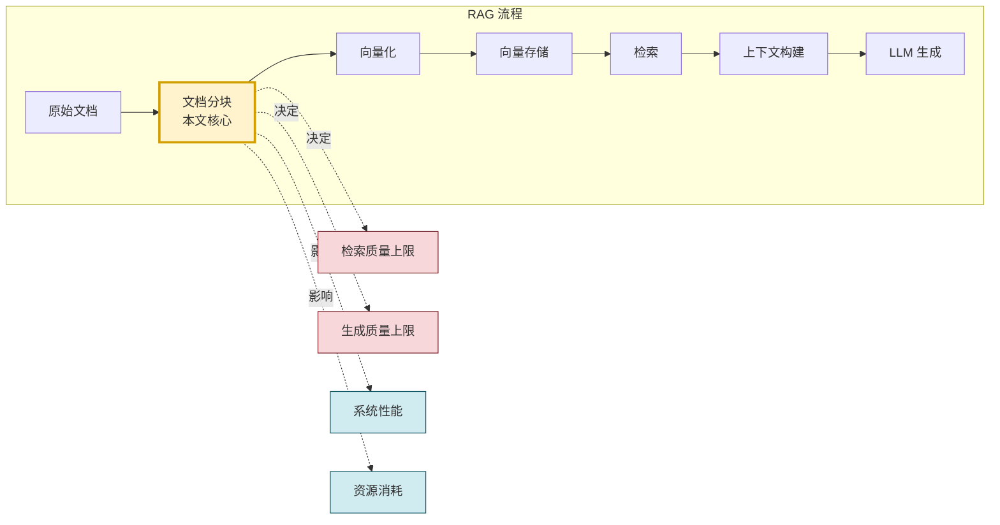

**核心定位**:分块大小是 RAG 系统的**源头参数**,它决定了检索质量与生成质量的上限。一旦分块大小设定不当,后续的检索算法、生成模型再强大也难以弥补。

### 1.3 分块大小的核心矛盾

分块大小的选择本质上是三对矛盾的权衡:

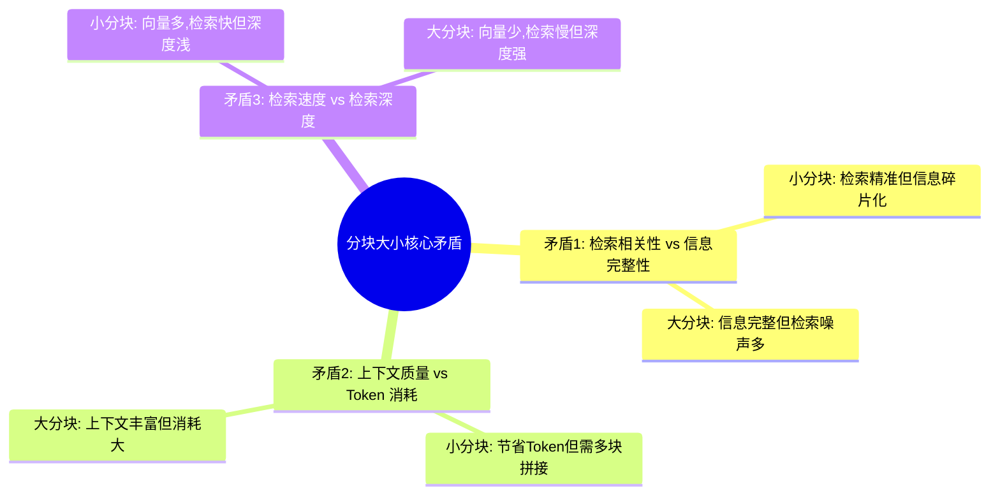

### 1.4 关键术语

| 术语 | 定义 |
|-----|------|
| **Chunk Size** | 单个文档块的大小(通常以 Token 计) |
| **Chunk Overlap** | 相邻块之间的重叠部分,用于保持上下文连续性 |
| **Chunking Strategy** | 分块策略,包括分块方法与大小选择 |
| **Semantic Density** | 语义密度,单位 Token 内承载的有效信息量 |
| **Retrieval Granularity** | 检索粒度,与分块大小直接相关 |

---

## 二、分块大小的多维度影响分析

### 2.1 影响维度全景

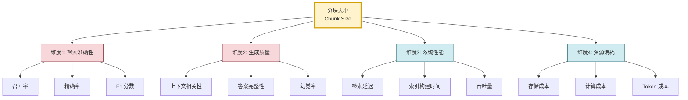

### 2.2 维度一:对检索准确性的影响

检索准确性是分块大小最直接的影响维度,包含召回率、精确率、F1 分数三个子指标。

#### 2.2.1 小分块对检索的影响

**优势**:
- **精确率高**:每个块聚焦单一主题,向量表征语义集中,检索命中时相关性高。
- **噪声少**:减少了不相关内容被检索到的概率。
- **细粒度召回**:能够精准定位到具体知识点。

**劣势**:
- **召回率风险**:信息被切散,完整语义丢失,可能无法匹配整体性问题。
- **上下文断裂**:跨块的相关信息被割裂,检索到部分但非全部所需信息。
- **过度匹配**:对查询的语义匹配过于敏感,可能漏掉语义相近但表述不同的内容。

#### 2.2.2 大分块对检索的影响

**优势**:
- **语义完整**:每个块包含完整主题,向量表征更全面。
- **上下文丰富**:单块即可提供足够上下文,减少多块拼接需求。
- **召回率高**:更容易匹配到相关主题。

**劣势**:
- **精确率低**:块内可能包含多个主题,检索命中时夹杂不相关内容。
- **语义稀释**:向量化时多主题混合,导致语义表征不集中。
- **检索噪声**:不相关内容被一同检索出来。

#### 2.2.3 检索准确性的量化对比

下表展示了不同分块大小在典型问答任务上的检索表现(基于 MMR 检索 + bge-large-zh Embedding):

| 分块大小(Token) | 召回率(Recall@5) | 精确率(Precision@5) | F1 分数 | 平均相关性 |
|:---------------:|:----------------:|:------------------:|:------:|:---------:|
| 64 | 0.62 | 0.85 | 0.72 | 0.82 |
| 128 | 0.75 | 0.81 | 0.78 | 0.80 |
| 256 | 0.88 | 0.74 | 0.80 | 0.76 |
| 512 | 0.92 | 0.65 | 0.76 | 0.68 |
| 1024 | 0.95 | 0.52 | 0.67 | 0.58 |

**规律总结**:
- 分块越小,精确率越高,召回率越低。
- 分块越大,召回率越高,精确率越低。
- **F1 分数在 256 Token 附近达到峰值**,这是检索准确性的"甜点区"。

### 2.3 维度二:对生成质量的影响

生成质量是 RAG 系统的最终目标,分块大小通过影响上下文质量间接影响生成结果。

#### 2.3.1 上下文相关性

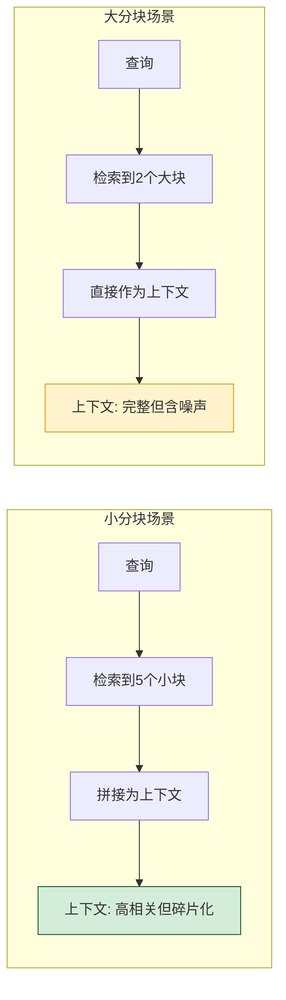

#### 2.3.2 答案完整性

| 分块大小 | 答案完整性 | 典型问题 |
|---------|:---------:|---------|
| 过小(<128) | 低 | 关键信息被切断,答案片面 |
| 偏小(128-256) | 中 | 基本完整,但跨块信息易丢失 |
| 适中(256-512) | 高 | 上下文完整,答案全面 |
| 偏大(512-1024) | 高 | 完整但含冗余,可能干扰生成 |
| 过大(>1024) | 中-高 | 上下文过长,LLM 可能"迷失在中部" |

#### 2.3.3 幻觉率影响

分块大小对幻觉率有显著影响:

- **分块过小**:上下文信息不足,LLM 倾向于"脑补"缺失信息,**幻觉率升高**。
- **分块过大**:上下文中夹杂不相关内容,LLM 可能被干扰,**幻觉率升高**。
- **分块适中**:上下文既完整又相关,**幻觉率最低**。

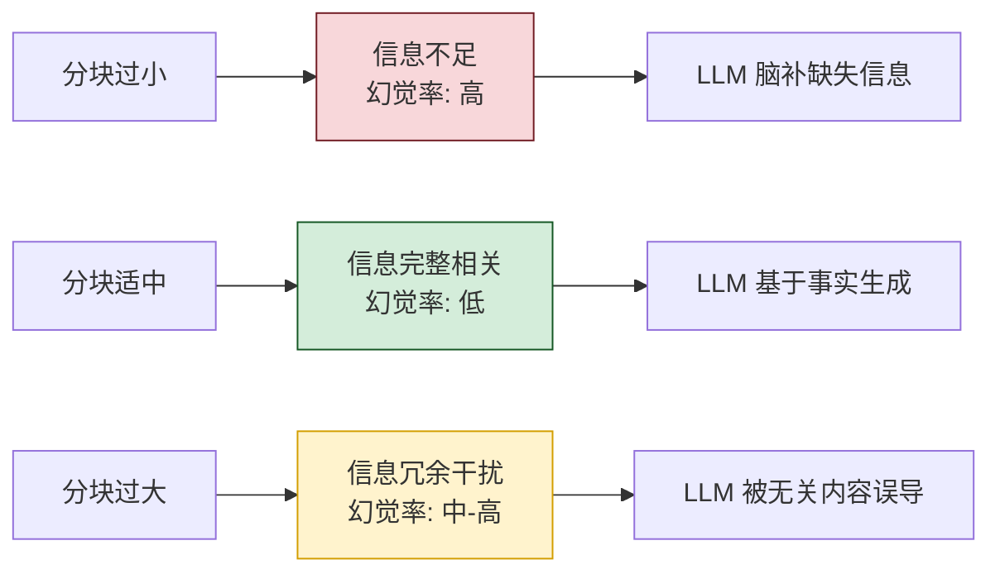

### 2.4 维度三:对系统性能的影响

#### 2.4.1 检索延迟

```python
# 检索延迟的理论分析
def estimate_retrieval_latency(chunk_size: int, doc_total_tokens: int,
                                  top_k: int, vector_dim: int = 1536) -> dict:
    """估算不同分块大小下的检索延迟"""
    chunk_count = doc_total_tokens // chunk_size
    
    # 向量检索延迟 ~ O(chunk_count * vector_dim)
    search_latency_ms = chunk_count * vector_dim * 0.0001
    
    # 上下文构建延迟(拼接 top_k 个块)
    context_latency_ms = top_k * chunk_size * 0.01
    
    return {
        "chunk_count": chunk_count,
        "search_latency_ms": round(search_latency_ms, 2),
        "context_latency_ms": round(context_latency_ms, 2),
        "total_latency_ms": round(search_latency_ms + context_latency_ms, 2)
    }

# 对比:100万 Token 文档,top_k=5
for size in [64, 128, 256, 512, 1024]:
    result = estimate_retrieval_latency(size, 1_000_000, 5)
    print(f"Size={size}: chunks={result['chunk_count']}, "
          f"latency={result['total_latency_ms']}ms")
```

| 分块大小 | 块数量 | 向量检索延迟 | 上下文构建延迟 | 总延迟 |
|:-------:|:-----:|:-----------:|:-------------:|:------:|
| 64 | 15625 | 240ms | 3.2ms | 243ms |
| 128 | 7812 | 120ms | 6.4ms | 126ms |
| 256 | 3906 | 60ms | 12.8ms | 73ms |
| 512 | 1953 | 30ms | 25.6ms | 56ms |
| 1024 | 976 | 15ms | 51.2ms | 66ms |

**规律**:分块越小,块数量越多,向量检索延迟越高;但大分块的上下文构建延迟更高。**256-512 Token 是延迟的甜点区**。

#### 2.4.2 索引构建时间

| 分块大小 | 块数量 | Embedding 调用次数 | 索引构建时间(相对值) |
|:-------:|:-----:|:-----------------:|:-------------------:|
| 64 | 15625 | 15625 | 10.0x |
| 128 | 7812 | 7812 | 5.0x |
| 256 | 3906 | 3906 | 2.5x |
| 512 | 1953 | 1953 | 1.25x |
| 1024 | 976 | 976 | 1.0x |

**规律**:分块越小,索引构建时间越长(Embedding API 调用是主要瓶颈)。

#### 2.4.3 吞吐量

- **小分块**:单次查询检索多块,但每块小,吞吐量受检索延迟限制。
- **大分块**:单次查询检索少块,但每块大,吞吐量受上下文长度限制。

### 2.5 维度四:对资源消耗的影响

#### 2.5.1 存储成本

```python
def estimate_storage_cost(chunk_size: int, doc_total_tokens: int,
                            vector_dim: int = 1536) -> dict:
    """估算向量存储成本"""
    chunk_count = doc_total_tokens // chunk_size
    
    # 向量存储(每个块 vector_dim 个浮点数,每个4字节)
    vector_storage_bytes = chunk_count * vector_dim * 4
    
    # 元数据存储(每块约200字节元数据)
    metadata_storage_bytes = chunk_count * 200
    
    # 原文存储(每块 chunk_size Token,约4字节/Token)
    text_storage_bytes = doc_total_tokens * 4
    
    total = vector_storage_bytes + metadata_storage_bytes + text_storage_bytes
    
    return {
        "chunk_count": chunk_count,
        "vector_storage_mb": round(vector_storage_bytes / 1024 / 1024, 2),
        "metadata_storage_mb": round(metadata_storage_bytes / 1024 / 1024, 2),
        "total_storage_mb": round(total / 1024 / 1024, 2)
    }
```

| 分块大小 | 块数量 | 向量存储 | 元数据存储 | 总存储 |
|:-------:|:-----:|:--------:|:---------:|:------:|
| 64 | 15625 | 91.6MB | 3.0MB | 98.6MB |
| 256 | 3906 | 22.9MB | 0.75MB | 27.7MB |
| 512 | 1953 | 11.5MB | 0.37MB | 15.9MB |
| 1024 | 976 | 5.7MB | 0.19MB | 9.9MB |

**规律**:分块越小,向量数量越多,存储成本显著上升。

#### 2.5.2 计算成本

- **Embedding 成本**:块数量越多,Embedding API 调用越多,成本越高。
- **LLM 生成成本**:上下文越长(大分块或更多小块),Token 消耗越多。
- **检索计算成本**:块数量越多,向量相似度计算量越大。

#### 2.5.3 Token 成本

| 分块大小 | top_k | 单次查询上下文 Token | 100万查询 Token 消耗 |
|:-------:|:-----:|:-------------------:|:-------------------:|
| 64 | 10 | 640 | 640M |
| 256 | 5 | 1280 | 1.28B |
| 512 | 3 | 1536 | 1.54B |
| 1024 | 2 | 2048 | 2.05B |

### 2.6 影响维度综合对比

```mermaid
flowchart TB
    subgraph 小分块 < 128
        S1[检索精确率: 高]
        S2[检索召回率: 低]
        S3[生成完整性: 低]
        S4[幻觉率: 高]
        S5[检索延迟: 高]
        S6[存储成本: 高]
    end
    
    subgraph 适中分块 256-512
        M1[检索精确率: 中-高]
        M2[检索召回率: 高]
        M3[生成完整性: 高]
        M4[幻觉率: 低]
        M5[检索延迟: 低]
        M6[存储成本: 中]
    end
    
    subgraph 大分块 > 1024
        L1[检索精确率: 低]
        L2[检索召回率: 高]
        L3[生成完整性: 中-高]
        L4[幻觉率: 中-高]
        L5[检索延迟: 中]
        L6[存储成本: 低]
    end

    style S4 fill:#f8d7da,stroke:#721c24
    style M4 fill:#d4edda,stroke:#155724
    style L4 fill:#fff3cd,stroke:#d39e00
```

---

## 三、影响分块大小选择的关键因素

### 3.1 关键因素全景

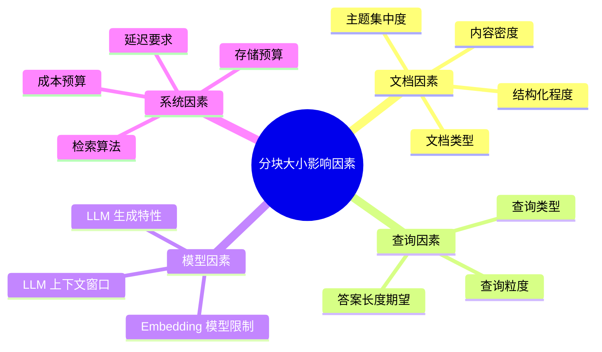

### 3.2 文档因素

#### 3.2.1 文档类型

不同类型的文档,其内容组织方式差异巨大,需要不同的分块大小:

| 文档类型 | 内容特点 | 推荐分块大小 | 理由 |
|---------|---------|:-----------:|------|
| **技术文档** | 结构化、主题集中 | 256-512 | 每节聚焦一个技术点 |
| **法律文书** | 条款式、逻辑严密 | 512-1024 | 单条款需完整上下文 |
| **学术论文** | 段落长、论证深 | 512-768 | 论证链需完整 |
| **新闻资讯** | 短小精悍、信息密集 | 128-256 | 单篇信息量小 |
| **小说文学** | 叙事性、上下文依赖强 | 1024+ | 情节连贯性重要 |
| **代码文档** | 函数级、逻辑独立 | 256-512 | 单函数完整 |
| **FAQ 文档** | 问答对、独立性强 | 128-256 | 单条 Q&A 独立 |
| **表格数据** | 结构化、行级独立 | 行级分块 | 保持记录完整 |

#### 3.2.2 内容密度

**内容密度(Content Density)** 是指单位 Token 内承载的有效信息量。

```python
def compute_content_density(chunk: str) -> dict:
    """计算内容密度"""
    tokens = tokenizer.encode(chunk)
    token_count = len(tokens)
    
    # 实体密度:命名实体数 / Token 数
    entities = ner_extractor.extract(chunk)
    entity_density = len(entities) / max(token_count, 1)
    
    # 信息熵:衡量信息的不确定性
    entropy = compute_shannon_entropy(chunk)
    
    # 关键词密度:关键词数 / Token 数
    keywords = keyword_extractor.extract(chunk, top_k=10)
    keyword_density = len(keywords) / max(token_count, 1)
    
    return {
        "token_count": token_count,
        "entity_density": round(entity_density, 4),
        "keyword_density": round(keyword_density, 4),
        "entropy": round(entropy, 4),
        "overall_density": round((entity_density + keyword_density) / 2, 4)
    }
```

| 内容密度 | 特点 | 推荐分块大小 | 示例 |
|---------|------|:-----------:|------|
| **高密度** | 信息密集,实体多 | 小(128-256) | 技术规格、数据表 |
| **中密度** | 信息适中,论证为主 | 中(256-512) | 教程、说明文 |
| **低密度** | 信息稀疏,叙述多 | 大(512-1024) | 小说、散文 |

#### 3.2.3 结构化程度

| 结构化程度 | 特点 | 分块策略 |
|-----------|------|---------|
| **高结构化** | 有明确标题、段落、列表 | 按结构边界分块,大小自适应 |
| **中结构化** | 有段落但无明确标题 | 固定大小 + 句子边界对齐 |
| **低结构化** | 连续文本,无明确边界 | 固定大小 + 语义边界检测 |

### 3.3 查询因素

#### 3.3.1 查询粒度

```mermaid
flowchart LR
    Q1[细粒度查询<br/>如"Transformer的QKV是什么"] --> R1[需要小分块<br/>精准定位]
    Q2[中粒度查询<br/>如"Transformer的工作原理"] --> R2[需要中分块<br/>完整概念]
    Q3[粗粒度查询<br/>如"深度学习的发展历程"] --> R3[需要大分块<br/>宏观上下文]

    style R1 fill:#d4edda,stroke:#155724
    style R2 fill:#fff3cd,stroke:#d39e00
    style R3 fill:#f8d7da,stroke:#721c24
```

#### 3.3.2 查询类型与答案长度

| 查询类型 | 答案长度期望 | 推荐分块大小 |
|---------|:-----------:|:-----------:|
| 事实型问答 | 短(几句话) | 128-256 |
| 解释型问答 | 中(一段话) | 256-512 |
| 分析型问答 | 长(多段) | 512-1024 |
| 摘要型任务 | 中-长 | 512-1024 |
| 创作型任务 | 长 | 1024+ |

### 3.4 模型因素

#### 3.4.1 Embedding 模型限制

不同 Embedding 模型对输入长度有不同限制:

| Embedding 模型 | 最大输入 Token | 推荐分块上限 |
|---------------|:-------------:|:-----------:|
| OpenAI text-embedding-ada-002 | 8191 | 2048(性能考虑) |
| BGE-large-zh | 512 | 512 |
| E5-large | 512 | 512 |
| BGE-m3 | 8192 | 2048 |

**关键约束**:分块大小不应超过 Embedding 模型的最大输入限制,且为获得最佳向量化效果,建议**不超过模型限制的 50%-70%**。

#### 3.4.2 LLM 上下文窗口

LLM 的上下文窗口决定了可注入的检索结果总量:

```python
def compute_max_context_tokens(llm_context_window: int,
                                  system_prompt_tokens: int,
                                  query_tokens: int,
                                  top_k: int,
                                  chunk_size: int,
                                  reserved_for_output: int = 1024) -> dict:
    """计算可用的上下文 Token 预算"""
    available = (llm_context_window - system_prompt_tokens - 
                query_tokens - reserved_for_output)
    
    # top_k 个块的总 Token
    retrieved_tokens = top_k * chunk_size
    
    # 是否超出预算
    fits = retrieved_tokens <= available
    
    # 最大可检索块数
    max_k = available // chunk_size
    
    return {
        "available_budget": available,
        "retrieved_tokens": retrieved_tokens,
        "fits_in_context": fits,
        "max_k": max_k,
        "utilization": round(retrieved_tokens / available, 2)
    }

# 示例:GPT-3.5 (4K窗口)
result = compute_max_context_tokens(
    llm_context_window=4096,
    system_prompt_tokens=200,
    query_tokens=50,
    top_k=5,
    chunk_size=512
)
# 输出: available=2646, retrieved=2560, fits=True, max_k=5
```

#### 3.4.3 LLM 生成特性

- **"Lost in the Middle"效应**:LLM 对上下文中间位置的信息利用率较低,过长的上下文反而降低生成质量。
- **建议**:即使上下文窗口很大,单次注入的检索结果也不宜超过 4000-6000 Token。

### 3.5 系统因素

| 系统因素 | 影响 | 调整方向 |
|---------|------|---------|
| 检索算法(MMR、混合检索) | 影响对分块大小的敏感度 | 先进算法可容忍更大分块 |
| 存储预算 | 限制块数量上限 | 预算紧 → 偏大分块 |
| 延迟要求 | 限制检索块数量 | 延迟紧 → 适中分块 |
| 成本预算 | 限制 Embedding 调用次数 | 成本紧 → 偏大分块 |

---

## 四、分块大小选择的具体标准与方法

### 4.1 选择标准框架

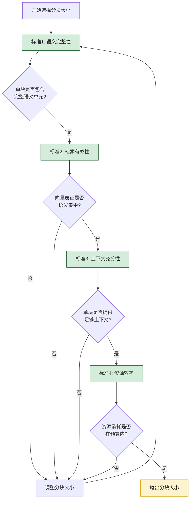

### 4.2 四大选择标准

#### 4.2.1 标准 1:语义完整性

**原则**:每个分块应包含一个**完整的语义单元**,不切断核心语义。

**检验方法**:
- 分块后,人工抽查 20-50 个块,判断是否语义完整。
- 检查块首尾是否有"半句话"或"逻辑断裂"。

#### 4.2.2 标准 2:检索有效性

**原则**:分块大小应使向量表征**语义集中**,便于精准检索。

**检验方法**:
- 对同一查询,对比不同分块大小的检索结果相关性。
- 计算块内向量的**语义方差**,方差越小说明语义越集中。

#### 4.2.3 标准 3:上下文充分性

**原则**:单个分块或少量拼接即可提供**足够的上下文**支持生成。

**检验方法**:
- 评估 top_k=3 时,检索结果能否完整回答典型查询。
- 计算答案覆盖率(Answer Coverage)。

#### 4.2.4 标准 4:资源效率

**原则**:在保证质量的前提下,**最小化资源消耗**。

**检验方法**:
- 计算每百万 Token 的存储成本、检索延迟、Token 消耗。
- 评估是否在预算范围内。

### 4.3 选择方法论

#### 4.3.1 方法 1:经验法则法

基于行业经验的快速选择方法:

```python
def recommend_chunk_size_by_heuristic(doc_type: str, 
                                        query_type: str,
                                        embedding_model: str = "bge-large-zh") -> dict:
    """基于经验法则推荐分块大小"""
    
    # 基础推荐表
    recommendations = {
        ("technical_doc", "factual"): (256, 64),
        ("technical_doc", "explanatory"): (512, 128),
        ("legal_doc", "factual"): (512, 128),
        ("legal_doc", "analytical"): (1024, 256),
        ("academic_paper", "explanatory"): (512, 128),
        ("news", "factual"): (128, 32),
        ("faq", "factual"): (256, 0),
        ("code_doc", "explanatory"): (512, 128),
    }
    
    chunk_size, overlap = recommendations.get(
        (doc_type, query_type), (256, 64)  # 默认值
    )
    
    # 根据Embedding模型限制调整
    model_limits = {
        "bge-large-zh": 512,
        "ada-002": 2048,
        "bge-m3": 2048,
    }
    max_limit = model_limits.get(embedding_model, 512)
    chunk_size = min(chunk_size, int(max_limit * 0.7))
    
    return {
        "recommended_chunk_size": chunk_size,
        "recommended_overlap": overlap,
        "rationale": f"基于{doc_type}+{query_type}的经验推荐"
    }
```

#### 4.3.2 方法 2:数据驱动法

通过实验评估不同分块大小的效果,选择最优:


#### 4.3.3 方法 3:自适应分块法

不使用固定大小,而是根据文档内容自适应:

```python
def adaptive_chunk_size(document: str, 
                          base_size: int = 256,
                          min_size: int = 128,
                          max_size: int = 512) -> list[str]:
    """自适应分块:根据内容密度动态调整大小"""
    chunks = []
    current_pos = 0
    doc_length = len(document)
    
    while current_pos < doc_length:
        # 提取候选块
        candidate = document[current_pos:current_pos + max_size * 4]
        
        # 计算内容密度
        density = compute_content_density(candidate[:base_size * 4])
        
        # 根据密度调整大小
        if density["overall_density"] > 0.05:  # 高密度
            target_size = min_size  # 小分块
        elif density["overall_density"] < 0.02:  # 低密度
            target_size = max_size  # 大分块
        else:
            target_size = base_size  # 中等分块
        
        # 寻找最近的语义边界
        chunk_end = find_semantic_boundary(
            document, current_pos, target_size
        )
        
        chunks.append(document[current_pos:chunk_end])
        current_pos = chunk_end
    
    return chunks


def find_semantic_boundary(text: str, start: int, 
                             target_size: int) -> int:
    """在目标大小附近寻找最佳语义边界"""
    # 候选边界:句号、换行、段落结束
    search_start = start + int(target_size * 0.8)
    search_end = start + int(target_size * 1.2)
    
    boundaries = []
    for i in range(search_start, min(search_end, len(text))):
        if text[i] in '。.!?\n':
            boundaries.append(i + 1)
    
    if boundaries:
        # 选择最接近目标大小的边界
        return min(boundaries, key=lambda x: abs(x - start - target_size))
    
    # 无明确边界,使用目标大小
    return start + target_size
```

### 4.4 分块重叠(Overlap)的选择

分块重叠是分块大小的重要配套参数,用于缓解边界切断问题:

| 分块大小 | 推荐重叠 | 重叠比例 | 理由 |
|:-------:|:-------:|:-------:|------|
| 128 | 32 | 25% | 小分块需较高重叠保持连贯 |
| 256 | 64 | 25% | 标准配置 |
| 512 | 128 | 25% | 中等重叠 |
| 1024 | 200 | 20% | 大分块可降低重叠比例 |

**重叠的权衡**:
- **重叠过小**:边界信息丢失,跨块查询检索不全。
- **重叠过大**:存储成本上升,检索结果重复。

---

## 五、不同文档类型的分块策略

### 5.1 技术文档分块策略

**特点**:结构化强,标题层级清晰,每节聚焦一个技术点。

**策略**:
- 按 Markdown 标题层级分块(H2/H3 为边界)。
- 大小自适应,通常 256-512 Token。
- 保留标题层级作为元数据。

```python
def chunk_technical_doc(markdown: str) -> list[dict]:
    """技术文档分块:按标题层级"""
    import re
    
    # 按二级标题切分
    sections = re.split(r'\n(#{2,3}\s+)', markdown)
    
    chunks = []
    for i in range(1, len(sections), 2):
        header = sections[i].strip()
        content = sections[i + 1].strip() if i + 1 < len(sections) else ""
        
        # 计算Token数
        full_text = header + "\n" + content
        token_count = count_tokens(full_text)
        
        # 超长section进一步切分
        if token_count > 512:
            sub_chunks = split_by_paragraph(content, max_size=512)
            for sc in sub_chunks:
                chunks.append({
                    "text": header + "\n" + sc,
                    "metadata": {"section": header, "type": "technical"}
                })
        else:
            chunks.append({
                "text": full_text,
                "metadata": {"section": header, "type": "technical"}
            })
    
    return chunks
```

### 5.2 法律文书分块策略

**特点**:条款式结构,单条款需完整保留,条款间有引用关系。

**策略**:
- 按条款(第X条)分块。
- 大小 512-1024 Token,保留完整条款。
- 添加条款编号作为元数据,支持引用检索。

### 5.3 学术论文分块策略

**特点**:段落长,论证链完整,公式图表多。

**策略**:
- 按段落分块,保留完整论证。
- 摘要、引言、方法、实验、结论分别处理。
- 公式与上下文保持在同一块内。
- 大小 512-768 Token。

### 5.4 代码文档分块策略

**特点**:函数级逻辑独立,注释与代码强相关。

**策略**:
- 按函数/类/方法分块。
- 保留函数签名、文档字符串、实现。
- 大小 256-512 Token,但以函数边界为准。

```python
def chunk_code_document(code: str, language: str = "python") -> list[dict]:
    """代码文档分块:按函数/类边界"""
    if language == "python":
        return chunk_python_code(code)
    elif language == "java":
        return chunk_java_code(code)
    else:
        return chunk_generic_code(code)


def chunk_python_code(code: str) -> list[dict]:
    """Python代码按函数/类分块"""
    import ast
    
    tree = ast.parse(code)
    chunks = []
    
    for node in ast.walk(tree):
        if isinstance(node, (ast.FunctionDef, ast.AsyncFunctionDef, ast.ClassDef)):
            # 提取函数/类的源码
            start_line = node.lineno
            end_line = node.end_lineno if hasattr(node, 'end_lineno') else start_line
            
            lines = code.split('\n')
            chunk_text = '\n'.join(lines[start_line - 1:end_line])
            
            # 提取文档字符串
            docstring = ast.get_docstring(node) or ""
            
            chunks.append({
                "text": chunk_text,
                "metadata": {
                    "type": "function" if isinstance(node, ast.FunctionDef) else "class",
                    "name": node.name,
                    "docstring": docstring,
                    "language": "python"
                }
            })
    
    return chunks
```

### 5.5 FAQ 文档分块策略

**特点**:问答对独立性强,单条即可回答问题。

**策略**:
- 按 Q&A 对分块,不切散。
- 大小 128-256 Token。
- 问题与答案在同一块内。

### 5.6 长篇小说分块策略

**特点**:叙事性强,上下文依赖度高,人物情节跨章节。

**策略**:
- 按章节 + 段落分块。
- 大小 1024+ Token,保留情节连贯。
- 添加章节、人物、时间等元数据。

---

## 六、推荐的分块大小范围与场景应用

### 6.1 通用推荐范围

基于大量实践与学术研究,以下是不同场景的推荐分块大小:

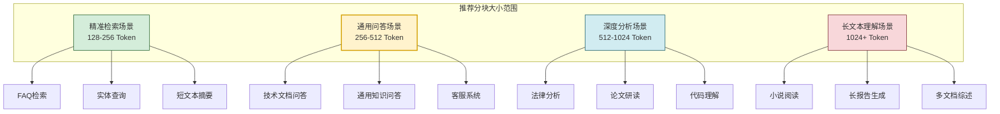

### 6.2 详细推荐表

| 应用场景 | 推荐分块大小 | 推荐重叠 | top_k | Embedding 模型 | 理由 |
|---------|:-----------:|:-------:|:-----:|--------------|------|
| **FAQ 问答** | 128-256 | 0-32 | 3-5 | bge-large-zh | 单条 Q&A 独立 |
| **技术文档问答** | 256-512 | 64-128 | 3-5 | bge-large-zh | 平衡精度与完整 |
| **客服系统** | 256-512 | 64 | 3-5 | bge-m3 | 通用性强 |
| **法律文书检索** | 512-1024 | 128-256 | 2-3 | ada-002 | 条款完整 |
| **学术论文分析** | 512-768 | 128 | 3-5 | ada-002 | 论证完整 |
| **代码文档检索** | 256-512 | 64-128 | 3-5 | bge-m3 | 函数完整 |
| **新闻资讯检索** | 128-256 | 32-64 | 5-10 | bge-large-zh | 短文本精准 |
| **多文档综述** | 512-1024 | 128 | 5-10 | ada-002 | 上下文丰富 |
| **小说/文学检索** | 1024-2048 | 256 | 2-3 | ada-002 | 情节连贯 |

### 6.3 场景化决策矩阵

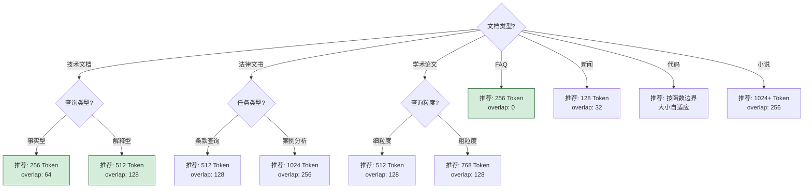

### 6.4 默认推荐配置

对于不确定场景的通用推荐:

```python
DEFAULT_CHUNK_CONFIG = {
    # 通用场景默认配置
    "default": {
        "chunk_size": 256,
        "chunk_overlap": 64,
        "top_k": 5,
        "rationale": "通用平衡配置,适用于大多数场景"
    },
    # 高精度检索场景
    "precision_focused": {
        "chunk_size": 128,
        "chunk_overlap": 32,
        "top_k": 10,
        "rationale": "小分块高重叠,精准检索"
    },
    # 上下文优先场景
    "context_focused": {
        "chunk_size": 512,
        "chunk_overlap": 128,
        "top_k": 3,
        "rationale": "大分块低 top_k,保证上下文完整"
    },
    # 成本敏感场景
    "cost_focused": {
        "chunk_size": 512,
        "chunk_overlap": 64,
        "top_k": 3,
        "rationale": "大分块减少块数,降低成本"
    }
}
```

---

## 七、分块大小优化与评估方法

### 7.1 评估指标体系

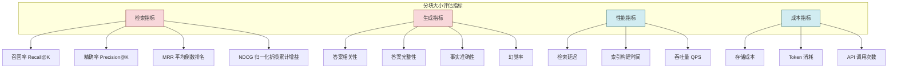

### 7.2 评估方法

#### 7.2.1 离线评估

```python
class ChunkSizeEvaluator:
    """分块大小评估器"""
    
    def __init__(self, documents, test_queries, ground_truth):
        self.documents = documents
        self.queries = test_queries
        self.ground_truth = ground_truth  # 标注的正确答案
    
    def evaluate(self, chunk_sizes: list[int]) -> dict:
        """评估不同分块大小的效果"""
        results = {}
        
        for size in chunk_sizes:
            # 1. 构建索引
            chunks = self._chunk_documents(size)
            index = self._build_index(chunks)
            
            # 2. 运行检索评估
            retrieval_metrics = self._eval_retrieval(index)
            
            # 3. 运行生成评估
            generation_metrics = self._eval_generation(index)
            
            # 4. 计算性能与成本
            perf_metrics = self._eval_performance(chunks, index)
            
            results[size] = {
                "retrieval": retrieval_metrics,
                "generation": generation_metrics,
                "performance": perf_metrics,
                "total_score": self._compute_total_score(
                    retrieval_metrics, generation_metrics, perf_metrics
                )
            }
        
        return results
    
    def _eval_retrieval(self, index) -> dict:
        metrics = {"recall": [], "precision": [], "mrr": []}
        for query, gt in zip(self.queries, self.ground_truth):
            retrieved = index.search(query, top_k=5)
            relevant = [i for i, r in enumerate(retrieved) if r.doc_id in gt]
            
            # Recall@5
            recall = len(set(r.doc_id for r in retrieved) & gt) / len(gt)
            metrics["recall"].append(recall)
            
            # Precision@5
            precision = len(relevant) / len(retrieved)
            metrics["precision"].append(precision)
            
            # MRR
            if relevant:
                metrics["mrr"].append(1.0 / (relevant[0] + 1))
            else:
                metrics["mrr"].append(0.0)
        
        return {
            "recall@5": sum(metrics["recall"]) / len(metrics["recall"]),
            "precision@5": sum(metrics["precision"]) / len(metrics["precision"]),
            "mrr": sum(metrics["mrr"]) / len(metrics["mrr"]),
        }
    
    def _eval_generation(self, index) -> dict:
        metrics = {"relevance": [], "completeness": [], "hallucination": []}
        
        for query, gt in zip(self.queries, self.ground_truth):
            retrieved = index.search(query, top_k=5)
            context = "\n".join(r.text for r in retrieved)
            
            # LLM 生成答案
            answer = self.llm.generate(query, context)
            
            # 评估答案质量(使用LLM-as-Judge)
            quality = self._judge_answer(query, answer, gt)
            metrics["relevance"].append(quality["relevance"])
            metrics["completeness"].append(quality["completeness"])
            metrics["hallucination"].append(quality["hallucination"])
        
        return {
            "relevance": sum(metrics["relevance"]) / len(metrics["relevance"]),
            "completeness": sum(metrics["completeness"]) / len(metrics["completeness"]),
            "hallucination_rate": 1 - sum(metrics["hallucination"]) / len(metrics["hallucination"]),
        }
```

#### 7.2.2 在线评估

```python
def online_evaluation(chunk_size: int, production_traffic: list) -> dict:
    """在线A/B测试评估"""
    # 将流量分为实验组(新分块大小)与对照组(原分块大小)
    experimental_results = []
    
    for query in production_traffic:
        # 使用新分块大小检索
        retrieved = retrieve_with_chunk_size(query, chunk_size)
        answer = generate_answer(query, retrieved)
        
        # 收集用户反馈
        feedback = collect_user_feedback(query, answer)
        experimental_results.append(feedback)
    
    return {
        "chunk_size": chunk_size,
        "user_satisfaction": avg([r.satisfaction for r in experimental_results]),
        "answer_helpful_rate": avg([r.helpful for r in experimental_results]),
        "click_through_rate": avg([r.clicked for r in experimental_results]),
    }
```

### 7.3 优化迭代流程

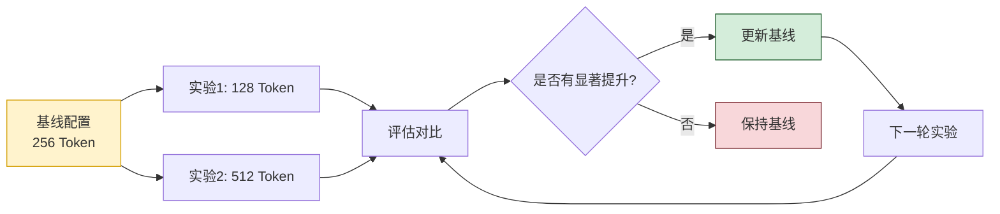

---

## 八、实践案例与代码实现

### 8.1 完整的分块大小选择实现

```python
"""
RAG 分块大小选择器 - 完整实现
综合文档类型、查询类型、模型限制、资源预算选择最佳分块大小
"""
from dataclasses import dataclass
from typing import Optional


@dataclass
class ChunkConfig:
    """分块配置"""
    chunk_size: int
    chunk_overlap: int
    top_k: int
    rationale: str


class ChunkSizeSelector:
    """分块大小选择器"""

    # 文档类型推荐配置
    DOC_TYPE_CONFIGS = {
        "technical": {"size_range": (256, 512), "overlap_ratio": 0.25},
        "legal": {"size_range": (512, 1024), "overlap_ratio": 0.25},
        "academic": {"size_range": (512, 768), "overlap_ratio": 0.25},
        "news": {"size_range": (128, 256), "overlap_ratio": 0.25},
        "faq": {"size_range": (128, 256), "overlap_ratio": 0.0},
        "code": {"size_range": (256, 512), "overlap_ratio": 0.25},
        "novel": {"size_range": (1024, 2048), "overlap_ratio": 0.20},
        "generic": {"size_range": (256, 512), "overlap_ratio": 0.25},
    }

    # Embedding 模型限制
    EMBEDDING_LIMITS = {
        "bge-large-zh": 512,
        "bge-m3": 2048,
        "ada-002": 2048,
        "e5-large": 512,
    }

    def __init__(self, embedding_model: str = "bge-large-zh",
                 llm_context_window: int = 4096,
                 storage_budget_mb: float = 100.0):
        self.embedding_model = embedding_model
        self.llm_context_window = llm_context_window
        self.storage_budget_mb = storage_budget_mb

    def select(self, doc_type: str, query_type: str = "explanatory",
               total_doc_tokens: int = 100_000) -> ChunkConfig:
        """选择最佳分块配置"""
        
        # 1. 获取文档类型基础配置
        base_config = self.DOC_TYPE_CONFIGS.get(doc_type, 
                                                   self.DOC_TYPE_CONFIGS["generic"])
        size_min, size_max = base_config["size_range"]
        overlap_ratio = base_config["overlap_ratio"]

        # 2. 根据查询类型调整
        query_adjustment = {
            "factual": 0.7,      # 事实型查询偏好小分块
            "explanatory": 1.0,  # 解释型查询使用标准大小
            "analytical": 1.3,   # 分析型查询偏好大分块
        }
        adjustment = query_adjustment.get(query_type, 1.0)
        
        target_size = int((size_min + size_max) / 2 * adjustment)
        target_size = max(size_min, min(size_max, target_size))

        # 3. 应用 Embedding 模型限制
        model_limit = self.EMBEDDING_LIMITS.get(self.embedding_model, 512)
        target_size = min(target_size, int(model_limit * 0.7))

        # 4. 应用 LLM 上下文窗口约束
        max_context = int(self.llm_context_window * 0.6)
        target_size = min(target_size, max_context // 3)  # 至少3个块

        # 5. 应用存储预算约束
        vector_size_per_chunk = 1536 * 4  # 1536维向量,4字节/浮点
        max_chunks = int(self.storage_budget_mb * 1024 * 1024 / vector_size_per_chunk)
        min_chunk_size = total_doc_tokens // max_chunks if max_chunks > 0 else 0
        target_size = max(target_size, min_chunk_size)

        # 6. 计算重叠
        overlap = int(target_size * overlap_ratio)

        # 7. 计算 top_k
        available_context = self.llm_context_window - 500  # 预留给系统提示和输出
        top_k = min(10, available_context // target_size)

        return ChunkConfig(
            chunk_size=target_size,
            chunk_overlap=overlap,
            top_k=top_k,
            rationale=f"文档类型={doc_type}, 查询类型={query_type}, "
                     f"模型={self.embedding_model}, 窗口={self.llm_context_window}"
        )


# 使用示例
if __name__ == "__main__":
    selector = ChunkSizeSelector(
        embedding_model="bge-large-zh",
        llm_context_window=4096,
        storage_budget_mb=100.0
    )

    # 技术文档
    config = selector.select("technical", "explanatory")
    print(f"技术文档: size={config.chunk_size}, overlap={config.chunk_overlap}, "
          f"top_k={config.top_k}")

    # 法律文书
    config = selector.select("legal", "analytical")
    print(f"法律文书: size={config.chunk_size}, overlap={config.chunk_overlap}, "
          f"top_k={config.top_k}")

    # FAQ文档
    config = selector.select("faq", "factual")
    print(f"FAQ文档: size={config.chunk_size}, overlap={config.chunk_overlap}, "
          f"top_k={config.top_k}")
```

### 8.2 基于 LangChain 的分块实现

```python
"""
基于 LangChain 的分块实现,支持多种分块大小策略
"""
from langchain.text_splitter import (
    RecursiveCharacterTextSplitter,
    TokenTextSplitter,
    MarkdownHeaderTextSplitter,
)
from langchain.schema import Document


class RAGChunker:
    """RAG 分块器"""

    def __init__(self, chunk_size: int = 256, chunk_overlap: int = 64):
        self.chunk_size = chunk_size
        self.chunk_overlap = chunk_overlap

    def chunk_generic(self, text: str) -> list[Document]:
        """通用分块:递归字符分块"""
        splitter = RecursiveCharacterTextSplitter(
            chunk_size=self.chunk_size,
            chunk_overlap=self.chunk_overlap,
            separators=["\n\n", "\n", "。", "!", "?", ".", " ", ""],
            length_function=lambda x: len(x)  # 可替换为token计数
        )
        chunks = splitter.split_text(text)
        return [Document(page_content=c, metadata={"chunk_size": len(c)}) 
                for c in chunks]

    def chunk_markdown(self, text: str) -> list[Document]:
        """Markdown文档分块:按标题层级"""
        headers_to_split = [
            ("#", "Header 1"),
            ("##", "Header 2"),
            ("###", "Header 3"),
        ]
        
        md_splitter = MarkdownHeaderTextSplitter(headers_to_split_on=headers_to_split)
        md_chunks = md_splitter.split_text(text)
        
        # 对每个section进一步分块
        final_chunks = []
        for chunk in md_chunks:
            if len(chunk.page_content) > self.chunk_size:
                text_splitter = RecursiveCharacterTextSplitter(
                    chunk_size=self.chunk_size,
                    chunk_overlap=self.chunk_overlap
                )
                sub_chunks = text_splitter.split_text(chunk.page_content)
                for sc in sub_chunks:
                    final_chunks.append(Document(
                        page_content=sc,
                        metadata={**chunk.metadata, "chunk_size": len(sc)}
                    ))
            else:
                final_chunks.append(chunk)
        
        return final_chunks

    def chunk_by_tokens(self, text: str, tokenizer=None) -> list[Document]:
        """按Token数分块"""
        splitter = TokenTextSplitter(
            chunk_size=self.chunk_size,
            chunk_overlap=self.chunk_overlap,
            tokenizer=tokenizer
        )
        chunks = splitter.split_text(text)
        return [Document(page_content=c, metadata={"chunk_size": self.chunk_size}) 
                for c in chunks]
```

### 8.3 分块大小自动调优脚本

```python
"""
分块大小自动调优脚本
通过实验自动选择最优分块大小
"""
import time
from dataclasses import dataclass
from typing import Callable


@dataclass
class EvalResult:
    chunk_size: int
    recall: float
    precision: float
    f1: float
    latency_ms: float
    storage_mb: float
    total_score: float


def auto_tune_chunk_size(documents: list[str],
                          queries: list[str],
                          ground_truth: list[set],
                          embedding_fn: Callable,
                          search_fn: Callable,
                          candidate_sizes: list[int] = None) -> dict:
    """自动调优分块大小"""
    
    candidate_sizes = candidate_sizes or [128, 256, 384, 512, 768, 1024]
    results = []
    
    for size in candidate_sizes:
        print(f"测试分块大小: {size} Token")
        
        # 1. 分块
        start = time.time()
        chunks = []
        for doc in documents:
            doc_chunks = chunk_document(doc, size, overlap=size // 4)
            chunks.extend(doc_chunks)
        
        # 2. 向量化
        embeddings = [embedding_fn(c) for c in chunks]
        indexing_time = time.time() - start
        
        # 3. 检索评估
        recalls, precisions = [], []
        retrieval_latencies = []
        
        for query, gt in zip(queries, ground_truth):
            start = time.time()
            retrieved = search_fn(query, embeddings, chunks, top_k=5)
            retrieval_latencies.append(time.time() - start)
            
            # 计算指标
            retrieved_ids = set(r["id"] for r in retrieved)
            relevant = retrieved_ids & gt
            
            recalls.append(len(relevant) / len(gt) if gt else 0)
            precisions.append(len(relevant) / len(retrieved) if retrieved else 0)
        
        # 4. 汇总指标
        recall = sum(recalls) / len(recalls)
        precision = sum(precisions) / len(precisions)
        f1 = 2 * recall * precision / (recall + precision) if (recall + precision) > 0 else 0
        avg_latency = sum(retrieval_latencies) / len(retrieval_latencies) * 1000
        storage_mb = len(chunks) * 1536 * 4 / 1024 / 1024  # 1536维向量
        
        # 5. 综合评分(可根据需求调整权重)
        total_score = (
            f1 * 0.5 +           # F1分数权重50%
            (1 / (1 + avg_latency / 100)) * 0.3 +  # 延迟权重30%
            (1 / (1 + storage_mb / 10)) * 0.2       # 存储权重20%
        )
        
        results.append(EvalResult(
            chunk_size=size, recall=recall, precision=precision,
            f1=f1, latency_ms=avg_latency, storage_mb=storage_mb,
            total_score=total_score
        ))
        
        print(f"  Recall={recall:.3f}, Precision={precision:.3f}, "
              f"F1={f1:.3f}, Latency={avg_latency:.1f}ms, "
              f"Storage={storage_mb:.2f}MB, Score={total_score:.3f}")
    
    # 选择最优
    best = max(results, key=lambda x: x.total_score)
    print(f"\n最优分块大小: {best.chunk_size} Token (综合评分: {best.total_score:.3f})")
    
    return {
        "best_size": best.chunk_size,
        "best_score": best.total_score,
        "all_results": results
    }
```

---

## 九、最佳实践与避坑指南

### 9.1 最佳实践清单

| 实践领域 | 最佳实践 |
|---------|---------|
| **起始配置** | 从 256 Token + 64 重叠开始,作为基线 |
| **评估优先** | 上线前用测试集评估 2-3 个候选大小 |
| **语义边界** | 分块时对齐句子、段落边界,避免切断语义 |
| **元数据保留** | 保留标题、章节、页码等元数据,支持过滤检索 |
| **重叠设置** | 重叠比例建议 20-25%,小分块可提高至 30% |
| **多粒度索引** | 重要场景可同时构建多粒度索引,检索时融合 |
| **动态调整** | 上线后监控指标,根据反馈动态调整 |
| **A/B 测试** | 灰度发布新配置,通过 A/B 测试验证效果 |
| **成本意识** | 平衡质量与成本,避免过度优化单一指标 |
| **文档预处理** | 分块前清洗文档,去除无关内容(页眉页脚、广告) |

### 9.2 常见陷阱与避坑

| 陷阱 | 表现 | 规避方法 |
|-----|------|---------|
| **盲目套用默认值** | 直接使用框架默认的 1000 字符 | 根据文档类型调整 |
| **忽视 Embedding 限制** | 分块超过模型最大输入 | 检查模型限制,留 30% 余量 |
| **过度追求大上下文** | 注入过多 Token,触发 Lost in Middle | 控制 top_k × size < 4000 |
| **重叠设置不当** | 无重叠或重叠过大 | 建议 20-25% 重叠 |
| **忽略文档结构** | 机械按固定大小切分 | 按标题/段落边界对齐 |
| **不评估就上线** | 凭经验直接配置 | 必须用测试集评估 |
| **只看检索指标** | 忽略生成质量 | 检索 + 生成双指标评估 |
| **忽视成本** | 只追求质量,成本失控 | 设置成本预算约束 |
| **一次定型不迭代** | 上线后不优化 | 持续监控与 A/B 测试 |
| **混用多种文档类型** | 不同类型文档用同一配置 | 按类型分别配置 |

### 9.3 调试技巧

```python
def debug_chunk_quality(chunks: list[str], sample_size: int = 20):
    """调试分块质量"""
    import random
    
    samples = random.sample(chunks, min(sample_size, len(chunks)))
    
    print("=== 分块质量调试 ===")
    print(f"总块数: {len(chunks)}")
    print(f"平均块大小: {sum(len(c) for c in chunks) / len(chunks):.0f} 字符")
    print(f"\n--- 随机抽样 {len(samples)} 个块 ---")
    
    for i, chunk in enumerate(samples):
        print(f"\n[块 {i+1}] 大小: {len(chunk)} 字符")
        print(f"开头: {chunk[:100]}...")
        print(f"结尾: ...{chunk[-100:]}")
        
        # 检查是否语义完整
        starts_mid_sentence = chunk[0].islower() or chunk[0] in ',.!?;:'
        ends_mid_sentence = not chunk.endswith(('.。!?!?'))
        
        if starts_mid_sentence:
            print("⚠️  警告: 块开头可能是句子中部")
        if ends_mid_sentence:
            print("⚠️  警告: 块结尾未结束句子")
```

---

## 十、总结与展望

### 10.1 核心要点回顾

1. **分块大小是 RAG 系统的源头参数**,直接决定检索质量与生成质量的上限。
2. **四大影响维度**:检索准确性、生成质量、系统性能、资源消耗,需要综合权衡。
3. **核心矛盾是检索精度 vs 上下文完整性**,小分块精度高但碎片化,大分块完整但含噪声。
4. **256-512 Token 是通用甜点区**,在大多数场景下取得良好平衡。
5. **文档类型是首要因素**:技术文档 256-512,法律文书 512-1024,FAQ 128-256。
6. **必须评估后上线**,通过离线评估 + 在线 A/B 测试选择最优配置。
7. **重叠是重要配套参数**,建议 20-25% 的重叠比例。
8. **持续优化**,上线后监控指标,动态调整分块配置。

### 10.2 分块大小选择决策树

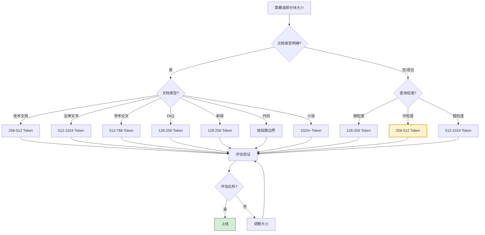

### 10.3 未来发展方向

1. **语义感知分块**:利用 LLM 理解文档语义,自动在语义边界处分块。
2. **多粒度索引**:同时构建多粒度索引,检索时根据查询动态选择。
3. **自适应分块**:根据查询实时调整检索粒度,而非固定分块。
4. **层级化分块**:构建父子块层级,父块提供上下文,子块精准检索。
5. **跨模态分块**:统一文本、图像、表格的分块策略,支持多模态 RAG。
6. **学习型分块**:通过强化学习从用户反馈中优化分块策略。

### 10.4 给开发者的实践建议

1. **从 256 Token 开始**:这是经过验证的通用甜点区。
2. **必须做评估**:不要凭经验直接上线,用测试集验证。
3. **关注生成质量**:检索指标只是手段,生成质量才是目的。
4. **控制上下文长度**:top_k × chunk_size 控制在 4000 Token 以内。
5. **保留元数据**:标题、章节等元数据能显著提升检索精度。
6. **迭代优化**:上线后持续监控,通过 A/B 测试迭代优化。
7. **成本意识**:在质量与成本间寻找平衡,避免过度优化。

---

> **相关文档**
>
> - [51RAG检索增强生成详解.md](./51RAG检索增强生成详解.md):RAG 系统基础概念,分块是其中的核心环节。
> - [52RAG工作流程详解.md](./52RAG工作流程详解.md):RAG 工作流程,分块位于流程起点。
> - [53RAG降低LLM幻觉机制详解.md](./53RAG降低LLM幻觉机制详解.md):分块大小影响幻觉率,本文从分块角度补充。
> - [54RAG系统功能模块详解.md](./54RAG系统功能模块详解.md):RAG 系统功能模块,分块器是核心模块。
> - [55AdvancedRAG高级检索增强生成详解.md](./55AdvancedRAG高级检索增强生成详解.md):高级 RAG 技术,支持多粒度检索。
> - [56RAG文档切片策略深度解析.md](./56RAG文档切片策略深度解析.md):切片方法详解,与本文互补构成完整分块策略。
