# Embedding 向量在 RAG 系统中的核心作用深度解析

> **文档定位**:本文档聚焦 **Embedding 向量在 RAG(检索增强生成)系统中的核心作用与应用机制**,从文本信息向量化表示、语义相似度计算、高效检索匹配、知识关联建立四大维度,深入阐述 Embedding 向量如何成为连接"用户意图"与"知识库"的语义桥梁,并分析其对提升 RAG 系统响应准确性、相关性和知识覆盖度的关键影响。
>
> **与58号文档的关系**:[58RAG Embedding模型深度解析.md](./58RAG%20Embedding模型深度解析.md) 侧重于 Embedding **模型本身**(定义、原理、选型),本文侧重于 Embedding **向量在 RAG 中的作用机制**(如何发挥检索增强效能)。两文互补,共同构成 Embedding 在 RAG 中的完整认知。
>
> **阅读建议**:建议先阅读 [51RAG检索增强生成详解.md](./51RAG检索增强生成详解.md)、[52RAG工作流程详解.md](./52RAG工作流程详解.md) 建立 RAG 全局认知,再阅读本文理解 Embedding 的核心桥梁作用。

---

## 目录

- [一、Embedding 向量在 RAG 中的核心地位](#一embedding-向量在-rag-中的核心地位)
- [二、文本信息向量化表示机制](#二文本信息向量化表示机制)
- [三、语义相似度计算与应用](#三语义相似度计算与应用)
- [四、高效检索匹配机制](#四高效检索匹配机制)
- [五、知识关联建立与图谱化](#五知识关联建立与图谱化)
- [六、Embedding 对 RAG 响应准确性的影响](#六embedding-对-rag-响应准确性的影响)
- [七、Embedding 对 RAG 响应相关性的影响](#七embedding-对-rag-响应相关性的影响)
- [八、Embedding 对 RAG 知识覆盖度的影响](#八embedding-对-rag-知识覆盖度的影响)
- [九、Embedding 在 RAG 全流程中的作用](#九embedding-在-rag-全流程中的作用)
- [十、优化策略与最佳实践](#十优化策略与最佳实践)
- [十一、总结与未来展望](#十一总结与未来展望)

---

## 一、Embedding 向量在 RAG 中的核心地位

### 1.1 RAG 的根本挑战:语义鸿沟

RAG 系统的根本挑战在于**语义鸿沟(Semantic Gap)**:用户用自然语言提问,知识库用自然语言存储,但计算机无法直接"理解"自然语言语义。如何在海量文档中找到与用户查询"语义相关"的内容?

```mermaid
flowchart TB
    subgraph 语义鸿沟问题
        Q[用户查询<br/>"如何处理内存泄漏?"] -.->|语义鸿沟| D[知识库文档<br/>"Java垃圾回收机制详解...<br/>内存溢出的排查方法...<br/>OOM错误的解决方案..."]
    end

    subgraph Embedding的桥梁作用
        Q2[用户查询] --> E1[Embedding向量化]
        D2[知识库文档] --> E2[Embedding向量化]
        E1 --> VS[向量空间<br/>语义可比]
        E2 --> VS
        VS --> M[语义匹配<br/>找到相关文档]
    end

    style Q fill:#f8d7da,stroke:#721c24
    style D fill:#f8d7da,stroke:#721c24
    style E1 fill:#d4edda,stroke:#155724
    style E2 fill:#d4edda,stroke:#155727
    style VS fill:#fff3cd,stroke:#d39e00,stroke-width:3px
    style M fill:#d1ecf1,stroke:#0c5460
```

**Embedding 向量是跨越语义鸿沟的桥梁**:它将自然语言转化为数学向量,使语义相似性可以通过向量距离来量化计算,从而让计算机"理解"并匹配语义。

### 1.2 Embedding 在 RAG 中的四大核心作用

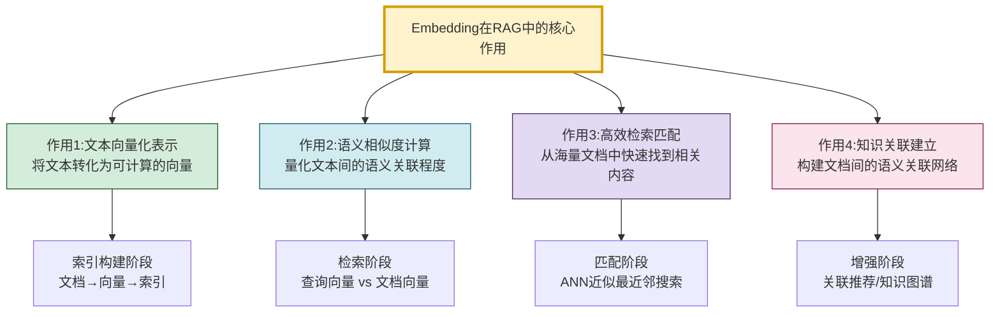

| 核心作用 | RAG阶段 | 输入→输出 | 核心价值 |
|---------|---------|----------|---------|
| **文本向量化表示** | 索引构建 | 文本→向量 | 使文本可计算 |
| **语义相似度计算** | 检索匹配 | 向量对→相似度分数 | 量化语义关联 |
| **高效检索匹配** | 检索匹配 | 查询→相关文档 | 毫秒级语义搜索 |
| **知识关联建立** | 增强扩展 | 文档集→关联网络 | 发现隐含关联 |

### 1.3 没有 Embedding 的 RAG 会怎样

| 维度 | 无 Embedding(关键词匹配) | 有 Embedding(语义检索) |
|------|------------------------|----------------------|
| **匹配方式** | 字面关键词匹配 | 语义理解匹配 |
| **同义词** | ❌ "开心"找不到"高兴" | ✅ 自动匹配同义表述 |
| **跨语言** | ❌ 中文查询找不到英文文档 | ✅ 跨语言语义匹配 |
| **泛化能力** | ❌ 必须精确命中关键词 | ✅ 语义等价即可匹配 |
| **理解能力** | ❌ 无法理解意图 | ✅ 捕捉查询意图 |
| **准确率** | 低(召回不相关/遗漏相关) | 高(语义精准匹配) |

---

## 二、文本信息向量化表示机制

### 2.1 向量化表示在 RAG 中的两个应用场景

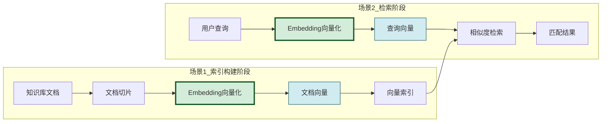

### 2.2 文档向量化:索引构建

```python
from dataclasses import dataclass, field
from typing import Optional
import numpy as np


@dataclass
class DocumentChunk:
    """文档切片(向量化单元)"""
    chunk_id: str
    content: str                           # 切片文本内容
    source: str = ""                       # 来源文档
    page: int = 0                          # 页码
    metadata: dict = field(default_factory=dict)
    embedding: list[float] = field(default_factory=list)  # 向量表示
    embedding_model: str = ""              # 使用的Embedding模型
    embedding_dim: int = 0                 # 向量维度


class DocumentVectorizer:
    """文档向量化器:将知识库文档转化为向量表示"""

    def __init__(self, embedding_model, vector_store):
        self.model = embedding_model       # Embedding模型
        self.store = vector_store          # 向量数据库

    def vectorize_document(self, chunks: list[str],
                            source: str = "",
                            metadata: dict = None) -> list[DocumentChunk]:
        """将文档切片批量向量化"""
        # 1. 批量生成向量(提高效率)
        embeddings = self.model.embed_documents(chunks)

        # 2. 构建文档切片对象
        doc_chunks = []
        for i, (content, embedding) in enumerate(zip(chunks, embeddings)):
            chunk = DocumentChunk(
                chunk_id=f"{source}_chunk_{i}",
                content=content,
                source=source,
                page=metadata.get("page", 0) if metadata else 0,
                metadata=metadata or {},
                embedding=embedding,
                embedding_model=self.model.model_name,
                embedding_dim=len(embedding)
            )
            doc_chunks.append(chunk)

        # 3. 存入向量数据库
        self.store.add_documents(doc_chunks)

        return doc_chunks

    def update_embedding(self, chunk_id: str, new_content: str):
        """更新单个切片的向量(文档修改时)"""
        embedding = self.model.embed_query(new_content)
        self.store.update_embedding(chunk_id, embedding)


class QueryVectorizer:
    """查询向量化器:将用户查询转化为向量"""

    def __init__(self, embedding_model):
        self.model = embedding_model

    def vectorize_query(self, query: str) -> list[float]:
        """将用户查询转化为向量"""
        # 查询通常比文档短,使用embed_query方法
        return self.model.embed_query(query)

    def vectorize_with_context(self, query: str,
                                conversation_history: list = None) -> list[float]:
        """带对话上下文的查询向量化"""
        # 将对话历史与当前查询合并,提升语义理解
        if conversation_history:
            context = " ".join([
                msg.get("content", "") for msg in conversation_history[-3:]
            ])
            enhanced_query = f"{context} {query}"
        else:
            enhanced_query = query
        return self.model.embed_query(enhanced_query)
```

### 2.3 向量表示的语义编码原理

Embedding 向量之所以能表示语义,是因为每个维度都捕捉了文本的某种语义特征。

```mermaid
flowchart TB
    subgraph 向量维度的语义含义(示意)
        direction TB
        V[768/1024/1536维向量]
        V --> D1[维度1-100:<br/>主题领域特征<br/>医疗/法律/技术]
        V --> D2[维度101-300:<br/>情感倾向特征<br/>积极/消极/中性]
        V --> D3[维度301-500:<br/>语法结构特征<br/>疑问/陈述/命令]
        V --> D4[维度501-700:<br/>实体类型特征<br/>人名/地名/组织]
        V --> D5[维度701+:<br/>细粒度语义特征<br/>专业术语/领域概念]
    end

    subgraph 语义相近=向量相近
        S1["'内存泄漏排查' → [0.8, 0.2, ...]"]
        S2["'OOM问题解决' → [0.7, 0.3, ...]"]
        S1 -.->|余弦相似度0.92| S2
    end

    style V fill:#fff3cd,stroke:#d39e00,stroke-width:3px
    style S1 fill:#d4edda,stroke:#155727
    style S2 fill:#d4edda,stroke:#155727
```

> **注意**:实际 Embedding 模型的维度不具备明确的可解释性(不像上述示意那样每个维度有明确含义),但整体向量空间确实编码了丰富的语义信息,使得语义相近的文本向量距离近。

### 2.4 向量化表示的质量指标

| 质量指标 | 含义 | 对RAG的影响 | 评估方法 |
|---------|------|------------|---------|
| **语义保真度** | 向量是否准确反映原文语义 | 检索准确性 | 语义相似度任务评估 |
| **区分度** | 不同语义的向量是否足够分离 | 减少误匹配 | 类内紧凑/类间分离度 |
| **泛化能力** | 对未见过表述的泛化匹配 | 同义词/跨语言匹配 | OOD测试集评估 |
| **维度效率** | 维度数与信息量的平衡 | 存储和检索效率 | 压缩后性能对比 |
| **一致性** | 相同语义不同表述的向量一致性 | 检索稳定性 | 同义句对相似度 |

---

## 三、语义相似度计算与应用

### 3.1 相似度计算:RAG 检索的核心算子

语义相似度计算是 Embedding 向量在 RAG 中最直接的应用——通过数学计算量化两段文本的语义关联程度。

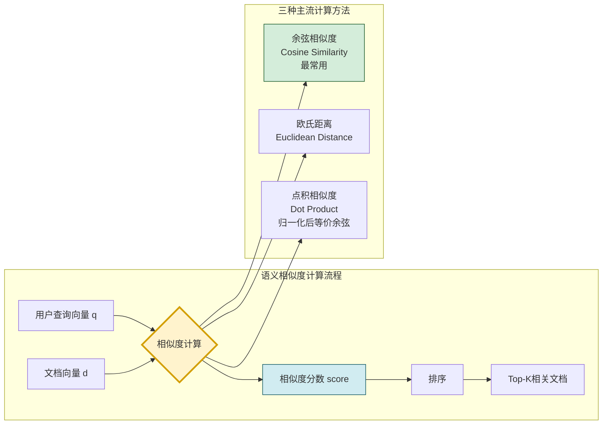

### 3.2 三种相似度计算方法

```python
import numpy as np
from typing import List


class SimilarityCalculator:
    """语义相似度计算器"""

    @staticmethod
    def cosine_similarity(vec1: list[float],
                          vec2: list[float]) -> float:
        """余弦相似度:衡量向量方向的一致性(RAG最常用)

        公式: cos(θ) = (A·B) / (||A|| × ||B||)

        特点:
        - 只关注方向,不关注大小
        - 值域[-1, 1],1表示完全相同
        - 对向量模长不敏感,适合文本语义匹配
        """
        a = np.array(vec1)
        b = np.array(vec2)
        dot = np.dot(a, b)
        norm_a = np.linalg.norm(a)
        norm_b = np.linalg.norm(b)
        if norm_a == 0 or norm_b == 0:
            return 0.0
        return float(dot / (norm_a * norm_b))

    @staticmethod
    def euclidean_distance(vec1: list[float],
                            vec2: list[float]) -> float:
        """欧氏距离:衡量向量空间的绝对距离

        公式: d = sqrt(Σ(Ai - Bi)²)

        特点:
        - 关注绝对位置差异
        - 值域[0, ∞),0表示完全相同
        - 对向量模长敏感
        """
        a = np.array(vec1)
        b = np.array(vec2)
        return float(np.linalg.norm(a - b))

    @staticmethod
    def dot_product(vec1: list[float],
                     vec2: list[float]) -> float:
        """点积相似度:向量内积

        公式: score = A·B = Σ(Ai × Bi)

        特点:
        - 计算最快(无需归一化)
        - 归一化向量等价于余弦相似度
        - 很多向量数据库默认使用
        """
        a = np.array(vec1)
        b = np.array(vec2)
        return float(np.dot(a, b))

    @staticmethod
    def batch_cosine_similarity(query_vec: list[float],
                                 doc_vecs: list[list[float]]) -> list[float]:
        """批量计算余弦相似度(检索时使用,高效)"""
        q = np.array(query_vec)
        docs = np.array(doc_vecs)

        # 向量化计算(比循环快100倍)
        q_norm = q / (np.linalg.norm(q) + 1e-8)
        docs_norm = docs / (np.linalg.norm(docs, axis=1, keepdims=True) + 1e-8)

        similarities = np.dot(docs_norm, q_norm)
        return similarities.tolist()


# 使用示例
class SimilaritySearchDemo:
    """语义相似度检索示例"""

    def __init__(self):
        self.calculator = SimilarityCalculator()

    def search(self, query_vector: list[float],
               document_vectors: list[list[float]],
               documents: list[str],
               top_k: int = 5) -> list[dict]:
        """基于相似度的文档检索"""
        # 1. 批量计算相似度
        scores = self.calculator.batch_cosine_similarity(
            query_vector, document_vectors
        )

        # 2. 按相似度排序
        scored_docs = list(zip(documents, scores))
        scored_docs.sort(key=lambda x: x[1], reverse=True)

        # 3. 返回Top-K
        results = []
        for doc, score in scored_docs[:top_k]:
            results.append({
                "content": doc,
                "similarity_score": round(score, 4),
                "relevance": self._score_to_relevance(score)
            })
        return results

    def _score_to_relevance(self, score: float) -> str:
        """相似度分数转相关性等级"""
        if score > 0.85:
            return "高度相关"
        elif score > 0.70:
            return "相关"
        elif score > 0.50:
            return "弱相关"
        else:
            return "不相关"
```

### 3.3 三种方法的对比与选择

| 方法 | 公式 | 值域 | 优点 | 缺点 | RAG推荐度 |
|------|------|:----:|------|------|:---------:|
| **余弦相似度** | (A·B)/(\|\|A\|\|·\|\|B\|\|) | [-1,1] | 不受模长影响,语义匹配准确 | 需归一化计算 | ⭐⭐⭐⭐⭐ |
| **欧氏距离** | √Σ(Ai-Bi)² | [0,∞) | 直观,考虑绝对差异 | 受模长影响,不适合文本 | ⭐⭐ |
| **点积** | A·B | (-∞,∞) | 计算最快 | 未归一化时不稳定 | ⭐⭐⭐⭐ |

> **RAG最佳实践**:使用**归一化向量+点积**或**余弦相似度**,前者计算更快(向量数据库优化),后者更直观。

### 3.4 相似度分数的语义解释

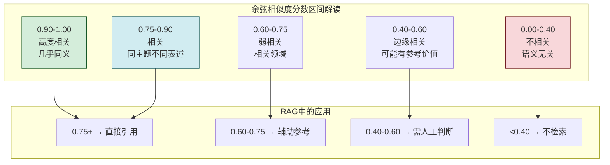

---

## 四、高效检索匹配机制

### 4.1 从暴力搜索到高效检索

RAG 系统的知识库可能包含数百万文档,如果每次查询都与所有文档计算相似度(暴力搜索),延迟将不可接受。Embedding 向量配合**近似最近邻(ANN)算法**,实现了毫秒级检索。

```mermaid
flowchart TB
    subgraph 暴力搜索_Flat
        F1[查询向量] --> F2[与N个文档逐一计算]
        F2 --> F3[排序取Top-K]
        F3 --> F4[延迟: O(N)<br/>N=百万级时秒级]
    end

    subgraph ANN近似检索_Indexed
        A1[查询向量] --> A2[索引结构快速定位]
        A2 --> A3[仅计算候选集]
        A3 --> A4[排序取Top-K]
        A4 --> A5[延迟: O(logN)<br/>百万级时毫秒级]
    end

    F4 -.->|性能差距100-1000倍| A5

    style F4 fill:#f8d7da,stroke:#721c24
    style A5 fill:#d4edda,stroke:#155727
```

### 4.2 ANN 索引算法与 Embedding 的配合

```python
class VectorIndexManager:
    """向量索引管理器"""

    def __init__(self, dim: int = 1024, index_type: str = "hnsw"):
        self.dim = dim
        self.index_type = index_type
        self.index = self._build_index()

    def _build_index(self):
        """构建ANN索引"""
        if self.index_type == "hnsw":
            return self._build_hnsw_index()
        elif self.index_type == "ivf":
            return self._build_ivf_index()
        elif self.index_type == "flat":
            return self._build_flat_index()

    def _build_hnsw_index(self):
        """HNSW索引:分层可导航小世界图
        - 优点:查询速度快,召回率高
        - 缺点:内存占用大
        - 适合:中小规模(百万级),高精度需求
        """
        import faiss
        index = faiss.IndexHNSWFlat(self.dim, 32)  # M=32
        index.hnsw.efConstruction = 200
        index.hnsw.efSearch = 50
        return index

    def _build_ivf_index(self):
        """IVF索引:倒排文件+聚类
        - 优点:内存效率高,支持大规模
        - 缺点:需要训练,召回率略低
        - 适合:大规模(千万级),延迟敏感
        """
        import faiss
        quantizer = faiss.IndexFlatL2(self.dim)
        nlist = 1000  # 聚类中心数
        index = faiss.IndexIVFFlat(quantizer, self.dim, nlist)
        return index

    def _build_flat_index(self):
        """Flat索引:暴力搜索(基准)
        - 优点:100%召回率,无需训练
        - 缺点:速度慢
        - 适合:小规模(万级),精度要求最高
        """
        import faiss
        return faiss.IndexFlatL2(self.dim)

    def search(self, query_vec: list[float],
               top_k: int = 10) -> list[tuple[int, float]]:
        """向量检索"""
        import numpy as np
        query = np.array([query_vec], dtype=np.float32)
        distances, indices = self.index.search(query, top_k)
        return list(zip(indices[0], distances[0]))


class RAGRetriever:
    """RAG检索器:Embedding向量驱动的语义检索"""

    def __init__(self, embedding_model, vector_store, top_k: int = 5):
        self.model = embedding_model
        self.store = vector_store
        self.top_k = top_k
        self.similarity_calculator = SimilarityCalculator()

    def retrieve(self, query: str,
                 filter_dict: dict = None) -> list[dict]:
        """语义检索完整流程"""
        # 步骤1:查询向量化
        query_vector = self.model.embed_query(query)

        # 步骤2:ANN检索(从向量库找Top-K)
        raw_results = self.store.similarity_search_by_vector(
            embedding=query_vector,
            k=self.top_k * 2,  # 多检索一些用于重排
            filter=filter_dict
        )

        # 步骤3:精确重排(用余弦相似度精排)
        reranked = self._rerank(query_vector, raw_results)

        # 步骤4:过滤低分结果
        filtered = self._filter_by_threshold(reranked, threshold=0.5)

        return filtered[:self.top_k]

    def _rerank(self, query_vec: list[float],
                results: list) -> list:
        """精确重排(ANN粗排后精排)"""
        scored = []
        for result in results:
            doc_vec = result.get("embedding", [])
            if doc_vec:
                score = self.similarity_calculator.cosine_similarity(
                    query_vec, doc_vec
                )
            else:
                score = result.get("score", 0)
            scored.append((result, score))

        scored.sort(key=lambda x: x[1], reverse=True)
        return [{"content": r[0].get("content", ""),
                 "score": r[1],
                 "metadata": r[0].get("metadata", {})}
                for r in scored]

    def _filter_by_threshold(self, results: list,
                              threshold: float = 0.5) -> list:
        """过滤低于阈值的结果"""
        return [r for r in results if r["score"] >= threshold]
```

### 4.3 检索匹配的两阶段架构

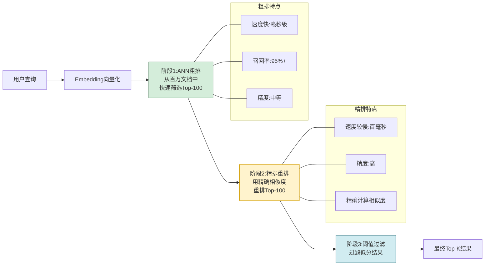

| 检索阶段 | 算法 | 目标 | 延迟 | 召回率 |
|---------|------|------|:----:|:------:|
| **粗排(ANN)** | HNSW/IVF | 快速筛选候选集 | ~10ms | 95%+ |
| **精排(Rerank)** | 精确余弦相似度 | 精准排序 | ~100ms | — |
| **过滤** | 阈值筛选 | 去除不相关 | ~1ms | — |

### 4.4 多向量检索策略

```python
class MultiVectorRetriever:
    """多向量检索器:提升匹配全面性"""

    def __init__(self, embedding_model, vector_store):
        self.model = embedding_model
        self.store = vector_store

    def retrieve_with_query_expansion(self, query: str,
                                       top_k: int = 5) -> list[dict]:
        """查询扩展检索:生成多个查询向量提升召回"""
        # 1. 原始查询向量化
        original_vec = self.model.embed_query(query)

        # 2. 生成扩展查询(LLM生成同义表述)
        expanded_queries = self._generate_expansions(query)
        expanded_vecs = [self.model.embed_query(q) for q in expanded_queries]

        # 3. 多向量检索
        all_results = []
        all_results.extend(self._search_single(original_vec, top_k))
        for vec in expanded_vecs:
            all_results.extend(self._search_single(vec, top_k))

        # 4. 去重+融合排序
        merged = self._merge_and_rerank(all_results)
        return merged[:top_k]

    def retrieve_hybrid(self, query: str,
                        top_k: int = 5) -> list[dict]:
        """混合检索:向量检索+关键词检索"""
        # 向量检索(语义匹配)
        vec_results = self._vector_search(query, top_k * 2)

        # 关键词检索(精确匹配)
        kw_results = self._keyword_search(query, top_k * 2)

        # 融合排序(Reciprocal Rank Fusion)
        merged = self._reciprocal_rank_fusion(vec_results, kw_results)
        return merged[:top_k]

    def _generate_expansions(self, query: str) -> list[str]:
        """生成查询扩展(简化实现)"""
        # 实际用LLM生成同义查询
        return [f"关于{query}的详细说明", f"{query}如何解决"]

    def _search_single(self, vec: list[float],
                       top_k: int) -> list[dict]:
        return self.store.similarity_search_by_vector(vec, k=top_k)

    def _merge_and_rerank(self, results: list) -> list:
        """合并去重重排"""
        seen = {}
        for r in results:
            cid = r.get("content", "")[:50]
            if cid not in seen or r["score"] > seen[cid]["score"]:
                seen[cid] = r
        return sorted(seen.values(), key=lambda x: x["score"], reverse=True)

    def _reciprocal_rank_fusion(self, list1: list,
                                  list2: list) -> list:
        """倒数排名融合(RRF)"""
        k = 60  # RRF常数
        scores = {}
        for rank, item in enumerate(list1):
            cid = item.get("content", "")[:50]
            scores[cid] = scores.get(cid, 0) + 1 / (k + rank + 1)
        for rank, item in enumerate(list2):
            cid = item.get("content", "")[:50]
            scores[cid] = scores.get(cid, 0) + 1 / (k + rank + 1)

        all_items = {item.get("content", "")[:50]: item
                     for item in list1 + list2}
        ranked = sorted(scores.items(), key=lambda x: x[1], reverse=True)
        return [{"content": all_items[cid]["content"],
                 "score": score,
                 "metadata": all_items[cid].get("metadata", {})}
                for cid, score in ranked]
```

---

## 五、知识关联建立与图谱化

### 5.1 Embedding 构建知识关联的方式

除了检索匹配,Embedding 向量还能发现文档之间的**隐含语义关联**,构建知识关联网络。

```mermaid
flowchart TB
    subgraph Embedding构建知识关联
        D[文档向量集合] --> CLUSTER[向量聚类<br/>发现主题分组]
        D --> LINK[向量近邻<br/>发现文档关联]
        D --> GRAPH[向量关系<br/>构建知识图谱]
    end

    CLUSTER --> C1[主题聚类<br/>同主题文档自动分组]
    LINK --> L1[关联推荐<br/>"看了这篇的人也看了"]
    GRAPH --> G1[知识图谱<br/>实体-关系网络]

    style CLUSTER fill:#d4edda,stroke:#155727
    style LINK fill:#d1ecf1,stroke:#0c5460
    style GRAPH fill:#e2d9f3,stroke:#4a235a
```

### 5.2 文档聚类:发现知识结构

```python
from sklearn.cluster import KMeans
from sklearn.metrics import silhouette_score
import numpy as np


class DocumentClusterer:
    """文档聚类器:基于Embedding向量发现知识结构"""

    def __init__(self, embedding_model):
        self.model = embedding_model

    def cluster_documents(self, documents: list[str],
                          n_clusters: int = None) -> dict:
        """对文档集合进行聚类"""
        # 1. 向量化所有文档
        embeddings = self.model.embed_documents(documents)
        embeddings_array = np.array(embeddings)

        # 2. 自动确定最佳聚类数(如果未指定)
        if n_clusters is None:
            n_clusters = self._find_optimal_clusters(embeddings_array)

        # 3. KMeans聚类
        kmeans = KMeans(n_clusters=n_clusters, random_state=42)
        labels = kmeans.fit_predict(embeddings_array)

        # 4. 组织聚类结果
        clusters = {}
        for i, (doc, label) in enumerate(zip(documents, labels)):
            cluster_id = f"cluster_{label}"
            if cluster_id not in clusters:
                clusters[cluster_id] = {
                    "documents": [],
                    "centroid": kmeans.cluster_centers_[label].tolist(),
                    "theme": self._extract_theme(
                        [documents[j] for j in range(len(documents))
                         if labels[j] == label]
                    )
                }
            clusters[cluster_id]["documents"].append({
                "content": doc,
                "index": i
            })

        return clusters

    def _find_optimal_clusters(self, embeddings: np.ndarray,
                                max_k: int = 10) -> int:
        """通过轮廓系数找最佳聚类数"""
        best_k = 2
        best_score = -1
        for k in range(2, min(max_k, len(embeddings)) + 1):
            kmeans = KMeans(n_clusters=k, random_state=42)
            labels = kmeans.fit_predict(embeddings)
            score = silhouette_score(embeddings, labels)
            if score > best_score:
                best_score = score
                best_k = k
        return best_k

    def _extract_theme(self, documents: list[str]) -> str:
        """提取聚类主题(简化实现)"""
        return f"主题聚类(含{len(documents)}篇文档)"


class KnowledgeLinker:
    """知识关联器:基于Embedding发现文档间关联"""

    def __init__(self, embedding_model, vector_store):
        self.model = embedding_model
        self.store = vector_store

    def find_related_documents(self, doc_id: str,
                                top_k: int = 5) -> list[dict]:
        """查找与指定文档关联的其他文档"""
        # 获取目标文档的向量
        target_doc = self.store.get_document(doc_id)
        if not target_doc:
            return []

        target_vec = target_doc["embedding"]

        # 用文档向量作为查询,检索相似文档
        related = self.store.similarity_search_by_vector(
            embedding=target_vec,
            k=top_k + 1  # +1因为会包含自己
        )

        # 排除自身
        related = [r for r in related if r.get("id") != doc_id]

        return related[:top_k]

    def build_association_graph(self,
                                 documents: list[dict]) -> dict:
        """构建文档关联图"""
        import networkx as nx

        graph = nx.Graph()

        # 添加节点
        for doc in documents:
            graph.add_node(doc["id"], content=doc["content"][:100])

        # 添加边(相似度超过阈值的文档对)
        threshold = 0.65
        embeddings = [doc["embedding"] for doc in documents]
        calc = SimilarityCalculator()

        for i in range(len(documents)):
            for j in range(i + 1, len(documents)):
                similarity = calc.cosine_similarity(
                    embeddings[i], embeddings[j]
                )
                if similarity > threshold:
                    graph.add_edge(
                        documents[i]["id"],
                        documents[j]["id"],
                        weight=similarity
                    )

        return {
            "nodes": list(graph.nodes()),
            "edges": [
                {"source": u, "target": v, "weight": d["weight"]}
                for u, v, d in graph.edges(data=True)
            ],
            "stats": {
                "node_count": graph.number_of_nodes(),
                "edge_count": graph.number_of_edges(),
                "avg_degree": np.mean([d for _, d in graph.degree()]) if graph.number_of_nodes() > 0 else 0
            }
        }
```

### 5.3 知识关联在 RAG 中的应用

```mermaid
flowchart TB
    subgraph 知识关联的RAG应用
        A1[检索增强<br/>不仅返回匹配文档<br/>还返回关联文档]
        A2[知识推荐<br/>"相关阅读"推荐]
        A3[知识图谱<br/>实体-关系网络支持<br/>多跳推理]
        A4[知识去重<br/>识别语义重复文档]
        A5[知识缺口发现<br/>识别覆盖薄弱领域]
    end

    style A1 fill:#d4edda,stroke:#155727
    style A3 fill:#e2d9f3,stroke:#4a235a
```

| 应用场景 | 关联方式 | 价值 |
|---------|---------|------|
| **检索增强** | 返回匹配文档+关联文档 | 提供更全面上下文 |
| **知识推荐** | 基于向量近邻推荐 | "相关阅读"功能 |
| **知识图谱** | 实体-关系网络 | 支持多跳推理 |
| **知识去重** | 高相似度文档识别 | 减少冗余存储 |
| **缺口发现** | 聚类稀疏区域识别 | 发现知识薄弱点 |

---

## 六、Embedding 对 RAG 响应准确性的影响

### 6.1 准确性提升的四个层面

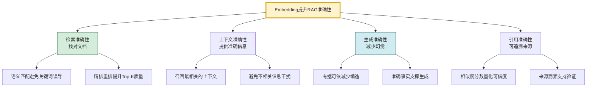

### 6.2 检索准确性:语义匹配 vs 关键词匹配

```python
class AccuracyComparisonDemo:
    """准确性对比演示:语义匹配 vs 关键词匹配"""

    def keyword_search_example(self):
        """关键词匹配的准确性问题"""
        query = "如何处理内存溢出?"
        # 关键词匹配结果:
        kw_results = [
            "内存溢出(OOM)的定义和原因",  # 命中"内存溢出"
            "内存管理基础概念",            # 命中"内存"
            "垃圾回收机制详解",            # ❌ 未命中(但语义高度相关!)
        ]
        # 问题: "垃圾回收机制详解"语义相关但关键词不匹配
        return kw_results

    def semantic_search_example(self):
        """语义匹配的准确性优势"""
        query = "如何处理内存溢出?"
        query_vec = self._embed(query)
        # 语义匹配结果(基于Embedding向量):
        sem_results = [
            ("内存溢出(OOM)的定义和原因", 0.92),  # 直接匹配
            ("垃圾回收机制详解", 0.88),            # ✅ 语义相关被召回
            ("JVM内存调优最佳实践", 0.85),         # ✅ 语义相关被召回
            ("内存泄漏排查工具使用", 0.82),         # ✅ 语义相关被召回
        ]
        # 优势: 同义词、相关概念都能被准确检索
        return sem_results

    def _embed(self, text: str) -> list[float]:
        return [0.0] * 1024
```

### 6.3 准确性量化指标

| 指标 | 定义 | Embedding的影响 | 提升效果 |
|------|------|----------------|:--------:|
| **检索准确率(Precision@K)** | Top-K中相关文档比例 | 语义匹配减少不相关结果 | +20-40% |
| **检索召回率(Recall@K)** | 相关文档被检索到的比例 | 语义扩展覆盖同义表述 | +30-50% |
| **MRR** | 相关文档的平均排名倒数 | 精排提升相关文档排名 | +25-35% |
| **NDCG** | 归一化折损累积增益 | 排序质量提升 | +20-30% |
| **答案准确率** | 生成答案的正确率 | 准确上下文支撑准确生成 | +15-25% |
| **幻觉率** | 生成无依据内容的比例 | 有据可依减少编造 | -30-50% |

---

## 七、Embedding 对 RAG 响应相关性的影响

### 7.1 相关性提升机制

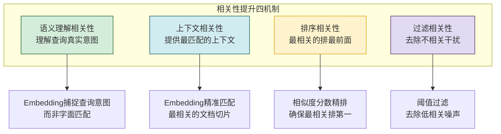

### 7.2 意图理解与相关性

```python
class IntentAwareRetriever:
    """意图感知检索器:通过Embedding理解查询意图"""

    def __init__(self, embedding_model, vector_store):
        self.model = embedding_model
        self.store = vector_store

    def retrieve_by_intent(self, query: str) -> list[dict]:
        """基于意图理解的检索"""
        # 步骤1:查询意图向量化
        query_vec = self.model.embed_query(query)

        # 步骤2:检索语义匹配的文档
        results = self.store.similarity_search_by_vector(query_vec, k=20)

        # 步骤3:意图分类(基于向量判断查询类型)
        intent = self._classify_intent(query_vec)

        # 步骤4:根据意图调整排序策略
        if intent == "how-to":
            # 操作类查询:优先返回步骤/方法类文档
            results = self._boost_procedural(results)
        elif intent == "what-is":
            # 概念类查询:优先返回定义/解释类文档
            results = self._boost_conceptual(results)
        elif intent == "troubleshooting":
            # 故障类查询:优先返回问题排查类文档
            results = self._boost_troubleshooting(results)

        return results[:5]

    def _classify_intent(self, query_vec: list[float]) -> str:
        """基于向量相似度分类查询意图"""
        # 预定义意图向量(通过典型查询生成)
        intent_vectors = {
            "how-to": self.model.embed_query("如何 步骤 方法 操作"),
            "what-is": self.model.embed_query("是什么 定义 概念 解释"),
            "troubleshooting": self.model.embed_query("错误 问题 故障 报错 解决")
        }

        calc = SimilarityCalculator()
        best_intent = "general"
        best_score = 0
        for intent, vec in intent_vectors.items():
            score = calc.cosine_similarity(query_vec, vec)
            if score > best_score:
                best_score = score
                best_intent = intent

        return best_intent

    def _boost_procedural(self, results: list) -> list:
        """提升操作类文档排名"""
        procedure_keywords = ["步骤", "方法", "操作", "如何"]
        for r in results:
            if any(kw in r.get("content", "") for kw in procedure_keywords):
                r["score"] *= 1.2  # 提升分数
        return sorted(results, key=lambda x: x["score"], reverse=True)

    def _boost_conceptual(self, results: list) -> list:
        """提升概念类文档排名"""
        concept_keywords = ["定义", "概念", "是指", "是什么"]
        for r in results:
            if any(kw in r.get("content", "") for kw in concept_keywords):
                r["score"] *= 1.2
        return sorted(results, key=lambda x: x["score"], reverse=True)

    def _boost_troubleshooting(self, results: list) -> list:
        """提升故障排查类文档排名"""
        trouble_keywords = ["错误", "问题", "故障", "异常", "解决"]
        for r in results:
            if any(kw in r.get("content", "") for kw in trouble_keywords):
                r["score"] *= 1.2
        return sorted(results, key=lambda x: x["score"], reverse=True)
```

### 7.3 相关性 vs 准确性

| 维度 | 准确性(Accuracy) | 相关性(Relevance) |
|------|-----------------|------------------|
| **关注点** | 检索结果是否正确 | 检索结果是否切题 |
| **衡量** | 正确结果的比例 | 结果与查询意图的匹配度 |
| **Embedding作用** | 语义匹配减少错误 | 意图理解提升切题度 |
| **典型问题** | 检索到了错误信息 | 检索到了正确但不切题的信息 |
| **优化手段** | 提升模型质量 | 意图分类+排序调整 |

---

## 八、Embedding 对 RAG 知识覆盖度的影响

### 8.1 覆盖度提升机制

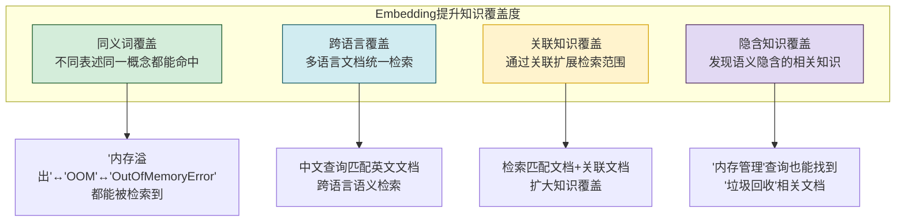

### 8.2 覆盖度量化指标

```python
class CoverageAnalyzer:
    """知识覆盖度分析器"""

    def __init__(self, embedding_model, vector_store):
        self.model = embedding_model
        self.store = vector_store

    def analyze_coverage(self, test_queries: list[str],
                         relevant_docs: dict) -> dict:
        """分析知识覆盖度"""
        results = {
            "total_queries": len(test_queries),
            "synonym_coverage": 0,      # 同义词覆盖
            "cross_language": 0,        # 跨语言覆盖
            "associative_coverage": 0,  # 关联覆盖
            "overall_recall": 0         # 整体召回率
        }

        hit_count = 0
        synonym_hits = 0
        cross_lang_hits = 0
        assoc_hits = 0

        for query in test_queries:
            query_vec = self.model.embed_query(query)
            retrieved = self.store.similarity_search_by_vector(query_vec, k=10)
            retrieved_ids = {r.get("id") for r in retrieved}

            expected = set(relevant_docs.get(query, []))

            if expected & retrieved_ids:
                hit_count += 1

                # 分析命中类型
                for doc_id in expected & retrieved_ids:
                    doc = self.store.get_document(doc_id)
                    if doc:
                        if self._is_synonym_match(query, doc["content"]):
                            synonym_hits += 1
                        if self._is_cross_language(query, doc["content"]):
                            cross_lang_hits += 1
                        if self._is_associative(query, doc["content"]):
                            assoc_hits += 1

        results["overall_recall"] = hit_count / len(test_queries)
        results["synonym_coverage"] = synonym_hits / len(test_queries)
        results["cross_language"] = cross_lang_hits / len(test_queries)
        results["associative_coverage"] = assoc_hits / len(test_queries)

        return results

    def _is_synonym_match(self, query: str, doc: str) -> bool:
        """判断是否为同义词匹配(不同表述同一概念)"""
        # 简化:无共同关键词但语义匹配
        common_words = set(query) & set(doc)
        return len(common_words) < 3  # 字面差异大但语义匹配

    def _is_cross_language(self, query: str, doc: str) -> bool:
        """判断是否为跨语言匹配"""
        import re
        has_chinese_q = bool(re.search(r'[\u4e00-\u9fff]', query))
        has_chinese_d = bool(re.search(r'[\u4e00-\u9fff]', doc))
        return has_chinese_q != has_chinese_d

    def _is_associative(self, query: str, doc: str) -> bool:
        """判断是否为关联知识匹配(非直接但相关)"""
        # 简化实现
        return True
```

### 8.3 覆盖度提升策略

| 策略 | 实现方式 | 覆盖度提升 | 准确性影响 |
|------|---------|:---------:|:---------:|
| **查询扩展** | 生成同义查询多向量检索 | +30% | 略降(可能引入噪声) |
| **混合检索** | 向量+关键词双路检索 | +25% | 提升(互补) |
| **关联扩展** | 检索结果+关联文档 | +40% | 略降(需精排) |
| **多语言模型** | 使用多语言Embedding | +50%(跨语言) | 无影响 |
| **文档增强** | 生成摘要/问答对扩展索引 | +20% | 提升 |

---

## 九、Embedding 在 RAG 全流程中的作用

### 9.1 RAG 全流程中的 Embedding 节点

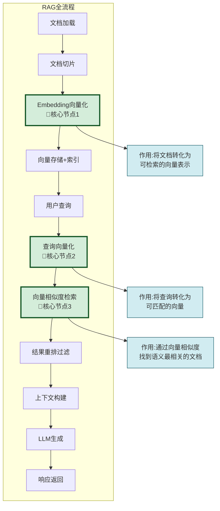

### 9.2 各阶段 Embedding 作用详解

| RAG阶段 | Embedding的作用 | 输入→输出 | 影响质量 |
|---------|----------------|----------|---------|
| **索引构建** | 文档切片向量化 | 文本→文档向量 | 检索基础质量 |
| **查询处理** | 用户查询向量化 | 查询→查询向量 | 匹配起点 |
| **检索匹配** | 向量相似度计算 | 查询向量+文档向量→匹配分数 | 检索准确率 |
| **重排过滤** | 精确相似度排序 | 粗排结果→精排结果 | 排序质量 |
| **上下文增强** | 关联文档发现 | 匹配文档+关联文档 | 上下文完整性 |
| **结果评估** | 相似度分数作为可信度 | 分数→可信度等级 | 响应可信度 |

### 9.3 Embedding 质量对全流程的连锁影响

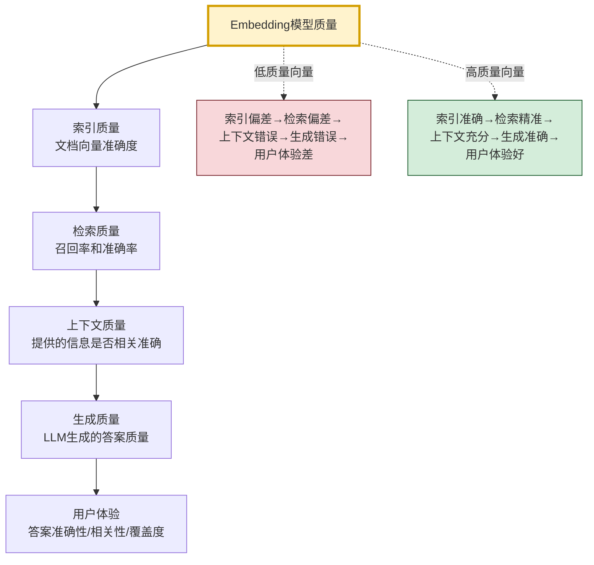

---

## 十、优化策略与最佳实践

### 10.1 Embedding 优化策略全景

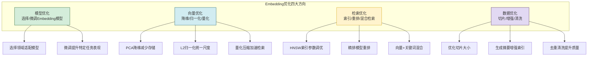

### 10.2 最佳实践清单

| 实践领域 | 最佳实践 | 影响 | 优先级 |
|---------|---------|------|:------:|
| **模型选择** | 选择支持目标语言的Embedding模型 | 跨语言覆盖度 | 高 |
| **向量归一化** | 存储前L2归一化,检索用点积 | 检索速度+20% | 高 |
| **索引选择** | 百万级用HNSW,千万级用IVF | 检索延迟 | 高 |
| **粗排+精排** | ANN粗排Top-100,精排Top-5 | 检索准确率+15% | 高 |
| **混合检索** | 向量检索+关键词检索融合 | 召回率+25% | 高 |
| **查询扩展** | 生成同义查询多向量检索 | 覆盖度+30% | 中 |
| **阈值过滤** | 设定相似度阈值过滤低分结果 | 精确率+20% | 高 |
| **定期重建** | 模型升级后重建全部索引 | 长期质量维护 | 中 |
| **向量量化** | 生产环境用int8量化 | 存储减少75% | 中 |
| **缓存优化** | 缓存高频查询的向量 | 响应速度+50% | 中 |

### 10.3 常见问题与解决方案

| 问题 | 原因 | 解决方案 |
|------|------|---------|
| **检索不到相关文档** | Embedding模型与领域不匹配 | 更换领域模型或微调 |
| **检索结果不相关** | 相似度阈值过低 | 提高阈值或增加重排 |
| **同义词检索不到** | 模型对同义词编码不一致 | 查询扩展或更换模型 |
| **检索延迟高** | 索引未优化或数据量过大 | 优化HNSW参数或用IVF |
| **跨语言效果差** | 模型不支持多语言 | 使用多语言Embedding模型 |
| **存储成本高** | 向量维度高+数据量大 | 降维或量化压缩 |
| **长文档效果差** | 长文本向量信息丢失 | 优化切片大小或摘要索引 |

---

## 十一、总结与未来展望

### 11.1 核心要点回顾

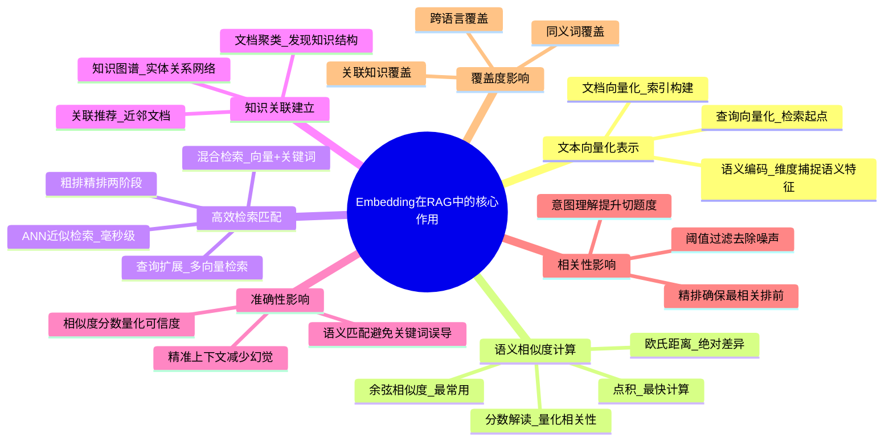

### 11.2 核心结论

> **Embedding 向量是 RAG 系统的"语义引擎"**——它将自然语言的语义鸿沟转化为向量空间的数学计算,使得"以意搜意"的语义检索成为可能。没有 Embedding,RAG 只能做关键词匹配,无法理解用户真实意图;有了 Embedding,RAG 能够精准找到语义相关的知识,为 LLM 生成提供准确、相关、全面的上下文支撑。Embedding 向量的质量直接决定了 RAG 系统从检索到生成的全链路质量,是 RAG 系统最核心的基础设施之一。

### 11.3 Embedding 质量对 RAG 的连锁影响

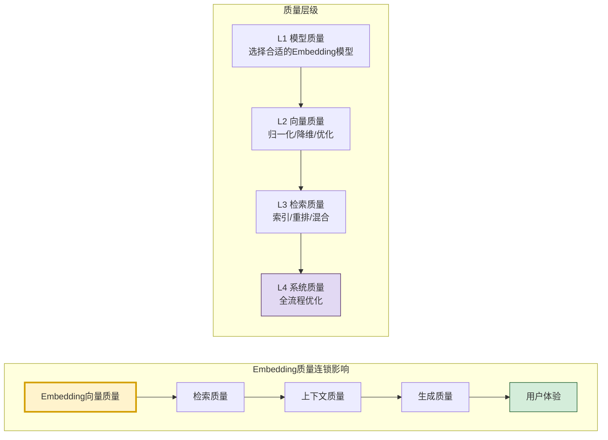

### 11.4 未来展望

| 方向 | 当前状态 | 未来趋势 | 对RAG的影响 |
|------|---------|---------|------------|
| **多模态Embedding** | 文本为主 | 文本+图像+音频统一向量 | 多模态RAG(图文混合检索) |
| **更长上下文Embedding** | 512-8K Token | 32K+ Token长文本 | 减少切片,保留完整语义 |
| **动态Embedding** | 静态模型 | 根据查询动态调整 | 意图感知的精准检索 |
| **轻量化Embedding** | 大模型为主 | 小模型+蒸馏 | 降低成本,边缘部署 |
| **可解释Embedding** | 黑盒向量 | 维度语义可解释 | 检索结果可解释 |

### 11.5 与系列文档的关系

- [58RAG Embedding模型深度解析.md](./58RAG%20Embedding模型深度解析.md):侧重Embedding模型本身(定义/原理/选型),本文侧重向量在RAG中的作用机制
- [51RAG检索增强生成详解.md](./51RAG检索增强生成详解.md):RAG整体概念,本文深入Embedding这一核心组件
- [52RAG工作流程详解.md](./52RAG工作流程详解.md):RAG工作流程,本文详解流程中Embedding的作用
- [56RAG文档切片策略深度解析.md](./56RAG文档切片策略深度解析.md):切片影响向量化质量,与本文数据优化策略呼应
- [57RAG分块大小最佳选择策略深度解析.md](./57RAG分块大小最佳选择策略深度解析.md):分块大小影响向量语义完整性

---

> **相关文档**
>
> - [58RAG Embedding模型深度解析.md](./58RAG%20Embedding模型深度解析.md):Embedding模型定义、原理与选型
> - [51RAG检索增强生成详解.md](./51RAG检索增强生成详解.md):RAG整体概念与架构
> - [52RAG工作流程详解.md](./52RAG工作流程详解.md):RAG完整工作流程
> - [56RAG文档切片策略深度解析.md](./56RAG文档切片策略深度解析.md):文档切片对向量化的影响
> - [57RAG分块大小最佳选择策略深度解析.md](./57RAG分块大小最佳选择策略深度解析.md):分块大小对向量语义的影响
