# RAG 系统 Embedding 模型选型决策指南

> **文档定位**:本文档是 RAG 系统中 Embedding 模型选型的**操作型决策指南**,提供系统化的评估方法论、七大评估维度的深度分析、主流模型全景对比、完整的选型决策流程以及典型场景的推荐方案。帮助开发者在海量 Embedding 模型中,根据 RAG 系统的具体应用场景和数据特点,做出科学合理的模型选择。
>
> **与58号文档的关系**:[58RAG Embedding模型深度解析.md](./58RAG%20Embedding模型深度解析.md) 从**模型原理**角度概述选型框架,本文从**工程实践**角度提供可操作的选型指南,深入58号未展开的评估方法、兼容性矩阵、授权分析、决策流程等维度。两文互补,58号解决"Embedding模型是什么",本文解决"如何选对Embedding模型"。
>
> **阅读建议**:建议先阅读 [58号文档](./58RAG%20Embedding模型深度解析.md) 理解模型原理,再阅读本文进行选型决策。可结合 [59Embedding向量在RAG系统中的核心作用深度解析.md](./59Embedding向量在RAG系统中的核心作用深度解析.md) 理解选型对RAG效果的影响。

---

## 目录

- [一、Embedding 模型选型概述](#一embedding-模型选型概述)
- [二、评估方法论:如何系统评估 Embedding 模型](#二评估方法论如何系统评估-embedding-模型)
- [三、维度1:模型性能指标评估](#三维度1模型性能指标评估)
- [四、维度2:计算资源需求评估](#四维度2计算资源需求评估)
- [五、维度3:向量数据库兼容性评估](#五维度3向量数据库兼容性评估)
- [六、维度4:多语言支持能力评估](#六维度4多语言支持能力评估)
- [七、维度5:上下文窗口大小评估](#七维度5上下文窗口大小评估)
- [八、维度6:开源与商业授权评估](#八维度6开源与商业授权评估)
- [九、维度7:领域适配性评估](#九维度7领域适配性评估)
- [十、主流 Embedding 模型全景对比](#十主流-embedding-模型全景对比)
- [十一、选型决策流程与框架](#十一选型决策流程与框架)
- [十二、典型场景推荐方案](#十二典型场景推荐方案)
- [十三、选型实践与最佳实践](#十三选型实践与最佳实践)
- [十四、总结](#十四总结)

---

## 一、Embedding 模型选型概述

### 1.1 选型的重要性

Embedding 模型是 RAG 系统的**语义基石**,其质量直接决定检索准确性、上下文相关性和最终生成质量。选错模型的代价高昂:

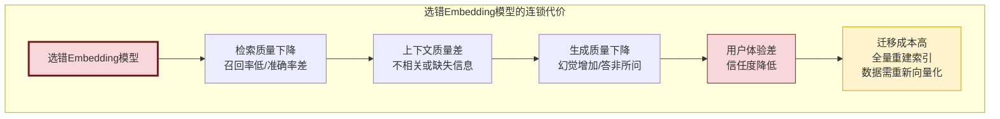

| 选错代价 | 具体影响 | 严重程度 |
|---------|---------|:--------:|
| **检索质量下降** | 召回率降低30-50%,准确率降低20-40% | 🔴 严重 |
| **生成质量下降** | 幻觉率增加,答案相关性降低 | 🔴 严重 |
| **用户体验差** | 答非所问,信任度崩塌 | 🔴 严重 |
| **迁移成本高** | 全量文档需重新向量化,索引重建 | 🟡 中等 |
| **维护成本高** | 需要额外的补偿机制(重排/过滤) | 🟡 中等 |

### 1.2 选型的七大评估维度

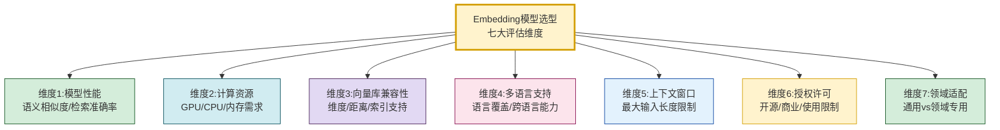

### 1.3 选型核心原则

| 原则 | 含义 | 实践指导 |
|------|------|---------|
| **场景驱动** | 根据RAG具体应用场景选择 | 问答/搜索/推荐场景需求不同 |
| **数据匹配** | 模型能力与数据特点匹配 | 中文/英文/多语言/专业领域 |
| **资源适配** | 计算资源与部署环境适配 | 云端API vs 本地GPU vs 边缘CPU |
| **性价比优** | 性能与成本的最佳平衡 | 不盲目追求最高分,够用即可 |
| **可迁移性** | 考虑未来迁移和升级成本 | 标准化接口,避免锁定 |

---

## 二、评估方法论:如何系统评估 Embedding 模型

### 2.1 评估方法论框架

```mermaid
flowchart TB
    subgraph Embedding模型评估方法论
        direction TB
        M1[阶段1:基准评测<br/>使用公开基准数据集评估]
        M2[阶段2:领域评测<br/>使用业务数据集评估]
        M3[阶段3:工程评测<br/>评估资源/兼容性/性能]
        M4[阶段4:A/B测试<br/>线上对比验证]
    end

    M1 --> M2 --> M3 --> M4

    subgraph 基准评测工具
        T1[MTEB榜单<br/>英文综合评测]
        T2[C-MTEB榜单<br/>中文综合评测]
        T3[MIRACL<br/>多语言检索评测]
    end

    subgraph 领域评测方法
        D1[构建领域评测集<br/>标注相关文档对]
        D2[计算领域指标<br/>Recall@K/MRR/NDCG]
        D3[人工抽检<br/>验证检索质量]
    end

    M1 --- T1 & T2 & T3
    M2 --- D1 & D2 & D3

    style M1 fill:#d4edda,stroke:#155724
    style M2 fill:#d1ecf1,stroke:#0c5460
    style M3 fill:#fff3cd,stroke:#d39e00
    style M4 fill:#e2d9f3,stroke:#4a235a
```

### 2.2 四阶段评估法

```python
from dataclasses import dataclass, field
from typing import Optional
import time
import numpy as np


@dataclass
class EvaluationConfig:
    """评估配置"""
    # 基准评测
    benchmark_datasets: list[str] = field(default_factory=lambda: ["MTEB", "C-MTEB"])
    # 领域评测
    domain_eval_set_path: str = ""
    domain_sample_size: int = 500
    # 工程评测
    test_query_count: int = 1000
    latency_target_ms: int = 100
    # A/B测试
    ab_test_ratio: float = 0.1
    ab_test_duration_days: int = 7


@dataclass
class EvaluationResult:
    """评估结果"""
    model_name: str
    # 基准评测结果
    mteb_score: float = 0.0           # MTEB综合分
    cmteb_score: float = 0.0          # C-MTEB综合分
    # 领域评测结果
    domain_recall_at_5: float = 0.0   # Recall@5
    domain_recall_at_10: float = 0.0  # Recall@10
    domain_mrr: float = 0.0           # MRR
    domain_ndcg: float = 0.0          # NDCG
    # 工程评测结果
    avg_latency_ms: float = 0.0       # 平均延迟
    throughput_qps: float = 0.0       # 吞吐量
    memory_usage_mb: float = 0.0      # 内存占用
    gpu_memory_mb: float = 0.0        # GPU显存占用
    # 综合评分
    overall_score: float = 0.0


class EmbeddingModelEvaluator:
    """Embedding 模型评估器"""

    def __init__(self, config: EvaluationConfig):
        self.config = config

    def evaluate_model(self, model, model_name: str) -> EvaluationResult:
        """完整评估一个模型(四阶段)"""
        result = EvaluationResult(model_name=model_name)

        # 阶段1:基准评测
        result.mteb_score = self._benchmark_eval(model, "MTEB")
        result.cmteb_score = self._benchmark_eval(model, "C-MTEB")

        # 阶段2:领域评测
        domain_metrics = self._domain_eval(model)
        result.domain_recall_at_5 = domain_metrics["recall@5"]
        result.domain_recall_at_10 = domain_metrics["recall@10"]
        result.domain_mrr = domain_metrics["mrr"]
        result.domain_ndcg = domain_metrics["ndcg"]

        # 阶段3:工程评测
        perf_metrics = self._engineering_eval(model)
        result.avg_latency_ms = perf_metrics["avg_latency_ms"]
        result.throughput_qps = perf_metrics["throughput_qps"]
        result.memory_usage_mb = perf_metrics["memory_mb"]
        result.gpu_memory_mb = perf_metrics["gpu_mb"]

        # 综合评分
        result.overall_score = self._compute_overall_score(result)

        return result

    def _benchmark_eval(self, model, benchmark: str) -> float:
        """阶段1:基准评测(使用公开数据集)"""
        # 实际实现加载MTEB/C-MTEB评测框架
        # 返回综合得分(0-1)
        return 0.0

    def _domain_eval(self, model) -> dict:
        """阶段2:领域评测(使用业务数据)"""
        # 加载领域评测集
        # 对每个查询生成向量,检索文档,计算指标
        return {
            "recall@5": 0.0,
            "recall@10": 0.0,
            "mrr": 0.0,
            "ndcg": 0.0
        }

    def _engineering_eval(self, model) -> dict:
        """阶段3:工程评测(性能/资源)"""
        import psutil
        import os

        # 延迟测试
        test_text = "这是一个测试查询用于评估Embedding模型的延迟性能"
        latencies = []
        for _ in range(self.config.test_query_count):
            start = time.time()
            _ = model.embed_query(test_text)
            latencies.append((time.time() - start) * 1000)

        # 吞吐量测试(批量)
        batch_texts = [test_text] * 100
        start = time.time()
        _ = model.embed_documents(batch_texts)
        batch_time = time.time() - start

        # 资源占用
        process = psutil.Process(os.getpid())
        memory_mb = process.memory_info().rss / 1024 / 1024

        return {
            "avg_latency_ms": np.mean(latencies),
            "p99_latency_ms": np.percentile(latencies, 99),
            "throughput_qps": 100 / batch_time,
            "memory_mb": memory_mb,
            "gpu_mb": 0  # 需要nvidia-ml-py获取
        }

    def _compute_overall_score(self, result: EvaluationResult) -> float:
        """计算综合评分(加权平均)"""
        weights = {
            "domain": 0.40,      # 领域评测最重要
            "benchmark": 0.25,   # 基准评测
            "latency": 0.15,     # 延迟
            "throughput": 0.10,  # 吞吐量
            "resource": 0.10     # 资源占用
        }

        # 归一化各项分数到0-1
        domain_score = (result.domain_recall_at_5 + result.domain_mrr) / 2
        benchmark_score = (result.mteb_score + result.cmteb_score) / 2
        latency_score = max(0, 1 - result.avg_latency_ms / self.config.latency_target_ms)
        throughput_score = min(1, result.throughput_qps / 100)
        resource_score = max(0, 1 - result.memory_usage_mb / 4096)

        return (
            weights["domain"] * domain_score +
            weights["benchmark"] * benchmark_score +
            weights["latency"] * latency_score +
            weights["throughput"] * throughput_score +
            weights["resource"] * resource_score
        )

    def compare_models(self, models: list, model_names: list[str]) -> list[EvaluationResult]:
        """对比评估多个模型"""
        results = []
        for model, name in zip(models, model_names):
            result = self.evaluate_model(model, name)
            results.append(result)

        # 按综合评分排序
        results.sort(key=lambda x: x.overall_score, reverse=True)
        return results
```

### 2.3 评估指标体系

| 评估类别 | 指标 | 含义 | 权重建议 |
|---------|------|------|:--------:|
| **检索质量** | Recall@K | Top-K中相关文档的比例 | 高 |
| **检索质量** | MRR | 相关文档的平均排名倒数 | 高 |
| **检索质量** | NDCG | 归一化折损累积增益 | 高 |
| **检索质量** | Precision@K | Top-K中相关文档的精确率 | 中 |
| **语义质量** | STS Score | 语义文本相似度得分 | 中 |
| **性能** | 平均延迟 | 单次Embedding耗时 | 中 |
| **性能** | P99延迟 | 99分位延迟 | 高 |
| **性能** | 吞吐量 | 每秒处理查询数 | 中 |
| **资源** | 内存占用 | 运行时内存消耗 | 中 |
| **资源** | GPU显存 | GPU显存占用 | 高(GPU部署) |

---

## 三、维度1:模型性能指标评估

### 3.1 公开基准评测

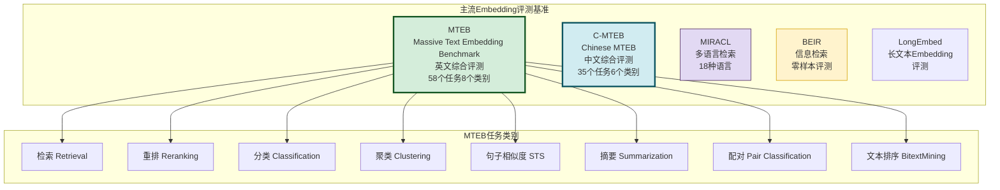

### 3.2 检索准确率评估实现

```python
class RetrievalQualityEvaluator:
    """检索质量评估器"""

    def __init__(self, embedding_model, vector_store):
        self.model = embedding_model
        self.store = vector_store

    def evaluate_retrieval(self, eval_set: list[dict],
                            top_k_values: list[int] = [1, 3, 5, 10]) -> dict:
        """评估检索质量

        Args:
            eval_set: 评估集 [{"query": "...", "relevant_docs": ["id1", "id2"]}]
            top_k_values: 评估的K值列表
        """
        results = {f"recall@{k}": [] for k in top_k_values}
        results["mrr"] = []
        results["ndcg"] = []

        for item in eval_set:
            query = item["query"]
            relevant_docs = set(item["relevant_docs"])

            # 向量化查询
            query_vec = self.model.embed_query(query)

            # 检索Top-K(取最大K值)
            max_k = max(top_k_values)
            retrieved = self.store.similarity_search_by_vector(query_vec, k=max_k)
            retrieved_ids = [r.get("id") for r in retrieved]

            # 计算各K值的Recall
            for k in top_k_values:
                top_k_ids = retrieved_ids[:k]
                hit_count = len(set(top_k_ids) & relevant_docs)
                recall = hit_count / len(relevant_docs) if relevant_docs else 0
                results[f"recall@{k}"].append(recall)

            # 计算MRR
            mrr = self._compute_mrr(retrieved_ids, relevant_docs)
            results["mrr"].append(mrr)

            # 计算NDCG
            ndcg = self._compute_ndcg(retrieved_ids, relevant_docs, max_k)
            results["ndcg"].append(ndcg)

        # 平均值
        return {k: np.mean(v) for k, v in results.items()}

    def _compute_mrr(self, retrieved_ids: list,
                      relevant_docs: set) -> float:
        """计算MRR(Mean Reciprocal Rank)"""
        for i, doc_id in enumerate(retrieved_ids):
            if doc_id in relevant_docs:
                return 1.0 / (i + 1)
        return 0.0

    def _compute_ndcg(self, retrieved_ids: list,
                       relevant_docs: set, k: int) -> float:
        """计算NDCG(Normalized Discounted Cumulative Gain)"""
        # DCG
        dcg = 0.0
        for i, doc_id in enumerate(retrieved_ids[:k]):
            rel = 1.0 if doc_id in relevant_docs else 0.0
            dcg += rel / np.log2(i + 2)  # i+2因为log2(1)=0

        # IDCG(理想DCG)
        ideal_hits = min(len(relevant_docs), k)
        idcg = sum(1.0 / np.log2(i + 2) for i in range(ideal_hits))

        return dcg / idcg if idcg > 0 else 0.0


class SemanticSimilarityEvaluator:
    """语义相似度评估器"""

    def __init__(self, embedding_model):
        self.model = embedding_model

    def evaluate_sts(self, sentence_pairs: list[tuple[str, str, float]]) -> dict:
        """评估语义文本相似度

        Args:
            sentence_pairs: [(句子1, 句子2, 人工标注相似度0-5)]
        """
        from scipy.stats import spearmanr, pearsonr

        predicted_scores = []
        gold_scores = []

        for sent1, sent2, gold in sentence_pairs:
            vec1 = self.model.embed_query(sent1)
            vec2 = self.model.embed_query(sent2)

            # 计算余弦相似度
            similarity = self._cosine_similarity(vec1, vec2)
            predicted_scores.append(similarity)
            gold_scores.append(gold / 5.0)  # 归一化到0-1

        # 计算相关性
        spearman_corr, _ = spearmanr(predicted_scores, gold_scores)
        pearson_corr, _ = pearsonr(predicted_scores, gold_scores)

        return {
            "spearman_correlation": spearman_corr,
            "pearson_correlation": pearson_corr,
            "sample_count": len(sentence_pairs)
        }

    def _cosine_similarity(self, vec1, vec2):
        a, b = np.array(vec1), np.array(vec2)
        return float(np.dot(a, b) / (np.linalg.norm(a) * np.linalg.norm(b) + 1e-8))
```

### 3.3 性能指标对比表

| 模型 | MTEB综合分 | C-MTEB综合分 | 特点 |
|------|:---------:|:----------:|------|
| **bge-large-zh-v1.5** | 63.5 | 64.8 | 中文最强开源之一 |
| **bge-m3** | 65.1 | 66.2 | 多语言+多粒度 |
| **text-embedding-3-large** | 64.6 | 65.3 | OpenAI商业模型 |
| **voyage-large-2** | 67.1 | — | 商业模型性能领先 |
| **Cohere embed-v3** | 64.5 | 63.8 | 商业模型,多语言 |
| **e5-large-v2** | 62.0 | 61.5 | 开源通用模型 |
| **gte-large-zh** | 63.2 | 64.0 | 阿里开源中文模型 |
| **jina-embeddings-v2** | 64.1 | 62.8 | 支持8K上下文 |

> **注**:以上分数为示意值,实际分数请参考 MTEB/C-MTEB 最新榜单。选型时应以最新榜单为准。

---

## 四、维度2:计算资源需求评估

### 4.1 部署模式与资源需求

```mermaid
flowchart TB
    subgraph Embedding模型部署模式
        direction TB
        M1[API调用模式<br/>无需本地资源<br/>按调用量付费]
        M2[本地GPU部署<br/>需要GPU服务器<br/>一次性投入]
        M3[本地CPU部署<br/>普通服务器即可<br/>延迟较高]
        M4[边缘部署<br/>轻量级模型<br/>资源极度受限]
    end

    M1 --> R1[资源:无<br/>成本:按量$0.01-0.13/1M tokens<br/>延迟:50-200ms(含网络)]
    M2 --> R2[资源:GPU 8-24GB显存<br/>成本:$2000-10000(硬件)<br/>延迟:5-20ms]
    M3 --> R3[资源:CPU 4-16核 8-32GB内存<br/>成本:$500-2000(硬件)<br/>延迟:50-200ms]
    M4 --> R4[资源:CPU 2-4核 2-4GB内存<br/>成本:$50-200(硬件)<br/>延迟:100-500ms]

    style M1 fill:#d1ecf1,stroke:#0c5460
    style M2 fill:#d4edda,stroke:#155724
    style M3 fill:#fff3cd,stroke:#d39e00
    style M4 fill:#e2d9f3,stroke:#4a235a
```

### 4.2 资源需求量化对比

```python
class ResourceRequirementAnalyzer:
    """资源需求分析器"""

    # 各模型的资源需求基准数据
    MODEL_RESOURCE_PROFILE = {
        "bge-large-zh-v1.5": {
            "params": "335M",
            "embedding_dim": 1024,
            "gpu_memory_mb": 1400,
            "cpu_memory_mb": 1800,
            "model_size_mb": 1300,
            "min_gpu_vram": "4GB",
            "inference_gpu_ms": 8,
            "inference_cpu_ms": 120
        },
        "bge-m3": {
            "params": "568M",
            "embedding_dim": 1024,
            "gpu_memory_mb": 2300,
            "cpu_memory_mb": 2800,
            "model_size_mb": 2200,
            "min_gpu_vram": "6GB",
            "inference_gpu_ms": 15,
            "inference_cpu_ms": 200
        },
        "text-embedding-3-large": {
            "params": "API",
            "embedding_dim": 3072,
            "gpu_memory_mb": 0,
            "cpu_memory_mb": 50,
            "model_size_mb": 0,
            "min_gpu_vram": "N/A",
            "inference_gpu_ms": 0,
            "inference_cpu_ms": 0,
            "api_latency_ms": 150
        },
        "e5-large-v2": {
            "params": "335M",
            "embedding_dim": 1024,
            "gpu_memory_mb": 1400,
            "cpu_memory_mb": 1700,
            "model_size_mb": 1300,
            "min_gpu_vram": "4GB",
            "inference_gpu_ms": 10,
            "inference_cpu_ms": 150
        },
        "gte-large-zh": {
            "params": "335M",
            "embedding_dim": 1024,
            "gpu_memory_mb": 1400,
            "cpu_memory_mb": 1800,
            "model_size_mb": 1300,
            "min_gpu_vram": "4GB",
            "inference_gpu_ms": 9,
            "inference_cpu_ms": 130
        }
    }

    def analyze_resource(self, model_name: str,
                          deployment: str = "gpu",
                          daily_queries: int = 10000) -> dict:
        """分析模型资源需求"""
        profile = self.MODEL_RESOURCE_PROFILE.get(model_name)
        if not profile:
            return {"error": f"未知模型: {model_name}"}

        analysis = {
            "model": model_name,
            "deployment_mode": deployment,
            "resource_profile": profile,
            "daily_queries": daily_queries
        }

        if deployment == "api":
            analysis["cost_analysis"] = self._analyze_api_cost(
                model_name, daily_queries
            )
        elif deployment == "gpu":
            analysis["hardware_requirement"] = self._analyze_gpu_requirement(profile)
        elif deployment == "cpu":
            analysis["hardware_requirement"] = self._analyze_cpu_requirement(profile)

        return analysis

    def _analyze_api_cost(self, model_name: str,
                           daily_queries: int) -> dict:
        """分析API调用成本"""
        # 假设平均每个查询+文档约1000 tokens
        avg_tokens_per_query = 1000
        daily_tokens = daily_queries * avg_tokens_per_query
        monthly_tokens = daily_tokens * 30

        pricing = {
            "text-embedding-3-large": 0.13,   # $/1M tokens
            "text-embedding-3-small": 0.02,
            "voyage-large-2": 0.12,
            "cohere-embed-v3": 0.10
        }

        rate = pricing.get(model_name, 0.10)
        monthly_cost = (monthly_tokens / 1_000_000) * rate

        return {
            "avg_tokens_per_query": avg_tokens_per_query,
            "daily_tokens": daily_tokens,
            "monthly_tokens": monthly_tokens,
            "rate_per_million": rate,
            "monthly_cost_usd": round(monthly_cost, 2),
            "annual_cost_usd": round(monthly_cost * 12, 2)
        }

    def _analyze_gpu_requirement(self, profile: dict) -> dict:
        """分析GPU硬件需求"""
        return {
            "min_gpu_vram": profile["min_gpu_vram"],
            "estimated_gpu_memory_mb": profile["gpu_memory_mb"],
            "recommended_gpu": self._recommend_gpu(profile["gpu_memory_mb"]),
            "inference_latency_ms": profile["inference_gpu_ms"],
            "max_qps_single_gpu": 1000 / profile["inference_gpu_ms"]
        }

    def _analyze_cpu_requirement(self, profile: dict) -> dict:
        """分析CPU硬件需求"""
        return {
            "estimated_memory_mb": profile["cpu_memory_mb"],
            "recommended_cpu_cores": 4 if int(profile["params"][:-1]) < 400 else 8,
            "inference_latency_ms": profile["inference_cpu_ms"],
            "max_qps_single_cpu": 1000 / profile["inference_cpu_ms"]
        }

    def _recommend_gpu(self, gpu_memory_mb: int) -> str:
        if gpu_memory_mb < 2000:
            return "T4 / RTX 3060 (4-6GB)"
        elif gpu_memory_mb < 4000:
            return "RTX 3090 / A10 (8-12GB)"
        else:
            return "A100 40GB"
```

### 4.3 资源需求对比表

| 模型 | 参数量 | 维度 | GPU显存 | CPU内存 | 模型大小 | GPU延迟 | CPU延迟 |
|------|:------:|:----:|:-------:|:-------:|:--------:|:-------:|:-------:|
| bge-small-zh | 24M | 512 | 500MB | 600MB | 100MB | 3ms | 30ms |
| bge-base-zh | 102M | 768 | 800MB | 1000MB | 400MB | 5ms | 60ms |
| bge-large-zh-v1.5 | 335M | 1024 | 1400MB | 1800MB | 1300MB | 8ms | 120ms |
| bge-m3 | 568M | 1024 | 2300MB | 2800MB | 2200MB | 15ms | 200ms |
| e5-large-v2 | 335M | 1024 | 1400MB | 1700MB | 1300MB | 10ms | 150ms |
| text-embedding-3-large | API | 3072 | 0 | 50MB | 0 | 150ms(API) | 150ms |

### 4.4 成本模型对比

| 部署模式 | 初始成本 | 月运营成本 | 适合场景 | 月查询量盈亏平衡点 |
|---------|:--------:|:---------:|---------|:----------------:|
| **API调用** | $0 | 按量付费 | 中小流量,快速上线 | < 500万tokens |
| **本地GPU** | $2000-10000 | $200-500(电+维护) | 大流量,低延迟 | > 500万tokens |
| **本地CPU** | $500-2000 | $50-100(电) | 中小流量,成本敏感 | > 100万tokens |

---

## 五、维度3:向量数据库兼容性评估

### 5.1 兼容性评估维度

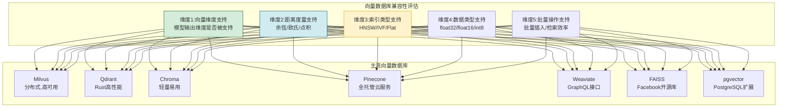

### 5.2 兼容性矩阵

```python
class VectorDBCompatibilityChecker:
    """向量数据库兼容性检查器"""

    # 向量数据库能力矩阵
    VECTOR_DB_PROFILES = {
        "Milvus": {
            "max_dimensions": 32768,
            "distance_metrics": ["cosine", "l2", "ip", "jaccard", "hamming"],
            "index_types": ["HNSW", "IVF_FLAT", "IVF_SQ8", "IVF_PQ", "DISKANN"],
            "data_types": ["float32", "float16", "int8"],
            "batch_insert": True,
            "max_batch_size": 100000,
            "gpu_support": True,
            "distributed": True
        },
        "Qdrant": {
            "max_dimensions": 65536,
            "distance_metrics": ["cosine", "dot", "euclidean"],
            "index_types": ["HNSW"],
            "data_types": ["float32"],
            "batch_insert": True,
            "max_batch_size": 50000,
            "gpu_support": False,
            "distributed": True
        },
        "Chroma": {
            "max_dimensions": 10000,
            "distance_metrics": ["cosine", "l2", "ip"],
            "index_types": ["HNSW"],
            "data_types": ["float32"],
            "batch_insert": True,
            "max_batch_size": 50000,
            "gpu_support": False,
            "distributed": False
        },
        "Pinecone": {
            "max_dimensions": 20000,
            "distance_metrics": ["cosine", "euclidean", "dotproduct"],
            "index_types": ["serverless", "pod-based"],
            "data_types": ["float32"],
            "batch_insert": True,
            "max_batch_size": 100000,
            "gpu_support": True,
            "distributed": True
        },
        "Weaviate": {
            "max_dimensions": 65535,
            "distance_metrics": ["cosine", "dot", "l2-squared", "manhattan", "hamming"],
            "index_types": ["HNSW"],
            "data_types": ["float32"],
            "batch_insert": True,
            "max_batch_size": 50000,
            "gpu_support": True,
            "distributed": True
        },
        "FAISS": {
            "max_dimensions": 4096,
            "distance_metrics": ["l2", "ip"],
            "index_types": ["Flat", "IVF", "HNSW", "PQ", "SQ"],
            "data_types": ["float32", "float16", "int8"],
            "batch_insert": True,
            "max_batch_size": 1000000,
            "gpu_support": True,
            "distributed": False
        },
        "pgvector": {
            "max_dimensions": 2000,
            "distance_metrics": ["cosine", "l2", "ip"],
            "index_types": ["HNSW", "IVFFlat"],
            "data_types": ["float32"],
            "batch_insert": True,
            "max_batch_size": 10000,
            "gpu_support": False,
            "distributed": False
        }
    }

    # Embedding模型输出维度
    MODEL_DIMENSIONS = {
        "bge-small-zh": 512,
        "bge-base-zh": 768,
        "bge-large-zh-v1.5": 1024,
        "bge-m3": 1024,
        "e5-small-v2": 384,
        "e5-base-v2": 768,
        "e5-large-v2": 1024,
        "gte-large-zh": 1024,
        "text-embedding-3-small": 1536,
        "text-embedding-3-large": 3072,
        "voyage-large-2": 1536,
        "jina-embeddings-v2": 768
    }

    def check_compatibility(self, model_name: str,
                             db_name: str) -> dict:
        """检查模型与向量数据库的兼容性"""
        model_dim = self.MODEL_DIMENSIONS.get(model_name)
        db_profile = self.VECTOR_DB_PROFILES.get(db_name)

        if not model_dim or not db_profile:
            return {"compatible": False, "error": "未知模型或数据库"}

        result = {
            "model": model_name,
            "vector_db": db_name,
            "model_dimension": model_dim,
            "compatible": True,
            "issues": [],
            "recommendations": []
        }

        # 检查1:维度支持
        if model_dim > db_profile["max_dimensions"]:
            result["compatible"] = False
            result["issues"].append(
                f"向量维度{model_dim}超过{db_name}最大支持{db_profile['max_dimensions']}"
            )

        # 检查2:距离度量(余弦相似度最常用)
        if "cosine" not in db_profile["distance_metrics"] and \
           "ip" not in db_profile["distance_metrics"]:
            result["issues"].append(
                f"{db_name}不支持余弦相似度,需使用{db_profile['distance_metrics']}"
            )

        # 检查3:数据类型
        if "float32" not in db_profile["data_types"]:
            result["issues"].append(f"{db_name}不支持float32类型")

        # 检查4:GPU支持(如果需要GPU加速)
        if not db_profile["gpu_support"]:
            result["recommendations"].append(
                f"{db_name}不支持GPU加速,大规模检索可能较慢"
            )

        # 检查5:分布式支持(如果需要水平扩展)
        if not db_profile["distributed"]:
            result["recommendations"].append(
                f"{db_name}不支持分布式,数据量大时需考虑迁移"
            )

        return result

    def generate_compatibility_matrix(self) -> list[dict]:
        """生成完整兼容性矩阵"""
        matrix = []
        for model_name in self.MODEL_DIMENSIONS:
            for db_name in self.VECTOR_DB_PROFILES:
                result = self.check_compatibility(model_name, db_name)
                matrix.append({
                    "model": model_name,
                    "vector_db": db_name,
                    "dimension": result["model_dimension"],
                    "compatible": result["compatible"],
                    "issues_count": len(result["issues"])
                })
        return matrix
```

### 5.3 兼容性速查表

| 模型(维度) | Milvus | Qdrant | Chroma | Pinecone | Weaviate | FAISS | pgvector |
|-----------|:------:|:------:|:------:|:--------:|:--------:|:-----:|:--------:|
| bge-small (512) | ✅ | ✅ | ✅ | ✅ | ✅ | ✅ | ✅ |
| bge-base (768) | ✅ | ✅ | ✅ | ✅ | ✅ | ✅ | ✅ |
| bge-large (1024) | ✅ | ✅ | ✅ | ✅ | ✅ | ✅ | ✅ |
| bge-m3 (1024) | ✅ | ✅ | ✅ | ✅ | ✅ | ✅ | ✅ |
| e5-small (384) | ✅ | ✅ | ✅ | ✅ | ✅ | ✅ | ✅ |
| text-embedding-3-large (3072) | ✅ | ✅ | ✅ | ✅ | ✅ | ⚠️ | ⚠️ |

> **注意**:FAISS最大支持4096维,pgvector建议2000维以内。3072维模型使用FAISS/pgvector需注意性能。

---

## 六、维度4:多语言支持能力评估

### 6.1 多语言能力评估框架

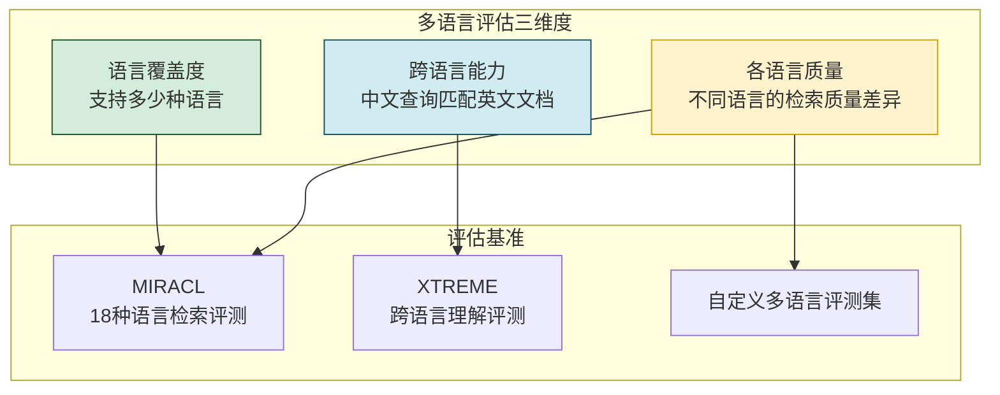

### 6.2 多语言模型能力对比

```python
class MultilingualEvaluator:
    """多语言能力评估器"""

    # 各模型多语言支持情况
    MULTILINGUAL_PROFILES = {
        "bge-large-zh-v1.5": {
            "languages": ["中文", "英文"],
            "cross_lingual": False,       # 不支持跨语言
            "chinese_quality": "优秀",
            "english_quality": "良好",
            "other_languages": "不支持"
        },
        "bge-m3": {
            "languages": ["100+种语言"],
            "cross_lingual": True,        # 支持跨语言
            "chinese_quality": "优秀",
            "english_quality": "优秀",
            "other_languages": "良好"
        },
        "e5-large-v2": {
            "languages": ["英文为主", "有限多语言"],
            "cross_lingual": False,
            "chinese_quality": "一般",
            "english_quality": "优秀",
            "other_languages": "有限"
        },
        "multilingual-e5-large": {
            "languages": ["100+种语言"],
            "cross_lingual": True,
            "chinese_quality": "良好",
            "english_quality": "优秀",
            "other_languages": "良好"
        },
        "text-embedding-3-large": {
            "languages": ["多语言"],
            "cross_lingual": True,
            "chinese_quality": "良好",
            "english_quality": "优秀",
            "other_languages": "良好"
        },
        "Cohere embed-multilingual-v3": {
            "languages": ["100+种语言"],
            "cross_lingual": True,
            "chinese_quality": "良好",
            "english_quality": "优秀",
            "other_languages": "优秀"
        },
        "jina-embeddings-v2": {
            "languages": ["89种语言"],
            "cross_lingual": True,
            "chinese_quality": "良好",
            "english_quality": "优秀",
            "other_languages": "良好"
        }
    }

    def evaluate_multilingual(self, model_name: str,
                               test_languages: list[str]) -> dict:
        """评估模型多语言能力"""
        profile = self.MULTILINGUAL_PROFILES.get(model_name, {})
        if not profile:
            return {"error": f"未知模型: {model_name}"}

        result = {
            "model": model_name,
            "supported_languages": profile["languages"],
            "cross_lingual": profile["cross_lingual"],
            "language_quality": {
                "chinese": profile["chinese_quality"],
                "english": profile["english_quality"],
                "other": profile["other_languages"]
            },
            "test_coverage": {}
        }

        # 评估每种测试语言的覆盖情况
        for lang in test_languages:
            if lang in profile["languages"] or "100+" in str(profile["languages"]):
                result["test_coverage"][lang] = "支持"
            else:
                result["test_coverage"][lang] = "不支持"

        return result

    def cross_lingual_test(self, model, test_pairs: list) -> dict:
        """跨语言检索测试"""
        results = {"total": len(test_pairs), "success": 0, "avg_similarity": 0}
        similarities = []

        for pair in test_pairs:
            # pair: {"query_lang1": "...", "doc_lang2": "...", "relevant": True}
            query_vec = model.embed_query(pair["query_lang1"])
            doc_vec = model.embed_query(pair["doc_lang2"])

            similarity = self._cosine_similarity(query_vec, doc_vec)
            similarities.append(similarity)

            if pair["relevant"] and similarity > 0.6:
                results["success"] += 1

        results["avg_similarity"] = float(np.mean(similarities)) if similarities else 0
        results["success_rate"] = results["success"] / results["total"]
        return results

    def _cosine_similarity(self, vec1, vec2):
        a, b = np.array(vec1), np.array(vec2)
        return float(np.dot(a, b) / (np.linalg.norm(a) * np.linalg.norm(b) + 1e-8))
```

### 6.3 多语言模型选择建议

| 应用场景 | 推荐模型 | 原因 |
|---------|---------|------|
| **纯中文** | bge-large-zh-v1.5 / gte-large-zh | 中文专项优化,性能最佳 |
| **纯英文** | e5-large-v2 / text-embedding-3-large | 英文性能优秀 |
| **中英双语** | bge-m3 / multilingual-e5-large | 支持跨语言,中英都强 |
| **多语言(>5种)** | bge-m3 / Cohere embed-multilingual-v3 | 语言覆盖广,跨语言能力强 |
| **跨语言检索** | bge-m3 / jina-embeddings-v2 | 跨语言语义对齐好 |

---

## 七、维度5:上下文窗口大小评估

### 7.1 上下文窗口的重要性

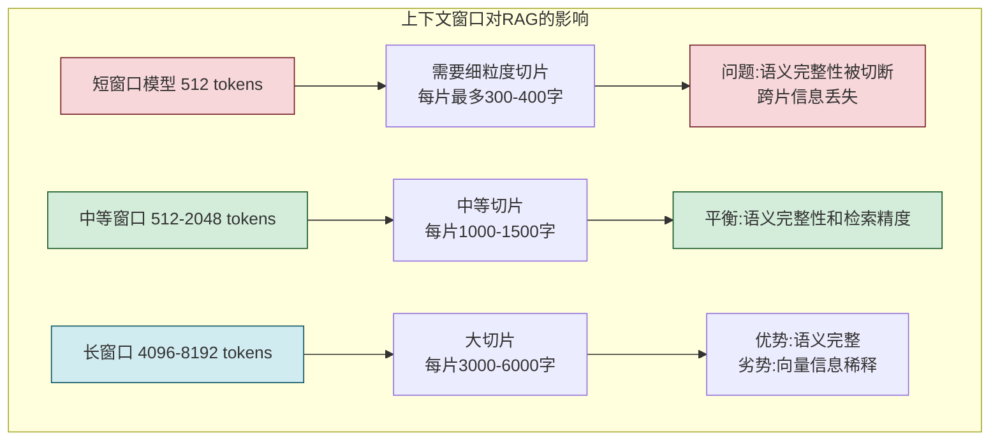

### 7.2 上下文窗口对比

```python
class ContextWindowAnalyzer:
    """上下文窗口分析器"""

    MODEL_CONTEXT_WINDOWS = {
        "bge-small-zh": 512,
        "bge-base-zh": 512,
        "bge-large-zh-v1.5": 512,
        "bge-m3": 8192,                   # 支持长文本
        "e5-small-v2": 512,
        "e5-base-v2": 512,
        "e5-large-v2": 512,
        "gte-large-zh": 512,
        "text-embedding-3-small": 8191,
        "text-embedding-3-large": 8191,
        "voyage-large-2": 16000,
        "jina-embeddings-v2": 8192,
        "Cohere embed-v3": 512
    }

    def analyze_context_window(self, model_name: str,
                                document_lengths: list[int]) -> dict:
        """分析模型的上下文窗口适配性"""
        max_tokens = self.MODEL_CONTEXT_WINDOWS.get(model_name)
        if not max_tokens:
            return {"error": f"未知模型: {model_name}"}

        # 实际可用tokens(预留特殊标记空间)
        usable_tokens = max_tokens - 10

        analysis = {
            "model": model_name,
            "max_context_tokens": max_tokens,
            "usable_tokens": usable_tokens,
            "max_chars_chinese": usable_tokens * 2,    # 中文约2字/token
            "max_chars_english": usable_tokens * 4,    # 英文约4字/token
            "document_analysis": {},
            "chunking_recommendation": ""
        }

        # 分析文档长度分布
        doc_count = len(document_lengths)
        fits_without_split = sum(1 for l in document_lengths if l <= usable_tokens * 3)
        needs_split = doc_count - fits_without_split

        analysis["document_analysis"] = {
            "total_documents": doc_count,
            "fits_without_split": fits_without_split,
            "needs_split": needs_split,
            "split_ratio": needs_split / doc_count if doc_count > 0 else 0,
            "avg_length": int(np.mean(document_lengths)) if document_lengths else 0,
            "max_length": max(document_lengths) if document_lengths else 0
        }

        # 切片策略推荐
        analysis["chunking_recommendation"] = self._recommend_chunk_size(usable_tokens)

        return analysis

    def _recommend_chunk_size(self, max_tokens: int) -> dict:
        """推荐切片大小"""
        # 一般建议使用模型最大窗口的50-70%,保留语义完整性
        if max_tokens <= 512:
            return {
                "recommended_chunk_size": 256,
                "overlap": 50,
                "strategy": "短窗口模型,需细粒度切片",
                "note": "语义可能被切断,建议增加overlap"
            }
        elif max_tokens <= 2048:
            return {
                "recommended_chunk_size": 512,
                "overlap": 100,
                "strategy": "中等窗口,平衡切片",
                "note": "适合大多数RAG场景"
            }
        else:
            return {
                "recommended_chunk_size": 1024,
                "overlap": 200,
                "strategy": "长窗口模型,可使用大切片",
                "note": "注意向量信息稀释问题,建议搭配摘要索引"
            }
```

### 7.3 上下文窗口选择指南

| 文档特点 | 推荐窗口大小 | 推荐模型 | 切片策略 |
|---------|:----------:|---------|---------|
| **短文档(<500字)** | 512足够 | bge-large-zh-v1.5 | 无需切片或大切片 |
| **中等文档(500-2000字)** | 512-2048 | bge-large / e5-large | 256-512切片 |
| **长文档(2000-8000字)** | 2048-8192 | bge-m3 / jina-v2 | 512-1024切片 |
| **超长文档(>8000字)** | 8192+ | voyage-large-2 / bge-m3 | 1024切片+摘要 |
| **代码文档** | 2048+ | bge-m3 / jina-v2 | 按函数/类切片 |
| **对话记录** | 512-1024 | bge-large-zh | 按轮次切片 |

---

## 八、维度6:开源与商业授权评估

### 8.1 授权类型对比

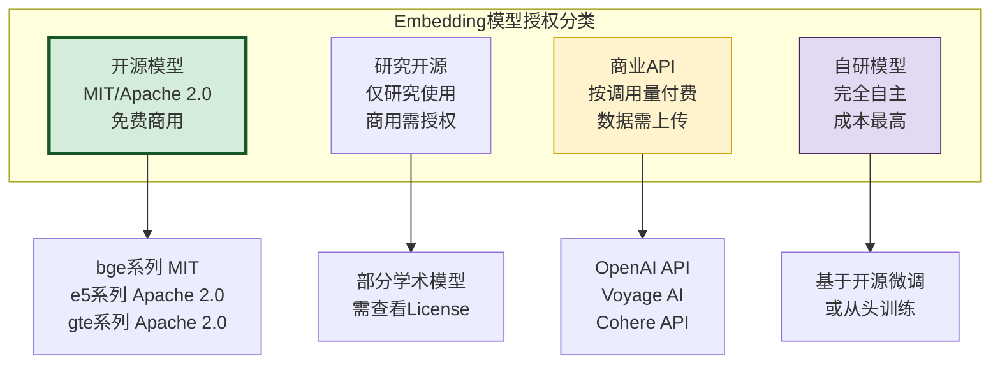

### 8.2 授权详细分析

```python
class LicenseAnalyzer:
    """授权分析器"""

    MODEL_LICENSES = {
        "bge-large-zh-v1.5": {
            "license": "MIT",
            "commercial_use": True,
            "attribution_required": False,
            "redistribution": True,
            "data_privacy": "完全本地部署,数据不出域",
            "cost": "免费",
            "notes": "智源开源,无使用限制"
        },
        "bge-m3": {
            "license": "MIT",
            "commercial_use": True,
            "attribution_required": False,
            "redistribution": True,
            "data_privacy": "完全本地部署,数据不出域",
            "cost": "免费",
            "notes": "智源开源,支持多语言"
        },
        "e5-large-v2": {
            "license": "Apache 2.0",
            "commercial_use": True,
            "attribution_required": True,
            "redistribution": True,
            "data_privacy": "完全本地部署,数据不出域",
            "cost": "免费",
            "notes": "微软开源,需标注来源"
        },
        "gte-large-zh": {
            "license": "Apache 2.0",
            "commercial_use": True,
            "attribution_required": True,
            "redistribution": True,
            "data_privacy": "完全本地部署,数据不出域",
            "cost": "免费",
            "notes": "阿里达摩院开源"
        },
        "jina-embeddings-v2": {
            "license": "Apache 2.0",
            "commercial_use": True,
            "attribution_required": True,
            "redistribution": True,
            "data_privacy": "可本地部署",
            "cost": "免费(本地) / 按量(API)",
            "notes": "Jina AI开源,8K上下文"
        },
        "text-embedding-3-large": {
            "license": "商业API",
            "commercial_use": True,
            "attribution_required": False,
            "redistribution": False,
            "data_privacy": "数据需上传到OpenAI",
            "cost": "$0.13/1M tokens",
            "notes": "OpenAI商业服务,数据合规需评估"
        },
        "voyage-large-2": {
            "license": "商业API",
            "commercial_use": True,
            "attribution_required": False,
            "redistribution": False,
            "data_privacy": "数据需上传到Voyage AI",
            "cost": "$0.12/1M tokens",
            "notes": "Voyage AI商业服务"
        },
        "Cohere embed-v3": {
            "license": "商业API",
            "commercial_use": True,
            "attribution_required": False,
            "redistribution": False,
            "data_privacy": "数据需上传到Cohere",
            "cost": "$0.10/1M tokens",
            "notes": "Cohere商业服务,多语言强"
        }
    }

    def analyze_license(self, model_name: str,
                         use_case: str = "commercial") -> dict:
        """分析模型授权合规性"""
        info = self.MODEL_LICENSES.get(model_name)
        if not info:
            return {"error": f"未知模型: {model_name}"}

        result = {
            "model": model_name,
            "license_type": info["license"],
            "commercial_use": info["commercial_use"],
            "data_privacy": info["data_privacy"],
            "cost": info["cost"],
            "compliant": True,
            "warnings": []
        }

        # 商用合规检查
        if use_case == "commercial" and not info["commercial_use"]:
            result["compliant"] = False
            result["warnings"].append("模型不支持商业使用")

        # 数据隐私检查
        if "上传" in info["data_privacy"]:
            result["warnings"].append(
                "⚠️ 数据需上传到第三方,需评估GDPR/数据安全合规"
            )

        # 署名要求检查
        if info.get("attribution_required"):
            result["warnings"].append(
                "📌 使用需标注来源(检查License要求)"
            )

        return result

    def recommend_by_privacy(self, data_sensitive: bool) -> list[str]:
        """根据数据敏感度推荐模型"""
        if data_sensitive:
            # 敏感数据:只推荐可本地部署的开源模型
            return [
                name for name, info in self.MODEL_LICENSES.items()
                if info["commercial_use"] and "本地部署" in info["data_privacy"]
            ]
        else:
            # 非敏感数据:所有模型均可
            return list(self.MODEL_LICENSES.keys())
```

### 8.3 授权选择决策表

| 需求 | 推荐授权类型 | 推荐模型 | 原因 |
|------|------------|---------|------|
| **数据高度敏感** | 开源本地部署 | bge系列 / gte系列 | 数据不出域 |
| **成本敏感** | 开源 | bge-large-zh-v1.5 | 免费,性能强 |
| **快速验证** | 商业API | text-embedding-3-large | 无需部署,快速试用 |
| **大规模生产** | 开源GPU部署 | bge-m3 / bge-large | 长期成本更低 |
| **合规要求高** | 开源 | MIT/Apache授权模型 | 无数据出境风险 |
| **性能优先** | 商业API | voyage-large-2 | 性能领先 |

---

## 九、维度7:领域适配性评估

### 9.1 通用模型 vs 领域模型

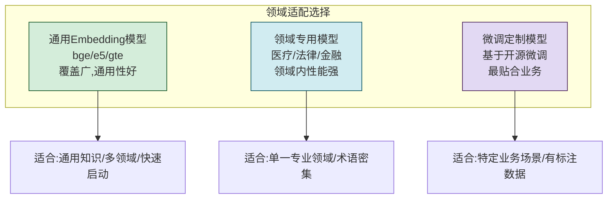

### 9.2 领域适配评估方法

```python
class DomainAdaptationEvaluator:
    """领域适配性评估器"""

    def evaluate_domain_fit(self, model, domain_eval_set: dict) -> dict:
        """评估模型在特定领域的适配性

        Args:
            domain_eval_set: {
                "queries": [...],
                "documents": [...],
                "relevant_pairs": [(query_idx, doc_idx), ...],
                "domain": "医疗"
            }
        """
        # 1. 领域检索质量
        retrieval_metrics = self._eval_domain_retrieval(model, domain_eval_set)

        # 2. 术语理解能力
        terminology_score = self._eval_terminology(model, domain_eval_set)

        # 3. 与通用基准的差距
        domain_gap = self._compute_domain_gap(model, domain_eval_set)

        return {
            "domain": domain_eval_set["domain"],
            "retrieval_quality": retrieval_metrics,
            "terminology_understanding": terminology_score,
            "domain_gap": domain_gap,
            "recommendation": self._recommend_adaptation(
                retrieval_metrics, domain_gap
            )
        }

    def _eval_domain_retrieval(self, model, eval_set: dict) -> dict:
        """评估领域检索质量"""
        # 向量化所有文档
        doc_embeddings = model.embed_documents(eval_set["documents"])

        # 向量化所有查询
        query_embeddings = model.embed_documents(eval_set["queries"])

        # 计算检索质量
        relevant_pairs = eval_set["relevant_pairs"]
        recall_at_5 = self._compute_recall(
            query_embeddings, doc_embeddings, relevant_pairs, k=5
        )
        mrr = self._compute_mrr(
            query_embeddings, doc_embeddings, relevant_pairs
        )

        return {
            "recall@5": recall_at_5,
            "mrr": mrr,
            "sample_size": len(eval_set["queries"])
        }

    def _eval_terminology(self, model, eval_set: dict) -> dict:
        """评估术语理解能力"""
        # 通过术语对的相似度判断模型是否理解专业术语
        # (简化实现)
        return {
            "score": 0.0,
            "note": "需要术语对测试集"
        }

    def _compute_domain_gap(self, model, eval_set: dict) -> dict:
        """计算领域性能与通用性能的差距"""
        # 在通用数据集和领域数据集上分别评估
        # 简化实现
        return {
            "general_score": 0.0,
            "domain_score": 0.0,
            "gap": 0.0
        }

    def _recommend_adaptation(self, retrieval_metrics: dict,
                                domain_gap: dict) -> str:
        """推荐适配策略"""
        recall = retrieval_metrics.get("recall@5", 0)
        if recall > 0.8:
            return "通用模型已足够,无需领域适配"
        elif recall > 0.6:
            return "建议微调以提升领域性能"
        else:
            return "建议使用领域专用模型或从头微调"

    def _compute_recall(self, query_vecs, doc_vecs,
                         relevant_pairs, k=5):
        """计算Recall@K"""
        hit = 0
        for q_idx, d_idx in relevant_pairs:
            similarities = [
                self._cosine(query_vecs[q_idx], doc_vecs[i])
                for i in range(len(doc_vecs))
            ]
            top_k_indices = np.argsort(similarities)[-k:]
            if d_idx in top_k_indices:
                hit += 1
        return hit / len(relevant_pairs) if relevant_pairs else 0

    def _compute_mrr(self, query_vecs, doc_vecs, relevant_pairs):
        """计算MRR"""
        mrr = 0
        for q_idx, d_idx in relevant_pairs:
            similarities = [
                self._cosine(query_vecs[q_idx], doc_vecs[i])
                for i in range(len(doc_vecs))
            ]
            ranked = np.argsort(similarities)[::-1]
            rank = np.where(ranked == d_idx)[0][0] + 1
            mrr += 1.0 / rank
        return mrr / len(relevant_pairs) if relevant_pairs else 0

    def _cosine(self, vec1, vec2):
        a, b = np.array(vec1), np.array(vec2)
        return float(np.dot(a, b) / (np.linalg.norm(a) * np.linalg.norm(b) + 1e-8))
```

### 9.3 领域适配策略

| 领域性能 | 适配策略 | 成本 | 效果 |
|---------|---------|:----:|:----:|
| **Recall@5 > 0.8** | 直接使用通用模型 | 低 | 足够 |
| **0.6 < Recall@5 < 0.8** | Prompt-based微调 | 中 | 提升10-20% |
| **0.4 < Recall@5 < 0.6** | 对比学习微调 | 高 | 提升20-40% |
| **Recall@5 < 0.4** | 使用领域模型或从头训练 | 极高 | 提升40%+ |

---

## 十、主流 Embedding 模型全景对比

### 10.1 综合对比矩阵

| 模型 | 维度 | 上下文 | 语言 | 授权 | 部署 | 性能(C-MTEB) | 特点 |
|------|:----:|:------:|:----:|:----:|:----:|:----------:|------|
| bge-large-zh-v1.5 | 1024 | 512 | 中英 | MIT | 本地 | ★★★★★ | 中文最强开源 |
| bge-m3 | 1024 | 8192 | 100+ | MIT | 本地 | ★★★★★ | 多语言+长文本 |
| bge-base-zh | 768 | 512 | 中英 | MIT | 本地 | ★★★★ | 性价比高 |
| e5-large-v2 | 1024 | 512 | 英文为主 | Apache 2.0 | 本地 | ★★★★ | 英文强 |
| multilingual-e5 | 1024 | 512 | 100+ | Apache 2.0 | 本地 | ★★★★ | 多语言 |
| gte-large-zh | 1024 | 512 | 中英 | Apache 2.0 | 本地 | ★★★★ | 阿里开源 |
| text-embedding-3-large | 3072 | 8191 | 多语言 | 商业 | API | ★★★★ | OpenAI旗舰 |
| text-embedding-3-small | 1536 | 8191 | 多语言 | 商业 | API | ★★★ | OpenAI经济版 |
| voyage-large-2 | 1536 | 16000 | 多语言 | 商业 | API | ★★★★★ | 性能领先 |
| Cohere embed-v3 | 1024 | 512 | 100+ | 商业 | API | ★★★★ | 多语言强 |
| jina-embeddings-v2 | 768 | 8192 | 89 | Apache 2.0 | 本地/API | ★★★★ | 长文本 |

### 10.2 按场景排序推荐

```mermaid
flowchart TB
    subgraph 场景化推荐排序
        S1[中文RAG<br/>1.bge-large-zh-v1.5<br/>2.gte-large-zh<br/>3.bge-m3]
        S2[多语言RAG<br/>1.bge-m3<br/>2.multilingual-e5<br/>3.Cohere embed-v3]
        S3[长文档RAG<br/>1.voyage-large-2<br/>2.bge-m3<br/>3.jina-v2]
        S4[数据敏感RAG<br/>1.bge-large-zh<br/>2.bge-m3<br/>3.gte-large-zh]
        S5[快速验证<br/>1.text-embedding-3-large<br/>2.voyage-large-2<br/>3.Cohere embed-v3]
        S6[大规模生产<br/>1.bge-m3(GPU)<br/>2.bge-large-zh(GPU)<br/>3.e5-large-v2(GPU)]
    end

    style S1 fill:#d4edda,stroke:#155727
    style S2 fill:#d1ecf1,stroke:#0c5460
    style S3 fill:#fff3cd,stroke:#d39e00
    style S4 fill:#e2d9f3,stroke:#4a235a
    style S5 fill:#fce4ec,stroke:#880e4f
    style S6 fill:#e3f2fd,stroke:#0d47a1
```

---

## 十一、选型决策流程与框架

### 11.1 完整决策流程

```mermaid
flowchart TD
    START([开始选型]) --> S1[明确RAG应用场景<br/>问答/搜索/推荐/分析]

    S1 --> S2[分析数据特点<br/>语言/领域/长度/规模]

    S2 --> S3{数据语言?}
    S3 -->|纯中文| C1[中文模型优先<br/>bge-large-zh / gte-large-zh]
    S3 -->|纯英文| C2[英文模型优先<br/>e5-large / text-embedding-3]
    S3 -->|多语言| C3[多语言模型<br/>bge-m3 / multilingual-e5]

    C1 & C2 & C3 --> S4{数据敏感度?}
    S4 -->|高度敏感| D1[只选开源本地部署<br/>排除商业API]
    S4 -->|一般| D2[开源或API均可]

    D1 & D2 --> S5{文档平均长度?}
    S5 -->|<2000字| E1[512窗口足够<br/>bge-large / e5-large]
    S5 -->|2000-8000字| E2[需要长窗口<br/>bge-m3 / jina-v2]
    S5 -->|>8000字| E3[超长窗口<br/>voyage-large-2 / bge-m3]

    E1 & E2 & E3 --> S6{部署方式?}
    S6 -->|API调用| F1[选择商业API<br/>text-embedding-3 / voyage]
    S6 -->|本地GPU| F2[选择开源大模型<br/>bge-large / bge-m3]
    S6 -->|本地CPU| F3[选择轻量模型<br/>bge-small / bge-base]

    F1 & F2 & F3 --> S7{向量数据库?}
    S7 --> G1[确认兼容性<br/>维度/距离/索引]
    G1 --> S8{月查询量?}
    S8 -->|<500万tokens| H1[API更经济]
    S8 -->|>500万tokens| H2[本地部署更经济]

    H1 & H2 --> S9[领域评测验证]
    S9 --> S10{Recall@5 > 0.7?}
    S10 -->|是| FINAL[✅ 确定模型]
    S10 -->|否| S11[考虑微调或换模型]
    S11 --> S9

    style START fill:#d4edda,stroke:#155727
    style FINAL fill:#d4edda,stroke:#155727,stroke-width:3px
    style S10 fill:#fff3cd,stroke:#d39e00
```

### 11.2 决策框架代码实现

```python
class EmbeddingModelSelector:
    """Embedding 模型选择器"""

    def __init__(self):
        self.evaluator = EmbeddingModelEvaluator(EvaluationConfig())
        self.compatibility_checker = VectorDBCompatibilityChecker()
        self.license_analyzer = LicenseAnalyzer()

    def select(self, requirements: dict) -> dict:
        """根据需求选择最佳模型

        Args:
            requirements: {
                "language": "chinese" | "english" | "multilingual",
                "data_sensitive": bool,
                "avg_doc_length": int,
                "deployment": "api" | "gpu" | "cpu",
                "vector_db": str,
                "monthly_queries": int,
                "domain": str,
                "budget": "low" | "medium" | "high"
            }
        """
        # 步骤1:语言筛选
        candidates = self._filter_by_language(requirements["language"])

        # 步骤2:数据隐私筛选
        if requirements.get("data_sensitive", False):
            candidates = self._filter_by_privacy(candidates)

        # 步骤3:上下文窗口筛选
        candidates = self._filter_by_context_window(
            candidates, requirements["avg_doc_length"]
        )

        # 步骤4:部署方式筛选
        candidates = self._filter_by_deployment(
            candidates, requirements["deployment"]
        )

        # 步骤5:向量库兼容性筛选
        candidates = self._filter_by_compatibility(
            candidates, requirements["vector_db"]
        )

        # 步骤6:成本筛选
        candidates = self._filter_by_cost(
            candidates, requirements["monthly_queries"], requirements["budget"]
        )

        # 步骤7:排序推荐
        ranked = self._rank_candidates(candidates, requirements)

        return {
            "recommended": ranked[0] if ranked else None,
            "alternatives": ranked[1:3] if len(ranked) > 1 else [],
            "selection_reason": self._explain_selection(
                ranked[0] if ranked else None, requirements
            )
        }

    def _filter_by_language(self, language: str) -> list[str]:
        filters = {
            "chinese": ["bge-large-zh-v1.5", "bge-m3", "gte-large-zh",
                        "bge-base-zh", "bge-small-zh"],
            "english": ["e5-large-v2", "text-embedding-3-large",
                        "voyage-large-2", "bge-m3"],
            "multilingual": ["bge-m3", "multilingual-e5-large",
                             "Cohere embed-v3", "jina-embeddings-v2",
                             "text-embedding-3-large"]
        }
        return filters.get(language, ["bge-m3"])

    def _filter_by_privacy(self, candidates: list[str]) -> list[str]:
        return [
            c for c in candidates
            if c in self.license_analyzer.recommend_by_privacy(True)
        ]

    def _filter_by_context_window(self, candidates: list[str],
                                    avg_length: int) -> list[str]:
        if avg_length > 6000:
            long_window_models = ["bge-m3", "voyage-large-2",
                                   "jina-embeddings-v2", "text-embedding-3-large"]
            return [c for c in candidates if c in long_window_models]
        return candidates

    def _filter_by_deployment(self, candidates: list[str],
                                deployment: str) -> list[str]:
        if deployment == "api":
            api_models = ["text-embedding-3-large", "voyage-large-2",
                          "Cohere embed-v3"]
            return [c for c in candidates if c in api_models]
        return candidates  # 本地部署模型都支持

    def _filter_by_compatibility(self, candidates: list[str],
                                   vector_db: str) -> list[str]:
        compatible = []
        for model in candidates:
            result = self.compatibility_checker.check_compatibility(model, vector_db)
            if result["compatible"]:
                compatible.append(model)
        return compatible

    def _filter_by_cost(self, candidates: list[str],
                         monthly_queries: int, budget: str) -> list[str]:
        if budget == "low":
            # 低预算:优先开源
            return [c for c in candidates
                    if c not in ["voyage-large-2", "text-embedding-3-large"]]
        return candidates

    def _rank_candidates(self, candidates: list[str],
                          requirements: dict) -> list[str]:
        # 简化排序:基于性能评分
        performance_ranking = {
            "bge-m3": 0.95, "bge-large-zh-v1.5": 0.93,
            "voyage-large-2": 0.94, "gte-large-zh": 0.90,
            "text-embedding-3-large": 0.92, "e5-large-v2": 0.88,
            "multilingual-e5-large": 0.89, "Cohere embed-v3": 0.91,
            "jina-embeddings-v2": 0.87
        }
        return sorted(candidates,
                       key=lambda x: performance_ranking.get(x, 0.5),
                       reverse=True)

    def _explain_selection(self, model: str, requirements: dict) -> str:
        if not model:
            return "未找到满足所有条件的模型,请放宽约束"
        reasons = [f"推荐模型: {model}"]
        reasons.append(f"语言适配: {requirements['language']}")
        reasons.append(f"部署方式: {requirements['deployment']}")
        if requirements.get("data_sensitive"):
            reasons.append("支持本地部署,数据安全")
        return "; ".join(reasons)
```

---

## 十二、典型场景推荐方案

### 12.1 场景一:企业知识库问答(中文)

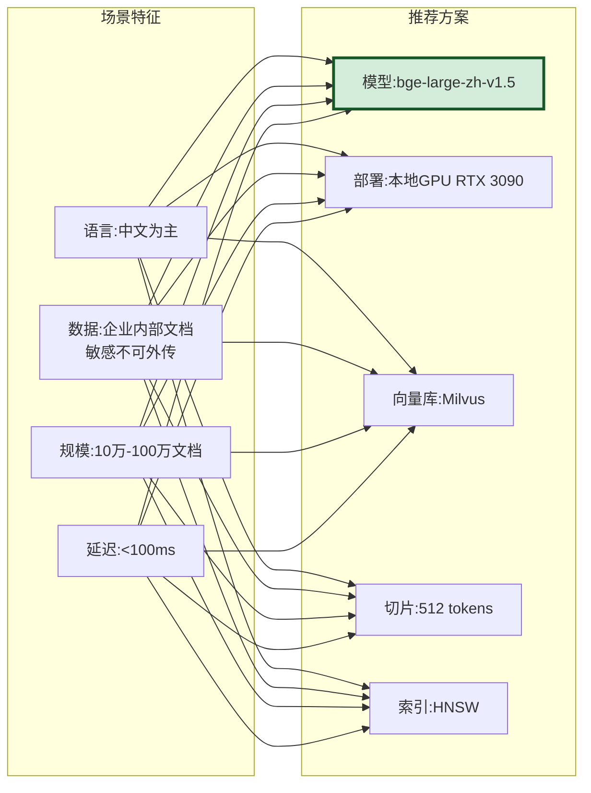

| 配置项 | 推荐值 | 原因 |
|-------|--------|------|
| **Embedding模型** | bge-large-zh-v1.5 | 中文性能最强,MIT开源,数据不出域 |
| **部署方式** | 本地GPU (RTX 3090) | 低延迟,数据安全 |
| **向量数据库** | Milvus | 支持分布式,大规模 |
| **切片大小** | 512 tokens | 中文语义完整 |
| **索引类型** | HNSW | 检索速度快 |
| **预估成本** | $3000(硬件一次性) | 长期运营成本低 |

### 12.2 场景二:多语言客服系统

| 配置项 | 推荐值 | 原因 |
|-------|--------|------|
| **Embedding模型** | bge-m3 | 100+语言,跨语言检索 |
| **部署方式** | 本地GPU (A10) | 多语言模型较大 |
| **向量数据库** | Qdrant | 高性能,易维护 |
| **切片大小** | 768 tokens | 兼顾多语言 |
| **索引类型** | HNSW | 通用高效 |
| **预估成本** | $5000(硬件) | 含多语言处理 |

### 12.3 场景三:快速原型验证

| 配置项 | 推荐值 | 原因 |
|-------|--------|------|
| **Embedding模型** | text-embedding-3-large | 无需部署,快速接入 |
| **部署方式** | OpenAI API | 零运维 |
| **向量数据库** | Chroma | 轻量易用 |
| **切片大小** | 512 tokens | 通用配置 |
| **索引类型** | HNSW(内置) | 默认即可 |
| **预估成本** | $10-50/月 | 按量付费 |

### 12.4 场景四:法律文档检索(长文档)

| 配置项 | 推荐值 | 原因 |
|-------|--------|------|
| **Embedding模型** | bge-m3 / voyage-large-2 | 8K上下文,法律文档长 |
| **部署方式** | 本地GPU / API | 根据数据敏感度 |
| **向量数据库** | Milvus / Pinecone | 大规模存储 |
| **切片大小** | 1024 tokens | 保留法律条款完整 |
| **索引类型** | HNSW + 重排 | 精准检索 |
| **预估成本** | 视部署方式 | 长文档需更多存储 |

### 12.5 场景五:成本敏感型项目

| 配置项 | 推荐值 | 原因 |
|-------|--------|------|
| **Embedding模型** | bge-base-zh | 性价比高,768维 |
| **部署方式** | 本地CPU (8核) | 无需GPU |
| **向量数据库** | Chroma / pgvector | 轻量免费 |
| **切片大小** | 256 tokens | 减少存储 |
| **索引类型** | HNSW | CPU也支持 |
| **预估成本** | $500(硬件) | 极低运营成本 |

---

## 十三、选型实践与最佳实践

### 13.1 选型 Checklist

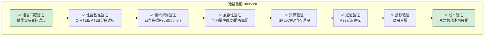

### 13.2 最佳实践

| 实践 | 描述 | 优先级 |
|------|------|:------:|
| **先评估再选型** | 用业务数据评测,不盲目相信榜单 | 高 |
| **中文优先bge** | bge系列中文性能最强 | 高 |
| **多语言选bge-m3** | 语言覆盖广,跨语言能力强 | 高 |
| **敏感数据必本地** | 数据不出域,选开源本地部署 | 高 |
| **预留升级路径** | 接口抽象,方便未来换模型 | 中 |
| **定期重新评估** | 新模型发布后重新评估 | 中 |
| **向量归一化** | 存储前L2归一化,加速检索 | 中 |
| **监控检索质量** | 上线后持续监控Recall/MRR | 高 |

### 13.3 常见选型误区

| 误区 | 后果 | 正确做法 |
|------|------|---------|
| **盲目追求最高分** | 过度投入资源 | 够用即可,性价比优先 |
| **只看榜单不测业务** | 领域适配差 | 必须用业务数据评测 |
| **忽略数据隐私** | 合规风险 | 敏感数据选本地部署 |
| **忽略维度兼容性** | 向量库不支持 | 选型前检查兼容性 |
| **忽视上下文窗口** | 长文档语义丢失 | 根据文档长度选窗口 |
| **一次性选型不迭代** | 错过更好的模型 | 定期重新评估 |

### 13.4 迁移策略

当需要更换 Embedding 模型时:

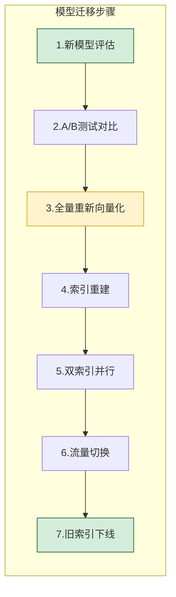

| 迁移步骤 | 关键点 | 风险 |
|---------|--------|------|
| **新模型评估** | 用业务数据验证 | 性能可能不如预期 |
| **A/B测试** | 10%流量对比 | 短期效果波动 |
| **全量重新向量化** | 耗时长,需停机或双写 | 数据不一致 |
| **索引重建** | 需要额外存储空间 | 成本增加 |
| **双索引并行** | 两套索引同时维护 | 资源消耗大 |
| **流量切换** | 逐步切换 | 可回滚 |

---

## 十四、总结

### 14.1 核心要点回顾

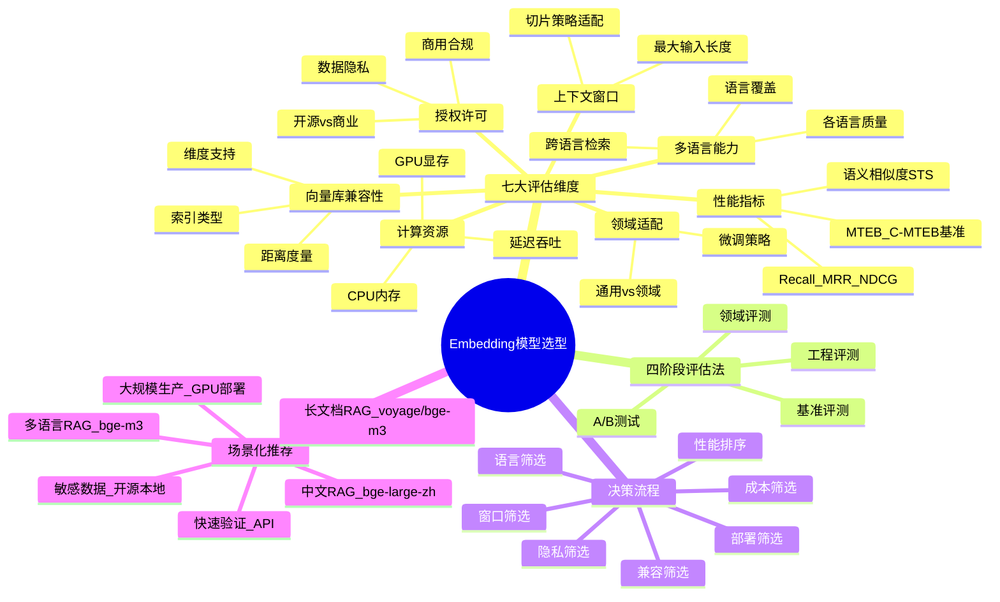

### 14.2 核心结论

> **Embedding 模型选型没有"最优解",只有"最适解"**——最好的模型不是榜单第一的模型,而是最匹配你的应用场景、数据特点、资源约束和合规要求的模型。选型的核心方法是:**场景驱动→多维筛选→业务验证→持续迭代**。通过七大维度的系统评估和四阶段评估法,找到性能、成本、合规的最佳平衡点。

### 14.3 选型速查决策树

```
你的RAG系统是?
├── 纯中文 → 数据敏感?
│   ├── 是 → bge-large-zh-v1.5(本地GPU)
│   └── 否 → bge-large-zh-v1.5 或 text-embedding-3-large(API)
├── 多语言 → bge-m3(本地) 或 Cohere embed-v3(API)
├── 长文档(>6K字) → voyage-large-2(API) 或 bge-m3(本地)
├── 数据高度敏感 → bge系列/gte系列(开源本地部署)
├── 快速验证 → text-embedding-3-large(API)
├── 大规模生产 → bge-m3(本地GPU集群)
└── 成本敏感 → bge-base-zh(本地CPU)
```

### 14.4 与系列文档的关系

- [58RAG Embedding模型深度解析.md](./58RAG%20Embedding模型深度解析.md):模型原理与概述级选型,本文是详细选型指南
- [59Embedding向量在RAG系统中的核心作用深度解析.md](./59Embedding向量在RAG系统中的核心作用深度解析.md):向量在RAG中的作用,本文解决"用什么模型生成向量"
- [51RAG检索增强生成详解.md](./51RAG检索增强生成详解.md):RAG整体概念
- [56RAG文档切片策略深度解析.md](./56RAG文档切片策略深度解析.md):切片影响向量化,与本文上下文窗口章节呼应
- [57RAG分块大小最佳选择策略深度解析.md](./57RAG分块大小最佳选择策略深度解析.md):分块大小与模型窗口匹配

---

> **相关文档**
>
> - [58RAG Embedding模型深度解析.md](./58RAG%20Embedding模型深度解析.md):Embedding模型定义、原理与概述级选型
> - [59Embedding向量在RAG系统中的核心作用深度解析.md](./59Embedding向量在RAG系统中的核心作用深度解析.md):Embedding向量在RAG中的核心作用
> - [51RAG检索增强生成详解.md](./51RAG检索增强生成详解.md):RAG整体概念与架构
> - [56RAG文档切片策略深度解析.md](./56RAG文档切片策略深度解析.md):文档切片对向量化的影响
> - [57RAG分块大小最佳选择策略深度解析.md](./57RAG分块大小最佳选择策略深度解析.md):分块大小与模型窗口的匹配
