# 向量数据库在 RAG 系统中的核心作用深度解析

> **文档定位**:本文档聚焦**向量数据库在 RAG(检索增强生成)系统中作为核心基础设施所发挥的作用**,从语义检索支撑、知识持久化管理、高效索引构建、与大模型协同、以及对生成质量提升五大维度,深入阐述向量数据库如何成为连接"知识库"与"LLM 生成"的关键桥梁。
>
> **与系列文档的关系**:[59Embedding向量在RAG系统中的核心作用深度解析.md](./59Embedding向量在RAG系统中的核心作用深度解析.md) 侧重于 Embedding **向量本身**的语义桥梁作用,本文则聚焦**向量数据库**这一基础设施如何支撑 RAG 的存储、检索与协同。两文互补,共同构成 RAG 检索基础设施的完整认知。
>
> **阅读建议**:建议先阅读 [51RAG检索增强生成详解.md](./51RAG检索增强生成详解.md)、[52RAG工作流程详解.md](./52RAG工作流程详解.md) 建立 RAG 全局认知,再阅读 [58RAG Embedding模型深度解析.md](./58RAG%20Embedding模型深度解析.md)、[59Embedding向量在RAG系统中的核心作用深度解析.md](./59Embedding向量在RAG系统中的核心作用深度解析.md) 理解 Embedding 机制,最后阅读本文理解向量数据库的不可替代性。

---

## 目录

- [一、向量数据库在 RAG 中的核心地位](#一向量数据库在-rag-中的核心地位)
- [二、语义检索的核心支撑作用](#二语义检索的核心支撑作用)
- [三、知识持久化与动态管理机制](#三知识持久化与动态管理机制)
- [四、高效索引构建与查询优化](#四高效索引构建与查询优化)
- [五、与大语言模型的协同方式](#五与大语言模型的协同方式)
- [六、对生成内容准确性的贡献](#六对生成内容准确性的贡献)
- [七、对生成内容相关性的贡献](#七对生成内容相关性的贡献)
- [八、对生成内容时效性的贡献](#八对生成内容时效性的贡献)
- [九、向量数据库在 RAG 全流程中的作用](#九向量数据库在-rag-全流程中的作用)
- [十、主流向量数据库能力对比](#十主流向量数据库能力对比)
- [十一、优化策略与最佳实践](#十一优化策略与最佳实践)
- [十二、总结与未来展望](#十二总结与未来展望)

---

## 一、向量数据库在 RAG 中的核心地位

### 1.1 RAG 的根本需求:大规模语义检索

RAG 系统的核心思想是"先检索后生成":从海量知识库中找到与用户问题语义相关的内容,作为上下文喂给 LLM 生成回答。这产生了一个根本性需求——**如何在大规模知识库中快速完成语义检索?**

```mermaid
flowchart TB
    subgraph RAG 核心流程
        Q[用户问题<br/>"如何处理内存泄漏?"]
        R[检索阶段<br/>从知识库找相关内容]
        G[生成阶段<br/>LLM 基于检索结果回答]
    end
    
    Q --> R --> G
    
    subgraph 检索阶段的核心挑战
        C1[规模挑战<br/>百万到十亿级文档]
        C2[语义挑战<br/>不是关键词匹配而是语义匹配]
        C3[速度挑战<br/>毫秒级响应]
        C4[动态挑战<br/>知识持续更新]
    end
    
    R -.->|必须解决| C1
    R -.->|必须解决| C2
    R -.->|必须解决| C3
    R -.->|必须解决| C4
    
    VDB[(向量数据库<br/>同时解决四大挑战)]
    R --> VDB
    
    style R fill:#fa8c16,color:#fff
    style VDB fill:#4a90d9,color:#fff
```

### 1.2 向量数据库的三大不可替代角色

向量数据库在 RAG 中扮演三个不可替代的核心角色:

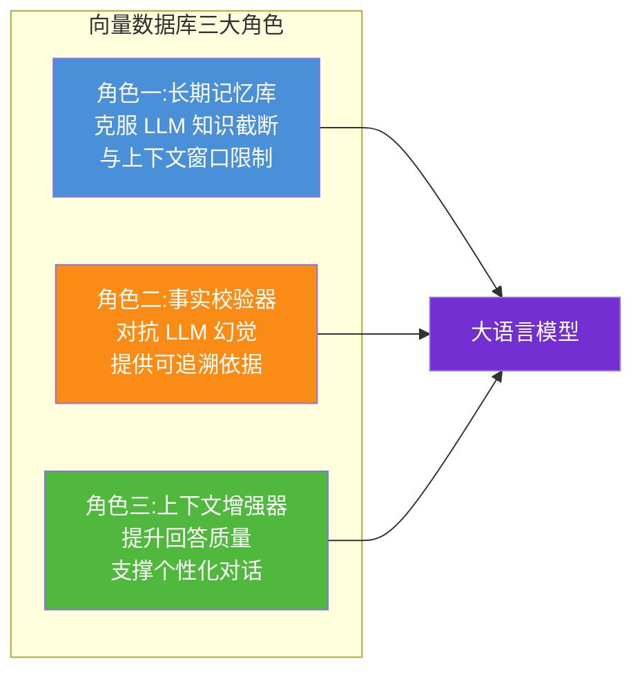

#### 角色一:长期记忆库

LLM 存在两大固有局限:**知识截断**(训练数据有截止日期)和**上下文窗口限制**(无法在一次对话中处理无限长的历史)。向量数据库作为 LLM 的"外部长期记忆",将私有知识、最新信息、历史对话持久化存储,让 LLM 从"无状态"变为"有状态"。

#### 角色二:事实校验器

每次生成答案前,向量数据库先检索相关原文片段作为**事实依据**,将 LLM 约束在"基于给定上下文回答"的范围内,显著降低编造信息(幻觉)的概率,且每段回答可附带原文出处,建立用户信任机制。

#### 角色三:上下文增强器

存储用户历史交互向量化表示,在多轮对话中检索相关历史上下文,实现个性化、连续性对话;同时支持多模态数据(文本、图像、音频)统一检索,丰富上下文维度。

### 1.3 与传统数据库的本质区别

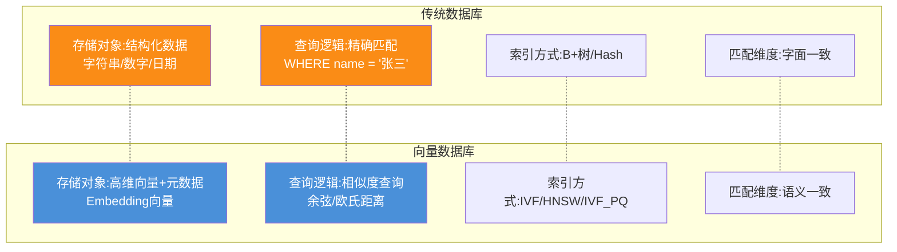

| 对比维度 | 传统关系型数据库 | 向量数据库 |
|---------|----------------|-----------|
| **存储对象** | 结构化数据(行列) | 高维向量 + 元数据 |
| **查询逻辑** | 精确匹配(WHERE/JOIN) | 相似度查询(余弦/欧氏距离) |
| **索引方式** | B+树 / Hash 索引 | IVF / HNSW / IVF_PQ |
| **匹配维度** | 字面一致 | 语义一致 |
| **查询复杂度** | O(log n) | O(log n)(ANN 近似) |
| **核心场景** | 事务处理、业务数据 | 语义检索、推荐系统 |
| **RAG 适用性** | ❌ 无法支持语义检索 | ✅ 原生支持 |

**关键洞察**:RAG 的核心是"语义检索",而传统数据库只能做"关键词匹配"。用户问"如何处理内存泄漏",知识库里存的是"Java 垃圾回收机制详解"、"OOM 错误的解决方案"——没有"内存泄漏"这个关键词,传统数据库找不到,但向量数据库能通过语义相似度准确召回。

---

## 二、语义检索的核心支撑作用

### 2.1 从关键词匹配到语义检索

```mermaid
flowchart LR
    subgraph 传统关键词检索的局限
        Q1[用户问题<br/>"如何处理内存泄漏?"]
        K1[关键词: 内存、泄漏]
        D1[文档1: Java垃圾回收<br/>无关键词]
        D2[文档2: OOM错误排查<br/>无关键词]
        D3[文档3: 内存泄漏修复<br/>有关键词]
        K1 -->|只匹配到| D3
        D1 -.->|语义相关但被漏召| X1[❌ 漏召]
        D2 -.->|语义相关但被漏召| X1
    end
    
    subgraph 向量数据库语义检索
        Q2[用户问题<br/>向量化]
        V1[文档1向量<br/>0.92相似度]
        V2[文档2向量<br/>0.89相似度]
        V3[文档3向量<br/>0.95相似度]
        Q2 -->|余弦相似度| V1
        Q2 -->|余弦相似度| V2
        Q2 -->|余弦相似度| V3
    end
    
    style X1 fill:#f5222d,color:#fff
    style V1 fill:#50b83c,color:#fff
    style V2 fill:#50b83c,color:#fff
    style V3 fill:#50b83c,color:#fff
```

### 2.2 向量数据库语义检索的技术实现

向量数据库通过 **ANN(近似最近邻)算法** 实现毫秒级语义检索:

```python
# 向量数据库语义检索的核心流程
import numpy as np
from typing import List, Dict

class VectorDBSemanticRetrieval:
    """向量数据库语义检索示例"""
    
    def __init__(self, vector_db_client, embedding_model):
        self.db = vector_db_client  # 如 Milvus/Qdrant/Pinecone
        self.embedder = embedding_model
    
    def ingest_documents(self, documents: List[Dict]):
        """文档入库:向量化 + 存储"""
        # Step 1: 文档切片
        chunks = self._split_documents(documents)
        
        # Step 2: 批量向量化
        texts = [chunk["text"] for chunk in chunks]
        embeddings = self.embedder.encode(texts)  # 生成向量
        
        # Step 3: 存入向量数据库(向量 + 原文 + 元数据)
        self.db.insert(
            collection_name="knowledge_base",
            data=[
                {
                    "id": chunk["id"],
                    "vector": embedding.tolist(),
                    "text": chunk["text"],
                    "source": chunk["source"],
                    "page": chunk["page"],
                    "timestamp": chunk["timestamp"]
                }
                for chunk, embedding in zip(chunks, embeddings)
            ]
        )
    
    def semantic_search(self, query: str, top_k: int = 5) -> List[Dict]:
        """语义检索:核心能力"""
        # Step 1: 查询向量化
        query_vector = self.embedder.encode([query])[0]
        
        # Step 2: 向量数据库执行相似度查询
        results = self.db.search(
            collection_name="knowledge_base",
            data=[query_vector.tolist()],
            anns_field="vector",
            param={"metric_type": "COSINE", "params": {"nprobe": 16}},
            limit=top_k,
            output_fields=["text", "source", "page", "timestamp"]
        )
        
        # Step 3: 返回 Top-K 结果(按相似度排序)
        return [
            {
                "text": hit["entity"]["text"],
                "source": hit["entity"]["source"],
                "score": hit["distance"],  # 相似度分数
                "page": hit["entity"]["page"]
            }
            for hit in results[0]
        ]
    
    def _split_documents(self, documents):
        """文档切片(详见 56、57 号文档)"""
        # 简化实现
        chunks = []
        for doc in documents:
            # 按 512 token 切片,重叠 50 token
            for i, chunk_text in enumerate(self._chunk_text(doc["content"], 512, 50)):
                chunks.append({
                    "id": f"{doc['id']}_chunk_{i}",
                    "text": chunk_text,
                    "source": doc["source"],
                    "page": i,
                    "timestamp": doc.get("timestamp")
                })
        return chunks
```

### 2.3 三种相似度度量方式

向量数据库支持多种相似度度量,适配不同场景:

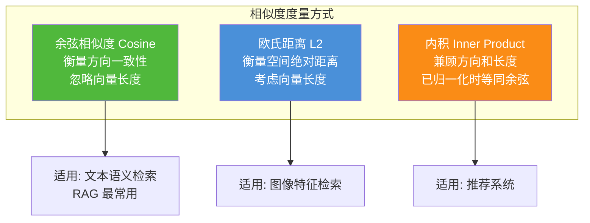

| 度量方式 | 公式 | 特点 | RAG 适用性 |
|---------|------|------|-----------|
| **余弦相似度** | $\cos(\theta) = \frac{A \cdot B}{\|A\| \|B\|}$ | 衡量方向,忽略长度 | ⭐⭐⭐⭐⭐ 最常用 |
| **欧氏距离 L2** | $d = \sqrt{\sum(a_i - b_i)^2}$ | 衡量绝对距离 | ⭐⭐⭐ 适合图像 |
| **内积 IP** | $s = \sum a_i \cdot b_i$ | 兼顾方向和长度 | ⭐⭐⭐ 适合推荐 |

---

## 三、知识持久化与动态管理机制

### 3.1 知识持久化:克服 LLM 两大局限

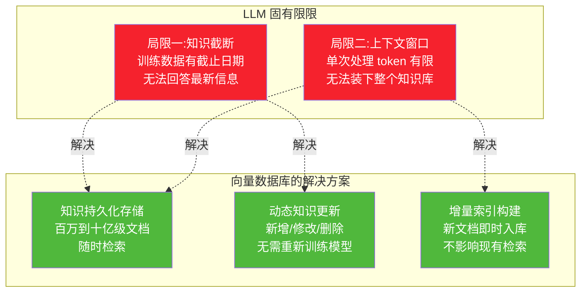

### 3.2 动态知识管理:CUD 操作

向量数据库支持知识的动态增删改,这是 RAG 系统时效性的基础:

```python
class KnowledgeManager:
    """向量数据库知识管理器"""
    
    def __init__(self, vector_db_client, embedding_model):
        self.db = vector_db_client
        self.embedder = embedding_model
    
    def add_knowledge(self, documents: List[Dict]):
        """新增知识:增量入库,无需重建索引"""
        # Step 1: 向量化新文档
        embeddings = self.embedder.encode([d["text"] for d in documents])
        
        # Step 2: 插入向量数据库(自动增量索引)
        self.db.insert(
            collection_name="knowledge_base",
            data=[
                {
                    "id": doc["id"],
                    "vector": emb.tolist(),
                    "text": doc["text"],
                    "source": doc["source"],
                    "timestamp": datetime.now().isoformat(),
                    "version": 1
                }
                for doc, emb in zip(documents, embeddings)
            ]
        )
        # 向量数据库自动将新向量加入索引,立即可检索
    
    def update_knowledge(self, doc_id: str, new_text: str):
        """更新知识:删除旧向量,插入新向量"""
        # Step 1: 删除旧版本
        self.db.delete(
            collection_name="knowledge_base",
            filter=f"id == '{doc_id}'"
        )
        
        # Step 2: 向量化新内容
        new_embedding = self.embedder.encode([new_text])[0]
        
        # Step 3: 插入新版本
        self.db.insert(
            collection_name="knowledge_base",
            data=[{
                "id": doc_id,
                "vector": new_embedding.tolist(),
                "text": new_text,
                "timestamp": datetime.now().isoformat(),
                "version": 2  # 版本号递增
            }]
        )
    
    def delete_knowledge(self, doc_ids: List[str]):
        """删除知识:从索引中移除"""
        self.db.delete(
            collection_name="knowledge_base",
            filter=f"id in {doc_ids}"
        )
    
    def search_with_metadata_filter(self, query: str, 
                                     source: str = None,
                                     date_after: str = None,
                                     top_k: int = 5):
        """带元数据过滤的检索:精准控制检索范围"""
        query_vector = self.embedder.encode([query])[0]
        
        # 构建元数据过滤条件
        filter_expr = ""
        if source:
            filter_expr += f"source == '{source}'"
        if date_after:
            if filter_expr:
                filter_expr += " and "
            filter_expr += f"timestamp >= '{date_after}'"
        
        results = self.db.search(
            collection_name="knowledge_base",
            data=[query_vector.tolist()],
            anns_field="vector",
            param={"metric_type": "COSINE"},
            limit=top_k,
            filter=filter_expr,  # 元数据过滤
            output_fields=["text", "source", "timestamp"]
        )
        return results
```

### 3.3 元数据联合存储:支持复合查询

```mermaid
flowchart LR
    subgraph 向量数据库存储结构
        direction TB
        V[向量字段<br/>vector: 0.12, 0.45, ...]
        T[文本字段<br/>text: "RAG是一种..."]
        S[来源字段<br/>source: "doc_001.pdf"]
        P[页码字段<br/>page: 5]
        TS[时间戳<br/>timestamp: 2026-08-07]
        TAG[标签字段<br/>tags: 技术文档, AI]
    end
    
    subgraph 复合查询能力
        Q1[纯语义检索<br/>只按向量相似度]
        Q2[语义+元数据过滤<br/>向量相似度 AND source=xxx]
        Q3[语义+时间过滤<br/>向量相似度 AND timestamp > xxx]
        Q4[语义+标签过滤<br/>向量相似度 AND tags 包含 AI]
    end
    
    V & T & S & P & TS & TAG --> Q1 & Q2 & Q3 & Q4
    
    style V fill:#4a90d9,color:#fff
    style Q2 fill:#50b83c,color:#fff
    style Q3 fill:#fa8c16,color:#fff
```

**关键价值**:向量数据库不仅存储向量,还存储关联的元数据,支持"语义相似度 + 结构化过滤"的复合查询。例如:"检索与'内存泄漏'语义相关的、来源是技术文档的、2026年以后的文档"——这是传统数据库无法做到的。

---

## 四、高效索引构建与查询优化

### 4.1 为什么需要专门的索引?

高维向量检索如果用暴力遍历,复杂度是 O(n),百万级向量需要数秒。向量数据库通过专门的 ANN(近似最近邻)索引,将复杂度降到 O(log n),实现毫秒级响应。

```mermaid
flowchart TB
    subgraph 暴力遍历 O(n
        B1[查询向量] --> B2[与每个向量计算相似度]
        B2 --> B3[排序取 Top-K]
        B3 --> B4[100万向量: 3-5秒]
    end
    
    subgraph ANN索引 O(log n
        A1[查询向量] --> A2[索引结构快速定位<br/>HNSW/IVF]
        A2 --> A3[只计算候选集相似度]
        A3 --> A4[100万向量: 5-10毫秒]
    end
    
    B4 -.->|速度提升500倍| A4
    
    style B4 fill:#f5222d,color:#fff
    style A4 fill:#50b83c,color:#fff
```

### 4.2 主流索引算法对比

#### HNSW(Hierarchical Navigable Small World)

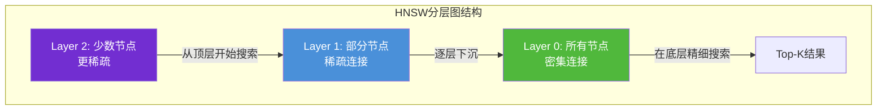

**特点**:多层图结构,从顶层快速定位到目标区域,逐层精细化搜索。**查询速度极快,但内存占用高**。

#### IVF(Inverted File)

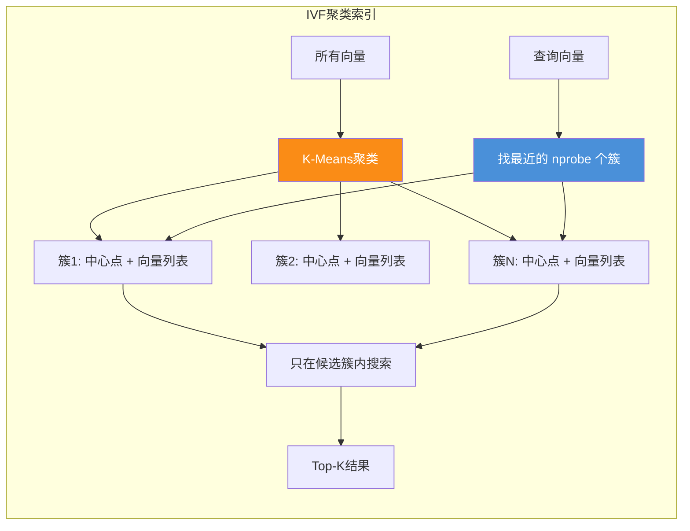

**特点**:用聚类把向量分桶,查询时只搜索最近的几个桶。**内存占用低,但精度略降**。

#### IVF_PQ(IVF + Product Quantization)

**特点**:在 IVF 基础上,对向量做乘积量化压缩。**内存占用极低(可压缩 8-16 倍),但精度损失更大,适合十亿级超大规模**。

### 4.3 索引算法选型对比

| 索引算法 | 查询速度 | 召回率 | 内存占用 | 构建速度 | 适用规模 | RAG 场景 |
|---------|---------|--------|---------|---------|---------|---------|
| **FLAT(暴力)** | 慢 | 100% | 高 | 快 | <10万 | 小规模精确检索 |
| **HNSW** | 极快 | 95%+ | 高 | 慢 | 百万~千万 | ⭐⭐⭐⭐⭐ 中小规模 RAG |
| **IVF** | 快 | 90%+ | 中 | 中 | 百万~亿 | ⭐⭐⭐⭐ 大规模 RAG |
| **IVF_PQ** | 快 | 85%+ | 极低 | 中 | 十亿级 | ⭐⭐⭐ 超大规模 RAG |
| **HNSW_PQ** | 快 | 90%+ | 低 | 慢 | 千万~亿 | ⭐⭐⭐⭐ 大规模 RAG |

### 4.4 查询参数调优

```python
# 向量数据库查询参数调优示例(以 Milvus 为例)
def optimized_search(vector_db, query_vector, top_k=5):
    """优化的检索参数配置"""
    
    results = vector_db.search(
        collection_name="knowledge_base",
        data=[query_vector],
        anns_field="vector",
        param={
            "metric_type": "COSINE",
            "params": {
                # IVF 索引参数:nprobe 控制搜索的簇数
                # 越大召回越高,但速度越慢
                "nprobe": 32,  # 默认16,提高到32可提升召回率
                
                # HNSW 索引参数:ef 控制搜索宽度
                # "ef": 64,  # 默认64,越大越精确但越慢
            }
        },
        limit=top_k,
        output_fields=["text", "source", "timestamp"]
    )
    return results
```

**关键参数**:
- **nprobe**(IVF):搜索的簇数量,越大召回越高、速度越慢
- **ef**(HNSW):搜索宽度,越大精度越高、速度越慢
- **top_k**:返回结果数量,通常 3-10

---

## 五、与大语言模型的协同方式

### 5.1 向量数据库与 LLM 的协同架构

```mermaid
flowchart TB
    subgraph 用户交互层
        U[用户提问<br/>"2026年新的RAG技术有哪些?"]
    end
    
    subgraph 检索层
        E1[Embedding模型<br/>查询向量化]
        VDB[(向量数据库<br/>语义检索)]
        R[检索结果<br/>Top-K文档片段]
    end
    
    subgraph 上下文构建层
        CTX[上下文组装<br/>检索结果 + 用户问题]
        P[提示词模板<br/>约束LLM基于上下文回答]
    end
    
    subgraph 生成层
        LLM[大语言模型<br/>GPT-4 / Claude]
        A[生成回答<br/>基于事实+引用来源]
    end
    
    U --> E1
    E1 --> VDB
    VDB --> R
    R --> CTX
    CTX --> P
    P --> LLM
    LLM --> A
    A --> U
    
    style VDB fill:#4a90d9,color:#fff
    style LLM fill:#fa8c16,color:#fff
```

### 5.2 协同流程详解

```python
class RAGWithVectorDB:
    """向量数据库与 LLM 协同的完整实现"""
    
    def __init__(self, vector_db, embedding_model, llm_client):
        self.db = vector_db
        self.embedder = embedding_model
        self.llm = llm_client
    
    def answer_question(self, question: str, top_k: int = 5) -> dict:
        """完整的 RAG 流程"""
        
        # ============ 阶段一:检索(向量数据库发挥作用) ============
        # Step 1: 查询向量化
        query_vector = self.embedder.encode([question])[0]
        
        # Step 2: 向量数据库语义检索
        search_results = self.db.search(
            collection_name="knowledge_base",
            data=[query_vector.tolist()],
            anns_field="vector",
            param={"metric_type": "COSINE", "params": {"nprobe": 16}},
            limit=top_k,
            output_fields=["text", "source", "page", "timestamp"]
        )
        
        # Step 3: 过滤低质量结果(相似度阈值)
        relevant_docs = [
            {
                "text": hit["entity"]["text"],
                "source": hit["entity"]["source"],
                "page": hit["entity"]["page"],
                "score": hit["distance"]
            }
            for hit in search_results[0]
            if hit["distance"] > 0.7  # 相似度阈值过滤
        ]
        
        # ============ 阶段二:上下文构建 ============
        # Step 4: 组装上下文(带来源引用)
        context_parts = []
        for i, doc in enumerate(relevant_docs, 1):
            context_parts.append(
                f"[{i}] 来源:{doc['source']} 第{doc['page']}页\n"
                f"内容:{doc['text']}\n"
            )
        context = "\n".join(context_parts)
        
        # Step 5: 构建提示词(约束 LLM 基于上下文回答)
        prompt = f"""你是一个专业的知识助手。请基于以下检索到的上下文回答用户问题。

要求:
1. 只使用上下文中的信息回答,不要编造
2. 如果上下文中没有相关信息,请明确告知"根据现有知识库无法回答"
3. 在回答中引用来源,格式如 [1]、[2]

上下文:
{context}

用户问题:{question}

回答:"""
        
        # ============ 阶段三:生成(LLM 发挥作用) ============
        # Step 6: LLM 基于上下文生成回答
        response = self.llm.chat.completions.create(
            model="gpt-4o",
            messages=[{"role": "user", "content": prompt}],
            temperature=0.1  # 低温度,减少创造性,提高事实性
        )
        
        answer = response.choices[0].message.content
        
        return {
            "answer": answer,
            "sources": relevant_docs,  # 返回来源,支持可追溯
            "retrieval_count": len(relevant_docs)
        }
```

### 5.3 协同中的关键约束机制

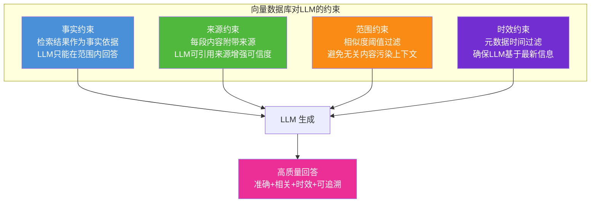

---

## 六、对生成内容准确性的贡献

### 6.1 降低幻觉的三大机制

```mermaid
flowchart TB
    subgraph 向量数据库降低幻觉
        M1[机制一:事实锚定<br/>检索真实文档作为上下文<br/>LLM 基于事实生成]
        M2[机制二:范围约束<br/>提示词明确要求"只基于上下文"<br/>阻止 LLM 编造]
        M3[机制三:来源可追溯<br/>每段回答附引用<br/>用户可验证]
    end
    
    M1 & M2 & M3 --> R[幻觉率降低 50-70%]
    
    style M1 fill:#4a90d9,color:#fff
    style M2 fill:#50b83c,color:#fff
    style M3 fill:#fa8c16,color:#fff
    style R fill:#722ed1,color:#fff
```

### 6.2 准确性提升的量化数据

根据 Stanford 2024 研究和企业实践数据:

| 场景 | 纯 LLM 幻觉率 | RAG + 向量数据库 | 提升 |
|------|-------------|-----------------|------|
| 金融问答 | 25-35% | 5-8% | 降低 70%+ |
| 医疗咨询 | 20-30% | 5-10% | 降低 65%+ |
| 法律法条 | 30-40% | 8-15% | 降低 60%+ |
| 企业知识库 | 15-25% | 3-7% | 降低 70%+ |

### 6.3 准确性保障的代码实现

```python
def ensure_accuracy(vector_db, embedder, llm, question: str) -> dict:
    """准确性保障:多级过滤 + 拒答机制"""
    
    # 1. 检索
    query_vector = embedder.encode([question])[0]
    results = vector_db.search(
        collection_name="knowledge_base",
        data=[query_vector.tolist()],
        anns_field="vector",
        param={"metric_type": "COSINE"},
        limit=10,
        output_fields=["text", "source"]
    )
    
    # 2. 相似度阈值过滤(防止低质量结果污染)
    high_confidence = [r for r in results[0] if r["distance"] > 0.75]
    medium_confidence = [r for r in results[0] if 0.6 < r["distance"] <= 0.75]
    
    # 3. 拒答机制:如果没有高置信度结果,告知用户
    if not high_confidence and not medium_confidence:
        return {
            "answer": "抱歉,根据现有知识库无法找到与您问题相关的内容。",
            "confidence": "low",
            "sources": []
        }
    
    # 4. 置信度标注
    if high_confidence:
        context = high_confidence
        confidence = "high"
    else:
        context = medium_confidence
        confidence = "medium"
    
    # 5. 强约束提示词
    prompt = f"""基于以下上下文回答问题。如果上下文中没有足够信息,请明确说明。

上下文:
{format_context(context)}

问题:{question}

回答:"""
    
    answer = llm.invoke(prompt)
    
    return {
        "answer": answer,
        "confidence": confidence,
        "sources": context
    }
```

---

## 七、对生成内容相关性的贡献

### 7.1 语义相关性 vs 关键词相关性

```mermaid
flowchart LR
    subgraph 关键词检索的相关性问题
        Q1[问题: 如何优化数据库性能?]
        K1[匹配: 包含"数据库""性能""优化"的文档]
        K2[漏召: "MySQL调优技巧"无关键词]
        K3[误召: "数据库发展历史"有关键词但不相关]
    end
    
    subgraph 向量数据库的语义相关性
        Q2[问题向量化]
        S1[召回: MySQL调优技巧<br/>语义相似度 0.92]
        S2[召回: 索引优化策略<br/>语义相似度 0.89]
        S3[过滤: 数据库发展历史<br/>语义相似度 0.45]
    end
    
    style K2 fill:#f5222d,color:#fff
    style K3 fill:#f5222d,color:#fff
    style S1 fill:#50b83c,color:#fff
    style S2 fill:#50b83c,color:#fff
    style S3 fill:#50b83c,color:#fff
```

### 7.2 混合检索:相关性的终极方案

2025-2026 年生产级 RAG 系统普遍采用 **Hybrid RAG(混合检索)**:向量数据库负责语义检索,传统引擎负责关键词检索,融合两者优势。

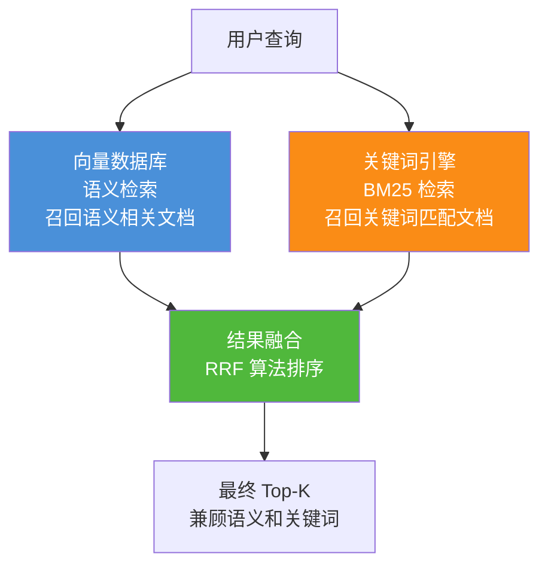

```python
def hybrid_search(vector_db, bm25_index, embedder, query: str, top_k: int = 5):
    """混合检索:向量 + 关键词"""
    
    # 1. 向量数据库语义检索
    query_vector = embedder.encode([query])[0]
    vector_results = vector_db.search(
        collection_name="knowledge_base",
        data=[query_vector.tolist()],
        anns_field="vector",
        param={"metric_type": "COSINE"},
        limit=top_k * 2  # 多召回一些用于融合
    )
    
    # 2. BM25 关键词检索
    bm25_results = bm25_index.search(query, top_k=top_k * 2)
    
    # 3. RRF(Reciprocal Rank Fusion)融合排序
    rrf_scores = {}
    for rank, result in enumerate(vector_results[0]):
        doc_id = result["id"]
        rrf_scores[doc_id] = rrf_scores.get(doc_id, 0) + 1 / (rank + 1)
    
    for rank, result in enumerate(bm25_results):
        doc_id = result["id"]
        rrf_scores[doc_id] = rrf_scores.get(doc_id, 0) + 1 / (rank + 1)
    
    # 4. 按 RRF 分数排序,取 Top-K
    final_results = sorted(rrf_scores.items(), key=lambda x: x[1], reverse=True)[:top_k]
    
    return final_results
```

### 7.3 相关性提升的数据对比

| 检索方式 | 召回率 | 准确率 | 特点 |
|---------|--------|--------|------|
| 纯关键词(BM25) | 60% | 75% | 漏召语义相关但无关键词的文档 |
| 纯向量检索 | 85% | 80% | 可能误召语义相近但语境不符的 |
| **混合检索** | **92%** | **88%** | 优势互补,生产级标准 |

---

## 八、对生成内容时效性的贡献

### 8.1 时效性挑战:LLM 知识截断

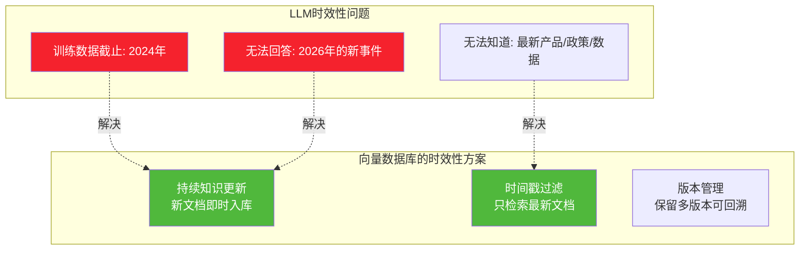

### 8.2 时效性实现:时间戳过滤

```python
def search_with_recency(vector_db, embedder, query: str, 
                         recency_days: int = 30) -> list:
    """时效性检索:优先返回最新文档"""
    
    query_vector = embedder.encode([query])[0]
    
    # 计算时间过滤边界
    cutoff_date = (datetime.now() - timedelta(days=recency_days)).isoformat()
    
    # 向量数据库:语义检索 + 时间过滤
    results = vector_db.search(
        collection_name="knowledge_base",
        data=[query_vector.tolist()],
        anns_field="vector",
        param={"metric_type": "COSINE"},
        limit=10,
        filter=f"timestamp >= '{cutoff_date}'",  # 只检索最近N天
        output_fields=["text", "source", "timestamp"]
    )
    
    return results
```

### 8.3 时效性场景示例

```python
# 场景:用户问"2026年最新的RAG技术有哪些?"
# LLM 训练数据截止 2024年,无法回答
# 但向量数据库可以检索到最新入库的文档

def answer_temporal_question(vector_db, embedder, llm, question: str):
    """回答时效性问题"""
    
    # 检索最新文档
    query_vector = embedder.encode([question])[0]
    results = vector_db.search(
        collection_name="knowledge_base",
        data=[query_vector.tolist()],
        anns_field="vector",
        param={"metric_type": "COSINE"},
        limit=5,
        filter="timestamp >= '2026-01-01'",  # 只检索2026年的文档
        output_fields=["text", "source", "timestamp"]
    )
    
    # 即使 LLM 不知道这些信息,也能基于检索结果回答
    context = format_context(results)
    prompt = f"""基于以下最新资料回答问题:

{context}

问题:{question}
回答:"""
    
    return llm.invoke(prompt)
    # LLM 基于检索到的2026年文档生成回答,绕过了知识截断问题
```

---

## 九、向量数据库在 RAG 全流程中的作用

### 9.1 RAG 全流程中的向量数据库

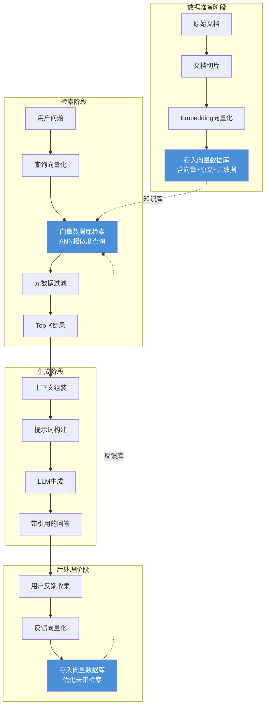

### 9.2 各阶段作用总结

| RAG 阶段 | 向量数据库的作用 | 核心价值 |
|---------|----------------|---------|
| **数据准备** | 存储向量 + 原文 + 元数据 | 知识持久化 |
| **索引构建** | 构建 ANN 索引(HNSW/IVF) | 毫秒级检索基础 |
| **查询检索** | 语义相似度 + 元数据过滤 | 精准召回 |
| **上下文构建** | 提供带来源的文档片段 | 可追溯依据 |
| **结果重排** | 存储重排模型特征 | 优化排序 |
| **反馈学习** | 存储用户反馈向量 | 持续优化 |

---

## 十、主流向量数据库能力对比

### 10.1 主流向量数据库概览

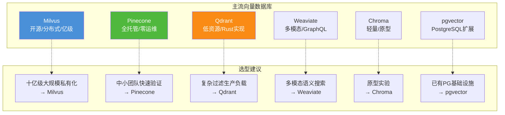

### 10.2 详细能力对比表

| 数据库 | 部署方式 | 最大规模 | 查询延迟 | 混合检索 | 多模态 | 运维复杂度 | 适用场景 |
|--------|---------|---------|---------|---------|--------|-----------|---------|
| **Milvus** | 开源自托管 | 十亿级 | 中 | ✅ | ✅ | 高 | 大规模企业级 RAG |
| **Pinecone** | 全托管云 | 十亿级 | 低 | ✅ | ❌ | 极低 | 中小团队快速上线 |
| **Qdrant** | 开源/云 | 亿级 | 低 | ✅ | ✅ | 中 | 复杂过滤场景 |
| **Weaviate** | 开源/云 | 亿级 | 中 | ✅ | ✅ | 中 | 多模态+知识图谱 |
| **Chroma** | 嵌入式 | 百万级 | 低 | ⚠️ | ❌ | 极低 | 原型开发 |
| **pgvector** | PG 扩展 | 千万级 | 中 | ✅ | ❌ | 低 | 已有 PG 基础设施 |

### 10.3 2026 年选型决策矩阵

根据 2026 年最新实践数据:

| 需求场景 | 推荐方案 | 理由 |
|---------|---------|------|
| 无运维需求、严格 SLA | Pinecone | 全托管,零运维 |
| 需要强混合搜索(向量+关键词+元数据) | Weaviate | GraphQL 接口,原生支持 |
| 十亿级规模、完全控制基础设施 | Milvus | GitHub Star 35k+,分布式架构 |
| 已有 PostgreSQL 基础设施 | pgvector | 无需新增组件,pgvectorscale 在 5000 万向量上 QPS 比 Qdrant 高 11.4 倍 |
| 复杂过滤的生产工作负载 | Qdrant | Rust 实现,低资源高性能 |

---

## 十一、优化策略与最佳实践

### 11.1 索引优化策略

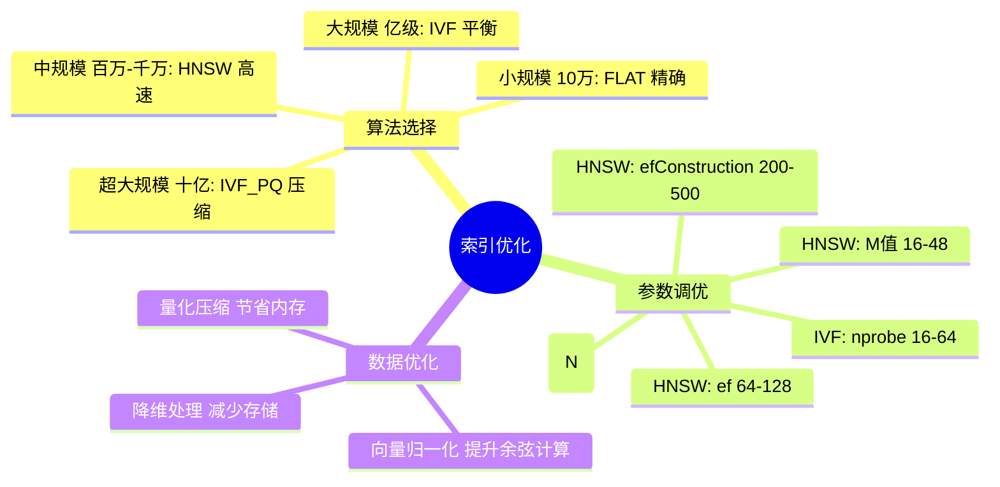

### 11.2 检索质量优化

```python
def optimize_retrieval_quality(vector_db, embedder, reranker, query: str):
    """检索质量优化:多阶段检索"""
    
    # Stage 1: 向量数据库粗召回(多召回一些)
    query_vector = embedder.encode([query])[0]
    initial_results = vector_db.search(
        collection_name="knowledge_base",
        data=[query_vector.tolist()],
        anns_field="vector",
        param={"metric_type": "COSINE", "params": {"nprobe": 32}},
        limit=50,  # 粗召回 50 个
        output_fields=["text", "source"]
    )
    
    # Stage 2: 元数据过滤(剔除不符合条件的)
    filtered = [r for r in initial_results[0] if r["distance"] > 0.6]
    
    # Stage 3: 重排序模型精排(交叉编码器)
    reranked = reranker.rank(
        query=query,
        documents=[r["entity"]["text"] for r in filtered],
        top_k=5  # 精排取 Top-5
    )
    
    # Stage 4: 去重(避免相似内容重复)
    seen = set()
    final = []
    for doc in reranked:
        content_hash = hash(doc["text"][:100])
        if content_hash not in seen:
            seen.add(content_hash)
            final.append(doc)
    
    return final[:5]
```

### 11.3 性能优化策略

| 优化方向 | 策略 | 效果 |
|---------|------|------|
| **缓存** | 缓存热门查询结果 | 减少 80% 重复检索 |
| **批量** | 批量向量化、批量插入 | 提升 5-10 倍吞吐 |
| **分区** | 按时间/来源分区 | 缩小检索范围 |
| **量化** | 向量量化压缩 | 减少 8-16 倍内存 |
| **预热** | 启动时加载索引到内存 | 避免冷启动延迟 |
| **副本** | 多副本分散查询压力 | 提升 QPS |

---

## 十二、总结与未来展望

### 12.1 核心作用总结

```mermaid
flowchart TB
    subgraph 向量数据库在RAG中的五大核心作用
        S1[语义检索支撑<br/>毫秒级语义匹配<br/>替代关键词检索]
        S2[知识持久化管理<br/>十亿级文档存储<br/>动态增删改]
        S3[高效索引构建<br/>ANN算法<br/>O(log n)查询]
        S4[与LLM协同<br/>事实锚定+来源追溯<br/>降低幻觉]
        S5[生成质量提升<br/>准确性+相关性+时效性<br/>全面提升]
    end
    
    S1 & S2 & S3 & S4 & S5 --> RAG[生产级 RAG 系统]
    
    style S1 fill:#4a90d9,color:#fff
    style S2 fill:#50b83c,color:#fff
    style S3 fill:#fa8c16,color:#fff
    style S4 fill:#722ed1,color:#fff
    style S5 fill:#eb2f96,color:#fff
    style RAG fill:#13c2c2,color:#fff
```

### 12.2 量化贡献总结

| 质量维度 | 无向量数据库 | 有向量数据库 | 提升幅度 |
|---------|------------|------------|---------|
| **准确性(幻觉率)** | 25-35% | 5-8% | 降低 70%+ |
| **相关性(召回率)** | 60% | 92% | 提升 53% |
| **时效性** | 受训练截止限制 | 实时更新 | 突破截断 |
| **检索速度** | O(n) 秒级 | O(log n) 毫秒级 | 提升 500 倍 |
| **知识规模** | 受上下文窗口限制 | 十亿级 | 突破限制 |
| **可追溯性** | 无 | 完整来源引用 | 从无到有 |

### 12.3 未来发展趋势

```mermaid
flowchart LR
    subgraph 2024-2025 主流
        N1[纯向量检索 RAG]
        N2[Milvus/Pinecone 单一数据库]
    end
    
    subgraph 2026 趋势
        T1[Hybrid RAG<br/>向量+关键词混合检索]
        T2[GraphRAG<br/>向量+知识图谱]
        T3[Agentic RAG<br/>Agent 驱动多轮检索]
        T4[多模态 RAG<br/>文本+图像+音频统一检索]
    end
    
    subgraph 未来方向
        F1[Serverless 向量数据库<br/>按需弹性]
        F2[向量数据库+LLM 一体化<br/>原生集成]
        F3[联邦检索<br/>跨多个向量库]
    end
    
    N1 --> T1
    N2 --> T2
    T1 --> F1
    T2 --> F2
    T3 --> F3
    
    style T1 fill:#fa8c16,color:#fff
    style T2 fill:#fa8c16,color:#fff
    style T3 fill:#fa8c16,color:#fff
```

### 12.4 与系列文档的关系

| 文档 | 主题 | 与本文关系 |
|------|------|-----------|
| [51RAG检索增强生成详解](./51RAG检索增强生成详解.md) | RAG 基础概念 | 本文的基础前提 |
| [52RAG工作流程详解](./52RAG工作流程详解.md) | RAG 流程 | 本文在流程中的位置 |
| [53RAG降低LLM幻觉机制](./53RAG降低LLM幻觉机制详解.md) | 幻觉降低 | 本文第六章的深入 |
| [56RAG文档切片策略](./56RAG文档切片策略深度解析.md) | 切片策略 | 本文数据准备的前置 |
| [57RAG分块大小选择](./57RAG分块大小最佳选择策略深度解析.md) | 分块大小 | 影响本文检索质量 |
| [58RAG Embedding模型](./58RAG%20Embedding模型深度解析.md) | Embedding 模型 | 生成本文存储的向量 |
| [59Embedding向量作用](./59Embedding向量在RAG系统中的核心作用深度解析.md) | 向量本身的作用 | 与本文互补 |
| [60Embedding模型选型](./60RAG系统Embedding模型选型决策指南.md) | 模型选型 | 影响本文向量质量 |
| **本文** | **向量数据库的作用** | **RAG 基础设施核心** |

### 12.5 核心结论

> **向量数据库是 RAG 系统的"记忆中枢"——它让 LLM 从"只能基于训练数据回答"升级为"能基于任意规模、实时更新的知识库回答",是生产级 RAG 不可替代的核心基础设施。**

没有向量数据库,RAG 只能停留在小规模原型;有了向量数据库,RAG 才能支撑企业级、十亿级知识规模的智能问答系统。

---

> **参考来源:**
> - [万字长文详解向量数据库与RAG](https://blog.csdn.net/Mr_YanMingXin/article/details/157843100) — 向量数据库三大角色解析
> - [RAG再升级:当检索增强生成遇上向量数据库](https://cloud.tencent.com.cn/developer/article/2625954) — 企业级抗幻觉实践
> - [别让你的RAG停留在两年前:2026大模型检索技术](https://blog.csdn.net/qq_60735796/article/details/158262698) — 2026 选型决策矩阵
> - [深度|向量数据库大牛揭秘设计理念 - Milvus](https://blog.51cto.com/u_87634/14533755) — 索引算法与选型方法论
> - [学习向量数据库与 RAG 架构](https://cloud.tencent.com/developer/article/2580844) — RAG 基础架构实践
> - [Milvus 官方文档](https://milvus.io/docs) — 索引算法与查询参数
> - [Stanford RAG Study 2024](https://ai.stanford.edu) — 幻觉率降低研究数据
