# FAISS 与 Milvus 向量数据库核心区别深度解析

> **文档定位**:本文档是 RAG 检索增强生成系列的第十二篇核心文档,专注于 **FAISS 与 Milvus 两种主流向量数据库的深度技术对比**。在 [61号文档](./61向量数据库在RAG系统中的核心作用深度解析.md) 概述向量数据库通用作用的基础上,本文从架构设计、性能指标、扩展性、数据类型、索引类型、部署复杂度、社区支持、适用场景、RAG 集成兼容性九大维度,对 FAISS 和 Milvus 进行深度对比,并提供 RAG 场景下的选型建议。
>
> **与61号文档的关系**:[61向量数据库在RAG系统中的核心作用深度解析.md](./61向量数据库在RAG系统中的核心作用深度解析.md) 侧重向量数据库的**通用作用与价值**,本文侧重 FAISS 与 Milvus 的**具体技术对比与选型**。61号解决"为什么需要向量数据库",本文解决"FAISS 和 Milvus 选哪个"。
>
> **阅读建议**:建议先阅读 [61号文档](./61向量数据库在RAG系统中的核心作用深度解析.md) 理解向量数据库的通用作用,再阅读本文进行 FAISS vs Milvus 的具体选型。可结合 [58RAG Embedding模型深度解析.md](./58RAG%20Embedding模型深度解析.md) 和 [60RAG系统Embedding模型选型决策指南.md](./60RAG系统Embedding模型选型决策指南.md) 理解 Embedding 与向量数据库的配合。

---

## 目录

- [一、FAISS 与 Milvus 概述](#一faiss-与-milvus-概述)
- [二、架构设计对比](#二架构设计对比)
- [三、性能指标对比](#三性能指标对比)
- [四、扩展性对比](#四扩展性对比)
- [五、支持的数据类型对比](#五支持的数据类型对比)
- [六、索引类型对比](#六索引类型对比)
- [七、部署复杂度对比](#七部署复杂度对比)
- [八、社区支持与生态对比](#八社区支持与生态对比)
- [九、适用场景对比](#九适用场景对比)
- [十、与 RAG 系统集成兼容性对比](#十与-rag-系统集成兼容性对比)
- [十一、RAG 场景选型建议](#十一rag-场景选型建议)
- [十二、总结](#十二总结)

---

## 一、FAISS 与 Milvus 概述

### 1.1 FAISS 简介

**FAISS(Facebook AI Similarity Search)** 是 Facebook AI Research 开源的**向量相似度搜索库**,专注于高效稠密向量检索。

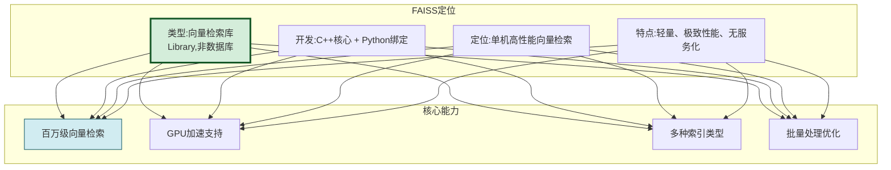

### 1.2 Milvus 简介

**Milvus** 是 Zilliz 开源的**云原生向量数据库**,专为大规模向量检索设计,提供完整的数据库功能。

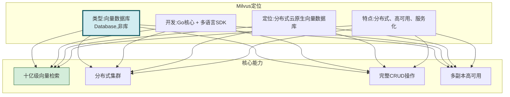

### 1.3 核心定位差异

| 维度 | FAISS | Milvus |
|------|-------|--------|
| **本质** | 向量检索**库**(Library) | 向量**数据库**(Database) |
| **定位** | 单机高性能检索引擎 | 分布式云原生数据库 |
| **数据规模** | 百万~千万级(单机) | 十亿级(分布式) |
| **服务化** | 无(嵌入应用) | 有(独立服务) |
| **分布式** | 不支持 | 原生支持 |
| **CRUD** | 仅支持新增+查询 | 完整CRUD+事务 |
| **高可用** | 无 | 多副本+故障转移 |

> **一句话区别**:FAISS 是"**搜索引擎**",Milvus 是"**数据库**"。FAISS 专注于"搜得快",Milvus 专注于"存得多、管得好、搜得稳"。

---

## 二、架构设计对比

### 2.1 FAISS 架构

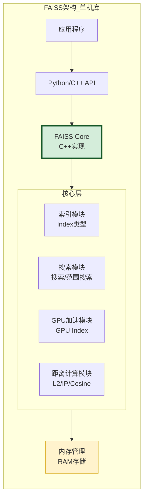

**FAISS 架构特点**:
- **单进程库**:嵌入应用程序内,无独立服务
- **内存为主**:向量数据存储在内存,支持内存映射文件
- **无网络层**:无客户端/服务端架构,直接函数调用
- **C++核心**:性能关键路径用 C++ 实现,Python 绑定

### 2.2 Milvus 架构

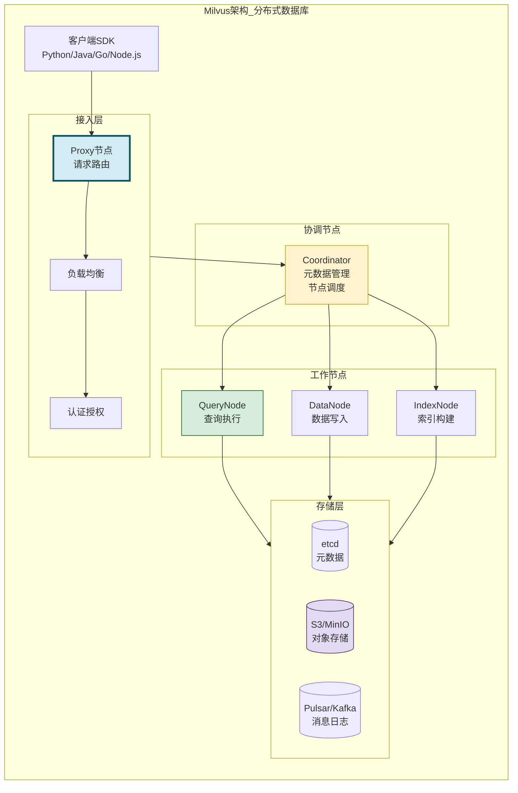

**Milvus 架构特点**:
- **云原生微服务**:存算分离,各节点独立扩展
- **分布式集群**:Proxy/Coordinator/QueryNode/DataNode/IndexNode 多角色
- **持久化存储**:etcd(元数据)+ S3/MinIO(对象存储)+ Pulsar(消息日志)
- **高可用**:多副本、故障自动转移

### 2.3 架构对比

| 架构维度 | FAISS | Milvus |
|---------|-------|--------|
| **架构模式** | 嵌入式库 | 分布式微服务 |
| **部署形态** | 单进程 | 多节点集群 |
| **存算分离** | 否(一体) | 是(分离) |
| **网络通信** | 无(函数调用) | gRPC/REST |
| **元数据管理** | 无 | etcd |
| **数据持久化** | 内存+文件 | 对象存储+日志 |
| **高可用** | 无 | 多副本+故障转移 |
| **扩展方式** | 垂直扩展(加内存) | 水平扩展(加节点) |

---

## 三、性能指标对比

### 3.1 查询速度对比

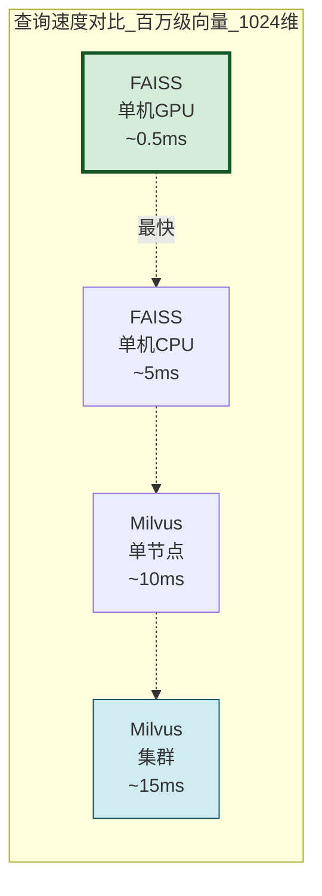

### 3.2 性能基准对比表

| 性能指标 | FAISS(CPU) | FAISS(GPU) | Milvus(单节点) | Milvus(集群) |
|---------|:----------:|:----------:|:-------------:|:-----------:|
| **查询延迟(P99)** | 5-20ms | 0.5-2ms | 10-50ms | 15-80ms |
| **QPS(单机)** | 5,000-10,000 | 50,000-100,000 | 2,000-5,000 | 10,000-50,000 |
| **批量插入速度** | 100万/秒 | 500万/秒 | 10万/秒 | 50万/秒 |
| **内存占用** | 原始向量大小 | 原始+GPU显存 | 原始+索引+元数据 | 分布式分摊 |
| **GPU利用率** | 高(直接控制) | 极高 | 中(通过IndexNode) | 中 |
| **网络开销** | 无 | 无 | 有(gRPC) | 有(跨节点) |

### 3.3 性能差异原因分析

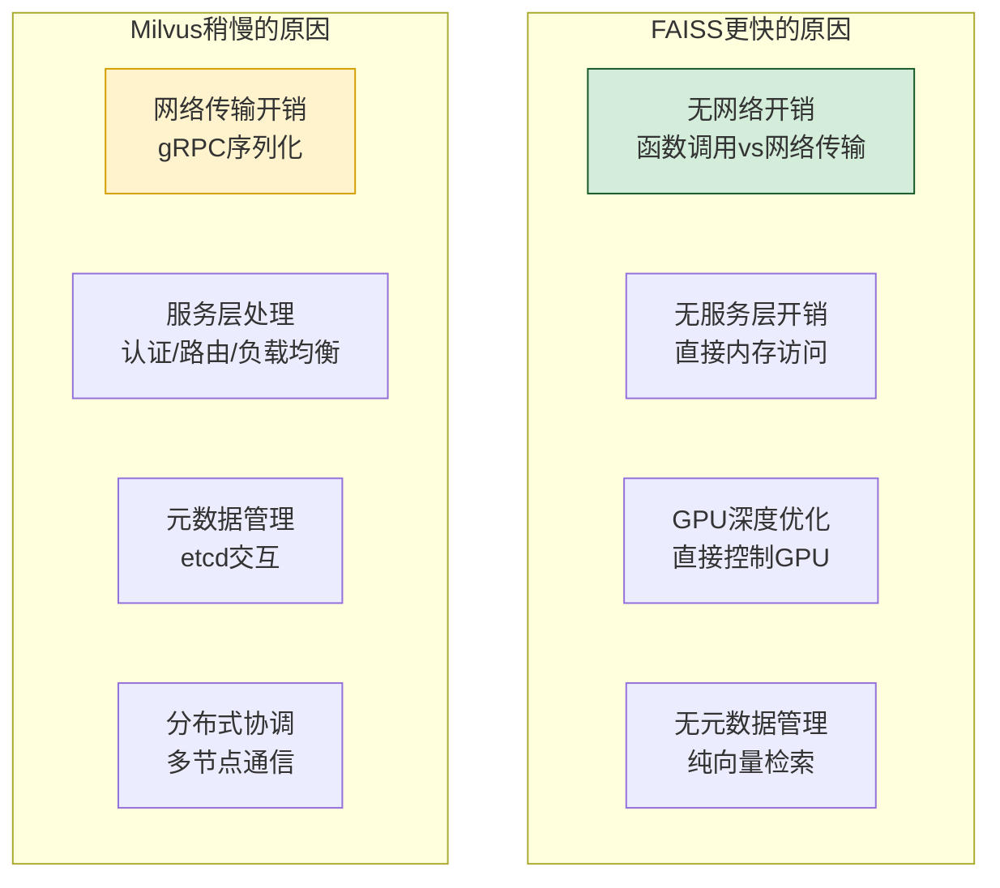

### 3.4 性能基准测试代码

```python
import time
import numpy as np


class VectorDBBenchmark:
    """向量数据库性能基准测试"""

    def __init__(self, dim: int = 1024, n_vectors: int = 1_000_000):
        self.dim = dim
        self.n_vectors = n_vectors
        self.vectors = np.random.randn(n_vectors, dim).astype('float32')
        self.query_vectors = np.random.randn(100, dim).astype('float32')

    def benchmark_faiss(self, index_type: str = "IVF"):
        """测试FAISS性能"""
        import faiss

        # 构建索引
        if index_type == "Flat":
            index = faiss.IndexFlatL2(self.dim)
        elif index_type == "IVF":
            quantizer = faiss.IndexFlatL2(self.dim)
            index = faiss.IndexIVFFlat(quantizer, self.dim, 100)
            index.train(self.vectors)
        elif index_type == "HNSW":
            index = faiss.IndexHNSWFlat(self.dim, 32)

        # 插入数据
        start = time.time()
        index.add(self.vectors)
        insert_time = time.time() - start

        # 查询测试
        latencies = []
        for qv in self.query_vectors:
            start = time.time()
            _, _ = index.search(qv.reshape(1, -1), 10)
            latencies.append((time.time() - start) * 1000)

        return {
            "engine": "FAISS",
            "index_type": index_type,
            "insert_time_s": round(insert_time, 2),
            "avg_query_ms": round(np.mean(latencies), 2),
            "p99_query_ms": round(np.percentile(latencies, 99), 2),
            "qps": round(1000 / np.mean(latencies))
        }

    def benchmark_milvus(self, index_type: str = "IVF_FLAT"):
        """测试Milvus性能"""
        from pymilvus import connections, Collection, FieldSchema,
            CollectionSchema, DataType, utility

        # 连接Milvus
        connections.connect(host="localhost", port="19530")

        # 创建Collection
        utility.drop_collection("benchmark_collection")
        fields = [
            FieldSchema(name="id", dtype=DataType.INT64, is_primary=True),
            FieldSchema(name="embedding", dtype=DataType.FLOAT_VECTOR, dim=self.dim)
        ]
        schema = CollectionSchema(fields)
        collection = Collection("benchmark_collection", schema)

        # 插入数据
        start = time.time()
        collection.insert([
            list(range(self.n_vectors)),
            self.vectors.tolist()
        ])
        collection.flush()
        insert_time = time.time() - start

        # 创建索引
        collection.create_index("embedding", {
            "index_type": index_type,
            "metric_type": "L2",
            "params": {"nlist": 100}
        })
        collection.load()

        # 查询测试
        latencies = []
        for qv in self.query_vectors:
            start = time.time()
            collection.search(
                data=[qv.tolist()],
                anns_field="embedding",
                param={"metric_type": "L2", "params": {"nprobe": 10}},
                limit=10
            )
            latencies.append((time.time() - start) * 1000)

        return {
            "engine": "Milvus",
            "index_type": index_type,
            "insert_time_s": round(insert_time, 2),
            "avg_query_ms": round(np.mean(latencies), 2),
            "p99_query_ms": round(np.percentile(latencies, 99), 2),
            "qps": round(1000 / np.mean(latencies))
        }
```

---

## 四、扩展性对比

### 4.1 扩展能力对比

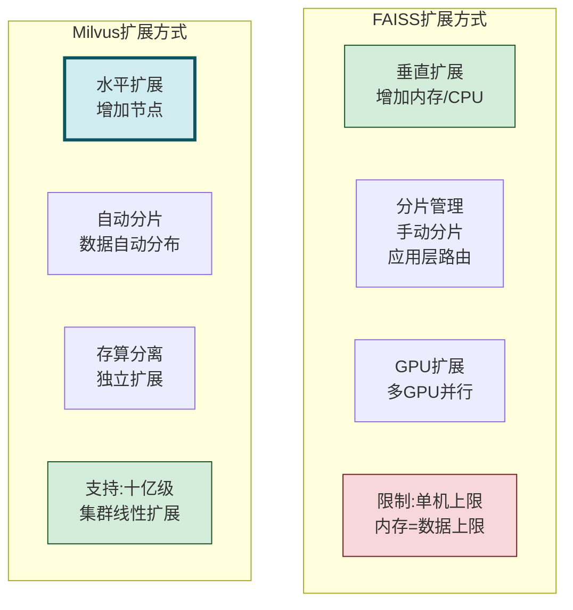

### 4.2 扩展性详细对比

| 扩展维度 | FAISS | Milvus |
|---------|-------|--------|
| **扩展方向** | 仅垂直扩展 | 水平+垂直扩展 |
| **最大数据量** | 单机内存上限(通常<1亿) | 十亿级(集群) |
| **分片方式** | 手动分片+应用路由 | 自动分片(Ring/Hash) |
| **负载均衡** | 无(应用层实现) | 内置自动负载均衡 |
| **弹性伸缩** | 不支持 | 支持(动态增减节点) |
| **多副本** | 无 | 支持多副本 |
| **数据迁移** | 手动 | 自动rebalance |

### 4.3 扩展性场景示例

```python
class ScalabilityComparison:
    """扩展性对比示例"""

    def faiss_sharding_example(self):
        """FAISS手动分片示例"""
        # FAISS需要应用层手动管理分片
        import faiss

        shards = []
        shard_size = 1_000_000
        total_vectors = 10_000_000

        # 创建多个分片索引
        for i in range(10):
            index = faiss.IndexFlatL2(1024)
            # 只添加该分片的数据
            shard_data = np.random.randn(shard_size, 1024).astype('float32')
            index.add(shard_data)
            shards.append(index)

        # 查询时需要查询所有分片并合并结果
        def search_all_shards(query, top_k=10):
            all_results = []
            for i, shard in enumerate(shards):
                distances, indices = shard.search(query, top_k)
                for d, idx in zip(distances[0], indices[0]):
                    all_results.append((d, i * shard_size + idx))
            # 排序取Top-K
            all_results.sort(key=lambda x: x[0])
            return all_results[:top_k]

        return "FAISS: 需手动分片+应用层合并"

    def milvus_cluster_example(self):
        """Milvus集群示例"""
        # Milvus自动管理分片和分布
        from pymilvus import connections, Collection

        # 连接集群(无需关心分片)
        connections.connect(host="milvus-cluster", port="19530")

        # 创建Collection(自动分片)
        collection = Collection("large_collection")

        # 插入十亿级数据(自动分布到多节点)
        # collection.insert(batch_data)

        # 查询(自动路由到正确分片)
        # results = collection.search(...)

        return "Milvus: 自动分片+透明查询"
```

---

## 五、支持的数据类型对比

### 5.1 数据类型支持对比

| 数据类型 | FAISS | Milvus |
|---------|:-----:|:------:|
| **float32** | ✅ | ✅ |
| **float16** | ✅ | ✅ |
| **int8** | ✅ | ✅ |
| **binary** | ✅ | ✅ |
| **int64(标量)** | ❌ | ✅ |
| **varchar(字符串)** | ❌ | ✅ |
| **bool** | ❌ | ✅ |
| **JSON** | ❌ | ✅ |
| **数组** | ❌ | ✅ |

### 5.2 标量过滤能力对比

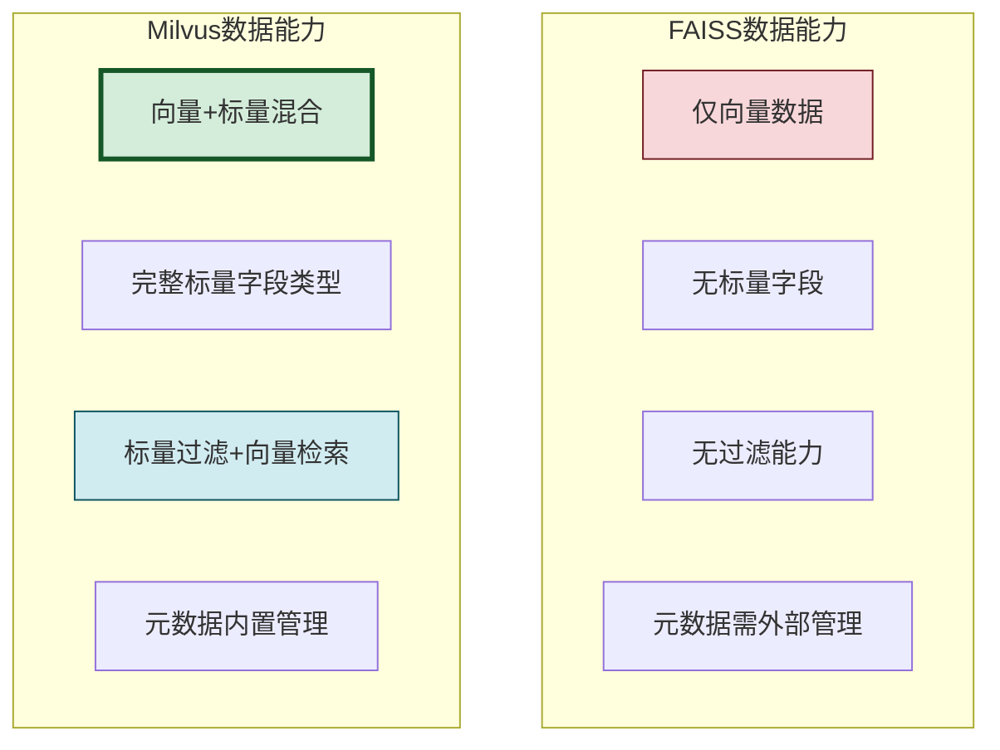

### 5.3 标量过滤示例

```python
class ScalarFilterComparison:
    """标量过滤能力对比"""

    def faiss_no_filter(self):
        """FAISS: 无法直接过滤,需要外部管理"""
        # FAISS只能存储向量,标量元数据需要单独管理
        # 查询时需要先过滤再检索,或检索后过滤

        # 典型做法:外部数据库存元数据
        metadata = {
            0: {"category": "tech", "date": "2024-01-01"},
            1: {"category": "news", "date": "2024-01-02"},
            # ...
        }

        # 查询流程:先检索所有→再应用层过滤
        # results = faiss_index.search(query, k=100)
        # filtered = [r for r in results if metadata[r.id]["category"] == "tech"]

        return "FAISS: 标量过滤需应用层实现,效率低"

    def milvus_with_filter(self):
        """Milvus: 原生支持标量过滤"""
        from pymilvus import Collection

        collection = Collection("documents")

        # 直接在向量检索时添加标量过滤条件
        results = collection.search(
            data=[query_vector],
            anns_field="embedding",
            param={"metric_type": "L2", "params": {"nprobe": 10}},
            limit=10,
            expr='category == "tech" and date > "2024-01-01"'  # 标量过滤
        )

        return "Milvus: 原生标量过滤,引擎层高效执行"
```

---

## 六、索引类型对比

### 6.1 索引类型支持矩阵

| 索引类型 | FAISS | Milvus | 特点 |
|---------|:-----:|:------:|------|
| **Flat(暴力搜索)** | ✅ | ✅ | 100%召回率,速度慢 |
| **IVF(倒排文件)** | ✅ | ✅ | 聚类加速,可调召回率 |
| **IVF_PQ(乘积量化)** | ✅ | ✅ | 压缩存储,高效率 |
| **IVF_SQ8(标量量化)** | ✅ | ✅ | 8位量化,平衡精度 |
| **HNSW(分层小世界图)** | ✅ | ✅ | 高召回率,查询快 |
| **DiskANN(磁盘索引)** | ❌ | ✅ | 超大规模,磁盘存储 |
| **ANNOY(树索引)** | ❌ | ✅ | 树结构,适合低维 |
| **SCANN** | ❌ | ✅ | Google开源,高性能 |
| **GPU_IVF** | ✅ | ❌ | FAISS独有GPU索引 |
| **GPU_IVF_PQ** | ✅ | ❌ | FAISS独有GPU索引 |

### 6.2 索引参数对比

```python
class IndexConfigurationComparison:
    """索引配置对比"""

    def faiss_index_config(self):
        """FAISS索引配置"""
        configs = {
            "IVF": {
                "nlist": 100,        # 聚类中心数
                "nprobe": 10,        # 查询时探查的聚类数
            },
            "HNSW": {
                "M": 32,             # 每层最大连接数
                "efConstruction": 200,  # 构建时搜索宽度
                "efSearch": 50,      # 查询时搜索宽度
            },
            "IVF_PQ": {
                "nlist": 100,
                "m": 8,              # 子向量数
                "nbits": 8,          # 每个子向量的位数
            }
        }
        return configs

    def milvus_index_config(self):
        """Milvus索引配置"""
        configs = {
            "IVF_FLAT": {
                "index_type": "IVF_FLAT",
                "metric_type": "L2",
                "params": {"nlist": 100}
            },
            "HNSW": {
                "index_type": "HNSW",
                "metric_type": "L2",
                "params": {"M": 32, "efConstruction": 200}
            },
            "IVF_PQ": {
                "index_type": "IVF_PQ",
                "metric_type": "L2",
                "params": {"nlist": 100, "m": 8, "nbits": 8}
            },
            "DISKANN": {
                "index_type": "DISKANN",
                "metric_type": "L2",
                "params": {}  # Milvus独有,支持超大规模
            }
        }
        return configs
```

### 6.3 索引选择决策

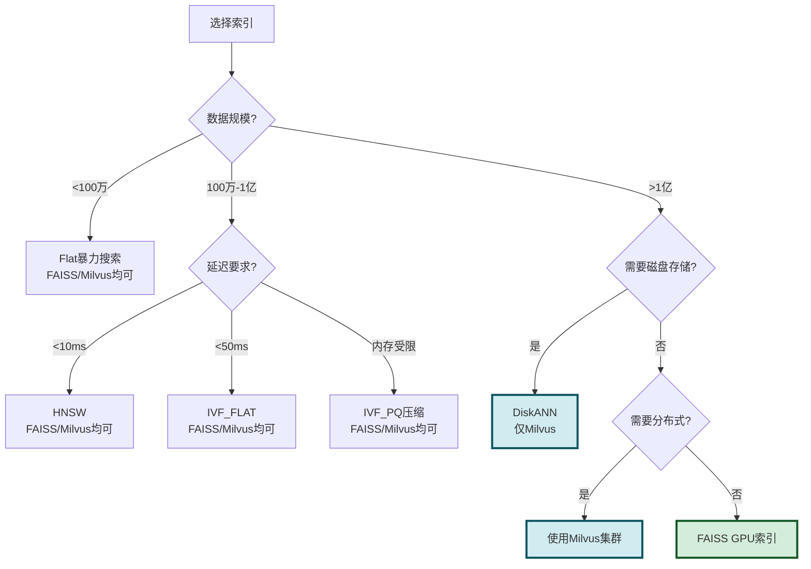

---

## 七、部署复杂度对比

### 7.1 部署方式对比


### 7.2 部署复杂度对比表

| 部署维度 | FAISS | Milvus(Standalone) | Milvus(Cluster) |
|---------|-------|:------------------:|:---------------:|
| **安装方式** | pip install | Docker Compose | Kubernetes |
| **部署时间** | 1分钟 | 10分钟 | 1-2小时 |
| **依赖组件** | 无 | etcd+MinIO | etcd+S3+Pulsar+K8s |
| **运维成本** | 极低 | 中 | 高 |
| **监控需求** | 无 | 基础监控 | 全链路监控 |
| **升级复杂度** | pip更新 | Docker镜像更新 | 滚动升级 |
| **故障恢复** | 应用重启 | Docker重启 | K8s自动恢复 |

### 7.3 部署示例

```python
class DeploymentComparison:
    """部署方式对比示例"""

    def faiss_deployment(self):
        """FAISS部署(极简)"""
        # 安装: pip install faiss-cpu
        # 使用:
        import faiss
        index = faiss.IndexFlatL2(1024)
        index.add(vectors)
        # 完成!无需任何额外服务
        return "FAISS: 1行安装,3行代码,0运维"

    def milvus_standalone_deployment(self):
        """Milvus单机版部署"""
        # docker-compose.yml
        compose_config = """
        version: '3'
        services:
          etcd:
            image: quay.io/coreos/etcd:v3.5.5
          minio:
            image: minio/minio:latest
          milvus:
            image: milvusdb/milvus:latest
            depends_on: [etcd, minio]
            ports: ["19530:19530"]
        """
        return "Milvus Standalone: 3个容器,10分钟部署"

    def milvus_cluster_deployment(self):
        """Milvus集群版部署"""
        # 需要Kubernetes + Helm
        helm_command = """
        helm install my-milvus milvus/milvus \\
          --set cluster.enabled=true \\
          --set queryNode.replicas=3 \\
          --set dataNode.replicas=2 \\
          --set indexNode.replicas=2
        """
        return "Milvus Cluster: K8s+Helm,1-2小时部署"
```

---

## 八、社区支持与生态对比

### 8.1 社区活跃度对比

| 社区指标 | FAISS | Milvus |
|---------|-------|--------|
| **GitHub Stars** | ~30K+ | ~28K+ |
| **开发语言** | C++(核心)+Python | Go(核心)+多语言SDK |
| **维护方** | Meta AI Research | Zilliz(商业公司) |
| **首次发布** | 2017年 | 2019年 |
| **License** | MIT | Apache 2.0 |
| **商业支持** | 无 | Zilliz Cloud(商业版) |
| **文档质量** | 良好 | 优秀(中英文) |
| **中文支持** | 一般 | 优秀(中国团队) |

### 8.2 生态集成对比

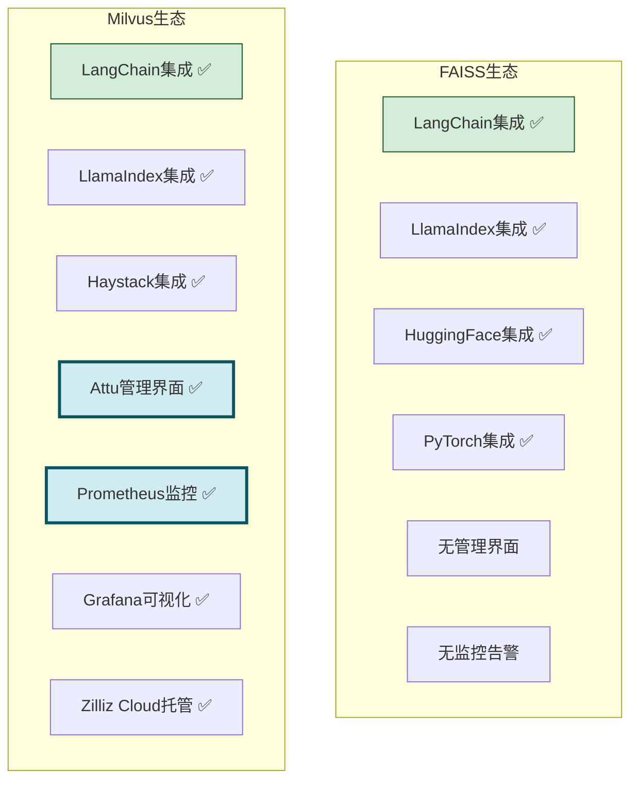

### 8.3 生态对比表

| 生态能力 | FAISS | Milvus |
|---------|:-----:|:------:|
| **LangChain** | ✅ | ✅ |
| **LlamaIndex** | ✅ | ✅ |
| **HuggingFace** | ✅ | ✅ |
| **管理界面** | ❌ | ✅(Attu) |
| **监控告警** | ❌ | ✅(Prometheus+Grafana) |
| **备份恢复** | ❌ | ✅(内置工具) |
| **数据导入导出** | ❌ | ✅(CLI/API) |
| **云托管服务** | ❌ | ✅(Zilliz Cloud) |
| **多语言SDK** | Python/C++ | Python/Java/Go/Node/C# |

---

## 九、适用场景对比

### 9.1 场景适配矩阵

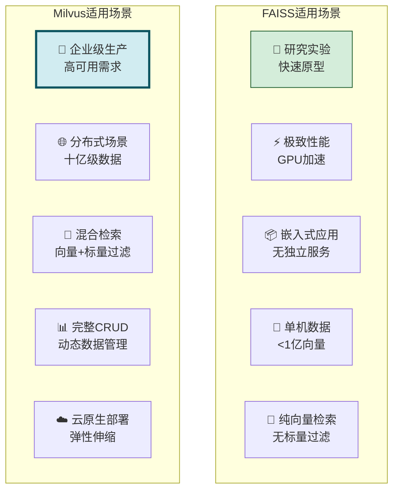

### 9.2 场景选择决策表

| 场景特征 | 推荐 | 原因 |
|---------|:----:|------|
| **数据量<1000万** | FAISS | 单机足够,无需运维成本 |
| **数据量>1亿** | Milvus | 分布式必需 |
| **需要标量过滤** | Milvus | 原生支持,高效 |
| **需要完整CRUD** | Milvus | FAISS不支持删除/更新 |
| **GPU极致性能** | FAISS | GPU索引深度优化 |
| **高可用生产环境** | Milvus | 多副本+故障转移 |
| **快速原型验证** | FAISS | 1分钟部署 |
| **多用户并发** | Milvus | 服务化+负载均衡 |
| **嵌入式应用** | FAISS | 无独立服务依赖 |
| **动态数据频繁更新** | Milvus | 增删改高效 |

---

## 十、与 RAG 系统集成兼容性对比

### 10.1 RAG 集成对比


### 10.2 RAG 集成代码对比

```python
class RAGIntegrationComparison:
    """RAG集成对比"""

    def faiss_rag_example(self):
        """FASSI RAG集成示例"""
        import faiss

        class FAISSRAGSystem:
            def __init__(self, dim=1024):
                self.index = faiss.IndexFlatL2(dim)
                self.metadata = {}  # 元数据需外部管理
                self.id_map = {}    # FAISS内部ID→业务ID映射

            def add_documents(self, docs: list[dict]):
                """添加文档"""
                vectors = [d["embedding"] for d in docs]
                self.index.add(np.array(vectors))
                for i, doc in enumerate(docs):
                    faiss_id = len(self.id_map)
                    self.id_map[faiss_id] = doc["id"]
                    self.metadata[doc["id"]] = {
                        "content": doc["content"],
                        "source": doc.get("source", ""),
                        "category": doc.get("category", "")
                    }

            def search(self, query_vec, top_k=5, category=None):
                """检索(支持元数据过滤)"""
                # FAISS不支持原生过滤,需要先检索更多再过滤
                search_k = top_k * 5 if category else top_k
                distances, indices = self.index.search(
                    query_vec.reshape(1, -1), search_k
                )

                # 应用层过滤
                results = []
                for dist, idx in zip(distances[0], indices[0]):
                    if idx < 0:
                        continue
                    doc_id = self.id_map[idx]
                    meta = self.metadata[doc_id]
                    if category and meta["category"] != category:
                        continue
                    results.append({
                        "id": doc_id,
                        "content": meta["content"],
                        "score": float(dist)
                    })
                    if len(results) >= top_k:
                        break
                return results

            def delete_document(self, doc_id: str):
                """删除文档(FAISS不支持删除)"""
                # FAISS不支持删除,需要重建索引
                raise NotImplementedError(
                    "FAISS不支持删除,需要重建索引"
                )

        return "FAISS: 元数据需外部管理,不支持删除"

    def milvus_rag_example(self):
        """Milvus RAG集成示例"""
        from pymilvus import (
            connections, Collection, FieldSchema,
            CollectionSchema, DataType
        )

        class MilvusRAGSystem:
            def __init__(self, dim=1024):
                connections.connect(host="localhost", port="19530")

                # 定义Schema(向量+标量)
                fields = [
                    FieldSchema("id", DataType.VARCHAR, max_length=64,
                                is_primary=True),
                    FieldSchema("embedding", DataType.FLOAT_VECTOR, dim=dim),
                    FieldSchema("content", DataType.VARCHAR, max_length=65535),
                    FieldSchema("source", DataType.VARCHAR, max_length=256),
                    FieldSchema("category", DataType.VARCHAR, max_length=64)
                ]
                schema = CollectionSchema(fields)
                self.collection = Collection("rag_docs", schema)
                self.collection.create_index("embedding", {
                    "index_type": "HNSW",
                    "metric_type": "L2",
                    "params": {"M": 32, "efConstruction": 200}
                })
                self.collection.load()

            def add_documents(self, docs: list[dict]):
                """添加文档"""
                self.collection.insert([
                    [d["id"] for d in docs],
                    [d["embedding"] for d in docs],
                    [d["content"] for d in docs],
                    [d.get("source", "") for d in docs],
                    [d.get("category", "") for d in docs]
                ])

            def search(self, query_vec, top_k=5, category=None):
                """检索(原生标量过滤)"""
                expr = f'category == "{category}"' if category else None
                results = self.collection.search(
                    data=[query_vec.tolist()],
                    anns_field="embedding",
                    param={"metric_type": "L2",
                           "params": {"ef": 50}},
                    limit=top_k,
                    expr=expr,  # 原生标量过滤
                    output_fields=["content", "source", "category"]
                )
                return [
                    {
                        "id": hit.id,
                        "content": hit.entity.get("content"),
                        "score": hit.score,
                        "category": hit.entity.get("category")
                    }
                    for hit in results[0]
                ]

            def delete_document(self, doc_id: str):
                """删除文档(原生支持)"""
                self.collection.delete(f'id == "{doc_id}"')

        return "Milvus: 元数据内置,原生过滤,支持删除"
```

### 10.3 RAG 集成能力对比

| RAG能力 | FAISS | Milvus |
|---------|:-----:|:------:|
| **向量存储** | ✅ | ✅ |
| **元数据存储** | ❌(外部) | ✅(内置) |
| **标量过滤检索** | ❌(应用层) | ✅(原生) |
| **文档删除** | ❌(重建索引) | ✅(原生) |
| **文档更新** | ❌(重建) | ✅(upsert) |
| **持久化** | 手动保存文件 | 自动持久化 |
| **多用户隔离** | ❌ | ✅(Collection/Partition) |
| **增量更新** | 需重建 | 原生支持 |

---

## 十一、RAG 场景选型建议

### 11.1 选型决策流程

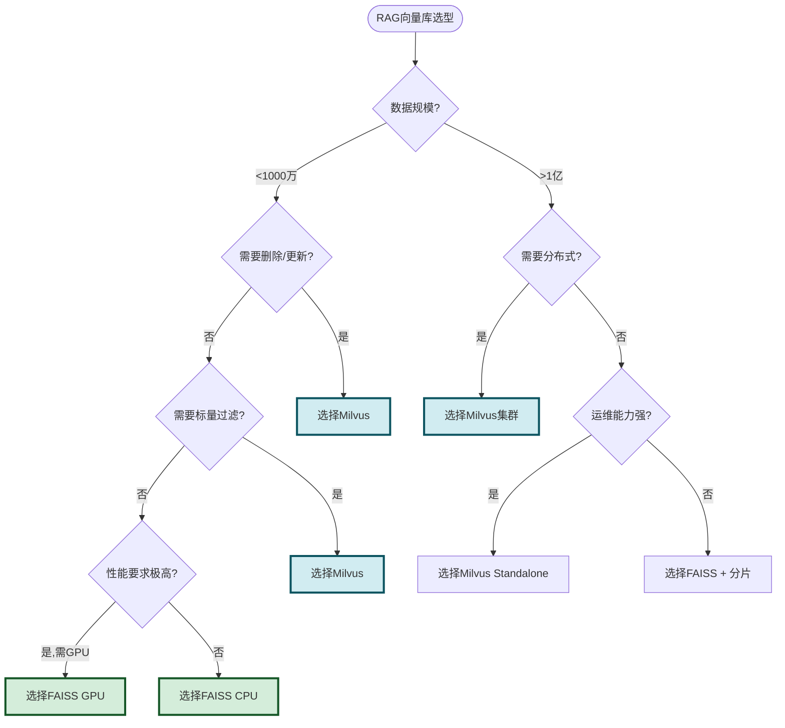

### 11.2 典型 RAG 场景推荐

| RAG场景 | 推荐 | 原因 |
|---------|:----:|------|
| **个人知识库(<100万文档)** | FAISS | 轻量,无需运维 |
| **企业知识库(100万-1亿)** | Milvus | 标量过滤+CRUD+高可用 |
| **超大规模知识库(>1亿)** | Milvus集群 | 分布式必需 |
| **需要按部门/类别过滤** | Milvus | 原生标量过滤 |
| **频繁更新文档** | Milvus | 原生增删改 |
| **GPU加速推理** | FAISS | GPU索引极致性能 |
| **快速原型验证** | FAISS | 1分钟部署 |
| **生产级高可用** | Milvus | 多副本+故障转移 |

### 11.3 混合架构建议

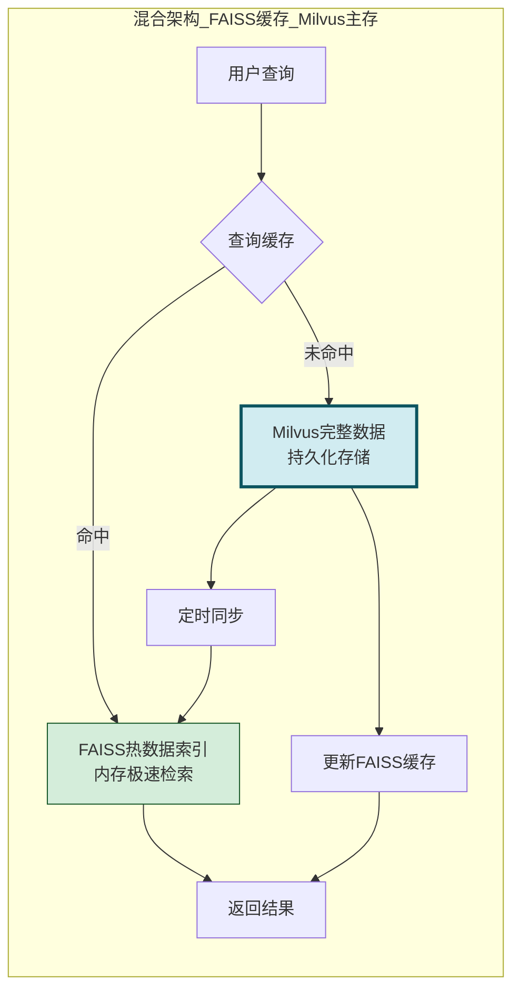

**混合架构适用场景**:数据量大(>1亿)且查询延迟要求极高(<5ms),用 Milvus 做主存储,FAISS 做热数据缓存。

---

## 十二、总结

### 12.1 全维度对比总表

| 维度 | FAISS | Milvus | 胜出 |
|------|-------|--------|:----:|
| **本质** | 向量检索库 | 向量数据库 | 各有所长 |
| **架构** | 嵌入式单机 | 分布式微服务 | 视场景 |
| **查询速度** | 极快(无网络) | 快(有网络) | FAISS |
| **数据规模** | 百万~千万 | 十亿级 | Milvus |
| **扩展性** | 垂直扩展 | 水平+垂直 | Milvus |
| **数据类型** | 仅向量 | 向量+标量 | Milvus |
| **标量过滤** | ❌ | ✅ | Milvus |
| **索引类型** | 8种(含GPU) | 9种(含DiskANN) | 各有所长 |
| **部署复杂度** | 极低(pip) | 中(Docker/K8s) | FAISS |
| **CRUD** | 仅新增+查询 | 完整CRUD | Milvus |
| **高可用** | ❌ | ✅ | Milvus |
| **社区** | 活跃(Meta) | 活跃(Zilliz) | 持平 |
| **管理界面** | ❌ | ✅(Attu) | Milvus |
| **RAG集成** | 基础 | 深度 | Milvus |
| **运维成本** | 极低 | 中-高 | FAISS |

### 12.2 核心结论

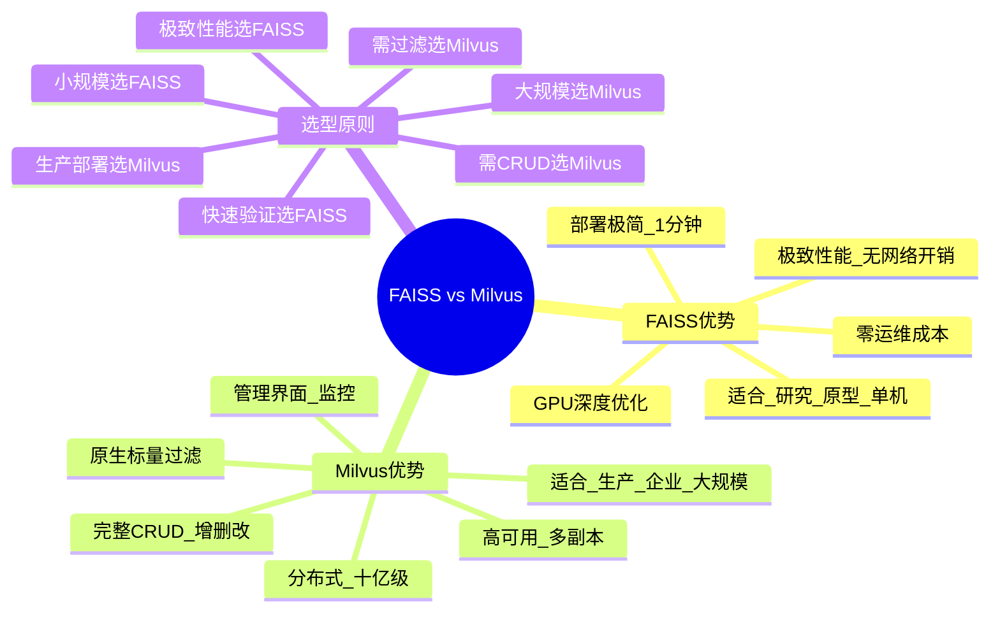

> **选型一句话总结**:**研究/原型/单机/极致性能选 FAISS,生产/企业/大规模/需CRUD选 Milvus**。FAISS 是"轻量级跑车",启动快、速度快但载量有限;Milvus 是"重型卡车",载量大、功能全但需要更多运维。在 RAG 场景中,小规模知识库用 FAISS 足矣,企业级生产环境强烈推荐 Milvus。

### 12.3 与系列文档的关系

- [61向量数据库在RAG系统中的核心作用深度解析.md](./61向量数据库在RAG系统中的核心作用深度解析.md):61号是通用作用,本文是具体选型对比
- [58RAG Embedding模型深度解析.md](./58RAG%20Embedding模型深度解析.md):Embedding模型决定向量维度,影响向量库选择
- [60RAG系统Embedding模型选型决策指南.md](./60RAG系统Embedding模型选型决策指南.md):Embedding选型需考虑与向量库的兼容性
- [51RAG检索增强生成详解.md](./51RAG检索增强生成详解.md):RAG整体架构,向量库是核心组件
- [52RAG工作流程详解.md](./52RAG工作流程详解.md):RAG流程中检索环节依赖向量库

---

> **相关文档**
>
> - [61向量数据库在RAG系统中的核心作用深度解析.md](./61向量数据库在RAG系统中的核心作用深度解析.md):向量数据库在RAG中的通用作用
> - [58RAG Embedding模型深度解析.md](./58RAG%20Embedding模型深度解析.md):Embedding模型原理
> - [60RAG系统Embedding模型选型决策指南.md](./60RAG系统Embedding模型选型决策指南.md):Embedding模型选型指南
> - [51RAG检索增强生成详解.md](./51RAG检索增强生成详解.md):RAG整体概念
> - [52RAG工作流程详解.md](./52RAG工作流程详解.md):RAG完整工作流程
