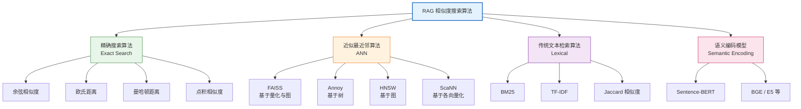
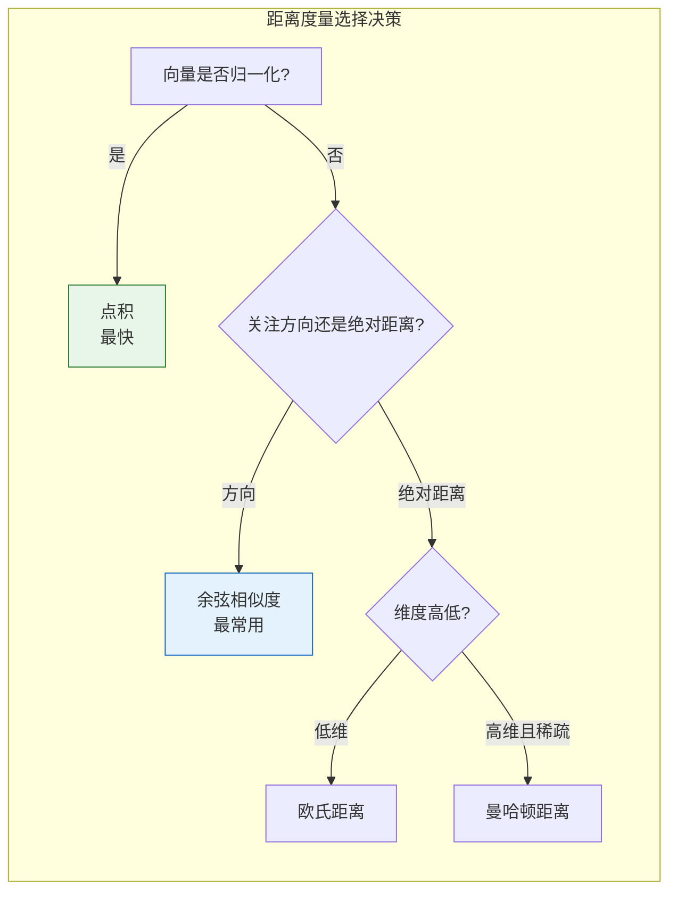
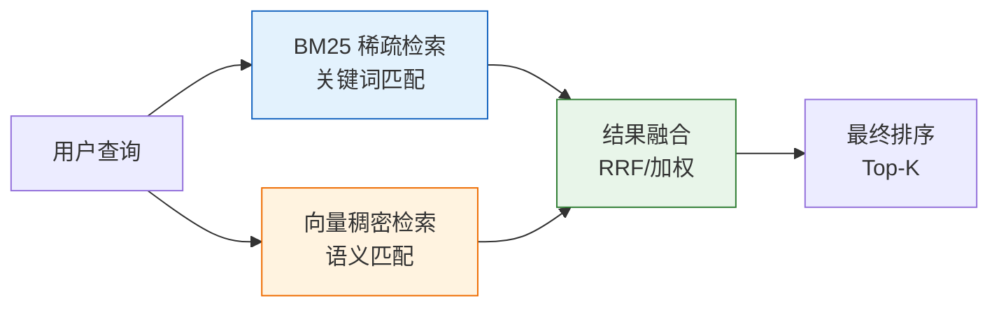
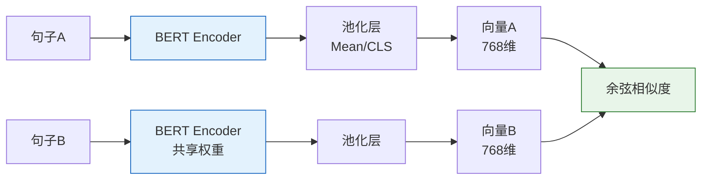
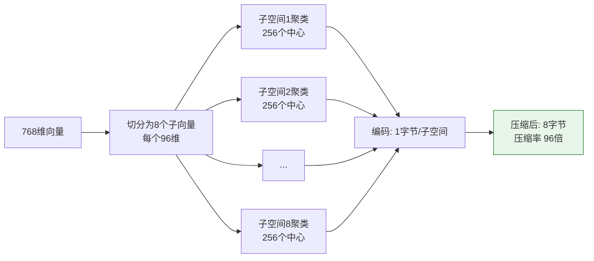
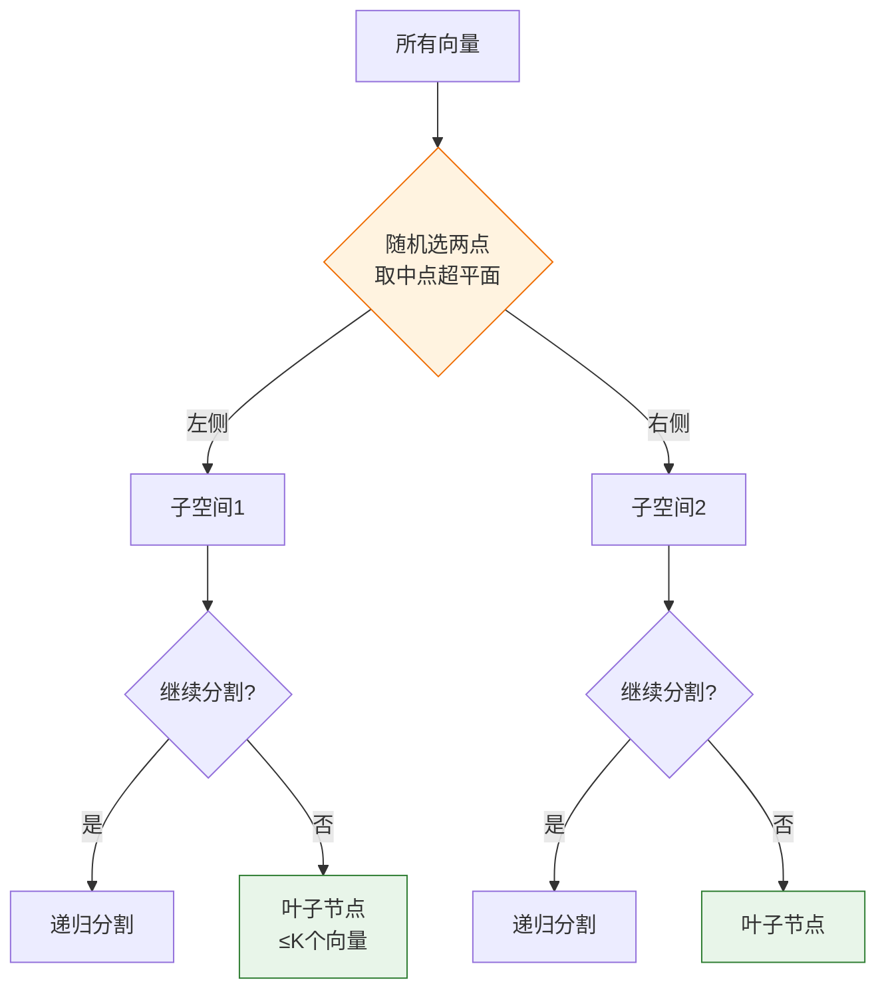
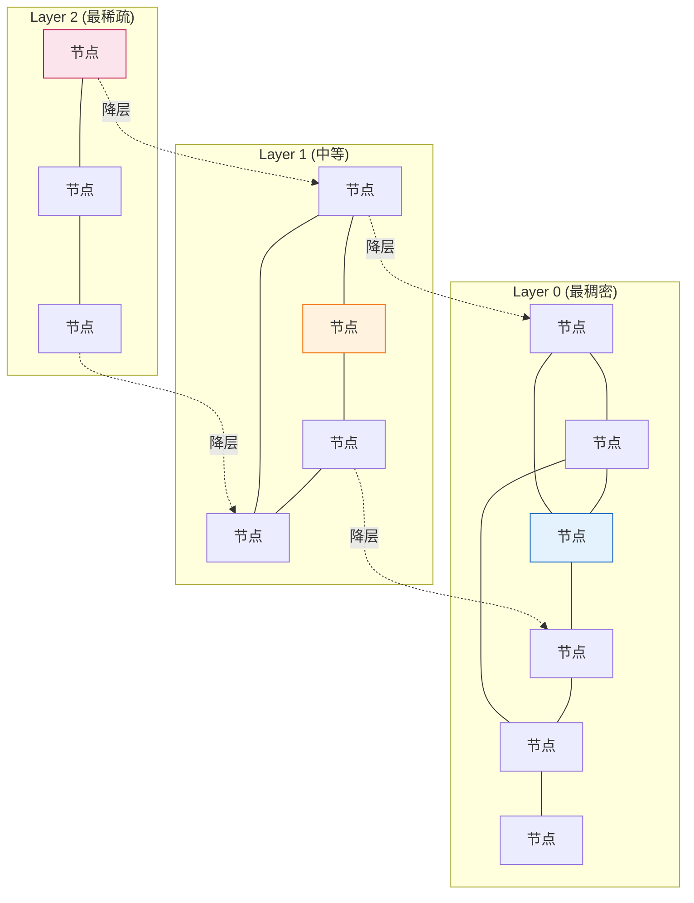
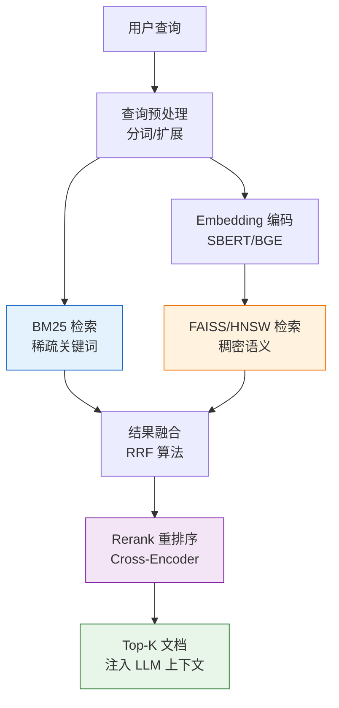
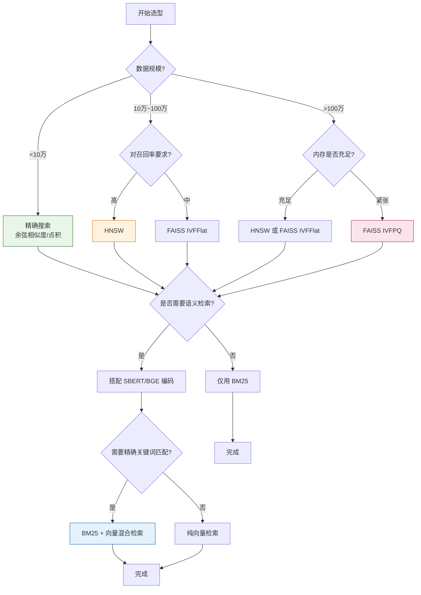

# RAG 场景相似度搜索算法深度调研与选型指南

## 引言

检索增强生成（RAG）系统的核心在于**从海量知识库中快速、准确地检索出与用户查询最相关的文档片段**。这一检索过程的效率和质量，直接决定了整个 RAG 系统的最终效果。而检索的底层基础，正是**相似度搜索算法（Similarity Search Algorithms）**。

相似度搜索算法决定了"如何衡量查询与文档之间的相关性"以及"如何在大规模向量集合中高效找到最相似的向量"。选择合适的算法，是 RAG 系统设计中至关重要的技术决策。本文系统调研适用于 RAG 场景的主流相似度搜索算法，从原理、优缺点、适用场景到性能对比，提供完整的技术选型参考。

---

## 1. 相似度搜索算法分类总览

### 1.1 算法分类体系



### 1.2 算法在 RAG 中的角色定位

| 算法类别 | 在 RAG 中的角色 | 典型代表 |
| :--- | :--- | :--- |
| **距离度量函数** | 衡量两个向量的相似程度 | 余弦相似度、欧氏距离、曼哈顿距离 |
| **传统词法检索** | 基于关键词匹配的稀疏检索 | BM25、TF-IDF |
| **集合相似度** | 衡量集合/序列的重叠程度 | Jaccard 相似度 |
| **语义编码模型** | 将文本转化为稠密语义向量 | Sentence-BERT、BGE |
| **ANN 索引算法** | 在大规模向量集合中高效检索 | FAISS、Annoy、HNSW |

> **关键理解**：距离度量函数和 ANN 索引算法是**正交关系**——ANN 算法是"如何快速搜索"的策略，距离度量是"如何判断相似"的标准，两者配合使用。语义编码模型则是"如何将文本转为向量"的方法，位于检索流程的上游。

---

## 2. 距离度量函数（Distance Metrics）

### 2.1 余弦相似度（Cosine Similarity）

#### 2.1.1 原理

衡量两个向量在方向上的相似性，忽略向量的模长（即忽略文本长度差异）。

**数学公式**：

$$
\text{Cosine Similarity}(A, B) = \frac{A \cdot B}{\|A\| \cdot \|B\|} = \frac{\sum_{i=1}^{n} A_i B_i}{\sqrt{\sum_{i=1}^{n} A_i^2} \cdot \sqrt{\sum_{i=1}^{n} B_i^2}}
$$

取值范围为 $[-1, 1]$，值越接近 1 表示越相似。在文本检索中，由于 Embedding 向量通常非负，实际取值多为 $[0, 1]$。

#### 2.1.2 优缺点

| 维度 | 说明 |
| :--- | :--- |
| **优点** | 对向量模长不敏感，适合长度差异大的文本；计算高效（尤其向量已归一化时退化为点积）；NLP 领域最常用的度量 |
| **缺点** | 忽略向量模长可能丢失信息（模长有时编码了文本的"信息量"或"重要性"）；对正交向量区分度低 |
| **适用场景** | 语义相似度检索、文档去重、问答匹配 |

#### 2.1.3 实现方式

```python
import numpy as np

def cosine_similarity(a, b):
    """基础实现"""
    return np.dot(a, b) / (np.linalg.norm(a) * np.linalg.norm(b))

# 工程实践：预先归一化向量，将余弦相似度转化为点积
def normalize(vectors):
    """L2 归一化"""
    norms = np.linalg.norm(vectors, axis=1, keepdims=True)
    return vectors / (norms + 1e-8)

# 归一化后，余弦相似度 = 点积，可利用矩阵乘法加速
normalized_db = normalize(database_vectors)
normalized_query = normalize(query_vector)
similarities = normalized_db @ normalized_query  # 高效点积
```

---

### 2.2 欧氏距离（Euclidean Distance / L2 Distance）

#### 2.2.1 原理

衡量两个向量在多维空间中的直线距离。

**数学公式**：

$$
d_{euclidean}(A, B) = \sqrt{\sum_{i=1}^{n} (A_i - B_i)^2} = \|A - B\|_2
$$

取值范围为 $[0, +\infty)$，值越小表示越相似。

#### 2.2.2 优缺点

| 维度 | 说明 |
| :--- | :--- |
| **优点** | 几何意义直观；考虑了向量的模长和方向；对异常值敏感（在某些场景下是优点） |
| **缺点** | 受向量模长影响大，长短文本比较时可能失真；高维空间中距离的区分度下降（"维度诅咒"） |
| **适用场景** | 图像检索、Embedding 模型明确使用 L2 训练的场景（如部分 OpenAI 模型） |

#### 2.2.3 与余弦相似度的关系

当向量都经过 L2 归一化后，欧氏距离与余弦相似度存在单调转换关系：

$$
\|A' - B'\|_2 = \sqrt{2 - 2 \cdot \cos(A, B)}
$$

其中 $A', B'$ 是归一化后的向量。这意味着**归一化后，按欧氏距离排序与按余弦相似度排序结果一致**。

---

### 2.3 曼哈顿距离（Manhattan Distance / L1 Distance）

#### 2.3.1 原理

衡量两个向量在各维度上差值的绝对值之和，类比在城市网格中沿街道行走的距离。

**数学公式**：

$$
d_{manhattan}(A, B) = \sum_{i=1}^{n} |A_i - B_i|
$$

#### 2.3.2 优缺点

| 维度 | 说明 |
| :--- | :--- |
| **优点** | 计算简单（无平方根运算）；对异常值比欧氏距离更鲁棒；在低维空间中表现稳定 |
| **缺点** | 高维空间中区分度差；在 NLP 语义检索中效果通常不如余弦相似度 |
| **适用场景** | 稀疏向量检索、离散特征匹配、低维数据（如 2D/3D 空间） |

---

### 2.4 点积相似度（Dot Product / Inner Product）

#### 2.4.1 原理

$$
\text{DotProduct}(A, B) = \sum_{i=1}^{n} A_i B_i = A \cdot B
$$

#### 2.4.2 特点与应用

- 当向量已归一化时，点积等价于余弦相似度，但计算更快（无需再除以模长）。
- 当向量未归一化时，点积同时考虑了方向和模长，模长大的向量会获得更高相似度。
- **FAISS 中的 `IndexFlatIP`** 专门用于点积相似度检索，是归一化向量场景下的首选。

---

### 2.5 距离度量对比总结



---

## 3. 集合相似度：Jaccard 相似度

### 3.1 原理

衡量两个集合的交集与并集之比，适用于集合或序列的重叠度比较。

**数学公式**：

$$
J(A, B) = \frac{|A \cap B|}{|A \cup B|}
$$

取值范围为 $[0, 1]$，1 表示完全相同，0 表示完全不相交。

### 3.2 在 RAG 中的应用

Jaccard 相似度本身不直接用于稠密向量检索，但在以下 RAG 子场景中有应用价值：

| 应用场景 | 说明 |
| :--- | :--- |
| **文档去重** | 对文档进行 N-gram 分词后计算 Jaccard 相似度，去除高度重复的文档 |
| **查询扩展** | 比较用户查询与历史查询的词汇重叠，进行查询推荐 |
| **混合检索中的词法匹配** | 作为稀疏检索的补充信号 |
| **分块重叠度控制** | 检查文档分块之间的重叠比例，避免冗余 |

### 3.3 优缺点

| 维度 | 说明 |
| :--- | :--- |
| **优点** | 计算简单直观；对集合大小不敏感；适合离散、稀疏数据 |
| **缺点** | 不考虑语义，仅基于字面重叠；高频词会主导相似度（需配合停用词过滤） |
| **适用场景** | 短文本去重、关键词匹配、N-gram 比对 |

### 3.4 实现

```python
def jaccard_similarity(set_a, set_b):
    """基础实现"""
    intersection = len(set_a & set_b)
    union = len(set_a | set_b)
    return intersection / union if union > 0 else 0

# 文档去重示例
def deduplicate_documents(docs, threshold=0.85):
    """基于 Jaccard 相似度的文档去重"""
    doc_sets = [set(doc.lower().split()) for doc in docs]
    unique_docs = []
    for i, doc in enumerate(docs):
        is_duplicate = any(
            jaccard_similarity(doc_sets[i], doc_sets[j]) > threshold
            for j in range(len(unique_docs))
        )
        if not is_duplicate:
            unique_docs.append(doc)
    return unique_docs
```

---

## 4. 传统词法检索算法

### 4.1 BM25（Best Matching 25）

#### 4.1.1 原理

BM25 是基于 TF-IDF 的改进算法，是传统全文检索的工业标准。它通过词频（TF）和逆文档频率（IDF）计算查询与文档的相关性，并引入饱和函数和文档长度归一化。

**核心公式**：

$$
\text{BM25}(D, Q) = \sum_{i=1}^{n} \text{IDF}(q_i) \cdot \frac{f(q_i, D) \cdot (k_1 + 1)}{f(q_i, D) + k_1 \cdot \left(1 - b + b \cdot \frac{|D|}{\text{avgdl}}\right)}
$$

其中：
- $f(q_i, D)$：词 $q_i$ 在文档 $D$ 中的词频
- $|D|$：文档长度，$\text{avgdl}$：平均文档长度
- $k_1$：词频饱和参数（通常 1.2~2.0），控制词频增长的影响上限
- $b$：长度归一化参数（通常 0.75），控制文档长度的惩罚力度
- $\text{IDF}(q_i) = \ln\left(\frac{N - n(q_i) + 0.5}{n(q_i) + 0.5} + 1\right)$，$N$ 为文档总数，$n(q_i)$ 为包含 $q_i$ 的文档数

#### 4.1.2 优缺点

| 维度 | 说明 |
| :--- | :--- |
| **优点** | 无需 GPU，计算速度快；可解释性强（能定位匹配的关键词）；对精确关键词匹配效果优秀；索引体积小 |
| **缺点** | 无法理解语义（"汽车"和"轿车"被视为完全不同）；对同义词、拼写错误无能为力；依赖分词质量 |
| **适用场景** | 精确关键词检索、专业术语检索、与向量检索混合使用 |

#### 4.1.3 在 RAG 中的关键作用：混合检索

BM25 在现代 RAG 系统中并非被向量检索取代，而是与之**混合使用**，形成**混合检索（Hybrid Search）**策略：



**为什么需要混合？**
- BM25 擅长：精确匹配产品型号、人名、代码标识符等。
- 向量检索擅长：语义相似、同义表达、跨语言匹配。
- 两者互补：向量检索可能遗漏包含精确关键词的文档，BM25 可能遗漏语义相关但用词不同的文档。

#### 4.1.4 实现

```python
# 使用 rank_bm25 库
from rank_bm25 import BM25Okapi

# 分词
tokenized_corpus = [doc.split() for doc in corpus]
bm25 = BM25Okapi(tokenized_corpus)

# 检索
tokenized_query = query.split()
scores = bm25.get_scores(tokenized_query)
top_k_indices = scores.argsort()[-5:][::-1]
```

### 4.2 TF-IDF

TF-IDF 是 BM25 的前身，公式更简单：

$$
\text{TF-IDF}(t, d) = \text{TF}(t, d) \times \text{IDF}(t)
$$

在 RAG 中通常被 BM25 取代，因为 BM25 的饱和函数和长度归一化效果更好。TF-IDF 主要作为教学概念和基线方法存在。

---

## 5. 语义编码模型

### 5.1 Sentence-BERT（SBERT）

#### 5.1.1 原理

标准 BERT 的输出是 token 级别的向量，直接平均池化后用于句子相似度效果较差。Sentence-BERT 通过**对比学习（Contrastive Learning）**微调 BERT，使其能直接生成高质量的句子级 Embedding。

**架构**：



#### 5.1.2 训练目标

- **分类任务**：拼接两向量 $[u, v, |u-v|]$，通过 softmax 分类。
- **对比学习**：正样本对拉近，负样本对推远（如使用 MultipleNegativesRankingLoss）。

#### 5.1.3 优缺点

| 维度 | 说明 |
| :--- | :--- |
| **优点** | 生成高质量句子级语义向量；推理高效（预计算后仅需向量比较）；支持多语言 |
| **缺点** | 需要额外训练/微调；对领域敏感（通用模型在专业领域可能效果下降）；编码阶段需要 GPU |
| **适用场景** | RAG 系统的 Embedding 生成、语义搜索、聚类 |

#### 5.1.4 实现

```python
from sentence_transformers import SentenceTransformer

# 加载预训练模型
model = SentenceTransformer('all-MiniLM-L6-v2')  # 快速、轻量

# 编码文档库（离线预处理）
doc_embeddings = model.encode(documents, normalize_embeddings=True)

# 编码查询并检索
query_embedding = model.encode([query], normalize_embeddings=True)
similarities = doc_embeddings @ query_embedding.T  # 归一化后用点积
```

### 5.2 其他主流 Embedding 模型

| 模型 | 特点 | 维度 | 适用场景 |
| :--- | :--- | :--- | :--- |
| **BGE（BAAI）** | 中英文效果好，开源领先 | 768/1024 | 中英文 RAG |
| **E5（Microsoft）** | 多语言，弱监督训练 | 768/1024 | 多语言场景 |
| **text-embedding-3（OpenAI）** | API 调用，效果优秀 | 1536/3072 | 商用项目 |
| **Cohere Embed v3** | 多语言，支持压缩 | 1024 | 商用项目 |
| **GTE（阿里巴巴）** | 多粒度，长文本友好 | 768/1024 | 长文档 RAG |

---

## 6. 近似最近邻（ANN）索引算法

当向量库规模达到百万甚至亿级时，精确搜索（暴力遍历计算所有距离）的时间成本不可接受。ANN 算法通过牺牲少量精度换取巨大的速度提升。

### 6.1 FAISS（Facebook AI Similarity Search）

#### 6.1.1 原理与架构

FAISS 是 Facebook 开源的向量相似度搜索库，核心思想是通过**向量量化（Vector Quantization）**压缩向量并加速搜索。

**核心索引类型**：

| 索引类型 | 原理 | 适用场景 |
| :--- | :--- | :--- |
| `IndexFlatL2` / `IndexFlatIP` | 暴力精确搜索 | 小规模数据（<10万），基线对比 |
| `IndexIVFFlat` | 倒排索引 + 聚类划分 | 中规模数据（10万~百万） |
| `IndexIVFPQ` | 倒排 + 乘积量化压缩 | 大规模数据（百万~亿），内存敏感 |
| `IndexHNSWFlat` | 基于图的索引 | 追求高召回率，内存充足 |
| `IndexIVFPQ + HNSW` | 混合索引 | 超大规模，兼顾速度与精度 |

#### 6.1.2 乘积量化（PQ）原理

PQ 将高维向量切分为多个子向量，每个子空间独立聚类，用聚类中心的索引（码本）替代原始向量，大幅压缩存储。



#### 6.1.3 优缺点

| 维度 | 说明 |
| :--- | :--- |
| **优点** | 搜索速度极快（毫秒级百万数据）；支持 GPU 加速；索引类型丰富，适应不同场景；生态成熟 |
| **缺点** | 量化带来精度损失；参数调优复杂（`nlist`、`nprobe`、`m`、`nbits`）；纯内存索引，持久化需额外处理 |
| **适用场景** | 中大规模 RAG 系统的首选方案 |

#### 6.1.4 实现

```python
import faiss
import numpy as np

dimension = 768
nlist = 100  # 聚类中心数
m = 8        # PQ 子向量数

# 创建 IVFPQ 索引
quantizer = faiss.IndexFlatIP(dimension)
index = faiss.IndexIVFPQ(quantizer, dimension, nlist, m, 8)
index.train(database_vectors)   # 训练
index.add(database_vectors)     # 添加数据
index.nprobe = 10               # 搜索时探查的聚类数（精度-速度权衡）

# 搜索
D, I = index.search(query_vectors, k=5)
```

---

### 6.2 Annoy（Approximate Nearest Neighbors Oh Yeah）

#### 6.2.1 原理

Annoy 是 Spotify 开源的基于**随机投影树（Random Projection Tree）**的 ANN 算法。它通过递归地用随机超平面分割空间，构建多棵树，搜索时在多棵树中并行查找并合并结果。

**建树过程**：



#### 6.2.2 优缺点

| 维度 | 说明 |
| :--- | :--- |
| **优点** | 索引可持久化到文件，支持内存映射（mmap）加载；多树并行搜索，速度快；内存占用相对较小；只读场景性能优秀 |
| **缺点** | 不支持动态添加/删除（需重建索引）；精度提升需要增加树的数量，内存成本上升；召回率通常不如 HNSW |
| **适用场景** | 只读型推荐系统、音乐/内容推荐（Spotify 原始场景）、嵌入式部署 |

#### 6.2.3 实现

```python
from annoy import AnnoyIndex

dimension = 768
n_trees = 10  # 树的数量，越多越准但越慢

index = AnnoyIndex(dimension, 'angular')  # angular = 余弦相似度
for i, vec in enumerate(database_vectors):
    index.add_item(i, vec)
index.build(n_trees)
index.save('rag_index.ann')

# 搜索
loaded_index = AnnoyIndex(dimension, 'angular')
loaded_index.load('rag_index.ann')
indices, distances = loaded_index.get_nns_by_vector(query_vector, 5, include_distances=True)
```

---

### 6.3 HNSW（Hierarchical Navigable Small World）

#### 6.3.1 原理

HNSW 是基于**图**的 ANN 算法，构建一个分层的小世界图。顶层稀疏（长距离连接，用于快速定位区域），底层稠密（短距离连接，用于精确搜索）。



**搜索流程**：从顶层入口点开始贪心搜索 → 定位到目标区域 → 逐层下降 → 在底层精确搜索最近邻。

#### 6.3.2 优缺点

| 维度 | 说明 |
| :--- | :--- |
| **优点** | 召回率高（ANN 算法中领先）；查询速度快；支持动态插入 |
| **缺点** | 内存占用大（需存储图结构）；构建索引慢；不支持高效删除 |
| **适用场景** | 对召回率要求高的 RAG 系统，内存充足的场景 |

#### 6.3.3 实现

```python
# 使用 hnswlib
import hnswlib

dimension = 768
index = hnswlib.Index(space='cosine', dim=dimension)
index.init_index(max_elements=1000000, ef_construction=200, M=16)
index.add_items(database_vectors, ids)
index.set_ef(50)  # 搜索时的动态候选列表大小，越大越准越慢

labels, distances = index.knn_query(query_vector, k=5)
```

---

### 6.4 ANN 算法性能对比

| 指标 | FAISS (IVFFlat) | FAISS (IVFPQ) | Annoy | HNSW |
| :--- | :--- | :--- | :--- | :--- |
| **搜索速度** | 快 | 很快 | 快 | 很快 |
| **召回率** | 中高 | 中（有量化损失） | 中 | 高 |
| **内存占用** | 中 | 低（压缩） | 中低 | 高 |
| **索引构建** | 快 | 中 | 快 | 慢 |
| **动态更新** | 支持（有限） | 支持（有限） | 不支持 | 支持插入 |
| **持久化** | 需手动 | 需手动 | 原生支持 | 需手动 |
| **GPU 加速** | 支持 | 支持 | 不支持 | 不支持 |
| **推荐场景** | 通用大规模 | 超大规模内存敏感 | 只读推荐 | 高精度检索 |

> **数据参考**（100 万向量，768 维）：精确搜索约 1000ms；FAISS IVFPQ 约 1~5ms（召回率 ~95%）；HNSW 约 1~3ms（召回率 ~98%）；Annoy 约 2~8ms（召回率 ~93%）。

---

## 7. RAG 系统中的综合应用案例

### 7.1 典型 RAG 检索流程



### 7.2 倒数排名融合（RRF）

混合检索的关键是融合 BM25 和向量检索的结果。RRF 是最常用的融合算法：

$$
\text{RRF}(d) = \sum_{r \in R} \frac{1}{k + r(d)}
$$

其中 $r(d)$ 是文档 $d$ 在某个检索结果列表中的排名，$k$ 是平滑常数（通常 60），$R$ 是所有检索结果列表。

```python
def reciprocal_rank_fusion(rankings, k=60):
    """
    rankings: dict of {source_name: [(doc_id, rank), ...]}
    """
    scores = {}
    for source, ranked_list in rankings.items():
        for rank, doc_id in enumerate(ranked_list, 1):
            scores[doc_id] = scores.get(doc_id, 0) + 1 / (k + rank)
    return sorted(scores.items(), key=lambda x: -x[1])
```

### 7.3 完整案例：企业知识库 RAG 检索系统

**场景**：100 万文档的企业知识库，中英文混合，要求毫秒级响应。

**技术选型**：
- **Embedding 模型**：BGE-large-zh（中英文效果好）
- **向量索引**：FAISS IVFPQ（兼顾速度与内存）
- **词法检索**：BM25（Elasticsearch）
- **融合策略**：RRF
- **重排序**：bge-reranker-large

```python
class HybridRAGRetriever:
    def __init__(self):
        self.embedder = SentenceTransformer('BAAI/bge-large-zh')
        self.bm25 = BM25Okapi(tokenized_corpus)
        self.faiss_index = faiss.read_index('ivfpq.index')
        self.reranker = SentenceTransformer('BAAI/bge-reranker-large')
    
    def retrieve(self, query, top_k=5):
        # 1. BM25 检索
        bm25_scores = self.bm25.get_scores(query.split())
        bm25_top = bm25_scores.argsort()[-20:][::-1]
        
        # 2. 向量检索
        query_vec = self.embedder.encode([query], normalize_embeddings=True)
        _, faiss_top = self.faiss_index.search(query_vec, 20)
        
        # 3. RRF 融合
        fused = self.rrf_fuse({'bm25': bm25_top, 'faiss': faiss_top[0]})
        
        # 4. Rerank 精排
        candidates = [corpus[i] for i, _ in fused[:20]]
        query_doc_pairs = [(query, doc) for doc in candidates]
        rerank_scores = self.reranker.predict(query_doc_pairs)
        final_top_k = [candidates[i] for i in rerank_scores.argsort()[-top_k:][::-1]]
        
        return final_top_k
```

---

## 8. 算法选型技术建议

### 8.1 决策树



### 8.2 场景化推荐

| 场景特征 | 推荐方案 | 理由 |
| :--- | :--- | :--- |
| **小型 RAG（<10万文档）** | 精确点积搜索 + BGE 编码 | 数据量小，精确搜索足够快，无需 ANN |
| **中型 RAG（10万~百万）** | FAISS IVFFlat + BGE + BM25 混合 | 平衡速度与精度，部署简单 |
| **大型 RAG（百万~亿）** | FAISS IVFPQ 或 HNSW + BM25 + Rerank | 必须用 ANN，PQ 压缩内存 |
| **高精度要求场景** | HNSW + Cross-Encoder Rerank | HNSW 召回率高，Rerank 保证最终精度 |
| **只读推荐系统** | Annoy | 索引文件持久化，mmap 加载高效 |
| **多语言 RAG** | E5/BGE 多语言模型 + FAISS | 编码模型支持多语言，FAISS 通用 |
| **专业领域（法律/医疗）** | BM25 + 领域微调 Embedding + 混合检索 | 专业术语精确匹配重要，需领域微调 |

### 8.3 工程最佳实践

1. **向量归一化**：存入索引前统一 L2 归一化，将余弦相似度转化为点积，简化计算。
2. **参数调优**：ANN 算法的参数（如 `nprobe`、`ef`、`n_trees`）需在召回率和速度间权衡，建议用业务数据做网格搜索。
3. **定期重建索引**：数据频繁更新时，定期重建 ANN 索引以保持检索质量。
4. **监控召回率**：线上持续监控 ANN 召回率（与精确搜索对比采样），防止参数不当导致质量下降。
5. **Rerank 兜底**：ANN 召回 Top-50~100 → Rerank 精排 Top-5，是精度与速度的最佳平衡。

---

## 9. 总结

RAG 场景下的相似度搜索是一个**多层级协同**的技术体系：

- **编码层**：Sentence-BERT、BGE 等模型将文本转化为语义向量，决定了"相似"的语义质量。
- **度量层**：余弦相似度、点积等函数定义了相似度的数学标准，是检索的基础。
- **索引层**：FAISS、HNSW、Annoy 等 ANN 算法解决了大规模向量检索的效率问题。
- **融合层**：BM25 + 向量检索的混合策略，兼顾关键词精确匹配与语义理解。
- **精排层**：Cross-Encoder Rerank 提升最终检索精度。

没有"最好的算法"，只有"最适合场景的算法组合"。选型的核心是明确**数据规模、精度要求、延迟要求、资源约束**四个维度，在速度、精度、成本三角中找到最优平衡点。随着 RAG 系统的演进，**混合检索 + Rerank** 已成为工业界的主流范式，理解每种算法的原理和适用边界，是构建高质量 RAG 系统的基础能力。
