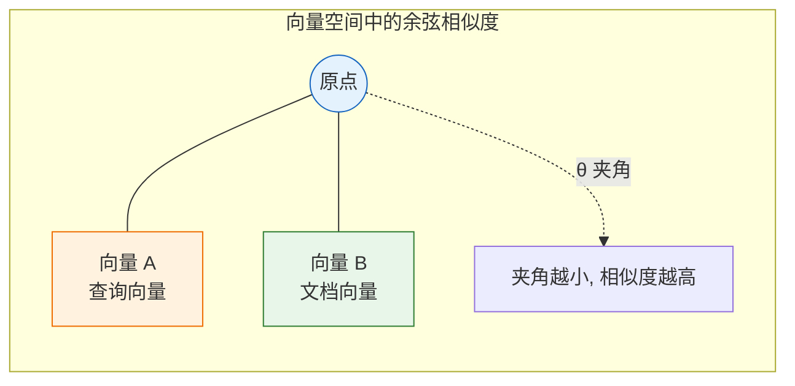
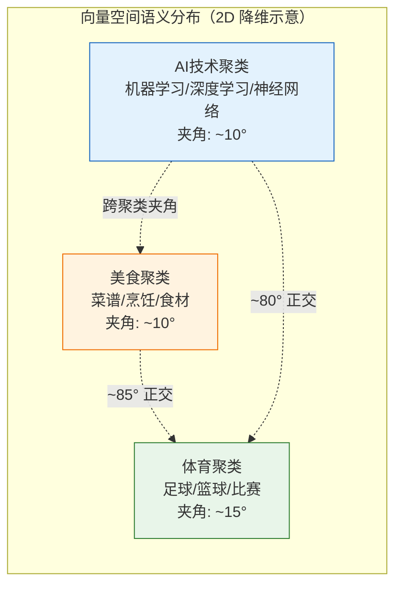
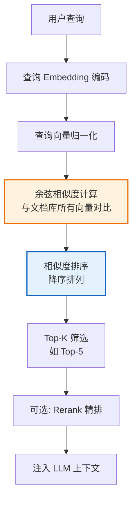
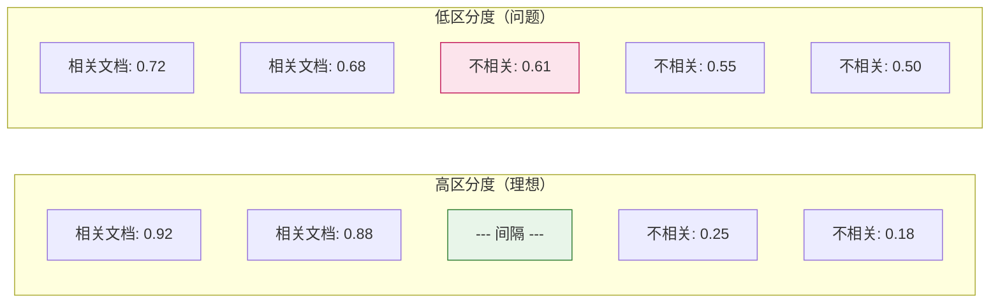

# 余弦相似度深度解析：数学原理与 RAG 系统应用

## 引言

在 RAG（检索增强生成）系统的检索阶段，核心任务是"从海量文档中找出与用户查询最相关的内容"。这一任务的第一步，是将文本转化为向量，然后**衡量向量之间的相似程度**。在众多相似度度量方法中，**余弦相似度（Cosine Similarity）** 是 NLP 和 RAG 领域最广泛使用的度量标准。

本文将从数学原理出发，深入解析余弦相似度的定义、计算方法、与其他度量的区别，以及它在 RAG 系统中如何决定检索的准确性与相关性排序。

---

## 目录

- [余弦相似度深度解析：数学原理与 RAG 系统应用](#余弦相似度深度解析数学原理与-rag-系统应用)
  - [引言](#引言)
  - [目录](#目录)
  - [1. 余弦相似度的数学原理](#1-余弦相似度的数学原理)
    - [1.1 几何直觉](#11-几何直觉)
    - [1.2 定义公式](#12-定义公式)
    - [1.3 取值范围与含义](#13-取值范围与含义)
    - [1.4 为什么"模长不重要，方向才重要"？](#14-为什么模长不重要方向才重要)
  - [2. 余弦相似度的计算方法](#2-余弦相似度的计算方法)
    - [2.1 基础实现](#21-基础实现)
    - [2.2 工程优化：归一化 + 点积](#22-工程优化归一化--点积)
    - [2.3 在 FAISS 中的应用](#23-在-faiss-中的应用)
  - [3. 与其他相似度度量方法的区别](#3-与其他相似度度量方法的区别)
    - [3.1 核心对比表](#31-核心对比表)
    - [3.2 余弦相似度 vs. 欧氏距离](#32-余弦相似度-vs-欧氏距离)
    - [3.3 余弦相似度 vs. 点积](#33-余弦相似度-vs-点积)
  - [4. 在文本向量化表示中的作用机制](#4-在文本向量化表示中的作用机制)
    - [4.1 文本到向量的转化流程](#41-文本到向量的转化流程)
    - [4.2 向量空间中的语义聚类](#42-向量空间中的语义聚类)
    - [4.3 余弦相似度衡量语义的机制](#43-余弦相似度衡量语义的机制)
    - [4.4 与 BM25 词法匹配的互补](#44-与-bm25-词法匹配的互补)
  - [5. 在 RAG 系统检索阶段的应用](#5-在-rag-系统检索阶段的应用)
    - [5.1 RAG 检索流程中的位置](#51-rag-检索流程中的位置)
    - [5.2 影响检索准确性的关键因素](#52-影响检索准确性的关键因素)
      - [5.2.1 Embedding 模型质量（决定性因素）](#521-embedding-模型质量决定性因素)
      - [5.2.2 相似度阈值设置](#522-相似度阈值设置)
      - [5.2.3 向量维度](#523-向量维度)
    - [5.3 影响相关性排序的机制](#53-影响相关性排序的机制)
      - [5.3.1 排序区分度](#531-排序区分度)
      - [5.3.2 Rerank 的补充作用](#532-rerank-的补充作用)
    - [5.4 实际应用案例](#54-实际应用案例)
  - [6. 余弦相似度的局限性与应对](#6-余弦相似度的局限性与应对)
    - [6.1 局限性分析](#61-局限性分析)
    - [6.2 应对策略](#62-应对策略)
  - [7. 总结](#7-总结)

---

## 1. 余弦相似度的数学原理

### 1.1 几何直觉

余弦相似度衡量的是**两个向量在方向上的差异**，而非距离或大小上的差异。它的几何意义是：两个向量之间夹角的余弦值。



**核心思想**：
- 夹角 $\theta$ 越小（方向越一致），余弦值越接近 1，相似度越高。
- 夹角为 0°（方向完全相同），余弦值 = 1，完全相似。
- 夹角为 90°（正交，方向无关），余弦值 = 0，完全不相似。
- 夹角为 180°（方向相反），余弦值 = -1，完全相反。

### 1.2 定义公式

给定两个 $n$ 维向量 $A = (a_1, a_2, ..., a_n)$ 和 $B = (b_1, b_2, ..., b_n)$，余弦相似度定义为：

$$
\cos(\theta) = \frac{A \cdot B}{\|A\| \cdot \|B\|} = \frac{\sum_{i=1}^{n} a_i b_i}{\sqrt{\sum_{i=1}^{n} a_i^2} \times \sqrt{\sum_{i=1}^{n} b_i^2}}
$$

**公式拆解**：

| 组成部分 | 公式 | 含义 |
| :--- | :--- | :--- |
| **点积（分子）** | $A \cdot B = \sum_{i=1}^{n} a_i b_i$ | 两向量对应维度乘积之和，衡量"共同分量" |
| **向量模长** | $\|A\| = \sqrt{\sum a_i^2}$ | 向量的长度（欧氏范数） |
| **分母** | $\|A\| \cdot \|B\|$ | 两向量模长的乘积，起归一化作用 |

### 1.3 取值范围与含义

$$
\cos(\theta) \in [-1, 1]
$$

| 余弦值 | 夹角 | 语义含义（RAG 场景） |
| :--- | :--- | :--- |
| **1** | 0° | 两文本语义完全相同 |
| **0.8~1.0** | 0°~37° | 高度相关 |
| **0.5~0.8** | 37°~60° | 中度相关 |
| **0~0.5** | 60°~90° | 弱相关 |
| **0** | 90° | 语义无关（正交） |
| **-1** | 180° | 语义相反（实际 RAG 中罕见） |

> **注意**：在现代 Embedding 模型（如 BGE、text-embedding-3）中，向量通常经过归一化或使用 ReLU 等激活，实际余弦值多落在 $[0, 1]$ 区间。负值在实际文本检索中很少出现。

### 1.4 为什么"模长不重要，方向才重要"？

这是余弦相似度区别于欧氏距离的核心特征。通过一个具体例子理解：

**示例**：三段文本的 Embedding 向量（简化为 2 维）

| 文本 | 向量 | 模长 |
| :--- | :--- | :--- |
| 查询："机器学习" | $A = (3, 4)$ | $\|A\| = 5$ |
| 文档1："深度学习" | $B = (6, 8)$ | $\|B\| = 10$ |
| 文档2："烹饪食谱" | $C = (-4, 3)$ | $\|C\| = 5$ |

**余弦相似度计算**：
- $\cos(A, B) = \frac{3 \times 6 + 4 \times 8}{5 \times 10} = \frac{50}{50} = 1.0$（方向完全一致，语义高度相似）
- $\cos(A, C) = \frac{3 \times (-4) + 4 \times 3}{5 \times 5} = \frac{0}{25} = 0$（正交，语义无关）

**欧氏距离计算**：
- $d(A, B) = \sqrt{(3-6)^2 + (4-8)^2} = \sqrt{9+16} = 5$
- $d(A, C) = \sqrt{(3+4)^2 + (4-3)^2} = \sqrt{49+1} \approx 7.07$

**关键洞察**：文档1 与查询的余弦相似度为 1.0（完全相似），但欧氏距离为 5。这是因为文档1 的向量模长是查询的 2 倍——可能代表更长的文本或更丰富的信息量。余弦相似度**忽略了这种模长差异**，只关注语义方向，这正是文本检索所需要的特性。

---

## 2. 余弦相似度的计算方法

### 2.1 基础实现

```python
import numpy as np

def cosine_similarity(a, b):
    """基础实现：逐元素计算"""
    dot_product = np.dot(a, b)                    # 点积
    norm_a = np.linalg.norm(a)                     # 向量A的模长
    norm_b = np.linalg.norm(b)                     # 向量B的模长
    return dot_product / (norm_a * norm_b + 1e-8)  # 加 epsilon 防止除零

# 示例
query = np.array([3, 4])
doc = np.array([6, 8])
sim = cosine_similarity(query, doc)  # 输出: 1.0
```

### 2.2 工程优化：归一化 + 点积

在实际 RAG 系统中，对数百万文档逐一计算余弦相似度效率极低。**关键优化**：预先将所有向量 L2 归一化，使模长为 1，此时余弦相似度退化为点积。

**数学推导**：

若 $\|A'\| = 1$ 且 $\|B'\| = 1$（归一化后），则：

$$
\cos(\theta) = \frac{A' \cdot B'}{\|A'\| \cdot \|B'\|} = \frac{A' \cdot B'}{1 \times 1} = A' \cdot B'
$$

```python
def normalize(vectors):
    """L2 归一化：将模长缩放为1"""
    if vectors.ndim == 1:
        return vectors / (np.linalg.norm(vectors) + 1e-8)
    norms = np.linalg.norm(vectors, axis=1, keepdims=True)
    return vectors / (norms + 1e-8)

# 预处理：归一化文档库（离线一次性完成）
normalized_db = normalize(database_vectors)    # shape: (N, d)

# 在线检索：归一化查询后，用矩阵乘法批量计算
normalized_query = normalize(query_vector)      # shape: (d,)
similarities = normalized_db @ normalized_query # shape: (N,) 点积 = 余弦相似度

# 获取 Top-K
top_k_indices = similarities.argsort()[-5:][::-1]
```

**性能对比**：

| 方法 | 10万文档检索耗时 | 说明 |
| :--- | :--- | :--- |
| 逐个计算余弦相似度 | ~500ms | Python 循环，含重复模长计算 |
| 归一化 + 矩阵点积 | ~5ms | 利用 BLAS 加速矩阵乘法 |
| FAISS IndexFlatIP | ~1ms | C++ 底层优化 |

### 2.3 在 FAISS 中的应用

```python
import faiss

dimension = 768

# 关键：对归一化向量使用 Inner Product (IP) 索引
index = faiss.IndexFlatIP(dimension)

# 添加归一化后的文档向量
normalized_db = normalize(database_vectors).astype('float32')
index.add(normalized_db)

# 检索（查询也需归一化）
normalized_query = normalize(query_vector).astype('float32')
scores, indices = index.search(normalized_query.reshape(1, -1), k=5)
# scores 即为余弦相似度值
```

---

## 3. 与其他相似度度量方法的区别

### 3.1 核心对比表

| 度量方法 | 公式 | 关注点 | 对模长敏感 | 对方向敏感 | RAG 适用性 |
| :--- | :--- | :--- | :--- | :--- | :--- |
| **余弦相似度** | $\frac{A \cdot B}{\|A\|\|B\|}$ | 方向 | 否 | 是 | ⭐⭐⭐⭐⭐ |
| **欧氏距离** | $\sqrt{\sum(a_i-b_i)^2}$ | 绝对距离 | 是 | 是 | ⭐⭐⭐ |
| **曼哈顿距离** | $\sum\|a_i-b_i\|$ | 绝对距离 | 是 | 是 | ⭐⭐ |
| **点积** | $A \cdot B$ | 方向+模长 | 是 | 是 | ⭐⭐⭐⭐ |
| **Jaccard** | $\frac{\|A \cap B\|}{\|A \cup B\|}$ | 集合重叠 | N/A | N/A | ⭐⭐ |

### 3.2 余弦相似度 vs. 欧氏距离

这是 RAG 中最常见的对比选择。

```mermaid
graph TD
    subgraph "余弦相似度"
        A1[关注方向] --> A2[忽略文本长度]
        A2 --> A3[长短文本可公平比较]
        A3 --> A4[适合语义检索]
    end
    
    subgraph "欧氏距离"
        B1[关注绝对距离] --> B2[受文本长度影响]
        B2 --> B3[长文本可能被"惩罚"]
        B3 --> B4[适合等长数据/图像]
    end
    
    style A4 fill:#e8f5e9,stroke:#2e7d32
    style B4 fill:#fff3e0,stroke:#ef6c00
```

**关键区别**：
- **余弦相似度**：只看"方向是否一致"。长文档和短查询只要语义方向相同，相似度就高。适合 RAG（查询短、文档长）。
- **欧氏距离**：看"绝对距离"。长文档的向量模长大，与短查询的欧氏距离天然较大，可能被错误地判定为不相似。

**数学关系**：当向量归一化后，两者存在单调转换关系：

$$
\|A' - B'\|_2 = \sqrt{2 - 2\cos(\theta)}
$$

这意味着**归一化后，按欧氏距离排序与按余弦相似度排序结果完全一致**。因此很多系统选择"归一化 + 点积"，同时获得余弦相似度的语义优势和点积的计算效率。

### 3.3 余弦相似度 vs. 点积

| 维度 | 余弦相似度 | 点积 |
| :--- | :--- | :--- |
| **归一化后** | 等价于点积 | 等价于余弦相似度 |
| **未归一化** | 只关注方向 | 同时关注方向和模长 |
| **模长含义** | 被忽略 | 可能编码"信息量/重要性" |
| **计算成本** | 略高（需除以模长） | 更低（纯乘加） |
| **适用场景** | 文本长度差异大 | 文本长度相近或模长有语义 |

**实践建议**：在 RAG 中，如果 Embedding 模型输出未归一化（如部分 OpenAI 模型），建议显式归一化后用点积。如果模型输出已归一化（如 BGE 系列），可直接用点积。

---

## 4. 在文本向量化表示中的作用机制

### 4.1 文本到向量的转化流程

余弦相似度本身不处理文本，它处理的是文本经过 Embedding 模型转化后的向量。理解这一转化流程，才能理解余弦相似度为什么有效。

```mermaid
graph LR
    A[原始文本<br/>机器学习算法] --> B[Tokenizer<br/>分词]
    B --> C[Token IDs<br/>[4521, 8763, 9214]]
    C --> D[Embedding 模型<br/>如 BGE / SBERT]
    D --> E[稠密向量<br/>768维 float]
    E --> F[L2 归一化]
    F --> G[单位向量<br/>模长=1]
    
    G --> H[存入向量数据库]
    
    style D fill:#e3f2fd,stroke:#1565c0,stroke-width:2px
    style G fill:#e8f5e9,stroke:#2e7d32
```

### 4.2 向量空间中的语义聚类

Embedding 模型通过对比学习训练，使得**语义相近的文本在向量空间中方向相近**（夹角小），语义无关的文本方向正交（夹角接近 90°）。



### 4.3 余弦相似度衡量语义的机制

**为什么余弦相似度能反映语义相似性？**

1. **Embedding 模型的训练目标**：模型在训练时，通过对比损失（Contrastive Loss）或三元组损失（Triplet Loss），将语义相似的文本对在向量空间中"拉近"（减小夹角），将不相似的"推远"（增大夹角）。

2. **方向的语义编码**：训练完成后，向量的每个维度编码了某种隐含的语义特征。方向相近意味着这些语义特征的"配比"相近，即语义相似。

3. **模长的信息编码**：某些 Embedding 模型中，模长可能编码了文本的"信息量"或"确定性"。但 RAG 检索关注的是"语义相关性"而非"信息量"，因此忽略模长的余弦相似度更合适。

### 4.4 与 BM25 词法匹配的互补

| 维度 | 余弦相似度（稠密检索） | BM25（稀疏检索） |
| :--- | :--- | :--- |
| **匹配方式** | 语义方向匹配 | 关键词字面匹配 |
| **同义词处理** | 能识别同义词（方向相近） | 无法识别（字面不同=不匹配） |
| **精确术语** | 可能将相近术语混淆 | 精确匹配能力强 |
| **可解释性** | 低（黑盒向量） | 高（能看到匹配的词） |

**RAG 最佳实践**：两者混合使用，用余弦相似度捕获语义相关文档，用 BM25 捕获精确关键词匹配文档，通过 RRF 融合。

---

## 5. 在 RAG 系统检索阶段的应用

### 5.1 RAG 检索流程中的位置



### 5.2 影响检索准确性的关键因素

#### 5.2.1 Embedding 模型质量（决定性因素）

余弦相似度只是度量函数，**相似度计算的质量上限由 Embedding 模型决定**。如果模型将语义不同的文本编码为方向相近的向量，任何度量方法都无法纠正。

**对比示例**：

| Embedding 模型 | "机器学习" vs "深度学习" | "机器学习" vs "烹饪" |
| :--- | :--- | :--- |
| 通用小模型 | 0.82 | 0.35 |
| BGE-large-zh | 0.91 | 0.12 |
| 领域微调模型 | 0.95 | 0.05 |

模型越优秀，相似文本的余弦值越高，不相似文本的余弦值越低，**区分度越大**，检索越准确。

#### 5.2.2 相似度阈值设置

RAG 系统通常设置一个相似度阈值 $\tau$，仅返回余弦相似度高于阈值的文档：

- **阈值过高**（如 0.9）：召回率低，可能漏掉相关文档。
- **阈值过低**（如 0.3）：精确率低，引入大量噪声文档，干扰 LLM 生成。
- **推荐实践**：初始设 0.5~0.7，根据业务数据 A/B 测试调优。

#### 5.2.3 向量维度

维度越高，能编码的语义信息越丰富，但计算成本和存储成本也越高：

| 维度 | 语义表达力 | 计算成本 | 存储成本 | 适用场景 |
| :--- | :--- | :--- | :--- | :--- |
| 384 | 中 | 低 | 低 | 快速原型、移动端 |
| 768 | 高 | 中 | 中 | 主流 RAG（BGE-base） |
| 1024 | 很高 | 高 | 高 | 高精度 RAG（BGE-large） |
| 1536+ | 极高 | 很高 | 很高 | 商用 API（OpenAI） |

### 5.3 影响相关性排序的机制

余弦相似度值直接作为排序依据，其排序质量取决于以下因素：

#### 5.3.1 排序区分度

好的度量应使相关文档与不相关文档的相似度有**明显间隔**：



#### 5.3.2 Rerank 的补充作用

余弦相似度基于 Bi-Encoder（双编码器），查询和文档独立编码，速度快但精度有限。Rerank 阶段使用 Cross-Encoder（交叉编码器），将查询和文档拼接后联合编码，精度更高但速度慢。

**两阶段策略**：
1. **召回阶段**：余弦相似度快速筛选 Top-50~100。
2. **精排阶段**：Cross-Encoder 对候选集精排，选出 Top-5。

```python
# 两阶段检索示例
from sentence_transformers import SentenceTransformer, CrossEncoder

# 阶段1: 余弦相似度召回
bi_encoder = SentenceTransformer('BAAI/bge-base-zh')
doc_embeddings = bi_encoder.encode(docs, normalize_embeddings=True)
query_embedding = bi_encoder.encode([query], normalize_embeddings=True)
scores = doc_embeddings @ query_embedding.T
top_candidates = scores.argsort()[-50:][::-1]  # Top-50

# 阶段2: Cross-Encoder 精排
cross_encoder = CrossEncoder('BAAI/bge-reranker-base')
pairs = [(query, docs[i]) for i in top_candidates]
rerank_scores = cross_encoder.predict(pairs)
final_top5 = top_candidates[rerank_scores.argsort()[-5:][::-1]]
```

### 5.4 实际应用案例

**场景**：企业知识库 RAG，10 万文档，用户查询"如何配置数据库连接池？"

**检索过程**：

| 排名 | 文档标题 | 余弦相似度 | 是否相关 |
| :--- | :--- | :--- | :--- |
| 1 | "数据库连接池配置指南" | 0.92 | ✅ |
| 2 | "HikariCP 连接池参数说明" | 0.87 | ✅ |
| 3 | "数据库性能优化最佳实践" | 0.81 | ✅ |
| 4 | "Spring Boot 数据源配置" | 0.78 | ✅ |
| 5 | "数据库备份策略" | 0.65 | ❌（部分相关） |
| 6 | "前端 API 调用指南" | 0.23 | ❌ |
| 7 | "公司团建活动通知" | 0.08 | ❌ |

**分析**：
- Top-4 相关文档相似度在 0.78~0.92 区间，区分度高。
- 第 5 名（0.65）处于灰色地带，可通过阈值过滤或 Rerank 处理。
- 不相关文档相似度低于 0.3，被有效排除。

---

## 6. 余弦相似度的局限性与应对

### 6.1 局限性分析

| 局限 | 说明 | 影响 |
| :--- | :--- | :--- |
| **忽略模长信息** | 可能丢失"信息量/重要性"信号 | 长文档与短查询的匹配可能过于乐观 |
| **各向异性问题** | Embedding 向量在空间中分布不均匀（"窄锥"问题），导致所有文本的余弦相似度偏高 | 区分度下降，排序质量受损 |
| **对 Embedding 质量强依赖** | 度量本身无法弥补 Embedding 模型的缺陷 | 模型选择至关重要 |
| **高维稀疏问题** | 高维空间中向量间夹角差异趋小 | 维度诅咒影响区分度 |

### 6.2 应对策略

1. **各向异性缓解**：对 Embedding 做白化（Whitening）或后处理归一化，改善向量空间分布。
2. **混合检索**：结合 BM25，弥补纯语义检索的精确匹配不足。
3. **Rerank 精排**：用 Cross-Encoder 提升最终排序质量。
4. **动态阈值**：根据查询类型动态调整相似度阈值，而非全局固定值。
5. **模型微调**：在领域数据上微调 Embedding 模型，提升特定场景的区分度。

---

## 7. 总结

余弦相似度是 RAG 检索阶段的**核心度量函数**，其优势在于：

- **语义方向匹配**：忽略文本长度差异，公平比较长短文本的语义相关性。
- **计算高效**：归一化后退化为点积，可利用矩阵乘法和 ANN 索引加速。
- **与 Embedding 模型协同**：现代 Embedding 模型的训练目标天然适配余弦相似度。

但它并非万能。余弦相似度的效果**受限于 Embedding 模型质量**，且存在各向异性等固有问题。在工业级 RAG 系统中，最佳实践是：

> **优质 Embedding 模型 + 向量归一化 + 余弦相似度（点积）召回 + BM25 混合检索 + Cross-Encoder Rerank 精排**

理解余弦相似度的数学原理与适用边界，是构建高质量 RAG 检索系统的基础。在选型和调优时，应将其视为整个检索 pipeline 的一环，而非孤立的选择。
