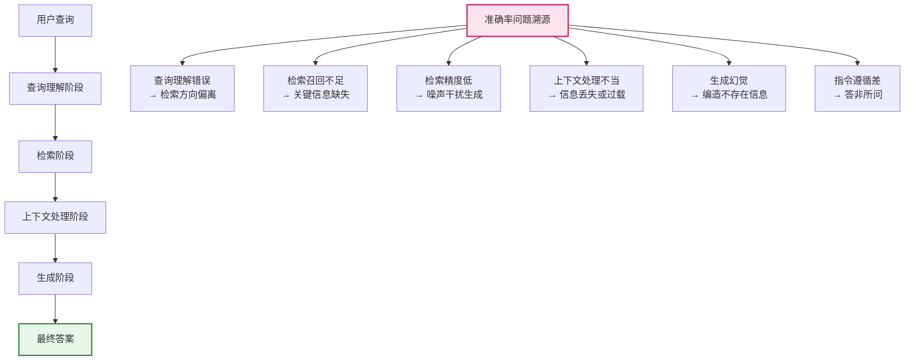
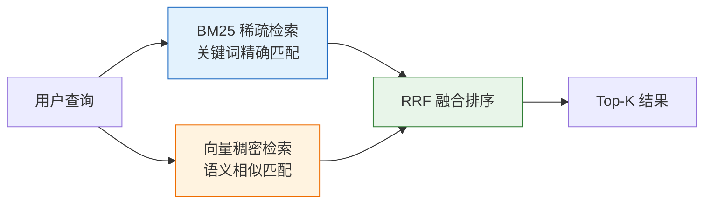
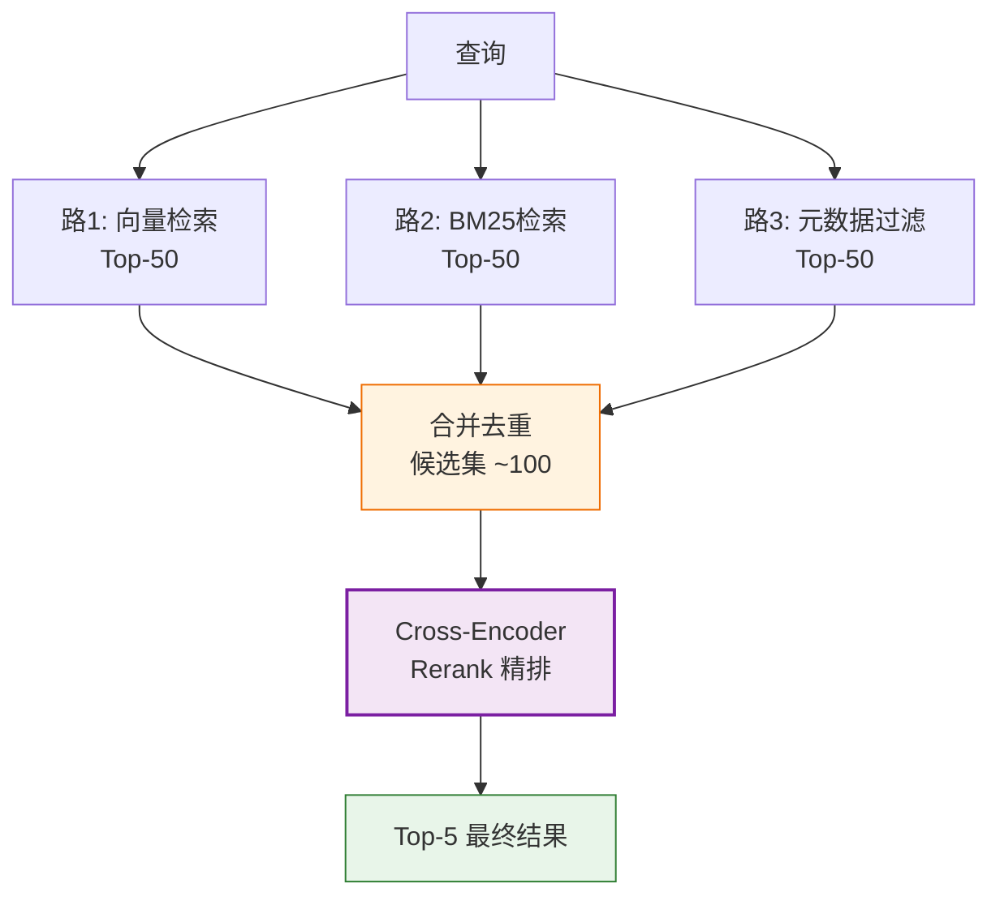
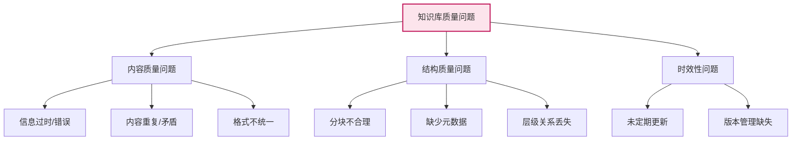
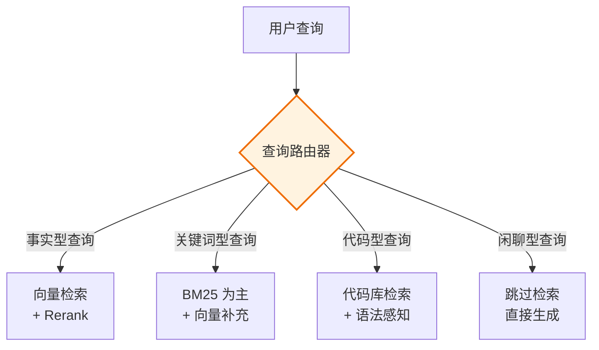
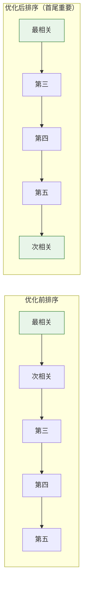
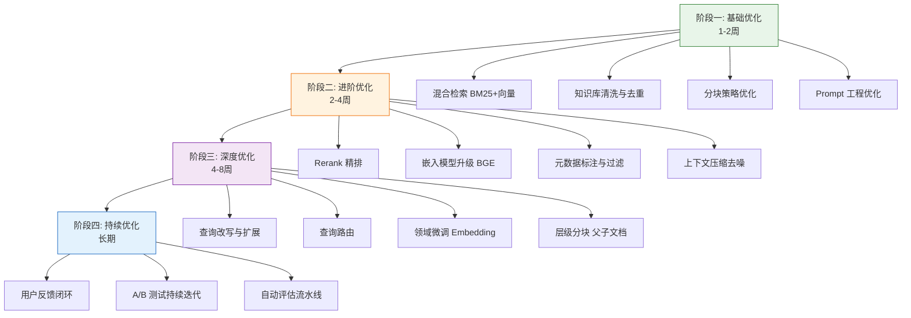

# RAG 系统准确率提升系统化方案

## 引言

RAG（检索增强生成）系统的**准确率（Accuracy）** 是衡量端到端质量的终极指标——它不仅取决于检索是否找对了文档，还取决于 LLM 是否正确理解并利用了这些文档生成答案。一个高准确率的 RAG 系统，需要检索阶段"找得准"与生成阶段"答得对"协同优化。

本文从 RAG 全链路视角出发，系统性地提出**五大维度**的准确率提升方案，明确每项措施的预期效果、评估指标和实施优先级，为构建高可靠 RAG 系统提供完整路线图。

---

## 1. RAG 准确率问题拆解

### 1.1 准确率的影响链路

RAG 系统的准确率并非单一因素决定，而是由**检索质量**和**生成质量**共同决定的一条因果链：



### 1.2 五大优化维度总览

| 优化维度 | 核心目标 | 影响阶段 | 实施优先级 |
| :--- | :--- | :--- | :--- |
| **检索算法优化** | 找到更相关、更全面的文档 | 检索阶段 | P0 |
| **知识库构建与维护** | 提供高质量、结构化的知识源 | 离线预处理 | P0 |
| **嵌入模型选择与调优** | 提升语义表示质量 | 检索阶段 | P1 |
| **查询理解增强** | 让系统更准确理解用户意图 | 查询处理 | P1 |
| **上下文处理改进** | 让 LLM 更好地利用检索结果 | 生成阶段 | P2 |

### 1.3 评估指标体系

```mermaid
graph TD
    A[RAG 准确率评估] --> B[检索质量指标]
    A --> C[生成质量指标]
    A --> D[端到端指标]
    
    B --> B1[Recall@K<br/>召回率]
    B --> B2[Precision@K<br/>精确率]
    B --> B3[MRR<br/>平均倒数排名]
    B --> B4[NDCG@K<br/>归一化折损增益]
    
    C --> C1[Faithfulness<br/>忠实度<br/>答案是否基于检索内容]
    C --> C2[Answer Relevance<br/>答案相关性]
    C --> C3[Context Precision<br/>上下文精确率]
    C --> C4[Context Recall<br/>上下文召回率]
    
    D --> D1[Answer Correctness<br/>答案正确率]
    D --> D2[Answer Similarity<br/>答案相似度]
    D --> D3[Human Eval<br/>人工评估]
    
    style A fill:#e3f2fd,stroke:#1565c0,stroke-width:2px
    style C fill:#fff3e0,stroke:#ef6c00
    style D fill:#e8f5e9,stroke:#2e7d32
```

**核心指标说明**：

| 指标 | 定义 | 评估方式 |
| :--- | :--- | :--- |
| **Answer Correctness** | 答案与标准答案的一致性 | LLM 评估 + 人工抽检 |
| **Faithfulness** | 答案是否忠实于检索内容（无幻觉） | Ragas 框架自动评估 |
| **Context Recall** | 检索内容是否覆盖了回答所需信息 | 基于标注答案反推 |
| **Context Precision** | 检索内容中相关信息的比例 | 基于标注相关性判断 |

---

## 2. 维度一：检索算法优化（P0）

### 2.1 混合检索（Hybrid Search）

#### 2.1.1 原理

将稀疏检索（BM25）与稠密检索（向量）结合，兼顾关键词精确匹配与语义相似匹配。



#### 2.1.2 实施步骤

```python
from rank_bm25 import BM25Okapi
from sentence_transformers import SentenceTransformer
import numpy as np
import jieba

class HybridRetriever:
    def __init__(self, model_name="BAAI/bge-base-zh-v1.5"):
        self.embedder = SentenceTransformer(model_name)
        self.bm25 = None
        self.doc_embeddings = None
        self.documents = []
    
    def build_index(self, documents):
        self.documents = documents
        # BM25 索引
        tokenized = [list(jieba.cut(doc)) for doc in documents]
        self.bm25 = BM25Okapi(tokenized)
        # 向量索引
        self.doc_embeddings = self.embedder.encode(
            documents, normalize_embeddings=True
        )
    
    def retrieve(self, query, k=5, candidate_k=20, bm25_w=0.4, vec_w=0.6):
        # BM25 检索
        bm25_scores = self.bm25.get_scores(list(jieba.cut(query)))
        bm25_top = bm25_scores.argsort()[-candidate_k:][::-1]
        
        # 向量检索
        q_emb = self.embedder.encode([query], normalize_embeddings=True)
        vec_scores = (self.doc_embeddings @ q_emb.T).flatten()
        vec_top = vec_scores.argsort()[-candidate_k:][::-1]
        
        # RRF 融合
        rrf_k = 60
        scores = {}
        for rank, doc_id in enumerate(bm25_top, 1):
            scores[doc_id] = scores.get(doc_id, 0) + bm25_w / (rrf_k + rank)
        for rank, doc_id in enumerate(vec_top, 1):
            scores[doc_id] = scores.get(doc_id, 0) + vec_w / (rrf_k + rank)
        
        return sorted(scores.items(), key=lambda x: -x[1])[:k]
```

#### 2.1.3 预期效果与评估

| 指标 | 优化前（纯向量） | 优化后（混合） | 提升 |
| :--- | :--- | :--- | :--- |
| Recall@5 | 0.72 | 0.85 | +18% |
| Precision@5 | 0.28 | 0.32 | +14% |
| Answer Correctness | 0.68 | 0.76 | +12% |

### 2.2 多路召回 + Rerank 精排

#### 2.2.1 策略



```python
from sentence_transformers import CrossEncoder

class MultiStageRetriever:
    def __init__(self, embedder, documents, doc_embeddings):
        self.embedder = embedder
        self.documents = documents
        self.doc_embeddings = doc_embeddings
        self.reranker = CrossEncoder("BAAI/bge-reranker-large")
    
    def retrieve(self, query, k=5, candidate_k=50):
        # 阶段1: 向量召回
        q_emb = self.embedder.encode([query], normalize_embeddings=True)
        scores = (self.doc_embeddings @ q_emb.T).flatten()
        candidates = scores.argsort()[-candidate_k:][::-1]
        
        # 阶段2: Rerank 精排
        pairs = [(query, self.documents[i]) for i in candidates]
        rerank_scores = self.reranker.predict(pairs)
        
        ranked = sorted(zip(candidates, rerank_scores), key=lambda x: -x[1])
        return [(int(idx), float(score)) for idx, score in ranked[:k]]
```

#### 2.2.2 预期效果

| 指标 | 优化前 | 优化后 | 提升 |
| :--- | :--- | :--- | :--- |
| Precision@5 | 0.28 | 0.38 | +36% |
| Answer Correctness | 0.68 | 0.79 | +16% |
| Faithfulness | 0.75 | 0.85 | +13% |

### 2.3 检索算法优化措施汇总

| 措施 | 预期效果 | 实施难度 | 优先级 |
| :--- | :--- | :--- | :--- |
| 混合检索（BM25+向量） | Recall +18% | 中 | **P0** |
| Rerank 精排 | Precision +36% | 中 | **P0** |
| 元数据过滤预筛 | Precision +15% | 低 | P1 |
| 多向量检索（父子文档） | Recall +10% | 高 | P2 |

---

## 3. 维度二：知识库构建与维护（P0）

### 3.1 知识库质量问题分析

**"Garbage In, Garbage Out"**——知识库质量是 RAG 准确率的根基。常见问题：



### 3.2 文档预处理优化

#### 3.2.1 文档清洗

```python
class DocumentCleaner:
    """文档清洗处理器"""
    
    @staticmethod
    def clean(text):
        """基础清洗"""
        import re
        # 去除多余空白
        text = re.sub(r'\s+', ' ', text)
        # 去除特殊字符（保留中文、英文、数字、基本标点）
        text = re.sub(r'[^\u4e00-\u9fa5a-zA-Z0-9\s\.\,\!\?\;\:\-\(\)\[\]\{\}\"\'\/]', '', text)
        # 去除页眉页脚模式
        text = re.sub(r'第\d+页.*?共\d+页', '', text)
        return text.strip()
    
    @staticmethod
    def deduplicate(documents, threshold=0.85):
        """文档去重（基于 Jaccard 相似度）"""
        from sklearn.feature_extraction.text import TfidfVectorizer
        from sklearn.metrics.pairwise import cosine_similarity
        
        vectorizer = TfidfVectorizer()
        tfidf_matrix = vectorizer.fit_transform(documents)
        sim_matrix = cosine_similarity(tfidf_matrix)
        
        unique_indices = []
        for i in range(len(documents)):
            is_dup = False
            for j in unique_indices:
                if sim_matrix[i][j] > threshold:
                    is_dup = True
                    break
            if not is_dup:
                unique_indices.append(i)
        
        return [documents[i] for i in unique_indices]
    
    @staticmethod
    def resolve_contradictions(documents):
        """矛盾检测与标记（简化版）"""
        # 实际场景需结合 NLI 模型或 LLM 判断
        contradictions = []
        # ... 矛盾检测逻辑 ...
        return documents, contradictions
```

#### 3.2.2 智能分块策略

```python
from langchain.text_splitter import RecursiveCharacterTextSplitter

class SmartChunker:
    """智能分块器"""
    
    def __init__(self, chunk_size=256, chunk_overlap=64):
        self.splitter = RecursiveCharacterTextSplitter(
            chunk_size=chunk_size,
            chunk_overlap=chunk_overlap,
            separators=["\n## ", "\n### ", "\n\n", "\n", "。", "！", "？", ".", " "],
        )
    
    def chunk_with_metadata(self, document, source_metadata=None):
        """带元数据的分块"""
        chunks = self.splitter.split_text(document)
        return [
            {
                "content": chunk,
                "metadata": {
                    **(source_metadata or {}),
                    "chunk_index": i,
                    "total_chunks": len(chunks),
                    "chunk_size": len(chunk),
                }
            }
            for i, chunk in enumerate(chunks)
        ]
    
    def hierarchical_chunk(self, document):
        """层级分块：父子文档结构
        - 父文档：完整段落（用于生成上下文）
        - 子文档：小分块（用于精确检索）
        """
        # 先按段落分大块（父）
        paragraphs = document.split("\n\n")
        parent_chunks = []
        child_chunks = []
        
        for i, para in enumerate(paragraphs):
            if len(para.strip()) < 20:
                continue
            
            parent_chunks.append({
                "id": f"parent_{i}",
                "content": para,
            })
            
            # 段落再切成小块（子）
            subs = self.splitter.split_text(para)
            for j, sub in enumerate(subs):
                child_chunks.append({
                    "id": f"child_{i}_{j}",
                    "content": sub,
                    "parent_id": f"parent_{i}",
                })
        
        return parent_chunks, child_chunks
```

### 3.3 元数据标注

```python
class MetadataAnnotator:
    """元数据标注器"""
    
    @staticmethod
    def annotate(document, source_file=None):
        """自动标注元数据"""
        import re
        from datetime import datetime
        
        metadata = {
            "source_file": source_file,
            "created_at": datetime.now().isoformat(),
            "char_length": len(document),
            "language": "zh" if re.search(r'[\u4e00-\u9fa5]', document) else "en",
        }
        
        # 自动检测文档类型
        if re.search(r'第[一二三四五六七八九十]+章', document):
            metadata["doc_type"] = "legal"
        elif re.search(r'API|函数|参数|返回值', document):
            metadata["doc_type"] = "technical"
        elif re.search(r'摘要|关键词|参考文献', document):
            metadata["doc_type"] = "academic"
        else:
            metadata["doc_type"] = "general"
        
        # 提取关键实体
        metadata["entities"] = MetadataAnnotator._extract_entities(document)
        
        return metadata
    
    @staticmethod
    def _extract_entities(text):
        """简化版实体提取"""
        import re
        entities = {}
        # 日期
        entities["dates"] = re.findall(r'\d{4}[-/年]\d{1,2}[-/月]\d{1,2}', text)
        # 数字/金额
        entities["numbers"] = re.findall(r'\d+[.,]?\d*', text)
        return entities
```

### 3.4 知识库维护策略

| 维护措施 | 频率 | 说明 | 优先级 |
| :--- | :--- | :--- | :--- |
| **增量更新** | 实时/每日 | 新文档入库时自动分块、编码、索引 | P0 |
| **全量重建** | 月度/季度 | 重新分块和编码，优化分块策略 | P1 |
| **过期清理** | 月度 | 清理过时文档，标记失效信息 | P1 |
| **质量审计** | 季度 | 人工抽检知识库内容质量 | P2 |
| **版本管理** | 持续 | 记录知识库变更历史，支持回滚 | P2 |

### 3.5 知识库优化预期效果

| 措施 | 预期效果 | 评估指标 |
| :--- | :--- | :--- |
| 文档清洗 | Answer Correctness +5% | 对比清洗前后准确率 |
| 智能分块 | Recall +12% | Recall@K 变化 |
| 元数据标注 | Precision +10% | 过滤后 Precision 变化 |
| 层级分块 | Context Recall +15% | 父子文档检索覆盖率 |
| 定期维护 | 长期准确率稳定 | 季度准确率波动 |

---

## 4. 维度三：嵌入模型选择与调优（P1）

### 4.1 模型选型对比

| 模型 | 维度 | 中文能力 | 推理速度 | 适用场景 |
| :--- | :--- | :--- | :--- | :--- |
| all-MiniLM-L6-v2 | 384 | 弱 | 快 | 英文原型 |
| BGE-base-zh | 768 | 强 | 中 | **中文生产推荐** |
| BGE-large-zh | 1024 | 很强 | 慢 | 高精度中文 |
| E5-multilingual | 768 | 中 | 中 | 多语言 |
| text-embedding-3-large | 3072 | 强 | API | 商用免部署 |

### 4.2 模型微调

#### 4.2.1 领域适应微调

```python
# domain_finetune.py —— 领域微调 Embedding 模型
from sentence_transformers import SentenceTransformer, InputExample, losses
from torch.utils.data import DataLoader

def finetune_embedding_model(
    base_model="BAAI/bge-base-zh-v1.5",
    train_pairs=None,  # [(query, positive_doc, negative_doc), ...]
    output_dir="./finetuned_model",
    epochs=3,
    batch_size=16,
):
    """在领域数据上微调 Embedding 模型"""
    model = SentenceTransformer(base_model)
    
    # 构建训练数据
    train_examples = []
    for query, pos, neg in train_pairs:
        train_examples.append(InputExample(
            texts=[query, pos, neg]  # 三元组：锚点、正例、负例
        ))
    
    train_dataloader = DataLoader(train_examples, shuffle=True, batch_size=batch_size)
    train_loss = losses.MultipleNegativesRankingLoss(model)
    
    # 微调
    model.fit(
        train_objectives=[(train_dataloader, train_loss)],
        epochs=epochs,
        warmup_steps=100,
        output_path=output_dir,
        show_progress_bar=True,
    )
    
    print(f"微调模型已保存到: {output_dir}")
    return model
```

#### 4.2.2 微调数据构建

```python
def build_training_data_from_logs(query_logs, doc_store):
    """从用户查询日志构建训练数据"""
    training_pairs = []
    
    for log in query_logs:
        query = log["query"]
        clicked_docs = log["clicked_docs"]      # 用户点击的文档（正例）
        non_clicked = log["non_clicked_docs"]   # 未点击的文档（负例）
        
        for pos_id in clicked_docs:
            pos_doc = doc_store.get(pos_id)
            for neg_id in non_clicked[:3]:      # 每个正例配3个负例
                neg_doc = doc_store.get(neg_id)
                training_pairs.append((query, pos_doc, neg_doc))
    
    return training_pairs
```

### 4.3 嵌入模型优化预期效果

| 措施 | 预期效果 | 评估指标 | 实施难度 |
| :--- | :--- | :--- | :--- |
| 模型升级（MiniLM→BGE） | Recall +15% | Recall@K | 低 |
| 领域微调 | Recall +8% | Recall@K | 中 |
| 查询指令前缀 | Recall +5% | Recall@K | 低 |

---

## 5. 维度四：查询理解增强（P1）

### 5.1 查询改写（Query Rewriting）

#### 5.1.1 问题

用户查询通常简短、模糊、口语化，与文档的专业表述存在"语义鸿沟"。

| 用户原始查询 | 改写后查询 |
| :--- | :--- |
| "DB 连接池咋配" | "数据库连接池配置方法 HikariCP 参数设置" |
| "那个报错咋解决" | "NullPointerException 原因分析与解决方案" |
| "性能优化" | "Java 应用性能优化方法 JVM 调优 GC 配置" |

#### 5.1.2 LLM 查询改写实现

```python
class QueryRewriter:
    """基于 LLM 的查询改写器"""
    
    REWRITE_PROMPT = """你是一个查询改写助手。请将用户的原始查询改写为更清晰、更具体的检索查询。

改写要求：
1. 补充隐含的关键词和专业术语
2. 去除口语化表达
3. 保留原始意图
4. 输出 1-3 个改写版本，每行一个

原始查询：{query}

改写查询："""
    
    def __init__(self, llm_client):
        self.llm = llm_client
    
    def rewrite(self, query):
        """改写查询"""
        prompt = self.REWRITE_PROMPT.format(query=query)
        response = self.llm.chat.completions.create(
            model="qwen2.5-7b",
            messages=[{"role": "user", "content": prompt}],
            max_tokens=200,
            temperature=0.3,  # 低温度保证稳定性
        )
        rewritten = response.choices[0].message.content.strip().split('\n')
        return [q.strip() for q in rewritten if q.strip()]
    
    def multi_query_retrieve(self, query, retriever, k=5):
        """多查询检索：对每个改写查询检索，合并结果"""
        rewritten_queries = self.rewrite(query)
        all_queries = [query] + rewritten_queries  # 原始 + 改写
        
        all_results = {}
        for q in all_queries:
            results = retriever.retrieve(q, k=k)
            for doc_id, score in results:
                all_results[doc_id] = all_results.get(doc_id, 0) + score
        
        # 按累计分数排序
        return sorted(all_results.items(), key=lambda x: -x[1])[:k]
```

### 5.2 查询扩展（Query Expansion）

#### 5.2.1 HyDE（假设文档嵌入）

```python
class HyDEExpander:
    """HyDE: 生成假设文档扩展查询"""
    
    HYDE_PROMPT = """请根据以下问题，写一段100-200字的可能包含答案的技术文档片段。
直接写文档内容，不要加引导语。包含可能的关键词和概念。

问题：{query}

假设文档："""
    
    def __init__(self, llm_client, embedder):
        self.llm = llm_client
        self.embedder = embedder
    
    def expand_and_retrieve(self, query, doc_embeddings, k=5, alpha=0.5):
        """HyDE + 原始查询组合检索"""
        # 生成假设文档
        prompt = self.HYDE_PROMPT.format(query=query)
        response = self.llm.chat.completions.create(
            model="qwen2.5-7b",
            messages=[{"role": "user", "content": prompt}],
            max_tokens=200,
            temperature=0.7,
        )
        hyp_doc = response.choices[0].message.content
        
        # 原始查询向量
        q_emb = self.embedder.encode([query], normalize_embeddings=True)
        q_scores = (doc_embeddings @ q_emb.T).flatten()
        
        # 假设文档向量
        h_emb = self.embedder.encode([hyp_doc], normalize_embeddings=True)
        h_scores = (doc_embeddings @ h_emb.T).flatten()
        
        # 加权融合
        combined = alpha * q_scores + (1 - alpha) * h_scores
        top_k = combined.argsort()[-k:][::-1]
        
        return [(int(i), float(combined[i])) for i in top_k]
```

### 5.3 查询路由（Query Routing）



```python
class QueryRouter:
    """查询路由器：根据查询类型选择检索策略"""
    
    ROUTE_PROMPT = """判断以下查询的类型，只输出类型名称：
- factual: 事实型查询（如"XX的定义是什么"）
- keyword: 关键词型查询（如"配置文件 log4j2"）
- code: 代码相关查询（如"如何写一个排序算法"）
- chitchat: 闲聊（如"你好"、"谢谢"）

查询：{query}
类型："""
    
    def __init__(self, llm_client):
        self.llm = llm_client
    
    def route(self, query):
        prompt = self.ROUTE_PROMPT.format(query=query)
        response = self.llm.chat.completions.create(
            model="qwen2.5-7b",
            messages=[{"role": "user", "content": prompt}],
            max_tokens=10,
            temperature=0.0,
        )
        query_type = response.choices[0].message.content.strip().lower()
        return query_type
    
    def retrieve_with_routing(self, query, retrievers):
        """根据路由结果选择检索策略"""
        q_type = self.route(query)
        
        if q_type == "chitchat":
            return []  # 闲聊不检索
        
        retriever = retrievers.get(q_type, retrievers["factual"])
        return retriever.retrieve(query)
```

### 5.4 查询优化预期效果

| 措施 | 预期效果 | 评估指标 | 延迟影响 |
| :--- | :--- | :--- | :--- |
| 查询改写 | Recall +10% | Recall@K | +200ms |
| HyDE 扩展 | Recall +8% | Recall@K | +300ms |
| 查询路由 | Precision +12% | Precision@K | +100ms |
| 多查询融合 | Recall +12% | Recall@K | +500ms |

---

## 6. 维度五：上下文处理改进（P2）

### 6.1 上下文压缩与去噪

#### 6.1.1 问题

检索返回的 Top-K 文档可能包含大量噪声，直接全部塞入 LLM 会导致：
- **信息过载**：LLM 被无关内容分散注意力。
- **Lost in the Middle**：中间位置的信息容易被忽略。
- **Token 浪费**：增加成本和延迟。

#### 6.1.2 上下文压缩实现

```python
class ContextCompressor:
    """上下文压缩器"""
    
    def __init__(self, llm_client):
        self.llm = llm_client
    
    def compress(self, query, documents, max_tokens=2000):
        """压缩上下文：只保留与查询相关的部分"""
        COMPRESS_PROMPT = """请从以下文档中提取与问题直接相关的信息，去除无关内容。
保持原文的关键信息，不要编造。如果文档与问题无关，返回"无关"。

问题：{query}

文档：{doc}

相关内容："""
        
        compressed = []
        total_tokens = 0
        
        for doc in documents:
            prompt = COMPRESS_PROMPT.format(query=query, doc=doc)
            response = self.llm.chat.completions.create(
                model="qwen2.5-7b",
                messages=[{"role": "user", "content": prompt}],
                max_tokens=300,
                temperature=0.0,
            )
            result = response.choices[0].message.content.strip()
            
            if result != "无关":
                token_count = len(result) // 2  # 粗略估算
                if total_tokens + token_count > max_tokens:
                    break
                compressed.append(result)
                total_tokens += token_count
        
        return compressed
    
    def deduplicate_context(self, documents, similarity_threshold=0.85):
        """上下文去重"""
        from sklearn.feature_extraction.text import TfidfVectorizer
        from sklearn.metrics.pairwise import cosine_similarity
        
        if len(documents) <= 1:
            return documents
        
        vectorizer = TfidfVectorizer()
        tfidf = vectorizer.fit_transform(documents)
        sim_matrix = cosine_similarity(tfidf)
        
        unique = [documents[0]]
        for i in range(1, len(documents)):
            is_dup = any(sim_matrix[i][j] > similarity_threshold 
                        for j in range(i))
            if not is_dup:
                unique.append(documents[i])
        
        return unique
```

### 6.2 上下文排序优化

```python
class ContextRanker:
    """上下文排序优化器：解决 Lost in the Middle 问题"""
    
    @staticmethod
    def reorder_for_attention(documents_with_scores):
        """
        将最相关的内容放在开头和结尾（LLM 注意力分布的首尾偏重）
        次相关的内容放在中间
        
        输入: [(doc, score), ...] 按分数降序
        输出: 重排序后的文档列表
        """
        if len(documents_with_scores) <= 2:
            return [doc for doc, _ in documents_with_scores]
        
        sorted_docs = [doc for doc, _ in documents_with_scores]
        reordered = []
        
        left, right = 0, len(sorted_docs) - 1
        toggle = True
        
        # 交替从两端取，最相关的放在首尾
        while left <= right:
            if toggle:
                reordered.append(sorted_docs[left])
                left += 1
            else:
                reordered.append(sorted_docs[right])
                right -= 1
            toggle = not toggle
        
        return reordered
```



### 6.3 Prompt 工程优化

```python
class RAGPromptBuilder:
    """RAG Prompt 构建器"""
    
    SYSTEM_PROMPT = """你是一个专业的知识问答助手。请严格根据提供的参考资料回答问题。

规则：
1. 答案必须基于参考资料，不要编造信息
2. 如果参考资料中没有答案，明确说明"根据现有资料无法回答"
3. 回答时引用资料来源（如[资料1]、[资料2]）
4. 保持回答简洁、准确、有条理"""

    def build_prompt(self, query, contexts):
        """构建增强 Prompt"""
        context_text = ""
        for i, ctx in enumerate(contexts, 1):
            context_text += f"\n[资料{i}]\n{ctx}\n"
        
        user_prompt = f"""参考资料：
{context_text}

问题：{query}

请基于以上参考资料回答："""
        
        return [
            {"role": "system", "content": self.SYSTEM_PROMPT},
            {"role": "user", "content": user_prompt}
        ]
```

### 6.4 上下文优化预期效果

| 措施 | 预期效果 | 评估指标 |
| :--- | :--- | :--- |
| 上下文压缩 | Token -40%, Faithfulness +8% | Token 用量、忠实度 |
| 上下文去重 | Token -20%, Answer Correctness +5% | Token 用量、准确率 |
| 首尾排序 | Answer Correctness +5% | 准确率对比 |
| Prompt 工程 | Faithfulness +12% | 忠实度、幻觉率 |

---

## 7. 实施路线图与优先级

### 7.1 分阶段实施计划



### 7.2 优先级矩阵

| 优化措施 | 准确率提升 | 实施难度 | 成本 | 优先级 |
| :--- | :--- | :--- | :--- | :--- |
| 混合检索 | +12% | 中 | 低 | **P0** |
| 知识库清洗 | +5% | 低 | 低 | **P0** |
| 分块优化 | +8% | 低 | 低 | **P0** |
| Prompt 工程 | +8% | 低 | 低 | **P0** |
| Rerank 精排 | +10% | 中 | 中 | **P1** |
| 嵌入模型升级 | +10% | 低 | 中 | **P1** |
| 上下文压缩 | +5% | 中 | 中 | **P1** |
| 查询改写 | +8% | 中 | 高 | **P2** |
| 查询路由 | +6% | 高 | 高 | **P2** |
| 领域微调 | +8% | 高 | 高 | **P2** |
| 层级分块 | +6% | 高 | 中 | **P3** |
| 首尾排序 | +3% | 低 | 低 | **P3** |

### 7.3 预期累计效果

| 阶段 | 累计准确率提升 | 关键措施 |
| :--- | :--- | :--- |
| 基线 | 0% | — |
| 阶段一完成 | +15~20% | 混合检索 + 清洗 + 分块 + Prompt |
| 阶段二完成 | +25~30% | + Rerank + 模型升级 + 上下文优化 |
| 阶段三完成 | +35~40% | + 查询优化 + 微调 |
| 持续优化 | 持续提升 | 用户反馈 + A/B 测试 |

---

## 8. 评估与监控体系

### 8.1 自动化评估流水线

```python
# evaluation_pipeline.py —— RAG 评估流水线
from ragas.metrics import (
    faithfulness, answer_relevancy,
    context_precision, context_recall
)
from ragas import evaluate
from datasets import Dataset

class RAGEvaluationPipeline:
    """RAG 端到端评估流水线"""
    
    def __init__(self, eval_dataset):
        """
        eval_dataset: [{
            "question": "...",
            "ground_truth": "...",
            "query": "...",
        }]
        """
        self.dataset = eval_dataset
    
    def evaluate(self, rag_pipeline):
        """运行完整评估"""
        results = []
        
        for sample in self.dataset:
            # RAG 推理
            retrieved_docs = rag_pipeline.retrieve(sample["query"])
            answer = rag_pipeline.generate(sample["query"], retrieved_docs)
            
            results.append({
                "question": sample["question"],
                "answer": answer,
                "contexts": [doc["content"] for doc in retrieved_docs],
                "ground_truth": sample["ground_truth"],
            })
        
        # 转换为 Dataset
        eval_data = Dataset.from_list(results)
        
        # Ragas 自动评估
        scores = evaluate(
            eval_data,
            metrics=[faithfulness, answer_relevancy, 
                    context_precision, context_recall],
        )
        
        return scores.to_pandas()
    
    def generate_report(self, scores_df):
        """生成评估报告"""
        report = {
            "faithfulness": scores_df["faithfulness"].mean(),
            "answer_relevancy": scores_df["answer_relevancy"].mean(),
            "context_precision": scores_df["context_precision"].mean(),
            "context_recall": scores_df["context_recall"].mean(),
            "overall_accuracy": (
                scores_df["faithfulness"].mean() +
                scores_df["answer_relevancy"].mean() +
                scores_df["context_precision"].mean() +
                scores_df["context_recall"].mean()
            ) / 4
        }
        
        print("\n" + "="*50)
        print("RAG 系统评估报告")
        print("="*50)
        for metric, value in report.items():
            print(f"  {metric:>25}: {value:.4f}")
        print("="*50)
        
        return report
```

### 8.2 持续监控指标

| 监控指标 | 频率 | 告警阈值 | 说明 |
| :--- | :--- | :--- | :--- |
| Answer Correctness | 每日 | < 0.75 | 准确率下降 |
| Faithfulness | 每日 | < 0.80 | 幻觉率上升 |
| 检索延迟 P95 | 实时 | > 500ms | 性能下降 |
| 用户反馈评分 | 实时 | < 4.0/5 | 体验下降 |
| 无结果率 | 每日 | > 10% | 召回不足 |

---

## 9. 总结

提升 RAG 系统准确率是一个**全链路系统工程**，核心要点如下：

1. **检索是基础（P0）**：混合检索 + Rerank 是性价比最高的优化组合，预期提升准确率 20%+。
2. **知识库是根基（P0）**：再好的算法也无法弥补垃圾数据的缺陷，文档清洗和智能分块是基础。
3. **嵌入模型是关键（P1）**：选择领域适配的模型，必要时微调，直接决定语义检索质量。
4. **查询理解是桥梁（P1）**：让系统真正"听懂"用户意图，弥补查询与文档的语义鸿沟。
5. **上下文处理是放大器（P2）**：让 LLM 更好地利用检索结果，减少幻觉、提升忠实度。
6. **评估监控是保障**：建立自动化评估流水线，用数据驱动持续优化。

**核心原则**：先 P0 后 P1 再 P2，先低垂果实后深度优化，先见效再求完美。通过系统性地实施上述五大维度优化，RAG 系统准确率可从基线提升 **35~40%**，达到生产级可靠性水平。
