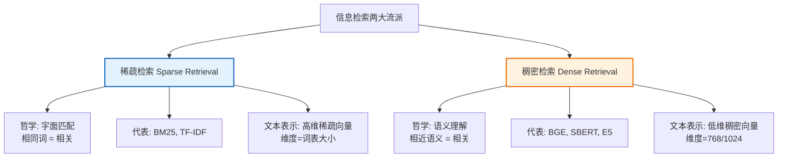
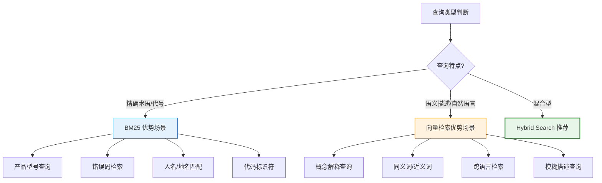
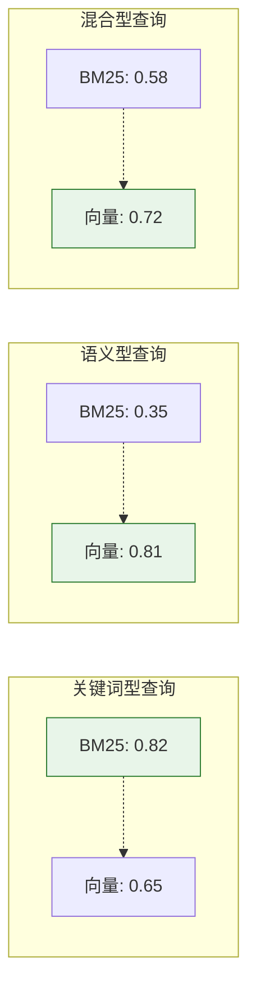
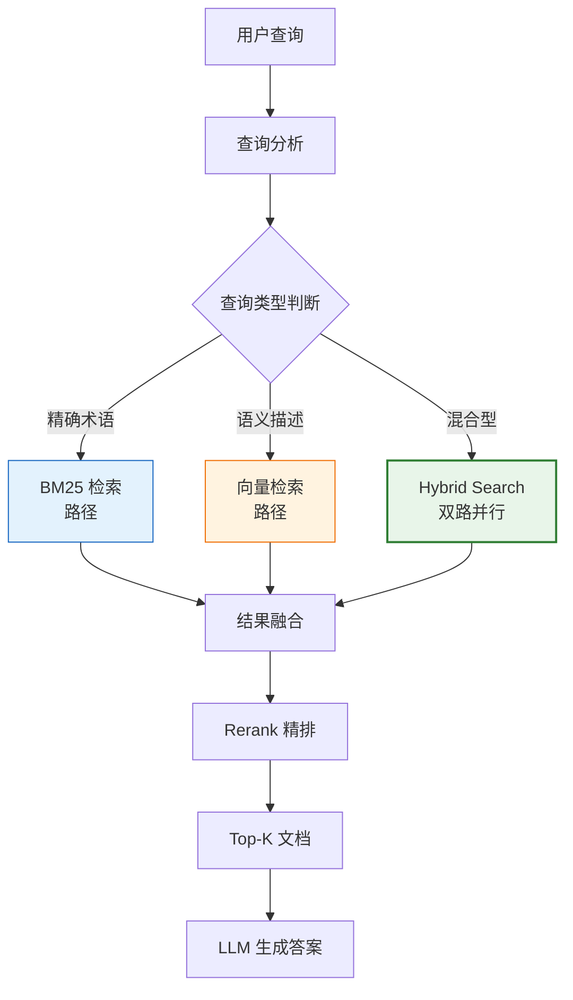
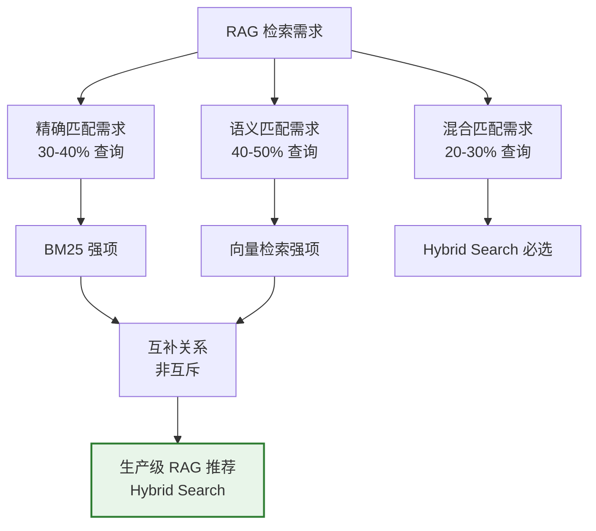
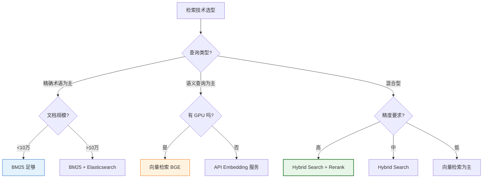

# BM25 vs. 向量检索：核心区别深度对比解析

## 引言

在 RAG（检索增强生成）系统的检索阶段，两种检索技术占据主导地位：**BM25**（基于词频统计的稀疏检索）和**向量检索**（基于语义嵌入的稠密检索）。它们代表了两种截然不同的信息检索哲学——一个是"字面匹配"，一个是"语义理解"。

理解两者的核心区别，是 RAG 系统检索模块设计和优化的基础。本文从底层原理、文本表示、相似度计算、语义理解、性能特点、硬件需求、RAG 应用表现等维度，全面解析 BM25 与向量检索的差异。

---

## 1. 底层原理对比

### 1.1 核心哲学差异



### 1.2 BM25 原理

BM25（Best Matching 25）基于**词频统计**和**逆文档频率**，核心思想是：一个词在当前文档出现越多、在全局出现越少，则该词对文档的区分度越高。

**核心公式**：

$$
\text{BM25}(D, Q) = \sum_{i=1}^{n} \text{IDF}(q_i) \cdot \frac{f(q_i, D) \cdot (k_1 + 1)}{f(q_i, D) + k_1 \cdot \left(1 - b + b \cdot \frac{|D|}{\text{avgdl}}\right)}
$$

| 符号 | 含义 |
| :--- | :--- |
| $f(q_i, D)$ | 词 $q_i$ 在文档 $D$ 中的词频（TF） |
| $\text{IDF}(q_i)$ | 逆文档频率，衡量词的稀有度 |
| $|D|$ | 文档长度 |
| $\text{avgdl}$ | 平均文档长度 |
| $k_1$ | 词频饱和参数（通常 1.2~2.0） |
| $b$ | 长度归一化参数（通常 0.75） |

**关键机制**：
- **TF 饱和**：词频增长到一定程度后，贡献递减（防止高频词主导）。
- **文档长度归一化**：长文档天然词频高，需惩罚（参数 $b$ 控制）。
- **IDF 加权**：稀有词权重高，常见词权重低。

### 1.3 向量检索原理

向量检索通过 **Embedding 模型**将文本编码为稠密向量，通过计算向量间距离衡量语义相似性。

**流程**：

$$
\text{Query} \xrightarrow{\text{Embedding}} \vec{q} \in \mathbb{R}^d
$$

$$
\text{Document} \xrightarrow{\text{Embedding}} \vec{d} \in \mathbb{R}^d
$$

$$
\text{Similarity} = \cos(\vec{q}, \vec{d}) = \frac{\vec{q} \cdot \vec{d}}{|\vec{q}| \cdot |\vec{d}|}
$$

**关键机制**：
- **语义编码**：Embedding 模型通过对比学习训练，使语义相近的文本向量方向相近。
- **连续空间**：向量空间是连续的，可以衡量"程度"而非"有无"。
- **上下文感知**：现代 Embedding 模型基于 Transformer，能理解上下文。

---

## 2. 文本表示方法对比

### 2.1 词袋模型 vs. 向量嵌入

```mermaid
graph LR
    subgraph "BM25: 词袋模型"
        direction TB
        A1[文档: 机器学习是AI的分支] --> A2[分词: 机器/学习/AI/分支]
        A2 --> A3[稀疏向量<br/>维度=词表大小(如50000)]
        A3 --> A4["[0,0,...,1,0,...,1,0,...,1,0,...,1,0,...]<br/>仅4个非零维度"]
    end
    
    subgraph "向量检索: Embedding"
        direction TB
        B1[文档: 机器学习是AI的分支] --> B2[Tokenizer 编码]
        B2 --> B3[Transformer 编码]
        B3 --> B4[稠密向量<br/>维度=768]
        B4 --> B5["[0.23, -0.45, 0.78, 0.12, ...]<br/>768个非零维度"]
    end
    
    style A4 fill:#e3f2fd,stroke:#1565c0
    style B5 fill:#fff3e0,stroke:#ef6c00
```

### 2.2 详细对比

| 维度 | BM25（词袋模型） | 向量检索（Embedding） |
| :--- | :--- | :--- |
| **表示类型** | 稀疏向量 | 稠密向量 |
| **向量维度** | 词表大小（50000~300000） | 固定低维（384/768/1024） |
| **非零元素** | 极少（仅出现的词） | 全部（每维都有值） |
| **语义编码** | 无（每个词独立） | 有（上下文交互） |
| **词序信息** | 完全丢失 | 部分保留（Transformer） |
| **一词多义** | 无法区分 | 可通过上下文区分 |
| **可解释性** | 高（可追溯匹配词） | 低（黑盒向量） |

### 2.3 语义理解能力对比

**示例**：三段文本

| 文本 | 内容 |
| :--- | :--- |
| 查询 | "如何提升系统性能" |
| 文档A | "系统性能优化的方法" |
| 文档B | "提高运行速度的技巧" |

**BM25 表现**：
- 查询 vs 文档A：共同词"系统""性能"→ 高分 ✅
- 查询 vs 文档B：无共同词→ 零分 ❌（尽管语义相同）

**向量检索表现**：
- 查询 vs 文档A：语义高度相近→ 高分 ✅
- 查询 vs 文档B：语义高度相近（"提升"≈"提高"，"性能"≈"速度"）→ 高分 ✅

**核心差异**：BM25 只看"有没有共同词"，向量检索看"语义像不像"。

---

## 3. 相似度计算方式对比

### 3.1 计算方式差异

| 维度 | BM25 | 向量检索 |
| :--- | :--- | :--- |
| **计算基础** | 词频统计 | 向量距离/点积 |
| **核心公式** | TF-IDF 变体 | 余弦相似度/点积 |
| **输出范围** | $[0, +\infty)$（无上界） | $[-1, 1]$（余弦）或 $[0, 1]$ |
| **可比较性** | 同查询内可比，跨查询不可比 | 全局可比 |
| **计算复杂度** | $O(\text{查询词数} \times \text{文档数})$ | $O(d \times \text{文档数})$ |

### 3.2 BM25 计算详解

```python
import math
from collections import Counter

class BM25Simple:
    """BM25 简化实现"""
    
    def __init__(self, documents, k1=1.5, b=0.75):
        self.k1 = k1
        self.b = b
        self.documents = documents
        self.doc_len = [len(doc.split()) for doc in documents]
        self.avgdl = sum(self.doc_len) / len(documents)
        self.N = len(documents)
        
        # 构建倒排索引
        self.doc_freqs = []  # 每篇文档的词频
        self.df = Counter()  # 文档频率
        
        for doc in documents:
            tokens = doc.split()
            freq = Counter(tokens)
            self.doc_freqs.append(freq)
            for word in freq:
                self.df[word] += 1
    
    def idf(self, word):
        """计算 IDF"""
        return math.log((self.N - self.df[word] + 0.5) / (self.df[word] + 0.5) + 1)
    
    def score(self, query, doc_idx):
        """计算查询与文档的 BM25 分数"""
        query_tokens = query.split()
        score = 0
        
        for word in query_tokens:
            if word not in self.doc_freqs[doc_idx]:
                continue
            
            tf = self.doc_freqs[doc_idx][word]
            idf = self.idf(word)
            
            # BM25 核心公式
            numerator = tf * (self.k1 + 1)
            denominator = tf + self.k1 * (1 - self.b + self.b * self.doc_len[doc_idx] / self.avgdl)
            
            score += idf * numerator / denominator
        
        return score
    
    def search(self, query, top_k=5):
        """检索 Top-K"""
        scores = [(i, self.score(query, i)) for i in range(self.N)]
        scores.sort(key=lambda x: -x[1])
        return scores[:top_k]
```

### 3.3 向量检索计算详解

```python
import numpy as np
from sentence_transformers import SentenceTransformer

class VectorSearch:
    """向量检索实现"""
    
    def __init__(self, model_name="BAAI/bge-base-zh-v1.5"):
        self.embedder = SentenceTransformer(model_name)
        self.doc_embeddings = None
    
    def build_index(self, documents):
        """编码文档"""
        # 归一化后，点积 = 余弦相似度
        self.doc_embeddings = self.embedder.encode(
            documents, normalize_embeddings=True
        )
    
    def search(self, query, top_k=5):
        """检索 Top-K"""
        # 编码查询（归一化）
        query_emb = self.embedder.encode(
            [query], normalize_embeddings=True
        )
        
        # 点积计算相似度（归一化后等价于余弦相似度）
        scores = (self.doc_embeddings @ query_emb.T).flatten()
        
        # Top-K
        top_indices = scores.argsort()[-top_k:][::-1]
        return [(int(i), float(scores[i])) for i in top_indices]
```

### 3.4 计算复杂度对比

| 操作 | BM25 | 向量检索 |
| :--- | :--- | :--- |
| **索引构建** | $O(N \cdot L)$（倒排索引） | $O(N \cdot L)$（Embedding 编码） |
| **单次查询** | $O(q \cdot \text{posting\_list})$ | $O(d \cdot N)$（暴力搜索） |
| **ANN 加速后** | 不需要（本身高效） | $O(d \cdot \log N)$（HNSW/FAISS） |
| **$q$** | 查询词数（通常 3~10） | — |
| **$d$** | — | 向量维度（768） |
| **$N$** | 文档数 | 文档数 |
| **$L$** | 平均文档长度 | 平均文档长度 |

**关键洞察**：
- BM25 的查询复杂度与**查询词数**成正比，非常高效。
- 向量检索的暴力搜索复杂度与**文档数 × 维度**成正比，大规模场景必须用 ANN 加速。

---

## 4. 适用场景对比

### 4.1 场景适配分析



### 4.2 详细场景对比

| 场景 | BM25 表现 | 向量检索表现 | 推荐方案 |
| :--- | :--- | :--- | :--- |
| **精确错误码查询**（"ERR_4042"） | ✅ 精确匹配 | ⚠️ 可能混淆相似码 | BM25 |
| **概念查询**（"容器编排工具"） | ❌ 无共同词 | ✅ 语义匹配 | 向量检索 |
| **产品型号查询**（"iPhone 15 Pro"） | ✅ 精确匹配 | ⚠️ 可能泛化 | BM25 |
| **同义词查询**（"汽车"↔"轿车"） | ❌ 无法识别 | ✅ 语义相近 | 向量检索 |
| **跨语言查询**（中文查英文文档） | ❌ 完全失败 | ✅ 多语言模型支持 | 向量检索 |
| **缩写查询**（"K8s"↔"Kubernetes"） | ❌ 无共同词 | ✅ 语义相近 | 向量检索 |
| **FAQ 问答** | ⚠️ 部分 | ✅ 较好 | 向量检索 |
| **法律条文检索** | ✅ 术语精确 | ⚠️ 可能模糊 | BM25 或 Hybrid |
| **自然语言提问** | ⚠️ 部分匹配 | ✅ 语义理解 | 向量检索 |
| **混合查询**（"K8s 部署优化"） | ✅ 匹配"K8s" | ✅ 匹配"部署优化" | **Hybrid** |

### 4.3 数据稀疏性处理

| 维度 | BM25 | 向量检索 |
| :--- | :--- | :--- |
| **低频词处理** | ✅ IDF 加权，稀有词权重高 | ⚠️ 训练语料不足的词向量质量差 |
| **未见词处理** | ❌ 完全无法匹配（OOV 问题） | ✅ 可通过子词/字符推断 |
| **多语言处理** | ❌ 每种语言需独立索引 | ✅ 多语言模型跨语言检索 |
| **长尾查询** | ⚠️ 依赖词重叠 | ✅ 语义泛化能力强 |

---

## 5. 性能特点对比

### 5.1 检索效果对比

基于 MS MARCO 等标准数据集的典型表现：

| 指标 | BM25 | 向量检索 (BGE-base) | Hybrid (BM25+向量) |
| :--- | :--- | :--- | :--- |
| **Recall@5** | 0.65 | 0.76 | **0.85** |
| **Recall@10** | 0.78 | 0.85 | **0.92** |
| **MRR** | 0.48 | 0.56 | **0.63** |
| **NDCG@10** | 0.42 | 0.52 | **0.58** |
| **精确匹配查询** | ⭐⭐⭐⭐⭐ | ⭐⭐⭐ | ⭐⭐⭐⭐⭐ |
| **语义匹配查询** | ⭐⭐ | ⭐⭐⭐⭐⭐ | ⭐⭐⭐⭐⭐ |

### 5.2 不同查询类型下的效果



### 5.3 性能指标对比

| 性能指标 | BM25 | 向量检索 |
| :--- | :--- | :--- |
| **索引构建速度** | 快（纯 CPU） | 慢（需 GPU 编码） |
| **查询延迟（10万文档）** | ~5ms | ~10ms（ANN）/ ~100ms（暴力） |
| **查询延迟（百万文档）** | ~15ms | ~20ms（ANN） |
| **索引大小** | 小（倒排索引） | 大（向量矩阵） |
| **增量更新** | ✅ 简单（追加倒排） | ⚠️ 复杂（需重建 ANN 索引） |
| **实时性** | ✅ 实时更新 | ⚠️ 批量更新为主 |

---

## 6. 硬件资源需求对比

### 6.1 资源需求表

| 资源 | BM25 | 向量检索 |
| :--- | :--- | :--- |
| **CPU** | 需求中等（计算密集） | 需求低（检索阶段） |
| **GPU** | ❌ 不需要 | ✅ 编码阶段需要（推理可不用） |
| **内存** | 中（倒排索引） | 高（向量矩阵） |
| **存储** | 低（压缩倒排索引） | 高（向量存储） |

### 6.2 具体资源估算（10 万文档，平均 500 词）

| 资源 | BM25 | 向量检索 (768维) |
| :--- | :--- | :--- |
| **索引大小** | ~50 MB | ~300 MB（FP32） |
| **内存占用** | ~100 MB | ~400 MB |
| **索引构建时间** | ~5 秒（CPU） | ~30 秒（GPU）/ ~5 分钟（CPU） |
| **编码设备** | CPU | GPU（推荐）/ CPU |
| **查询设备** | CPU | CPU/GPU |

### 6.3 成本对比

| 维度 | BM25 | 向量检索 |
| :--- | :--- | :--- |
| **初始部署成本** | 低（CPU 服务器） | 中高（需 GPU） |
| **运维成本** | 低 | 中 |
| **扩展成本** | 线性 | 线性 + GPU 成本 |
| **云服务费用** | 低 | 中高 |

---

## 7. 实现方式对比

### 7.1 技术栈对比

| 维度 | BM25 | 向量检索 |
| :--- | :--- | :--- |
| **Python 库** | rank_bm25, Elasticsearch | sentence-transformers, FAISS, Milvus |
| **搜索引擎** | Elasticsearch, Lucene, Whoosh | Milvus, Qdrant, Weaviate, Pinecone |
| **分词依赖** | jieba（中文）/ NLTK（英文） | Tokenizer（模型自带） |
| **模型依赖** | 无 | Embedding 模型（需下载/部署） |

### 7.2 完整实现对比

```python
# ========== BM25 完整实现 ==========
from rank_bm25 import BM25Okapi
import jieba

# 1. 分词
documents = ["机器学习是人工智能的分支", "深度学习使用神经网络"]
tokenized_docs = [list(jieba.cut(doc)) for doc in documents]

# 2. 构建索引
bm25 = BM25Okapi(tokenized_docs)

# 3. 检索
query = "什么是机器学习"
tokenized_query = list(jieba.cut(query))
scores = bm25.get_scores(tokenized_query)
top_k = scores.argsort()[-5:][::-1]

# ========== 向量检索完整实现 ==========
from sentence_transformers import SentenceTransformer
import numpy as np

# 1. 加载模型（需下载 ~400MB 模型）
embedder = SentenceTransformer("BAAI/bge-base-zh-v1.5")

# 2. 编码文档（需 GPU 加速）
documents = ["机器学习是人工智能的分支", "深度学习使用神经网络"]
doc_embeddings = embedder.encode(documents, normalize_embeddings=True)

# 3. 编码查询并检索
query = "什么是机器学习"
query_emb = embedder.encode([query], normalize_embeddings=True)
scores = (doc_embeddings @ query_emb.T).flatten()
top_k = scores.argsort()[-5:][::-1]

# ========== Hybrid Search 实现 ==========
# 见第 67 篇文档：Hybrid Search 混合检索技术深度解析
```

### 7.3 部署复杂度对比

| 维度 | BM25 | 向量检索 |
| :--- | :--- | :--- |
| **环境配置** | 简单（pip install rank_bm25） | 中等（需 PyTorch + 模型下载） |
| **模型管理** | 无模型 | 需管理 Embedding 模型版本 |
| **索引维护** | 简单（追加即可） | 复杂（ANN 索引重建） |
| **监控指标** | 查询延迟、召回率 | + 编码延迟、GPU 利用率、模型版本 |
| **故障排查** | 简单（可追溯匹配词） | 复杂（黑盒向量难以解释） |

---

## 8. 在 RAG 系统中的应用表现

### 8.1 RAG 检索流程中的角色



### 8.2 RAG 场景下的具体表现

#### 场景一：企业知识库问答

| 查询类型 | BM25 | 向量检索 | Hybrid |
| :--- | :--- | :--- | :--- |
| "ERR_TIMEOUT_4042" | ✅ 精确匹配 | ⚠️ 可能混淆 | ✅ 最佳 |
| "数据库连接超时" | ⚠️ 部分匹配 | ✅ 语义匹配 | ✅ 最佳 |
| "HikariCP maximumPoolSize" | ✅ 精确匹配 | ⚠️ 可能泛化 | ✅ 最佳 |

#### 场景二：代码文档检索

| 查询类型 | BM25 | 向量检索 | Hybrid |
| :--- | :--- | :--- | :--- |
| "PreparedStatement" | ✅ 精确匹配 | ⚠️ 可能匹配 Statement | ✅ 最佳 |
| "如何防止 SQL 注入" | ⚠️ 部分匹配 | ✅ 语义匹配 | ✅ 最佳 |
| "JDBC executeQuery vs executeUpdate" | ✅ 精确匹配 | ⚠️ 可能泛化 | ✅ 最佳 |

#### 场景三：FAQ 问答

| 查询类型 | BM25 | 向量检索 | Hybrid |
| :--- | :--- | :--- | :--- |
| "退货政策" | ✅ 精确匹配 | ✅ 语义匹配 | ✅ 最佳 |
| "买了东西想退怎么办" | ❌ 无共同词 | ✅ 语义匹配 | ✅ 最佳 |
| "7天无理由退货" | ✅ 精确匹配 | ✅ 语义匹配 | ✅ 最佳 |

### 8.3 RAG 系统中的互补价值



---

## 9. 优势与局限性总结

### 9.1 BM25

| 维度 | 优势 | 局限 |
| :--- | :--- | :--- |
| **精确匹配** | 精确术语匹配能力极强 | 无法理解语义 |
| **计算效率** | CPU 即可，查询极快 | 大规模倒排索引内存占用增长 |
| **可解释性** | 可清晰展示匹配关键词 | 无法解释"为何不匹配" |
| **部署成本** | 低（无需 GPU） | 中文需额外分词器 |
| **维护** | 增量更新简单 | 同义词需人工配置同义词表 |
| **语言支持** | 需每种语言独立配置 | 无法跨语言检索 |
| **长尾词** | IDF 加权有利于稀有词 | OOV 词完全无法匹配 |

### 9.2 向量检索

| 维度 | 优势 | 局限 |
| :--- | :--- | :--- |
| **语义理解** | 深层语义匹配能力强 | 精确术语可能被语义模糊化 |
| **泛化能力** | 同义词/近义词/跨语言 | 训练数据外的领域效果下降 |
| **查询灵活性** | 自然语言查询友好 | 黑盒难解释 |
| **索引效率** | ANN 加速后大规模高效 | 索引构建需 GPU |
| **维护** | 模型统一管理 | 增量更新需重建 ANN 索引 |
| **模型依赖** | 一次训练多场景复用 | 模型选择和微调有门槛 |
| **资源需求** | 推理阶段可 CPU | 编码阶段需 GPU |

---

## 10. 技术选型决策指南

### 10.1 决策树



### 10.2 选型建议表

| 项目特征 | 推荐方案 | 理由 |
| :--- | :--- | :--- |
| **小规模知识库（<1万）+ 精确查询** | BM25 | 足够用，部署简单 |
| **中大规模知识库 + 自然语言查询** | 向量检索 | 语义匹配优势明显 |
| **企业级 RAG 生产环境** | **Hybrid Search** | 两者互补，覆盖全面 |
| **高精度要求场景** | Hybrid + Rerank | 两阶段保证精度 |
| **无 GPU 环境** | BM25 或 API Embedding | 避免本地编码 |
| **多语言场景** | 多语言向量检索 | BM25 无法跨语言 |
| **法律/医疗等专业领域** | Hybrid（BM25 权重调高） | 精确术语重要 |
| **客服/对话场景** | 向量检索为主 | 自然语言查询多 |

---

## 11. 总结

BM25 与向量检索代表了信息检索的两种根本范式，它们的区别是**哲学层面**的：

| 维度 | BM25 | 向量检索 |
| :--- | :--- | :--- |
| **哲学** | "相同词 = 相关" | "相近语义 = 相关" |
| **类比** | 字典查找 | 理解意思 |
| **强项** | 精确、可解释、高效 | 语义、泛化、灵活 |
| **弱项** | 不懂语义 | 精确性弱、黑盒 |

**核心结论**：

1. **两者非互斥，而是互补**：BM25 擅长精确匹配（30-40% 查询），向量检索擅长语义匹配（40-50% 查询），混合查询占 20-30%。

2. **生产级 RAG 应首选 Hybrid Search**：在 RAG 场景中，用户查询类型多样，单一检索方法无法全面覆盖。BM25 + 向量检索 + RRF 融合的 Hybrid Search 是工业界最佳实践。

3. **理解差异是优化的基础**：只有理解了两者的底层原理、适用场景和性能特点，才能根据业务需求做出正确的技术选型，并在出现检索质量问题时精准定位和优化。

4. **趋势是融合而非替代**：现代向量数据库（Weaviate、Milvus、Elasticsearch）都已原生支持 Hybrid Search，BM25 并未被向量检索取代，而是与之深度融合，共同构成 RAG 检索的完整解决方案。
