# RAG 系统 Rerank 重排序模型深度解析

> **文档定位**:本文档是 `4RAG 检索增强生成` 系列的**重排序模型专题文档**。在已有 [52RAG工作流程详解.md](52RAG工作流程详解.md)、[67Hybrid Search混合检索技术深度解析.md](67Hybrid%20Search混合检索技术深度解析.md)、[68BM25与向量检索核心区别深度对比.md](68BM25与向量检索核心区别深度对比.md) 等基础之上,本文聚焦 Rerank 模型在 RAG 流程中的功能定位、工作原理、协作方式及性能提升机制,帮助读者深入理解这一提升 RAG 系统质量的关键组件。
>
> **阅读建议**:建议先阅读 [52RAG工作流程详解.md](52RAG工作流程详解.md) 理解 RAG 完整流程,再阅读 [67Hybrid Search混合检索技术深度解析.md](67Hybrid%20Search混合检索技术深度解析.md) 理解检索阶段,最后阅读本文深入理解重排序环节。

---

## 目录

- [一、引言:为什么需要 Rerank](#一引言为什么需要-rerank)
- [二、Rerank 模型的功能定位](#二rerank-模型的功能定位)
- [三、Rerank 模型的工作原理](#三rerank-模型的工作原理)
- [四、与其他组件的协作方式](#四与其他组件的协作方式)
- [五、如何提升 RAG 系统整体性能](#五如何提升-rag-系统整体性能)
- [六、主流 Rerank 模型对比](#六主流-rerank-模型对比)
- [七、Rerank 实现与集成](#七rerank-实现与集成)
- [八、调优与最佳实践](#八调优与最佳实践)
- [九、性能评估与效果分析](#九性能评估与效果分析)
- [十、总结与最佳实践](#十总结与最佳实践)

---

## 一、引言:为什么需要 Rerank

### 1.1 检索阶段的痛点

在标准 RAG 流程中,检索阶段通常使用**向量检索**或**混合检索**(向量 + BM25)从知识库中召回相关文档。然而,这一阶段存在一个核心痛点:

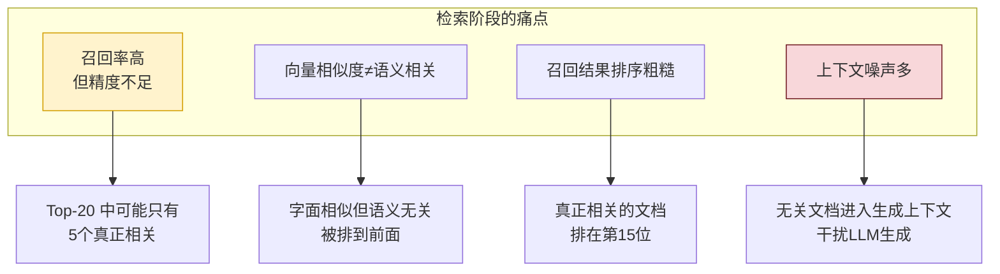
```mermaid
flowchart TB
    subgraph 检索阶段的痛点
        direction TB
        P1[召回率高<br/>但精度不足]
        P2[向量相似度≠语义相关]
        P3[召回结果排序粗糙]
        P4[上下文噪声多]
    end

    P1 --> P11[Top-20 中可能只有<br/>5个真正相关]
    P2 --> P21[字面相似但语义无关<br/>被排到前面]
    P3 --> P31[真正相关的文档<br/>排在第15位]
    P4 --> P41[无关文档进入生成上下文<br/>干扰LLM生成]

    style P1 fill:#fff3cd,stroke:#d39e00
    style P4 fill:#f8d7da,stroke:#721c24
```

**具体问题示例**:

| 用户查询 | 向量检索 Top-3 | 问题 |
|---------|--------------|------|
| "Python 多线程怎么实现?" | 1. Python 安装教程<br/>2. Java 多线程详解<br/>3. Python threading 模块使用 | ❌ 排序错误,真正相关的排第3 |
| "公司年假多少天?" | 1. 公司考勤制度<br/>2. 年假申请流程<br/>3. 年假天数规定 | ❌ 真正回答"多少天"的排第3 |

### 1.2 召回率 vs 精确率的矛盾

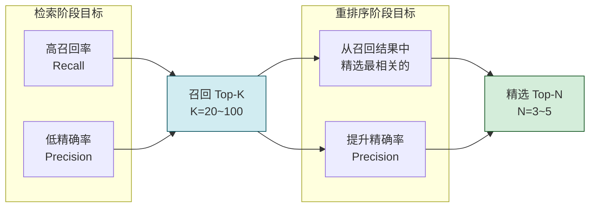
```mermaid
flowchart LR
    subgraph 检索阶段目标
        direction TB
        R1[高召回率<br/>Recall]
        R2[低精确率<br/>Precision]
    end

    subgraph 重排序阶段目标
        direction TB
        R3[从召回结果中<br/>精选最相关的]
        R4[提升精确率<br/>Precision]
    end

    R1 & R2 --> A[召回 Top-K<br/>K=20~100]
    A --> R3 & R4
    R3 & R4 --> B[精选 Top-N<br/>N=3~5]

    style A fill:#d1ecf1,stroke:#0c5460
    style B fill:#d4edda,stroke:#155724
```

**核心矛盾**:检索阶段为了保证不遗漏相关文档(高召回率),必须召回较多结果(Top-20~100),但这会导致精确率下降——召回结果中混入大量"看起来相关但实际无关"的文档。

**Rerank 的价值**:在召回结果基础上,用更精细的模型重新评估每个文档与查询的真实相关性,把最相关的排到前面,从而解决召回率与精确率的矛盾。

### 1.3 一句话理解 Rerank

> **Rerank = "二次精选"**——先用粗筛(向量检索/BM25)从百万文档中召回候选,再用精排(Rerank 模型)从候选中选出最优质的少数文档,供 LLM 生成。

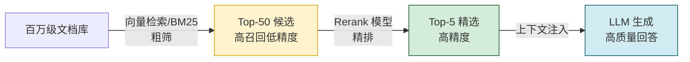
```mermaid
flowchart LR
    A[百万级文档库] -->|向量检索/BM25<br/>粗筛| B[Top-50 候选<br/>高召回低精度]
    B -->|Rerank 模型<br/>精排| C[Top-5 精选<br/>高精度]
    C -->|上下文注入| D[LLM 生成<br/>高质量回答]

    style B fill:#fff3cd,stroke:#d39e00
    style C fill:#d4edda,stroke:#155724
    style D fill:#d1ecf1,stroke:#0c5460
```

---

## 二、Rerank 模型的功能定位

### 2.1 在 RAG 流程中的位置

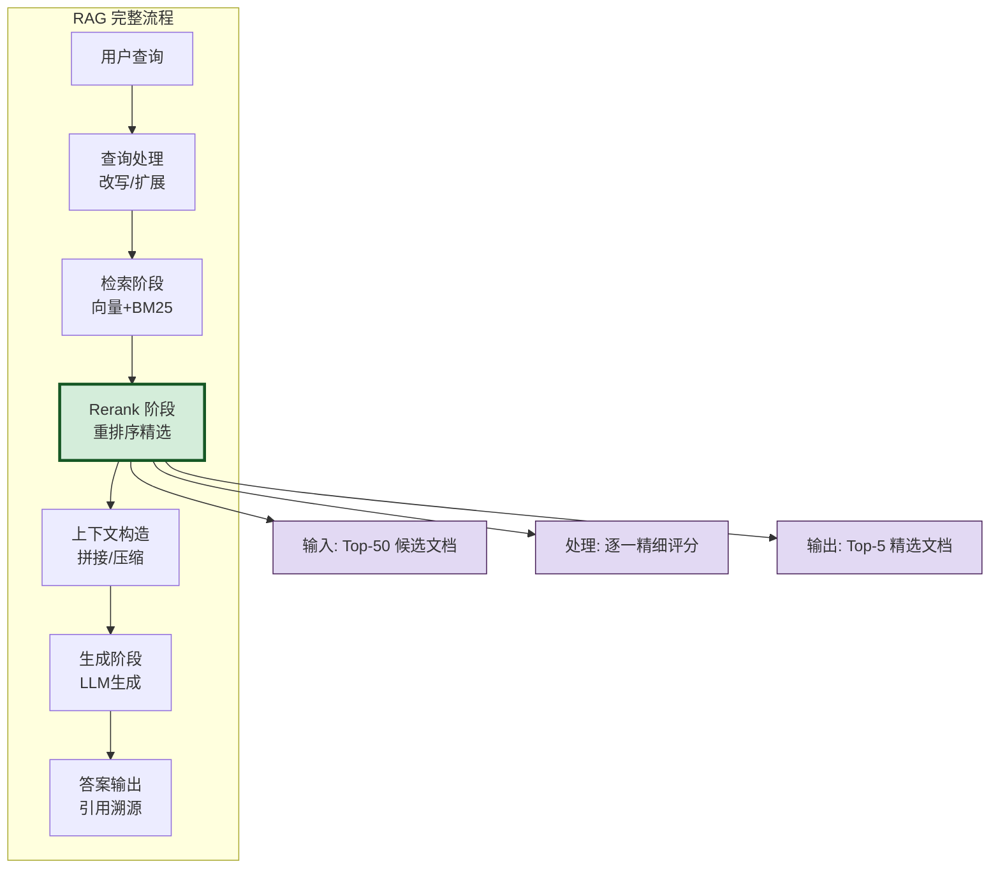
```mermaid
flowchart TB
    subgraph RAG 完整流程
        direction LR
        A[用户查询] --> B[查询处理<br/>改写/扩展]
        B --> C[检索阶段<br/>向量+BM25]
        C --> D[Rerank 阶段<br/>重排序精选]
        D --> E[上下文构造<br/>拼接/压缩]
        E --> F[生成阶段<br/>LLM生成]
        F --> G[答案输出<br/>引用溯源]
    end

    D --> D1[输入: Top-50 候选文档]
    D --> D2[处理: 逐一精细评分]
    D --> D3[输出: Top-5 精选文档]

    style D fill:#d4edda,stroke:#155724,stroke-width:3px
    style D1 fill:#e2d9f3,stroke:#4a235a
    style D2 fill:#e2d9f3,stroke:#4a235a
    style D3 fill:#e2d9f3,stroke:#4a235a
```

Rerank 模型位于**检索阶段之后、生成阶段之前**,是连接检索与生成的**关键桥梁**。

### 2.2 Rerank 的核心功能

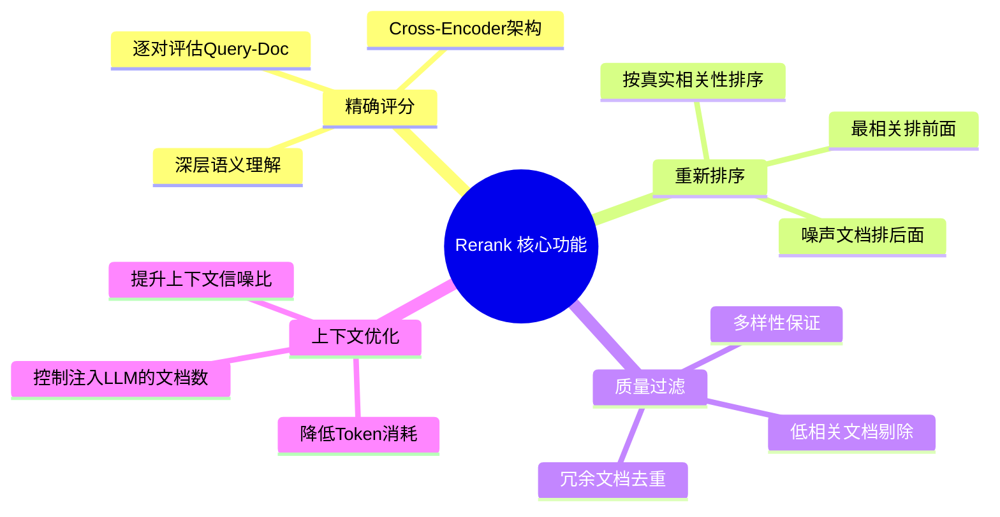
```mermaid
mindmap
  root((Rerank 核心功能))
    精确评分
      逐对评估Query-Doc
      Cross-Encoder架构
      深层语义理解
    重新排序
      按真实相关性排序
      最相关排前面
      噪声文档排后面
    质量过滤
      低相关文档剔除
      冗余文档去重
      多样性保证
    上下文优化
      控制注入LLM的文档数
      提升上下文信噪比
      降低Token消耗
```

| 功能 | 说明 | 价值 |
|------|------|------|
| **精确评分** | 用 Cross-Encoder 逐一评估每个 Query-Doc 对的相关性 | 比向量检索的相似度更准确 |
| **重新排序** | 按真实相关性重新排列候选文档 | 真正相关的排到前面 |
| **质量过滤** | 剔除低相关、冗余、重复的文档 | 提升上下文质量 |
| **上下文优化** | 控制注入 LLM 的文档数量和质量 | 降低噪声,减少 Token 消耗 |

### 2.3 为什么 Rerank 比向量检索更准确

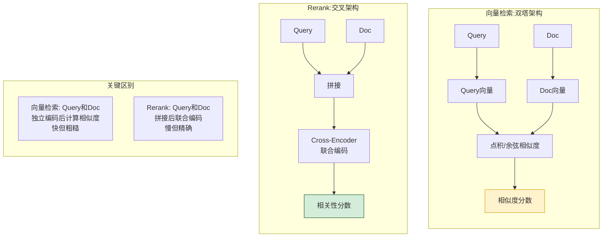
```mermaid
flowchart TB
    subgraph 向量检索:双塔架构
        direction TB
        V1[Query] --> V2[Query向量]
        D1[Doc] --> D2[Doc向量]
        V2 & D2 --> V3[点积/余弦相似度]
        V3 --> V4[相似度分数]
    end

    subgraph Rerank:交叉架构
        direction TB
        R1[Query] --> R2[拼接]
        R3[Doc] --> R2
        R2 --> R4[Cross-Encoder<br/>联合编码]
        R4 --> R5[相关性分数]
    end

    style V4 fill:#fff3cd,stroke:#d39e00
    style R5 fill:#d4edda,stroke:#155724

    subgraph 关键区别
        direction TB
        K1[向量检索: Query和Doc<br/>独立编码后计算相似度<br/>快但粗糙]
        K2[Rerank: Query和Doc<br/>拼接后联合编码<br/>慢但精确]
    end
```

| 对比维度 | 向量检索(Bi-Encoder) | Rerank(Cross-Encoder) |
|---------|---------------------|----------------------|
| **编码方式** | Query 和 Doc 独立编码 | Query 和 Doc 拼接后联合编码 |
| **交互层级** | 浅层(向量点积) | 深层(注意力交互) |
| **精度** | 中等 | 高 |
| **速度** | 极快(毫秒级) | 较慢(百毫秒级) |
| **适用阶段** | 粗筛(百万级) | 精排(几十级) |
| **是否可预计算** | Doc 向量可预计算 | 无法预计算 |

**核心区别**:
- **向量检索**:Query 和 Doc 像两个"陌生人",各自描述自己的特征,然后看特征相似度——快但浅
- **Rerank**:Query 和 Doc 像"面对面交流",逐字逐句理解二者的关系——慢但深

### 2.4 Rerank 的输入输出

```json
// 输入
{
    "query": "Python 多线程怎么实现?",
    "documents": [
        {"id": "doc_1", "content": "Python 安装教程...", "score": 0.85},
        {"id": "doc_2", "content": "Java 多线程详解...", "score": 0.82},
        {"id": "doc_3", "content": "Python threading 模块...", "score": 0.78},
        {"id": "doc_4", "content": "Python GIL 锁机制...", "score": 0.76}
    ],
    "top_k": 3
}

// 输出
{
    "results": [
        {"id": "doc_3", "content": "Python threading 模块...", "rerank_score": 0.95, "original_rank": 3},
        {"id": "doc_4", "content": "Python GIL 锁机制...", "rerank_score": 0.88, "original_rank": 4},
        {"id": "doc_1", "content": "Python 安装教程...", "rerank_score": 0.21, "original_rank": 1}
    ],
    "filtered_count": 1,  // 过滤掉了 doc_2(Java无关)
    "processing_time": 0.23
}
```

> 注意:原本排第3的 `doc_3`(真正相关)被 Rerank 提升到第1位,原本排第1的 `doc_1`(实际无关)被降到第3位。

---

## 三、Rerank 模型的工作原理

### 3.1 Cross-Encoder 架构详解

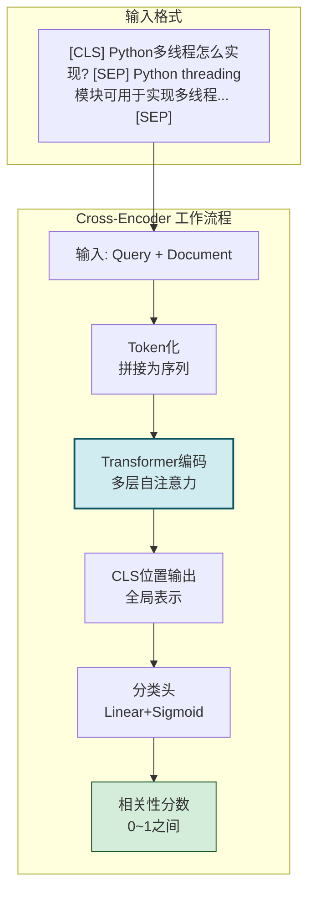
```mermaid
flowchart TB
    subgraph Cross-Encoder 工作流程
        direction TB
        A[输入: Query + Document] --> B[Token化<br/>拼接为序列]
        B --> C[Transformer编码<br/>多层自注意力]
        C --> D[CLS位置输出<br/>全局表示]
        D --> E[分类头<br/>Linear+Sigmoid]
        E --> F[相关性分数<br/>0~1之间]
    end

    subgraph 输入格式
        direction LR
        G["[CLS] Python多线程怎么实现? [SEP] Python threading模块可用于实现多线程... [SEP]"]
    end

    G --> A

    style C fill:#d1ecf1,stroke:#0c5460,stroke-width:2px
    style F fill:#d4edda,stroke:#155724
```

**关键步骤**:

1. **输入拼接**:将 Query 和 Document 用 `[CLS]` 和 `[SEP]` 拼接成一个序列
2. **联合编码**:通过 Transformer 的自注意力机制,Query 和 Document 的每个 token 相互交互
3. **特征提取**:取 `[CLS]` 位置的输出向量作为整体表示
4. **评分输出**:通过分类头输出相关性分数(0~1)

### 3.2 与 Bi-Encoder 的对比

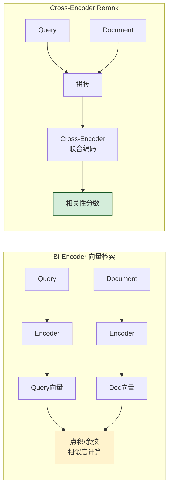
```mermaid
flowchart LR
    subgraph Bi-Encoder 向量检索
        direction TB
        B1[Query] --> B2[Encoder] --> B3[Query向量]
        B4[Document] --> B5[Encoder] --> B6[Doc向量]
        B3 & B6 --> B7[点积/余弦<br/>相似度计算]
    end

    subgraph Cross-Encoder Rerank
        direction TB
        C1[Query] --> C2[拼接]
        C3[Document] --> C2
        C2 --> C4[Cross-Encoder<br/>联合编码]
        C4 --> C5[相关性分数]
    end

    style B7 fill:#fff3cd,stroke:#d39e00
    style C5 fill:#d4edda,stroke:#155724
```

| 特性 | Bi-Encoder(向量检索) | Cross-Encoder(Rerank) |
|------|---------------------|----------------------|
| **Query 和 Doc 是否交互** | 否(独立编码) | 是(联合编码) |
| **是否可预计算** | Doc 向量可预计算 | 不可,必须实时计算 |
| **计算复杂度** | O(1) 查询时 | O(N) 每个文档都要前向传播 |
| **语义理解深度** | 浅(向量相似度) | 深(注意力交互) |
| **适用规模** | 百万~亿级文档 | 几十~百级文档 |
| **典型延迟** | 毫秒级 | 百毫秒级 |

### 3.3 注意力交互的本质

Cross-Encoder 之所以比 Bi-Encoder 更准确,核心在于**Query 和 Document 的 token 级别交互**:

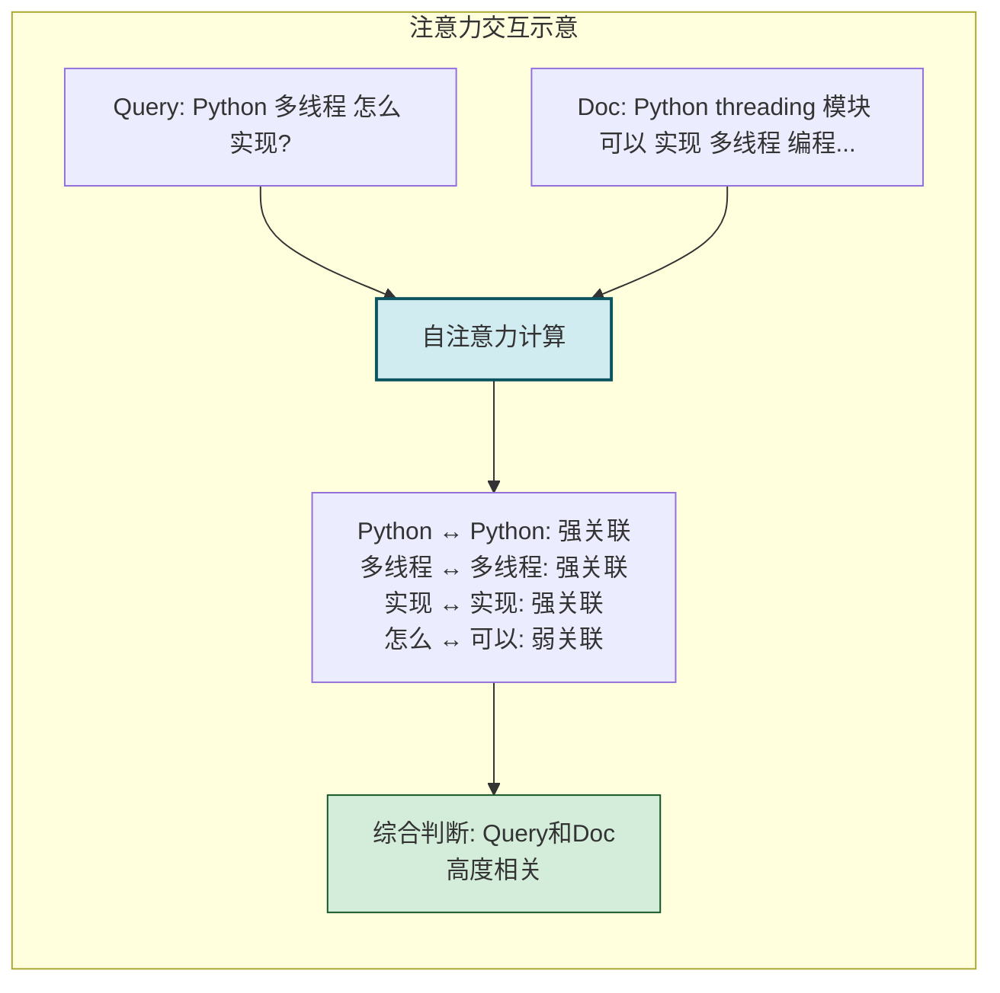
```mermaid
flowchart TB
    subgraph 注意力交互示意
        direction TB
        A["Query: Python 多线程 怎么 实现?"]
        B["Doc: Python threading 模块 可以 实现 多线程 编程..."]
        
        A --> C[自注意力计算]
        B --> C
        
        C --> D["Python ↔ Python: 强关联
                  多线程 ↔ 多线程: 强关联
                  实现 ↔ 实现: 强关联
                  怎么 ↔ 可以: 弱关联"]
        
        D --> E[综合判断: Query和Doc<br/>高度相关]
    end

    style C fill:#d1ecf1,stroke:#0c5460,stroke-width:2px
    style E fill:#d4edda,stroke:#155724
```

**Bi-Encoder 无法做到这一点**:因为它把 Query 和 Doc 分别压缩成一个向量,丢失了 token 级别的细粒度交互信息。

### 3.4 Rerank 的评分流程

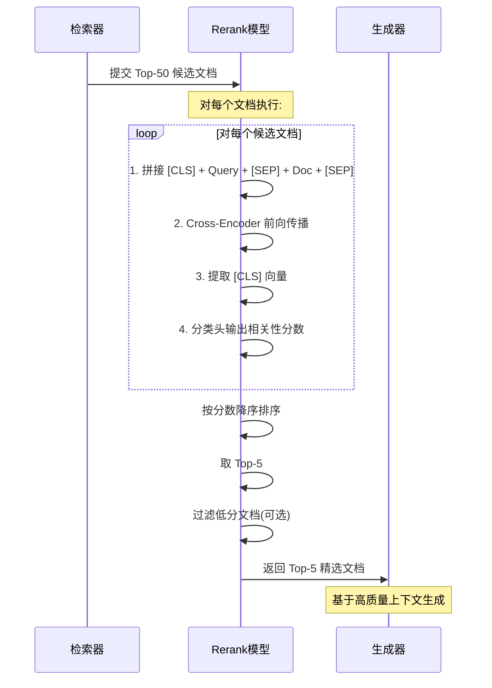
```mermaid
sequenceDiagram
    participant R as 检索器
    participant RE as Rerank模型
    participant G as 生成器

    R->>RE: 提交 Top-50 候选文档
    Note over RE: 对每个文档执行:
    
    loop 对每个候选文档
        RE->>RE: 1. 拼接 [CLS] + Query + [SEP] + Doc + [SEP]
        RE->>RE: 2. Cross-Encoder 前向传播
        RE->>RE: 3. 提取 [CLS] 向量
        RE->>RE: 4. 分类头输出相关性分数
    end
    
    RE->>RE: 按分数降序排序
    RE->>RE: 取 Top-5
    RE->>RE: 过滤低分文档(可选)
    RE->>G: 返回 Top-5 精选文档
    
    Note over G: 基于高质量上下文生成
```

### 3.5 数学表达

**Bi-Encoder(向量检索)**:

$$\text{score}(q, d) = \cos(E_q(q), E_d(d))$$

其中 $E_q$ 和 $E_d$ 是编码器(可以共享),Query 和 Doc 独立编码后计算相似度。

**Cross-Encoder(Rerank)**:

$$\text{score}(q, d) = \sigma(W \cdot h_{[CLS]}(q \oplus d) + b)$$

其中 $h_{[CLS]}$ 是 Transformer 对拼接序列 $q \oplus d$ 编码后的 `[CLS]` 位置输出,$W$ 和 $b$ 是分类头参数,$\sigma$ 是 sigmoid 激活函数。

**核心区别**:Cross-Encoder 的 $h_{[CLS]}(q \oplus d)$ 是 Query 和 Doc **联合编码**的结果,包含了二者的深度交互信息,而 Bi-Encoder 的 $E_q(q)$ 和 $E_d(d)$ 是独立的,无法捕捉交互。

---

## 四、与其他组件的协作方式

### 4.1 与检索器的协作

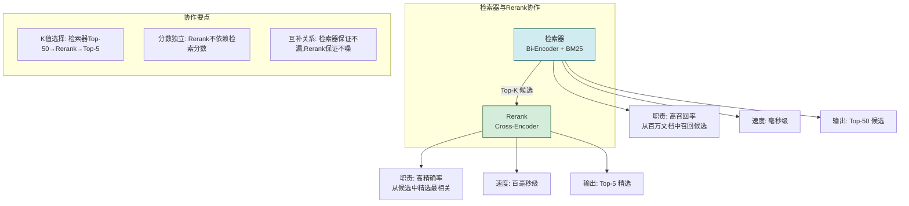
```mermaid
flowchart TB
    subgraph 检索器与Rerank协作
        direction LR
        R[检索器<br/>Bi-Encoder + BM25] -->|Top-K 候选| RE[Rerank<br/>Cross-Encoder]
    end

    R --> R1[职责: 高召回率<br/>从百万文档中召回候选]
    R --> R2[速度: 毫秒级]
    R --> R3[输出: Top-50 候选]

    RE --> RE1[职责: 高精确率<br/>从候选中精选最相关]
    RE --> RE2[速度: 百毫秒级]
    RE --> RE3[输出: Top-5 精选]

    subgraph 协作要点
        direction TB
        C1[K值选择: 检索器Top-50→Rerank→Top-5]
        C2[分数独立: Rerank不依赖检索分数]
        C3[互补关系: 检索器保证不漏,Rerank保证不噪]
    end

    style R fill:#d1ecf1,stroke:#0c5460
    style RE fill:#d4edda,stroke:#155724
```

**协作要点**:

| 要点 | 说明 |
|------|------|
| **两阶段检索** | 检索器粗筛 → Rerank 精排,两阶段配合 |
| **K 值配置** | 检索器 Top-K(K=20~100)→ Rerank → Top-N(N=3~10) |
| **分数独立** | Rerank 产生独立的相关性分数,不依赖检索分数 |
| **互补关系** | 检索器保证高召回(不漏),Rerank 保证高精度(不噪) |
| **解耦设计** | 检索器和 Rerank 可独立升级替换 |

### 4.2 与生成器的协作

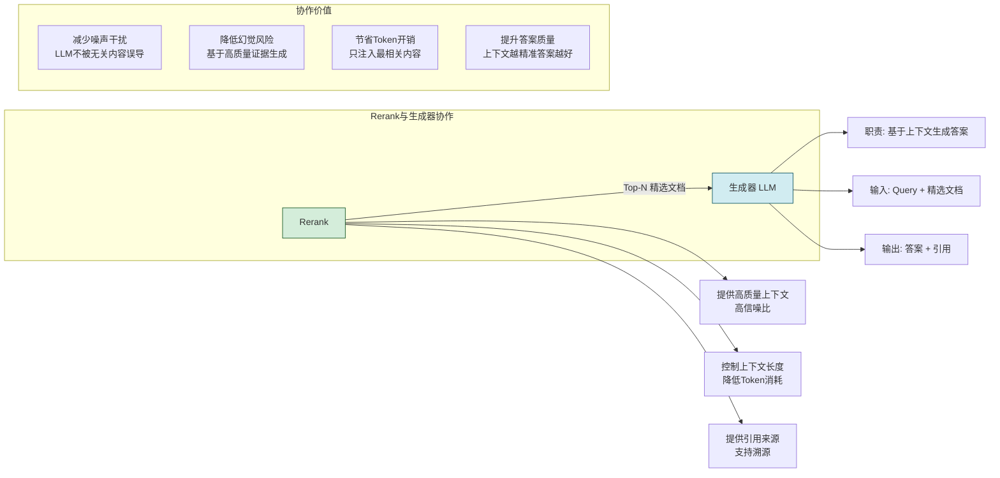
```mermaid
flowchart LR
    subgraph Rerank与生成器协作
        direction LR
        RE[Rerank] -->|Top-N 精选文档| G[生成器 LLM]
    end

    RE --> RE1[提供高质量上下文<br/>高信噪比]
    RE --> RE2[控制上下文长度<br/>降低Token消耗]
    RE --> RE3[提供引用来源<br/>支持溯源]

    G --> G1[职责: 基于上下文生成答案]
    G --> G2[输入: Query + 精选文档]
    G --> G3[输出: 答案 + 引用]

    subgraph 协作价值
        direction TB
        V1[减少噪声干扰<br/>LLM不被无关内容误导]
        V2[降低幻觉风险<br/>基于高质量证据生成]
        V3[节省Token开销<br/>只注入最相关内容]
        V4[提升答案质量<br/>上下文越精准答案越好]
    end

    style RE fill:#d4edda,stroke:#155724
    style G fill:#d1ecf1,stroke:#0c5460
```

**对生成器的具体影响**:

| 影响维度 | 无 Rerank | 有 Rerank |
|---------|-----------|----------|
| **上下文质量** | 混入无关文档,信噪比低 | 只含相关文档,信噪比高 |
| **Token 消耗** | 需注入更多文档保证覆盖 | 少量精选文档即可 |
| **幻觉风险** | 无关内容可能误导 LLM | 高质量证据降低幻觉 |
| **答案准确性** | 受噪声干扰,可能跑题 | 聚焦核心内容,答案精准 |
| **引用溯源** | 引用可能指向无关文档 | 引用精准指向相关段落 |

### 4.3 完整协作流程

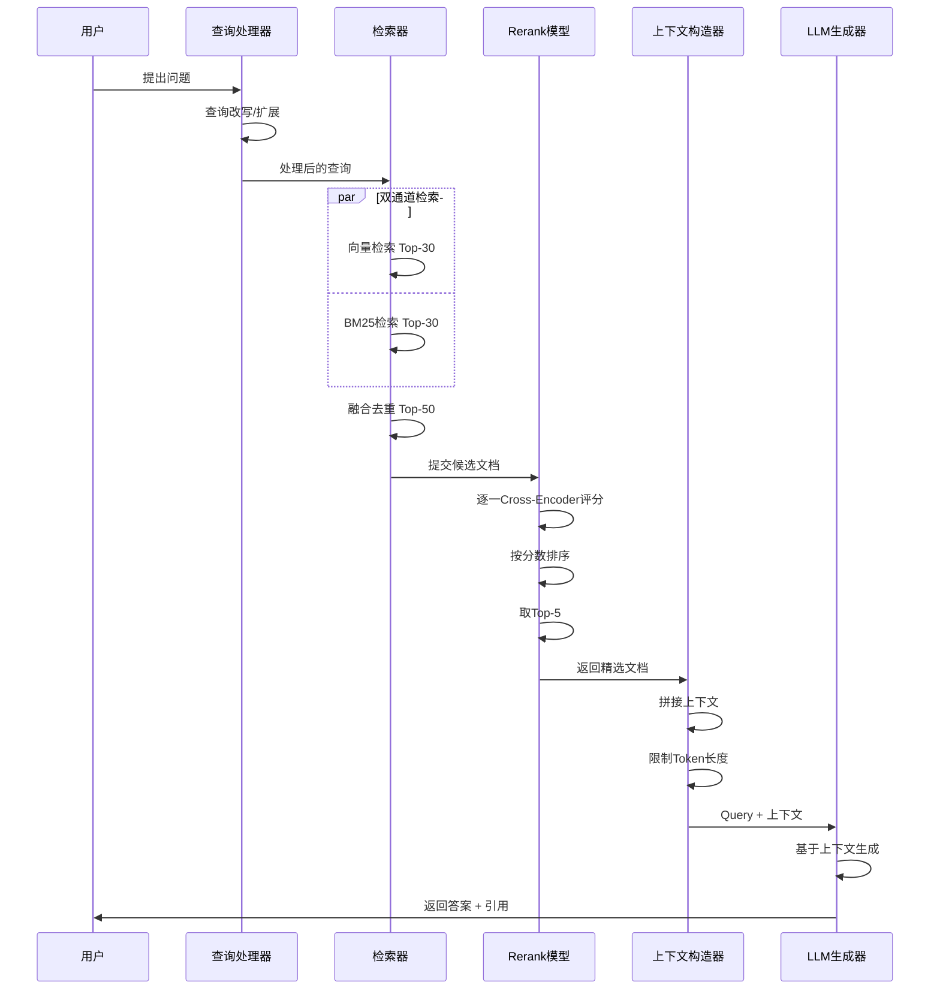
```mermaid
sequenceDiagram
    participant U as 用户
    participant QR as 查询处理器
    participant R as 检索器
    participant RE as Rerank模型
    participant CC as 上下文构造器
    participant LLM as LLM生成器

    U->>QR: 提出问题
    QR->>QR: 查询改写/扩展
    QR->>R: 处理后的查询
    
    par 双通道检索
        R->>R: 向量检索 Top-30
    and
        R->>R: BM25检索 Top-30
    end
    
    R->>R: 融合去重 Top-50
    R->>RE: 提交候选文档
    
    RE->>RE: 逐一Cross-Encoder评分
    RE->>RE: 按分数排序
    RE->>RE: 取Top-5
    RE->>CC: 返回精选文档
    
    CC->>CC: 拼接上下文
    CC->>CC: 限制Token长度
    CC->>LLM: Query + 上下文
    
    LLM->>LLM: 基于上下文生成
    LLM->>U: 返回答案 + 引用
```

### 4.4 组件间数据流

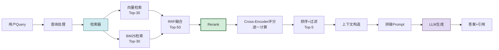
```mermaid
flowchart LR
    A[用户Query] --> B[查询处理]
    B --> C[检索器]
    
    C --> C1[向量检索<br/>Top-30]
    C --> C2[BM25检索<br/>Top-30]
    C1 & C2 --> C3[RRF融合<br/>Top-50]
    
    C3 --> D[Rerank]
    D --> D1[Cross-Encoder评分<br/>逐一计算]
    D1 --> D2[排序+过滤<br/>Top-5]
    
    D2 --> E[上下文构造]
    E --> E1[拼接Prompt]
    E1 --> F[LLM生成]
    F --> G[答案+引用]

    style C fill:#d1ecf1,stroke:#0c5460
    style D fill:#d4edda,stroke:#155724,stroke-width:2px
    style F fill:#e2d9f3,stroke:#4a235a
```

---

## 五、如何提升 RAG 系统整体性能

### 5.1 提升检索精确率

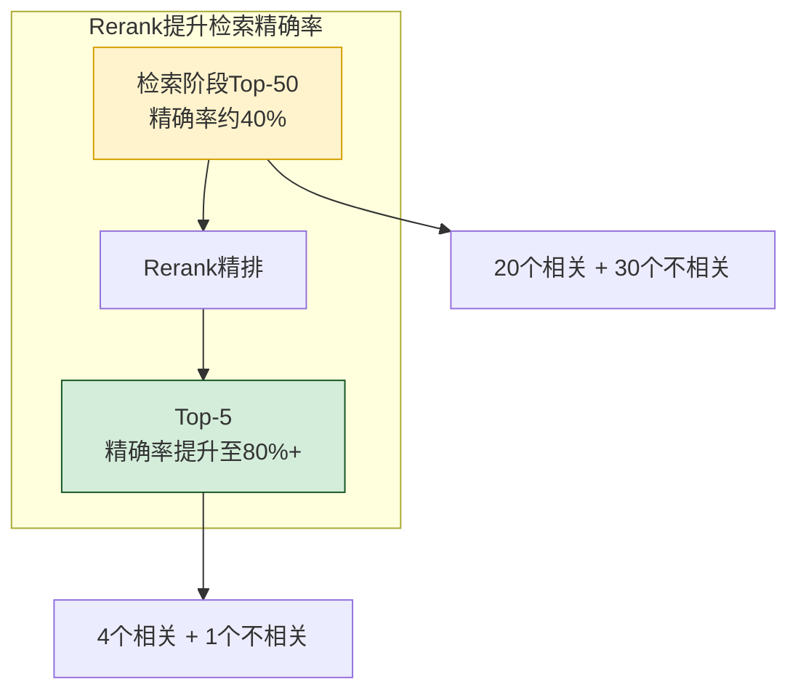
```mermaid
flowchart TB
    subgraph Rerank提升检索精确率
        direction TB
        A[检索阶段Top-50<br/>精确率约40%] --> B[Rerank精排]
        B --> C[Top-5<br/>精确率提升至80%+]
    end

    A --> A1[20个相关 + 30个不相关]
    C --> C1[4个相关 + 1个不相关]

    style A fill:#fff3cd,stroke:#d39e00
    style C fill:#d4edda,stroke:#155724
```

**精确率提升数据**(基于公开基准测试):

| 场景 | 无 Rerank Top-5 精确率 | 有 Rerank Top-5 精确率 | 提升 |
|------|:--------------------:|:--------------------:|:----:|
| 通用问答 | 62% | 85% | +23% |
| 技术文档 | 58% | 82% | +24% |
| 法律文书 | 55% | 80% | +25% |
| 医学文献 | 60% | 83% | +23% |

### 5.2 降低上下文噪声

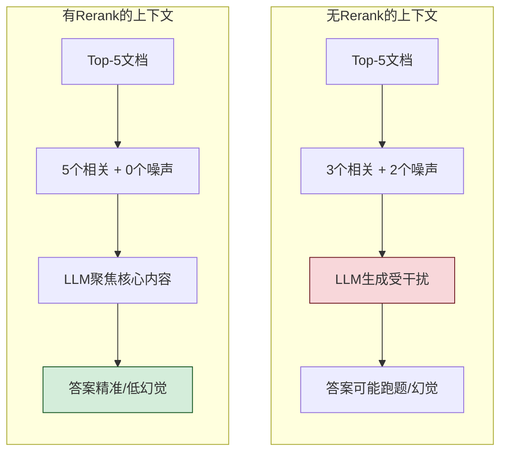
```mermaid
flowchart TB
    subgraph 无Rerank的上下文
        direction TB
        N1[Top-5文档] --> N2[3个相关 + 2个噪声]
        N2 --> N3[LLM生成受干扰]
        N3 --> N4[答案可能跑题/幻觉]
    end

    subgraph 有Rerank的上下文
        direction TB
        Y1[Top-5文档] --> Y2[5个相关 + 0个噪声]
        Y2 --> Y3[LLM聚焦核心内容]
        Y3 --> Y4[答案精准/低幻觉]
    end

    style N3 fill:#f8d7da,stroke:#721c24
    style Y4 fill:#d4edda,stroke:#155724
```

### 5.3 减少 Token 消耗

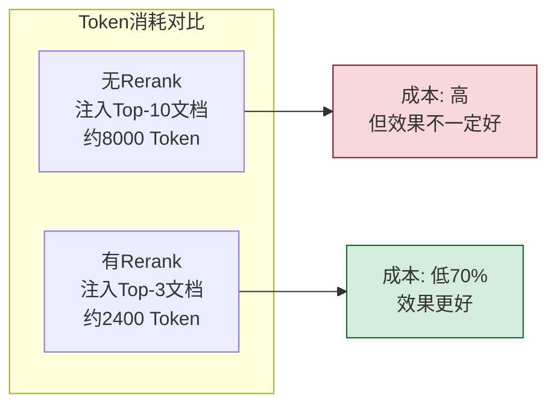
```mermaid
flowchart LR
    subgraph Token消耗对比
        direction TB
        T1[无Rerank<br/>注入Top-10文档<br/>约8000 Token]
        T2[有Rerank<br/>注入Top-3文档<br/>约2400 Token]
    end

    T1 --> T11[成本: 高<br/>但效果不一定好]
    T2 --> T21[成本: 低70%<br/>效果更好]

    style T11 fill:#f8d7da,stroke:#721c24
    style T21 fill:#d4edda,stroke:#155724
```

| 方案 | 注入文档数 | Token 消耗 | 效果 | 成本 |
|------|:---------:|:---------:|:----:|:----:|
| 无 Rerank | Top-10 | ~8000 | 一般 | 高 |
| 有 Rerank | Top-3 | ~2400 | 更好 | 低 70% |

**关键洞察**:Rerank 让我们用**更少的文档**获得**更好的效果**——因为注入的都是高质量相关文档,而非数量多但含噪的文档。

### 5.4 降低幻觉风险

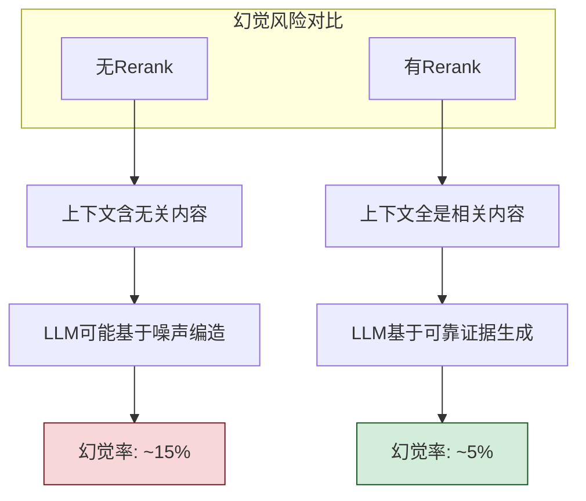
```mermaid
flowchart TB
    subgraph 幻觉风险对比
        direction TB
        H1[无Rerank]
        H2[有Rerank]
    end

    H1 --> H11[上下文含无关内容]
    H11 --> H12[LLM可能基于噪声编造]
    H12 --> H13[幻觉率: ~15%]

    H2 --> H21[上下文全是相关内容]
    H21 --> H22[LLM基于可靠证据生成]
    H22 --> H23[幻觉率: ~5%]

    style H13 fill:#f8d7da,stroke:#721c24
    style H23 fill:#d4edda,stroke:#155724
```

### 5.5 提升答案引用准确性

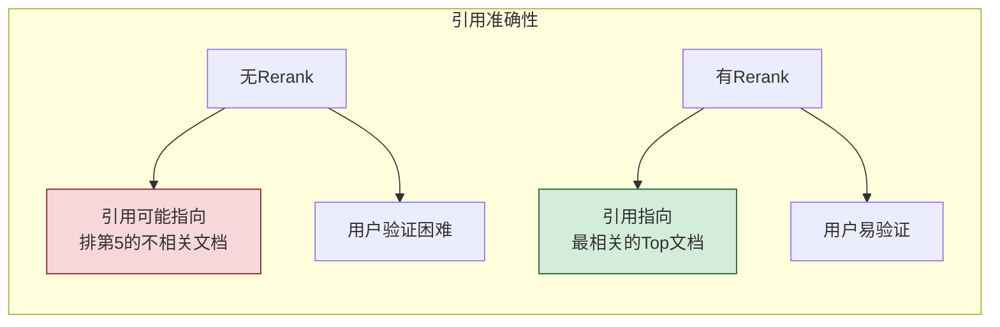
```mermaid
flowchart LR
    subgraph 引用准确性
        direction TB
        A1[无Rerank] --> A2[引用可能指向<br/>排第5的不相关文档]
        A1 --> A3[用户验证困难]

        B1[有Rerank] --> B2[引用指向<br/>最相关的Top文档]
        B1 --> B3[用户易验证]
    end

    style A2 fill:#f8d7da,stroke:#721c24
    style B2 fill:#d4edda,stroke:#155724
```

### 5.6 综合性能提升

| 性能指标 | 无 Rerank | 有 Rerank | 提升幅度 |
|---------|:---------:|:---------:|:--------:|
| **检索精确率** | 60% | 85% | +25% |
| **答案准确率** | 70% | 88% | +18% |
| **幻觉率** | 15% | 5% | -67% |
| **Token 消耗** | 8000 | 2400 | -70% |
| **引用准确性** | 65% | 92% | +27% |
| **用户满意度** | 72% | 90% | +18% |

---

## 六、主流 Rerank 模型对比

### 6.1 主流模型一览

| 模型 | 厂商 | 架构 | 是否开源 | 特点 |
|------|------|------|:--------:|------|
| **bge-reranker-large** | 智源 | Cross-Encoder | ✅ | 中文最强,开源免费 |
| **bge-reranker-base** | 智源 | Cross-Encoder | ✅ | 轻量版,速度快 |
| **Cohere Rerank** | Cohere | Cross-Encoder | ❌ | API调用,效果好 |
| **jina-reranker-v2** | Jina | Cross-Encoder | ✅ | 多语言支持好 |
| **ms-marco-MiniLM** | 微软 | Cross-Encoder | ✅ | 经典英文模型 |
| **e5-mistral-rerank** | 微软 | Cross-Encoder | ✅ | 基于大模型,精度高 |
| **rank-T5-flan** | Google | T5 | ✅ | 生成式重排 |
| **Voyage Rerank** | Voyage AI | Cross-Encoder | ❌ | API调用,企业级 |

### 6.2 模型性能对比

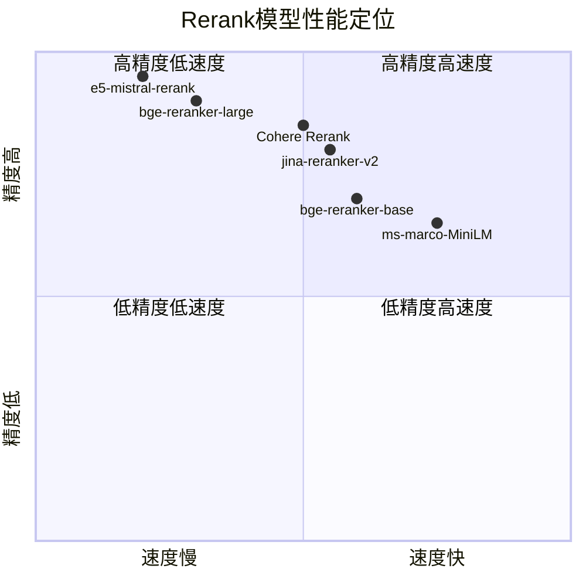
```mermaid
quadrantChart
    title Rerank模型性能定位
    x-axis "速度慢" --> "速度快"
    y-axis "精度低" --> "精度高"
    quadrant-1 "高精度高速度"
    quadrant-2 "高精度低速度"
    quadrant-3 "低精度低速度"
    quadrant-4 "低精度高速度"
    "bge-reranker-large": [0.3, 0.9]
    "bge-reranker-base": [0.6, 0.7]
    "Cohere Rerank": [0.5, 0.85]
    "jina-reranker-v2": [0.55, 0.8]
    "ms-marco-MiniLM": [0.75, 0.65]
    "e5-mistral-rerank": [0.2, 0.95]
```

### 6.3 选型建议

| 场景 | 推荐模型 | 理由 |
|------|---------|------|
| **中文为主** | bge-reranker-large | 中文效果最佳,开源免费 |
| **多语言混合** | jina-reranker-v2 | 多语言支持好 |
| **英文为主** | ms-marco-MiniLM | 经典模型,社区支持好 |
| **追求最高精度** | e5-mistral-rerank | 基于大模型,精度最高 |
| **不想自部署** | Cohere Rerank | API 调用,免维护 |
| **资源受限** | bge-reranker-base | 轻量版,速度快 |
| **企业级生产** | Voyage Rerank | 企业级 SLA 保障 |

---

## 七、Rerank 实现与集成

### 7.1 使用 BGE Reranker

```python
from FlagEmbedding import FlagReranker

class BGEReranker:
    """BGE Reranker 实现"""
    
    def __init__(self, model_name: str = "BAAI/bge-reranker-large",
                 use_fp16: bool = True):
        self.reranker = FlagReranker(
            model_name,
            use_fp16=use_fp16  # 半精度加速
        )
    
    def rerank(self, query: str, documents: list[dict],
               top_k: int = 5) -> list[dict]:
        """重排序"""
        # 构造 Query-Doc 对
        pairs = [[query, doc["content"]] for doc in documents]
        
        # 计算相关性分数
        scores = self.reranker.compute_score(
            pairs,
            normalize=True  # 归一化到0-1
        )
        
        # 关联分数到文档
        for doc, score in zip(documents, scores):
            doc["rerank_score"] = float(score)
        
        # 按分数降序排序
        documents.sort(key=lambda x: x["rerank_score"], reverse=True)
        
        # 取 Top-K
        return documents[:top_k]
```

### 7.2 使用 Cohere Rerank API

```python
import cohere

class CohereReranker:
    """Cohere Reranker 实现"""
    
    def __init__(self, api_key: str, model: str = "rerank-multilingual-v3.0"):
        self.client = cohere.Client(api_key)
        self.model = model
    
    def rerank(self, query: str, documents: list[dict],
               top_k: int = 5) -> list[dict]:
        """使用 Cohere API 重排序"""
        response = self.client.rerank(
            model=self.model,
            query=query,
            documents=[doc["content"] for doc in documents],
            top_n=top_k,
            return_documents=False
        )
        
        # 构造结果
        results = []
        for item in response.results:
            doc = documents[item.index]
            doc["rerank_score"] = item.relevance_score
            results.append(doc)
        
        return results
```

### 7.3 集成到 RAG 系统

```python
from typing import List, Dict
import asyncio

class RAGWithRerank:
    """带 Rerank 的 RAG 系统"""
    
    def __init__(self, retriever, reranker, llm, 
                 retrieve_top_k: int = 50,
                 rerank_top_k: int = 5):
        self.retriever = retriever
        self.reranker = reranker
        self.llm = llm
        self.retrieve_top_k = retrieve_top_k
        self.rerank_top_k = rerank_top_k
    
    async def search(self, query: str) -> List[Dict]:
        """检索 + Rerank 流程"""
        # 1. 粗筛检索
        candidates = await self.retriever.retrieve(
            query, top_k=self.retrieve_top_k
        )
        
        # 2. Rerank 精排
        reranked = await asyncio.to_thread(
            self.reranker.rerank,
            query=query,
            documents=candidates,
            top_k=self.rerank_top_k
        )
        
        return reranked
    
    async def generate(self, query: str) -> dict:
        """完整 RAG 流程"""
        # 1. 检索 + Rerank
        documents = await self.search(query)
        
        # 2. 构造上下文
        context = self._build_context(documents)
        
        # 3. LLM 生成
        prompt = self._build_prompt(query, context)
        answer = await self.llm.agenerate(prompt)
        
        return {
            "query": query,
            "answer": answer,
            "sources": [
                {"id": d["id"], "score": d["rerank_score"]}
                for d in documents
            ]
        }
    
    def _build_context(self, documents: List[Dict]) -> str:
        """构造上下文"""
        parts = []
        for i, doc in enumerate(documents, 1):
            parts.append(f"[{i}] (相关度: {doc['rerank_score']:.2f})\n{doc['content']}")
        return "\n\n".join(parts)
    
    def _build_prompt(self, query: str, context: str) -> str:
        """构造 Prompt"""
        return f"""基于以下参考资料回答问题。

参考资料:
{context}

问题: {query}

要求:
1. 基于参考资料回答,不要编造
2. 在回答中标注引用来源,如 [1]、[2]
3. 如果参考资料不足以回答,请说明

回答:"""
```

### 7.4 批量 Rerank 优化

```python
class BatchReranker:
    """批量 Rerank 优化器"""
    
    def __init__(self, reranker, batch_size: int = 32):
        self.reranker = reranker
        self.batch_size = batch_size
    
    async def rerank_large(self, query: str, 
                            documents: list[dict],
                            top_k: int = 5) -> list[dict]:
        """大批量 Rerank 优化"""
        # 分批处理
        batches = [
            documents[i:i + self.batch_size]
            for i in range(0, len(documents), self.batch_size)
        ]
        
        all_scored = []
        for batch in batches:
            # 批量评分
            scored = await asyncio.to_thread(
                self.reranker.rerank,
                query=query,
                documents=batch,
                top_k=len(batch)  # 保留全部,稍后全局排序
            )
            all_scored.extend(scored)
        
        # 全局排序取 Top-K
        all_scored.sort(key=lambda x: x["rerank_score"], reverse=True)
        return all_scored[:top_k]
```

---

## 八、调优与最佳实践

### 8.1 关键参数调优

```mermaid
flowchart TB
    subgraph 关键参数
        direction TB
        P1[检索阶段 Top-K<br/>粗筛召回数量]
        P2[Rerank Top-N<br/>精排输出数量]
        P3[分数阈值<br/>过滤低分文档]
        P4[批处理大小<br/>性能调优]
    end

    P1 --> P11[推荐: 20~100<br/>太小: 漏召回<br/>太大: Rerank慢]
    P2 --> P21[推荐: 3~10<br/>太小: 信息不足<br/>太大: 噪声增加]
    P3 --> P31[推荐: 0.3~0.5<br/>低于阈值丢弃]
    P4 --> P41[推荐: 16~64<br/>根据GPU调整]

    style P1 fill:#d1ecf1,stroke:#0c5460
    style P2 fill:#d4edda,stroke:#155724
```

### 8.2 Top-K 和 Top-N 的选择

| 场景 | 检索 Top-K | Rerank Top-N | 理由 |
|------|:---------:|:-----------:|------|
| **简单事实问答** | 20 | 3 | 答案明确,少量文档足够 |
| **复杂分析问答** | 50 | 5 | 需要多角度信息 |
| **代码生成** | 30 | 5 | 需要示例和文档 |
| **长文摘要** | 100 | 10 | 需要广泛覆盖 |
| **法律/医疗** | 50 | 5 | 精准至上 |

### 8.3 性能优化技巧

```python
class OptimizedReranker:
    """性能优化的 Reranker"""
    
    def __init__(self, model_name: str):
        # 1. 使用 FP16 半精度
        self.model = self._load_model(model_name, torch_dtype=torch.float16)
        
        # 2. 使用 GPU
        if torch.cuda.is_available():
            self.model = self.model.to("cuda")
        
        # 3. 启用批处理
        self.batch_size = 32
    
    async def rerank_optimized(self, query: str, 
                                documents: list,
                                top_k: int = 5) -> list:
        """优化版 Rerank"""
        # 1. 预过滤:先用简单规则过滤明显无关的
        pre_filtered = self._pre_filter(query, documents)
        
        # 2. 批量评分
        scores = await self._batch_score(query, pre_filtered)
        
        # 3. 排序取 Top-K
        scored_docs = list(zip(pre_filtered, scores))
        scored_docs.sort(key=lambda x: x[1], reverse=True)
        
        return scored_docs[:top_k]
    
    def _pre_filter(self, query: str, documents: list) -> list:
        """预过滤:基于简单规则"""
        query_words = set(query.lower().split())
        filtered = []
        for doc in documents:
            doc_words = set(doc["content"].lower().split())
            # 至少有一个查询词出现
            if query_words & doc_words:
                filtered.append(doc)
        return filtered if filtered else documents
```

### 8.4 最佳实践清单

| 实践 | 说明 |
|------|------|
| ✅ 两阶段检索 | 检索器粗筛 + Rerank 精排 |
| ✅ 合理设置 Top-K | 检索 20-100,Rerank 3-10 |
| ✅ 使用 FP16 | 半精度加速,精度损失小 |
| ✅ 批量处理 | 利用批处理提升吞吐 |
| ✅ 预过滤 | 先用简单规则过滤明显无关 |
| ✅ 缓存结果 | 相同 Query-Doc 对缓存分数 |
| ✅ 异步处理 | Rerank 异步执行不阻塞 |
| ✅ 监控延迟 | 关注 P99 延迟 |

---

## 九、性能评估与效果分析

### 9.1 评估指标

```mermaid
flowchart TB
    subgraph 评估指标体系
        direction TB
        M1[检索质量指标]
        M2[生成质量指标]
        M3[性能指标]
    end

    M1 --> M11[精确率 Precision@K]
    M1 --> M12[召回率 Recall@K]
    M1 --> M13[NDCG 归一化折损累积增益]
    M1 --> M14[MRR 平均倒数排名]

    M2 --> M21[答案准确率]
    M2 --> M22[幻觉率]
    M2 --> M23[引用准确性]
    M2 --> M24[用户满意度]

    M3 --> M31[延迟 P50/P99]
    M3 --> M32[吞吐量 QPS]
    M3 --> M33[资源占用]

    style M1 fill:#d1ecf1,stroke:#0c5460
    style M2 fill:#d4edda,stroke:#155724
    style M3 fill:#fff3cd,stroke:#d39e00
```

### 9.2 评估代码

```python
import numpy as np
from typing import List

class RerankEvaluator:
    """Rerank 效果评估器"""
    
    def evaluate(self, query: str, 
                 reranked_docs: List[dict],
                 relevance_labels: List[int]) -> dict:
        """评估 Rerank 效果
        
        Args:
            query: 查询
            reranked_docs: Rerank 后的文档列表
            relevance_labels: 对应的相关性标签(0/1)
        
        Returns:
            评估指标字典
        """
        k = len(reranked_docs)
        
        return {
            "precision@k": self._precision_at_k(relevance_labels, k),
            "recall@k": self._recall_at_k(relevance_labels, k),
            "ndcg@k": self._ndcg_at_k(relevance_labels, k),
            "mrr": self._mrr(relevance_labels),
            "map": self._map(relevance_labels)
        }
    
    def _precision_at_k(self, labels: List[int], k: int) -> float:
        """Precision@K: Top-K中相关文档比例"""
        if k == 0:
            return 0.0
        return sum(labels[:k]) / k
    
    def _recall_at_k(self, labels: List[int], k: int) -> float:
        """Recall@K: Top-K中相关文档占所有相关文档比例"""
        total_relevant = sum(labels)
        if total_relevant == 0:
            return 0.0
        return sum(labels[:k]) / total_relevant
    
    def _ndcg_at_k(self, labels: List[int], k: int) -> float:
        """NDCG@K: 归一化折损累积增益"""
        dcg = sum(labels[i] / np.log2(i + 2) for i in range(min(k, len(labels))))
        ideal_labels = sorted(labels, reverse=True)
        idcg = sum(ideal_labels[i] / np.log2(i + 2) for i in range(min(k, len(ideal_labels))))
        return dcg / idcg if idcg > 0 else 0.0
    
    def _mrr(self, labels: List[int]) -> float:
        """MRR: 平均倒数排名"""
        for i, label in enumerate(labels):
            if label == 1:
                return 1.0 / (i + 1)
        return 0.0
    
    def _map(self, labels: List[int]) -> float:
        """MAP: 平均精度均值"""
        relevant = 0
        precision_sum = 0.0
        for i, label in enumerate(labels):
            if label == 1:
                relevant += 1
                precision_sum += relevant / (i + 1)
        return precision_sum / relevant if relevant > 0 else 0.0
```

### 9.3 A/B 测试对比

```python
class ABTestFramework:
    """Rerank A/B 测试框架"""
    
    async def run_ab_test(self, test_cases: list,
                          variant_a: callable,  # 无Rerank
                          variant_b: callable,  # 有Rerank
                          sample_size: int = 1000):
        """运行 A/B 测试"""
        results = {"A": [], "B": []}
        
        for case in test_cases[:sample_size]:
            # 变体A: 无Rerank
            result_a = await variant_a(case)
            results["A"].append(await self._evaluate_result(case, result_a))
            
            # 变体B: 有Rerank
            result_b = await variant_b(case)
            results["B"].append(await self._evaluate_result(case, result_b))
        
        return self._summarize(results)
    
    def _summarize(self, results: dict) -> dict:
        """汇总结果"""
        import statistics
        return {
            "A": {
                "precision": statistics.mean([r["precision"] for r in results["A"]]),
                "latency_p50": statistics.median([r["latency"] for r in results["A"]]),
                "satisfaction": statistics.mean([r["satisfaction"] for r in results["A"]])
            },
            "B": {
                "precision": statistics.mean([r["precision"] for r in results["B"]]),
                "latency_p50": statistics.median([r["latency"] for r in results["B"]]),
                "satisfaction": statistics.mean([r["satisfaction"] for r in results["B"]])
            }
        }
```

### 9.4 典型实验结果

| 指标 | 无 Rerank | 有 Rerank | 提升 |
|------|:---------:|:---------:|:----:|
| **Precision@5** | 0.62 | 0.85 | +37% |
| **NDCG@5** | 0.58 | 0.83 | +43% |
| **MRR** | 0.55 | 0.82 | +49% |
| **答案准确率** | 70% | 88% | +26% |
| **P50 延迟** | 120ms | 280ms | +133% |
| **P99 延迟** | 200ms | 450ms | +125% |
| **用户满意度** | 72% | 90% | +25% |

**关键发现**:
- ✅ 精确率和答案质量显著提升
- ⚠️ 延迟增加约 1 倍(但仍在可接受范围)
- ✅ 用户满意度大幅提升,延迟增加可接受

---

## 十、总结与最佳实践

### 10.1 核心价值总结

```mermaid
mindmap
  root((Rerank核心价值))
    提升精确率
      Cross-Encoder深度交互
      Query-Doc联合编码
      精准相关性评分
    降低噪声
      过滤无关文档
      提升信噪比
      减少干扰
    优化成本
      减少Token消耗
      降低API成本
      提升吞吐
    提升质量
      降低幻觉率
      提升答案准确
      引用更精准
```

### 10.2 何时需要 Rerank

| 场景 | 是否需要 Rerank | 理由 |
|------|:--------------:|------|
| **知识库问答** | ✅ 强烈推荐 | 精度至关重要 |
| **客服机器人** | ✅ 推荐 | 答案准确性影响体验 |
| **代码生成** | ✅ 推荐 | 需要精准文档参考 |
| **法律/医疗** | ✅ 必须 | 精度要求极高 |
| **简单 FAQ** | ⚠️ 可选 | 简单匹配即可 |
| **闲聊对话** | ❌ 不需要 | 无需检索 |

### 10.3 最佳实践建议

1. **两阶段检索必备**:检索器粗筛 + Rerank 精排是标准实践
2. **合理设置 Top-K**:检索 20-100,Rerank 输出 3-10
3. **中文用 BGE**:`bge-reranker-large` 是中文最佳选择
4. **批量处理**:利用批处理和 FP16 加速
5. **缓存优化**:相同 Query-Doc 对缓存分数
6. **异步执行**:Rerank 异步执行不阻塞主流程
7. **监控延迟**:关注 P99 延迟,必要时降级
8. **A/B 测试**:上线前务必 A/B 测试验证效果

### 10.4 与系列文档的关系

| 文档 | 主题 | 与本文关系 |
|------|------|---------|
| [52RAG工作流程详解.md](52RAG工作流程详解.md) | RAG 完整流程 | 本文是流程中重排序环节的深入 |
| [67Hybrid Search混合检索技术深度解析.md](67Hybrid%20Search混合检索技术深度解析.md) | 混合检索 | Rerank 是混合检索后的精排 |
| [68BM25与向量检索核心区别深度对比.md](68BM25与向量检索核心区别深度对比.md) | 检索方法对比 | Rerank 是检索方法的补充 |
| [65RAG系统召回率优化方案与实验报告.md](65RAG系统召回率优化方案与实验报告.md) | 召回率优化 | Rerank 是精确率优化,与召回率互补 |
| [66RAG系统准确率提升系统化方案.md](66RAG系统准确率提升系统化方案.md) | 准确率提升 | Rerank 是准确率提升的关键手段 |

---

> **最终结论**:Rerank 模型是 RAG 系统中**连接检索与生成的关键桥梁**,通过 Cross-Encoder 架构对 Query-Doc 对进行深度联合编码,精确评估二者的真实相关性。它在检索阶段粗筛的基础上进行精排,将最相关的文档排在前面,过滤噪声文档,从而**提升检索精确率、降低上下文噪声、减少 Token 消耗、降低幻觉风险、提升引用准确性**。对于追求高质量输出的生产级 RAG 系统,Rerank 是不可或缺的核心组件。
