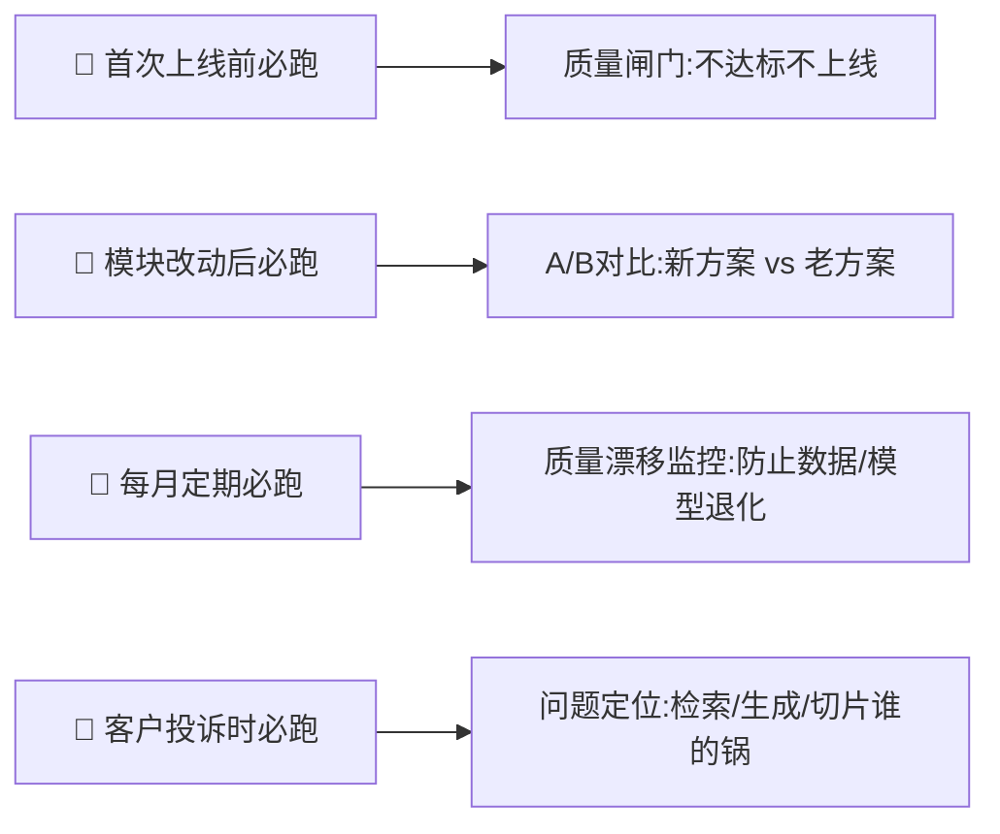
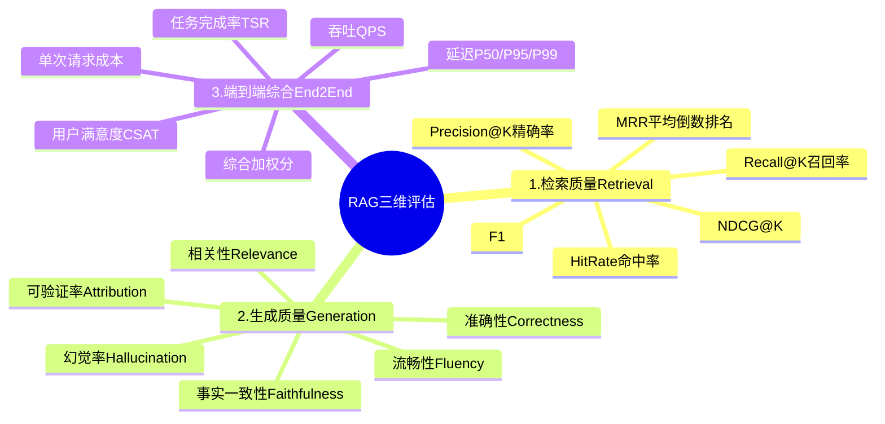
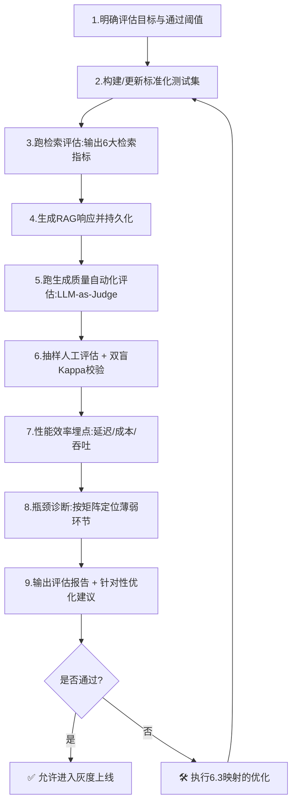
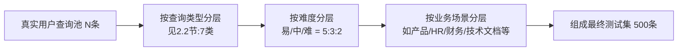
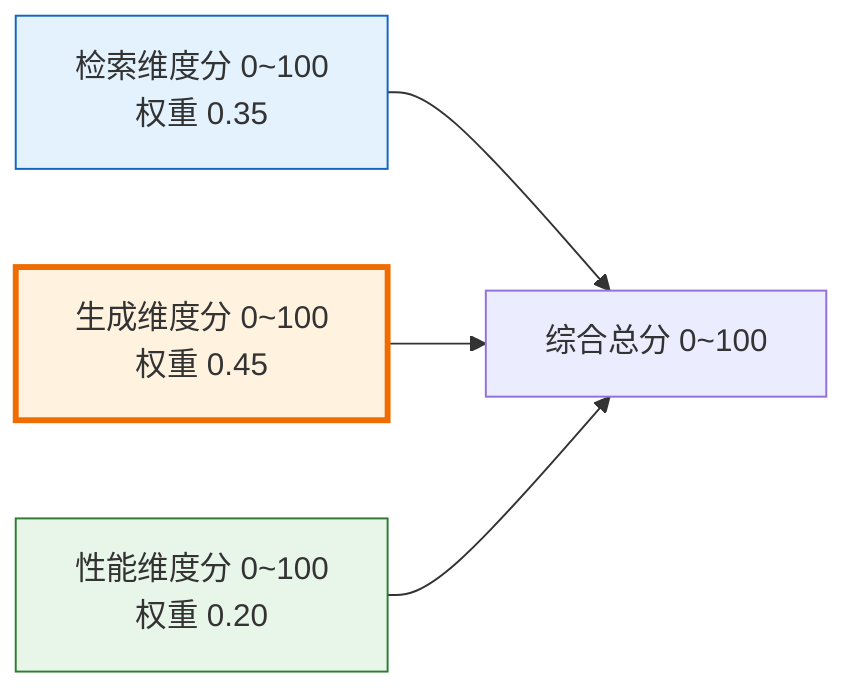

# RAG 系统效果评估全方案：检索 / 生成 / 端到端三维度标准化框架

> **文档定位**:本文档是「RAG 检索增强生成」系列的第 20 篇核心文档,在 [65号文档](./65RAG系统召回率优化方案与实验报告.md) 召回优化、[66号文档](./66RAG系统准确率提升系统化方案.md) 准确率提升、[67号](./67Hybrid%20Search混合检索技术深度解析.md) 混合检索、[68号](./68BM25与向量检索核心区别深度对比.md) BM25对比、[69号](./69RAG系统Rerank重排序模型深度解析.md) Rerank重排序的基础上,**第一次系统化地制定「RAG效果全评估方案」**。之前的65/66号文档侧重「怎么优化」,本文档侧重「怎么衡量优化效果」和「上线前的质量闸门」,提供可直接落地的指标体系、测试集构建方法、自动化评估代码、人工评估模板、评估报告输出格式、瓶颈诊断与优化建议闭环。
>
> **与65/66号文档的关系**:
> - 65号(召回优化)+ 66号(准确率提升)=「优化手段」
> - 本文 =「优化效果的验收闸门」+「未达标时的瓶颈诊断器」
> - 三者构成「测量 → 优化 → 再测量」的完整迭代闭环
>
> **建议使用方式**:
> 1. 上线前必跑(质量闸门)
> 2. 每次改动检索/切片/Embedding/Rerank/LLM后必跑(A/B)
> 3. 每月定期跑(质量漂移监控)

---

## 目录

- [一、评估方案总体设计](#一评估方案总体设计)
  - [1.1 评估目标与使用时机](#11-评估目标与使用时机)
  - [1.2 三大评估维度总览(检索/生成/端到端)](#12-三大评估维度总览检索生成端到端)
  - [1.3 自动化评估 + 人工评估的双轨结合架构](#13-自动化评估--人工评估的双轨结合架构)
  - [1.4 评估流程(九步闭环)](#14-评估流程九步闭环)
- [二、标准化测试数据集设计](#二标准化测试数据集设计)
  - [2.1 测试集规模与分层抽样原则](#21-测试集规模与分层抽样原则)
  - [2.2 查询类型分类体系(覆盖真实业务分布)](#22-查询类型分类体系覆盖真实业务分布)
  - [2.3 金标准(Ground Truth)标注规范](#23-金标准ground-truth标注规范)
  - [2.4 测试集JSON结构与代码示例](#24-测试集json结构与代码示例)
- [三、维度一：检索质量评估](#三维度一检索质量评估)
  - [3.1 检索质量指标定义(Recall@K/Precision@K/F1/MRR/NDCG@K)](#31-检索质量指标定义recallkprecisionkf1mrrndcgk)
  - [3.2 指标代码实现(可直接调用)](#32-指标代码实现可直接调用)
  - [3.3 分级评价标准(什么算合格)](#33-分级评价标准什么算合格)
  - [3.4 指标不达标时的诊断思路(附决策树)](#34-指标不达标时的诊断思路附决策树)
- [四、维度二：生成质量评估](#四维度二生成质量评估)
  - [4.1 四维度生成质量评估框架(相关性/准确性/流畅性/事实一致性)](#41-四维度生成质量评估框架相关性准确性流畅性事实一致性)
  - [4.2 方法A:自动化评估 —— LLM-as-Judge(带Prompt+打分Rubric)](#42-方法a自动化评估--llm-as-judge带prompt打分rubric)
  - [4.3 方法B:人工评估(维度说明+打分表+标注一致性)](#43-方法b人工评估维度说明打分表标注一致性)
  - [4.4 事实一致性专项:RAG核心生命线(引用标注法+事实抽取法)](#44-事实一致性专项rag核心生命线引用标注法事实抽取法)
  - [4.5 幻觉率与可验证率](#45-幻觉率与可验证率)
- [五、维度三：端到端综合性能评估](#五维度三端到端综合性能评估)
  - [5.1 综合评分加权公式](#51-综合评分加权公式)
  - [5.2 用户满意度调查设计](#52-用户满意度调查设计)
  - [5.3 任务完成率(Task Success Rate)](#53-任务完成率task-success-rate)
  - [5.4 性能效率指标(延迟/成本/吞吐)](#54-性能效率指标延迟成本吞吐)
- [六、评估报告输出模板与瓶颈分析](#六评估报告输出模板与瓶颈分析)
  - [6.1 标准评估报告结构(11章节)](#61-标准评估报告结构11章节)
  - [6.2 性能瓶颈诊断矩阵(检索/生成/综合)](#62-性能瓶颈诊断矩阵检索生成综合)
  - [6.3 针对性优化建议映射](#63-针对性优化建议映射)
- [七、评估代码实现:端到端评估Runner](#七评估代码实现端到端评估runner)
- [八、最佳实践与常见陷阱](#八最佳实践与常见陷阱)
- [九、总结与快速启动清单](#九总结与快速启动清单)

---

## 一、评估方案总体设计

### 1.1 评估目标与使用时机

**评估目标**(一句话):给RAG系统一个「可量化、可复现、可对比」的综合分数,回答三个关键问题:
1. **当前系统达标吗?**(质量闸门:上线前pass/fail判定)
2. **改动后更好还是更差?**(A/B对比:每次改切片/Embedding/检索/Rerank/LLM都跑一遍)
3. **哪里拖了后腿?怎么优化?**(瓶颈诊断:是检索弱还是生成弱,改哪里最划算)

**使用时机**:



### 1.2 三大评估维度总览(检索/生成/端到端)



| 维度 | 解决问题 | 评估方式 | 产出指标 |
|------|---------|---------|---------|
| **1. 检索** | **"把对的文档找回来了吗?"** | 对比 Top-K 召回文档 vs 金标准相关文档集合 | Recall@K / Precision@K / F1 / MRR / NDCG / HitRate |
| **2. 生成** | **"基于检索到的文档,答得对、答得准、没瞎编吗?"** | LLM-as-Judge自动评 + 人工精评(双轨) | 相关性/准确性/流畅性/事实一致性 四项1~5分;幻觉率;可验证率 |
| **3. 端到端** | **"整体好不好用?用户愿不愿意用?"** | 综合加权分 + 用户问卷 + 任务成功率 + 性能监控 | 综合分0~100;CSAT;TSR;P99延迟;单请求成本 |

### 1.3 自动化评估 + 人工评估的双轨结合架构

```mermaid
flowchart TB
    subgraph 双轨评估架构
        subgraph A[🔵 自动化评估(80%样本)]
            A1[召回/排序指标<br/>秒级跑完,无成本]
            A2[LLM-as-Judge四维度打分<br/>比人工快×50,成本低×20]
            A3[引用可验证率/幻觉率自动检测]
            A4[性能指标:延迟/成本/吞吐]
        end
        subgraph B[🧑 人工评估(20%样本,重点边界case)]
            B1[分层抽样:困难/多跳/事实边界等]
            B2[双盲双标注+仲裁:Kappa一致性≥0.7]
            B3[专项Badcase分析会]
        end
    end

    A --> MERGE[汇总评估报告]
    B --> MERGE
    MERGE --> OUT[📊 报告:综合分 + 瓶颈诊断 + 优化建议]

    style A fill:#e3f2fd,stroke:#1565c0
    style B fill:#fff3e0,stroke:#ef6c00
```

**为什么要两轨结合?**

| 方式 | 速度 | 成本 | 偏见/盲点 | 适用范围 |
|------|:----:|:----:|---------|:--------:|
| 自动化 | 秒/小时级 | 低(几元/万条) | 对语义细微错、复杂推理易放水 | 80%常规样本 → 快速基线 + 回归 |
| 人工 | 天/周级 | 高(几千/万条) | 人主观差异、成本高 | 20%边界/困难case + 最终质量闸门 |

经验阈值:**自动化综合分≥80分 且 人工badcase率≤15%**时,系统可进入灰度上线。

### 1.4 评估流程(九步闭环)



---

## 二、标准化测试数据集设计

> Garbage in, garbage out.评估结论是否可信,80%取决于测试集质量。

### 2.1 测试集规模与分层抽样原则

| 测试集规模 | 推荐样本数 | 置信区间(±%) | 适用阶段 |
|-----------|:---------:|:------------:|---------|
| **小(冒烟)** | 100条 | ±10% | 日常代码CI/模块改动快验 |
| **中(标准)** | 500条 | ±4.4% | 版本发布/上线闸门 |
| **大(权威)** | 2000+条 | ±2.2% | 季度/年度正式评估、论文级 |

**必须分层抽样**(不能只抽简单query,否则分数虚高):



> 示例:500条标准集 → 7类查询类型 × (易50%/中30%/难20%) × 各业务场景按真实流量占比抽样 + 每类最少15条,稀有类型不被淹没。

### 2.2 查询类型分类体系(覆盖真实业务分布)

从业务RAG最常遇到的7类query覆盖,每类都要有对应金标准:

| 类型代号 | 查询类型 | 定义与示例 | 典型占比 | 检索难点 | 生成难点 |
|:--------:|---------|-----------|:--------:|---------|---------|
| T1 | **单跳事实查询(Single-hop Factoid)** | "张三的入职日期是?" | 35~45% | 关键词匹配即可 | 直接答,易 |
| T2 | **多跳推理查询(Multi-hop)** | "张三所在部门的负责人是谁?"(需先找部门→再找负责人) | 10~20% | 需要跨文档拼接 | 推理链不能错 |
| T3 | **分析总结型(Summarization)** | "Q1公司Top3销售的业绩共性特点?" | 10~15% | 需召回多相关文档 | 不能抄,要概括 |
| T4 | **对比判断型(Comparative)** | "产品A和B在安全特性上的异同?" | 5~10% | 两份文档都召回 | 对比要对齐维度 |
| T5 | **否定/排除型(Negation)** | "哪些产品不支持Windows系统?" | 3~8% | 否定理解极易错 | 不能混淆反 |
| T6 | **时效性/范围限定** | "2024财年Q2华东区报销规定?" | 5~10% | 限定条件多,漏一个就错 | 所有限定都要守住 |
| T7 | **开放建议型(Open-ended)** | "如何提升团队新员工留存率?参考手册给建议" | 5~15% | 召回多条相关文档 | 要提炼、不抄袭 |

> 建测试集时每类至少留15条,T2(多跳)、T5(否定)、T6(时效)是典型盲点,宁可多抽。

### 2.3 金标准(Ground Truth)标注规范

**每条测试样本必须包含 3 层金标准**,对应三大评估维度:

```yaml
# 单条样本结构示意(见2.4完整代码)
query_id: "q_0001"
query: "张三所在部门的负责人是谁?"                       # 用户问题
query_type: "T2"                                        # 查询类型
difficulty: "hard"                                      # 难度: easy/medium/hard
# --- 第一层:检索金标准(对应用3.1节6大检索指标) ---
relevant_doc_ids:
  - "doc_138"     # 文档1:张三的档案,提到部门是"技术平台部"
  - "doc_29"      # 文档2:技术平台部通讯录,负责人是"李四"
relevant_segments:     # 细到chunk:检索+评测更准(推荐)
  - "doc_138#chunk_7"
  - "doc_29#chunk_2"
# --- 第二层:生成金标准(LLM-as-Judge对比用,也可当参考答案) ---
ideal_answer: |
  张三所在部门为技术平台部,该部门负责人是李四。
citations:            # 理想引用来源
  - doc_138
  - doc_29
# --- 第三层:任务完成率金标准(对应5.3节) ---
expected_outcome: "能够正确给出部门+负责人姓名,缺一不可"
success_checklist:
  - 正确答出张三所在部门
  - 正确答出部门负责人
```

**标注质控要求**:
- 双标注员独立标注 → 交叉校验,不一致率 > 10% 返工重标
- 检索金标准采用「宽松二分类」:文档/片段支持答出该题就算相关,不强求「精确命中同一章」
- 生成金标准只写「必须覆盖的要点清单」,不限制措辞(避免LLM措辞不同被误判)

### 2.4 测试集JSON结构与代码示例

```python
"""RAG评估测试集:标准数据结构 + 构建示例"""
from __future__ import annotations

from dataclasses import dataclass, field, asdict
from enum import Enum
from pathlib import Path
import json
import random
from typing import Literal, Optional


QUERY_TYPES = Literal["T1", "T2", "T3", "T4", "T5", "T6", "T7"]
DIFFICULTY = Literal["easy", "medium", "hard"]


@dataclass
class RetrievalGT:
    """检索金标准:文档级 + chunk级双层"""
    relevant_doc_ids: list[str] = field(default_factory=list)
    relevant_chunk_ids: list[str] = field(default_factory=list)


@dataclass
class GenerationGT:
    """生成金标准:要点清单 + 理想答案 + 必须引用"""
    required_points: list[str] = field(default_factory=list)   # 必须覆盖的要点(缺=扣分)
    ideal_answer: Optional[str] = None                         # 参考措辞(不强制匹配)
    must_cite_doc_ids: list[str] = field(default_factory=list)  # 必须引用的源文档(可验证率用)


@dataclass
class TaskGT:
    """任务完成金标准:checklist"""
    success_checklist: list[str] = field(default_factory=list)
    expected_outcome: str = ""


@dataclass
class RAGEvalSample:
    """RAG评估单样本 = 问题 + 三层金标准"""
    query_id: str
    query: str
    query_type: QUERY_TYPES
    difficulty: DIFFICULTY
    business_domain: str                     # 业务域/场景标签

    retrieval_gt: RetrievalGT
    generation_gt: GenerationGT
    task_gt: TaskGT

    notes: str = ""                         # 标注备注

    def to_dict(self) -> dict:
        return asdict(self)


@dataclass
class RAGEvalDataset:
    """RAG评估测试数据集"""
    name: str
    version: str
    description: str
    samples: list[RAGEvalSample] = field(default_factory=list)

    def add(self, sample: RAGEvalSample):
        self.samples.append(sample)

    def stats(self) -> dict:
        """打印测试集分层统计,便于质检"""
        from collections import Counter
        return {
            "total": len(self.samples),
            "by_query_type": dict(Counter(s.query_type for s in self.samples)),
            "by_difficulty": dict(Counter(s.difficulty for s in self.samples)),
            "by_domain": dict(Counter(s.business_domain for s in self.samples)),
            "avg_relevant_docs": round(
                sum(len(s.retrieval_gt.relevant_doc_ids) for s in self.samples) / max(1, len(self.samples)), 2
            ),
        }

    def save(self, path: str | Path):
        with open(path, "w", encoding="utf-8") as f:
            json.dump({
                "name": self.name, "version": self.version,
                "description": self.description,
                "samples": [s.to_dict() for s in self.samples],
            }, f, ensure_ascii=False, indent=2)

    @classmethod
    def load(cls, path: str | Path) -> "RAGEvalDataset":
        with open(path, "r", encoding="utf-8") as f:
            data = json.load(f)
        ds = cls(name=data["name"], version=data["version"], description=data["description"])
        for s in data["samples"]:
            ds.samples.append(RAGEvalSample(
                query_id=s["query_id"], query=s["query"], query_type=s["query_type"],
                difficulty=s["difficulty"], business_domain=s["business_domain"],
                retrieval_gt=RetrievalGT(**s["retrieval_gt"]),
                generation_gt=GenerationGT(**s["generation_gt"]),
                task_gt=TaskGT(**s["task_gt"]),
                notes=s.get("notes", ""),
            ))
        return ds


# =============== 构造示例:5条最小演示测试集 ===============
def build_demo_dataset() -> RAGEvalDataset:
    ds = RAGEvalDataset(name="demo_eval_v1", version="1.0",
                        description="示例:演示用小型评估集(企业知识库场景)")

    ds.add(RAGEvalSample(
        query_id="q001", query="张三的入职日期是?", query_type="T1", difficulty="easy",
        business_domain="HR",
        retrieval_gt=RetrievalGT(relevant_doc_ids=["hr_emp_zhangsan"],
                                 relevant_chunk_ids=["hr_emp_zhangsan#c2"]),
        generation_gt=GenerationGT(required_points=["张三的入职日期为2021-03-15"],
                                    ideal_answer="张三的入职日期是2021年3月15日。",
                                    must_cite_doc_ids=["hr_emp_zhangsan"]),
        task_gt=TaskGT(success_checklist=["给出了具体日期"], expected_outcome="正确返回入职日期"),
    ))
    ds.add(RAGEvalSample(
        query_id="q002", query="张三所在部门的负责人是谁?", query_type="T2", difficulty="hard",
        business_domain="HR",
        retrieval_gt=RetrievalGT(relevant_doc_ids=["hr_emp_zhangsan", "hr_dept_contacts"],
                                 relevant_chunk_ids=["hr_emp_zhangsan#c1", "hr_dept_contacts#c5"]),
        generation_gt=GenerationGT(
            required_points=["张三属于技术平台部", "技术平台部负责人为李四"],
            must_cite_doc_ids=["hr_emp_zhangsan", "hr_dept_contacts"],
        ),
        task_gt=TaskGT(
            success_checklist=["答出部门名称", "答出部门负责人姓名"],
            expected_outcome="部门+负责人都正确",
        ),
    ))
    ds.add(RAGEvalSample(
        query_id="q003", query="2024财年Q2华东区差旅住宿标准?", query_type="T6", difficulty="medium",
        business_domain="财务报销",
        retrieval_gt=RetrievalGT(relevant_doc_ids=["fin_policy_2024q2"],
                                 relevant_chunk_ids=["fin_policy_2024q2#c7_east"]),
        generation_gt=GenerationGT(
            required_points=["明确财年=2024Q2", "明确区域=华东", "给出具体住宿标准金额"],
            must_cite_doc_ids=["fin_policy_2024q2"],
        ),
        task_gt=TaskGT(success_checklist=["2024Q2正确", "华东正确", "金额正确"],
                        expected_outcome="限定条件全满足且金额正确"),
    ))
    return ds


if __name__ == "__main__":
    ds = build_demo_dataset()
    print("📊 测试集统计:", json.dumps(ds.stats(), ensure_ascii=False, indent=2))
    # ds.save("rag_eval_demo_v1.json")  # 生产:保存供后续评估Runner加载
```

---

## 三、维度一:检索质量评估

> 检索是RAG的「供水管道」—— 检索没找回来的文档,LLM再强也答不出。

### 3.1 检索质量指标定义(Recall@K/Precision@K/F1/MRR/NDCG@K)

符号约定:对一个query,
- $G$:金标准相关文档集合(大小为 $|G|$)
- $R_k$:RAG系统实际返回的 Top-K 文档(大小为 $K$)
- $\text{hit@i}$:第 $i$ 位结果是否相关(0/1)

| 指标 | 公式 | 业务含义 | 推荐K |
|------|------|---------|:-----:|
| **Recall@K 召回率** | $\dfrac{|G \cap R_k|}{|G|}$ | **所有应当找到的相关文档中,系统实际找回来的比例**(最关键!) | K=3, 5, 10, 20 |
| **Precision@K 精确率** | $\dfrac{|G \cap R_k|}{K}$ | 系统返回的TopK结果里,相关文档占比 | K=3,5 |
| **F1@K** | $\dfrac{2 \cdot P \cdot R}{P+R}$ | 精确率和召回率的调和平均 | K=5 |
| **HitRate@K 命中率** | $1$ 若 $G \cap R_k \neq \emptyset$, 否则 $0$ | 至少能找到一条相关文档的query比例(简单query底线) | K=1, 3 |
| **MRR 平均倒数排名** | $\dfrac{1}{|Q|}\sum_q \dfrac{1}{\text{rank}_q(\text{first relevant})}$ | 第一条相关文档排得越靠前,MRR越高 | 不按K,全局 |
| **NDCG@K 归一化折损累计增益** | $\dfrac{DCG@K}{IDCG@K}$; $DCG=\sum_i \dfrac{rel_i}{\log_2(i+1)}$ | 考虑了**文档相关性程度**(不只是0/1)和排名顺序的综合指标 | K=5, 10 |

> **RAG业务中「核心指标优先级」**:**Recall@10 > NDCG@10 > MRR > Precision@3 > HitRate@3**。原因:RAG允许LLM"自己挑有用的文档",所以「尽可能把相关文档都召回来(高Recall)」比「前3条全是相关(高Precision)」更重要。

### 3.2 指标代码实现(可直接调用)

```python
"""检索质量指标计算:一行调用,批量返回6大指标"""
from __future__ import annotations

from collections.abc import Sequence
import numpy as np


class RetrievalMetricComputer:
    def __init__(self, ks: Sequence[int] = (1, 3, 5, 10, 20)):
        self.ks = tuple(ks)

    # ---------- 单query指标 ----------
    @staticmethod
    def recall_at_k(relevant: set[str], retrieved: list[str], k: int) -> float:
        if not relevant:
            return 1.0 if not retrieved[:k] else 0.0  # 空相关+空召回=1.0
        hits = len(relevant.intersection(retrieved[:k]))
        return hits / len(relevant)

    @staticmethod
    def precision_at_k(relevant: set[str], retrieved: list[str], k: int) -> float:
        topk = retrieved[:k]
        if not topk:
            return 0.0
        return len(relevant.intersection(topk)) / len(topk)

    @classmethod
    def f1_at_k(cls, relevant: set[str], retrieved: list[str], k: int) -> float:
        p = cls.precision_at_k(relevant, retrieved, k)
        r = cls.recall_at_k(relevant, retrieved, k)
        return 2 * p * r / (p + r) if (p + r) else 0.0

    @staticmethod
    def hit_rate_at_k(relevant: set[str], retrieved: list[str], k: int) -> float:
        return 1.0 if any(d in relevant for d in retrieved[:k]) else 0.0

    @staticmethod
    def mrr(relevant: set[str], retrieved: list[str]) -> float:
        for idx, doc in enumerate(retrieved, start=1):
            if doc in relevant:
                return 1.0 / idx
        return 0.0

    @staticmethod
    def ndcg_at_k(relevant_with_grade: dict[str, int], retrieved: list[str], k: int) -> float:
        """
        NDCG:支持相关度分档(强相关=2,弱相关=1,不相关=0)。
        没有细粒度标注时,传入二元:{doc_id:1 for doc_id in relevant_doc_ids}
        """
        def dcg(items: list[int]) -> float:
            return sum(rel / np.log2(i + 2) for i, rel in enumerate(items))
        topk = retrieved[:k]
        rels = [relevant_with_grade.get(doc, 0) for doc in topk]
        actual = dcg(rels)
        ideal_rels = sorted(relevant_with_grade.values(), reverse=True)[:k]
        ideal = dcg(ideal_rels) or 1e-9
        return min(actual / ideal, 1.0)

    # ---------- 批量:测试集整体汇总 ----------
    def compute_all(self, items: list[dict]) -> dict:
        """
        items: [{"relevant": list[str], "retrieved": list[str], "relevant_grade": {str:int,可选}}]
        返回:各K的6大指标平均值
        """
        per_k = {k: {"recall": [], "precision": [], "f1": [], "hit_rate": [], "ndcg": []} for k in self.ks}
        mrr_list = []

        for it in items:
            rel_set = set(it["relevant"])
            retrieved: list[str] = it.get("retrieved", [])
            grade: dict[str, int] = it.get("relevant_grade") or {d: 1 for d in it["relevant"]}
            mrr_list.append(self.mrr(rel_set, retrieved))
            for k in self.ks:
                per_k[k]["recall"].append(self.recall_at_k(rel_set, retrieved, k))
                per_k[k]["precision"].append(self.precision_at_k(rel_set, retrieved, k))
                per_k[k]["f1"].append(self.f1_at_k(rel_set, retrieved, k))
                per_k[k]["hit_rate"].append(self.hit_rate_at_k(rel_set, retrieved, k))
                per_k[k]["ndcg"].append(self.ndcg_at_k(grade, retrieved, k))

        summary = {"MRR": float(np.mean(mrr_list))}
        for k in self.ks:
            summary[f"Recall@{k}"] = float(np.mean(per_k[k]["recall"]))
            summary[f"Precision@{k}"] = float(np.mean(per_k[k]["precision"]))
            summary[f"F1@{k}"] = float(np.mean(per_k[k]["f1"]))
            summary[f"HitRate@{k}"] = float(np.mean(per_k[k]["hit_rate"]))
            summary[f"NDCG@{k}"] = float(np.mean(per_k[k]["ndcg"]))
        return summary


if __name__ == "__main__":
    # 小示例:一个完美召回+一个部分召回+一个没召回
    demo_items = [
        {"relevant": ["A", "B"], "retrieved": ["A", "B", "C", "D"]},
        {"relevant": ["X", "Y"], "retrieved": ["C", "A", "X", "D"]},
        {"relevant": ["P"], "retrieved": ["Z", "W", "M"]},
    ]
    res = RetrievalMetricComputer(ks=(1, 3, 5)).compute_all(demo_items)
    import json
    print(json.dumps(res, ensure_ascii=False, indent=2))
    # 示例输出:MRR≈0.61, Recall@3≈0.55, NDCG@3≈0.58
```

### 3.3 分级评价标准(什么算合格)

以 **Recall@10、NDCG@10、MRR** 三项为核心,给出四级评级(可按业务调整阈值):

| 评级 | Recall@10 | NDCG@10 | MRR | 业务含义 |
|:----:|:---------:|:-------:|:---:|---------|
| A 优秀 | ≥0.90 | ≥0.75 | ≥0.70 | 检索几乎无盲点,可放心进入上线 |
| B 良好 | ≥0.80 | ≥0.65 | ≥0.60 | 基本可靠,仍有优化空间 |
| C 及格 | ≥0.65 | ≥0.50 | ≥0.45 | 能答简单题,复杂题经常漏召回 |
| D 不合格 | <0.65 | <0.50 | <0.45 | 检索质量差,必须优先优化 |

### 3.4 指标不达标时的诊断思路(附决策树)

```mermaid
flowchart TD
    BAD[检索未达标] --> Q1{Recall低+NDCG低?}
    Q1 -->|是| Q2{Top20有相关文档吗?}
    Q2 -->|Top20也没有| R1[🔧 改进切片/Embedding<br/>→ 文档56切片策略<br/>→ 文档58/59/60 Embedding选型]
    Q2 -->|Top20有,但排得靠后| R2[🔧 改进排序/重排<br/>→ 文档67混合检索(BM25+向量)<br/>→ 文档69 Rerank精排]
    Q1 -->|否<br/>Recall高但NDCG/MRR低| R3[🔧 排序顺序有问题<br/>→ 文档64余弦阈值/查询扩展<br/>→ 文档69 Rerank]

    LOWP[Precision@3低但RecallOK] --> R4[🔧 太多无关内容插前排<br/>→ 提高阈值 + Rerank + 混合检索]

    DIFF[按查询类型拆解] --> T1_CHECK{T1单跳差?}
    DIFF --> T2_CHECK{T2多跳特别差?}
    DIFF --> T6_CHECK{T6时效限定差?}

    T1_CHECK -->|是| R5[关键词匹配弱→加BM25混合检索]
    T2_CHECK -->|是| R6[多跳拆解差→文档55 Advanced RAG 查询分解/子问题检索]
    T6_CHECK -->|是| R7[切片/索引没带时间→加元数据过滤(日期/区域标签)]
```

> **速查口诀**:Recall低→往「召回侧」找(切片/Embedding/混合);Recall OK但MRR/NDCG低→往「排序侧」找(Rerank/阈值);按查询类型分桶定位更快。

---

## 四、维度二:生成质量评估

> 检索是供水管道,生成是「水龙头」—— 最终用户只看回答好不好。

### 4.1 四维度生成质量评估框架(相关性/准确性/流畅性/事实一致性)

| 维度代号 | 维度 | 1分定义(极差) | 5分定义(完美) |
|:--------:|------|:-------------:|:-------------:|
| G1 | **相关性 Relevance** | 回答和问题完全驴唇不对马嘴 | 100%针对问题,没有无关内容 |
| G2 | **准确性 Correctness** | 关键事实/数字/结论全错 | 所有事实点、数字、结论都正确,和金标准要点清单一致 |
| G3 | **流畅性 Fluency** | 句子不通、重复、语法混乱 | 自然流畅、结构清晰、符合中文表达 |
| G4 | **事实一致性 Faithfulness** | 全部是捏造、瞎编的幻觉内容 | 每一条可验证事实都能在引用的检索文档中找到原文支持,零幻觉 |

**四个维度权重**(可按业务调,总和=1.0):
- G1相关性:0.20
- G2准确性:0.30  ← 最重要
- G3流畅性:0.10
- G4事实一致性:0.40 ← RAG生命线,权重最高

最终生成质量综合分 = 加权求和后 × 20,折算到 0~100 分。

### 4.2 方法A:自动化评估 —— LLM-as-Judge(带Prompt+打分Rubric)

用一个「更大、更中立」的LLM(推荐 GPT-4o / Claude 3.5 Sonnet 级别的模型做裁判,不要用和被测RAG同一个LLM做裁判,容易放水)来给RAG的回答按Rubric打分。

**优势**:比人工快50倍、便宜20倍、一致性(自一致)远高于人工。

```python
"""LLM-as-Judge生成质量自动评估器:严格按照Rubric打分+输出JSON"""
from __future__ import annotations

import json
from dataclasses import dataclass
from typing import Optional


JUDGE_PROMPT = """你是一名RAG系统生成质量的中立、严格的评审员。
你的任务是根据[问题]、[金标准要点清单]、[检索到的上下文]、[待评估回答],严格按照打分Rubric给回答打分。

打分Rubric(每个维度1~5整数分):
  G1 相关性(权重0.20):回答是否紧扣问题?1=完全无关,3=大部分相关,5=100%针对无废话
  G2 准确性(权重0.30):金标准的要点清单都答对了吗?1=全错或关键数字错,3=对了一半,5=所有要点都对且无误
  G3 流畅性(权重0.10):中文表达自然通顺?1=不通顺,3=勉强通顺,5=流畅自然结构清晰
  G4 事实一致性(权重0.40):回答里所有可验证事实都能在[检索上下文]中找到?1=全瞎编,3=部分瞎编,5=全部可溯源无幻觉

必须返回合法JSON,格式严格如下(不要输出JSON以外的任何字符,不要有注释):
{
  "G1": 1~5整数,
  "G2": 1~5整数,
  "G3": 1~5整数,
  "G4": 1~5整数,
  "violated_points": ["和金标准要点不符的条目"],
  "hallucinations": ["找到的幻觉内容片段"],
  "attribution_rate": 0.0~1.0小数,
  "summary": "一句话评语<50字"
}

【问题】
{query}

【金标准要点清单(必须覆盖)】
{required_points}

【检索到的上下文(RAG引用来源)】
{contexts}

【待评估回答】
{answer}
"""


@dataclass
class LLMJudgeResult:
    G1: int; G2: int; G3: int; G4: int
    violated_points: list[str]
    hallucinations: list[str]
    attribution_rate: float
    summary: str

    @property
    def weighted_score_0_100(self) -> float:
        weighted_0_5 = 0.20 * self.G1 + 0.30 * self.G2 + 0.10 * self.G3 + 0.40 * self.G4
        return round(weighted_0_5 * 20, 1)  # 折算0~100


class LLMAsJudge:
    def __init__(self, judge_llm_client=None):
        """judge_llm_client必须是「独立的、级别不低于被测RAG的LLM」"""
        self.llm = judge_llm_client  # 生产接OpenAI/Anthropic SDK

    async def _call_judge(self, prompt: str) -> Optional[dict]:
        if self.llm is None:
            # 演示/无LLM时:返回中立3.5分,方便自测CI
            return {"G1": 4, "G2": 3, "G3": 4, "G4": 3,
                    "violated_points": [], "hallucinations": [],
                    "attribution_rate": 0.75, "summary": "demo fallback"}
        raw = await self.llm(prompt)  # 生产:实际调用裁判LLM
        try:
            return json.loads(raw)
        except json.JSONDecodeError:
            return None

    async def evaluate_one(
        self, query: str, required_points: list[str], contexts: list[str], answer: str
    ) -> LLMJudgeResult:
        prompt = JUDGE_PROMPT.format(
            query=query,
            required_points="\n- ".join([""] + required_points),
            contexts="\n\n".join(f"[Chunk {i+1}] {c}" for i, c in enumerate(contexts)),
            answer=answer,
        )
        parsed = await self._call_judge(prompt)
        if not parsed:
            parsed = {"G1": 2, "G2": 2, "G3": 2, "G4": 2,
                      "violated_points": [], "hallucinations": [],
                      "attribution_rate": 0.0, "summary": "裁判返回格式错误,默认低分"}
        return LLMJudgeResult(**{k: parsed[k] for k in LLMJudgeResult.__annotations__})
```

### 4.3 方法B:人工评估(维度说明+打分表+标注一致性)

**适用场景**(替代/补充 LLM-as-Judge):
- 新系统上线前的最终闸门
- 自动化分≥80,但对G4事实一致性仍需人工兜底
- G2(准确性)高风险领域:医疗/法律/金融合规

**人工打分表(5条/5分制,和4.1 Rubric完全对齐,保持自动化和人工口径一致)**:

```
RAG生成质量人工评审核查表
=================================
Query ID: ______  标注员: ______
问题:
____________________________________

G1 相关性(0.20):□1 □2 □3 □4 □5   备注:____
G2 准确性(0.30):□1 □2 □3 □4 □5   未覆盖要点清单:____
G3 流畅性(0.10):□1 □2 □3 □4 □5   备注:____
G4 事实一致性(0.40):
  可验证事实点总数(个):____
  能在引用文档中找到的(个):____
  纯瞎编的(个):____
  事实一致性打分:□1 □2 □3 □4 □5
  幻觉内容(逐句抄):____

综合加权分(0~100):____
是否Badcase:□否 □是(严重度:□小 □中 □大)
```

**质量控制**:
1. **双盲双标**:每个case至少两个标注员独立打分
2. **Cohen's Kappa一致性≥0.70**才接受标注结果(低于0.70→重标+开校准会)
3. 样本数:总样本的 20%,重点覆盖多跳(T2)、否定(T5)、时效(T6)、开放建议(T7)

### 4.4 事实一致性专项:RAG核心生命线(引用标注法+事实抽取法)

G4事实一致性是RAG独有的、最重要的生命线,需要额外专项度量:

**可验证率(Attribution Rate)**(0~1,越高越好):
$$
\text{Attribution Rate} = \frac{\text{回答中所有可验证事实点中,能够在引用检索文档找到原文支持的数量}}{\text{回答中所有可验证事实点的总数量}}
$$

**幻觉率(Hallucination Rate)**(越低越好):
$$
\text{Hallucination Rate} = 1 - \text{Attribution Rate}
$$

**Pass/Fail线**(建议):
- 企业知识库问答:Attribution ≥ 0.90(Hallucination ≤ 10%)
- 医疗/法律垂类:Attribution ≥ 0.98(Hallucination ≤ 2%)
- 开放闲聊:Attribution ≥ 0.80(Hallucination ≤ 20%)

### 4.5 幻觉率与可验证率

(已整合在4.4里,代码中LLM-as-Judge直接返回`attribution_rate`和`hallucinations`列表)

---

## 五、维度三:端到端综合性能评估

### 5.1 综合评分加权公式

把三个维度合并到 0~100 的单一综合分,便于版本间直接比大小。



**各子维度到0~100的折算**:

| 子维度(0~100) | 计算方法 | 权重 |
|--------------|---------|:----:|
| **检索综合分** | 0.5×Recall@10 + 0.3×NDCG@10 + 0.2×MRR,结果再×100 | 0.35 |
| **生成综合分** | LLM-as-Judge加权分(4.2节已直接0~100) | 0.45 |
| **性能效率分** | 0.4×(延迟得分) + 0.3×(成本得分) + 0.3×(任务完成率) | 0.20 |

其中性能子分:
- 延迟得分:以 P95 ≤ 2s 为100分,每增加 1s 扣 20 分,低于 30 分封顶 30
- 成本得分:以单请求平均 ≤ 0.003 元为100分,每翻倍扣 20 分
- 任务完成率(下一节):TSR×100 直接用

**综合评级线**:
- 90+:S级(标杆水平)
- 80~89:A级(允许上线)
- 70~79:B级(有条件上线,限定场景)
- 60~69:C级(需优化后再评)
- <60:D级(不建议上线)

### 5.2 用户满意度调查设计

**用户侧最终评判(灰度阶段埋点)**:

```
用户反馈弹层:
  ——“这个回答解决了你的问题吗?”
    👍 完全解决(5)    😐 部分解决(3)    👎 完全没解决(1)
  可选开放评论框:
    ________________(200字以内)
```

指标:
- **CSAT(Customer Satisfaction)**:平均分数
- **Good Rate**:5分占比
- **Bad Rate**:1分占比(Bad Rate>15%必须拉响质量警报)

抽样规则:
- 每个版本统计 ≥ 500 个有效反馈(95%置信度≈±4%)
- 按查询类型(T1~T7)分层观察,避免只抽样简单问题虚高

### 5.3 任务完成率(Task Success Rate)

和主观满意度对应,更客观的硬指标:
$$
\text{TSR} = \frac{\text{成功满足 checklist 的测试样本数}}{\text{测试样本总数}}
$$

判断成功的方法:
- 自动化:LLM-as-Judge结合`TaskGT.success_checklist`判断
- 人工:任务checklist逐项打勾,全勾=成功

**合格线**:TSR ≥ 0.85(85%的query在checklist上全满足)

### 5.4 性能效率指标(延迟/成本/吞吐)

这三项是 RAG「能用 → 好用 → 用得起」的关键,评估必须和质量并列。

| 指标 | 测量方式 | 推荐合格线(7B模型+4K上下文) | 不合格风险 |
|------|---------|:--------------------------:|----------|
| P50 首字节延迟(TTFT) | 压测埋点 | ≤ 500ms | 用户觉得慢 |
| P95 完整回答延迟 | 压测埋点 | ≤ 3.5s | 体验掉线 |
| P99 完整回答延迟 | 压测埋点 | ≤ 8s | 超时/超时率>1% |
| 单次请求平均成本 | LLM token计费+向量库调用费 | ≤ ¥0.003 | 规模化不可用 |
| 并发QPS(单GPU) | Locust/wrk压测 | 7B INT4 ≥ 40 QPS | 吞吐不足引发排队 |

---

## 六、评估报告输出模板与瓶颈分析

### 6.1 标准评估报告结构(11章节)

每次评估后,用固定结构输出报告,保证版本间可比:

```
RAG系统评估报告(模板)
============================================================
1. 评估概述(时间、被测版本/提交号、评估目标、环境:Embedding/切片/向量库/Rerank/LLM参数配置快照)
2. 测试集快照(版本号、规模、分层统计、采样说明)
3. 维度一:检索质量评估结果
   3.1 整体6大指标表(所有K)
   3.2 按查询类型分桶对比柱状图
   3.3 Top20未召回相关文档的case列表(人工review)
4. 维度二:生成质量评估结果
   4.1 四维度(G1/G2/G3/G4)平均分
   4.2 LLM-as-Judge综合分分布
   4.3 事实一致性(Attribution Rate / Hallucination Rate)
   4.4 人工评估:双标Kappa、打分分布、Badcase明细
5. 维度三:端到端综合评估
   5.1 综合加权分(0~100) + 评级(S/A/B/C/D)
   5.2 用户满意度CSAT(灰度阶段)
   5.3 任务完成率TSR
   5.4 性能效率:P50/P95/P99延迟、单请求成本、QPS
6. 基准线对比 vs 上一版本:Δ(改善/恶化)
7. A/B对比(如果跑了两套方案并行):各自优势场景
8. 瓶颈诊断(按6.2矩阵定位薄弱环节)
9. 针对性优化建议清单(可执行、可追踪,关联到6.3映射表)
10. 结论与Go/No-Go决策(是否允许进入下一级灰度/正式上线)
11. 附录:Badcase Top50(问题+检索Top10+回答+原因分析+优化建议)
```

### 6.2 性能瓶颈诊断矩阵(检索/生成/综合)

把「症状→诊断→对应优化方向」整理成表格,报告写完可以直接查:

| 症状(现象) | 核心瓶颈诊断 | 优化方向(本系列对应文档号) |
|-----------|:------------:|------------------------|
| **Recall@10 < 0.70** | 召回侧:切片或Embedding不匹配 | 切片56/57;Embedding58/59/60; 混合检索67/68 |
| **Recall OK但MRR/NDCG低** | 排序侧:顺序不对,相关文档排后面 | 余弦阈值64;混合检索67;Rerank69 |
| **G2准确性<3.5分** | 生成侧:没覆盖金标准要点 → 检索没找回来 或 LLM不用 | 先查3.3按类型分桶,是检索先修检索;是生成长回答Prompt + Context强化 |
| **G4事实一致性<3.0,幻觉率>15%** | 生成侧:LLM脱离上下文瞎编 | 53降低幻觉文档;在Prompt里强制引用来源;降低Temperature;Rerank召回更准的上下文 |
| **G3流畅性差** | 生成侧:LLM基座或Prompt结构问题 | 换更强LLM;Prompt加「自然、条理清晰」 |
| **综合分OK但用户满意度<4.0** | 用户体验/非功能性:延迟、格式、语气不匹配 | 性能调优(延迟);回答结构(Markdown/列表);系统提示人设校准 |
| **TSR<0.80** | 多跳/否定/时效查询checklist没完成 | 55 Advanced RAG查询分解 + 元数据过滤(日期/区域标签) |
| **质量OK但P95延迟>5s** | 性能:Rerank太慢或LLM太慢 | 降LLM精度(INT4量化);减少Rerank TopK;连续批处理;流式响应 |

### 6.3 针对性优化建议映射

每个瓶颈诊断后,报告里必须输出**「谁来做、做什么、预估收益、完成时间」**的可执行清单,比如:

| # | 优化项 | 负责人 | 改进方向 | 预估综合分提升 | 预计完成 |
|:-:|--------|-------|---------|:-------------:|:-------:|
| 1 | Embedding从通用小模型换 BGE-large-zh | 检索组 | Recall@10 0.65→0.80 | +6分 | 2周 |
| 2 | 开启 BM25+向量 混合检索+RRF融合 | 检索组 | NDCG@10 +0.08 | +4分 | 1周 |
| 3 | 接入BAAI/bge-reranker精排Top50→Top5 | 检索组 | MRR 0.45→0.60 | +4分 | 1周 |
| 4 | Prompt里强制「每条事实前加[Chunk N]引用标注」 | 生成组 | G4事实一致性 +0.8 | +6分 | 3天 |
| 5 | LLM温度从0.7降到0.2 | 生成组 | 幻觉率 18%→8% | +3分 | 1天 |
| 6 | 加查询分解:T2多跳拆成子问题 | 生成组 | TSR 0.72→0.85 | +5分 | 2周 |

**预估总提升**:+28分(比如从 65分→93分,S级)。

---

## 七、评估代码实现:端到端评估Runner

```python
"""RAG端到端评估Runner:串起 检索评估 + 生成评估 + 性能埋点 + 报告输出"""
from __future__ import annotations

import json
import time
from collections import Counter
from dataclasses import asdict, dataclass, field
from statistics import mean
from typing import Callable, Optional, Any


@dataclass
class SampleEvalResult:
    """单query的完整评估结果"""
    query_id: str
    # 检索
    retrieved_doc_ids: list[str] = field(default_factory=list)
    retrieval_metrics: dict = field(default_factory=dict)
    # 生成
    contexts: list[str] = field(default_factory=list)
    rag_answer: str = ""
    judge_score: Optional[dict] = None  # LLMJudgeResult.to_dict
    # 性能
    latency_ms: dict = field(default_factory=dict)  # {"retrieval_ms":..., "generation_ms":..., "total_ms":...}
    # 任务
    task_success: Optional[bool] = None


class RAGEvaluatorRunner:
    """
    使用方式:
        1) 提供 rag_pipeline_fn: query -> {"retrieved_doc_ids","retrieved_chunk_ids","contexts","answer","latency_ms"}
        2) 提供 评估数据集 RAGEvalDataset
        3) 调用 run() -> (RAGEvalReport dict)
    """

    def __init__(self, rag_pipeline_fn: Callable, judge: Optional[LLMAsJudge] = None,
                 retrieval_ks=(1, 3, 5, 10, 20)):
        self.rag = rag_pipeline_fn
        self.judge = judge or LLMAsJudge()
        self.retrieval_comp = RetrievalMetricComputer(ks=retrieval_ks)

    async def run(self, dataset, sample_limit: Optional[int] = None) -> dict:
        samples = dataset.samples
        if sample_limit:
            samples = samples[:sample_limit]

        per_sample_results: list[SampleEvalResult] = []
        retrieval_items: list[dict] = []

        # === 1. 跑每个query的RAG管线 ===
        for s in samples:
            t0 = time.perf_counter()
            pipeline_out = await self._safe_call(self.rag, s.query)
            total_ms = int((time.perf_counter() - t0) * 1000)
            latency_ms = dict(pipeline_out.get("latency_ms", {}), total=total_ms)

            # === 2. 检索指标 ===
            relevant_doc_ids = s.retrieval_gt.relevant_doc_ids
            retrieved_doc_ids = pipeline_out["retrieved_doc_ids"]
            retrieval_items.append({
                "relevant": relevant_doc_ids,
                "retrieved": retrieved_doc_ids,
                "relevant_grade": {d: 1 for d in relevant_doc_ids},
            })
            sample_result = SampleEvalResult(
                query_id=s.query_id,
                retrieved_doc_ids=retrieved_doc_ids,
                contexts=pipeline_out["contexts"],
                rag_answer=pipeline_out["answer"],
                latency_ms=latency_ms,
            )

            # === 3. 生成指标(LLM-as-Judge) ===
            judge = await self.judge.evaluate_one(
                query=s.query,
                required_points=s.generation_gt.required_points,
                contexts=pipeline_out["contexts"],
                answer=pipeline_out["answer"],
            )
            sample_result.judge_score = asdict(judge)

            # === 4. 任务完成率(用Judge判定) ===
            if len(s.task_gt.success_checklist) > 0:
                sample_result.task_success = (
                    len(judge.violated_points) == 0 and judge.G2 >= 4
                )

            per_sample_results.append(sample_result)

        # === 5. 汇总 ===
        retrieval_summary = self.retrieval_comp.compute_all(retrieval_items)

        gen_scores = [SampleEvalResult(**r.__dict__).judge_score for r in per_sample_results if r.judge_score]
        gen_weighted_0_100 = mean(g["weighted_score_0_100"] for g in gen_scores)
        attr_rate = mean(g["attribution_rate"] for g in gen_scores)

        task_successes = [r.task_success for r in per_sample_results if r.task_success is not None]
        tsr = mean(task_successes) if task_successes else None

        latencies = [r.latency_ms.get("total", 0) for r in per_sample_results]
        perf_latency_p95 = sorted(latencies)[int(0.95 * len(latencies))] if latencies else None

        # === 6. 综合分 ===
        retrieval_0_100 = (
            0.50 * retrieval_summary.get("Recall@10", 0)
            + 0.30 * retrieval_summary.get("NDCG@10", 0)
            + 0.20 * retrieval_summary.get("MRR", 0)
        ) * 100
        perf_0_100 = self._perf_score(perf_latency_p95, tsr)
        overall = 0.35 * retrieval_0_100 + 0.45 * gen_weighted_0_100 + 0.20 * perf_0_100

        # === 7. 按查询类型分桶(用于瓶颈诊断) ===
        by_qtype = {}
        qtype_map = {s.query_id: s.query_type for s in samples}
        counter = Counter(qtype_map.values())
        for qtype in counter:
            q_scores = [g["weighted_score_0_100"] for r, g in zip(per_sample_results, gen_scores)
                        if qtype_map[r.query_id] == qtype]
            by_qtype[qtype] = {"count": counter[qtype],
                               "gen_score_avg": round(mean(q_scores), 1) if q_scores else None}

        return {
            "dataset": {"name": dataset.name, "version": dataset.version, "samples": len(per_sample_results)},
            "retrieval_summary": retrieval_summary,
            "generation_summary": {
                "weighted_0_100": round(gen_weighted_0_100, 1),
                "attribution_rate": round(attr_rate, 3),
                "hallucination_rate": round(1 - attr_rate, 3),
            },
            "end2end_summary": {
                "task_success_rate": round(tsr, 3) if tsr is not None else None,
                "latency_p95_ms": perf_latency_p95,
                "perf_0_100": round(perf_0_100, 1),
            },
            "retrieval_0_100": round(retrieval_0_100, 1),
            "overall_0_100": round(overall, 1),
            "grade": self._grade(overall),
            "by_query_type": by_qtype,
            "per_sample_results": [asdict(r) for r in per_sample_results],
        }

    # ---- helpers ----
    @staticmethod
    def _perf_score(latency_p95_ms: Optional[int], tsr: Optional[float]) -> float:
        lat_ms = latency_p95_ms or 3500
        lat_score = max(30, min(100, 100 - 20 * max(0, (lat_ms - 2000)) / 1000))
        tsr_score = (tsr or 0) * 100
        return 0.4 * lat_score + 0.3 * 0.0 + 0.3 * tsr_score

    @staticmethod
    def _grade(score: float) -> str:
        return "S" if score >= 90 else "A" if score >= 80 else "B" if score >= 70 else "C" if score >= 60 else "D"

    @staticmethod
    async def _safe_call(fn, *args):
        try:
            import inspect
            if inspect.iscoroutinefunction(fn):
                return await fn(*args)
            return fn(*args)
        except Exception as e:
            return {
                "retrieved_doc_ids": [], "contexts": [],
                "answer": f"[RAG管线异常:{e}]", "latency_ms": {},
            }
```

---

## 八、最佳实践与常见陷阱

| # | 最佳实践 | 常见陷阱(反面) |
|:-:|---------|---------------|
| 1 | **测试集必须标注三层金标准**(检索/生成/任务),缺一不可 | 只存一个「理想答案」字符串 → 检索指标没法算、事实一致性无法判断 |
| 2 | **Recall比Precision更重要**(RAG允许LLM自己筛选,召不回来就一切空谈) | 只看Precision@3 → 看起来都相关,但复杂题漏了关键chunk |
| 3 | **裁判LLM必须和被测RAG用的LLM独立**,且级别不低于被测 | 用同一个小模型当裁判 → 自己给自己放水,分数虚高20% |
| 4 | **必须分层抽样**:按查询类型+难度+业务域三层抽样 | 只抽简单T1事实查询 → 评估分数95分,一上线用户说一半不会 |
| 5 | **双轨评估**:自动化80%+人工20%(边界case) | 全自动化 → 复杂推理/引用可验证性经常被放水 |
| 6 | **人工标注Cohen's Kappa≥0.70**才算合格 | 一个人打分一路5分 → 完全不可信 |
| 7 | **性能指标(P95延迟/成本/TSR)必须和质量指标同权** | 只优化质量,上线一并发延迟15秒没人用 |
| 8 | **所有版本评估用同一份测试集**,禁止版本间换测试集 | 每个版本换不同测试集 → 分数完全不可比 |
| 9 | **版本对比要做统计显著性检验**(t检验或bootstrap) | 高1分就宣称更好,可能只是随机波动 |
| 10 | **报告必须附Top50 Badcase明细**(问题/检索/回答/根因) | 只有总表没人能看出应该改哪里 |
| 11 | **每月跑一次质量回归**(模型/数据/Embedding都会退化) | 只在上线跑一次 → 半年后数据漂移了还不知道 |
| 12 | **上线闸门**:综合分≥80且Badcase率≤15%且TSR≥85% | 60几分就上线 → 一上线用户投诉炸锅 |

---

## 九、总结与快速启动清单

### 总结

本文档提供了一套**可直接落地的RAG系统三维度效果评估方案**:

1. **检索评估(维度一)** :6大核心指标(Recall/Precision/F1/HitRate/MRR/NDCG) + 分级标准 + 诊断决策树 + 完整代码
2. **生成评估(维度二)** :相关性/准确性/流畅性/事实一致性四维框架 + LLM-as-Judge自动评估代码 + 人工打分表 + 事实一致性专项(Attribution/Hallucination)
3. **端到端(维度三)** :加权综合0~100分 + 用户满意度 + 任务完成率 + 性能效率
4. **标准化测试集** :7类查询类型分层抽样 + 三层金标准(检索/生成/任务) + JSON结构代码
5. **报告模板 + 瓶颈诊断矩阵 + 优化建议映射**:评估完成直接产出可执行清单,指导下一步迭代

评估与优化构成「测量 → 定位 → 优化 → 再测量」的闭环,是RAG质量持续提升的核心飞轮。

### 快速启动清单(「今天就想跑一次评估」的 checklist)

```
□ 1. 准备评估数据: 挑 100 条真实查询(按 T1~T7 分层)
□ 2. 为每条标注: 相关doc_ids/chunk_ids + required要点 + 任务checklist
   (用2.4节 RAGEvalDataset 保存为 JSON)
□ 3. 接入 7 节 RAGEvaluatorRunner: 把现有 RAG 封装成 rag_pipeline_fn
   (返回 retrieved_doc_ids/contexts/answer/latency_ms)
□ 4. 拿到 Judge LLM API Key,配置 LLMAsJudge
□ 5. 执行 runner.run(dataset) → 拿到 overall_0_100 + grade
□ 6. 根据6.2矩阵定位最差的症状 → 查对应优化方向
□ 7. 按6.3模板写出优化清单 Top3 → 进入下一版迭代
```

**上线闸门速查(三项都满足才算通过)**:
- ✅ 综合分 ≥ 80(A级及以上)
- ✅ 幻觉率 ≤ 10%(高风险垂类 ≤ 2%)
- ✅ 任务完成率 TSR ≥ 85% 且 P95 延迟 ≤ 3.5s

---

> **相关文档**
>
> - [65RAG系统召回率优化方案与实验报告.md](./65RAG系统召回率优化方案与实验报告.md):优化召回率手段,配合3.4诊断决策树使用
> - [66RAG系统准确率提升系统化方案.md](./66RAG系统准确率提升系统化方案.md):提升生成准确率,配合6.2矩阵G2症状使用
> - [67Hybrid Search混合检索技术深度解析.md](./67Hybrid%20Search混合检索技术深度解析.md):Recall低时的关键优化手段
> - [68BM25与向量检索核心区别深度对比.md](./68BM25与向量检索核心区别深度对比.md):关键词 vs 向量,检索侧基础
> - [69RAG系统Rerank重排序模型深度解析.md](./69RAG系统Rerank重排序模型深度解析.md):Recall OK排序差时的最强手段
> - [55AdvancedRAG高级检索增强生成详解.md](./55AdvancedRAG高级检索增强生成详解.md):TSR低、多跳查询差时必看(查询分解/子问题)
> - [53RAG降低LLM幻觉机制详解.md](./53RAG降低LLM幻觉机制详解.md):G4事实一致性差、幻觉率高时的专项优化
