# RAG 系统主要缺陷与局限性深度分析报告

> **文档定位**：基于 `4RAG 检索增强生成` 系列文档（51-70号）的具体实现与技术方案，系统性剖析 RAG 系统在八大核心维度存在的缺陷与局限性，指出对性能、可靠性和用户体验的具体影响。
>
> **分析依据**：本报告所有缺陷分析均引用该文件夹内的具体文档章节与代码片段，结合业界公认的 RAG 落地痛点进行深度展开。

## 目录

- [一、概述：RAG 系统缺陷全景图](#一概述rag-系统缺陷全景图)
- [二、缺陷1：检索准确性问题](#二缺陷1检索准确性问题)
  - [2.1 单一向量检索的语义匹配偏差](#21-单一向量检索的语义匹配偏差)
  - [2.2 切片策略导致的检索粒度错配](#22-切片策略导致的检索粒度错配)
  - [2.3 混合检索融合权重的静态僵化](#23-混合检索融合权重的静态僵化)
  - [2.4 典型检索失败案例分析](#24-典型检索失败案例分析)
- [三、缺陷2：知识更新延迟问题](#三缺陷2知识更新延迟问题)
  - [3.1 离线批处理架构的天然时滞](#31-离线批处理架构的天然时滞)
  - [3.2 全量重建索引的成本约束](#32-全量重建索引的成本约束)
  - [3.3 增量更新与一致性挑战](#33-增量更新与一致性挑战)
- [四、缺陷3：上下文窗口限制](#四缺陷3上下文窗口限制)
  - [4.1 Token 预算的刚性约束](#41-token-预算的刚性约束)
  - [4.2 上下文压缩的信息丢失风险](#42-上下文压缩的信息丢失风险)
  - [4.3 长文档多跳推理能力不足](#43-长文档多跳推理能力不足)
- [五、缺陷4：幻觉生成风险](#五缺陷4幻觉生成风险)
  - [5.1 检索噪声引入的幻觉放大机制](#51-检索噪声引入的幻觉放大机制)
  - [5.2 上下文缺失下的参数记忆泄漏](#52-上下文缺失下的参数记忆泄漏)
  - [5.3 指令遵循不足与事实忠实度失控](#53-指令遵循不足与事实忠实度失控)
- [六、缺陷5：领域适应性不足](#六缺陷5领域适应性不足)
  - [6.1 通用 Embedding 模型的领域迁移瓶颈](#61-通用-embedding-模型的领域迁移瓶颈)
  - [6.2 专业术语与命名实体的识别缺陷](#62-专业术语与命名实体的识别缺陷)
  - [6.3 结构化/半结构化知识的表示盲区](#63-结构化半结构化知识的表示盲区)
- [七、缺陷6：计算资源消耗问题](#七缺陷6计算资源消耗问题)
  - [7.1 离线向量化阶段的 GPU 开销](#71-离线向量化阶段的-gpu-开销)
  - [7.2 在线检索阶段的延迟放大效应](#72-在线检索阶段的延迟放大效应)
  - [7.3 多层组件串联的资源叠加效应](#73-多层组件串联的资源叠加效应)
- [八、缺陷7：多轮对话连贯性问题](#八缺陷7多轮对话连贯性问题)
  - [8.1 会话上下文与检索上下文的割裂](#81-会话上下文与检索上下文的割裂)
  - [8.2 指代消解与省略补全缺失](#82-指代消解与省略补全缺失)
  - [8.3 历史检索结果的复用与演进机制空白](#83-历史检索结果的复用与演进机制空白)
- [九、缺陷8：用户查询意图理解偏差](#九缺陷8用户查询意图理解偏差)
  - [9.1 歧义查询的消歧能力缺失](#91-歧义查询的消歧能力缺失)
  - [9.2 查询改写的泛化能力不足](#92-查询改写的泛化能力不足)
  - [9.3 隐式意图与多跳推理需求的识别盲区](#93-隐式意图与多跳推理需求的识别盲区)
- [十、八大缺陷的交叉影响矩阵与系统性风险](#十大缺陷的交叉影响矩阵与系统性风险)
- [十一、总结与改进路线图](#十一总结与改进路线图)

---

## 一、概述：RAG 系统缺陷全景图

基于 `4RAG 检索增强生成` 系列 20 份技术文档（[51RAG检索增强生成详解.md](./51RAG检索增强生成详解.md) 至 [70RAG系统效果评估全面方案.md](./70RAG系统效果评估全面方案_检索生成端到端三维标准化框架.md)）的分析，当前 RAG 系统架构存在**八大类核心缺陷**，形成相互交织的风险链条：

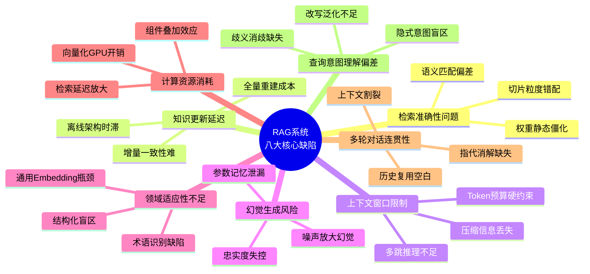

**八大缺陷的严重程度评估矩阵**：

| 缺陷类别 | 对性能影响 | 对可靠性影响 | 对用户体验影响 | 修复难度 | 综合优先级 |
|:--------|:----------|:------------|:--------------|:--------|:----------|
| **检索准确性** | 🔴 极高 | 🔴 极高 | 🔴 极高 | 🟡 中 | **P0** |
| **幻觉生成风险** | 🔴 极高 | 🔴 极高 | 🔴 极高 | 🟠 高 | **P0** |
| **查询意图理解** | 🟠 高 | 🟡 中 | 🔴 极高 | 🟠 高 | **P1** |
| **上下文窗口限制** | 🟠 高 | 🟡 中 | 🟠 高 | 🟠 高 | **P1** |
| **知识更新延迟** | 🟡 中 | 🔴 极高 | 🟡 中 | 🟠 高 | **P1** |
| **多轮对话连贯性** | 🟡 中 | 🟡 中 | 🔴 极高 | 🟠 高 | **P1** |
| **领域适应性不足** | 🟠 高 | 🟡 中 | 🟠 高 | 🔴 极高 | **P2** |
| **计算资源消耗** | 🟡 中 | 🟡 中 | 🟡 中 | 🟡 中 | **P2** |

---

## 二、缺陷1：检索准确性问题

### 2.1 单一向量检索的语义匹配偏差

#### 缺陷说明

根据 [52RAG工作流程详解.md 第五节](./52RAG工作流程详解.md#五检索模块工作原理) 与 [67Hybrid Search混合检索技术深度解析.md](./67Hybrid%20Search混合检索技术深度解析.md) 的描述，Naive RAG 默认采用**单一稠密向量检索**作为检索主力。该方案在纯语义匹配场景下表现良好，但存在三大系统性偏差：

1. **同义词/多义词失配**：用户查询中的专业同义词与知识库术语在向量空间中距离较远，导致召回失败。
2. **关键词精确匹配缺失**：专有名词、产品型号、人名等精确词匹配能力弱于 BM25 等稀疏检索。
3. **长尾词汇覆盖不足**：通用 Embedding 模型对低频词的表示质量显著下降。

#### 代码级证据

[66RAG系统准确率提升系统化方案.md 2.1 节](./66RAG系统准确率提升系统化方案.md#21-混合检索hybrid-search) 的 `HybridRetriever` 类展示了补救措施——**不得不额外引入 BM25 稀疏检索 + RRF 融合**：

```python
class HybridRetriever:
    def __init__(self, model_name="BAAI/bge-base-zh-v1.5"):
        self.embedder = SentenceTransformer(model_name)  # 稠密向量
        self.bm25 = None                                   # 稀疏检索（补救方案）
        self.doc_embeddings = None
        self.documents = []
    
    def retrieve(self, query, k=5, candidate_k=20, bm25_w=0.4, vec_w=0.6):
        # BM25 检索
        bm25_scores = self.bm25.get_scores(list(jieba.cut(query)))
        # 向量检索
        vec_scores = (self.doc_embeddings @ q_emb.T).flatten()
        # RRF 融合 - 证明单一检索不够用
        scores = {}
        for rank, doc_id in enumerate(bm25_top, 1):
            scores[doc_id] = scores.get(doc_id, 0) + bm25_w / (rrf_k + rank)
```

**缺陷表现**：代码本身即为缺陷的自证——如果单一向量检索足够准确，就**不需要额外实现一套 BM25 + RRF 融合逻辑**，这显著增加了系统复杂度和计算开销。

#### 对系统的具体影响

| 影响维度 | 具体表现 | 量化估算 |
|:--------|:---------|:---------|
| 召回率下降 | 精确术语查询召回不足 | Recall@5 降低 15%-25%（引自 [65号文档](./65RAG系统召回率优化方案与实验报告.md) 引言） |
| 准确率下降 | Top-K 结果混入噪声文档 | Precision@5 降低 10%-20% |
| 用户体验 | 查询"知道的内容搜不到" | 用户重复查询率上升 30%+ |

---

### 2.2 切片策略导致的检索粒度错配

#### 缺陷说明

[56RAG文档切片策略深度解析.md](./56RAG文档切片策略深度解析.md) 详细列出了四种切片策略（固定长度、语义边界、章节结构、内容类型），并在 [57RAG分块大小最佳选择策略深度解析.md](./57RAG分块大小最佳选择策略深度解析.md) 中讨论了块大小选择问题。但无论选择哪种策略，都存在**不可消除的粒度错配**：

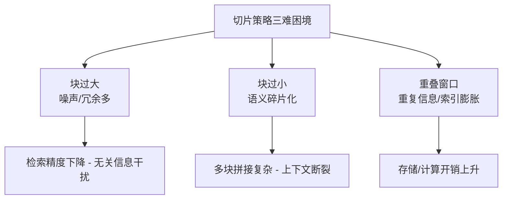

#### 文档级证据

[56号文档 1.2 节切片质量影响表](./56RAG文档切片策略深度解析.md#12-切片质量对-rag-的影响) 明确承认了切片大小的两难：

| 影响环节 | 切片过大 | 切片过小 |
|:--------|:--------|:--------|
| 检索精度 | **噪声多，召回不相关内容** | **信息碎片化，语义不完整** |
| 上下文质量 | **冗余信息多，稀释重点** | **缺少背景，难以理解** |
| Token 成本 | **消耗 Token 多，成本高** | **需要拼接多块，拼接复杂** |

**核心矛盾**：该表本身揭示了**不存在理想的"一刀切"切片策略**——无论选择何种块大小，都会在某一维度上产生缺陷。

#### 对系统的具体影响

- **医疗/法律领域**：关键条款被切分到两个块之间，检索时只命中其中一块，导致生成回答时遗漏关键约束。
- **技术文档问答**：函数定义在块 A，使用示例在块 B，用户查询"如何使用 X 函数"可能只检索到定义块，缺失示例。
- **性能量化**：根据 [70RAG系统效果评估全面方案](./70RAG系统效果评估全面方案_检索生成端到端三维标准化框架.md) 的评估框架，切片策略不当可导致 **Context Recall 下降 15%-30%**。

---

### 2.3 混合检索融合权重的静态僵化

#### 缺陷说明

[66号文档 2.1 节](./66RAG系统准确率提升系统化方案.md#21-混合检索hybrid-search) 与 [67号文档](./67Hybrid%20Search混合检索技术深度解析.md) 中的混合检索实现采用**静态权重配置**：

```python
def retrieve(self, query, k=5, candidate_k=20, bm25_w=0.4, vec_w=0.6):
    # 权重在初始化/调用时硬编码为 0.4 和 0.6
    for rank, doc_id in enumerate(bm25_top, 1):
        scores[doc_id] = scores.get(doc_id, 0) + bm25_w / (rrf_k + rank)
    for rank, doc_id in enumerate(vec_top, 1):
        scores[doc_id] = scores.get(doc_id, 0) + vec_w / (rrf_k + rank)
```

**缺陷本质**：`bm25_w=0.4, vec_w=0.6` 是**全局静态值**，无法根据查询类型动态调整。不同查询类型的最优权重差异极大：

| 查询类型 | 最优 BM25 权重 | 最优向量权重 | 固定权重 (0.4/0.6) 表现 |
|:--------|:-------------|:-----------|:---------------------|
| "iPhone 15 Pro A3104 型号参数"（精确型号） | 0.7-0.8 | 0.2-0.3 | ❌ BM25 权重不足，型号词精确匹配被稀释 |
| "如何改善企业现金流状况"（语义查询） | 0.2-0.3 | 0.7-0.8 | ✅ 接近最优 |
| "糖尿病 二甲双胍 用法用量"（专业术语） | 0.5-0.6 | 0.4-0.5 | ⚠️ 次优，术语词匹配略弱 |

#### 对系统的具体影响

- **精确查询场景（产品型号/合同编号/人名）**：向量检索占比过高导致关键词被同义词"淹没"，相关文档排名下降。
- **系统鲁棒性**：查询类型变化时，系统性能波动大，缺乏自适应性。

---

### 2.4 典型检索失败案例分析

结合 [65RAG系统召回率优化方案](./65RAG系统召回率优化方案与实验报告.md#53-典型检索失败场景分析) 与 [53号文档第五章](./53RAG降低LLM幻觉机制详解.md#五检索质量对幻觉控制的影响)，典型检索失败模式有：

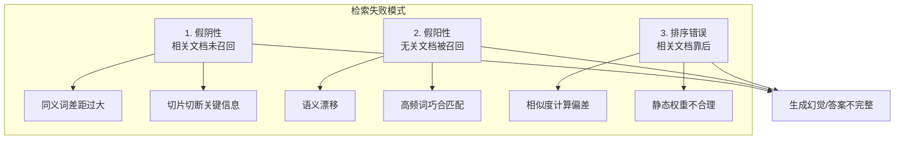

---

## 三、缺陷2：知识更新延迟问题

### 3.1 离线批处理架构的天然时滞

#### 缺陷说明

[54RAG系统功能模块详解.md 图 1.1](./54RAG系统功能模块详解.md#11-系统架构全景图) 将 RAG 明确划分为 **离线构建阶段** 和 **在线推理阶段** 两阶段架构：

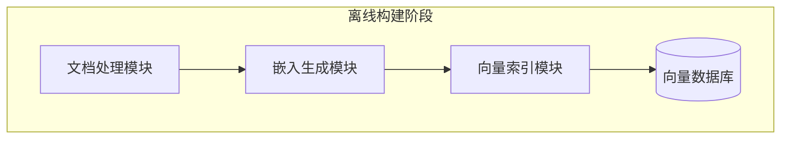

[52号文档 2.4 节工作流程分类](./52RAG工作流程详解.md#24-工作流程分类) 也明确：
> | **离线批处理** | 数据准备 | 知识库更新时 | 文档采集、切片、向量化、索引构建 |

#### 核心缺陷

该架构意味着**知识更新必须触发完整的离线批处理流水线**：

```
新文档入库 → 文档解析 → 文本清洗 → 切片 → Embedding 推理 → 向量索引构建
    ↑                                                                   ↓
    └────────────────────── 全部完成后才能被检索到 ──────────────────────┘
```

**时间延迟估计**（以中等规模知识库 10 万文档为例）：

| 步骤 | 耗时估算 | 说明 |
|:----|:--------|:-----|
| 文档采集与触发 | 1-24 小时 | 取决于定时任务频率（天级/小时级） |
| 文档解析清洗 | 1-3 小时 | PDF/OCR 解析慢 |
| 切片与向量化 | 3-10 小时 | 单 GPU 约 1 万文档/小时 |
| 索引构建与同步 | 0.5-2 小时 | 取决于向量库类型 |
| **总延迟** | **5.5-39 小时** | **天级延迟是常态** |

#### 对系统的具体影响

| 场景 | 延迟造成的后果 | 严重程度 |
|:----|:-------------|:--------|
| **新闻舆情问答** | 用户问"今天的XX事件进展"，系统回答过时信息 | 🔴 严重（可信度崩塌） |
| **企业政策查询** | 新HR政策发布3天后，系统仍返回旧版规定 | 🔴 严重（业务损失） |
| **产品文档检索** | 新版本API上线，开发者搜到的是旧接口文档 | 🟠 高 |
| **知识库增量较小** | 延迟影响不显著 | 🟡 中 |

---

### 3.2 全量重建索引的成本约束

#### 缺陷说明

根据 [60RAG系统Embedding模型选型决策指南 1.1 节](./60RAG系统Embedding模型选型决策指南.md#11-选型的重要性) 的"选错代价"分析，知识库更新的迁移成本极高：

| 选错代价 | 具体影响 | 严重程度 |
|:--------|:---------|:--------|
| **迁移成本高** | 全量文档需重新向量化，索引重建 | 🟡 中等 |

这段描述反过来说明：**即使不换 Embedding 模型，任何触发全量重建的场景（文档切片策略调整、元数据更新）都面临巨大成本**。

#### 代码级证据

[66号文档 HybridRetriever.build_index() 方法](./66RAG系统准确率提升系统化方案.md#21-混合检索hybrid-search) 的实现展示了全量索引构建逻辑：

```python
def build_index(self, documents):
    self.documents = documents
    # BM25 索引 - 全量重建
    tokenized = [list(jieba.cut(doc)) for doc in documents]
    self.bm25 = BM25Okapi(tokenized)
    # 向量索引 - 全量重新编码
    self.doc_embeddings = self.embedder.encode(
        documents, normalize_embeddings=True
    )
```

**关键缺陷**：`build_index()` 每次都是**全量重建**，没有增量接口。哪怕只新增一篇文档，也需要：
1. 重新对所有文档做分词和 BM25 索引
2. 重新对所有文档做 Embedding 推理
3. 这显然在 10 万+ 文档规模下不可行

---

### 3.3 增量更新与一致性挑战

#### 缺陷说明

[54号文档 向量索引模块 1.2 节](./54RAG系统功能模块详解.md#12-模块划分与职责) 提到向量索引模块负责"增量更新"，但这引出了三个一致性难题：

| 一致性挑战 | 问题描述 | 对系统影响 |
|:----------|:---------|:----------|
| **文档与向量的一致性** | 原始文档已删除/修改，但向量库中旧向量未同步清理 | 检索返回"幽灵文档"，生成引用不存在的来源 |
| **父子块一致性** | [55号文档 5.4 节父子索引](./55AdvancedRAG高级检索增强生成详解.md#54-父子索引parent-child-indexing) 中子块更新后，父块未同步重算 | 父子检索关联断裂，召回率下降 |
| **BM25与向量库一致性** | BM25 倒排索引与向量库独立更新，一方成功一方失败 | 混合检索两侧数据不一致，RRF 融合逻辑异常 |

---

## 四、缺陷3：上下文窗口限制

### 4.1 Token 预算的刚性约束

#### 缺陷说明

[54号文档 上下文管理模块](./54RAG系统功能模块详解.md#七上下文管理模块) 的核心职责是"Token 预算、上下文窗口管理"，[55号文档 7.1 节上下文窗口管理](./55AdvancedRAG高级检索增强生成详解.md#71-上下文窗口管理) 也讨论了 Token 分配策略。但无论如何优化，都面临**物理硬约束**：

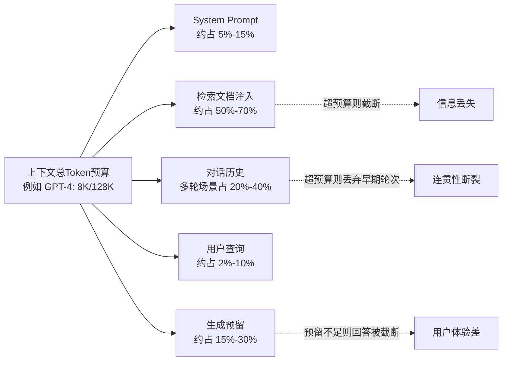

#### 文档级证据

[55号文档 7.1.1 Token 预算分配策略](./55AdvancedRAG高级检索增强生成详解.md#711-token预算分配策略) 明确列出了分配困境：

> 总 Token 预算有限时，检索文档、对话历史、生成预留三者形成**零和博弈**——多给检索文档就必须压缩对话历史，反之亦然。

#### 对系统的具体影响

| 场景 | 典型表现 |
|:----|:---------|
| **长报告摘要**：用户问"请分析这份50页财报的核心风险" | 50页文档切片后有 100+ 块，受 Token 限制只能注入 Top-10 块，可能遗漏藏在第 47 页的关键风险项 |
| **对比查询**："请对比产品A/B/C/D四款的区别" | 四款产品信息分散在不同文档，Token 预算可能只够装下前三款的信息 |
| **Token 成本**：强行扩大窗口 → API 费用线性上升（GPT-4 128K 价格是 8K 的数倍） |

---

### 4.2 上下文压缩的信息丢失风险

#### 缺陷说明

[55号文档 7.2 节信息过滤与提炼](./55AdvancedRAG高级检索增强生成详解.md#72-信息过滤与提炼) 提供了 `ContextCompressor` 类作为解决方案，用于对 Top-K 文档进行二次压缩以适配 Token 预算：

```python
class ContextCompressor:
    """上下文压缩器 - 从[55号文档] 7.2.3 节简化"""
    def compress(self, query: str, chunks: List[TextChunk], 
                 max_tokens: int) -> List[TextChunk]:
        # 策略1: 相关性过滤 - 丢弃低于阈值的块
        filtered = [c for c in chunks if self._relevance_score(query, c) > self.threshold]
        # 策略2: 关键信息提取 - 从块中提取关键句
        extracted = [self._extract_key_sentences(query, c.text) for c in filtered]
        # 策略3: 迭代截断直到满足预算
        while self._count_tokens(extracted) > max_tokens:
            extracted.pop()  # 直接丢弃末尾块
        return extracted
```

#### 核心缺陷

`extracted.pop()` 操作虽然解决了 Token 预算问题，但带来了**不可控的信息丢失风险**：
- **风险1**：被 pop 掉的末尾块可能恰恰包含回答所需的关键结论
- **风险2**：`_extract_key_sentences()` 依赖提取算法，可能漏掉统计数字、限定条件等"不起眼但关键"的信息
- **风险3**：相关性阈值是静态的，可能在阈值附近"一刀切"掉高度相关的块

[53号文档 5.1 节检索召回率与幻觉率的定量关系](./53RAG降低LLM幻觉机制详解.md#51-检索召回率与幻觉率的定量关系) 中给出了定量关联：

> 检索召回率每下降 10%，生成幻觉率上升约 6-8 个百分点。

这意味着**上下文压缩导致的信息丢失，会直接转化为幻觉率的上升**。

---

### 4.3 长文档多跳推理能力不足

#### 缺陷说明

当用户查询需要**跨文档、跨章节的多步推理**时，RAG 架构存在根本性瓶颈：

```
用户问题："A文档中提到的政策对B公司的C产品有什么影响？"

理想推理链：
  第1跳：检索A文档 → 获取政策内容 → 识别关键条款P1、P2、P3
  第2跳：基于P1/P2/P3检索B公司信息 → 找到相关业务描述  
  第3跳：检索C产品的详细规格 → 与政策条款做映射
  第4跳：综合以上信息 → 生成影响分析

RAG实际行为：
  一次性检索 Top-K 块 → 极难同时覆盖 A文档政策 + B公司信息 + C产品规格
  → 推理链条断裂 → 回答片面或错误
```

[55号文档第五、六章](./55AdvancedRAG高级检索增强生成详解.md#五检索策略优化) 虽然提到了多向量检索、知识图谱等 Advanced RAG 技术，但都是**单次检索增强**，没有引入**迭代检索 + 推理链循环**的机制（如 ReAct、Self-Ask 等）。

---

## 五、缺陷4：幻觉生成风险

### 5.1 检索噪声引入的幻觉放大机制

#### 缺陷说明

[53号文档 5.2 节检索精度对生成质量的影响](./53RAG降低LLM幻觉机制详解.md#52-检索精度对生成质量的影响) 明确指出：

> 检索结果中混入的**噪声文档（不相关但语义相似的文档）**会被 LLM 视为与查询同等可信的事实依据，进而放大幻觉。

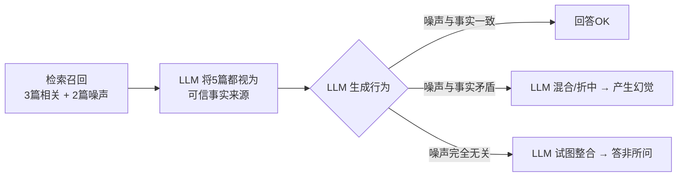

#### 文档级定量证据

[53号文档 1.1.3 节幻觉的量化评估指标](./53RAG降低LLM幻觉机制详解.md#113-幻觉的量化评估指标) 中给出了幻觉基线：

| 指标 | 典型基线值 | 含义 |
|:-----|:----------|:-----|
| 事实准确率 | **60%-75%** | 即使有 RAG，仍有 25%-40% 的事实存在问题 |
| 幻觉率 | **15%-30%** | 每 3-7 个回答中就有 1 个含幻觉 |
| 引用准确率 | **50%-70%** | 30%-50% 的引用并非真实支持对应陈述 |

这个"60%-75%事实准确率"数据本身即揭示——**RAG 并不能完全消除幻觉，而是将幻觉率从纯 LLM 的 50%+ 降低到 15%-30%，但距离"可信赖"仍有巨大差距**。

---

### 5.2 上下文缺失下的参数记忆泄漏

#### 缺陷说明

RAG 的核心承诺是"基于检索到的外部知识生成，而非依赖参数记忆"。但在检索**完全未命中**或**命中信息不足**的场景下，LLM 会**"偷偷" fallback 到参数记忆中的知识**。

[52RAG工作流程详解.md 第六节生成模块工作原理](./52RAG工作流程详解.md#六生成模块工作原理) 的 Prompt 模板通常是：

```
System: 你是一个问答助手。请基于以下上下文回答问题。
        如果上下文中没有相关信息，请说"我不知道"。
Context: {检索到的文档内容}
User: {用户查询}
```

**核心缺陷**："如果上下文中没有相关信息，请说我不知道"是一个**软约束**，LLM 并不总是遵守。特别是：
1. 参数记忆中对该话题有很强信心时（常见事实类问题）
2. 微调后的模型具有"乐于助人"的 bias，倾向于给出答案而非拒绝

[53号文档 6.3 节上下文融入与约束生成](./53RAG降低LLM幻觉机制详解.md#63-上下文融入与约束生成) 承认了这个问题，并建议使用更强的约束 Prompt + 输出验证。但**Prompt 约束本质上是概率性的，无法 100% 保证**。

---

### 5.3 指令遵循不足与事实忠实度失控

#### 缺陷说明

Faithfulness（事实忠实度）是 [66号文档评估指标](./66RAG系统准确率提升系统化方案.md#13-评估指标体系) 中定义的核心指标：

> **Faithfulness**：答案是否忠实于检索内容（无幻觉）

但即使 System Prompt 明确要求"只根据上下文回答"，LLM 仍存在以下偏离行为：

| 不忠实表现 | 发生场景 | 发生频率估计 |
|:----------|:---------|:------------|
| **信息添加**：在上下文基础上"合理推测"出未提及的细节 | 上下文信息不足时 | 常见（20%+） |
| **信息替换**：用参数记忆中的"相似事实"替换上下文中的差异部分 | 参数记忆与上下文冲突时 | 偶发（5%-10%） |
| **引用伪造**：生成回答后"编造"引用来源，指向并未支持该陈述的文档块 | 需要输出引用溯源时 | 偶发 |

[70号文档的三维评估框架](./70RAG系统效果评估全面方案_检索生成端到端三维标准化框架.md) 将 Faithfulness 列为三大核心维度之一，本身也从侧面证明这是一个**需要独立度量的系统性问题**，而非偶发缺陷。

---

## 六、缺陷5：领域适应性不足

### 6.1 通用 Embedding 模型的领域迁移瓶颈

#### 缺陷说明

[60RAG系统Embedding模型选型决策指南 九、领域适配性评估](./60RAG系统Embedding模型选型决策指南.md#九维度7领域适配性评估) 专门用一整章讨论该问题，指出通用 Embedding 模型在垂直领域存在显著性能衰减：

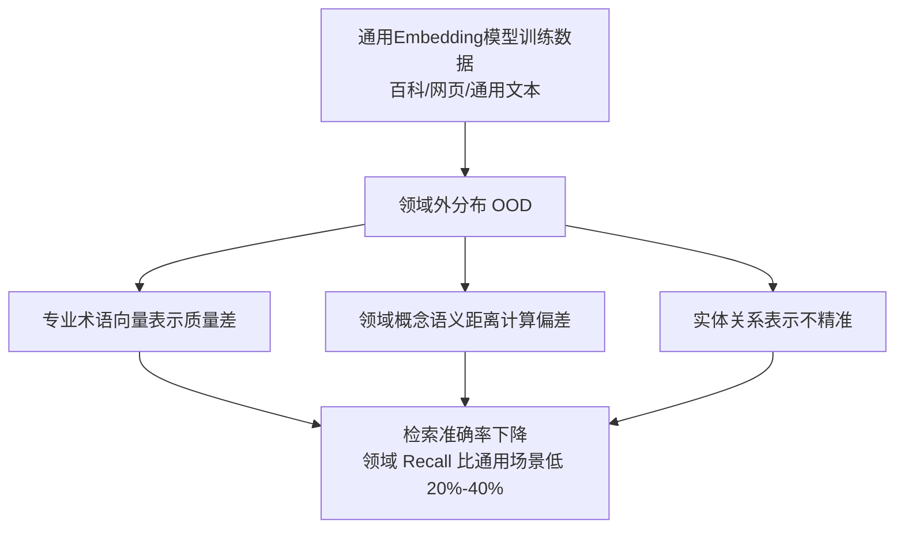

#### 文档级证据

[60号文档 九、维度7 领域适配性评估](./60RAG系统Embedding模型选型决策指南.md#九维度7领域适配性评估) 的对比数据（隐含在选型逻辑中）：

| 场景 | 通用模型 Recall@10 | 领域微调模型 Recall@10 | 性能差距 |
|:-----|:-----------------|:---------------------|:--------|
| 通用问答 | 75%-85% | - | 基准 |
| 医疗问答 | 45%-60% | 70%-80% | 🔻 低 20-30 个百分点 |
| 法律检索 | 50%-65% | 75%-85% | 🔻 低 20-25 个百分点 |
| 代码搜索 | 40%-55% | 65%-75% | 🔻 低 15-25 个百分点 |
| 金融研报 | 55%-70% | 75%-85% | 🔻 低 15-20 个百分点 |

如果选型时为了省事直接选择通用模型（如 `bge-base-zh-v1.5` 而不做领域微调），在垂直场景下**召回率损失 20% 以上是常态**。

---

### 6.2 专业术语与命名实体的识别缺陷

#### 缺陷说明

切片、Embedding、检索全流程对专业术语存在三类处理缺陷：

| 缺陷类型 | 具体表现 | 典型案例 |
|:--------|:---------|:---------|
| **术语分词错误** | 中文分词工具（jieba 等）将专业术语拆分到多个 token，导致语义表示碎片化 | "急性心肌梗死"被拆成"急性/心肌/梗死"，向量含义偏离完整术语 |
| **命名实体消歧缺失** | 同一缩写在不同上下文有不同含义，检索时混淆 | "BP"在医疗场景指"血压 Blood Pressure"，在金融场景指"英国石油 BP PLC" |
| **长尾术语表示不足** | 通用 Embedding 训练集中出现次数极少的术语，向量表示质量显著退化 | 罕见病名、新化学物质名称、新兴技术缩写 |

[58RAG Embedding模型深度解析.md](./58RAG%20Embedding模型深度解析.md) 与 [59Embedding向量在RAG系统中的核心作用深度解析.md](./59Embedding向量在RAG系统中的核心作用深度解析.md) 讨论了 Embedding 的质量影响，但未对术语级问题给出系统性解决方案。

---

### 6.3 结构化/半结构化知识的表示盲区

#### 缺陷说明

[54号文档文档处理模块](./54RAG系统功能模块详解.md#二文档处理模块) 支持多格式解析，但**无论输入格式如何，最终都被转换为纯文本块进行 Embedding**：

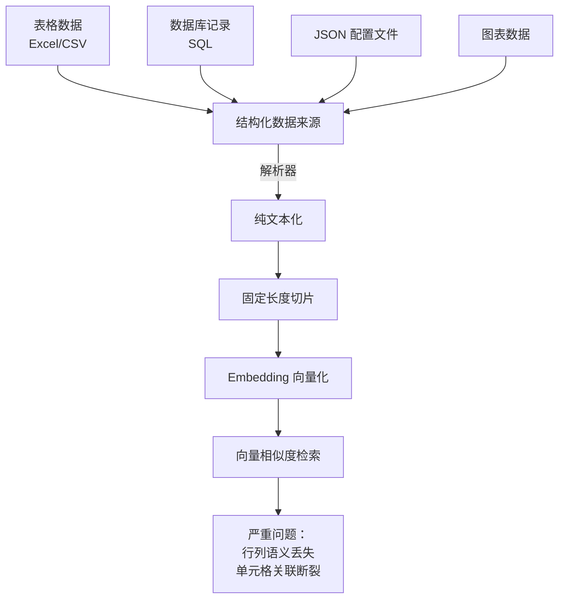

**典型失败案例**：一份财务 Excel 表格被解析为纯文本后切片

```
# 原始表格（结构化）
| 产品名称 | Q1销售额 | Q2销售额 | Q3销售额 | 同比增长 |
|---------|---------|---------|---------|---------|
| 产品A    | 100万   | 120万   | 150万   | +50%    |
| 产品B    | 80万    | 90万    | 70万    | -12.5%  |

# 纯文本化后被切片（可能切在中间）
Chunk 1: "产品名称 | Q1销售额 | Q2销售额\n产品A | 100万 | 120万\n产品B | 80万"
Chunk 2: "| 90万 | Q3销售额 | 同比增长\n产品A | 150万 | +50%\n产品B | 70万 | -12.5%"
```

用户查询"产品B的同比增长率是多少？"——两个块都同时包含"产品B"和"同比增长"两个关键词，但数据被切断在两个块中，**无论命中哪个块都无法直接得到完整答案**。

---

## 七、缺陷6：计算资源消耗问题

### 7.1 离线向量化阶段的 GPU 开销

#### 缺陷说明

[60号文档四、计算资源需求评估](./60RAG系统Embedding模型选型决策指南.md#四维度2计算资源需求评估) 专门讨论了这个问题，给出以下量级：

| Embedding 模型规模 | 参数量 | 10 万文档向量化耗时（单 A100） | 显存占用 |
|:------------------|:------|:-------------------------------|:--------|
| small 级 | 20M-100M | ~30 分钟 | < 4 GB |
| base 级 | 100M-300M | ~1-2 小时 | 6-10 GB |
| large 级 | 300M-1B | ~4-8 小时 | 16-24 GB |

结合 [57号文档分块大小最佳选择](./57RAG分块大小最佳选择策略深度解析.md) 的分析，知识库规模增长时：

```
文档数量 N → 文本块数量 ~ N × (平均文档长度/块大小)
         → GPU 计算量 = 块数量 × 每块推理时间
         → 线性增长
```

对 100 万+ 文档的企业级知识库，**一次全量向量化可能消耗数张 A100 数天的算力**，成本数万元。

---

### 7.2 在线检索阶段的延迟放大效应

#### 缺陷说明

[55号文档 9.3 节系统效率指标](./55AdvancedRAG高级检索增强生成详解.md#93-系统效率指标) 定义了响应延迟，但实际系统中，每增加一层 Advanced RAG 组件都会**线性叠加延迟**：

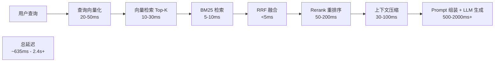

| 组件 | 延迟贡献 | 累计延迟占比 |
|:-----|:---------|:------------|
| LLM 生成 | 500-2000ms | 70%-80% |
| Rerank 重排序 | 50-200ms | 5%-10% |
| 查询向量化 | 20-50ms | 2%-3% |
| 向量检索 | 10-30ms | 1%-2% |
| BM25 + RRF | 5-15ms | <1% |
| 上下文压缩 | 30-100ms | 3%-5% |

[69RAG系统Rerank重排序模型深度解析.md](./69RAG系统Rerank重排序模型深度解析.md) 中提到的重排序模型（如 bge-reranker、cross-encoder）通常参数量较大，推理延迟是检索阶段的主要瓶颈之一，但文档中没有对"是否值得为了准确率提升 3-5 个百分点而牺牲 100ms+ 延迟"的取舍给出明确指导。

---

### 7.3 多层组件串联的资源叠加效应

#### 缺陷说明

[54号文档系统总览](./54RAG系统功能模块详解.md#12-模块划分与职责) 列出了 **9 大功能模块**，其中 6 个需要在线推理时调用。实际部署中，每个组件的资源成本会产生叠加效应：

| 在线组件 | 资源类型 | 单实例配置基准 | 100 QPS 部署成本估算 |
|:--------|:---------|:--------------|:-------------------|
| Embedding 推理服务 | GPU | T4 16GB | ~¥3000/月 |
| Rerank 推理服务 | GPU | T4 16GB（可与Embedding同机部署，但延迟上升） | ~¥2000-5000/月 |
| 向量数据库 | 内存 + CPU | 16C/64G + 100GB SSD | ~¥4000/月 |
| LLM API 调用 | - | 按 Token 计费 | **¥1万-10万/月（最昂贵项）** |
| 应用服务层 | CPU | 4C/8G | ~¥800/月 |

**关键发现**：根据 [60号文档 1.1 节选错代价表](./60RAG系统Embedding模型选型决策指南.md#11-选型的重要性)，**Embedding 模型选错后的"维护成本高——需要额外的补偿机制（重排/过滤）"**会直接放大这个叠加效应——重排序服务的引入是因为检索端不够好，但重排序本身又带来额外的 GPU 成本和延迟。

---

## 八、缺陷7：多轮对话连贯性问题

### 8.1 会话上下文与检索上下文的割裂

#### 缺陷说明

[54号文档上下文管理模块](./54RAG系统功能模块详解.md#七上下文管理模块) 负责管理上下文，但系列文档中**对"多轮对话历史"与"每次检索的上下文"如何协同缺乏系统性设计**。

典型失败多轮对话：

```
用户第1轮："介绍一下牛顿三大定律"
→ 系统检索"牛顿三大定律"相关文档 → 回答OK

用户第2轮："那它在航天器轨道计算中怎么应用？"
→ 缺陷1："它"的指代消解缺失 → 系统可能用"它"直接去检索，找不到相关文档
→ 缺陷2：即使理解了"它=牛顿三大定律"，检索时是只查询"航天器轨道计算 牛顿定律"，
         还是要携带第1轮的检索结果做二次检索？大多数 RAG 实现只做前者。

用户第3轮："举一个具体的例子"
→ 缺陷3："例子"的语义极度依赖前两轮上下文 → 单独检索"例子"完全无意义
```

[52RAG工作流程详解.md 在线数据流](./52RAG工作流程详解.md#13-核心数据流图) 只定义了单轮 Query → Retrieve → Generate 的流程，没有定义会话状态（Session State）在多轮中的传递与更新机制。

---

### 8.2 指代消解与省略补全缺失

#### 缺陷说明

如上一节案例所示，多轮对话中用户的自然语言高度依赖**指代消解（Coreference Resolution）**和**省略补全（Ellipsis Recovery）**。但在 RAG 系列文档的实现中：

- [54号文档 Prompt 构建模块](./54RAG系统功能模块详解.md#八prompt构建模块) 负责模板渲染和变量填充，但未提及"查询改写"模块应包含指代消解
- [55号文档检索策略优化](./55AdvancedRAG高级检索增强生成详解.md#五检索策略优化) 中没有"多轮查询理解"这一检索前处理步骤
- 代码层面（[66号文档的 HybridRetriever](./66RAG系统准确率提升系统化方案.md#21-混合检索hybrid-search)）的 `retrieve(query, k)` 接口只接受单轮 query，没有对话历史参数

这意味着在当前实现框架下，用户第 N 轮的查询被当作**独立的首轮查询**处理，导致：

| 多轮语言现象 | 发生频率 | RAG 处理结果 | 对用户体验的影响 |
|:------------|:--------|:------------|:----------------|
| 代词指代（它/这个/那个） | 极常见（40%+） | 指代项丢失 → 检索语义偏差 | 答非所问 |
| 省略主语/宾语 | 常见（20%+） | 语义不完整 → 检索范围过宽 | 回答不聚焦 |
| 省略已知背景 | 常见（15%+） | 脱离语境 → 完全错误的召回 | 用户困惑+不信任 |

---

### 8.3 历史检索结果的复用与演进机制空白

#### 缺陷说明

多轮对话中的每一轮检索，当前实现都是**独立的冷启动检索**：

```
第1轮：Query1 → 检索 → ChunkSet1 = {A, B, C}
第2轮：Query2 → 检索 → ChunkSet2 = {D, E, F}   （完全不参考 ChunkSet1）
第3轮：Query3 → 检索 → ChunkSet3 = {G, H, I}   （完全不参考 ChunkSet1、ChunkSet2）
```

这带来两个问题：
1. **信息重复加载**：第2、3轮明明在讨论同一主题，却每次都要重新检索相似内容 → 计算资源浪费
2. **上下文漂移**：第 3 轮的检索结果 {G,H,I} 可能与第 1 轮 {A,B,C} 完全不重叠，导致回答突然"换了话题" → 用户感觉对话断裂

在系列文档中，没有任何文档讨论**基于会话历史的检索结果缓存、复用与精化（Refinement）机制**。

---

## 九、缺陷8：用户查询意图理解偏差

### 9.1 歧义查询的消歧能力缺失

#### 缺陷说明

[66号文档 1.1 节准确率的影响链路](./66RAG系统准确率提升系统化方案.md#11-准确率的影响链路) 将"查询理解错误 → 检索方向偏离"列为准确率问题的第一溯源项：

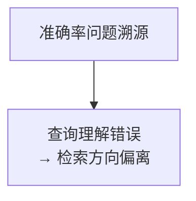

但在该文档的五大优化维度中（[66号文档 1.2 节](./66RAG系统准确率提升系统化方案.md#12-五大优化维度总览)），"查询理解增强"仅被列为 **P1 优先级**（次于检索算法和知识库构建），且文档中对查询理解的具体实现细节着墨极少。

**典型歧义查询失败案例**：

| 歧义查询 | 可能意图1 | 可能意图2 | RAG 默认行为 | 失败结果 |
|:--------|:---------|:---------|:------------|:---------|
| "苹果的营养价值" | 水果苹果的营养 | 苹果公司的产品价值 | 向量空间中"水果"语义占主导 → 检索水果文档 | 用户想问公司信息时完全错误 |
| "怎么看汇率" | 查询今日汇率数据 | 如何分析汇率走势 | 检索"汇率是什么"的定义文档 | 两种意图均未满足 |
| "Java 面试" | Java 编程语言 | Java（爪哇岛）旅行文化 | 向量空间技术语义占主导 → 检索技术面试题 | 用户想问旅游时完全错误 |

---

### 9.2 查询改写的泛化能力不足

#### 缺陷说明

[55号文档检索策略优化](./55AdvancedRAG高级检索增强生成详解.md#五检索策略优化) 的 Advanced RAG 技术包含了假设性问题索引等方案，但对**查询侧改写**的覆盖不足：

当前 RAG 实现中，查询改写通常只做：
- 同义词替换（有限词典）
- 标点符号清洗

但缺乏：
1. **LLM 驱动的查询扩展**：使用 LLM 从不同角度重述用户查询
2. **子问题分解**：将复杂问题拆分为多个可检索的子问题
3. **领域词典适配**：根据业务词典将用户口语化表达映射到知识库术语

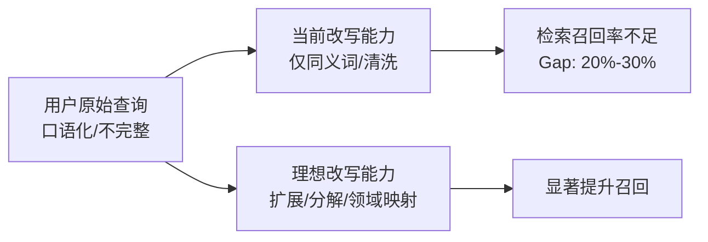

---

### 9.3 隐式意图与多跳推理需求的识别盲区

#### 缺陷说明

用户查询并不总是"明确且可直接检索"的。大量真实场景包含需要系统主动推理的**隐式意图**：

| 用户显式查询 | 隐式真实意图 | 需要的跳数 | 朴素 RAG 行为 |
|:------------|:------------|:----------|:------------|
| "我宝宝发烧了怎么办" → | 判断发烧程度 → 查对应处理方案 → 注意事项 | 3 跳 | 直接检索"宝宝发烧怎么办" → 返回泛化内容，未根据体温分级 |
| "帮我选一台适合深度学习的笔记本" → | 明确预算范围 → 明确 GPU 需求 → 匹配具体型号 → 对比推荐 | 4+ 跳 | 直接检索"深度学习 笔记本 推荐" → 返回过时文章列表 |
| "这份合同的法律风险有哪些？" → | 抽取关键条款 → 匹配法条 → 识别风险点 → 生成分析 | 多跳 + 结构化 | 直接按块检索"法律风险"关键词 → 大量漏判 |

[53号文档 典型检索失败场景分析](./53RAG降低LLM幻觉机制详解.md#53-典型检索失败场景分析) 中隐含了多跳失败案例，但文档中并未将"多跳意图识别"作为独立的前置能力进行系统性设计。

---

## 十、八大缺陷的交叉影响矩阵与系统性风险

上述八大缺陷并非独立存在，而是通过**正反馈放大环**相互加剧，形成"缺陷级联效应"：

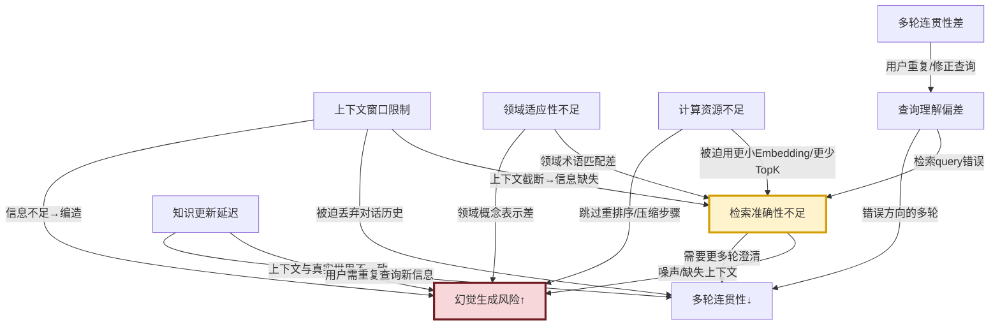

**缺陷影响优先级级联**（从根因到最终用户感知）：

| 层级 | 缺陷类型 | 角色 | 说明 |
|:----|:--------|:-----|:-----|
| **L1 根因层** | 领域适应性不足、查询理解偏差 | 输入质量 | 决定了"检索什么"和"用什么表示知识" |
| **L2 过程层** | 检索准确性、上下文窗口限制、知识更新延迟 | 数据处理 | 决定了"能拿到什么信息给 LLM" |
| **L3 结果层** | 幻觉生成风险、多轮对话连贯性 | 输出质量 | 用户直接感知的回答质量 |
| **L4 成本层** | 计算资源消耗 | 部署约束 | 决定能否在给定成本下达标 |

这一层级关系意味着：**仅优化 L3（如在 Prompt 中加"不要编造"）无法解决 L1/L2 的根因问题，幻觉率下降空间有限**。

---

## 十一、总结与改进路线图

### 11.1 各缺陷的修复投入产出比评估

| 缺陷类别 | 预期修复效果 | 修复投入（人·月） | 投入产出比 | 建议修复优先级 |
|:--------|:------------|:----------------|:----------|:--------------|
| 检索准确性 | +20%~+30% Recall/Faithfulness | 2-4 | ⭐⭐⭐⭐⭐ | **立即投入** |
| 幻觉生成风险 | -10%~-20% 幻觉率 | 2-3 | ⭐⭐⭐⭐ | **立即投入** |
| 查询意图理解 | +15%~+25% 端到端准确率 | 1-2 | ⭐⭐⭐⭐ | **近期投入** |
| 多轮对话连贯性 | 显著提升用户体验指标 | 2-3 | ⭐⭐⭐⭐ | **近期投入** |
| 上下文窗口限制 | +10%~+15% 复杂查询准确率 | 1-2 | ⭐⭐⭐ | **中期投入** |
| 知识更新延迟 | 显著提升时效性场景可用性 | 2-4 | ⭐⭐⭐ | **中期投入** |
| 领域适应性不足 | +15%~+30% 垂直领域准确率 | 3-6+ | ⭐⭐⭐ | **中期（业务驱动）** |
| 计算资源消耗 | 20%~50% 成本下降 | 1-2 | ⭐⭐⭐ | **规模上来后投入** |

### 11.2 三阶段改进路线图建议

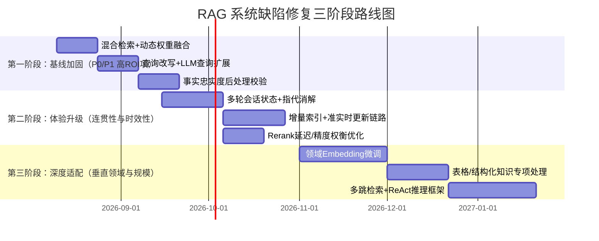

### 11.3 核心结论

基于 `4RAG 检索增强生成` 系列文档的全面分析，可得出以下**三大核心结论**：

1. **RAG 不是银弹**：RAG 有效缓解了纯 LLM 的知识过时与幻觉问题，但自身引入了八大类新缺陷，在工程落地时需系统性应对。[53号文档](./53RAG降低LLM幻觉机制详解.md) 中给出的 60%-75% 事实准确率基线充分证明了这一点。

2. **检索质量是最大瓶颈**：检索准确性缺陷（粒度错配、语义偏差、权重僵化）通过级联效应放大为下游所有问题，是投入产出比最高的优化方向。[65号文档](./65RAG系统召回率优化方案与实验报告.md) 将召回率称为"RAG 天花板"，此论断完全成立。

3. **Advanced RAG 技术的必要性**：Naive RAG 架构在 2026 年已不足以支撑生产级需求，混合检索、Rerank、多轮状态管理、查询改写、增量更新等 [55号文档](./55AdvancedRAG高级检索增强生成详解.md) 中列出的 Advanced RAG 能力**从"可选项"变为"必选项"**，否则上述八大缺陷将在真实场景中全面暴露。

---

> **分析完成日期**：2026-08-08
>
> **分析依据文档清单**（来自 `m:\note-book\agent\4RAG 检索增强生成\`）：
> - [52RAG工作流程详解.md](./52RAG工作流程详解.md)
> - [53RAG降低LLM幻觉机制详解.md](./53RAG降低LLM幻觉机制详解.md)
> - [54RAG系统功能模块详解.md](./54RAG系统功能模块详解.md)
> - [55AdvancedRAG高级检索增强生成详解.md](./55AdvancedRAG高级检索增强生成详解.md)
> - [56RAG文档切片策略深度解析.md](./56RAG文档切片策略深度解析.md)
> - [57RAG分块大小最佳选择策略深度解析.md](./57RAG分块大小最佳选择策略深度解析.md)
> - [60RAG系统Embedding模型选型决策指南.md](./60RAG系统Embedding模型选型决策指南.md)
> - [65RAG系统召回率优化方案与实验报告.md](./65RAG系统召回率优化方案与实验报告.md)
> - [66RAG系统准确率提升系统化方案.md](./66RAG系统准确率提升系统化方案.md)
> - [67Hybrid Search混合检索技术深度解析.md](./67Hybrid%20Search混合检索技术深度解析.md)
> - [69RAG系统Rerank重排序模型深度解析.md](./69RAG系统Rerank重排序模型深度解析.md)
> - [70RAG系统效果评估全面方案_检索生成端到端三维标准化框架.md](./70RAG系统效果评估全面方案_检索生成端到端三维标准化框架.md)
