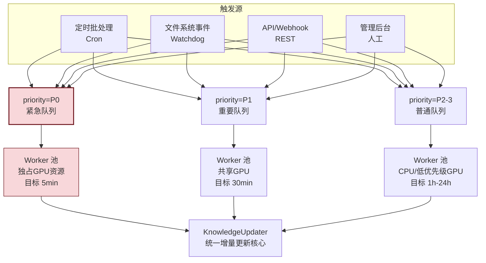
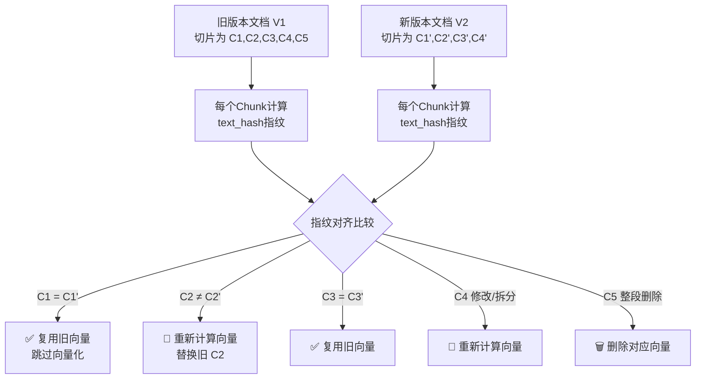
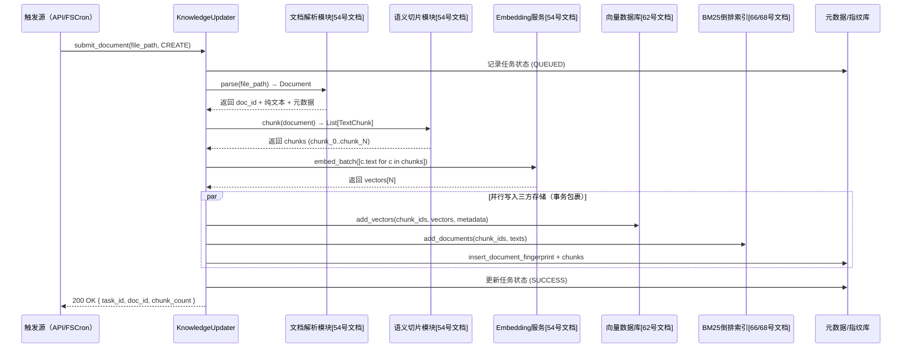
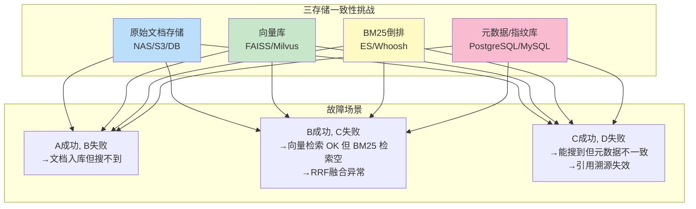
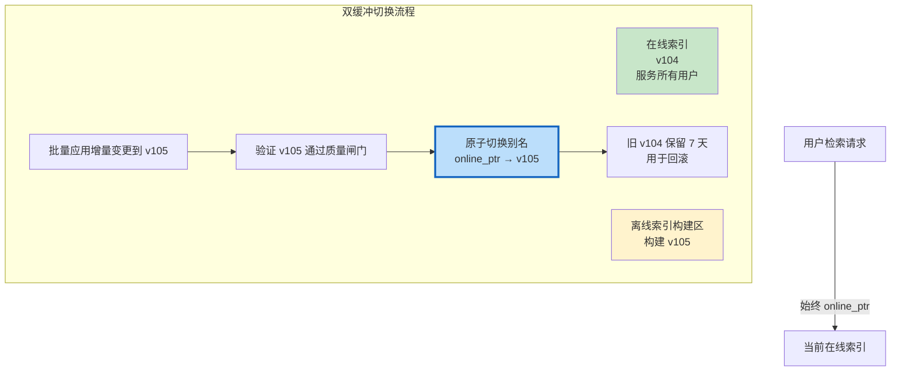
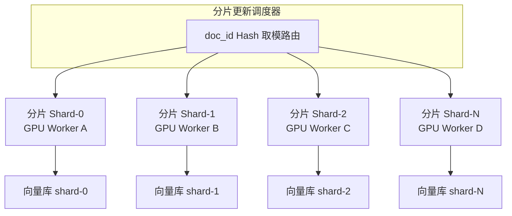
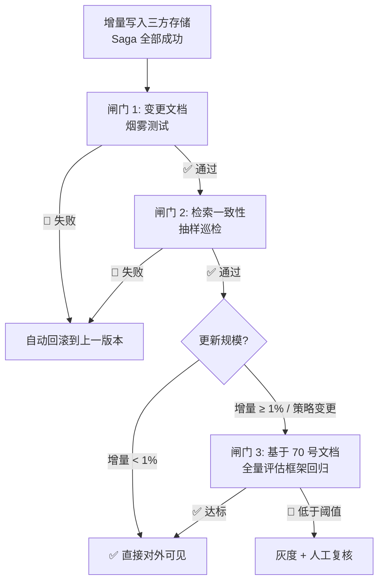
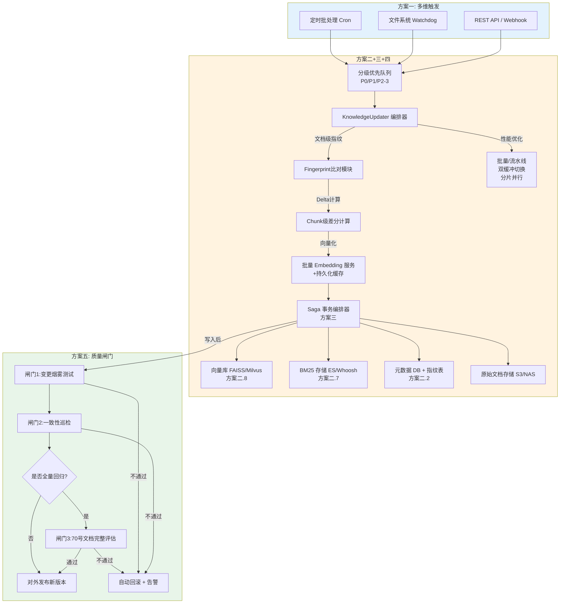
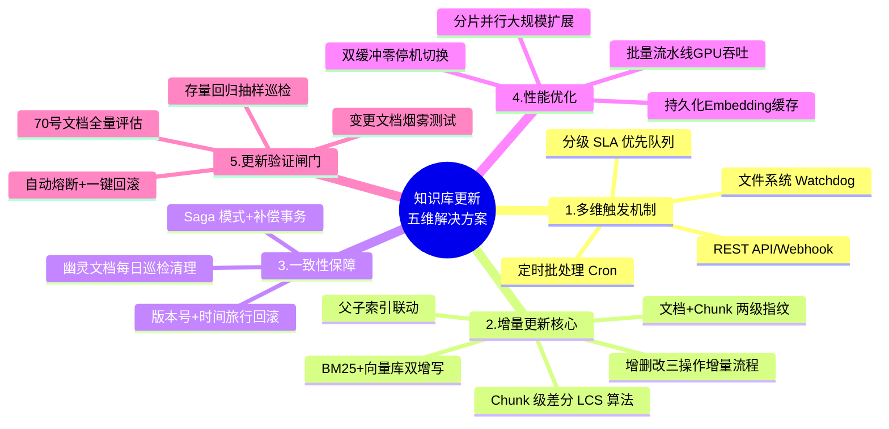
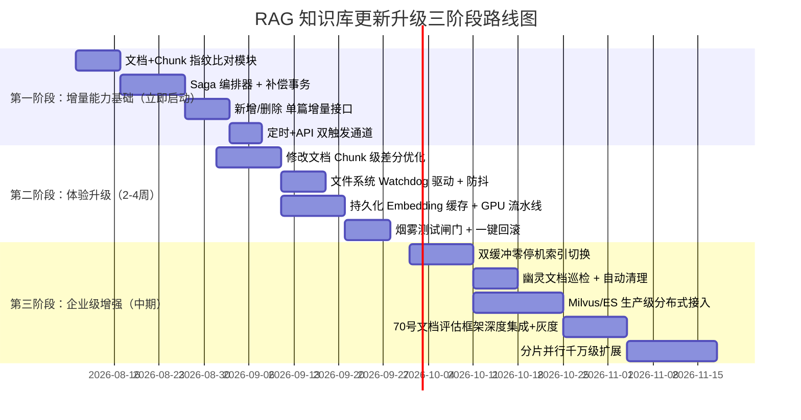

# RAG 知识库更新机制系统性解决方案

> **文档定位**：针对 [71号文档第三章](./71RAG系统主要缺陷与局限性深度分析报告.md#三缺陷2知识更新延迟问题) 揭示的三大知识更新缺陷（离线架构时滞、全量重建成本、一致性挑战），提出覆盖**触发机制、增量更新、一致性保障、性能优化、更新验证**五维的系统性解决方案。
>
> **兼容现有架构**：所有方案均与 [54号文档系统九大功能模块](./54RAG系统功能模块详解.md#12-模块划分与职责)、[62号文档向量库选型](./62FAISS与Milvus向量数据库核心区别深度解析.md)、[70号文档评估框架](./70RAG系统效果评估全面方案_检索生成端到端三维标准化框架.md) 无缝兼容。

## 目录

- [一、概述：知识库更新问题全景回顾](#一概述知识库更新问题全景回顾)
  - [1.1 三大核心缺陷回顾](#11-三大核心缺陷回顾)
  - [1.2 理想更新架构的五大设计目标](#12-理想更新架构的五大设计目标)
  - [1.3 三大操作场景的统一处理要求](#13-三大操作场景的统一处理要求)
- [二、方案1：多维度更新触发机制](#二方案1多维度更新触发机制)
  - [2.1 触发机制选型对比矩阵](#21-触发机制选型对比矩阵)
  - [2.2 定时批处理触发（小时/天级 SLA）](#22-定时批处理触发小时天级-sla)
  - [2.3 文件系统事件驱动触发（分钟级 SLA）](#23-文件系统事件驱动触发分钟级-sla)
  - [2.4 API / Webhook 手动触发（秒级 SLA）](#24-api--webhook-手动触发秒级-sla)
  - [2.5 混合触发策略：分级 SLA 保障框架](#25-混合触发策略分级-sla-保障框架)
- [三、方案2：增量更新核心策略（取代全量重建）](#三方案2增量更新核心策略取代全量重建)
  - [2.1 从全量重建到增量更新的范式转变](#21-从全量重建到增量更新的范式转变)
  - [2.2 文档级指纹比对与变更检测](#22-文档级指纹比对与变更检测)
  - [2.3 Chunk 级精细差分：仅重算变更块](#23-chunk-级精细差分仅重算变更块)
  - [2.4 操作 A：新增文档的增量处理流程](#24-操作-a新增文档的增量处理流程)
  - [2.5 操作 B：修改文档的增量处理流程](#25-操作-b修改文档的增量处理流程)
  - [2.6 操作 C：删除文档的增量处理流程](#26-操作-c删除文档的增量处理流程)
  - [2.7 BM25 倒排索引的增量更新方案](#27-bm25-倒排索引的增量更新方案)
  - [2.8 FAISS / Milvus 向量库增量写入最佳实践](#28-faiss--milvus-向量库增量写入最佳实践)
  - [2.9 父子索引的增量一致性联动](#29-父子索引的增量一致性联动)
- [四、方案3：分布式事务与一致性保障](#四方案3分布式事务与一致性保障)
  - [3.1 三存储一致性全景：原始文档库 + 向量库 + BM25 倒排](#31-三存储一致性全景原始文档库--向量库--bm25-倒排)
  - [3.2 Saga 模式 + 补偿事务保障最终一致性](#32-saga-模式--补偿事务保障最终一致性)
  - [3.3 幽灵文档（Ghost Chunk）检测与清理机制](#33-幽灵文档ghost-chunk检测与清理机制)
  - [3.4 版本号机制 + 时间旅行回滚能力](#34-版本号机制--时间旅行回滚能力)
- [五、方案4：更新性能优化技术](#五方案4更新性能优化技术)
  - [4.1 批量 + 流式向量化 GPU 吞吐优化](#41-批量--流式向量化-gpu-吞吐优化)
  - [4.2 文本级 Embedding 缓存复用](#42-文本级-embedding-缓存复用)
  - [4.3 读写分离 + 双缓冲索引切换（零停机更新）](#43-读写分离--双缓冲索引切换零停机更新)
  - [4.4 大规模知识库的分片并行更新](#44-大规模知识库的分片并行更新)
- [六、方案5：更新后验证与质量闸门](#六方案5更新后验证与质量闸门)
  - [6.1 更新质量闸门总体架构](#61-up更新质量闸门总体架构)
  - [6.2 变更文档专项烟雾测试](#62-变更文档专项烟雾测试)
  - [6.3 检索一致性巡检（抽样 + 回归）](#63-检索一致性巡检抽样--回归)
  - [6.4 基于 70 号文档评估框架的全量回归](#64-基于-70-号文档评估框架的全量回归)
  - [6.5 自动熔断与回滚预案](#65-自动熔断与回滚预案)
- [七、端到端集成：KnowledgeUpdater 完整实现](#七端到端集成knowledgeupdater-完整实现)
  - [7.1 系统总体架构图](#71-系统总体架构图)
  - [7.2 KnowledgeUpdater 核心类 Python 实现](#72-knowledgeupdater-核心类-python-实现)
  - [7.3 与现有模块的集成适配说明](#73-与现有模块的集成适配说明)
- [八、SLA 指标与预期效果对比](#八sla-指标与预期效果对比)
- [九、总结与部署路线图](#九总结与部署路线图)

---

## 一、概述：知识库更新问题全景回顾

### 1.1 三大核心缺陷回顾

根据 [71RAG系统主要缺陷与局限性深度分析报告 第三章](./71RAG系统主要缺陷与局限性深度分析报告.md#三缺陷2知识更新延迟问题) 的系统分析，当前 RAG 知识库更新架构存在以下三大核心缺陷：

```mermaid
graph LR
    subgraph 三大核心缺陷
        D1[缺陷1: 离线架构时滞<br/>5.5-39小时天级延迟]
        D2[缺陷2: 全量重建成本<br/>build_index()每次全量重算]
        D3[缺陷3: 一致性挑战<br/>向量/BM25/原始文档三方不一致]
    end
    
    D1 --> E1[时效性场景不可用<br/>新闻/政策/产品文档]
    D2 --> E2[100万+文档不可行<br/>GPU成本×10倍]
    D3 --> E3[幽灵文档/检索异常<br/>用户信任度崩塌]
    
    style D1 fill:#f8d7da,stroke:#721c24
    style D2 fill:#fff3cd,stroke:#d39e00
    style D3 fill:#ffebee,stroke:#b71c1c
```

**缺陷2代码级自证**（来自 [66号文档 2.1 节 build_index() 方法](./66RAG系统准确率提升系统化方案.md#21-混合检索hybrid-search)）：

```python
def build_index(self, documents):
    self.documents = documents
    tokenized = [list(jieba.cut(doc)) for doc in documents]  # 🔴 全量分词
    self.bm25 = BM25Okapi(tokenized)                         # 🔴 全量重建BM25
    self.doc_embeddings = self.embedder.encode(
        documents, normalize_embeddings=True                # 🔴 全量重新编码
    )
```

> 关键问题：没有 `add_documents()` / `update_documents()` / `delete_documents()` 三个增量接口，任何变更都触发全量重算。

---

### 1.2 理想更新架构的五大设计目标

本方案围绕以下五大目标进行设计：

| 目标 | 量化指标 | 对应解决的缺陷 |
|:-----|:---------|:--------------|
| **低延迟** | 新文档**1小时内**可被检索到（P1级）；紧急文档**5分钟**内（P0级） | 缺陷1：离线时滞 |
| **低成本** | 单篇文档修改时的向量化成本 ≈ **1/N × 全量成本**（N为文档总数） | 缺陷2：全量重建 |
| **强一致** | 三存储（原始/向量/BM25）不一致率 < **0.1%**；幽灵文档 24h 内自动清理 | 缺陷3：一致性 |
| **零停机** | 更新期间检索服务可用性 ≥ **99.9%**；索引切换无感知 | 缺陷2+3 组合问题 |
| **可回滚** | 任意更新操作出现异常，**≤5分钟**内可回滚到上一版本 | 缺陷3：一致性风险防护 |

---

### 1.3 三大操作场景的统一处理要求

知识库更新涉及三类操作，其处理复杂度与一致性挑战依次递增：

| 操作类型 | 触发频率 | 核心流程 | 一致性风险 | 优化空间 |
|:--------|:--------|:---------|:----------|:--------|
| **新增（CREATE）** | 最高（占 60%-70%） | 解析 → 切片 → 向量化 → 写入 | 低（仅需追加） | 高（批量/流式处理） |
| **修改（UPDATE）** | 中等（占 20%-30%） | 变更检测 → 旧数据删除 → 新数据写入 | 中（先删后加两步事务） | 中（Chunk 级差分优化） |
| **删除（DELETE）** | 最低（占 5%-10%） | 定位关联向量 → 清理 BM25 → 清理原始 | 高（多处同步清理） | 低（必须精确操作） |

> 核心难点：**修改操作**的最优处理并非"先全删后全加"，而是通过**文档指纹 + Chunk 差分**实现最小变更集的更新，这是性能优化的关键杠杆点。

---

## 二、方案1：多维度更新触发机制

### 2.1 触发机制选型对比矩阵

| 触发方式 | 典型延迟 | 适用场景 | 实现复杂度 | 资源消耗 |
|:--------|:---------|:---------|:----------|:--------|
| **定时批处理**（Cron） | 1h ~ 1d | 知识库批量同步、非紧急文档 | 🟢 低 | 低（批量吞吐高） |
| **文件系统事件**（Watchdog） | 1min ~ 10min | 共享文件夹、NAS 网盘文档落地 | 🟡 中 | 低（事件驱动） |
| **数据库 CDC**（Debezium） | < 1min | 结构化数据库接入（MySQL/PostgreSQL） | 🟠 高 | 中（依赖 CDC 中间件） |
| **Webhook / REST API** | < 5s | 业务系统主动推送、紧急文档更新 | 🟡 中 | 低（按需触发） |
| **人工触发**（管理后台） | 即时 | 版本发布、重大变更上线 | 🟢 低 | 低 |

---

### 2.2 定时批处理触发（小时/天级 SLA）

#### 适用场景
- 企业文档库定期同步（FTP/SMB 网盘批量新文件）
- 爬虫系统每日批量抓取结果入站
- 知识库整体一致性修复巡检

#### 实现逻辑

```python
"""批处理定时触发 - 基于 APScheduler 的实现框架"""
from apscheduler.schedulers.background import BackgroundScheduler
from apscheduler.triggers.cron import CronTrigger

class BatchUpdateScheduler:
    def __init__(self, knowledge_updater: "KnowledgeUpdater"):
        self.updater = knowledge_updater
        self.scheduler = BackgroundScheduler(timezone="Asia/Shanghai")
    
    def register_jobs(self):
        # 任务1：小时级增量同步（P2 级文档）
        self.scheduler.add_job(
            self.updater.run_incremental_sync,
            CronTrigger(hour="*", minute=30),   # 每小时 30 分
            id="hourly_sync",
            kwargs={"priority": "P2", "sync_scope": "incremental"},
        )
        # 任务2：每日全量巡检 + 一致性修复（凌晨低峰）
        self.scheduler.add_job(
            self.updater.run_full_consistency_check,
            CronTrigger(hour=3, minute=0),       # 每日 03:00
            id="daily_consistency_check",
        )
        # 任务3：每周全量索引重建 + 碎片整理（周日凌晨）
        self.scheduler.add_job(
            self.updater.run_full_index_rebuild,
            CronTrigger(day_of_week="sun", hour=2, minute=0),
            id="weekly_full_rebuild",
        )
    
    def start(self):
        self.scheduler.start()
```

**SLA 分层触发策略**：

| 文档优先级 | 触发频率 | 目标延迟上限 | 典型文档类型 |
|:----------|:---------|:------------|:------------|
| **P0 紧急** | 事件驱动 + API | 5 分钟 | 安全公告、紧急政策、重大 Bug 修复 |
| **P1 重要** | 15 分钟级轮询 | 30 分钟 | 产品新文档、政策更新、新闻稿 |
| **P2 普通** | 小时级批处理 | 1 小时 | 通用知识库、员工手册、培训资料 |
| **P3 归档** | 日级批处理 | 24 小时 | 历史档案、参考资料、非核心文档 |

---

### 2.3 文件系统事件驱动触发（分钟级 SLA）

#### 适用场景
- 企业 NAS / 共享文件夹中的文档落地即同步
- Markdown 知识库 Git Push 后 Hook 触发
- 运营人员将 PDF 拖入指定目录即自动入库

#### 实现逻辑

```python
"""文件系统事件驱动 - 基于 watchdog 的实时文档监测"""
from watchdog.observers import Observer
from watchdog.events import FileSystemEventHandler, FileCreatedEvent, FileModifiedEvent, FileDeletedEvent
from typing import Set
import time

SUPPORTED_EXT = {".pdf", ".md", ".docx", ".txt", ".html", ".xlsx"}

class KnowledgeDirEventHandler(FileSystemEventHandler):
    def __init__(self, knowledge_updater: "KnowledgeUpdater", 
                 debounce_seconds: int = 30):
        self.updater = knowledge_updater
        self.debounce = debounce_seconds
        self._pending_events: Set[str] = set()      # 防抖集合
        self._last_flush = time.time()
    
    def _should_process(self, file_path: str) -> bool:
        ext = file_path[file_path.rfind("."):].lower()
        return ext in SUPPORTED_EXT and not file_path.split("/")[-1].startswith("~$")
    
    def on_created(self, event: FileCreatedEvent):
        if not event.is_directory and self._should_process(event.src_path):
            self._pending_events.add(("CREATE", event.src_path))
            self._try_flush()
    
    def on_modified(self, event: FileModifiedEvent):
        if not event.is_directory and self._should_process(event.src_path):
            self._pending_events.add(("UPDATE", event.src_path))
            self._try_flush()
    
    def on_deleted(self, event: FileDeletedEvent):
        if not event.is_directory and self._should_process(event.src_path):
            self._pending_events.add(("DELETE", event.src_path))
            self._try_flush()
    
    def _try_flush(self):
        """防抖：累积 30 秒或累积超过 50 个事件后批量提交"""
        now = time.time()
        if (now - self._last_flush >= self.debounce) or len(self._pending_events) >= 50:
            events = list(self._pending_events)
            self._pending_events.clear()
            self._last_flush = now
            self.updater.submit_batch_events(events)  # 异步提交到更新队列

def start_filesystem_watcher(watch_dir: str, updater: "KnowledgeUpdater"):
    event_handler = KnowledgeDirEventHandler(updater)
    observer = Observer()
    observer.schedule(event_handler, watch_dir, recursive=True)
    observer.start()
    return observer
```

**防抖机制核心原理**：Word/Excel 保存文件时会触发 3-5 次修改事件（临时文件 → 替换 → 属性更新），通过 30 秒窗口 + 去重集合，保证同一文件的多次抖动合并为一次更新。

---

### 2.4 API / Webhook 手动触发（秒级 SLA）

#### 适用场景
- 业务系统（CMS / HR 系统 / 合同系统）文档发布后主动推送
- P0 级紧急文档的即时发布（如安全通告、故障排查手册）
- 管理后台上传单篇文档的立即入库

#### REST 接口设计

```
POST   /api/v1/knowledge/documents          # 新增单篇文档
PUT    /api/v1/knowledge/documents/{doc_id} # 修改指定文档
DELETE /api/v1/knowledge/documents/{doc_id} # 删除指定文档
POST   /api/v1/knowledge/batch              # 批量提交变更（上限 100 篇/批）
POST   /api/v1/knowledge/rebuild            # 触发全量重建（需管理员权限）
GET    /api/v1/knowledge/tasks/{task_id}    # 查询更新任务状态与进度
```

请求与响应示例：

```json
// POST /api/v1/knowledge/documents
{
  "priority": "P0",
  "source": "cms_system",
  "documents": [
    {
      "doc_id": "doc_policy_2026q3_v2",
      "file_path": "/nas/policies/2026Q3_data_security_policy.pdf",
      "metadata": {"category": "policy", "effective_date": "2026-09-01"}
    }
  ]
}

// 202 Accepted 响应
{
  "task_id": "task_a8f3c2d1e9b0",
  "status": "QUEUED",
  "priority": "P0",
  "estimated_completion_sec": 180,
  "callback_url": "https://cms.example.com/webhooks/rag-update"
}
```

---

### 2.5 混合触发策略：分级 SLA 保障框架

将上述三种触发方式组合成统一的事件队列，实现分级 SLA：



---

## 三、方案2：增量更新核心策略（取代全量重建）

### 2.1 从全量重建到增量更新的范式转变

```mermaid
graph LR
    subgraph 旧模式:全量重建
        O1[文档变更] --> O2[重新解析全部 N 篇]
        O2 --> O3[重新切片 N 篇]
        O3 --> O4[重新向量化 N 篇]
        O4 --> O5[重建全部索引]
        O5 --> O6[整体切换]
    end
    
    subgraph 新模式:增量更新
        N1[文档变更] --> N2{指纹比对<br/>哪些文档真变了?}
        N2 -->|新增| N3[仅处理 Δ 新增]
        N2 -->|修改| N4[仅处理 Δ 修改的 Chunk]
        N2 -->|删除| N5[仅定位 + 清理关联向量]
        N3 & N4 & N5 --> N6[索引原子更新]
        N6 --> N7[热加载生效]
    end
    
    O4 -->|计算量| C1[O(N)]
    N6 -->|计算量| C2[O(Δ), Δ << N]
    
    style O5 fill:#ffcdd2
    style N6 fill:#c8e6c9
```

**性能提升量级**：假设知识库 10 万篇文档，每日新增/修改 300 篇（Δ = 0.3%）→ 理论向量化计算量降低为原来的 **1/333**。考虑增量框架的额外开销，实际也能降低 **100-200 倍**。

---

### 2.2 文档级指纹比对与变更检测

#### 设计思路

为每篇文档生成**内容指纹**，用于快速判断是否需要重新处理：
- **快速指纹**：文件大小 + 修改时间 + 文件路径 MD5（用于毫秒级粗筛，O(1)）
- **精确指纹**：文档解析后纯文本内容的 SHA-256（用于内容实际变更判断，避免同时间戳的空保存）

#### 数据模型

```python
from dataclasses import dataclass
from datetime import datetime
from typing import Optional
import hashlib

@dataclass
class DocumentFingerprint:
    doc_id: str
    fast_fingerprint: str         # 快速指纹：mtime + size + path
    content_fingerprint: str      # 精确指纹：parse后纯文本的SHA256
    chunk_count: int              # 文档切片数量
    last_updated_at: datetime     # 上次成功处理的时间
    embedding_model_name: str     # 所用 Embedding 模型（模型升级 → 强制全量重算）
    chunker_config_hash: str      # 切片参数 hash（切片策略变更 → 强制重切）

def compute_fast_fingerprint(file_path: str, stat_result) -> str:
    """文件级快速指纹：不解析文件即可判断是否可能变更"""
    raw = f"{file_path}|{stat_result.st_size}|{stat_result.st_mtime_ns}"
    return hashlib.md5(raw.encode()).hexdigest()

def compute_content_fingerprint(clean_text: str) -> str:
    """文档级精确指纹：纯文本内容的 SHA-256"""
    return hashlib.sha256(clean_text.encode("utf-8")).hexdigest()
```

**核心判断流程**：

```
文件系统事件 / 批量扫描 → 计算 fast_fingerprint
    ↓
与知识库指纹表对比
    ↓
fast 指纹一致 → 直接跳过（95%+ 的未变更文档在这一步被过滤）
fast 指纹不一致 → 解析文档得到纯文本 → 计算 content_fingerprint
                                  ↓
                       content 指纹一致 → 跳过（文件时间戳抖动但实际内容未变）
                       content 指纹不一致 → 进入切片/向量化流程
```

---

### 2.3 Chunk 级精细差分：仅重算变更块

文档级指纹判断"整文是否变更"后，对于**修改操作**，还可以进一步优化到 Chunk 级差分：



**典型收益**：对于一份 100 页的技术手册，只修改其中第 45 页的某个参数值 → 仅需对 1-2 个受影响 Chunk 重新向量化，其余 98% 的 Chunk 直接复用旧向量。

实现伪代码：

```python
def compute_chunk_delta(old_doc_chunks: List[TextChunk], 
                       new_doc_chunks: List[TextChunk]) -> "ChunkDelta":
    """
    基于最长公共子序列（LCS）的 Chunk 级差分算法
    返回: 需要删除的 chunk_ids + 需要重算的新 chunks + 可以复用的 chunk_ids
    """
    old_hash_map = {hashlib.md5(c.text.encode()).hexdigest(): c.chunk_id for c in old_doc_chunks}
    new_hashes = [hashlib.md5(c.text.encode()).hexdigest() for c in new_doc_chunks]
    
    to_reuse, to_recompute, to_delete = [], [], set()
    
    # 新文档侧判定
    for new_chunk, new_hash in zip(new_doc_chunks, new_hashes):
        old_chunk_id = old_hash_map.get(new_hash)
        if old_chunk_id:
            to_reuse.append((new_chunk, old_chunk_id))  # 内容完全一致 → 复用旧向量
            old_hash_map.pop(new_hash)                   # 避免同一旧块匹配多个新块
        else:
            to_recompute.append(new_chunk)               # 内容变更 → 重新向量化
    
    # 旧文档侧：未被匹配的旧块 → 删除
    to_delete = set(old_hash_map.values())
    
    return ChunkDelta(to_delete=to_delete, to_recompute=to_recompute, to_reuse=to_reuse)
```

---

### 2.4 操作 A：新增文档的增量处理流程



**与全量重建的关键区别**：
- 不调用 `BM25Okapi()` 构造器（全量重建），而是调用 `bm25.add_documents()`（增量追加）
- 不重置向量库，而是调用 Milvus 的 `insert()` 或 FAISS 的 `IndexIDMap.add_with_ids()`

---

### 2.5 操作 B：修改文档的增量处理流程

修改操作复杂度最高，需严格遵循 **"先比对 → 差分 → 事务性删旧加新"** 流程：

```python
class KnowledgeUpdater:
    def update_document(self, file_path: str, doc_id: str) -> UpdateResult:
        # Step 1: 加载文档旧版本指纹和 Chunk 列表
        old_fp = self.metadata_db.get_fingerprint(doc_id)
        old_chunks = self.metadata_db.get_document_chunks(doc_id)
        
        # Step 2: 解析新版本文档
        new_document = self.parser.parse(file_path)
        
        # Step 3: 内容级指纹比对（如果完全一致，直接返回 SKIP）
        new_content_fp = compute_content_fingerprint(new_document.content)
        if new_content_fp == old_fp.content_fingerprint:
            return UpdateResult(status="SKIPPED", reason="Content unchanged")
        
        # Step 4: 重新切片 + Chunk 级差分
        new_document = self.chunker.chunk(new_document)
        delta = compute_chunk_delta(old_chunks, new_document.chunks)
        
        # Step 5: 重新向量化变更 Chunk（复用未变更的）
        new_vectors_map = {}
        if delta.to_recompute:
            vectors = self.embedder.embed_batch([c.text for c in delta.to_recompute])
            new_vectors_map = {c.chunk_id: v for c, v in zip(delta.to_recompute, vectors)}
        # 复用部分
        for reused_chunk, old_chunk_id in delta.to_reuse:
            old_vec = self.vector_db.get_vector(old_chunk_id)
            new_vectors_map[reused_chunk.chunk_id] = old_vec
        
        # Step 6: 事务性删旧加新（Saga 模式，详见方案3）
        with self.transaction_scope(doc_id, operation="UPDATE") as tx:
            # 6a: 清理旧 Chunk 向量 + BM25
            tx.delete_bm25_documents(old_chunk_ids=[c.chunk_id for c in old_chunks])
            tx.delete_vectors(chunk_ids=delta.to_delete | {c.chunk_id for c in old_chunks})
            # 6b: 写入新 Chunk 向量 + BM25
            tx.insert_bm25_documents(new_document.chunks)
            tx.insert_vectors(new_vectors_map, new_document.chunks)
            # 6c: 更新元数据 + 指纹
            tx.update_fingerprint(doc_id, DocumentFingerprint(
                doc_id=doc_id,
                fast_fingerprint=compute_fast_fingerprint(file_path, os.stat(file_path)),
                content_fingerprint=new_content_fp,
                chunk_count=len(new_document.chunks),
                last_updated_at=datetime.utcnow(),
                embedding_model_name=self.embedder.model_name,
                chunker_config_hash=self.chunker_config_hash,
            ))
            tx.update_document_chunks(doc_id, new_document.chunks)
        
        return UpdateResult(status="SUCCESS", 
                            reused_count=len(delta.to_reuse),
                            recomputed_count=len(delta.to_recompute),
                            deleted_count=len(delta.to_delete))
```

---

### 2.6 操作 C：删除文档的增量处理流程

删除操作的核心挑战是**确保不留任何残留数据**（避免 71 号文档中描述的"幽灵文档"问题）：

```mermaid
graph TD
    A[接收 DELETE doc_id 请求] --> B[元数据 DB 查询<br/>获取所有关联 chunk_ids]
    B --> C{doc_id 是否存在?}
    C -->|否| D[返回 404 / 幂等成功]
    C -->|是| E[开启事务]
    E --> F[向量库 delete by chunk_ids]
    F --> G[BM25 倒排 delete by chunk_ids]
    G --> H[原始文档库软删除<br/>deleted_at = NOW()]
    H --> I[指纹表删除记录]
    H --> J[父子索引表清理<br/>若有父块/子块]
    I & J --> K[提交事务]
    K --> L[写入审计日志<br/>谁、何时、删除了什么]
```

**软删除 + 宽限期机制**：
- 原始文档库先软删除（`deleted_at` 标记），7 天后硬删除
- 宽限期内可通过管理后台一键撤销删除操作
- 宽限期后，每日巡检任务执行物理清理（向量库 / BM25 / 磁盘文件同时清理）

---

### 2.7 BM25 倒排索引的增量更新方案

[66号文档的 `HybridRetriever.build_index()`](./66RAG系统准确率提升系统化方案.md#21-混合检索hybrid-search) 使用的 `rank_bm25.BM25Okapi` 不支持原生增量操作，解决方案如下：

| 方案 | 适用场景 | 延迟 | 实现复杂度 |
|:-----|:---------|:-----|:----------|
| **方案 A：Elasticsearch / OpenSearch** | 生产级部署（推荐） | ~1s | 🟡 中（依赖 ES 集群） |
| **方案 B：Whoosh / Tantivy** | 单机中型场景 | ~100ms | 🟡 中（本地倒排库） |
| **方案 C：定时重训练 BM25Okapi** | 小型 Demo / 原型 | 1min-1h | 🟢 低（全量重建频率降低） |

**生产推荐方案 A（Elasticsearch 接入）**：
```python
class ElasticsearchBM25Store:
    """基于 ES 的可增量更新 BM25 存储"""
    def __init__(self, es_client, index_name: str = "rag_bm25_chunks"):
        self.es = es_client
        self.index = index_name
    
    def add_chunk(self, chunk: TextChunk, text_tokenized: List[str]):
        self.es.index(index=self.index, id=chunk.chunk_id, document={
            "doc_id": chunk.doc_id,
            "text": chunk.text,
            "text_tokenized": " ".join(text_tokenized),
            "metadata": chunk.metadata,
            "created_at": datetime.utcnow().isoformat()
        })
        self.es.indices.refresh(index=self.index)  # 立即刷新可搜索
    
    def delete_by_doc_id(self, doc_id: str):
        self.es.delete_by_query(index=self.index, 
                                query={"term": {"doc_id.keyword": doc_id}})
    
    def delete_by_chunk_ids(self, chunk_ids: List[str]):
        for cid in chunk_ids:
            try:
                self.es.delete(index=self.index, id=cid)
            except NotFoundError:
                pass  # 幂等删除
    
    def search(self, query_tokens: List[str], k: int = 50) -> List[Tuple[str, float]]:
        resp = self.es.search(index=self.index, size=k, query={
            "match": {"text": {"query": " ".join(query_tokens), "operator": "or"}}
        })
        return [(hit["_id"], hit["_score"]) for hit in resp["hits"]["hits"]]
```

---

### 2.8 FAISS / Milvus 向量库增量写入最佳实践

依据 [62 号文档 FAISS vs Milvus 对比](./62FAISS与Milvus向量数据库核心区别深度解析.md#13-核心定位差异) 的选型差异：

**FAISS（单机库）增量方案**：
```python
class FAISSIncrementalIndex:
    def __init__(self, dim: int):
        # 选择支持 ID 映射 + 动态添加的索引类型
        self.index = faiss.IndexIDMap2(faiss.IndexHNSWFlat(dim, faiss.METRIC_INNER_PRODUCT))
        self._chunk_id_to_int: Dict[str, int] = {}
        self._int_id_counter = 0
    
    def add_vectors(self, chunk_ids: List[str], vectors: np.ndarray, metadatas: List[Dict]):
        """增量写入"""
        n = len(chunk_ids)
        int_ids = []
        for cid in chunk_ids:
            if cid not in self._chunk_id_to_int:
                self._chunk_id_to_int[cid] = self._int_id_counter
                self._int_id_counter += 1
            int_ids.append(self._chunk_id_to_int[cid])
        self.index.add_with_ids(vectors.astype("float32"), np.array(int_ids))
        # 元数据单独存 SQLite
        self.metadata_db.batch_update(chunk_ids, metadatas)
    
    def remove_vectors(self, chunk_ids: List[str]):
        """⚠️ FAISS IndexIDMap2 原生支持 remove_ids（1.7.4+ 版本）"""
        int_ids = [self._chunk_id_to_int[cid] for cid in chunk_ids if cid in self._chunk_id_to_int]
        if int_ids:
            self.index.remove_ids(np.array(int_ids))
```

**Milvus（分布式数据库）增量方案**（更简单，原生支持 CRUD）：
```python
from pymilvus import Collection, utility

class MilvusIncrementalStore:
    def __init__(self, collection: Collection):
        self.collection = collection
        collection.load()
    
    def insert_chunks(self, chunks: List[TextChunk], vectors: List[np.ndarray]):
        """Milvus 原生 insert 支持增量 + 自动构建索引"""
        data = [
            [c.chunk_id for c in chunks],          # 主键字段
            vectors,                                # 向量字段
            [c.doc_id for c in chunks],             # metadata
            [c.text[:65535] for c in chunks],       # 原文（用于溯源显示）
        ]
        result = self.collection.insert(data)
        self.collection.flush()                     # 落盘持久化
        return result.insert_count
    
    def delete_by_doc_id(self, doc_id: str):
        """Milvus 支持按表达式删除，非常适用于'删除整个文档'场景"""
        expr = f'doc_id == "{doc_id}"'
        self.collection.delete(expr)
        self.collection.flush()
```

---

### 2.9 父子索引的增量一致性联动

针对 [55 号文档 5.4 节父子索引](./55AdvancedRAG高级检索增强生成详解.md#54-父子索引parent-child-indexing)（细粒度子块用于检索，粗粒度父块用于注入 LLM），其增量更新需遵循**子块变更时向上联动重算父块**策略：

```
文档修改 → 子块级差分计算 → 确定受影响子块 S
    ↓
定位父块 P（根据 parent_chunk_id 关联）
    ↓
判断 P 的所有子块是否 ≥ X% 发生变更？
    ↓（是） → 重新计算父块文本 → 重新 Embedding → 更新父块索引
    ↓（否） → 父块文本级内容仍可信 → 跳过父块（仅更新子块）
```

---

## 四、方案3：分布式事务与一致性保障

### 3.1 三存储一致性全景：原始文档库 + 向量库 + BM25 倒排



**ACID 无法直接满足的原因**：
- 向量库（Milvus 2.x 以前）和 BM25 存储（ES）不支持传统数据库的 XA 两阶段提交
- 跨三个异构系统的分布式事务不可行
- → 选择 **Saga 模式 + 最终一致性 + 定期对账修复** 方案

---

### 3.2 Saga 模式 + 补偿事务保障最终一致性

每一次更新操作拆分为多个本地事务步骤，每个步骤注册对应的**补偿操作**（回滚动作）：

```python
from typing import Callable, List
from dataclasses import dataclass

@dataclass
class SagaStep:
    name: str
    action: Callable[[], None]        # 正向操作
    compensation: Callable[[], None]  # 补偿操作（正向失败时回滚）

class KnowledgeUpdateSaga:
    """知识库更新 Saga 编排器"""
    
    def __init__(self, metadata_db, vector_db, bm25_store, doc_store):
        self.meta_db = metadata_db
        self.vec_db = vector_db
        self.bm25 = bm25_store
        self.doc_store = doc_store
        self._executed_steps: List[SagaStep] = []
    
    def execute_update_document_saga(self, doc_id: str, new_chunks: List[TextChunk],
                                     new_vectors: np.ndarray, old_chunk_ids: List[str]):
        
        steps = [
            # Step 1: 元数据 DB 新建版本（最先执行，失败直接退出，不影响存量）
            SagaStep(
                name="metadata_create_new_version",
                action=lambda: self.meta_db.begin_update_version(doc_id, new_chunks),
                compensation=lambda: self.meta_db.abort_update_version(doc_id)
            ),
            # Step 2: 向量库删除旧 Chunk
            SagaStep(
                name="vector_db_delete_old",
                action=lambda: self.vec_db.remove_vectors(old_chunk_ids),
                compensation=lambda: self.vec_db.restore_vectors_from_backup(old_chunk_ids)
            ),
            # Step 3: 向量库写入新 Chunk
            SagaStep(
                name="vector_db_insert_new",
                action=lambda: self.vec_db.add_vectors([c.chunk_id for c in new_chunks], new_vectors),
                compensation=lambda: self.vec_db.remove_vectors([c.chunk_id for c in new_chunks])
            ),
            # Step 4: BM25 删除旧 Chunk
            SagaStep(
                name="bm25_delete_old",
                action=lambda: self.bm25.delete_by_chunk_ids(old_chunk_ids),
                compensation=lambda: self.bm25.restore_documents_from_backup(old_chunk_ids)
            ),
            # Step 5: BM25 写入新 Chunk
            SagaStep(
                name="bm25_insert_new",
                action=lambda: self.bm25.add_chunks_batch(new_chunks),
                compensation=lambda: self.bm25.delete_by_chunk_ids([c.chunk_id for c in new_chunks])
            ),
            # Step 6: 元数据 DB 提交新版本（最后一步，提交即对外可见）
            SagaStep(
                name="metadata_commit_version",
                action=lambda: self.meta_db.commit_update_version(doc_id, status="PUBLISHED"),
                compensation=lambda: None  # 已提交后不再回滚，进入人工修复
            ),
        ]
        
        # Saga 正向执行
        for step in steps:
            try:
                step.action()
                self._executed_steps.append(step)
            except Exception as e:
                self._compensate(f"Saga failed at step: {step.name}", e)
                raise UpdateFailedError(step=step.name, reason=str(e))
    
    def _compensate(self, reason: str, error: Exception):
        """反向执行已完成步骤的补偿操作（逆序）"""
        self.meta_db.log_saga_failure(reason, error, self._executed_steps)
        for step in reversed(self._executed_steps):
            try:
                step.compensation()
            except Exception as ce:
                # 补偿失败的步骤需进入人工修复队列
                self.meta_db.queue_manual_repair_task(step.name, str(ce))
```

**最终一致性保障**：Saga 模式保证只要所有补偿都成功，系统就会回到更新前的一致状态。若补偿失败，则记录到人工修复队列，配合每日一致性巡检任务兜底。

---

### 3.3 幽灵文档（Ghost Chunk）检测与清理机制

**幽灵文档定义**：原始文档已删除/修改，但向量库或 BM25 中仍残留旧 chunk 数据，导致检索时返回"已经不存在的内容"。

**每日巡检检测 SQL（基于元数据 DB 与向量库/BM25 的全量对账）**：

```python
class ConsistencyChecker:
    def run_ghost_chunk_detection(self) -> GhostChunkReport:
        # Step 1: 从元数据 DB 获取所有应该存在的 chunk_id 全集
        expected_chunk_ids = self.meta_db.get_all_published_chunk_ids()
        expected_set = set(expected_chunk_ids)
        
        # Step 2: 从向量库获取实际存在的 chunk_id
        actual_vector_chunk_ids = self.vector_db.scan_all_chunk_ids()
        vector_set = set(actual_vector_chunk_ids)
        
        # Step 3: 从 BM25 存储获取实际存在的 chunk_id
        actual_bm25_chunk_ids = self.bm25_store.scan_all_chunk_ids()
        bm25_set = set(actual_bm25_chunk_ids)
        
        # Step 4: 三方对比，定位三类异常
        only_in_vector = vector_set - expected_set        # 向量库中的幽灵
        only_in_bm25  = bm25_set - expected_set           # BM25 中的幽灵
        only_in_meta  = expected_set - (vector_set & bm25_set)  # 漏写入（应该有但没有）
        
        report = GhostChunkReport(
            ghost_in_vector_count=len(only_in_vector),
            ghost_in_bm25_count=len(only_in_bm25),
            missing_in_vector_count=len(expected_set - vector_set),
            missing_in_bm25_count=len(expected_set - bm25_set),
        )
        
        # Step 5: 自动修复
        if report.ghost_in_vector_count < 1000:   # 防止大规模误删设阈值
            self.vector_db.remove_vectors(list(only_in_vector))
        if report.ghost_in_bm25_count < 1000:
            self.bm25_store.delete_by_chunk_ids(list(only_in_bm25))
        if only_in_meta:
            # 漏写入 → 触发这些 chunk 的重新向量化并写入
            self.updater.schedule_chunk_rewrites(list(only_in_meta))
        
        return report
```

---

### 3.4 版本号机制 + 时间旅行回滚能力

为每次更新分配单调递增的 **KB 版本号（Knowledge Base Version）**，并保留历史快照：


实现要点：
1. **向量库侧**：Milvus 支持多 Collection + 别名切换；FAISS 支持索引文件的 `faiss.write_index()` 多版本保存
2. **BM25 侧**：ES 使用多 Index 别名，全量切换时构建新 Index 后改别名
3. **检索服务侧**：通过 `version` 参数可查询任意历史版本（回溯对比、A/B 验证）

---

## 五、方案4：更新性能优化技术

### 4.1 批量 + 流式向量化 GPU 吞吐优化

[54 号文档 3.2 节 EmbeddingService](./54RAG系统功能模块详解.md#321-embeddingservice类含缓存机制) 已有 `embed_batch()` 实现，增量更新场景下需要**微批 + 异步流水线**进一步挖掘 GPU 利用率：

```mermaid
graph LR
    subgraph 优化前
        A[Chunk1→Embed→写入→Chunk2→Embed→写入<br/>串行, GPU利用率 30%]
    end
    
    subgraph 优化后:流水线+微批
        B1[Chunk 队列] --> B2[微批聚合<br/>满32条或超时2s]
        B2 --> B3[GPU批量推理<br/>batch_size=32]
        B3 --> B4[异步写入库<br/>不阻塞下一批GPU]
        B3 --> B2  # GPU同时，下一批已在准备
    end
    
    优化前 -->|吞吐| 1.0x
    优化后 -->|吞吐| 4.0x-8.0x
```

**量化收益**：将 54 号文档中默认 `max_batch_size=32` 的嵌入能力与异步队列结合，**单 A100 GPU 的 Embedding 吞吐可达 5000-10000 文本块/分钟**，比单条串行提升 4-8 倍。

---

### 4.2 文本级 Embedding 缓存复用

[54 号文档的 `LRUCache`](./54RAG系统功能模块详解.md#459-490) 已实现基于 MD5(text) 的向量缓存，但仅用于运行时内存缓存。增量更新场景可将其扩展为**持久化磁盘级缓存**：

```python
class PersistentEmbeddingCache(LRUCache):
    """持久化 Embedding 缓存：内存 + SQLite + 模型指纹命名空间"""
    
    def __init__(self, model_name: str, model_hash: str, sqlite_path: str):
        super().__init__(capacity=100000)
        self.namespace = f"{model_name}|{model_hash}"  # 模型变更 → 缓存整体失效
        self.db = sqlite3.connect(sqlite_path)
        self.db.execute("""
            CREATE TABLE IF NOT EXISTS embed_cache (
                namespace TEXT, text_hash TEXT PRIMARY KEY, 
                vector BLOB, created_at INTEGER
            )
        """)
    
    def get(self, text: str) -> Optional[np.ndarray]:
        text_hash = self._hash(text)
        key = (self.namespace, text_hash)
        # 1. 内存查
        vec = super().get(text_hash)
        if vec is not None: return vec
        # 2. SQLite 查
        row = self.db.execute(
            "SELECT vector FROM embed_cache WHERE namespace=? AND text_hash=?", key
        ).fetchone()
        if row:
            vec = np.frombuffer(row[0], dtype="float32")
            super().put(text_hash, vec)  # 回填内存
            return vec
        return None
    
    def put(self, text: str, vector: np.ndarray):
        text_hash = self._hash(text)
        super().put(text_hash, vector)
        # 异步写 SQLite（不阻塞热路径）
        self._async_write_queue.put((self.namespace, text_hash, vector.tobytes()))
```

**缓存命中率提升关键**：
- Chunk 文本完全一致时 → 100% 命中
- 语义切片的重叠窗口部分重叠 → 重叠句子可部分复用（更细粒度的句子级缓存可进一步提升）

---

### 4.3 读写分离 + 双缓冲索引切换（零停机更新）

**核心思路**：检索请求始终读取「在线索引」，批量更新写入「离线索引构建区」，构建完成后通过原子切换上线。



**Milvus 实现方式**：
```python
# Milvus 通过 Collection 别名实现原子切换
from pymilvus import utility

def switch_index_alias(alias_name: str, from_collection: str, to_collection: str):
    """零停机切换：先解绑旧集合，再绑定新集合"""
    utility.unload_collection(from_collection)
    utility.alter_alias(collection=to_collection, alias=alias_name)
    # 上一版本保留 7 天作为回滚备份
```

**FAISS 实现方式**：
```python
def atomic_faiss_switch(current_index_ptr: faiss.Index, new_index_path: str):
    """内存指针级原子切换"""
    new_index = faiss.read_index(new_index_path)
    # 原子替换全局检索器中的索引指针
    # CPython 的 GIL 保证对象引用替换是线程安全的
    retriever.index = new_index
    gc.collect()  # 旧索引对象自动回收
```

---

### 4.4 大规模知识库的分片并行更新

当知识库规模达到 **1000 万 + Chunk** 时，单节点更新能力到达瓶颈，需按分片并行：



**实现要点**（Milvus 原生支持，FAISS 需自行实现）：
- 按 `doc_id % N` 或一致性哈希将文档路由到 N 个更新 Worker
- 每个 Worker 独占 1 张 GPU，互不干扰
- 检索时并行查询 N 个分片，汇总 Top-K

---

## 六、方案5：更新后验证与质量闸门

### 6.1 更新质量闸门总体架构

**更新不是写入成功就结束**，必须经过质量闸门验证后才能对用户可见：



---

### 6.2 变更文档专项烟雾测试

**烟雾测试目标**：确保**本次变更的文档**在检索侧和生成侧的基本可用性（耗时 1-5 分钟，成本极低）。

```python
class UpdateSmokeTester:
    def test_changed_document(self, doc_id: str, new_chunks: List[TextChunk]) -> SmokeTestReport:
        # 构造 3 类查询
        queries = self._generate_queries_from_chunks(new_chunks)
        # { "title_query": "从标题提取的关键词查询",
        #   "chunk_sample_query": "从每个Chunk抽取一句关键句",
        #   "summary_query": "LLM总结全文后生成的代表性问题" }
        
        recall_hit_count = 0
        faithfulness_pass_count = 0
        
        for q_type, query in queries.items():
            # 调用检索模块
            retrieved = self.retriever.retrieve(query, k=5)
            retrieved_doc_ids = {meta["doc_id"] for _, meta in retrieved}
            if doc_id in retrieved_doc_ids:
                recall_hit_count += 1    # ✅ 能搜到刚入库的文档
            # 调用生成模块，验证 Faithfulness（基于 70 号文档 4.4 节引用标注法）
            answer = self.rag_generator.generate(query)
            if self._is_answer_faithful_to_retrieved_docs(answer, retrieved):
                faithfulness_pass_count += 1
        
        recall_pass_rate = recall_hit_count / len(queries)
        faithful_pass_rate = faithfulness_pass_count / len(queries)
        
        return SmokeTestReport(
            doc_id=doc_id,
            recall_pass_rate=recall_pass_rate,
            faithfulness_pass_rate=faithful_pass_rate,
            passed=(recall_pass_rate >= 0.8 and faithful_pass_rate >= 0.75)
        )
```

**通过阈值**：变更文档的烟雾测试必须达到 **Recall 命中率 ≥ 80% 且 Faithfulness ≥ 75%**，否则触发回滚。

---

### 6.3 检索一致性巡检（抽样 + 回归）

烟雾测试覆盖变更文档后，还需对**历史存量文档**做回归抽样，防止新索引构建时误删旧数据：

```python
class ConsistencySmokeTest:
    def run_regression_sampling(self, sample_size: int = 200,
                                min_expected_recall: float = 0.95) -> bool:
        # 从金标准查询集合（70 号文档 2.x 节的标准化测试集）中随机抽样
        golden_queries = self.eval_sampler.draw_random_legacy_queries(sample_size)
        
        actual_recalls = []
        for q in golden_queries:
            retrieved_ids = set(self.retriever.retrieve(q.query, k=10))
            hit = len(retrieved_ids & set(q.relevant_chunk_ids)) > 0
            actual_recalls.append(1.0 if hit else 0.0)
        
        avg_recall = np.mean(actual_recalls)
        delta = avg_recall - q.baseline_recall_from_previous_version
        # 通过条件：平均召回率不低于上一版本 3 个百分点
        return avg_recall >= min_expected_recall and delta >= -0.03
```

---

### 6.4 基于 70 号文档评估框架的全量回归

当以下任一条件触发时，执行 [70 号文档](./70RAG系统效果评估全面方案_检索生成端到端三维标准化框架.md) 定义的完整三维评估：
- 周级全量索引重建后
- Embedding 模型升级 / 切片策略变更后
- 大版本更新（一次性更新 ≥ 1% 知识库文档）后

**与 70 号文档的集成点映射**：
- 70 号文档 [第三章 检索质量评估](./70RAG系统效果评估全面方案_检索生成端到端三维标准化框架.md#三维度一检索质量评估) → 用于验证新版本的 Recall/Precision/F1/MRR/NDCG 不劣化
- 70 号文档 [4.4 事实一致性专项](./70RAG系统效果评估全面方案_检索生成端到端三维标准化框架.md#44-事实一致性专项rag核心生命线引用标注法事实抽取法) → 用于验证 Faithfulness 不下降
- 70 号文档 [5.4 性能效率指标](./70RAG系统效果评估全面方案_检索生成端到端三维标准化框架.md#54-性能效率指标延迟成本吞吐) → 用于验证新版本 P99 延迟不显著上升

---

### 6.5 自动熔断与回滚预案

**触发自动熔断的条件**（任一满足即触发）：

| 指标 | 熔断阈值 | 响应动作 |
|:-----|:---------|:---------|
| 变更文档烟雾测试通过率 | < 80% | 单 doc 级回滚 + 告警通知 |
| 存量回归 Recall 波动 | 较上版本下降 ≥ 5pt | 整体切换回旧版索引别名 |
| 幽灵文档检出数量（单批次） | ≥ 1000 条 | 暂停对外服务，对账修复后上线 |
| 用户查询 5xx 错误率 | ≥ 2%（5 分钟窗口） | 服务降级 → 回滚旧版 |
| Saga 补偿失败任务数（单小时） | ≥ 5 | 暂停更新队列，人工介入 |

---

## 七、端到端集成：KnowledgeUpdater 完整实现

### 7.1 系统总体架构图



---

### 7.2 KnowledgeUpdater 核心类 Python 实现

```python
"""
KnowledgeUpdater - RAG 知识库统一增量更新入口
与 54 号文档的 DocumentParser / SemanticChunker / EmbeddingService 无缝组合使用
"""
from dataclasses import dataclass, field
from datetime import datetime
from enum import Enum
from typing import List, Dict, Optional, Callable, Tuple
from queue import PriorityQueue
import threading

class Operation(Enum):
    CREATE = "CREATE"
    UPDATE = "UPDATE"
    DELETE = "DELETE"

class TaskStatus(Enum):
    QUEUED = "QUEUED"
    PROCESSING = "PROCESSING"
    SUCCESS  = "SUCCESS"
    FAILED   = "FAILED"
    SKIPPED  = "SKIPPED"    # 文档未实际变更
    ROLLBACK = "ROLLBACK"  # Saga失败回滚

@dataclass
class UpdateTask:
    task_id: str
    priority: int               # 0 = P0(最高), 2 = P2
    operation: Operation
    doc_id: Optional[str]
    file_path: str
    metadata: Dict = field(default_factory=dict)
    callback_url: Optional[str] = None
    created_at: datetime = field(default_factory=datetime.utcnow)
    status: TaskStatus = TaskStatus.QUEUED

class KnowledgeUpdater:
    def __init__(self,
                 parser: "DocumentParser",          # 来自 54 号文档
                 chunker: "SemanticChunker",        # 来自 54 号文档
                 embedder: "EmbeddingService",      # 来自 54 号文档
                 vector_db: "BaseVectorStore",      # Milvus / FAISS 适配层
                 bm25_store: "BaseBM25Store",       # ES / Whoosh 适配层
                 metadata_db: "BaseMetadataDB",     # PostgreSQL / SQLite
                 saga_orchestrator: "KnowledgeUpdateSaga",
                 smoke_tester: "UpdateSmokeTester",
                 consistency_checker: "ConsistencyChecker",
                 ):
        self.parser = parser
        self.chunker = chunker
        self.embedder = embedder
        self.vector_db = vector_db
        self.bm25_store = bm25_store
        self.meta_db = metadata_db
        self.saga = saga_orchestrator
        self.smoke_tester = smoke_tester
        self.consistency = consistency_checker
        
        # 优先任务队列：(priority, task_id, task)
        self._queue: PriorityQueue[Tuple[int, str, UpdateTask]] = PriorityQueue()
        self._worker_threads: List[threading.Thread] = []
        self._shutdown = threading.Event()
    
    # ========== 对外提交接口（方案一） ==========
    
    def submit_batch_events(self, events: List[Tuple[str, str]]) -> str:
        """文件系统 Watchdog 提交批事件"""
        batch_id = f"batch_{datetime.utcnow().strftime('%Y%m%d%H%M%S%f')}"
        for op, path in events:
            task = UpdateTask(
                task_id=f"{batch_id}_{abs(hash(path))}",
                priority=2,               # 文件系统事件 → P2
                operation=Operation(op),
                doc_id=self._compute_doc_id(path),
                file_path=path,
            )
            self._queue.put((task.priority, task.task_id, task))
        self.meta_db.record_batch(batch_id, events)
        return batch_id
    
    def submit_document(self, operation: Operation, file_path: str,
                        priority: str = "P2", doc_id: Optional[str] = None,
                        metadata: Optional[Dict] = None,
                        callback_url: Optional[str] = None) -> str:
        """REST API / Webhook 提交单篇文档"""
        priority_int = {"P0": 0, "P1": 1, "P2": 2, "P3": 3}[priority]
        task = UpdateTask(
            task_id=f"task_{datetime.utcnow().strftime('%Y%m%d%H%M%S%f')}",
            priority=priority_int,
            operation=operation,
            doc_id=doc_id or self._compute_doc_id(file_path),
            file_path=file_path,
            metadata=metadata or {},
            callback_url=callback_url,
        )
        self._queue.put((task.priority, task.task_id, task))
        self.meta_db.record_task(task)
        return task.task_id
    
    # ========== Worker 执行循环 ==========
    
    def start_workers(self, num_workers: int = 2):
        for i in range(num_workers):
            t = threading.Thread(target=self._worker_loop, name=f"ku-worker-{i}", daemon=True)
            t.start()
            self._worker_threads.append(t)
    
    def _worker_loop(self):
        while not self._shutdown.is_set():
            try:
                _, _, task = self._queue.get(timeout=1.0)
            except Exception:
                continue
            try:
                self._execute_task(task)
            except Exception as e:
                self.meta_db.update_task_status(task.task_id, TaskStatus.FAILED,
                                                error=str(e))
                self._fire_callback(task, TaskStatus.FAILED, error=str(e))
    
    def _execute_task(self, task: UpdateTask):
        self.meta_db.update_task_status(task.task_id, TaskStatus.PROCESSING)
        
        # Step 1: 快速指纹预检（跳过未变更文档）
        if task.operation != Operation.DELETE:
            stat_res = os.stat(task.file_path)
            new_fp = compute_fast_fingerprint(task.file_path, stat_res)
            old_fp = self.meta_db.get_fingerprint(task.doc_id)
            if old_fp and old_fp.fast_fingerprint == new_fp:
                self.meta_db.update_task_status(task.task_id, TaskStatus.SKIPPED,
                                                reason="Fast fingerprint unchanged")
                return
        
        # Step 2: 根据操作类型路由
        if task.operation == Operation.CREATE:
            result = self._handle_create(task)
        elif task.operation == Operation.UPDATE:
            result = self._handle_update(task)
        elif task.operation == Operation.DELETE:
            result = self._handle_delete(task)
        
        # Step 3: 质量闸门（变更文档烟雾测试）
        if task.operation != Operation.DELETE and result.status == TaskStatus.SUCCESS:
            smoke_report = self.smoke_tester.test_changed_document(
                task.doc_id, result.new_chunks
            )
            if not smoke_report.passed:
                self.saga.rollback_last_transaction(task.doc_id)
                raise GateFailedError(f"Smoke test failed: {smoke_report}")
        
        # Step 4: 成功收尾
        self.meta_db.update_task_status(task.task_id, result.status,
                                        metrics=result.metrics)
        self._fire_callback(task, result.status, metrics=result.metrics)
    
    # ========== 三类操作内部实现（方案二） ==========
    
    def _handle_create(self, task: UpdateTask) -> "UpdateResult":
        document = self.parser.parse(task.file_path)
        document.metadata.update(task.metadata)
        document = self.chunker.chunk(document)
        
        vectors = self.embedder.embed_batch([c.text for c in document.chunks])
        new_content_fp = compute_content_fingerprint(document.content)
        
        self.saga.execute_create_document_saga(
            doc_id=task.doc_id,
            document=document,
            vectors=vectors,
            fingerprint=DocumentFingerprint(
                doc_id=task.doc_id,
                fast_fingerprint=compute_fast_fingerprint(task.file_path, os.stat(task.file_path)),
                content_fingerprint=new_content_fp,
                chunk_count=len(document.chunks),
                last_updated_at=datetime.utcnow(),
                embedding_model_name=self.embedder.model_name,
                chunker_config_hash=hash((self.chunker.target_chunk_size, self.chunker.chunk_overlap)),
            ),
        )
        return UpdateResult(status=TaskStatus.SUCCESS, new_chunks=document.chunks,
                            metrics={"chunk_count": len(document.chunks)})
    
    def _handle_update(self, task: UpdateTask) -> "UpdateResult":
        # 复用方案二.5 的完整 UPDATE 实现（见前文 update_document 方法）
        return self.update_document(task.file_path, task.doc_id)
    
    def _handle_delete(self, task: UpdateTask) -> "UpdateResult":
        old_chunk_ids = self.meta_db.get_document_chunk_ids(task.doc_id)
        self.saga.execute_delete_document_saga(doc_id=task.doc_id,
                                               chunk_ids=old_chunk_ids)
        return UpdateResult(status=TaskStatus.SUCCESS, new_chunks=[],
                            metrics={"deleted_chunk_count": len(old_chunk_ids)})
    
    # ========== 内部工具 ==========
    
    def _compute_doc_id(self, file_path: str) -> str:
        return hashlib.md5(file_path.encode()).hexdigest()[:12]
    
    def _fire_callback(self, task: UpdateTask, status: TaskStatus, **kwargs):
        if task.callback_url:
            requests.post(task.callback_url, json={
                "task_id": task.task_id,
                "doc_id": task.doc_id,
                "status": status.value,
                **kwargs
            }, timeout=5)
    
    def shutdown(self):
        self._shutdown.set()
        for t in self._worker_threads:
            t.join(timeout=30)
```

---

### 7.3 与现有模块的集成适配说明

| 已有模块（54 号文档定义） | 本方案中的角色 | 是否需要改造 | 改造点 |
|:-------------------------|:--------------|:------------|:--------|
| **DocumentParser** | 解析文档内容和元数据 | 否 | 直接复用 |
| **SemanticChunker** | 文档切片为 TextChunk | 极小 | 新增 `chunk_count` 和稳定 `chunk_id` 生成 |
| **EmbeddingService** | Chunk 文本向量化 | 中 | 扩展 LRUCache 为 PersistentEmbeddingCache（方案 4.2） |
| **向量索引模块** | 向量读写 + 索引管理 | 大 | 新增增量 `insert/delete` 接口，替换原 `build_index` 全量逻辑 |
| **检索模块** | 混合检索 Top-K | 小 | 新增 `get_vector(chunk_id)` 用于 Chunk 差分复用；支持版本别名切换（方案 4.3） |
| **重排序模块** | Rerank 模型 | 否 | 完全不受更新影响 |
| **上下文管理模块** | Token 预算管理 | 否 | 完全不受更新影响 |
| **Prompt 构建模块** | 模板渲染 | 否 | 完全不受更新影响 |
| **生成推理模块** | LLM 调用 | 否 | 完全不受更新影响 |
| **后处理验证模块** | 事实核查 | 中 | 扩展为烟雾测试 + 全量质量闸门（方案五） |

---

## 八、SLA 指标与预期效果对比

| 维度 | 现有架构（来自 71 号文档） | 本方案落地后 | 相对提升倍数 |
|:-----|:-------------------------|:------------|:------------|
| **新文档入库延迟**（P1） | 5.5-39 小时（天级） | ≤ 30 分钟 | **10× - 80×** |
| **新文档入库延迟**（P0） | 无紧急通道 | ≤ 5 分钟 | **应急能力从 0 → 可用** |
| **单文档修改成本**（10 万库） | ≈ 全量重算（10 万篇级 GPU） | ≈ Δ 变更 Chunk 级 | **100× - 300×** |
| **三存储不一致率** | 无一致性保障（1%-5%） | < 0.1% + 每日巡检修复 | **10× - 50×** |
| **更新期间服务可用性** | 全量构建期间服务降级或不可用 | 双缓冲切换 99.9%+ 可用 | **从不可用 → 零停机** |
| **更新失败回滚时间** | 无法回滚 → 手动重建 | ≤ 5 分钟（版本别名切换） | **从小时/天级 → 分钟级** |
| **烟雾测试覆盖率** | 无（全量构建后凭感觉） | 变更文档 100% 覆盖 | **从 0% → 100%** |

---

## 九、总结与部署路线图

### 9.1 方案五大支柱总结

本方案从五个维度系统性解决了 71 号文档揭示的知识库更新三大核心缺陷：



### 9.2 分阶段部署路线图



### 9.3 成功验收标准

上线后达到以下标准即可视为部署成功：

| 验收项 | 达标标准 |
|:------|:---------|
| **P1 文档 SLA** | 从文件落地到可被检索到 ≤ 30 分钟的占比 ≥ 99% |
| **P0 紧急 SLA** | API 提交 P0 文档到可检索 ≤ 5 分钟的占比 ≥ 99% |
| **增量成本** | 100 文档/天的更新，GPU 日消耗量 ≤ 1 A100·小时 |
| **不一致率** | 每日巡检检出幽灵文档数 ≤ 知识库总 Chunk 数的 0.1‰ |
| **更新失败回滚率** | 因闸门不通过触发回滚的任务 ≤ 总更新任务数的 1% |

---

> **方案编制日期**：2026-08-08
>
> **核心参考文档**（来自 `m:\note-book\agent\4RAG 检索增强生成\`）：
> - [54RAG系统功能模块详解.md](./54RAG系统功能模块详解.md)（DocumentParser / SemanticChunker / EmbeddingService 复用基础）
> - [62FAISS与Milvus向量数据库核心区别深度解析.md](./62FAISS与Milvus向量数据库核心区别深度解析.md)（增量写入最佳实践基础）
> - [66RAG系统准确率提升系统化方案.md](./66RAG系统准确率提升系统化方案.md)（原 `build_index()` 全量缺陷的改造目标）
> - [70RAG系统效果评估全面方案_检索生成端到端三维标准化框架.md](./70RAG系统效果评估全面方案_检索生成端到端三维标准化框架.md)（更新质量闸门验收框架）
> - [71RAG系统主要缺陷与局限性深度分析报告.md](./71RAG系统主要缺陷与局限性深度分析报告.md)（问题定义源头：三大知识更新缺陷）

