# Agent 记忆系统核心价值与必要性解析

> 文档定位:系统阐述 Agent 为什么需要 Memory 这一核心概念,从根本动机、架构作用、类型体系、能力支撑四个维度,深入解析 Memory 在 Agent 系统中的不可或缺性。结合认知科学理论与工程实践案例,说明 Memory 如何赋予 Agent 持续学习、上下文理解、决策优化和任务连贯性维持的能力,是 Agent 从"一次性工具"进化为"持续智能体"的关键基石。
>
> 阅读建议:本文是 Agent Memory 系列的开篇基础文档,建议作为该系列后续技术实现文档的概念基础。可结合 [38Agent核心工作流程_Observe_Think_Act.md](../3Agent%20架构设计/38Agent核心工作流程_Observe_Think_Act.md)、[37Agent执行流程详解.md](../3Agent%20架构设计/37Agent执行流程详解.md) 理解 Memory 在 Agent 执行回路中的定位。

---

## 目录

- [一、Memory 核心概念与定义](#一memory-核心概念与定义)
- [二、Agent 为什么需要 Memory](#二agent-为什么需要-memory)
- [三、Memory 在 Agent 架构中的具体作用](#三memory-在-agent-架构中的具体作用)
- [四、Memory 类型体系详解](#四memory-类型体系详解)
- [五、Memory 如何支持 Agent 核心能力](#五memory-如何支持-agent-核心能力)
- [六、认知科学视角下的 Agent Memory](#六认知科学视角下的-agent-memory)
- [七、实践案例分析](#七实践案例分析)
- [八、有 Memory 与无 Memory Agent 对比](#八有-memory-与无-memory-agent-对比)
- [九、Memory 设计的核心挑战](#九memory-设计的核心挑战)
- [十、总结与展望](#十总结与展望)

---

## 一、Memory 核心概念与定义

### 1.1 什么是 Agent Memory

**Agent Memory(智能体记忆)** 是指 Agent 在运行过程中,用于**存储、组织、检索和利用历史信息**的系统性机制。它使 Agent 能够跨越单次交互的时间边界,积累经验、保持上下文连贯、基于过往决策优化未来行为。

如果说大模型(LLM)是 Agent 的"大脑",提供推理与生成能力,那么 Memory 就是 Agent 的"记忆系统",赋予它**跨越时间的连续性**。没有 Memory 的 Agent 如同只有瞬时记忆的人——每次对话都从零开始,无法从经验中学习,无法维持长程任务的连贯性。

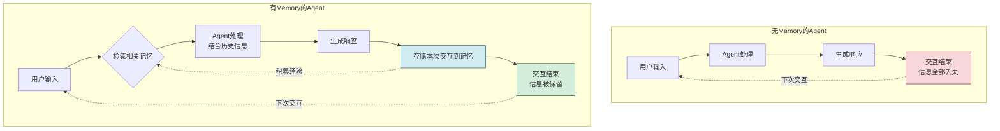

### 1.2 Memory 的核心特征

Agent Memory 不同于简单的数据存储,它具备以下核心特征:

| 特征 | 说明 | 重要性 |
|------|------|--------|
| **持久性** | 信息可以在单次交互之外长期保留 | 使 Agent 具备跨会话的连续性 |
| **选择性** | 并非所有信息都存储,有筛选和遗忘机制 | 避免信息过载,保留高价值信息 |
| **可检索性** | 存储的信息能按需高效检索 | 确保记忆在需要时被激活和使用 |
| **可更新性** | 记忆可以随新信息修正和演进 | 保持记忆的准确性和时效性 |
| **关联性** | 记忆之间存在关联,形成知识网络 | 支持联想推理和知识迁移 |
| **层次性** | 不同类型的记忆有不同的时间跨度和容量 | 适配不同认知任务的需求 |

### 1.3 Memory 在 AI 系统中的演进

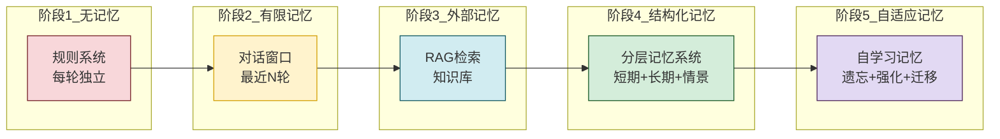

| 演进阶段 | 记忆能力 | 典型代表 | 核心局限 |
|---------|---------|---------|---------|
| **阶段1:无记忆** | 完全无状态,每次从零开始 | 早期规则系统 | 无法利用任何历史信息 |
| **阶段2:有限记忆** | 滑动窗口保留最近N轮对话 | 基础 Chatbot | 窗口外信息丢失,长程任务断裂 |
| **阶段3:外部记忆** | 通过 RAG 检索外部知识库 | RAG 增强 LLM | 仅检索静态知识,不积累交互经验 |
| **阶段4:结构化记忆** | 分层记忆系统,多类型协同 | 现代 Agent 框架 | 记忆管理复杂,需人工设计策略 |
| **阶段5:自适应记忆** | 自主学习遗忘、强化和迁移 | 前沿研究方向 | 技术不成熟,仍在探索中 |

---

## 二、Agent 为什么需要 Memory

### 2.1 核心问题:无 Memory Agent 的根本局限

要理解 Memory 的必要性,首先需要看清**没有 Memory 的 Agent 面临哪些根本性困境**。

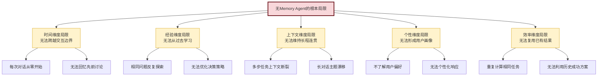

### 2.2 动机一:突破上下文窗口的固有约束

#### 2.2.1 上下文窗口的根本限制

大模型的上下文窗口(Context Window)虽然不断扩大(从 4K 到 128K 甚至更长),但始终存在**物理上限**。更关键的是,**上下文窗口 ≠ 记忆**——它只是当前推理时可"看到"的信息范围,一旦对话结束,窗口内的信息就全部消失。

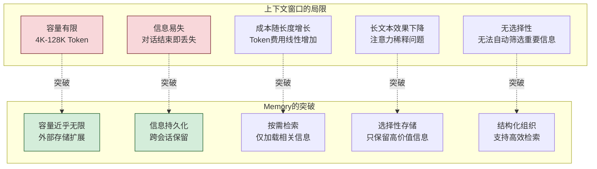

#### 2.2.2 上下文窗口 vs Memory 对比

| 维度 | 上下文窗口 | Memory |
|------|-----------|--------|
| **容量** | 有限(数千到数十万Token) | 近乎无限(外部存储) |
| **持久性** | 会话内有效,会话结束即丢失 | 跨会话持久保留 |
| **成本** | 每次推理都消耗Token | 仅检索时消耗少量Token |
| **选择性** | 无差别包含所有信息 | 按需检索相关信息 |
| **组织方式** | 线性序列 | 结构化(图、向量、键值等) |
| **可检索性** | 全量扫描 | 索引高效检索 |
| **遗忘机制** | 超出窗口直接截断 | 智能衰减和淘汰 |

#### 2.2.3 Memory 如何突破窗口限制

```python
"""
演示Memory如何突破上下文窗口限制
"""


class ContextWindowOnlyAgent:
    """仅依赖上下文窗口的Agent(无Memory)"""

    def __init__(self, llm, max_context_tokens: int = 8000):
        self.llm = llm
        self.max_context = max_context_tokens
        self.conversation_history = []  # 仅在会话内有效

    def chat(self, user_input: str) -> str:
        # 将所有历史对话塞入上下文
        self.conversation_history.append({"role": "user", "content": user_input})

        # 检查是否超出窗口
        total_tokens = sum(len(m["content"]) for m in self.conversation_history)
        if total_tokens > self.max_context:
            # 超出窗口只能截断(最早的信息丢失)
            while total_tokens > self.max_context * 0.8:
                removed = self.conversation_history.pop(0)
                total_tokens -= len(removed["content"])

        response = self.llm.generate(self.conversation_history)
        self.conversation_history.append({"role": "assistant", "content": response})
        return response

    def new_session(self):
        """新会话:所有历史信息丢失"""
        self.conversation_history = []  # 彻底清空


class MemoryEnabledAgent:
    """有Memory的Agent"""

    def __init__(self, llm, memory_store, max_context_tokens: int = 8000):
        self.llm = llm
        self.max_context = max_context_tokens
        self.memory = memory_store  # 持久化记忆存储
        self.current_session_context = []  # 当前会话的即时上下文

    def chat(self, user_input: str, user_id: str) -> str:
        # 1. 从记忆中检索相关信息(只加载需要的)
        relevant_memories = self.memory.retrieve(
            query=user_input,
            user_id=user_id,
            top_k=5  # 只检索最相关的5条
        )

        # 2. 组装上下文:系统指令 + 相关记忆 + 最近对话
        context = self._build_context(relevant_memories, user_input)

        # 3. 生成响应
        response = self.llm.generate(context)

        # 4. 将本次交互存储到记忆(持久化)
        self.memory.store({
            "user_id": user_id,
            "user_input": user_input,
            "assistant_response": response,
            "timestamp": time.time(),
            "importance": self._assess_importance(user_input, response)
        })

        self.current_session_context.append({"role": "user", "content": user_input})
        self.current_session_context.append({"role": "assistant", "content": response})

        return response

    def new_session(self, user_id: str):
        """新会话:历史记忆仍然可用"""
        # 当前会话上下文清空,但Memory中的历史信息保留
        self.current_session_context = []
        # 可以从记忆中恢复用户画像和关键偏好
        user_profile = self.memory.get_user_profile(user_id)
        if user_profile:
            self.current_session_context.append({
                "role": "system",
                "content": f"用户偏好: {user_profile}"
            })

    def _build_context(self, memories, current_input):
        """构建优化的上下文(只包含相关信息)"""
        context = [{"role": "system", "content": "你是一个有帮助的助手。"}]

        # 添加检索到的相关记忆(而非全部历史)
        for mem in memories:
            context.append({
                "role": "system",
                "content": f"[历史记忆] {mem['content']}"
            })

        # 添加当前会话最近几轮(滑动窗口)
        context.extend(self.current_session_context[-6:])
        context.append({"role": "user", "content": current_input})
        return context

    def _assess_importance(self, input_text: str, response: str) -> float:
        """评估信息重要性,决定存储优先级"""
        importance = 0.0
        # 包含用户偏好/个人信息的标记为高重要
        preference_keywords = ["我喜欢", "我偏好", "记住", "我的", "总是"]
        if any(kw in input_text for kw in preference_keywords):
            importance += 0.5
        # 长对话可能包含重要信息
        if len(input_text) > 100:
            importance += 0.2
        # 包含决策/结论的标记为中等重要
        conclusion_keywords = ["决定", "结论", "方案", "因此"]
        if any(kw in response for kw in conclusion_keywords):
            importance += 0.3
        return min(importance, 1.0)
```

### 2.3 动机二:维持任务的连贯性

许多现实任务跨越多个步骤、多个会话甚至多个时间周期,没有 Memory 的 Agent 无法维持这种长程连贯性。

```mermaid
flowchart TD
    subgraph 无Memory_多步任务断裂
        T1[步骤1:收集需求] --> T2[步骤2:设计方案]
        T2 --> S1[会话中断]
        S1 --> T3[步骤3:实施方案<br/>无法回忆步骤1和2]
        T3 --> FAIL[任务失败:<br/>上下文断裂]
    end

    subgraph 有Memory_多步任务连贯
        M1[步骤1:收集需求] --> MS1[存储需求到记忆]
        MS1 --> M2[步骤2:设计方案]
        M2 --> MS2[存储方案到记忆]
        MS2 --> S2[会话中断]
        S2 --> M3[步骤3:实施方案<br/>从记忆恢复需求和方案]
        M3 --> OK[任务成功:<br/>上下文连贯]
    end

    style FAIL fill:#f8d7da,stroke:#721c24
    style OK fill:#d4edda,stroke:#155724
    style MS1 fill:#d1ecf1,stroke:#0c5460
    style MS2 fill:#d1ecf1,stroke:#0c5460
```

**典型场景**:用户要求 Agent 协助完成一个为期一周的项目调研。每天用户与 Agent 讨论不同方面(市场分析、竞品分析、技术评估等)。如果没有 Memory:
- 每天对话开始时,Agent 不知道之前讨论了什么
- 无法将多天的讨论整合成连贯的调研报告
- 用户需要反复重复之前说过的话

有了 Memory:
- Agent 每天可以回忆前几天的讨论内容
- 能够将多天的信息整合,发现跨天的关联
- 主动推进调研进度,而非重复收集信息

### 2.4 动机三:实现持续学习与经验积累

Agent 的智能性不应仅来自预训练知识,还应来自**交互过程中积累的经验**。Memory 是持续学习的基础设施。

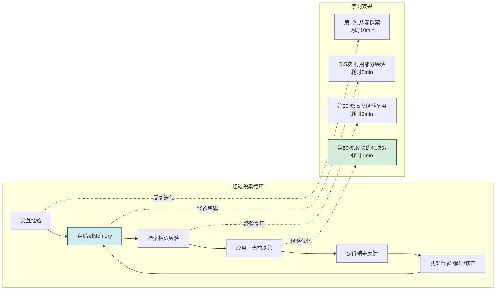

```python
class ExperienceAccumulationAgent:
    """演示经验积累的Agent"""

    def __init__(self, llm, memory_store):
        self.llm = llm
        self.memory = memory_store

    def solve_problem(self, problem: str) -> dict:
        """解决问题(利用历史经验)"""

        # 1. 检索相似问题的历史解决经验
        similar_experiences = self.memory.search_experiences(
            problem_description=problem,
            similarity_threshold=0.7,
            top_k=3
        )

        # 2. 如果有成功经验,优先复用
        successful_experiences = [
            e for e in similar_experiences if e.get("outcome") == "success"
        ]

        if successful_experiences:
            # 利用经验优化决策
            best_experience = successful_experiences[0]
            solution = self._adapt_experience(best_experience, problem)
            strategy = "experience_reuse"
        else:
            # 无可复用经验,从头探索
            solution = self._explore_solution(problem)
            strategy = "fresh_exploration"

        # 3. 执行方案并获取结果
        result = self._execute(solution)

        # 4. 存储本次经验(无论成功失败)
        self.memory.store_experience({
            "problem": problem,
            "solution": solution,
            "strategy": strategy,
            "outcome": "success" if result["success"] else "failure",
            "execution_time": result["time"],
            "timestamp": time.time()
        })

        # 5. 如果失败,记录失败教训避免重蹈覆辙
        if not result["success"]:
            self.memory.store_lesson({
                "problem_type": self._classify_problem(problem),
                "failed_approach": solution,
                "failure_reason": result["error"],
                "lesson": "此方案不可行,需尝试其他方法"
            })

        return {
            "solution": solution,
            "strategy": strategy,
            "used_experience": len(successful_experiences) > 0,
            "result": result
        }
```

### 2.5 动机四:支持个性化交互

不同用户有不同的偏好、习惯和背景。Memory 使 Agent 能够**记住用户的特征**,从而提供个性化服务。

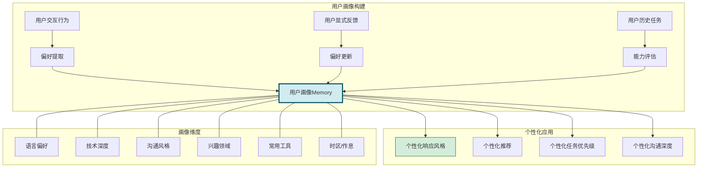

### 2.6 动机五:提升效率与降低成本

Memory 使 Agent 能够**复用历史结果**,避免重复计算和重复探索,显著提升效率并降低 Token 消耗。

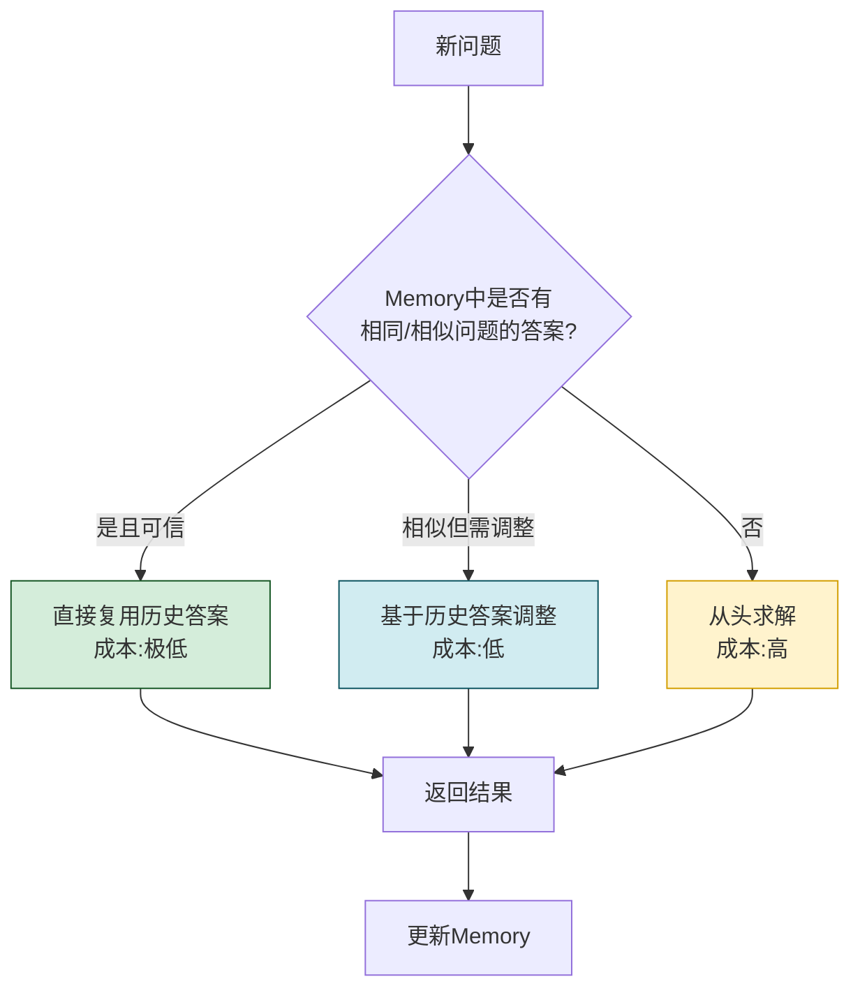

| 场景 | 无 Memory | 有 Memory | 效率提升 |
|------|----------|----------|---------|
| 重复性问题 | 每次完整推理 | 直接返回缓存结果 | 10-100x |
| 相似问题 | 每次完整推理 | 基于历史调整 | 3-10x |
| 多步任务 | 每步重新探索 | 复用历史路径 | 2-5x |
| 用户偏好 | 每次重新学习 | 直接应用画像 | 即时响应 |
| 错误避免 | 重复犯错 | 避开已知错误 | 减少重试 |

### 2.7 Memory 必要性总结

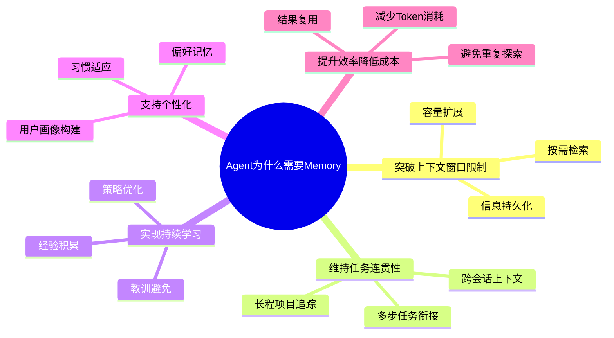

---

## 三、Memory 在 Agent 架构中的具体作用

### 3.1 Memory 的核心功能矩阵

```mermaid
flowchart TB
    subgraph Memory六大核心功能
        F1[信息存储<br/>Storage]
        F2[信息检索<br/>Retrieval]
        F3[信息组织<br/>Organization]
        F4[信息更新<br/>Update]
        F5[信息遗忘<br/>Forgetting]
        F6[信息整合<br/>Consolidation]
    end

    F1 --> F1a[原始信息持久化]
    F1 --> F1b[重要性评估与筛选]
    F1 --> F1c[结构化编码]

    F2 --> F2a[相关性检索]
    F2 --> F2b[时间检索]
    F2 --> F2c[关联检索]

    F3 --> F3a[索引构建]
    F3 --> F3b[关联图构建]
    F3 --> F3c[分类聚类]

    F4 --> F4a[新信息合并]
    F4 --> F4b[冲突信息修正]
    F4 --> F4c[时效性更新]

    F5 --> F5a[自然衰减]
    F5b[主动遗忘]
    F5 --> F5c[容量管理]

    F6 --> F6a[记忆压缩]
    F6 --> F6b[经验抽象]
    F6 --> F6c[知识提炼]

    style F1 fill:#d1ecf1,stroke:#0c5460
    style F2 fill:#d4edda,stroke:#155724
    style F3 fill:#fff3cd,stroke:#d39e00
    style F4 fill:#e2d9f3,stroke:#4a235a
    style F5 fill:#f8d7da,stroke:#721c24
    style F6 fill:#d1ecf1,stroke:#0c5460
```

### 3.2 作用一:信息存储与检索

Memory 最基础的作用是**存储交互过程中产生的信息,并在需要时高效检索**。

```python
from dataclasses import dataclass, field
from typing import Any, Optional
from enum import Enum


class MemoryType(Enum):
    """记忆类型"""
    EPISODIC = "episodic"      # 情景记忆
    SEMANTIC = "semantic"      # 语义记忆
    PROCEDURAL = "procedural"  # 程序记忆
    WORKING = "working"        # 工作记忆


@dataclass
class MemoryItem:
    """记忆条目"""
    id: str
    content: str                        # 记忆内容
    memory_type: MemoryType             # 记忆类型
    timestamp: float = field(default_factory=time.time)
    importance: float = 0.5             # 重要性(0-1)
    access_count: int = 0               # 访问次数
    last_accessed: float = 0            # 最后访问时间
    decay_factor: float = 1.0           # 衰减因子
    metadata: dict = field(default_factory=dict)  # 元数据
    embedding: list[float] = None       # 向量嵌入(用于语义检索)
    associations: list[str] = field(default_factory=list)  # 关联记忆ID

    @property
    def retrieval_score(self) -> float:
        """综合检索评分(重要性 × 衰减 × 访问频率)"""
        recency = self._compute_recency()
        frequency = min(self.access_count / 10, 1.0)
        return self.importance * self.decay_factor * (0.4 * recency + 0.3 * frequency + 0.3)

    def _compute_recency(self) -> float:
        """计算时间近度评分"""
        if self.last_accessed == 0:
            return 0.5
        age_hours = (time.time() - self.last_accessed) / 3600
        return max(0.1, 1.0 - age_hours / 168)  # 一周后衰减到0.1


class MemoryStore:
    """记忆存储与检索系统"""

    def __init__(self):
        self.memories: dict[str, MemoryItem] = {}
        self.index_by_type: dict[MemoryType, list[str]] = {
            mt: [] for mt in MemoryType
        }

    def store(self, content: str, memory_type: MemoryType,
              importance: float = 0.5, metadata: dict = None) -> str:
        """存储记忆"""
        item_id = f"mem_{int(time.time()*1000)}"
        item = MemoryItem(
            id=item_id,
            content=content,
            memory_type=memory_type,
            importance=importance,
            metadata=metadata or {},
            embedding=self._compute_embedding(content)
        )
        self.memories[item_id] = item
        self.index_by_type[memory_type].append(item_id)
        return item_id

    def retrieve(self, query: str, memory_type: MemoryType = None,
                 top_k: int = 5) -> list[MemoryItem]:
        """检索记忆"""
        query_embedding = self._compute_embedding(query)
        candidates = list(self.memories.values())

        # 按类型过滤
        if memory_type:
            candidates = [m for m in candidates if m.memory_type == memory_type]

        # 计算相关性评分
        scored = []
        for mem in candidates:
            similarity = self._cosine_similarity(query_embedding, mem.embedding)
            score = similarity * mem.retrieval_score
            scored.append((mem, score))

        # 按评分排序,取TopK
        scored.sort(key=lambda x: x[1], reverse=True)

        # 更新被检索记忆的访问信息
        results = []
        for mem, score in scored[:top_k]:
            mem.access_count += 1
            mem.last_accessed = time.time()
            results.append(mem)

        return results

    def _compute_embedding(self, text: str) -> list[float]:
        """计算文本向量嵌入(实际使用Embedding模型)"""
        # 简化实现:实际调用嵌入模型
        return [0.0] * 128

    def _cosine_similarity(self, v1: list[float], v2: list[float]) -> float:
        """余弦相似度"""
        if not v1 or not v2:
            return 0.0
        dot = sum(a * b for a, b in zip(v1, v2))
        norm1 = sum(a * a for a in v1) ** 0.5
        norm2 = sum(b * b for b in v2) ** 0.5
        return dot / (norm1 * norm2) if norm1 > 0 and norm2 > 0 else 0.0
```

### 3.3 作用二:上下文维护

Memory 维护 Agent 的**认知上下文**,使其在长程交互中保持对"当前状态"的清晰认知。

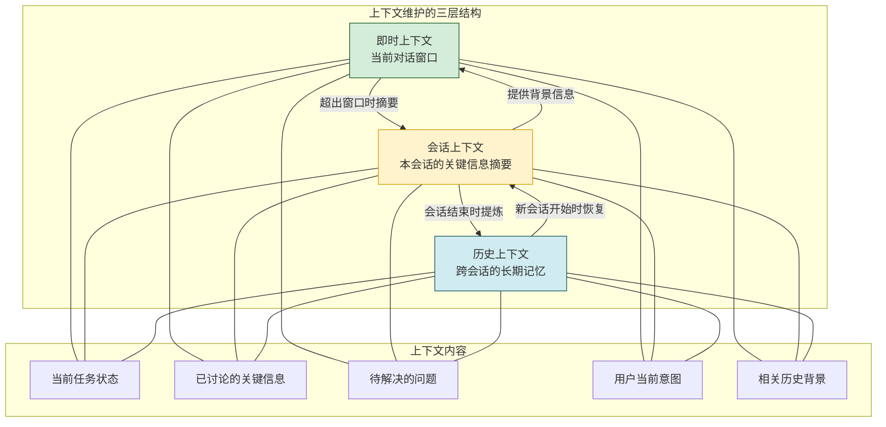

```python
class ContextManager:
    """上下文管理器"""

    def __init__(self, memory_store: MemoryStore, max_window_tokens: int = 4000):
        self.memory = memory_store
        self.max_window = max_window_tokens
        self.immediate_context = []          # 即时上下文(当前窗口)
        self.session_summary = ""            # 会话摘要
        self.session_key_points = []         # 会话关键信息

    def add_message(self, role: str, content: str):
        """添加消息到即时上下文"""
        self.immediate_context.append({
            "role": role,
            "content": content,
            "timestamp": time.time()
        })
        # 检查是否需要压缩
        if self._estimate_tokens() > self.max_window:
            self._compress_context()

    def _compress_context(self):
        """压缩上下文:将旧消息摘要化"""
        # 将较早的消息压缩为摘要
        old_messages = self.immediate_context[:-4]  # 保留最近4条
        recent_messages = self.immediate_context[-4:]

        # 生成摘要(实际用LLM生成)
        summary_content = self._generate_summary(old_messages)
        self.session_summary += f"\n{summary_content}"

        # 提取关键信息
        key_points = self._extract_key_points(old_messages)
        self.session_key_points.extend(key_points)

        # 保留最近消息+摘要
        self.immediate_context = [
            {"role": "system", "content": f"[会话摘要] {self.session_summary}"}
        ] + recent_messages

    def get_context(self, current_input: str) -> list[dict]:
        """获取完整上下文(即时+会话+历史)"""
        context = []

        # 1. 会话摘要(如果有)
        if self.session_summary:
            context.append({
                "role": "system",
                "content": f"[本会话摘要] {self.session_summary}"
            })

        # 2. 从长期记忆检索相关背景
        relevant_memories = self.memory.retrieve(
            query=current_input,
            top_k=3
        )
        for mem in relevant_memories:
            context.append({
                "role": "system",
                "content": f"[相关记忆] {mem.content}"
            })

        # 3. 即时上下文(最近对话)
        context.extend(self.immediate_context)

        return context

    def save_session(self):
        """保存会话到长期记忆"""
        if self.session_key_points:
            self.memory.store(
                content=f"会话关键信息: {'; '.join(self.session_key_points)}",
                memory_type=MemoryType.EPISODIC,
                importance=0.7
            )

    def _generate_summary(self, messages: list[dict]) -> str:
        """生成摘要(简化实现)"""
        return f"之前讨论了{len(messages)}条消息,主要内容涉及..."

    def _extract_key_points(self, messages: list[dict]) -> list[str]:
        """提取关键信息(简化实现)"""
        return [f"关键点: {m['content'][:50]}" for m in messages[:3]]

    def _estimate_tokens(self) -> int:
        """估算当前Token数"""
        return sum(len(m["content"]) // 4 for m in self.immediate_context)
```

### 3.4 作用三:经验积累与知识管理

Memory 不仅是被动的信息存储,更是主动的**知识管理器**,将零散的交互经验提炼为结构化知识。

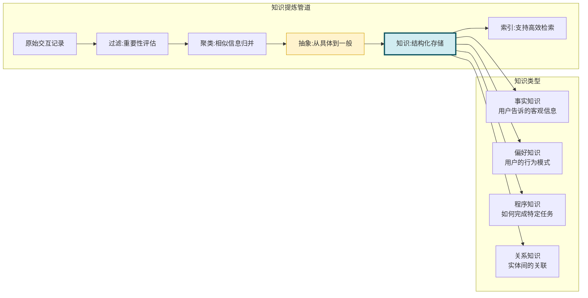

### 3.5 作用四:状态追踪

Agent 在执行多步任务时,需要追踪**任务执行状态、中间结果和待办事项**,这些状态信息由 Memory 维护。

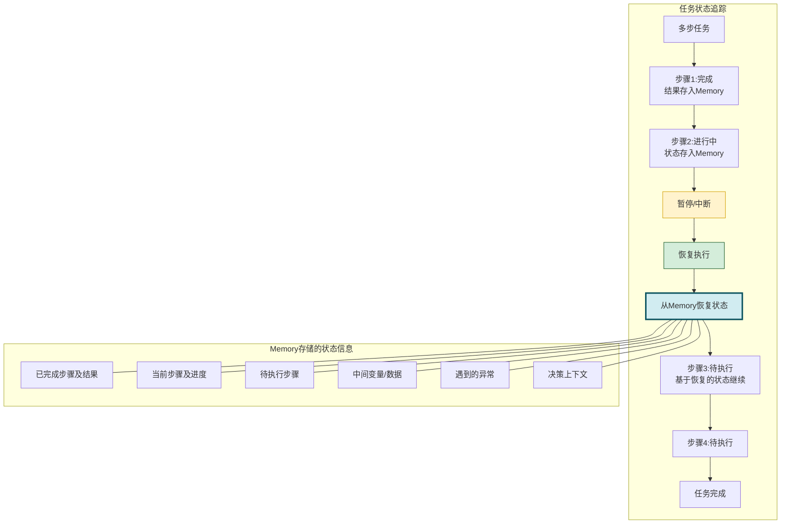

```python
@dataclass
class TaskState:
    """任务状态(存储在Memory中)"""
    task_id: str
    task_description: str
    total_steps: int
    completed_steps: list[dict] = field(default_factory=list)  # 已完成步骤及结果
    current_step: dict = None                                   # 当前步骤
    pending_steps: list[dict] = field(default_factory=list)    # 待执行步骤
    intermediate_data: dict = field(default_factory=dict)      # 中间数据
    exceptions: list[dict] = field(default_factory=list)       # 遇到的异常
    created_at: float = field(default_factory=time.time)
    updated_at: float = field(default_factory=time.time)
    status: str = "in_progress"  # in_progress / paused / completed / failed


class TaskStateManager:
    """任务状态管理器(基于Memory)"""

    def __init__(self, memory_store: MemoryStore):
        self.memory = memory_store
        self.active_tasks: dict[str, TaskState] = {}

    def save_state(self, task_state: TaskState):
        """保存任务状态到Memory"""
        task_state.updated_at = time.time()
        self.active_tasks[task_state.task_id] = task_state

        # 同时持久化到长期记忆(支持跨会话恢复)
        self.memory.store(
            content=f"任务状态: {task_state.task_description} | "
                    f"进度: {len(task_state.completed_steps)}/{task_state.total_steps} | "
                    f"状态: {task_state.status}",
            memory_type=MemoryType.EPISODIC,
            importance=0.8,
            metadata={
                "task_id": task_state.task_id,
                "task_state": task_state.__dict__
            }
        )

    def restore_state(self, task_id: str) -> Optional[TaskState]:
        """从Memory恢复任务状态"""
        # 先检查活跃任务
        if task_id in self.active_tasks:
            return self.active_tasks[task_id]

        # 从长期记忆中检索
        memories = self.memory.retrieve(
            query=f"task_id:{task_id}",
            memory_type=MemoryType.EPISODIC,
            top_k=1
        )
        if memories:
            return TaskState(**memories[0].metadata.get("task_state", {}))
        return None

    def pause_task(self, task_id: str):
        """暂停任务(状态保存到Memory)"""
        if task_id in self.active_tasks:
            self.active_tasks[task_id].status = "paused"
            self.save_state(self.active_tasks[task_id])

    def resume_task(self, task_id: str) -> Optional[TaskState]:
        """恢复暂停的任务"""
        state = self.restore_state(task_id)
        if state and state.status == "paused":
            state.status = "in_progress"
            self.save_state(state)
            return state
        return None
```

### 3.6 Memory 在 Agent 架构中的位置

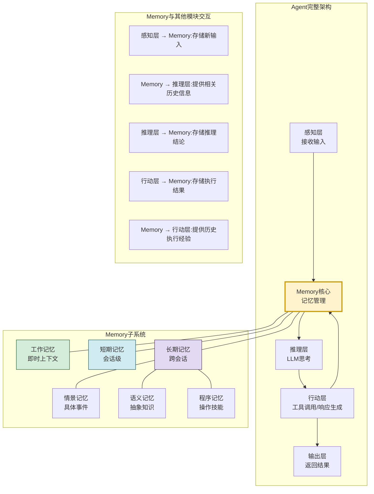

Memory 在 Agent 架构中处于**中枢位置**,连接感知、推理和行动三个核心层。每一次交互都会经过 Memory:输入时从 Memory 检索相关信息,输出时将新信息存入 Memory。这种设计使 Agent 的每一个决策都受益于历史经验。

---

## 四、Memory 类型体系详解

### 4.1 Memory 类型分类全景

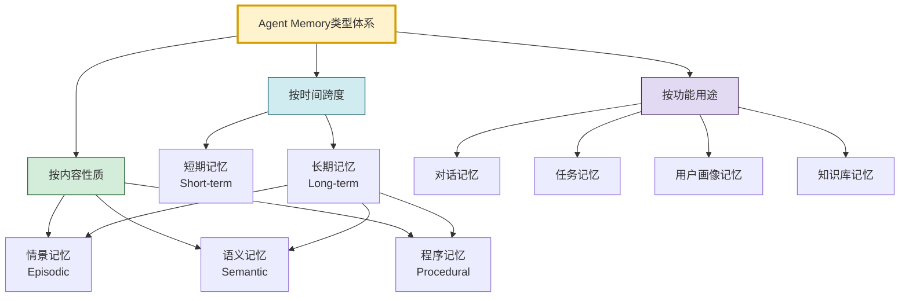

### 4.2 按时间跨度分类

#### 4.2.1 短期记忆(Short-term Memory / 工作记忆)

**定义**:存储当前正在处理的即时信息,容量有限,持续时间短(当前会话内)。

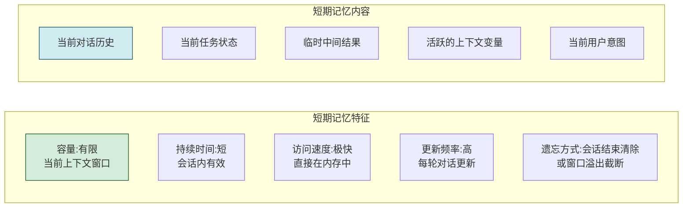

**应用场景**:
- 多轮对话中保持话题连贯
- 多步推理中暂存中间结果
- 当前任务执行中的状态追踪

#### 4.2.2 长期记忆(Long-term Memory)

**定义**:存储经过筛选和编码的持久信息,容量大,持续时间长(跨会话)。

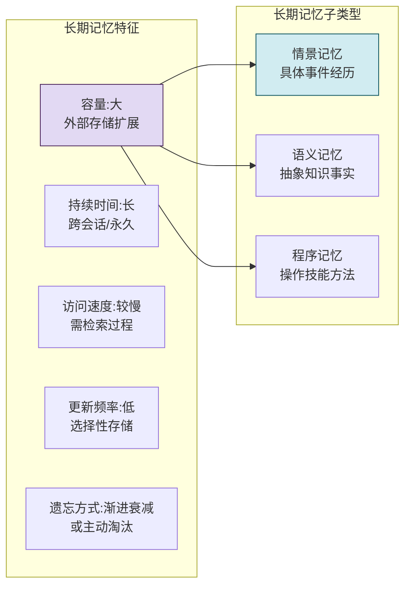

### 4.3 按内容性质分类(三大核心记忆类型)

#### 4.3.1 三大记忆类型对比

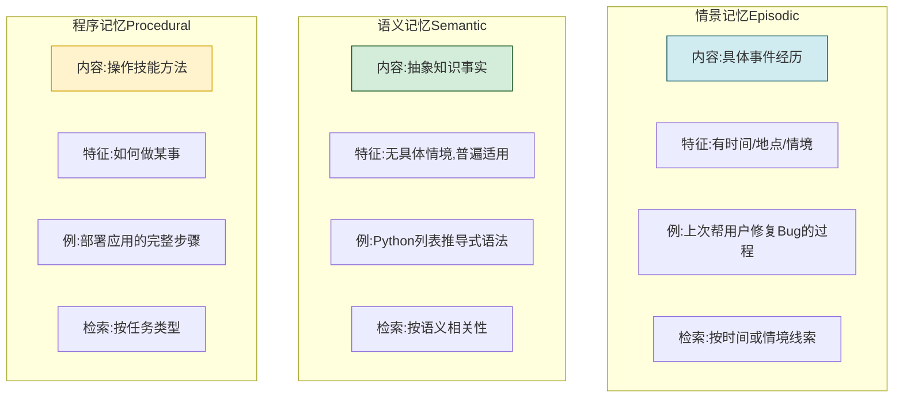

| 维度 | 情景记忆 | 语义记忆 | 程序记忆 |
|------|---------|---------|---------|
| **内容性质** | 具体事件、个人经历 | 抽象知识、客观事实 | 操作步骤、技能方法 |
| **时间标记** | 有明确时间/情境 | 无时间标记 | 无时间标记 |
| **存储形式** | 事件序列 | 知识图谱/事实库 | 流程模板/操作链 |
| **检索方式** | 按时间或情境线索 | 按语义相关性 | 按任务类型匹配 |
| **更新方式** | 新事件追加 | 事实修正/扩展 | 技能优化/新增 |
| **遗忘特点** | 容易遗忘细节 | 相对稳定 | 熟练后不易遗忘 |
| **Agent示例** | "上周用户问了X,我回答了Y" | "Python的GIL是什么" | "如何部署一个Flask应用" |

#### 4.3.2 情景记忆详解

```python
@dataclass
class EpisodicMemory:
    """情景记忆:记录具体的事件经历"""
    id: str
    event: str                           # 事件描述
    timestamp: float                     # 发生时间
    context: dict                        # 情境上下文
    participants: list[str]              # 参与者(用户、Agent等)
    actions: list[dict]                  # 行动序列
    outcome: str                         # 结果
    emotional_valence: float = 0.0       # 情感效价(正面/负面)
    lessons_learned: str = ""            # 经验教训
    metadata: dict = field(default_factory=dict)


class EpisodicMemoryStore:
    """情景记忆存储"""

    def __init__(self):
        self.episodes: list[EpisodicMemory] = []

    def record_episode(self, event: str, context: dict,
                       actions: list[dict], outcome: str,
                       participants: list[str] = None):
        """记录一个情景"""
        episode = EpisodicMemory(
            id=f"epi_{int(time.time()*1000)}",
            event=event,
            timestamp=time.time(),
            context=context,
            participants=participants or ["user", "agent"],
            actions=actions,
            outcome=outcome,
            emotional_valence=self._assess_valence(outcome)
        )
        self.episodes.append(episode)
        return episode

    def recall_by_time(self, start_time: float,
                       end_time: float = None) -> list[EpisodicMemory]:
        """按时间范围回忆"""
        end_time = end_time or time.time()
        return [e for e in self.episodes
                if start_time <= e.timestamp <= end_time]

    def recall_by_context(self, context_query: dict) -> list[EpisodicMemory]:
        """按情境线索回忆"""
        results = []
        for episode in self.episodes:
            similarity = self._context_similarity(episode.context, context_query)
            if similarity > 0.5:
                results.append((episode, similarity))
        results.sort(key=lambda x: x[1], reverse=True)
        return [r[0] for r in results]

    def extract_lesson(self, episode: EpisodicMemory) -> str:
        """从情景中提取经验教训"""
        if episode.outcome == "success":
            return f"成功做法: {episode.actions}"
        else:
            return f"失败教训: 在{episode.event}中, {episode.actions}导致了{episode.outcome}"

    def _assess_valence(self, outcome: str) -> float:
        """评估结果的情感效价"""
        positive_keywords = ["成功", "完成", "解决", "正确"]
        negative_keywords = ["失败", "错误", "异常", "超时"]
        if any(kw in outcome for kw in positive_keywords):
            return 0.8
        elif any(kw in outcome for kw in negative_keywords):
            return -0.5
        return 0.0

    def _context_similarity(self, ctx1: dict, ctx2: dict) -> float:
        """计算情境相似度"""
        common_keys = set(ctx1.keys()) & set(ctx2.keys())
        if not common_keys:
            return 0.0
        matches = sum(1 for k in common_keys if ctx1[k] == ctx2[k])
        return matches / len(common_keys)
```

#### 4.3.3 语义记忆详解

```python
@dataclass
class SemanticMemory:
    """语义记忆:存储抽象知识和事实"""
    id: str
    concept: str                          # 概念/实体
    fact: str                             # 事实陈述
    category: str                         # 知识类别
    confidence: float = 1.0               # 置信度
    sources: list[str] = field(default_factory=list)  # 来源
    relations: dict = field(default_factory=dict)     # 关系(概念图)
    last_verified: float = field(default_factory=time.time)


class SemanticMemoryStore:
    """语义记忆存储(知识图谱式)"""

    def __init__(self):
        self.knowledge: dict[str, SemanticMemory] = {}
        self.concept_index: dict[str, list[str]] = {}  # 类别索引

    def add_fact(self, concept: str, fact: str, category: str,
                 confidence: float = 1.0, source: str = ""):
        """添加知识事实"""
        fact_id = f"sem_{hash(concept + fact) % 100000}"

        if fact_id in self.knowledge:
            # 已存在,更新置信度和来源
            existing = self.knowledge[fact_id]
            existing.confidence = max(existing.confidence, confidence)
            if source:
                existing.sources.append(source)
        else:
            memory = SemanticMemory(
                id=fact_id,
                concept=concept,
                fact=fact,
                category=category,
                confidence=confidence,
                sources=[source] if source else []
            )
            self.knowledge[fact_id] = memory
            # 更新类别索引
            if category not in self.concept_index:
                self.concept_index[category] = []
            self.concept_index[category].append(fact_id)

        return fact_id

    def query(self, concept: str = None, category: str = None,
              query_text: str = None) -> list[SemanticMemory]:
        """查询知识"""
        results = []

        if concept:
            # 按概念精确查询
            for mem in self.knowledge.values():
                if concept.lower() in mem.concept.lower():
                    results.append(mem)
        elif category:
            # 按类别查询
            fact_ids = self.concept_index.get(category, [])
            results = [self.knowledge[fid] for fid in fact_ids]

        # 按查询文本语义检索
        if query_text:
            results = [r for r in results if query_text.lower() in r.fact.lower()]

        return results

    def add_relation(self, concept1: str, relation: str, concept2: str):
        """添加概念间关系(构建知识图谱)"""
        for mem in self.knowledge.values():
            if mem.concept == concept1:
                if relation not in mem.relations:
                    mem.relations[relation] = []
                mem.relations[relation].append(concept2)
                break
```

#### 4.3.4 程序记忆详解

```python
@dataclass
class ProceduralMemory:
    """程序记忆:存储操作技能和方法"""
    id: str
    skill_name: str                       # 技能名称
    task_type: str                        # 适用任务类型
    steps: list[dict]                     # 操作步骤
    prerequisites: list[str]              # 前置条件
    expected_outcome: str                 # 预期结果
    success_rate: float = 0.0             # 历史成功率
    execution_count: int = 0              # 执行次数
    last_used: float = 0                  # 最后使用时间
    variations: list[dict] = field(default_factory=list)  # 变体(不同场景的调整)


class ProceduralMemoryStore:
    """程序记忆存储"""

    def __init__(self):
        self.skills: dict[str, ProceduralMemory] = {}

    def learn_skill(self, skill_name: str, task_type: str,
                    steps: list[dict], prerequisites: list[str] = None,
                    expected_outcome: str = ""):
        """学习新技能"""
        skill_id = f"proc_{skill_name}"
        skill = ProceduralMemory(
            id=skill_id,
            skill_name=skill_name,
            task_type=task_type,
            steps=steps,
            prerequisites=prerequisites or [],
            expected_outcome=expected_outcome
        )
        self.skills[skill_id] = skill
        return skill_id

    def retrieve_skill(self, task_type: str,
                       context: dict = None) -> Optional[ProceduralMemory]:
        """检索适用技能"""
        candidates = [
            s for s in self.skills.values()
            if s.task_type == task_type and self._check_prerequisites(s, context)
        ]
        if not candidates:
            return None
        # 按成功率排序
        candidates.sort(key=lambda s: s.success_rate, reverse=True)
        return candidates[0]

    def update_skill_performance(self, skill_id: str, success: bool):
        """更新技能的历史表现"""
        if skill_id in self.skills:
            skill = self.skills[skill_id]
            skill.execution_count += 1
            # 滑动平均更新成功率
            alpha = 0.3
            skill.success_rate = (
                alpha * (1.0 if success else 0.0) +
                (1 - alpha) * skill.success_rate
            )
            skill.last_used = time.time()

    def _check_prerequisites(self, skill: ProceduralMemory,
                              context: dict) -> bool:
        """检查前置条件是否满足"""
        if not skill.prerequisites:
            return True
        if not context:
            return False
        return all(context.get(p) for p in skill.prerequisites)
```

### 4.4 按功能用途分类

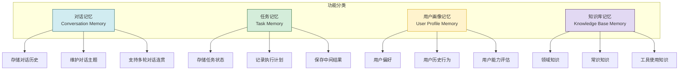

| 功能类型 | 存储内容 | 时间跨度 | 应用场景 | 更新频率 |
|---------|---------|:--------:|---------|:--------:|
| **对话记忆** | 对话历史、主题、摘要 | 短期 | 多轮对话、上下文理解 | 高 |
| **任务记忆** | 任务状态、计划、中间结果 | 中期 | 多步任务、可中断恢复 | 中 |
| **用户画像** | 偏好、习惯、能力评估 | 长期 | 个性化服务、推荐 | 低 |
| **知识库** | 领域知识、事实、技能 | 长期 | 知识问答、任务执行 | 低 |

### 4.5 Memory 类型综合对比

| 维度 | 工作记忆 | 短期记忆 | 长期-情景 | 长期-语义 | 长期-程序 |
|------|---------|---------|----------|----------|----------|
| **时间跨度** | 秒-分钟 | 分钟-小时 | 天-月 | 月-永久 | 月-永久 |
| **容量** | 极小(7±2项) | 中(上下文窗口) | 大 | 大 | 中 |
| **检索速度** | 即时 | 快 | 中 | 中 | 快 |
| **存储成本** | 低 | 低 | 高 | 中 | 中 |
| **更新方式** | 实时覆盖 | 追加+截断 | 事件追加 | 事实修正 | 技能优化 |
| **遗忘机制** | 主动清除 | 窗口溢出 | 时间衰减 | 相对稳定 | 不易遗忘 |
| **技术实现** | 内存变量 | 对话历史 | 事件日志+向量库 | 知识图谱 | 流程模板库 |
| **检索方法** | 直接访问 | 线性扫描 | 时间/情境检索 | 语义检索 | 任务匹配 |

---

## 五、Memory 如何支持 Agent 核心能力

### 5.1 能力一:持续学习

Memory 使 Agent 从"静态知识系统"进化为"动态学习系统",能够从每次交互中积累经验,持续提升能力。

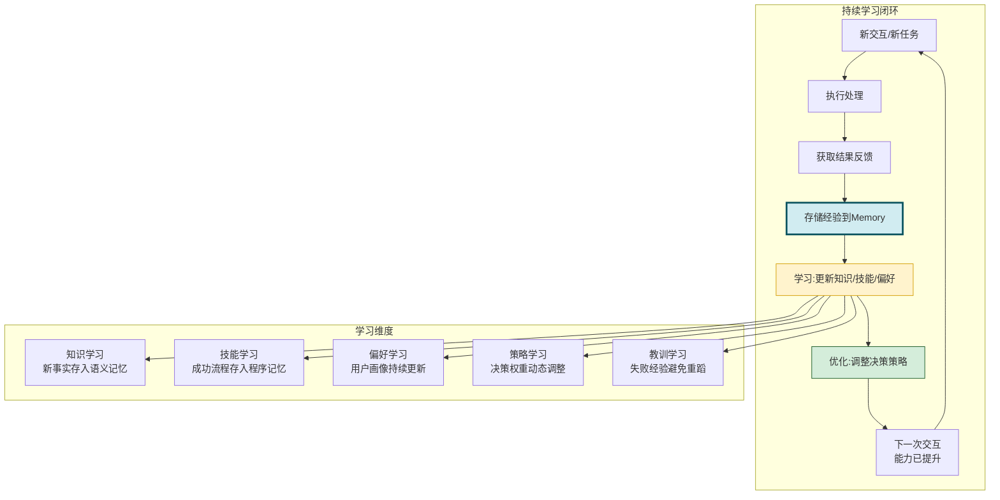

```python
class ContinuousLearningAgent:
    """持续学习Agent"""

    def __init__(self, llm, memory: MemoryStore):
        self.llm = llm
        self.memory = memory
        self.episodic_store = EpisodicMemoryStore()
        self.semantic_store = SemanticMemoryStore()
        self.procedural_store = ProceduralMemoryStore()

    def handle_task(self, task: str, user_id: str) -> dict:
        """处理任务(持续学习)"""

        # 1. 从记忆中检索相关经验
        relevant_skills = self.procedural_store.retrieve_skill(
            task_type=self._classify_task(task)
        )
        similar_episodes = self.episodic_store.recall_by_context(
            {"task": task, "user_id": user_id}
        )
        relevant_knowledge = self.semantic_store.query(query_text=task)

        # 2. 结合记忆经验制定方案
        if relevant_skills and relevant_skills.success_rate > 0.7:
            # 复用高成功率技能
            solution = self._apply_skill(relevant_skills, task)
            strategy = "skill_reuse"
        elif similar_episodes:
            # 基于历史经验调整
            solution = self._adapt_from_episodes(similar_episodes, task)
            strategy = "experience_adaptation"
        else:
            # 从头探索
            solution = self._explore_fresh(task, relevant_knowledge)
            strategy = "fresh_exploration"

        # 3. 执行方案
        result = self._execute(solution)

        # 4. 学习:存储本次经验
        self._learn_from_experience(task, solution, result, strategy)

        # 5. 更新知识库
        self._update_knowledge(task, result)

        return {
            "solution": solution,
            "result": result,
            "strategy": strategy,
            "learned": True
        }

    def _learn_from_experience(self, task, solution, result, strategy):
        """从经验中学习"""
        # 记录情景记忆
        self.episodic_store.record_episode(
            event=task,
            context={"task": task, "strategy": strategy},
            actions=solution.get("steps", []),
            outcome="success" if result["success"] else "failure"
        )

        # 如果是成功的新方案,学习为技能
        if result["success"] and strategy == "fresh_exploration":
            self.procedural_store.learn_skill(
                skill_name=f"skill_{task[:20]}",
                task_type=self._classify_task(task),
                steps=solution.get("steps", []),
                expected_outcome=result.get("output", "")
            )

        # 更新已有技能的成功率
        if strategy == "skill_reuse" and "skill_id" in solution:
            self.procedural_store.update_skill_performance(
                solution["skill_id"], result["success"]
            )

        # 记录失败教训
        if not result["success"]:
            self.memory.store(
                content=f"失败教训: {task} | 方案: {solution} | 原因: {result.get('error')}",
                memory_type=MemoryType.EPISODIC,
                importance=0.8  # 失败教训重要
            )

    def _update_knowledge(self, task, result):
        """更新知识库"""
        if result["success"] and result.get("new_knowledge"):
            for fact in result["new_knowledge"]:
                self.semantic_store.add_fact(
                    concept=fact.get("concept", task),
                    fact=fact["content"],
                    category=fact.get("category", "general"),
                    source="learned_from_interaction"
                )
```

### 5.2 能力二:上下文理解

Memory 使 Agent 能够**理解当前输入在更广阔上下文中的含义**,而非孤立地处理每条消息。

```mermaid
flowchart LR
    subgraph 上下文理解层次
        direction TB
        L1[即时上下文<br/>当前对话的最近几轮]
        L2[会话上下文<br/>本会话的主题和进展]
        L3[历史上下文<br/>与该用户的历史交互]
        L4[知识上下文<br/>相关的领域知识]
    end

    U[用户输入] --> M{Memory检索}

    M --> L1
    M --> L2
    M --> L3
    M --> L4

    L1 & L2 & L3 & L4 --> U2[增强理解<br/>综合多层上下文]
    U2 --> R[精准响应]

    style M fill:#fff3cd,stroke:#d39e00,stroke-width:3px
    style U2 fill:#d4edda,stroke:#155724
```

**示例**:用户说"继续上次的工作"。

- **无 Memory**:Agent 不知道"上次的工作"是什么,只能询问用户。
- **有 Memory**:Agent 从记忆中检索到上次会话的任务状态、进展和待办事项,直接从断点继续。

```python
class ContextUnderstandingAgent:
    """上下文理解Agent"""

    def __init__(self, llm, memory: MemoryStore):
        self.llm = llm
        self.memory = memory

    def understand_input(self, user_input: str,
                         user_id: str) -> dict:
        """理解用户输入(结合多层上下文)"""
        understanding = {
            "immediate_context": self._get_immediate_context(),
            "session_context": self._get_session_context(),
            "historical_context": self._get_historical_context(user_id, user_input),
            "knowledge_context": self._get_knowledge_context(user_input)
        }

        # 消歧:利用上下文理解模糊指代
        if self._is_ambiguous(user_input):
            resolved = self._resolve_reference(user_input, understanding)
            understanding["resolved_references"] = resolved

        return understanding

    def _resolve_reference(self, user_input: str,
                           context: dict) -> dict:
        """利用上下文消解指代"""
        references = {}

        # "它"/"这个" → 从最近上下文中找到最近提及的实体
        if "它" in user_input or "这个" in user_input:
            recent_entities = self._extract_entities_from_context(
                context["immediate_context"]
            )
            if recent_entities:
                references["它"] = recent_entities[-1]

        # "上次"/"之前" → 从历史记忆中检索
        if "上次" in user_input or "之前" in user_input:
            historical = context["historical_context"]
            if historical:
                references["上次"] = historical[0].get("task_description")

        # "继续" → 从记忆中找到未完成的任务
        if "继续" in user_input:
            unfinished = self._find_unfinished_tasks(context["historical_context"])
            if unfinished:
                references["继续"] = unfinished[0]

        return references

    def _is_ambiguous(self, text: str) -> bool:
        """判断输入是否包含模糊指代"""
        ambiguous_words = ["它", "这个", "那个", "上次", "之前", "继续", "刚才"]
        return any(word in text for word in ambiguous_words)

    def _get_immediate_context(self) -> list:
        return []  # 当前会话最近对话

    def _get_session_context(self) -> dict:
        return {}  # 当前会话主题和进展

    def _get_historical_context(self, user_id: str, query: str) -> list:
        return self.memory.retrieve(query=query, top_k=5)

    def _get_knowledge_context(self, query: str) -> list:
        return self.memory.retrieve(query=query, top_k=3)

    def _extract_entities_from_context(self, context) -> list:
        return []  # 简化实现

    def _find_unfinished_tasks(self, history) -> list:
        return [h for h in history if "未完成" in str(h)]
```

### 5.3 能力三:决策优化

Memory 使 Agent 的决策**基于历史经验而非随机探索**,显著提升决策质量和效率。

```mermaid
flowchart TD
    D[需要决策] --> M{Memory检索}

    M --> H1[历史成功经验]
    M --> H2[历史失败教训]
    M --> H3[用户偏好信息]
    M --> H4[相关知识事实]

    H1 --> W1[加分:成功路径权重提升]
    H2 --> W2[减分:失败路径权重降低]
    H3 --> W3[调整:偏好方向加权]
    H4 --> W4[约束:知识边界限定]

    W1 & W2 & W3 & W4 --> O[优化后的决策]
    O --> E[执行]
    E --> R[结果反馈]
    R --> U[更新Memory<br/>强化学习闭环]

    style M fill:#fff3cd,stroke:#d39e00,stroke-width:3px
    style O fill:#d4edda,stroke:#155724
    style U fill:#d1ecf1,stroke:#0c5460
```

```python
class MemoryEnhancedDecisionMaker:
    """基于Memory增强的决策器"""

    def __init__(self, llm, memory: MemoryStore):
        self.llm = llm
        self.memory = memory
        self.decision_weights: dict[str, float] = {}  # 决策路径权重

    def make_decision(self, context: dict,
                      candidates: list[dict]) -> dict:
        """基于Memory优化的决策"""
        scored_candidates = []

        for candidate in candidates:
            score = candidate.get("base_score", 0.5)

            # 1. 检索历史成功经验(加分)
            success_experiences = self.memory.retrieve(
                query=f"成功 {candidate['action_type']}",
                top_k=3
            )
            for exp in success_experiences:
                if "成功" in exp.content:
                    score += 0.15 * exp.importance

            # 2. 检索历史失败教训(减分)
            failure_experiences = self.memory.retrieve(
                query=f"失败 {candidate['action_type']}",
                top_k=3
            )
            for exp in failure_experiences:
                if "失败" in exp.content:
                    score -= 0.2 * exp.importance

            # 3. 考虑用户偏好(调整)
            user_prefs = self.memory.retrieve(
                query=f"偏好 {context.get('user_id', '')}",
                top_k=2
            )
            for pref in user_prefs:
                if self._matches_preference(candidate, pref.content):
                    score += 0.1

            # 4. 应用决策路径权重(强化学习)
            path_key = f"{candidate['action_type']}_{context.get('task_type', '')}"
            weight = self.decision_weights.get(path_key, 1.0)
            score *= weight

            scored_candidates.append({
                "candidate": candidate,
                "score": max(0, min(1, score)),
                "score_breakdown": {
                    "base": candidate.get("base_score", 0.5),
                    "success_bonus": sum(0.15 * e.importance for e in success_experiences if "成功" in e.content),
                    "failure_penalty": sum(0.2 * e.importance for e in failure_experiences if "失败" in e.content),
                    "preference_adjustment": 0.1 * len(user_prefs),
                    "path_weight": weight
                }
            })

        # 选择最高分候选
        scored_candidates.sort(key=lambda x: x["score"], reverse=True)
        best = scored_candidates[0]

        return {
            "decision": best["candidate"],
            "score": best["score"],
            "alternatives": scored_candidates[1:],
            "reasoning": best["score_breakdown"]
        }

    def update_decision_weight(self, action_type: str, task_type: str,
                                success: bool):
        """更新决策路径权重(强化学习)"""
        path_key = f"{action_type}_{task_type}"
        current_weight = self.decision_weights.get(path_key, 1.0)

        if success:
            # 成功:权重提升(有上限)
            new_weight = min(1.5, current_weight * 1.1)
        else:
            # 失败:权重降低(有下限)
            new_weight = max(0.3, current_weight * 0.9)

        self.decision_weights[path_key] = new_weight

    def _matches_preference(self, candidate: dict,
                             preference: str) -> bool:
        """判断候选方案是否匹配用户偏好"""
        # 简化实现
        return any(word in str(candidate) for word in preference.split())
```

### 5.4 能力四:任务连贯性维持

Memory 使 Agent 能够在**跨会话、跨时间**的长程任务中保持连贯性,这是复杂 Agent 应用的关键需求。

```mermaid
flowchart TD
    subgraph 长程任务连贯性
        S1[第1天:任务启动<br/>需求收集与分析] --> M1[Memory:存储需求和分析结果]
        M1 --> S2[第2天:方案设计<br/>基于昨天的需求]
        S2 --> M2[Memory:存储设计方案]
        M2 --> S3[第3天:方案评审<br/>对照需求和方案]
        S3 --> M3[Memory:存储评审意见]
        M3 --> S4[第4天:方案修改<br/>基于评审意见]
        S4 --> M4[Memory:更新设计方案]
        M4 --> S5[第5天:最终交付<br/>整合所有信息]
    end

    subgraph Memory维护的连贯性信息
        C1[任务目标与范围]
        C2[已完成的工作]
        C3[关键决策及理由]
        C4[待解决的问题]
        C5[各方反馈意见]
        C6[变更历史]
    end

    M1 & M2 & M3 & M4 --- C1 & C2 & C3 & C4 & C5 & C6

    style M1 fill:#d1ecf1,stroke:#0c5460
    style M2 fill:#d1ecf1,stroke:#0c5460
    style M3 fill:#d1ecf1,stroke:#0c5460
    style M4 fill:#d1ecf1,stroke:#0c5460
    style S5 fill:#d4edda,stroke:#155724
```

```python
class TaskCoherenceManager:
    """任务连贯性管理器"""

    def __init__(self, memory: MemoryStore):
        self.memory = memory

    def start_session(self, task_id: str, user_id: str) -> dict:
        """开始新会话时恢复任务上下文"""
        # 从Memory中恢复任务状态
        task_state = self._restore_task_state(task_id)
        if not task_state:
            return {"is_new_task": True, "message": "这是一个新任务"}

        # 恢复连贯性信息
        coherence_info = {
            "task_id": task_id,
            "task_description": task_state.get("description"),
            "completed_work": task_state.get("completed_steps", []),
            "key_decisions": task_state.get("decisions", []),
            "pending_issues": task_state.get("pending_issues", []),
            "feedback_history": task_state.get("feedbacks", []),
            "last_session_summary": task_state.get("last_summary", ""),
            "progress": self._compute_progress(task_state)
        }

        return {
            "is_new_task": False,
            "coherence_info": coherence_info,
            "message": f"恢复任务上下文:已完成{coherence_info['progress']}%,继续上次的工作"
        }

    def end_session(self, task_id: str, session_summary: str,
                    new_decisions: list, new_issues: list):
        """结束会话时保存任务上下文"""
        # 更新Memory中的任务状态
        self.memory.store(
            content=f"任务{task_id}会话摘要: {session_summary}",
            memory_type=MemoryType.EPISODIC,
            importance=0.8,
            metadata={
                "task_id": task_id,
                "session_summary": session_summary,
                "new_decisions": new_decisions,
                "new_issues": new_issues,
                "timestamp": time.time()
            }
        )

    def maintain_coherence(self, task_id: str,
                            current_input: str) -> dict:
        """维持任务连贯性的检查"""
        coherence_check = {
            "is_on_track": True,
            "warnings": [],
            "suggestions": []
        }

        # 检查1:当前输入是否与任务目标相关
        task_state = self._restore_task_state(task_id)
        if task_state:
            relevance = self._check_relevance(
                current_input, task_state.get("description", "")
            )
            if relevance < 0.3:
                coherence_check["warnings"].append(
                    "当前输入似乎偏离了任务目标,是否需要确认?"
                )

        # 检查2:是否遗漏了待解决的重要问题
        pending = task_state.get("pending_issues", []) if task_state else []
        if pending:
            coherence_check["suggestions"].append(
                f"提醒:还有{len(pending)}个待解决问题"
            )

        # 检查3:是否与之前的决策矛盾
        decisions = task_state.get("decisions", []) if task_state else []
        for decision in decisions:
            if self._contradicts_decision(current_input, decision):
                coherence_check["warnings"].append(
                    f"当前输入可能与之前的决策矛盾: {decision}"
                )
                coherence_check["is_on_track"] = False

        return coherence_check

    def _restore_task_state(self, task_id: str) -> Optional[dict]:
        """从Memory恢复任务状态"""
        memories = self.memory.retrieve(
            query=f"任务 {task_id}",
            top_k=10
        )
        if not memories:
            return None

        # 合并多次会话的信息
        state = {"completed_steps": [], "decisions": [],
                 "pending_issues": [], "feedbacks": []}
        for mem in memories:
            meta = mem.metadata
            if "new_decisions" in meta:
                state["decisions"].extend(meta["new_decisions"])
            if "new_issues" in meta:
                state["pending_issues"].extend(meta["new_issues"])
        return state

    def _compute_progress(self, state: dict) -> int:
        """计算任务进度百分比"""
        total = len(state.get("completed_steps", [])) + \
                len(state.get("pending_issues", []))
        if total == 0:
            return 0
        return int(len(state.get("completed_steps", [])) / total * 100)

    def _check_relevance(self, input_text: str, task_desc: str) -> float:
        """检查输入与任务的相关性"""
        common = set(input_text) & set(task_desc)
        return len(common) / max(len(set(task_desc)), 1)

    def _contradicts_decision(self, input_text: str, decision: str) -> bool:
        """检查是否与决策矛盾(简化实现)"""
        return False
```

### 5.5 四大能力协同关系

```mermaid
flowchart TB
    subgraph Memory支撑的四大能力
        C1[持续学习]
        C2[上下文理解]
        C3[决策优化]
        C4[任务连贯性]
    end

    C1 -.->|学习结果优化决策| C3
    C3 -.->|决策经验反馈学习| C1
    C2 -.->|上下文信息支持连贯| C4
    C4 -.->|连贯任务提供学习素材| C1
    C1 -.->|学习知识增强理解| C2
    C3 -.->|优化决策维持连贯| C4

    subgraph Memory基础
        M1[情景记忆]
        M2[语义记忆]
        M3[程序记忆]
        M4[工作记忆]
    end

    M1 --> C1 & C4
    M2 --> C2 & C3
    M3 --> C1 & C3
    M4 --> C2 & C4

    style C1 fill:#d4edda,stroke:#155724
    style C2 fill:#d1ecf1,stroke:#0c5460
    style C3 fill:#fff3cd,stroke:#d39e00
    style C4 fill:#e2d9f3,stroke:#4a235a
```

| 能力 | 主要依赖的记忆类型 | Memory的作用机制 | 效果指标 |
|------|------------------|------------------|---------|
| **持续学习** | 情景记忆、程序记忆 | 存储经验→提炼技能→优化策略 | 任务完成率随交互次数提升 |
| **上下文理解** | 工作记忆、语义记忆 | 检索相关历史→消解指代→增强理解 | 模糊输入理解准确率 |
| **决策优化** | 情景记忆、语义记忆 | 复用成功经验→避免失败教训→权重调整 | 决策质量和效率提升 |
| **任务连贯性** | 情景记忆、工作记忆 | 保存任务状态→跨会话恢复→连贯检查 | 长程任务完成率 |

---

## 六、认知科学视角下的 Agent Memory

### 6.1 人类记忆模型与 Agent Memory 的映射

Agent Memory 的设计深刻借鉴了认知科学中的人类记忆理论。理解这种映射关系,有助于设计更科学的 Agent 记忆系统。

```mermaid
flowchart TB
    subgraph 人类记忆模型_Atkinson-Shiffrin
        direction LR
        HS[感觉记忆<br/>Sensory Memory<br/><1秒]
        HS --> SS[短期记忆<br/>Short-term Memory<br/>15-30秒]
        SS -->|复述编码| LS[长期记忆<br/>Long-term Memory<br/>永久]

        SS -->|未复述| HF[遗忘]
        LS -->|检索| SS
    end

    subgraph Agent Memory映射
        direction LR
        AS[感知输入<br/>原始用户输入]
        AS --> AW[工作记忆<br/>当前上下文窗口]
        AW -->|筛选存储| AL[长期记忆<br/>外部存储]

        AW -->|不存储| AF[丢弃]
        AL -->|检索| AW
    end

    HS -.->|对应| AS
    SS -.->|对应| AW
    LS -.->|对应| AL

    style HS fill:#f8d7da,stroke:#721c24
    style SS fill:#fff3cd,stroke:#d39e00
    style LS fill:#d4edda,stroke:#155724
    style AS fill:#f8d7da,stroke:#721c24
    style AW fill:#fff3cd,stroke:#d39e00
    style AL fill:#d4edda,stroke:#155724
```

### 6.2 人类记忆类型与 Agent Memory 的对应

```mermaid
flowchart LR
    subgraph 人类记忆类型
        H1[情景记忆<br/>个人经历事件]
        H2[语义记忆<br/>客观知识事实]
        H3[程序记忆<br/>运动技能操作]
        H4[工作记忆<br/>当前处理信息]
    end

    subgraph Agent Memory对应
        A1[交互历史记录<br/>对话/任务事件]
        A2[知识库/知识图谱<br/>领域知识事实]
        A3[操作流程模板<br/>工具使用技能]
        A4[上下文窗口<br/>当前会话状态]
    end

    H1 -.->|映射| A1
    H2 -.->|映射| A2
    H3 -.->|映射| A3
    H4 -.->|映射| A4

    style H1 fill:#d1ecf1,stroke:#0c5460
    style H2 fill:#d4edda,stroke:#155724
    style H3 fill:#fff3cd,stroke:#d39e00
    style H4 fill:#e2d9f3,stroke:#4a235a
```

### 6.3 认知科学理论的启发

| 认知科学理论 | 核心观点 | 对 Agent Memory 设计的启发 |
|-------------|---------|---------------------------|
| **Atkinson-Shiffrin 多重存储模型** | 记忆分感觉/短期/长期三层 | Agent 采用分层记忆架构 |
| **Baddeley 工作记忆模型** | 工作记忆有中央执行器和多个子系统 | Agent 工作记忆分离不同信息类型 |
| **Tulving 记忆分类** | 长期记忆分情景/语义/程序 | Agent 长期记忆分三类存储 |
| **遗忘曲线(Ebbinghaus)** | 记忆随时间呈指数衰减 | Agent 记忆引入时间衰减因子 |
| **提取练习效应** | 反复检索增强记忆 | Agent 记忆访问次数影响检索优先级 |
| **情境依赖记忆** | 情境线索帮助记忆提取 | Agent 记忆存储时保留情境标签 |
| ** spreading activation 扩散激活** | 相关概念相互激活 | Agent 记忆间建立关联,支持联想检索 |

---

## 七、实践案例分析

### 7.1 案例一:客服 Agent 的记忆应用

**场景**:电商客服 Agent 服务于大量用户,需要记住每个用户的历史咨询、订单问题和偏好。

```mermaid
flowchart TD
    subgraph 客服Agent记忆应用
        U[用户咨询] --> ID[识别用户ID]
        ID --> R1[检索用户历史咨询记忆]
        ID --> R2[检索用户订单历史]
        ID --> R3[检索用户偏好画像]

        R1 & R2 & R3 --> C[构建完整用户上下文]
        C --> A[Agent分析当前问题]
        A --> S[生成个性化响应]
        S --> U2[更新用户记忆<br/>记录本次咨询]
    end

    subgraph 记忆内容
        M1[情景:历史咨询记录<br/>上次问了物流问题]
        M2[语义:用户知识<br/>VIP等级/常用地址]
        M3[程序:处理流程<br/>退换货标准流程]
        M4[画像:用户偏好<br/>偏好短信通知]
    end

    R1 --> M1
    R2 --> M2
    R3 --> M4
    A --> M3

    style C fill:#fff3cd,stroke:#d39e00,stroke-width:3px
    style S fill:#d4edda,stroke:#155724
```

**具体应用**:

| 记忆类型 | 存储内容 | 应用效果 |
|---------|---------|---------|
| **情景记忆** | 用户历史咨询记录、问题解决过程 | 用户再次咨询时,Agent 知道之前讨论过什么,避免重复 |
| **语义记忆** | 用户等级、常用地址、账户信息 | 快速识别用户身份,无需反复验证 |
| **程序记忆** | 退换货流程、投诉处理标准操作 | 遇到类似问题时直接复用标准流程 |
| **用户画像** | 偏好通知方式、沟通风格、敏感话题 | 个性化服务,提升满意度 |

**记忆带来的价值**:
- 用户无需重复说明问题背景
- Agent 能主动跟进之前未解决的问题
- 服务质量随交互次数提升(学习用户偏好)
- 新客服上线时可继承历史用户记忆

### 7.2 案例二:编程 Agent 的记忆应用

**场景**:编程助手 Agent 协助开发者完成项目,需要记住项目结构、代码风格、历史决策和常见 Bug。

```mermaid
flowchart TD
    subgraph 编程Agent记忆体系
        P[开发者请求] --> R1[检索项目上下文记忆]
        R1 --> C1[项目结构/技术栈/架构决策]
        P --> R2[检索代码风格记忆]
        R2 --> C2[命名规范/格式偏好/设计模式]
        P --> R3[检索历史Bug记忆]
        R3 --> C3[类似Bug的解决方案]
        P --> R4[检索开发者能力画像]
        R4 --> C4[技术深度/熟悉领域]

        C1 & C2 & C3 & C4 --> G[生成代码/建议]
        G --> E[执行/测试]
        E --> U[更新记忆<br/>新决策/新Bug/新偏好]
    end

    style G fill:#d4edda,stroke:#155724
    style U fill:#d1ecf1,stroke:#0c5460
```

**具体应用**:

| 记忆类型 | 存储内容 | 应用效果 |
|---------|---------|---------|
| **项目记忆** | 项目结构、技术栈、架构决策及理由 | 生成的代码与项目风格一致,遵循已有架构 |
| **代码风格** | 命名规范、格式偏好、常用设计模式 | 自动遵循开发者的编码习惯 |
| **Bug 记忆** | 历史遇到的Bug及解决方案 | 遇到类似问题时直接推荐已知方案 |
| **决策记忆** | "为什么用A而不用B"的决策记录 | 后续修改时尊重之前的决策理由 |
| **能力画像** | 开发者技术深度、熟悉领域 | 解释深度适配开发者水平 |

**记忆带来的价值**:
- 代码建议与项目现有风格高度一致
- 不重复推荐已被否决的方案
- 遇到类似Bug时快速定位历史解决方案
- 随项目推进,Agent 对项目的理解越来越深

### 7.3 案例三:个人助理 Agent 的记忆应用

**场景**:个人助理 Agent 长期服务同一用户,需要深入了解用户的生活习惯、偏好和日程。

```mermaid
flowchart TD
    subgraph 个人助理记忆时间线
        D1[第1天:初次使用<br/>记忆几乎为空] --> D1A[了解基本信息<br/>姓名/时区/职业]
        D1A --> D2[第1周:积累偏好<br/>作息/饮食/交通]
        D2 --> D3[第1月:形成画像<br/>工作模式/社交圈/兴趣]
        D3 --> D4[第3月:深度理解<br/>预测需求/主动建议]
        D4 --> D5[第6月:高度个性化<br/>如同了解你多年的助手]
    end

    subgraph 记忆积累维度
        M1[日常习惯<br/>起床时间/通勤路线/工作时段]
        M2[偏好信息<br/>饮食禁忌/音乐口味/阅读偏好]
        M3[社交关系<br/>家人/同事/朋友的关系和称呼]
        M4[重要事件<br/>生日/纪念日/重要会议]
        M5[历史决策<br/>之前的选择和偏好倾向]
    end

    style D5 fill:#d4edda,stroke:#155724
    style D1 fill:#f8d7da,stroke:#721c24
```

**记忆带来的价值**:

```python
class PersonalAssistantAgent:
    """个人助理Agent(记忆驱动)"""

    def __init__(self, llm, memory: MemoryStore):
        self.llm = llm
        self.memory = memory

    def morning_briefing(self, user_id: str) -> dict:
        """早安简报(基于记忆个性化)"""
        # 从记忆中检索用户信息
        profile = self._get_user_profile(user_id)
        schedule = self._get_today_schedule(user_id)
        preferences = self._get_preferences(user_id)

        briefing = {
            "greeting": self._personalized_greeting(profile),
            "weather": self._get_weather(profile.get("location")),
            "schedule_summary": self._summarize_schedule(schedule),
            "reminders": self._get_reminders(user_id, profile),
            "personal_touch": self._add_personal_touch(profile, preferences)
        }

        # 个性化示例
        # - 如果记忆显示用户是早起型(7点起床),简报在7:00推送
        # - 如果记忆显示用户喜欢简洁,简报限制在3条要点
        # - 如果记忆显示用户关注某运动队,包含昨晚比赛结果
        # - 如果记忆显示今天是一周纪念日,主动提醒

        return briefing

    def _personalized_greeting(self, profile: dict) -> str:
        """基于用户画像的个性化问候"""
        hour = time.localtime().tm_hour
        name = profile.get("name", "")

        # 基于记忆的个性化
        if profile.get("is_morning_person") and hour < 8:
            return f"早安{name},今天起得真早!"
        elif profile.get("usually_late") and hour < 9:
            return f"早安{name},今天比平时早呢!"
        else:
            return f"你好{name}"

    def _add_personal_touch(self, profile: dict,
                             preferences: dict) -> str:
        """添加个性化细节(基于长期记忆)"""
        touches = []

        # 检查是否有重要纪念日
        today = time.strftime("%m-%d")
        anniversaries = profile.get("anniversaries", {})
        if today in anniversaries:
            touches.append(f"今天是{anniversaries[today]},别忘了!")

        # 检查关注的事件
        interests = preferences.get("interests", [])
        if "篮球" in interests:
            # 查询昨晚比赛结果(简化)
            touches.append("昨晚湖人队获胜了!")

        return "; ".join(touches) if touches else ""
```

### 7.4 三大案例对比

| 维度 | 客服 Agent | 编程 Agent | 个人助理 Agent |
|------|-----------|-----------|--------------|
| **记忆时间跨度** | 中期(用户关系周期) | 长期(项目周期) | 超长期(用户终身) |
| **核心记忆类型** | 情景+用户画像 | 语义+程序+决策 | 全类型(长期积累) |
| **记忆更新频率** | 中(每次咨询) | 高(每次交互) | 低(渐进积累) |
| **个性化程度** | 中(分类服务) | 高(代码风格) | 极高(深度理解) |
| **记忆带来的核心价值** | 避免重复、快速解决 | 代码一致性、方案复用 | 预测需求、主动服务 |

---

## 八、有 Memory 与无 Memory Agent 对比

### 8.1 能力对比矩阵

```mermaid
flowchart LR
    subgraph 无MemoryAgent
        N1[每轮独立处理]
        N2[无法积累经验]
        N3[无法个性化]
        N4[长程任务断裂]
        N5[重复计算成本高]
    end

    subgraph 有MemoryAgent
        M1[跨轮上下文连贯]
        M2[持续学习优化]
        M3[深度个性化]
        M4[长程任务可持续]
        M5[经验复用高效]
    end

    N1 -.->|对比| M1
    N2 -.->|对比| M2
    N3 -.->|对比| M3
    N4 -.->|对比| M4
    N5 -.->|对比| M5

    style N1 fill:#f8d7da,stroke:#721c24
    style N2 fill:#f8d7da,stroke:#721c24
    style M1 fill:#d4edda,stroke:#155724
    style M2 fill:#d4edda,stroke:#155724
```

### 8.2 详细能力对比

| 能力维度 | 无 Memory Agent | 有 Memory Agent | 差异 |
|---------|----------------|----------------|------|
| **多轮对话连贯性** | 仅当前窗口内的对话连贯 | 跨会话的对话主题和上下文连贯 | 质的飞跃 |
| **问题解决效率** | 每次从零开始探索 | 复用历史成功方案,避免已知错误 | 3-10x 提升 |
| **个性化程度** | 无个性化,所有用户相同 | 深度个性化,适配每个用户 | 质的飞跃 |
| **长程任务能力** | 无法跨会话执行多步任务 | 支持跨天/跨周的长程任务 | 从不能到能 |
| **持续学习能力** | 能力固定不变,无积累 | 随交互积累经验,能力持续提升 | 质的飞跃 |
| **上下文理解深度** | 仅理解当前输入的字面含义 | 结合历史上下文理解深层意图 | 显著提升 |
| **决策质量** | 基于通用知识的静态决策 | 基于历史经验的动态优化决策 | 显著提升 |
| **错误避免** | 可能重复犯相同错误 | 记住失败教训,避免重蹈覆辙 | 显著提升 |
| **主动服务能力** | 只能被动响应,无法主动 | 基于记忆预测需求,主动提供服务 | 从不能到能 |
| **Token 效率** | 每次完整推理,消耗大 | 复用缓存结果,按需检索,消耗小 | 2-5x 提升 |

### 8.3 交互体验对比

**场景**:用户与 Agent 进行为期一周的项目协作。

```mermaid
flowchart TD
    subgraph 无Memory体验
        D1N[第1天:详细说明项目背景] --> D2N[第2天:重复说明昨天的讨论]
        D2N --> D3N[第3天:Agent不知道之前的进展]
        D3N --> D4N[第4天:用户感到沮丧,重复劳动]
        D4N --> D5N[第5天:效率低下,体验差]
    end

    subgraph 有Memory体验
        D1M[第1天:详细说明项目背景<br/>Agent存储到记忆] --> D2M[第2天:Agent回忆昨天讨论<br/>直接继续]
        D2M --> D3M[第3天:Agent主动推进<br/>基于积累的上下文]
        D3M --> D4M[第4天:Agent提出深入建议<br/>基于对项目的理解]
        D4M --> D5M[第5天:高效协作<br/>体验优秀]
    end

    style D5N fill:#f8d7da,stroke:#721c24
    style D5M fill:#d4edda,stroke:#155724
```

---

## 九、Memory 设计的核心挑战

### 9.1 挑战全景

```mermaid
flowchart TB
    ROOT[Memory设计核心挑战]

    ROOT --> C1[存储与检索效率]
    ROOT --> C2[记忆质量管理]
    ROOT --> C3[记忆遗忘与衰减]
    ROOT --> C4[记忆冲突与更新]
    ROOT --> C5[隐私与安全]
    ROOT --> C6[跨会话一致性]

    C1 --> C1a[大规模记忆的高效检索]
    C1 --> C1b[存储成本控制]

    C2 --> C2a[重要性评估准确性]
    C2 --> C2b[噪声信息过滤]

    C3 --> C3a[何时遗忘什么]
    C3 --> C3b[衰减策略设计]

    C4 --> C4a[新旧信息冲突处理]
    C4 --> C4b[记忆修正机制]

    C5 --> C5a[敏感信息保护]
    C5 --> C5b[用户数据控制权]

    C6 --> C6a[多设备/多会话同步]
    C6 --> C6b[记忆一致性保障]

    style ROOT fill:#fff3cd,stroke:#d39e00,stroke-width:3px
    style C1 fill:#f8d7da,stroke:#721c24
    style C5 fill:#f8d7da,stroke:#721c24
```

### 9.2 核心挑战详解

| 挑战 | 问题描述 | 影响 | 可能方向 |
|------|---------|------|---------|
| **检索效率** | 记忆规模增大后检索变慢 | 响应延迟增加 | 向量索引、分层检索、缓存热点记忆 |
| **重要性评估** | 难以准确判断哪些信息值得记忆 | 记忆质量下降 | LLM 辅助评估、多维评分模型 |
| **遗忘策略** | 何时遗忘、遗忘什么难以决策 | 记忆过载或丢失重要信息 | 时间衰减+频率+重要性综合模型 |
| **记忆冲突** | 新信息与旧记忆矛盾时如何处理 | 记忆不一致 | 置信度模型、版本化记忆、冲突检测 |
| **隐私安全** | 记忆中可能包含敏感信息 | 隐私泄露风险 | 加密存储、脱敏处理、用户控制权 |
| **一致性** | 多会话/多设备间记忆同步 | 记忆不一致 | 中心化存储、版本控制、冲突合并 |

### 9.3 隐私与安全挑战(重点)

```mermaid
flowchart TD
    subgraph Memory隐私风险
        R1[存储敏感信息<br/>密码/地址/身份证]
        R2[记忆泄露<br/>跨用户记忆串扰]
        R3[记忆被篡改<br/>恶意注入虚假记忆]
        R4[遗忘权<br/>用户要求删除记忆]
    end

    subgraph 防护策略
        P1[分类分级存储<br/>敏感信息加密]
        P2[严格隔离<br/>用户间记忆隔离]
        P3[记忆验证<br/>来源可信验证]
        P4[可控遗忘<br/>支持用户删除权]
        P5[审计日志<br/>记忆访问可追溯]
    end

    R1 -.->|防护| P1
    R2 -.->|防护| P2
    R3 -.->|防护| P3
    R4 -.->|防护| P4

    style R1 fill:#f8d7da,stroke:#721c24
    style P1 fill:#d4edda,stroke:#155724
```

---

## 十、总结与展望

### 10.1 核心要点回顾

```mermaid
mindmap
  root((Agent Memory核心价值))
    为什么需要
      突破上下文窗口
      维持任务连贯性
      实现持续学习
      支持个性化
      提升效率降成本
    核心作用
      信息存储与检索
      上下文维护
      经验积累
      状态追踪
      知识管理
    类型体系
      按时间:短期/长期
      按内容:情景/语义/程序
      按功能:对话/任务/画像/知识
    支撑能力
      持续学习
      上下文理解
      决策优化
      任务连贯性
    认知映射
      Atkinson-Shiffrin模型
      工作记忆模型
      情景/语义/程序分类
      遗忘曲线
```

### 10.2 Memory 对 Agent 智能性的意义

Memory 对 Agent 智能性的提升体现在三个层面:

```mermaid
flowchart LR
    subgraph 智能性提升三层模型
        direction TB
        L3[适应层<br/>Adaptive Intelligence<br/>持续学习与个性化<br/>Memory的核心贡献]
        L2[推理层<br/>Reasoning Intelligence<br/>逻辑推理与规划<br/>LLM的核心贡献]
        L1[知识层<br/>Knowledge Intelligence<br/>事实知识与语言<br/>预训练的核心贡献]
    end

    L1 --> L2 --> L3

    style L1 fill:#d1ecf1,stroke:#0c5460
    style L2 fill:#fff3cd,stroke:#d39e00
    style L3 fill:#d4edda,stroke:#155724,stroke-width:3px
```

| 智能层级 | 核心能力 | 来源 | Memory 的作用 |
|---------|---------|------|--------------|
| **知识层** | 事实知识、语言理解 | 预训练 | Memory 扩展知识边界,补充时效性知识 |
| **推理层** | 逻辑推理、任务规划 | LLM 推理能力 | Memory 提供推理所需的历史上下文和经验 |
| **适应层** | 持续学习、个性化 | **Memory 驱动** | **Memory 是适应层的核心基础设施** |

**核心结论**:如果说预训练赋予 Agent "知识",LLM 赋予 Agent "推理",那么 Memory 赋予 Agent **"适应"**——这是 Agent 从"通用智能工具"进化为"个性化持续智能体"的关键分水岭。

### 10.3 Memory 对 Agent 适应性的意义

| 适应性维度 | 无 Memory | 有 Memory | 本质变化 |
|-----------|----------|----------|---------|
| **环境适应** | 固定行为模式 | 根据环境反馈调整行为 | 静态→动态 |
| **用户适应** | 所有用户一视同仁 | 深度个性化适配 | 通用→专属 |
| **任务适应** | 每个任务从零开始 | 经验复用,越做越好 | 无经验→有经验 |
| **时间适应** | 无时间连续性 | 跨时间连续,越用越懂你 | 断裂→连续 |
| **错误适应** | 重复犯错 | 记住教训,避免重蹈 | 重复→进化 |

### 10.4 未来展望

```mermaid
flowchart LR
    subgraph Memory技术演进方向
        direction LR
        NOW[当前:结构化记忆<br/>分层存储+检索]
        NEXT[近期:自适应记忆<br/>智能遗忘+主动学习]
        FUTURE[远期:类脑记忆<br/>神经可塑性+情感记忆]
    end

    NOW --> NEXT --> FUTURE

    style NOW fill:#d4edda,stroke:#155724
    style NEXT fill:#fff3cd,stroke:#d39e00
    style FUTURE fill:#e2d9f3,stroke:#4a235a
```

| 演进阶段 | 核心特征 | 关键技术 | 预期突破 |
|---------|---------|---------|---------|
| **当前:结构化记忆** | 人工设计的分层记忆系统 | 向量数据库、知识图谱、摘要压缩 | 已落地,但策略需人工调优 |
| **近期:自适应记忆** | Memory 自主管理存储和遗忘 | 强化学习、重要性自动评估、主动学习 | 减少人工配置,记忆质量自动提升 |
| **远期:类脑记忆** | 模拟人脑的记忆机制 | 神经可塑性模拟、情感记忆、联想推理 | Agent 具备类人的记忆和回忆能力 |

### 10.5 实践建议

1. **从核心需求出发**:不要为了 Memory 而 Memory,先明确 Agent 需要记忆什么、为什么记忆。
2. **分层设计**:短期记忆解决即时上下文,长期记忆解决经验积累,各司其职。
3. **重视遗忘**:好的记忆系统和好的人脑一样,核心在于"记住重要的,遗忘不重要的"。
4. **隐私优先**:从设计之初就考虑隐私保护,而非事后补救。
5. **渐进式增强**:从简单的对话记忆开始,逐步引入情景、语义、程序记忆,避免一步到位的复杂性。
6. **评估记忆质量**:建立 Memory 质量评估指标(检索准确率、遗忘误删率、冲突解决率),持续优化。
7. **用户可控**:让用户知道 Agent 记住了什么,并提供查看、修改、删除的能力。

---

> **相关文档**
>
> - [38Agent核心工作流程_Observe_Think_Act.md](../3Agent%20架构设计/38Agent核心工作流程_Observe_Think_Act.md):Agent 执行回路中 Memory 的参与
> - [37Agent执行流程详解.md](../3Agent%20架构设计/37Agent执行流程详解.md):执行流程中 Memory 的读写时机
> - [10大模型上下文窗口深度解析.md](../2大模型基础/10大模型上下文窗口深度解析.md):上下文窗口与 Memory 的关系
> - [11长文本输入导致大模型效果下降原因深度解析.md](../2大模型基础/11长文本输入导致大模型效果下降原因深度解析.md):长文本问题与 Memory 的解决方案
> - [51RAG检索增强生成详解.md](../4RAG%20检索增强生成/51RAG检索增强生成详解.md):RAG 作为知识记忆的实现方式
