# Agent Memory 类型分类深度解析

> **文档定位**:本文档是 Agent Memory 系列的第二篇核心文档,专注于**系统梳理 Agent Memory 的主要类型**。在 [74Agent记忆系统核心价值与必要性解析.md](74Agent记忆系统核心价值与必要性解析.md) 阐述"为什么需要 Memory"的基础上,本文深入解析"Memory 有哪些类型、每种类型如何设计、如何选型组合"。针对每种类型,明确给出定义、核心特点、存储方式、适用场景、典型应用案例,并对不同类型进行优缺点与适用条件对比,为 Agent 记忆系统的工程实现提供分类学指南。
>
> **阅读建议**:建议先阅读 [74Agent记忆系统核心价值与必要性解析.md](74Agent记忆系统核心价值与必要性解析.md) 建立 Memory 核心概念认知,再阅读本文深入类型体系。可结合 [38Agent核心工作流程_Observe_Think_Act.md](../3Agent%20架构设计/38Agent核心工作流程_Observe_Think_Act.md) 理解各类型记忆在 Agent 执行回路中的具体使用位置。

---

## 目录

- [一、引言:为什么需要系统分类 Memory](#一引言为什么需要系统分类-memory)
- [二、Memory 类型分类体系总览](#二memory-类型分类体系总览)
- [三、按时间跨度分类:短期记忆 vs 长期记忆](#三按时间跨度分类短期记忆-vs-长期记忆)
- [四、按内容性质分类:情景、语义、程序三大核心记忆](#四按内容性质分类情景语义程序三大核心记忆)
- [五、按功能用途分类:对话、任务、用户画像、知识库记忆](#五按功能用途分类对话任务用户画像知识库记忆)
- [六、其他特殊记忆类型](#六其他特殊记忆类型)
- [七、各类型存储方式深度对比](#七各类型存储方式深度对比)
- [八、典型应用案例](#八典型应用案例)
- [九、各类型优缺点与适用条件对比](#九各类型优缺点与适用条件对比)
- [十、选型指导与组合策略](#十选型指导与组合策略)
- [十一、总结与最佳实践](#十一总结与最佳实践)

---

## 一、引言:为什么需要系统分类 Memory

### 1.1 单一记忆难以满足复杂 Agent 需求

Agent 在不同任务、不同时间尺度、不同交互场景下,对记忆的需求截然不同。若采用单一记忆结构,会面临两难:

- **全部用短期记忆**:跨会话信息丢失,无法积累经验
- **全部用长期记忆**:检索成本高,实时响应慢
- **全部用情景记忆**:无法提炼抽象知识,重复经历无法泛化
- **全部用语义记忆**:丢失具体情境,难以还原历史决策

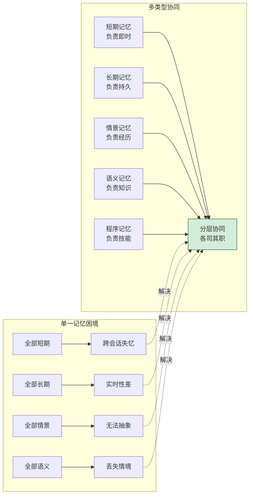

### 1.2 分类带来的工程价值

| 价值维度 | 说明 |
|---------|------|
| **精准选型** | 根据场景选择最匹配的记忆类型,避免过度设计 |
| **分层存储** | 不同类型采用不同存储引擎,优化成本与性能 |
| **独立演进** | 各类型可独立优化、独立扩展,互不干扰 |
| **检索优化** | 按类型分库检索,缩小搜索空间,提升精度 |
| **遗忘策略** | 不同类型采用不同遗忘机制,模拟人类认知 |
| **可观测性** | 分类后便于监控各记忆子系统的健康度 |

### 1.3 本文分析框架

本文采用**三维分类法**对 Agent Memory 进行系统梳理:

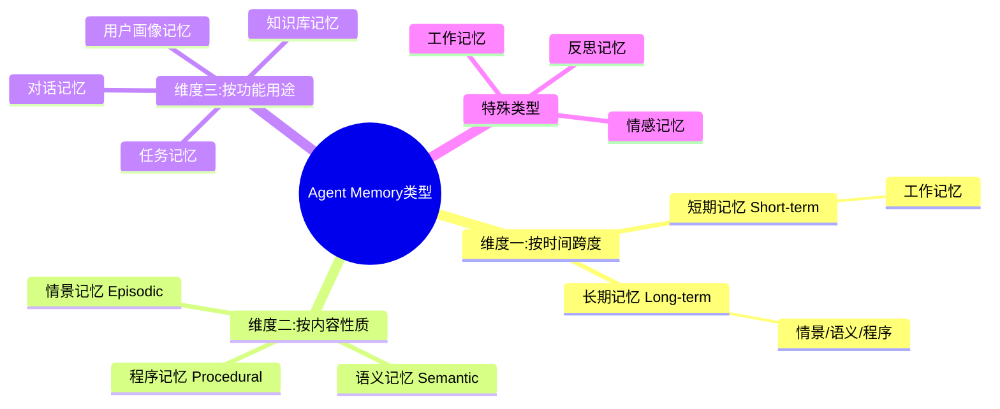

---

## 二、Memory 类型分类体系总览

### 2.1 三维分类全景图

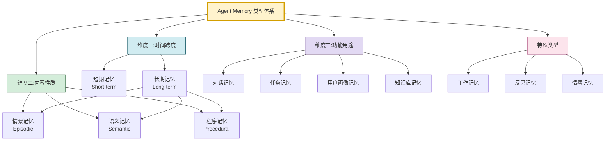

### 2.2 分类维度说明

| 分类维度 | 分类依据 | 适用分析场景 |
|---------|---------|------------|
| **时间跨度** | 记忆持续时间的长短 | 决定存储介质(内存/磁盘)、遗忘策略 |
| **内容性质** | 记忆信息的抽象层次 | 决定数据结构(事件/图谱/流程)、检索方式 |
| **功能用途** | 记忆服务的业务目标 | 决定模块划分、与 Agent 各环节的对接 |
| **特殊类型** | 模拟人类高级认知 | 决定高级能力(反思/情感/元认知)的实现 |

### 2.3 三个维度的关系

三个维度并非互斥,而是**正交且互补**的关系。同一个记忆实例可以同时归属于多个维度:

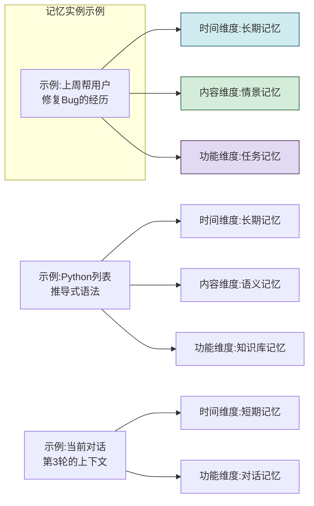

---

## 三、按时间跨度分类:短期记忆 vs 长期记忆

### 3.1 短期记忆(Short-term Memory)

#### 3.1.1 定义

**短期记忆**是指 Agent 在**当前会话或当前任务执行过程中**,用于临时存放正在处理的即时信息的记忆系统。它对应人类认知科学中的"工作记忆"概念,容量有限、持续期短、访问速度极快。

#### 3.1.2 核心特点

| 特征 | 说明 | 工程含义 |
|------|------|---------|
| **容量有限** | 受 LLM 上下文窗口限制(如 4K-128K Token) | 需设计截断/摘要策略 |
| **持续时间短** | 会话结束即失效(或仅维持最近 N 轮) | 适合临时变量,不适合持久数据 |
| **访问速度极快** | 直接驻留内存,无需检索 | 支持实时交互响应 |
| **更新频率高** | 每轮对话/每个步骤都可能更新 | 需高效读写机制 |
| **易失性** | 进程崩溃或会话结束即丢失 | 关键信息需及时持久化到长期记忆 |

#### 3.1.3 存储方式

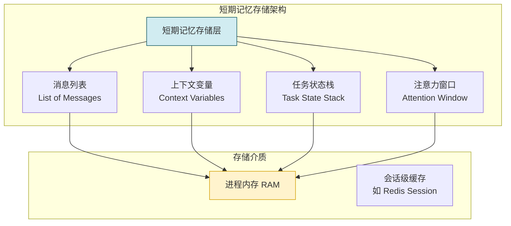

**存储实现示例:**

```python
from collections import deque
from dataclasses import dataclass, field
from typing import Any, Optional

@dataclass
class ShortTermMemory:
    """短期记忆:管理当前会话的即时上下文"""

    # 消息历史(滑动窗口)
    messages: deque = field(default_factory=lambda: deque(maxlen=20))

    # 上下文变量(当前任务相关的临时变量)
    context_variables: dict = field(default_factory=dict)

    # 当前任务状态栈(支持子任务嵌套)
    task_stack: list = field(default_factory=list)

    # 注意力焦点(当前 Agent 关注的核心信息)
    attention_focus: Optional[str] = None

    def add_message(self, role: str, content: str, **metadata):
        """添加消息到短期记忆"""
        self.messages.append({
            "role": role,
            "content": content,
            "timestamp": time.time(),
            **metadata
        })

    def get_recent_messages(self, n: int = 10) -> list:
        """获取最近 N 条消息"""
        return list(self.messages)[-n:]

    def set_context(self, key: str, value: Any):
        """设置上下文变量"""
        self.context_variables[key] = value

    def get_context(self, key: str, default=None) -> Any:
        """获取上下文变量"""
        return self.context_variables.get(key, default)

    def push_task(self, task: dict):
        """压入任务状态(进入子任务)"""
        self.task_stack.append(task)

    def pop_task(self) -> dict:
        """弹出任务状态(退出子任务)"""
        return self.task_stack.pop() if self.task_stack else None

    def to_prompt_context(self) -> str:
        """转换为 LLM 可用的上下文文本"""
        lines = []
        for msg in self.messages:
            lines.append(f"[{msg['role']}] {msg['content']}")
        if self.context_variables:
            lines.append(f"\n[上下文变量] {self.context_variables}")
        return "\n".join(lines)
```

#### 3.1.4 适用场景

| 场景 | 说明 |
|------|------|
| **多轮对话上下文** | 维持话题连贯,理解代词指代 |
| **多步推理中间结果** | 链式推理中暂存每步结论 |
| **当前任务状态追踪** | 记录任务执行到哪一步、中间变量值 |
| **子任务嵌套** | 主任务进入子任务时压栈保存现场 |
| **实时工具调用参数** | 暂存即将调用的工具参数 |

#### 3.1.5 典型应用案例

**案例:多步推理 Agent**

```python
class MultiStepReasoningAgent:
    """利用短期记忆进行多步推理"""

    def __init__(self, llm):
        self.llm = llm
        self.short_term_memory = ShortTermMemory()

    async def solve(self, problem: str) -> str:
        """分步解决复杂问题"""

        # 步骤1:分析问题
        self.short_term_memory.set_context("problem", problem)
        analysis = await self.llm.generate(f"分析问题:{problem}")
        self.short_term_memory.set_context("analysis", analysis)

        # 步骤2:制定方案(利用上一步结果)
        plan = await self.llm.generate(
            f"基于分析:{analysis}\n制定解决计划"
        )
        self.short_term_memory.set_context("plan", plan)

        # 步骤3:执行(利用前两步结果)
        result = await self.llm.generate(
            f"问题:{problem}\n分析:{analysis}\n计划:{plan}\n执行并给出答案"
        )

        return result
```

---

### 3.2 长期记忆(Long-term Memory)

#### 3.2.1 定义

**长期记忆**是指 Agent 在**跨会话、跨任务**的时间尺度上,持久保存经过筛选和编码的信息的记忆系统。它容量大、持续期长,是 Agent 积累经验、学习用户偏好、沉淀知识的核心载体。

#### 3.2.2 核心特点

| 特征 | 说明 | 工程含义 |
|------|------|---------|
| **容量大** | 可扩展至 TB 级 | 需外部存储(向量库/图库/文档库) |
| **持续时间长** | 跨会话,甚至永久 | 需持久化机制和备份策略 |
| **访问速度较慢** | 需检索过程,非直接访问 | 异步检索,引入延迟 |
| **更新频率低** | 选择性存储,非全量记录 | 需记忆筛选和价值评估机制 |
| **有组织结构** | 分类、关联、索引 | 需设计合理的记忆组织方式 |
| **可遗忘** | 渐进衰减或主动淘汰 | 需遗忘策略防止信息膨胀 |

#### 3.2.3 存储方式

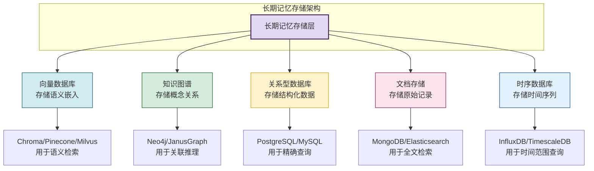

#### 3.2.4 适用场景

| 场景 | 说明 |
|------|------|
| **用户偏好记忆** | 跨会话记住用户习惯 |
| **历史交互记录** | 存储过往对话以供回顾 |
| **知识沉淀** | 从交互中提炼的抽象知识 |
| **经验积累** | 成功/失败的解决经验 |
| **技能库构建** | 标准化的操作流程 |

#### 3.2.5 典型应用案例

**案例:跨会话用户偏好记忆**

```python
class UserPreferenceMemory:
    """长期记忆:用户偏好跨会话持久化"""

    def __init__(self, vector_store, kv_store):
        self.vector_store = vector_store    # 向量检索
        self.kv_store = kv_store            # 精确查询

    async def remember_preference(self, user_id: str,
                                    preference: str, value: str):
        """持久化用户偏好"""
        # 存入 KV 数据库(精确查询)
        self.kv_store.put(
            key=f"user:{user_id}:pref:{preference}",
            value=value
        )
        # 存入向量数据库(语义检索)
        self.vector_store.add(
            texts=[f"用户{user_id}偏好{preference}:{value}"],
            metadatas=[{"user_id": user_id, "type": "preference"}]
        )

    async def recall_preferences(self, user_id: str,
                                  query: str = None) -> list:
        """回忆用户偏好"""
        if query:
            # 语义检索相关偏好
            return self.vector_store.similarity_search(
                query=query,
                filter={"user_id": user_id}
            )
        else:
            # 返回所有偏好(精确查询)
            return self.kv_store.scan(
                prefix=f"user:{user_id}:pref:"
            )
```

---

### 3.3 短期 vs 长期记忆对比

| 对比维度 | 短期记忆 | 长期记忆 |
|---------|---------|---------|
| **持续时间** | 当前会话/任务 | 跨会话,持久 |
| **容量** | 有限(LLM 上下文窗口) | 大(外部存储扩展) |
| **访问速度** | 极快(内存直接访问) | 较慢(需检索) |
| **存储介质** | 进程内存/会话缓存 | 向量库/图库/关系库 |
| **更新方式** | 实时全量更新 | 选择性存储 |
| **遗忘策略** | 会话结束清除/窗口溢出截断 | 渐进衰减/主动淘汰 |
| **成本** | 低(内存) | 高(存储+检索计算) |
| **类比人类** | 工作记忆(记电话号码) | 长期记忆(童年回忆) |

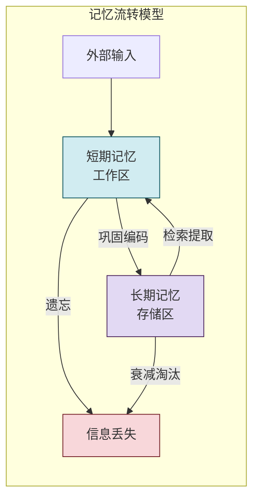

---

## 四、按内容性质分类:情景、语义、程序三大核心记忆

本维度借鉴认知科学对人类记忆的分类,是 Agent Memory 最核心的分类方式。

### 4.1 情景记忆(Episodic Memory)

#### 4.1.1 定义

**情景记忆**记录 Agent 经历的**具体事件**——在特定时间、特定情境下发生了什么、Agent 采取了什么行动、产生了什么结果。它是有"时空标签"的亲身经历记录。

#### 4.1.2 核心特点

| 特征 | 说明 |
|------|------|
| **有时空标签** | 每条记忆附带时间戳和情境上下文 |
| **具象性** | 记录具体事件,非抽象规律 |
| **序列性** | 记录行动的先后顺序 |
| **可回放** | 能按时间线还原历史过程 |
| **易遗忘细节** | 时间久远后细节模糊 |

#### 4.1.3 存储方式

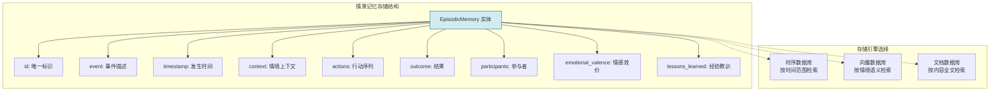

#### 4.1.4 适用场景

| 场景 | 说明 |
|------|------|
| **历史对话回顾** | "上周我们讨论过什么" |
| **任务执行记录** | 记录完成任务的全过程 |
| **失败案例库** | 存储失败经历以避免重蹈覆辙 |
| **用户交互历史** | 还原与用户的每次交互 |
| **经验回放** | 从历史经历中提取教训 |

#### 4.1.5 典型应用案例

**案例:Bug 修复经验回放**

```python
@dataclass
class BugFixEpisode:
    """Bug 修复情景记忆"""
    episode_id: str
    bug_description: str           # Bug 描述
    timestamp: float               # 发生时间
    environment: dict             # 环境上下文(语言/框架/版本)
    diagnosis_steps: list          # 诊断步骤序列
    root_cause: str                # 根本原因
    fix_solution: str              # 解决方案
    verification: str              # 验证结果
    outcome: str                   # 结果(success/failure)
    time_cost_minutes: int          # 耗时
    lessons: str = ""              # 经验教训


class BugFixMemoryStore:
    """Bug 修复经验存储"""

    def __init__(self, vector_store):
        self.vector_store = vector_store
        self.episodes: list[BugFixEpisode] = []

    def record(self, episode: BugFixEpisode):
        """记录一次 Bug 修复经历"""
        self.episodes.append(episode)
        # 向量化存储以便语义检索
        self.vector_store.add_texts(
            texts=[f"{episode.bug_description} -> {episode.fix_solution}"],
            metadatas=[{"episode_id": episode.episode_id}]
        )

    def recall_similar_bugs(self, bug_desc: str, top_k: int = 3):
        """回忆类似的 Bug 修复经历"""
        similar = self.vector_store.similarity_search(
            query=bug_desc, k=top_k
        )
        episode_ids = [m["episode_id"] for m in similar]
        return [e for e in self.episodes if e.episode_id in episode_ids]

    def extract_lesson(self, episode: BugFixEpisode) -> str:
        """从情景中提炼经验"""
        if episode.outcome == "success":
            return (
                f"成功经验:遇到'{episode.bug_description}'类问题,"
                f"根因通常是'{episode.root_cause}',"
                f"可尝试'{episode.fix_solution}'"
            )
        else:
            return (
                f"失败教训:'{episode.fix_solution}'"
                f"无法解决'{episode.bug_description}',需另寻方案"
            )
```

---

### 4.2 语义记忆(Semantic Memory)

#### 4.2.1 定义

**语义记忆**存储 Agent 掌握的**抽象知识和客观事实**——剥离了具体情境的普遍规律、概念定义、事实陈述。它对应人类的"常识"和"知识库"。

#### 4.2.2 核心特点

| 特征 | 说明 |
|------|------|
| **无时空标签** | 知识不绑定特定时间地点 |
| **抽象性** | 从具体经历中提炼的普遍规律 |
| **结构化** | 通常以知识图谱形式组织 |
| **相对稳定** | 事实不易遗忘,除非被修正 |
| **可推理** | 支持基于关系的逻辑推理 |

#### 4.2.3 存储方式

```mermaid
flowchart TB
    subgraph 语义记忆存储结构
        direction LR
        K[知识图谱]
    end

    K --> N1[节点: 概念/实体]
    K --> N2[边: 关系]
    K --> N3[属性: 事实陈述]

    subgraph 存储引擎
        S1[图数据库 Neo4j<br/>存储概念关系]
        S2[向量数据库<br/>存储语义嵌入]
        S3[三元组存储<br/>(主谓宾)]
    end

    K -.-> S1 & S2 & S3

    subgraph 示例
        EX1["(Python) -[属于]-> (编程语言)"]
        EX2["(Flask) -[基于]-> (Python)"]
        EX3["(GIL) -[影响]-> (Python多线程)"]
    end

    style K fill:#d4edda,stroke:#155724
    style EX1 fill:#fff3cd,stroke:#d39e00
    style EX2 fill:#fff3cd,stroke:#d39e00
    style EX3 fill:#fff3cd,stroke:#d39e00
```

#### 4.2.4 适用场景

| 场景 | 说明 |
|------|------|
| **领域知识库** | 存储 Python 语法、框架用法等 |
| **概念关系图谱** | "Flask 基于 Python"等关系 |
| **事实问答** | "什么是 GIL"等知识性提问 |
| **推理基础** | 基于已知事实进行逻辑推理 |
| **术语解释** | 解释专业概念含义 |

#### 4.2.5 典型应用案例

**案例:编程知识图谱**

```python
@dataclass
class SemanticFact:
    """语义记忆事实三元组"""
    fact_id: str
    subject: str          # 主语(概念)
    predicate: str        # 谓词(关系)
    object: str           # 宾语(概念)
    confidence: float     # 置信度
    sources: list         # 来源


class SemanticMemoryStore:
    """语义记忆:知识图谱式存储"""

    def __init__(self):
        self.facts: dict[str, SemanticFact] = {}
        # 索引:加速按主语/宾语检索
        self.subject_index: dict[str, list[str]] = {}
        self.object_index: dict[str, list[str]] = {}

    def add_fact(self, subject: str, predicate: str, object: str,
                 confidence: float = 1.0, source: str = ""):
        """添加事实"""
        fact_id = f"fact_{hash((subject, predicate, object))}"
        if fact_id in self.facts:
            # 已存在,提升置信度
            self.facts[fact_id].confidence = max(
                self.facts[fact_id].confidence, confidence
            )
            if source:
                self.facts[fact_id].sources.append(source)
        else:
            fact = SemanticFact(
                fact_id=fact_id,
                subject=subject,
                predicate=predicate,
                object=object,
                confidence=confidence,
                sources=[source] if source else []
            )
            self.facts[fact_id] = fact
            # 更新索引
            self.subject_index.setdefault(subject, []).append(fact_id)
            self.object_index.setdefault(object, []).append(fact_id)

    def query_relation(self, subject: str, predicate: str = None):
        """查询关系:subject 的 predicate 关系指向什么"""
        fact_ids = self.subject_index.get(subject, [])
        results = []
        for fid in fact_ids:
            fact = self.facts[fid]
            if predicate is None or fact.predicate == predicate:
                results.append(fact)
        return results

    def reason_transitive(self, subject: str, predicate: str,
                           depth: int = 3):
        """传递推理:A 属于 B,B 属于 C,则 A 属于 C"""
        chain = [subject]
        current = subject
        for _ in range(depth):
            rels = self.query_relation(current, predicate)
            if rels:
                current = rels[0].object
                chain.append(current)
            else:
                break
        return chain
```

---

### 4.3 程序记忆(Procedural Memory)

#### 4.3.1 定义

**程序记忆**存储 Agent 掌握的**操作技能和方法**——"如何做某事"的标准化流程、步骤序列、操作模板。它对应人类的"肌肉记忆"和"操作技能"。

#### 4.3.2 核心特点

| 特征 | 说明 |
|------|------|
| **过程性** | 记录"如何做"而非"是什么" |
| **步骤化** | 由有序的操作步骤组成 |
| **可复用** | 标准流程可反复套用 |
| **熟练性** | 反复执行后效率提升 |
| **条件触发** | 满足特定条件时自动激活 |

#### 4.3.3 存储方式

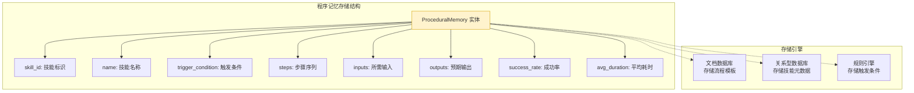

#### 4.3.4 适用场景

| 场景 | 说明 |
|------|------|
| **标准化操作流程** | 部署应用、配置环境等固定流程 |
| **工具使用技能** | 如何调用某个 API、如何操作某软件 |
| **故障处理预案** | 遇到某类故障的标准处理步骤 |
| **代码生成模板** | 生成特定结构代码的模板流程 |
| **数据分析流程** | 标准的数据清洗、分析步骤 |

#### 4.3.5 典型应用案例

**案例:应用部署技能库**

```python
@dataclass
class ProceduralSkill:
    """程序记忆:操作技能"""
    skill_id: str
    name: str                          # 技能名称
    description: str                   # 技能描述
    trigger_conditions: list           # 触发条件
    steps: list[dict]                  # 步骤序列
    required_inputs: list              # 所需输入参数
    expected_outputs: list             # 预期输出
    success_rate: float = 0.0          # 历史成功率
    execution_count: int = 0           # 执行次数
    avg_duration_seconds: float = 0    # 平均耗时


class ProceduralMemoryStore:
    """程序记忆存储"""

    def __init__(self):
        self.skills: dict[str, ProceduralSkill] = {}

    def register_skill(self, skill: ProceduralSkill):
        """注册技能"""
        self.skills[skill.skill_id] = skill

    def find_skill(self, task_description: str) -> list[ProceduralSkill]:
        """根据任务描述匹配技能"""
        matched = []
        for skill in self.skills.values():
            # 检查触发条件是否匹配
            for condition in skill.trigger_conditions:
                if condition.lower() in task_description.lower():
                    matched.append(skill)
                    break
        # 按成功率排序
        matched.sort(key=lambda s: s.success_rate, reverse=True)
        return matched

    def execute_skill(self, skill_id: str, inputs: dict) -> dict:
        """执行技能(按步骤)"""
        skill = self.skills.get(skill_id)
        if not skill:
            raise ValueError(f"技能 {skill_id} 不存在")

        start_time = time.time()
        context = inputs.copy()
        results = {}

        for i, step in enumerate(skill.steps):
            # 执行每一步
            step_result = self._execute_step(step, context)
            results[f"step_{i}"] = step_result
            # 更新上下文供下一步使用
            context.update(step_result.get("outputs", {}))

        duration = time.time() - start_time
        # 更新技能统计
        self._update_stats(skill, duration, success=True)

        return {
            "skill_id": skill_id,
            "results": results,
            "duration_seconds": duration
        }
```

---

### 4.4 三大记忆类型对比

| 维度 | 情景记忆 | 语义记忆 | 程序记忆 |
|------|---------|---------|---------|
| **内容性质** | 具体事件经历 | 抽象知识事实 | 操作步骤方法 |
| **时间标记** | 有明确时间/情境 | 无时间标记 | 无时间标记 |
| **存储形式** | 事件序列 | 知识图谱/事实库 | 流程模板/操作链 |
| **检索方式** | 按时间或情境线索 | 按语义相关性 | 按任务类型匹配 |
| **更新方式** | 新事件追加 | 事实修正/扩展 | 技能优化/新增 |
| **遗忘特点** | 容易遗忘细节 | 相对稳定 | 熟练后不易遗忘 |
| **抽象层次** | 最低(具体) | 最高(抽象) | 中等(流程) |
| **Agent 示例** | "上周用户问了X" | "Python 的 GIL 是什么" | "如何部署 Flask 应用" |

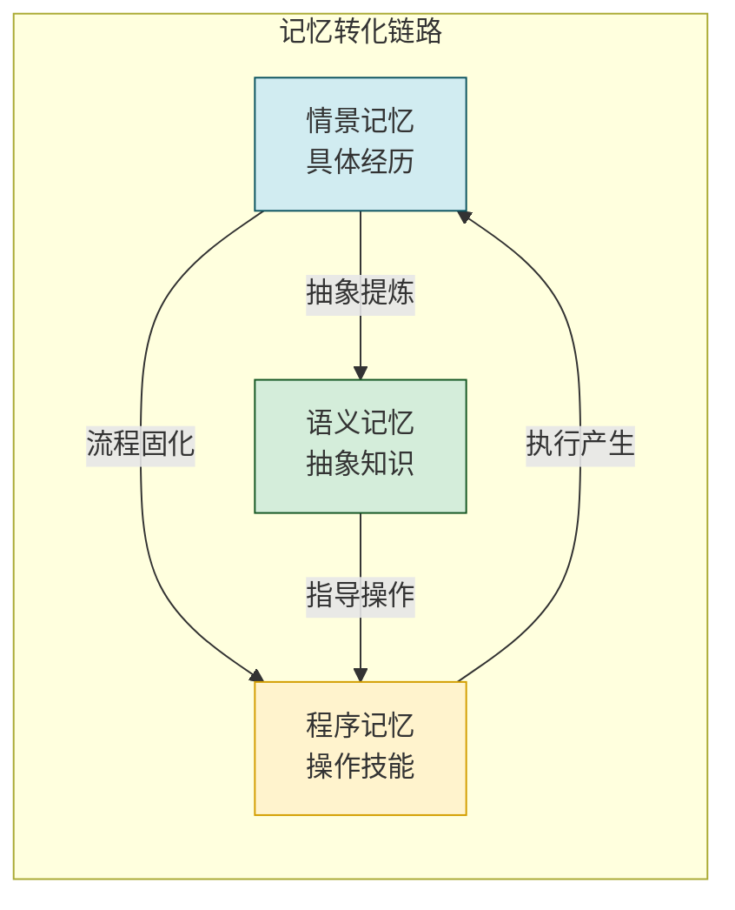

**关键洞察**:三种记忆存在转化关系——多次情景经历可提炼为语义知识,反复执行的流程可固化为程序技能,程序执行又会产生新的情景记忆。

---

## 五、按功能用途分类:对话、任务、用户画像、知识库记忆

### 5.1 对话记忆(Conversation Memory)

#### 5.1.1 定义

**对话记忆**专门管理 Agent 与用户之间的**多轮对话历史**,确保对话的连贯性和上下文理解能力。

#### 5.1.2 核心特点与存储

| 特征 | 说明 |
|------|------|
| **消息结构化** | 按 role(content) 组织 |
| **滑动窗口** | 保留最近 N 轮,超出截断或摘要 |
| **代词消解** | 结合上下文理解"它""那个"等指代 |
| **话题追踪** | 识别话题切换和回归 |

**存储实现:**

```python
class ConversationMemory:
    """对话记忆管理器"""

    def __init__(self, max_messages: int = 20,
                 summarization_threshold: int = 15):
        self.messages: list[dict] = []
        self.max_messages = max_messages
        self.summarization_threshold = summarization_threshold
        self.summary: str = ""  # 历史摘要

    def add_user_message(self, content: str):
        self.messages.append({"role": "user", "content": content})
        self._maybe_summarize()

    def add_assistant_message(self, content: str):
        self.messages.append({"role": "assistant", "content": content})
        self._maybe_summarize()

    def _maybe_summarize(self):
        """消息过多时触发摘要压缩"""
        if len(self.messages) > self.summarization_threshold:
            old_messages = self.messages[:self.max_messages // 2]
            new_summary = self._summarize(old_messages)
            self.summary = f"{self.summary}\n{new_summary}".strip()
            self.messages = self.messages[self.max_messages // 2:]

    def to_prompt_messages(self) -> list:
        """转换为 LLM 消息格式"""
        result = []
        if self.summary:
            result.append({
                "role": "system",
                "content": f"对话历史摘要:{self.summary}"
            })
        result.extend(self.messages)
        return result
```

#### 5.1.3 适用场景与案例

- **客服对话**:维持多轮咨询连贯
- **代码助手**:理解"修改它""继续"等指令

---

### 5.2 任务记忆(Task Memory)

#### 5.2.1 定义

**任务记忆**管理 Agent 执行任务过程中的**状态、进度、中间结果**,支持长程任务的断点续传和子任务管理。

#### 5.2.2 核心特点与存储

| 特征 | 说明 |
|------|------|
| **任务状态机** | 记录任务所处阶段 |
| **进度持久化** | 支持任务中断后恢复 |
| **子任务树** | 管理任务分解的层次结构 |
| **中间结果缓存** | 暂存可复用的中间产物 |

```python
@dataclass
class TaskMemory:
    """任务记忆"""
    task_id: str
    description: str
    status: str                  # pending/running/paused/completed/failed
    progress: float              # 0.0-1.0
    subtasks: list               # 子任务列表
    intermediate_results: dict   # 中间结果
    checkpoints: list           # 检查点(用于恢复)
    created_at: float
    updated_at: float
```

#### 5.2.3 适用场景与案例

- **长程项目**:跨天/周的项目调研
- **多步骤任务**:代码重构、数据分析

---

### 5.3 用户画像记忆(User Profile Memory)

#### 5.3.1 定义

**用户画像记忆**存储用户的**偏好、习惯、背景信息**,使 Agent 能够提供个性化服务。

#### 5.3.2 核心特点与存储

| 特征 | 说明 |
|------|------|
| **跨会话持久** | 长期积累用户特征 |
| **多维标签** | 技术栈、语言偏好、交互风格等 |
| **动态更新** | 随交互不断修正画像 |
| **隐私敏感** | 需权限和加密保护 |

```python
@dataclass
class UserProfile:
    """用户画像记忆"""
    user_id: str
    preferences: dict       # 偏好(语言/风格/详细度)
    tech_stack: list        # 技术栈
    expertise_level: str    # 专业程度
    interaction_style: str  # 交互风格偏好
    history_summary: str    # 历史交互摘要
    last_active: float
```

#### 5.3.3 适用场景与案例

- **个性化推荐**:根据用户偏好调整回答风格
- **智能助手**:记住用户习惯,减少重复说明

---

### 5.4 知识库记忆(Knowledge Base Memory)

#### 5.4.1 定义

**知识库记忆**存储 Agent 可访问的**外部知识和领域文档**,是 RAG(检索增强生成)的核心数据源。

#### 5.4.2 核心特点与存储

| 特征 | 说明 |
|------|------|
| **外部来源** | 来自文档、数据库、API |
| **向量化** | 文本切块后嵌入存储 |
| **可检索** | 支持语义检索和关键词检索 |
| **可更新** | 增量添加、删除过期知识 |

#### 5.4.3 适用场景与案例

- **企业知识问答**:检索内部文档回答问题
- **技术文档助手**:查询 API 用法

---

### 5.5 四种功能记忆对比

| 记忆类型 | 关注焦点 | 数据特征 | 检索方式 |
|---------|---------|---------|---------|
| **对话记忆** | 交互过程 | 消息序列 | 按时间/窗口 |
| **任务记忆** | 任务执行 | 状态/进度/结果 | 按任务ID |
| **用户画像** | 用户特征 | 偏好/标签 | 按用户ID |
| **知识库** | 领域知识 | 文档/事实 | 按语义相似度 |

---

## 六、其他特殊记忆类型

### 6.1 工作记忆(Working Memory)

**工作记忆**是短期记忆的子集,特指 Agent 当前**正在主动加工**的信息。它容量更小,但与当前推理直接相关。

```python
class WorkingMemory:
    """工作记忆:当前主动加工的信息"""

    def __init__(self):
        self.active_facts: list = []       # 当前激活的事实
        self.active_goals: list = []       # 当前目标
        self.attention_buffer: str = ""   # 注意力缓冲区

    def focus_on(self, information: str):
        """将信息置入注意力焦点"""
        self.attention_buffer = information
```

### 6.2 反思记忆(Reflective Memory)

**反思记忆**存储 Agent 对自身经历的**元认知反思**——从经验中提炼的元规律、策略调整。

```python
@dataclass
class Reflection:
    """反思记忆"""
    reflection_id: str
    source_episodes: list     # 来源的情景记忆
    insight: str              # 提炼的洞察
    strategy_adjustment: str  # 策略调整建议
    timestamp: float
```

### 6.3 情感记忆(Emotional Memory)

**情感记忆**记录交互中的**情感效价**,影响后续决策倾向。

```python
@dataclass
class EmotionalMemory:
    """情感记忆"""
    event_id: str
    valence: float    # -1.0(消极) 到 1.0(积极)
    arousal: float    # 唤起度
    impact_on_future: str  # 对未来决策的影响
```

---

## 七、各类型存储方式深度对比

### 7.1 存储引擎选型矩阵

| 记忆类型 | 推荐存储引擎 | 访问模式 | 持久化 |
|---------|------------|---------|--------|
| **短期记忆** | 进程内存/Redis | 直接读写 | 会话级 |
| **对话记忆** | Redis/内存 | 顺序追加 | 会话级 |
| **情景记忆** | 向量库+时序库 | 时间/语义检索 | 持久 |
| **语义记忆** | 图数据库+向量库 | 关系推理/语义检索 | 持久 |
| **程序记忆** | 文档库+关系库 | 条件匹配/精确查询 | 持久 |
| **任务记忆** | 关系库+文档库 | 按ID查询/状态更新 | 持久 |
| **用户画像** | KV存储+关系库 | 按用户ID查询 | 持久 |
| **知识库** | 向量库+全文索引 | 语义检索/关键词 | 持久 |

### 7.2 存储架构示例

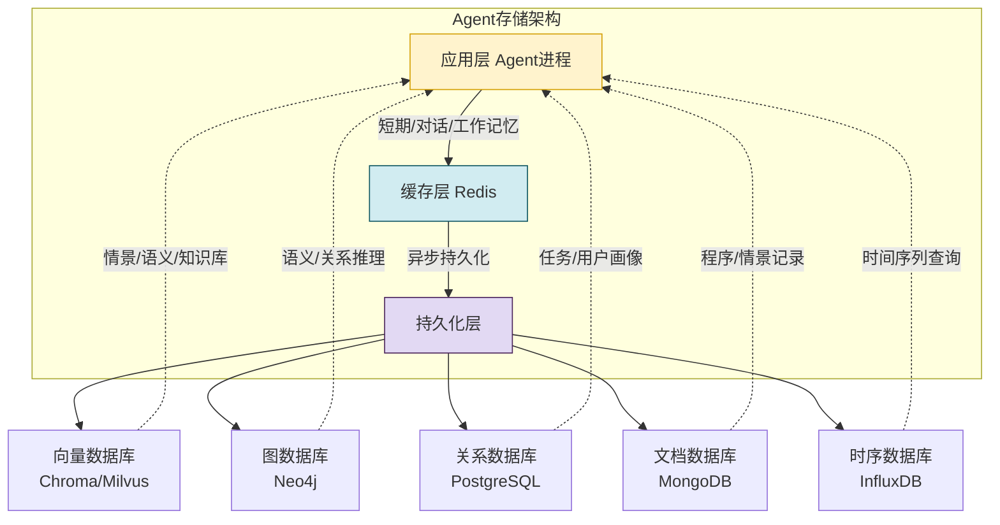

---

## 八、典型应用案例

### 8.1 案例一:智能编程助手

```mermaid
flowchart TB
    subgraph 编程助手的记忆运用
        U[用户:修复这个Bug] --> M1[对话记忆<br/>理解"这个"指代]
        M1 --> M2[情景记忆<br/>回忆类似Bug经历]
        M2 --> M3[语义记忆<br/>检索相关语法知识]
        M3 --> M4[程序记忆<br/>套用标准调试流程]
        M4 --> M5[用户画像<br/>按用户水平调整解释]
        M5 --> R[生成个性化修复方案]
    end

    style M1 fill:#d1ecf1,stroke:#0c5460
    style M2 fill:#d4edda,stroke:#155724
    style M3 fill:#fff3cd,stroke:#d39e00
    style M4 fill:#fce4ec,stroke:#880e4f
    style M5 fill:#e2d9f3,stroke:#4a235a
```

### 8.2 案例二:长期私人助理

一个跨年使用的私人助理,同时运用多种记忆:
- **用户画像**:记住用户家庭情况、工作偏好
- **情景记忆**:回忆"去年此时"的约定
- **对话记忆**:维持当日对话连贯
- **任务记忆**:追踪跨周的项目进度
- **反思记忆**:根据过往失误优化提醒方式

---

## 九、各类型优缺点与适用条件对比

### 9.1 优缺点对比总表

| 记忆类型 | 优点 | 缺点 | 适用条件 |
|---------|------|------|---------|
| **短期记忆** | 速度极快、实现简单、成本低 | 容量有限、易失、不跨会话 | 实时交互、当前任务 |
| **对话记忆** | 维持连贯、理解指代 | 窗口溢出丢信息、长对话成本高 | 多轮对话场景 |
| **情景记忆** | 可回放历史、提取经验 | 细节易遗忘、存储成本高 | 需要经验积累 |
| **语义记忆** | 抽象通用、支持推理 | 提炼成本高、需维护准确性 | 知识问答、推理 |
| **程序记忆** | 流程复用、执行高效 | 流程固化、灵活性差 | 标准化操作 |
| **任务记忆** | 支持长程任务、可恢复 | 状态管理复杂 | 多步复杂任务 |
| **用户画像** | 个性化服务、体验好 | 隐私敏感、需权限 | 个性化场景 |
| **知识库** | 外部知识丰富、可检索 | 需维护更新、检索质量依赖切片 | 领域问答 |
| **反思记忆** | 自我优化、持续进化 | 反思质量依赖LLM能力 | 高级智能体 |
| **情感记忆** | 决策更拟人、避免重蹈覆辙 | 情感建模困难 | 拟人化交互 |

### 9.2 适用条件决策矩阵

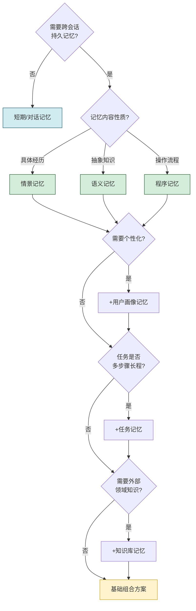

---

## 十、选型指导与组合策略

### 10.1 选型原则

1. **按需选型**:不盲目堆砌,根据实际场景选择最小必要集合
2. **分层存储**:短期走内存、长期走外部存储,平衡性能与成本
3. **协同设计**:各类型相互配合,避免功能重叠
4. **渐进引入**:先实现核心类型(短期+对话),再逐步扩展高级类型
5. **可观测**:为每类记忆设计监控指标,便于调优

### 10.2 常见组合方案

| 方案 | 组合 | 适用场景 |
|------|------|---------|
| **基础方案** | 短期 + 对话记忆 | 简单聊天机器人 |
| **标准方案** | 基础 + 用户画像 + 知识库 | 企业客服、知识助手 |
| **进阶方案** | 标准 + 情景 + 任务记忆 | 编程助手、项目协作 |
| **高级方案** | 进阶 + 语义 + 程序 + 反思 | 自主智能体、长期助理 |

### 10.3 组合架构示例

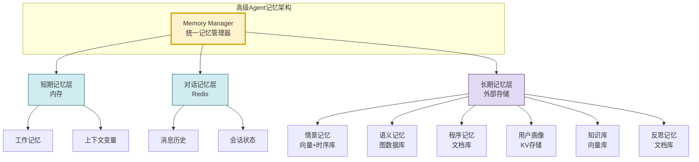

---

## 十一、总结与最佳实践

### 11.1 核心要点回顾

| 维度 | 关键类型 | 核心价值 |
|------|---------|---------|
| **时间跨度** | 短期 vs 长期 | 平衡实时性与持久性 |
| **内容性质** | 情景/语义/程序 | 覆盖经历、知识、技能 |
| **功能用途** | 对话/任务/画像/知识库 | 对接 Agent 各业务环节 |
| **特殊类型** | 工作/反思/情感 | 支持高级认知能力 |

### 11.2 最佳实践建议

1. **分层架构**:严格区分短期(内存)与长期(外部存储)
2. **类型解耦**:各记忆类型独立存储、独立检索,避免耦合
3. **统一管理**:通过 Memory Manager 统一调度,屏蔽底层差异
4. **遗忘机制**:为长期记忆设计衰减策略,防止无限膨胀
5. **隐私保护**:用户画像等敏感记忆需加密和权限控制
6. **质量评估**:定期评估各记忆的检索精度和利用率
7. **渐进演进**:从最小可用集合起步,按需扩展类型

### 11.3 与系列文档关系

| 文档 | 视角 | 本文关系 |
|------|------|---------|
| [74Agent记忆系统核心价值与必要性解析.md](74Agent记忆系统核心价值与必要性解析.md) | 为什么需要 Memory | 本文是其类型体系的深度展开 |
| [38Agent核心工作流程_Observe_Think_Act.md](../3Agent%20架构设计/38Agent核心工作流程_Observe_Think_Act.md) | Agent 执行回路 | 各类型记忆在回路中的使用位置 |
| [37Agent执行流程详解.md](../3Agent%20架构设计/37Agent执行流程详解.md) | 执行流程 | 记忆在流程各阶段的调用 |

---

> **核心结论**:Agent Memory 不是单一结构,而是一个**多维分类、分层协同**的复杂系统。工程实践中,应根据"时间跨度、内容性质、功能用途"三个维度合理选型,采用"短期+长期"分层、"情景+语义+程序"分工、"对话+任务+画像+知识库"对接业务的组合策略,构建既能实时响应又能持续学习的高效记忆系统。
