# 短期记忆与长期记忆核心区别深度解析

> **文档定位**:本文档是 Agent Memory 系列的第三篇核心文档,专注于**深度对比短期记忆(Short-term Memory)与长期记忆(Long-term Memory)的核心区别**。在 [74Agent记忆系统核心价值与必要性解析.md](./74Agent记忆系统核心价值与必要性解析.md) 阐述"为什么需要 Memory"、[75Agent记忆系统类型分类深度解析.md](./75Agent记忆系统类型分类深度解析.md) 概述"Memory 有哪些类型"的基础上,本文从存储容量、持续时间、信息处理方式、编码机制、功能定位等维度进行**逐项深度对比**,并结合认知科学理论与工程实例,揭示两者在 Agent 系统中不可替代又互补协同的关系。
>
> **阅读建议**:建议先阅读 [74号文档](./74Agent记忆系统核心价值与必要性解析.md) 和 [75号文档](./75Agent记忆系统类型分类深度解析.md) 建立 Memory 类型体系认知,再阅读本文深入理解短期与长期记忆的核心分野。可结合 [38Agent核心工作流程_Observe_Think_Act.md](../3Agent%20架构设计/38Agent核心工作流程_Observe_Think_Act.md) 理解两者在 Agent 执行回路中的具体使用位置。

---

## 目录

- [一、引言:短期记忆与长期记忆的核心分野](#一引言短期记忆与长期记忆的核心分野)
- [二、认知科学基础:人类记忆的双重存储模型](#二认知科学基础人类记忆的双重存储模型)
- [三、核心区别全景对比](#三核心区别全景对比)
- [四、存储容量差异深度解析](#四存储容量差异深度解析)
- [五、持续时间差异深度解析](#五持续时间差异深度解析)
- [六、信息处理方式差异深度解析](#六信息处理方式差异深度解析)
- [七、编码机制差异深度解析](#七编码机制差异深度解析)
- [八、功能定位差异深度解析](#八功能定位差异深度解析)
- [九、两者交互机制:记忆巩固与检索提取](#九两者交互机制记忆巩固与检索提取)
- [十、工程实现对比:完整代码示例](#十工程实现对比完整代码示例)
- [十一、具体实例分析](#十一具体实例分析)
- [十二、混合架构设计策略](#十二混合架构设计策略)
- [十三、总结与最佳实践](#十三总结与最佳实践)

---

## 一、引言:短期记忆与长期记忆的核心分野

### 1.1 为什么需要专门深度对比

在 [75号文档](./75Agent记忆系统类型分类深度解析.md) 的第三章中,我们已经对短期记忆和长期记忆进行了概要对比。然而,那只是分类体系中的一个维度,对比停留在**特征表格**层面。要真正理解 Agent Memory 的设计精髓,必须深入到两者的**本质差异**:

- **为什么**短期记忆容量有限而长期记忆可以近乎无限?
- **为什么**短期记忆访问极快而长期记忆需要检索过程?
- **为什么**两者需要不同的编码机制?
- **为什么**它们在 Agent 架构中承担截然不同的功能?
- **如何**设计两者之间的信息流转与协同?

这些问题的答案,决定了 Agent 记忆系统的架构质量和工程效果。

```mermaid
flowchart TB
    subgraph 本文分析框架
        direction TB
        F1[维度1:存储容量<br/>有限 vs 近乎无限]
        F2[维度2:持续时间<br/>瞬时 vs 持久]
        F3[维度3:信息处理方式<br/>直接存取 vs 检索提取]
        F4[维度4:编码机制<br/>原样保留 vs 转化编码]
        F5[维度5:功能定位<br/>即时工作区 vs 经验仓库]
    end

    F1 & F2 & F3 & F4 & F5 --> CORE[核心结论:<br/>短期记忆是Agent的"意识工作台"<br/>长期记忆是Agent的"经验图书馆"<br/>两者不可替代、缺一不可]

    style CORE fill:#fff3cd,stroke:#d39e00,stroke-width:3px
    style F1 fill:#d4edda,stroke:#155724
    style F2 fill:#d1ecf1,stroke:#0c5460
    style F3 fill:#e2d9f3,stroke:#4a235a
    style F4 fill:#fce4ec,stroke:#880e4f
    style F5 fill:#e3f2fd,stroke:#0d47a1
```

### 1.2 一句话本质区别

> **短期记忆**是 Agent 当前正在"想"和"做"的信息工作台——容量小、速度快、用完即弃;**长期记忆**是 Agent 过去"经历"和"学到"的经验仓库——容量大、速度慢、持久保留。

| 本质维度 | 短期记忆 | 长期记忆 |
|---------|---------|---------|
| **类比** | 书桌上的文件 | 书架上的藏书 |
| **核心问题** | "当前需要什么信息?" | "过去学到了什么?" |
| **时间焦点** | 现在 | 过去(影响未来) |
| **信息状态** | 活跃的、正在处理的 | 静默的、等待激活的 |
| **丢失影响** | 当前任务中断 | 永久失去经验积累 |

---

## 二、认知科学基础:人类记忆的双重存储模型

### 2.1 Atkinson-Shiffrin 多重存储模型

Agent Memory 的短期/长期分野,直接源于认知科学中最经典的 **Atkinson-Shiffrin 多重存储模型(1968)**。理解这个模型,有助于把握两者差异的深层原因。

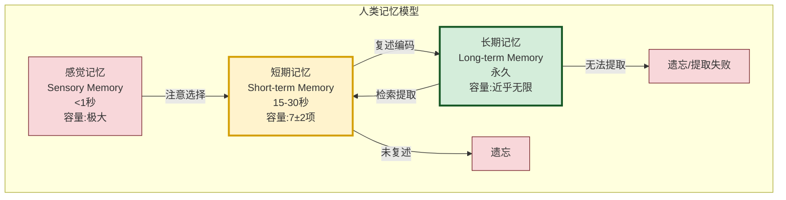

### 2.2 人脑 vs Agent 记忆映射

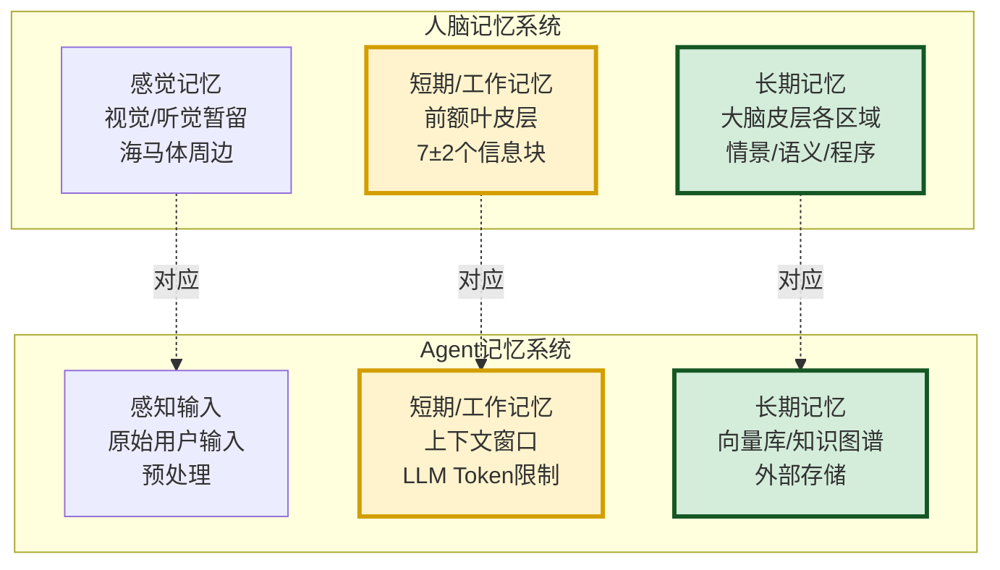

### 2.3 模型对 Agent 设计的三大启示

| 启示 | 人脑原理 | Agent 设计映射 | 核心意义 |
|------|---------|---------------|---------|
| **容量瓶颈** | 短期记忆仅 7±2 项 | LLM 上下文窗口有限(4K-128K Token) | 短期记忆必须做信息筛选和截断 |
| **巩固机制** | 复述才能转入长期记忆 | 需显式的记忆巩固编码流程 | 不是所有短期信息都该存入长期 |
| **提取延迟** | 长期记忆检索需要时间和线索 | 向量检索/图查询引入延迟 | 长期记忆检索是异步的,需提前预取 |

---

## 三、核心区别全景对比

### 3.1 十二维度全景对比表

| 对比维度 | 短期记忆(STM) | 长期记忆(LTM) | 差异本质 |
|---------|--------------|--------------|---------|
| **1. 存储容量** | 有限(LLM上下文窗口,4K-128K Token) | 近乎无限(外部存储扩展) | 物理限制 vs 弹性扩展 |
| **2. 持续时间** | 会话内(秒~小时) | 跨会话(天~永久) | 瞬时 vs 持久 |
| **3. 访问速度** | 极快(纳秒~微秒,内存直接访问) | 较慢(毫秒~秒,需检索) | 直接寻址 vs 索引检索 |
| **4. 编码方式** | 原样保留(文本/结构体直接存储) | 转化编码(向量化/图谱化/摘要化) | 无损 vs 有损转化 |
| **5. 信息处理** | 全量扫描(所有内容都在上下文中) | 按需检索(只取相关部分) | 全量可见 vs 按需提取 |
| **6. 更新方式** | 实时覆写(每轮对话直接更新) | 选择性追加(经筛选后写入) | 覆盖式 vs 累积式 |
| **7. 遗忘机制** | 窗口溢出截断/会话结束清除 | 渐进衰减/主动淘汰/重要性筛选 | 被动丢失 vs 主动管理 |
| **8. 功能定位** | 即时工作区(当前推理的上下文) | 经验仓库(历史知识积累) | 工作台 vs 图书馆 |
| **9. 存储介质** | 进程内存(RAM)/会话缓存(Redis) | 向量库/知识图谱/关系数据库 | 易失性 vs 持久化 |
| **10. 成本模型** | 低存储成本,高Token成本(每次推理全量计入) | 高存储成本,低Token成本(仅检索部分计入) | Token消耗 vs 存储费用 |
| **11. 一致性要求** | 强一致性(当前状态必须准确) | 最终一致性(允许短暂不一致) | 实时同步 vs 异步同步 |
| **12. 失败影响** | 当前任务中断(可重启恢复) | 经验永久丢失(不可逆) | 可恢复 vs 不可恢复 |

### 3.2 核心区别可视化

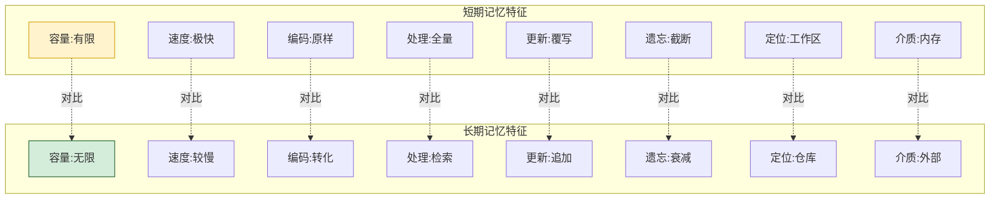

---

## 四、存储容量差异深度解析

### 4.1 容量限制的本质原因

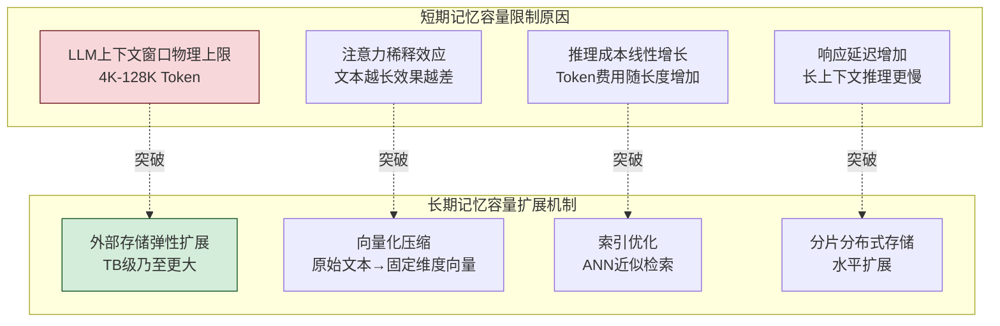

### 4.2 容量对比量化

| 容量指标 | 短期记忆 | 长期记忆 | 倍数差异 |
|---------|---------|---------|:--------:|
| **信息条目数** | ~20-50条消息(滑动窗口) | 百万~亿条记录 | 10⁵~10⁷倍 |
| **Token 数量** | 4K-128K Token | 无上限(仅受存储限制) | ∞ |
| **数据体积** | KB~MB 级 | GB~TB 级 | 10⁶倍 |
| **扩展方式** | 升级模型(更大窗口) | 增加存储节点(水平扩展) | — |
| **扩展成本** | 极高(模型推理成本指数增长) | 低(存储成本线性增长) | — |

### 4.3 容量管理的工程策略

```python
from collections import deque
from dataclasses import dataclass, field
from typing import Any, Optional
import time


class ShortTermMemoryCapacityManager:
    """短期记忆容量管理器(有限容量下的信息筛选)"""

    def __init__(self, max_messages: int = 20, max_tokens: int = 8000):
        self.messages: deque = deque(maxlen=max_messages)
        self.max_tokens = max_tokens
        self.summarized_older = ""  # 被摘要的旧消息

    def add_message(self, role: str, content: str, importance: float = 0.5):
        """添加消息(自动管理容量)"""
        self.messages.append({
            "role": role,
            "content": content,
            "timestamp": time.time(),
            "importance": importance,
            "token_count": len(content) // 4  # 粗略估算
        })

        # 容量超限时触发摘要压缩
        if self._estimate_total_tokens() > self.max_tokens:
            self._compress_older_messages()

    def _compress_older_messages(self):
        """压缩旧消息为摘要(释放短期记忆容量)"""
        # 保留最近N条,旧的压缩为摘要
        keep_count = min(6, len(self.messages) // 2)
        to_compress = list(self.messages)[:-keep_count]

        # 生成摘要(实际用LLM生成)
        summary = self._generate_summary(to_compress)
        self.summarized_older += f"\n{summary}"

        # 重建消息队列(只保留最近的)
        self.messages.clear()
        self.messages.extend(list(to_compress)[-keep_count:])

    def _estimate_total_tokens(self) -> int:
        """估算当前总Token数"""
        return sum(m["token_count"] for m in self.messages) + \
               len(self.summarized_older) // 4

    def _generate_summary(self, messages: list) -> str:
        """生成摘要(简化实现)"""
        contents = [m["content"][:50] for m in messages]
        return f"[之前对话摘要] 讨论了: {'; '.join(contents)}"


class LongTermMemoryCapacityManager:
    """长期记忆容量管理器(近乎无限容量的管理)"""

    def __init__(self, vector_store, max_size_gb: float = 100):
        self.store = vector_store
        self.max_size_gb = max_size_gb
        self.current_size_gb = 0.0

    def store_memory(self, content: str, metadata: dict,
                     importance: float = 0.5) -> str:
        """存储记忆(无需担心容量,但需管理检索效率)"""
        # 向量化存储(固定维度,不随原始内容增长)
        memory_id = self.store.add(
            texts=[content],
            metadatas=[{**metadata, "importance": importance,
                       "timestamp": time.time()}]
        )
        self.current_size_gb += len(content) / (1024 ** 3)
        return memory_id[0] if memory_id else ""

    def retrieve(self, query: str, top_k: int = 5,
                 filter_dict: dict = None) -> list:
        """检索记忆(按需提取,不受总量影响)"""
        results = self.store.similarity_search(
            query=query,
            k=top_k,
            filter=filter_dict
        )
        return results

    def cleanup_low_importance(self, threshold: float = 0.2):
        """清理低重要性记忆(容量管理)"""
        # 删除重要性低于阈值的记忆
        self.store.delete(
            filter={"importance": {"$lt": threshold}}
        )
```

### 4.4 容量差异的核心影响

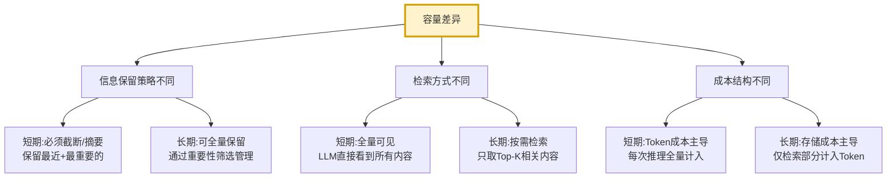

---

## 五、持续时间差异深度解析

### 5.1 时间跨度对比

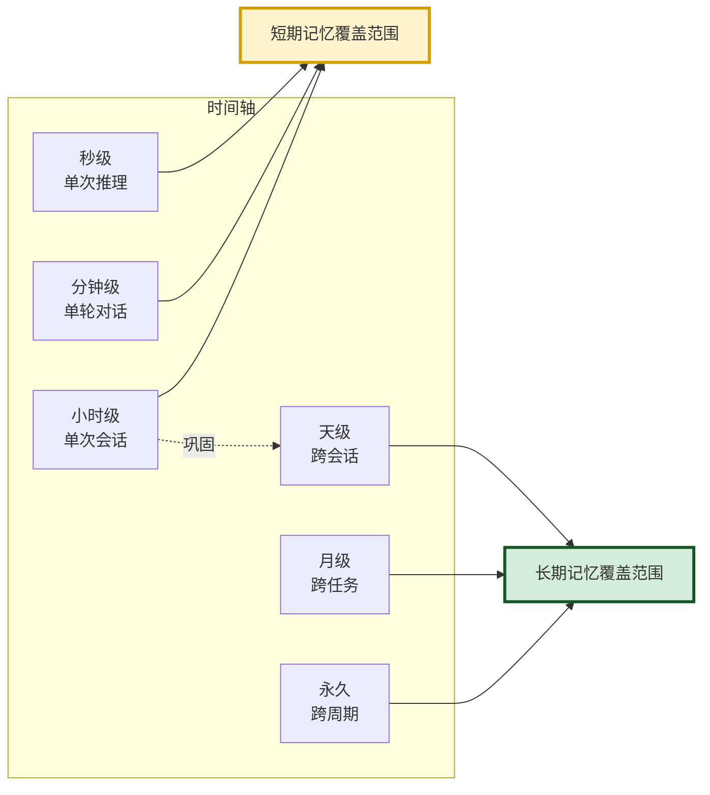

| 时间维度 | 短期记忆 | 长期记忆 |
|---------|---------|---------|
| **最短** | 单次推理过程(毫秒级) | 跨会话(小时~天) |
| **典型** | 单次会话(分钟~小时) | 跨任务(天~月) |
| **最长** | 会话结束即清除 | 永久保留(或主动删除) |
| **生命周期** | 随会话生灭 | 独立于会话存在 |
| **时间焦点** | "此刻"正在处理的信息 | "过去"积累的经验 |

### 5.2 生命周期管理对比

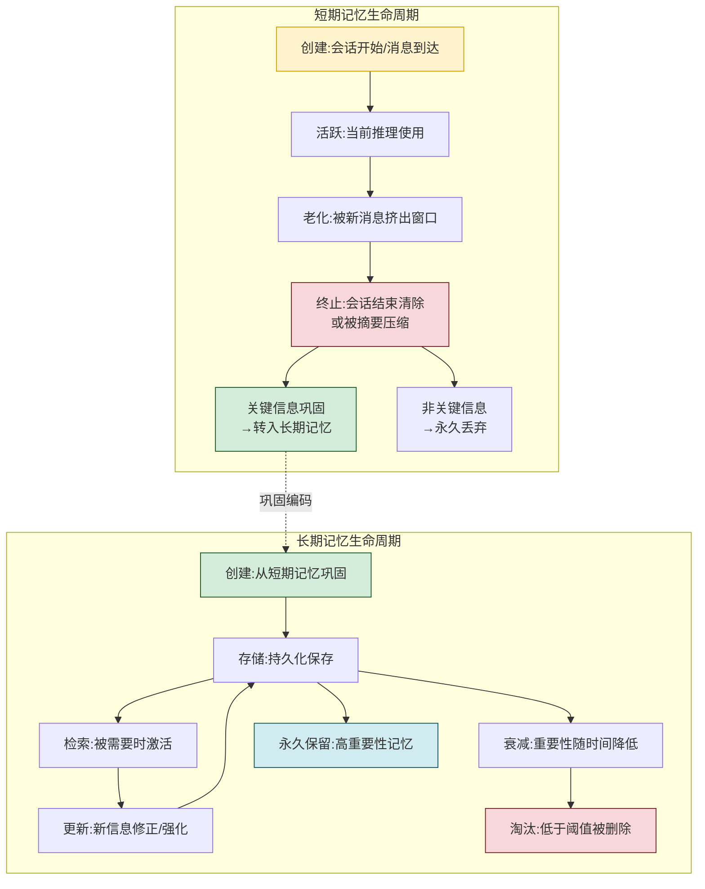

### 5.3 持续时间差异的工程影响

```python
class MemoryLifecycleManager:
    """记忆生命周期管理器"""

    def __init__(self):
        self.short_term_messages: list[dict] = []
        self.short_term_max_age_seconds: int = 3600  # 短期记忆最长1小时
        self.long_term_store = None  # 长期存储后端

    def manage_short_term_lifecycle(self):
        """管理短期记忆生命周期(定期清理过期信息)"""
        now = time.time()
        # 清理超过最大年龄的消息
        self.short_term_messages = [
            m for m in self.short_term_messages
            if now - m.get("timestamp", 0) < self.short_term_max_age_seconds
        ]

    def consolidate_to_long_term(self, session_messages: list[dict]):
        """将短期记忆巩固到长期记忆(会话结束时调用)"""
        for msg in session_messages:
            # 只有重要信息才巩固
            if msg.get("importance", 0) > 0.5:
                self._encode_and_store(msg)

    def _encode_and_store(self, message: dict):
        """编码并存储到长期记忆"""
        # 编码转化(详见第七章)
        encoded = self._transform_encoding(message)
        self.long_term_store.store(encoded)

    def _transform_encoding(self, message: dict) -> dict:
        """转化编码(原样→结构化)"""
        return {
            "content": message["content"],
            "embedding": self._compute_embedding(message["content"]),
            "metadata": {
                "original_timestamp": message["timestamp"],
                "importance": message.get("importance", 0.5),
                "type": message.get("type", "conversation")
            },
            "stored_at": time.time()
        }

    def _compute_embedding(self, text: str) -> list[float]:
        """计算向量嵌入"""
        return [0.0] * 128  # 简化实现
```

---

## 六、信息处理方式差异深度解析

### 6.1 处理方式核心差异

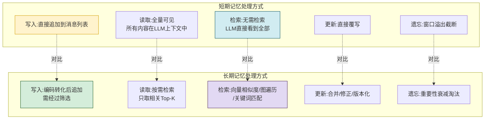

### 6.2 写入方式对比

| 写入维度 | 短期记忆 | 长期记忆 |
|---------|---------|---------|
| **触发时机** | 每条消息/每个步骤实时写入 | 会话结束/重要事件时批量写入 |
| **写入速度** | 极快(内存追加,微秒级) | 较慢(编码+索引,毫秒级) |
| **筛选机制** | 无筛选,全量写入(靠截断管理) | 严格筛选,只写重要信息 |
| **写入格式** | 原始文本/结构体 | 向量化+元数据+索引 |
| **写入成本** | 几乎为零(内存操作) | 较高(Embedding计算+存储I/O) |
| **并发控制** | 简单(单会话单线程) | 复杂(多会话并发写入) |

```python
class ShortTermMemoryWriter:
    """短期记忆写入器(直接、快速、无筛选)"""

    def __init__(self, max_size: int = 20):
        self.messages: deque = deque(maxlen=max_size)

    def write(self, role: str, content: str, **metadata):
        """直接写入,无筛选(靠窗口大小管理)"""
        self.messages.append({
            "role": role,
            "content": content,
            "timestamp": time.time(),
            **metadata
        })
        # 写入即完成,无额外处理


class LongTermMemoryWriter:
    """长期记忆写入器(筛选、编码、索引)"""

    def __init__(self, vector_store, importance_evaluator=None):
        self.store = vector_store
        self.evaluator = importance_evaluator

    def write(self, content: str, context: dict = None,
              force: bool = False) -> Optional[str]:
        """写入需经过筛选和编码"""
        # 步骤1:重要性评估
        if not force:
            importance = self._evaluate_importance(content, context)
            if importance < 0.3:
                return None  # 重要性不足,不写入

        # 步骤2:去重检查
        if self._is_duplicate(content):
            return None  # 已存在,不重复写入

        # 步骤3:编码转化
        embedding = self._compute_embedding(content)
        metadata = self._build_metadata(content, context, importance)

        # 步骤4:写入向量库(含索引构建)
        memory_id = self.store.add(
            texts=[content],
            embeddings=[embedding],
            metadatas=[metadata]
        )

        # 步骤5:建立关联(可选)
        self._build_associations(memory_id[0] if memory_id else "", content)

        return memory_id[0] if memory_id else None

    def _evaluate_importance(self, content: str,
                              context: dict = None) -> float:
        """评估信息重要性"""
        score = 0.3  # 基础分
        # 包含用户偏好关键词
        pref_keywords = ["喜欢", "偏好", "记住", "总是", "我的"]
        if any(kw in content for kw in pref_keywords):
            score += 0.3
        # 包含决策/结论
        decision_keywords = ["决定", "结论", "因此", "方案"]
        if any(kw in content for kw in decision_keywords):
            score += 0.2
        # 长内容可能更重要
        if len(content) > 200:
            score += 0.1
        return min(score, 1.0)

    def _is_duplicate(self, content: str) -> bool:
        """检查是否重复(简化实现)"""
        import hashlib
        content_hash = hashlib.md5(content.encode()).hexdigest()
        # 实际应查询已存储的哈希
        return False

    def _compute_embedding(self, text: str) -> list[float]:
        """计算向量嵌入"""
        return [0.0] * 128

    def _build_metadata(self, content: str, context: dict,
                        importance: float) -> dict:
        """构建元数据"""
        return {
            "importance": importance,
            "timestamp": time.time(),
            "content_hash": hashlib.md5(content.encode()).hexdigest(),
            "context": context or {},
            "type": self._classify_type(content)
        }

    def _classify_type(self, content: str) -> str:
        """分类记忆类型"""
        if any(kw in content for kw in ["喜欢", "偏好"]):
            return "preference"
        elif any(kw in content for kw in ["步骤", "如何"]):
            return "procedural"
        elif any(kw in content for kw in ["是", "等于"]):
            return "semantic"
        return "episodic"

    def _build_associations(self, memory_id: str, content: str):
        """建立记忆关联"""
        pass
```

### 6.3 读取与检索方式对比

```mermaid
flowchart TB
    subgraph 短期记忆读取
        SR1[请求读取] --> SR2[直接返回消息列表]
        SR2 --> SR3[所有内容都在LLM上下文中]
        SR3 --> SR4[LLM直接处理<br/>无需检索过程]
        SR4 --> SR5[延迟:0<br/>全量可见]
    end

    subgraph 长期记忆检索
        LR1[请求检索] --> LR2[查询向量化<br/>Query Embedding]
        LR2 --> LR3[向量相似度计算<br/>ANN近似检索]
        LR3 --> LR4[结果重排序<br/>Rerank]
        LR4 --> LR5[返回Top-K结果]
        LR5 --> LR6[注入LLM上下文]
        LR6 --> LR7[LLM处理<br/>延迟:50-500ms]
    end

    style SR4 fill:#d4edda,stroke:#155724
    style LR3 fill:#fff3cd,stroke:#d39e00
    style LR7 fill:#fff3cd,stroke:#d39e00
```

| 读取维度 | 短期记忆 | 长期记忆 |
|---------|---------|---------|
| **读取方式** | 直接访问(全量返回) | 检索提取(按相关性返回) |
| **检索方法** | 不需要检索(全量在上下文中) | 向量相似度/图遍历/关键词匹配 |
| **返回量** | 全部内容 | Top-K 最相关内容 |
| **读取延迟** | ~0(内存访问) | 50-500ms(检索计算) |
| **准确性** | 精确(看到就是全部) | 近似(可能遗漏相关内容) |
| **LLM可见性** | 全部可见(在上下文窗口内) | 部分可见(仅检索结果) |

### 6.4 遗忘机制对比

```python
class ShortTermForgetting:
    """短期记忆遗忘机制(被动、简单)"""

    def __init__(self, max_messages: int = 20):
        self.messages: deque = deque(maxlen=max_messages)

    def add(self, message: dict):
        """添加消息,自动遗忘最旧的"""
        self.messages.append(message)
        # deque自动丢弃超过maxlen的旧消息(被动遗忘)

    def clear_on_session_end(self):
        """会话结束全部清除"""
        self.messages.clear()


class LongTermForgetting:
    """长期记忆遗忘机制(主动、智能)"""

    def __init__(self, vector_store):
        self.store = vector_store
        self.decay_half_life_days = 30  # 半衰期30天

    def apply_decay(self):
        """应用时间衰减(降低旧记忆的重要性分数)"""
        now = time.time()
        all_memories = self.store.get_all()

        for mem in all_memories:
            age_days = (now - mem["metadata"]["timestamp"]) / 86400
            # 指数衰减: importance *= 0.5^(age / half_life)
            decay_factor = 0.5 ** (age_days / self.decay_half_life_days)
            # 访问频率 boost(被检索过的记忆衰减更慢)
            access_boost = 1.0 + 0.1 * mem["metadata"].get("access_count", 0)
            new_importance = mem["metadata"]["importance"] * decay_factor * min(access_boost, 2.0)

            self.store.update_metadata(
                mem["id"],
                {"importance": new_importance}
            )

    def cleanup_below_threshold(self, threshold: float = 0.1):
        """清理重要性低于阈值的记忆"""
        self.store.delete(
            filter={"importance": {"$lt": threshold}}
        )

    def selective_forget(self, strategy: str = "importance"):
        """选择性遗忘"""
        if strategy == "importance":
            self.cleanup_below_threshold()
        elif strategy == "age":
            # 删除超过N天的低重要性记忆
            cutoff = time.time() - 90 * 86400  # 90天前
            self.store.delete(filter={
                "timestamp": {"$lt": cutoff},
                "importance": {"$lt": 0.5}
            })
        elif strategy == "redundancy":
            # 删除冗余记忆(语义高度重复)
            self._remove_redundant()
```

---

## 七、编码机制差异深度解析

### 7.1 编码机制核心差异

这是短期记忆和长期记忆**最本质的差异**之一。短期记忆原样保留信息,长期记忆必须对信息进行**转化编码**,使其适应持久化存储和高效检索。

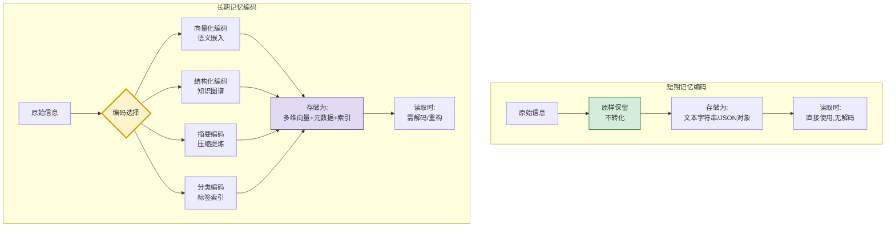

### 7.2 编码方式对比

| 编码维度 | 短期记忆 | 长期记忆 |
|---------|---------|---------|
| **编码方式** | 无编码(原样保留) | 多种编码(向量化/图谱化/摘要化) |
| **信息保真度** | 100%无损 | 有损(经过转化压缩) |
| **存储格式** | 原始文本/JSON | 固定维度向量+元数据 |
| **编码成本** | 零(无需处理) | 高(Embedding计算/图谱构建) |
| **检索支持** | 不支持语义检索(仅文本匹配) | 支持语义检索(向量相似度) |
| **解码成本** | 零(直接使用) | 低(向量→文本,或直接使用元数据) |

### 7.3 长期记忆的四种编码机制

```python
import hashlib
from dataclasses import dataclass, field
from typing import Any, Optional


@dataclass
class EncodedMemory:
    """编码后的长期记忆"""
    memory_id: str
    original_content: str               # 原始内容(可选保留)
    embedding: list[float] = None       # 向量编码
    graph_nodes: list[dict] = None      # 图谱节点
    graph_edges: list[dict] = None      # 图谱边
    summary: str = ""                   # 摘要编码
    tags: list[str] = None              # 标签编码
    metadata: dict = field(default_factory=dict)


class LongTermMemoryEncoder:
    """长期记忆编码器(四种编码机制)"""

    def __init__(self, embedding_model=None, kg_store=None):
        self.embedding_model = embedding_model
        self.kg_store = kg_store

    def encode(self, content: str, context: dict = None) -> EncodedMemory:
        """对原始信息进行多重编码"""
        memory_id = f"mem_{hashlib.md5(content.encode()).hexdigest()[:12]}"

        encoded = EncodedMemory(
            memory_id=memory_id,
            original_content=content,
            metadata={
                "timestamp": time.time(),
                "context": context or {},
                "importance": self._assess_importance(content)
            }
        )

        # 编码1:向量化编码(语义检索基础)
        encoded.embedding = self._encode_vector(content)

        # 编码2:知识图谱编码(关联推理基础)
        nodes, edges = self._encode_graph(content)
        encoded.graph_nodes = nodes
        encoded.graph_edges = edges

        # 编码3:摘要编码(压缩存储)
        if len(content) > 500:
            encoded.summary = self._encode_summary(content)

        # 编码4:标签编码(分类检索)
        encoded.tags = self._encode_tags(content)

        return encoded

    def _encode_vector(self, content: str) -> list[float]:
        """向量化编码:文本→固定维度向量"""
        if self.embedding_model:
            return self.embedding_model.embed(content)
        return [0.0] * 128  # 简化

    def _encode_graph(self, content: str) -> tuple[list, list]:
        """知识图谱编码:提取实体和关系"""
        entities = self._extract_entities(content)
        relations = self._extract_relations(content, entities)

        nodes = [{"id": e, "type": "entity", "label": e} for e in entities]
        edges = [{"source": r[0], "relation": r[1], "target": r[2]}
                 for r in relations]
        return nodes, edges

    def _encode_summary(self, content: str) -> str:
        """摘要编码:长文本→压缩摘要"""
        # 实际用LLM生成摘要
        if len(content) > 200:
            return content[:200] + "..."
        return content

    def _encode_tags(self, content: str) -> list[str]:
        """标签编码:内容→分类标签"""
        tags = []
        tag_rules = {
            "偏好": ["喜欢", "偏好", "习惯"],
            "知识": ["是", "等于", "定义"],
            "流程": ["步骤", "如何", "方法"],
            "事件": ["发生了", "昨天", "上次"]
        }
        for tag, keywords in tag_rules.items():
            if any(kw in content for kw in keywords):
                tags.append(tag)
        return tags

    def _extract_entities(self, content: str) -> list[str]:
        """提取实体(简化实现)"""
        # 实际用NER模型
        return []

    def _extract_relations(self, content: str,
                            entities: list) -> list[tuple]:
        """提取关系(简化实现)"""
        return []

    def _assess_importance(self, content: str) -> float:
        """评估重要性"""
        score = 0.3
        if any(kw in content for kw in ["喜欢", "偏好", "记住"]):
            score += 0.3
        if len(content) > 200:
            score += 0.2
        return min(score, 1.0)
```

### 7.4 编码差异的检索影响

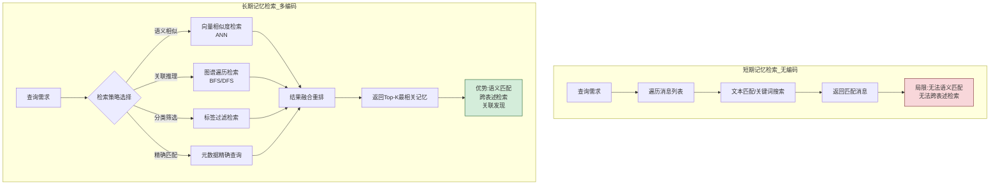

**编码差异带来的检索能力差异**:

| 检索能力 | 短期记忆(无编码) | 长期记忆(多编码) |
|---------|----------------|-----------------|
| **精确匹配** | ✅ 文本包含匹配 | ✅ 元数据精确查询 |
| **语义相似** | ❌ 无法实现 | ✅ 向量相似度检索 |
| **关联发现** | ❌ 无法实现 | ✅ 图谱遍历发现 |
| **分类筛选** | ❌ 无法实现 | ✅ 标签过滤 |
| **跨表述检索** | ❌ "开心"找不到"高兴" | ✅ 语义等价自动匹配 |
| **模糊检索** | ❌ 仅支持精确子串 | ✅ 近似语义匹配 |

---

## 八、功能定位差异深度解析

### 8.1 功能定位核心对比

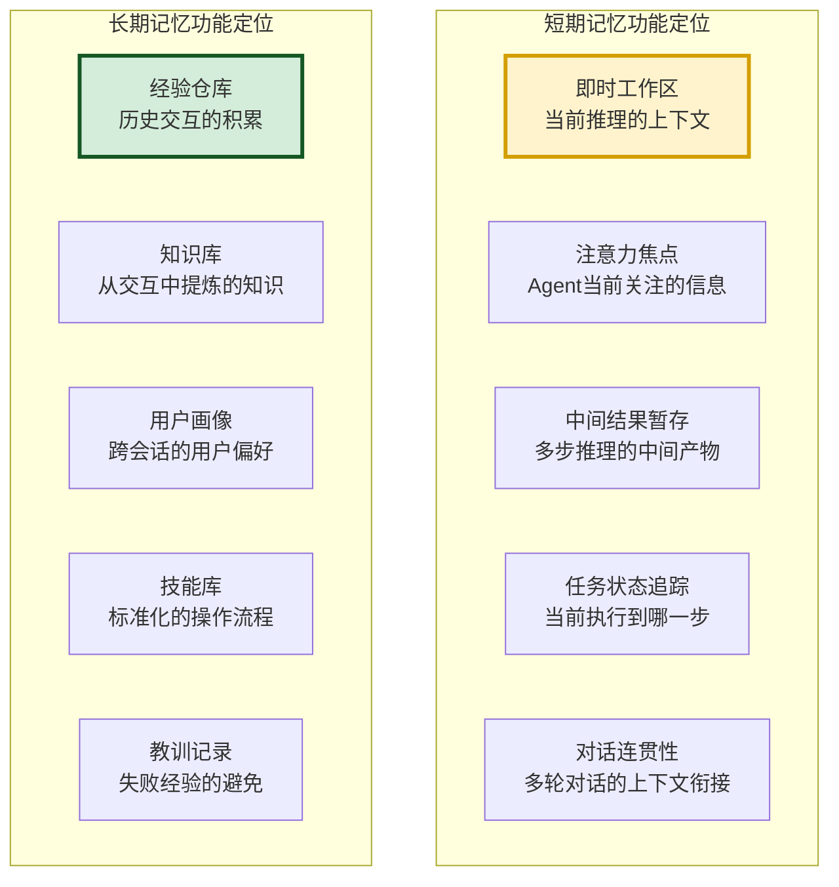

### 8.2 功能定位详解

#### 8.2.1 短期记忆的五大功能

| 功能 | 说明 | 类比 |
|------|------|------|
| **即时工作区** | 提供LLM推理所需的当前上下文 | 书桌上摊开的文件 |
| **注意力焦点** | 聚焦当前任务的关键信息 | 聚光灯照亮的区域 |
| **中间结果暂存** | 多步推理链中暂存每步结论 | 草稿纸上的演算过程 |
| **任务状态追踪** | 记录当前执行进度和变量 | 任务清单的当前状态 |
| **对话连贯性** | 维持多轮对话的话题连贯 | 谈话中的短期记忆 |

#### 8.2.2 长期记忆的五大功能

| 功能 | 说明 | 类比 |
|------|------|------|
| **经验仓库** | 存储历史交互和任务经历 | 个人日记/回忆录 |
| **知识库** | 从交互中提炼的抽象知识 | 百科全书 |
| **用户画像** | 跨会话积累的用户偏好 | 对朋友的长期了解 |
| **技能库** | 标准化的操作流程模板 | 烹饪菜谱 |
| **教训记录** | 失败经验的避免重蹈 | 错题本 |

### 8.3 功能定位差异对 Agent 架构的影响

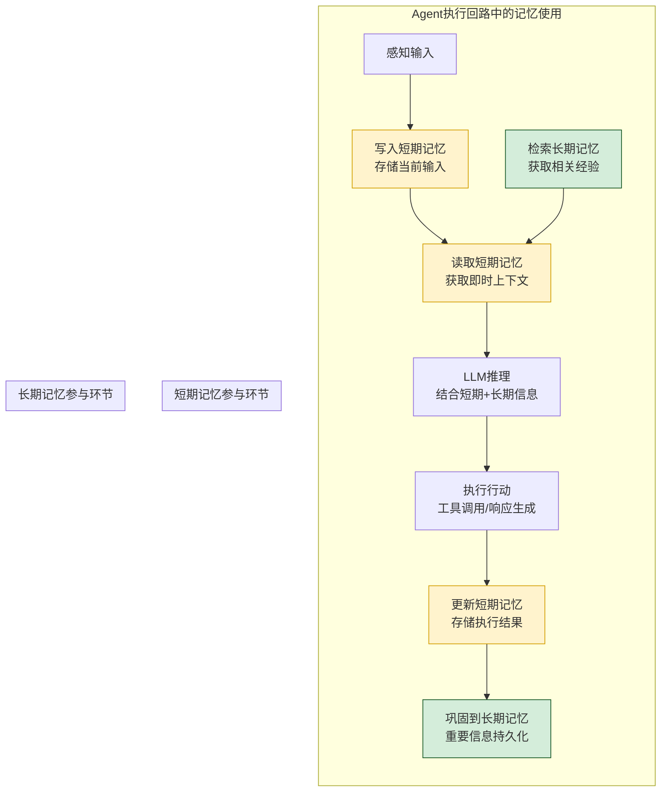

| 执行环节 | 短期记忆参与 | 长期记忆参与 |
|---------|------------|------------|
| **感知输入** | ✅ 写入当前输入 | ❌ 不直接参与 |
| **推理前** | ✅ 提供即时上下文 | ✅ 检索相关经验 |
| **LLM推理** | ✅ 全量在上下文中 | ✅ 检索结果注入上下文 |
| **执行行动** | ✅ 暂存执行参数 | ❌ 不直接参与 |
| **执行后** | ✅ 更新执行结果 | ✅ 重要结果巩固 |
| **会话结束** | ❌ 清除 | ✅ 关键信息持久化 |

---

## 九、两者交互机制:记忆巩固与检索提取

### 9.1 交互机制全景

短期记忆和长期记忆不是孤立的,它们通过**巩固(Consolidation)**和**提取(Retrieval)**两个核心机制紧密协作。

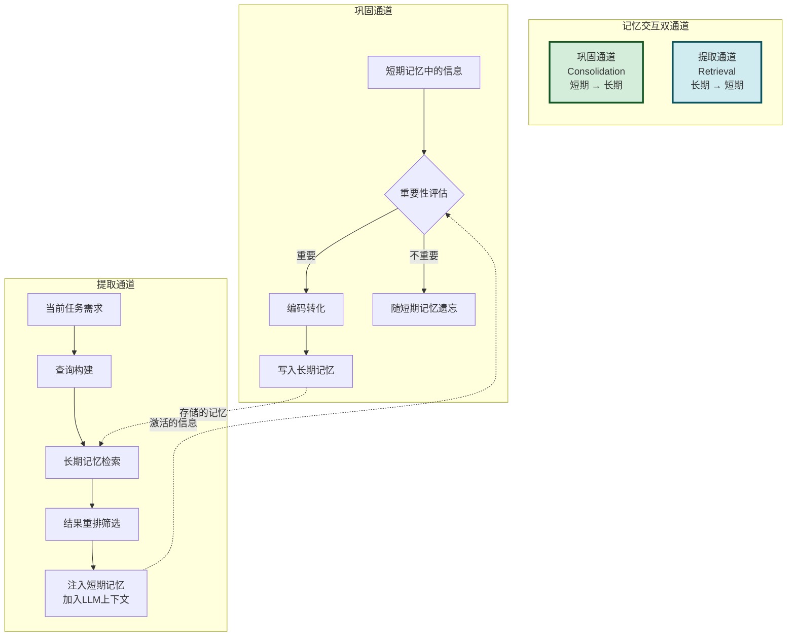

### 9.2 记忆巩固机制(短期→长期)

```python
class MemoryConsolidator:
    """记忆巩固器:将短期记忆中的重要信息转入长期记忆"""

    def __init__(self, long_term_encoder: LongTermMemoryEncoder,
                 long_term_store):
        self.encoder = long_term_encoder
        self.store = long_term_store
        self.consolidation_rules = {
            "always_consolidate": ["preference", "decision", "fact"],
            "importance_threshold": 0.5,
            "dedup_enabled": True
        }

    def consolidate_session(self, short_term_messages: list[dict],
                             user_id: str = None) -> dict:
        """会话结束时巩固短期记忆到长期记忆"""
        stats = {
            "total_messages": len(short_term_messages),
            "consolidated": 0,
            "skipped_low_importance": 0,
            "skipped_duplicate": 0,
            "errors": 0
        }

        for msg in short_term_messages:
            try:
                # 步骤1:重要性评估
                importance = msg.get("importance", 0.3)
                msg_type = msg.get("type", "conversation")

                # 强制巩固类型检查
                if msg_type in self.consolidation_rules["always_consolidate"]:
                    importance = max(importance, 0.7)

                # 重要性过滤
                if importance < self.consolidation_rules["importance_threshold"]:
                    stats["skipped_low_importance"] += 1
                    continue

                # 步骤2:去重检查
                if self.consolidation_rules["dedup_enabled"]:
                    if self._is_duplicate(msg["content"]):
                        stats["skipped_duplicate"] += 1
                        continue

                # 步骤3:编码转化
                encoded = self.encoder.encode(
                    content=msg["content"],
                    context={
                        "user_id": user_id,
                        "role": msg.get("role"),
                        "session_timestamp": msg.get("timestamp")
                    }
                )

                # 步骤4:写入长期记忆
                self._store_encoded(encoded)
                stats["consolidated"] += 1

            except Exception:
                stats["errors"] += 1

        return stats

    def consolidate_event(self, event: dict):
        """实时巩固重要事件(不等会话结束)"""
        if event.get("importance", 0) > 0.8:
            encoded = self.encoder.encode(
                content=event["content"],
                context=event.get("context")
            )
            self._store_encoded(encoded)

    def _is_duplicate(self, content: str) -> bool:
        """去重检查"""
        import hashlib
        content_hash = hashlib.md5(content.encode()).hexdigest()
        # 查询长期存储中是否已有相同哈希
        return False

    def _store_encoded(self, encoded: EncodedMemory):
        """存储编码后的记忆"""
        self.store.add(
            texts=[encoded.original_content],
            embeddings=[encoded.embedding],
            metadatas={
                **encoded.metadata,
                "tags": encoded.tags,
                "summary": encoded.summary,
                "graph_nodes": encoded.graph_nodes,
                "graph_edges": encoded.graph_edges
            }
        )
```

### 9.3 记忆提取机制(长期→短期)

```python
class MemoryRetriever:
    """记忆提取器:从长期记忆检索信息注入短期记忆"""

    def __init__(self, long_term_store, embedding_model=None):
        self.store = long_term_store
        self.embedding_model = embedding_model

    def retrieve_and_inject(self, query: str,
                             short_term_memory: list[dict],
                             top_k: int = 5,
                             max_tokens: int = 2000) -> list[dict]:
        """检索长期记忆并注入短期记忆上下文"""
        # 步骤1:构建查询向量
        query_embedding = self._embed(query)

        # 步骤2:多策略检索
        results = []

        # 策略A:语义相似检索
        semantic_results = self.store.similarity_search(
            query=query, k=top_k
        )
        results.extend(semantic_results)

        # 策略B:关键词精确检索(补充)
        keyword_results = self.store.keyword_search(
            keywords=query.split(), limit=3
        )
        results.extend(keyword_results)

        # 步骤3:去重和重排
        unique_results = self._deduplicate(results)
        ranked_results = self._rerank(unique_results, query)

        # 步骤4:Token预算控制
        filtered = self._filter_by_token_budget(ranked_results, max_tokens)

        # 步骤5:格式化为上下文消息
        injected = []
        for result in filtered:
            injected.append({
                "role": "system",
                "content": f"[长期记忆] {result['content']}",
                "source": "long_term_memory",
                "relevance": result.get("score", 0),
                "memory_id": result.get("id")
            })

        # 步骤6:注入短期记忆(插入在用户消息之前)
        return self._inject_into_context(short_term_memory, injected)

    def _embed(self, text: str) -> list[float]:
        if self.embedding_model:
            return self.embedding_model.embed(text)
        return [0.0] * 128

    def _deduplicate(self, results: list) -> list:
        seen = set()
        unique = []
        for r in results:
            content_hash = hashlib.md5(
                r["content"].encode()
            ).hexdigest()
            if content_hash not in seen:
                seen.add(content_hash)
                unique.append(r)
        return unique

    def _rerank(self, results: list, query: str) -> list:
        """结果重排(综合相似度+重要性+时效性)"""
        now = time.time()
        for r in results:
            similarity = r.get("score", 0.5)
            importance = r.get("metadata", {}).get("importance", 0.5)
            age_days = (now - r.get("metadata", {}).get("timestamp", now)) / 86400
            recency = max(0.1, 1.0 - age_days / 30)  # 30天衰减
            r["final_score"] = 0.5 * similarity + 0.3 * importance + 0.2 * recency
        return sorted(results, key=lambda x: x["final_score"], reverse=True)

    def _filter_by_token_budget(self, results: list,
                                  max_tokens: int) -> list:
        filtered = []
        used = 0
        for r in results:
            tokens = len(r["content"]) // 4
            if used + tokens <= max_tokens:
                filtered.append(r)
                used += tokens
            else:
                break
        return filtered

    def _inject_into_context(self, short_term: list,
                               injected: list) -> list:
        """将长期记忆注入短期记忆上下文"""
        # 找到用户最后一条消息的位置
        result = []
        injected_done = False
        for msg in short_term:
            if msg.get("role") == "user" and not injected_done:
                # 在用户消息前注入长期记忆
                result.extend(injected)
                injected_done = True
            result.append(msg)
        if not injected_done:
            result.extend(injected)
        return result
```

### 9.4 巩固与提取的协同循环

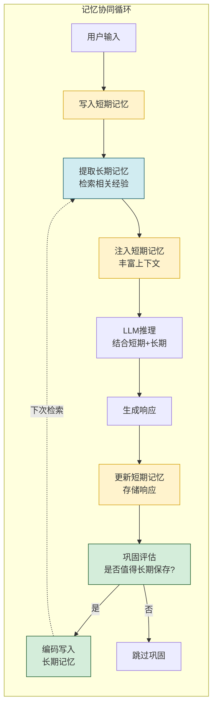

---

## 十、工程实现对比:完整代码示例

### 10.1 短期记忆完整实现

```python
class ShortTermMemorySystem:
    """短期记忆完整实现"""

    def __init__(self, max_messages: int = 20, max_tokens: int = 8000):
        self.messages: deque = deque(maxlen=max_messages)
        self.max_tokens = max_tokens
        self.context_vars: dict = {}          # 上下文变量
        self.task_stack: list = []             # 任务状态栈
        self.attention_focus: str = ""         # 注意力焦点
        self.session_start: float = time.time()
        self.summary: str = ""                 # 旧消息摘要

    def add(self, role: str, content: str, importance: float = 0.5,
            **metadata):
        """添加消息到短期记忆"""
        self.messages.append({
            "role": role,
            "content": content,
            "timestamp": time.time(),
            "importance": importance,
            "token_count": len(content) // 4,
            **metadata
        })
        # 容量管理
        if self._total_tokens() > self.max_tokens:
            self._compress()

    def get_context(self) -> list[dict]:
        """获取完整上下文(供LLM使用)"""
        context = []
        # 添加摘要(如果有)
        if self.summary:
            context.append({
                "role": "system",
                "content": f"[会话摘要] {self.summary}"
            })
        # 添加上下文变量
        if self.context_vars:
            context.append({
                "role": "system",
                "content": f"[上下文变量] {self.context_vars}"
            })
        # 添加消息历史
        context.extend(list(self.messages))
        return context

    def set_var(self, key: str, value: Any):
        self.context_vars[key] = value

    def get_var(self, key: str) -> Any:
        return self.context_vars.get(key)

    def push_task(self, task: dict):
        self.task_stack.append(task)

    def pop_task(self) -> dict:
        return self.task_stack.pop() if self.task_stack else None

    def clear(self):
        """清除短期记忆(会话结束)"""
        self.messages.clear()
        self.context_vars.clear()
        self.task_stack.clear()
        self.summary = ""

    def _total_tokens(self) -> int:
        return sum(m["token_count"] for m in self.messages) + len(self.summary) // 4

    def _compress(self):
        """压缩旧消息为摘要"""
        keep = min(6, len(self.messages) // 2)
        old = list(self.messages)[:-keep]
        self.summary += f"\n[摘要] {'; '.join(m['content'][:30] for m in old)}"
        self.messages = deque(list(self.messages)[-keep:], maxlen=self.messages.maxlen)
```

### 10.2 长期记忆完整实现

```python
class LongTermMemorySystem:
    """长期记忆完整实现"""

    def __init__(self, vector_store, kg_store=None, kv_store=None):
        self.vector = vector_store      # 向量库(语义检索)
        self.kg = kg_store              # 知识图谱(关联推理)
        self.kv = kv_store              # KV存储(精确查询)
        self.encoder = LongTermMemoryEncoder()

    def store(self, content: str, context: dict = None,
              importance: float = 0.5, force: bool = False) -> Optional[str]:
        """存储到长期记忆(经编码后持久化)"""
        if not force and importance < 0.3:
            return None

        # 编码
        encoded = self.encoder.encode(content, context)

        # 存入向量库
        vec_id = self.vector.add(
            texts=[content],
            embeddings=[encoded.embedding],
            metadatas=[{
                "importance": importance,
                "timestamp": time.time(),
                "tags": encoded.tags,
                "type": context.get("type", "episodic") if context else "episodic"
            }]
        )

        # 存入知识图谱(如果有)
        if self.kg and encoded.graph_nodes:
            for node in encoded.graph_nodes:
                self.kg.add_node(**node)
            for edge in encoded.graph_edges:
                self.kg.add_edge(**edge)

        # 存入KV(精确查询用)
        if self.kv:
            self.kv.put(
                key=f"mem:{vec_id[0] if vec_id else 'unknown'}",
                value={"content": content, "metadata": encoded.metadata}
            )

        return vec_id[0] if vec_id else None

    def retrieve(self, query: str, top_k: int = 5,
                 filter_dict: dict = None) -> list[dict]:
        """从长期记忆检索"""
        # 向量语义检索
        results = self.vector.similarity_search(
            query=query, k=top_k, filter=filter_dict
        )
        # 更新访问计数
        for r in results:
            self._update_access_count(r.get("id"))
        return results

    def retrieve_by_entity(self, entity: str) -> list[dict]:
        """通过知识图谱检索关联记忆"""
        if not self.kg:
            return []
        related = self.kg.get_neighbors(entity)
        return related

    def update_importance(self, memory_id: str, delta: float):
        """更新记忆重要性"""
        self.vector.update_metadata(memory_id, {
            "importance": delta
        })

    def apply_decay(self):
        """应用时间衰减"""
        now = time.time()
        all_mems = self.vector.get_all()
        for mem in all_mems:
            age_days = (now - mem["metadata"]["timestamp"]) / 86400
            decay = 0.5 ** (age_days / 30)
            access_boost = 1.0 + 0.1 * mem["metadata"].get("access_count", 0)
            new_imp = mem["metadata"]["importance"] * decay * min(access_boost, 2.0)
            self.vector.update_metadata(mem["id"], {"importance": new_imp})

    def cleanup(self, threshold: float = 0.1):
        """清理低重要性记忆"""
        self.vector.delete(filter={"importance": {"$lt": threshold}})

    def _update_access_count(self, memory_id: str):
        """更新访问计数"""
        pass
```

---

## 十一、具体实例分析

### 11.1 实例一:多轮对话中的短期记忆

**场景**:用户与Agent进行多轮对话,讨论一个技术问题。

```mermaid
flowchart LR
    U1[用户:什么是RAG?] --> STM1[STM:存储问题1]
    STM1 --> A1[Agent:RAG是检索增强生成...]
    A1 --> STM2[STM:存储回答1]

    U2[用户:它和微调有什么区别?] --> STM3[STM:存储问题2<br/>注意:代词"它"指代RAG]
    STM3 --> STM_R[STM:检索上下文<br/>找到"RAG"是当前话题]
    STM_R --> A2[Agent:RAG和微调的区别是...<br/>利用短期记忆理解"它"=RAG]
    A2 --> STM4[STM:存储回答2]

    style STM1 fill:#fff3cd,stroke:#d39e00
    style STM3 fill:#fff3cd,stroke:#d39e00
    style STM_R fill:#fff3cd,stroke:#d39e00
```

**分析**:代词"它"的消解完全依赖短期记忆——Agent从短期记忆中找到最近讨论的主题"RAG",理解"它"指代RAG。如果短期记忆丢失,Agent无法理解用户在问什么。

### 11.2 实例二:跨会话的长期记忆

**场景**:用户第一次告诉Agent偏好,第二次会话时Agent主动应用。

```mermaid
flowchart TB
    subgraph 第一次会话
        U1[用户:我喜欢简洁的回答<br/>不要长篇大论] --> STM1[STM:存储偏好]
        STM1 --> CON[巩固:偏好重要性=0.9<br/>编码为"偏好"类型]
        CON --> LTM1[LTM:持久化存储<br/>tag=preference<br/>user_id=xxx]
    end

    subgraph 第二次会话(一周后)
        U2[用户:解释一下什么是Agent] --> RET[检索长期记忆<br/>query="Agent解释"]
        RET --> LTM2[LTM:命中用户偏好<br/>"喜欢简洁回答"]
        LTM2 --> INJ[注入短期记忆<br/>系统提示:用户偏好简洁]
        INJ --> A2[Agent:简洁回答<br/>"Agent是能自主感知<br/>推理和行动的AI系统"]
    end

    LTM1 -.->|一周后| RET

    style CON fill:#d4edda,stroke:#155724
    style LTM1 fill:#d4edda,stroke:#155724
    style RET fill:#d1ecf1,stroke:#0c5460
    style INJ fill:#fff3cd,stroke:#d39e00
```

**分析**:用户偏好通过**巩固机制**从短期记忆转入长期记忆。一周后的新会话中,短期记忆已清空,但长期记忆通过**提取机制**将偏好检索出来,注入短期记忆上下文,影响Agent的回答风格。

### 11.3 实例三:短期与长期记忆协同

**场景**:Agent协助用户完成一个跨天的多步任务。

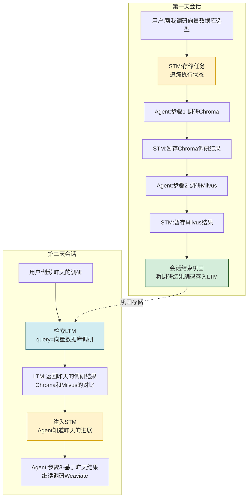

**分析**:
- **短期记忆**负责第一天的即时任务状态追踪和中间结果暂存
- **巩固机制**在会话结束时将重要结果编码存入长期记忆
- **提取机制**在第二天检索昨天的调研结果,注入短期记忆
- **短期记忆**接收长期记忆的提取结果,恢复任务上下文,继续执行

### 11.4 实例对比总结

| 实例 | 短期记忆作用 | 长期记忆作用 | 协同方式 |
|------|------------|------------|---------|
| **多轮对话** | 代词消解、上下文衔接 | 不参与(单会话内) | 短期独立工作 |
| **跨会话偏好** | 存储当前偏好(暂存) | 持久化偏好、跨会话检索 | 巩固+提取 |
| **跨天任务** | 任务状态追踪、中间结果暂存 | 调研结果持久化、跨天恢复 | 巩固+提取+注入 |

---

## 十二、混合架构设计策略

### 12.1 分层混合架构

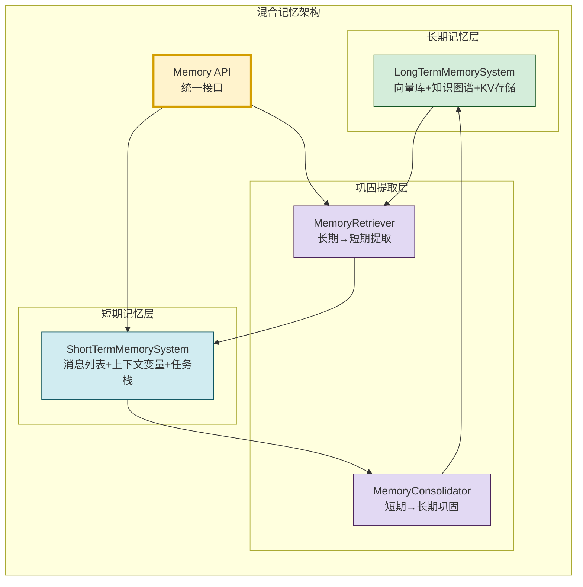

### 12.2 统一记忆管理器

```python
class HybridMemoryManager:
    """混合记忆管理器(统一接口)"""

    def __init__(self):
        self.short_term = ShortTermMemorySystem()
        self.long_term = LongTermMemorySystem(
            vector_store=None,  # 初始化向量库
            kg_store=None,
            kv_store=None
        )
        self.consolidator = MemoryConsolidator(
            self.long_term.encoder, self.long_term.vector
        )
        self.retriever = MemoryRetriever(self.long_term.vector)

    def process_input(self, user_input: str,
                      user_id: str = None) -> list[dict]:
        """处理用户输入(短期+长期协同)"""
        # 1. 写入短期记忆
        self.short_term.add("user", user_input, importance=0.5)

        # 2. 从长期记忆检索相关信息
        relevant = self.retriever.retrieve_and_inject(
            query=user_input,
            short_term_memory=self.short_term.get_context(),
            top_k=3
        )

        # 3. 返回增强后的上下文(短期+长期)
        return relevant

    def process_output(self, response: str, user_id: str = None):
        """处理Agent输出(更新短期+评估巩固)"""
        # 1. 写入短期记忆
        self.short_term.add("assistant", response, importance=0.5)

        # 2. 实时巩固(高重要性信息立即存入长期)
        if self._is_important(response):
            self.consolidator.consolidate_event({
                "content": response,
                "importance": 0.8,
                "context": {"user_id": user_id}
            })

    def end_session(self, user_id: str = None):
        """会话结束(批量巩固)"""
        messages = list(self.short_term.messages)
        self.consolidator.consolidate_session(messages, user_id)
        self.short_term.clear()

    def _is_important(self, content: str) -> bool:
        keywords = ["记住", "偏好", "决定", "结论", "重要"]
        return any(kw in content for kw in keywords)
```

### 12.3 混合架构的数据流

```mermaid
flowchart TD
    U[用户输入] --> W1[写入短期记忆]
    W1 --> R1[检索长期记忆<br/>获取相关经验]
    R1 --> I1[注入短期记忆<br/>丰富上下文]
    I1 --> LLM[LLM推理<br/>短期+长期信息]
    LLM --> A[生成响应]
    A --> W2[写入短期记忆]
    W2 --> E1{重要性评估}
    E1 -- 高 --> C1[实时巩固到长期]
    E1 -- 低 --> S1[保留在短期]

    S1 -.->|会话结束| C2[批量巩固到长期]
    C1 & C2 --> LTM[长期记忆库]
    W1 --> S1

    style W1 fill:#fff3cd,stroke:#d39e00
    style R1 fill:#d1ecf1,stroke:#0c5460
    style I1 fill:#fff3cd,stroke:#d39e00
    style C1 fill:#d4edda,stroke:#155724
    style C2 fill:#d4edda,stroke:#155724
```

---

## 十三、总结与最佳实践

### 13.1 核心区别总结

```mermaid
mindmap
  root((短期vs长期记忆<br/>核心区别))
    存储容量
      短期:有限上下文窗口
      长期:近乎无限外部存储
    持续时间
      短期:会话内瞬时
      长期:跨会话持久
    信息处理
      短期:全量可见直接存取
      长期:按需检索编码提取
    编码机制
      短期:原样保留无编码
      长期:向量化图谱化摘要化
    功能定位
      短期:即时工作区
      长期:经验仓库
    交互机制
      巩固:短期→长期
      提取:长期→短期
```

### 13.2 最佳实践

| 实践领域 | 最佳实践 | 原因 |
|---------|---------|------|
| **容量管理** | 短期用滑动窗口+摘要压缩 | 窗口有限,需释放空间 |
| **重要性筛选** | 长期记忆必须经重要性评估后才写入 | 避免信息膨胀,保证质量 |
| **编码策略** | 长期记忆采用多重编码(向量+图谱+标签) | 支持多维度检索 |
| **巩固时机** | 会话结束批量巩固+高重要性实时巩固 | 平衡性能与信息保留 |
| **提取策略** | 检索Top-K+Token预算控制 | 避免注入过多信息撑爆短期记忆 |
| **遗忘机制** | 短期窗口截断+长期重要性衰减 | 模拟人类记忆遗忘规律 |
| **混合架构** | 统一API+分层存储+巩固提取通道 | 对上层透明,内部各司其职 |
| **性能优化** | 长期检索异步化,不阻塞短期记忆 | 保证实时响应速度 |

### 13.3 常见误区

| 误区 | 危害 | 正确做法 |
|------|------|---------|
| **全部信息存入长期记忆** | 信息膨胀,检索质量下降 | 严格筛选,只存重要信息 |
| **短期记忆不做容量管理** | Token溢出,LLM报错 | 滑动窗口+摘要压缩 |
| **长期记忆不做遗忘** | 无限膨胀,成本失控 | 重要性衰减+主动淘汰 |
| **巩固和提取不同步** | 信息断层,检索不到 | 建立统一的巩固提取管道 |
| **忽视编码差异** | 长期记忆无法语义检索 | 必须进行向量化编码 |

### 13.4 与系列文档的关系

- [74Agent记忆系统核心价值与必要性解析.md](./74Agent记忆系统核心价值与必要性解析.md):阐述Memory的整体价值,本文深入其中短期与长期的核心分野
- [75Agent记忆系统类型分类深度解析.md](./75Agent记忆系统类型分类深度解析.md):概述Memory类型体系,本文对其中"短期vs长期"维度进行深度展开
- [38Agent核心工作流程_Observe_Think_Act.md](../3Agent%20架构设计/38Agent核心工作流程_Observe_Think_Act.md):OTA循环中短期记忆负责即时上下文,长期记忆提供经验支撑
- [10大模型上下文窗口深度解析.md](../2大模型基础/10大模型上下文窗口深度解析.md):上下文窗口是短期记忆的物理基础

### 13.5 核心结论

> **短期记忆和长期记忆不是"多和少"的关系,而是"现在"和"过去"的关系、 "工作台"和"图书馆"的关系。** 短期记忆让Agent知道"当前在做什么",长期记忆让Agent知道"过去学到了什么"。两者通过巩固和提取机制紧密协同,共同构成Agent完整的记忆能力——缺了短期记忆,Agent无法维持即时连贯;缺了长期记忆,Agent无法积累经验成长。这正是人类认知科学双重存储模型在Agent系统中的工程映射。

---

> **相关文档**
>
> - [74Agent记忆系统核心价值与必要性解析.md](./74Agent记忆系统核心价值与必要性解析.md):Memory核心价值与必要性
> - [75Agent记忆系统类型分类深度解析.md](./75Agent记忆系统类型分类深度解析.md):Memory类型分类体系
> - [38Agent核心工作流程_Observe_Think_Act.md](../3Agent%20架构设计/38Agent核心工作流程_Observe_Think_Act.md):Agent执行回路中的记忆使用
> - [10大模型上下文窗口深度解析.md](../2大模型基础/10大模型上下文窗口深度解析.md):上下文窗口与短期记忆的关系
> - [11长文本输入导致大模型效果下降原因深度解析.md](../2大模型基础/11长文本输入导致大模型效果下降原因深度解析.md):短期记忆容量限制的深层原因
