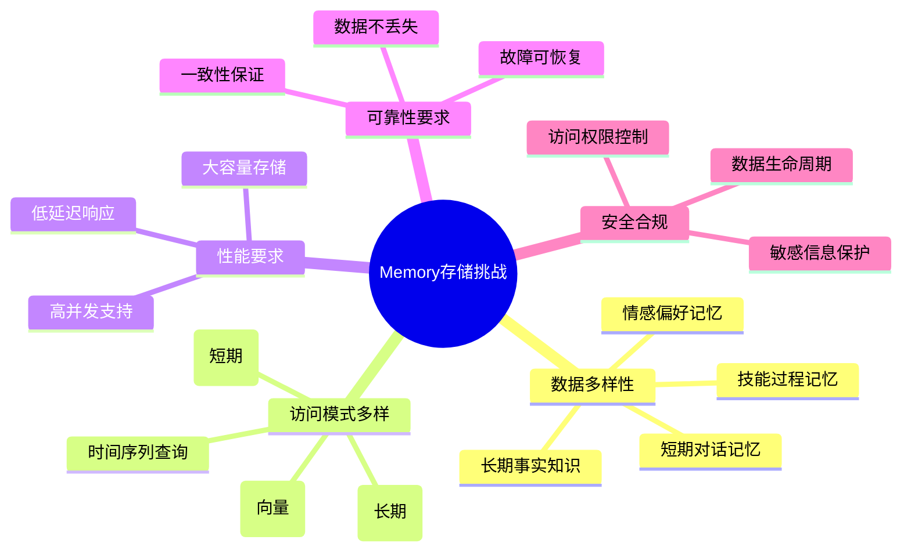
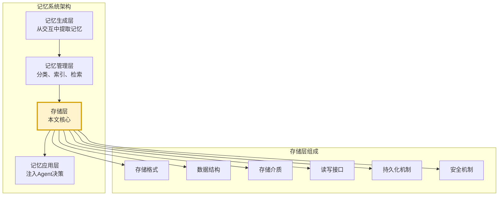
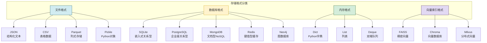
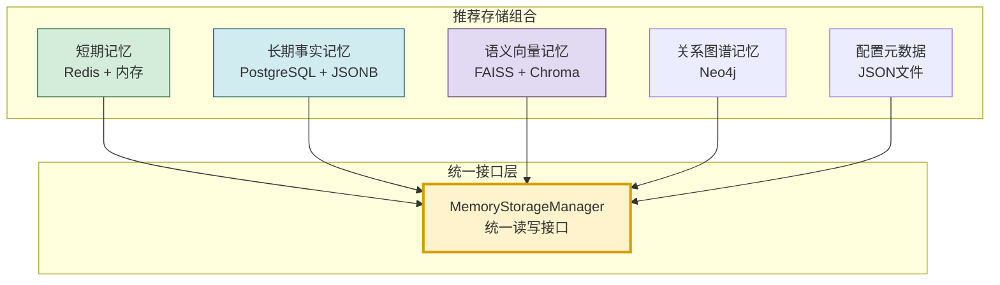
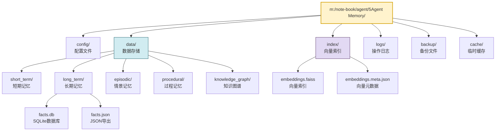
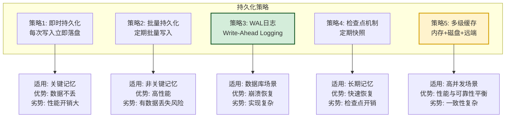
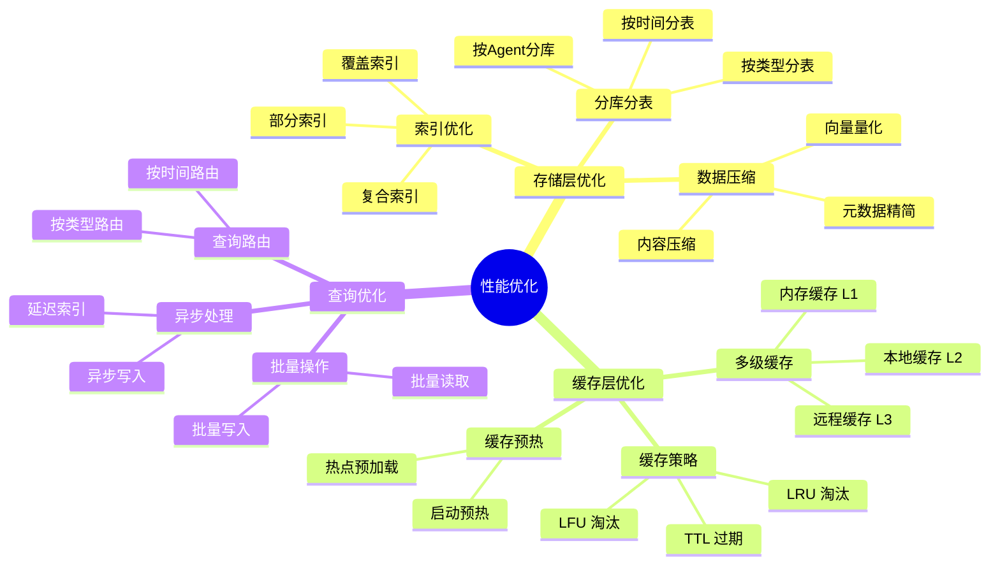
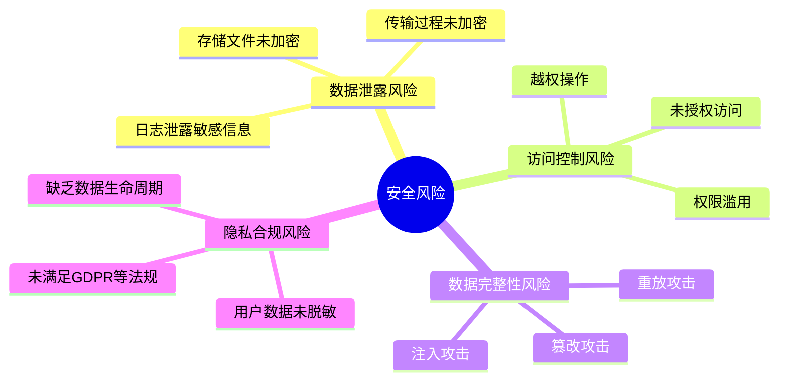
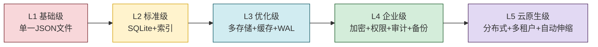

# Agent Memory 数据存储方案深度解析

> 文档定位:系统阐述 AI Agent 记忆系统中 Memory 数据的完整存储方案,涵盖存储格式选型(JSON/CSV/数据库)、数据结构设计、存储路径规划、读写操作实现、持久化策略、性能优化与安全考量,为 Agent 记忆系统的工程落地提供可操作的存储架构指导。
>
> 阅读建议:本文是 Agent Memory 系列的工程实践篇,建议结合 [74Agent记忆系统核心价值与必要性解析.md](./74Agent记忆系统核心价值与必要性解析.md)、[75Agent记忆系统类型分类深度解析.md](./75Agent记忆系统类型分类深度解析.md)、[76短期记忆与长期记忆核心区别深度解析.md](./76短期记忆与长期记忆核心区别深度解析.md)、[77Agent长期记忆系统完整设计方案.md](./77Agent长期记忆系统完整设计方案.md) 一并阅读,理解存储方案在记忆系统整体架构中的位置。

---

## 目录

- [一、Memory 数据存储概述](#一memory-数据存储概述)
- [二、存储格式选型与对比](#二存储格式选型与对比)
- [三、数据结构设计](#三数据结构设计)
- [四、存储路径规划](#四存储路径规划)
- [五、读写操作实现](#五读写操作实现)
- [六、数据持久化策略](#六数据持久化策略)
- [七、性能优化策略](#七性能优化策略)
- [八、安全考量与防护](#八安全考量与防护)
- [九、完整代码实现](#九完整代码实现)
- [十、最佳实践与总结](#十最佳实践与总结)

---

## 一、Memory 数据存储概述

### 1.1 Memory 数据存储的核心挑战

Agent 记忆系统的存储方案需要同时应对多种挑战,这些挑战是设计存储架构的根本动因:



### 1.2 存储方案在记忆系统中的位置



### 1.3 核心设计原则

| 原则 | 说明 | 实践要点 |
|-----|------|---------|
| **分层存储** | 不同类型记忆采用不同存储方案 | 短期用内存,长期用数据库 |
| **结构化优先** | 优先采用结构化存储 | 便于查询、索引、分析 |
| **可扩展性** | 存储方案支持水平扩展 | 数据量增长不影响性能 |
| **持久化保证** | 关键记忆必须持久化 | 异常断电不丢失 |
| **访问效率** | 读写延迟满足实时性 | 短期记忆 <10ms,长期 <100ms |
| **安全合规** | 敏感数据加密存储 | 遵循数据保护法规 |

---

## 二、存储格式选型与对比

### 2.1 存储格式全景



### 2.2 主流格式对比

| 格式 | 适用记忆类型 | 读写性能 | 查询能力 | 扩展性 | 推荐场景 |
|-----|:----------:|:-------:|:-------:|:-----:|---------|
| **JSON** | 配置/少量结构化数据 | 中 | 弱(全量加载) | 差 | 原型/小型Agent |
| **CSV** | 表格型记忆 | 中 | 弱 | 差 | 数据导出/分析 |
| **SQLite** | 中等规模结构化记忆 | 高 | SQL | 中 | 单机生产环境 |
| **PostgreSQL** | 大规模企业级记忆 | 高 | 强SQL+JSONB | 强 | 企业级Agent |
| **MongoDB** | 文档型非结构化记忆 | 高 | 灵活 | 强 | 灵活Schema场景 |
| **Redis** | 短期/高频访问记忆 | 极高 | Key-Value | 中 | 短期记忆/缓存 |
| **FAISS** | 语义向量记忆 | 极高 | 向量相似度 | 中 | 语义检索记忆 |
| **Neo4j** | 关系型知识图谱 | 中 | 图查询 | 中 | 实体关系记忆 |

### 2.3 推荐组合方案

针对 Agent 记忆系统的多类型数据,推荐**多存储组合方案**:



---

## 三、数据结构设计

### 3.1 通用记忆数据结构

```python
from dataclasses import dataclass, field
from datetime import datetime
from enum import Enum
from typing import Any, Optional


class MemoryType(Enum):
    """记忆类型枚举"""
    SHORT_TERM = "short_term"           # 短期记忆(对话上下文)
    LONG_TERM_FACTUAL = "long_term_factual"  # 长期事实记忆
    LONG_TERM_EPISODIC = "long_term_episodic"  # 长期情景记忆
    LONG_TERM_PROCEDURAL = "long_term_procedural"  # 长期过程记忆
    EMOTIONAL = "emotional"            # 情感偏好记忆
    SEMANTIC = "semantic"               # 语义向量记忆


class MemoryPriority(Enum):
    """记忆优先级"""
    CRITICAL = 1    # 关键信息(永不淘汰)
    HIGH = 2        # 高优先级
    MEDIUM = 3      # 中优先级
    LOW = 4         # 低优先级(优先淘汰)


@dataclass
class MemoryItem:
    """基础记忆项 - 通用数据结构"""
    # 标识信息
    id: str                                    # 唯一ID
    agent_id: str                              # 所属Agent ID
    session_id: Optional[str] = None           # 会话ID(短期记忆)
    
    # 内容信息
    type: MemoryType = MemoryType.LONG_TERM_FACTUAL
    content: str = ""                          # 文本内容
    content_embedding: Optional[list[float]] = None  # 向量表示
    metadata: dict = field(default_factory=dict)  # 扩展元数据
    
    # 时间信息
    created_at: datetime = field(default_factory=datetime.now)
    updated_at: datetime = field(default_factory=datetime.now)
    accessed_at: datetime = field(default_factory=datetime.now)
    expires_at: Optional[datetime] = None      # 过期时间
    
    # 状态信息
    priority: MemoryPriority = MemoryPriority.MEDIUM
    access_count: int = 0                     # 访问次数
    importance_score: float = 0.5              # 重要性评分(0-1)
    confidence_score: float = 1.0              # 置信度(0-1)
    
    # 关联信息
    source: str = ""                           # 来源(用户/系统/工具)
    tags: list[str] = field(default_factory=list)  # 标签
    related_ids: list[str] = field(default_factory=list)  # 关联记忆ID
    
    # 版本信息
    version: int = 1                           # 版本号
    
    def to_dict(self) -> dict:
        """转换为字典(用于序列化)"""
        return {
            "id": self.id,
            "agent_id": self.agent_id,
            "session_id": self.session_id,
            "type": self.type.value,
            "content": self.content,
            "content_embedding": self.content_embedding,
            "metadata": self.metadata,
            "created_at": self.created_at.isoformat(),
            "updated_at": self.updated_at.isoformat(),
            "accessed_at": self.accessed_at.isoformat(),
            "expires_at": self.expires_at.isoformat() if self.expires_at else None,
            "priority": self.priority.value,
            "access_count": self.access_count,
            "importance_score": self.importance_score,
            "confidence_score": self.confidence_score,
            "source": self.source,
            "tags": self.tags,
            "related_ids": self.related_ids,
            "version": self.version,
        }
    
    @classmethod
    def from_dict(cls, data: dict) -> "MemoryItem":
        """从字典反序列化"""
        return cls(
            id=data["id"],
            agent_id=data["agent_id"],
            session_id=data.get("session_id"),
            type=MemoryType(data.get("type", "long_term_factual")),
            content=data.get("content", ""),
            content_embedding=data.get("content_embedding"),
            metadata=data.get("metadata", {}),
            created_at=datetime.fromisoformat(data["created_at"]) if data.get("created_at") else datetime.now(),
            updated_at=datetime.fromisoformat(data["updated_at"]) if data.get("updated_at") else datetime.now(),
            accessed_at=datetime.fromisoformat(data["accessed_at"]) if data.get("accessed_at") else datetime.now(),
            expires_at=datetime.fromisoformat(data["expires_at"]) if data.get("expires_at") else None,
            priority=MemoryPriority(data.get("priority", 3)),
            access_count=data.get("access_count", 0),
            importance_score=data.get("importance_score", 0.5),
            confidence_score=data.get("confidence_score", 1.0),
            source=data.get("source", ""),
            tags=data.get("tags", []),
            related_ids=data.get("related_ids", []),
            version=data.get("version", 1),
        )
```

### 3.2 短期记忆数据结构

```python
@dataclass
class ShortTermMemory:
    """短期记忆 - 对话上下文专用"""
    id: str
    session_id: str                            # 会话ID
    agent_id: str
    role: str                                  # user/assistant/system
    content: str
    timestamp: datetime = field(default_factory=datetime.now)
    token_count: int = 0                       # Token消耗
    
    # 对话上下文关联
    parent_message_id: Optional[str] = None
    tool_calls: list[dict] = field(default_factory=list)
    
    # 摘要信息(当上下文过长时)
    summary: Optional[str] = None
    is_summarized: bool = False


@dataclass
class ConversationBuffer:
    """对话缓冲区 - 短期记忆的容器"""
    session_id: str
    messages: list[ShortTermMemory] = field(default_factory=list)
    max_tokens: int = 4096                      # 最大Token容量
    current_tokens: int = 0
    
    def add_message(self, message: ShortTermMemory) -> bool:
        """添加消息,超限时触发摘要"""
        self.messages.append(message)
        self.current_tokens += message.token_count
        
        # 超过阈值触发摘要
        if self.current_tokens > self.max_tokens * 0.8:
            self._trigger_summarization()
        return True
    
    def _trigger_summarization(self):
        """触发对话摘要(防止上下文溢出)"""
        # 实现见后文持久化策略
        pass
```

### 3.3 长期记忆数据结构

```python
@dataclass
class FactualMemory:
    """事实记忆 - 用户画像、知识事实"""
    id: str
    agent_id: str
    user_id: str                               # 关联用户
    fact_type: str                             # 事实类型(preference/profile/knowledge)
    key: str                                   # 事实键(如"喜欢的颜色")
    value: str                                 # 事实值(如"蓝色")
    confidence: float = 1.0
    source: str = ""
    created_at: datetime = field(default_factory=datetime.now)
    last_verified_at: Optional[datetime] = None  # 最后验证时间
    is_active: bool = True                      # 是否仍然有效


@dataclass
class EpisodicMemory:
    """情景记忆 - 具体事件经历"""
    id: str
    agent_id: str
    user_id: str
    event_type: str                            # 事件类型
    description: str                           # 事件描述
    participants: list[str] = field(default_factory=list)  # 参与者
    location: Optional[str] = None             # 位置
    timestamp: datetime = field(default_factory=datetime.now)
    duration: Optional[int] = None            # 持续时间(秒)
    outcome: Optional[str] = None              # 结果
    emotional_tone: Optional[str] = None      # 情感色彩
    embedding: Optional[list[float]] = None    # 向量表示


@dataclass
class ProceduralMemory:
    """过程记忆 - 技能、流程、方法"""
    id: str
    agent_id: str
    skill_name: str                            # 技能名称
    description: str                           # 技能描述
    steps: list[dict] = field(default_factory=list)  # 步骤列表
    prerequisites: list[str] = field(default_factory=list)  # 前置条件
    tools_required: list[str] = field(default_factory=list)  # 所需工具
    success_rate: float = 0.0                  # 历史成功率
    last_used_at: Optional[datetime] = None
    use_count: int = 0
```

### 3.4 关系图谱数据结构

```python
@dataclass
class KnowledgeNode:
    """知识图谱节点"""
    id: str
    agent_id: str
    node_type: str                             # entity/concept/event
    name: str
    properties: dict = field(default_factory=dict)
    embedding: Optional[list[float]] = None


@dataclass
class KnowledgeEdge:
    """知识图谱边"""
    id: str
    source_id: str                             # 源节点ID
    target_id: str                             # 目标节点ID
    relation_type: str                         # 关系类型
    weight: float = 1.0                        # 关系权重
    properties: dict = field(default_factory=dict)
    created_at: datetime = field(default_factory=datetime.now)
```

---

## 四、存储路径规划

### 4.1 整体目录结构



### 4.2 详细路径规划

```text
m:/note-book/agent/5Agent Memory/
├── config/                              # 配置目录
│   ├── storage_config.yaml             # 存储配置
│   ├── retention_policy.yaml           # 保留策略
│   └── security_config.yaml            # 安全配置
│
├── data/                                # 数据存储根目录
│   ├── short_term/                     # 短期记忆
│   │   ├── sessions/                   # 活跃会话
│   │   │   ├── {session_id}.json       # 单会话文件
│   │   │   └── ...
│   │   └── archived/                   # 已归档会话
│   │       └── {date}/
│   │
│   ├── long_term/                      # 长期记忆
│   │   ├── facts.db                    # SQLite主数据库
│   │   ├── facts_export/               # JSON导出
│   │   │   ├── {agent_id}/
│   │   │   │   ├── {date}_facts.json
│   │   │   │   └── ...
│   │   │   └── ...
│   │   └── wal/                        # Write-Ahead Log
│   │       └── facts.wal
│   │
│   ├── episodic/                       # 情景记忆
│   │   ├── {agent_id}/
│   │   │   ├── {year}/
│   │   │   │   ├── {month}.db          # 按月分库
│   │   │   │   └── ...
│   │   │   └── ...
│   │   └── ...
│   │
│   ├── procedural/                     # 过程记忆
│   │   └── skills.db                   # 技能数据库
│   │
│   └── knowledge_graph/                # 知识图谱
│       ├── graph.db                    # 图数据库
│       └── exports/
│           └── {date}_graph.json
│
├── index/                               # 向量索引目录
│   ├── embeddings.faiss                # FAISS索引文件
│   ├── embeddings.meta.json            # 向量元数据映射
│   └── embeddings.config.json          # 索引配置
│
├── logs/                                # 日志目录
│   ├── access.log                      # 访问日志
│   ├── mutation.log                    # 变更日志
│   └── error.log                       # 错误日志
│
├── backup/                              # 备份目录
│   ├── daily/                          # 日备份
│   │   └── {date}/
│   ├── weekly/                         # 周备份
│   └── monthly/                        # 月备份
│
└── cache/                               # 临时缓存
    ├── query_cache/                    # 查询缓存
    └── session_cache/                  # 会话缓存
```

### 4.3 路径管理类实现

```python
import os
from pathlib import Path
from datetime import datetime


class MemoryStoragePathManager:
    """Memory 存储路径管理器"""
    
    BASE_DIR = Path("m:/note-book/agent/5Agent Memory")
    
    # 子目录定义
    CONFIG_DIR = BASE_DIR / "config"
    DATA_DIR = BASE_DIR / "data"
    INDEX_DIR = BASE_DIR / "index"
    LOG_DIR = BASE_DIR / "logs"
    BACKUP_DIR = BASE_DIR / "backup"
    CACHE_DIR = BASE_DIR / "cache"
    
    # 数据子目录
    SHORT_TERM_DIR = DATA_DIR / "short_term"
    LONG_TERM_DIR = DATA_DIR / "long_term"
    EPISODIC_DIR = DATA_DIR / "episodic"
    PROCEDURAL_DIR = DATA_DIR / "procedural"
    KG_DIR = DATA_DIR / "knowledge_graph"
    
    @classmethod
    def ensure_directories(cls):
        """确保所有目录存在"""
        dirs = [
            cls.CONFIG_DIR, cls.DATA_DIR, cls.INDEX_DIR,
            cls.LOG_DIR, cls.BACKUP_DIR, cls.CACHE_DIR,
            cls.SHORT_TERM_DIR, cls.LONG_TERM_DIR,
            cls.EPISODIC_DIR, cls.PROCEDURAL_DIR, cls.KG_DIR,
            cls.SHORT_TERM_DIR / "sessions",
            cls.SHORT_TERM_DIR / "archived",
        ]
        for d in dirs:
            d.mkdir(parents=True, exist_ok=True)
    
    @classmethod
    def get_session_path(cls, session_id: str) -> Path:
        """获取会话短期记忆文件路径"""
        return cls.SHORT_TERM_DIR / "sessions" / f"{session_id}.json"
    
    @classmethod
    def get_facts_db_path(cls) -> Path:
        """获取事实记忆数据库路径"""
        return cls.LONG_TERM_DIR / "facts.db"
    
    @classmethod
    def get_episodic_db_path(cls, agent_id: str, 
                              date: datetime = None) -> Path:
        """获取情景记忆数据库路径(按月分库)"""
        date = date or datetime.now()
        return (cls.EPISODIC_DIR / agent_id / 
                str(date.year) / f"{date.month:02d}.db")
    
    @classmethod
    def get_vector_index_path(cls) -> Path:
        """获取向量索引路径"""
        return cls.INDEX_DIR / "embeddings.faiss"
    
    @classmethod
    def get_backup_path(cls, backup_type: str = "daily") -> Path:
        """获取备份路径"""
        date_str = datetime.now().strftime("%Y%m%d")
        return cls.BACKUP_DIR / backup_type / date_str
    
    @classmethod
    def get_log_path(cls, log_type: str = "access") -> Path:
        """获取日志路径"""
        return cls.LOG_DIR / f"{log_type}.log"
```

---

## 五、读写操作实现

### 5.1 存储抽象接口

```python
from abc import ABC, abstractmethod
from typing import Any, Optional, list


class IMemoryStorage(ABC):
    """记忆存储抽象接口"""
    
    @abstractmethod
    def save(self, memory: MemoryItem) -> bool:
        """保存记忆"""
        pass
    
    @abstractmethod
    def load(self, memory_id: str) -> Optional[MemoryItem]:
        """加载单条记忆"""
        pass
    
    @abstractmethod
    def delete(self, memory_id: str) -> bool:
        """删除记忆"""
        pass
    
    @abstractmethod
    def update(self, memory_id: str, updates: dict) -> bool:
        """更新记忆"""
        pass
    
    @abstractmethod
    def query(self, filters: dict, limit: int = 100) -> list[MemoryItem]:
        """查询记忆"""
        pass
    
    @abstractmethod
    def search_similar(self, query_vector: list[float], 
                        top_k: int = 5) -> list[MemoryItem]:
        """语义相似检索"""
        pass
```

### 5.2 JSON 文件存储实现

```python
import json
import threading
from collections.abc import Iterator


class JSONMemoryStorage(IMemoryStorage):
    """JSON 文件存储实现 - 适合小型Agent与原型"""
    
    def __init__(self, file_path: Path):
        self.file_path = file_path
        self._lock = threading.RLock()  # 线程安全锁
        self._cache: dict[str, MemoryItem] = {}  # 内存缓存
        self._load()
    
    def _load(self):
        """从文件加载所有数据到内存"""
        if self.file_path.exists():
            with open(self.file_path, "r", encoding="utf-8") as f:
                data = json.load(f)
                self._cache = {
                    k: MemoryItem.from_dict(v) for k, v in data.items()
                }
    
    def _persist(self):
        """持久化到文件"""
        # 先写入临时文件,再原子替换(防止写入中途崩溃)
        tmp_path = self.file_path.with_suffix(".tmp")
        with open(tmp_path, "w", encoding="utf-8") as f:
            json.dump(
                {k: v.to_dict() for k, v in self._cache.items()},
                f, ensure_ascii=False, indent=2
            )
        tmp_path.replace(self.file_path)  # 原子替换
    
    def save(self, memory: MemoryItem) -> bool:
        with self._lock:
            self._cache[memory.id] = memory
            self._persist()
            return True
    
    def load(self, memory_id: str) -> Optional[MemoryItem]:
        with self._lock:
            return self._cache.get(memory_id)
    
    def delete(self, memory_id: str) -> bool:
        with self._lock:
            if memory_id in self._cache:
                del self._cache[memory_id]
                self._persist()
                return True
            return False
    
    def update(self, memory_id: str, updates: dict) -> bool:
        with self._lock:
            if memory_id not in self._cache:
                return False
            memory = self._cache[memory_id]
            # 应用更新
            for k, v in updates.items():
                if hasattr(memory, k):
                    setattr(memory, k, v)
            memory.updated_at = datetime.now()
            memory.version += 1
            self._persist()
            return True
    
    def query(self, filters: dict, limit: int = 100) -> list[MemoryItem]:
        with self._lock:
            results = []
            for memory in self._cache.values():
                if self._match_filters(memory, filters):
                    results.append(memory)
                    if len(results) >= limit:
                        break
            return results
    
    def search_similar(self, query_vector: list[float], 
                        top_k: int = 5) -> list[MemoryItem]:
        # JSON存储不直接支持向量检索,需配合FAISS
        raise NotImplementedError("JSON存储不支持向量检索,请使用VectorMemoryStorage")
    
    def _match_filters(self, memory: MemoryItem, filters: dict) -> bool:
        """过滤匹配"""
        for key, value in filters.items():
            if not hasattr(memory, key):
                return False
            if getattr(memory, key) != value:
                return False
        return True
```

### 5.3 SQLite 数据库存储实现

```python
import sqlite3
from contextlib import contextmanager


class SQLiteMemoryStorage(IMemoryStorage):
    """SQLite 数据库存储实现 - 适合单机生产环境"""
    
    SCHEMA_SQL = """
    CREATE TABLE IF NOT EXISTS memories (
        id TEXT PRIMARY KEY,
        agent_id TEXT NOT NULL,
        session_id TEXT,
        type TEXT NOT NULL,
        content TEXT NOT NULL,
        content_embedding BLOB,
        metadata TEXT,
        created_at TEXT NOT NULL,
        updated_at TEXT NOT NULL,
        accessed_at TEXT NOT NULL,
        expires_at TEXT,
        priority INTEGER,
        access_count INTEGER DEFAULT 0,
        importance_score REAL DEFAULT 0.5,
        confidence_score REAL DEFAULT 1.0,
        source TEXT,
        tags TEXT,
        related_ids TEXT,
        version INTEGER DEFAULT 1
    );
    
    CREATE INDEX IF NOT EXISTS idx_agent_type ON memories(agent_id, type);
    CREATE INDEX IF NOT EXISTS idx_session ON memories(session_id);
    CREATE INDEX IF NOT EXISTS idx_created ON memories(created_at);
    CREATE INDEX IF NOT EXISTS idx_priority ON memories(priority);
    CREATE INDEX IF NOT EXISTS idx_expires ON memories(expires_at);
    """
    
    def __init__(self, db_path: Path):
        self.db_path = db_path
        self._init_db()
    
    def _init_db(self):
        """初始化数据库"""
        with self._get_conn() as conn:
            conn.executescript(self.SCHEMA_SQL)
            # 启用WAL模式提升并发性能
            conn.execute("PRAGMA journal_mode=WAL")
            conn.execute("PRAGMA synchronous=NORMAL")
    
    @contextmanager
    def _get_conn(self) -> Iterator[sqlite3.Connection]:
        """获取数据库连接(上下文管理器)"""
        conn = sqlite3.connect(str(self.db_path))
        conn.row_factory = sqlite3.Row
        try:
            yield conn
            conn.commit()
        except Exception:
            conn.rollback()
            raise
        finally:
            conn.close()
    
    def save(self, memory: MemoryItem) -> bool:
        with self._get_conn() as conn:
            conn.execute("""
                INSERT OR REPLACE INTO memories 
                (id, agent_id, session_id, type, content, content_embedding,
                 metadata, created_at, updated_at, accessed_at, expires_at,
                 priority, access_count, importance_score, confidence_score,
                 source, tags, related_ids, version)
                VALUES (?, ?, ?, ?, ?, ?, ?, ?, ?, ?, ?, ?, ?, ?, ?, ?, ?, ?)
            """, (
                memory.id, memory.agent_id, memory.session_id,
                memory.type.value, memory.content,
                json.dumps(memory.content_embedding) if memory.content_embedding else None,
                json.dumps(memory.metadata, ensure_ascii=False),
                memory.created_at.isoformat(),
                memory.updated_at.isoformat(),
                memory.accessed_at.isoformat(),
                memory.expires_at.isoformat() if memory.expires_at else None,
                memory.priority.value, memory.access_count,
                memory.importance_score, memory.confidence_score,
                memory.source,
                json.dumps(memory.tags, ensure_ascii=False),
                json.dumps(memory.related_ids, ensure_ascii=False),
                memory.version
            ))
        return True
    
    def load(self, memory_id: str) -> Optional[MemoryItem]:
        with self._get_conn() as conn:
            row = conn.execute(
                "SELECT * FROM memories WHERE id = ?", (memory_id,)
            ).fetchone()
            return self._row_to_memory(row) if row else None
    
    def delete(self, memory_id: str) -> bool:
        with self._get_conn() as conn:
            cursor = conn.execute(
                "DELETE FROM memories WHERE id = ?", (memory_id,)
            )
            return cursor.rowcount > 0
    
    def update(self, memory_id: str, updates: dict) -> bool:
        # 动态构建UPDATE语句
        set_clauses = []
        values = []
        for k, v in updates.items():
            if k in ["metadata", "tags", "related_ids", "content_embedding"]:
                v = json.dumps(v, ensure_ascii=False) if v else None
            set_clauses.append(f"{k} = ?")
            values.append(v)
        
        set_clauses.append("updated_at = ?")
        values.append(datetime.now().isoformat())
        set_clauses.append("version = version + 1")
        values.append(memory_id)
        
        with self._get_conn() as conn:
            cursor = conn.execute(
                f"UPDATE memories SET {', '.join(set_clauses)} WHERE id = ?",
                values
            )
            return cursor.rowcount > 0
    
    def query(self, filters: dict, limit: int = 100) -> list[MemoryItem]:
        where_clauses = []
        values = []
        for k, v in filters.items():
            where_clauses.append(f"{k} = ?")
            values.append(v)
        
        where_sql = " AND ".join(where_clauses) if where_clauses else "1=1"
        
        with self._get_conn() as conn:
            rows = conn.execute(
                f"SELECT * FROM memories WHERE {where_sql} "
                f"ORDER BY created_at DESC LIMIT ?",
                values + [limit]
            ).fetchall()
            return [self._row_to_memory(row) for row in rows]
    
    def search_similar(self, query_vector: list[float], 
                        top_k: int = 5) -> list[MemoryItem]:
        # SQLite不直接支持向量检索
        raise NotImplementedError("SQLite不支持向量检索,请配合FAISS使用")
    
    def _row_to_memory(self, row: sqlite3.Row) -> MemoryItem:
        """数据库行转Memory对象"""
        return MemoryItem(
            id=row["id"],
            agent_id=row["agent_id"],
            session_id=row["session_id"],
            type=MemoryType(row["type"]),
            content=row["content"],
            content_embedding=json.loads(row["content_embedding"]) if row["content_embedding"] else None,
            metadata=json.loads(row["metadata"]) if row["metadata"] else {},
            created_at=datetime.fromisoformat(row["created_at"]),
            updated_at=datetime.fromisoformat(row["updated_at"]),
            accessed_at=datetime.fromisoformat(row["accessed_at"]),
            expires_at=datetime.fromisoformat(row["expires_at"]) if row["expires_at"] else None,
            priority=MemoryPriority(row["priority"]),
            access_count=row["access_count"],
            importance_score=row["importance_score"],
            confidence_score=row["confidence_score"],
            source=row["source"],
            tags=json.loads(row["tags"]) if row["tags"] else [],
            related_ids=json.loads(row["related_ids"]) if row["related_ids"] else [],
            version=row["version"],
        )
```

### 5.4 向量索引存储实现

```python
class VectorMemoryStorage:
    """向量记忆存储 - 语义检索专用"""
    
    def __init__(self, index_path: Path, 
                 meta_path: Path, dimension: int = 1024):
        import faiss
        self.dimension = dimension
        self.index_path = index_path
        self.meta_path = meta_path
        self._lock = threading.Lock()
        
        # 初始化FAISS索引
        if index_path.exists():
            self.index = faiss.read_index(str(index_path))
        else:
            # 使用HNSW索引(适合语义检索)
            self.index = faiss.IndexHNSWFlat(dimension, 32)
            self.index.hnsw.efConstruction = 200
            self.index.hnsw.efSearch = 128
        
        # 元数据映射: vector_id -> memory_id
        self._meta: dict[int, str] = {}
        self._reverse_meta: dict[str, int] = {}
        self._load_meta()
    
    def add(self, memory_id: str, vector: list[float]) -> bool:
        """添加向量"""
        with self._lock:
            if memory_id in self._reverse_meta:
                return False  # 已存在
            
            import numpy as np
            vec = np.array([vector], dtype=np.float32)
            vector_id = self.index.ntotal
            self.index.add(vec)
            
            self._meta[vector_id] = memory_id
            self._reverse_meta[memory_id] = vector_id
            self._persist()
            return True
    
    def search(self, query_vector: list[float], 
                top_k: int = 5) -> list[tuple[str, float]]:
        """语义检索,返回(memory_id, score)列表"""
        with self._lock:
            import numpy as np
            query = np.array([query_vector], dtype=np.float32)
            scores, indices = self.index.search(query, top_k)
            
            results = []
            for i, score in zip(indices[0], scores[0]):
                if i in self._meta:
                    results.append((self._meta[i], float(score)))
            return results
    
    def remove(self, memory_id: str) -> bool:
        """移除向量(FAISS支持有限,通常重建索引)"""
        # 简化实现:从元数据中移除,标记为已删除
        if memory_id in self._reverse_meta:
            vector_id = self._reverse_meta[memory_id]
            del self._meta[vector_id]
            del self._reverse_meta[memory_id]
            self._persist()
            return True
        return False
    
    def _persist(self):
        """持久化索引与元数据"""
        import faiss
        faiss.write_index(self.index, str(self.index_path))
        with open(self.meta_path, "w", encoding="utf-8") as f:
            json.dump({
                "meta": {str(k): v for k, v in self._meta.items()},
                "dimension": self.dimension
            }, f, ensure_ascii=False)
    
    def _load_meta(self):
        """加载元数据"""
        if self.meta_path.exists():
            with open(self.meta_path, "r", encoding="utf-8") as f:
                data = json.load(f)
                self._meta = {int(k): v for k, v in data["meta"].items()}
                self._reverse_meta = {v: k for k, v in self._meta.items()}
```

---

## 六、数据持久化策略

### 6.1 持久化策略全景



### 6.2 分层持久化策略实现

```python
class MemoryPersistenceManager:
    """多级持久化管理器"""
    
    def __init__(self, primary_storage: IMemoryStorage,
                 cache_storage: IMemoryStorage = None,
                 wal_path: Path = None):
        self.primary = primary_storage
        self.cache = cache_storage  # 内存缓存(可选)
        self.wal_path = wal_path
        self._wal_buffer: list[dict] = []
        self._lock = threading.RLock()
        self._flush_interval = 60  # 秒
        self._max_buffer_size = 1000
        self._start_background_flush()
    
    def save(self, memory: MemoryItem, immediate: bool = False) -> bool:
        """保存记忆"""
        with self._lock:
            # 1. 写入WAL日志(确保不丢失)
            self._write_wal("SAVE", memory.to_dict())
            
            # 2. 写入缓存(如果配置)
            if self.cache:
                self.cache.save(memory)
            
            # 3. 关键数据立即持久化,非关键数据批量持久化
            if immediate or memory.priority.value <= 2:
                return self.primary.save(memory)
            else:
                self._wal_buffer.append({"op": "SAVE", "data": memory.to_dict()})
                return True
    
    def _write_wal(self, operation: str, data: dict):
        """写入WAL日志"""
        log_entry = {
            "timestamp": datetime.now().isoformat(),
            "operation": operation,
            "data": data
        }
        with open(self.wal_path, "a", encoding="utf-8") as f:
            f.write(json.dumps(log_entry, ensure_ascii=False) + "\n")
    
    def _start_background_flush(self):
        """启动后台批量刷新线程"""
        def flush_worker():
            while True:
                import time
                time.sleep(self._flush_interval)
                self._flush_buffer()
        
        thread = threading.Thread(target=flush_worker, daemon=True)
        thread.start()
    
    def _flush_buffer(self):
        """刷新缓冲区到主存储"""
        with self._lock:
            if not self._wal_buffer:
                return
            
            buffer = self._wal_buffer.copy()
            self._wal_buffer.clear()
        
        # 批量写入主存储
        for entry in buffer:
            try:
                memory = MemoryItem.from_dict(entry["data"])
                self.primary.save(memory)
            except Exception as e:
                print(f"批量刷新失败: {e}")
    
    def recover_from_wal(self) -> int:
        """从WAL日志恢复(崩溃后)"""
        if not self.wal_path.exists():
            return 0
        
        recovered = 0
        with open(self.wal_path, "r", encoding="utf-8") as f:
            for line in f:
                try:
                    entry = json.loads(line.strip())
                    memory = MemoryItem.from_dict(entry["data"])
                    self.primary.save(memory)
                    recovered += 1
                except Exception:
                    continue
        
        return recovered
```

### 6.3 记忆保留与淘汰策略

```python
class MemoryRetentionManager:
    """记忆保留与淘汰管理器"""
    
    def __init__(self, storage: IMemoryStorage):
        self.storage = storage
    
    def enforce_retention_policy(self, agent_id: str):
        """执行保留策略"""
        # 1. 清理过期记忆
        self._cleanup_expired(agent_id)
        
        # 2. 淘汰低优先级记忆(容量超限时)
        self._evict_low_priority(agent_id, max_items=10000)
        
        # 3. 合并重复记忆
        self._merge_duplicates(agent_id)
        
        # 4. 压缩历史记忆
        self._compress_history(agent_id)
    
    def _cleanup_expired(self, agent_id: str):
        """清理过期记忆"""
        now = datetime.now()
        memories = self.storage.query({"agent_id": agent_id}, limit=100000)
        
        for memory in memories:
            if memory.expires_at and memory.expires_at < now:
                self.storage.delete(memory.id)
    
    def _evict_low_priority(self, agent_id: str, max_items: int):
        """淘汰低优先级记忆(LFU策略)"""
        memories = self.storage.query({"agent_id": agent_id}, limit=100000)
        
        if len(memories) <= max_items:
            return
        
        # 按访问频率+重要性排序,淘汰最低的
        memories.sort(key=lambda m: (m.access_count, m.importance_score))
        
        to_evict = len(memories) - max_items
        for memory in memories[:to_evict]:
            if memory.priority != MemoryPriority.CRITICAL:  # 不淘汰关键记忆
                self.storage.delete(memory.id)
    
    def _merge_duplicates(self, agent_id: str):
        """合并重复记忆"""
        # 实现相似度检测与合并
        pass
    
    def _compress_history(self, agent_id: str):
        """压缩历史记忆(摘要化)"""
        # 将旧的详细记忆压缩为摘要
        pass
```

---

## 七、性能优化策略

### 7.1 性能优化全景



### 7.2 索引优化策略

```python
class MemoryIndexOptimizer:
    """记忆索引优化器"""
    
    # SQLite 索引优化SQL
    OPTIMIZATION_SQL = """
    -- 复合索引: 按Agent+类型查询
    CREATE INDEX IF NOT EXISTS idx_agent_type_created 
    ON memories(agent_id, type, created_at DESC);
    
    -- 覆盖索引: 常用查询字段
    CREATE INDEX IF NOT EXISTS idx_covering 
    ON memories(agent_id, type, priority, importance_score);
    
    -- 部分索引: 仅索引活跃记忆
    CREATE INDEX IF NOT EXISTS idx_active_memories 
    ON memories(agent_id, accessed_at DESC) 
    WHERE expires_at IS NULL OR expires_at > datetime('now');
    
    -- 时间索引: 按月查询
    CREATE INDEX IF NOT EXISTS idx_monthly 
    ON memories(agent_id, strftime('%Y-%m', created_at));
    """
    
    def optimize(self, storage: SQLiteMemoryStorage):
        """执行索引优化"""
        with storage._get_conn() as conn:
            conn.executescript(self.OPTIMIZATION_SQL)
            # 分析表统计信息
            conn.execute("ANALYZE")
```

### 7.3 缓存策略实现

```python
from functools import lru_cache
from collections import OrderedDict
import threading


class LRUMemoryCache:
    """LRU 记忆缓存"""
    
    def __init__(self, max_size: int = 1000):
        self.max_size = max_size
        self._cache: OrderedDict[str, MemoryItem] = OrderedDict()
        self._lock = threading.RLock()
        self._hits = 0
        self._misses = 0
    
    def get(self, memory_id: str) -> Optional[MemoryItem]:
        with self._lock:
            if memory_id in self._cache:
                self._cache.move_to_end(memory_id)
                self._hits += 1
                return self._cache[memory_id]
            self._misses += 1
            return None
    
    def put(self, memory: MemoryItem):
        with self._lock:
            if memory.id in self._cache:
                self._cache.move_to_end(memory.id)
            self._cache[memory.id] = memory
            if len(self._cache) > self.max_size:
                self._cache.popitem(last=False)  # 移除最久未访问的
    
    def invalidate(self, memory_id: str):
        with self._lock:
            self._cache.pop(memory_id, None)
    
    def stats(self) -> dict:
        total = self._hits + self._misses
        return {
            "size": len(self._cache),
            "max_size": self.max_size,
            "hits": self._hits,
            "misses": self._misses,
            "hit_rate": self._hits / total if total > 0 else 0
        }


class CachedMemoryStorage(IMemoryStorage):
    """带缓存的记忆存储 - 装饰器模式"""
    
    def __init__(self, underlying: IMemoryStorage, 
                 cache_size: int = 1000):
        self.underlying = underlying
        self.cache = LRUMemoryCache(cache_size)
    
    def save(self, memory: MemoryItem) -> bool:
        result = self.underlying.save(memory)
        if result:
            self.cache.put(memory)
        return result
    
    def load(self, memory_id: str) -> Optional[MemoryItem]:
        # 先查缓存
        cached = self.cache.get(memory_id)
        if cached:
            return cached
        # 缓存未命中,查底层存储
        memory = self.underlying.load(memory_id)
        if memory:
            self.cache.put(memory)
        return memory
    
    def delete(self, memory_id: str) -> bool:
        self.cache.invalidate(memory_id)
        return self.underlying.delete(memory_id)
    
    def update(self, memory_id: str, updates: dict) -> bool:
        result = self.underlying.update(memory_id, updates)
        if result:
            self.cache.invalidate(memory_id)
        return result
    
    def query(self, filters: dict, limit: int = 100) -> list[MemoryItem]:
        return self.underlying.query(filters, limit)
    
    def search_similar(self, query_vector: list[float], 
                        top_k: int = 5) -> list[MemoryItem]:
        return self.underlying.search_similar(query_vector, top_k)
```

### 7.4 批量操作优化

```python
class BatchMemoryStorage(IMemoryStorage):
    """批量操作优化的记忆存储"""
    
    def __init__(self, underlying: IMemoryStorage, 
                 batch_size: int = 100):
        self.underlying = underlying
        self.batch_size = batch_size
        self._write_buffer: list[MemoryItem] = []
        self._lock = threading.Lock()
    
    def save(self, memory: MemoryItem) -> bool:
        with self._lock:
            self._write_buffer.append(memory)
            if len(self._write_buffer) >= self.batch_size:
                self._flush()
        return True
    
    def batch_save(self, memories: list[MemoryItem]) -> bool:
        """批量保存"""
        if isinstance(self.underlying, SQLiteMemoryStorage):
            with self.underlying._get_conn() as conn:
                conn.executemany(
                    """INSERT OR REPLACE INTO memories 
                    (id, agent_id, session_id, type, content, ...)
                    VALUES (?, ?, ?, ?, ?, ...)""",
                    [self._memory_to_tuple(m) for m in memories]
                )
            return True
        else:
            for m in memories:
                self.underlying.save(m)
            return True
    
    def batch_load(self, memory_ids: list[str]) -> list[MemoryItem]:
        """批量加载"""
        results = []
        for mid in memory_ids:
            m = self.load(mid)
            if m:
                results.append(m)
        return results
    
    def _flush(self):
        """刷新写入缓冲区"""
        buffer = self._write_buffer.copy()
        self._write_buffer.clear()
        self.batch_save(buffer)
```

---

## 八、安全考量与防护

### 8.1 安全风险全景



### 8.2 安全防护策略

#### 8.2.1 数据加密

```python
import hashlib
import hmac
from cryptography.fernet import Fernet
import base64


class MemoryEncryption:
    """记忆数据加密器"""
    
    def __init__(self, key: bytes = None):
        self.key = key or Fernet.generate_key()
        self.cipher = Fernet(self.key)
    
    def encrypt(self, data: str) -> str:
        """加密数据"""
        return self.cipher.encrypt(data.encode("utf-8")).decode("utf-8")
    
    def decrypt(self, encrypted: str) -> str:
        """解密数据"""
        return self.cipher.decrypt(encrypted.encode("utf-8")).decode("utf-8")
    
    def hash(self, data: str, salt: str = "") -> str:
        """哈希(不可逆,用于敏感字段)"""
        return hashlib.sha256((data + salt).encode()).hexdigest()


class EncryptedMemoryStorage(IMemoryStorage):
    """加密记忆存储 - 装饰器模式"""
    
    SENSITIVE_FIELDS = ["content", "metadata"]
    
    def __init__(self, underlying: IMemoryStorage, 
                 encryption: MemoryEncryption):
        self.underlying = underlying
        self.encryption = encryption
    
    def save(self, memory: MemoryItem) -> bool:
        # 加密敏感字段
        encrypted_memory = self._encrypt_memory(memory)
        return self.underlying.save(encrypted_memory)
    
    def load(self, memory_id: str) -> Optional[MemoryItem]:
        memory = self.underlying.load(memory_id)
        if memory:
            return self._decrypt_memory(memory)
        return None
    
    def _encrypt_memory(self, memory: MemoryItem) -> MemoryItem:
        """加密记忆敏感字段"""
        import copy
        encrypted = copy.deepcopy(memory)
        if encrypted.content:
            encrypted.content = self.encryption.encrypt(encrypted.content)
        if encrypted.metadata:
            encrypted.metadata = {
                k: self.encryption.encrypt(str(v)) if isinstance(v, str) else v
                for k, v in encrypted.metadata.items()
            }
        return encrypted
    
    def _decrypt_memory(self, memory: MemoryItem) -> MemoryItem:
        """解密记忆敏感字段"""
        import copy
        decrypted = copy.deepcopy(memory)
        try:
            if decrypted.content:
                decrypted.content = self.encryption.decrypt(decrypted.content)
            if decrypted.metadata:
                decrypted.metadata = {
                    k: self.encryption.decrypt(v) if isinstance(v, str) else v
                    for k, v in decrypted.metadata.items()
                }
        except Exception as e:
            print(f"解密失败: {e}")
        return decrypted
```

#### 8.2.2 访问控制

```python
class MemoryAccessController:
    """记忆访问控制器"""
    
    def __init__(self):
        self._permissions: dict[str, set[str]] = {}  # agent_id -> allowed_operations
    
    def grant_permission(self, agent_id: str, operations: list[str]):
        """授予权限"""
        if agent_id not in self._permissions:
            self._permissions[agent_id] = set()
        self._permissions[agent_id].update(operations)
    
    def check_permission(self, agent_id: str, operation: str) -> bool:
        """检查权限"""
        allowed = self._permissions.get(agent_id, set())
        return operation in allowed or "*" in allowed
    
    def audit_log(self, agent_id: str, operation: str, 
                  memory_id: str, success: bool):
        """审计日志"""
        log_entry = {
            "timestamp": datetime.now().isoformat(),
            "agent_id": agent_id,
            "operation": operation,
            "memory_id": memory_id,
            "success": success,
            "ip": "127.0.0.1"  # 实际从请求中获取
        }
        # 写入审计日志文件
        with open("audit.log", "a", encoding="utf-8") as f:
            f.write(json.dumps(log_entry, ensure_ascii=False) + "\n")


class SecuredMemoryStorage(IMemoryStorage):
    """带安全控制的记忆存储"""
    
    def __init__(self, underlying: IMemoryStorage,
                 access_controller: MemoryAccessController):
        self.underlying = underlying
        self.controller = access_controller
    
    def save(self, memory: MemoryItem) -> bool:
        if not self.controller.check_permission(memory.agent_id, "write"):
            self.controller.audit_log(memory.agent_id, "save", memory.id, False)
            raise PermissionError(f"Agent {memory.agent_id} 无写入权限")
        
        result = self.underlying.save(memory)
        self.controller.audit_log(memory.agent_id, "save", memory.id, result)
        return result
    
    def load(self, memory_id: str, agent_id: str = None) -> Optional[MemoryItem]:
        if agent_id and not self.controller.check_permission(agent_id, "read"):
            self.controller.audit_log(agent_id, "load", memory_id, False)
            raise PermissionError(f"Agent {agent_id} 无读取权限")
        
        memory = self.underlying.load(memory_id)
        success = memory is not None
        if agent_id:
            self.controller.audit_log(agent_id, "load", memory_id, success)
        return memory
```

#### 8.2.3 数据脱敏

```python
class DataAnonymizer:
    """数据脱敏器"""
    
    SENSITIVE_PATTERNS = {
        "phone": (r"\d{11}", r"\d{3}****\d{4}"),
        "email": (r"[\w.-]+@[\w.-]+", "****@****"),
        "id_card": (r"\d{17}[\dXx]", r"\d{4}***********\d{2}"),
        "bank_card": (r"\d{16,19}", r"\d{4}********\d{4}"),
    }
    
    def anonymize(self, text: str) -> str:
        """脱敏文本中的敏感信息"""
        import re
        for pattern_name, (pattern, replacement) in self.SENSITIVE_PATTERNS.items():
            text = re.sub(pattern, replacement, text)
        return text
    
    def anonymize_memory(self, memory: MemoryItem) -> MemoryItem:
        """脱敏记忆"""
        import copy
        anonymized = copy.deepcopy(memory)
        anonymized.content = self.anonymize(anonymized.content)
        return anonymized
```

### 8.3 安全配置文件

```yaml
# m:/note-book/agent/5Agent Memory/config/security_config.yaml
security:
  encryption:
    enabled: true
    algorithm: "Fernet"
    key_file: "./keys/memory_key.bin"
    rotate_interval_days: 90
  
  access_control:
    enabled: true
    default_policy: "deny"
    audit_log: true
    audit_log_path: "./logs/audit.log"
  
  anonymization:
    enabled: true
    patterns:
      - phone
      - email
      - id_card
      - bank_card
  
  data_lifecycle:
    retention_days:
      short_term: 7
      long_term_factual: 365
      long_term_episodic: 90
      emotional: 180
    auto_cleanup: true
    cleanup_interval_hours: 24
  
  backup:
    enabled: true
    frequency: "daily"
    retention_days: 30
    encryption: true
```

---

## 九、完整代码实现

### 9.1 统一存储管理器

```python
"""
Agent Memory 统一存储管理器 - 完整实现
整合多存储后端、缓存、安全、持久化
"""


class MemoryStorageManager:
    """Memory 统一存储管理器"""
    
    def __init__(self, config_path: Path = None):
        # 1. 加载配置
        self.config = self._load_config(config_path)
        
        # 2. 确保目录结构
        MemoryStoragePathManager.ensure_directories()
        
        # 3. 初始化各存储后端
        self._init_storages()
        
        # 4. 初始化缓存
        self._init_caches()
        
        # 5. 初始化安全组件
        self._init_security()
        
        # 6. 初始化持久化管理器
        self._init_persistence()
    
    def _init_storages(self):
        """初始化存储后端"""
        # 主存储: SQLite
        self.facts_storage = SQLiteMemoryStorage(
            MemoryStoragePathManager.get_facts_db_path()
        )
        
        # 短期记忆: JSON文件
        self.short_term_storage = JSONMemoryStorage(
            MemoryStoragePathManager.get_session_path("default")
        )
        
        # 向量存储: FAISS
        self.vector_storage = VectorMemoryStorage(
            MemoryStoragePathManager.get_vector_index_path(),
            MemoryStoragePathManager.INDEX_DIR / "embeddings.meta.json",
            dimension=1024
        )
    
    def _init_caches(self):
        """初始化缓存"""
        self.memory_cache = LRUMemoryCache(max_size=1000)
        # 用装饰器模式包装主存储
        self.facts_storage = CachedMemoryStorage(
            self.facts_storage, cache_size=1000
        )
    
    def _init_security(self):
        """初始化安全组件"""
        self.encryption = MemoryEncryption()
        self.access_controller = MemoryAccessController()
        self.anonymizer = DataAnonymizer()
        
        # 用装饰器包装
        self.facts_storage = EncryptedMemoryStorage(
            self.facts_storage, self.encryption
        )
        self.facts_storage = SecuredMemoryStorage(
            self.facts_storage, self.access_controller
        )
    
    def _init_persistence(self):
        """初始化持久化管理器"""
        self.persistence = MemoryPersistenceManager(
            primary_storage=self.facts_storage,
            wal_path=MemoryStoragePathManager.LONG_TERM_DIR / "wal" / "facts.wal"
        )
    
    def save_memory(self, memory: MemoryItem, immediate: bool = False) -> bool:
        """统一保存接口"""
        # 1. 根据类型路由到对应存储
        if memory.type == MemoryType.SHORT_TERM:
            return self.short_term_storage.save(memory)
        else:
            # 长期记忆:主存储 + 向量索引
            success = self.persistence.save(memory, immediate)
            if memory.content_embedding:
                self.vector_storage.add(memory.id, memory.content_embedding)
            return success
    
    def load_memory(self, memory_id: str, 
                     memory_type: MemoryType = None) -> Optional[MemoryItem]:
        """统一加载接口"""
        if memory_type == MemoryType.SHORT_TERM:
            return self.short_term_storage.load(memory_id)
        return self.facts_storage.load(memory_id)
    
    def search_memories(self, query: str = None, 
                         query_vector: list[float] = None,
                         filters: dict = None,
                         top_k: int = 5) -> list[MemoryItem]:
        """统一检索接口"""
        results = []
        
        # 语义检索
        if query_vector:
            similar_ids = self.vector_storage.search(query_vector, top_k)
            for memory_id, score in similar_ids:
                memory = self.facts_storage.load(memory_id)
                if memory:
                    memory.metadata["similarity_score"] = score
                    results.append(memory)
        
        # 结构化查询
        if filters:
            results.extend(self.facts_storage.query(filters, limit=top_k))
        
        return results[:top_k]
    
    def backup(self, backup_type: str = "daily") -> str:
        """数据备份"""
        import shutil
        backup_path = MemoryStoragePathManager.get_backup_path(backup_type)
        backup_path.mkdir(parents=True, exist_ok=True)
        
        # 复制数据目录
        shutil.copytree(
            MemoryStoragePathManager.DATA_DIR,
            backup_path / "data",
            dirs_exist_ok=True
        )
        # 复制索引目录
        shutil.copytree(
            MemoryStoragePathManager.INDEX_DIR,
            backup_path / "index",
            dirs_exist_ok=True
        )
        
        return str(backup_path)
```

### 9.2 配置文件示例

```yaml
# m:/note-book/agent/5Agent Memory/config/storage_config.yaml
storage:
  # 主存储配置
  primary:
    type: "sqlite"
    path: "data/long_term/facts.db"
    enable_wal: true
    enable_cache: true
    cache_size: 1000
  
  # 短期记忆存储
  short_term:
    type: "json"
    path: "data/short_term/sessions/"
    max_sessions: 1000
    session_timeout_minutes: 30
  
  # 向量索引存储
  vector:
    type: "faiss"
    index_path: "index/embeddings.faiss"
    meta_path: "index/embeddings.meta.json"
    dimension: 1024
    index_type: "HNSW"
    hnsw:
      M: 32
      efConstruction: 200
      efSearch: 128

persistence:
  wal_enabled: true
  wal_path: "data/long_term/wal/"
  flush_interval_seconds: 60
  batch_size: 100
  
  checkpoint:
    enabled: true
    interval_minutes: 30
    path: "data/long_term/checkpoints/"

retention:
  short_term:
    max_age_hours: 24
    max_items_per_session: 100
  long_term_factual:
    max_age_days: 365
    max_items_per_agent: 100000
  long_term_episodic:
    max_age_days: 90
    max_items_per_agent: 10000
  cleanup:
    enabled: true
    interval_hours: 24

performance:
  cache:
    l1_memory_size: 1000
    l2_disk_size: 10000
  batch:
    write_batch_size: 100
    read_batch_size: 50
  async:
    enabled: true
    worker_threads: 4
```

---

## 十、最佳实践与总结

### 10.1 最佳实践清单

| 领域 | 最佳实践 | 说明 |
|-----|---------|------|
| **存储选型** | 多存储组合 | 短期用Redis/JSON,长期用SQLite/PG,语义用FAISS |
| **数据结构** | 统一 MemoryItem | 兼顾扩展性与兼容性 |
| **路径规划** | 按类型+时间分目录 | 便于管理与清理 |
| **读写接口** | 抽象层+装饰器 | 支持缓存、加密、权限扩展 |
| **持久化** | WAL + 批量刷新 | 平衡性能与可靠性 |
| **缓存** | LRU + 多级缓存 | 热点记忆加速访问 |
| **索引** | 复合索引 + 部分索引 | 覆盖常见查询模式 |
| **安全** | 加密 + 权限 + 审计 | 三层防护体系 |
| **备份** | 定期 + 异地 | 防止数据丢失 |
| **监控** | 命中率 + 延迟 + 容量 | 持续优化依据 |

### 10.2 常见陷阱与避坑

| 陷阱 | 表现 | 规避方法 |
|-----|------|---------|
| **单一存储方案** | 所有记忆用同一存储,性能瓶颈 | 多存储组合 |
| **无缓存层** | 每次都查底层存储,延迟高 | 多级缓存 |
| **未启用WAL** | 崩溃时数据丢失 | 启用WAL日志 |
| **无访问控制** | 任意Agent可读写所有记忆 | 权限隔离 |
| **明文存储敏感信息** | 数据泄露风险 | 加密存储 |
| **无数据淘汰** | 数据无限增长,存储爆炸 | 保留策略 |
| **索引缺失** | 查询全表扫描,延迟高 | 关键字段建索引 |
| **无备份** | 故障时数据丢失 | 定期备份 |
| **同步写入** | 高并发时阻塞 | 异步批量写入 |
| **无监控** | 问题发现晚,优化无依据 | 全链路监控 |

### 10.3 存储方案成熟度模型



### 10.4 给开发者的实践建议

1. **从SQLite起步**:单机生产环境首选,平衡性能与易用性。
2. **必加缓存层**:LRU缓存可显著降低读取延迟。
3. **关键数据用WAL**:防止崩溃丢失,成本不高。
4. **向量记忆单独存储**:FAISS/Chroma专用,不要混在关系数据库。
5. **按月分库分表**:数据量大时必须分片,避免单库过大。
6. **安全前置设计**:加密、权限、审计从第一天就要考虑。
7. **定期备份验证**:不仅备份,还要定期恢复验证。
8. **监控驱动优化**:用数据说话,持续优化热点与瓶颈。

### 10.5 与系列文档的关联

本文档作为 Agent Memory 系列的工程实践篇,与系列其他文档形成完整闭环:

- **概念基础**:[74Agent记忆系统核心价值与必要性解析.md](./74Agent记忆系统核心价值与必要性解析.md) 解释"为什么需要记忆"
- **类型分类**:[75Agent记忆系统类型分类深度解析.md](./75Agent记忆系统类型分类深度解析.md) 解释"有哪些记忆类型"
- **长短区别**:[76短期记忆与长期记忆核心区别深度解析.md](./76短期记忆与长期记忆核心区别深度解析.md) 解释"短期与长期的差异"
- **长期方案**:[77Agent长期记忆系统完整设计方案.md](./77Agent长期记忆系统完整设计方案.md) 解释"长期记忆如何设计"
- **本文档**:**解释"记忆数据如何存储"**,是所有记忆类型落地的工程基础

---

> **相关文档**
>
> - [74Agent记忆系统核心价值与必要性解析.md](./74Agent记忆系统核心价值与必要性解析.md)
> - [75Agent记忆系统类型分类深度解析.md](./75Agent记忆系统类型分类深度解析.md)
> - [76短期记忆与长期记忆核心区别深度解析.md](./76短期记忆与长期记忆核心区别深度解析.md)
> - [77Agent长期记忆系统完整设计方案.md](./77Agent长期记忆系统完整设计方案.md)
> - [../3Agent 架构设计/36企业级Agent系统完整设计方案.md](../3Agent%20架构设计/36企业级Agent系统完整设计方案.md)
