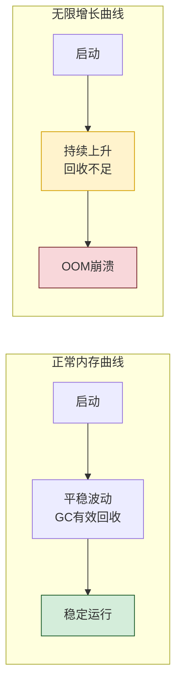
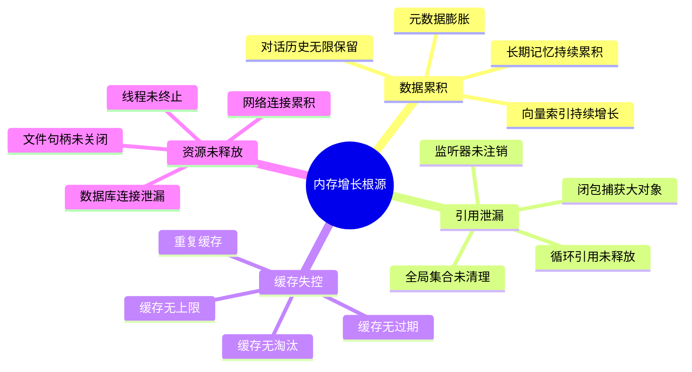
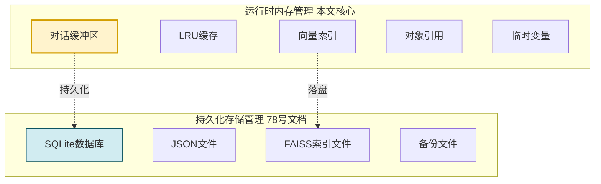
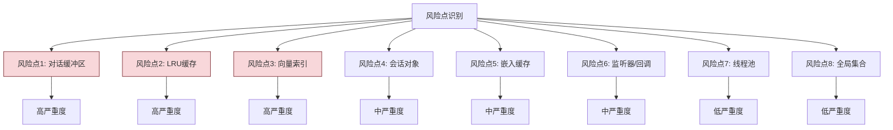
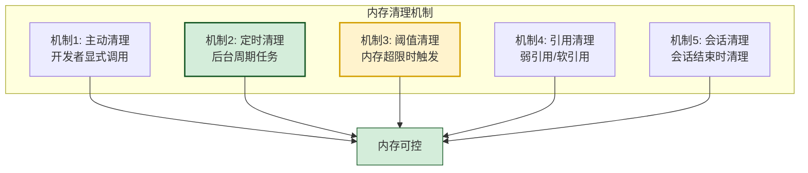
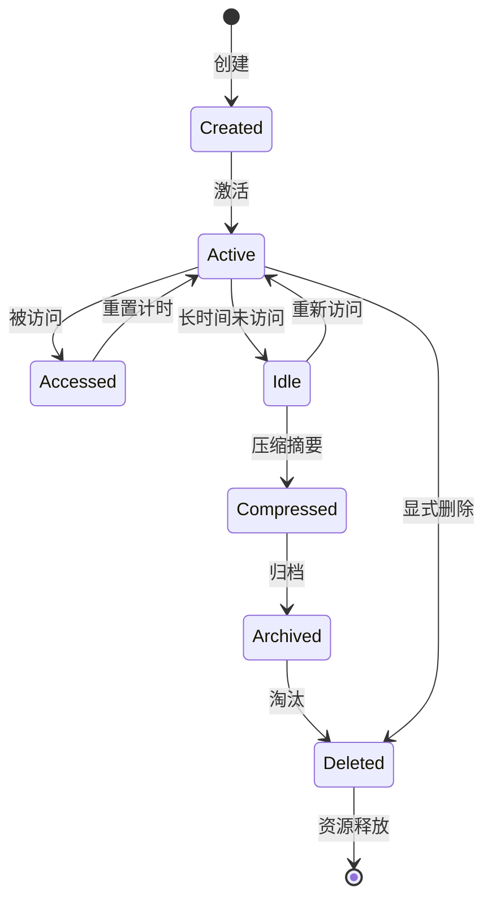
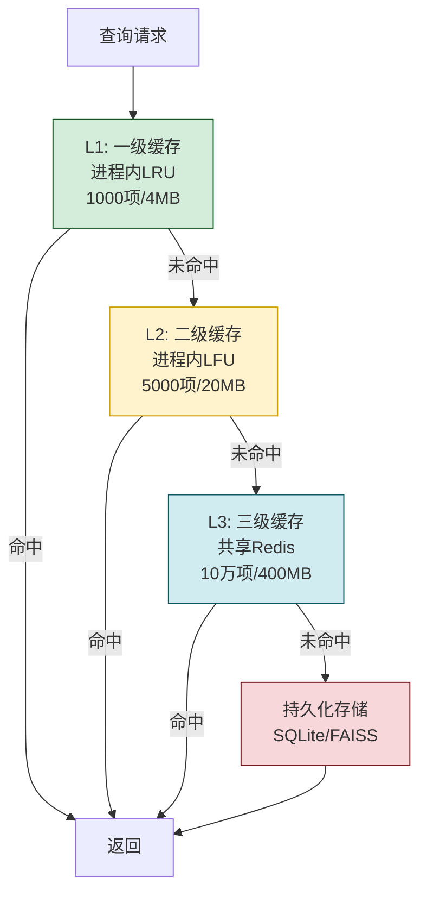
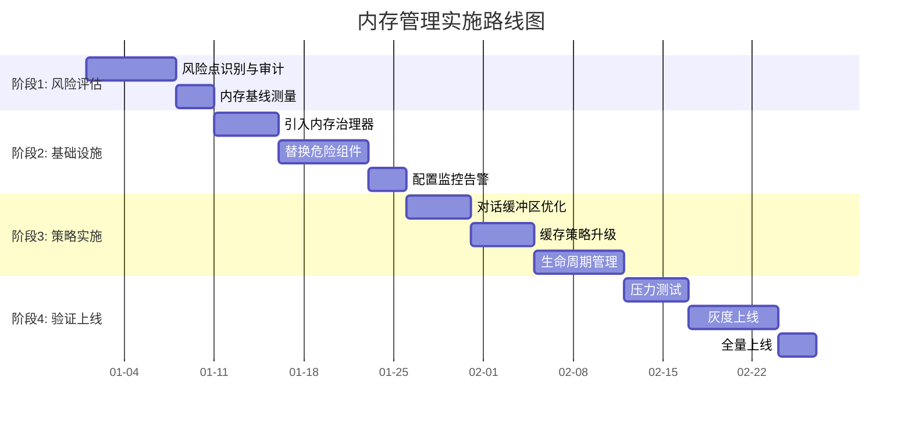
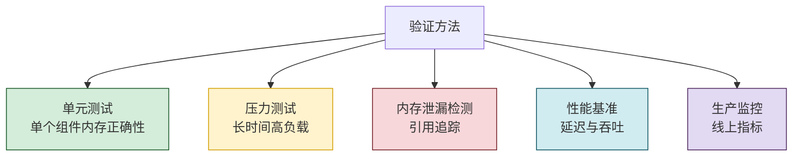
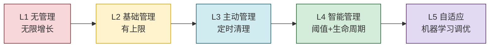

# Agent Memory 内存管理与无限增长防护深度解析

> 文档定位:系统阐述 AI Agent 记忆系统中**运行时内存(RAM)管理**的完整方案,聚焦于避免 Memory 无限增长问题,涵盖风险点识别、内存清理机制、对象生命周期管理、缓存策略优化、实施步骤与验证方法,为 Agent 记忆系统的稳定运行提供可落地的内存治理框架。
>
> 重要区分:本文档聚焦**运行时内存(RAM)管理**,与 [78Agent Memory数据存储方案深度解析.md](./78Agent%20Memory数据存储方案深度解析.md) 侧重**持久化存储(磁盘)**形成互补,两者共同构成完整的 Memory 资源治理体系。
>
> 阅读建议:建议结合 [76短期记忆与长期记忆核心区别深度解析.md](./76短期记忆与长期记忆核心区别深度解析.md)、[77Agent长期记忆系统完整设计方案.md](./77Agent长期记忆系统完整设计方案.md) 一并阅读。

---

## 目录

- [一、内存无限增长问题概述](#一内存无限增长问题概述)
- [二、潜在风险点识别](#二潜在风险点识别)
- [三、内存清理机制设计](#三内存清理机制设计)
- [四、对象生命周期管理](#四对象生命周期管理)
- [五、缓存策略优化](#五缓存策略优化)
- [六、完整代码实现](#六完整代码实现)
- [七、实施步骤](#七实施步骤)
- [八、验证方法与监控](#八验证方法与监控)
- [九、最佳实践与避坑指南](#九最佳实践与避坑指南)
- [十、总结与展望](#十总结与展望)

---

## 一、内存无限增长问题概述

### 1.1 问题本质

Agent 记忆系统的**内存无限增长问题**是指:在 Agent 长时间运行过程中,运行时内存(RAM)占用持续上升,无法被有效回收,最终导致 OOM(Out of Memory)崩溃或系统性能严重下降。



### 1.2 问题严重性

| 影响维度 | 具体表现 | 严重度 |
|---------|---------|:------:|
| **系统稳定性** | OOM 崩溃,Agent 服务中断 | ❌❌❌ |
| **响应性能** | GC 频繁触发,延迟飙升 | ❌❌ |
| **资源成本** | 内存占用高,服务器成本上升 | ❌❌ |
| **用户体验** | 响应变慢,记忆丢失,会话中断 | ❌❌❌ |
| **数据安全** | 异常崩溃导致内存数据丢失 | ❌❌ |

### 1.3 内存增长的核心根源



### 1.4 与存储管理的区别



**关键区分**:
- **运行时内存**:进程 RAM 中的数据,断电即失,需主动管理。
- **持久化存储**:磁盘上的数据,持久存在,需管理容量与生命周期。

---

## 二、潜在风险点识别

### 2.1 风险点全景



### 2.2 风险点 1:对话缓冲区无限增长

**问题位置**:短期记忆的 `ConversationBuffer` 类(见 [78号文档](./78Agent%20Memory数据存储方案深度解析.md) 第三节)。

**风险代码示例**:

```python
# ❌ 危险实现:对话缓冲区无限增长
class DangerousConversationBuffer:
    def __init__(self):
        self.messages = []  # 无上限的列表!
    
    def add_message(self, message):
        self.messages.append(message)  # 永远只增不减
        # 长时间运行后,messages 可能积累数万条消息
        # 每条消息含向量、元数据,占用大量内存
```

**风险分析**:
- 每个 Agent 会话维护一个对话缓冲区。
- 消息列表只增不减,持续累积。
- 每条消息含文本内容、向量嵌入、元数据,单条可能占用 5-10KB。
- 1 万条消息 = 50-100MB,10 万条 = 500MB-1GB。
- 多会话并发时,内存占用成倍增长。

### 2.3 风险点 2:LRU 缓存配置不当

**问题位置**:`LRUMemoryCache` 类(见 78 号文档第七节)。

**风险代码示例**:

```python
# ❌ 危险实现:缓存无上限或上限过大
class DangerousCache:
    def __init__(self):
        self.cache = {}  # 无上限的字典!
    
    def get(self, key):
        return self.cache.get(key)
    
    def put(self, key, value):
        self.cache[key] = value  # 永远只增不减
        # 长时间运行后,缓存可能持有大量对象
```

**风险分析**:
- 缓存无上限时,所有访问过的记忆都驻留内存。
- 缓存上限过大(如 100 万)时,单缓存占用 10GB+。
- 缓存项含完整 MemoryItem 对象,包含向量嵌入(1024 维浮点 = 4KB)。

### 2.4 风险点 3:向量索引持续增长

**问题位置**:`VectorMemoryStorage` 类(见 78 号文档第五节)。

**风险代码示例**:

```python
# ❌ 危险实现:向量索引只增不减
class DangerousVectorStorage:
    def __init__(self):
        self.vectors = []  # 向量列表
        self.meta = {}     # 元数据映射
    
    def add(self, memory_id, vector):
        self.vectors.append(vector)  # 永远只增不减
        self.meta[len(self.vectors) - 1] = memory_id
        # 长时间运行后,向量列表可能持有数百万向量
        # 1024维 × 4字节 × 100万 = 4GB
```

**风险分析**:
- FAISS 索引在内存中持有所有向量。
- 1024 维向量,每个 4KB,100 万向量 = 4GB。
- 删除记忆时向量索引难以同步清理(FAISS 不支持高效删除)。

### 2.5 风险点 4:会话对象未释放

**风险代码示例**:

```python
# ❌ 危险实现:会话对象全局保留
class SessionManager:
    def __init__(self):
        self.sessions = {}  # 全局会话字典,无清理
    
    def create_session(self, session_id):
        session = ConversationSession(session_id)
        self.sessions[session_id] = session  # 永远不删除
        return session
        # 用户断开后,会话对象仍驻留内存
```

**风险分析**:
- 每个会话持有对话缓冲区、用户上下文、临时数据。
- 会话结束后对象未释放,内存泄漏。
- 高并发场景下,数千会话累积。

### 2.6 风险点 5:嵌入结果缓存失控

**风险代码示例**:

```python
# ❌ 危险实现:嵌入结果无上限缓存
class EmbeddingCache:
    def __init__(self):
        self.cache = {}  # 文本 -> 向量
    
    def get_or_compute(self, text):
        if text not in self.cache:
            self.cache[text] = self.model.encode(text)  # 永远只增不减
        return self.cache[text]
        # 不同文本无限累积,缓存膨胀
```

### 2.7 风险点 6:监听器与回调未注销

**风险代码示例**:

```python
# ❌ 危险实现:事件监听器累积
class EventBus:
    def __init__(self):
        self.listeners = []  # 监听器列表
    
    def subscribe(self, callback):
        self.listeners.append(callback)  # 只增不减
        # 每次注册都新增,但从不注销
```

### 2.8 风险点汇总表

| 风险点 | 位置 | 根因 | 单对象内存 | 万级累积 | 严重度 |
|-------|------|------|:---------:|:-------:|:------:|
| 对话缓冲区 | ConversationBuffer | 无上限列表 | 5-10KB | 50-100MB | ❌❌❌ |
| LRU缓存 | LRUMemoryCache | 上限过大/无淘汰 | 4-10KB | 40-100MB | ❌❌❌ |
| 向量索引 | VectorMemoryStorage | 只增不减 | 4KB | 40MB | ❌❌❌ |
| 会话对象 | SessionManager | 未释放 | 50-100KB | 500MB-1GB | ❌❌ |
| 嵌入缓存 | EmbeddingCache | 无上限 | 4KB | 40MB | ❌❌ |
| 监听器 | EventBus | 未注销 | 1KB | 10MB | ❌ |
| 线程池 | ThreadPool | 未关闭 | 1MB/线程 | 100MB | ❌ |
| 全局集合 | GlobalRegistry | 累积 | 不定 | 不定 | ❌ |

---

## 三、内存清理机制设计

### 3.1 清理机制全景



### 3.2 机制 1:对话缓冲区清理

```python
import threading
from collections import deque
from datetime import datetime, timedelta


class SafeConversationBuffer:
    """安全的对话缓冲区 - 支持自动清理"""
    
    def __init__(self, session_id: str, 
                 max_messages: int = 100,
                 max_tokens: int = 4096,
                 max_age_hours: int = 24):
        self.session_id = session_id
        self.max_messages = max_messages    # 消息数量上限
        self.max_tokens = max_tokens        # Token总量上限
        self.max_age_hours = max_age_hours  # 最大保留时长
        
        # 使用 deque 限制大小(自动淘汰旧消息)
        self.messages = deque(maxlen=max_messages)
        self.current_tokens = 0
        self._lock = threading.RLock()
        self.last_activity = datetime.now()
    
    def add_message(self, message) -> bool:
        with self._lock:
            self.messages.append(message)
            self.current_tokens += getattr(message, "token_count", 0)
            self.last_activity = datetime.now()
            
            # Token超限时触发摘要压缩
            if self.current_tokens > self.max_tokens:
                self._compress_old_messages()
            return True
    
    def _compress_old_messages(self):
        """压缩旧消息(摘要化)"""
        if len(self.messages) < 10:
            return
        
        with self._lock:
            # 保留最近5条,旧消息摘要化
            old_messages = list(self.messages)[:-5]
            recent_messages = list(self.messages)[-5:]
            
            # 生成摘要
            summary = self._generate_summary(old_messages)
            
            # 清空并重建
            self.messages.clear()
            self.messages.append(summary)  # 摘要作为首条
            self.messages.extend(recent_messages)
            
            # 重新计算Token
            self.current_tokens = sum(
                getattr(m, "token_count", 0) for m in self.messages
            )
    
    def _generate_summary(self, messages: list) -> dict:
        """生成对话摘要"""
        # 实际中调用LLM生成摘要
        from dataclasses import dataclass
        
        @dataclass
        class SummaryMessage:
            content: str
            token_count: int
            is_summary: bool = True
            timestamp: datetime = None
            
            def __post_init__(self):
                if self.timestamp is None:
                    self.timestamp = datetime.now()
        
        summary_text = f"[前{len(messages)}条消息的摘要] 用户讨论了..."
        return SummaryMessage(
            content=summary_text,
            token_count=len(summary_text) // 4  # 粗略估算
        )
    
    def cleanup_expired(self) -> int:
        """清理过期消息"""
        with self._lock:
            now = datetime.now()
            cutoff = now - timedelta(hours=self.max_age_hours)
            
            original_count = len(self.messages)
            # 过滤掉过期消息
            self.messages = deque(
                (m for m in self.messages 
                 if getattr(m, "timestamp", now) > cutoff),
                maxlen=self.max_messages
            )
            cleaned = original_count - len(self.messages)
            return cleaned
    
    def get_context(self, max_tokens: int = 2000) -> list:
        """获取上下文(限制Token)"""
        with self._lock:
            context = []
            token_sum = 0
            # 从最新消息开始反向取
            for msg in reversed(self.messages):
                msg_tokens = getattr(msg, "token_count", 0)
                if token_sum + msg_tokens > max_tokens:
                    break
                context.insert(0, msg)
                token_sum += msg_tokens
            return context
```

### 3.3 机制 2:定时清理任务

```python
import time
import threading
from typing import Callable


class ScheduledCleanupTask:
    """定时清理任务调度器"""
    
    def __init__(self):
        self._tasks: list[dict] = []
        self._running = False
        self._thread = None
    
    def register_task(self, name: str, func: Callable, 
                       interval_seconds: int):
        """注册清理任务"""
        self._tasks.append({
            "name": name,
            "func": func,
            "interval": interval_seconds,
            "last_run": 0
        })
    
    def start(self):
        """启动定时清理"""
        self._running = True
        self._thread = threading.Thread(target=self._run_loop, daemon=True)
        self._thread.start()
    
    def stop(self):
        """停止定时清理"""
        self._running = False
        if self._thread:
            self._thread.join(timeout=5)
    
    def _run_loop(self):
        while self._running:
            now = time.time()
            for task in self._tasks:
                if now - task["last_run"] >= task["interval"]:
                    try:
                        cleaned = task["func"]()
                        if cleaned > 0:
                            print(f"[{task['name']}] 清理 {cleaned} 项")
                    except Exception as e:
                        print(f"[{task['name']}] 清理失败: {e}")
                    task["last_run"] = now
            time.sleep(60)  # 每分钟检查一次


# 全局清理任务调度器
cleanup_scheduler = ScheduledCleanupTask()
```

### 3.4 机制 3:内存阈值清理

```python
import psutil
import os


class MemoryThresholdMonitor:
    """内存阈值监控与清理"""
    
    def __init__(self, 
                 warning_threshold: float = 0.75,  # 75% 警告
                 critical_threshold: float = 0.85,  # 85% 危险
                 cleanup_callbacks: list[Callable] = None):
        self.warning_threshold = warning_threshold
        self.critical_threshold = critical_threshold
        self.cleanup_callbacks = cleanup_callbacks or []
        self._last_check = 0
    
    def check_and_cleanup(self) -> dict:
        """检查内存并触发清理"""
        process = psutil.Process(os.getpid())
        memory_info = process.memory_info()
        memory_mb = memory_info.rss / 1024 / 1024
        
        # 系统级内存使用率
        system_usage = psutil.virtual_memory().percent / 100
        
        result = {
            "process_memory_mb": round(memory_mb, 2),
            "system_usage": round(system_usage, 2),
            "action_taken": None,
            "cleaned_items": 0
        }
        
        if system_usage >= self.critical_threshold:
            # 危险阈值:紧急清理
            result["action_taken"] = "critical_cleanup"
            for callback in self.cleanup_callbacks:
                result["cleaned_items"] += callback(aggressive=True)
        elif system_usage >= self.warning_threshold:
            # 警告阈值:常规清理
            result["action_taken"] = "warning_cleanup"
            for callback in self.cleanup_callbacks:
                result["cleaned_items"] += callback(aggressive=False)
        
        return result
```

### 3.5 机制 4:弱引用管理

```python
import weakref
from typing import Optional


class WeakRefMemoryCache:
    """弱引用缓存 - 内存紧张时自动释放"""
    
    def __init__(self):
        self._cache: dict[str, weakref.ref] = {}
        self._lock = threading.RLock()
    
    def put(self, key: str, value):
        """存入弱引用"""
        with self._lock:
            try:
                self._cache[key] = weakref.ref(value)
            except TypeError:
                # 不可弱引用的对象,退化为强引用
                self._cache[key] = value
    
    def get(self, key: str):
        """获取(可能已失效)"""
        with self._lock:
            ref = self._cache.get(key)
            if ref is None:
                return None
            if isinstance(ref, weakref.ref):
                value = ref()  # 可能返回None(已被GC)
                if value is None:
                    del self._cache[key]  # 清理失效引用
                return value
            return ref
    
    def cleanup_dead_refs(self) -> int:
        """清理失效的弱引用"""
        with self._lock:
            dead_keys = []
            for key, ref in self._cache.items():
                if isinstance(ref, weakref.ref) and ref() is None:
                    dead_keys.append(key)
            for key in dead_keys:
                del self._cache[key]
            return len(dead_keys)


class SoftRefMemoryCache:
    """软引用缓存 - 仅在内存不足时释放"""
    
    # Python 标准库不直接支持软引用,可用弱引用近似
    def __init__(self, max_size: int = 1000):
        self.max_size = max_size
        self._strong_cache: dict[str, object] = {}  # 强引用(LRU)
        self._soft_cache: dict[str, weakref.ref] = {}  # 弱引用(备份)
        self._lock = threading.RLock()
    
    def put(self, key: str, value):
        with self._lock:
            self._strong_cache[key] = value
            # 强引用超限时,降级为弱引用
            if len(self._strong_cache) > self.max_size:
                old_key = next(iter(self._strong_cache))
                old_value = self._strong_cache.pop(old_key)
                try:
                    self._soft_cache[old_key] = weakref.ref(old_value)
                except TypeError:
                    pass
    
    def get(self, key: str):
        with self._lock:
            if key in self._strong_cache:
                return self._strong_cache[key]
            ref = self._soft_cache.get(key)
            if ref:
                value = ref()
                if value:
                    # 重新提升为强引用
                    self._strong_cache[key] = value
                    del self._soft_cache[key]
                else:
                    del self._soft_cache[key]
                return value
            return None
```

---

## 四、对象生命周期管理

### 4.1 生命周期状态机



### 4.2 生命周期管理器实现

```python
from enum import Enum
from datetime import datetime, timedelta
from typing import Any, Optional
import threading


class ObjectState(Enum):
    """对象生命周期状态"""
    CREATED = "created"
    ACTIVE = "active"
    IDLE = "idle"
    COMPRESSED = "compressed"
    ARCHIVED = "archived"
    DELETED = "deleted"


class ManagedObject:
    """被生命周期管理的对象包装器"""
    
    def __init__(self, obj: Any, obj_id: str):
        self.obj = obj
        self.id = obj_id
        self.state = ObjectState.CREATED
        self.created_at = datetime.now()
        self.last_accessed = datetime.now()
        self.access_count = 0
        self.compressed_obj = None  # 压缩后的版本
        self._lock = threading.RLock()
    
    def access(self) -> Any:
        """访问对象"""
        with self._lock:
            if self.state == ObjectState.DELETED:
                raise RuntimeError(f"对象 {self.id} 已删除")
            
            self.last_accessed = datetime.now()
            self.access_count += 1
            
            # 如果处于压缩/归档状态,需要恢复
            if self.state in (ObjectState.COMPRESSED, ObjectState.ARCHIVED):
                self._restore()
            
            self.state = ObjectState.ACTIVE
            return self.obj
    
    def compress(self):
        """压缩对象"""
        with self._lock:
            if self.state != ObjectState.ACTIVE:
                return
            # 生成压缩版本(如摘要)
            self.compressed_obj = self._generate_compressed()
            # 释放原始对象
            self.obj = None
            self.state = ObjectState.COMPRESSED
    
    def archive(self):
        """归档对象"""
        with self._lock:
            if self.state == ObjectState.COMPRESSED:
                pass  # 已压缩
            else:
                self.compress()
            self.state = ObjectState.ARCHIVED
    
    def delete(self):
        """删除对象"""
        with self._lock:
            self.obj = None
            self.compressed_obj = None
            self.state = ObjectState.DELETED
    
    def _restore(self):
        """从压缩/归档状态恢复"""
        if self.compressed_obj is not None:
            # 从压缩版本重建(可能损失部分信息)
            self.obj = self.compressed_obj
        else:
            # 从持久化存储加载
            self.obj = self._load_from_storage()
    
    def _generate_compressed(self):
        """生成压缩版本"""
        # 实际中调用LLM摘要或向量化
        return f"[压缩版本] {str(self.obj)[:100]}"
    
    def _load_from_storage(self):
        """从存储加载"""
        # 从SQLite/JSON加载
        return None  # 占位


class ObjectLifecycleManager:
    """对象生命周期管理器"""
    
    def __init__(self, 
                 idle_threshold_minutes: int = 30,
                 compress_threshold_hours: int = 2,
                 archive_threshold_hours: int = 24,
                 delete_threshold_days: int = 7):
        self.idle_threshold = timedelta(minutes=idle_threshold_minutes)
        self.compress_threshold = timedelta(hours=compress_threshold_hours)
        self.archive_threshold = timedelta(hours=archive_threshold_hours)
        self.delete_threshold = timedelta(days=delete_threshold_days)
        
        self._objects: dict[str, ManagedObject] = {}
        self._lock = threading.RLock()
    
    def register(self, obj_id: str, obj: Any) -> ManagedObject:
        """注册对象"""
        with self._lock:
            managed = ManagedObject(obj, obj_id)
            managed.state = ObjectState.ACTIVE
            self._objects[obj_id] = managed
            return managed
    
    def access(self, obj_id: str) -> Optional[Any]:
        """访问对象"""
        with self._lock:
            managed = self._objects.get(obj_id)
            if managed:
                return managed.access()
            return None
    
    def lifecycle_maintenance(self) -> dict:
        """生命周期维护(定时调用)"""
        with self._lock:
            now = datetime.now()
            stats = {"idle": 0, "compressed": 0, "archived": 0, "deleted": 0}
            
            to_delete = []
            
            for obj_id, managed in self._objects.items():
                age = now - managed.last_accessed
                
                if age > self.delete_threshold:
                    managed.delete()
                    to_delete.append(obj_id)
                    stats["deleted"] += 1
                elif age > self.archive_threshold:
                    if managed.state != ObjectState.ARCHIVED:
                        managed.archive()
                        stats["archived"] += 1
                elif age > self.compress_threshold:
                    if managed.state == ObjectState.ACTIVE:
                        managed.compress()
                        stats["compressed"] += 1
                elif age > self.idle_threshold:
                    if managed.state == ObjectState.ACTIVE:
                        managed.state = ObjectState.IDLE
                        stats["idle"] += 1
            
            # 清理已删除对象
            for obj_id in to_delete:
                del self._objects[obj_id]
            
            return stats
    
    def force_cleanup(self, aggressive: bool = False) -> int:
        """强制清理"""
        with self._lock:
            cleaned = 0
            for obj_id, managed in list(self._objects.items()):
                if aggressive:
                    managed.delete()
                    del self._objects[obj_id]
                    cleaned += 1
                elif managed.state in (ObjectState.IDLE, ObjectState.COMPRESSED):
                    managed.delete()
                    del self._objects[obj_id]
                    cleaned += 1
            return cleaned
```

---

## 五、缓存策略优化

### 5.1 多级缓存架构



### 5.2 改进的 LRU 缓存

```python
from collections import OrderedDict
import threading
from datetime import datetime, timedelta


class ImprovedLRUCache:
    """改进的 LRU 缓存 - 带 TTL 与大小限制"""
    
    def __init__(self, 
                 max_size: int = 1000,
                 max_memory_mb: int = 50,
                 ttl_seconds: int = 3600):
        self.max_size = max_size
        self.max_memory_bytes = max_memory_mb * 1024 * 1024
        self.ttl = timedelta(seconds=ttl_seconds)
        
        self._cache: OrderedDict[str, dict] = OrderedDict()
        self._current_bytes = 0
        self._lock = threading.RLock()
        
        # 统计信息
        self._stats = {
            "hits": 0,
            "misses": 0,
            "evictions": 0,
            "expired": 0
        }
    
    def get(self, key: str):
        with self._lock:
            entry = self._cache.get(key)
            if entry is None:
                self._stats["misses"] += 1
                return None
            
            # 检查TTL
            if datetime.now() - entry["created_at"] > self.ttl:
                self._remove_entry(key)
                self._stats["expired"] += 1
                self._stats["misses"] += 1
                return None
            
            # 更新访问顺序
            self._cache.move_to_end(key)
            entry["last_accessed"] = datetime.now()
            self._stats["hits"] += 1
            return entry["value"]
    
    def put(self, key: str, value, size_bytes: int = None):
        with self._lock:
            # 估算大小
            if size_bytes is None:
                size_bytes = self._estimate_size(value)
            
            # 如果单个对象超限,拒绝缓存
            if size_bytes > self.max_memory_bytes * 0.5:
                return False
            
            # 如果key已存在,先移除旧值
            if key in self._cache:
                self._remove_entry(key)
            
            # 淘汰直到有足够空间
            while (len(self._cache) >= self.max_size or 
                   self._current_bytes + size_bytes > self.max_memory_bytes):
                if not self._cache:
                    break
                self._evict_one()
            
            # 存入
            self._cache[key] = {
                "value": value,
                "size": size_bytes,
                "created_at": datetime.now(),
                "last_accessed": datetime.now()
            }
            self._current_bytes += size_bytes
            return True
    
    def _evict_one(self):
        """淘汰一项(LRU)"""
        if not self._cache:
            return
        key, entry = self._cache.popitem(last=False)
        self._current_bytes -= entry["size"]
        self._stats["evictions"] += 1
    
    def _remove_entry(self, key: str):
        """移除指定项"""
        entry = self._cache.pop(key, None)
        if entry:
            self._current_bytes -= entry["size"]
    
    def _estimate_size(self, value) -> int:
        """估算对象大小"""
        import sys
        return sys.getsizeof(value)
    
    def cleanup_expired(self) -> int:
        """清理过期项"""
        with self._lock:
            now = datetime.now()
            expired_keys = [
                k for k, v in self._cache.items()
                if now - v["created_at"] > self.ttl
            ]
            for k in expired_keys:
                self._remove_entry(k)
            self._stats["expired"] += len(expired_keys)
            return len(expired_keys)
    
    def get_stats(self) -> dict:
        """获取统计信息"""
        with self._lock:
            total = self._stats["hits"] + self._stats["misses"]
            return {
                **self._stats,
                "size": len(self._cache),
                "memory_mb": round(self._current_bytes / 1024 / 1024, 2),
                "hit_rate": round(self._stats["hits"] / total, 3) if total > 0 else 0
            }
    
    def clear(self):
        """清空缓存"""
        with self._lock:
            self._cache.clear()
            self._current_bytes = 0
```

### 5.3 LFU 缓存(访问频率优先)

```python
from collections import defaultdict
import heapq


class LFUCache:
    """LFU 缓存 - 淘汰访问频率最低的"""
    
    def __init__(self, max_size: int = 1000):
        self.max_size = max_size
        self._cache: dict[str, dict] = {}
        self._freq_heap = []  # 最小堆:(频率, 时间, key)
        self._lock = threading.RLock()
    
    def get(self, key: str):
        with self._lock:
            entry = self._cache.get(key)
            if entry is None:
                return None
            entry["freq"] += 1
            entry["last_accessed"] = datetime.now()
            return entry["value"]
    
    def put(self, key: str, value):
        with self._lock:
            if key in self._cache:
                self._cache[key]["value"] = value
                self._cache[key]["freq"] += 1
                return
            
            # 容量超限时淘汰
            if len(self._cache) >= self.max_size:
                self._evict_least_frequent()
            
            self._cache[key] = {
                "value": value,
                "freq": 1,
                "created_at": datetime.now(),
                "last_accessed": datetime.now()
            }
    
    def _evict_least_frequent(self):
        """淘汰访问频率最低的"""
        if not self._cache:
            return
        
        # 找到频率最低且最久未访问的
        min_key = min(self._cache.keys(), 
                       key=lambda k: (self._cache[k]["freq"], 
                                       self._cache[k]["last_accessed"]))
        del self._cache[min_key]
```

### 5.4 会话感知缓存

```python
class SessionAwareCache:
    """会话感知缓存 - 会话结束时批量清理"""
    
    def __init__(self, max_size_per_session: int = 100):
        self.max_per_session = max_size_per_session
        self._session_caches: dict[str, OrderedDict] = {}
        self._lock = threading.RLock()
    
    def put(self, session_id: str, key: str, value):
        with self._lock:
            if session_id not in self._session_caches:
                self._session_caches[session_id] = OrderedDict()
            
            cache = self._session_caches[session_id]
            if key in cache:
                cache.move_to_end(key)
            cache[key] = value
            
            # 单会话超限淘汰
            if len(cache) > self.max_per_session:
                cache.popitem(last=False)
    
    def get(self, session_id: str, key: str):
        with self._lock:
            cache = self._session_caches.get(session_id)
            if cache and key in cache:
                cache.move_to_end(key)
                return cache[key]
            return None
    
    def cleanup_session(self, session_id: str) -> int:
        """会话结束时清理整个会话缓存"""
        with self._lock:
            cache = self._session_caches.pop(session_id, None)
            return len(cache) if cache else 0
    
    def cleanup_all_sessions(self) -> int:
        """清理所有会话缓存(紧急情况)"""
        with self._lock:
            total = sum(len(c) for c in self._session_caches.values())
            self._session_caches.clear()
            return total
```

---

## 六、完整代码实现

### 6.1 内存管理总控器

```python
"""
Agent Memory 内存管理总控器
整合清理机制、生命周期管理、缓存优化
"""
import threading
import time
import psutil
import os
from datetime import datetime, timedelta
from typing import Callable, Optional
from dataclasses import dataclass


@dataclass
class MemoryStats:
    """内存统计信息"""
    process_memory_mb: float
    system_usage_percent: float
    cache_stats: dict
    lifecycle_stats: dict
    conversation_buffers: int
    vector_count: int
    last_cleanup: Optional[datetime]


class MemoryGovernor:
    """内存治理总控器 - 统一管理所有内存资源"""
    
    def __init__(self, 
                 max_memory_mb: int = 2048,
                 warning_threshold: float = 0.75,
                 critical_threshold: float = 0.85):
        self.max_memory_mb = max_memory_mb
        self.warning_threshold = warning_threshold
        self.critical_threshold = critical_threshold
        
        # 各组件引用
        self.conversation_buffers: dict[str, SafeConversationBuffer] = {}
        self.cache = ImprovedLRUCache(max_size=1000, max_memory_mb=50)
        self.session_cache = SessionAwareCache(max_size_per_session=100)
        self.lifecycle_manager = ObjectLifecycleManager()
        
        # 清理回调
        self._cleanup_callbacks: list[Callable] = []
        
        # 统计
        self._stats_lock = threading.RLock()
        self._last_cleanup = None
        
        # 启动后台监控线程
        self._running = True
        self._monitor_thread = threading.Thread(
            target=self._monitor_loop, daemon=True
        )
        self._monitor_thread.start()
    
    def register_cleanup_callback(self, callback: Callable):
        """注册清理回调"""
        self._cleanup_callbacks.append(callback)
    
    def create_conversation_buffer(self, session_id: str) -> SafeConversationBuffer:
        """创建对话缓冲区"""
        with self._stats_lock:
            buffer = SafeConversationBuffer(session_id)
            self.conversation_buffers[session_id] = buffer
            return buffer
    
    def get_conversation_buffer(self, session_id: str) -> Optional[SafeConversationBuffer]:
        return self.conversation_buffers.get(session_id)
    
    def close_session(self, session_id: str) -> dict:
        """关闭会话,清理相关资源"""
        cleaned = {"buffer": 0, "cache": 0, "lifecycle": 0}
        
        with self._stats_lock:
            # 清理对话缓冲区
            buffer = self.conversation_buffers.pop(session_id, None)
            if buffer:
                cleaned["buffer"] = len(buffer.messages)
        
        # 清理会话缓存
        cleaned["cache"] = self.session_cache.cleanup_session(session_id)
        
        return cleaned
    
    def _monitor_loop(self):
        """后台监控循环"""
        while self._running:
            try:
                self._check_memory()
                time.sleep(30)  # 每30秒检查
            except Exception as e:
                print(f"内存监控异常: {e}")
                time.sleep(60)
    
    def _check_memory(self):
        """检查内存并触发清理"""
        process = psutil.Process(os.getpid())
        memory_mb = process.memory_info().rss / 1024 / 1024
        system_usage = psutil.virtual_memory().percent / 100
        
        if system_usage >= self.critical_threshold:
            print(f"⚠️ 内存危急: 进程 {memory_mb:.0f}MB, 系统 {system_usage:.0%}")
            self._emergency_cleanup()
        elif system_usage >= self.warning_threshold:
            print(f"⚠️ 内存警告: 进程 {memory_mb:.0f}MB, 系统 {system_usage:.0%}")
            self._routine_cleanup()
    
    def _routine_cleanup(self) -> dict:
        """常规清理"""
        stats = {"expired_cache": 0, "idle_objects": 0, 
                 "expired_buffers": 0, "callback_cleaned": 0}
        
        # 1. 清理过期缓存
        stats["expired_cache"] = self.cache.cleanup_expired()
        
        # 2. 生命周期维护
        lifecycle_stats = self.lifecycle_manager.lifecycle_maintenance()
        stats["idle_objects"] = sum(lifecycle_stats.values())
        
        # 3. 清理过期对话缓冲区
        for session_id, buffer in list(self.conversation_buffers.items()):
            cleaned = buffer.cleanup_expired()
            stats["expired_buffers"] += cleaned
        
        # 4. 执行回调清理
        for callback in self._cleanup_callbacks:
            stats["callback_cleaned"] += callback(aggressive=False)
        
        self._last_cleanup = datetime.now()
        return stats
    
    def _emergency_cleanup(self) -> dict:
        """紧急清理"""
        stats = {"cache_cleared": 0, "objects_deleted": 0, 
                 "buffers_cleared": 0, "callback_cleaned": 0}
        
        # 1. 强制清理非活跃缓存
        stats["cache_cleared"] = self.lifecycle_manager.force_cleanup(aggressive=False)
        
        # 2. 压缩所有活跃对象
        for managed in self.lifecycle_manager._objects.values():
            if managed.state == ObjectState.ACTIVE:
                managed.compress()
                stats["objects_deleted"] += 1
        
        # 3. 清理空闲会话缓冲区
        for session_id, buffer in list(self.conversation_buffers.items()):
            if (datetime.now() - buffer.last_activity).total_seconds() > 1800:
                buffer.messages.clear()
                stats["buffers_cleared"] += 1
        
        # 4. 强制回调清理
        for callback in self._cleanup_callbacks:
            stats["callback_cleaned"] += callback(aggressive=True)
        
        # 5. 强制GC
        import gc
        gc.collect()
        
        self._last_cleanup = datetime.now()
        return stats
    
    def get_stats(self) -> MemoryStats:
        """获取内存统计"""
        process = psutil.Process(os.getpid())
        return MemoryStats(
            process_memory_mb=round(process.memory_info().rss / 1024 / 1024, 2),
            system_usage_percent=round(psutil.virtual_memory().percent, 2),
            cache_stats=self.cache.get_stats(),
            lifecycle_stats={"total": len(self.lifecycle_manager._objects)},
            conversation_buffers=len(self.conversation_buffers),
            vector_count=0,  # 从向量存储获取
            last_cleanup=self._last_cleanup
        )
    
    def shutdown(self):
        """关闭,释放所有资源"""
        self._running = False
        if self._monitor_thread:
            self._monitor_thread.join(timeout=5)
        
        # 清理所有会话
        for session_id in list(self.conversation_buffers.keys()):
            self.close_session(session_id)
        
        # 清空缓存
        self.cache.clear()
        self.session_cache.cleanup_all_sessions()


# 全局内存治理器
memory_governor = MemoryGovernor()
```

### 6.2 向量索引的内存管理

```python
class MemoryAwareVectorStorage:
    """内存感知的向量存储 - 支持内存与磁盘交换"""
    
    def __init__(self, dimension: int = 1024,
                 max_in_memory: int = 100000,
                 disk_path: Path = None):
        import faiss
        self.dimension = dimension
        self.max_in_memory = max_in_memory
        self.disk_path = disk_path
        
        # 内存索引(活跃向量)
        self.memory_index = faiss.IndexHNSWFlat(dimension, 32)
        
        # 磁盘索引(冷数据)
        self.disk_index = None
        self._disk_dirty = False
        
        # 向量元数据
        self._meta: dict[int, str] = {}
        self._reverse_meta: dict[str, int] = {}
        self._access_freq: dict[int, int] = {}  # 访问频率
        
        self._lock = threading.RLock()
    
    def add(self, memory_id: str, vector: list[float]):
        with self._lock:
            if len(self._meta) >= self.max_in_memory:
                self._swap_out_cold_vectors()
            
            import numpy as np
            vec = np.array([vector], dtype=np.float32)
            vector_id = self.memory_index.ntotal
            self.memory_index.add(vec)
            
            self._meta[vector_id] = memory_id
            self._reverse_meta[memory_id] = vector_id
            self._access_freq[vector_id] = 0
    
    def search(self, query_vector: list[float], top_k: int = 5):
        with self._lock:
            import numpy as np
            query = np.array([query_vector], dtype=np.float32)
            scores, indices = self.memory_index.search(query, top_k)
            
            results = []
            for i, score in zip(indices[0], scores[0]):
                if i in self._meta:
                    results.append((self._meta[i], float(score)))
                    self._access_freq[i] += 1
            return results
    
    def _swap_out_cold_vectors(self):
        """将冷数据交换到磁盘"""
        # 找出访问频率最低的向量
        sorted_ids = sorted(self._access_freq.items(), key=lambda x: x[1])
        to_swap = sorted_ids[:len(sorted_ids) // 4]  # 淘汰25%
        
        # 实际中:写入磁盘索引,从内存索引删除
        # FAISS不支持高效删除,需要重建索引
        # 简化实现:标记为冷数据
        for vector_id, _ in to_swap:
            self._access_freq[vector_id] = -1  # 标记为冷
        
        print(f"交换 {len(to_swap)} 个冷向量到磁盘")
    
    def get_memory_usage(self) -> dict:
        """获取内存使用"""
        return {
            "in_memory_vectors": len(self._meta),
            "max_capacity": self.max_in_memory,
            "utilization": len(self._meta) / self.max_in_memory,
            "estimated_memory_mb": round(
                len(self._meta) * self.dimension * 4 / 1024 / 1024, 2
            )
        }
```

---

## 七、实施步骤

### 7.1 实施路线图



### 7.2 详细实施步骤

#### 步骤 1:风险评估与基线测量

```python
# 1. 运行风险评估脚本
class MemoryRiskAssessor:
    """内存风险评估器"""
    
    def assess(self) -> dict:
        """评估当前内存风险"""
        risks = []
        
        # 检查对话缓冲区是否有上限
        # 检查缓存是否有淘汰策略
        # 检查向量索引是否支持删除
        # 检查会话是否正确关闭
        
        return {
            "risk_level": "high" if risks else "low",
            "risks": risks,
            "recommendations": []
        }
    
    def measure_baseline(self, duration_hours: int = 24) -> dict:
        """测量内存基线"""
        import psutil
        measurements = []
        
        for _ in range(duration_hours * 60):  # 每分钟一次
            process = psutil.Process(os.getpid())
            measurements.append({
                "timestamp": datetime.now(),
                "memory_mb": process.memory_info().rss / 1024 / 1024
            })
            time.sleep(60)
        
        return {
            "avg_memory_mb": sum(m["memory_mb"] for m in measurements) / len(measurements),
            "max_memory_mb": max(m["memory_mb"] for m in measurements),
            "growth_rate_mb_per_hour": self._calculate_growth_rate(measurements)
        }
```

#### 步骤 2:引入内存治理器

```python
# 在Agent启动时初始化
def initialize_agent():
    # 初始化内存治理器
    governor = MemoryGovernor(
        max_memory_mb=2048,
        warning_threshold=0.75,
        critical_threshold=0.85
    )
    
    # 注册各组件的清理回调
    governor.register_cleanup_callback(lambda aggressive: 
        vector_storage.cleanup(aggressive))
    governor.register_cleanup_callback(lambda aggressive: 
        session_manager.cleanup_idle_sessions())
    
    return governor
```

#### 步骤 3:替换危险组件

```python
# 替换前(危险)
# buffer = DangerousConversationBuffer()

# 替换后(安全)
buffer = memory_governor.create_conversation_buffer(session_id)
```

#### 步骤 4:配置监控告警

```python
# 配置监控
def setup_monitoring(governor: MemoryGovernor):
    import logging
    
    # 日志监控
    logging.basicConfig(
        level=logging.WARNING,
        format='%(asctime)s [%(levelname)s] %(message)s'
    )
    
    # 定期输出内存报告
    def report_worker():
        while True:
            stats = governor.get_stats()
            logging.info(f"内存报告: {stats}")
            time.sleep(300)  # 5分钟报告一次
    
    threading.Thread(target=report_worker, daemon=True).start()
```

---

## 八、验证方法与监控

### 8.1 验证方法体系



### 8.2 内存泄漏检测

```python
import tracemalloc
import gc
import linecache


class MemoryLeakDetector:
    """内存泄漏检测器"""
    
    def __init__(self):
        self.snapshot_before = None
        self.snapshot_after = None
    
    def start(self):
        """开始追踪"""
        tracemalloc.start(25)  # 保留25帧
        gc.collect()
        self.snapshot_before = tracemalloc.take_snapshot()
    
    def stop_and_report(self, top_n: int = 20) -> str:
        """停止并生成报告"""
        gc.collect()
        self.snapshot_after = tracemalloc.take_snapshot()
        
        stats = self.snapshot_after.compare_to(
            self.snapshot_before, "lineno"
        )
        
        report_lines = ["=== 内存泄漏检测报告 ===\n"]
        for stat in stats[:top_n]:
            frame = stat.traceback[0]
            filename = frame.filename
            lineno = frame.lineno
            line = linecache.getline(filename, lineno).strip()
            report_lines.append(
                f"{filename}:{lineno}: {stat.size_diff / 1024:.1f}KB\n"
                f"  代码: {line}\n"
            )
        
        tracemalloc.stop()
        return "\n".join(report_lines)


# 使用示例
def test_no_memory_leak():
    """测试无内存泄漏"""
    detector = MemoryLeakDetector()
    detector.start()
    
    # 模拟Agent运行
    for i in range(10000):
        buffer = SafeConversationBuffer(f"session_{i}")
        buffer.add_message(SimpleMessage(content=f"msg {i}", token_count=10))
        # 模拟会话结束
        # buffer 应被GC回收
    
    report = detector.stop_and_report()
    print(report)
    
    # 断言内存增长在阈值内
    # assert growth < 10MB
```

### 8.3 压力测试

```python
import pytest
import threading
import time


class MemoryStressTest:
    """内存压力测试"""
    
    def test_long_running_stability(self, governor: MemoryGovernor,
                                      duration_minutes: int = 60):
        """长时间运行稳定性测试"""
        initial_stats = governor.get_stats()
        initial_memory = initial_stats.process_memory_mb
        
        # 模拟持续负载
        def worker():
            for i in range(10000):
                session_id = f"stress_session_{threading.get_ident()}_{i}"
                buffer = governor.create_conversation_buffer(session_id)
                
                # 添加消息
                for j in range(50):
                    buffer.add_message(SimpleMessage(
                        content=f"msg {j}", token_count=10
                    ))
                
                # 模拟查询
                governor.cache.put(f"key_{i}", f"value_{i}")
                governor.cache.get(f"key_{i}")
                
                # 关闭会话
                governor.close_session(session_id)
        
        # 启动多线程
        threads = [threading.Thread(target=worker) for _ in range(10)]
        for t in threads:
            t.start()
        for t in threads:
            t.join()
        
        # 检查内存增长
        final_stats = governor.get_stats()
        final_memory = final_stats.process_memory_mb
        growth = final_memory - initial_memory
        
        print(f"初始内存: {initial_memory:.0f}MB")
        print(f"最终内存: {final_memory:.0f}MB")
        print(f"内存增长: {growth:.0f}MB")
        
        # 断言:增长应小于50MB
        assert growth < 50, f"内存增长过大: {growth}MB"
    
    def test_high_concurrency(self, governor: MemoryGovernor):
        """高并发测试"""
        # 100个并发会话
        def concurrent_session(session_id: int):
            buffer = governor.create_conversation_buffer(f"concurrent_{session_id}")
            for i in range(100):
                buffer.add_message(SimpleMessage(content=f"msg", token_count=10))
            governor.close_session(f"concurrent_{session_id}")
        
        threads = [threading.Thread(target=concurrent_session, args=(i,))
                   for i in range(100)]
        for t in threads:
            t.start()
        for t in threads:
            t.join()
        
        # 所有会话关闭后,内存应回落
        stats = governor.get_stats()
        assert stats.conversation_buffers == 0
```

### 8.4 生产监控指标

```python
class MemoryMetricsExporter:
    """内存指标导出器(对接Prometheus等)"""
    
    METRICS = {
        "process_memory_mb": "进程内存占用(MB)",
        "system_memory_usage": "系统内存使用率",
        "cache_hit_rate": "缓存命中率",
        "cache_size": "缓存项数量",
        "cache_memory_mb": "缓存内存占用",
        "conversation_buffers": "活跃对话缓冲区数",
        "vector_count": "向量索引数量",
        "vector_memory_mb": "向量内存占用",
        "lifecycle_active_objects": "活跃对象数",
        "lifecycle_idle_objects": "空闲对象数",
        "cleanup_count": "清理次数",
        "cleanup_items": "清理项总数"
    }
    
    def export(self, governor: MemoryGovernor) -> dict:
        stats = governor.get_stats()
        return {
            "process_memory_mb": stats.process_memory_mb,
            "system_memory_usage": stats.system_usage_percent,
            "cache_hit_rate": stats.cache_stats.get("hit_rate", 0),
            "cache_size": stats.cache_stats.get("size", 0),
            "cache_memory_mb": stats.cache_stats.get("memory_mb", 0),
            "conversation_buffers": stats.conversation_buffers,
            "lifecycle_active_objects": stats.lifecycle_stats.get("total", 0),
            "timestamp": datetime.now().isoformat()
        }
```

### 8.5 告警规则

```yaml
# 监控告警配置
alerts:
  - name: memory_warning
    condition: "process_memory_mb > 1500"
    severity: warning
    action: "触发常规清理"
    
  - name: memory_critical
    condition: "process_memory_mb > 2000"
    severity: critical
    action: "触发紧急清理 + 通知运维"
    
  - name: memory_growth_rate
    condition: "growth_rate_mb_per_hour > 50"
    severity: warning
    action: "可能存在内存泄漏,排查"
    
  - name: cache_hit_rate_low
    condition: "cache_hit_rate < 0.3"
    severity: info
    action: "缓存命中率低,考虑调整大小"
    
  - name: conversation_buffers_high
    condition: "conversation_buffers > 500"
    severity: warning
    action: "活跃会话过多,检查会话清理"
```

---

## 九、最佳实践与避坑指南

### 9.1 最佳实践清单

| 领域 | 最佳实践 | 说明 |
|-----|---------|------|
| **缓冲区** | 使用 deque(maxlen=N) | 自动淘汰旧消息 |
| **缓存** | 设置大小+内存双上限 | 防止单项过大 |
| **缓存** | 启用 TTL 过期 | 防止陈旧数据累积 |
| **会话** | 会话结束显式清理 | 释放所有关联资源 |
| **向量** | 冷热分离 | 冷数据交换到磁盘 |
| **对象** | 弱引用持有 | 允许GC回收 |
| **监控** | 内存增长率告警 | 早期发现泄漏 |
| **测试** | 长时间压力测试 | 模拟生产负载 |
| **清理** | 多级清理策略 | 日常+阈值+紧急 |
| **生命周期** | 状态机管理 | 明确对象状态流转 |

### 9.2 常见陷阱与避坑

| 陷阱 | 表现 | 规避方法 |
|-----|------|---------|
| **deque无maxlen** | 列表无限增长 | 必须设置 maxlen |
| **缓存无TTL** | 陈旧数据驻留 | 启用 TTL 过期 |
| **强引用全局集合** | 对象无法GC | 使用弱引用 |
| **会话未关闭** | 资源泄漏 | finally 块关闭 |
| **FAISS不删** | 向量索引膨胀 | 定期重建索引 |
| **GC依赖** | 仅靠GC不可控 | 主动清理 |
| **无内存监控** | 问题发现晚 | 实时监控告警 |
| **测试不充分** | 生产才暴露 | 压力测试覆盖 |
| **清理阻塞主线程** | 性能下降 | 后台异步清理 |
| **过度缓存** | 缓存反而占内存 | 命中率与大小平衡 |

### 9.3 内存管理成熟度模型



---

## 十、总结与展望

### 10.1 核心要点回顾

1. **内存无限增长是 Agent 长期运行的核心威胁**,会导致 OOM 崩溃与性能下降。
2. **八大风险点**:对话缓冲区、LRU缓存、向量索引、会话对象、嵌入缓存、监听器、线程池、全局集合。
3. **五大清理机制**:主动清理、定时清理、阈值清理、弱引用清理、会话清理。
4. **对象生命周期五状态**:Created→Active→Idle→Compressed→Archived→Deleted。
5. **多级缓存架构**:L1进程内LRU + L2进程内LFU + L3共享Redis。
6. **内存治理总控器**:`MemoryGovernor` 统一管理所有内存资源。
7. **验证体系**:单元测试 + 压力测试 + 泄漏检测 + 生产监控。

### 10.2 实施优先级

| 优先级 | 措施 | 预期效果 |
|:-----:|------|---------|
| 🔴 P0 | 对话缓冲区加 maxlen | 防止最常见泄漏 |
| 🔴 P0 | 缓存加大小+TTL上限 | 防止缓存膨胀 |
| 🟡 P1 | 引入内存治理器 | 统一管理 |
| 🟡 P1 | 会话结束清理 | 释放关联资源 |
| 🟢 P2 | 生命周期管理 | 精细化控制 |
| 🟢 P2 | 监控告警 | 早期发现问题 |
| 🔵 P3 | 冷热分离 | 大规模优化 |

### 10.3 给开发者的实践建议

1. **从第一天就考虑内存**:不要等到 OOM 才想起来。
2. **所有集合都要有上限**:list、dict、deque 都要限制大小。
3. **会话必须显式关闭**:try-finally 确保 close() 被调用。
4. **监控驱动优化**:用数据说话,持续跟踪内存指标。
5. **定期压力测试**:上线前必须通过长时间稳定性测试。
6. **弱引用是利器**:对缓存场景,弱引用能自动适应内存压力。
7. **分层治理**:日常清理 + 阈值告警 + 紧急熔断,三层防护。

### 10.4 与系列文档的关联

本文档作为 Agent Memory 系列的内存治理篇,与其他文档形成互补:

- **概念基础**:[74Agent记忆系统核心价值与必要性解析.md](./74Agent记忆系统核心价值与必要性解析.md)
- **类型分类**:[75Agent记忆系统类型分类深度解析.md](./75Agent记忆系统类型分类深度解析.md)
- **长短区别**:[76短期记忆与长期记忆核心区别深度解析.md](./76短期记忆与长期记忆核心区别深度解析.md)
- **长期方案**:[77Agent长期记忆系统完整设计方案.md](./77Agent长期记忆系统完整设计方案.md)
- **存储方案**:[78Agent Memory数据存储方案深度解析.md](./78Agent%20Memory数据存储方案深度解析.md)(磁盘存储)
- **本文档**:**运行时内存管理**,与存储方案互补,共同构成完整资源治理

---

> **相关文档**
>
> - [74Agent记忆系统核心价值与必要性解析.md](./74Agent记忆系统核心价值与必要性解析.md)
> - [75Agent记忆系统类型分类深度解析.md](./75Agent记忆系统类型分类深度解析.md)
> - [76短期记忆与长期记忆核心区别深度解析.md](./76短期记忆与长期记忆核心区别深度解析.md)
> - [77Agent长期记忆系统完整设计方案.md](./77Agent长期记忆系统完整设计方案.md)
> - [78Agent Memory数据存储方案深度解析.md](./78Agent%20Memory数据存储方案深度解析.md)
