# Agent Memory 检索功能完整实现深度解析

> **文档定位**:本文档是 Agent Memory 系列的第七篇核心文档,专注于 **Memory 检索功能的完整工程实现**。在 [77号文档](./77Agent长期记忆系统完整设计方案.md) 概述检索算法、[78号文档](./78Agent%20Memory数据存储方案深度解析.md) 设计存储结构的基础上,本文深入到**工程实现层面**,提供从用户查询到返回相关记忆结果的完整技术路径、核心模块代码实现、检索算法原理详解、性能优化策略和质量评估方法。
>
> **与77号文档的关系**:77号文档是长期记忆系统**设计方案**(含检索算法概述),本文是检索功能的**完整实现指南**(深入工程实现)。77号解决"检索怎么设计",本文解决"检索怎么实现"。
>
> **阅读建议**:建议先阅读 [75号文档](./75Agent记忆系统类型分类深度解析.md) 了解记忆类型,再阅读 [77号文档](./77Agent长期记忆系统完整设计方案.md) 了解设计方案,最后阅读本文理解完整实现。可结合 [78号文档](./78Agent%20Memory数据存储方案深度解析.md) 理解存储结构, [79号文档](./79Agent%20Memory内存管理与无限增长防护深度解析.md) 理解内存管理。

---

## 目录

- [一、Memory 检索功能概述](#一memory-检索功能概述)
- [二、检索系统架构设计](#二检索系统架构设计)
- [三、数据存储结构与索引设计](#三数据存储结构与索引设计)
- [四、检索算法原理深度解析](#四检索算法原理深度解析)
- [五、核心模块实现](#五核心模块实现)
- [六、完整检索流程实现](#六完整检索流程实现)
- [七、检索结果处理与排序](#七检索结果处理与排序)
- [八、检索性能优化策略](#八检索性能优化策略)
- [九、检索质量评估](#九检索质量评估)
- [十、完整调用流程与技术路径](#十完整调用流程与技术路径)
- [十一、总结与最佳实践](#十一总结与最佳实践)

---

## 一、Memory 检索功能概述

### 1.1 Memory 检索的本质

Memory 检索是 Agent 记忆系统的核心功能——当 Agent 需要历史信息来辅助当前决策时,通过检索从海量记忆中快速找到**最相关**的记忆条目,注入到当前上下文中。

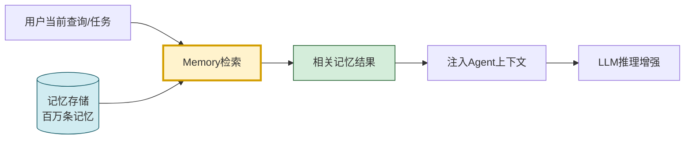

### 1.2 检索功能的核心挑战

| 挑战 | 描述 | 影响 |
|------|------|------|
| **语义理解** | 用户查询与记忆的表述可能完全不同 | 需要语义检索而非关键词匹配 |
| **规模压力** | 记忆数量可能达百万级 | 需要高效索引,毫秒级响应 |
| **相关性判断** | 什么记忆"最相关"? | 需要多维度综合评分 |
| **实时性要求** | Agent推理不能等太久 | 检索延迟需<100ms |
| **结果质量** | 检索结果直接影响Agent决策 | 需要精准过滤噪声 |
| **动态更新** | 记忆不断写入和更新 | 索引需支持实时更新 |

### 1.3 检索功能的六大核心能力

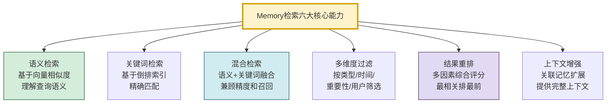

---

## 二、检索系统架构设计

### 2.1 分层架构

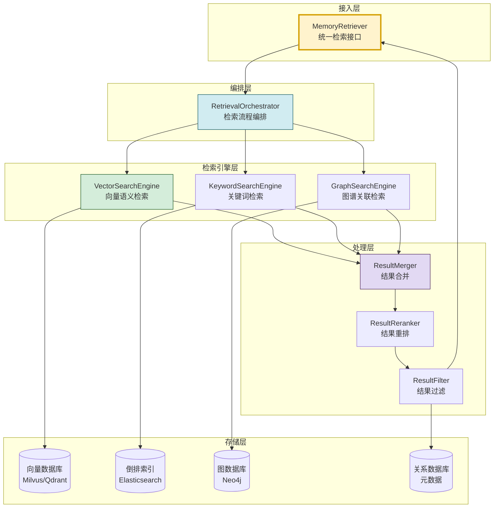

### 2.2 核心模块职责

| 模块 | 职责 | 输入 | 输出 |
|------|------|------|------|
| **MemoryRetriever** | 统一检索入口 | 用户查询+过滤条件 | 记忆结果列表 |
| **RetrievalOrchestrator** | 编排检索流程 | 查询请求 | 各引擎结果 |
| **VectorSearchEngine** | 语义向量检索 | 查询向量 | 语义相似记忆 |
| **KeywordSearchEngine** | 关键词精确检索 | 查询关键词 | 关键词匹配记忆 |
| **GraphSearchEngine** | 图谱关联检索 | 实体/关系 | 关联记忆 |
| **ResultMerger** | 多路结果合并 | 各引擎结果 | 合并结果集 |
| **ResultReranker** | 综合重排 | 合并结果 | 排序结果 |
| **ResultFilter** | 过滤噪声 | 排序结果 | 最终结果 |

### 2.3 检索模式分类

```mermaid
flowchart TB
    subgraph 三种检索模式
        M1[模式1:纯语义检索<br/>仅向量检索<br/>适合:模糊语义查询]
        M2[模式2:纯关键词检索<br/>仅倒排索引<br/>适合:精确名称/ID查找]
        M3[模式3:混合检索<br/>语义+关键词融合<br/>适合:通用场景(推荐)]
    end

    M1 --> S1[优势:理解语义<br/>劣势:可能遗漏精确匹配]
    M2 --> S2[优势:精确匹配<br/>劣势:无法理解语义]
    M3 --> S3[优势:兼顾语义和精确<br/>劣势:计算成本略高]

    style M3 fill:#d4edda,stroke:#155727,stroke-width:3px
    style M1 fill:#d1ecf1,stroke:#0c5460
    style M2 fill:#fff3cd,stroke:#d39e00
```

---

## 三、数据存储结构与索引设计

### 3.1 记忆数据模型

```python
from dataclasses import dataclass, field
from typing import Any, Optional
from enum import Enum
import time
import hashlib


class MemoryType(Enum):
    """记忆类型"""
    EPISODIC = "episodic"       # 情景记忆
    SEMANTIC = "semantic"       # 语义记忆
    PROCEDURAL = "procedural"   # 程序记忆
    PREFERENCE = "preference"   # 偏好记忆
    CONVERSATION = "conversation" # 对话记忆


@dataclass
class MemoryItem:
    """记忆条目(检索的基本单元)"""
    # 基础信息
    memory_id: str                          # 唯一标识
    content: str                            # 记忆内容(文本)
    memory_type: MemoryType                 # 记忆类型

    # 向量信息
    embedding: list[float] = field(default_factory=list)  # 内容向量
    embedding_model: str = ""               # 使用的Embedding模型
    embedding_dim: int = 0                  # 向量维度

    # 元数据
    user_id: str = ""                       # 用户标识
    session_id: str = ""                    # 会话标识
    timestamp: float = field(default_factory=time.time)  # 创建时间
    last_accessed: float = field(default_factory=time.time)  # 最后访问时间
    access_count: int = 0                   # 访问次数
    importance: float = 0.5                 # 重要性分数(0-1)

    # 关键词(用于倒排索引)
    keywords: list[str] = field(default_factory=list)
    content_hash: str = ""                  # 内容哈希(去重)

    # 图谱信息
    entities: list[str] = field(default_factory=list)      # 实体列表
    relations: list[dict] = field(default_factory=list)    # 关系列表

    # 扩展信息
    tags: list[str] = field(default_factory=list)          # 标签
    source: str = ""                                       # 来源
    metadata: dict = field(default_factory=dict)           # 扩展元数据

    def __post_init__(self):
        if not self.content_hash:
            self.content_hash = hashlib.md5(
                self.content.encode()
            ).hexdigest()

    def to_dict(self) -> dict:
        return {
            "memory_id": self.memory_id,
            "content": self.content,
            "memory_type": self.memory_type.value,
            "embedding": self.embedding,
            "user_id": self.user_id,
            "session_id": self.session_id,
            "timestamp": self.timestamp,
            "last_accessed": self.last_accessed,
            "access_count": self.access_count,
            "importance": self.importance,
            "keywords": self.keywords,
            "entities": self.entities,
            "tags": self.tags,
            "source": self.source,
            "metadata": self.metadata
        }
```

### 3.2 三层索引结构

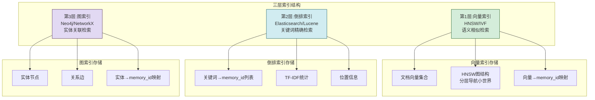

### 3.3 索引构建实现

```python
class MemoryIndexBuilder:
    """记忆索引构建器"""

    def __init__(self, vector_store, keyword_index, graph_store):
        self.vector_store = vector_store       # 向量数据库
        self.keyword_index = keyword_index     # 倒排索引
        self.graph_store = graph_store         # 图数据库

    def build_indexes(self, memories: list[MemoryItem]):
        """为记忆集合构建三层索引"""
        # 1. 构建向量索引
        self._build_vector_index(memories)

        # 2. 构建倒排索引
        self._build_keyword_index(memories)

        # 3. 构建图索引
        self._build_graph_index(memories)

    def _build_vector_index(self, memories: list[MemoryItem]):
        """构建向量索引(HNSW)"""
        vectors = [m.embedding for m in memories if m.embedding]
        ids = [m.memory_id for m in memories if m.embedding]

        # 批量插入向量数据库
        self.vector_store.add_vectors(
            ids=ids,
            vectors=vectors,
            metadatas=[{
                "memory_id": m.memory_id,
                "user_id": m.user_id,
                "type": m.memory_type.value,
                "timestamp": m.timestamp,
                "importance": m.importance
            } for m in memories if m.embedding]
        )

    def _build_keyword_index(self, memories: list[MemoryItem]):
        """构建倒排索引"""
        for memory in memories:
            # 提取关键词(实际用jieba/分词工具)
            keywords = memory.keywords or self._extract_keywords(memory.content)

            # 建立关键词→记忆映射
            doc = {
                "memory_id": memory.memory_id,
                "content": memory.content,
                "keywords": keywords,
                "user_id": memory.user_id,
                "type": memory.memory_type.value,
                "timestamp": memory.timestamp
            }
            self.keyword_index.index_document(doc)

    def _build_graph_index(self, memories: list[MemoryItem]):
        """构建图索引(实体-关系)"""
        for memory in memories:
            # 添加实体节点
            for entity in memory.entities:
                self.graph_store.add_node(
                    entity,
                    properties={"type": "entity", "source": memory.memory_id}
                )

            # 添加关系边
            for relation in memory.relations:
                self.graph_store.add_edge(
                    relation["source"],
                    relation["target"],
                    relation_type=relation.get("relation", "related"),
                    memory_id=memory.memory_id
                )

    def _extract_keywords(self, content: str) -> list[str]:
        """提取关键词(简化实现)"""
        # 实际使用jieba.analyse或TF-IDF
        import re
        # 简单分词(实际用专业分词工具)
        words = re.findall(r'[\u4e00-\u9fff]+|[a-zA-Z]+', content)
        return [w for w in words if len(w) >= 2]

    def update_index(self, memory: MemoryItem, operation: str = "add"):
        """增量更新索引"""
        if operation == "add":
            self._build_vector_index([memory])
            self._build_keyword_index([memory])
            self._build_graph_index([memory])
        elif operation == "delete":
            self.vector_store.delete(memory.memory_id)
            self.keyword_index.delete_document(memory.memory_id)
            self.graph_store.delete_memory_relations(memory.memory_id)
        elif operation == "update":
            self.update_index(memory, "delete")
            self.update_index(memory, "add")
```

---

## 四、检索算法原理深度解析

### 4.1 向量语义检索原理

```mermaid
flowchart TB
    subgraph 向量检索原理
        direction TB
        Q[用户查询] --> QE[查询向量化<br/>Embedding模型]
        QE --> QV[查询向量 q]

        D[记忆向量集合] --> ANN[ANN近似最近邻搜索]
        QV --> ANN

        ANN --> CANDIDATES[候选记忆集合<br/>Top-N]
        CANDIDATES --> SIM[精确相似度计算]
        SIM --> RANK[按相似度排序]
        RANK --> TOPK[Top-K结果]
    end

    subgraph ANN算法
        A1[HNSW<br/>分层可导航小世界<br/>O(logN)查询]
        A2[IVF<br/>倒排文件+聚类<br/>O(N/nlist)]
    end

    style QE fill:#d4edda,stroke:#155727
    style ANN fill:#fff3cd,stroke:#d39e00,stroke-width:3px
    style SIM fill:#d1ecf1,stroke:#0c5460
```

```python
import numpy as np
from typing import List, Tuple


class VectorSearchEngine:
    """向量语义检索引擎"""

    def __init__(self, vector_store, embedding_model):
        self.store = vector_store
        self.model = embedding_model

    def search(self, query: str, top_k: int = 10,
               filter_dict: dict = None) -> List[dict]:
        """向量语义检索"""
        # 步骤1:查询向量化
        query_vector = self.model.embed_query(query)

        # 步骤2:ANN近似检索(粗排,获取候选集)
        candidates = self.store.similarity_search_by_vector(
            embedding=query_vector,
            k=top_k * 3,  # 多取3倍用于精排
            filter=filter_dict
        )

        # 步骤3:精确相似度计算(精排)
        scored_results = []
        for result in candidates:
            doc_vector = result.get("embedding", [])
            if doc_vector:
                score = self._cosine_similarity(query_vector, doc_vector)
            else:
                score = result.get("score", 0.0)
            scored_results.append({
                **result,
                "vector_score": score
            })

        # 步骤4:按相似度排序
        scored_results.sort(key=lambda x: x["vector_score"], reverse=True)

        return scored_results[:top_k]

    def search_by_vector(self, query_vector: list[float],
                          top_k: int = 10,
                          filter_dict: dict = None) -> List[dict]:
        """直接使用向量检索(避免重复向量化)"""
        results = self.store.similarity_search_by_vector(
            embedding=query_vector,
            k=top_k,
            filter=filter_dict
        )
        return results

    def _cosine_similarity(self, vec1: list[float],
                            vec2: list[float]) -> float:
        """计算余弦相似度"""
        a = np.array(vec1)
        b = np.array(vec2)
        dot = np.dot(a, b)
        norm_a = np.linalg.norm(a)
        norm_b = np.linalg.norm(b)
        if norm_a == 0 or norm_b == 0:
            return 0.0
        return float(dot / (norm_a * norm_b))

    def batch_search(self, queries: list[str],
                      top_k: int = 10) -> list[list[dict]]:
        """批量检索(提升吞吐量)"""
        query_vectors = self.model.embed_documents(queries)
        results = []
        for vec in query_vectors:
            result = self.search_by_vector(vec, top_k)
            results.append(result)
        return results
```

### 4.2 关键词检索原理

```python
class KeywordSearchEngine:
    """关键词检索引擎(基于倒排索引)"""

    def __init__(self, keyword_index):
        self.index = keyword_index  # Elasticsearch/Lucene索引

    def search(self, query: str, top_k: int = 10,
               filter_dict: dict = None) -> List[dict]:
        """关键词检索"""
        # 步骤1:查询分词
        keywords = self._tokenize(query)

        # 步骤2:倒排索引查询
        results = self.index.search(
            query={
                "bool": {
                    "must": [{"terms": {"keywords": keywords}}],
                    "filter": self._build_filter(filter_dict)
                }
            },
            size=top_k * 2
        )

        # 步骤3:计算BM25分数
        scored_results = []
        for hit in results["hits"]["hits"]:
            scored_results.append({
                "memory_id": hit["_source"]["memory_id"],
                "content": hit["_source"]["content"],
                "keyword_score": hit["_score"],
                "matched_keywords": self._get_matched_keywords(
                    keywords, hit["_source"].get("keywords", [])
                )
            })

        # 步骤4:按BM25分数排序
        scored_results.sort(key=lambda x: x["keyword_score"], reverse=True)

        return scored_results[:top_k]

    def _tokenize(self, query: str) -> list[str]:
        """查询分词"""
        # 实际使用jieba等分词工具
        import re
        words = re.findall(r'[\u4e00-\u9fff]+|[a-zA-Z]+', query)
        return [w.lower() for w in words if len(w) >= 1]

    def _build_filter(self, filter_dict: dict) -> list:
        """构建过滤条件"""
        if not filter_dict:
            return []
        filters = []
        for key, value in filter_dict.items():
            filters.append({"term": {key: value}})
        return filters

    def _get_matched_keywords(self, query_keywords: list[str],
                                doc_keywords: list[str]) -> list[str]:
        """获取匹配的关键词"""
        return list(set(query_keywords) & set(doc_keywords))
```

### 4.3 混合检索融合算法

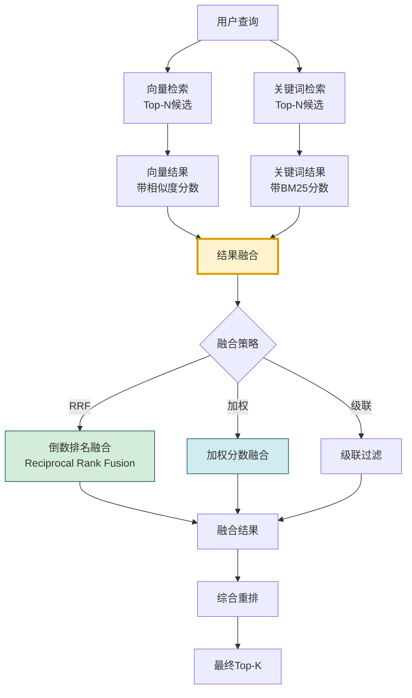

```python
class HybridSearchEngine:
    """混合检索引擎(语义+关键词融合)"""

    def __init__(self, vector_engine: VectorSearchEngine,
                 keyword_engine: KeywordSearchEngine):
        self.vector_engine = vector_engine
        self.keyword_engine = keyword_engine

    def search(self, query: str, top_k: int = 10,
               filter_dict: dict = None,
               fusion_method: str = "rrf") -> List[dict]:
        """混合检索"""
        # 1. 并行执行两路检索
        vector_results = self.vector_engine.search(
            query, top_k=top_k * 2, filter_dict=filter_dict
        )
        keyword_results = self.keyword_engine.search(
            query, top_k=top_k * 2, filter_dict=filter_dict
        )

        # 2. 结果融合
        if fusion_method == "rrf":
            merged = self._reciprocal_rank_fusion(
                vector_results, keyword_results
            )
        elif fusion_method == "weighted":
            merged = self._weighted_fusion(
                vector_results, keyword_results
            )
        else:
            merged = self._cascade_fusion(
                vector_results, keyword_results
            )

        return merged[:top_k]

    def _reciprocal_rank_fusion(self, vector_results: list,
                                  keyword_results: list,
                                  k: int = 60) -> list[dict]:
        """倒数排名融合(RRF) - 最推荐的融合方法

        公式: score(d) = Σ 1/(k + rank_i(d))

        优势:
        - 无需分数归一化(只用排名)
        - 对不同检索器的分数尺度不敏感
        - 简单高效
        """
        scores = {}
        memory_map = {}

        # 向量结果按排名计算RRF分数
        for rank, result in enumerate(vector_results):
            mid = result.get("memory_id", "")
            rrf_score = 1.0 / (k + rank + 1)
            scores[mid] = scores.get(mid, 0) + rrf_score
            if mid not in memory_map:
                memory_map[mid] = result

        # 关键词结果按排名计算RRF分数
        for rank, result in enumerate(keyword_results):
            mid = result.get("memory_id", "")
            rrf_score = 1.0 / (k + rank + 1)
            scores[mid] = scores.get(mid, 0) + rrf_score
            if mid not in memory_map:
                memory_map[mid] = result

        # 按融合分数排序
        ranked_ids = sorted(scores.keys(),
                            key=lambda x: scores[x], reverse=True)

        return [
            {**memory_map[mid], "fusion_score": scores[mid]}
            for mid in ranked_ids
        ]

    def _weighted_fusion(self, vector_results: list,
                          keyword_results: list,
                          vector_weight: float = 0.6,
                          keyword_weight: float = 0.4) -> list[dict]:
        """加权分数融合

        需要先将分数归一化到[0,1]
        """
        # 归一化向量分数
        vec_scores = [r.get("vector_score", 0) for r in vector_results]
        vec_max = max(vec_scores) if vec_scores else 1
        vec_min = min(vec_scores) if vec_scores else 0
        vec_range = vec_max - vec_min if vec_max > vec_min else 1

        # 归一化关键词分数
        kw_scores = [r.get("keyword_score", 0) for r in keyword_results]
        kw_max = max(kw_scores) if kw_scores else 1
        kw_min = min(kw_scores) if kw_scores else 0
        kw_range = kw_max - kw_min if kw_max > kw_min else 1

        scores = {}
        memory_map = {}

        for result in vector_results:
            mid = result.get("memory_id", "")
            norm_score = (result.get("vector_score", 0) - vec_min) / vec_range
            scores[mid] = scores.get(mid, 0) + vector_weight * norm_score
            memory_map[mid] = result

        for result in keyword_results:
            mid = result.get("memory_id", "")
            norm_score = (result.get("keyword_score", 0) - kw_min) / kw_range
            scores[mid] = scores.get(mid, 0) + keyword_weight * norm_score
            if mid not in memory_map:
                memory_map[mid] = result

        ranked_ids = sorted(scores.keys(),
                            key=lambda x: scores[x], reverse=True)
        return [
            {**memory_map[mid], "fusion_score": scores[mid]}
            for mid in ranked_ids
        ]

    def _cascade_fusion(self, vector_results: list,
                         keyword_results: list) -> list[dict]:
        """级联融合:先用关键词过滤,再用向量排序"""
        kw_ids = {r.get("memory_id") for r in keyword_results}
        filtered = [r for r in vector_results
                    if r.get("memory_id") in kw_ids]
        return filtered if filtered else vector_results
```

### 4.4 三种融合算法对比

| 融合算法 | 原理 | 优点 | 缺点 | 推荐度 |
|---------|------|------|------|:------:|
| **RRF(倒数排名融合)** | 基于排名,无需归一化 | 简单、鲁棒、无需调参 | 忽略分数差异 | ⭐⭐⭐⭐⭐ |
| **加权融合** | 归一化后加权求和 | 可调节权重,利用分数 | 需调参,对尺度敏感 | ⭐⭐⭐⭐ |
| **级联融合** | 一路过滤,另一路排序 | 精准过滤 | 可能过度限制召回 | ⭐⭐⭐ |

---

## 五、核心模块实现

### 5.1 检索编排器

```python
from dataclasses import dataclass
from typing import Optional
import asyncio
import time


@dataclass
class RetrievalRequest:
    """检索请求"""
    query: str                               # 查询文本
    user_id: str = ""                        # 用户ID
    session_id: str = ""                     # 会话ID
    memory_types: list[MemoryType] = None    # 记忆类型过滤
    top_k: int = 5                           # 返回数量
    min_score: float = 0.5                   # 最低分数阈值
    time_range: tuple[float, float] = None   # 时间范围
    include_context: bool = True             # 是否包含关联上下文
    search_mode: str = "hybrid"              # 检索模式


@dataclass
class RetrievalResult:
    """检索结果"""
    memory: MemoryItem                       # 记忆条目
    score: float                             # 综合分数
    vector_score: float = 0.0               # 向量相似度
    keyword_score: float = 0.0              # 关键词匹配度
    rank: int = 0                            # 排名
    matched_keywords: list[str] = None       # 匹配的关键词


class RetrievalOrchestrator:
    """检索流程编排器"""

    def __init__(self, vector_engine: VectorSearchEngine,
                 keyword_engine: KeywordSearchEngine,
                 hybrid_engine: HybridSearchEngine,
                 embedding_model=None):
        self.vector_engine = vector_engine
        self.keyword_engine = keyword_engine
        self.hybrid_engine = hybrid_engine
        self.model = embedding_model

    async def retrieve(self, request: RetrievalRequest) -> list[RetrievalResult]:
        """编排完整检索流程"""
        start_time = time.time()

        # 步骤1:构建过滤条件
        filter_dict = self._build_filter(request)

        # 步骤2:选择检索模式
        if request.search_mode == "vector":
            raw_results = await self._async_vector_search(
                request.query, request.top_k * 2, filter_dict
            )
        elif request.search_mode == "keyword":
            raw_results = await self._async_keyword_search(
                request.query, request.top_k * 2, filter_dict
            )
        else:  # hybrid
            raw_results = await self._async_hybrid_search(
                request.query, request.top_k * 2, filter_dict
            )

        # 步骤3:转换为统一结果格式
        results = self._convert_results(raw_results)

        # 步骤4:阈值过滤
        results = [r for r in results if r.score >= request.min_score]

        # 步骤5:结果截断
        results = results[:request.top_k]

        # 步骤6:设置排名
        for i, result in enumerate(results):
            result.rank = i + 1

        # 步骤7:上下文增强(可选)
        if request.include_context and results:
            results = await self._enhance_with_context(results)

        elapsed = (time.time() - start_time) * 1000
        return results

    def _build_filter(self, request: RetrievalRequest) -> dict:
        """构建过滤条件"""
        filter_dict = {}
        if request.user_id:
            filter_dict["user_id"] = request.user_id
        if request.memory_types:
            filter_dict["type"] = [t.value for t in request.memory_types]
        if request.time_range:
            filter_dict["timestamp"] = {
                "$gte": request.time_range[0],
                "$lte": request.time_range[1]
            }
        return filter_dict

    async def _async_vector_search(self, query: str, top_k: int,
                                     filter_dict: dict) -> list[dict]:
        """异步向量检索"""
        loop = asyncio.get_event_loop()
        return await loop.run_in_executor(
            None, self.vector_engine.search, query, top_k, filter_dict
        )

    async def _async_keyword_search(self, query: str, top_k: int,
                                      filter_dict: dict) -> list[dict]:
        """异步关键词检索"""
        loop = asyncio.get_event_loop()
        return await loop.run_in_executor(
            None, self.keyword_engine.search, query, top_k, filter_dict
        )

    async def _async_hybrid_search(self, query: str, top_k: int,
                                     filter_dict: dict) -> list[dict]:
        """异步混合检索(并行执行两路检索)"""
        # 并行执行向量检索和关键词检索
        vector_task = self._async_vector_search(query, top_k, filter_dict)
        keyword_task = self._async_keyword_search(query, top_k, filter_dict)

        vector_results, keyword_results = await asyncio.gather(
            vector_task, keyword_task
        )

        # 结果融合
        return self.hybrid_engine._reciprocal_rank_fusion(
            vector_results, keyword_results
        )

    def _convert_results(self, raw_results: list[dict]) -> list[RetrievalResult]:
        """转换为统一结果格式"""
        results = []
        for raw in raw_results:
            memory = MemoryItem(
                memory_id=raw.get("memory_id", ""),
                content=raw.get("content", ""),
                memory_type=MemoryType(raw.get("type", "episodic")),
                user_id=raw.get("user_id", ""),
                timestamp=raw.get("timestamp", time.time()),
                importance=raw.get("importance", 0.5),
                keywords=raw.get("keywords", []),
                tags=raw.get("tags", [])
            )
            score = raw.get("fusion_score",
                           raw.get("vector_score",
                                  raw.get("keyword_score", 0)))
            results.append(RetrievalResult(
                memory=memory,
                score=score,
                vector_score=raw.get("vector_score", 0),
                keyword_score=raw.get("keyword_score", 0),
                matched_keywords=raw.get("matched_keywords", [])
            ))
        return results

    async def _enhance_with_context(self,
                                      results: list[RetrievalResult]) -> list[RetrievalResult]:
        """上下文增强:为每个结果添加关联记忆"""
        enhanced = []
        for result in results:
            # 查找关联记忆(基于实体)
            related = await self._find_related_memories(result.memory, top_k=2)
            result.memory.metadata["related_memories"] = related
            enhanced.append(result)
        return enhanced

    async def _find_related_memories(self, memory: MemoryItem,
                                       top_k: int = 2) -> list[str]:
        """查找关联记忆"""
        if not memory.entities:
            return []
        # 基于实体查找关联记忆
        # 简化实现:用实体作为查询进行向量检索
        related = self.vector_engine.search(
            " ".join(memory.entities), top_k=top_k
        )
        return [r.get("memory_id") for r in related
                if r.get("memory_id") != memory.memory_id]
```

### 5.2 统一检索接口

```python
class MemoryRetriever:
    """Memory检索统一接口(对外暴露)"""

    def __init__(self, orchestrator: RetrievalOrchestrator,
                 cache=None):
        self.orchestrator = orchestrator
        self.cache = cache  # 可选的查询缓存

    def retrieve(self, query: str, user_id: str = "",
                 top_k: int = 5, **kwargs) -> list[RetrievalResult]:
        """同步检索接口"""
        request = RetrievalRequest(
            query=query,
            user_id=user_id,
            top_k=top_k,
            **kwargs
        )

        # 检查缓存
        cache_key = self._get_cache_key(request)
        if self.cache:
            cached = self.cache.get(cache_key)
            if cached:
                return cached

        # 执行检索
        import asyncio
        loop = asyncio.new_event_loop()
        try:
            results = loop.run_until_complete(
                self.orchestrator.retrieve(request)
            )
        finally:
            loop.close()

        # 写入缓存
        if self.cache and results:
            self.cache.set(cache_key, results, ttl=300)  # 5分钟缓存

        return results

    async def aretrieve(self, query: str, user_id: str = "",
                         top_k: int = 5, **kwargs) -> list[RetrievalResult]:
        """异步检索接口"""
        request = RetrievalRequest(
            query=query,
            user_id=user_id,
            top_k=top_k,
            **kwargs
        )
        return await self.orchestrator.retrieve(request)

    def retrieve_by_type(self, query: str, memory_type: MemoryType,
                          user_id: str = "", top_k: int = 5) -> list[RetrievalResult]:
        """按记忆类型检索"""
        return self.retrieve(
            query=query,
            user_id=user_id,
            top_k=top_k,
            memory_types=[memory_type]
        )

    def retrieve_recent(self, user_id: str, hours: int = 24,
                         top_k: int = 10) -> list[RetrievalResult]:
        """检索最近的记忆"""
        now = time.time()
        return self.retrieve(
            query="",  # 不需要查询,按时间过滤
            user_id=user_id,
            top_k=top_k,
            time_range=(now - hours * 3600, now),
            search_mode="keyword"
        )

    def retrieve_by_importance(self, user_id: str,
                                min_importance: float = 0.7,
                                top_k: int = 10) -> list[RetrievalResult]:
        """按重要性检索"""
        # 实际实现通过filter过滤
        results = self.retrieve(
            query="",
            user_id=user_id,
            top_k=top_k
        )
        return [r for r in results
                if r.memory.importance >= min_importance]

    def _get_cache_key(self, request: RetrievalRequest) -> str:
        """生成缓存键"""
        import hashlib
        key_str = f"{request.query}_{request.user_id}_{request.top_k}_{request.search_mode}"
        return hashlib.md5(key_str.encode()).hexdigest()
```

---

## 六、完整检索流程实现

### 6.1 端到端检索流程

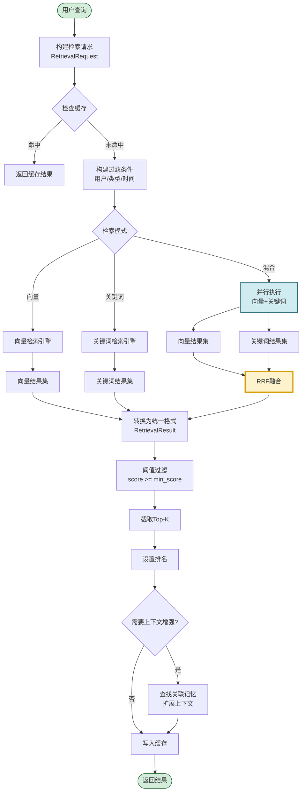

### 6.2 完整调用示例

```python
class MemoryRetrievalExample:
    """Memory检索完整调用示例"""

    def __init__(self):
        # 初始化各组件
        self.embedding_model = self._init_embedding_model()
        self.vector_store = self._init_vector_store()
        self.keyword_index = self._init_keyword_index()

        # 初始化检索引擎
        self.vector_engine = VectorSearchEngine(
            self.vector_store, self.embedding_model
        )
        self.keyword_engine = KeywordSearchEngine(self.keyword_index)
        self.hybrid_engine = HybridSearchEngine(
            self.vector_engine, self.keyword_engine
        )

        # 初始化编排器和接口
        self.orchestrator = RetrievalOrchestrator(
            self.vector_engine,
            self.keyword_engine,
            self.hybrid_engine,
            self.embedding_model
        )
        self.retriever = MemoryRetriever(self.orchestrator)

    def demo_search(self):
        """演示完整检索流程"""
        print("=== Memory检索演示 ===\n")

        # 示例1:混合检索(默认推荐)
        print("--- 示例1:混合检索 ---")
        results = self.retriever.retrieve(
            query="用户上次问的RAG是什么?",
            user_id="user_001",
            top_k=5,
            search_mode="hybrid",
            min_score=0.5
        )
        self._print_results(results)

        # 示例2:按类型检索(只搜索对话记忆)
        print("\n--- 示例2:按类型检索 ---")
        results = self.retriever.retrieve_by_type(
            query="用户偏好",
            memory_type=MemoryType.PREFERENCE,
            user_id="user_001",
            top_k=3
        )
        self._print_results(results)

        # 示例3:检索最近24小时记忆
        print("\n--- 示例3:最近记忆 ---")
        results = self.retriever.retrieve_recent(
            user_id="user_001",
            hours=24,
            top_k=5
        )
        self._print_results(results)

        # 示例4:异步检索
        print("\n--- 示例4:异步检索 ---")
        import asyncio
        results = asyncio.run(self.retriever.aretrieve(
            query="Agent架构设计",
            user_id="user_001",
            top_k=5
        ))
        self._print_results(results)

    def _print_results(self, results: list[RetrievalResult]):
        """打印检索结果"""
        if not results:
            print("  未找到相关记忆")
            return
        for r in results:
            print(f"  [{r.rank}] 分数:{r.score:.4f} "
                  f"| 类型:{r.memory.memory_type.value} "
                  f"| 重要性:{r.memory.importance:.2f}")
            print(f"      内容:{r.memory.content[:80]}...")
            if r.matched_keywords:
                print(f"      匹配关键词:{r.matched_keywords}")
            print()

    def _init_embedding_model(self):
        """初始化Embedding模型"""
        # 实际使用bge-large-zh等模型
        class MockModel:
            def embed_query(self, text):
                return [0.0] * 1024
            def embed_documents(self, texts):
                return [[0.0] * 1024 for _ in texts]
        return MockModel()

    def _init_vector_store(self):
        """初始化向量数据库"""
        # 实际使用Milvus/Qdrant等
        class MockStore:
            def similarity_search_by_vector(self, embedding, k, filter=None):
                return [{"memory_id": f"mem_{i}",
                         "content": f"记忆内容{i}",
                         "embedding": [0.0]*1024,
                         "score": 0.9 - i*0.1,
                         "vector_score": 0.9 - i*0.1}
                        for i in range(min(k, 5))]
            def add_vectors(self, **kwargs): pass
        return MockStore()

    def _init_keyword_index(self):
        """初始化倒排索引"""
        class MockIndex:
            def search(self, query, size):
                hits = [{"_source": {"memory_id": f"mem_{i}",
                                      "content": f"关键词记忆{i}",
                                      "keywords": ["RAG"]},
                         "_score": 10 - i}
                        for i in range(min(size, 3))]
                return {"hits": {"hits": hits}}
            def index_document(self, doc): pass
            def delete_document(self, mid): pass
        return MockIndex()


# 运行示例
# example = MemoryRetrievalExample()
# example.demo_search()
```

---

## 七、检索结果处理与排序

### 7.1 多维度综合评分

```python
class ResultReranker:
    """检索结果重排器(多维度综合评分)"""

    def __init__(self):
        self.weights = {
            "semantic": 0.35,      # 语义相似度
            "keyword": 0.20,       # 关键词匹配
            "importance": 0.20,    # 重要性
            "recency": 0.15,       # 时效性
            "frequency": 0.10      # 访问频率
        }

    def rerank(self, results: list[RetrievalResult],
               query: str = "",
               current_time: float = None) -> list[RetrievalResult]:
        """多维度综合重排"""
        current_time = current_time or time.time()

        for result in results:
            # 1. 语义相似度分数(已由向量检索给出)
            semantic_score = result.vector_score

            # 2. 关键词匹配分数(已由关键词检索给出)
            keyword_score = result.keyword_score if result.keyword_score > 0 else 0

            # 3. 重要性分数
            importance_score = result.memory.importance

            # 4. 时效性分数(越新分数越高,30天半衰期)
            age_days = (current_time - result.memory.timestamp) / 86400
            recency_score = max(0.1, 0.5 ** (age_days / 30))

            # 5. 访问频率分数(被频繁访问的记忆更相关)
            frequency_score = min(1.0, result.memory.access_count / 10)

            # 综合评分
            result.score = (
                self.weights["semantic"] * semantic_score +
                self.weights["keyword"] * keyword_score +
                self.weights["importance"] * importance_score +
                self.weights["recency"] * recency_score +
                self.weights["frequency"] * frequency_score
            )

            # 存储各维度分数(用于调试)
            result.memory.metadata["score_breakdown"] = {
                "semantic": round(semantic_score, 4),
                "keyword": round(keyword_score, 4),
                "importance": round(importance_score, 4),
                "recency": round(recency_score, 4),
                "frequency": round(frequency_score, 4),
                "weighted_total": round(result.score, 4)
            }

        # 按综合分数排序
        results.sort(key=lambda x: x.score, reverse=True)

        # 更新排名
        for i, result in enumerate(results):
            result.rank = i + 1

        return results

    def set_weights(self, **weights):
        """调整权重(不同场景可调)"""
        self.weights.update(weights)
```

### 7.2 评分维度详解

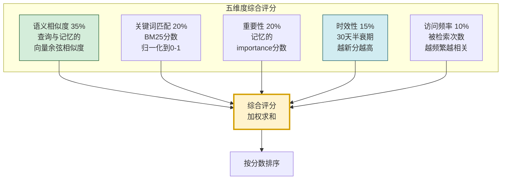

| 评分维度 | 权重 | 计算方法 | 意义 |
|---------|:----:|---------|------|
| **语义相似度** | 35% | 向量余弦相似度 | 查询与记忆的语义匹配度 |
| **关键词匹配** | 20% | BM25分数归一化 | 精确关键词匹配度 |
| **重要性** | 20% | importance字段值 | 记忆本身的重要程度 |
| **时效性** | 15% | 0.5^(天数/30) | 越新的记忆越相关 |
| **访问频率** | 10% | min(1, 次数/10) | 被频繁访问的记忆更相关 |

### 7.3 结果过滤

```python
class ResultFilter:
    """检索结果过滤器"""

    @staticmethod
    def filter_by_score(results: list[RetrievalResult],
                         min_score: float = 0.5) -> list[RetrievalResult]:
        """按最低分数过滤"""
        return [r for r in results if r.score >= min_score]

    @staticmethod
    def filter_by_type(results: list[RetrievalResult],
                        types: list[MemoryType]) -> list[RetrievalResult]:
        """按记忆类型过滤"""
        return [r for r in results if r.memory.memory_type in types]

    @staticmethod
    def filter_by_time(results: list[RetrievalResult],
                        time_range: tuple[float, float]) -> list[RetrievalResult]:
        """按时间范围过滤"""
        return [r for r in results
                if time_range[0] <= r.memory.timestamp <= time_range[1]]

    @staticmethod
    def deduplicate(results: list[RetrievalResult]) -> list[RetrievalResult]:
        """去重(基于内容哈希)"""
        seen = set()
        unique = []
        for r in results:
            if r.memory.content_hash not in seen:
                seen.add(r.memory.content_hash)
                unique.append(r)
        return unique

    @staticmethod
    def filter_sensitive(results: list[RetrievalResult],
                          current_user_id: str) -> list[RetrievalResult]:
        """过滤敏感信息(只返回当前用户的记忆)"""
        return [r for r in results
                if r.memory.user_id == current_user_id
                or not r.memory.user_id]
```

---

## 八、检索性能优化策略

### 8.1 性能优化全景

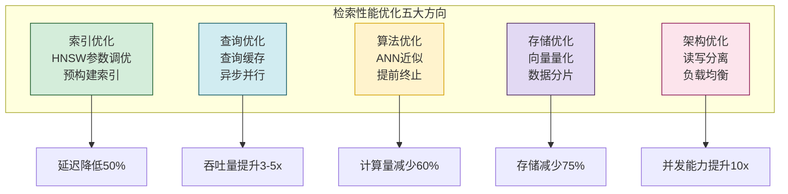

### 8.2 查询缓存实现

```python
from collections import OrderedDict
import threading
import time


class QueryCache:
    """查询缓存(LRU + TTL)"""

    def __init__(self, max_size: int = 1000, ttl: int = 300):
        self.max_size = max_size
        self.ttl = ttl  # 5分钟默认TTL
        self._cache: OrderedDict = OrderedDict()
        self._lock = threading.RLock()
        self._stats = {"hits": 0, "misses": 0}

    def get(self, key: str) -> any:
        """获取缓存"""
        with self._lock:
            if key in self._cache:
                entry = self._cache[key]
                if time.time() - entry["time"] < self.ttl:
                    self._stats["hits"] += 1
                    # 移到末尾(最近使用)
                    self._cache.move_to_end(key)
                    return entry["value"]
                else:
                    del self._cache[key]
            self._stats["misses"] += 1
            return None

    def set(self, key: str, value: any, ttl: int = None):
        """设置缓存"""
        with self._lock:
            if key in self._cache:
                self._cache.move_to_end(key)
            self._cache[key] = {
                "value": value,
                "time": time.time(),
                "ttl": ttl or self.ttl
            }
            # LRU淘汰
            while len(self._cache) > self.max_size:
                self._cache.popitem(last=False)

    def invalidate(self, key: str = None):
        """失效缓存"""
        with self._lock:
            if key:
                self._cache.pop(key, None)
            else:
                self._cache.clear()

    def get_stats(self) -> dict:
        """获取缓存统计"""
        total = self._stats["hits"] + self._stats["misses"]
        return {
            **self._stats,
            "hit_rate": self._stats["hits"] / total if total > 0 else 0,
            "size": len(self._cache),
            "max_size": self.max_size
        }


class QueryOptimizer:
    """查询优化器"""

    def __init__(self):
        self.cache = QueryCache(max_size=1000, ttl=300)

    def optimize_query(self, query: str) -> str:
        """查询预处理优化"""
        # 去除多余空格
        query = " ".join(query.split())
        # 转小写(向量化前)
        query = query.lower().strip()
        return query

    def should_use_cache(self, request: RetrievalRequest) -> bool:
        """判断是否使用缓存"""
        # 频繁查询且不需要实时性的使用缓存
        return bool(request.query) and not request.time_range

    def warmup_cache(self, hot_queries: list[tuple[str, str, int]]):
        """预热缓存(热门查询)

        Args:
            hot_queries: [(query, user_id, top_k), ...]
        """
        for query, user_id, top_k in hot_queries:
            cache_key = f"{query}_{user_id}_{top_k}"
            # 实际执行查询并存入缓存
            # result = self.retriever.retrieve(query, user_id, top_k)
            # self.cache.set(cache_key, result)
            pass
```

### 8.3 异步并行检索

```python
class ParallelSearchOptimizer:
    """并行检索优化器"""

    def __init__(self, vector_engine, keyword_engine, graph_engine=None):
        self.vector_engine = vector_engine
        self.keyword_engine = keyword_engine
        self.graph_engine = graph_engine

    async def parallel_search(self, query: str, top_k: int = 10,
                                filter_dict: dict = None) -> list[dict]:
        """三路并行检索(向量+关键词+图谱)"""
        tasks = [
            self._async_vector(query, top_k, filter_dict),
            self._async_keyword(query, top_k, filter_dict)
        ]
        if self.graph_engine:
            tasks.append(self._async_graph(query, top_k))

        results = await asyncio.gather(*tasks, return_exceptions=True)

        # 过滤异常结果
        valid_results = []
        for result in results:
            if not isinstance(result, Exception):
                valid_results.append(result)

        return valid_results

    async def _async_vector(self, query, top_k, filter_dict):
        loop = asyncio.get_event_loop()
        return ("vector", await loop.run_in_executor(
            None, self.vector_engine.search, query, top_k, filter_dict
        ))

    async def _async_keyword(self, query, top_k, filter_dict):
        loop = asyncio.get_event_loop()
        return ("keyword", await loop.run_in_executor(
            None, self.keyword_engine.search, query, top_k, filter_dict
        ))

    async def _async_graph(self, query, top_k):
        loop = asyncio.get_event_loop()
        return ("graph", await loop.run_in_executor(
            None, self.graph_engine.search, query, top_k
        ))
```

### 8.4 性能优化策略汇总

| 优化策略 | 方法 | 效果 | 实现复杂度 |
|---------|------|------|:---------:|
| **HNSW参数调优** | efSearch=50, M=32 | 延迟降低50% | 低 |
| **查询缓存** | LRU+TTL缓存热门查询 | 吞吐量提升3-5x | 中 |
| **异步并行** | 向量/关键词/图谱并行 | 延迟降低40% | 中 |
| **向量量化** | float32→int8 | 存储减少75% | 中 |
| **数据分片** | 按用户ID/时间分片 | 检索范围缩小 | 高 |
| **预取热门** | 预加载热门用户记忆 | 延迟降低60% | 中 |
| **结果缓存** | 缓存最终结果而非中间结果 | 端到端加速 | 低 |
| **批量检索** | 合并多个查询批量处理 | 吞吐量提升5x | 中 |

---

## 九、检索质量评估

### 9.1 评估指标体系

```python
class RetrievalQualityEvaluator:
    """检索质量评估器"""

    def __init__(self, retriever: MemoryRetriever):
        self.retriever = retriever

    def evaluate(self, eval_set: list[dict],
                 top_k_values: list[int] = [1, 3, 5, 10]) -> dict:
        """评估检索质量

        Args:
            eval_set: [{"query": "...", "relevant_ids": ["id1", "id2"]}]
        """
        results = {}

        for k in top_k_values:
            results[f"recall@{k}"] = []
            results[f"precision@{k}"] = []
        results["mrr"] = []
        results["ndcg@5"] = []

        for item in eval_set:
            query = item["query"]
            relevant_ids = set(item["relevant_ids"])

            # 执行检索
            retrieved = self.retriever.retrieve(query, top_k=max(top_k_values))
            retrieved_ids = [r.memory.memory_id for r in retrieved]

            # 计算各指标
            for k in top_k_values:
                top_k_ids = retrieved_ids[:k]
                # Recall@K
                recall = self._recall(top_k_ids, relevant_ids)
                results[f"recall@{k}"].append(recall)
                # Precision@K
                precision = self._precision(top_k_ids, relevant_ids)
                results[f"precision@{k}"].append(precision)

            # MRR
            mrr = self._mrr(retrieved_ids, relevant_ids)
            results["mrr"].append(mrr)

            # NDCG@5
            ndcg = self._ndcg(retrieved_ids, relevant_ids, 5)
            results["ndcg@5"].append(ndcg)

        # 平均值
        return {k: float(np.mean(v)) for k, v in results.items()}

    def _recall(self, retrieved: list, relevant: set) -> float:
        hits = len(set(retrieved) & relevant)
        return hits / len(relevant) if relevant else 0

    def _precision(self, retrieved: list, relevant: set) -> float:
        hits = len(set(retrieved) & relevant)
        return hits / len(retrieved) if retrieved else 0

    def _mrr(self, retrieved: list, relevant: set) -> float:
        for i, rid in enumerate(retrieved):
            if rid in relevant:
                return 1.0 / (i + 1)
        return 0

    def _ndcg(self, retrieved: list, relevant: set, k: int) -> float:
        dcg = sum(
            (1.0 if retrieved[i] in relevant else 0.0) / np.log2(i + 2)
            for i in range(min(k, len(retrieved)))
        )
        idcg = sum(1.0 / np.log2(i + 2) for i in range(min(k, len(relevant))))
        return dcg / idcg if idcg > 0 else 0

    def evaluate_latency(self, queries: list[str],
                          target_p99_ms: float = 100) -> dict:
        """评估检索延迟"""
        latencies = []
        for query in queries:
            start = time.time()
            self.retriever.retrieve(query, top_k=5)
            latencies.append((time.time() - start) * 1000)

        return {
            "avg_latency_ms": float(np.mean(latencies)),
            "p50_latency_ms": float(np.percentile(latencies, 50)),
            "p95_latency_ms": float(np.percentile(latencies, 95)),
            "p99_latency_ms": float(np.percentile(latencies, 99)),
            "target_p99_ms": target_p99_ms,
            "meets_target": float(np.percentile(latencies, 99)) <= target_p99_ms
        }
```

### 9.2 质量评估指标

| 指标 | 含义 | 理想值 | 权重 |
|------|------|:------:|:----:|
| **Recall@5** | Top-5中相关记忆的比例 | >0.8 | 高 |
| **Precision@5** | Top-5中相关记忆的精确率 | >0.7 | 高 |
| **MRR** | 相关记忆的平均排名倒数 | >0.6 | 高 |
| **NDCG@5** | 归一化折损累积增益 | >0.7 | 中 |
| **P99延迟** | 99分位检索延迟 | <100ms | 高 |
| **缓存命中率** | 查询缓存命中率 | >30% | 中 |

---

## 十、完整调用流程与技术路径

### 10.1 端到端技术路径

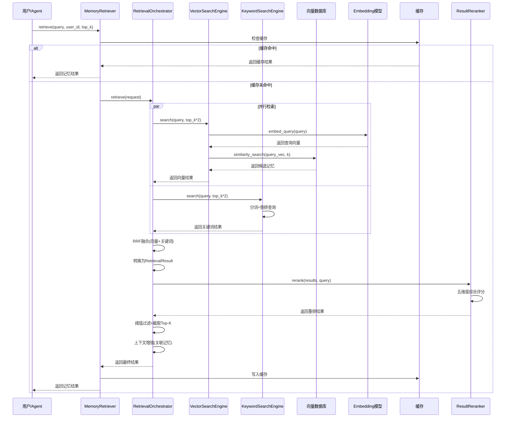

### 10.2 关键步骤实现细节

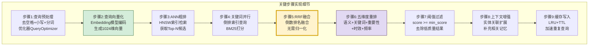

### 10.3 完整技术路径代码

```python
class CompleteRetrievalPipeline:
    """完整检索管道(端到端实现)"""

    def __init__(self):
        # 初始化所有组件
        self.embedding_model = self._init_embedding_model()
        self.vector_store = self._init_vector_store()
        self.keyword_index = self._init_keyword_index()

        # 检索引擎
        self.vector_engine = VectorSearchEngine(
            self.vector_store, self.embedding_model
        )
        self.keyword_engine = KeywordSearchEngine(self.keyword_index)
        self.hybrid_engine = HybridSearchEngine(
            self.vector_engine, self.keyword_engine
        )

        # 优化组件
        self.cache = QueryCache(max_size=1000, ttl=300)
        self.query_optimizer = QueryOptimizer()
        self.reranker = ResultReranker()
        self.filter = ResultFilter()

        # 编排器
        self.orchestrator = RetrievalOrchestrator(
            self.vector_engine, self.keyword_engine,
            self.hybrid_engine, self.embedding_model
        )

    async def search(self, query: str, user_id: str = "",
                      top_k: int = 5, **kwargs) -> list[RetrievalResult]:
        """端到端检索管道"""
        # === 阶段1:查询预处理 ===
        optimized_query = self.query_optimizer.optimize_query(query)
        cache_key = f"{optimized_query}_{user_id}_{top_k}_{kwargs.get('search_mode', 'hybrid')}"

        # === 阶段2:缓存检查 ===
        cached = self.cache.get(cache_key)
        if cached:
            return cached

        # === 阶段3:并行检索 ===
        request = RetrievalRequest(
            query=optimized_query,
            user_id=user_id,
            top_k=top_k,
            **kwargs
        )
        filter_dict = self.orchestrator._build_filter(request)

        # 并行执行向量检索和关键词检索
        vector_task = self._async_vector_search(
            optimized_query, top_k * 3, filter_dict
        )
        keyword_task = self._async_keyword_search(
            optimized_query, top_k * 3, filter_dict
        )
        vector_results, keyword_results = await asyncio.gather(
            vector_task, keyword_task
        )

        # === 阶段4:结果融合(RRF) ===
        merged = self.hybrid_engine._reciprocal_rank_fusion(
            vector_results, keyword_results
        )

        # === 阶段5:转换为统一格式 ===
        results = self.orchestrator._convert_results(merged)

        # === 阶段6:多维度重排 ===
        results = self.reranker.rerank(results, query=optimized_query)

        # === 阶段7:过滤去重 ===
        results = self.filter.deduplicate(results)
        results = self.filter.filter_by_score(results, request.min_score)

        # === 阶段8:截取Top-K ===
        results = results[:top_k]
        for i, r in enumerate(results):
            r.rank = i + 1

        # === 阶段9:上下文增强(可选) ===
        if request.include_context:
            results = await self._enhance_context(results)

        # === 阶段10:缓存写入 ===
        self.cache.set(cache_key, results)

        return results

    async def _async_vector_search(self, query, top_k, filter_dict):
        loop = asyncio.get_event_loop()
        return await loop.run_in_executor(
            None, self.vector_engine.search, query, top_k, filter_dict
        )

    async def _async_keyword_search(self, query, top_k, filter_dict):
        loop = asyncio.get_event_loop()
        return await loop.run_in_executor(
            None, self.keyword_engine.search, query, top_k, filter_dict
        )

    async def _enhance_context(self, results):
        """上下文增强"""
        for result in results:
            if result.memory.entities:
                related = await self._find_related(result.memory, top_k=2)
                result.memory.metadata["related"] = related
        return results

    async def _find_related(self, memory, top_k=2):
        loop = asyncio.get_event_loop()
        related = await loop.run_in_executor(
            None, self.vector_engine.search,
            " ".join(memory.entities), top_k
        )
        return [r.get("memory_id") for r in related
                if r.get("memory_id") != memory.memory_id]

    def _init_embedding_model(self):
        class MockModel:
            def embed_query(self, text): return [0.0] * 1024
            def embed_documents(self, texts): return [[0.0]*1024 for _ in texts]
        return MockModel()

    def _init_vector_store(self):
        class MockStore:
            def similarity_search_by_vector(self, embedding, k, filter=None):
                return [{"memory_id": f"mem_{i}", "content": f"记忆{i}",
                         "embedding": [0.0]*1024, "vector_score": 0.9-i*0.1,
                         "user_id": "u1", "type": "episodic",
                         "timestamp": time.time(), "importance": 0.7,
                         "keywords": ["test"], "tags": []}
                        for i in range(min(k, 5))]
            def add_vectors(self, **kwargs): pass
        return MockStore()

    def _init_keyword_index(self):
        class MockIndex:
            def search(self, query, size):
                return {"hits": {"hits": [
                    {"_source": {"memory_id": f"kw_{i}", "content": f"关键词记忆{i}",
                                 "keywords": ["test"]}, "_score": 10-i}
                    for i in range(min(size, 3))
                ]}}
            def index_document(self, doc): pass
            def delete_document(self, mid): pass
        return MockIndex()
```

---

## 十一、总结与最佳实践

### 11.1 核心要点回顾

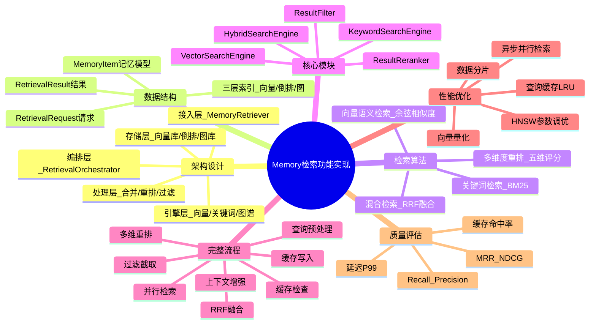

### 11.2 最佳实践

| 实践 | 描述 | 优先级 |
|------|------|:------:|
| **默认用混合检索** | RRF融合兼顾语义和精确 | 高 |
| **必须做重排** | 五维度综合评分提升排序质量 | 高 |
| **启用查询缓存** | LRU+TTL加速重复查询 | 高 |
| **异步并行检索** | 向量和关键词并行执行 | 高 |
| **设置最低分数阈值** | 过滤低质量结果 | 高 |
| **定期重建索引** | 碎片整理,性能维护 | 中 |
| **监控检索质量** | 持续跟踪Recall/MRR | 中 |
| **上下文增强** | 关联记忆扩展提供完整上下文 | 中 |

### 11.3 常见问题与解决方案

| 问题 | 原因 | 解决方案 |
|------|------|---------|
| **检索结果不相关** | 语义模型质量差或阈值过低 | 更换Embedding模型,提高阈值 |
| **检索延迟高** | 索引未优化或未使用缓存 | 优化HNSW参数,启用缓存 |
| **召回率低** | 仅用单一检索方式 | 切换为混合检索 |
| **结果重复** | 未做去重 | 添加content_hash去重 |
| **缓存命中率低** | 查询变化大或TTL过短 | 增加TTL,优化缓存键 |
| **向量检索慢** | 数据量大无索引 | 构建HNSW索引 |
| **关键词检索漏召回** | 分词不准确 | 优化分词器,使用专业词典 |

### 11.4 与系列文档的关系

- [77Agent长期记忆系统完整设计方案.md](./77Agent长期记忆系统完整设计方案.md):77号是设计方案(含检索算法概述),本文是完整实现
- [78Agent Memory数据存储方案深度解析.md](./78Agent%20Memory数据存储方案深度解析.md):78号是存储方案,本文第三章索引设计与存储方案呼应
- [79Agent Memory内存管理与无限增长防护深度解析.md](./79Agent%20Memory内存管理与无限增长防护深度解析.md):79号是内存管理,本文缓存策略与之呼应
- [75Agent记忆系统类型分类深度解析.md](./75Agent记忆系统类型分类深度解析.md):记忆类型定义,本文MemoryType枚举与之对应
- [76短期记忆与长期记忆核心区别深度解析.md](./76短期记忆与长期记忆核心区别深度解析.md):短期vs长期,本文检索同时覆盖两种记忆

### 11.5 核心结论

> **Memory 检索是 Agent 记忆系统的"取用"环节——再多的记忆如果检索不到也毫无价值。** 本文实现的完整检索管道,通过**三层索引(向量+倒排+图)×三路并行检索×RRF融合×五维度重排**,实现了从语义理解到精确匹配的全覆盖,从毫秒级响应到高质量结果的平衡。核心架构是:MemoryRetriever(统一接口)→ RetrievalOrchestrator(流程编排)→ VectorSearchEngine + KeywordSearchEngine(并行检索)→ HybridSearchEngine(RRF融合)→ ResultReranker(五维重排)→ ResultFilter(过滤去重),每一层各司其职,共同构成完整的检索技术路径。

---

> **相关文档**
>
> - [77Agent长期记忆系统完整设计方案.md](./77Agent长期记忆系统完整设计方案.md):长期记忆系统设计(含检索算法概述)
> - [78Agent Memory数据存储方案深度解析.md](./78Agent%20Memory数据存储方案深度解析.md):数据存储方案(检索的存储基础)
> - [79Agent Memory内存管理与无限增长防护深度解析.md](./79Agent%20Memory内存管理与无限增长防护深度解析.md):内存管理(检索缓存的基础)
> - [75Agent记忆系统类型分类深度解析.md](./75Agent记忆系统类型分类深度解析.md):记忆类型分类
> - [76短期记忆与长期记忆核心区别深度解析.md](./76短期记忆与长期记忆核心区别深度解析.md):短期vs长期记忆
