# Agent Memory 记忆与 RAG 检索增强生成核心区别深度解析

> **文档定位**:在 `5Agent Memory` 系列背景下,本文系统对比 Memory(记忆)与 RAG(检索增强生成)两种技术方案的核心差异。从定义原理、架构组成、数据处理流程、应用场景、优缺点、在 Agent 系统中的作用、适用条件七个维度进行深度剖析,帮助读者清晰区分两种技术的本质不同,并为实际项目中的技术选型提供决策依据。
>
> **阅读建议**:建议先阅读 [74Agent记忆系统核心价值与必要性解析.md](74Agent记忆系统核心价值与必要性解析.md) 建立 Memory 认知基础,再结合 `4RAG 检索增强生成` 系列文档(如 [52RAG工作流程详解.md](../4RAG%20检索增强生成/52RAG工作流程详解.md))理解 RAG 核心原理,最后阅读本文对比两者差异。

---

## 目录

- [一、引言:两种容易混淆的技术](#一引言两种容易混淆的技术)
- [二、定义与核心原理对比](#二定义与核心原理对比)
- [三、技术架构组成对比](#三技术架构组成对比)
- [四、数据处理流程对比](#四数据处理流程对比)
- [五、应用场景特点对比](#五应用场景特点对比)
- [六、优缺点对比](#六优缺点对比)
- [七、在 Agent 系统中的典型作用](#七在-agent-系统中的典型作用)
- [八、适用条件差异与选型决策](#八适用条件差异与选型决策)
- [九、协同组合模式](#九协同组合模式)
- [十、总结与最佳实践](#十总结与最佳实践)

---

## 一、引言:两种容易混淆的技术

### 1.1 为什么容易混淆

Memory 和 RAG 是 Agent 系统中两个**高度相关但本质不同**的技术方案。许多初学者容易混淆二者,因为它们在表面上有一些相似之处:

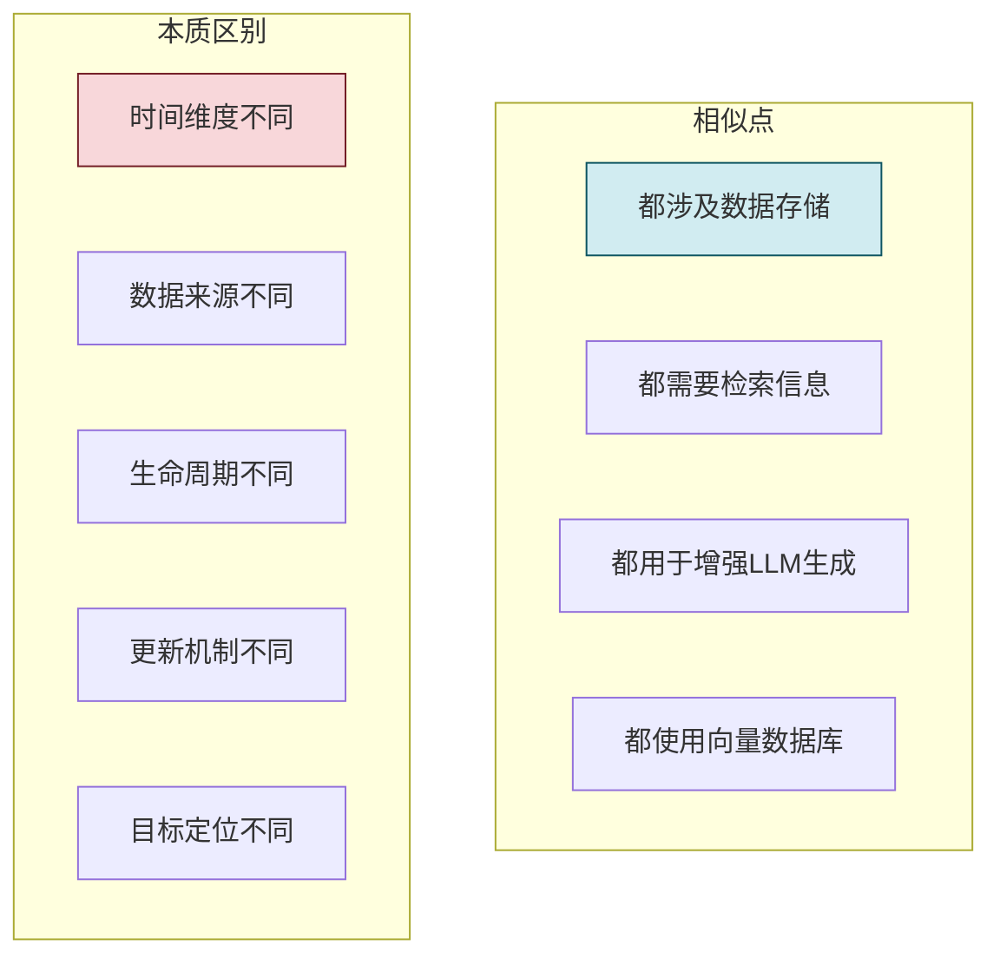

**表面相似点**:
- 都需要存储信息、检索信息
- 都将检索到的内容作为上下文输入给 LLM
- 都可以使用向量数据库作为存储引擎
- 都属于 LLM 之外的"外部知识增强"

**本质不同**:
- **时间维度**:Memory 关注"时间序列上的历史积累",RAG 关注"某一瞬间的知识库检索"
- **数据来源**:Memory 数据来自 Agent 自身交互历史,RAG 数据来自外部文档/知识库
- **生命周期**:Memory 与 Agent 共生,持续增长演化;RAG 知识库相对静态,定期更新
- **更新机制**:Memory 是增量、自动、实时的;RAG 往往是批量、人工、定期的
- **目标定位**:Memory 让 Agent "记住经历、学会成长";RAG 让 Agent "查阅资料、获取知识"

### 1.2 一句话直观区分

| 类比 | 说明 |
|------|------|
| **Memory = 个人记忆** | 你自己过去的经历、学到的教训、熟悉的人、养成的习惯 |
| **RAG = 图书馆/参考书** | 你从书架上取下来查阅的外部资料、工具书、百科全书 |

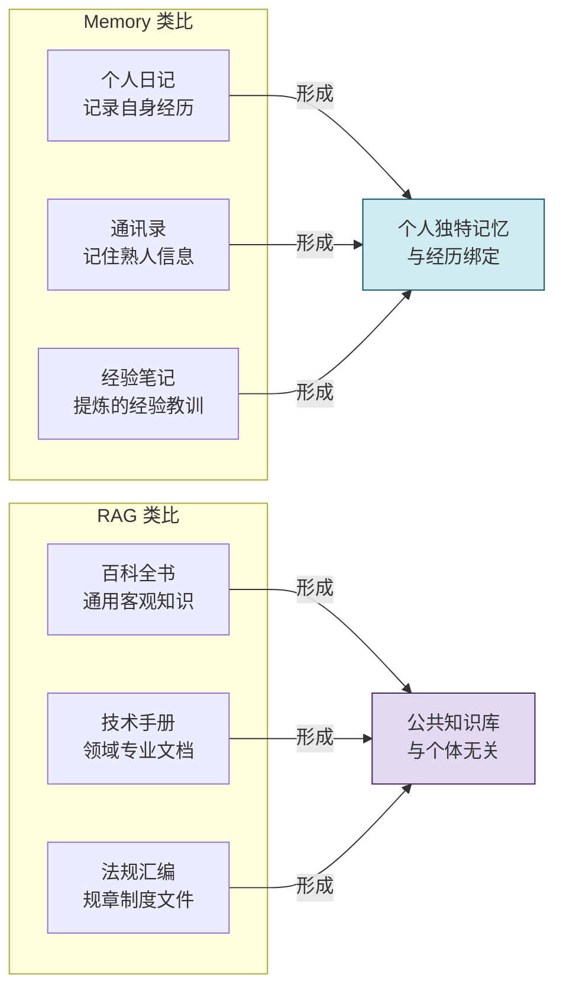

---

## 二、定义与核心原理对比

### 2.1 各自定义

#### 2.1.1 Agent Memory 定义

**Agent Memory(智能体记忆)** 是 Agent 用于**记录自身交互历史、积累经验、维持身份连续性**的系统性机制。它存储的是**"这个 Agent 经历过什么、做过什么、遇到过什么"**。

核心关键词:**个体历史、经验积累、身份延续**。

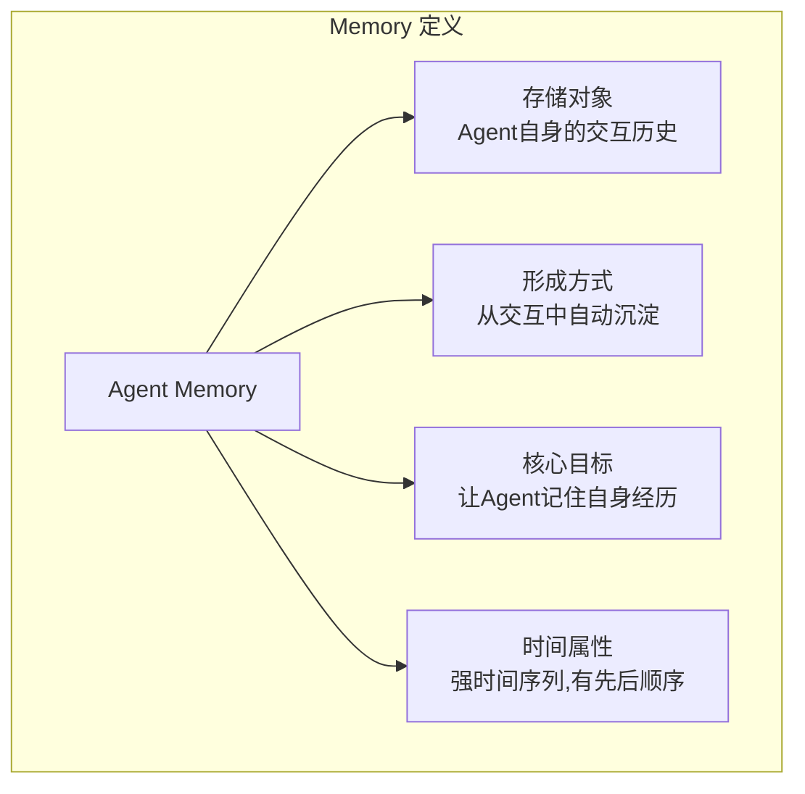

#### 2.1.2 RAG 定义

**RAG(检索增强生成)** 是一种通过**从外部知识库中检索相关文档片段**,并将其作为上下文输入给 LLM,以增强生成质量的技术方案。它存储的是**"有哪些外部资料可以查阅"**。

核心关键词:**外部知识、资料检索、信息增强**。

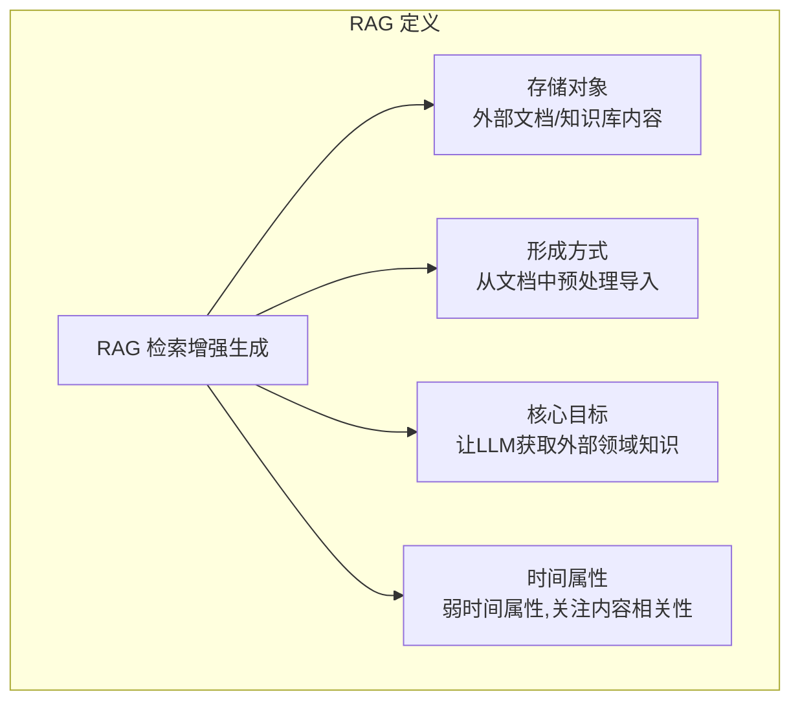

### 2.2 核心原理对比

| 对比维度 | Agent Memory | RAG 检索增强生成 |
|---------|-------------|----------------|
| **核心思想** | 从**自身历史**中检索可复用经验 | 从**外部知识库**中检索相关资料 |
| **数据来源** | Agent 自己的对话、决策、行动、结果 | 文档、PDF、网页、数据库记录等外部资料 |
| **时间敏感性** | 极高(上周的对话和昨天的对话差异巨大) | 低(2020年和2024年的手册都可能有用) |
| **个体相关性** | 高度相关(每个 Agent 有自己独特的记忆) | 无关(同一个知识库可以服务多个 Agent) |
| **更新触发** | 事件驱动(每次交互后自动追加) | 数据驱动(文档发布或更新时批量导入) |
| **典型内容** | "用户张三喜欢简洁回答,上次推荐了方案A" | "《Python手册》中多线程定义如下..." |

### 2.3 原理示意对比

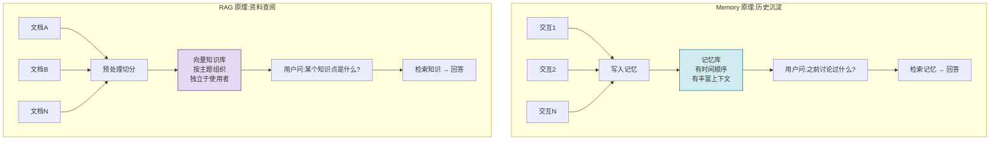

---

## 三、技术架构组成对比

### 3.1 Memory 系统架构

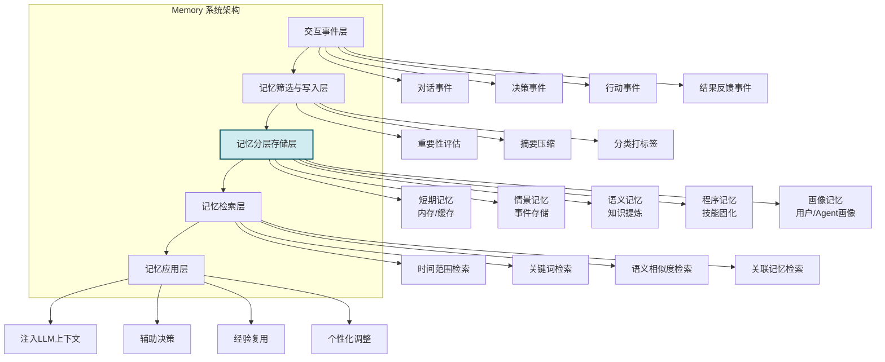

Memory 架构的 **5 大核心模块**:
1. **交互事件层**:捕获 Agent 的每一次交互、决策、行动
2. **记忆筛选层**:决定哪些信息值得记住(重要性评估、去重、摘要)
3. **分层存储层**:短期/情景/语义/程序/画像,多类型存储
4. **记忆检索层**:支持时间、关键词、语义、关联四种检索方式
5. **记忆应用层**:将记忆注入决策和生成过程

### 3.2 RAG 系统架构

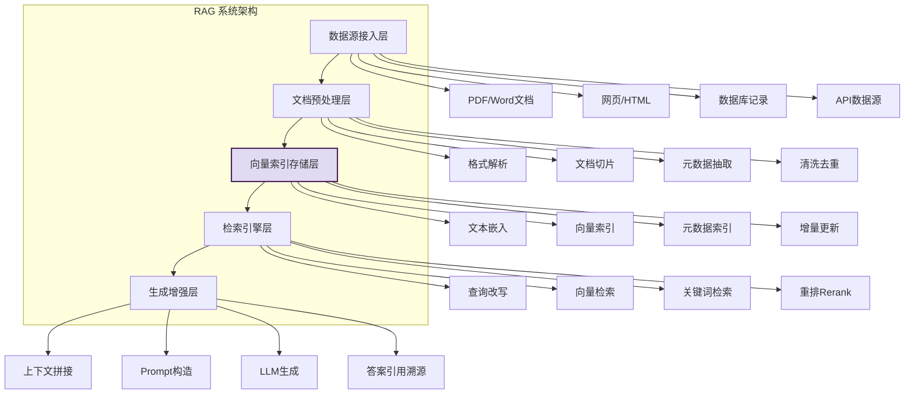

RAG 架构的 **5 大核心模块**:
1. **数据源接入层**:接入各种格式的外部文档和数据
2. **预处理层**:解析、切片、清洗、元数据抽取
3. **向量索引层**:嵌入、建索引、存储、增量更新
4. **检索引擎层**:查询改写、混合检索、重排
5. **生成增强层**:拼接上下文、构造 Prompt、LLM 生成、溯源

### 3.3 架构对比汇总表

| 架构模块 | Memory 系统 | RAG 系统 | 核心差异 |
|---------|-----------|---------|---------|
| **数据接入** | 交互事件(对话/决策/行动) | 外部文档(PDF/网页/DB) | 来源完全不同:自身 vs 外部 |
| **预处理** | 重要性评估、摘要、分类 | 格式解析、切片、清洗 | 处理目标不同:记忆筛选 vs 文档切片 |
| **存储层** | 分层多类型(情景/语义/画像等) | 向量+元数据双索引 | Memory 结构更丰富 |
| **检索层** | 时间+关键词+语义+关联 | 查询改写+混合检索+重排 | Memory 强调时间维度,RAG 强调相关性精度 |
| **应用层** | 决策辅助+经验复用+个性化 | 知识增强+答案溯源 | 应用目标不同 |
| **更新模式** | 实时事件触发追加 | 批量定时导入更新 | 实时 vs 批量 |

---

## 四、数据处理流程对比

### 4.1 Memory 数据处理流程(写入路径)

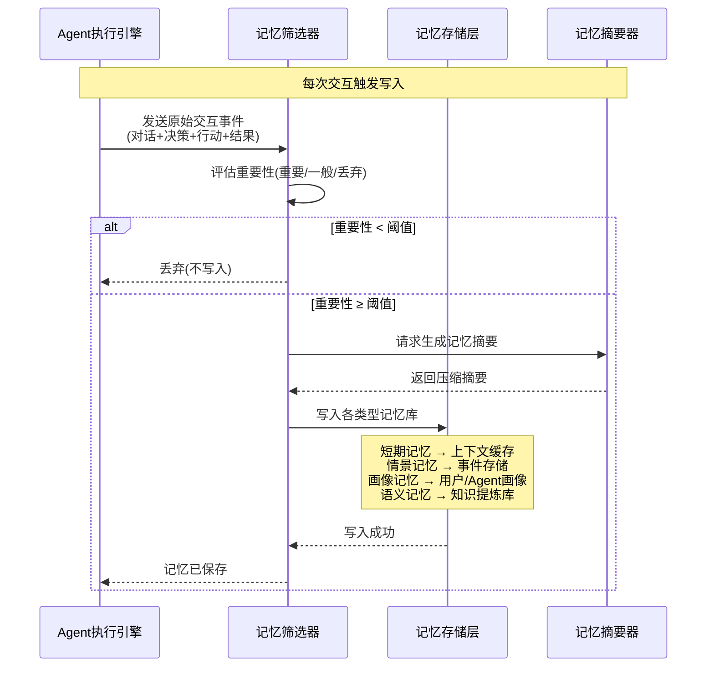

**Memory 写入特点**:
- **触发时机**:每次交互完成后自动触发
- **处理频率**:高频(每次对话、每步决策)
- **数据量**:单条小,总量随时间线性增长
- **关键动作**:重要性评估是核心(否则记忆无限膨胀)

### 4.2 RAG 数据处理流程(写入路径)

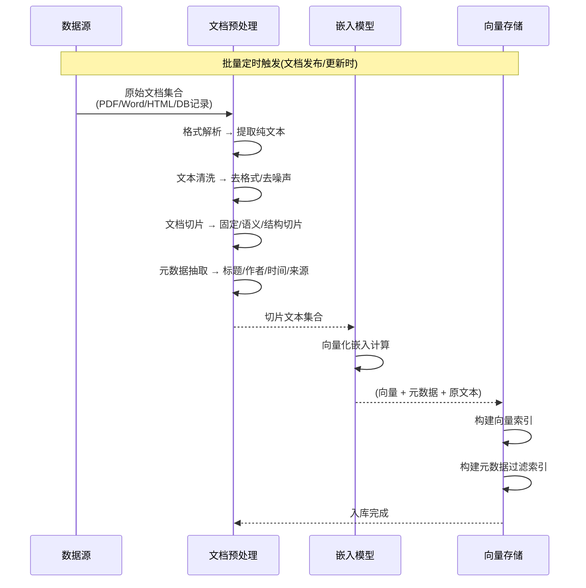

**RAG 写入特点**:
- **触发时机**:文档发布、更新、定期巡检时批量触发
- **处理频率**:低频(天/周级,或事件触发)
- **数据量**:单批大,总量取决于知识库规模
- **关键动作**:切片策略是核心(过大过小都影响检索精度)

### 4.3 检索流程对比

```mermaid
flowchart LR
    subgraph Memory 检索流程
        M1[接收用户查询<br/>"上次我们讨论过什么方案?"]
        M1 --> M2[多维度筛选]
        M2 --> M21[时间范围:最近30天]
        M2 --> M22[关联对象:用户张三]
        M2 --> M23[关键词:方案]
        M2 --> M3[语义相似度匹配]
        M3 --> M4[关联记忆扩展<br/>同次会话的相关记忆]
        M4 --> M5[按时序排序<br/>从新到旧]
        M5 --> M6[拼接为对话历史上下文]
    end

    subgraph RAG 检索流程
        R1[接收用户查询<br/>"多线程和多进程有什么区别?"]
        R1 --> R2[查询预处理]
        R2 --> R21[关键词提取]
        R2 --> R22[同义词扩展]
        R2 --> R23[查询改写]
        R2 --> R3[双通道检索]
        R3 --> R31[向量检索<br/>Top 20]
        R3 --> R32[关键词检索<br/>BM25 Top 20]
        R3 --> R4[融合重排<br/>RRF+Rerank Top 5]
        R4 --> R5[上下文拼接<br/>引用来源标注]
    end

    style M6 fill:#d1ecf1,stroke:#0c5460
    style R5 fill:#e2d9f3,stroke:#4a235a
```

### 4.4 流程对比汇总

| 流程维度 | Memory | RAG |
|---------|--------|-----|
| **写入频率** | 高频实时(每次交互) | 低频批量(文档更新) |
| **写入关键动作** | 重要性评估、摘要压缩 | 切片策略、嵌入模型选择 |
| **检索核心约束** | 时间范围、关联对象 | 语义相似度、关键词匹配 |
| **检索排序方式** | 时间序(新→旧)为主 | 相关度序(高→低)为主 |
| **检索后处理** | 关联记忆扩展、上下文重建 | 重排、溯源引用标注 |
| **注入 LLM 方式** | 对话历史注入 + 画像提示词 | 资料上下文注入 + Prompt 构造 |

---

## 五、应用场景特点对比

### 5.1 Memory 典型应用场景

| 场景 | 具体案例 | 为什么用 Memory |
|------|---------|---------------|
| **多轮对话连贯性** | "上一轮你提到的方案,能再展开吗?" | 记住对话上下文,指代消解 |
| **个性化交互** | 用户说"我是做Java的,不要Python方案" | 记住用户偏好,后续回答自动调整 |
| **长程任务连续性** | 一周的项目调研,周一讨论到周五 | 记住每天的进展,跨会话续接 |
| **经验复用** | 上次配置Nginx踩过这个坑 | 从失败记忆中避免重复错误 |
| **身份与关系记忆** | "你是老王吧?我是小李" | 记住用户身份和历史关系 |
| **自我反思与成长** | 决策准确率从60%提升到85% | 基于成功/失败记忆持续优化 |
| **用户画像服务** | "这位客户是VIP,优先处理" | 基于历史交互形成用户画像 |

### 5.2 RAG 典型应用场景

| 场景 | 具体案例 | 为什么用 RAG |
|------|---------|------------|
| **企业内部知识库问答** | "公司年假制度是怎样的?" | 公司规章制度是外部文档,Agent不可能"记住" |
| **产品手册问答** | "XX型号打印机怎么卡纸了?" | 产品说明书是外部资料 |
| **法律/政策查询** | "2024年个税起征点是多少?" | 法律法规条文属于公共知识 |
| **技术文档问答** | "LangChain的LCEL怎么使用?" | 技术文档是外部参考资料 |
| **医学文献查询** | "某某疾病的最新疗法是什么?" | 医学论文/指南属于外部知识 |
| **政务办事指南** | "办理居住证需要哪些材料?" | 办事流程是公共信息 |
| **行业报告分析** | "2024年AI行业规模有多大?" | 行业报告属于发布类资料 |

### 5.3 场景对比:同一个问题用哪种技术?

用同一个问题直观感受二者差异:

| 用户问题 | Memory 视角回答 | RAG 视角回答 |
|---------|----------------|------------|
| "请介绍一下机器学习" | 基于**你和我之前的讨论**,我们提到过机器学习是...<br/>上次你倾向于使用 Python 做机器学习 | 根据**《机器学习导论》《AI手册》**等资料,<br/>机器学习的定义是...主流框架有... |
| "XX产品怎么用?" | 上次你用XX产品时,遇到过**Y问题**,当时我帮你做了Z操作... | 根据**《XX产品用户手册 V3.2》第5章**,<br/>操作步骤如下:...注意事项:... |
| "我需要一份投资建议" | 记得你上次说过**风险承受能力低**、**偏好稳健型**,所以我建议... | 根据**《2024投资理财报告》**和**当前市场行情**,<br/>我们建议... |

> **关键洞察**:Memory 回答会**带有这个用户(或这个Agent)独有的烙印**(你上次怎样、你的偏好如何),而 RAG 回答则是**客观通用的资料引用**(根据什么什么资料)。

### 5.4 场景特征总结

```mermaid
flowchart LR
    subgraph Memory 场景特征
        MF1[与特定Agent/用户相关]
        MF2[涉及历史交互]
        MF3[需要个性化]
        MF4[关注"你我之间的事"]
    end

    subgraph RAG 场景特征
        RF1[与公共/外部知识相关]
        RF2[涉及资料查询]
        RF3[需要客观性]
        RF4[关注"书上怎么说"]
    end

    style MF1 fill:#d1ecf1,stroke:#0c5460
    style RF1 fill:#e2d9f3,stroke:#4a235a
```

---

## 六、优缺点对比

### 6.1 Memory 优缺点

| 维度 | 优点 | 缺点 |
|------|------|------|
| **个性化** | ✅ 极强,提供独一无二的个性化体验 | ❌ 可能形成偏见,难以客观 |
| **连贯性** | ✅ 跨会话保持高度连贯 | ❌ 长对话可能导致记忆污染 |
| **经验复用** | ✅ 从历史中学习,避免重蹈覆辙 | ❌ 经验可能过时,需要遗忘机制 |
| **实施复杂度** | ❌ 需要设计记忆筛选/分层/检索,复杂度高 | — |
| **存储成本** | ❌ 随时间无限增长,需要清理策略 | — |
| **可移植性** | ❌ 每个 Agent 的记忆独特,难以共享 | — |
| **客观性** | ❌ 基于个体经验,易主观 | — |
| **冷启动** | ❌ 新 Agent 没有记忆,需要积累 | — |
| **实时更新** | ✅ 每次交互自动更新,实时性高 | — |
| **质量保证** | ❌ 可能写入错误记忆,需要纠错机制 | — |

### 6.2 RAG 优缺点

| 维度 | 优点 | 缺点 |
|------|------|------|
| **客观性** | ✅ 基于外部权威资料,回答客观 | ❌ 无法体现个性化和经验 |
| **知识覆盖** | ✅ 知识库可无限扩展,容量大 | ❌ 只覆盖知识库中的内容 |
| **可共享性** | ✅ 同一知识库可服务多个 Agent | ❌ 无法区分用户差异 |
| **质量保证** | ✅ 知识库由人工审核,质量可控 | ❌ 文档更新滞后会导致答案过时 |
| **实施复杂度** | — | ❌ 切片/检索/重排调优复杂 |
| **冷启动** | ✅ 只要有知识库就能用 | ❌ 构建和索引知识库需要时间 |
| **存储成本** | ✅ 规模可控,文档不无限增长 | ❌ 高维向量存储成本不低 |
| **实时性** | ❌ 文档更新后才能反映 | — |
| **连贯性** | ❌ 无法维持跨会话"记忆" | — |
| **答案溯源** | ✅ 可追溯到具体文档段落 | — |

### 6.3 综合能力雷达对比

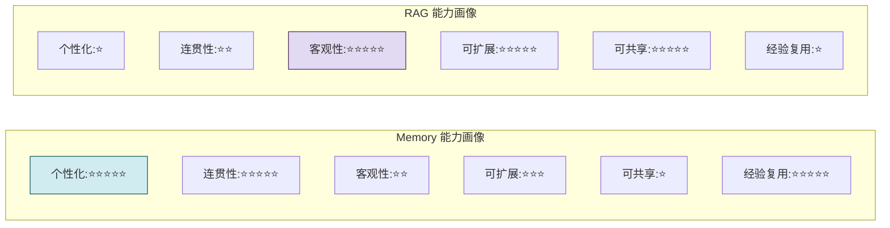

> **核心互补性**:Memory 强的地方正是 RAG 弱的地方,反之亦然。二者是高度互补的关系,而非替代关系。

---

## 七、在 Agent 系统中的典型作用

### 7.1 Memory 在 Agent 中的定位

Memory 是 Agent 的**"神经系统"**,深度嵌入 Agent 的每一个执行环节:

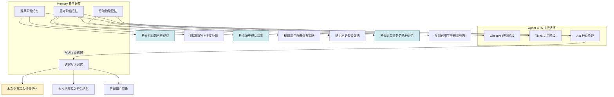

**Memory 在 Agent 各阶段的作用**:

| Agent 阶段 | Memory 的具体作用 |
|-----------|-----------------|
| **观察阶段** | 识别用户:"又是张三";识别模式:"类似上次的那个问题" |
| **思考阶段** | 经验辅助:"上次成功的做法是X";个性化:"张三喜欢简洁回答";风险规避:"上次Y方案失败了" |
| **行动阶段** | 参数复用:"还是调用那个API,参数和上次一样";流程优化:"跳过上次多余的步骤" |
| **写回阶段** | 保存本次交互、更新用户画像、提炼经验教训 |

### 7.2 RAG 在 Agent 中的定位

RAG 是 Agent 的**"外挂参考资料库"**,在需要外部知识时被调用:

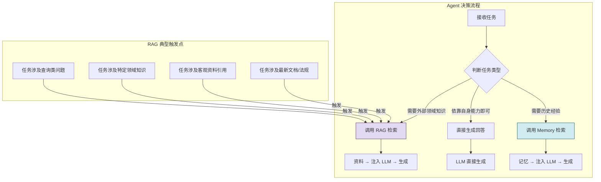

**RAG 在 Agent 中的典型作用**:

| 功能场景 | RAG 具体作用 |
|---------|------------|
| **工具使用** | 调用某个API前,RAG 检索该API文档获取参数说明 |
| **代码生成** | 生成某框架代码前,RAG 检索该框架最新文档 |
| **领域问答** | 回答行业问题前,RAG 检索领域资料 |
| **方案设计** | 制定方案前,RAG 检索最佳实践和行业标准 |
| **事实校验** | LLM 生成答案后,RAG 检索资料校验事实准确性 |
| **合规检查** | 输出内容前,RAG 检索合规条款检查是否违规 |

### 7.3 作用定位对比表

| 定位维度 | Memory | RAG |
|---------|--------|-----|
| **在 Agent 中的角色** | 核心神经系统,深度参与每一步 | 外挂知识工具,按需调用 |
| **调用频率** | 每一轮/每一步都可能调用 | 仅在需要外部知识时调用 |
| **影响范围** | 影响整个Agent的风格和行为模式 | 只影响当前问题的回答内容 |
| **长期影响** | 持续改变Agent的"性格"和"经验" | 不改变Agent本身,只改变单次输出 |
| **Agent 成熟度影响** | 越用越"聪明"、越用越"懂你" | Agent 自身不变,知识库越全答得越好 |

---

## 八、适用条件差异与选型决策

### 8.1 适用条件矩阵

| 条件维度 | 优先选 Memory | 优先选 RAG |
|---------|--------------|-----------|
| **问题类型** | 关于"我们之前讨论过什么"、"我上次怎样" | 关于"XX是什么"、"根据XX规定" |
| **数据属性** | 数据由 Agent 自身交互产生 | 数据来自外部文档或数据库 |
| **时间属性** | 需要历史上下文或时间序列 | 只看当前内容,不关注时间 |
| **个性化需求** | 高(每个用户/Agent需要不同体验) | 低(所有用户用同一套知识) |
| **客观性要求** | 低(接受基于经验的建议) | 高(必须基于权威资料) |
| **更新频率** | 高(每次交互都需要记录) | 低(定期更新即可) |
| **数据量** | 随时间线性增长 | 取决于知识库大小,相对固定 |
| **冷启动要求** | 可接受(越用越好) | 必须先有知识库才能运行 |
| **典型问题** | 多轮对话、任务连续、个性化服务 | 知识问答、手册查询、合规校验 |

### 8.2 选型决策流程

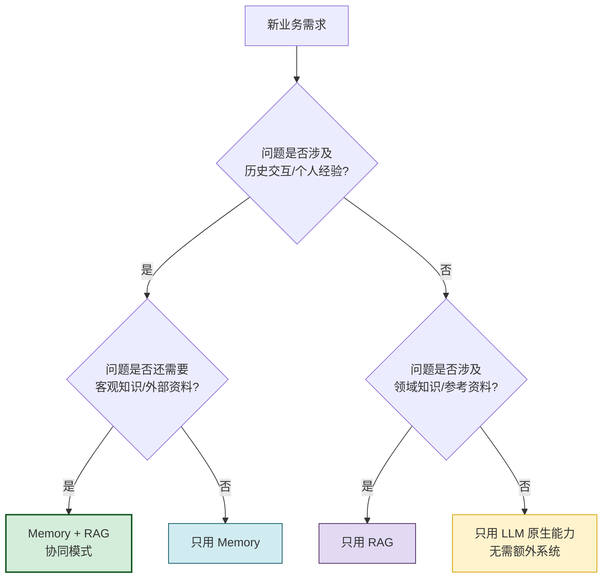

### 8.3 选型常见误区

| 误区 | 正确认知 |
|------|---------|
| ❌ "我们用了向量库,就是有 Memory 了" | 用了向量库不等于有 Memory。Memory 有分层、有时间维度、有筛选机制,不是简单的向量存储。RAG 也用向量库,但它不是 Memory。 |
| ❌ "有了 RAG 就不需要 Memory 了" | RAG 再强大,也无法记住"用户张三上次跟你说过什么",这是 Memory 的专属职责。 |
| ❌ "Memory 就是对话历史缓存" | 对话历史只是 Memory 的冰山一角。经验提炼、用户画像、程序技能都是 Memory。 |
| ❌ "RAG 和 Memory 选一个就行" | 绝大多数生产级 Agent 系统需要二者并存——用 Memory 记住用户和经历,用 RAG 查阅专业资料。 |

---

## 九、协同组合模式

### 9.1 为什么要组合

前文已多次强调:Memory 和 RAG 是高度互补的。在真实的生产级 Agent 系统中,**绝大多数场景都需要二者协同工作**。

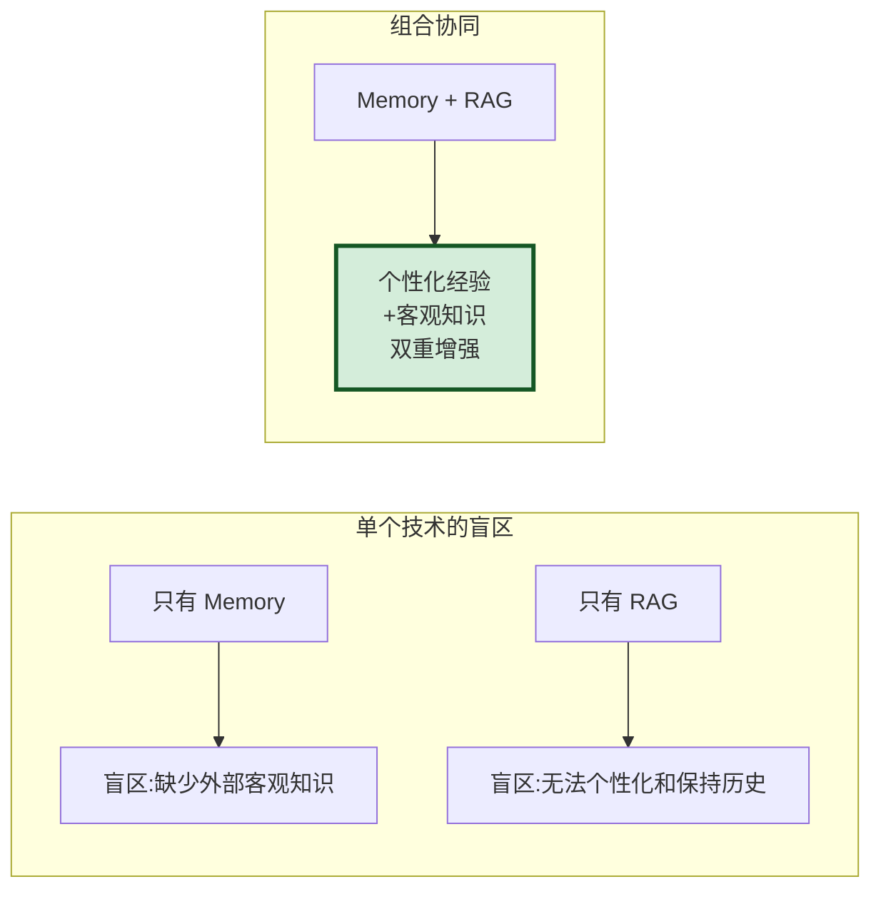

### 9.2 典型协同模式:先记忆后检索

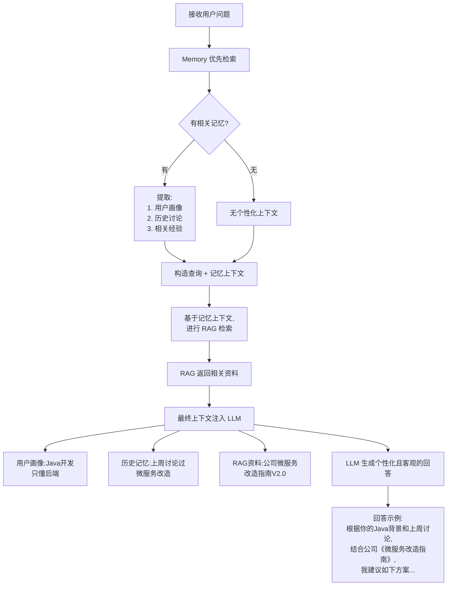

### 9.3 协同模式代码伪代码

```python
class EnhancedAgent:
    """Memory + RAG 协同的增强 Agent"""

    def __init__(self, memory_system, rag_system, llm):
        self.memory = memory_system
        self.rag = rag_system
        self.llm = llm

    async def answer(self, user_id: str, query: str) -> str:
        # Step 1: Memory 优先检索
        memory_context = await self.memory.retrieve_relevant(
            user_id=user_id,
            query=query,
            top_k=10,
            time_range="last_90_days"
        )

        # Step 2: 提取用户画像
        user_profile = await self.memory.get_user_profile(user_id)

        # Step 3: 基于记忆上下文,进行 RAG 检索
        # (将记忆中的关键词/主题作为RAG查询的扩展)
        enhanced_query = self._build_rag_query(query, memory_context, user_profile)
        rag_context = await self.rag.retrieve(
            query=enhanced_query,
            top_k=5,
            domain_filter=user_profile.get("domains")  # 根据用户画像限定检索域
        )

        # Step 4: 构建完整上下文
        full_prompt = self._build_prompt(
            query=query,
            user_profile=user_profile,
            memory_context=memory_context,
            rag_context=rag_context
        )

        # Step 5: LLM 生成回答
        answer = await self.llm.generate(full_prompt)

        # Step 6: 写入记忆(本轮交互)
        await self.memory.record_interaction(
            user_id=user_id,
            query=query,
            answer=answer,
            rag_sources=rag_context.sources  # 记录引用过的RAG资料
        )

        return answer
```

### 9.4 协同价值:1 + 1 > 2

| 维度 | 只用 Memory | 只用 RAG | Memory + RAG |
|------|-----------|---------|-------------|
| **回答准确性** | ⭐⭐⭐ | ⭐⭐⭐⭐ | ⭐⭐⭐⭐⭐ |
| **个性化程度** | ⭐⭐⭐⭐⭐ | ⭐ | ⭐⭐⭐⭐⭐ |
| **可追溯性** | ⭐⭐ | ⭐⭐⭐⭐⭐ | ⭐⭐⭐⭐⭐ |
| **经验复用** | ⭐⭐⭐⭐⭐ | ⭐ | ⭐⭐⭐⭐⭐ |
| **客观性** | ⭐⭐ | ⭐⭐⭐⭐⭐ | ⭐⭐⭐⭐⭐ |
| **冷启动表现** | ⭐⭐ | ⭐⭐⭐⭐ | ⭐⭐⭐⭐ |
| **总体效果** | 有个性但可能失实 | 客观但机械千篇一律 | **既有个性又准确客观** |

---

## 十、总结与最佳实践

### 10.1 核心区别一句话总结

| 技术 | 一句话定义 | 核心目标 | 存储内容来源 |
|------|-----------|---------|------------|
| **Memory** | Agent 的个人成长日记 + 熟人通讯录 | 记住**自身经历**,实现**持续成长与个性化** | Agent自己的交互、决策、结果 |
| **RAG** | Agent 可以随时查阅的公共图书馆 | 注入**外部知识**,实现**客观准确的信息增强** | 外部文档、PDF、网页、数据库 |

### 10.2 最佳实践建议

1. **区分数据来源,分别存储**
   - 来自 Agent 交互历史的数据 → Memory 系统
   - 来自外部文档/资料的数据 → RAG 系统
   - 不要混在同一个向量库中(会互相污染检索结果)

2. **协同使用,不要二选一**
   - 生产级 Agent 默认同时启用 Memory + RAG
   - Memory 优先给上下文,RAG 优先给客观知识

3. **给 Memory 设计严格的"准入门槛"**
   - 不是所有交互都值得记住:重要性评估是 Memory 的核心
   - 否则会出现"垃圾进、垃圾出",记忆无限膨胀

4. **给 RAG 设计严格的"切片门槛"**
   - 不是所有文档都适合直接切:切片策略是 RAG 的核心
   - 否则会出现检索不准、上下文缺失

5. **设计独立的清理/更新机制**
   - Memory:定期遗忘、摘要压缩、过期清理
   - RAG:定期更新索引、淘汰旧文档、版本管理

6. **监测关键指标**
   - Memory 指标:记忆检索命中率、用户感知"懂我度"、记忆膨胀率
   - RAG 指标:检索命中率、答案引用准确率、知识库覆盖率
   - 协同指标:双重增强后综合准确率提升幅度

### 10.3 与系列文档的关系

| 文档 | 主题 | 与本文的关系 |
|------|------|-------------|
| [74Agent记忆系统核心价值与必要性解析.md](74Agent记忆系统核心价值与必要性解析.md) | Memory 价值与类型 | 本文关于 Memory 部分的概念基础 |
| [75Agent记忆系统类型分类深度解析.md](75Agent记忆系统类型分类深度解析.md) | Memory 类型详解 | 本文 Memory 分层存储的展开说明 |
| [52RAG工作流程详解.md](../4RAG%20检索增强生成/52RAG工作流程详解.md) | RAG 完整流程 | 本文关于 RAG 流程部分的技术基础 |
| [54RAG系统功能模块详解.md](../4RAG%20检索增强生成/54RAG系统功能模块详解.md) | RAG 模块划分 | 本文 RAG 架构对比的依据 |

---

> **最终结论**:Memory 和 RAG 不是互相替代的技术,而是 Agent 系统中**同等重要、高度互补**的两大支柱。Memory 赋予 Agent **人格和成长**,让它越用越"懂你";RAG 赋予 Agent **学识和视野**,让它面对专业问题不"胡说"。一个优秀的 Agent 系统应该同时具备**良好的记忆能力**和**高效的知识检索能力**,通过二者协同实现真正"既聪明又博学"的智能体验。
