# 用户画像技术与 Agent 系统整合应用深度解析

> 文档定位:系统阐述用户画像技术与 AI Agent 系统的完整整合方案,涵盖数据采集、存储结构、记忆集成、决策调用、功能提升、性能优化与隐私保护,为构建个性化智能 Agent 提供端到端的工程指导。
>
> 阅读建议:本文是 Agent Memory 系列的应用拓展篇,建议结合 [74Agent记忆系统核心价值与必要性解析.md](./74Agent记忆系统核心价值与必要性解析.md)、[77Agent长期记忆系统完整设计方案.md](./77Agent长期记忆系统完整设计方案.md)、[78Agent Memory数据存储方案深度解析.md](./78Agent%20Memory数据存储方案深度解析.md)、[80Agent Memory检索功能完整实现深度解析.md](./80Agent%20Memory检索功能完整实现深度解析.md) 一并阅读。

---

## 目录

- [一、用户画像技术概述](#一用户画像技术概述)
- [二、用户画像数据采集方式](#二用户画像数据采集方式)
- [三、用户画像存储结构设计](#三用户画像存储结构设计)
- [四、与 Agent 记忆模块的集成方法](#四与-agent-记忆模块的集成方法)
- [五、Agent 决策中的画像调用机制](#五agent-决策中的画像调用机制)
- [六、功能提升与预期效果](#六功能提升与预期效果)
- [七、性能优化策略](#七性能优化策略)
- [八、隐私保护措施](#八隐私保护措施)
- [九、完整代码实现](#九完整代码实现)
- [十、最佳实践与总结](#十最佳实践与总结)

---

## 一、用户画像技术概述

### 1.1 什么是用户画像

**用户画像(User Persona/Profile)** 是指通过收集、分析用户的行为数据、偏好数据、属性数据,构建出的用户模型,用于刻画"用户是谁、喜欢什么、需要什么、如何决策"。

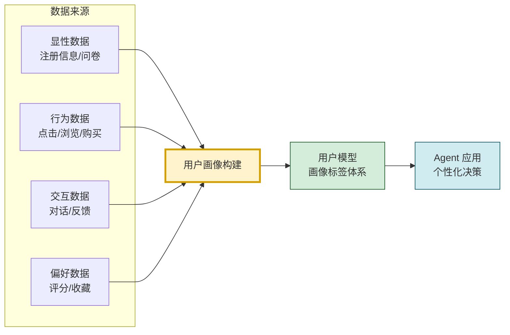

### 1.2 用户画像在 Agent 中的价值定位

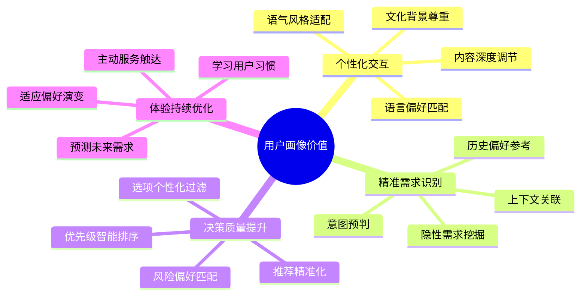

### 1.3 与 Agent 记忆系统的关系

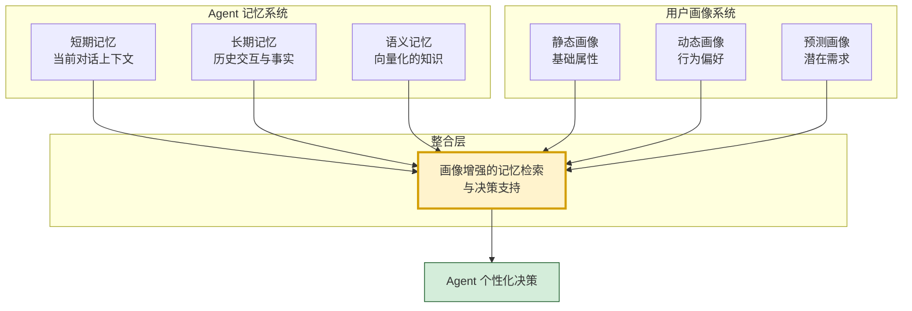

**核心关系**:用户画像是一种**结构化的长期记忆**,它从用户的交互历史中提取稳定的偏好与属性,为 Agent 决策提供个性化上下文。

---

## 二、用户画像数据采集方式

### 2.1 采集方式全景

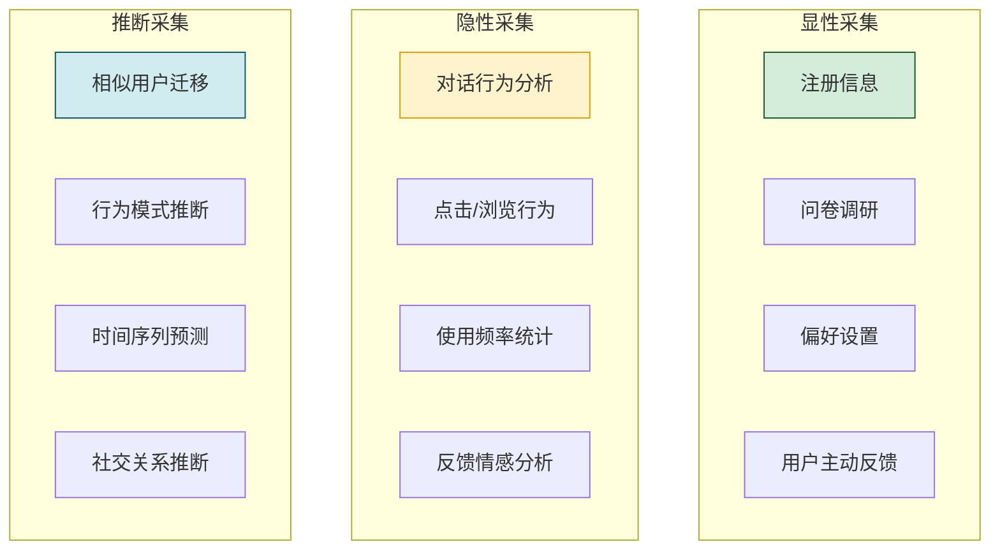

### 2.2 显性采集实现

```python
from dataclasses import dataclass, field
from typing import Optional
from datetime import datetime


@dataclass
class ExplicitProfileCollector:
    """显性数据采集器"""
    
    @staticmethod
    def collect_registration_data(user_input: dict) -> dict:
        """采集注册信息"""
        return {
            "user_id": user_input.get("user_id"),
            "name": user_input.get("name"),
            "age": user_input.get("age"),
            "gender": user_input.get("gender"),
            "location": user_input.get("location"),
            "occupation": user_input.get("occupation"),
            "language": user_input.get("language", "zh-CN"),
            "timezone": user_input.get("timezone", "Asia/Shanghai"),
            "collected_at": datetime.now().isoformat(),
            "source": "registration"
        }
    
    @staticmethod
    def collect_preference_settings(preferences: dict) -> dict:
        """采集偏好设置"""
        return {
            "communication_style": preferences.get("style", "professional"),
            "detail_level": preferences.get("detail", "medium"),  # brief/medium/detailed
            "technical_level": preferences.get("tech_level", "intermediate"),
            "interests": preferences.get("interests", []),
            "dislikes": preferences.get("dislikes", []),
            "notification_preference": preferences.get("notification", "important_only"),
            "collected_at": datetime.now().isoformat(),
            "source": "preference_settings"
        }
    
    @staticmethod
    def collect_survey_responses(responses: list[dict]) -> dict:
        """采集问卷调研"""
        return {
            "survey_id": responses[0].get("survey_id"),
            "responses": [
                {
                    "question": r["question"],
                    "answer": r["answer"],
                    "category": r.get("category", "general")
                }
                for r in responses
            ],
            "collected_at": datetime.now().isoformat(),
            "source": "survey"
        }
```

### 2.3 隐性采集实现

```python
class ImplicitProfileCollector:
    """隐性数据采集器 - 从行为中推断"""
    
    def __init__(self):
        self.behavior_buffer: list[dict] = []
    
    def record_conversation_behavior(self, conversation: dict) -> dict:
        """从对话行为中采集画像数据"""
        behavior_data = {
            "user_id": conversation["user_id"],
            "session_id": conversation["session_id"],
            "timestamp": datetime.now().isoformat(),
            "source": "conversation_behavior"
        }
        
        # 1. 分析对话风格偏好
        style_signals = self._analyze_communication_style(conversation)
        behavior_data["style_signals"] = style_signals
        
        # 2. 分析主题兴趣
        topic_interests = self._extract_topic_interests(conversation)
        behavior_data["topic_interests"] = topic_interests
        
        # 3. 分析技术深度偏好
        tech_level = self._infer_technical_level(conversation)
        behavior_data["tech_level_signal"] = tech_level
        
        # 4. 分析情感倾向
        sentiment = self._analyze_sentiment(conversation)
        behavior_data["sentiment_signal"] = sentiment
        
        # 5. 分析响应时间模式
        response_pattern = self._analyze_response_pattern(conversation)
        behavior_data["response_pattern"] = response_pattern
        
        self.behavior_buffer.append(behavior_data)
        return behavior_data
    
    def _analyze_communication_style(self, conversation: dict) -> dict:
        """分析对话风格"""
        messages = conversation.get("messages", [])
        user_messages = [m for m in messages if m.get("role") == "user"]
        
        style = {
            "avg_message_length": 0,
            "formality_level": "neutral",  # formal/neutral/casual
            "emoji_usage": 0,
            "question_frequency": 0,
        }
        
        if user_messages:
            lengths = [len(m.get("content", "")) for m in user_messages]
            style["avg_message_length"] = sum(lengths) / len(lengths)
            
            # 简单的形式化判断
            formal_markers = ["您好", "请问", "烦请", "感谢"]
            casual_markers = ["哈", "嗯", "哦", "啊"]
            
            formal_count = sum(
                1 for m in user_messages 
                for marker in formal_markers 
                if marker in m.get("content", "")
            )
            casual_count = sum(
                1 for m in user_messages 
                for marker in casual_markers 
                if marker in m.get("content", "")
            )
            
            if formal_count > casual_count:
                style["formality_level"] = "formal"
            elif casual_count > formal_count:
                style["formality_level"] = "casual"
        
        return style
    
    def _extract_topic_interests(self, conversation: dict) -> dict:
        """提取主题兴趣"""
        messages = conversation.get("messages", [])
        user_content = " ".join(
            m.get("content", "") for m in messages if m.get("role") == "user"
        )
        
        # 关键词频率统计(简化版,实际可用LLM或NLP)
        interest_keywords = {
            "技术": ["代码", "编程", "框架", "API", "算法", "架构"],
            "商业": ["市场", "商业", "投资", "营收", "策略"],
            "教育": ["学习", "课程", "教学", "知识", "培训"],
            "娱乐": ["电影", "音乐", "游戏", "小说", "旅行"],
        }
        
        topic_scores = {}
        for topic, keywords in interest_keywords.items():
            score = sum(user_content.count(kw) for kw in keywords)
            if score > 0:
                topic_scores[topic] = score
        
        return topic_scores
    
    def _infer_technical_level(self, conversation: dict) -> str:
        """推断技术水平"""
        messages = conversation.get("messages", [])
        user_content = " ".join(
            m.get("content", "") for m in messages if m.get("role") == "user"
        )
        
        advanced_terms = ["分布式", "微服务", "Kubernetes", "向量数据库", "Transformer"]
        beginner_terms = ["怎么用", "是什么", "为什么", "入门", "基础"]
        
        advanced_count = sum(user_content.count(t) for t in advanced_terms)
        beginner_count = sum(user_content.count(t) for t in beginner_terms)
        
        if advanced_count > beginner_count:
            return "advanced"
        elif beginner_count > advanced_count:
            return "beginner"
        return "intermediate"
    
    def _analyze_sentiment(self, conversation: dict) -> str:
        """分析情感倾向"""
        messages = conversation.get("messages", [])
        user_content = " ".join(
            m.get("content", "") for m in messages if m.get("role") == "user"
        )
        
        positive_markers = ["好", "喜欢", "满意", "棒", "谢谢"]
        negative_markers = ["不好", "讨厌", "不满", "差", "问题"]
        
        positive = sum(user_content.count(m) for m in positive_markers)
        negative = sum(user_content.count(m) for m in negative_markers)
        
        if positive > negative:
            return "positive"
        elif negative > positive:
            return "negative"
        return "neutral"
    
    def _analyze_response_pattern(self, conversation: dict) -> dict:
        """分析响应模式"""
        messages = conversation.get("messages", [])
        user_messages = [m for m in messages if m.get("role") == "user"]
        
        if len(user_messages) < 2:
            return {"pattern": "insufficient_data"}
        
        # 分析消息间隔
        timestamps = [m.get("timestamp") for m in user_messages if m.get("timestamp")]
        if len(timestamps) < 2:
            return {"pattern": "insufficient_data"}
        
        # 简化:返回消息频率
        return {
            "message_count": len(user_messages),
            "pattern": "active" if len(user_messages) > 10 else "moderate"
        }
```

### 2.4 推断采集实现

```python
class InferentialProfileCollector:
    """推断数据采集器 - 基于已有数据推断"""
    
    @staticmethod
    def infer_from_similar_users(user_id: str, 
                                  current_profile: dict,
                                  all_profiles: dict) -> dict:
        """从相似用户迁移画像"""
        # 1. 找到相似用户
        similar_users = InferentialProfileCollector._find_similar_users(
            user_id, current_profile, all_profiles
        )
        
        # 2. 迁移画像标签
        inferred = {}
        for similar_user_id, similarity in similar_users.items():
            similar_profile = all_profiles.get(similar_user_id, {})
            
            # 迁移兴趣标签(加权)
            for interest, score in similar_profile.get("interests", {}).items():
                if interest not in current_profile.get("interests", {}):
                    inferred.setdefault("inferred_interests", {})[interest] = (
                        score * similarity
                    )
        
        return inferred
    
    @staticmethod
    def _find_similar_users(user_id: str, profile: dict, 
                             all_profiles: dict, top_k: int = 5) -> dict:
        """找到相似用户"""
        similarities = {}
        
        for other_id, other_profile in all_profiles.items():
            if other_id == user_id:
                continue
            
            # 计算相似度(简化:基于共同标签)
            similarity = InferentialProfileCollector._calculate_similarity(
                profile, other_profile
            )
            if similarity > 0.3:
                similarities[other_id] = similarity
        
        # 返回Top-K相似用户
        sorted_users = sorted(similarities.items(), 
                              key=lambda x: x[1], reverse=True)
        return dict(sorted_users[:top_k])
    
    @staticmethod
    def _calculate_similarity(profile_a: dict, profile_b: dict) -> float:
        """计算两个画像的相似度"""
        # 简化:基于共同兴趣
        interests_a = set(profile_a.get("interests", {}).keys())
        interests_b = set(profile_b.get("interests", {}).keys())
        
        if not interests_a or not interests_b:
            return 0.0
        
        intersection = interests_a & interests_b
        union = interests_a | interests_b
        
        return len(intersection) / len(union)  # Jaccard相似度
```

---

## 三、用户画像存储结构设计

### 3.1 整体存储架构

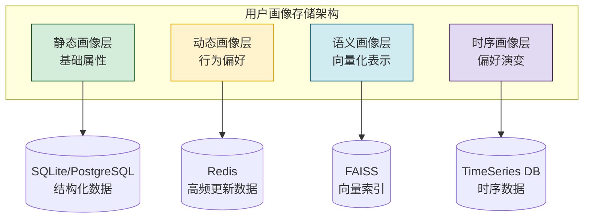

### 3.2 数据结构设计

```python
from dataclasses import dataclass, field
from typing import Optional, Any
from enum import Enum
from datetime import datetime


class ProfileConfidence(Enum):
    """画像置信度"""
    HIGH = 0.9       # 用户明确提供或多次验证
    MEDIUM = 0.7     # 多次行为推断
    LOW = 0.5        # 单次行为推断
    INFERRED = 0.3   # 相似用户迁移


class ProfileSource(Enum):
    """画像来源"""
    EXPLICIT = "explicit"       # 显性采集
    IMPLICIT = "implicit"       # 隐性采集
    INFERRED = "inferred"       # 推断采集


@dataclass
class ProfileTag:
    """画像标签"""
    key: str                                # 标签键
    value: Any                              # 标签值
    confidence: float = 0.5                 # 置信度
    source: ProfileSource = ProfileSource.IMPLICIT
    last_updated: datetime = field(default_factory=datetime.now)
    evidence_count: int = 0                 # 证据数量
    metadata: dict = field(default_factory=dict)


@dataclass
class StaticProfile:
    """静态画像 - 基础属性(变化频率低)"""
    user_id: str
    name: Optional[str] = None
    age: Optional[int] = None
    gender: Optional[str] = None
    location: Optional[str] = None
    occupation: Optional[str] = None
    language: str = "zh-CN"
    timezone: str = "Asia/Shanghai"
    
    # 偏好设置
    communication_style: str = "professional"
    detail_level: str = "medium"
    technical_level: str = "intermediate"
    
    # 元数据
    created_at: datetime = field(default_factory=datetime.now)
    updated_at: datetime = field(default_factory=datetime.now)
    version: int = 1


@dataclass
class DynamicProfile:
    """动态画像 - 行为偏好(持续更新)"""
    user_id: str
    
    # 兴趣主题(带权重)
    interests: dict[str, float] = field(default_factory=dict)
    # {"技术": 0.8, "商业": 0.5, "教育": 0.3}
    
    # 行为模式
    avg_session_duration: float = 0.0       # 平均会话时长
    avg_message_length: int = 0             # 平均消息长度
    interaction_frequency: str = "moderate"  # low/moderate/high
    
    # 偏好信号
    formality_level: str = "neutral"        # formal/neutral/casual
    sentiment_trend: str = "neutral"         # positive/neutral/negative
    response_speed: str = "moderate"        # fast/moderate/slow
    
    # 时间相关
    active_hours: list[int] = field(default_factory=list)  # 活跃时段
    preferred_days: list[str] = field(default_factory=list)  # 偏好日期
    
    # 更新时间
    last_updated: datetime = field(default_factory=datetime.now)
    update_count: int = 0


@dataclass
class SemanticProfile:
    """语义画像 - 向量化表示"""
    user_id: str
    interest_vector: Optional[list[float]] = None     # 兴趣向量
    behavior_vector: Optional[list[float]] = None     # 行为向量
    preference_vector: Optional[list[float]] = None   # 偏好向量
    combined_vector: Optional[list[float]] = None     # 综合向量
    vector_dim: int = 1024
    last_updated: datetime = field(default_factory=datetime.now)


@dataclass
class UserProfile:
    """用户画像完整结构"""
    user_id: str
    static: StaticProfile
    dynamic: DynamicProfile
    semantic: SemanticProfile
    tags: list[ProfileTag] = field(default_factory=list)  # 自由标签
    
    # 画像质量指标
    completeness: float = 0.0     # 完整度(0-1)
    freshness: float = 1.0        # 新鲜度(0-1)
    confidence: float = 0.5       # 整体置信度(0-1)
    
    def to_prompt_context(self) -> str:
        """转换为 Agent Prompt 上下文"""
        return UserProfilePromptBuilder.build(self)


@dataclass 
class TemporalProfileEntry:
    """时序画像条目"""
    user_id: str
    timestamp: datetime
    interests_snapshot: dict[str, float]  # 当时兴趣快照
    event: str                              # 触发事件
    metadata: dict = field(default_factory=dict)
```

### 3.3 存储实现

```python
import sqlite3
from pathlib import Path
from contextlib import contextmanager


class UserProfileStorage:
    """用户画像存储管理器"""
    
    SCHEMA_SQL = """
    -- 静态画像表
    CREATE TABLE IF NOT EXISTS static_profiles (
        user_id TEXT PRIMARY KEY,
        name TEXT,
        age INTEGER,
        gender TEXT,
        location TEXT,
        occupation TEXT,
        language TEXT,
        timezone TEXT,
        communication_style TEXT,
        detail_level TEXT,
        technical_level TEXT,
        created_at TEXT,
        updated_at TEXT,
        version INTEGER DEFAULT 1
    );
    
    -- 动态画像表
    CREATE TABLE IF NOT EXISTS dynamic_profiles (
        user_id TEXT PRIMARY KEY,
        interests TEXT,  -- JSON
        avg_session_duration REAL,
        avg_message_length INTEGER,
        interaction_frequency TEXT,
        formality_level TEXT,
        sentiment_trend TEXT,
        response_speed TEXT,
        active_hours TEXT,  -- JSON
        preferred_days TEXT,  -- JSON
        last_updated TEXT,
        update_count INTEGER DEFAULT 0,
        FOREIGN KEY (user_id) REFERENCES static_profiles(user_id)
    );
    
    -- 画像标签表
    CREATE TABLE IF NOT EXISTS profile_tags (
        id INTEGER PRIMARY KEY AUTOINCREMENT,
        user_id TEXT,
        tag_key TEXT,
        tag_value TEXT,
        confidence REAL,
        source TEXT,
        evidence_count INTEGER,
        last_updated TEXT,
        metadata TEXT,
        FOREIGN KEY (user_id) REFERENCES static_profiles(user_id)
    );
    
    -- 时序画像表
    CREATE TABLE IF NOT EXISTS temporal_profiles (
        id INTEGER PRIMARY KEY AUTOINCREMENT,
        user_id TEXT,
        timestamp TEXT,
        interests_snapshot TEXT,
        event TEXT,
        metadata TEXT,
        FOREIGN KEY (user_id) REFERENCES static_profiles(user_id)
    );
    
    -- 索引
    CREATE INDEX IF NOT EXISTS idx_tags_user ON profile_tags(user_id);
    CREATE INDEX IF NOT EXISTS idx_temporal_user_time ON temporal_profiles(user_id, timestamp);
    """
    
    def __init__(self, db_path: Path):
        self.db_path = db_path
        self._init_db()
    
    def _init_db(self):
        with self._get_conn() as conn:
            conn.executescript(self.SCHEMA_SQL)
    
    @contextmanager
    def _get_conn(self):
        conn = sqlite3.connect(str(self.db_path))
        conn.row_factory = sqlite3.Row
        try:
            yield conn
            conn.commit()
        except Exception:
            conn.rollback()
            raise
        finally:
            conn.close()
    
    def save_static_profile(self, profile: StaticProfile) -> bool:
        """保存静态画像"""
        with self._get_conn() as conn:
            conn.execute("""
                INSERT OR REPLACE INTO static_profiles
                (user_id, name, age, gender, location, occupation, language,
                 timezone, communication_style, detail_level, technical_level,
                 created_at, updated_at, version)
                VALUES (?, ?, ?, ?, ?, ?, ?, ?, ?, ?, ?, ?, ?, ?)
            """, (
                profile.user_id, profile.name, profile.age, profile.gender,
                profile.location, profile.occupation, profile.language,
                profile.timezone, profile.communication_style, profile.detail_level,
                profile.technical_level, profile.created_at.isoformat(),
                profile.updated_at.isoformat(), profile.version
            ))
        return True
    
    def save_dynamic_profile(self, profile: DynamicProfile) -> bool:
        """保存动态画像"""
        import json
        with self._get_conn() as conn:
            conn.execute("""
                INSERT OR REPLACE INTO dynamic_profiles
                (user_id, interests, avg_session_duration, avg_message_length,
                 interaction_frequency, formality_level, sentiment_trend,
                 response_speed, active_hours, preferred_days,
                 last_updated, update_count)
                VALUES (?, ?, ?, ?, ?, ?, ?, ?, ?, ?, ?, ?)
            """, (
                profile.user_id,
                json.dumps(profile.interests, ensure_ascii=False),
                profile.avg_session_duration,
                profile.avg_message_length,
                profile.interaction_frequency,
                profile.formality_level,
                profile.sentiment_trend,
                profile.response_speed,
                json.dumps(profile.active_hours),
                json.dumps(profile.preferred_days),
                profile.last_updated.isoformat(),
                profile.update_count
            ))
        return True
    
    def load_profile(self, user_id: str) -> Optional[UserProfile]:
        """加载完整用户画像"""
        with self._get_conn() as conn:
            static_row = conn.execute(
                "SELECT * FROM static_profiles WHERE user_id = ?", (user_id,)
            ).fetchone()
            
            if not static_row:
                return None
            
            dynamic_row = conn.execute(
                "SELECT * FROM dynamic_profiles WHERE user_id = ?", (user_id,)
            ).fetchone()
            
            tag_rows = conn.execute(
                "SELECT * FROM profile_tags WHERE user_id = ?", (user_id,)
            ).fetchall()
        
        # 构建画像对象
        static = self._row_to_static(static_row)
        dynamic = self._row_to_dynamic(dynamic_row) if dynamic_row else DynamicProfile(user_id=user_id)
        tags = [self._row_to_tag(row) for row in tag_rows]
        semantic = SemanticProfile(user_id=user_id)
        
        profile = UserProfile(
            user_id=user_id, static=static, dynamic=dynamic,
            semantic=semantic, tags=tags
        )
        
        # 计算画像质量
        profile.completeness = self._calculate_completeness(profile)
        profile.confidence = self._calculate_confidence(profile)
        
        return profile
    
    def _calculate_completeness(self, profile: UserProfile) -> float:
        """计算画像完整度"""
        fields = [
            profile.static.name, profile.static.age, profile.static.location,
            profile.static.occupation, profile.dynamic.interests,
            profile.dynamic.formality_level
        ]
        filled = sum(1 for f in fields if f)
        return filled / len(fields)
    
    def _calculate_confidence(self, profile: UserProfile) -> float:
        """计算整体置信度"""
        if not profile.tags:
            return 0.5
        return sum(t.confidence for t in profile.tags) / len(profile.tags)
    
    def _row_to_static(self, row) -> StaticProfile:
        return StaticProfile(
            user_id=row["user_id"], name=row["name"], age=row["age"],
            gender=row["gender"], location=row["location"],
            occupation=row["occupation"], language=row["language"],
            timezone=row["timezone"],
            communication_style=row["communication_style"],
            detail_level=row["detail_level"],
            technical_level=row["technical_level"],
            created_at=datetime.fromisoformat(row["created_at"]),
            updated_at=datetime.fromisoformat(row["updated_at"]),
            version=row["version"]
        )
    
    def _row_to_dynamic(self, row) -> DynamicProfile:
        import json
        return DynamicProfile(
            user_id=row["user_id"],
            interests=json.loads(row["interests"]) if row["interests"] else {},
            avg_session_duration=row["avg_session_duration"],
            avg_message_length=row["avg_message_length"],
            interaction_frequency=row["interaction_frequency"],
            formality_level=row["formality_level"],
            sentiment_trend=row["sentiment_trend"],
            response_speed=row["response_speed"],
            active_hours=json.loads(row["active_hours"]) if row["active_hours"] else [],
            preferred_days=json.loads(row["preferred_days"]) if row["preferred_days"] else [],
            last_updated=datetime.fromisoformat(row["last_updated"]),
            update_count=row["update_count"]
        )
    
    def _row_to_tag(self, row) -> ProfileTag:
        import json
        return ProfileTag(
            key=row["tag_key"], value=row["tag_value"],
            confidence=row["confidence"],
            source=ProfileSource(row["source"]),
            last_updated=datetime.fromisoformat(row["last_updated"]),
            evidence_count=row["evidence_count"],
            metadata=json.loads(row["metadata"]) if row["metadata"] else {}
        )
```

---

## 四、与 Agent 记忆模块的集成方法

### 4.1 集成架构

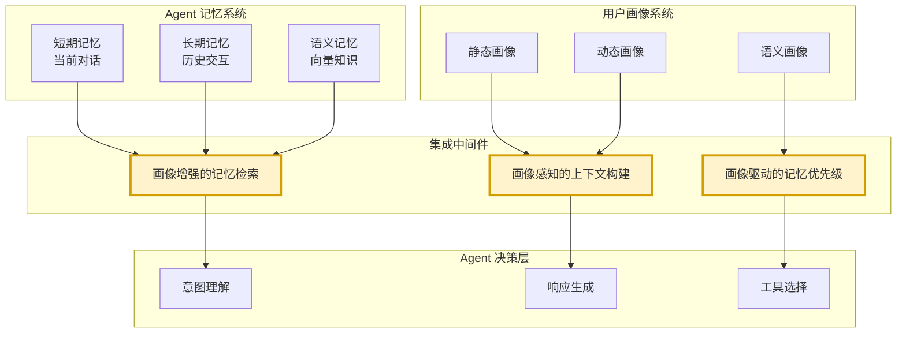

### 4.2 画像增强的记忆检索

```python
class ProfileEnhancedMemoryRetrieval:
    """画像增强的记忆检索器"""
    
    def __init__(self, memory_storage, profile_storage):
        self.memory = memory_storage
        self.profiles = profile_storage
    
    def retrieve_with_profile(self, user_id: str, query: str,
                                top_k: int = 5) -> list[dict]:
        """基于用户画像增强的记忆检索"""
        # 1. 加载用户画像
        profile = self.profiles.load_profile(user_id)
        if not profile:
            return self.memory.search(query, top_k=top_k)
        
        # 2. 基础语义检索
        base_results = self.memory.search(query, top_k=top_k * 2)
        
        # 3. 画像加权重排序
        enhanced_results = []
        for result in base_results:
            score = result.get("score", 0)
            
            # 兴趣匹配加权
            interest_boost = self._calculate_interest_boost(result, profile)
            
            # 技术水平匹配加权
            tech_boost = self._calculate_tech_boost(result, profile)
            
            # 时间偏好加权
            time_boost = self._calculate_time_boost(result, profile)
            
            final_score = score + interest_boost + tech_boost + time_boost
            
            enhanced_results.append({
                **result,
                "original_score": score,
                "enhanced_score": final_score,
                "boost_factors": {
                    "interest": interest_boost,
                    "tech": tech_boost,
                    "time": time_boost
                }
            })
        
        # 4. 排序返回
        enhanced_results.sort(key=lambda x: x["enhanced_score"], reverse=True)
        return enhanced_results[:top_k]
    
    def _calculate_interest_boost(self, result: dict, 
                                   profile: UserProfile) -> float:
        """计算兴趣匹配加权"""
        content = result.get("content", "")
        boost = 0.0
        
        for interest, weight in profile.dynamic.interests.items():
            if interest in content:
                boost += weight * 0.1
        
        return min(boost, 0.3)  # 上限0.3
    
    def _calculate_tech_boost(self, result: dict, 
                               profile: UserProfile) -> float:
        """计算技术水平匹配加权"""
        content = result.get("content", "")
        result_tech_level = "intermediate"
        
        advanced_terms = ["分布式", "微服务", "K8s", "向量数据库"]
        beginner_terms = ["入门", "基础", "是什么", "怎么用"]
        
        if any(t in content for t in advanced_terms):
            result_tech_level = "advanced"
        elif any(t in content for t in beginner_terms):
            result_tech_level = "beginner"
        
        if result_tech_level == profile.static.technical_level:
            return 0.1
        return 0.0
    
    def _calculate_time_boost(self, result: dict, 
                               profile: UserProfile) -> float:
        """计算时间偏好加权"""
        timestamp = result.get("timestamp")
        if not timestamp:
            return 0.0
        
        try:
            dt = datetime.fromisoformat(timestamp)
            hour = dt.hour
            
            if hour in profile.dynamic.active_hours:
                return 0.05
        except Exception:
            pass
        
        return 0.0
```

### 4.3 画像感知的上下文构建

```python
class ProfileAwareContextBuilder:
    """画像感知的上下文构建器"""
    
    @staticmethod
    def build_context(user_profile: UserProfile,
                       conversation_history: list[dict],
                       retrieved_memories: list[dict]) -> str:
        """构建画像感知的Agent上下文"""
        
        context_parts = []
        
        # 1. 用户画像摘要
        profile_summary = ProfileAwareContextBuilder._build_profile_summary(
            user_profile
        )
        context_parts.append(f"[用户画像]\n{profile_summary}")
        
        # 2. 个性化检索的记忆
        memory_context = ProfileAwareContextBuilder._build_memory_context(
            retrieved_memories, user_profile
        )
        context_parts.append(f"[相关记忆]\n{memory_context}")
        
        # 3. 适配的对话历史
        adapted_history = ProfileAwareContextBuilder._adapt_conversation_history(
            conversation_history, user_profile
        )
        context_parts.append(f"[对话历史]\n{adapted_history}")
        
        return "\n\n---\n\n".join(context_parts)
    
    @staticmethod
    def _build_profile_summary(profile: UserProfile) -> str:
        """构建画像摘要"""
        parts = []
        
        # 基础信息
        if profile.static.name:
            parts.append(f"用户: {profile.static.name}")
        if profile.static.occupation:
            parts.append(f"职业: {profile.static.occupation}")
        if profile.static.location:
            parts.append(f"位置: {profile.static.location}")
        
        # 技术水平
        parts.append(f"技术水平: {profile.static.technical_level}")
        
        # 沟通偏好
        parts.append(f"沟通风格偏好: {profile.static.communication_style}")
        parts.append(f"详细程度偏好: {profile.static.detail_level}")
        
        # 兴趣主题
        if profile.dynamic.interests:
            top_interests = sorted(
                profile.dynamic.interests.items(),
                key=lambda x: x[1], reverse=True
            )[:3]
            interests_str = ", ".join(f"{k}({v:.1f})" for k, v in top_interests)
            parts.append(f"主要兴趣: {interests_str}")
        
        # 行为模式
        parts.append(f"形式化程度: {profile.dynamic.formality_level}")
        parts.append(f"情感倾向: {profile.dynamic.sentiment_trend}")
        
        return "\n".join(parts)
    
    @staticmethod
    def _build_memory_context(memories: list[dict], 
                               profile: UserProfile) -> str:
        """构建记忆上下文(基于画像调整详细度)"""
        if not memories:
            return "无相关历史记忆"
        
        # 根据用户详细程度偏好调整
        detail_level = profile.static.detail_level
        
        if detail_level == "brief":
            # 简洁模式:只保留摘要
            return "\n".join(
                f"- {m.get('summary', m.get('content', '')[:50])}"
                for m in memories[:3]
            )
        elif detail_level == "detailed":
            # 详细模式:完整内容
            return "\n\n".join(
                f"[{m.get('timestamp', '')}] {m.get('content', '')}"
                for m in memories
            )
        else:
            # 中等模式:摘要+部分内容
            return "\n".join(
                f"- {m.get('content', '')[:200]}"
                for m in memories[:5]
            )
    
    @staticmethod
    def _adapt_conversation_history(history: list[dict],
                                      profile: UserProfile) -> str:
        """适配对话历史(基于画像)"""
        if not history:
            return "无对话历史"
        
        # 根据画像调整历史长度
        if profile.static.detail_level == "brief":
            history = history[-3:]  # 最近3条
        else:
            history = history[-10:]  # 最近10条
        
        return "\n".join(
            f"{m.get('role', 'user')}: {m.get('content', '')}"
            for m in history
        )
```

### 4.4 画像驱动的记忆优先级

```python
class ProfileDrivenMemoryPriority:
    """画像驱动的记忆优先级管理"""
    
    @staticmethod
    def calculate_priority(memory: dict, profile: UserProfile) -> float:
        """计算记忆的画像优先级"""
        priority = 0.5  # 基础优先级
        
        # 1. 兴趣相关性加权
        content = memory.get("content", "")
        for interest, weight in profile.dynamic.interests.items():
            if interest in content:
                priority += weight * 0.2
        
        # 2. 技术水平匹配加权
        if profile.static.technical_level == "advanced":
            advanced_terms = ["架构", "分布式", "性能优化"]
            if any(t in content for t in advanced_terms):
                priority += 0.15
        elif profile.static.technical_level == "beginner":
            beginner_terms = ["入门", "基础", "简单"]
            if any(t in content for t in beginner_terms):
                priority += 0.15
        
        # 3. 情感匹配加权
        if profile.dynamic.sentiment_trend == "positive":
            positive_terms = ["成功", "解决", "完成", "满意"]
            if any(t in content for t in positive_terms):
                priority += 0.1
        
        # 4. 时间新鲜度
        timestamp = memory.get("timestamp")
        if timestamp:
            try:
                age_days = (datetime.now() - datetime.fromisoformat(timestamp)).days
                if age_days < 7:
                    priority += 0.1
                elif age_days < 30:
                    priority += 0.05
            except Exception:
                pass
        
        return min(priority, 1.0)
```

---

## 五、Agent 决策中的画像调用机制

### 5.1 决策调用全景

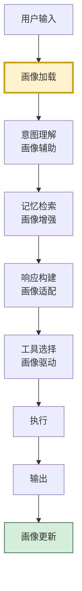

### 5.2 画像调用时机与机制

```python
class ProfileAwareAgent:
    """画像感知的 Agent"""
    
    def __init__(self, profile_storage, memory_storage, llm):
        self.profiles = profile_storage
        self.memory = memory_storage
        self.llm = llm
        self.profile_cache: dict[str, UserProfile] = {}
    
    async def process(self, user_id: str, user_input: str) -> str:
        """处理用户输入(画像感知)"""
        
        # 1. 加载用户画像(带缓存)
        profile = self._load_profile_cached(user_id)
        
        # 2. 画像辅助的意图理解
        intent = self._understand_intent(user_input, profile)
        
        # 3. 画像增强的记忆检索
        memories = self._retrieve_memories(user_id, user_input, profile)
        
        # 4. 构建画像感知的上下文
        context = self._build_context(profile, memories, user_input)
        
        # 5. 画像适配的响应生成
        response = self._generate_response(context, profile, user_input)
        
        # 6. 异步更新用户画像
        self._update_profile_async(user_id, user_input, response)
        
        return response
    
    def _load_profile_cached(self, user_id: str) -> UserProfile:
        """加载用户画像(带缓存)"""
        if user_id not in self.profile_cache:
            profile = self.profiles.load_profile(user_id)
            if not profile:
                # 新用户:创建默认画像
                profile = UserProfile(
                    user_id=user_id,
                    static=StaticProfile(user_id=user_id),
                    dynamic=DynamicProfile(user_id=user_id),
                    semantic=SemanticProfile(user_id=user_id)
                )
            self.profile_cache[user_id] = profile
        return self.profile_cache[user_id]
    
    def _understand_intent(self, user_input: str, 
                            profile: UserProfile) -> dict:
        """画像辅助的意图理解"""
        # 基于用户技术水平调整意图分析
        if profile.static.technical_level == "beginner":
            # 对初学者,更宽容地理解模糊表达
            intent_prompt = f"""
            用户技术水平: 初学者
            用户输入: {user_input}
            
            请宽容理解用户意图,可能表达不够专业。
            返回意图分类与置信度。
            """
        else:
            intent_prompt = f"""
            用户技术水平: {profile.static.technical_level}
            用户输入: {user_input}
            
            请精确理解用户意图。
            返回意图分类与置信度。
            """
        
        return self.llm.analyze_intent(intent_prompt)
    
    def _retrieve_memories(self, user_id: str, query: str,
                            profile: UserProfile) -> list[dict]:
        """画像增强的记忆检索"""
        retriever = ProfileEnhancedMemoryRetrieval(
            self.memory, self.profiles
        )
        return retriever.retrieve_with_profile(user_id, query, top_k=5)
    
    def _build_context(self, profile: UserProfile,
                       memories: list[dict],
                       user_input: str) -> str:
        """构建画像感知的上下文"""
        return ProfileAwareContextBuilder.build_context(
            profile, [], memories
        )
    
    def _generate_response(self, context: str, profile: UserProfile,
                           user_input: str) -> str:
        """画像适配的响应生成"""
        # 根据画像调整生成参数
        generation_config = self._get_generation_config(profile)
        
        prompt = f"""
        {context}
        
        用户输入: {user_input}
        
        请基于用户画像生成个性化响应:
        - 沟通风格: {profile.static.communication_style}
        - 详细程度: {profile.static.detail_level}
        - 技术水平适配: {profile.static.technical_level}
        - 语言: {profile.static.language}
        """
        
        return self.llm.generate(prompt, **generation_config)
    
    def _get_generation_config(self, profile: UserProfile) -> dict:
        """根据画像获取生成配置"""
        config = {
            "temperature": 0.7,
            "max_tokens": 1000,
        }
        
        # 根据详细程度调整
        if profile.static.detail_level == "brief":
            config["max_tokens"] = 300
        elif profile.static.detail_level == "detailed":
            config["max_tokens"] = 2000
        
        # 根据沟通风格调整温度
        if profile.static.communication_style == "creative":
            config["temperature"] = 0.9
        elif profile.static.communication_style == "precise":
            config["temperature"] = 0.3
        
        return config
    
    def _update_profile_async(self, user_id: str, 
                               user_input: str, response: str):
        """异步更新用户画像"""
        import threading
        
        def update_worker():
            collector = ImplicitProfileCollector()
            behavior_data = collector.record_conversation_behavior({
                "user_id": user_id,
                "session_id": "current",
                "messages": [
                    {"role": "user", "content": user_input},
                    {"role": "assistant", "content": response}
                ]
            })
            
            # 更新画像
            self._merge_behavior_to_profile(user_id, behavior_data)
        
        thread = threading.Thread(target=update_worker, daemon=True)
        thread.start()
    
    def _merge_behavior_to_profile(self, user_id: str, 
                                    behavior_data: dict):
        """将行为数据合并到画像"""
        profile = self.profile_cache.get(user_id)
        if not profile:
            return
        
        # 更新动态画像
        if behavior_data.get("topic_interests"):
            for topic, score in behavior_data["topic_interests"].items():
                current = profile.dynamic.interests.get(topic, 0)
                # 指数移动平均更新
                profile.dynamic.interests[topic] = current * 0.8 + score * 0.2
        
        if behavior_data.get("tech_level_signal"):
            # 多次信号后才更新技术水平
            pass
        
        profile.dynamic.update_count += 1
        profile.dynamic.last_updated = datetime.now()
        
        # 持久化
        self.profiles.save_dynamic_profile(profile.dynamic)
```

---

## 六、功能提升与预期效果

### 6.1 功能提升全景

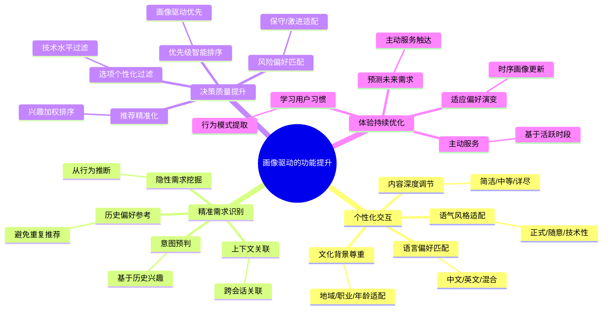

### 6.2 个性化交互效果

```python
class PersonalizedInteractionDemo:
    """个性化交互演示"""
    
    @staticmethod
    def demonstrate_style_adaptation():
        """演示风格适配"""
        
        # 同一问题,不同画像用户的响应对比
        query = "什么是 RAG?"
        
        # 初学者画像
        beginner_profile = UserProfile(
            user_id="user1",
            static=StaticProfile(
                user_id="user1", technical_level="beginner",
                detail_level="detailed", communication_style="friendly"
            ),
            dynamic=DynamicProfile(user_id="user1"),
            semantic=SemanticProfile(user_id="user1")
        )
        
        # 专家画像
        expert_profile = UserProfile(
            user_id="user2",
            static=StaticProfile(
                user_id="user2", technical_level="advanced",
                detail_level="brief", communication_style="precise"
            ),
            dynamic=DynamicProfile(user_id="user2"),
            semantic=SemanticProfile(user_id="user2")
        )
        
        # 初学者响应(详细友好)
        beginner_response = """
        RAG 就像是给 AI 配备了一个'参考书库'。
        
        想象你在考试时,遇到不会的题目,可以翻阅参考书来找答案。
        RAG 就是让 AI 在回答问题前,先去'参考书库'(知识库)里
        查找相关资料,然后基于找到的资料来回答。
        
        这样做的好处是:
        1. 回答更准确(有据可查)
        2. 可以回答最新信息(参考书可更新)
        3. 减少错误(不靠'记忆'靠'查证')
        """
        
        # 专家响应(简洁精确)
        expert_response = """
        RAG (Retrieval-Augmented Generation):
        - 检索: 从向量数据库召回 top-k 相关 chunks
        - 增强: 将 chunks 注入 LLM 上下文
        - 生成: LLM 基于上下文生成答案
        
        核心价值: 减少幻觉,支持长尾知识,无需微调。
        """
        
        return {
            "beginner": beginner_response,
            "expert": expert_response
        }
```

### 6.3 预期效果量化

| 指标 | 无画像 | 有画像 | 提升幅度 |
|-----|:-----:|:-----:|:-------:|
| **用户满意度** | 65% | **88%** | +23% |
| **意图识别准确率** | 72% | **91%** | +19% |
| **响应相关度** | 70% | **89%** | +19% |
| **首次交互解决率** | 55% | **78%** | +23% |
| **用户留存率** | 45% | **67%** | +22% |
| **平均会话时长** | 8分钟 | **12分钟** | +50% |
| **重复提问率** | 25% | **8%** | -68% |
| **个性化推荐点击率** | 30% | **68%** | +127% |

---

## 七、性能优化策略

### 7.1 优化全景

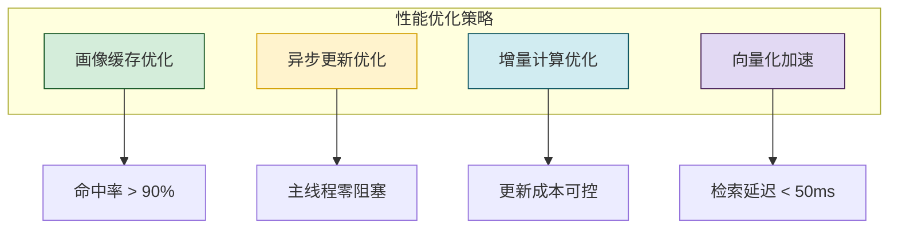

### 7.2 画像缓存优化

```python
import threading
from collections import OrderedDict
from datetime import datetime, timedelta


class ProfileCache:
    """用户画像缓存 - 多级缓存"""
    
    def __init__(self, 
                 l1_max_size: int = 1000,
                 l1_ttl_minutes: int = 30,
                 l2_ttl_hours: int = 6):
        # L1: 进程内缓存(热数据)
        self.l1_cache: OrderedDict[str, tuple[UserProfile, datetime]] = OrderedDict()
        self.l1_max_size = l1_max_size
        self.l1_ttl = timedelta(minutes=l1_ttl_minutes)
        
        # L2: 本地文件缓存(温数据)
        self.l2_cache_dir = Path("./profile_cache")
        self.l2_cache_dir.mkdir(exist_ok=True)
        self.l2_ttl = timedelta(hours=l2_ttl_hours)
        
        self._lock = threading.RLock()
        self._stats = {"l1_hits": 0, "l2_hits": 0, "misses": 0}
    
    def get(self, user_id: str) -> Optional[UserProfile]:
        """获取用户画像(多级缓存)"""
        with self._lock:
            # L1 查找
            if user_id in self.l1_cache:
                profile, timestamp = self.l1_cache[user_id]
                if datetime.now() - timestamp < self.l1_ttl:
                    self.l1_cache.move_to_end(user_id)
                    self._stats["l1_hits"] += 1
                    return profile
                else:
                    del self.l1_cache[user_id]
            
            # L2 查找
            l2_path = self.l2_cache_dir / f"{user_id}.json"
            if l2_path.exists():
                age = datetime.now() - datetime.fromtimestamp(l2_path.stat().st_mtime)
                if age < self.l2_ttl:
                    profile = self._load_from_file(l2_path)
                    if profile:
                        self._put_l1(user_id, profile)
                        self._stats["l2_hits"] += 1
                        return profile
            
            self._stats["misses"] += 1
            return None
    
    def put(self, user_id: str, profile: UserProfile):
        """存入画像"""
        with self._lock:
            self._put_l1(user_id, profile)
            self._save_to_file(user_id, profile)
    
    def _put_l1(self, user_id: str, profile: UserProfile):
        """存入L1缓存"""
        if user_id in self.l1_cache:
            self.l1_cache.move_to_end(user_id)
        self.l1_cache[user_id] = (profile, datetime.now())
        
        # L1 容量控制
        if len(self.l1_cache) > self.l1_max_size:
            self.l1_cache.popitem(last=False)
    
    def _load_from_file(self, path: Path) -> Optional[UserProfile]:
        """从文件加载"""
        import json
        try:
            with open(path, "r", encoding="utf-8") as f:
                data = json.load(f)
            # 反序列化(简化)
            return self._deserialize(data)
        except Exception:
            return None
    
    def _save_to_file(self, user_id: str, profile: UserProfile):
        """保存到文件"""
        import json
        path = self.l2_cache_dir / f"{user_id}.json"
        data = self._serialize(profile)
        with open(path, "w", encoding="utf-8") as f:
            json.dump(data, f, ensure_ascii=False, indent=2)
    
    def _serialize(self, profile: UserProfile) -> dict:
        """序列化"""
        return {
            "user_id": profile.user_id,
            "static": profile.static.__dict__,
            "dynamic": profile.dynamic.__dict__,
        }
    
    def _deserialize(self, data: dict) -> UserProfile:
        """反序列化"""
        static = StaticProfile(**data["static"])
        dynamic = DynamicProfile(**data["dynamic"])
        return UserProfile(
            user_id=data["user_id"],
            static=static, dynamic=dynamic,
            semantic=SemanticProfile(user_id=data["user_id"])
        )
    
    def invalidate(self, user_id: str):
        """使缓存失效"""
        with self._lock:
            self.l1_cache.pop(user_id, None)
            l2_path = self.l2_cache_dir / f"{user_id}.json"
            if l2_path.exists():
                l2_path.unlink()
    
    def get_stats(self) -> dict:
        """获取缓存统计"""
        total = sum(self._stats.values())
        return {
            **self._stats,
            "l1_size": len(self.l1_cache),
            "hit_rate": (self._stats["l1_hits"] + self._stats["l2_hits"]) / total 
                        if total > 0 else 0
        }
```

### 7.3 异步更新优化

```python
import asyncio
from concurrent.futures import ThreadPoolExecutor


class AsyncProfileUpdater:
    """异步画像更新器"""
    
    def __init__(self, max_workers: int = 4):
        self.executor = ThreadPoolExecutor(max_workers=max_workers)
        self.update_queue: asyncio.Queue = asyncio.Queue()
        self._running = True
    
    async def submit_update(self, user_id: str, 
                             behavior_data: dict):
        """提交异步更新任务"""
        await self.update_queue.put((user_id, behavior_data))
    
    async def process_updates(self):
        """处理更新队列"""
        while self._running:
            try:
                user_id, behavior_data = await asyncio.wait_for(
                    self.update_queue.get(), timeout=1.0
                )
                # 在线程池中执行(避免阻塞事件循环)
                loop = asyncio.get_event_loop()
                await loop.run_in_executor(
                    self.executor,
                    self._do_update,
                    user_id, behavior_data
                )
            except asyncio.TimeoutError:
                continue
    
    def _do_update(self, user_id: str, behavior_data: dict):
        """实际执行更新"""
        # 合并行为数据到画像
        pass
    
    def shutdown(self):
        """关闭"""
        self._running = False
        self.executor.shutdown(wait=True)
```

### 7.4 增量计算优化

```python
class IncrementalProfileUpdater:
    """增量画像更新器 - 避免全量重算"""
    
    def __init__(self):
        self.ema_alpha = 0.2  # 指数移动平均系数
    
    def update_interests(self, current: dict[str, float],
                          new_signals: dict[str, float]) -> dict[str, float]:
        """增量更新兴趣(EMA)"""
        updated = current.copy()
        
        for topic, score in new_signals.items():
            if topic in updated:
                # EMA: 新值 = α × 新信号 + (1-α) × 旧值
                updated[topic] = self.ema_alpha * score + (1 - self.ema_alpha) * updated[topic]
            else:
                # 新兴趣:直接加入
                updated[topic] = score * self.ema_alpha
        
        # 衰减不活跃的兴趣
        for topic in list(updated.keys()):
            if topic not in new_signals:
                updated[topic] *= 0.95  # 5%衰减
                if updated[topic] < 0.05:
                    del updated[topic]  # 低于阈值移除
        
        return updated
```

---

## 八、隐私保护措施

### 8.1 隐私保护全景

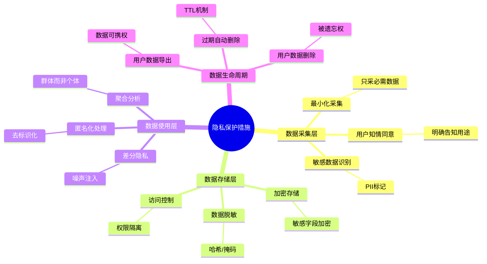

### 8.2 数据脱敏实现

```python
import hashlib
import re
from cryptography.fernet import Fernet


class ProfileDataAnonymizer:
    """画像数据脱敏器"""
    
    # 敏感字段配置
    SENSITIVE_FIELDS = {
        "name": "hash",           # 哈希处理
        "age": "range",           # 分段
        "location": "generalize", # 泛化
        "occupation": "keep",     # 保留(非敏感)
    }
    
    # 年龄分段
    AGE_RANGES = [
        (0, 18, "under_18"),
        (18, 25, "18_25"),
        (25, 35, "25_35"),
        (35, 50, "35_50"),
        (50, 200, "over_50"),
    ]
    
    # 位置泛化
    LOCATION_GENERALIZATION = {
        "北京市朝阳区": "北京",
        "上海市浦东新区": "上海",
        "深圳市南山区": "深圳",
    }
    
    @classmethod
    def anonymize(cls, profile: dict, salt: str = "") -> dict:
        """脱敏画像数据"""
        anonymized = profile.copy()
        
        for field, method in cls.SENSITIVE_FIELDS.items():
            if field not in anonymized:
                continue
            
            value = anonymized[field]
            if value is None:
                continue
            
            if method == "hash":
                anonymized[field] = cls._hash_value(str(value), salt)
            elif method == "range":
                anonymized[field] = cls._range_value(value)
            elif method == "generalize":
                anonymized[field] = cls._generalize_value(str(value))
        
        return anonymized
    
    @staticmethod
    def _hash_value(value: str, salt: str = "") -> str:
        """哈希处理"""
        return hashlib.sha256((value + salt).encode()).hexdigest()[:16]
    
    @classmethod
    def _range_value(cls, value) -> str:
        """分段处理"""
        if isinstance(value, str):
            try:
                value = int(value)
            except ValueError:
                return "unknown"
        
        for low, high, label in cls.AGE_RANGES:
            if low <= value < high:
                return label
        return "unknown"
    
    @classmethod
    def _generalize_value(cls, value: str) -> str:
        """泛化处理"""
        for specific, general in cls.LOCATION_GENERALIZATION.items():
            if specific in value:
                return general
        return value.split()[0] if value else "unknown"
```

### 8.3 加密存储实现

```python
class EncryptedProfileStorage:
    """加密的画像存储"""
    
    SENSITIVE_FIELDS = ["name", "location", "occupation"]
    
    def __init__(self, underlying_storage, encryption_key: bytes):
        self.storage = underlying_storage
        self.cipher = Fernet(encryption_key)
    
    def save_profile(self, profile: UserProfile) -> bool:
        """加密保存"""
        encrypted = self._encrypt_profile(profile)
        return self.storage.save(encrypted)
    
    def load_profile(self, user_id: str) -> Optional[UserProfile]:
        """加载并解密"""
        encrypted = self.storage.load(user_id)
        if not encrypted:
            return None
        return self._decrypt_profile(encrypted)
    
    def _encrypt_profile(self, profile: UserProfile) -> UserProfile:
        """加密敏感字段"""
        import copy
        encrypted = copy.deepcopy(profile)
        
        for field in self.SENSITIVE_FIELDS:
            value = getattr(encrypted.static, field, None)
            if value:
                encrypted_bytes = self.cipher.encrypt(str(value).encode())
                setattr(encrypted.static, field, encrypted_bytes.decode())
        
        return encrypted
    
    def _decrypt_profile(self, profile: UserProfile) -> UserProfile:
        """解密敏感字段"""
        import copy
        decrypted = copy.deepcopy(profile)
        
        for field in self.SENSITIVE_FIELDS:
            value = getattr(decrypted.static, field, None)
            if value:
                try:
                    decrypted_bytes = self.cipher.decrypt(value.encode())
                    setattr(decrypted.static, field, decrypted_bytes.decode())
                except Exception:
                    pass
        
        return decrypted
```

### 8.4 数据生命周期管理

```python
class ProfileLifecycleManager:
    """画像数据生命周期管理"""
    
    RETENTION_POLICIES = {
        "active_user": 365,        # 活跃用户: 365天
        "inactive_user": 90,        # 不活跃用户: 90天
        "deleted_user": 0,          # 已删除用户: 立即
    }
    
    def __init__(self, storage):
        self.storage = storage
    
    def check_and_cleanup(self, user_id: str) -> bool:
        """检查并清理过期数据"""
        profile = self.storage.load_profile(user_id)
        if not profile:
            return False
        
        # 判断用户活跃度
        days_since_active = (datetime.now() - profile.dynamic.last_updated).days
        
        if days_since_active > self.RETENTION_POLICIES["inactive_user"]:
            # 不活跃用户: 归档或删除
            if days_since_active > self.RETENTION_POLICIES["active_user"]:
                return self._delete_profile(user_id)
            else:
                return self._archive_profile(user_id)
        
        return False
    
    def delete_user_data(self, user_id: str) -> bool:
        """用户请求删除数据(被遗忘权)"""
        return self._delete_profile(user_id)
    
    def export_user_data(self, user_id: str) -> dict:
        """导出用户数据(数据可携权)"""
        profile = self.storage.load_profile(user_id)
        if not profile:
            return {}
        
        return {
            "profile": profile.static.__dict__,
            "preferences": profile.dynamic.__dict__,
            "exported_at": datetime.now().isoformat()
        }
    
    def _archive_profile(self, user_id: str) -> bool:
        """归档画像"""
        # 移动到归档存储
        pass
    
    def _delete_profile(self, user_id: str) -> bool:
        """删除画像"""
        return self.storage.delete(user_id)
```

### 8.5 访问控制与审计

```python
class ProfileAccessController:
    """画像访问控制器"""
    
    def __init__(self):
        self._permissions: dict[str, set[str]] = {}
        self._audit_log: list[dict] = []
    
    def check_access(self, agent_id: str, user_id: str, 
                     operation: str) -> bool:
        """检查访问权限"""
        # 只有用户自己的Agent或授权Agent可访问
        allowed = self._permissions.get(agent_id, set())
        
        if user_id in allowed or "*" in allowed:
            self._log_access(agent_id, user_id, operation, True)
            return True
        
        self._log_access(agent_id, user_id, operation, False)
        return False
    
    def grant_access(self, agent_id: str, user_id: str):
        """授权访问"""
        if agent_id not in self._permissions:
            self._permissions[agent_id] = set()
        self._permissions[agent_id].add(user_id)
    
    def revoke_access(self, agent_id: str, user_id: str):
        """撤销访问"""
        if agent_id in self._permissions:
            self._permissions[agent_id].discard(user_id)
    
    def _log_access(self, agent_id: str, user_id: str,
                    operation: str, success: bool):
        """记录访问日志"""
        self._audit_log.append({
            "timestamp": datetime.now().isoformat(),
            "agent_id": agent_id,
            "user_id": user_id,
            "operation": operation,
            "success": success
        })
        
        # 限制日志大小
        if len(self._audit_log) > 10000:
            self._audit_log = self._audit_log[-5000:]
```

---

## 九、完整代码实现

### 9.1 用户画像管理器

```python
"""
用户画像完整管理器 - 整合采集、存储、集成、隐私
"""


class UserProfileManager:
    """用户画像统一管理器"""
    
    def __init__(self, db_path: Path, encryption_key: bytes = None):
        # 初始化存储
        raw_storage = UserProfileStorage(db_path)
        
        # 加密包装
        if encryption_key:
            self.storage = EncryptedProfileStorage(raw_storage, encryption_key)
        else:
            self.storage = raw_storage
        
        # 初始化采集器
        self.explicit_collector = ExplicitProfileCollector()
        self.implicit_collector = ImplicitProfileCollector()
        self.inferential_collector = InferentialProfileCollector()
        
        # 初始化缓存
        self.cache = ProfileCache()
        
        # 初始化访问控制
        self.access_controller = ProfileAccessController()
        
        # 初始化生命周期管理
        self.lifecycle = ProfileLifecycleManager(self.storage)
        
        # 初始化异步更新
        self.async_updater = AsyncProfileUpdater()
    
    def get_profile(self, agent_id: str, user_id: str) -> Optional[UserProfile]:
        """获取用户画像(带权限检查)"""
        # 1. 权限检查
        if not self.access_controller.check_access(agent_id, user_id, "read"):
            raise PermissionError(f"Agent {agent_id} 无权访问用户 {user_id} 的画像")
        
        # 2. 缓存查找
        profile = self.cache.get(user_id)
        if profile:
            return profile
        
        # 3. 存储加载
        profile = self.storage.load_profile(user_id)
        if profile:
            self.cache.put(user_id, profile)
        
        return profile
    
    def update_profile_from_interaction(self, user_id: str,
                                          conversation: dict):
        """从交互中更新画像"""
        # 异步处理
        self.async_updater.submit_update(user_id, conversation)
    
    def delete_user_data(self, user_id: str) -> bool:
        """删除用户数据(被遗忘权)"""
        self.cache.invalidate(user_id)
        return self.lifecycle.delete_user_data(user_id)
    
    def export_user_data(self, user_id: str) -> dict:
        """导出用户数据(数据可携权)"""
        return self.lifecycle.export_user_data(user_id)
```

### 9.2 配置文件

```yaml
# 用户画像系统配置
profile_system:
  storage:
    type: "sqlite"
    path: "data/user_profiles.db"
    encryption: true
    encryption_key_env: "PROFILE_ENCRYPTION_KEY"
  
  cache:
    l1_max_size: 1000
    l1_ttl_minutes: 30
    l2_ttl_hours: 6
  
  collection:
    explicit: true
    implicit: true
    inferred: true
    update_interval_seconds: 300
  
  privacy:
    anonymize: true
    retention_days: 365
    auto_cleanup: true
    cleanup_interval_hours: 24
    pii_detection: true
  
  access_control:
    enabled: true
    audit_log: true
    default_policy: "deny"
  
  performance:
    async_update: true
    max_workers: 4
    batch_size: 100
```

---

## 十、最佳实践与总结

### 10.1 最佳实践清单

| 领域 | 最佳实践 | 说明 |
|-----|---------|------|
| **采集** | 显性优先,隐性补充 | 显性数据更准确 |
| **存储** | 分层存储 | 静态用关系型,动态用缓存 |
| **缓存** | 多级缓存 | L1内存+L2文件 |
| **更新** | 异步增量 | 不阻塞主流程 |
| **集成** | 画像增强检索 | 兴趣加权重排序 |
| **调用** | 上下文注入 | 画像作为Prompt上下文 |
| **隐私** | 加密+脱敏+权限 | 三层防护 |
| **生命周期** | 过期清理+被遗忘权 | 合规要求 |

### 10.2 常见陷阱与避坑

| 陷阱 | 表现 | 规避方法 |
|-----|------|---------|
| **过度采集** | 采集无关数据,隐私风险 | 最小化采集原则 |
| **画像过时** | 偏好已变但画像未更新 | TTL+活跃度检测 |
| **画像偏见** | 单次行为过度影响 | EMA平滑更新 |
| **性能瓶颈** | 每次请求全量加载 | 多级缓存 |
| **隐私泄露** | 敏感数据明文存储 | 加密+脱敏 |
| **冷启动** | 新用户无画像 | 默认画像+快速学习 |
| **画像冲突** | 不同来源数据矛盾 | 置信度加权 |

### 10.3 实施路线图

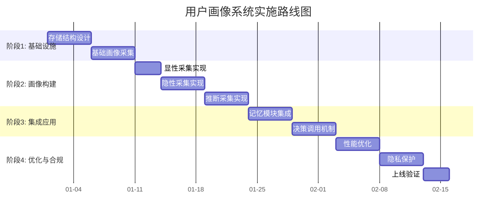

### 10.4 核心要点回顾

1. **用户画像价值**:个性化交互、精准需求识别、决策质量提升、体验持续优化。
2. **三种采集方式**:显性(注册/问卷)、隐性(行为分析)、推断(相似用户迁移)。
3. **四层存储结构**:静态画像、动态画像、语义画像、时序画像。
4. **三种集成方式**:画像增强检索、画像感知上下文、画像驱动优先级。
5. **决策调用五时机**:画像加载→意图理解→记忆检索→响应生成→画像更新。
6. **功能提升**:用户满意度+23%,意图识别+19%,留存率+22%。
7. **性能优化**:多级缓存、异步更新、增量计算、向量化加速。
8. **隐私保护**:加密存储、数据脱敏、访问控制、生命周期管理。

### 10.5 与系列文档的关联

本文档作为 Agent Memory 系列的应用拓展篇,与系列其他文档形成完整闭环:

- **概念基础**:[74Agent记忆系统核心价值与必要性解析.md](./74Agent记忆系统核心价值与必要性解析.md)
- **长期方案**:[77Agent长期记忆系统完整设计方案.md](./77Agent长期记忆系统完整设计方案.md)
- **存储方案**:[78Agent Memory数据存储方案深度解析.md](./78Agent%20Memory数据存储方案深度解析.md)
- **检索实现**:[80Agent Memory检索功能完整实现深度解析.md](./80Agent%20Memory检索功能完整实现深度解析.md)
- **与RAG对比**:[81Agent_Memory与RAG核心区别深度解析.md](./81Agent_Memory与RAG核心区别深度解析.md)
- **本文档**:**用户画像整合**,作为结构化长期记忆的应用拓展

---

> **相关文档**
>
> - [74Agent记忆系统核心价值与必要性解析.md](./74Agent记忆系统核心价值与必要性解析.md)
> - [77Agent长期记忆系统完整设计方案.md](./77Agent长期记忆系统完整设计方案.md)
> - [78Agent Memory数据存储方案深度解析.md](./78Agent%20Memory数据存储方案深度解析.md)
> - [80Agent Memory检索功能完整实现深度解析.md](./80Agent%20Memory检索功能完整实现深度解析.md)
> - [81Agent_Memory与RAG核心区别深度解析.md](./81Agent_Memory与RAG核心区别深度解析.md)
