# 用户偏好记忆系统完整设计与实现方案

> **文档定位**:本文档是 `5Agent Memory` 系列的工程落地篇,系统阐述 **Agent 系统中用户偏好记忆(User Preference Memory)** 的完整设计与实现方案,聚焦"**用户喜欢什么、设置了什么、习惯如何**"这类**显式或隐式偏好数据**的**持久化存储、高效读取、实时更新、跨设备同步、备份恢复与安全防护**全链路工程问题。区别于 [82用户画像技术与Agent系统整合应用深度解析.md](./82用户画像技术与Agent系统整合应用深度解析.md) 侧重"用户是谁"的全方位画像建模,本文聚焦"用户偏好"这一更具体、更结构化的记忆子系统的工程实现,为构建跨设备一致的个性化 Agent 提供可直接落地的技术蓝图。
>
> **阅读建议**:本文是 Agent Memory 系列的工程深化篇,建议结合 [77Agent长期记忆系统完整设计方案.md](./77Agent长期记忆系统完整设计方案.md)（长期记忆架构）、[78Agent Memory数据存储方案深度解析.md](./78Agent%20Memory数据存储方案深度解析.md)（存储选型）、[80Agent Memory检索功能完整实现深度解析.md](./80Agent%20Memory检索功能完整实现深度解析.md)（检索机制）、[82用户画像技术与Agent系统整合应用深度解析.md](./82用户画像技术与Agent系统整合应用深度解析.md)（画像应用）一并阅读,理解偏好记忆在整体记忆体系中的定位与协同。

---

## 目录

- [一、用户偏好记忆系统概述](#一用户偏好记忆系统概述)
- [二、用户偏好数据分类与建模](#二用户偏好数据分类与建模)
- [三、持久化存储方案设计](#三持久化存储方案设计)
- [四、高效读取机制](#四高效读取机制)
- [五、实时更新机制](#五实时更新机制)
- [六、跨设备同步方案](#六跨设备同步方案)
- [七、备份与恢复机制](#七备份与恢复机制)
- [八、安全存储方案](#八安全存储方案)
- [九、与现有系统架构集成](#九与现有系统架构集成)
- [十、完整代码实现](#十完整代码实现)
- [十一、性能优化建议](#十一性能优化建议)
- [十二、最佳实践与避坑指南](#十二最佳实践与避坑指南)

---

## 一、用户偏好记忆系统概述

### 1.1 什么是用户偏好记忆

**用户偏好记忆(User Preference Memory)** 是 Agent 记忆系统中专门用于**存储、管理、调用用户个性化偏好数据**的子系统。它记录用户在使用 Agent 过程中**显式设置**或**隐式表现**出的偏好,包括但不限于:

- **界面偏好**:主题色、字体大小、布局密度、深色模式
- **交互偏好**:回复语言、详略程度、语气风格、回复格式
- **行为习惯**:常用工具、活跃时段、操作路径、快捷指令
- **业务偏好**:常用业务对象、默认参数、过滤条件、排序规则
- **隐私偏好**:数据共享范围、可见性设置、推荐接收开关
- **通知偏好**:通知渠道、频率、免打扰时段、重要级别

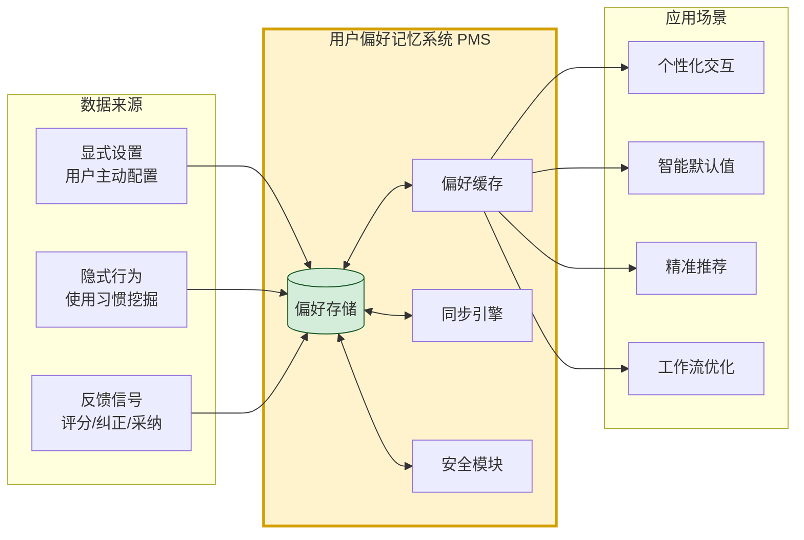

### 1.2 与用户画像、长期记忆的关系

| 维度 | 用户画像(82号) | 用户偏好记忆(本文) | 长期记忆(77号) |
|------|---------------|------------------|---------------|
| **数据本质** | 用户是谁(属性、标签) | 用户喜欢/设置什么(键值化偏好) | 用户经历过什么(事件、对话) |
| **数据结构** | 标签体系、向量 | 结构化键值对、Schema 化 | 半结构化、向量化文本 |
| **数据来源** | 多源融合推断 | 显式设置 + 行为挖掘 | 对话与交互历史 |
| **更新频率** | 周期性批量更新 | 实时/准实时更新 | 持续追加 |
| **数据量级** | KB-MB(每用户) | KB(每用户,几百到几千键值) | MB-GB(每用户) |
| **检索方式** | 标签查询、相似匹配 | 精确键查询 | 向量相似检索 |
| **应用场景** | 用户分群、推荐 | 个性化配置、智能默认 | 上下文回忆、知识引用 |

> **关键区别**:用户画像是"推断出的用户模型"(谁是这人),用户偏好是"用户明确表达的喜好"(这人有何偏好),长期记忆是"用户经历的事实"(这人做过什么)。三者互补但不重叠。

### 1.3 核心设计目标

| 目标层级 | 目标项 | 衡量指标 |
|---------|-------|---------|
| **功能目标** | 偏好数据完整持久化,不丢失 | 数据持久化成功率 = 100% |
| **功能目标** | 跨设备偏好一致 | 同步一致性 = 100% |
| **性能目标** | 读取低延迟,不阻塞主流程 | P99 读取延迟 < 5ms |
| **性能目标** | 更新实时生效 | 显式设置 → 生效 < 100ms |
| **可靠性目标** | 备份恢复完备 | RPO < 1min,RTO < 5min |
| **安全目标** | 偏好数据加密存储与传输 | 敏感字段加密率 = 100% |
| **扩展目标** | 与现有架构无缝集成 | 集成成本 < 1 人周 |

### 1.4 五大核心挑战

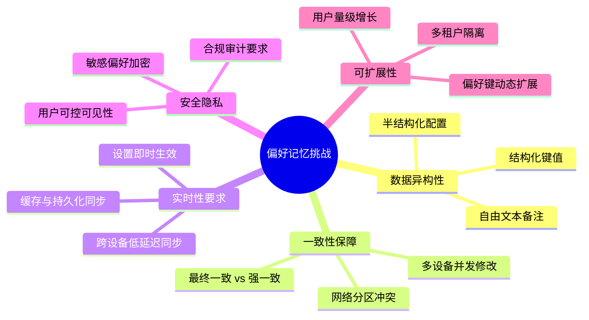

---

## 二、用户偏好数据分类与建模

### 2.1 偏好数据分类体系

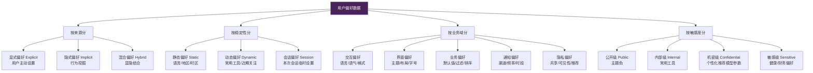

### 2.2 偏好数据模型设计

#### 2.2.1 核心数据模型

```python
from dataclasses import dataclass, field
from typing import Any, Optional
from datetime import datetime
from enum import Enum

class PreferenceSource(str, Enum):
    """偏好来源"""
    EXPLICIT = "explicit"      # 用户主动设置
    IMPLICIT = "implicit"      # 行为挖掘
    INFERRED = "inferred"      # 推断得出
    DEFAULT = "default"        # 系统默认值
    IMPORTED = "imported"      # 外部导入

class PreferenceScope(str, Enum):
    """偏好作用域"""
    GLOBAL = "global"          # 全局生效
    TENANT = "tenant"          # 租户级
    APP = "app"                # 应用级
    SESSION = "session"        # 会话级(临时)
    DEVICE = "device"          # 设备级

class PreferenceSensitivity(str, Enum):
    """偏好敏感度"""
    PUBLIC = "public"
    INTERNAL = "internal"
    CONFIDENTIAL = "confidential"
    SENSITIVE = "sensitive"

@dataclass
class PreferenceItem:
    """单个偏好项"""
    # === 标识 ===
    user_id: str                          # 用户ID
    pref_key: str                         # 偏好键 (如 "ui.theme", "reply.language")
    namespace: str = "global"             # 命名空间 (避免键冲突)
    
    # === 值 ===
    pref_value: Any = None                # 偏好值 (支持任意JSON可序列化类型)
    value_type: str = "string"            # string/int/bool/json/array
    default_value: Any = None             # 默认值 (用户未设置时返回)
    
    # === 元数据 ===
    source: PreferenceSource = PreferenceSource.DEFAULT
    scope: PreferenceScope = PreferenceScope.GLOBAL
    sensitivity: PreferenceSensitivity = PreferenceSensitivity.PUBLIC
    
    # === 版本与时间 ===
    version: int = 1                      # 乐观锁版本号
    created_at: datetime = field(default_factory=datetime.utcnow)
    updated_at: datetime = field(default_factory=datetime.utcnow)
    expires_at: Optional[datetime] = None # 过期时间 (会话级偏好用)
    
    # === 来源追踪 ===
    created_by: str = "system"            # 创建者
    updated_by: str = "system"            # 最近更新者
    device_id: Optional[str] = None       # 设置该偏好的设备
    confidence: float = 1.0               # 置信度 (隐式偏好<1.0)
    
    # === 同步 ===
    sync_status: str = "synced"           # synced/pending/conflict
    last_synced_at: Optional[datetime] = None
```

#### 2.2.2 偏好键命名规范

采用**层级化点号分隔**命名,确保可读性与可扩展性:

```
{domain}.{subdomain}.{specific_key}

示例:
  ui.theme.dark_mode             # 界面.主题.深色模式
  ui.layout.density              # 界面.布局.密度
  reply.language                 # 回复.语言
  reply.tone                     # 回复.语气
  reply.detail_level             # 回复.详细程度
  reply.format.markdown          # 回复.格式.Markdown
  business.order.default_sort    # 业务.订单.默认排序
  business.order.filter.presets  # 业务.订单.过滤预设
  notification.email.frequency   # 通知.邮件.频率
  notification.push.quiet_hours  # 通知.推送.免打扰时段
  privacy.data_sharing.analytics # 隐私.数据共享.分析
  tool.favorites                 # 工具.收藏
  shortcut.custom_commands       # 快捷指令.自定义命令
```

#### 2.2.3 偏好 Schema 注册表

为避免偏好键无序扩张,建立 Schema 注册表,声明每个偏好键的类型、约束、默认值:

```python
@dataclass
class PreferenceSchema:
    """偏好键的元数据定义"""
    key: str                              # 偏好键
    display_name: str                     # 显示名
    description: str                      # 描述
    value_type: str                       # 类型
    default_value: Any                    # 默认值
    allowed_values: Optional[list] = None # 枚举值约束
    min_value: Optional[float] = None     # 数值范围
    max_value: Optional[float] = None
    pattern: Optional[str] = None         # 字符串正则约束
    sensitivity: PreferenceSensitivity = PreferenceSensitivity.PUBLIC
    scope: PreferenceScope = PreferenceScope.GLOBAL
    immutable: bool = False               # 是否不可修改(如注册时确定的地区)
    validatable: bool = True              # 是否需要校验

# === Schema 注册表示例 ===
PREFERENCE_SCHEMAS = {
    "ui.theme.dark_mode": PreferenceSchema(
        key="ui.theme.dark_mode",
        display_name="深色模式",
        description="界面是否使用深色主题",
        value_type="bool",
        default_value=False,
        allowed_values=[True, False],
    ),
    "reply.language": PreferenceSchema(
        key="reply.language",
        display_name="回复语言",
        description="Agent 回复使用的语言",
        value_type="string",
        default_value="auto",  # auto 表示跟随用户输入语言
        allowed_values=["auto", "zh-CN", "en-US", "ja-JP", "ko-KR"],
    ),
    "reply.detail_level": PreferenceSchema(
        key="reply.detail_level",
        display_name="回复详细程度",
        description="Agent 回复的详细程度",
        value_type="string",
        default_value="medium",
        allowed_values=["brief", "medium", "detailed"],
    ),
    "business.order.default_sort": PreferenceSchema(
        key="business.order.default_sort",
        display_name="订单默认排序",
        description="订单列表的默认排序方式",
        value_type="json",
        default_value={"field": "created_at", "order": "desc"},
    ),
    "notification.push.quiet_hours": PreferenceSchema(
        key="notification.push.quiet_hours",
        display_name="推送免打扰时段",
        description="推送通知的免打扰时间段",
        value_type="json",
        default_value={"start": "22:00", "end": "08:00"},
    ),
}
```

### 2.3 偏好数据生命周期

```mermaid
stateDiagram-v2
    [*] --> Default: 用户首次使用<br/>加载默认值
    Default --> Explicit: 用户主动设置
    Default --> Implicit: 行为挖掘更新
    Explicit --> Explicit: 用户修改设置
    Implicit --> Explicit: 用户确认隐式偏好
    Explicit --> Synced: 写入存储+同步
    Implicit --> Synced: 写入存储+同步
    Synced --> Conflict: 多设备并发修改
    Conflict --> Resolved: 冲突解决
    Resolved --> Synced
    Synced --> Expired: 会话级偏好过期
    Expired --> Default: 恢复默认值
    Synced --> Archived: 用户删除/重置
    Archived --> [*]
```

---

## 三、持久化存储方案设计

### 3.1 存储分层架构

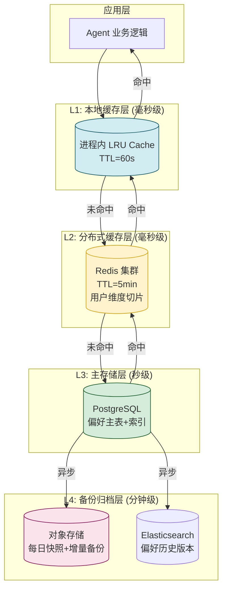

| 层级 | 存储介质 | 数据特征 | 访问频率 | TTL/保留 |
|------|---------|---------|---------|---------|
| **L1 本地缓存** | 进程内 LRU | 热点偏好 | 极高(每请求) | 60s |
| **L2 分布式缓存** | Redis | 当前用户全量偏好 | 高(每会话) | 5min |
| **L3 主存储** | PostgreSQL | 全量偏好(最新版本) | 中(更新时) | 永久 |
| **L4 备份归档** | S3 + ES | 历史版本+快照 | 低(恢复时) | 90天 |

### 3.2 主存储表结构设计 (PostgreSQL)

#### 3.2.1 偏好主表

```sql
-- 偏好主表: 存储用户当前生效的偏好
CREATE TABLE user_preferences (
    -- === 主键 ===
    id              BIGSERIAL PRIMARY KEY,
    
    -- === 标识 ===
    user_id         VARCHAR(64) NOT NULL,
    tenant_id       VARCHAR(64) NOT NULL DEFAULT 'default',
    pref_key        VARCHAR(256) NOT NULL,
    namespace       VARCHAR(64) NOT NULL DEFAULT 'global',
    
    -- === 值 ===
    pref_value      JSONB NOT NULL,           -- JSONB 支持任意类型
    value_type      VARCHAR(16) NOT NULL,     -- string/int/bool/json/array
    default_value   JSONB,
    
    -- === 元数据 ===
    source          VARCHAR(16) NOT NULL DEFAULT 'default',  -- explicit/implicit/inferred/default
    scope           VARCHAR(16) NOT NULL DEFAULT 'global',
    sensitivity     VARCHAR(16) NOT NULL DEFAULT 'public',
    confidence      REAL DEFAULT 1.0,
    
    -- === 版本与时间 ===
    version         INT NOT NULL DEFAULT 1,   -- 乐观锁
    created_at      TIMESTAMPTZ NOT NULL DEFAULT now(),
    updated_at      TIMESTAMPTZ NOT NULL DEFAULT now(),
    expires_at      TIMESTAMPTZ,              -- 会话级偏好过期时间
    
    -- === 来源追踪 ===
    created_by      VARCHAR(64) NOT NULL DEFAULT 'system',
    updated_by      VARCHAR(64) NOT NULL DEFAULT 'system',
    device_id       VARCHAR(64),
    
    -- === 同步状态 ===
    sync_status     VARCHAR(16) NOT NULL DEFAULT 'synced',
    last_synced_at  TIMESTAMPTZ,
    
    -- === 唯一约束: 一个用户在同一命名空间下, 一个偏好键只能有一行 ===
    CONSTRAINT uk_user_pref UNIQUE (user_id, tenant_id, pref_key, namespace)
);

-- === 关键索引 ===
CREATE INDEX idx_pref_user ON user_preferences (user_id, tenant_id);
CREATE INDEX idx_pref_user_ns ON user_preferences (user_id, tenant_id, namespace);
CREATE INDEX idx_pref_key ON user_preferences (pref_key);
CREATE INDEX idx_pref_scope ON user_preferences (scope, expires_at);
CREATE INDEX idx_pref_sync ON user_preferences (sync_status) WHERE sync_status != 'synced';
CREATE INDEX idx_pref_updated ON user_preferences (updated_at DESC);

-- 部分索引: 仅会话级偏好查询过期(避免扫描全表)
CREATE INDEX idx_pref_expiring ON user_preferences (expires_at) 
    WHERE expires_at IS NOT NULL;
```

#### 3.2.2 偏好历史版本表(审计与回滚)

```sql
-- 偏好历史表: 记录每次变更,支持审计与回滚
CREATE TABLE user_preferences_history (
    id              BIGSERIAL PRIMARY KEY,
    user_id         VARCHAR(64) NOT NULL,
    tenant_id       VARCHAR(64) NOT NULL,
    pref_key        VARCHAR(256) NOT NULL,
    namespace       VARCHAR(64) NOT NULL,
    
    old_value       JSONB,                    -- 变更前的值
    new_value       JSONB,                    -- 变更后的值
    old_version     INT,
    new_version     INT,
    
    change_type     VARCHAR(16) NOT NULL,     -- create/update/delete
    changed_by      VARCHAR(64) NOT NULL,
    device_id       VARCHAR(64),
    change_reason   VARCHAR(256),             -- user_setting/behavior_mining/conflict_resolve
    changed_at      TIMESTAMPTZ NOT NULL DEFAULT now()
);

CREATE INDEX idx_hist_user_key ON user_preferences_history (user_id, pref_key, changed_at DESC);
CREATE INDEX idx_hist_changed ON user_preferences_history (changed_at DESC);
```

#### 3.2.3 设备同步状态表

```sql
-- 设备同步状态表: 跟踪每台设备的同步进度
CREATE TABLE user_device_sync (
    id              BIGSERIAL PRIMARY KEY,
    user_id         VARCHAR(64) NOT NULL,
    device_id       VARCHAR(64) NOT NULL,
    device_type     VARCHAR(32) NOT NULL,     -- web/ios/android/desktop
    device_name     VARCHAR(128),
    
    last_sync_at    TIMESTAMPTZ,
    last_sync_version BIGINT,                 -- 最后同步的全局版本号
    pending_changes INT DEFAULT 0,            -- 待上传的本地变更数
    
    is_active       BOOLEAN DEFAULT TRUE,
    created_at      TIMESTAMPTZ DEFAULT now(),
    
    UNIQUE (user_id, device_id)
);

CREATE INDEX idx_device_user ON user_device_sync (user_id, is_active);
```

#### 3.2.4 全局版本号表(用于增量同步)

```sql
-- 全局版本号表: 每次偏好变更递增, 用于增量同步
CREATE TABLE preference_version_log (
    version         BIGSERIAL PRIMARY KEY,    -- 全局递增版本号
    user_id         VARCHAR(64) NOT NULL,
    tenant_id       VARCHAR(64) NOT NULL,
    pref_key        VARCHAR(256) NOT NULL,
    namespace       VARCHAR(64) NOT NULL,
    change_type     VARCHAR(16) NOT NULL,
    changed_at      TIMESTAMPTZ NOT NULL DEFAULT now(),
    changed_by      VARCHAR(64)
);

CREATE INDEX idx_version_user ON preference_version_log (user_id, version);
```

### 3.3 多租户隔离设计

```python
# 多租户通过 tenant_id 字段隔离, 查询时强制注入
def get_preference(user_id: str, pref_key: str, tenant_ctx: TenantContext):
    # 所有查询强制带 tenant_id, 防止跨租户数据泄露
    return db.query(
        "SELECT * FROM user_preferences "
        "WHERE user_id = %s AND tenant_id = %s AND pref_key = %s",
        [user_id, tenant_ctx.tenant_id, pref_key]
    )
```

### 3.4 存储容量估算

| 用户规模 | 偏好键数/用户 | 单条平均大小 | 总容量 | 推荐方案 |
|---------|-------------|------------|--------|---------|
| 1 万用户 | 100 | 200B | 200MB | 单机 PostgreSQL |
| 10 万用户 | 100 | 200B | 2GB | PostgreSQL + Redis 缓存 |
| 100 万用户 | 200 | 300B | 60GB | PostgreSQL 分库 + Redis 集群 |
| 1000 万用户 | 300 | 300B | 900GB | PostgreSQL 水平分片(按 user_id) |

> **关键观察**:偏好数据量级远小于长期记忆(每用户 KB 级 vs MB 级),但访问频率极高(每请求都读),因此**缓存命中率**是性能关键。

---

## 四、高效读取机制

### 4.1 三级缓存读取流程

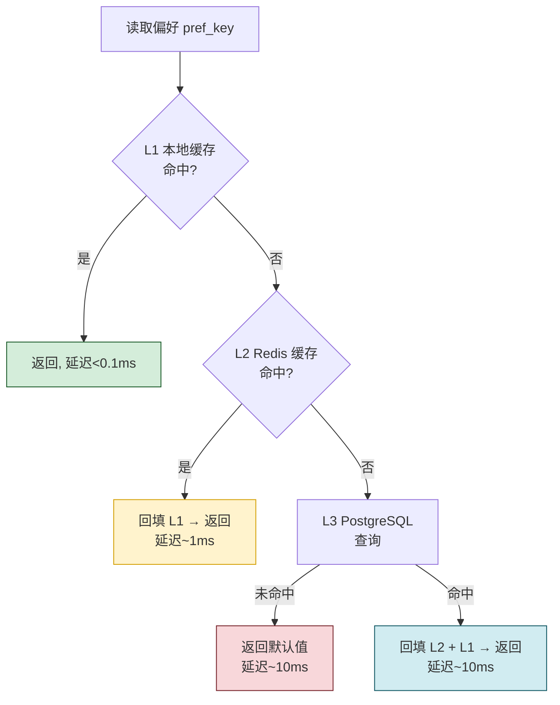

### 4.2 批量预加载机制

Agent 处理一次请求通常需要多个偏好(语言+语气+格式+工具偏好),逐个读取效率低。采用**批量预加载**:

```python
class PreferenceReader:
    """偏好读取器: 三级缓存 + 批量预加载"""

    def __init__(self, local_cache, redis_cache, db_repo):
        self.l1 = local_cache          # 进程内 LRU
        self.l2 = redis_cache          # Redis
        self.db = db_repo              # PostgreSQL
        self.PREFETCH_BATCH_SIZE = 50

    async def get(self, user_id: str, pref_key: str, tenant_id: str = "default") -> Any:
        """读取单个偏好"""
        # L1
        cache_key = self._cache_key(user_id, tenant_id, pref_key)
        if (val := self.l1.get(cache_key)) is not None:
            return val
        
        # L2 (Redis MGET 优化批量)
        val = await self.l2.get(cache_key)
        if val is not None:
            self.l1.set(cache_key, val, ttl=60)
            return val
        
        # L3 DB
        item = await self.db.get(user_id, tenant_id, pref_key)
        if item is None:
            # 返回 Schema 默认值
            return PREFERENCE_SCHEMAS.get(pref_key, {}).get("default_value")
        
        # 回填缓存
        await self.l2.set(cache_key, item.pref_value, ttl=300)
        self.l1.set(cache_key, item.pref_value, ttl=60)
        return item.pref_value

    async def get_batch(self, user_id: str, pref_keys: list[str], 
                        tenant_id: str = "default") -> dict[str, Any]:
        """批量读取: 利用 Redis MGET + DB 单次查询, 大幅减少 RTT"""
        result = {}
        miss_keys = []
        
        # 1. L1 批量检查
        for key in pref_keys:
            cache_key = self._cache_key(user_id, tenant_id, key)
            if (val := self.l1.get(cache_key)) is not None:
                result[key] = val
            else:
                miss_keys.append((key, cache_key))
        
        if not miss_keys:
            return result  # 全部命中 L1
        
        # 2. L2 Redis MGET 批量
        cache_keys = [ck for _, ck in miss_keys]
        l2_values = await self.l2.mget(cache_keys)
        still_miss = []
        for (key, cache_key), val in zip(miss_keys, l2_values):
            if val is not None:
                result[key] = val
                self.l1.set(cache_key, val, ttl=60)
            else:
                still_miss.append(key)
        
        if not still_miss:
            return result
        
        # 3. L3 DB 单次 IN 查询
        db_items = await self.db.get_batch(user_id, tenant_id, still_miss)
        for key in still_miss:
            item = db_items.get(key)
            val = item.pref_value if item else PREFERENCE_SCHEMAS.get(key, {}).get("default_value")
            result[key] = val
            # 回填 L2 + L1
            cache_key = self._cache_key(user_id, tenant_id, key)
            await self.l2.set(cache_key, val, ttl=300)
            self.l1.set(cache_key, val, ttl=60)
        
        return result

    async def prefetch_user_prefs(self, user_id: str, tenant_id: str = "default"):
        """请求开始时预加载该用户全量偏好到 L2, 后续读取全部命中缓存"""
        all_items = await self.db.get_all_for_user(user_id, tenant_id)
        if all_items:
            cache_mapping = {
                self._cache_key(user_id, tenant_id, item.pref_key): item.pref_value
                for item in all_items
            }
            await self.l2.mset(cache_mapping, ttl=300)
```

### 4.3 缓存 Key 设计与失效

```
缓存 Key 格式:
  pref:{tenant_id}:{user_id}:{pref_key}
  例: pref:default:u_123:ui.theme.dark_mode

失效策略:
  1. 写入时主动失效: 更新DB后, 删除L1+L2对应Key
  2. TTL兜底: L1=60s, L2=300s, 防止脏数据长期存在
  3. 用户级批量失效: 用户重置偏好时, 删除该用户所有Key
     使用 Redis SCAN + DELETE by pattern: pref:{tenant}:{user}:*
```

### 4.4 读取性能基准

| 读取场景 | 延迟(P99) | 吞吐量(单节点) |
|---------|----------|---------------|
| L1 命中 | 0.05ms | 1,000,000/s |
| L2 命中 | 1ms | 100,000/s |
| L3 命中 | 10ms | 10,000/s |
| 批量读取(10个键,L2命中) | 2ms | 50,000/s |
| 预加载后批量读(全L1) | 0.1ms | 1,000,000/s |

---

## 五、实时更新机制

### 5.1 更新流程全景

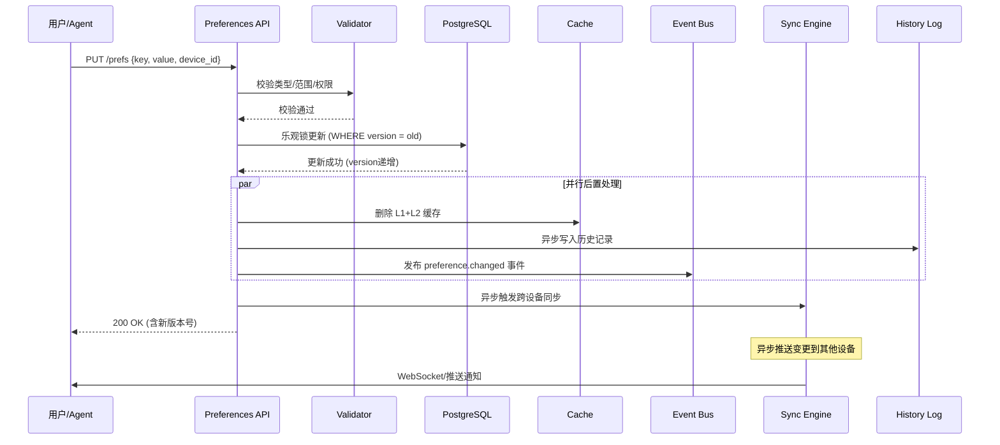

### 5.2 乐观锁并发控制

多设备并发修改同一偏好时,用乐观锁避免覆盖:

```python
class PreferenceWriter:
    """偏好写入器: 乐观锁 + 冲突处理"""

    MAX_RETRY = 3

    async def update(self, user_id: str, pref_key: str, new_value: Any,
                     device_id: str, expected_version: int = None,
                     tenant_id: str = "default") -> PreferenceItem:
        """更新偏好, 支持乐观锁"""
        
        # 1. Schema 校验
        schema = PREFERENCE_SCHEMAS.get(pref_key)
        if schema and schema.immutable:
            raise ImmutablePreferenceError(f"偏好 {pref_key} 不可修改")
        if schema:
            self._validate_value(schema, new_value)
        
        # 2. 乐观锁重试循环
        for attempt in range(self.MAX_RETRY):
            current = await self.db.get(user_id, tenant_id, pref_key)
            current_version = current.version if current else 0
            
            # 3. 版本检查
            if expected_version is not None and expected_version != current_version:
                raise VersionConflictError(
                    f"版本冲突: 期望 {expected_version}, 实际 {current_version}"
                )
            
            # 4. 乐观锁更新 (CAS)
            try:
                updated = await self.db.update_with_version(
                    user_id=user_id,
                    tenant_id=tenant_id,
                    pref_key=pref_key,
                    new_value=new_value,
                    old_version=current_version,
                    new_version=current_version + 1,
                    device_id=device_id,
                    updated_by=device_id,
                )
                break  # 成功
            except ConcurrentUpdateError:
                if attempt == self.MAX_RETRY - 1:
                    raise
                await asyncio.sleep(0.05 * (attempt + 1))  # 退避重试
        
        # 5. 后置处理(异步)
        await asyncio.gather(
            self._invalidate_cache(user_id, tenant_id, pref_key),
            self._log_history(current, updated, device_id),
            self._publish_change_event(updated),
            self._trigger_sync(user_id, pref_key, updated.version, device_id),
        )
        
        return updated

    def _validate_value(self, schema: PreferenceSchema, value: Any):
        """Schema 校验"""
        # 类型校验
        if schema.value_type == "bool" and not isinstance(value, bool):
            raise ValueError(f"{schema.key} 应为 bool 类型")
        if schema.value_type == "int" and not isinstance(value, int):
            raise ValueError(f"{schema.key} 应为 int 类型")
        # 枚举校验
        if schema.allowed_values and value not in schema.allowed_values:
            raise ValueError(f"{schema.key} 值 {value} 不在允许范围 {schema.allowed_values}")
        # 范围校验
        if schema.min_value is not None and value < schema.min_value:
            raise ValueError(f"{schema.key} 值 {value} < 最小值 {schema.min_value}")
        if schema.max_value is not None and value > schema.max_value:
            raise ValueError(f"{schema.key} 值 {value} > 最大值 {schema.max_value}")
        # 正则校验
        if schema.pattern and isinstance(value, str):
            if not re.match(schema.pattern, value):
                raise ValueError(f"{schema.key} 值不匹配模式 {schema.pattern}")
```

### 5.3 隐式偏好挖掘

除用户显式设置外,Agent 通过行为挖掘自动更新偏好:

```python
class ImplicitPreferenceMiner:
    """隐式偏好挖掘器: 从用户行为中推断偏好"""

    async def on_user_action(self, user_id: str, action: UserAction):
        """用户行为事件触发偏好挖掘"""
        # 示例: 用户连续5次将"详细回复"改为"简略", 提升简略偏好置信度
        if action.type == "reply.detail_level_changed":
            await self._mine_detail_level(user_id, action)
        
        # 示例: 用户每天 22:00-08:00 不响应通知, 推断免打扰时段
        elif action.type == "notification_response_pattern":
            await self._mine_quiet_hours(user_id, action)
        
        # 示例: 用户常调用某工具, 提升其偏好排序
        elif action.type == "tool_invoked":
            await self._mine_tool_preference(user_id, action)

    async def _mine_detail_level(self, user_id: str, action: UserAction):
        """挖掘回复详细程度偏好"""
        recent_changes = await self.db.get_recent_actions(
            user_id, action_type="reply.detail_level_changed", limit=10
        )
        brief_count = sum(1 for a in recent_changes if a.new_value == "brief")
        
        if brief_count >= 5:
            # 置信度 = min(隐式行为频次 / 阈值, 0.9) 不超过0.9, 低于显式设置的1.0
            confidence = min(brief_count / 10, 0.9)
            current = await self.db.get(user_id, "default", "reply.detail_level")
            
            # 仅当隐式置信度高于当前值时才更新
            if current is None or current.confidence < confidence:
                await self.writer.update(
                    user_id=user_id,
                    pref_key="reply.detail_level",
                    new_value="brief",
                    device_id="system_miner",
                    source=PreferenceSource.IMPLICIT,
                    confidence=confidence,
                )
```

### 5.4 批量更新与原子性

```python
async def batch_update(self, user_id: str, updates: dict[str, Any], 
                       device_id: str) -> dict[str, int]:
    """批量更新多个偏好, 保证原子性(全成功或全失败)"""
    async with self.db.transaction() as tx:
        results = {}
        for key, value in updates.items():
            updated = await self._update_in_tx(tx, user_id, key, value, device_id)
            results[key] = updated.version
        # 事务提交后才发事件,避免回滚后误触发同步
    # 事务外发事件
    await self._publish_batch_change_event(user_id, updates, device_id)
    return results
```

---

## 六、跨设备同步方案

### 6.1 同步架构总览

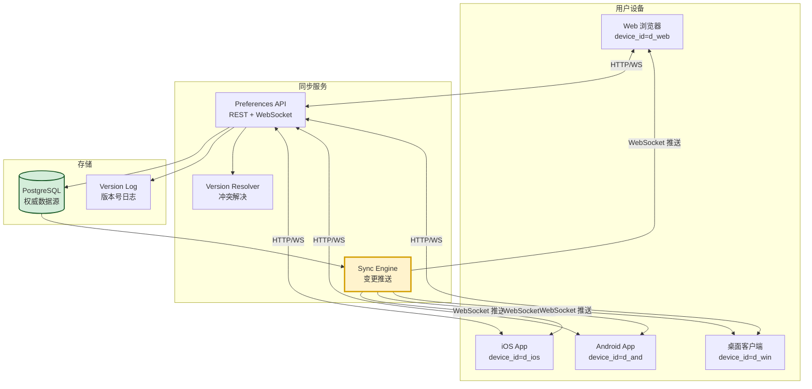

### 6.2 同步模式:拉取 + 推送混合

| 同步模式 | 触发时机 | 机制 | 适用场景 |
|---------|---------|------|---------|
| **全量拉取** | 用户登录/启动 | 设备请求全量偏好 | 首次登录、长期未同步 |
| **增量拉取** | 重连/定时 | 基于版本号拉取变更 | 常规场景,流量小 |
| **实时推送** | 偏好变更 | WebSocket 主动推送 | 在线设备即时同步 |
| **冲突回传** | 本地修改冲突 | 客户端推送 + 服务端解决 | 多设备并发修改 |

### 6.3 增量同步协议

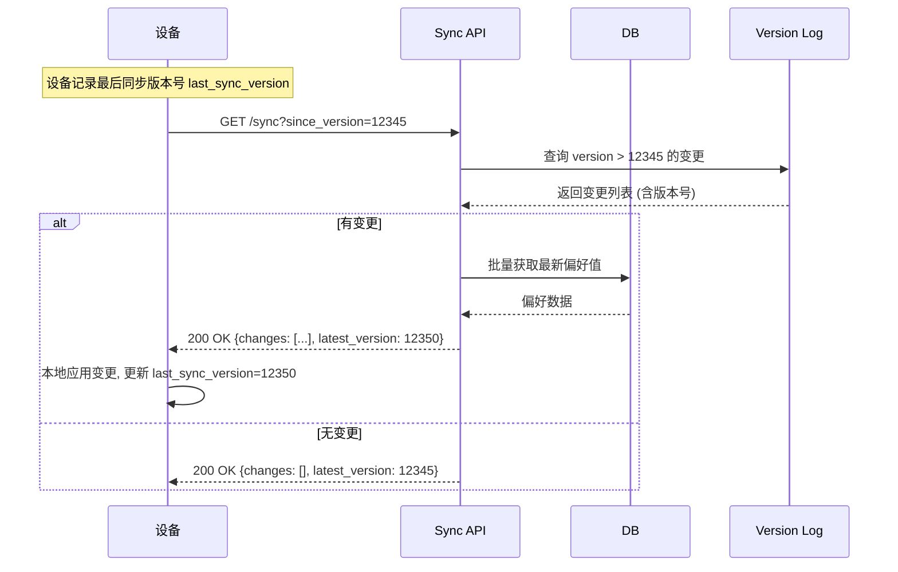

```python
class SyncService:
    """跨设备同步服务"""

    async def incremental_sync(self, user_id: str, device_id: str, 
                                since_version: int) -> dict:
        """增量同步: 返回指定版本后的所有变更"""
        # 1. 查询版本日志
        changes = await self.version_log.get_changes_since(
            user_id, since_version, limit=500
        )
        
        # 2. 批量获取最新偏好值(避免变更已过期)
        latest_prefs = await self.db.get_batch_by_keys(
            user_id, [(c.pref_key, c.namespace) for c in changes]
        )
        
        # 3. 构造响应
        change_list = []
        for change in changes:
            current = latest_prefs.get((change.pref_key, change.namespace))
            change_list.append({
                "pref_key": change.pref_key,
                "namespace": change.namespace,
                "value": current.pref_value if current else None,
                "version": current.version if current else 0,
                "change_type": change.change_type,
                "changed_at": change.changed_at.isoformat(),
                "changed_by": change.changed_by,
            })
        
        # 4. 更新设备同步状态
        latest_version = changes[-1].version if changes else since_version
        await self.device_sync.update_sync_state(
            user_id, device_id, latest_version
        )
        
        return {
            "changes": change_list,
            "latest_version": latest_version,
            "has_more": len(changes) == 500,  # 可能还有更多
        }

    async def push_to_online_devices(self, user_id: str, change: PreferenceItem,
                                       source_device_id: str):
        """变更后实时推送给在线设备(WebSocket)"""
        online_devices = await self.device_sync.get_online_devices(user_id)
        message = {
            "type": "preference.changed",
            "pref_key": change.pref_key,
            "namespace": change.namespace,
            "value": change.pref_value,
            "version": change.version,
            "changed_by": source_device_id,
            "timestamp": change.updated_at.isoformat(),
        }
        for device in online_devices:
            if device.device_id == source_device_id:
                continue  # 不回推给源设备
            await self.ws_manager.send_to_device(device.device_id, message)
```

### 6.4 冲突解决策略

多设备并发修改同一偏好,会产生冲突。采用**LWW + 业务规则**混合策略:

```python
class ConflictResolver:
    """冲突解决器"""

    async def resolve(self, user_id: str, pref_key: str, 
                      local: PreferenceItem, remote: PreferenceItem) -> PreferenceItem:
        """解决冲突: 决定保留哪个版本"""
        
        # 策略1: 显式 > 隐式 (用户主动设置优先于行为挖掘)
        if local.source == PreferenceSource.EXPLICIT and \
           remote.source != PreferenceSource.EXPLICIT:
            return local
        if remote.source == PreferenceSource.EXPLICIT and \
           local.source != PreferenceSource.EXPLICIT:
            return remote
        
        # 策略2: 高置信度 > 低置信度
        if abs(local.confidence - remote.confidence) > 0.2:
            return local if local.confidence > remote.confidence else remote
        
        # 策略3: LWW (Last Write Wins) - 时间戳新者胜
        if local.updated_at > remote.updated_at:
            return local
        elif remote.updated_at > local.updated_at:
            return remote
        
        # 策略4: 时间相同, device_id 字典序大者胜(确定性,避免抖动)
        return local if local.device_id > remote.device_id else remote
```

### 6.5 离线支持

```python
class OfflinePreferenceStore:
    """客户端离线偏好存储"""
    
    def __init__(self, local_db):
        self.local = local_db          # SQLite/IndexedDB
        self.pending_changes = []      # 待上传队列
    
    async def set_local(self, pref_key: str, value: Any):
        """离线设置: 写本地 + 入待上传队列"""
        await self.local.set(pref_key, value, status="pending")
        self.pending_changes.append({"key": pref_key, "value": value})
    
    async def sync_when_online(self):
        """网络恢复后批量上传"""
        if not self.pending_changes:
            return
        batch = self.pending_changes[:]
        self.pending_changes.clear()
        
        try:
            await self.api.batch_update(batch)
            await self.local.mark_synced([c["key"] for c in batch])
        except Exception:
            # 失败重入队列, 指数退避重试
            self.pending_changes.extend(batch)
```

---

## 七、备份与恢复机制

### 7.1 备份策略全景

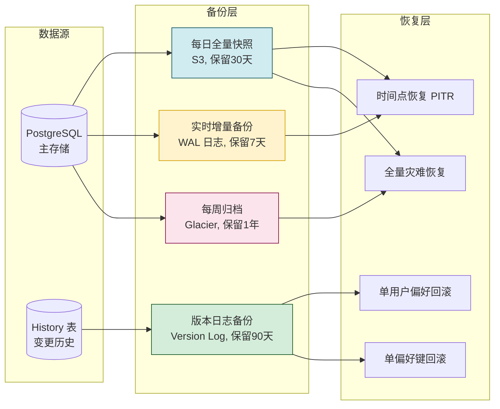

### 7.2 三级备份方案

| 备份类型 | 频率 | 内容 | 保留期 | 恢复时间(RTO) | 恢复点(RPO) |
|---------|------|------|-------|-------------|------------|
| **实时增量** | 持续 | WAL 日志流 | 7 天 | 30 分钟 | ~0(秒级) |
| **每日全量** | 每日 02:00 | 全量偏好快照 | 30 天 | 1 小时 | 24 小时 |
| **每周归档** | 每周日 03:00 | 全量+历史 | 1 年 | 4 小时 | 7 天 |

### 7.3 单用户/单偏好回滚

不需要恢复整个数据库,基于历史表实现精准回滚:

```python
class PreferenceRecovery:
    """偏好恢复服务"""

    async def rollback_user_to_time(self, user_id: str, target_time: datetime,
                                     tenant_id: str = "default"):
        """将某用户的所有偏好回滚到指定时间点"""
        # 1. 查询该用户在 target_time 时的全量偏好快照
        snapshot = await self.history.get_user_snapshot_at(user_id, tenant_id, target_time)
        
        # 2. 在事务中覆盖当前偏好
        async with self.db.transaction() as tx:
            # 先删除当前所有偏好
            await tx.execute(
                "DELETE FROM user_preferences WHERE user_id = %s AND tenant_id = %s",
                [user_id, tenant_id]
            )
            # 写入快照
            for item in snapshot:
                await tx.insert("user_preferences", item)
            
            # 记录恢复操作本身(便于撤销)
            await tx.insert("preference_recovery_log", {
                "user_id": user_id,
                "target_time": target_time,
                "recovered_by": "system",
                "recovered_at": datetime.utcnow(),
            })

    async def rollback_single_key(self, user_id: str, pref_key: str, 
                                   target_version: int, tenant_id: str = "default"):
        """回滚单个偏好键到指定版本"""
        # 从历史表查该版本的值
        history_item = await self.history.get_at_version(
            user_id, tenant_id, pref_key, target_version
        )
        if not history_item:
            raise NotFoundError(f"未找到版本 {target_version}")
        
        # 写回主表(version 递增而非回退, 保留可追溯性)
        await self.writer.update(
            user_id=user_id,
            pref_key=pref_key,
            new_value=history_item.new_value,
            device_id="system_recovery",
            change_reason=f"rollback to v{target_version}",
        )

    async def export_user_prefs(self, user_id: str, tenant_id: str = "default") -> dict:
        """导出用户全量偏好(用于迁移/合规/数据可携带性)"""
        all_prefs = await self.db.get_all_for_user(user_id, tenant_id)
        return {
            "user_id": user_id,
            "tenant_id": tenant_id,
            "exported_at": datetime.utcnow().isoformat(),
            "preferences": [
                {
                    "key": p.pref_key,
                    "namespace": p.namespace,
                    "value": p.pref_value,
                    "source": p.source,
                    "updated_at": p.updated_at.isoformat(),
                }
                for p in all_prefs
            ]
        }

    async def import_user_prefs(self, user_id: str, export_data: dict, 
                                 strategy: str = "merge"):
        """导入偏好(支持 merge 覆盖 / skip 跳过已存在 / replace 全替换)"""
        if strategy == "replace":
            await self.db.delete_all_for_user(user_id)
        
        for pref in export_data["preferences"]:
            if strategy == "skip":
                existing = await self.db.get(user_id, export_data["tenant_id"], pref["key"])
                if existing:
                    continue
            await self.writer.update(
                user_id=user_id,
                pref_key=pref["key"],
                new_value=pref["value"],
                device_id="import",
                source=PreferenceSource.IMPORTED,
            )
```

### 7.4 备份验证与演练

```python
class BackupValidator:
    """备份验证器: 定期验证备份可恢复性"""

    async def daily_validation(self):
        """每日自动验证备份有效性"""
        # 1. 随机选取10个用户
        sample_users = await self.db.get_random_users(10)
        
        for user_id in sample_users:
            # 2. 从昨日备份恢复到测试库
            restored = await self.restore_from_backup_to_test(
                user_id, 
                target_time=datetime.utcnow() - timedelta(days=1)
            )
            # 3. 对比当前数据与备份数据差异
            current = await self.db.get_all_for_user(user_id)
            diff = self._compare(current, restored)
            
            if diff.has_unexpected_loss:
                await self.alert.send(
                    f"⚠️ 备份验证失败: 用户 {user_id} 备份与当前差异异常",
                    diff.report()
                )
            else:
                logger.info(f"备份验证通过: {user_id}")
```

---

## 八、安全存储方案

### 8.1 偏好数据分级加密

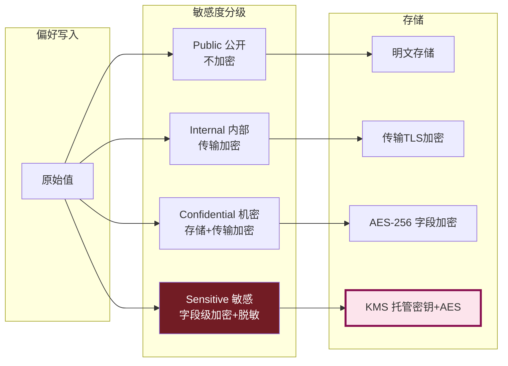

### 8.2 字段级加密实现

```python
from cryptography.fernet import Fernet
import base64
import json

class PreferenceEncryption:
    """偏好字段级加密"""

    SENSITIVE_KEYS = {
        "health.condition",          # 健康偏好
        "finance.risk_tolerance",    # 财务风险偏好
        "location.home_address",     # 家庭住址
        "biometric.voice_print_id",  # 生物特征ID
    }

    def __init__(self, kms_client):
        self.kms = kms_client
        self._fernet_cache = {}  # 短期缓存解密后的Fernet实例

    async def encrypt_field(self, pref_key: str, value: Any) -> str:
        """加密敏感字段"""
        if pref_key not in self.SENSITIVE_KEYS:
            return value  # 非敏感不加密
        
        # 1. 从 KMS 获取数据加密密钥 (DEK)
        dek = await self.kms.generate_dek(key_id=f"pref_{pref_key}")
        
        # 2. 用 DEK 加密数据
        fernet = Fernet(dek)
        plaintext = json.dumps(value).encode()
        ciphertext = fernet.encrypt(plaintext)
        
        # 3. 返回 "enc:v1:{dek_id}:{ciphertext}" 格式
        return f"enc:v1:{dek.id}:{base64.b64encode(ciphertext).decode()}"

    async def decrypt_field(self, pref_key: str, stored_value: Any) -> Any:
        """解密敏感字段"""
        if pref_key not in self.SENSITIVE_KEYS:
            return stored_value
        if not isinstance(stored_value, str) or not stored_value.startswith("enc:"):
            return stored_value  # 未加密的旧数据
        
        # 解析格式 enc:v1:{dek_id}:{ciphertext}
        _, version, dek_id, ct_b64 = stored_value.split(":", 3)
        
        # 从 KMS 获取 DEK (带缓存)
        fernet = await self._get_fernet(dek_id)
        
        ciphertext = base64.b64decode(ct_b64)
        plaintext = fernet.decrypt(ciphertext)
        return json.loads(plaintext)
```

### 8.3 访问控制

```python
class PreferenceAccessControl:
    """偏好访问控制"""

    async def can_read(self, requester_id: str, target_user_id: str, 
                       pref_key: str) -> bool:
        """检查请求者是否有权读取目标用户的偏好"""
        # 1. 用户只能读自己的偏好
        if requester_id == target_user_id:
            return True
        
        # 2. 检查用户是否设置了"共享给他人"
        share_setting = await self.reader.get(target_user_id, "privacy.share_preferences")
        if not share_setting.get("enabled", False):
            return False
        if requester_id not in share_setting.get("shared_with", []):
            return False
        
        # 3. 检查该偏好键是否在共享范围内
        shared_keys = share_setting.get("shared_keys", [])
        if shared_keys and pref_key not in shared_keys:
            return False
        
        # 4. 敏感偏好永远不可共享
        schema = PREFERENCE_SCHEMAS.get(pref_key)
        if schema and schema.sensitivity == PreferenceSensitivity.SENSITIVE:
            return False
        
        return True
```

### 8.4 审计日志

```sql
CREATE TABLE preference_audit_log (
    id              BIGSERIAL PRIMARY KEY,
    timestamp       TIMESTAMPTZ NOT NULL DEFAULT now(),
    user_id         VARCHAR(64) NOT NULL,        -- 偏好所属用户
    actor_id        VARCHAR(64) NOT NULL,        -- 操作者(可能是用户自己/管理员/系统)
    pref_key        VARCHAR(256),
    action          VARCHAR(16) NOT NULL,        -- read/update/delete/export
    old_value       JSONB,
    new_value       JSONB,
    source_ip       INET,
    device_id       VARCHAR(64),
    success         BOOLEAN NOT NULL,
    reason          TEXT
);

CREATE INDEX idx_audit_user_time ON preference_audit_log (user_id, timestamp DESC);
CREATE INDEX idx_audit_actor ON preference_audit_log (actor_id, timestamp DESC);
CREATE INDEX idx_audit_action ON preference_audit_log (action, timestamp DESC);
```

---

## 九、与现有系统架构集成

### 9.1 集成架构总览

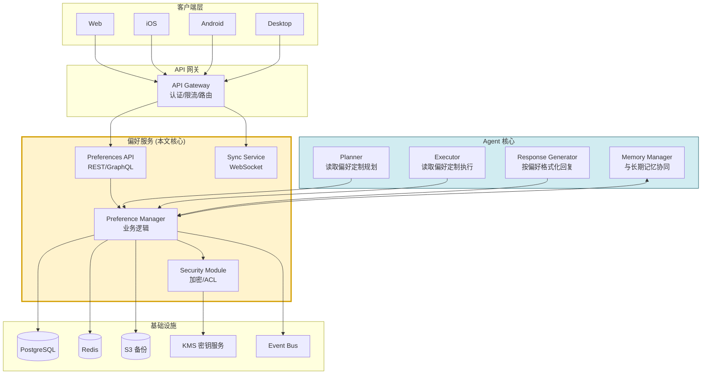

### 9.2 与 Agent Planner 集成

Planner 在生成计划时读取用户偏好,定制规划方向:

```python
class PreferenceAwarePlanner:
    """偏好感知的 Planner"""

    async def plan(self, user_id: str, task: str) -> Plan:
        # 批量预加载偏好(一次缓存命中)
        prefs = await self.pref_reader.get_batch(user_id, [
            "reply.detail_level",        # brief/medium/detailed
            "reply.language",             # auto/zh-CN/en-US
            "reply.tone",                 # formal/casual/professional
            "tool.favorites",             # 收藏的工具列表
            "business.order.default_sort",# 默认排序
            "workflow.parallel_enabled",  # 是否允许并行执行
        ])

        # 根据 detail_level 调整计划粒度
        if prefs["reply.detail_level"] == "brief":
            plan_granularity = "coarse"   # 简略回复: 粗粒度计划
        elif prefs["reply.detail_level"] == "detailed":
            plan_granularity = "fine"     # 详细回复: 细粒度计划
        else:
            plan_granularity = "medium"

        # 根据收藏工具调整工具选择优先级
        favorite_tools = set(prefs.get("tool.favorites", []))
        plan = await self.llm.generate_plan(
            task=task,
            granularity=plan_granularity,
            preferred_tools=favorite_tools,
            parallel_allowed=prefs.get("workflow.parallel_enabled", True),
        )
        return plan
```

### 9.3 与 Response Generator 集成

```python
class PreferenceAwareResponder:
    """偏好感知的响应生成器"""

    async def generate(self, user_id: str, content: str) -> str:
        prefs = await self.pref_reader.get_batch(user_id, [
            "reply.language",
            "reply.tone",
            "reply.format.markdown",
            "reply.detail_level",
            "ui.accessibility.screen_reader",  # 无障碍模式
        ])

        prompt = f"""
        请根据以下用户偏好生成回复:
        - 语言: {prefs['reply.language']}
        - 语气: {prefs['reply.tone']}
        - 格式: {'Markdown' if prefs['reply.format.markdown'] else '纯文本'}
        - 详细程度: {prefs['reply.detail_level']}
        - 无障碍: {'启用屏幕阅读器优化(避免表格,用列表)' if prefs['ui.accessibility.screen_reader'] else '常规'}
        
        原始内容: {content}
        """
        return await self.llm.generate(prompt)
```

### 9.4 与 Memory Manager 集成

```python
class PreferenceAwareMemoryManager:
    """偏好感知的记忆管理器"""

    async def store_memory(self, user_id: str, memory: MemoryItem):
        # 读取隐私偏好: 用户是否允许记忆被用于分析
        privacy_prefs = await self.pref_reader.get_batch(user_id, [
            "privacy.memory.retention_days",      # 记忆保留时长
            "privacy.memory.share_for_training",  # 是否共享用于训练
            "privacy.memory.cross_session",       # 是否跨会话记忆
        ])

        memory.ttl_days = privacy_prefs["privacy.memory.retention_days"]
        memory.shareable = privacy_prefs["privacy.memory.share_for_training"]
        
        if not privacy_prefs["privacy.memory.cross_session"]:
            memory.session_only = True  # 仅当前会话有效
        
        await self.memory_store.save(memory)
```

### 9.5 REST API 设计

```python
# FastAPI 实现
from fastapi import FastAPI, Depends, HTTPException
from fastapi.security import HTTPBearer

app = FastAPI()
security = HTTPBearer()

@app.get("/api/v1/preferences/{pref_key}")
async def get_preference(pref_key: str, user = Depends(get_current_user)):
    """读取单个偏好"""
    value = await pref_reader.get(user.id, pref_key)
    return {"key": pref_key, "value": value}

@app.get("/api/v1/preferences")
async def list_preferences(namespace: str = None, user = Depends(get_current_user)):
    """列出用户全部偏好(可按命名空间过滤)"""
    items = await pref_reader.list_all(user.id, namespace=namespace)
    return {"preferences": items}

@app.put("/api/v1/preferences/{pref_key}")
async def set_preference(pref_key: str, body: UpdateRequest, 
                          user = Depends(get_current_user),
                          device_id: str = Header(...)):
    """设置偏好(支持乐观锁)"""
    try:
        updated = await pref_writer.update(
            user_id=user.id,
            pref_key=pref_key,
            new_value=body.value,
            device_id=device_id,
            expected_version=body.expected_version,
        )
        return {"version": updated.version, "updated_at": updated.updated_at}
    except VersionConflictError as e:
        raise HTTPException(409, str(e))
    except ValueError as e:
        raise HTTPException(422, str(e))

@app.post("/api/v1/preferences/batch")
async def batch_set(body: BatchUpdateRequest, user = Depends(get_current_user),
                     device_id: str = Header(...)):
    """批量设置偏好"""
    results = await pref_writer.batch_update(user.id, body.updates, device_id)
    return {"versions": results}

@app.get("/api/v1/sync")
async def sync(since_version: int, user = Depends(get_current_user),
               device_id: str = Header(...)):
    """增量同步"""
    return await sync_service.incremental_sync(user.id, device_id, since_version)

@app.post("/api/v1/preferences/{pref_key}/rollback")
async def rollback(pref_key: str, body: RollbackRequest, user = Depends(get_current_user)):
    """回滚偏好到指定版本"""
    await pref_recovery.rollback_single_key(user.id, pref_key, body.target_version)
    return {"status": "ok"}

@app.get("/api/v1/preferences/export")
async def export_prefs(user = Depends(get_current_user)):
    """导出全量偏好(数据可携带性)"""
    return await pref_recovery.export_user_prefs(user.id)
```

### 9.6 WebSocket 实时同步端点

```python
@app.websocket("/ws/v1/preferences/sync")
async def ws_sync(websocket: WebSocket, token: str = Query(...),
                   device_id: str = Query(...)):
    """WebSocket 长连接: 实时接收偏好变更推送"""
    user = await authenticate(token)
    if not user:
        await websocket.close(code=4001)
        return
    
    await websocket.accept()
    await ws_manager.register(user.id, device_id, websocket)
    
    try:
        while True:
            # 接收客户端心跳与本地变更上报
            msg = await websocket.receive_json()
            if msg["type"] == "local_change":
                # 客户端上报本地变更
                await pref_writer.update(
                    user_id=user.id, pref_key=msg["key"],
                    new_value=msg["value"], device_id=device_id,
                )
            elif msg["type"] == "heartbeat":
                await websocket.send_json({"type": "heartbeat_ack"})
    except WebSocketDisconnect:
        await ws_manager.unregister(user.id, device_id, websocket)
```

---

## 十、完整代码实现

### 10.1 完整类结构

```python
"""
用户偏好记忆系统 - 完整实现
文件结构:
  preference_system/
  ├── models.py              # 数据模型
  ├── schemas.py             # 偏好Schema注册表
  ├── reader.py              # 读取器(三级缓存)
  ├── writer.py              # 写入器(乐观锁)
  ├── miner.py               # 隐式偏好挖掘
  ├── sync.py                # 跨设备同步
  ├── recovery.py            # 备份恢复
  ├── security.py            # 加密与ACL
  ├── audit.py               # 审计日志
  ├── api.py                 # REST API
  └── integration.py         # Agent集成适配器
"""
```

### 10.2 核心读取写入完整实现

```python
import asyncio
import json
import re
import time
from dataclasses import dataclass, field
from datetime import datetime, timedelta
from typing import Any, Optional
from collections import OrderedDict
import hashlib

# === 1. 本地 LRU 缓存 ===
class LRUCache:
    def __init__(self, capacity: int = 10000, ttl: int = 60):
        self.cache: OrderedDict = OrderedDict()
        self.capacity = capacity
        self.ttl = ttl
        self._lock = asyncio.Lock()

    async def get(self, key: str) -> Any:
        async with self._lock:
            if key not in self.cache:
                return None
            value, expire_at = self.cache[key]
            if time.time() > expire_at:
                del self.cache[key]
                return None
            self.cache.move_to_end(key)
            return value

    async def set(self, key: str, value: Any, ttl: int = None):
        async with self._lock:
            self.cache[key] = (value, time.time() + (ttl or self.ttl))
            self.cache.move_to_end(key)
            if len(self.cache) > self.capacity:
                self.cache.popitem(last=False)

    async def delete(self, key: str):
        async with self._lock:
            self.cache.pop(key, None)

    async def delete_pattern(self, pattern: str):
        """按模式删除(用户重置时)"""
        async with self._lock:
            keys_to_del = [k for k in self.cache if re.match(pattern, k)]
            for k in keys_to_del:
                del self.cache[k]


# === 2. 完整的偏好管理器 ===
class PreferenceManager:
    """偏好管理器: 统一对外接口"""

    def __init__(self, db_repo, redis_client, lru_cache, 
                 security, audit, miner=None):
        self.db = db_repo
        self.redis = redis_client
        self.lru = lru_cache
        self.security = security
        self.audit = audit
        self.miner = miner

    def _cache_key(self, user_id: str, tenant_id: str, pref_key: str) -> str:
        return f"pref:{tenant_id}:{user_id}:{pref_key}"

    # === 读取 ===
    async def get(self, user_id: str, pref_key: str, 
                  requester_id: str = None,
                  tenant_id: str = "default") -> Any:
        # 1. 权限校验
        if requester_id and not await self.security.can_read(
            requester_id, user_id, pref_key
        ):
            raise PermissionError(f"{requester_id} 无权读取 {user_id} 的偏好 {pref_key}")

        # 2. L1
        ck = self._cache_key(user_id, tenant_id, pref_key)
        if (val := await self.lru.get(ck)) is not None:
            return val

        # 3. L2
        val = await self.redis.get(ck)
        if val is not None:
            val = json.loads(val)
            await self.lru.set(ck, val)
            return val

        # 4. L3 DB
        item = await self.db.get(user_id, tenant_id, pref_key)
        if item:
            # 解密敏感字段
            value = await self.security.decrypt_field(pref_key, item.pref_value)
            # 回填缓存
            await self.redis.set(ck, json.dumps(value), ex=300)
            await self.lru.set(ck, value)
            return value
        
        # 5. 默认值
        schema = PREFERENCE_SCHEMAS.get(pref_key)
        return schema.default_value if schema else None

    # === 写入 ===
    async def set(self, user_id: str, pref_key: str, value: Any,
                  device_id: str, actor_id: str = None,
                  expected_version: int = None,
                  tenant_id: str = "default") -> int:
        # 1. Schema 校验
        schema = PREFERENCE_SCHEMAS.get(pref_key)
        if schema:
            if schema.immutable:
                raise ValueError(f"{pref_key} 不可修改")
            self._validate(schema, value)

        # 2. 权限校验
        if not await self.security.can_write(actor_id or user_id, user_id, pref_key):
            raise PermissionError("无权修改")

        # 3. 加密敏感字段
        stored_value = await self.security.encrypt_field(pref_key, value)

        # 4. 乐观锁更新
        for attempt in range(3):
            current = await self.db.get(user_id, tenant_id, pref_key)
            cur_ver = current.version if current else 0
            if expected_version is not None and expected_version != cur_ver:
                raise VersionConflictError(f"版本冲突: 期望{expected_version}, 实际{cur_ver}")
            try:
                new_ver = await self.db.cas_update(
                    user_id, tenant_id, pref_key, stored_value, cur_ver, cur_ver + 1,
                    device_id=device_id, updated_by=actor_id or device_id
                )
                break
            except ConcurrentUpdateError:
                if attempt == 2: raise
                await asyncio.sleep(0.05 * (attempt + 1))

        # 5. 后置处理
        await asyncio.gather(
            self.lru.delete(self._cache_key(user_id, tenant_id, pref_key)),
            self.redis.delete(self._cache_key(user_id, tenant_id, pref_key)),
            self.audit.log("update", actor_id or user_id, user_id, pref_key, 
                          current.pref_value if current else None, value),
            self._publish_change(user_id, tenant_id, pref_key, value, new_ver, device_id),
        )

        # 6. 触发隐式挖掘(可选)
        if self.miner:
            asyncio.create_task(self.miner.on_preference_changed(user_id, pref_key, value))

        return new_ver

    def _validate(self, schema: PreferenceSchema, value: Any):
        """Schema 校验"""
        type_map = {"bool": bool, "int": int, "string": str, "float": float}
        if schema.value_type in type_map:
            if not isinstance(value, type_map[schema.value_type]):
                raise ValueError(f"{schema.key} 类型应为 {schema.value_type}")
        if schema.allowed_values and value not in schema.allowed_values:
            raise ValueError(f"{schema.key} 值 {value} 不在允许范围")
        if schema.min_value is not None and value < schema.min_value:
            raise ValueError(f"{schema.key} 小于最小值")
        if schema.max_value is not None and value > schema.max_value:
            raise ValueError(f"{schema.key} 大于最大值")
        if schema.pattern and isinstance(value, str):
            if not re.match(schema.pattern, value):
                raise ValueError(f"{schema.key} 不匹配模式")

    async def _publish_change(self, user_id, tenant_id, pref_key, value, version, device_id):
        """发布变更事件(供同步服务订阅)"""
        await self.redis.publish(
            f"pref_changes:{tenant_id}:{user_id}",
            json.dumps({
                "pref_key": pref_key, "value": value, "version": version,
                "device_id": device_id, "timestamp": datetime.utcnow().isoformat()
            })
        )

    # === 其他操作 ===
    async def delete(self, user_id: str, pref_key: str, device_id: str, tenant_id: str = "default"):
        await self.db.delete(user_id, tenant_id, pref_key)
        await self.lru.delete(self._cache_key(user_id, tenant_id, pref_key))
        await self.redis.delete(self._cache_key(user_id, tenant_id, pref_key))
        await self.audit.log("delete", device_id, user_id, pref_key, None, None)

    async def reset_all(self, user_id: str, tenant_id: str = "default"):
        """重置用户所有偏好为默认值"""
        await self.db.delete_all_for_user(user_id, tenant_id)
        # 清除该用户所有缓存(按pattern)
        await self.lru.delete_pattern(rf"pref:{tenant_id}:{user_id}:.*")
        # Redis SCAN + DELETE
        async for key in self.redis.scan_iter(f"pref:{tenant_id}:{user_id}:*"):
            await self.redis.delete(key)
```

---

## 十一、性能优化建议

### 11.1 性能优化全景

| 优化点 | 手段 | 预期效果 |
|-------|------|---------|
| **三级缓存** | L1 LRU + L2 Redis + L3 DB | 95%+ 请求命中 L1/L2,P99 < 1ms |
| **批量预加载** | 请求开始时一次性加载用户全量偏好到 L2 | 单请求内偏好读取全部命中 |
| **Redis MGET/MSET** | 批量读取用 MGET,批量写入用 pipeline | 减少 RTT,吞吐量提升 10x |
| **Schema 缓存** | Schema 注册表常驻内存 | 校验零开销 |
| **连接池** | PostgreSQL/Redis 连接池复用 | 避免连接建立开销 |
| **异步审计** | 审计日志写入走消息队列异步落库 | 主链路 0 DB 写 |
| **增量同步** | 基于版本号拉取,避免全量传输 | 同步流量降 90% |
| **字段压缩** | 大 JSON 偏好值用 gzip 压缩存储 | 存储降 60%,网络降 60% |
| **分区表** | 历史表按月分区 | 历史查询快,旧数据归档易 |

### 11.2 缓存命中率优化

```python
class SmartPrefetcher:
    """智能预取器: 基于访问模式预测"""

    def __init__(self):
        self.access_patterns = {}  # {user_id: {key: access_count}}

    async def on_access(self, user_id: str, pref_key: str):
        """记录访问模式"""
        if user_id not in self.access_patterns:
            self.access_patterns[user_id] = {}
        self.access_patterns[user_id][pref_key] = \
            self.access_patterns[user_id].get(pref_key, 0) + 1

    async def prefetch_for_request(self, user_id: str, primary_keys: list[str]):
        """预取主键相关的偏好(基于关联规则)"""
        # 例: 用户读 reply.language 时, 大概率也会读 reply.tone, reply.format
        related = await self._get_related_keys(primary_keys)
        all_keys = list(set(primary_keys + related))
        await self.pref_reader.prefetch_user_prefs(user_id)
```

### 11.3 性能基准

| 场景 | QPS(单节点) | P99 延迟 | 优化点 |
|------|-----------|---------|--------|
| 单键读(L1命中) | 1,000,000 | 0.1ms | LRU 内存 |
| 单键读(L2命中) | 100,000 | 1ms | Redis |
| 单键读(L3命中) | 10,000 | 10ms | DB |
| 单键写 | 5,000 | 20ms | DB+缓存失效 |
| 批量读(10键,预加载) | 100,000 | 0.5ms | L1批量 |
| 增量同步 | 1,000 | 50ms | 版本号查询 |

---

## 十二、最佳实践与避坑指南

### 12.1 设计最佳实践 (Do's)

| # | 最佳实践 | 说明 |
|---|---------|------|
| 1 | **Schema 优先** | 所有偏好键先在 Schema 注册表声明,禁止随意新增键 |
| 2 | **默认值兜底** | 用户未设置的偏好必须返回合理默认值,而非 None |
| 3 | **乐观锁优先** | 偏好更新用乐观锁而非悲观锁,避免长事务 |
| 4 | **批量优于单个** | Agent 请求开始时批量预加载,而非逐个读取 |
| 5 | **缓存分级失效** | 写入时只失效对应键,不要全量清空用户缓存 |
| 6 | **版本号必须** | 每次更新递增版本号,用于增量同步与冲突检测 |
| 7 | **历史保留** | 偏好变更历史至少保留 90 天,支持审计与回滚 |
| 8 | **加密分级** | 敏感偏好字段级加密,非敏感明文以提升性能 |
| 9 | **导出可携带** | 支持用户全量导出偏好,符合 GDPR 等合规要求 |
| 10 | **降级策略** | 偏好服务不可用时,Agent 用系统默认值继续运行 |

### 12.2 常见踩坑与避坑 (Don'ts)

| # | 踩坑 | 后果 | 避坑方案 |
|---|------|------|---------|
| ❌1 | **缓存与DB不一致** | 用户修改后部分设备仍看到旧值 | 写入时同步失效 L1+L2,TTL 兜底 |
| ❌2 | **未用乐观锁** | 多设备并发修改互相覆盖 | 强制 version 字段 CAS 更新 |
| ❌3 | **偏好键无约束** | 键名混乱,重复,难维护 | Schema 注册表 + 命名规范 |
| ❌4 | **同步风暴** | 一次小变更触发全量同步 | 严格用版本号增量同步 |
| ❌5 | **隐式偏好覆盖显式** | 用户设置被自动挖掘覆盖 | 隐式置信度<1.0,显式=1.0 |
| ❌6 | **缓存雪崩** | 大量用户同时缓存失效 | TTL 加随机抖动 ±10% |
| ❌7 | **未做权限校验** | 用户A读取用户B的偏好 | 强制 requester_id 校验 |
| ❌8 | **审计日志同步写** | 写偏好时阻塞,延迟高 | 审计走异步队列 |
| ❌9 | **会话偏好不过期** | 临时偏好堆积成垃圾 | expires_at 定时清理任务 |
| ❌10 | **备份不验证** | 真要恢复时发现备份损坏 | 每日自动验证备份可恢复性 |

### 12.3 实施路线图

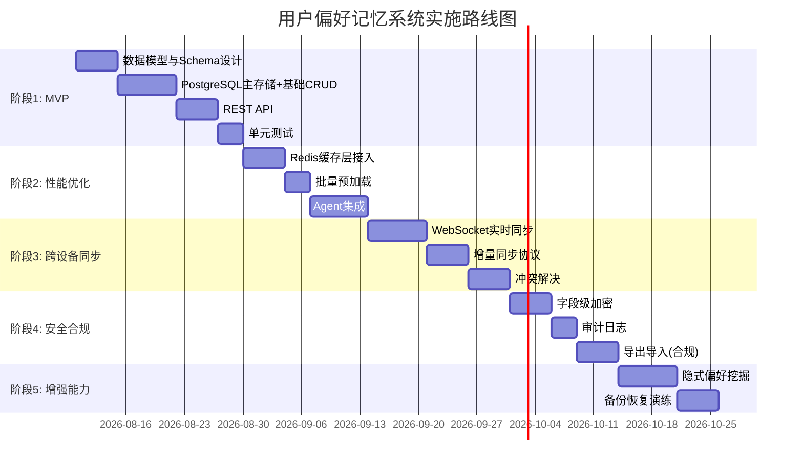

---

> **文档结语**:用户偏好记忆系统是 Agent 个性化能力的基石。本文从数据建模、存储分层、缓存策略、并发控制、跨设备同步、备份恢复、安全加密七大维度,提供了端到端的工程实现方案。**核心设计哲学**是"**读多写少 → 重缓存;跨设备 → 重版本;安全合规 → 重加密审计**"。与 [82用户画像技术与Agent系统整合应用深度解析.md](./82用户画像技术与Agent系统整合应用深度解析.md) 互补,共同构成 Agent 个性化能力的完整技术栈。
>
> **后续演进方向**:① 引入联邦学习,在多用户偏好间学习共性模式,同时保护个体隐私;② 探索基于 LLM 的偏好自动归纳——从用户对话中提取偏好;③ 与零信任架构集成,每次偏好访问动态鉴权。
