# Agent 会话上下文管理系统完整设计与实现方案

> **文档定位**:本文档是 `5Agent Memory` 系列的工程核心篇,系统阐述 AI Agent 中**会话上下文管理(Session Context Management)** 的完整设计与实现方案,聚焦"**对话历史的存储维护、上下文窗口控制、自动清理过期、多用户会话隔离**"四大核心工程问题。区别于 [79Agent Memory内存管理与无限增长防护深度解析.md](./79Agent%20Memory内存管理与无限增长防护深度解析.md) 侧重运行时 RAM 治理、[80Agent Memory检索功能完整实现深度解析.md](./80Agent%20Memory检索功能完整实现深度解析.md) 侧重向量检索、[83用户偏好记忆系统完整设计与实现方案.md](./83用户偏好记忆系统完整设计与实现方案.md) 侧重结构化偏好,本文聚焦"**会话级上下文**"——即用户与 AI 助手之间一次或多次对话所形成的**短期工作记忆**的工程化管理,为构建可扩展、安全隔离、上下文感知的 AI 助手提供端到端技术蓝图。
>
> **阅读建议**:本文是 Agent Memory 系列的会话治理篇,建议结合 [76短期记忆与长期记忆核心区别深度解析.md](./76短期记忆与长期记忆核心区别深度解析.md)（短/长期记忆分野）、[77Agent长期记忆系统完整设计方案.md](./77Agent长期记忆系统完整设计方案.md)（长期记忆架构）、[79Agent Memory内存管理与无限增长防护深度解析.md](./79Agent%20Memory内存管理与无限增长防护深度解析.md)（内存治理）、[83用户偏好记忆系统完整设计与实现方案.md](./83用户偏好记忆系统完整设计与实现方案.md)（偏好记忆）一并阅读,理解会话上下文在整体记忆体系中的定位。

---

## 目录

- [一、会话上下文管理系统概述](#一会话上下文管理系统概述)
- [二、对话历史数据模型与存储设计](#二对话历史数据模型与存储设计)
- [三、上下文窗口大小控制机制](#三上下文窗口大小控制机制)
- [四、高效检索机制](#四高效检索机制)
- [五、自动清理与过期策略](#五自动清理与过期策略)
- [六、多用户会话隔离管理](#六多用户会话隔离管理)
- [七、数据安全与权限控制](#七数据安全与权限控制)
- [八、与现有 AI 助手框架的兼容集成](#八与现有-ai-助手框架的兼容集成)
- [九、完整 API 文档](#九完整-api-文档)
- [十、完整代码实现](#十完整代码实现)
- [十一、使用示例](#十一使用示例)
- [十二、性能优化与最佳实践](#十二性能优化与最佳实践)

---

## 一、会话上下文管理系统概述

### 1.1 什么是会话上下文管理

**会话上下文管理(Session Context Management)** 是 Agent 系统中负责**存储、组织、检索、清理用户与 AI 助手之间对话上下文**的子系统。它解决的核心问题是:**让 AI 助手在多轮对话中"记得刚才说了什么",同时在用户量大、会话多、上下文长的情况下保持性能与可控性**。

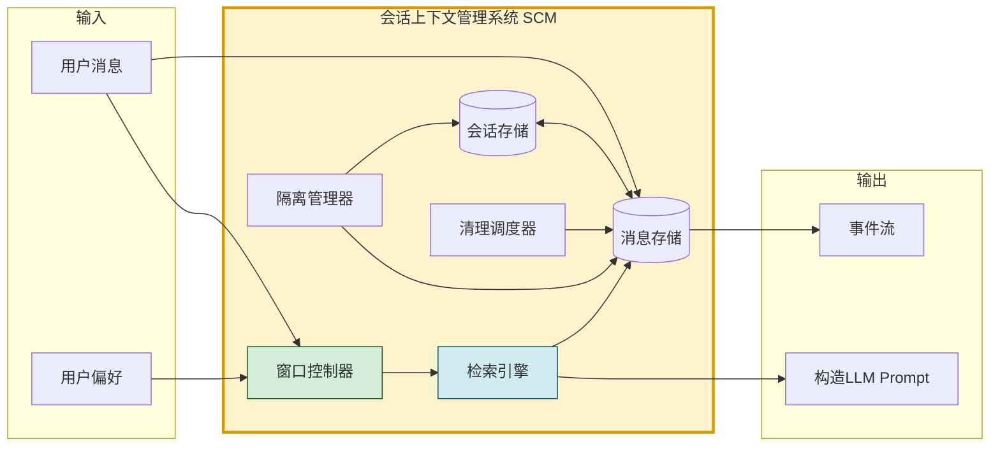

### 1.2 与相关概念的核心区别

| 维度 | 会话上下文(本文) | 长期记忆(77号) | 用户偏好(83号) | 运行时内存(79号) |
|------|----------------|---------------|---------------|----------------|
| **本质** | 本次对话的"工作记忆" | 跨会话的经验仓库 | 用户的喜好设置 | 进程RAM占用 |
| **时间维度** | 秒~小时(会话内) | 天~永久(跨会话) | 持久(显式更新) | 实时(进程生命周期) |
| **数据形态** | 时序消息序列 | 向量化文本/图谱 | 结构化键值 | 进程内对象 |
| **典型大小** | 4K-128K tokens | MB-GB | KB | MB-GB(RAM) |
| **失效方式** | 会话结束/窗口溢出 | 主动遗忘/衰减 | 用户修改 | GC回收 |
| **核心问题** | 窗口控制 + 多轮检索 | 长期保持 + 检索 | 一致性 + 同步 | OOM防护 |

> **关键定位**:会话上下文是 Agent 的"**意识工作台**"——当前正在处理的对话信息在此停留;长期记忆是"**经验图书馆**"——历史经验存放于此。会话上下文管理就是"工作台"的整理与调度。

### 1.3 五大核心功能目标

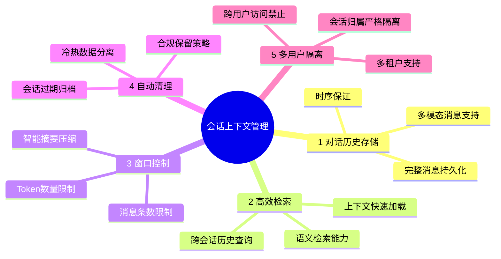

### 1.4 设计目标与衡量指标

| 目标层级 | 目标项 | 衡量指标 |
|---------|-------|---------|
| **功能目标** | 对话历史完整不丢失 | 持久化成功率 = 100% |
| **功能目标** | 上下文窗口可控 | 窗口超限率 = 0% |
| **功能目标** | 多用户严格隔离 | 跨用户访问成功率 = 0% |
| **性能目标** | 上下文加载低延迟 | P99 加载延迟 < 20ms |
| **性能目标** | LLM 调用无浪费 token | 窗口利用率 85%-95% |
| **可靠性目标** | 自动清理不影响主流程 | 清理任务故障率 < 0.1% |
| **安全目标** | 敏感对话加密存储 | 敏感会话加密率 = 100% |
| **扩展目标** | 与主流框架兼容 | 支持 LangChain/AutoGen/LlamaIndex |

### 1.5 四大核心挑战

| 挑战 | 描述 | 应对方向 |
|------|------|---------|
| **C1 窗口限制** | LLM 上下文窗口有限(4K-128K),长对话无法全量装载 | 窗口控制策略 + 摘要压缩 |
| **C2 性能压力** | 每轮对话都要加载历史,高频访问 | 多级缓存 + 增量加载 |
| **C3 数据膨胀** | 长期运行累积海量会话,存储成本飙升 | 分层存储 + 自动归档 |
| **C4 隔离安全** | 多用户并发,严禁 A 看到 B 的对话 | 强制 user_id 过滤 + 多租户 |

---

## 二、对话历史数据模型与存储设计

### 2.1 核心数据模型

```python
from dataclasses import dataclass, field
from typing import Any, Optional
from datetime import datetime
from enum import Enum

class MessageRole(str, Enum):
    """消息角色"""
    SYSTEM = "system"           # 系统消息(设定)
    USER = "user"               # 用户消息
    ASSISTANT = "assistant"     # AI 助手回复
    TOOL = "tool"               # 工具调用结果
    FUNCTION = "function"       # 函数调用

class MessageStatus(str, Enum):
    """消息状态"""
    ACTIVE = "active"           # 活跃(在上下文窗口内)
    ARCHIVED = "archived"       # 归档(超出窗口但保留)
    DELETED = "deleted"         # 已删除(软删除)

class SessionStatus(str, Enum):
    """会话状态"""
    ACTIVE = "active"           # 活跃中
    IDLE = "idle"               # 闲置(超时未活动)
    CLOSED = "closed"           # 用户主动关闭
    EXPIRED = "expired"         # 过期自动关闭
    ARCHIVED = "archived"       # 归档(长期未活动)

class SessionVisibility(str, Enum):
    """会话可见性"""
    PRIVATE = "private"         # 仅本人可见
    SHARED = "shared"           # 指定用户可见
    ORG_PUBLIC = "org_public"   # 组织内公开

@dataclass
class Message:
    """单条消息"""
    # === 标识 ===
    message_id: str                          # UUID
    session_id: str                          # 所属会话ID
    tenant_id: str = "default"               # 租户ID(多租户隔离)
    user_id: str = ""                        # 会话归属用户
    
    # === 内容 ===
    role: MessageRole = MessageRole.USER
    content: str = ""                        # 文本内容
    content_type: str = "text"               # text/markdown/json/image/audio
    metadata: dict = field(default_factory=dict)  # 附加元数据
    
    # === 工具调用相关 ===
    tool_calls: list = field(default_factory=list)  # AI 发起的工具调用
    tool_call_id: Optional[str] = None       # 工具调用结果对应的call_id
    tool_name: Optional[str] = None
    
    # === 计量 ===
    token_count: int = 0                     # 本条消息token数
    char_count: int = 0                      # 字符数
    
    # === 状态 ===
    status: MessageStatus = MessageStatus.ACTIVE
    is_pinned: bool = False                  # 是否置顶(窗口控制时不被裁剪)
    
    # === 时序 ===
    sequence: int = 0                        # 会话内序号(单调递增)
    created_at: datetime = field(default_factory=datetime.utcnow)
    
    # === 安全 ===
    sensitivity: str = "internal"            # public/internal/confidential/sensitive
    encrypted: bool = False                  # 是否加密存储

@dataclass
class Session:
    """会话"""
    # === 标识 ===
    session_id: str
    tenant_id: str = "default"
    user_id: str = ""
    title: str = ""                          # 会话标题(自动生成或用户命名)
    
    # === 状态 ===
    status: SessionStatus = SessionStatus.ACTIVE
    visibility: SessionVisibility = SessionVisibility.PRIVATE
    
    # === 计量 ===
    message_count: int = 0
    total_tokens: int = 0                    # 累计token数
    last_message_at: Optional[datetime] = None
    
    # === 元数据 ===
    agent_id: Optional[str] = None           # 关联的Agent模板
    agent_config: dict = field(default_factory=dict)  # Agent配置快照
    tags: list[str] = field(default_factory=list)     # 会话标签
    
    # === 上下文窗口配置(可覆盖全局) ===
    window_config: dict = field(default_factory=dict)
    # 例: {"max_tokens": 8000, "strategy": "sliding_with_summary"}
    
    # === 时序 ===
    created_at: datetime = field(default_factory=datetime.utcnow)
    updated_at: datetime = field(default_factory=datetime.utcnow)
    last_active_at: datetime = field(default_factory=datetime.utcnow)
    expires_at: Optional[datetime] = None    # 过期时间
    
    # === 设备/来源 ===
    created_from: str = "web"                # web/ios/android/api
    device_id: Optional[str] = None
```

### 2.2 存储分层架构

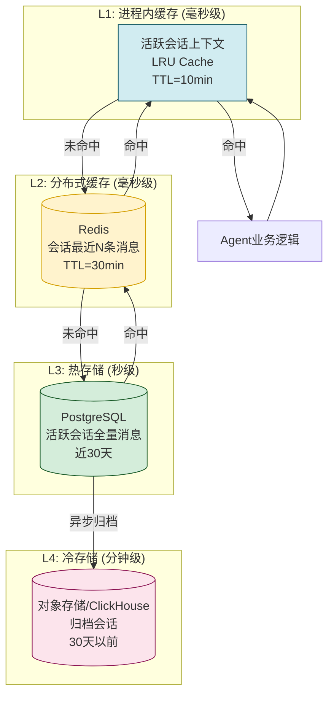

| 层级 | 存储 | 数据 | TTL/保留 | 访问频率 |
|------|------|------|---------|---------|
| **L1 进程缓存** | LRU | 当前活跃会话上下文 | 10min | 极高(每轮对话) |
| **L2 Redis** | Redis | 会话最近 N 条消息 | 30min | 高(新会话首条) |
| **L3 PostgreSQL** | 关系库 | 活跃会话全量 | 30天 | 中(历史查询) |
| **L4 冷存储** | S3/CH | 归档会话 | 1-3年 | 低(检索归档) |

### 2.3 PostgreSQL 表结构设计

#### 2.3.1 会话主表

```sql
CREATE TABLE chat_sessions (
    session_id      VARCHAR(64) PRIMARY KEY,
    tenant_id       VARCHAR(64) NOT NULL DEFAULT 'default',
    user_id         VARCHAR(64) NOT NULL,
    title           VARCHAR(256),
    status          VARCHAR(16) NOT NULL DEFAULT 'active',
    visibility      VARCHAR(16) NOT NULL DEFAULT 'private',
    
    message_count   INT DEFAULT 0,
    total_tokens    BIGINT DEFAULT 0,
    last_message_at TIMESTAMPTZ,
    
    agent_id        VARCHAR(64),
    agent_config    JSONB DEFAULT '{}',
    tags            VARCHAR(64)[] DEFAULT '{}',
    window_config   JSONB DEFAULT '{}',
    
    created_at      TIMESTAMPTZ NOT NULL DEFAULT now(),
    updated_at      TIMESTAMPTZ NOT NULL DEFAULT now(),
    last_active_at  TIMESTAMPTZ NOT NULL DEFAULT now(),
    expires_at      TIMESTAMPTZ,
    
    created_from    VARCHAR(32) DEFAULT 'web',
    device_id       VARCHAR(64)
);

-- 关键索引
CREATE INDEX idx_session_user_active ON chat_sessions (tenant_id, user_id, status, last_active_at DESC);
CREATE INDEX idx_session_expires ON chat_sessions (expires_at) WHERE status = 'active';
CREATE INDEX idx_session_tenant ON chat_sessions (tenant_id, last_active_at DESC);
```

#### 2.3.2 消息表(分区)

```sql
-- 按月分区(消息量大,分区利于清理与查询)
CREATE TABLE chat_messages (
    message_id      VARCHAR(64) NOT NULL,
    session_id      VARCHAR(64) NOT NULL,
    tenant_id       VARCHAR(64) NOT NULL,
    user_id         VARCHAR(64) NOT NULL,
    
    role            VARCHAR(16) NOT NULL,
    content         TEXT NOT NULL,
    content_type    VARCHAR(16) DEFAULT 'text',
    metadata        JSONB DEFAULT '{}',
    
    tool_calls      JSONB,
    tool_call_id    VARCHAR(64),
    tool_name       VARCHAR(64),
    
    token_count     INT DEFAULT 0,
    char_count      INT DEFAULT 0,
    
    status          VARCHAR(16) DEFAULT 'active',
    is_pinned       BOOLEAN DEFAULT FALSE,
    
    sequence        INT NOT NULL,
    created_at      TIMESTAMPTZ NOT NULL DEFAULT now(),
    
    sensitivity     VARCHAR(16) DEFAULT 'internal',
    encrypted       BOOLEAN DEFAULT FALSE,
    
    PRIMARY KEY (message_id, created_at)  -- 分区键必须包含
) PARTITION BY RANGE (created_at);

-- 按月创建分区
CREATE TABLE chat_messages_2026_08 PARTITION OF chat_messages
    FOR VALUES FROM ('2026-08-01') TO ('2026-09-01');

CREATE INDEX idx_msg_session_seq ON chat_messages (session_id, sequence);
CREATE INDEX idx_msg_session_time ON chat_messages (session_id, created_at);
CREATE INDEX idx_msg_user_time ON chat_messages (tenant_id, user_id, created_at DESC);
CREATE INDEX idx_msg_active ON chat_messages (session_id, status) WHERE status = 'active';
```

#### 2.3.3 会话摘要表(用于窗口压缩)

```sql
CREATE TABLE chat_session_summaries (
    id              BIGSERIAL PRIMARY KEY,
    session_id      VARCHAR(64) NOT NULL,
    tenant_id       VARCHAR(64) NOT NULL,
    user_id         VARCHAR(64) NOT NULL,
    
    summary_text    TEXT NOT NULL,              -- 摘要内容
    summary_tokens  INT NOT NULL,
    
    covered_from_seq INT NOT NULL,              -- 摘要覆盖的起始序号
    covered_to_seq   INT NOT NULL,              -- 摘要覆盖的结束序号
    covered_message_count INT NOT NULL,
    
    summary_strategy VARCHAR(32) NOT NULL,      -- rolling/segment/llm
    model_used      VARCHAR(64),                -- 生成摘要的模型
    
    created_at      TIMESTAMPTZ NOT NULL DEFAULT now(),
    is_active       BOOLEAN DEFAULT TRUE
);

CREATE INDEX idx_summary_session ON chat_session_summaries (session_id, covered_to_seq DESC);
```

### 2.4 多模态消息支持

```python
# 多模态消息内容结构(存于 content 或 metadata)
MULTIMODAL_CONTENT_EXAMPLE = {
    "role": "user",
    "content": [
        {"type": "text", "text": "请描述这张图"},
        {"type": "image_url", "image_url": {
            "url": "s3://bucket/msg_123/img.png",
            "detail": "high"
        }}
    ],
    "metadata": {
        "attachments": [
            {"type": "image", "size": 102400, "storage_key": "s3://..."},
            {"type": "file", "name": "report.pdf", "size": 2048576}
        ]
    }
}
```

---

## 三、上下文窗口大小控制机制

> **本节是会话上下文管理的核心**。LLM 上下文窗口有限,如何在有限窗口内保留最相关的信息,直接决定 AI 助手的智能水平。

### 3.1 窗口控制问题本质

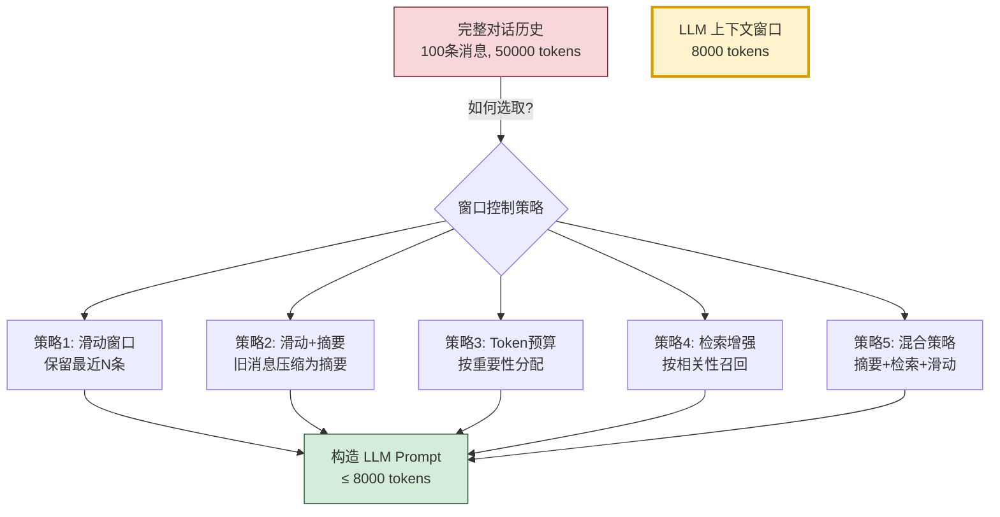

### 3.2 五种窗口控制策略详解

#### 策略1: 滑动窗口(Sliding Window)

最简单的策略:**保留最近 N 条消息**,超出部分裁剪。

```python
class SlidingWindowStrategy:
    """滑动窗口策略"""
    
    def __init__(self, max_messages: int = 20, max_tokens: int = 8000):
        self.max_messages = max_messages
        self.max_tokens = max_tokens

    def select(self, messages: list[Message], 
               system_prompt: str = None) -> list[Message]:
        selected = []
        token_used = self._count_tokens(system_prompt) if system_prompt else 0
        
        # 从后往前选取,直到达到上限
        for msg in reversed(messages):
            if msg.status != MessageStatus.ACTIVE:
                continue
            if len(selected) >= self.max_messages:
                break
            if token_used + msg.token_count > self.max_tokens:
                break
            selected.append(msg)
            token_used += msg.token_count
        
        # 保留时序(正序)
        selected.reverse()
        
        # 确保系统消息在最前
        if system_prompt:
            selected.insert(0, Message(
                role=MessageRole.SYSTEM, content=system_prompt,
                token_count=self._count_tokens(system_prompt)
            ))
        return selected
```

**优点**:实现简单,延迟低  
**缺点**:丢失早期重要信息(如用户最初的目标)

#### 策略2: 滑动窗口 + 摘要压缩(Sliding + Summary)

将旧消息压缩为摘要,保留长程上下文:

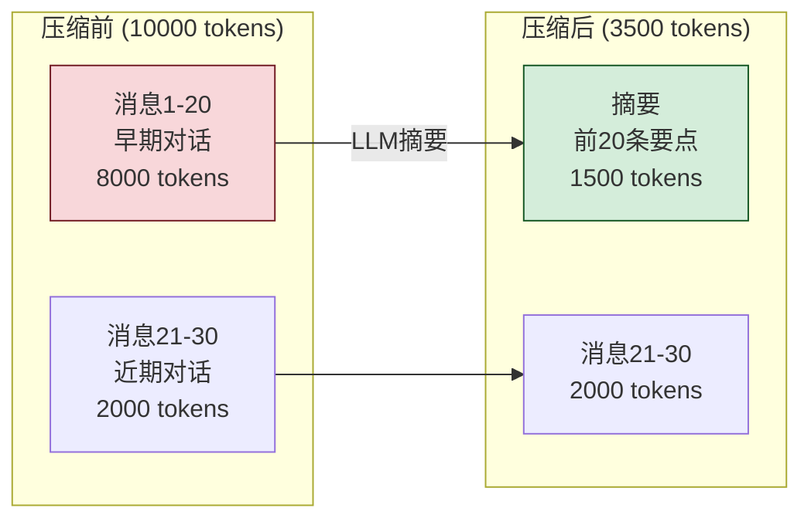

```python
class SlidingWithSummaryStrategy:
    """滑动窗口+摘要压缩策略"""

    def __init__(self, max_tokens: int = 8000, 
                 recent_keep_tokens: int = 4000,
                 summary_max_tokens: int = 2000,
                 llm_summarizer=None):
        self.max_tokens = max_tokens
        self.recent_keep_tokens = recent_keep_tokens
        self.summary_max_tokens = summary_max_tokens
        self.llm = llm_summarizer
        self.summary_store = None  # 注入摘要存储

    async def select(self, messages: list[Message], 
                     session_id: str,
                     system_prompt: str = None) -> list[Message]:
        # 1. 计算系统提示 + 最近消息的token
        sys_tokens = self._count_tokens(system_prompt) if system_prompt else 0
        budget_for_recent = self.recent_keep_tokens
        
        # 2. 从后往前选取"近期消息"
        recent = []
        token_used = sys_tokens
        for msg in reversed(messages):
            if msg.status != MessageStatus.ACTIVE:
                continue
            if token_used + msg.token_count > sys_tokens + budget_for_recent:
                break
            recent.append(msg)
            token_used += msg.token_count
        recent.reverse()
        
        # 3. 判断是否需要摘要
        recent_start_seq = recent[0].sequence if recent else 0
        summary = await self.summary_store.get_active_summary(session_id)
        
        # 如果摘要覆盖范围 < recent_start_seq, 说明有未摘要的中间消息
        if not summary or summary.covered_to_seq < recent_start_seq - 1:
            # 找出需要新摘要的消息(从上次摘要结束到recent开始前)
            to_summarize = [m for m in messages 
                           if (not summary or m.sequence > summary.covered_to_seq)
                           and m.sequence < recent_start_seq
                           and m.status == MessageStatus.ACTIVE]
            
            if to_summarize:
                # 调用 LLM 生成摘要
                new_summary_text = await self._generate_summary(
                    to_summarize, 
                    prev_summary=summary.summary_text if summary else None
                )
                summary = await self.summary_store.save_summary(
                    session_id=session_id,
                    summary_text=new_summary_text,
                    covered_from_seq=(summary.covered_to_seq + 1) if summary else to_summarize[0].sequence,
                    covered_to_seq=to_summarize[-1].sequence,
                    covered_message_count=len(to_summarize),
                )
        
        # 4. 组装最终上下文
        result = []
        if system_prompt:
            result.append(Message(role=MessageRole.SYSTEM, content=system_prompt))
        if summary:
            result.append(Message(
                role=MessageRole.SYSTEM,
                content=f"[之前的对话摘要]\n{summary.summary_text}",
                metadata={"is_summary": True, "covered_seq": summary.covered_to_seq}
            ))
        result.extend(recent)
        return result

    async def _generate_summary(self, messages: list[Message], 
                                 prev_summary: str = None) -> str:
        """调用 LLM 生成摘要(滚动更新)"""
        msgs_text = "\n".join(f"[{m.role.value}]: {m.content[:200]}" 
                              for m in messages[-20:])  # 限制输入
        prompt = f"""
        请将以下对话内容压缩为简洁摘要,保留关键信息:
        {f"已有摘要: {prev_summary}" if prev_summary else ""}
        
        新增对话:
        {msgs_text}
        
        要求:
        - 保留用户的核心目标与已确定的事实
        - 保留已做出的决策与结论
        - 删除寒暄、重复、无关内容
        - 不超过 {self.summary_max_tokens} tokens
        """
        return await self.llm.generate(prompt)
```

**优点**:保留长程上下文,token 利用率高  
**缺点**:LLM 摘要有延迟与成本,可能丢失细节

#### 策略3: Token 预算分配(Token Budget)

按重要性分配 token 预算:

```python
class TokenBudgetStrategy:
    """Token 预算策略: 按消息重要性分配"""
    
    def __init__(self, total_budget: int = 8000):
        self.total_budget = total_budget
        # 预算分配比例
        self.allocation = {
            "system": 0.10,      # 系统提示 10%
            "summary": 0.20,     # 摘要 20%
            "pinned": 0.15,      # 置顶消息 15%
            "recent": 0.40,      # 近期消息 40%
            "retrieved": 0.15,   # 检索召回 15%
        }
    
    async def select(self, messages, session_id, system_prompt, query=None):
        budget = {k: int(self.total_budget * v) for k, v in self.allocation.items()}
        result = []
        
        # 1. 系统提示
        if system_prompt:
            result.append(Message(role=MessageRole.SYSTEM, content=system_prompt))
        
        # 2. 摘要
        summary = await self.summary_store.get_active_summary(session_id)
        if summary and len(summary.summary_text) < budget["summary"]:
            result.append(Message(role=MessageRole.SYSTEM, 
                                  content=f"[摘要]\n{summary.summary_text}"))
        
        # 3. 置顶消息(用户标记重要)
        pinned = [m for m in messages if m.is_pinned]
        pinned_budget = budget["pinned"]
        for msg in pinned:
            if pinned_budget >= msg.token_count:
                result.append(msg)
                pinned_budget -= msg.token_count
        
        # 4. 近期消息(从后往前)
        recent = []
        recent_budget = budget["recent"]
        for msg in reversed(messages):
            if msg.is_pinned: continue
            if recent_budget < msg.token_count: break
            recent.append(msg)
            recent_budget -= msg.token_count
        recent.reverse()
        result.extend(recent)
        
        # 5. 检索召回(如果还有预算且有查询)
        if query and budget["retrieved"] > 0:
            retrieved = await self.retriever.search(
                session_id=session_id, query=query, 
                max_tokens=budget["retrieved"]
            )
            result.extend(retrieved)
        
        return result
```

#### 策略4: 检索增强窗口(RAG-based)

每次回复前,**根据当前用户消息检索历史相关消息**:

```python
class RetrievalAugmentedStrategy:
    """检索增强策略: 用向量检索找相关历史"""
    
    def __init__(self, vector_store, embedder, 
                 max_tokens: int = 8000, top_k: int = 10):
        self.vector_store = vector_store
        self.embedder = embedder
        self.max_tokens = max_tokens
        self.top_k = top_k

    async def select(self, messages, session_id, system_prompt, current_query):
        # 1. 始终保留系统提示 + 最近3条消息
        result = []
        if system_prompt:
            result.append(Message(role=MessageRole.SYSTEM, content=system_prompt))
        token_used = sum(m.token_count for m in result)
        
        recent = messages[-3:] if len(messages) >= 3 else messages
        result.extend(recent)
        token_used = sum(m.token_count for m in result)
        
        # 2. 向量检索相关历史消息
        query_embedding = await self.embedder.embed(current_query)
        results = await self.vector_store.search(
            collection_name=f"session_{session_id}",
            query_vector=query_embedding,
            top_k=self.top_k,
            filter={"status": "active"}
        )
        
        # 3. 去重(避免与recent重复) + 按时序重排
        recent_ids = {m.message_id for m in recent}
        retrieved = []
        for r in results:
            if r.message_id in recent_ids: continue
            if token_used + r.token_count > self.max_tokens: break
            retrieved.append(r)
            token_used += r.token_count
        
        # 按时序排列
        retrieved.sort(key=lambda m: m.sequence)
        
        # 4. 插入分隔标记后加入
        if retrieved:
            result.append(Message(
                role=MessageRole.SYSTEM,
                content=f"[以下是与当前问题相关的历史对话]",
                token_count=20
            ))
            result.extend(retrieved)
        
        return result
```

#### 策略5: 混合策略(推荐生产环境使用)

综合摘要 + 滑动 + 检索 + 预算的混合策略:

```python
class HybridWindowStrategy:
    """混合策略: 摘要 + 滑动 + 检索 + 预算,生产推荐"""
    
    def __init__(self, config: dict):
        self.config = config  # 灵活配置各策略权重
    
    async def select(self, messages, session_id, system_prompt, query):
        # 1. 总预算分配
        budget = self._allocate_budget(self.config["total_tokens"], query is not None)
        
        # 2. 系统提示(必选)
        result = [Message(role=MessageRole.SYSTEM, content=system_prompt)]
        used = self._tokens(result)
        
        # 3. 摘要(如有)
        summary = await self.summary_store.get_active_summary(session_id)
        if summary and budget["summary"] > 0:
            result.append(Message(role=MessageRole.SYSTEM, 
                                  content=f"[历史摘要]\n{summary.summary_text}"))
            used = self._tokens(result)
        
        # 4. 置顶消息
        pinned = [m for m in messages if m.is_pinned and m.status == MessageStatus.ACTIVE]
        for msg in pinned:
            if used + msg.token_count <= used + budget["pinned"]:
                result.append(msg)
                used += msg.token_count
        
        # 5. 近期消息(滑动窗口)
        recent_budget = budget["recent"]
        recent = []
        for msg in reversed(messages):
            if msg.is_pinned: continue
            if recent_budget < msg.token_count: break
            recent.append(msg)
            recent_budget -= msg.token_count
        recent.reverse()
        result.extend(recent)
        used = self._tokens(result)
        
        # 6. 检索召回(如有query且仍有预算)
        remaining = self.config["total_tokens"] - used
        if query and remaining > 200:
            retrieved = await self._retrieve_relevant(
                session_id, query, max_tokens=remaining, 
                exclude_ids={m.message_id for m in result}
            )
            result.extend(retrieved)
        
        # 7. 按时序重排(系统消息除外)
        return self._reorder(result)
```

### 3.3 窗口控制策略对比

| 策略 | 实现复杂度 | 长程上下文 | token利用率 | 延迟 | 适用场景 |
|------|----------|----------|------------|------|---------|
| **滑动窗口** | ⭐ | ❌ 差 | 中 | 极低 | 短对话、低成本 |
| **滑动+摘要** | ⭐⭐⭐ | ✅ 好 | 高 | 中(LLM摘要) | 长对话、主流场景 |
| **Token预算** | ⭐⭐⭐ | 中 | 极高 | 低 | 需精细控制 |
| **检索增强** | ⭐⭐⭐⭐ | ✅ 极好 | 极高 | 中(向量检索) | 知识密集型对话 |
| **混合策略** | ⭐⭐⭐⭐⭐ | ✅ 极好 | 极高 | 中 | 生产环境推荐 |

### 3.4 窗口溢出处理流程

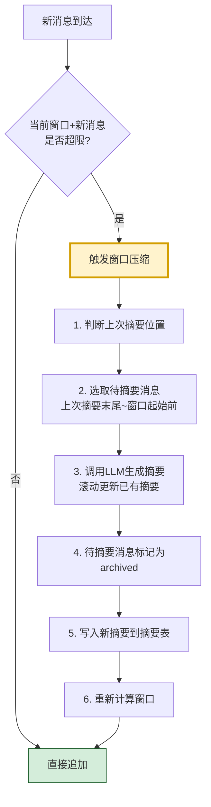

---

## 四、高效检索机制

### 4.1 检索场景分类

| 检索场景 | 触发时机 | 检索范围 | 性能要求 |
|---------|---------|---------|---------|
| **上下文加载** | 每轮对话 | 当前会话活跃消息 | P99 < 20ms |
| **会话内搜索** | 用户搜索历史 | 当前会话全量(含归档) | P99 < 500ms |
| **跨会话检索** | 用户搜索所有对话 | 用户全部会话 | P99 < 2s |
| **语义检索** | 窗口控制策略4 | 当前会话向量化消息 | P99 < 100ms |
| **时间范围查询** | 按日期过滤 | 指定时间段 | P99 < 200ms |

### 4.2 多级检索架构

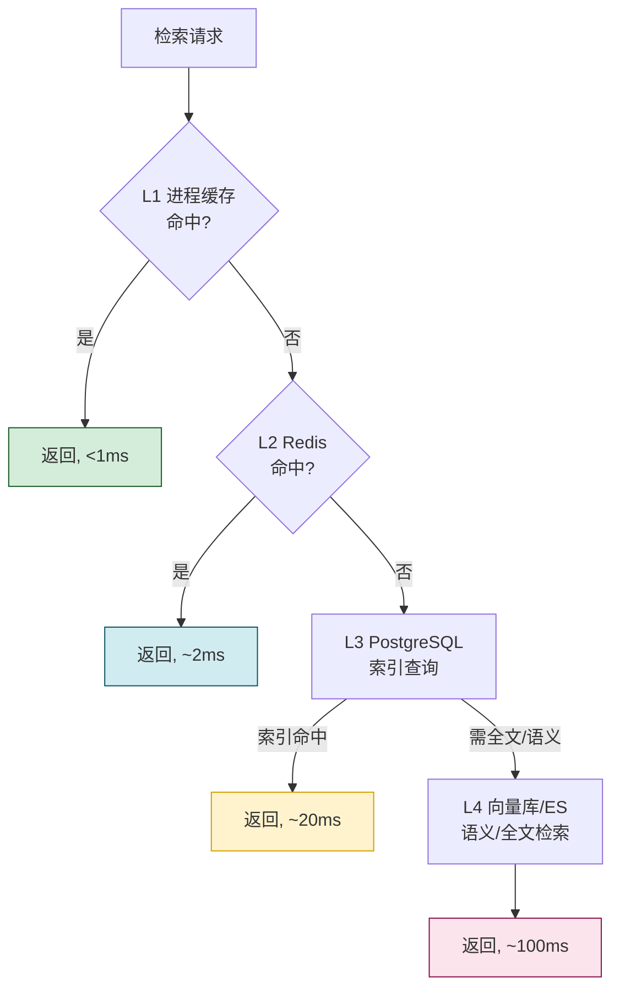

### 4.3 索引设计

```sql
-- 1. 时序索引: 按会话+序号快速加载上下文
CREATE INDEX idx_msg_session_seq ON chat_messages (session_id, sequence);

-- 2. 用户级时间索引: 跨会话检索
CREATE INDEX idx_msg_user_time ON chat_messages (tenant_id, user_id, created_at DESC);

-- 3. 部分索引: 仅活跃消息(窗口加载常用)
CREATE INDEX idx_msg_active ON chat_messages (session_id, sequence) 
    WHERE status = 'active';

-- 4. 全文索引(PostgreSQL pg_trgm或zhparser)
CREATE EXTENSION IF NOT EXISTS pg_trgm;
CREATE INDEX idx_msg_content_trgm ON chat_messages 
    USING gin (content gin_trgm_ops);

-- 5. 标签索引
CREATE INDEX idx_session_tags ON chat_sessions USING gin (tags);
```

### 4.4 向量检索集成(语义检索)

```python
class SemanticMessageRetriever:
    """语义消息检索器"""
    
    def __init__(self, vector_store, embedder):
        self.vector_store = vector_store
        self.embedder = embedder

    async def index_message(self, msg: Message):
        """消息写入时同步索引到向量库"""
        # 跳过过短或工具消息
        if msg.role == MessageRole.TOOL or len(msg.content) < 20:
            return
        
        embedding = await self.embedder.embed(msg.content)
        await self.vector_store.upsert(
            collection_name=f"msgs_{msg.tenant_id}",
            points=[{
                "id": msg.message_id,
                "vector": embedding,
                "payload": {
                    "session_id": msg.session_id,
                    "user_id": msg.user_id,
                    "role": msg.role.value,
                    "sequence": msg.sequence,
                    "created_at": msg.created_at.isoformat(),
                    "content_preview": msg.content[:200],
                    "status": msg.status.value,
                }
            }]
        )

    async def search(self, user_id: str, query: str, 
                     session_id: str = None, top_k: int = 10) -> list:
        """语义检索: 强制user_id过滤防越权"""
        query_vec = await self.embedder.embed(query)
        filter_cond = {
            "user_id": user_id,           # 必须过滤
            "status": "active"
        }
        if session_id:
            filter_cond["session_id"] = session_id
        
        return await self.vector_store.search(
            collection_name=f"msgs_{user_id[:8]}",  # 分collection
            query_vector=query_vec,
            top_k=top_k,
            filter=filter_cond
        )
```

### 4.5 增量上下文加载

避免每次都全量加载,采用增量方式:

```python
class IncrementalContextLoader:
    """增量上下文加载器"""
    
    async def load_context(self, session_id: str, 
                           since_seq: int = 0) -> tuple[list[Message], int]:
        """加载since_seq之后的新消息"""
        # 1. 先查L1缓存
        cached = self.l1.get(f"ctx:{session_id}")
        if cached and cached["last_seq"] >= since_seq:
            new_msgs = [m for m in cached["messages"] if m.sequence > since_seq]
            return new_msgs, cached["last_seq"]
        
        # 2. 查DB
        msgs = await self.db.get_messages_after(session_id, since_seq, limit=100)
        last_seq = msgs[-1].sequence if msgs else since_seq
        
        # 3. 更新缓存
        self.l1.set(f"ctx:{session_id}", 
                    {"messages": msgs, "last_seq": last_seq}, ttl=600)
        
        return msgs, last_seq
```

---

## 五、自动清理与过期策略

### 5.1 清理策略全景

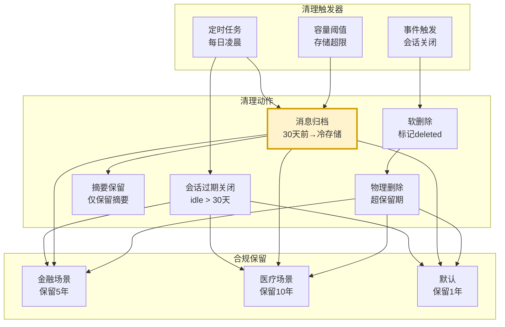

### 5.2 分级保留策略

| 数据类型 | 默认保留 | 归档方式 | 物理删除 |
|---------|---------|---------|---------|
| 活跃会话消息 | 30天 | 转冷存储 | 1年后 |
| 关闭会话 | 90天 | 转冷存储 | 1年后 |
| 已摘要的原消息 | 90天 | 仅保留摘要 | 摘要生成后90天 |
| 会话元数据 | 1年 | 不归档 | 1年后 |
| 向量索引 | 跟随消息 | 跟随归档 | 跟随删除 |
| 审计日志 | 3年 | ES归档 | 3年后 |

### 5.3 清理调度器实现

```python
import asyncio
from datetime import datetime, timedelta

class SessionCleanupScheduler:
    """会话清理调度器"""

    def __init__(self, db, cold_storage, summary_store, config):
        self.db = db
        self.cold = cold_storage
        self.summary_store = summary_store
        self.config = config

    async def run_daily_cleanup(self):
        """每日清理任务(凌晨2点)"""
        tasks = [
            self._close_idle_sessions(),
            self._archive_old_messages(),
            self._cleanup_expired_summaries(),
            self._physical_delete_old_data(),
            self._enforce_compliance(),
        ]
        results = await asyncio.gather(*tasks, return_exceptions=True)
        
        for task, result in zip(tasks, results):
            if isinstance(result, Exception):
                logger.error(f"清理任务失败: {task.__name__}: {result}")
                await self.alert.send(f"⚠️ 清理任务失败: {task.__name__}: {result}")
            else:
                logger.info(f"清理任务完成: {task.__name__}: {result}")

    async def _close_idle_sessions(self):
        """关闭闲置会话"""
        threshold = datetime.utcnow() - timedelta(
            days=self.config["idle_close_days"]  # 默认30天
        )
        affected = await self.db.execute(
            "UPDATE chat_sessions SET status = 'expired', updated_at = now() "
            "WHERE status = 'active' AND last_active_at < %s",
            [threshold]
        )
        logger.info(f"关闭闲置会话: {affected} 个")
        return {"closed": affected}

    async def _archive_old_messages(self):
        """归档老消息到冷存储"""
        threshold = datetime.utcnow() - timedelta(
            days=self.config["archive_after_days"]  # 默认30天
        )
        
        # 分批查询待归档消息(避免一次性加载过多)
        batch_size = 1000
        archived = 0
        while True:
            msgs = await self.db.fetch(
                "SELECT * FROM chat_messages "
                "WHERE created_at < %s AND status = 'active' "
                "ORDER BY created_at LIMIT %s",
                [threshold, batch_size]
            )
            if not msgs: break
            
            # 写入冷存储
            await self.cold.batch_put(msgs)
            
            # 更新DB状态
            msg_ids = [m["message_id"] for m in msgs]
            await self.db.execute(
                "UPDATE chat_messages SET status = 'archived' "
                "WHERE message_id = ANY(%s)",
                [msg_ids]
            )
            archived += len(msgs)
        
        logger.info(f"归档消息: {archived} 条")
        return {"archived": archived}

    async def _cleanup_expired_summaries(self):
        """清理过期摘要(对应消息已物理删除的)"""
        await self.db.execute(
            "DELETE FROM chat_session_summaries "
            "WHERE created_at < now() - interval '%s days'",
            [self.config["summary_retention_days"]]
        )

    async def _physical_delete_old_data(self):
        """物理删除超保留期数据"""
        retention = self.config["physical_delete_after_days"]  # 默认365天
        threshold = datetime.utcnow() - timedelta(days=retention)
        
        # 删除已归档的超期消息
        deleted = await self.db.execute(
            "DELETE FROM chat_messages "
            "WHERE created_at < %s AND status = 'archived'",
            [threshold]
        )
        # 删除超期会话
        await self.db.execute(
            "DELETE FROM chat_sessions "
            "WHERE last_active_at < %s AND status IN ('expired', 'closed')",
            [threshold]
        )
        logger.info(f"物理删除: {deleted} 条消息")
        return {"physical_deleted": deleted}

    async def _enforce_compliance(self):
        """合规强制保留:某些场景需保留更久"""
        # 例如金融场景保留5年
        compliance_rules = await self.db.get_compliance_rules()
        for rule in compliance_rules:
            # 跳过该规则覆盖的会话/消息
            await self.db.mark_compliance_protected(
                tenant_id=rule["tenant_id"],
                retention_days=rule["retention_days"]
            )
```

### 5.4 GDPR/合规删除支持

```python
class ComplianceManager:
    """合规管理器: 支持用户数据删除请求"""

    async def handle_deletion_request(self, user_id: str, 
                                       scope: str = "all"):
        """处理用户数据删除请求(GDPR Right to Erasure)"""
        # scope: all/messages/sessions/metadata
        
        if scope in ("all", "messages"):
            # 1. 删除消息
            await self.db.delete_messages(user_id=user_id)
            # 2. 删除向量索引
            await self.vector_store.delete_collection(f"msgs_{user_id[:8]}")
            # 3. 删除冷存储
            await self.cold.delete_by_user(user_id)
        
        if scope in ("all", "sessions"):
            await self.db.delete_sessions(user_id=user_id)
        
        if scope in ("all", "metadata"):
            await self.db.delete_user_metadata(user_id=user_id)
        
        # 记录合规删除(审计)
        await self.audit.log_compliance_deletion(user_id, scope)
```

---

## 六、多用户会话隔离管理

### 6.1 隔离模型

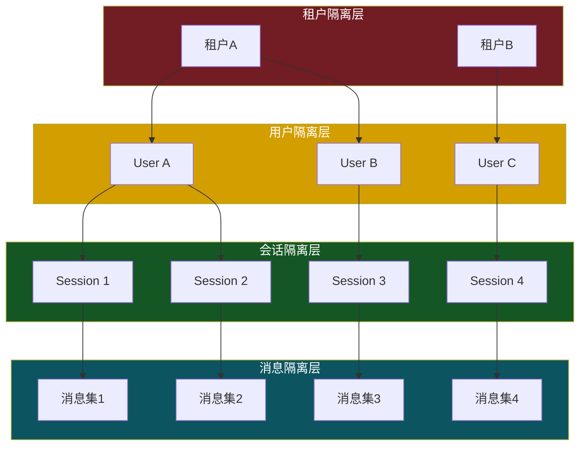

### 6.2 三级隔离机制

| 隔离层级 | 字段 | 强制方式 | 越权防护 |
|---------|------|---------|---------|
| **租户隔离** | `tenant_id` | API层注入,不可由客户端指定 | 数据库行级过滤 |
| **用户隔离** | `user_id` | 从认证Token解析 | 所有查询强制WHERE user_id |
| **会话隔离** | `session_id` | 校验session属主 | 访问前校验session.user_id == ctx.user_id |

### 6.3 强制隔离的查询层

```python
class IsolatedSessionRepository:
    """强制隔离的会话仓储: 所有方法必须带user_id,防越权"""

    def __init__(self, db):
        self.db = db

    async def get_session(self, session_id: str, 
                          user_id: str, tenant_id: str) -> Optional[Session]:
        """获取会话: 必须校验属主"""
        row = await self.db.fetchrow(
            "SELECT * FROM chat_sessions "
            "WHERE session_id = $1 AND user_id = $2 AND tenant_id = $3 "
            "AND status != 'deleted'",
            [session_id, user_id, tenant_id]
        )
        return Session(**row) if row else None

    async def list_sessions(self, user_id: str, tenant_id: str,
                            status: str = None, limit: int = 50) -> list[Session]:
        """列出用户会话"""
        query = ("SELECT * FROM chat_sessions "
                 "WHERE user_id = $1 AND tenant_id = $2 AND status != 'deleted'")
        params = [user_id, tenant_id]
        if status:
            query += " AND status = $3"
            params.append(status)
        query += " ORDER BY last_active_at DESC LIMIT $" + str(len(params) + 1)
        params.append(limit)
        rows = await self.db.fetch(query, *params)
        return [Session(**r) for r in rows]

    async def get_messages(self, session_id: str, user_id: str, tenant_id: str,
                           limit: int = 100, before_seq: int = None) -> list[Message]:
        """获取会话消息: 必须带user_id"""
        # 双重校验: session属主 + 消息属主
        query = """
            SELECT m.* FROM chat_messages m
            JOIN chat_sessions s ON m.session_id = s.session_id
            WHERE m.session_id = $1 
              AND m.user_id = $2 
              AND m.tenant_id = $3
              AND s.user_id = $2
              AND m.status != 'deleted'
        """
        params = [session_id, user_id, tenant_id]
        if before_seq:
            query += " AND m.sequence < $4"
            params.append(before_seq)
        query += " ORDER BY m.sequence DESC LIMIT $" + str(len(params) + 1)
        params.append(limit)
        rows = await self.db.fetch(query, *params)
        return [Message(**r) for r in reversed(rows)]
```

### 6.4 多租户支持

```python
class TenantContext:
    """租户上下文: 从请求中提取"""
    tenant_id: str
    tenant_config: dict  # 该租户的配置(保留期、加密策略等)

# FastAPI 依赖注入
async def get_tenant_ctx(request: Request) -> TenantContext:
    token = request.headers.get("Authorization")
    claims = jwt.decode(token)
    return TenantContext(
        tenant_id=claims["tenant_id"],
        tenant_config=await load_tenant_config(claims["tenant_id"])
    )

# 所有仓储方法签名强制带 tenant_ctx
async def create_session(user_id: str, tenant_ctx: TenantContext, ...):
    # tenant_id 从ctx注入, 不接受客户端传入
    ...
```

### 6.5 共享会话支持(可选)

某些场景(团队协作)需共享会话:

```python
class SharedSessionManager:
    """共享会话管理器"""

    async def share_session(self, session_id: str, owner_id: str,
                             target_user_ids: list[str], 
                             permission: str = "read"):
        """共享会话给其他用户"""
        # 校验属主
        session = await self.repo.get_session(session_id, owner_id, ...)
        if not session:
            raise PermissionError("无权共享")
        
        # 创建共享记录
        for uid in target_user_ids:
            await self.db.insert("session_shares", {
                "session_id": session_id,
                "shared_with": uid,
                "permission": permission,  # read/comment/edit
                "shared_by": owner_id,
                "shared_at": datetime.utcnow()
            })

    async def get_session_with_shares(self, session_id: str, 
                                       requester_id: str) -> Session:
        """获取会话(支持通过共享访问)"""
        # 1. 是属主?
        session = await self.repo.get_session(session_id, requester_id, ...)
        if session:
            return session
        
        # 2. 是共享对象?
        share = await self.db.fetchrow(
            "SELECT * FROM session_shares "
            "WHERE session_id = $1 AND shared_with = $2",
            [session_id, requester_id]
        )
        if share:
            session = await self.repo.get_session_any_user(session_id, ...)
            session.metadata["share_permission"] = share["permission"]
            return session
        
        raise PermissionError("无权访问此会话")
```

---

## 七、数据安全与权限控制

### 7.1 安全防护层次

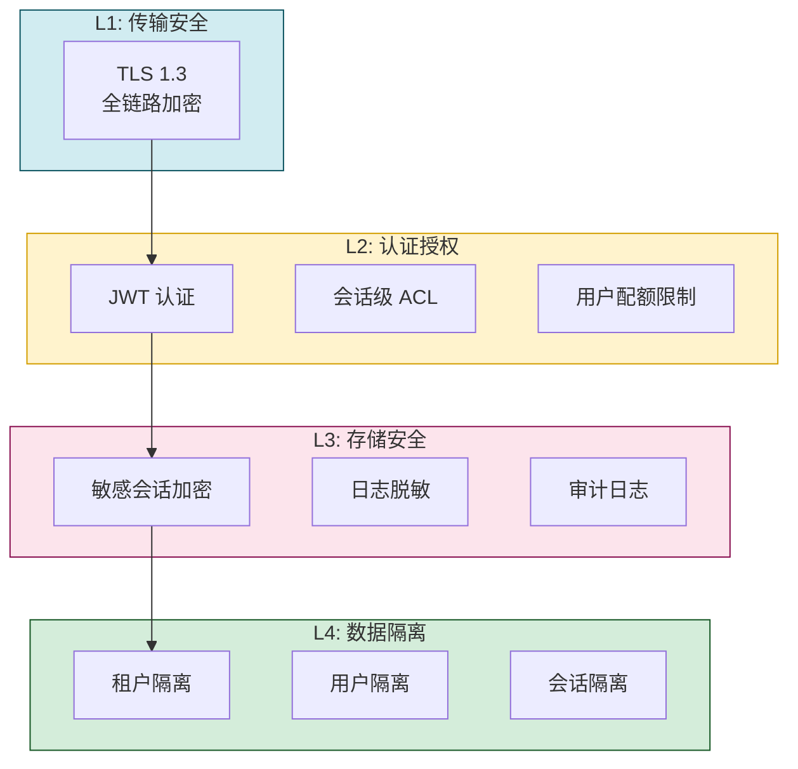

### 7.2 敏感会话加密

```python
class SessionEncryption:
    """会话加密(基于敏感度分级)"""

    async def encrypt_message_if_needed(self, msg: Message) -> Message:
        """根据会话敏感度决定是否加密"""
        session = await self.session_repo.get_session(
            msg.session_id, msg.user_id, msg.tenant_id
        )
        # 敏感会话(如医疗、法律咨询)整会话加密
        if session.metadata.get("sensitivity") == "sensitive":
            msg.content = await self.kms.encrypt(msg.content)
            msg.encrypted = True
        return msg

    async def decrypt_message(self, msg: Message) -> Message:
        if msg.encrypted:
            msg.content = await self.kms.decrypt(msg.content)
            msg.encrypted = False
        return msg
```

### 7.3 配额限制(防滥用)

```python
class SessionQuotaManager:
    """会话配额管理"""

    async def check_quota(self, user_id: str, tenant_id: str, action: str):
        """检查用户配额"""
        limits = await self.get_tenant_limits(tenant_id)
        
        if action == "create_session":
            count = await self.db.count_active_sessions(user_id, tenant_id)
            if count >= limits["max_active_sessions"]:  # 如100
                raise QuotaExceededError(f"活跃会话数超限: {count}/{limits['max_active_sessions']}")
        
        elif action == "send_message":
            # 每分钟消息数限制
            recent = await self.redis.incr(f"msg_rate:{user_id}")
            if recent == 1:
                await self.redis.expire(f"msg_rate:{user_id}", 60)
            if recent > limits["messages_per_minute"]:  # 如60
                raise QuotaExceededError("消息频率超限")
            
            # 每日token配额
            today_tokens = await self.redis.get(f"token_quota:{user_id}:{date.today()}")
            if today_tokens and int(today_tokens) > limits["daily_tokens"]:
                raise QuotaExceededError("日token配额超限")
```

### 7.4 审计日志

```sql
CREATE TABLE session_audit_log (
    id              BIGSERIAL PRIMARY KEY,
    timestamp       TIMESTAMPTZ NOT NULL DEFAULT now(),
    tenant_id       VARCHAR(64) NOT NULL,
    user_id         VARCHAR(64) NOT NULL,
    session_id      VARCHAR(64),
    action          VARCHAR(32) NOT NULL,  -- create/read/send/delete/share/export
    message_id      VARCHAR(64),
    source_ip       INET,
    device_id       VARCHAR(64),
    success         BOOLEAN NOT NULL,
    reason          TEXT,
    metadata        JSONB
);

CREATE INDEX idx_audit_user_time ON session_audit_log (user_id, timestamp DESC);
CREATE INDEX idx_audit_session ON session_audit_log (session_id, timestamp DESC);
CREATE INDEX idx_audit_action ON session_audit_log (action, timestamp DESC);
```

---

## 八、与现有 AI 助手框架的兼容集成

### 8.1 框架兼容性矩阵

| 框架 | 兼容方式 | 集成点 |
|------|---------|--------|
| **LangChain** | `Memory` 接口适配器 | `BaseChatMessageHistory` 实现 |
| **AutoGen** | 自定义 `Agent` + `GroupChatManager` | 通过 API 加载历史 |
| **LlamaIndex** | `ChatMemoryBuffer` 适配 | 自定义 `Memory` |
| **OpenAI Assistants API** | 替代 `Threads` + `Messages` | 提供兼容 API |
| **自定义框架** | 标准 REST API | 直接调用 |

### 8.2 LangChain 集成适配器

```python
from langchain.memory import BaseChatMessageHistory
from langchain.schema import BaseMessage, HumanMessage, AIMessage, SystemMessage

class LangChainSessionHistory(BaseChatMessageHistory):
    """LangChain 兼容的会话历史适配器"""
    
    def __init__(self, session_id: str, user_id: str, 
                 tenant_id: str, scm_client: "SCMClient"):
        self.session_id = session_id
        self.user_id = user_id
        self.tenant_id = tenant_id
        self.client = scm_client

    @property
    def messages(self) -> list[BaseMessage]:
        """同步返回消息列表(LangChain 接口)"""
        # 调用 SCM API 获取
        msgs = self.client.get_messages(
            session_id=self.session_id,
            user_id=self.user_id,
            tenant_id=self.tenant_id
        )
        return [self._convert(m) for m in msgs]

    def add_message(self, message: BaseMessage) -> None:
        """添加消息"""
        role = "user" if isinstance(message, HumanMessage) else \
               "assistant" if isinstance(message, AIMessage) else "system"
        self.client.add_message(
            session_id=self.session_id,
            user_id=self.user_id,
            tenant_id=self.tenant_id,
            role=role,
            content=message.content
        )

    def clear(self) -> None:
        """清空会话"""
        self.client.clear_session(self.session_id, self.user_id, self.tenant_id)

    def _convert(self, scm_msg: dict) -> BaseMessage:
        if scm_msg["role"] == "user":
            return HumanMessage(content=scm_msg["content"])
        elif scm_msg["role"] == "assistant":
            return AIMessage(content=scm_msg["content"])
        else:
            return SystemMessage(content=scm_msg["content"])

# 使用示例
from langchain.chat_models import ChatOpenAI
from langchain.chains import ConversationChain

history = LangChainSessionHistory(
    session_id="sess_123",
    user_id="u_456",
    tenant_id="default",
    scm_client=scm
)
llm = ChatOpenAI()
chain = ConversationChain(llm=llm, memory=history)
```

### 8.3 OpenAI Assistants API 兼容层

```python
# 提供 OpenAI 兼容的 Threads/Messages API, 平滑迁移
from fastapi import APIRouter

router = APIRouter()

@router.post("/v1/threads")
async def create_thread(req: dict, ctx = Depends(get_auth_ctx)):
    """兼容 OpenAI Threads API"""
    session = await session_manager.create_session(
        user_id=ctx.user_id, tenant_id=ctx.tenant_id,
        metadata=req.get("metadata", {})
    )
    return {
        "id": session.session_id,
        "object": "thread",
        "created_at": int(session.created_at.timestamp()),
        "metadata": session.metadata
    }

@router.post("/v1/threads/{thread_id}/messages")
async def add_message(thread_id: str, req: dict, ctx = Depends(get_auth_ctx)):
    """兼容 OpenAI Messages API"""
    msg = await message_manager.add_message(
        session_id=thread_id,
        user_id=ctx.user_id,
        tenant_id=ctx.tenant_id,
        role=req["role"],
        content=req["content"],
    )
    return {
        "id": msg.message_id,
        "object": "thread.message",
        "thread_id": thread_id,
        "role": msg.role,
        "content": [{"type": "text", "text": {"value": msg.content}}],
        "created_at": int(msg.created_at.timestamp())
    }
```

### 8.4 AutoGen 集成

```python
import autogen

class SCMAwareAgent(autogen.ConversableAgent):
    """AutoGen Agent 集成 SCM"""
    
    def __init__(self, *args, scm_client, session_id, user_id, **kwargs):
        super().__init__(*args, **kwargs)
        self.scm = scm_client
        self.session_id = session_id
        self.user_id = user_id

    async def a_generate_reply(self, messages, sender):
        # 加载历史上下文
        context = await self.scm.build_context(
            session_id=self.session_id,
            user_id=self.user_id,
            strategy="hybrid",
            current_query=messages[-1]["content"]
        )
        # 调用父类生成
        reply = await super().a_generate_reply(context, sender)
        # 自动持久化
        await self.scm.add_message(
            session_id=self.session_id,
            user_id=self.user_id,
            role="assistant",
            content=reply
        )
        return reply
```

---

## 九、完整 API 文档

### 9.1 API 总览

| 接口分类 | 端点 | 方法 | 描述 |
|---------|------|------|------|
| **会话管理** | `/api/v1/sessions` | POST | 创建会话 |
| | `/api/v1/sessions` | GET | 列出会话 |
| | `/api/v1/sessions/{id}` | GET | 获取会话详情 |
| | `/api/v1/sessions/{id}` | PATCH | 更新会话 |
| | `/api/v1/sessions/{id}` | DELETE | 删除会话 |
| **消息管理** | `/api/v1/sessions/{id}/messages` | POST | 添加消息 |
| | `/api/v1/sessions/{id}/messages` | GET | 获取消息列表 |
| | `/api/v1/sessions/{id}/messages/{msg_id}` | DELETE | 删除消息 |
| | `/api/v1/sessions/{id}/messages/search` | POST | 搜索消息 |
| **上下文** | `/api/v1/sessions/{id}/context` | GET | 构造LLM上下文 |
| | `/api/v1/sessions/{id}/summary` | POST | 生成摘要 |
| **同步** | `/api/v1/sessions/sync` | GET | 增量同步 |
| **管理** | `/api/v1/sessions/{id}/share` | POST | 共享会话 |
| | `/api/v1/sessions/export` | GET | 导出会话 |

### 9.2 详细 API 文档

#### 9.2.1 创建会话

```http
POST /api/v1/sessions
Authorization: Bearer {jwt_token}
Content-Type: application/json

{
  "title": "讨论产品规划",
  "agent_id": "agent_planner_v2",
  "tags": ["产品", "规划"],
  "window_config": {
    "max_tokens": 8000,
    "strategy": "sliding_with_summary"
  },
  "metadata": {}
}
```

**响应**:
```json
{
  "session_id": "sess_a1b2c3d4",
  "title": "讨论产品规划",
  "status": "active",
  "created_at": "2026-08-07T10:00:00Z"
}
```

#### 9.2.2 添加消息

```http
POST /api/v1/sessions/sess_a1b2c3d4/messages
Authorization: Bearer {jwt_token}
Content-Type: application/json

{
  "role": "user",
  "content": "帮我规划下季度产品路线图",
  "content_type": "text",
  "metadata": {"client": "web"}
}
```

**响应**:
```json
{
  "message_id": "msg_x1y2z3",
  "session_id": "sess_a1b2c3d4",
  "sequence": 5,
  "token_count": 32,
  "created_at": "2026-08-07T10:01:00Z",
  "window_overflow": false
}
```

#### 9.2.3 获取 LLM 上下文(核心)

```http
GET /api/v1/sessions/sess_a1b2c3d4/context?strategy=hybrid&max_tokens=8000&current_query=用户当前问题
Authorization: Bearer {jwt_token}
```

**响应**:
```json
{
  "messages": [
    {"role": "system", "content": "You are a helpful assistant..."},
    {"role": "system", "content": "[历史摘要]\n用户在讨论产品规划..."},
    {"role": "user", "content": "下季度优先做什么"},
    {"role": "assistant", "content": "建议优先..."},
    {"role": "user", "content": "用户当前问题"}
  ],
  "total_tokens": 6528,
  "window_strategy": "hybrid",
  "included": {
    "system_prompt": true,
    "summary": true,
    "pinned": 0,
    "recent": 4,
    "retrieved": 2
  },
  "truncated": false
}
```

#### 9.2.4 搜索消息

```http
POST /api/v1/sessions/sess_a1b2c3d4/messages/search
Authorization: Bearer {jwt_token}
Content-Type: application/json

{
  "query": "产品路线图",
  "search_type": "semantic",  // semantic/keyword/time_range
  "limit": 10,
  "time_range": {
    "from": "2026-07-01",
    "to": "2026-08-07"
  }
}
```

#### 9.2.5 增量同步

```http
GET /api/v1/sessions/sync?since=2026-08-07T00:00:00Z
Authorization: Bearer {jwt_token}
```

**响应**:
```json
{
  "changes": [
    {
      "type": "session_updated",
      "session_id": "sess_a1b2c3d4",
      "last_message_at": "2026-08-07T10:01:00Z"
    },
    {
      "type": "message_added",
      "session_id": "sess_a1b2c3d4",
      "message_id": "msg_x1y2z3",
      "sequence": 5
    }
  ],
  "synced_at": "2026-08-07T10:02:00Z",
  "has_more": false
}
```

#### 9.2.6 错误响应

```json
{
  "error": {
    "code": "PERMISSION_DENIED",
    "message": "无权访问会话 sess_xxx",
    "trace_id": "abc123"
  }
}
```

| 错误码 | HTTP状态 | 说明 |
|-------|---------|------|
| `INVALID_TOKEN` | 401 | Token无效或过期 |
| `PERMISSION_DENIED` | 403 | 无权访问资源 |
| `SESSION_NOT_FOUND` | 404 | 会话不存在 |
| `QUOTA_EXCEEDED` | 429 | 超出配额限制 |
| `WINDOW_OVERFLOW` | 422 | 上下文窗口配置错误 |
| `INTERNAL_ERROR` | 500 | 内部错误 |

---

## 十、完整代码实现

### 10.1 系统总架构

```python
"""
会话上下文管理系统 - 完整实现
文件结构:
  session_context_system/
  ├── models.py              # 数据模型
  ├── storage/
  │   ├── session_repo.py    # 会话仓储
  │   ├── message_repo.py    # 消息仓储
  │   └── summary_repo.py    # 摘要仓储
  ├── window/
  │   ├── base.py            # 窗口策略基类
  │   ├── sliding.py         # 滑动窗口
  │   ├── summary.py         # 摘要压缩
  │   ├── budget.py          # Token预算
  │   ├── retrieval.py       # 检索增强
  │   └── hybrid.py          # 混合策略
  ├── retrieval/
  │   ├── loader.py          # 上下文加载器
  │   ├── semantic.py        # 语义检索
  │   └── indexer.py         # 消息索引器
  ├── cleanup/
  │   ├── scheduler.py       # 清理调度器
  │   └── compliance.py      # 合规管理
  ├── security/
  │   ├── isolation.py       # 隔离管理
  │   ├── encryption.py      # 加密
  │   └── quota.py           # 配额
  ├── integration/
  │   ├── langchain.py       # LangChain适配
  │   ├── autogen.py         # AutoGen适配
  │   └── openai_compat.py   # OpenAI兼容
  ├── api.py                 # REST API
  └── manager.py             # 统一管理器
"""
```

### 10.2 核心管理器实现

```python
class SessionContextManager:
    """会话上下文统一管理器: 对外提供所有功能"""

    def __init__(self, session_repo, message_repo, summary_repo,
                 window_strategy, retriever, cleanup_scheduler,
                 encryption, quota, audit):
        self.sessions = session_repo
        self.messages = message_repo
        self.summaries = summary_repo
        self.window = window_strategy
        self.retriever = retriever
        self.cleanup = cleanup_scheduler
        self.crypto = encryption
        self.quota = quota
        self.audit = audit

    # === 会话管理 ===
    async def create_session(self, user_id: str, tenant_id: str,
                             title: str = None, agent_id: str = None,
                             window_config: dict = None,
                             device_id: str = None) -> Session:
        await self.quota.check_quota(user_id, tenant_id, "create_session")
        session = Session(
            session_id=f"sess_{uuid4().hex[:16]}",
            tenant_id=tenant_id,
            user_id=user_id,
            title=title or "新会话",
            agent_id=agent_id,
            window_config=window_config or {},
            created_from=device_id or "api",
            device_id=device_id,
        )
        await self.sessions.create(session)
        await self.audit.log(user_id, tenant_id, "create_session", session.session_id)
        return session

    # === 消息管理 ===
    async def add_message(self, user_id: str, tenant_id: str,
                          session_id: str, role: str, content: str,
                          content_type: str = "text",
                          metadata: dict = None,
                          device_id: str = None) -> Message:
        # 1. 校验会话属主
        session = await self.sessions.get(session_id, user_id, tenant_id)
        if not session:
            raise NotFoundError("会话不存在或无权访问")
        
        # 2. 配额检查
        await self.quota.check_quota(user_id, tenant_id, "send_message")
        
        # 3. 构造消息
        msg = Message(
            message_id=f"msg_{uuid4().hex[:16]}",
            session_id=session_id,
            tenant_id=tenant_id,
            user_id=user_id,
            role=MessageRole(role),
            content=content,
            content_type=content_type,
            metadata=metadata or {},
            sequence=session.message_count + 1,
            token_count=self._count_tokens(content),
            char_count=len(content),
            device_id=device_id,
        )
        
        # 4. 加密(如需要)
        msg = await self.crypto.encrypt_message_if_needed(msg)
        
        # 5. 持久化
        await self.messages.add(msg)
        
        # 6. 更新会话统计
        await self.sessions.update_stats(
            session_id, msg_count_delta=1, token_delta=msg.token_count,
            last_message_at=msg.created_at
        )
        
        # 7. 异步索引(语义检索)
        asyncio.create_task(self.retriever.index_message(msg))
        
        # 8. 检查窗口溢出
        overflow = await self._check_window_overflow(session, msg)
        
        # 9. 审计
        await self.audit.log(user_id, tenant_id, "send_message", 
                            session_id, msg.message_id)
        
        msg.window_overflow = overflow
        return msg

    # === 上下文构造(核心) ===
    async def build_context(self, user_id: str, tenant_id: str,
                            session_id: str, 
                            strategy: str = "hybrid",
                            max_tokens: int = None,
                            current_query: str = None,
                            system_prompt: str = None) -> dict:
        """构造 LLM 上下文(本系统最核心方法)"""
        # 1. 校验
        session = await self.sessions.get(session_id, user_id, tenant_id)
        if not session:
            raise NotFoundError("会话不存在或无权访问")
        
        # 2. 加载消息
        messages = await self.messages.list_active(session_id, user_id, tenant_id)
        
        # 3. 解密
        messages = [await self.crypto.decrypt_message(m) for m in messages]
        
        # 4. 选择窗口策略
        strategy_obj = self._get_strategy(strategy, session.window_config)
        
        # 5. 执行策略
        selected = await strategy_obj.select(
            messages=messages,
            session_id=session_id,
            system_prompt=system_prompt or self._default_system_prompt(session),
            current_query=current_query,
            max_tokens=max_tokens or session.window_config.get("max_tokens", 8000),
        )
        
        # 6. 统计
        total_tokens = sum(m.token_count for m in selected)
        
        return {
            "messages": [{"role": m.role.value, "content": m.content} for m in selected],
            "total_tokens": total_tokens,
            "window_strategy": strategy,
            "included": self._analyze_inclusion(selected, messages),
            "truncated": total_tokens >= (max_tokens or 8000)
        }

    # === 其他辅助 ===
    def _count_tokens(self, text: str) -> int:
        """粗略估算 token 数 (中文按字符数,英文按词数)"""
        # 实际用 tiktoken 等精确计算
        return max(1, len(text) // 3)

    def _get_strategy(self, name: str, session_config: dict):
        strategies = {
            "sliding": SlidingWindowStrategy,
            "sliding_with_summary": SlidingWithSummaryStrategy,
            "token_budget": TokenBudgetStrategy,
            "retrieval": RetrievalAugmentedStrategy,
            "hybrid": HybridWindowStrategy,
        }
        cls = strategies.get(name, HybridWindowStrategy)
        return cls(**(session_config or {}))
```

---

## 十一、使用示例

### 11.1 基础使用:创建会话并发送消息

```python
from session_context_system import SessionContextManager

# 初始化(依赖注入)
scm = SessionContextManager(
    session_repo=...,
    message_repo=...,
    summary_repo=...,
    window_strategy=HybridWindowStrategy(...),
    ...
)

# 1. 创建会话
session = await scm.create_session(
    user_id="u_123",
    tenant_id="default",
    title="产品规划讨论",
    agent_id="agent_planner",
    window_config={
        "max_tokens": 8000,
        "strategy": "sliding_with_summary"
    }
)

# 2. 添加用户消息
user_msg = await scm.add_message(
    user_id="u_123",
    tenant_id="default",
    session_id=session.session_id,
    role="user",
    content="帮我规划下季度产品路线图"
)

# 3. 构造上下文(调用LLM前)
context = await scm.build_context(
    user_id="u_123",
    tenant_id="default",
    session_id=session.session_id,
    strategy="hybrid",
    current_query="帮我规划下季度产品路线图",
    system_prompt="你是一个产品规划助手"
)

# 4. 调用 LLM
from openai import AsyncOpenAI
client = AsyncOpenAI()
response = await client.chat.completions.create(
    model="gpt-4",
    messages=context["messages"],
    max_tokens=2000
)
ai_reply = response.choices[0].message.content

# 5. 保存AI回复
await scm.add_message(
    user_id="u_123",
    tenant_id="default",
    session_id=session.session_id,
    role="assistant",
    content=ai_reply
)
```

### 11.2 多轮对话场景

```python
# 第二轮: 用户追问
await scm.add_message(
    user_id="u_123", tenant_id="default",
    session_id=session.session_id,
    role="user",
    content="那优先级最高的是哪个?"
)

# 重新构造上下文(系统自动处理窗口)
context = await scm.build_context(
    user_id="u_123", tenant_id="default",
    session_id=session.session_id,
    current_query="那优先级最高的是哪个?"
)
# 此时上下文可能包含: 系统提示 + 历史摘要 + 最近2-3轮对话 + 检索召回的相关历史
```

### 11.3 跨会话语义检索

```python
# 用户在当前会话提问,系统检索其他会话的相关内容
results = await scm.retriever.search(
    user_id="u_123",
    query="上次讨论的OKR",
    session_id=None,  # 不限会话,跨所有会话检索
    top_k=5
)
for r in results:
    print(f"会话: {r.payload['session_id']}, 内容: {r.payload['content_preview']}")
```

### 11.4 LangChain 集成示例

```python
from langchain.chat_models import ChatOpenAI
from langchain.chains import ConversationChain
from session_context_system.integration import LangChainSessionHistory

# 创建 LangChain 兼容的历史
history = LangChainSessionHistory(
    session_id="sess_a1b2c3d4",
    user_id="u_123",
    tenant_id="default",
    scm_client=scm_client
)

# 在 ConversationChain 中使用
chain = ConversationChain(
    llm=ChatOpenAI(temperature=0.7),
    memory=history
)

# 后续对话自动持久化到 SCM
response = chain.predict(input="帮我规划下季度路线图")
# 此时用户消息和AI回复都自动写入 SCM
```

### 11.5 客户端 SDK 示例(JavaScript)

```javascript
class SCMClient {
  constructor(baseURL, token) {
    this.baseURL = baseURL;
    this.token = token;
  }

  async createSession(title) {
    const res = await fetch(`${this.baseURL}/api/v1/sessions`, {
      method: 'POST',
      headers: {
        'Authorization': `Bearer ${this.token}`,
        'Content-Type': 'application/json'
      },
      body: JSON.stringify({ title })
    });
    return res.json();
  }

  async getContext(sessionId, query) {
    const res = await fetch(
      `${this.baseURL}/api/v1/sessions/${sessionId}/context?current_query=${encodeURIComponent(query)}`,
      { headers: { 'Authorization': `Bearer ${this.token}` } }
    );
    return res.json();
  }

  async sendMessage(sessionId, role, content) {
    const res = await fetch(`${this.baseURL}/api/v1/sessions/${sessionId}/messages`, {
      method: 'POST',
      headers: {
        'Authorization': `Bearer ${this.token}`,
        'Content-Type': 'application/json'
      },
      body: JSON.stringify({ role, content })
    });
    return res.json();
  }
}

// 使用
const client = new SCMClient('https://api.example.com', jwtToken);
const session = await client.createSession('产品讨论');
await client.sendMessage(session.session_id, 'user', '你好');
const ctx = await client.getContext(session.session_id, '你好');
// ctx.messages 可直接传给 OpenAI API
```

### 11.6 多用户隔离示例

```python
# 用户A 创建会话
session_a = await scm.create_session(
    user_id="user_A", tenant_id="default", title="A的会话"
)
await scm.add_message(
    user_id="user_A", tenant_id="default",
    session_id=session_a.session_id, role="user",
    content="这是A的私密对话"
)

# 用户B 尝试访问A的会话 → 应该失败
try:
    await scm.build_context(
        user_id="user_B", tenant_id="default",
        session_id=session_a.session_id
    )
except PermissionError as e:
    print(f"越权访问被拒绝: {e}")  # 预期行为

# 用户A 正常访问自己的会话 → 成功
ctx = await scm.build_context(
    user_id="user_A", tenant_id="default",
    session_id=session_a.session_id
)
```

---

## 十二、性能优化与最佳实践

### 12.1 性能优化全景

| 优化点 | 手段 | 预期效果 |
|-------|------|---------|
| **三级缓存** | L1 LRU + L2 Redis + L3 DB | 上下文加载 P99 < 20ms |
| **增量加载** | since_seq 增量拉取 | 避免全量加载,降90%流量 |
| **消息分区** | PostgreSQL 按月分区 | 清理快,查询快 |
| **摘要缓存** | 摘要结果 Redis 缓存 | 避免重复 LLM 调用 |
| **向量索引分片** | 按用户分 collection | 检索隔离 + 性能稳定 |
| **异步索引** | 消息写入异步索引向量 | 主链路 0 延迟 |
| **批量写入** | 消息批量 insert | 减少 DB 往返 |
| **连接池** | DB/Redis 连接池复用 | 避免连接建立开销 |
| **压缩存储** | 长消息 gzip 压缩 | 存储降 60% |

### 12.2 性能基准

| 场景 | 单节点QPS | P99延迟 | 优化点 |
|------|----------|---------|--------|
| 加载上下文(L1命中) | 100,000 | 0.5ms | LRU |
| 加载上下文(L2命中) | 20,000 | 2ms | Redis |
| 加载上下文(L3命中) | 5,000 | 20ms | DB+索引 |
| 添加消息 | 3,000 | 15ms | DB+异步索引 |
| 语义检索 | 500 | 100ms | 向量库 |
| 跨会话搜索 | 200 | 500ms | 向量库+过滤 |

### 12.3 最佳实践 (Do's)

| # | 实践 | 说明 |
|---|------|------|
| 1 | **强制 user_id 过滤** | 所有查询WHERE必带user_id,防越权 |
| 2 | **窗口策略可配置** | 不同会话用不同策略(简短对话用滑动,长对话用混合) |
| 3 | **摘要异步生成** | 摘要不阻塞主流程,后台生成后更新 |
| 4 | **消息序号单调递增** | 用sequence字段保证时序,而非依赖created_at |
| 5 | **置顶消息机制** | 用户可标记重要消息,窗口控制时不裁剪 |
| 6 | **冷热分离** | 30天前数据归档,主库小查询快 |
| 7 | **配额防护** | 限制单用户会话数、消息频率、token总量 |
| 8 | **审计完备** | 所有读写操作记录审计,支持合规追溯 |
| 9 | **降级策略** | SCM 故障时,Agent 用空上下文继续运行(降级) |
| 10 | **客户端SDK** | 提供多语言SDK,降低集成成本 |

### 12.4 常见踩坑 (Don'ts)

| # | 踩坑 | 后果 | 避坑 |
|---|------|------|------|
| ❌1 | **未做用户隔离** | A看到B的对话(数据泄露) | 所有查询强制WHERE user_id |
| ❌2 | **全量加载历史** | 长对话OOM、超时 | 用窗口策略+增量加载 |
| ❌3 | **摘要同步生成** | 用户等待,体验差 | 摘要异步,先用滑动窗口 |
| ❌4 | **无配额限制** | 用户刷消息,成本飙升 | 强制配额:会话数+频率+token |
| ❌5 | **消息不分区** | 单表过大,清理慢 | 按月分区,旧分区直接DROP |
| ❌6 | **向量索引未过滤user_id** | 跨用户检索泄露 | 检索时强制filter user_id |
| ❌7 | **加密影响性能** | 所有消息加密,慢 | 仅敏感会话加密,普通明文 |
| ❌8 | **审计同步写** | 主链路阻塞 | 审计走异步队列 |
| ❌9 | **未处理窗口溢出** | LLM 报错 | 添加消息时检查overflow,触发摘要 |
| ❌10 | **会话永不过期** | 存储无限增长 | 配置expires_at + 定时清理 |

### 12.5 实施路线图

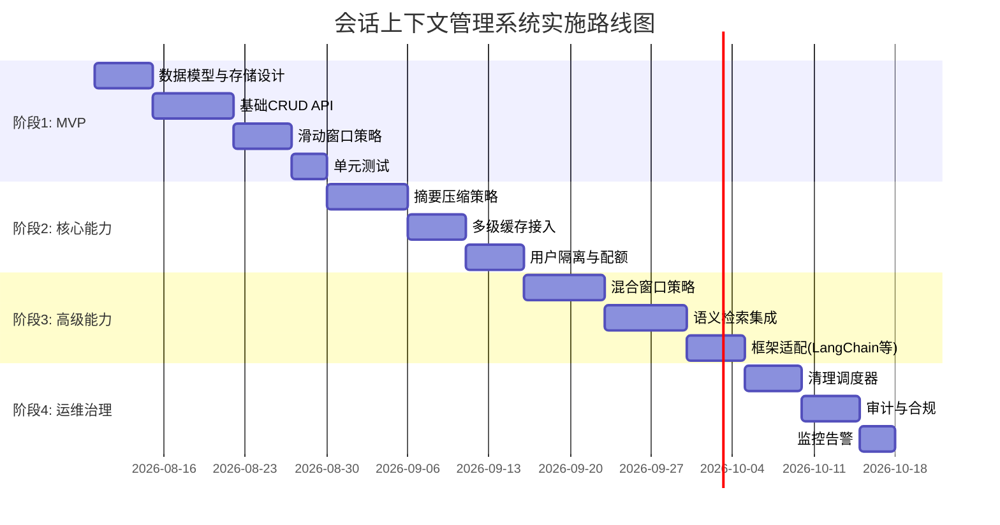

---

> **文档结语**:会话上下文管理系统是 AI 助手"记得住、答得准、不越权"的工程基石。本文从对话历史存储、上下文窗口控制、高效检索、自动清理、多用户隔离、安全防护、框架兼容七大维度,提供了端到端的工程实现方案。**核心设计哲学**是"**短上下文用滑动,长对话用摘要,知识密集用检索,生产环境用混合**"。与 [77长期记忆](./77Agent长期记忆系统完整设计方案.md)、[83用户偏好](./83用户偏好记忆系统完整设计与实现方案.md) 共同构成 Agent 记忆体系的完整技术栈。
>
> **后续演进方向**:① 探索基于 LLM 的智能窗口控制——让 LLM 自己决定保留哪些消息;② 引入用户注意力模型,预测哪些历史消息当前最相关;③ 与多模态 Agent 集成,管理图像/音频/视频等多模态会话上下文。
