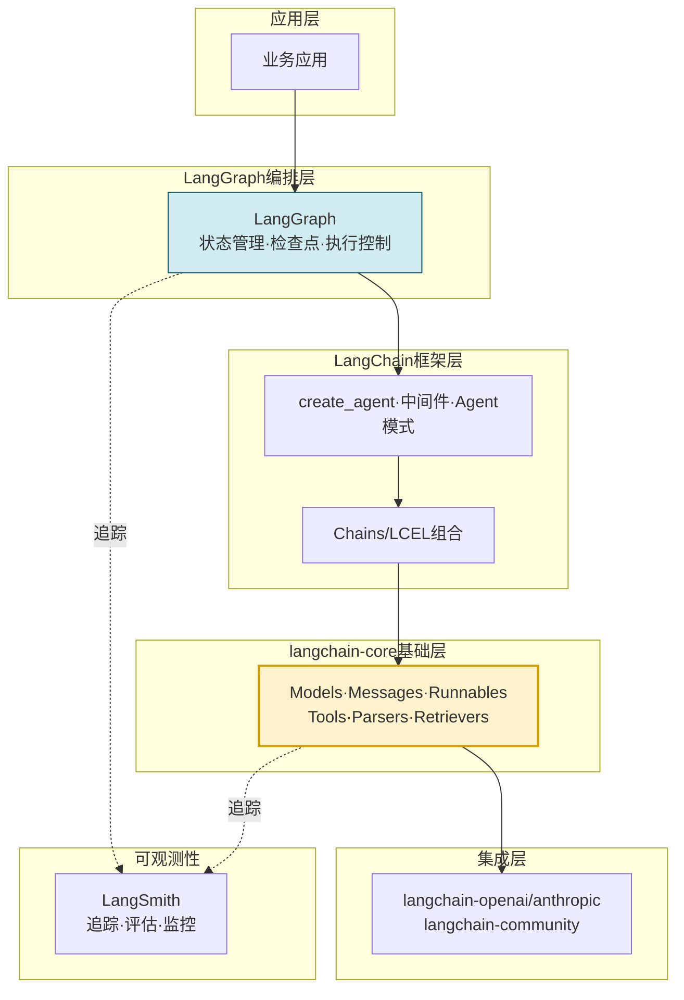
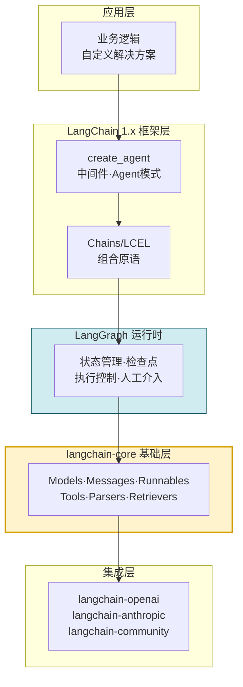
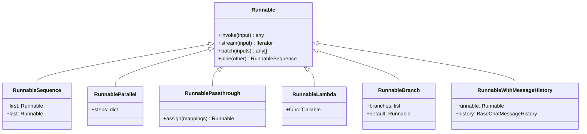
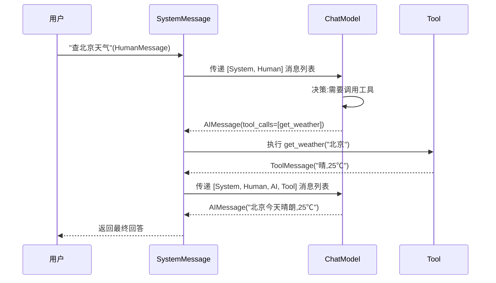
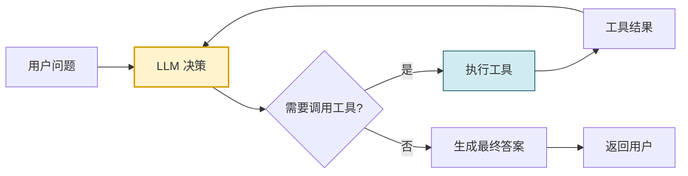
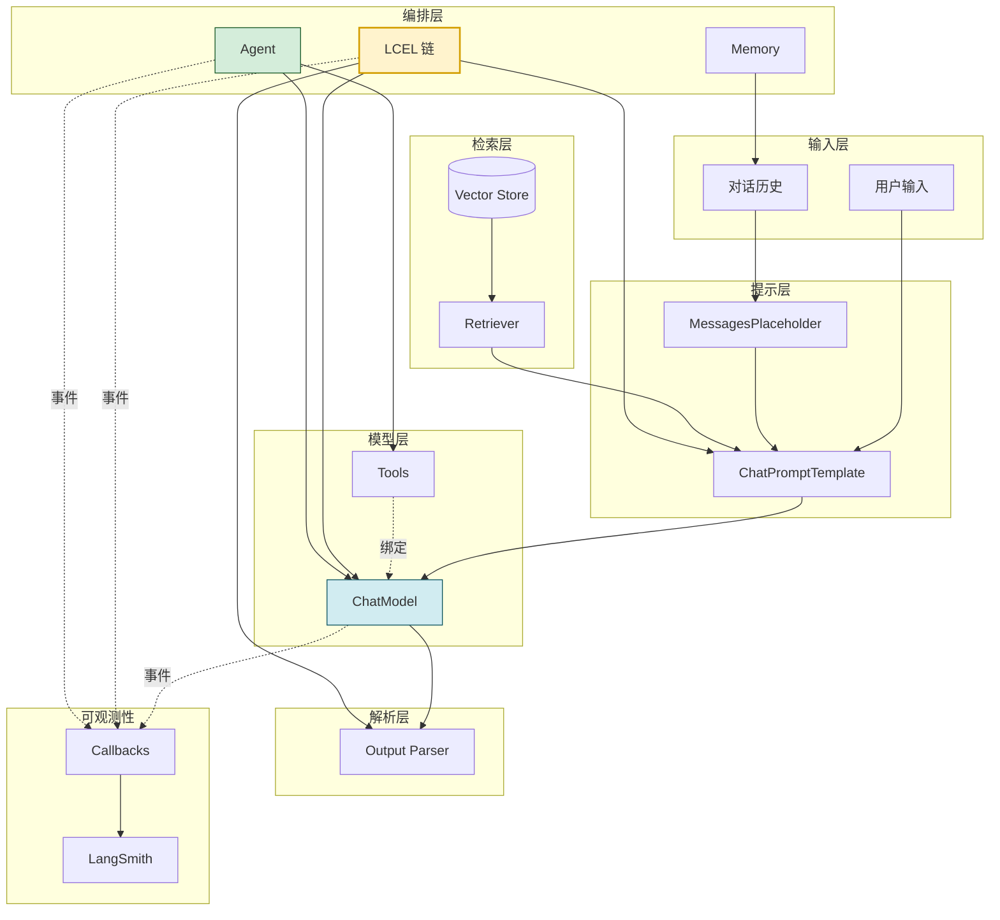

# LangChain 框架核心组件详解

> 文档定位:系统阐述 LangChain 框架的核心组件体系,涵盖各组件的定义、主要作用、使用场景、技术实现以及组件间的交互关系。内容严格遵循 LangChain 1.x 官方架构定义与最佳实践,为开发者构建 LLM 应用提供权威的组件参考与工程指导。
>
> 阅读建议:本文是 Agent Framework 系列的基础篇,建议结合 [LangGraph技术原理与应用.md](../langGraph/LangGraph技术原理与应用.md) 一并阅读。LangChain 提供底层组件抽象,LangGraph 在其之上构建有状态的多 Agent 编排能力,二者共同构成完整的 LLM 应用开发栈。

---

## 目录

- [一、LangChain 框架概述](#一langchain-框架概述)
- [二、分层架构与包结构](#二分层架构与包结构)
- [三、Runnable 接口与 LCEL](#三runnable-接口与-lcel)
- [四、Models 模型组件](#四models-模型组件)
- [五、Messages 消息组件](#五messages-消息组件)
- [六、Prompts 提示组件](#六prompts-提示组件)
- [七、Output Parsers 输出解析器](#七output-parsers-输出解析器)
- [八、Tools 工具组件](#八tools-工具组件)
- [九、Retrievers 检索器与 Vector Stores](#九retrievers-检索器与-vector-stores)
- [十、Chains 链与 LCEL 组合](#十chains-链与-lcel-组合)
- [十一、Agents 智能体](#十一agents-智能体)
- [十二、Memory 记忆组件](#十二memory-记忆组件)
- [十三、Callbacks 回调与可观测性](#十三callbacks-回调与可观测性)
- [十四、组件交互关系与典型应用](#十四组件交互关系与典型应用)
- [十五、最佳实践与版本演进](#十五最佳实践与版本演进)

---

## 一、LangChain 框架概述

### 1.1 什么是 LangChain

**LangChain** 是一个用于开发由大语言模型(LLM)驱动的应用程序的开源框架。它通过**组件化、可组合**的架构,让开发者能够高效构建端到端的 LLM 应用。其官方定义强调两大核心能力:

- **上下文感知(Contextual Awareness)**: 将语言模型连接到上下文来源——如提示指令、少量示例、外部内容(文档、数据库、API),使模型具备"知识接入"能力。
- **推理能力(Reasoning)**: 允许语言模型与其环境交互——如调用工具、执行多步推理、自主决策,使模型具备"行动"能力。

### 1.2 LangChain 生态全景

LangChain 已发展为一个完整的技术生态,由多个相互协作的项目组成:

| 项目 | 定位 | 核心职责 |
|------|------|----------|
| **LangChain** | 核心库 | 提供组件抽象与应用编排原语 |
| **langchain-core** | 基础抽象层 | 定义 Runnable、Message、Prompt、Tool 等基础接口 |
| **langchain-community** | 社区集成层 | 第三方组件集成 |
| **langchain-openai/anthropic/...** | 合作伙伴包 | 官方维护的模型 Provider 集成 |
| **LangGraph** | 状态化编排层 | 基于图结构构建有状态多 Agent 系统 |
| **LangServe** | 部署层 | 将 Chain/Agent 部署为 REST API |
| **LangSmith** | 可观测性平台 | 追踪、评估、A/B 测试与监控 |



### 1.3 核心组件总览

LangChain 的核心组件体系如下表所示,每个组件都是 `Runnable` 的实现,可通过 LCEL 管道自由组合:

| 组件 | 核心抽象 | 主要职责 | 典型场景 |
|------|----------|----------|----------|
| **Models** | `BaseLanguageModel` | 调用 LLM 生成文本/嵌入 | 文本生成、向量化 |
| **Messages** | `BaseMessage` | 标准化对话消息格式 | 多轮对话、角色管理 |
| **Prompts** | `BasePromptTemplate` | 动态构建提示词 | 模板化输入、Few-shot |
| **Output Parsers** | `BaseOutputParser` | 解析模型输出为结构化数据 | JSON/Pydantic 解析 |
| **Tools** | `BaseTool` | 封装可被 Agent 调用的函数 | 工具调用、函数执行 |
| **Retrievers** | `BaseRetriever` | 检索相关文档 | RAG、知识库问答 |
| **Vector Stores** | `VectorStore` | 存储与检索向量 | 语义检索 |
| **Chains** | `RunnableSequence` | 组合多组件为流水线 | 多步处理流程 |
| **Agents** | `AgentExecutor` | 自主决策调用工具 | 复杂任务自动化 |
| **Memory** | `BaseMemory` | 管理对话历史与状态 | 多轮对话记忆 |
| **Callbacks** | `BaseCallbackHandler` | 监听组件执行事件 | 日志、追踪、监控 |

---

## 二、分层架构与包结构

### 2.1 四层架构模型

LangChain 1.x 采用清晰的分层架构,自底向上依次为:基础抽象层 → 框架层 → 编排层 → 应用层。



### 2.2 核心包职责划分

| 包名 | 职责 | 包含内容 | 依赖关系 |
|------|------|----------|----------|
| `langchain-core` | 基础抽象 | Runnable、Message、Prompt、Tool、Output Parser、Retriever 接口 | 无第三方 Provider 依赖 |
| `langchain` | 应用编排 | Chains、Agents、Callbacks、高级模式 | 依赖 langchain-core |
| `langchain-community` | 社区集成 | 第三方 LLM、向量库、文档加载器 | 依赖 langchain-core |
| `langchain-openai` 等 | 官方 Provider | OpenAI/Anthropic/Google 等模型实现 | 依赖 langchain-core |
| `langgraph` | 状态化编排 | 图结构、State、Checkpoint、Human-in-loop | 依赖 langchain-core |
| `langserve` | API 部署 | 将 Runnable 部署为 REST 端点 | 依赖 langchain |
| `langsmith` | 可观测性 | 追踪、评估、数据集管理 | 可独立使用 |

### 2.3 包分离的设计哲学

LangChain 自 0.2 版本起实施包分离,核心动机是:

1. **依赖最小化**: 只安装所需 Provider,避免臃肿
2. **版本解耦**: `langchain-core` 接口稳定,Provider 可独立迭代
3. **生态开放**: 第三方集成不污染核心包
4. **可测试性**: 核心抽象与实现分离,便于单元测试

```python
# 现代安装方式:按需安装 Provider 包
# pip install langchain langchain-openai langchain-community
from langchain_openai import ChatOpenAI          # 官方 Provider
from langchain_community.vectorstores import Chroma  # 社区集成
from langchain_core.prompts import ChatPromptTemplate  # 核心抽象
```

---

## 三、Runnable 接口与 LCEL

### 3.1 Runnable:统一接口基石

**Runnable** 是 LangChain 的核心抽象,所有组件(Prompt、Model、Parser、Retriever、Tool)都实现 Runnable 接口。这一设计的核心价值在于:**万物皆 Runnable,一切皆可组合**。

Runnable 接口提供统一的执行方法:

| 方法 | 类型 | 说明 |
|------|------|------|
| `invoke(input)` | 同步 | 单次调用,返回完整结果 |
| `ainvoke(input)` | 异步 | 异步单次调用 |
| `stream(input)` | 同步流式 | 逐块返回结果 |
| `astream(input)` | 异步流式 | 异步逐块返回 |
| `batch(inputs)` | 同步批量 | 并发处理多个输入 |
| `abatch(inputs)` | 异步批量 | 异步并发处理 |
| `astream_log(input)` | 异步 | 流式输出并记录中间步骤 |

### 3.2 LCEL(LangChain Expression Language)

**LCEL** 是基于 Runnable 抽象的声明式 DSL,使用 `|` 管道操作符将组件组合成流水线。自 0.2 版本起,LCEL 全面取代传统 Chain 类,成为 LangChain 的核心理念。

```python
from langchain_openai import ChatOpenAI
from langchain_core.prompts import ChatPromptTemplate
from langchain_core.output_parsers import StrOutputParser

# LCEL 声明式组合:prompt | llm | parser
prompt = ChatPromptTemplate.from_messages([
    ("system", "你是一位专业的{role}。"),
    ("human", "{question}"),
])
llm = ChatOpenAI(model="gpt-4o-mini", temperature=0)
parser = StrOutputParser()

chain = prompt | llm | parser

# 统一的调用接口
result = chain.invoke({"role": "Python工程师", "question": "如何实现单例模式?"})
```

### 3.3 LCEL 的核心优势

| 优势 | 说明 | 示例 |
|------|------|------|
| **流式原生支持** | 所有 LCEL 链自动支持 token 级流式输出 | `chain.stream(input)` |
| **异步原生支持** | 同步/异步接口自动成对提供 | `chain.ainvoke(input)` |
| **批量并行** | 自动并发处理批量输入 | `chain.batch([input1, input2])` |
| **回退机制** | 单组件失败自动切换备用 | `llm.with_fallbacks([backup_llm])` |
| **可观测性** | 自动接入 LangSmith 追踪 | 无需额外代码 |
| **配置化** | 运行时动态配置 | `config={"tags": ["prod"]}` |

### 3.4 核心 Runnable 组合原语



| 原语 | 作用 | 典型用法 |
|------|------|----------|
| `RunnableSequence` | 顺序执行(`\|` 产生) | `prompt \| llm \| parser` |
| `RunnableParallel` | 并发执行多个分支 | `{"context": retriever, "question": passthrough}` |
| `RunnablePassthrough` | 原样传递输入 | 在 Parallel 中保留原始 query |
| `RunnableLambda` | 包装任意 Python 函数 | `RunnableLambda(lambda x: x.upper())` |
| `RunnableBranch` | 条件路由 | `[(cond1, r1), (cond2, r2)], default` |
| `RunnableWithFallbacks` | 失败回退 | `llm.with_fallbacks([backup])` |
| `RunnableWithMessageHistory` | 自动注入历史 | 包装链以管理对话记忆 |

---

## 四、Models 模型组件

### 4.1 模型组件的定义与分类

**Models** 是 LangChain 与 LLM 交互的抽象层,屏蔽不同 Provider 的 API 差异,提供统一的调用接口。LangChain 将模型分为三类:

| 模型类型 | 基类 | 输入 | 输出 | 典型场景 |
|----------|------|------|------|----------|
| **LLM** | `BaseLLM` | 字符串 | 字符串 | 文本补全(传统接口) |
| **ChatModel** | `BaseChatModel` | Message 列表 | AIMessage | 对话场景(主流) |
| **Embeddings** | `Embeddings` | 文本 | 浮点向量 | 语义检索、向量化 |

### 4.2 ChatModel:主流模型接口

**ChatModel** 是当前推荐的模型接口,基于消息列表进行交互,支持 System/Human/AI/Tool 多角色消息。

```python
from langchain_openai import ChatOpenAI
from langchain_core.messages import SystemMessage, HumanMessage

# 初始化 ChatModel
llm = ChatOpenAI(
    model="gpt-4o-mini",
    temperature=0.7,
    max_tokens=1000,
    timeout=30,
    max_retries=2,  # 内置重试机制
)

# 基础调用:接受 Message 列表
response = llm.invoke([
    SystemMessage(content="你是一位资深 Python 开发者。"),
    HumanMessage(content="解释装饰器的原理。"),
])
print(response.content)  # AIMessage 的 content 属性

# LCEL 中作为 Runnable 使用
chain = prompt | llm | StrOutputParser()
```

### 4.3 ChatModel 的核心能力

| 能力 | 方法 | 说明 |
|------|------|------|
| **工具绑定** | `llm.bind_tools(tools)` | 绑定工具供模型调用 |
| **结构化输出** | `llm.with_structured_output(Schema)` | 强制输出符合 Schema 的对象 |
| **参数绑定** | `llm.bind(stop=["\n"], temperature=0)` | 绑定调用参数 |
| **回退** | `llm.with_fallbacks([backup])` | 失败时切换备用模型 |
| **速率限制** | `llm.bind(rate_limiter=...)` | 控制调用频率 |
| **缓存** | `llm.cache = True` | 启用结果缓存 |
| **多模态** | 传入图像/音频内容 | 支持视觉、音频输入 |

### 4.4 结构化输出(Structured Outputs)

**结构化输出** 是 ChatModel 的重要能力,确保模型输出符合预定义的 Schema。LangChain 推荐使用 `with_structured_output` 而非传统的 OutputParser:

```python
from pydantic import BaseModel, Field
from langchain_openai import ChatOpenAI

# 定义输出 Schema
class MovieReview(BaseModel):
    title: str = Field(description="电影名称")
    rating: int = Field(ge=1, le=10, description="评分1-10")
    summary: str = Field(description="一句话影评")
    keywords: list[str] = Field(description="关键词列表")

# 使用原生工具调用/JSON 模式实现结构化输出
llm = ChatOpenAI(model="gpt-4o-mini")
structured_llm = llm.with_structured_output(MovieReview)

review = structured_llm.invoke("评价电影《盗梦空间》")
print(review.title)    # "盗梦空间"
print(review.rating)   # 9
print(type(review))    # <class 'MovieReview'>
```

### 4.5 Embeddings 模型

**Embeddings** 用于将文本映射为高维向量,是语义检索的基础:

```python
from langchain_openai import OpenAIEmbeddings

embeddings = OpenAIEmbeddings(model="text-embedding-3-small")

# 单文本嵌入
vector = embeddings.embed_query("机器学习是AI的分支")

# 批量嵌入
texts = ["文本一", "文本二", "文本三"]
vectors = embeddings.embed_documents(texts)  # 返回 list[list[float]]
```

### 4.6 使用场景

| 场景 | 推荐模型类型 | 说明 |
|------|-------------|------|
| 对话/问答 | ChatModel | 多角色消息,主流选择 |
| 文本补全 | LLM(兼容遗留) | 单字符串输入输出 |
| 语义检索 | Embeddings | 向量化后入库检索 |
| 工具调用 | ChatModel + bind_tools | 原生 function calling |
| 结构化数据提取 | ChatModel + with_structured_output | 保证输出格式 |

---

## 五、Messages 消息组件

### 5.1 Messages 的定义

**Messages** 是 LangChain 中对话通信的基本单元,每条消息包含**角色(role)**和**内容(content)**。Messages 标准化了人机对话、多轮交互、工具调用的消息格式,是 ChatModel 的输入输出载体。

### 5.2 消息类型详解

| 消息类型 | 类 | 角色 | 用途 |
|----------|-----|------|------|
| **系统消息** | `SystemMessage` | system | 设定模型行为、角色、约束 |
| **用户消息** | `HumanMessage` | user | 用户输入 |
| **AI 消息** | `AIMessage` | assistant | 模型回复(可含 tool_calls) |
| **工具消息** | `ToolMessage` | tool | 工具执行结果返回给模型 |
| **移除消息** | `RemoveMessage` | - | 删除历史中的指定消息(管理上下文) |
| **函数消息** | `FunctionMessage` | tool(遗留) | 已被 ToolMessage 取代 |

```python
from langchain_core.messages import (
    SystemMessage, HumanMessage, AIMessage, ToolMessage
)

messages = [
    SystemMessage(content="你是一位天气助手,可调用 get_weather 工具。"),
    HumanMessage(content="北京今天天气如何?"),
    # 模型决定调用工具
    AIMessage(content="", tool_calls=[{
        "name": "get_weather",
        "args": {"city": "北京"},
        "id": "call_001",
    }]),
    # 工具执行结果
    ToolMessage(content="北京今天晴,25℃", tool_call_id="call_001"),
    # 模型基于工具结果生成最终回复
    AIMessage(content="北京今天天气晴朗,气温25℃,适合外出活动。"),
]
```

### 5.3 AIMessage 的核心属性

```python
@dataclass
class AIMessage:
    content: str                       # 文本内容
    tool_calls: list[ToolCall] = []    # 工具调用请求
    invalid_tool_calls: list = []      # 格式错误的工具调用
    usage_metadata: dict = None        # token 使用统计
    response_metadata: dict = None     # 模型响应元数据(如 finish_reason)
    id: str = None                     # 消息唯一ID
```

### 5.4 消息在多轮对话中的作用



### 5.5 使用场景

- **多轮对话管理**: 通过消息列表维护对话上下文
- **工具调用闭环**: AIMessage 的 tool_calls 与 ToolMessage 配对完成工具调用
- **Few-shot 示例**: 将示例对话作为消息注入
- **上下文窗口管理**: 使用 RemoveMessage 或摘要压缩历史

---

## 六、Prompts 提示组件

### 6.1 Prompts 的定义与作用

**Prompts** 组件负责**动态构建**发送给模型的输入文本。它将静态模板与动态变量结合,生成结构化的提示词,是 Prompt Engineering 在代码层面的工程化实现。

### 6.2 核心组件体系

| 组件 | 类 | 用途 |
|------|-----|------|
| **字符串模板** | `PromptTemplate` | 构建纯字符串提示(用于 LLM) |
| **聊天模板** | `ChatPromptTemplate` | 构建消息列表(用于 ChatModel) |
| **消息占位符** | `MessagesPlaceholder` | 动态插入消息列表(如历史对话) |
| **Few-shot 模板** | `FewShotPromptTemplate` | 注入少量示例 |
| **部分应用** | `.partial()` | 预填充部分变量 |

### 6.3 ChatPromptTemplate 详解

**ChatPromptTemplate** 是 ChatModel 场景下的核心模板,支持从角色-内容元组构建:

```python
from langchain_core.prompts import ChatPromptTemplate, MessagesPlaceholder

# 方式一:从消息元组列表构建
prompt = ChatPromptTemplate.from_messages([
    ("system", "你是一位专业的{role},回答需简洁准确。"),
    # MessagesPlaceholder:动态插入历史对话
    MessagesPlaceholder(variable_name="history"),
    ("human", "{question}"),
])

# 方式二:从模板字符串构建
prompt = ChatPromptTemplate.from_template(
    "请以{style}的风格翻译:{text}"
)

# 调用:填充变量生成消息列表
messages = prompt.invoke({
    "role": "Python工程师",
    "history": [HumanMessage(content="什么是闭包?"),
                AIMessage(content="闭包是...")],
    "question": "装饰器呢?",
})
# messages 是 ChatPromptValue,可直接传给 ChatModel
```

### 6.4 MessagesPlaceholder:动态消息注入

**MessagesPlaceholder** 用于在模板中预留消息列表的位置,典型用途是注入对话历史:

```python
from langchain_core.prompts import MessagesPlaceholder

# 在 RAG 或多轮对话中,动态注入历史
prompt = ChatPromptTemplate.from_messages([
    ("system", "你是一位有帮助的助手。"),
    MessagesPlaceholder(variable_name="chat_history"),
    ("human", "{input}"),
])

# 历史可为空(首轮对话)
messages = prompt.invoke({
    "chat_history": [],  # 或 [HumanMessage(...), AIMessage(...)]
    "input": "你好",
})
```

### 6.5 PromptTemplate 的部分应用

**部分应用(Partial)** 允许预填充部分变量,返回新的模板,便于分阶段构建:

```python
# 场景:某些变量在初始化时已知,其他变量运行时才确定
prompt = PromptTemplate.from_template("{country}的首都是{city}吗?")

# 预填充 country
partial = prompt.partial(country="法国")
# 运行时填充 city
result = partial.invoke({"city": "巴黎"})
```

### 6.6 使用场景

| 场景 | 推荐组件 | 说明 |
|------|----------|------|
| 单轮问答 | ChatPromptTemplate | 简单的 system+human 模板 |
| 多轮对话 | ChatPromptTemplate + MessagesPlaceholder | 动态注入历史 |
| RAG 检索增强 | ChatPromptTemplate + 上下文占位 | 注入检索到的文档 |
| Few-shot 学习 | FewShotPromptTemplate | 注入示例引导输出格式 |
| 动态角色切换 | .partial() 预填充 role | 运行时切换角色身份 |

---

## 七、Output Parsers 输出解析器

### 7.1 Output Parsers 的定义

**Output Parsers** 负责将模型的原始输出(字符串或 AIMessage)**解析为结构化、类型化的数据**。它是连接非结构化文本与结构化程序的桥梁。

### 7.2 核心解析器对比

| 解析器 | 输出类型 | 说明 | 推荐度 |
|--------|----------|------|--------|
| `StrOutputParser` | `str` | 提取 AIMessage 的 content 为字符串 | ⭐⭐⭐⭐⭐ 最常用 |
| `JsonOutputParser` | `dict` | 解析 JSON 字符串 | ⭐⭐⭐⭐ |
| `PydanticOutputParser` | `Pydantic Model` | 校验并转为 Pydantic 对象 | ⭐⭐⭐⭐ |
| `CommaSeparatedListOutputParser` | `list[str]` | 解析逗号分隔列表 | ⭐⭐⭐ |
| `DatetimeOutputParser` | `datetime` | 解析日期时间 | ⭐⭐⭐ |
| `with_structured_output()` | Schema 对象 | **原生工具调用/JSON 模式** | ⭐⭐⭐⭐⭐ 官方推荐 |

### 7.3 解析器使用示例

```python
from langchain_core.output_parsers import (
    StrOutputParser, JsonOutputParser, PydanticOutputParser
)
from pydantic import BaseModel, Field

# 1. 字符串解析器(最常用)
str_parser = StrOutputParser()
chain = prompt | llm | str_parser
# 输出: "装饰器是用于扩展函数功能的语法..."

# 2. JSON 解析器
json_parser = JsonOutputParser()
chain = prompt | llm | json_parser
# 输出: {"name": "装饰器", "category": "Python特性"}

# 3. Pydantic 解析器(带校验)
class TechConcept(BaseModel):
    name: str = Field(description="概念名称")
    category: str = Field(description="所属类别")
    difficulty: int = Field(ge=1, le=5, description="难度1-5")

pydantic_parser = PydanticOutputParser(pydantic_object=TechConcept)
# 将解析指令注入 prompt
prompt = ChatPromptTemplate.from_messages([
    ("human", "解释{concept}。\n{format_instructions}"),
]).partial(format_instructions=pydantic_parser.get_format_instructions())

chain = prompt | llm | pydantic_parser
result = chain.invoke({"concept": "闭包"})
# 输出: TechConcept(name="闭包", category="编程概念", difficulty=3)
```

### 7.4 with_structured_output:官方推荐方案

LangChain 官方推荐使用 `with_structured_output` 替代传统 OutputParser,它利用模型原生的工具调用或 JSON 模式,可靠性更高:

```python
from pydantic import BaseModel, Field

class Joke(BaseModel):
    setup: str = Field(description="笑话的开头")
    punchline: str = Field(description="笑点")

# 方式一:基于工具调用(默认)
structured_llm = llm.with_structured_output(Joke)

# 方式二:基于 JSON 模式
structured_llm = llm.with_structured_output(Joke, method="json_mode")

joke = structured_llm.invoke("讲个程序员的笑话")
print(joke.setup)  # "为什么程序员喜欢黑暗?"
```

### 7.5 使用场景

- **纯文本回复**: `StrOutputParser` 最常用
- **结构化数据提取**: `with_structured_output`(推荐)或 `PydanticOutputParser`
- **列表/枚举输出**: `CommaSeparatedListOutputParser`
- **格式校验**: Pydantic 校验保证数据合法性

---

## 八、Tools 工具组件

### 8.1 Tools 的定义

**Tools** 是 LangChain 中封装**可被 Agent 调用函数**的组件。每个 Tool 包含名称、描述、参数 Schema 和执行函数,模型依据描述决定何时、如何调用工具。Tools 是 Agent 实现行动能力的核心载体。

### 8.2 Tool 的核心属性

| 属性 | 说明 | 示例 |
|------|------|------|
| `name` | 工具唯一标识 | `get_weather` |
| `description` | 自然语言描述(供模型决策) | "获取指定城市的实时天气" |
| `args_schema` | 参数的 JSON Schema / Pydantic 模型 | `{city: str, date?: str}` |
| `_run()` | 同步执行逻辑 | 调用天气 API |
| `_arun()` | 异步执行逻辑(可选) | 异步 API 调用 |
| `return_direct` | 是否直接返回结果(不经过 LLM) | `False` |

### 8.3 创建 Tool 的方式

#### 方式一:@tool 装饰器(推荐)

```python
from langchain_core.tools import tool

@tool
def get_weather(city: str, date: str = "today") -> str:
    """获取指定城市在指定日期的天气信息。
    
    Args:
        city: 城市名称,如"北京"、"上海"
        date: 日期,格式为 YYYY-MM-DD,默认为今天
    
    Returns:
        天气描述字符串
    """
    # 实际实现:调用天气 API
    return f"{city} {date} 天气晴,25℃"

# 工具元数据自动从函数签名和 docstring 推断
print(get_weather.name)         # "get_weather"
print(get_weather.description)  # docstring 内容
print(get_weather.args)         # {"city": {"type": "string"}, "date": {"type": "string"}}
```

#### 方式二:StructuredTool 显式 Schema

```python
from langchain_core.tools import StructuredTool
from pydantic import BaseModel, Field

class WeatherInput(BaseModel):
    city: str = Field(description="城市名称")
    date: str = Field(default="today", description="查询日期")

def _get_weather(city: str, date: str = "today") -> str:
    return f"{city} {date} 晴,25℃"

get_weather = StructuredTool.from_function(
    func=_get_weather,
    name="get_weather",
    description="获取城市天气",
    args_schema=WeatherInput,
)
```

#### 方式三:BaseTool 子类

```python
from langchain_core.tools import BaseTool
from typing import Type

class WeatherTool(BaseTool):
    name: str = "get_weather"
    description: str = "获取城市天气"
    args_schema: Type[BaseModel] = WeatherInput

    def _run(self, city: str, date: str = "today") -> str:
        return f"{city} {date} 晴,25℃"

    async def _arun(self, city: str, date: str = "today") -> str:
        # 异步实现
        return f"{city} {date} 晴,25℃"
```

### 8.4 Toolkits 工具集

**Toolkits** 是相关工具的集合,提供特定领域的完整工具组:

```python
from langchain_community.agent_toolkits import SQLDatabaseToolkit

toolkit = SQLDatabaseToolkit(db=db, llm=llm)
tools = toolkit.get_tools()
# 返回: [QuerySQLDatabaseTool, InfoSQLDatabaseTool, ListSQLDatabaseTool, ...]
```

### 8.5 工具绑定与执行

```python
# 1. 绑定工具到模型
llm_with_tools = llm.bind_tools([get_weather, calculator])

# 2. 模型决策调用工具
ai_msg = llm_with_tools.invoke("北京今天天气?")
print(ai_msg.tool_calls)
# [{"name": "get_weather", "args": {"city": "北京"}, "id": "call_001"}]

# 3. 执行工具
for tool_call in ai_msg.tool_calls:
    tool = {"get_weather": get_weather}[tool_call["name"]]
    result = tool.invoke(tool_call["args"])
    # 将结果作为 ToolMessage 返回给模型
```

### 8.6 使用场景

- **Agent 工具调用**: 赋予 Agent 行动能力
- **Function Calling**: 结构化的函数调用
- **领域工具集**: SQL、搜索、文件操作等
- **自定义业务工具**: 封装企业内部 API

---

## 九、Retrievers 检索器与 Vector Stores

### 9.1 Retrievers 的定义

**Retriever(检索器)** 是 LangChain 中"给定查询返回相关文档"的统一接口。它比向量库更通用——检索器无需存储文档,只需返回文档,因此可基于向量库、关键词索引、知识图谱等多种后端实现。

Retriever 实现 Runnable 接口,接受字符串查询,返回 `list[Document]`:

```python
class BaseRetriever(Runnable):
    def invoke(self, input: str) -> list[Document]: ...
    async def ainvoke(self, input: str) -> list[Document]: ...
```

### 9.2 Vector Stores 向量存储

**Vector Store** 是存储向量与文档的数据库,提供相似度检索能力:

| 主流向量库 | 类型 | 特点 |
|-----------|------|------|
| **Chroma** | 嵌入式 | 轻量级,开发首选 |
| **FAISS** | 内存库 | 高性能,无持久化 |
| **Pinecone** | 云服务 | 托管,免运维 |
| **Weaviate** | 开源 | 混合检索,GraphQL |
| **Milvus** | 开源 | 企业级,高可用 |
| **pgvector** | PostgreSQL 扩展 | 与关系库集成 |

```python
from langchain_community.vectorstores import Chroma
from langchain_openai import OpenAIEmbeddings

# 构建向量库
embeddings = OpenAIEmbeddings()
vectorstore = Chroma.from_documents(
    documents=chunks,
    embedding=embeddings,
    collection_name="knowledge_base",
)

# 转换为检索器
retriever = vectorstore.as_retriever(
    search_type="similarity",  # similarity / mmr / similarity_score_threshold
    search_kwargs={"k": 4},    # 返回 top-4
)

# 检索
docs = retriever.invoke("什么是机器学习?")
```

### 9.3 高级检索器

| 检索器 | 说明 | 适用场景 |
|--------|------|----------|
| `VectorStoreRetriever` | 基础向量检索 | 标准语义检索 |
| `MultiQueryRetriever` | LLM 生成多查询并行检索 | 提升召回率 |
| `MultiVectorRetriever` | 多向量(摘要/子问题)检索 | 文档多维度索引 |
| `ParentDocumentRetriever` | 检索子块返回父块 | 细粒度检索+完整上下文 |
| `SelfQueryRetriever` | LLM 解析元数据过滤 | 结构化过滤 |
| `EnsembleRetriever` | 融合多检索器(如 BM25+向量) | 混合检索 |
| `ContextualCompressionRetriever` | 检索后压缩 | 上下文精简 |

### 9.4 Document Loaders 与 Text Splitters

检索链路还涉及文档加载与切分组件:

```python
from langchain_community.document_loaders import PyPDFLoader, TextLoader
from langchain_text_splitters import RecursiveCharacterTextSplitter

# 加载
loader = PyPDFLoader("document.pdf")
docs = loader.load()  # 每页一个 Document

# 切分
splitter = RecursiveCharacterTextSplitter(
    chunk_size=1000,
    chunk_overlap=200,
    separators=["\n\n", "\n", "。", " "],
)
chunks = splitter.split_documents(docs)
```

### 9.5 使用场景

- **RAG 问答**: 检索相关文档作为上下文
- **知识库检索**: 企业内部知识查询
- **混合检索**: 向量+关键词融合
- **多文档索引**: 不同维度索引同一文档

---

## 十、Chains 链与 LCEL 组合

### 10.1 Chains 的定义

**Chain(链)** 是将多个组件按顺序组合而成的流水线。在 LCEL 时代,Chain 不再是独立的类,而是通过 `|` 操作符组合 Runnable 产生的 `RunnableSequence`。这一设计让任何 Runnable 都能成为链的一环。

### 10.2 LCEL 链的核心模式

#### 模式一:基础链(Prompt → LLM → Parser)

```python
chain = prompt | llm | StrOutputParser()
```

#### 模式二:并行分发(RunnableParallel)

```python
from langchain_core.runnables import RunnableParallel, RunnablePassthrough

# 同时检索上下文并保留原始问题
chain = RunnableParallel({
    "context": retriever,
    "question": RunnablePassthrough(),
}) | prompt | llm | StrOutputParser()

# 等价简写
chain = (
    {"context": retriever, "question": RunnablePassthrough()}
    | prompt | llm | StrOutputParser()
)
```

#### 模式三:条件分支(RunnableBranch)

```python
from langchain_core.runnables import RunnableBranch

branch = RunnableBranch(
    (lambda x: "天气" in x["question"], weather_chain),
    (lambda x: "新闻" in x["question"], news_chain),
    default_chain,  # 默认分支
)
```

#### 模式四:回退机制(with_fallbacks)

```python
# 主模型失败时自动切换备用模型
reliable_llm = primary_llm.with_fallbacks([backup_llm1, backup_llm2])
chain = prompt | reliable_llm | StrOutputParser()
```

#### 模式五:消息历史(RunnableWithMessageHistory)

```python
from langchain_core.runnables.history import RunnableWithMessageHistory
from langchain_community.chat_message_histories import ChatMessageHistory

chain_with_history = RunnableWithMessageHistory(
    chain,
    lambda session_id: ChatMessageHistory(),
    input_messages_key="input",
    history_messages_key="history",
)

# 调用时指定 session_id
chain_with_history.invoke(
    {"input": "你好"},
    config={"configurable": {"session_id": "user_001"}},
)
```

### 10.3 经典 RAG 链示例

```python
from langchain_core.prompts import ChatPromptTemplate
from langchain_core.runnables import RunnablePassthrough
from langchain_core.output_parsers import StrOutputParser
from langchain_openai import ChatOpenAI

# RAG 链:检索 → 组装上下文 → 生成
rag_prompt = ChatPromptTemplate.from_template("""
基于以下上下文回答问题。如上下文不足,请说明。

上下文:
{context}

问题: {question}
""")

llm = ChatOpenAI(model="gpt-4o-mini")

def format_docs(docs):
    return "\n\n".join(d.page_content for d in docs)

rag_chain = (
    {
        "context": retriever | format_docs,
        "question": RunnablePassthrough(),
    }
    | rag_prompt
    | llm
    | StrOutputParser()
)

answer = rag_chain.invoke("什么是 RAG?")
```

### 10.4 使用场景

| 场景 | 链模式 | 说明 |
|------|--------|------|
| 单轮问答 | `prompt \| llm \| parser` | 基础链 |
| RAG 检索增强 | `Parallel + prompt + llm` | 检索+生成 |
| 多轮对话 | `RunnableWithMessageHistory` | 注入历史 |
| 路由分发 | `RunnableBranch` | 按意图路由 |
| 容错增强 | `with_fallbacks` | 主备切换 |

---

## 十一、Agents 智能体

### 11.1 Agents 的定义

**Agent(智能体)** 是能够**自主决策调用工具、执行多步推理**的 LLM 系统。与固定流程的 Chain 不同,Agent 由 LLM 动态决定下一步动作(调用哪个工具、何时停止),实现复杂任务的自动化执行。

### 11.2 Agent 的核心循环



### 11.3 Agent 实现方式

LangChain 提供两种主要的 Agent 实现路径:

| 方式 | API | 说明 | 推荐度 |
|------|-----|------|--------|
| **传统 AgentExecutor** | `create_tool_calling_agent` + `AgentExecutor` | 经典 Agent 循环 | ⭐⭐⭐ 兼容遗留 |
| **LangGraph Agent** | `create_react_agent` | 基于 LangGraph 的现代实现 | ⭐⭐⭐⭐⭐ 官方推荐 |

#### 方式一:传统 AgentExecutor

```python
from langchain.agents import create_tool_calling_agent, AgentExecutor

prompt = ChatPromptTemplate.from_messages([
    ("system", "你是一位有帮助的助手。"),
    MessagesPlaceholder("chat_history", optional=True),
    ("human", "{input}"),
    MessagesPlaceholder("agent_scratchpad"),  # 必须包含:存放中间步骤
])

agent = create_tool_calling_agent(llm, tools, prompt)
agent_executor = AgentExecutor(agent=agent, tools=tools, verbose=True)

result = agent_executor.invoke({"input": "北京天气如何?"})
```

#### 方式二:LangGraph create_react_agent(推荐)

```python
from langgraph.prebuilt import create_react_agent

# 现代方式:一行创建 Agent
agent = create_react_agent(llm, tools)

# 自动支持流式、消息历史、状态管理
result = agent.invoke({"messages": [HumanMessage(content="北京天气如何?")]})

# 流式输出
for chunk in agent.stream({"messages": [HumanMessage(content="解释 RAG")]}):
    print(chunk)
```

### 11.4 Agent vs Chain 的区别

| 维度 | Chain | Agent |
|------|-------|-------|
| **控制流** | 预定义、固定 | LLM 动态决策 |
| **工具调用** | 显式编排 | 模型自主选择 |
| **执行步骤** | 固定 | 不确定(直到完成) |
| **适用场景** | 流程明确的任务 | 开放式、多步任务 |
| **成本可控性** | 高(步骤已知) | 低(步骤不确定) |
| **可解释性** | 高 | 中(依赖追踪) |

### 11.5 使用场景

- **工具调用型任务**: 查询天气、计算、搜索
- **多步推理任务**: 研究分析、报告生成
- **自主决策任务**: 复杂工作流自动化
- **交互式任务**: 与用户多轮对话并调用工具

---

## 十二、Memory 记忆组件

### 12.1 Memory 的定义

**Memory** 负责在多轮对话中**存储和管理上下文信息**,使无状态的 LLM API 表现出"记忆"能力。LangChain 1.x 中,记忆管理已迁移至 LangGraph 的 State 与 Checkpoint 机制,传统 Memory 类主要用于兼容遗留代码。

### 12.2 记忆类型

| 记忆类型 | 说明 | 适用场景 |
|----------|------|----------|
| **短期记忆** | 当前对话的消息历史 | 多轮对话上下文 |
| **长期记忆** | 跨会话的持久化记忆 | 用户偏好、知识积累 |
| **摘要记忆** | 将历史压缩为摘要 | 长对话节省 token |
| **向量记忆** | 将历史向量化检索 | 大规模历史检索 |
| **键值记忆** | 结构化存储关键信息 | 实体属性、事实存储 |

### 12.3 现代记忆实现:LangGraph State

```python
from langgraph.checkpoint.memory import MemorySaver
from langgraph.graph import StateGraph, MessagesState

# LangGraph 通过 Checkpoint 实现记忆
graph = graph_builder.compile(checkpointer=MemorySaver())

# 同一线程自动维护对话历史
config = {"configurable": {"thread_id": "user_001"}}
graph.invoke({"messages": [HumanMessage("我叫张三")]}, config)
graph.invoke({"messages": [HumanMessage("我叫什么?")]}, config)
# 输出: "你叫张三" —— 自动记住历史
```

### 12.4 传统 Memory 类(兼容)

```python
from langchain_community.chat_message_histories import ChatMessageHistory
from langchain_core.runnables.history import RunnableWithMessageHistory

# 传统方式:手动管理消息历史
history = ChatMessageHistory()
history.add_user_message("你好")
history.add_ai_message("你好!有什么可以帮您?")

# 通过 RunnableWithMessageHistory 自动注入
chain_with_history = RunnableWithMessageHistory(
    chain,
    lambda session_id: ChatMessageHistory(),
    input_messages_key="input",
    history_messages_key="history",
)
```

### 12.5 上下文窗口管理策略

| 策略 | 说明 | 适用场景 |
|------|------|----------|
| **全量保留** | 保留所有消息 | 短对话 |
| **窗口截断** | 保留最近 N 轮 | 中等对话 |
| **摘要压缩** | LLM 摘要历史 | 长对话 |
| **选择性移除** | RemoveMessage 移除无关 | 精细控制 |
| **向量检索** | 按相关性检索历史 | 超长历史 |

### 12.6 使用场景

- **多轮对话**: 维持对话连贯性
- **用户画像**: 记住用户偏好
- **任务上下文**: 跨步骤共享状态
- **长文档处理**: 分块摘要与累积

---

## 十三、Callbacks 回调与可观测性

### 13.1 Callbacks 的定义

**Callbacks(回调)** 是 LangChain 的**事件监听机制**,允许在组件执行的关键节点(启动、结束、错误、新 token)插入自定义逻辑。它是实现日志、追踪、监控、调试的基础设施。

### 13.2 核心事件

| 事件 | 触发时机 |
|------|----------|
| `on_llm_start` | LLM 调用开始 |
| `on_llm_new_token` | LLM 生成新 token(流式) |
| `on_llm_end` | LLM 调用结束 |
| `on_llm_error` | LLM 调用出错 |
| `on_chain_start/end` | Chain 开始/结束 |
| `on_tool_start/end` | Tool 开始/结束 |
| `on_text` | 文本处理 |
| `on_retriever_start/end` | 检索器开始/结束 |

### 13.3 自定义回调处理器

```python
from langchain_core.callbacks import BaseCallbackHandler

class LoggingHandler(BaseCallbackHandler):
    def on_llm_start(self, serialized, prompts, **kwargs):
        print(f"[LLM 启动] 模型: {serialized.get('name')}")

    def on_llm_end(self, response, **kwargs):
        tokens = response.llm_output.get("token_usage", {})
        print(f"[LLM 结束] token: {tokens}")

    def on_tool_start(self, serialized, input_str, **kwargs):
        print(f"[工具启动] {serialized['name']}: {input_str}")

    def on_tool_end(self, output, **kwargs):
        print(f"[工具结束] 输出: {output}")

# 使用回调
chain.invoke(input, config={"callbacks": [LoggingHandler()]})
```

### 13.4 LangSmith 集成

LangSmith 是 LangChain 官方的可观测性平台,通过环境变量自动接入,无需修改代码:

```bash
export LANGCHAIN_TRACING_V2=true
export LANGCHAIN_API_KEY=ls_xxx
export LANGCHAIN_PROJECT=my-project
```

```python
# 设置环境变量后,所有调用自动追踪
chain.invoke("什么是 RAG?")
# 在 LangSmith 平台查看完整调用链、token 消耗、延迟
```

### 13.5 使用场景

- **日志记录**: 记录组件执行过程
- **性能监控**: 追踪延迟、token 消耗
- **调试排错**: 定位失败环节
- **A/B 测试**: 对比不同配置效果
- **合规审计**: 记录敏感操作

---

## 十四、组件交互关系与典型应用

### 14.1 组件交互全景图



### 14.2 典型应用一:RAG 问答系统

```python
from langchain_openai import ChatOpenAI, OpenAIEmbeddings
from langchain_community.vectorstores import Chroma
from langchain_core.prompts import ChatPromptTemplate
from langchain_core.runnables import RunnablePassthrough
from langchain_core.output_parsers import StrOutputParser

# 组件实例化
embeddings = OpenAIEmbeddings()
vectorstore = Chroma.from_documents(docs, embeddings)
retriever = vectorstore.as_retriever(search_kwargs={"k": 4})
llm = ChatOpenAI(model="gpt-4o-mini", temperature=0)

prompt = ChatPromptTemplate.from_template("""
基于以下上下文回答问题:
上下文: {context}
问题: {question}
""")

# LCEL 组合 RAG 链
rag_chain = (
    {"context": retriever | (lambda docs: "\n".join(d.page_content for d in docs)),
     "question": RunnablePassthrough()}
    | prompt | llm | StrOutputParser()
)

answer = rag_chain.invoke("什么是向量数据库?")
```

**组件协作流程**: Retriever 检索 → RunnablePassthrough 保留问题 → Prompt 组装 → ChatModel 生成 → Parser 解析。

### 14.3 典型应用二:工具调用 Agent

```python
from langchain_openai import ChatOpenAI
from langchain_core.tools import tool
from langchain_core.messages import HumanMessage
from langgraph.prebuilt import create_react_agent

@tool
def search_web(query: str) -> str:
    """搜索网络获取最新信息。"""
    return f"搜索结果: {query} 的相关信息..."

@tool
def calculate(expression: str) -> str:
    """计算数学表达式。"""
    try:
        return str(eval(expression))
    except Exception as e:
        return f"计算错误: {e}"

llm = ChatOpenAI(model="gpt-4o-mini")
tools = [search_web, calculate]

# 创建 ReAct Agent
agent = create_react_agent(llm, tools)

result = agent.invoke({
    "messages": [HumanMessage(content="搜索 LangChain 最新版本,并计算 123 * 456")]
})
```

**组件协作流程**: HumanMessage 输入 → ChatModel 决策调用 Tools → Tool 执行返回 ToolMessage → ChatModel 基于结果生成最终回复。

### 14.4 典型应用三:多轮对话系统

```python
from langchain_core.prompts import ChatPromptTemplate, MessagesPlaceholder
from langchain_core.runnables.history import RunnableWithMessageHistory
from langchain_community.chat_message_histories import ChatMessageHistory
from langchain_openai import ChatOpenAI
from langchain_core.output_parsers import StrOutputParser

prompt = ChatPromptTemplate.from_messages([
    ("system", "你是一位有帮助的助手,会记住之前的对话。"),
    MessagesPlaceholder(variable_name="history"),
    ("human", "{input}"),
])

chain = prompt | ChatOpenAI(model="gpt-4o-mini") | StrOutputParser()

chain_with_history = RunnableWithMessageHistory(
    chain,
    lambda session_id: ChatMessageHistory(),
    input_messages_key="input",
    history_messages_key="history",
)

config = {"configurable": {"session_id": "user_001"}}
# 第一轮
chain_with_history.invoke({"input": "我叫张三"}, config)
# 第二轮:自动记住"张三"
chain_with_history.invoke({"input": "我叫什么?"}, config)
```

**组件协作流程**: MessagesPlaceholder 占位 → ChatMessageHistory 存储 → RunnableWithMessageHistory 自动注入历史 → ChatModel 基于完整上下文生成。

---

## 十五、最佳实践与版本演进

### 15.1 LangChain 最佳实践

| 实践项 | 说明 | 示例 |
|--------|------|------|
| **优先使用 LCEL** | 用 `\|` 组合而非遗留 Chain 类 | `prompt \| llm \| parser` |
| **使用 with_structured_output** | 替代 OutputParser 实现结构化输出 | `llm.with_structured_output(Schema)` |
| **使用 LangGraph Agent** | 替代 AgentExecutor | `create_react_agent(llm, tools)` |
| **按需安装 Provider 包** | 避免安装臃肿的主包 | `pip install langchain-openai` |
| **接入 LangSmith** | 生产环境必备可观测性 | 环境变量自动接入 |
| **使用 .bind_tools()** | 而非手动构造 tool_calls | `llm.bind_tools(tools)` |
| **异步优先** | 高并发场景使用 ainvoke/astream | `await chain.ainvoke(input)` |
| **流式输出** | 提升用户体验 | `chain.stream(input)` |
| **配置回退** | 提高鲁棒性 | `llm.with_fallbacks([backup])` |

### 15.2 版本演进要点

| 版本 | 关键变化 | 影响 |
|------|----------|------|
| **0.1** | 引入 LCEL、包分离开始 | LCEL 成为一等公民 |
| **0.2** | 全面 LCEL 化、legacy 弃用 | Chain 类逐步弃用 |
| **0.3** | langchain-core 独立、社区包迁移 | 明确包职责 |
| **1.0** | create_agent 成主接口、LangGraph 深度整合 | 生产就绪、Agent 优先 |

### 15.3 遗留 API 迁移指南

| 遗留 API(避免) | 现代替代(推荐) |
|------------------|-----------------|
| `LLMChain(llm, prompt)` | `prompt \| llm \| parser` |
| `RetrievalQA.from_chain_type()` | `retriever \| prompt \| llm` |
| `ConversationChain(memory=...)` | `RunnableWithMessageHistory` |
| `initialize_agent(tools, llm)` | `create_react_agent(llm, tools)` |
| `PydanticOutputParser` | `llm.with_structured_output(Schema)` |
| `from langchain.chatmodels` | `from langchain_openai` 等 |

### 15.4 与其他框架的定位对比

| 框架 | 定位 | 与 LangChain 关系 |
|------|------|-------------------|
| **LangChain** | LLM 应用组件库 | 基础抽象层 |
| **LangGraph** | 状态化 Agent 编排 | 基于 langchain-core |
| **LlamaIndex** | 数据为中心的 RAG | 互补,可混用 |
| **AutoGen** | 多 Agent 对话 | 侧重 Agent 间协作 |
| **CrewAI** | 角色化多 Agent | 侧重角色编排 |

### 15.5 选型建议

| 需求 | 推荐方案 |
|------|----------|
| 构建 RAG 系统 | LangChain + 向量库 + LCEL |
| 构建单 Agent | LangGraph `create_react_agent` |
| 构建多 Agent 系统 | LangGraph 图编排 |
| 简单 LLM 调用 | 直接 Provider SDK |
| 复杂工作流 | LangGraph 状态图 |
| 生产可观测性 | LangChain + LangSmith |

---

## 附录:核心组件速查表

| 组件 | 导入路径 | 核心类/函数 |
|------|----------|-------------|
| Runnable | `langchain_core.runnables` | `Runnable`, `RunnablePassthrough`, `RunnableParallel`, `RunnableLambda` |
| Message | `langchain_core.messages` | `SystemMessage`, `HumanMessage`, `AIMessage`, `ToolMessage` |
| Prompt | `langchain_core.prompts` | `ChatPromptTemplate`, `PromptTemplate`, `MessagesPlaceholder` |
| Model | `langchain_openai` 等 | `ChatOpenAI`, `OpenAIEmbeddings` |
| Output Parser | `langchain_core.output_parsers` | `StrOutputParser`, `JsonOutputParser`, `PydanticOutputParser` |
| Tool | `langchain_core.tools` | `@tool`, `BaseTool`, `StructuredTool` |
| Retriever | `langchain_core.retrievers` | `BaseRetriever` |
| Vector Store | `langchain_community.vectorstores` | `Chroma`, `FAISS`, `Pinecone` |
| Text Splitter | `langchain_text_splitters` | `RecursiveCharacterTextSplitter` |
| Document Loader | `langchain_community.document_loaders` | `PyPDFLoader`, `TextLoader` |
| Agent | `langgraph.prebuilt` | `create_react_agent` |
| Memory | `langgraph.checkpoint` | `MemorySaver` |
| Callbacks | `langchain_core.callbacks` | `BaseCallbackHandler` |

---

> **文档说明**:本文档基于 LangChain 1.x 官方架构与最佳实践编写,系统阐述了 LangChain 的 13 类核心组件及其交互关系。所有代码示例遵循 LCEL 范式与现代 API,可作为 LangChain 应用开发的权威组件参考。建议结合 [LangGraph技术原理与应用.md](../langGraph/LangGraph技术原理与应用.md) 阅读,以理解从组件到编排的完整技术栈。
