# LangChain Agent 运行机制深度解析

> **文档定位**:本文档是 Agent Framework 系列的第二篇核心文档,在 [85LangChain框架核心组件详解.md](./85LangChain框架核心组件详解.md) 概述 Agent 组件的基础上,**深度解析 LangChain Agent 的运行机制**。聚焦 Agent 从接收输入到生成最终响应的完整生命周期,深入剖析其内部决策流程、工具调用方式、状态管理逻辑以及与外部环境交互的具体实现,揭示 Agent "思考-行动-观察"循环的运行时行为本质。
>
> **阅读建议**:建议先阅读 [85号文档](./85LangChain框架核心组件详解.md) 建立组件认知,再阅读本文深入理解 Agent 运行机制。可结合 [38Agent核心工作流程_Observe_Think_Act.md](../3Agent%20架构设计/38Agent核心工作流程_Observe_Think_Act.md)、[39ReAct_Agent工作流程详解.md](../3Agent%20架构设计/39ReAct_Agent工作流程详解.md) 理解 Agent 执行循环的理论基础。

---

## 目录

- [一、LangChain Agent 运行机制概述](#一langchain-agent-运行机制概述)
- [二、Agent 核心组件构成与协作关系](#二agent-核心组件构成与协作关系)
- [三、Agent 完整生命周期总览](#三agent-完整生命周期总览)
- [四、输入接收与上下文初始化](#四输入接收与上下文初始化)
- [五、思考推理与决策机制](#五思考推理与决策机制)
- [六、工具选择与匹配机制](#六工具选择与匹配机制)
- [七、工具调用执行机制](#七工具调用执行机制)
- [八、结果处理与状态更新](#八结果处理与状态更新)
- [九、Agent 状态管理逻辑](#九agent-状态管理逻辑)
- [十、与外部环境交互实现](#十与外部环境交互实现)
- [十一、Agent 执行循环完整实现](#十一agent-执行循环完整实现)
- [十二、异常处理与终止条件](#十二异常处理与终止条件)
- [十三、总结与最佳实践](#十三总结与最佳实践)

---

## 一、LangChain Agent 运行机制概述

### 1.1 Agent 运行机制的本质

LangChain Agent 的运行机制本质是一个**自主决策循环(Autonomous Decision Loop)**:Agent 接收用户输入后,通过 LLM 进行思考推理,自主决定是否需要调用工具、调用哪个工具、如何组合多个工具,直到收集到足够信息生成最终响应。

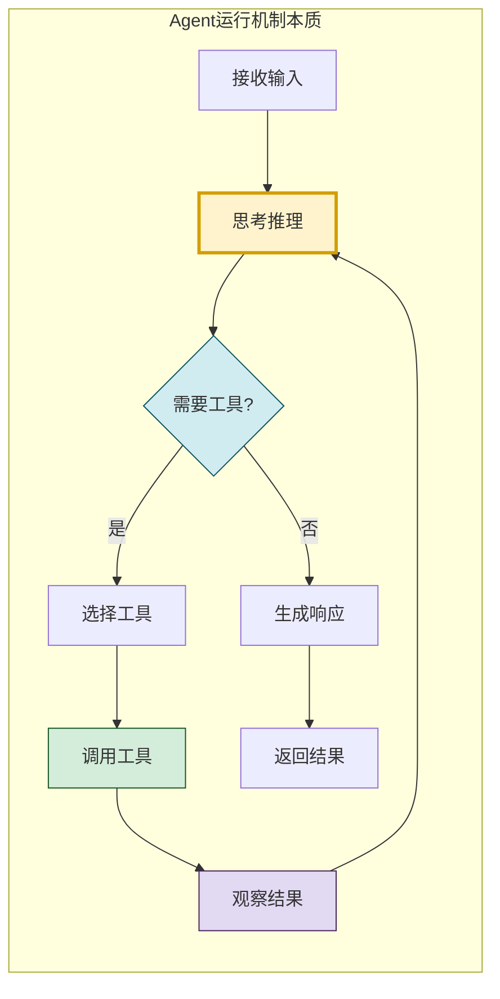

### 1.2 Agent vs Chain:运行机制的根本差异

| 维度 | Chain(链) | Agent(智能体) |
|------|----------|-------------|
| **控制流** | 预定义的固定路径 | LLM 动态决定下一步 |
| **执行步骤** | 编译时确定 | 运行时动态决定 |
| **工具调用** | 硬编码调用顺序 | 自主选择是否调用、调用哪个 |
| **循环能力** | 无(线性执行) | 有(可多轮迭代) |
| **终止条件** | 执行完最后一步 | LLM 判断任务完成 |
| **适应性** | 无法处理意外情况 | 可根据中间结果调整策略 |

### 1.3 LangChain Agent 的两种实现范式

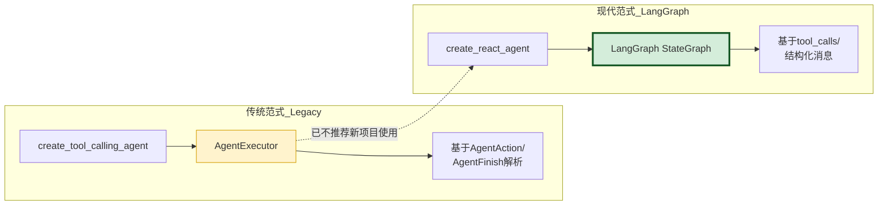

| 实现范式 | 核心API | 底层机制 | 推荐度 |
|---------|---------|---------|:------:|
| **传统范式** | `create_tool_calling_agent` + `AgentExecutor` | 基于 `AgentAction`/`AgentFinish` 中间表示 | ⭐⭐ |
| **现代范式** | `create_react_agent` (LangGraph) | 基于消息列表 + `tool_calls` 结构化字段 | ⭐⭐⭐⭐⭐ |

> **本文重点**:以 LangChain 1.x 现代范式(`create_react_agent` / LangGraph)为主,传统范式(`AgentExecutor`)为辅,深入解析两者共享的运行机制内核。

---

## 二、Agent 核心组件构成与协作关系

### 2.1 运行时核心组件

Agent 的运行依赖以下核心组件的紧密协作:

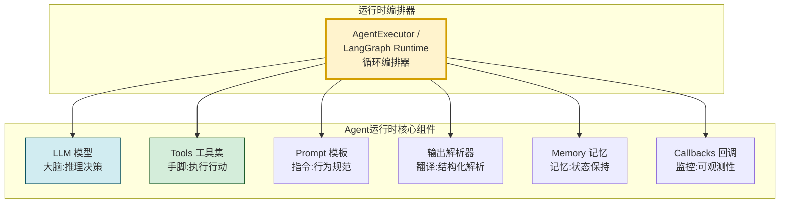

### 2.2 各组件的运行时职责

| 组件 | 运行时职责 | 输入 | 输出 |
|------|----------|------|------|
| **LLM 模型** | 接收当前上下文,推理决定下一步行动 | 消息列表(含工具描述) | 文本响应或工具调用决策 |
| **Tools 工具集** | 执行具体操作,与外部环境交互 | 工具调用参数 | 工具执行结果 |
| **Prompt 模板** | 构建系统指令,定义工具使用规范 | 系统变量 + 工具描述 | 格式化的系统提示词 |
| **输出解析器** | 解析 LLM 输出为结构化决策 | LLM 原始输出 | AgentAction 或最终答案 |
| **Memory 记忆** | 维护对话历史和中间状态 | 新消息 | 历史上下文 |
| **Callbacks 回调** | 监听执行事件,支持追踪和调试 | 执行事件 | 日志/追踪数据 |
| **编排器** | 驱动思考-行动-观察循环 | 用户输入 | 最终响应 |

### 2.3 组件协作时序

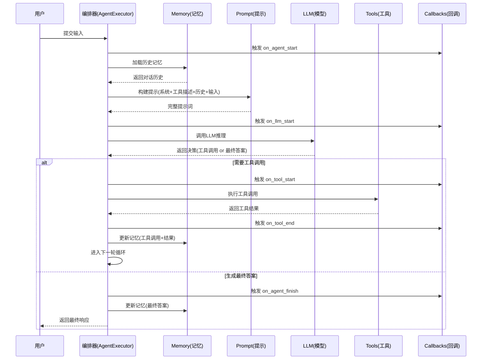

---

## 三、Agent 完整生命周期总览

### 3.1 生命周期六阶段

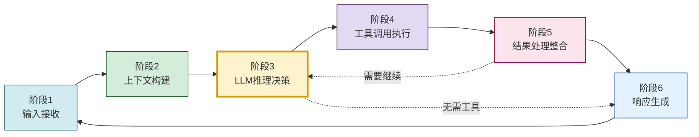

| 阶段 | 核心任务 | 关键组件 | 输入→输出 |
|------|---------|---------|----------|
| **1. 输入接收** | 接收用户输入,初始化执行环境 | AgentExecutor | 用户文本 → 输入消息 |
| **2. 上下文构建** | 组装系统提示、工具描述、历史记忆 | Prompt + Memory | 各组件 → 完整提示 |
| **3. LLM推理决策** | LLM思考并决定下一步行动 | LLM | 提示 → 决策(工具调用/最终答案) |
| **4. 工具调用执行** | 执行LLM选择的工具 | Tools | 工具调用参数 → 执行结果 |
| **5. 结果处理整合** | 解析工具结果,更新状态 | Parser + Memory | 原始结果 → 结构化状态 |
| **6. 响应生成** | 生成最终响应或继续循环 | LLM | 状态 → 最终文本 |

### 3.2 完整生命周期流程图

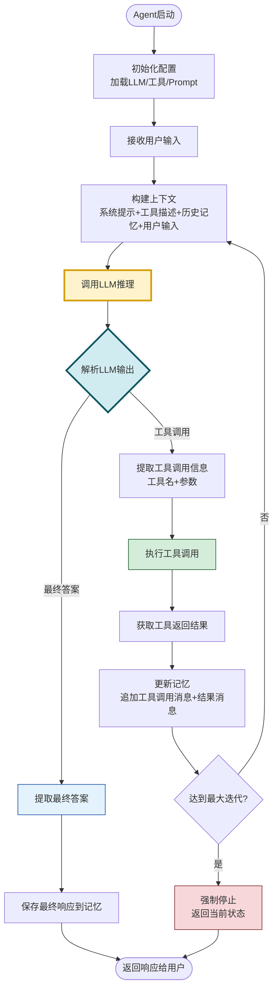

---

## 四、输入接收与上下文初始化

### 4.1 输入接收机制

Agent 的输入不仅仅是用户文本,还包括执行配置、工具集、记忆状态等完整上下文。

```python
from langchain_core.messages import HumanMessage, SystemMessage, AIMessage
from langchain_core.tools import BaseTool
from langchain_core.language_models import BaseChatModel
from typing import Any, Optional
from dataclasses import dataclass, field
import time


@dataclass
class AgentInput:
    """Agent 输入的完整表示"""
    # 用户输入
    user_message: str                          # 用户文本输入
    user_id: Optional[str] = None              # 用户标识
    session_id: Optional[str] = None           # 会话标识

    # 执行配置
    tools: list[BaseTool] = field(default_factory=list)  # 可用工具集
    max_iterations: int = 15                   # 最大迭代次数
    early_stopping_method: str = "force"       # 提前停止策略

    # 上下文
    system_prompt: Optional[str] = None        # 自定义系统提示
    chat_history: list = field(default_factory=list)  # 历史对话
    intermediate_steps: list = field(default_factory=list)  # 中间步骤

    # 元数据
    metadata: dict = field(default_factory=dict)
    tags: list[str] = field(default_factory=list)


class AgentInputProcessor:
    """Agent 输入处理器"""

    def __init__(self, llm: BaseChatModel, tools: list[BaseTool]):
        self.llm = llm
        self.tools = tools
        self.tool_map = {t.name: t for t in tools}

    def process_input(self, user_input: str,
                      chat_history: list = None,
                      session_id: str = None) -> AgentInput:
        """处理用户输入,构建Agent输入对象"""
        return AgentInput(
            user_message=user_input,
            session_id=session_id or self._generate_session_id(),
            tools=self.tools,
            max_iterations=15,
            chat_history=chat_history or [],
            intermediate_steps=[],
            metadata={
                "start_time": time.time(),
                "tool_count": len(self.tools),
                "tool_names": list(self.tool_map.keys())
            }
        )

    def _generate_session_id(self) -> str:
        import uuid
        return str(uuid.uuid4())
```

### 4.2 上下文构建机制

上下文构建是 Agent 运行的关键步骤,它决定了 LLM 能"看到"什么信息。

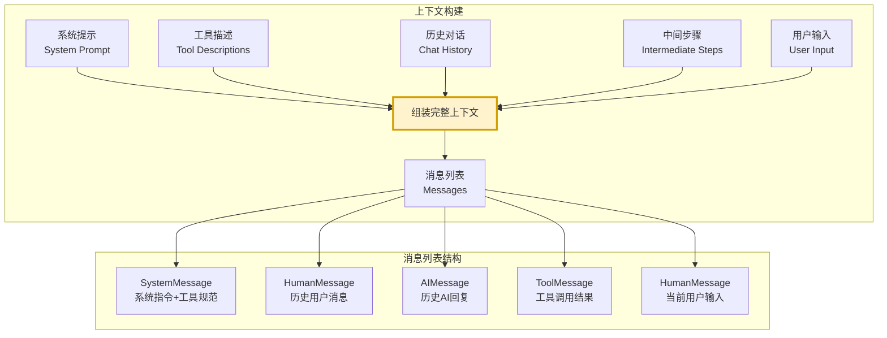

```python
class ContextBuilder:
    """Agent 上下文构建器"""

    def __init__(self, llm: BaseChatModel, tools: list[BaseTool]):
        self.llm = llm
        self.tools = tools

    def build_context(self, agent_input: AgentInput) -> list:
        """构建完整的消息上下文"""
        messages = []

        # 1. 系统提示(定义Agent角色和行为规范)
        system_content = self._build_system_prompt(agent_input)
        messages.append(SystemMessage(content=system_content))

        # 2. 工具描述(让LLM知道有哪些工具可用)
        tool_descriptions = self._format_tool_descriptions()
        if tool_descriptions:
            messages.append(SystemMessage(
                content=f"你可以使用以下工具:\n{tool_descriptions}"
            ))

        # 3. 历史对话(保持多轮对话连贯性)
        for msg in agent_input.chat_history:
            messages.append(msg)

        # 4. 中间步骤(本轮执行的工具调用和结果)
        for action, observation in agent_input.intermediate_steps:
            # 添加AI的工具调用决策
            messages.append(AIMessage(
                content="",
                tool_calls=[{
                    "name": action.tool,
                    "args": action.tool_input,
                    "id": action.tool_call_id
                }]
            ))
            # 添加工具执行结果
            messages.append(ToolMessage(
                content=observation,
                tool_call_id=action.tool_call_id
            ))

        # 5. 当前用户输入
        messages.append(HumanMessage(content=agent_input.user_message))

        return messages

    def _build_system_prompt(self, agent_input: AgentInput) -> str:
        """构建系统提示"""
        base_prompt = agent_input.system_prompt or self._default_system_prompt()
        return base_prompt

    def _default_system_prompt(self) -> str:
        return (
            "你是一个有用的AI助手。你可以使用工具来帮助回答问题。"
            "当你需要获取实时信息、执行计算或访问外部资源时,请使用提供的工具。"
            "如果不需要工具就能回答,请直接回答。"
        )

    def _format_tool_descriptions(self) -> str:
        """格式化工具描述"""
        descriptions = []
        for tool in self.tools:
            desc = f"- {tool.name}: {tool.description}"
            if tool.args_schema:
                desc += f"\n  参数: {tool.args_schema.model_json_schema()}"
            descriptions.append(desc)
        return "\n".join(descriptions)
```

### 4.3 工具绑定机制

LangChain 通过 `bind_tools` 方法将工具信息注入 LLM,使其具备工具调用能力。

```python
class ToolBinder:
    """工具绑定器"""

    def __init__(self, llm: BaseChatModel, tools: list[BaseTool]):
        self.llm = llm
        self.tools = tools

    def bind_tools_to_llm(self) -> BaseChatModel:
        """将工具绑定到LLM(使LLM支持工具调用)"""
        # bind_tools 会将工具schema注入LLM的请求格式中
        # 支持工具调用的LLM(如GPT-4, Claude)会在响应中返回tool_calls
        return self.llm.bind_tools(self.tools)

    def get_tool_schema(self, tool: BaseTool) -> dict:
        """获取工具的JSON Schema(供LLM理解工具参数)"""
        return {
            "name": tool.name,
            "description": tool.description,
            "parameters": tool.args_schema.model_json_schema() if tool.args_schema else {
                "type": "object",
                "properties": {}
            }
        }
```

---

## 五、思考推理与决策机制

### 5.1 LLM 推理的核心机制

Agent 的"思考"本质是 LLM 对完整上下文的推理,决定下一步是调用工具还是直接回答。

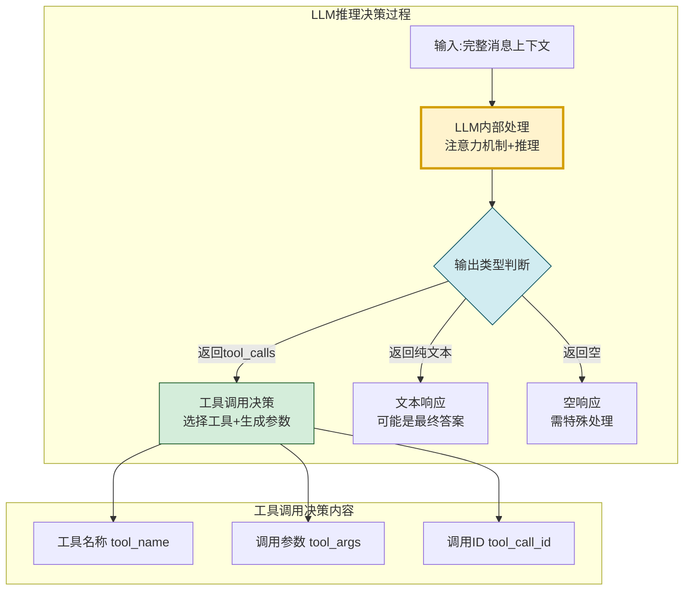

### 5.2 ReAct 推理模式

LangChain Agent 的推理遵循 **ReAct(Reasoning + Acting)** 模式,交替进行推理和行动。

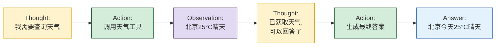

### 5.3 决策解析机制

```python
from langchain_core.agents import AgentAction, AgentFinish
from langchain_core.messages import AIMessage, ToolMessage


class DecisionParser:
    """Agent 决策解析器"""

    def __init__(self):
        pass

    def parse_llm_response(self, response: AIMessage,
                           intermediate_steps: list) -> AgentAction | AgentFinish:
        """解析LLM响应,判断是工具调用还是最终答案"""

        # 情况1:LLM返回了tool_calls(现代范式)
        if response.tool_calls:
            # 取第一个工具调用(一次可能返回多个)
            tool_call = response.tool_calls[0]
            return AgentAction(
                tool=tool_call["name"],
                tool_input=tool_call["args"],
                tool_call_id=tool_call["id"],
                log=response.content  # 保留推理文本用于调试
            )

        # 情况2:LLM返回纯文本(无工具调用)
        # 判断是否为最终答案
        if self._is_final_answer(response.content, intermediate_steps):
            return AgentFinish(
                return_values={"output": response.content},
                log=response.content
            )

        # 情况3:LLM返回空内容(异常情况)
        if not response.content:
            return AgentFinish(
                return_values={"output": "我无法生成有效响应。"},
                log="Empty response from LLM"
            )

        # 默认:视为最终答案
        return AgentFinish(
            return_values={"output": response.content},
            log=response.content
        )

    def parse_multiple_tool_calls(self, response: AIMessage) -> list[AgentAction]:
        """解析多个并行工具调用"""
        actions = []
        for tool_call in response.tool_calls:
            actions.append(AgentAction(
                tool=tool_call["name"],
                tool_input=tool_call["args"],
                tool_call_id=tool_call["id"],
                log=response.content
            ))
        return actions

    def _is_final_answer(self, content: str,
                          intermediate_steps: list) -> bool:
        """判断是否为最终答案"""
        # 如果有中间步骤且当前无工具调用,通常为最终答案
        if intermediate_steps and not content.startswith("Action:"):
            return True
        # 检查是否包含最终答案标记
        final_markers = ["Final Answer:", "最终答案:", "答案是"]
        return any(marker in content for marker in final_markers)
```

### 5.4 决策过程的完整流程

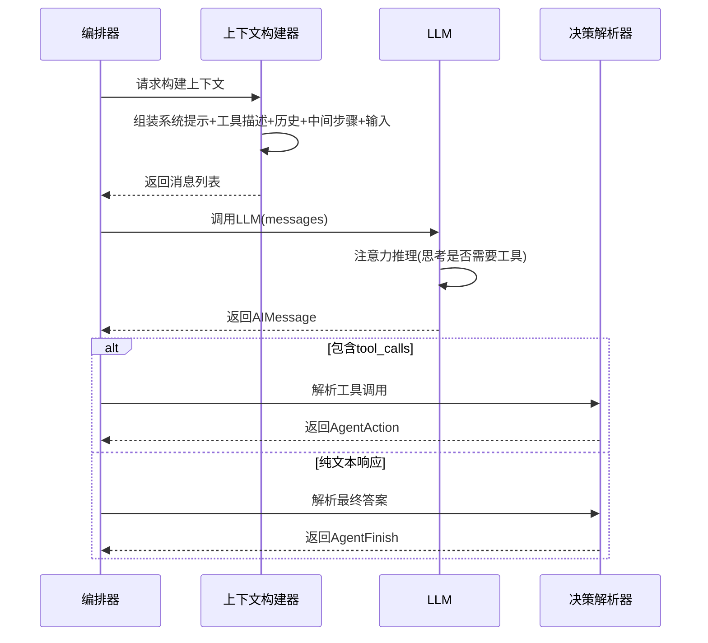

---

## 六、工具选择与匹配机制

### 6.1 工具选择的实现方式

LangChain Agent 的工具选择**完全由 LLM 决定**,而非基于规则的匹配。LLM 根据工具的名称、描述和参数 schema,自主判断应该调用哪个工具。

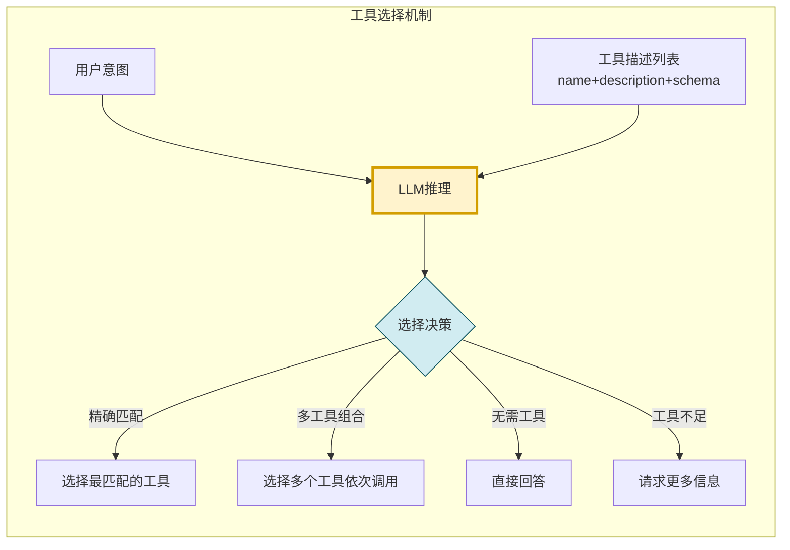

### 6.2 工具描述对选择的影响

```python
class ToolDescriptionOptimizer:
    """工具描述优化器(影响LLM的工具选择质量)"""

    def __init__(self, tools: list[BaseTool]):
        self.tools = tools

    def format_for_llm(self) -> str:
        """格式化工具描述供LLM理解"""
        formatted = []
        for tool in self.tools:
            entry = self._format_single_tool(tool)
            formatted.append(entry)
        return "\n\n".join(formatted)

    def _format_single_tool(self, tool: BaseTool) -> str:
        """格式化单个工具描述"""
        schema = tool.args_schema.model_json_schema() if tool.args_schema else {}
        properties = schema.get("properties", {})
        required = schema.get("required", [])

        params_desc = []
        for param_name, param_info in properties.items():
            req_mark = "(必需)" if param_name in required else "(可选)"
            param_type = param_info.get("type", "any")
            param_desc = param_info.get("description", "")
            params_desc.append(
                f"  - {param_name}{req_mark} [{param_type}]: {param_desc}"
            )

        return (
            f"工具名: {tool.name}\n"
            f"描述: {tool.description}\n"
            f"参数:\n" + "\n".join(params_desc) if params_desc else f"参数: 无"
        )

    def validate_tool_selection(self, selected_tool: str,
                                 provided_args: dict) -> dict:
        """验证LLM选择的工具和参数是否有效"""
        result = {"valid": True, "errors": []}

        # 验证工具是否存在
        tool = next((t for t in self.tools if t.name == selected_tool), None)
        if not tool:
            result["valid"] = False
            result["errors"].append(f"工具 '{selected_tool}' 不存在")
            return result

        # 验证必需参数是否提供
        if tool.args_schema:
            schema = tool.args_schema.model_json_schema()
            required_params = schema.get("required", [])
            for req_param in required_params:
                if req_param not in provided_args:
                    result["valid"] = False
                    result["errors"].append(
                        f"缺少必需参数: {req_param}"
                    )

        # 验证参数类型
        # (实际实现中使用Pydantic验证)

        return result
```

### 6.3 工具选择的决策因素

| 决策因素 | 影响方式 | 优化建议 |
|---------|---------|---------|
| **工具名称** | LLM通过名称判断工具用途 | 使用动词+名词的清晰命名(如`search_web`) |
| **工具描述** | LLM通过描述理解工具能力 | 详细描述工具做什么、何时使用 |
| **参数Schema** | LLM通过schema理解如何调用 | 提供清晰的参数描述和类型 |
| **用户意图** | LLM将用户需求与工具能力匹配 | 系统提示中明确工具使用场景 |
| **历史经验** | 之前的工具调用结果影响后续选择 | 中间步骤提供上下文反馈 |

---

## 七、工具调用执行机制

### 7.1 工具调用完整流程

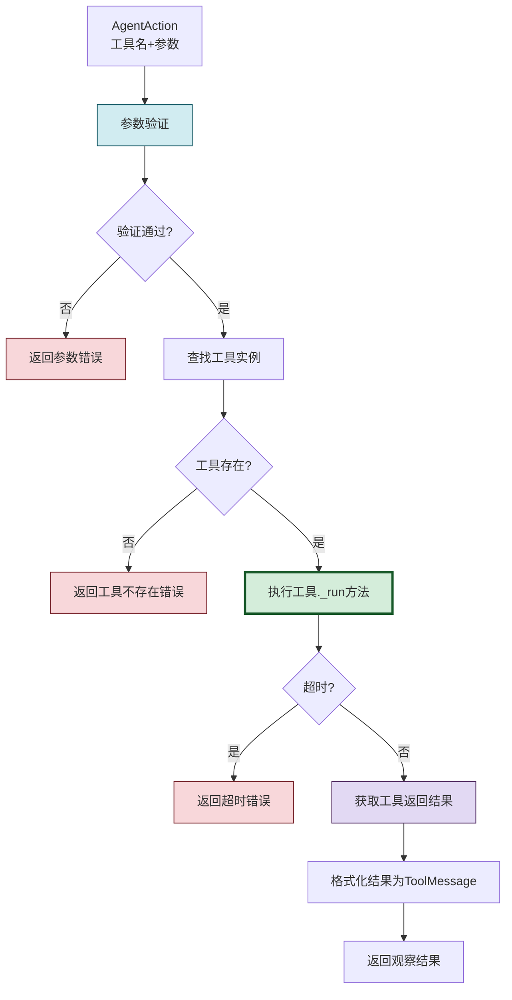

### 7.2 工具执行器实现

```python
import asyncio
from langchain_core.tools import BaseTool, ToolException
from langchain_core.messages import ToolMessage


class ToolExecutor:
    """工具执行器"""

    def __init__(self, tools: list[BaseTool], default_timeout: float = 30.0):
        self.tools = {tool.name: tool for tool in tools}
        self.default_timeout = default_timeout

    def execute(self, tool_name: str, tool_input: dict,
                tool_call_id: str = None) -> ToolMessage:
        """执行工具调用(同步)"""
        try:
            # 1. 查找工具
            tool = self.tools.get(tool_name)
            if not tool:
                return self._error_message(
                    tool_call_id, f"工具 '{tool_name}' 不存在"
                )

            # 2. 执行工具
            result = tool.invoke(tool_input)

            # 3. 格式化结果
            return ToolMessage(
                content=str(result),
                tool_call_id=tool_call_id or tool_name,
                name=tool_name
            )

        except ToolException as e:
            return self._error_message(tool_call_id, f"工具执行错误: {e}")
        except Exception as e:
            return self._error_message(tool_call_id, f"意外错误: {e}")

    async def execute_async(self, tool_name: str, tool_input: dict,
                             tool_call_id: str = None) -> ToolMessage:
        """执行工具调用(异步)"""
        try:
            tool = self.tools.get(tool_name)
            if not tool:
                return self._error_message(
                    tool_call_id, f"工具 '{tool_name}' 不存在"
                )

            result = await tool.ainvoke(tool_input)

            return ToolMessage(
                content=str(result),
                tool_call_id=tool_call_id or tool_name,
                name=tool_name
            )

        except Exception as e:
            return self._error_message(tool_call_id, f"异步执行错误: {e}")

    def execute_batch(self, actions: list[AgentAction]) -> list[ToolMessage]:
        """批量执行多个工具调用(并行)"""
        results = []
        for action in actions:
            result = self.execute(
                action.tool, action.tool_input, action.tool_call_id
            )
            results.append(result)
        return results

    async def execute_batch_async(self,
                                   actions: list[AgentAction]) -> list[ToolMessage]:
        """异步批量执行(真正并行)"""
        tasks = [
            self.execute_async(a.tool, a.tool_input, a.tool_call_id)
            for a in actions
        ]
        return await asyncio.gather(*tasks)

    def _error_message(self, tool_call_id: str, error: str) -> ToolMessage:
        """生成错误消息"""
        return ToolMessage(
            content=f"ERROR: {error}",
            tool_call_id=tool_call_id or "unknown",
            name="error"
        )
```

### 7.3 工具执行的输入输出

```python
from pydantic import BaseModel, Field
from langchain_core.tools import tool


# 工具定义示例
class SearchInput(BaseModel):
    """搜索工具的输入参数"""
    query: str = Field(description="搜索查询关键词")
    max_results: int = Field(default=5, description="最大返回结果数")


@tool(args_schema=SearchInput)
def search_web(query: str, max_results: int = 5) -> str:
    """搜索互联网获取实时信息。当需要查找最新新闻、天气、价格等实时信息时使用此工具。

    Args:
        query: 搜索查询关键词
        max_results: 最大返回结果数

    Returns:
        搜索结果摘要
    """
    # 实际实现调用搜索API
    return f"搜索 '{query}' 的结果: 找到{max_results}条相关结果..."


class CalculatorInput(BaseModel):
    """计算器工具的输入参数"""
    expression: str = Field(description="数学表达式,如 '2 + 3 * 4'")


@tool(args_schema=CalculatorInput)
def calculate(expression: str) -> str:
    """执行数学计算。当需要进行精确数值计算时使用此工具。

    Args:
        expression: 数学表达式

    Returns:
        计算结果
    """
    try:
        # 安全的表达式求值(实际实现需做安全处理)
        result = eval(expression, {"__builtins__": {}})
        return f"计算结果: {expression} = {result}"
    except Exception as e:
        return f"计算错误: {e}"


# 工具执行示例
class ToolExecutionExample:
    """工具执行示例"""

    def __init__(self):
        self.tools = [search_web, calculate]
        self.executor = ToolExecutor(self.tools)

    def run_example(self):
        # 示例1:执行搜索工具
        result1 = self.executor.execute(
            tool_name="search_web",
            tool_input={"query": "LangChain最新版本", "max_results": 3},
            tool_call_id="call_001"
        )
        print(f"搜索结果: {result1.content}")

        # 示例2:执行计算工具
        result2 = self.executor.execute(
            tool_name="calculate",
            tool_input={"expression": "2 + 3 * 4"},
            tool_call_id="call_002"
        )
        print(f"计算结果: {result2.content}")

        # 示例3:执行不存在的工具(错误处理)
        result3 = self.executor.execute(
            tool_name="nonexistent_tool",
            tool_input={},
            tool_call_id="call_003"
        )
        print(f"错误处理: {result3.content}")
```

---

## 八、结果处理与状态更新

### 8.1 结果处理流程

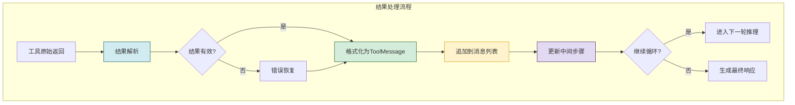

### 8.2 中间步骤管理

```python
class IntermediateStepsManager:
    """中间步骤管理器"""

    def __init__(self):
        self.steps: list[tuple[AgentAction, str]] = []

    def add_step(self, action: AgentAction, observation: str):
        """添加一个执行步骤"""
        self.steps.append((action, observation))

    def get_steps(self) -> list[tuple[AgentAction, str]]:
        """获取所有中间步骤"""
        return self.steps

    def get_step_count(self) -> int:
        """获取步骤数"""
        return len(self.steps)

    def format_for_context(self) -> str:
        """格式化中间步骤供上下文使用"""
        formatted = []
        for i, (action, obs) in enumerate(self.steps):
            formatted.append(
                f"步骤{i+1}: 调用工具 {action.tool}({action.tool_input})\n"
                f"  结果: {obs[:200]}..."
            )
        return "\n".join(formatted)

    def clear(self):
        """清除中间步骤"""
        self.steps.clear()
```

### 8.3 状态更新机制

```python
from langchain_core.messages import AIMessage, HumanMessage, ToolMessage


class AgentStateUpdater:
    """Agent 状态更新器"""

    def __init__(self):
        self.messages: list = []
        self.intermediate_steps = IntermediateStepsManager()

    def update_with_tool_call(self, action: AgentAction):
        """更新状态:记录工具调用决策"""
        # 追加AI的工具调用消息
        self.messages.append(AIMessage(
            content="",
            tool_calls=[{
                "name": action.tool,
                "args": action.tool_input,
                "id": action.tool_call_id
            }]
        ))

    def update_with_tool_result(self, action: AgentAction,
                                 result: ToolMessage):
        """更新状态:记录工具执行结果"""
        # 追加工具结果消息
        self.messages.append(result)
        # 记录中间步骤
        self.intermediate_steps.add_step(action, result.content)

    def update_with_final_answer(self, answer: str):
        """更新状态:记录最终答案"""
        self.messages.append(AIMessage(content=answer))

    def get_current_state(self) -> dict:
        """获取当前状态快照"""
        return {
            "message_count": len(self.messages),
            "step_count": self.intermediate_steps.get_step_count(),
            "tools_used": list(set(
                action.tool for action, _ in self.intermediate_steps.get_steps()
            )),
            "last_message": self.messages[-1] if self.messages else None
        }
```

---

## 九、Agent 状态管理逻辑

### 9.1 Agent 状态的组成

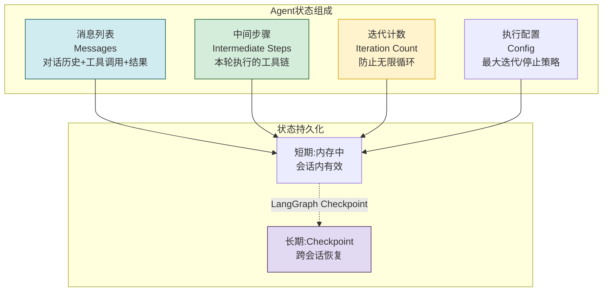

### 9.2 LangGraph 状态管理

```python
from typing import Annotated, TypedDict
from langgraph.graph import StateGraph, END
from langgraph.graph.message import add_messages


class AgentState(TypedDict):
    """LangGraph Agent 状态定义"""
    # 消息列表(自动追加,非覆盖)
    messages: Annotated[list, add_messages]
    # 中间步骤(手动管理)
    intermediate_steps: list[tuple]
    # 迭代计数
    iteration: int


class StateManager:
    """状态管理器"""

    def __init__(self):
        self.state: AgentState = {
            "messages": [],
            "intermediate_steps": [],
            "iteration": 0
        }

    def reset(self):
        """重置状态"""
        self.state = {
            "messages": [],
            "intermediate_steps": [],
            "iteration": 0
        }

    def add_message(self, message):
        """添加消息(自动追加)"""
        self.state["messages"].append(message)

    def add_intermediate_step(self, action: AgentAction, observation: str):
        """添加中间步骤"""
        self.state["intermediate_steps"].append((action, observation))

    def increment_iteration(self):
        """增加迭代计数"""
        self.state["iteration"] += 1

    def get_messages(self) -> list:
        """获取消息列表"""
        return self.state["messages"]

    def get_iteration(self) -> int:
        """获取当前迭代数"""
        return self.state["iteration"]

    def snapshot(self) -> dict:
        """获取状态快照(用于持久化)"""
        return {
            "messages": [
                {"type": m.type, "content": m.content}
                for m in self.state["messages"]
            ],
            "intermediate_steps_count": len(self.state["intermediate_steps"]),
            "iteration": self.state["iteration"]
        }
```

### 9.3 记忆管理机制

```python
from langchain_core.chat_history import BaseChatMessageHistory


class AgentMemoryManager:
    """Agent 记忆管理器"""

    def __init__(self, chat_history_store: BaseChatMessageHistory = None,
                 max_window_messages: int = 20):
        self.chat_history = chat_history_store
        self.max_window = max_window_messages
        self.session_messages: list = []

    def load_history(self, session_id: str) -> list:
        """加载会话历史"""
        if self.chat_history:
            return self.chat_history.get_messages(session_id)
        return []

    def save_to_history(self, session_id: str, message):
        """保存消息到历史"""
        if self.chat_history:
            self.chat_history.add_message(session_id, message)

    def get_context_window(self) -> list:
        """获取上下文窗口内的消息(滑动窗口)"""
        if len(self.session_messages) > self.max_window:
            # 保留系统消息 + 最近的N条
            system_msgs = [
                m for m in self.session_messages
                if m.type == "system"
            ]
            other_msgs = [
                m for m in self.session_messages
                if m.type != "system"
            ][-self.max_window:]
            return system_msgs + other_msgs
        return self.session_messages

    def summarize_old_messages(self) -> str:
        """摘要旧消息(超出窗口的部分)"""
        if len(self.session_messages) <= self.max_window:
            return ""
        old_messages = self.session_messages[:-self.max_window]
        # 实际用LLM生成摘要
        return f"[之前对话摘要] 共{len(old_messages)}条消息..."
```

---

## 十、与外部环境交互实现

### 10.1 外部环境交互架构

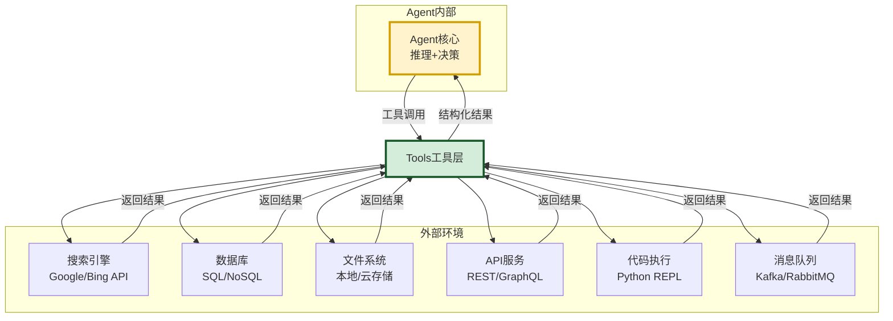

### 10.2 工具与环境交互的实现模式

```python
import requests
import json
from langchain_core.tools import tool
from pydantic import BaseModel, Field


# 模式1: HTTP API 交互
class WeatherInput(BaseModel):
    city: str = Field(description="城市名称")
    units: str = Field(default="metric", description="温度单位")


@tool(args_schema=WeatherInput)
def get_weather(city: str, units: str = "metric") -> str:
    """获取指定城市的实时天气信息。当用户询问天气情况时使用此工具。

    Args:
        city: 城市名称(中文或英文)
        units: 温度单位(metric=摄氏度, imperial=华氏度)
    """
    try:
        # 调用天气API
        response = requests.get(
            "https://api.openweathermap.org/data/2.5/weather",
            params={"q": city, "units": units, "appid": "YOUR_API_KEY"},
            timeout=10
        )
        data = response.json()
        temp = data["main"]["temp"]
        desc = data["weather"][0]["description"]
        return f"{city}当前天气: {desc}, 温度{temp}°"
    except requests.Timeout:
        return f"获取{city}天气超时,请稍后重试"
    except Exception as e:
        return f"获取天气失败: {e}"


# 模式2: 数据库交互
class DBQueryInput(BaseModel):
    query: str = Field(description="SQL查询语句")
    database: str = Field(default="default", description="数据库名称")


@tool(args_schema=DBQueryInput)
def query_database(query: str, database: str = "default") -> str:
    """执行SQL查询获取数据库信息。当需要从数据库检索数据时使用此工具。

    Args:
        query: SQL查询语句(仅支持SELECT)
        database: 目标数据库名称
    """
    # 安全检查:仅允许SELECT
    if not query.strip().upper().startswith("SELECT"):
        return "错误:仅支持SELECT查询"

    try:
        # 实际实现连接数据库执行查询
        # conn = get_connection(database)
        # results = conn.execute(query).fetchall()
        return f"查询执行成功,返回N条记录"
    except Exception as e:
        return f"数据库查询失败: {e}"


# 模式3: 文件系统交互
class FileReadInput(BaseModel):
    file_path: str = Field(description="文件路径")
    encoding: str = Field(default="utf-8", description="文件编码")


@tool(args_schema=FileReadInput)
def read_file(file_path: str, encoding: str = "utf-8") -> str:
    """读取本地文件内容。当需要查看文件内容时使用此工具。

    Args:
        file_path: 文件的绝对路径或相对路径
        encoding: 文件编码(默认utf-8)
    """
    try:
        with open(file_path, "r", encoding=encoding) as f:
            content = f.read()
        if len(content) > 10000:
            return content[:10000] + f"\n...(文件过长,已截断,共{len(content)}字符)"
        return content
    except FileNotFoundError:
        return f"文件不存在: {file_path}"
    except Exception as e:
        return f"读取文件失败: {e}"


# 模式4: 代码执行环境
class CodeExecInput(BaseModel):
    code: str = Field(description="要执行的Python代码")


@tool(args_schema=CodeExecInput)
def execute_python(code: str) -> str:
    """执行Python代码并返回结果。当需要进行复杂计算或数据处理时使用此工具。

    Args:
        code: 要执行的Python代码
    """
    import io
    import contextlib

    # 安全限制:禁止危险操作
    dangerous_keywords = ["import os", "import subprocess", "open(", "exec(", "eval("]
    for kw in dangerous_keywords:
        if kw in code:
            return f"安全限制:代码包含禁止的关键字 '{kw}'"

    try:
        # 捕获stdout
        stdout_capture = io.StringIO()
        with contextlib.redirect_stdout(stdout_capture):
            exec(code, {"__builtins__": {}})  # 受限执行环境
        output = stdout_capture.getvalue()
        return f"执行结果:\n{output}" if output else "代码执行完成(无输出)"
    except Exception as e:
        return f"执行错误: {e}"
```

### 10.3 环境交互的错误处理

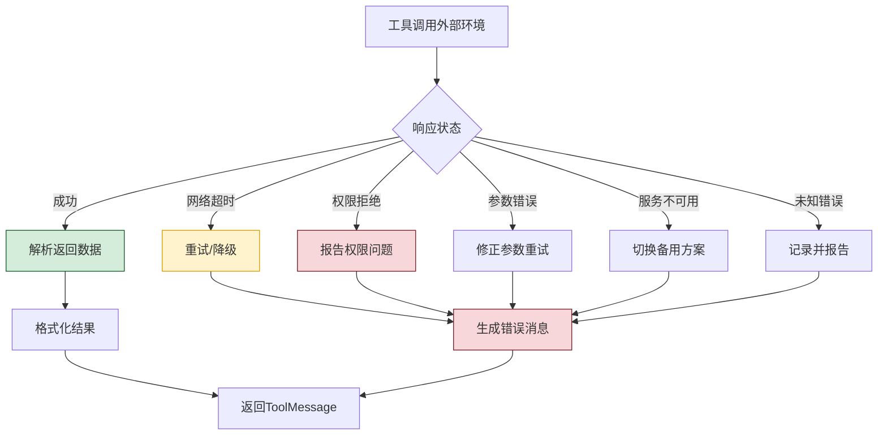

---

## 十一、Agent 执行循环完整实现

### 11.1 传统 AgentExecutor 实现

```python
class SimpleAgentExecutor:
    """简化的Agent执行器(展示核心循环逻辑)"""

    def __init__(self, llm: BaseChatModel, tools: list[BaseTool],
                 system_prompt: str = None, max_iterations: int = 15):
        self.llm = llm
        self.tools = tools
        self.tool_executor = ToolExecutor(tools)
        self.context_builder = ContextBuilder(llm, tools)
        self.decision_parser = DecisionParser()
        self.state_updater = AgentStateUpdater()
        self.max_iterations = max_iterations
        self.system_prompt = system_prompt

        # 绑定工具到LLM
        self.llm_with_tools = llm.bind_tools(tools)

    def invoke(self, user_input: str,
               chat_history: list = None) -> dict:
        """执行Agent(核心循环)"""
        # 初始化
        self.state_updater = AgentStateUpdater()
        iteration = 0

        # 构建初始输入
        agent_input = AgentInput(
            user_message=user_input,
            tools=self.tools,
            max_iterations=self.max_iterations,
            chat_history=chat_history or [],
            system_prompt=self.system_prompt
        )

        # === 核心循环 ===
        while iteration < self.max_iterations:
            iteration += 1

            # 步骤1: 构建上下文
            messages = self.context_builder.build_context(agent_input)
            # 更新中间步骤到上下文
            self._update_intermediate_in_context(agent_input)

            # 步骤2: 调用LLM推理
            response = self.llm_with_tools.invoke(messages)

            # 步骤3: 解析决策
            decision = self.decision_parser.parse_llm_response(
                response, agent_input.intermediate_steps
            )

            # 步骤4: 执行决策
            if isinstance(decision, AgentFinish):
                # 生成最终答案,退出循环
                self.state_updater.update_with_final_answer(
                    decision.return_values["output"]
                )
                return {
                    "output": decision.return_values["output"],
                    "intermediate_steps": agent_input.intermediate_steps,
                    "iterations": iteration
                }

            elif isinstance(decision, AgentAction):
                # 执行工具调用
                self.state_updater.update_with_tool_call(decision)

                result = self.tool_executor.execute(
                    tool_name=decision.tool,
                    tool_input=decision.tool_input,
                    tool_call_id=decision.tool_call_id
                )

                self.state_updater.update_with_tool_result(decision, result)
                agent_input.intermediate_steps.append(
                    (decision, result.content)
                )

        # 达到最大迭代,强制停止
        return {
            "output": "达到最大迭代次数,强制停止。",
            "intermediate_steps": agent_input.intermediate_steps,
            "iterations": iteration,
            "stopped_early": True
        }

    def _update_intermediate_in_context(self, agent_input: AgentInput):
        """更新中间步骤到Agent输入(供下一轮上下文构建)"""
        # 中间步骤在build_context中已被处理
        pass

    async def ainvoke(self, user_input: str,
                       chat_history: list = None) -> dict:
        """异步执行Agent"""
        # 异步版本的实现(结构相同,使用异步方法)
        self.state_updater = AgentStateUpdater()
        iteration = 0

        agent_input = AgentInput(
            user_message=user_input,
            tools=self.tools,
            max_iterations=self.max_iterations,
            chat_history=chat_history or [],
            system_prompt=self.system_prompt
        )

        while iteration < self.max_iterations:
            iteration += 1
            messages = self.context_builder.build_context(agent_input)
            response = await self.llm_with_tools.ainvoke(messages)
            decision = self.decision_parser.parse_llm_response(
                response, agent_input.intermediate_steps
            )

            if isinstance(decision, AgentFinish):
                return {
                    "output": decision.return_values["output"],
                    "intermediate_steps": agent_input.intermediate_steps,
                    "iterations": iteration
                }
            elif isinstance(decision, AgentAction):
                result = await self.tool_executor.execute_async(
                    decision.tool, decision.tool_input, decision.tool_call_id
                )
                agent_input.intermediate_steps.append(
                    (decision, result.content)
                )

        return {"output": "达到最大迭代次数", "iterations": iteration}
```

### 11.2 LangGraph Agent 实现

```python
from langgraph.graph import StateGraph, END
from langgraph.prebuilt import create_react_agent


class LangGraphAgent:
    """基于LangGraph的Agent实现(现代范式)"""

    def __init__(self, llm: BaseChatModel, tools: list[BaseTool]):
        self.llm = llm
        self.tools = tools
        # 使用LangGraph预建的react agent
        self.agent = create_react_agent(llm, tools)

    def invoke(self, user_input: str) -> dict:
        """执行Agent"""
        return self.agent.invoke({
            "messages": [HumanMessage(content=user_input)]
        })

    async def ainvoke(self, user_input: str) -> dict:
        """异步执行Agent"""
        return await self.agent.ainvoke({
            "messages": [HumanMessage(content=user_input)]
        })

    def invoke_with_history(self, user_input: str,
                             chat_history: list) -> dict:
        """带历史对话的执行"""
        messages = chat_history + [HumanMessage(content=user_input)]
        return self.agent.invoke({"messages": messages})


class CustomLangGraphAgent:
    """自定义LangGraph Agent(展示内部图结构)"""

    def __init__(self, llm: BaseChatModel, tools: list[BaseTool]):
        self.llm = llm
        self.tools = tools
        self.llm_with_tools = llm.bind_tools(tools)
        self.tool_executor = ToolExecutor(tools)
        self.graph = self._build_graph()

    def _build_graph(self):
        """构建Agent执行图"""
        workflow = StateGraph(AgentState)

        # 添加节点
        workflow.add_node("agent", self._agent_node)
        workflow.add_node("tools", self._tools_node)

        # 设置入口
        workflow.set_entry_point("agent")

        # 添加条件边
        workflow.add_conditional_edges(
            "agent",
            self._should_continue,
            {
                "continue": "tools",
                "end": END
            }
        )

        # 工具节点回到agent
        workflow.add_edge("tools", "agent")

        return workflow.compile()

    def _agent_node(self, state: AgentState) -> dict:
        """Agent节点:调用LLM推理"""
        messages = state["messages"]
        response = self.llm_with_tools.invoke(messages)
        return {"messages": [response]}

    def _tools_node(self, state: AgentState) -> dict:
        """工具节点:执行工具调用"""
        messages = state["messages"]
        last_message = messages[-1]  # AIMessage with tool_calls

        results = []
        for tool_call in last_message.tool_calls:
            result = self.tool_executor.execute(
                tool_name=tool_call["name"],
                tool_input=tool_call["args"],
                tool_call_id=tool_call["id"]
            )
            results.append(result)

        return {"messages": results}

    def _should_continue(self, state: AgentState) -> str:
        """判断是否继续循环"""
        messages = state["messages"]
        last_message = messages[-1]

        if last_message.tool_calls:
            return "continue"
        return "end"

    def invoke(self, user_input: str) -> dict:
        """执行Agent"""
        return self.graph.invoke({
            "messages": [HumanMessage(content=user_input)]
        })
```

### 11.3 执行循环对比

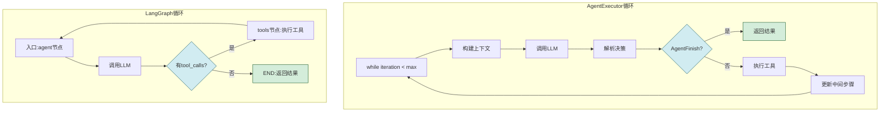

---

## 十二、异常处理与终止条件

### 12.1 异常处理策略

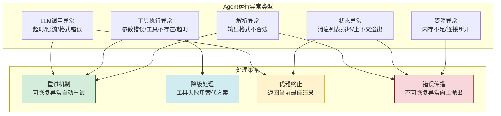

### 12.2 异常处理实现

```python
class AgentErrorHandler:
    """Agent 异常处理器"""

    def __init__(self, max_retries: int = 3):
        self.max_retries = max_retries

    def handle_llm_error(self, error: Exception,
                          attempt: int) -> dict:
        """处理LLM调用错误"""
        if attempt < self.max_retries:
            return {
                "action": "retry",
                "delay": 2 ** attempt,  # 指数退避
                "message": f"LLM调用失败,第{attempt}次重试"
            }
        return {
            "action": "terminate",
            "message": f"LLM调用失败,已达最大重试次数: {error}"
        }

    def handle_tool_error(self, error: Exception,
                           tool_name: str) -> ToolMessage:
        """处理工具执行错误(返回错误消息而非崩溃)"""
        return ToolMessage(
            content=f"工具 '{tool_name}' 执行失败: {error}。请尝试其他方法。",
            tool_call_id="error",
            name=tool_name
        )

    def handle_parse_error(self, raw_output: str) -> AgentFinish:
        """处理解析错误(优雅降级为最终答案)"""
        return AgentFinish(
            return_values={"output": raw_output},
            log=f"解析失败,直接返回原始输出"
        )


class RobustAgentExecutor:
    """带异常处理的Agent执行器"""

    def __init__(self, llm, tools, max_iterations=15):
        self.llm = llm
        self.tools = tools
        self.max_iterations = max_iterations
        self.error_handler = AgentErrorHandler()
        self.tool_executor = ToolExecutor(tools)

    def invoke(self, user_input: str) -> dict:
        """带完整异常处理的执行"""
        messages = [HumanMessage(content=user_input)]
        llm_with_tools = self.llm.bind_tools(self.tools)

        for iteration in range(self.max_iterations):
            try:
                # LLM推理
                response = llm_with_tools.invoke(messages)

                # 检查是否完成
                if not response.tool_calls:
                    return {
                        "output": response.content,
                        "iterations": iteration + 1,
                        "success": True
                    }

                # 执行工具调用
                for tool_call in response.tool_calls:
                    try:
                        result = self.tool_executor.execute(
                            tool_call["name"],
                            tool_call["args"],
                            tool_call["id"]
                        )
                        messages.append(result)
                    except Exception as e:
                        error_msg = self.error_handler.handle_tool_error(
                            e, tool_call["name"]
                        )
                        messages.append(error_msg)

                messages.append(response)

            except Exception as e:
                handle_result = self.error_handler.handle_llm_error(
                    e, iteration
                )
                if handle_result["action"] == "terminate":
                    return {
                        "output": handle_result["message"],
                        "iterations": iteration + 1,
                        "success": False,
                        "error": str(e)
                    }
                # 等待后重试
                import time
                time.sleep(handle_result["delay"])

        return {
            "output": "达到最大迭代次数",
            "iterations": self.max_iterations,
            "success": False,
            "stopped_early": True
        }
```

### 12.3 终止条件

| 终止条件 | 触发方式 | 处理方式 | 输出 |
|---------|---------|---------|------|
| **LLM返回最终答案** | LLM不返回tool_calls | 返回文本内容 | 正常响应 |
| **达到最大迭代** | iteration >= max_iterations | 强制停止 | 当前最佳结果 + 警告 |
| **LLM调用失败** | 异常且重试耗尽 | 优雅终止 | 错误信息 |
| **超时** | 执行时间超限 | 中断执行 | 部分结果 |
| **用户取消** | 外部中断信号 | 立即停止 | 已完成步骤 |
| **Token耗尽** | 上下文超限 | 摘要压缩或终止 | 压缩后结果或错误 |

---

## 十三、总结与最佳实践

### 13.1 运行机制核心要点

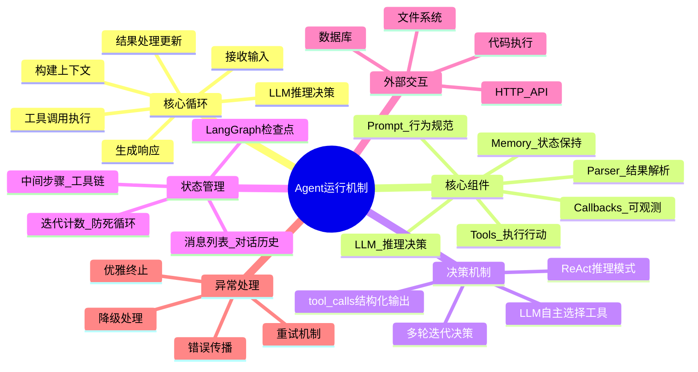

### 13.2 最佳实践

| 实践领域 | 最佳实践 | 原因 |
|---------|---------|------|
| **工具描述** | 写清楚工具用途、使用时机、参数说明 | LLM靠描述选择工具,描述不清导致选择错误 |
| **迭代限制** | 设置合理的max_iterations(10-20) | 防止无限循环消耗Token |
| **工具粒度** | 工具功能单一明确,避免一个工具做太多事 | 提高LLM选择准确率 |
| **错误处理** | 工具错误返回错误消息而非抛异常 | Agent可以基于错误调整策略 |
| **上下文管理** | 超长对话使用摘要压缩 | 避免上下文溢出 |
| **异步执行** | 使用async/await而非同步调用 | 提高并发性能 |
| **可观测性** | 启用Callbacks追踪每步执行 | 便于调试和优化 |
| **现代范式** | 优先使用create_react_agent而非AgentExecutor | LangGraph提供更好的状态管理 |

### 13.3 常见问题与解决方案

| 问题 | 原因 | 解决方案 |
|------|------|---------|
| **Agent不调用工具** | 工具描述不清或系统提示未引导 | 优化工具描述,在系统提示中明确工具使用场景 |
| **Agent选错工具** | 工具名称或描述有歧义 | 使用清晰命名,区分相似工具 |
| **Agent无限循环** | 无max_iterations或设置过大 | 设置合理的迭代上限 |
| **工具参数错误** | LLM生成的参数不匹配schema | 使用Pydantic验证,提供参数修正反馈 |
| **上下文溢出** | 对话过长或多轮工具调用 | 使用摘要压缩或滑动窗口 |
| **响应延迟高** | 同步执行多工具 | 使用异步执行,并行调用独立工具 |

### 13.4 与系列文档的关系

- [85LangChain框架核心组件详解.md](./85LangChain框架核心组件详解.md):本文的组件基础,85号文档概述组件,本文深入运行机制
- [38Agent核心工作流程_Observe_Think_Act.md](../3Agent%20架构设计/38Agent核心工作流程_Observe_Think_Act.md):OTA循环的理论基础,本文是其LangChain实现
- [39ReAct_Agent工作流程详解.md](../3Agent%20架构设计/39ReAct_Agent工作流程详解.md):ReAct模式的详解,本文是其在LangChain中的落地
- [42Agent工具选择决策机制详解.md](../3Agent%20架构设计/42Agent工具选择决策机制详解.md):工具选择机制,本文是其在LangChain中的实现
- [43Agent工具调用失败管理机制详解.md](../3Agent%20架构设计/43Agent工具调用失败管理机制详解.md):工具调用失败管理,本文的异常处理章节与之呼应

### 13.5 核心结论

> **LangChain Agent 的运行机制本质是一个"LLM驱动的自主决策循环"**:Agent 不是按照预定义路径执行,而是每一轮都由 LLM 根据当前上下文自主决定下一步行动。这个循环包含六个阶段——输入接收、上下文构建、LLM 推理、工具调用、结果处理、响应生成,通过中间步骤和消息列表维护状态,通过工具与外部环境交互,通过迭代限制和异常处理保障稳定性。理解这个机制,是构建可靠 Agent 应用的基础。

---

> **相关文档**
>
> - [85LangChain框架核心组件详解.md](./85LangChain框架核心组件详解.md):LangChain核心组件体系
> - [38Agent核心工作流程_Observe_Think_Act.md](../3Agent%20架构设计/38Agent核心工作流程_Observe_Think_Act.md):Agent执行回路理论基础
> - [39ReAct_Agent工作流程详解.md](../3Agent%20架构设计/39ReAct_Agent工作流程详解.md):ReAct推理模式详解
> - [42Agent工具选择决策机制详解.md](../3Agent%20架构设计/42Agent工具选择决策机制详解.md):工具选择决策机制
> - [43Agent工具调用失败管理机制详解.md](../3Agent%20架构设计/43Agent工具调用失败管理机制详解.md):工具调用失败管理
