# LangGraph 框架诞生背景与核心定位深度解析

> **文档定位**:本文档是 Agent Framework 系列的第三篇核心文档。在 [85LangChain框架核心组件详解.md](./85LangChain框架核心组件详解.md) 阐述 LangChain 组件体系、[86LangChain Agent运行机制深度解析.md](./86LangChain Agent运行机制深度解析.md) 解析 Agent 运行机制的基础上,本文聚焦回答一个关键问题:**LangGraph 框架为什么会出现?** 从 LangChain 在生产环境中暴露的局限性出发,系统分析 LangGraph 被引入的技术背景、解决的核心问题,以及它在整个 Agent 系统架构中的角色与功能定位。
>
> **阅读建议**:建议先阅读 85、86 号文档建立 LangChain 与 Agent 的基础认知,再阅读本文理解 LangGraph 的演进必然性。可结合 [38Agent核心工作流程_Observe_Think_Act.md](../3Agent%20架构设计/38Agent核心工作流程_Observe_Think_Act.md)、[47长期运行Agent任务系统架构设计完整方案.md](../3Agent%20架构设计/47长期运行Agent任务系统架构设计完整方案.md) 理解长期任务与状态管理的工程需求。

---

## 目录

- [一、LangGraph 框架概述](#一langgraph-框架概述)
- [二、LangChain 的局限性:LangGraph 诞生的直接动因](#二langchain-的局限性langgraph-诞生的直接动因)
- [三、Agent 生产化的三大挑战](#三agent-生产化的三大挑战)
- [四、LangGraph 解决的核心问题](#四langgraph-解决的核心问题)
- [五、LangGraph 的核心设计理念](#五langgraph-的核心设计理念)
- [六、LangGraph 在 Agent 系统架构中的角色定位](#六langgraph-在-agent-系统架构中的角色定位)
- [七、LangChain vs LangGraph:从对比看演进](#七langchain-vs-langgraph从对比看演进)
- [八、典型场景:为什么需要 LangGraph](#八典型场景为什么需要-langgraph)
- [九、LangGraph 的技术演进历程](#九langgraph-的技术演进历程)
- [十、总结:LangGraph 出现的必然性](#十总结langgraph-出现的必然性)

---

## 一、LangGraph 框架概述

### 1.1 什么是 LangGraph

**LangGraph** 是 LangChain 团队于 2024 年初推出的**低层次(low-level) Agent 编排框架与运行时**,其核心目标是**为生产环境中的可靠 Agent 提供状态管理、流程控制与持久化能力**。

与 LangChain 的"快速上手"哲学不同,LangGraph 的设计哲学是:

> **"当需要在易用性与生产可靠性之间做权衡时,我们优先选择生产可靠性。"**
>
> —— Nuno Campos, LangGraph 技术负责人 [[来源:Building LangGraph]](https://blog.langchain.com/building-langgraph/)

LangGraph 将 Agent 的执行逻辑建模为**有向图(Directed Graph)**:

- **节点(Node)**:执行具体操作的函数(如调用 LLM、执行工具、业务逻辑)
- **边(Edge)**:控制流程流转的路径(支持条件分支、循环)
- **状态(State)**:在节点间共享的全局状态对象

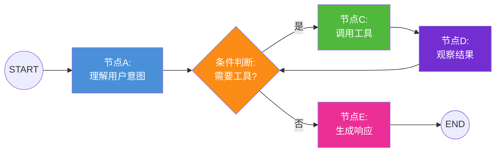

### 1.2 LangGraph 在生态中的位置

LangGraph 并非 LangChain 的替代品,而是其**底层编排基础设施**的升级:

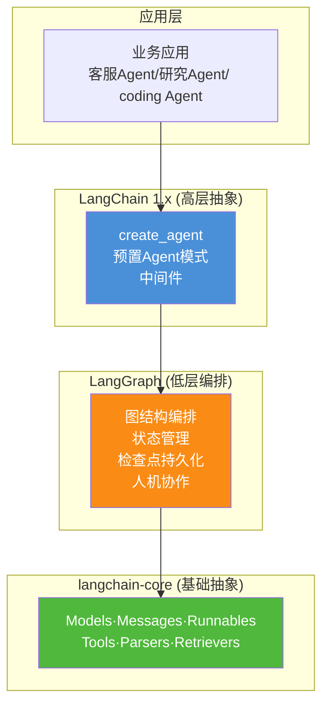

**关键关系**:
- LangChain 1.x 的 `create_agent` 等**高层 API 构建在 LangGraph 之上**
- LangGraph 提供底层运行时,LangChain 提供易用的组件封装
- 二者是**同一技术栈的不同层次**,而非竞争关系

---

## 二、LangChain 的局限性:LangGraph 诞生的直接动因

### 2.1 社区反馈:易上手但难规模化

LangChain 自 2022 年 10 月开源后迅速成为 LLM 应用开发的事实标准框架。然而,随着用户从原型开发走向生产部署,大量负面反馈涌现:

> **"langchain 容易上手,但难以定制和扩展(customize and scale)。"**
>
> —— Harrison Chase, LangChain 创始人 [[来源:Reflections on Three Years]](https://blog.langchain.com/three-years-langchain/)

Harrison Chase 在三年回顾中坦承:

> **"我们用易用性换取了控制力(power)。langchain 中的高级接口让人容易上手,但同样的高级抽象也让人难以深入定制。"**

这些反馈归结为以下五大核心痛点:

### 2.2 痛点一:线性链式结构无法表达复杂流程

LangChain 的核心抽象是 **Chain(链)**,本质是**线性顺序执行**的管道:


这种结构在简单场景下足够,但面对真实业务时捉襟见肘:

| 业务需求 | 链式结构的问题 |
|---------|--------------|
| Agent 需要循环调用工具直到完成 | Chain 不支持循环,只能用 AgentExecutor 黑盒封装 |
| 根据中间结果动态选择不同处理路径 | Chain 是编译时确定的固定路径,无法运行时分支 |
| 某步骤失败后需要回退到前序步骤 | 链式结构无回退机制 |
| 多个步骤需要并行执行后汇总 | Chain 默认串行,并行需手动编排 |

**典型困境**:开发者为了实现复杂流程,不得不在 AgentExecutor 的回调里塞入大量条件判断逻辑,最终写出难以维护的"面条代码(spaghetti code)"。

### 2.3 痛点二:状态管理薄弱

LangChain 的状态管理存在根本性缺陷:

```python
# LangChain 传统方式:状态散落在各处,难以统一管理
from langchain.memory import ConversationBufferMemory

# 问题1: Memory 只存对话历史,无法存业务状态
memory = ConversationBufferMemory()

# 问题2: 多步执行中间结果无处安放,只能塞入临时变量
intermediate_result = None

def step1(input):
    global intermediate_result
    intermediate_result = some_processing(input)  # 全局变量传递状态
    return intermediate_result

def step2(input):
    # 如何可靠地获取 step1 的结果?
    # 如何在崩溃后恢复 intermediate_result?
    pass
```

**具体问题**:

| 问题 | 影响 |
|------|------|
| Memory 仅支持对话历史 | 无法存储业务数据(如订单状态、处理进度) |
| 中间状态依赖全局变量/闭包 | 进程崩溃后状态全部丢失 |
| 无检查点(Checkpoint)机制 | 长任务失败必须从头重跑 |
| 多 Agent 间状态共享困难 | 缺乏统一的状态 Schema |

### 2.4 痛点三:缺乏持久化与容错能力

生产环境中的 Agent 必然面临中断,但 LangChain 没有内建容错:

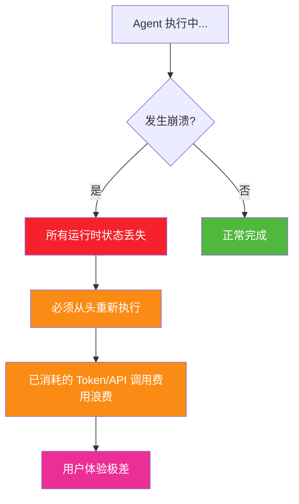

一个运行了 9 分钟的任务在第 10 分钟崩溃,传统 LangChain 只能从第 0 分钟重新开始——这在 LLM 调用成本高昂的场景下是不可接受的。

### 2.5 痛点四:人机协作(Human-in-the-Loop)支持不足

许多业务场景需要人工介入审核:

- Agent 准备执行敏感操作(如发送邮件、转账)前,需要人工确认
- Agent 生成的结果需要人工审核后才提交
- 多步骤流程中,某些关键节点需要人工决策

LangChain 的 AgentExecutor 是一个**全自动黑盒循环**,没有内建的暂停/恢复机制。开发者只能通过 hacky 的回调或外部信号来实现,代码复杂且不可靠。

### 2.6 痛点五:多 Agent 协作缺乏编排框架

随着 Agent 应用复杂化,单 Agent 难以胜任,需要多 Agent 协作:

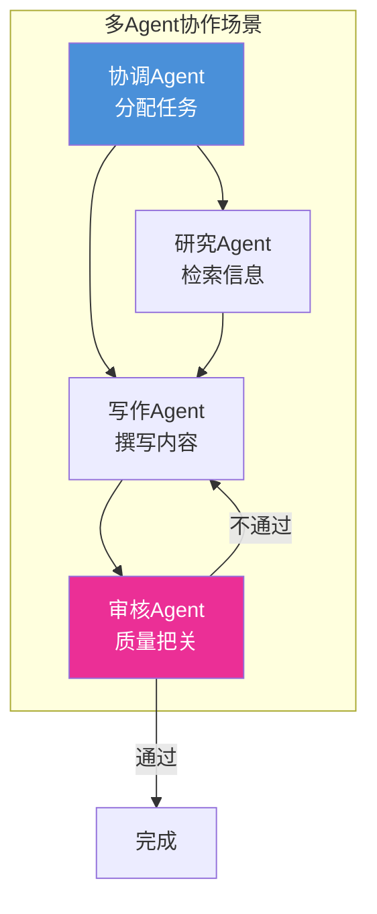

LangChain 没有提供多 Agent 协作的原生抽象,开发者需要自行实现任务分配、结果汇总、状态同步等逻辑,重复造轮子且容易出错。

---

## 三、Agent 生产化的三大挑战

LangChain 团队在构建大量 Agent 并与 Uber、LinkedIn、Klarna 等企业合作后,总结出 Agent 区别于传统软件的**三大核心挑战** [[来源:Building LangGraph]](https://blog.langchain.com/building-langgraph/):

### 3.1 挑战一:延迟管理(Latency)

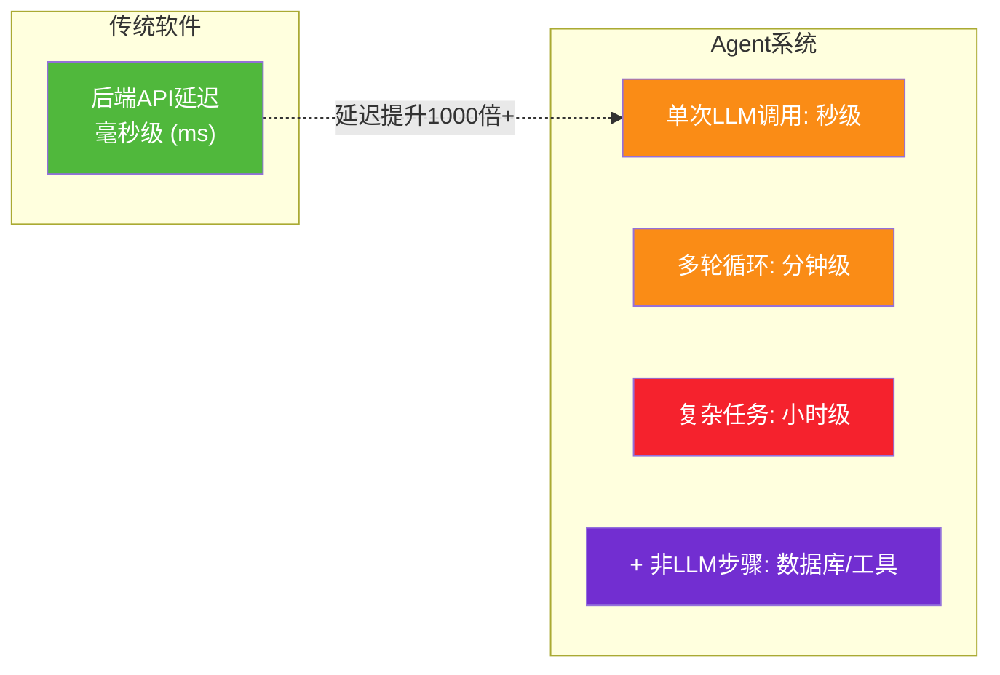

**问题本质**:LLM 本身很慢(秒级),且 test-time compute 趋势让模型更慢;Agent 需要多轮 LLM 调用;还需要附加非 LLM 步骤(数据库查询、工具调用、结果校验)。总延迟从毫秒级膨胀到分钟甚至小时级。

**需要的应对能力**:

| 能力 | 作用 |
|------|------|
| **并行化(Parallelization)** | 独立步骤并行执行,减少总等待时间 |
| **流式输出(Streaming)** | 无法降低实际延迟时,通过逐步展示结果降低"感知延迟" |

### 3.2 挑战二:可靠性管理(Reliability)

> **"运行时间越长,出问题的机会越多。传统软件出 bug 可以直接重试,但 Agent 如果在第 9 分钟崩溃,从头重来既昂贵又耗时。"**

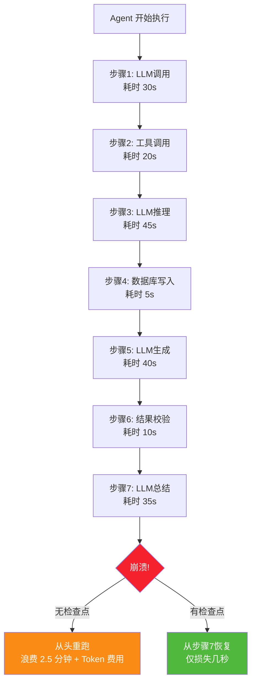

**需要的应对能力**:

| 能力 | 作用 |
|------|------|
| **检查点(Checkpointing)** | 定期保存执行状态,崩溃后从最近检查点恢复 |
| **持久化(Persistence)** | 状态存储在外部,不依赖进程内存 |
| **幂等重试** | 失败操作可安全重试,不产生副作用 |

### 3.3 挑战三:非确定性管理(Non-determinism)

LLM 的输出本质上是**非确定性**的:相同输入可能产生不同输出。这带来独特挑战:

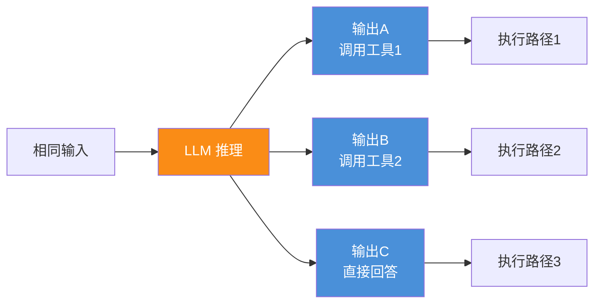

**问题**:传统软件测试依赖"相同输入→相同输出",但 Agent 无法保证。这使得:

- 测试困难:无法用传统单元测试覆盖所有路径
- 调试困难:复现问题需要完整的状态快照
- 审核困难:需要人工审核关键决策点

**需要的应对能力**:

| 能力 | 作用 |
|------|------|
| **检查点回放** | 记录完整执行轨迹,支持回放调试 |
| **人机协作断点** | 在关键节点暂停,等待人工审核 |
| **时间旅行(Time Travel)** | 回到任意历史检查点,从该点重新执行 |

---

## 四、LangGraph 解决的核心问题

针对上述痛点与挑战,LangGraph 提供了系统性的解决方案:

### 4.1 问题→能力映射

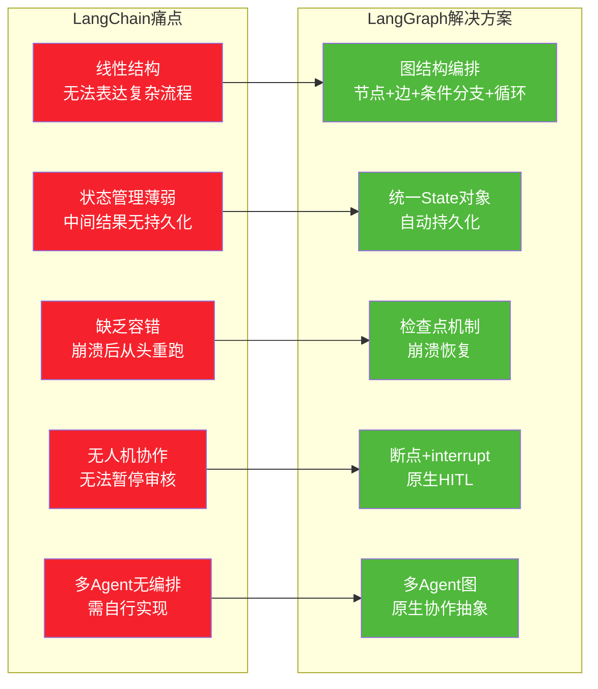

### 4.2 核心能力详解

#### 能力一:图结构编排——解决复杂流程表达

LangGraph 将 Agent 逻辑建模为图,从根本上解决了线性 Chain 的局限:

```python
from langgraph.graph import StateGraph, END
from typing import TypedDict, Annotated
from langgraph.graph.message import add_messages

# 1. 定义状态 Schema
class AgentState(TypedDict):
    messages: Annotated[list, add_messages]
    needs_tool: bool
    retry_count: int

# 2. 创建图
graph = StateGraph(AgentState)

# 3. 添加节点(每个节点是一个函数)
graph.add_node("understand", understand_intent)      # 理解意图
graph.add_node("call_tool", execute_tool)             # 调用工具
graph.add_node("observe", process_result)             # 处理结果
graph.add_node("respond", generate_response)          # 生成响应

# 4. 添加边(支持条件分支和循环!)
graph.set_entry_point("understand")

# 条件分支:根据状态决定下一步
graph.add_conditional_edges(
    "understand",
    lambda state: "call_tool" if state["needs_tool"] else "respond",
    {"call_tool": "call_tool", "respond": "respond"}
)

# 循环:工具调用后回到理解节点,形成 ReAct 循环
graph.add_edge("call_tool", "observe")
graph.add_edge("observe", "understand")  # 循环!
graph.add_edge("respond", END)

# 5. 编译为可执行应用
app = graph.compile()
```

**对比 LangChain Chain**:

| 特性 | LangChain Chain | LangGraph |
|------|----------------|-----------|
| 执行路径 | 编译时固定 | 运行时动态决定 |
| 循环 | ❌ 不支持 | ✅ 原生支持 |
| 条件分支 | ❌ 需 hack | ✅ `add_conditional_edges` |
| 并行节点 | ❌ 需手动 | ✅ 原生支持(fan-out/fan-in) |
| 可视化 | ❌ | ✅ 图结构天然可可视化 |

#### 能力二:统一状态管理——解决状态散落问题

LangGraph 的核心创新是**集中式状态对象**:

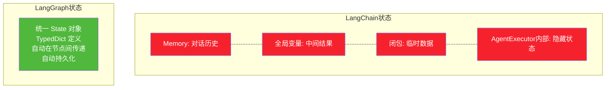

```python
from typing import TypedDict, Annotated
from langgraph.graph.message import add_messages

class AgentState(TypedDict):
    # 对话历史(自动累加)
    messages: Annotated[list, add_messages]
    # 业务状态
    current_task: str
    retrieved_docs: list
    tool_call_count: int
    user_id: str
    # 任何你需要的字段...
```

**优势**:
- 所有状态集中在一个 Schema 中,类型安全
- 节点自动接收并更新状态,无需手动传递
- 状态可序列化,支持持久化

#### 能力三:检查点与持久化——解决崩溃恢复

这是 LangGraph 对生产 Agent 最重要的贡献:

```python
from langgraph.checkpoint.memory import MemorySaver
from langgraph.checkpoint.sqlite import SqliteSaver
from langgraph.checkpoint.postgres import PostgresSaver

# 使用检查点持久化
checkpointer = PostgresSaver(conn_string="postgresql://...")

# 编译图时注入 checkpointer
app = graph.compile(
    checkpointer=checkpointer,
    interrupt_before=["sensitive_action"]  # 在敏感节点前暂停
)

# 执行时指定 thread_id(会话标识)
config = {"configurable": {"thread_id": "user-123-session-1"}}
result = app.invoke(input_data, config=config)

# 崩溃后恢复:用相同的 thread_id 即可从最后检查点继续
result = app.invoke(None, config=config)  # 传入 None,从断点继续
```

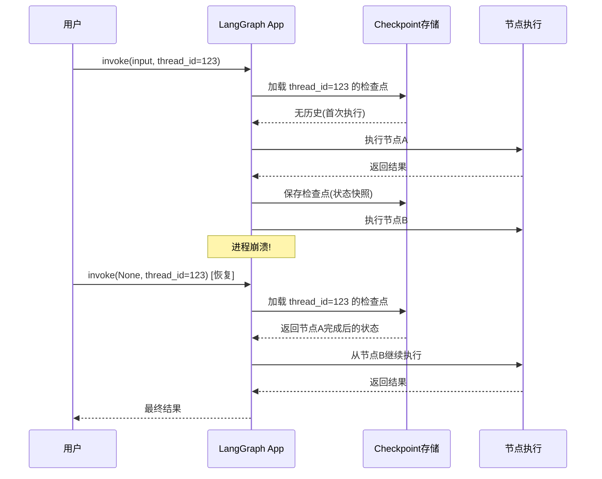

#### 能力四:人机协作(Human-in-the-Loop)——解决审核断点

LangGraph 原生支持在任意节点暂停,等待人工介入:

```python
from langgraph.graph import StateGraph

graph = StateGraph(AgentState)
graph.add_node("research", research_node)
graph.add_node("draft_email", draft_email_node)
graph.add_node("send_email", send_email_node)  # 敏感操作!

graph.add_edge("research", "draft_email")
graph.add_edge("draft_email", "send_email")
graph.add_edge("send_email", END)

# 在发送邮件前暂停,等待人工确认
app = graph.compile(
    checkpointer=checkpointer,
    interrupt_before=["send_email"]  # 关键:在此节点前暂停
)

# 第一次执行:到 send_email 前自动暂停
result = app.invoke(
    {"messages": [HumanMessage("帮我给客户写封邮件")]},
    config={"configurable": {"thread_id": "session-1"}}
)
# 此时邮件草稿已生成,但未发送

# 人工审核后,继续执行
result = app.invoke(None, config={"configurable": {"thread_id": "session-1"}})
# 邮件发送完成
```

#### 能力五:多 Agent 协作编排

LangGraph 原生支持构建多 Agent 系统:

```python
from langgraph.graph import StateGraph, END

class TeamState(TypedDict):
    task: str
    research_result: str
    draft: str
    review_passed: bool

# 各 Agent 作为图的节点
def supervisor(state: TeamState) -> TeamState:
    """协调 Agent:分配任务"""
    pass

def researcher(state: TeamState) -> TeamState:
    """研究 Agent:检索信息"""
    pass

def writer(state: TeamState) -> TeamState:
    """写作 Agent:撰写内容"""
    pass

def reviewer(state: TeamState) -> TeamState:
    """审核 Agent:质量把关"""
    pass

graph = StateGraph(TeamState)
graph.add_node("supervisor", supervisor)
graph.add_node("researcher", researcher)
graph.add_node("writer", writer)
graph.add_node("reviewer", reviewer)

graph.set_entry_point("supervisor")
graph.add_edge("supervisor", "researcher")
graph.add_edge("researcher", "writer")
graph.add_edge("writer", "reviewer")

# 审核不通过则回到写作 Agent 修改(循环!)
graph.add_conditional_edges(
    "reviewer",
    lambda state: "writer" if not state["review_passed"] else END
)

app = graph.compile(checkpointer=checkpointer)
```

---

## 五、LangGraph 的核心设计理念

### 5.1 理念一:低抽象,高控制(Low Abstraction, High Control)

LangChain 的教训是:过多抽象反而限制灵活性。LangGraph 的选择是**几乎不做抽象**:

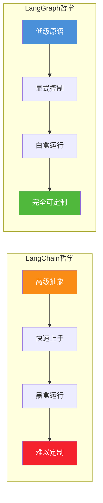

**具体体现**:
- 开发者显式定义每个节点和边,流程完全透明
- 没有"魔法":所有控制流都可见、可修改
- 状态 Schema 由开发者定义,不强制数据结构

### 5.2 理念二:持久化优先(Durability First)

LangGraph 将**持久化**作为一等公民,而非可选功能:

| 层面 | LangChain | LangGraph |
|------|-----------|-----------|
| 状态存储 | 进程内存(默认) | 外部存储(默认) |
| 崩溃恢复 | 不支持 | 原生支持 |
| 执行轨迹 | 需手动日志 | 自动检查点记录 |
| 时间旅行 | 不支持 | 支持回到任意检查点 |

### 5.3 理念三:生产优先(Production-First)

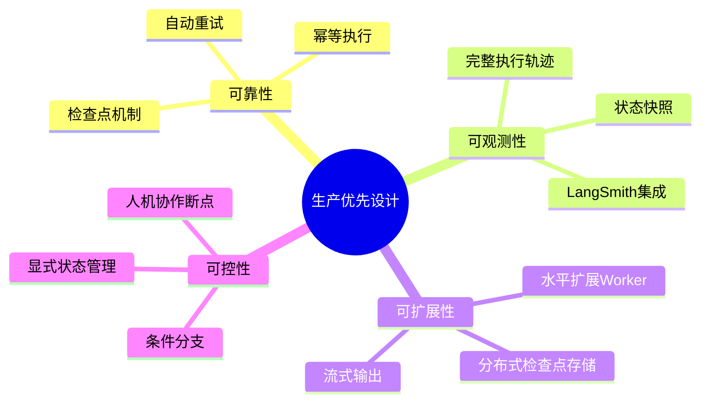

---

## 六、LangGraph 在 Agent 系统架构中的角色定位

### 6.1 角色一:Agent 运行时(Runtime)

LangGraph 的核心定位是**Agent 运行时**——负责 Agent 的执行调度、状态维护和生命周期管理:

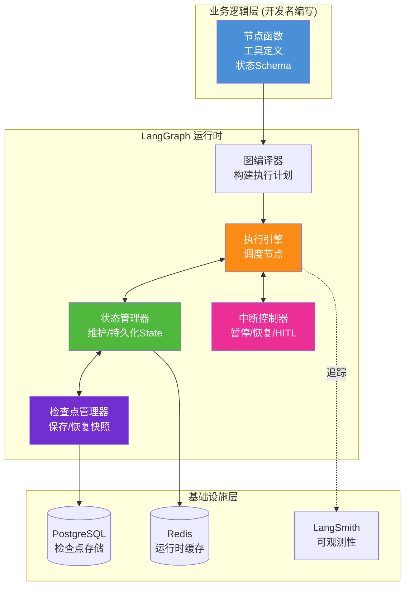

**与 86 号文档的呼应**:86 号文档详细解析了 Agent 的"思考-行动-观察"循环。LangGraph 正是这一循环的**生产级运行时实现**——它将 AgentExecutor 的黑盒循环,改造为可控、可持久化、可恢复的显式图执行。

### 6.2 角色二:状态编排器(State Orchestrator)

在 [47号文档](../3Agent%20架构设计/47长期运行Agent任务系统架构设计完整方案.md) 中我们讨论了长期运行任务的状态持久化需求。LangGraph 恰好提供了这一能力的框架级实现:

| 47号文档设计概念 | LangGraph 对应实现 |
|----------------|------------------|
| 任务状态机 | 图的节点流转 |
| 检查点(Checkpoint) | `Checkpointer` (Postgres/Sqlite/Memory) |
| 状态恢复 | `thread_id` + 检查点加载 |
| 任务暂停/恢复 | `interrupt_before` / `interrupt_after` |
| 子任务依赖 | 图的边与条件分支 |

### 6.3 角色三:多 Agent 协作框架

LangGraph 提供了多 Agent 协作的标准模式:

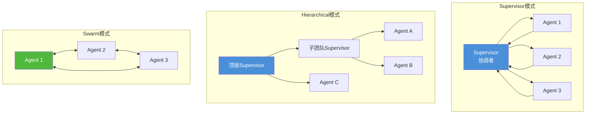

### 6.4 角色四:可观测性集成点

LangGraph 与 LangSmith 深度集成,提供端到端的可观测性:

```python
# LangGraph 自动将执行轨迹上报到 LangSmith
import os
os.environ["LANGCHAIN_TRACING_V2"] = "true"
os.environ["LANGCHAIN_API_KEY"] = "ls__xxx"

# 每次图执行都会记录:
# - 每个节点的输入/输出
# - 状态变更历史
# - LLM 调用详情(提示词、响应、Token消耗)
# - 工具调用详情
# - 执行时长与耗时分布
```

---

## 七、LangChain vs LangGraph:从对比看演进

### 7.1 全维度对比

| 维度 | LangChain | LangGraph |
|------|-----------|-----------|
| **定位** | 高层组件库 + 快速原型 | 低层编排运行时 + 生产部署 |
| **核心抽象** | Chain(链) / AgentExecutor | Graph(图) / State(状态) |
| **流程结构** | 线性、固定 | 图结构、动态、可循环 |
| **状态管理** | Memory(仅对话历史) | 统一 State Schema(任意数据) |
| **持久化** | 无内建 | Checkpointer(Postgres/Sqlite/Redis) |
| **崩溃恢复** | 不支持 | 从检查点自动恢复 |
| **人机协作** | 需 hack | `interrupt_before/after` 原生支持 |
| **多 Agent** | 无原生抽象 | 原生图编排(Supervisor/Swarm) |
| **并行执行** | 需手动 | 原生 fan-out/fan-in |
| **流式输出** | 部分支持 | 全链路流式(节点事件 + Token) |
| **时间旅行** | 不支持 | 回到任意检查点重放 |
| **学习曲线** | 低(易上手) | 中高(需理解图/状态概念) |
| **适用阶段** | 原型/MVP/简单应用 | 生产/复杂流程/长期任务 |

### 7.2 演进关系图

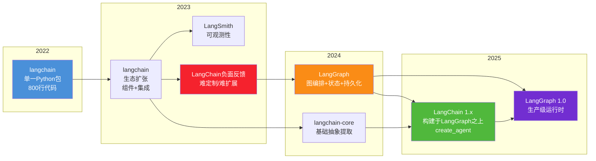

### 7.3 何时用哪个

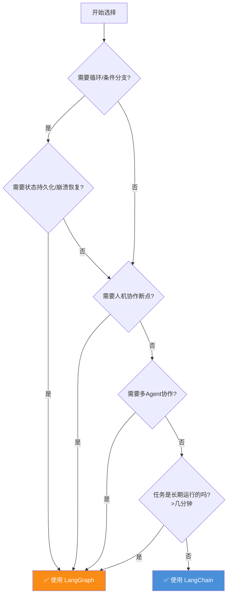

**简化决策原则**:
- **简单、线性、短时任务** → LangChain(快速上手)
- **复杂、状态化、长期运行、生产部署** → LangGraph(可靠可控)

---

## 八、典型场景:为什么需要 LangGraph

### 8.1 场景一:客服 Agent(需要人机协作)

**需求**:Agent 自动处理客户咨询,但涉及退款时需人工审核。

```python
# LangGraph 实现:在退款节点前暂停
graph.add_node("understand", understand_query)
graph.add_node("answer", answer_query)
graph.add_node("process_refund", process_refund)  # 敏感操作

graph.add_conditional_edges(
    "understand",
    lambda s: "process_refund" if s["intent"] == "refund" else "answer"
)

app = graph.compile(
    checkpointer=PostgresSaver(...),
    interrupt_before=["process_refund"]  # 退款前暂停!
)
```

**LangChain 的困难**:AgentExecutor 无法在特定步骤暂停,需要外部信号 hack。

### 8.2 场景二:研究 Agent(需要循环与状态)

**需求**:Agent 循环检索信息、分析、补充检索,直到信息充分。

```python
# LangGraph 实现:自然支持循环
graph.add_node("search", search_web)
graph.add_node("analyze", analyze_results)
graph.add_node("synthesis", write_report)

graph.add_edge("search", "analyze")
# 分析后判断信息是否充分,不充分则继续检索(循环!)
graph.add_conditional_edges(
    "analyze",
    lambda s: "search" if not s["info_sufficient"] else "synthesis"
)
graph.add_edge("synthesis", END)
```

**LangChain 的困难**:Chain 不支持循环,AgentExecutor 虽能循环但状态不透明、不可持久化。

### 8.3 场景三:批量文档处理(需要持久化)

**需求**:处理 1000 份文档,每份需多步 LLM 分析,整个过程耗时数小时。

```python
# LangGraph 实现:检查点保证进度不丢失
app = graph.compile(checkpointer=PostgresSaver(...))

for i, doc in enumerate(documents):
    config = {"configurable": {"thread_id": f"doc-{i}"}}
    app.invoke({"document": doc}, config=config)
    # 每个文档的进度都持久化
    # 即使进程崩溃,重启后用相同 thread_id 即可继续
```

**LangChain 的困难**:无检查点,崩溃后全部重来,浪费已消耗的 Token 费用。

### 8.4 场景四:多 Agent 协作(需要编排)

**需求**:研究 Agent 检索信息,写作 Agent 撰写报告,审核 Agent 把关质量。

```python
# LangGraph 实现:图结构自然表达协作
graph.add_node("researcher", research_agent)
graph.add_node("writer", writing_agent)
graph.add_node("reviewer", review_agent)

graph.add_edge("researcher", "writer")
graph.add_edge("writer", "reviewer")
# 审核不通过则回到写作环节修改
graph.add_conditional_edges(
    "reviewer",
    lambda s: "writer" if not s["approved"] else END
)
```

**LangChain 的困难**:无多 Agent 原生抽象,需自行实现协调逻辑。

---

## 九、LangGraph 的技术演进历程

### 9.1 关键时间线

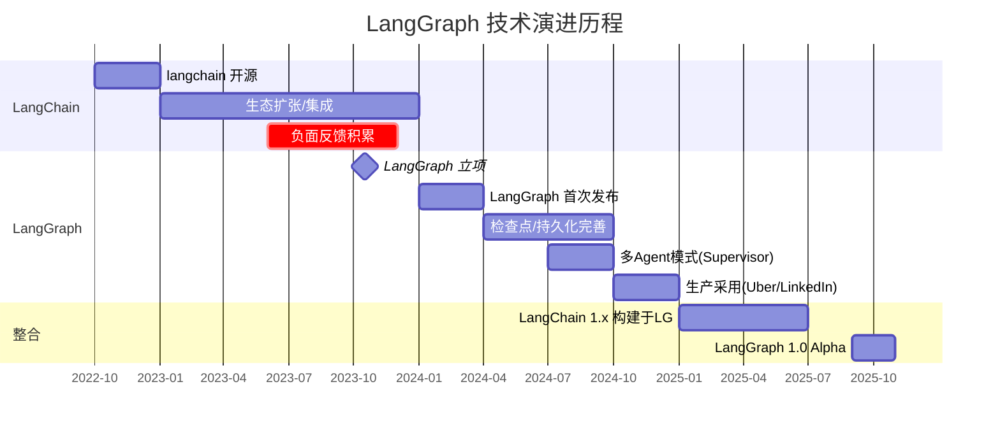

### 9.2 版本演进核心变化

| 版本阶段 | 核心变化 | 解决的问题 |
|---------|---------|-----------|
| **LangGraph 0.x(2024初)** | 图编排 + 基础状态管理 | 复杂流程表达 |
| **LangGraph 0.x(2024中)** | Checkpointer 持久化 | 崩溃恢复 |
| **LangGraph 0.x(2024末)** | HITL + 多Agent模式 | 人机协作/协作编排 |
| **LangChain 1.x(2025初)** | create_agent 构建于 LG | 高低层统一 |
| **LangGraph 1.0 Alpha(2025.9)** | 生产级运行时完善 | 性能/扩展性/可靠性 |

### 9.3 从社区反馈到产品决策

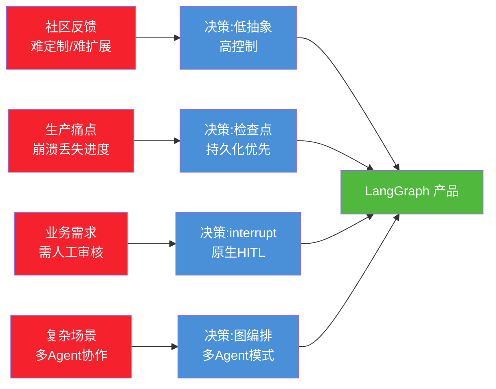

---

## 十、总结:LangGraph 出现的必然性

### 10.1 三重必然性

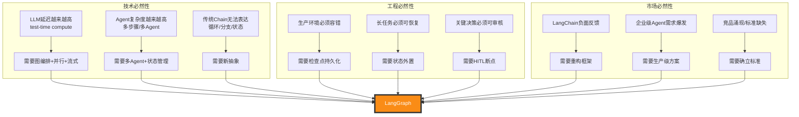

### 10.2 核心结论

**LangGraph 的出现是三重必然性的交汇:**

1. **技术必然性**:LLM 的延迟特性、Agent 的复杂流程需求,超出了线性 Chain 的表达能力。图结构是表达循环、分支、并行、状态流转的天然模型。

2. **工程必然性**:生产环境对可靠性、可恢复性、可审核性的硬性要求,迫使框架必须内建检查点、持久化和人机协作能力。这些无法通过"打补丁"方式加到 LangChain 上。

3. **市场必然性**:LangChain 社区的负面反馈、企业级 Agent 的爆发式需求,以及缺乏生产级 Agent 运行时标准的空白,共同驱动了 LangGraph 的诞生。

### 10.3 LangGraph 的历史定位

> **LangGraph 是 LangChain 团队对"如何构建生产级 Agent"这一问题的系统性回答。它不是 LangChain 的替代,而是其底层基础设施的重构与升级。**

```mermaid
flowchart LR
    subgraph "LangChain 贡献"
        LC1[组件化抽象<br/>标准化LLM开发]
    end
    
    subgraph "LangGraph 贡献"
        LG1[生产级运行时<br/>状态/持久化/控制]
    end
    
    subgraph "LangSmith 贡献"
        LS1[可观测性/评估<br/>质量保障]
    end
    
    LC1 --> EC[完整Agent工程栈]
    LG1 --> EC
    LS1 --> EC
    
    style LC1 fill:#4a90d9,color:#fff
    style LG1 fill:#fa8c16,color:#fff
    style LS1 fill:#50b83c,color:#fff
    style EC fill:#722ed1,color:#fff
```

三者共同构成了完整的 Agent 工程栈:
- **LangChain**:提供组件抽象(做什么)
- **LangGraph**:提供运行时控制(怎么做)
- **LangSmith**:提供可观测性(做得怎么样)

### 10.4 与本系列文档的关系

| 文档 | 回答的问题 | 核心主题 |
|------|----------|---------|
| [85号:LangChain核心组件](./85LangChain框架核心组件详解.md) | LangChain 提供了哪些组件? | 组件化抽象 |
| [86号:Agent运行机制](./86LangChain Agent运行机制深度解析.md) | Agent 内部如何运行? | 思考-行动-观察循环 |
| **本文:LangGraph诞生背景** | **为什么需要 LangGraph?** | **从原型到生产的演进** |

理解了 LangGraph 为什么出现,就理解了 Agent 框架从"原型工具"走向"生产基础设施"的完整演进逻辑。后续文档将深入 LangGraph 的具体技术实现与使用方法。

---

> **参考来源:**
> - [Building LangGraph: Designing an Agent Runtime from first principles](https://blog.langchain.com/building-langgraph/) — LangGraph 技术负责人 Nuno Campos 的设计阐述
> - [Reflections on Three Years of Building LangChain](https://blog.langchain.com/three-years-langchain/) — 创始人 Harrison Chase 的三年回顾
> - [LangChain vs LangGraph: Stop Using the Wrong One](https://webosmotic.com/blog/langgraph-vs-langchain/) — WebOsmotic 的对比分析
> - [LangGraph 官方文档](https://docs.langchain.com/oss/python/langgraph/overview) — 官方技术文档与 API 参考
> - [AI 开发新纪元:读懂 LangChain 与 LangGraph](https://blog.csdn.net/2401_86449430/article/details/161388246) — 中文社区深度分析
