# LangChain 与 LangGraph 核心区别系统性对比深度解析

> **文档定位**:本文档是 Agent Framework 系列的第四篇核心文档。在 [85LangChain框架核心组件详解.md](./85LangChain框架核心组件详解.md) 阐述组件体系、[86LangChain Agent运行机制深度解析.md](./86LangChain Agent运行机制深度解析.md) 解析运行机制、[87LangGraph框架诞生背景与核心定位深度解析.md](./87LangGraph框架诞生背景与核心定位深度解析.md) 分析演进动因的基础上,本文聚焦回答一个工程选型核心问题:**LangChain 和 LangGraph 到底有什么区别?该用哪个?** 从架构设计、核心功能、API 设计、性能特点、适用场景、社区支持、工具集成七大维度进行系统性对比,明确各自优势、局限与最佳应用场景。
>
> **阅读建议**:建议先阅读 85~87 号文档建立完整认知,再阅读本文进行选型决策。可结合 [42Agent工具选择决策机制深度解析.md](../3Agent%20架构设计/42Agent工具选择决策机制深度解析.md) 理解工具决策的通用方法论。

---

## 目录

- [一、核心结论:不是替代,而是分层](#一核心结论不是替代而是分层)
- [二、架构设计对比](#二架构设计对比)
- [三、核心功能对比](#三核心功能对比)
- [四、API 设计对比](#四api-设计对比)
- [五、性能特点对比](#五性能特点对比)
- [六、适用场景对比](#六适用场景对比)
- [七、社区支持与生态对比](#七社区支持与生态对比)
- [八、与其他工具集成能力对比](#八与其他工具集成能力对比)
- [九、优势与局限性总结](#九优势与局限性总结)
- [十、选型决策指南](#十选型决策指南)
- [十一、生产级组合架构](#十一生产级组合架构)
- [十二、总结](#十二总结)

---

## 一、核心结论:不是替代,而是分层

### 1.1 一句话定位

> **LangChain 是组件层框架(做什么),LangGraph 是状态化图运行时(怎么做)。二者不是竞争关系,而是同一技术栈的不同层次。**

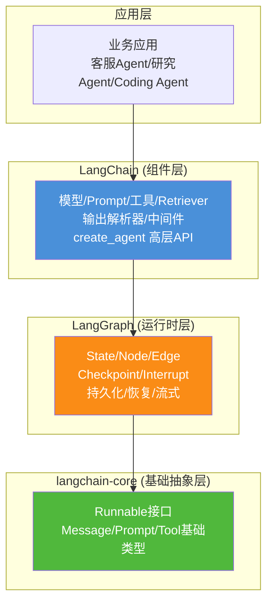

### 1.2 核心关系澄清

| 常见误解 | 正确理解 |
|---------|---------|
| LangGraph 是 LangChain 的升级版 | LangGraph 是 LangChain **之下**的运行时层 |
| 以后只用 LangGraph 不用 LangChain | 生产级 Agent 通常**二者组合使用** |
| LangChain 过时了要被淘汰 | LangChain 1.x 的 `create_agent` **构建于 LangGraph 之上** |
| 二者是竞争关系 | 二者是**互补的分层关系** |

### 1.3 核心差异速览

| 维度 | LangChain | LangGraph |
|------|-----------|-----------|
| **定位** | LLM 应用开发框架 | 状态化 Agent 运行时 |
| **核心抽象** | Chain(链) / LCEL 管道 | Graph(图) / State(状态) |
| **流程结构** | 线性 DAG(有向无环图) | 有向图(支持循环) |
| **状态管理** | 默认无状态 | 内建持久化状态 |
| **循环支持** | 有限(AgentExecutor) | 原生一等公民 |
| **人机协作** | 需手动实现 | `interrupt()` 原生支持 |
| **设计哲学** | 易用性优先 | 可控性/可靠性优先 |
| **学习曲线** | 低~中 | 中~高 |
| **发布状态** | v1.0(2025年10月) | v1.0 GA(2025年10月) |

---

## 二、架构设计对比

### 2.1 架构模型对比

#### LangChain:线性管道架构(DAG)

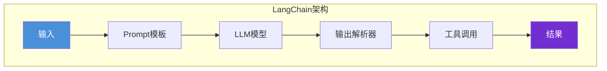

**特征**:
- 基于 **LCEL(LangChain Expression Language)** 的管道组合
- 使用 `|` 运算符串联组件:`prompt | model | parser`
- 本质是**有向无环图(DAG)**,数据单向流动
- 编译时确定执行路径,不支持循环

#### LangGraph:有向图架构(支持循环)

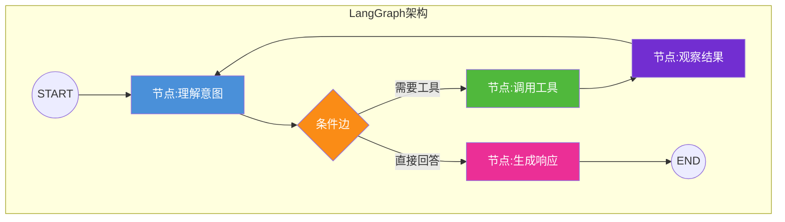

**特征**:
- 基于 **StateGraph** 的图结构编排
- 节点(Node)执行操作,边(Edge)控制流转
- 支持**循环**(ReAct 模式、重试、反思)
- 运行时动态决定执行路径

### 2.2 架构维度详细对比

| 架构维度 | LangChain | LangGraph |
|---------|-----------|-----------|
| **拓扑结构** | DAG(有向无环图) | 有向图(可含环) |
| **执行模型** | 线性管道,数据流式传递 | 图遍历,状态在节点间共享 |
| **路径决定** | 编译时固定 | 运行时由条件边动态决定 |
| **并行能力** | 需手动编排 | 原生 fan-out/fan-in |
| **组件粒度** | 粗粒度(Chain/Agent) | 细粒度(任意函数作为节点) |
| **控制流可见性** | 黑盒(AgentExecutor内部) | 白盒(显式定义每条边) |

### 2.3 状态管理架构对比

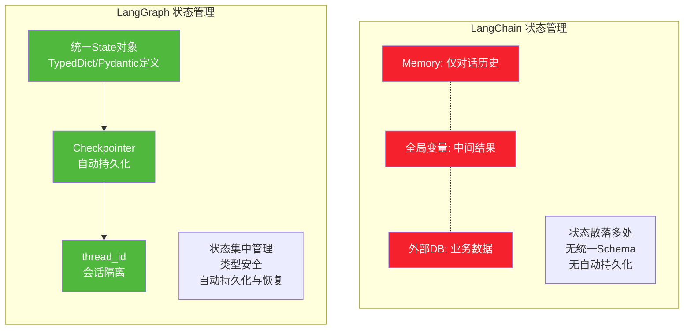

| 状态维度 | LangChain | LangGraph |
|---------|-----------|-----------|
| **状态定义** | 无统一Schema,散落各处 | `TypedDict`/`Pydantic` 显式定义 |
| **存储方式** | 进程内存(默认) | 外部存储(SQLite/Postgres/Redis) |
| **持久化** | 需手动实现 | `Checkpointer` 自动持久化 |
| **崩溃恢复** | 不支持 | 从检查点自动恢复 |
| **会话隔离** | 需手动管理 | `thread_id` 原生隔离 |
| **状态回滚** | 不支持 | 时间旅行(Time Travel) |
| **多Agent共享** | 困难 | 图状态天然共享 |

---

## 三、核心功能对比

### 3.1 功能矩阵全景

```mermaid
flowchart TB
    subgraph LangChain核心功能
        LC1[模型抽象<br/>统一LLM接口]
        LC2[Prompt管理<br/>模板/少样本]
        LC3[工具定义<br/>@tool装饰器]
        LC4[Retriever<br/>RAG检索]
        LC5[输出解析<br/>Pydantic/JSON]
        LC6[Memory<br/>对话历史]
        LC7[Chains/LCEL<br/>管道组合]
        LC8[create_agent<br/>高层Agent API]
        LC9[中间件<br/>摘要/限流等]
    end
    
    subgraph LangGraph核心功能
        LG1[StateGraph<br/>图编排]
        LG2[State管理<br/>统一状态]
        LG3[条件边<br/>动态路由]
        LG4[循环支持<br/>ReAct/反思]
        LG5[Checkpointer<br/>持久化]
        LG6[interrupt<br/>人机协作]
        LG7[流式输出<br/>节点事件+Token]
        LG8[子图<br/>多Agent协作]
        LG9[时间旅行<br/>状态回放]
    end
    
    style LC1 fill:#4a90d9,color:#fff
    style LC8 fill:#4a90d9,color:#fff
    style LG1 fill:#fa8c16,color:#fff
    style LG5 fill:#fa8c16,color:#fff
    style LG6 fill:#fa8c16,color:#fff
```

### 3.2 核心功能逐项对比

#### 功能一:流程控制

| 能力 | LangChain | LangGraph |
|------|-----------|-----------|
| 线性执行 | ✅ LCEL 管道 | ✅ 图的边 |
| 条件分支 | ⚠️ 需在代码中手动路由 | ✅ `add_conditional_edges` 原生 |
| 循环 | ⚠️ AgentExecutor 黑盒循环 | ✅ 显式循环,完全可控 |
| 并行执行 | ⚠️ 需手动编排 | ✅ fan-out/fan-in 原生 |
| 子流程封装 | ❌ 无原生抽象 | ✅ 子图(Subgraph) |
| 动态路由 | ⚠️ 有限 | ✅ 运行时决定下一节点 |

#### 功能二:状态与持久化

| 能力 | LangChain | LangGraph |
|------|-----------|-----------|
| 对话历史 | ✅ Memory 组件 | ✅ State 的 messages 字段 |
| 业务状态 | ❌ 无统一管理 | ✅ State Schema 自定义 |
| 检查点 | ❌ 无 | ✅ 多后端(Memory/SQLite/Postgres) |
| 崩溃恢复 | ❌ 不支持 | ✅ 从检查点自动恢复 |
| 状态回放 | ❌ 不支持 | ✅ 时间旅行 |
| 会话隔离 | ⚠️ 需手动 | ✅ thread_id |

#### 功能三:人机协作(HITL)

```python
# === LangChain: 需要手动 hack 实现 ===
# 没有原生断点,只能通过回调或外部信号
def manual_approval_handler(input):
    # 开发者自行实现暂停逻辑
    input["pending_approval"] = True
    # 需要外部存储标记、轮询机制...
    pass


# === LangGraph: 原生 interrupt 支持 ===
from langgraph.graph import StateGraph

graph = StateGraph(AgentState)
graph.add_node("draft", draft_content)
graph.add_node("publish", publish_content)  # 敏感操作

# 一行代码实现断点
app = graph.compile(
    checkpointer=PostgresSaver(...),
    interrupt_before=["publish"]  # 发布前暂停,等人工确认
)

# 第一次执行:到 publish 前自动暂停
result = app.invoke(input, config={"configurable": {"thread_id": "s1"}})
# 人工审核后继续
result = app.invoke(None, config={"configurable": {"thread_id": "s1"}})
```

| HITL 能力 | LangChain | LangGraph |
|-----------|-----------|-----------|
| 暂停/恢复 | ❌ 需 hack | ✅ `interrupt_before/after` |
| 动态中断 | ❌ | ✅ `interrupt()` 函数 |
| 状态保持 | ⚠️ 需外部存储 | ✅ Checkpointer 自动 |
| 审核后继续 | ⚠️ 需手动实现 | ✅ 传入 None 继续 |
| 多轮审批 | ❌ 困难 | ✅ 多断点 |

#### 功能四:多 Agent 协作

| 多Agent能力 | LangChain | LangGraph |
|------------|-----------|-----------|
| 预置模式 | ❌ 无 | ✅ Supervisor/Swarm/Hierarchical |
| Agent间通信 | ⚠️ 手动 | ✅ 共享 State |
| 任务分配 | ⚠️ 手动 | ✅ Supervisor 节点 |
| 结果汇总 | ⚠️ 手动 | ✅ fan-in 节点 |
| 协作可视化 | ❌ | ✅ 图结构天然可可视化 |

#### 功能五:流式输出

| 流式能力 | LangChain | LangGraph |
|---------|-----------|-----------|
| Token 流式 | ✅ `astream()` | ✅ `astream()` |
| 事件流式 | ⚠️ 有限 | ✅ `astream_events()` |
| 节点状态流 | ❌ | ✅ 每个节点状态变更 |
| 自定义事件 | ❌ | ✅ `adispatch_custom_event()` |
| 中间步骤流 | ⚠️ Callback | ✅ 原生支持 |

```python
# LangGraph 的全链路流式
async for event in app.astream_events(input, version="v2"):
    if event["event"] == "on_chat_model_stream":
        # LLM Token 流式
        print(event["data"]["chunk"].content, end="", flush=True)
    elif event["event"] == "on_chain_start":
        # 节点开始
        print(f"\n[节点开始] {event['name']}")
    elif event["event"] == "on_chain_end":
        # 节点结束
        print(f"\n[节点完成] {event['name']}")
```

---

## 四、API 设计对比

### 4.1 设计哲学差异

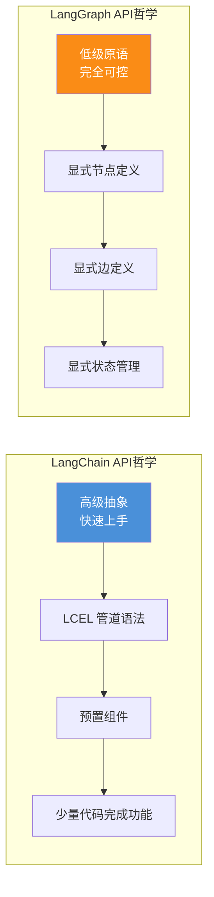

### 4.2 API 风格对比

#### LangChain:LCEL 管道风格

```python
from langchain_core.prompts import ChatPromptTemplate
from langchain_openai import ChatOpenAI
from langchain_core.output_parsers import StrOutputParser

# LCEL 管道:简洁、声明式
prompt = ChatPromptTemplate.from_template("翻译以下文本为英文: {text}")
model = ChatOpenAI(model="gpt-4")
parser = StrOutputParser()

# 一行组合管道
chain = prompt | model | parser

# 执行
result = chain.invoke({"text": "你好世界"})
```

**特点**:简洁、声明式、少量代码,但灵活性受限。

#### LangGraph:显式图定义风格

```python
from langgraph.graph import StateGraph, END
from typing import TypedDict, Annotated
from langgraph.graph.message import add_messages

# 1. 定义状态
class TranslationState(TypedDict):
    text: str
    translated: str
    quality_score: float
    needs_revision: bool

# 2. 定义节点函数
def translate(state: TranslationState) -> TranslationState:
    """翻译节点"""
    result = model.invoke(f"翻译: {state['text']}")
    return {"translated": result.content}

def evaluate(state: TranslationState) -> TranslationState:
    """质量评估节点"""
    score = evaluate_quality(state["translated"])
    return {"quality_score": score, "needs_revision": score < 0.8}

def revise(state: TranslationState) -> TranslationState:
    """修订节点"""
    revised = model.invoke(f"改进翻译: {state['translated']}")
    return {"translated": revised.content}

# 3. 构建图
graph = StateGraph(TranslationState)
graph.add_node("translate", translate)
graph.add_node("evaluate", evaluate)
graph.add_node("revise", revise)

graph.set_entry_point("translate")
graph.add_edge("translate", "evaluate")
# 条件边:质量不达标则修订(循环!)
graph.add_conditional_edges(
    "evaluate",
    lambda s: "revise" if s["needs_revision"] else END
)
graph.add_edge("revise", "evaluate")  # 修订后重新评估

app = graph.compile(checkpointer=PostgresSaver(...))
```

**特点**:显式、可控、支持循环,但代码量更多。

### 4.3 API 维度详细对比

| API 维度 | LangChain | LangGraph |
|---------|-----------|-----------|
| **组合方式** | `|` 管道运算符 | `add_node()` + `add_edge()` |
| **声明风格** | 声明式(LCEL) | 命令式(显式构建) |
| **代码量** | 少(3-5行可完成) | 多(需定义State/节点/边) |
| **类型安全** | 中(Runnable接口) | 高(TypedDict/Pydantic) |
| **可读性** | 高(管道直观) | 中(需理解图结构) |
| **可调试性** | 中(黑盒较多) | 高(白盒,每步可见) |
| **灵活性** | 中(受抽象约束) | 高(几乎无约束) |
| **学习成本** | 低 | 中高 |

### 4.4 高层 API 对比:create_agent

LangChain 1.x 的 `create_agent` 是构建于 LangGraph 之上的高层封装:

```python
# === LangChain 1.x: create_agent (高层,简洁) ===
from langchain.agents import create_agent
from langchain_openai import ChatOpenAI

agent = create_agent(
    model=ChatOpenAI(model="gpt-4"),
    tools=[search_tool, calculator_tool],
    system_prompt="你是一个有用的助手...",
    # 中间件:可选的增强能力
    middleware=[
        SummarizationMiddleware(),      # 自动摘要长对话
        HumanInTheLoopMiddleware(),      # 人机协作
        ModelCallLimitMiddleware(max_calls=20)  # 调用限制
    ]
)

# 直接使用,内部自动用 LangGraph 编排
result = agent.invoke({"messages": [{"role": "user", "content": "..."}]})
```

```python
# === LangGraph: 等价实现(底层,可控) ===
from langgraph.graph import StateGraph, END
from langgraph.prebuilt import create_react_agent

# 方式1:用预置的 ReAct Agent(与 create_agent 类似)
agent = create_react_agent(model, tools, state_modifier="...")

# 方式2:完全自定义图(最大灵活性)
graph = StateGraph(AgentState)
graph.add_node("agent", call_model)
graph.add_node("tools", call_tools)
graph.add_conditional_edges("agent", should_continue, {"tools": "tools", END: END})
graph.add_edge("tools", "agent")  # 循环
app = graph.compile(checkpointer=PostgresSaver(...))
```

| 对比点 | `create_agent` (LangChain) | 自定义图 (LangGraph) |
|--------|---------------------------|---------------------|
| 代码量 | 极少(5行) | 较多(20+行) |
| 灵活性 | 中(中间件扩展) | 高(完全自定义) |
| 适用场景 | 标准 Agent | 非标准流程 |
| 内部实现 | 基于 LangGraph | 直接用 LangGraph |

---

## 五、性能特点对比

### 5.1 基准测试数据

根据 2026 年的第三方基准测试 [[来源:AIMultiple RAG Frameworks Benchmark]](https://aimultiple.com/fr/rag-frameworks),在相同模型(GPT-4.1-mini)、相同检索器(Qdrant + BGE-small)、相同工具(Tavily)条件下:

| 指标 | LangChain | LangGraph | 差异分析 |
|------|-----------|-----------|---------|
| **框架开销** | ~10 ms | ~14 ms | LangGraph 多 ~4ms(状态管理/检查点) |
| **平均 Token 消耗** | ~2,400 | ~2,030 | LangGraph 更省 Token(~15%) |
| **准确率** | 100% | 100% | 相同(模型决定) |
| **主要耗时来源** | LLM API 调用 | LLM API 调用 | 框架开销占比 <1% |

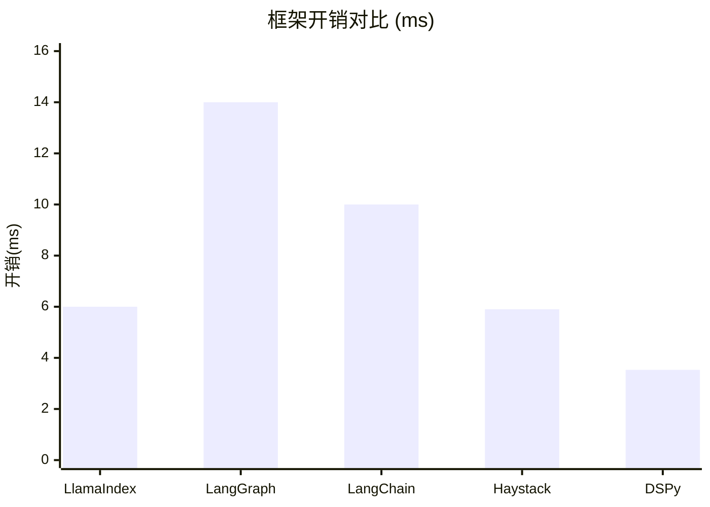

### 5.2 性能维度对比

| 性能维度 | LangChain | LangGraph |
|---------|-----------|-----------|
| **框架开销** | 较低(~10ms) | 略高(~14ms) |
| **Token 效率** | 较低(更多格式化开销) | 较高(状态管理更精简) |
| **启动速度** | 快(少初始化) | 略慢(需初始化检查点等) |
| **内存占用** | 低(无状态) | 较高(维护状态+检查点) |
| **并发能力** | 中(受 GIL/异步限制) | 高(原生异步+并行节点) |
| **长任务表现** | 差(无持久化) | 优(检查点恢复) |
| **吞吐量** | 中 | 高(并行+流式) |

### 5.3 性能特征深度分析

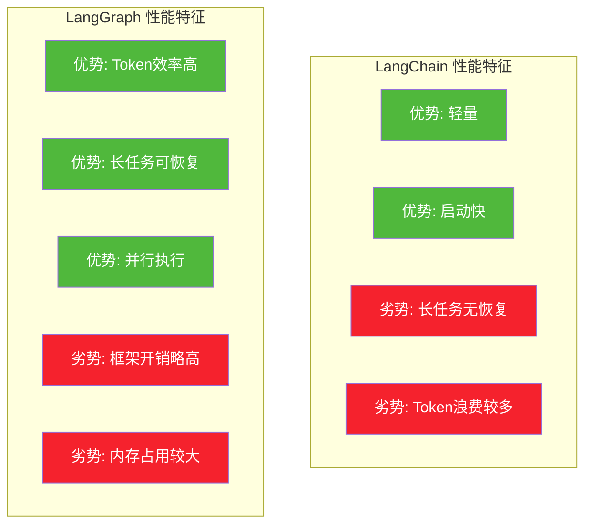

**关键发现**:
1. **框架开销可忽略**:~14ms 相比 LLM 调用的秒级延迟,占比 <1%
2. **Token 效率差异显著**:LangGraph 状态管理更精简,节省约 15% Token
3. **长任务场景差距巨大**:LangChain 崩溃后全量重跑,LangGraph 秒级恢复

### 5.4 不同负载下的表现

| 负载场景 | LangChain 表现 | LangGraph 表现 | 推荐 |
|---------|---------------|---------------|------|
| 单次短请求 | ⭐⭐⭐⭐⭐ 极快 | ⭐⭐⭐⭐ 快 | LangChain |
| 高并发短请求 | ⭐⭐⭐⭐ 好 | ⭐⭐⭐⭐ 好 | 均可 |
| 长时间任务(分钟级) | ⭐⭐ 差(无恢复) | ⭐⭐⭐⭐⭐ 优 | LangGraph |
| 复杂多步流程 | ⭐⭐ 差(面条代码) | ⭐⭐⭐⭐⭐ 优 | LangGraph |
| 多 Agent 协作 | ⭐⭐ 差 | ⭐⭐⭐⭐⭐ 优 | LangGraph |

---

## 六、适用场景对比

### 6.1 场景适配矩阵

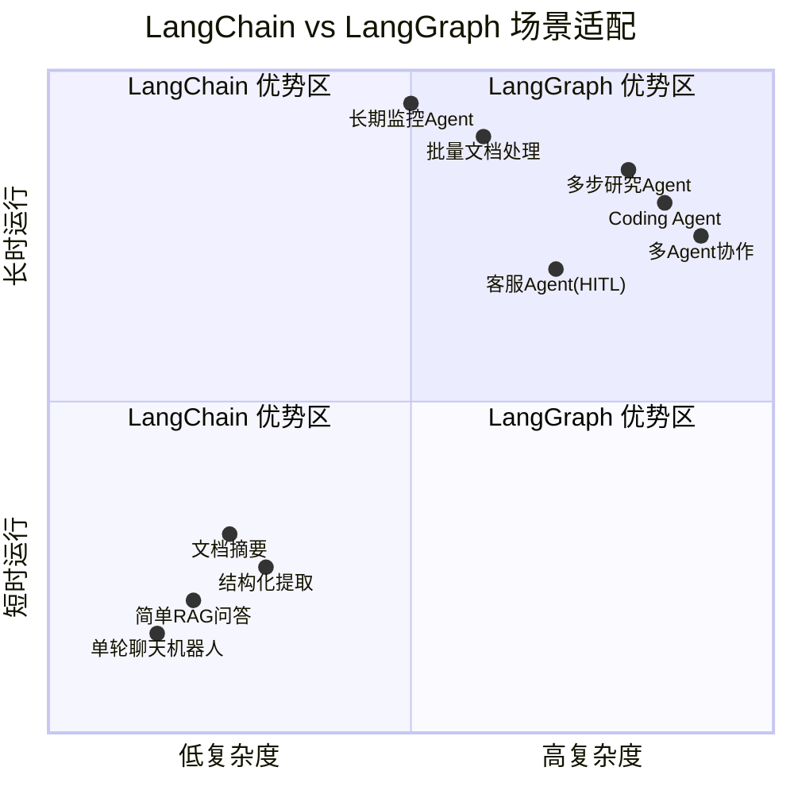

### 6.2 LangChain 最适合的场景

#### 场景一:标准 RAG 问答系统

```python
# LangChain 的 LCEL 让 RAG 极其简洁
from langchain_core.prompts import ChatPromptTemplate
from langchain_openai import ChatOpenAI
from langchain_core.output_parsers import StrOutputParser
from langchain_community.retrievers import QdrantRetriever

# 5 行代码完成 RAG
retriever = QdrantRetriever(...)
prompt = ChatPromptTemplate.from_template("基于以下内容回答: {context}\n问题: {question}")
model = ChatOpenAI(model="gpt-4")

rag_chain = (
    {"context": retriever, "question": lambda x: x["question"]}
    | prompt
    | model
    | StrOutputParser()
)

result = rag_chain.invoke({"question": "什么是Transformer?"})
```

**为什么选 LangChain**:线性流程、无循环、无需持久化,LCEL 管道最简洁。

#### 场景二:单轮聊天机器人

**为什么选 LangChain**:单轮对话、无复杂状态、快速原型。

#### 场景三:结构化信息提取

```python
from langchain_core.pydantic_v1 import BaseModel
from langchain_core.prompts import ChatPromptTemplate
from langchain_openai import ChatOpenAI

class PersonInfo(BaseModel):
    name: str
    age: int
    email: str

# LCEL 提取管道
chain = prompt | model.with_structured_output(PersonInfo)
result = chain.invoke({"text": "张三,25岁,邮箱zhangsan@example.com"})
```

**为什么选 LangChain**:单步提取、无需循环、输出结构化。

### 6.3 LangGraph 最适合的场景

#### 场景一:多步研究 Agent(需要循环)

```python
# Agent 需要循环检索直到信息充分
graph = StateGraph(ResearchState)
graph.add_node("search", search_web)
graph.add_node("evaluate", check_info_sufficient)
graph.add_node("synthesize", write_report)

graph.add_edge("search", "evaluate")
# 信息不足则继续搜索(循环!)
graph.add_conditional_edges(
    "evaluate",
    lambda s: "search" if not s["sufficient"] else "synthesize"
)
```

**为什么选 LangGraph**:需要循环检索、条件判断、状态累积。

#### 场景二:客服 Agent(需要人机协作)

```python
# 涉及退款等敏感操作需人工审核
app = graph.compile(
    checkpointer=PostgresSaver(...),
    interrupt_before=["process_refund"]  # 退款前暂停
)
```

**为什么选 LangGraph**:原生 HITL 支持、状态持久化。

#### 场景三:多 Agent 协作系统

```python
# 研究→写作→审核的协作流程
graph.add_node("researcher", research_agent)
graph.add_node("writer", writing_agent)
graph.add_node("reviewer", review_agent)

# 审核不通过则回到写作修改(循环)
graph.add_conditional_edges(
    "reviewer",
    lambda s: "writer" if not s["approved"] else END
)
```

**为什么选 LangGraph**:多 Agent 编排、循环修改、共享状态。

#### 场景四:长期运行任务(需要容错)

```python
# 处理 1000 份文档,耗时数小时
app = graph.compile(checkpointer=PostgresSaver(...))

for doc in documents:
    config = {"configurable": {"thread_id": f"doc-{doc.id}"}}
    app.invoke({"document": doc}, config=config)
    # 崩溃后用相同 thread_id 即可恢复
```

**为什么选 LangGraph**:检查点持久化、崩溃恢复。详见 [47号文档](../3Agent%20架构设计/47长期运行Agent任务系统架构设计完整方案.md)。

### 6.4 场景选择决策表

| 场景特征 | 推荐框架 | 理由 |
|---------|---------|------|
| 线性流程,无循环 | LangChain | LCEL 管道最简洁 |
| 需要循环(ReAct/反思) | LangGraph | 原生循环支持 |
| 短时任务(<5分钟) | LangChain | 无需持久化开销 |
| 长时任务(>5分钟) | LangGraph | 需要检查点恢复 |
| 单 Agent | LangChain | create_agent 足够 |
| 多 Agent 协作 | LangGraph | 原生多 Agent 模式 |
| 无需人工审核 | LangChain | 简单直接 |
| 需要人工审核断点 | LangGraph | interrupt 原生支持 |
| 快速原型/MVP | LangChain | 上手快 |
| 生产级部署 | LangGraph | 可靠性/可控性 |

---

## 七、社区支持与生态对比

### 7.1 社区数据对比

| 维度 | LangChain | LangGraph |
|------|-----------|-----------|
| **GitHub Stars** | ~100k+ | ~12k+ |
| **PyPI 月下载量** | ~30M+ | ~3M+ |
| **贡献者数量** | ~2500+ | ~300+ |
| **文档完善度** | ⭐⭐⭐⭐⭐ 极丰富 | ⭐⭐⭐⭐ 较完善 |
| **教程/课程数量** | 极多 | 中等(增长快) |
| **企业采用案例** | Uber/LinkedIn/Klarna | Uber/LinkedIn/Klarna |
| **社区活跃度** | 极高 | 高(快速增长) |

### 7.2 生态定位差异

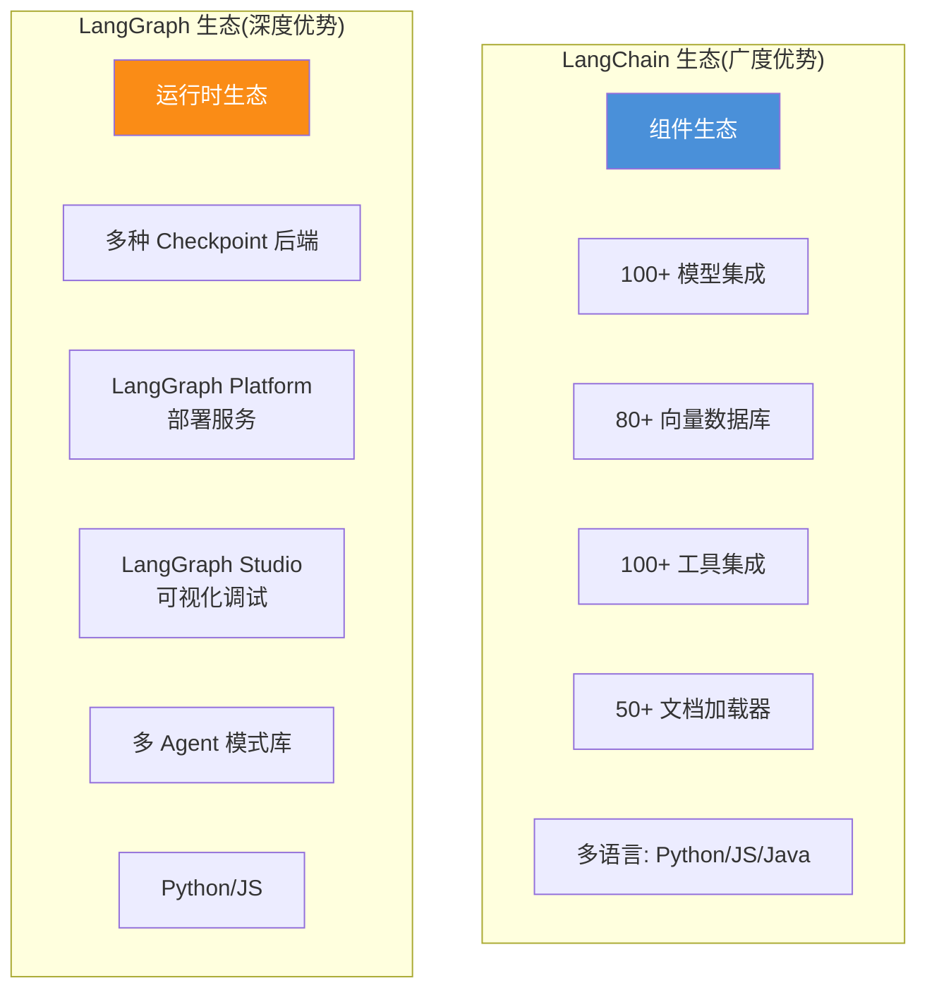

### 7.3 文档与学习资源

| 资源类型 | LangChain | LangGraph |
|---------|-----------|-----------|
| 官方文档 | 极丰富,覆盖所有组件 | 专注图编排,持续完善 |
| 入门教程 | 海量(社区+官方) | 中等,增长迅速 |
| 示例代码 | 1000+ examples | 100+ examples |
| 视频课程 | 极多 | 中等 |
| Stack Overflow | 大量问答 | 增长中 |
| Discord 社区 | 活跃 | 活跃 |

### 7.4 版本成熟度

| 指标 | LangChain | LangGraph |
|------|-----------|-----------|
| **首次发布** | 2022年10月 | 2024年1月 |
| **当前版本** | v1.0(2025年10月) | v1.0 GA(2025年10月) |
| **API 稳定性** | v1.0 后稳定 | v1.0 后稳定 |
| **Breaking Changes** | v1.0 前较多 | 较少 |
| **生产就绪度** | ✅ 成熟 | ✅ v1.0 后生产就绪 |

---

## 八、与其他工具集成能力对比

### 8.1 集成能力总览

```mermaid
flowchart TB
    subgraph 框架
        LC[LangChain]
        LG[LangGraph]
    end
    
    subgraph 模型集成
        M1[OpenAI]
        M2[Anthropic]
        M3[Google Gemini]
        M4[开源模型<br/>Llama/Qwen/Mistral]
    end
    
    subgraph 向量数据库
        V1[Pinecone]
        V2[Qdrant]
        V3[Weaviate]
        V4[Milvus]
        V5[Chroma]
    end
    
    subgraph 工具集成
        T1[Tavily搜索]
        T2[Wikipedia]
        T3[SQL数据库]
        T4[Shell命令]
        T5[自定义API]
    end
    
    subgraph 可观测性
        O1[LangSmith]
        O2[Langfuse]
        O3[Phoenix]
    end
    
    subgraph 部署
        D1[LangServe]
        D2[LangGraph Platform]
        D3[Vercel]
        D4[Docker/K8s]
    end
    
    LC --> M1 & M2 & M3 & M4
    LC --> V1 & V2 & V3 & V4 & V5
    LC --> T1 & T2 & T3 & T4 & T5
    LC --> O1
    LC --> D1 & D3 & D4
    
    LG --> M1 & M2 & M3 & M4
    LG --> O1
    LG --> D2 & D4
    
    style LC fill:#4a90d9,color:#fff
    style LG fill:#fa8c16,color:#fff
```

### 8.2 集成能力详细对比

| 集成类型 | LangChain | LangGraph | 说明 |
|---------|-----------|-----------|------|
| **LLM 模型** | ⭐⭐⭐⭐⭐ | ⭐⭐⭐⭐ | LangChain 组件更多;LangGraph 通过 LangChain 组件使用 |
| **向量数据库** | ⭐⭐⭐⭐⭐ | ⭐⭐⭐ | LangChain 原生集成 80+;LangGraph 需通过 Retriever |
| **工具/API** | ⭐⭐⭐⭐⭐ | ⭐⭐⭐⭐ | LangChain @tool 装饰器;LangGraph 兼容 |
| **可观测性** | ⭐⭐⭐⭐ | ⭐⭐⭐⭐⭐ | 二者都支持 LangSmith;LangGraph 追踪更丰富 |
| **部署平台** | ⭐⭐⭐ | ⭐⭐⭐⭐⭐ | LangGraph Platform 专为长任务设计 |
| **可视化调试** | ⭐⭐ | ⭐⭐⭐⭐⭐ | LangGraph Studio 图结构可视化 |
| **Checkpoint 后端** | ❌ | ⭐⭐⭐⭐⭐ | LangGraph 独有:Memory/SQLite/Postgres |

### 8.3 关键集成差异

#### LangSmith 可观测性

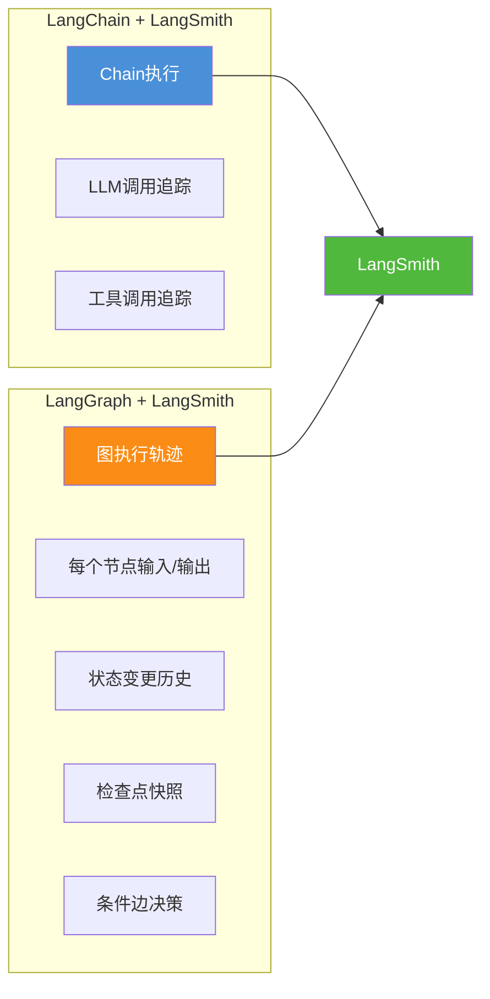

**差异**:LangGraph 的追踪信息更丰富,包含图结构、状态变更、检查点等 LangChain 没有的维度。

#### 部署方式

| 部署方式 | LangChain | LangGraph |
|---------|-----------|-----------|
| **LangServe** | ✅ REST API 部署 | ❌ |
| **LangGraph Platform** | ❌ | ✅ 托管运行时(含持久化、扩缩容) |
| **Vercel** | ✅ | ⚠️ 通过 LangChain 组件 |
| **Docker/K8s** | ✅ 自部署 | ✅ 自部署 |
| **Serverless** | ✅ 适合 | ❌ 不适合(长任务) |

**关键差异**:LangGraph Platform 专为长任务设计,提供托管检查点、自动扩缩容、状态恢复等生产级能力。

---

## 九、优势与局限性总结

### 9.1 LangChain 优势与局限

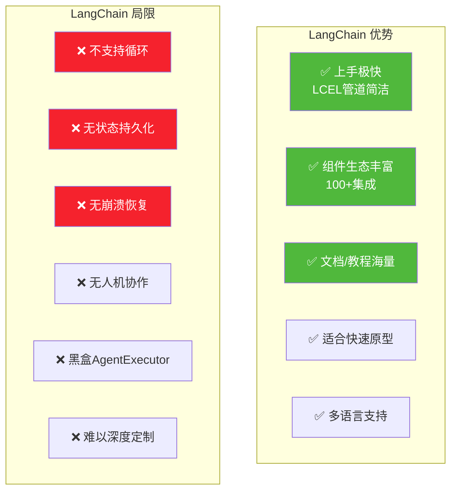

### 9.2 LangGraph 优势与局限

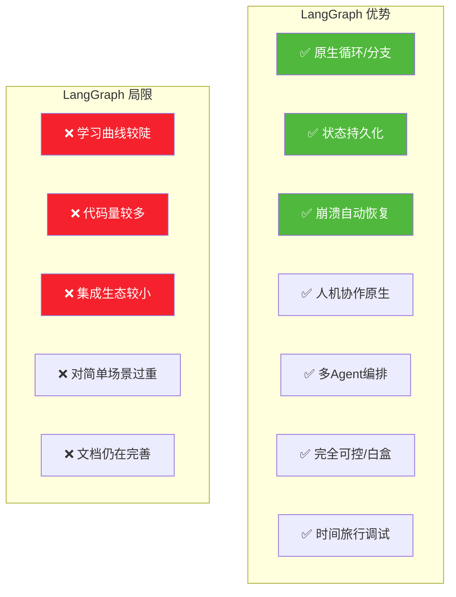

### 9.3 优势局限对照表

| 维度 | LangChain | LangGraph |
|------|-----------|-----------|
| **最大优势** | 易用性/生态丰富 | 可控性/可靠性 |
| **最大局限** | 难以生产级编排 | 学习成本高 |
| **适合人群** | 初学者/快速原型 | 工程团队/生产部署 |
| **代码风格** | 声明式管道 | 显式图定义 |
| **成熟度** | 高(3年迭代) | 中高(v1.0 GA) |
| **社区规模** | 极大 | 中等(快速增长) |

---

## 十、选型决策指南

### 10.1 决策流程图

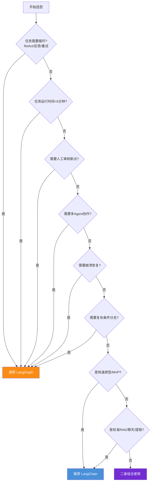

### 10.2 选型检查清单

#### 选 LangChain 的信号(满足任意一条)

- [ ] 流程是线性的,无循环
- [ ] 任务在 5 分钟内完成
- [ ] 不需要人工审核断点
- [ ] 单个 Agent 即可完成
- [ ] 不需要崩溃恢复
- [ ] 快速原型/MVP
- [ ] 标准 RAG 问答
- [ ] 单轮聊天机器人
- [ ] 结构化信息提取

#### 选 LangGraph 的信号(满足任意一条)

- [ ] 需要 ReAct 循环(思考-行动-观察)
- [ ] 任务运行超过 5 分钟
- [ ] 需要人工审核断点
- [ ] 多个 Agent 协作
- [ ] 需要崩溃恢复/检查点
- [ ] 复杂条件分支流程
- [ ] 长期运行任务(小时/天级)
- [ ] Coding Agent(写代码→测试→修复循环)
- [ ] 生产级部署,要求高可靠性

### 10.3 反模式:什么时候都不该用

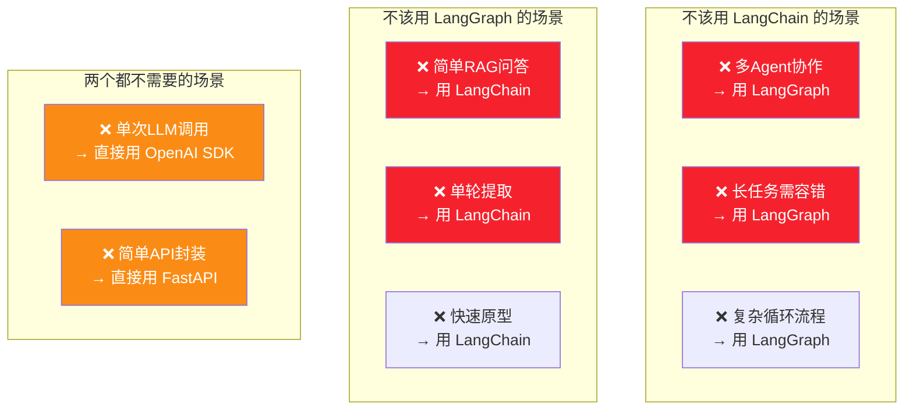

---

## 十一、生产级组合架构

### 11.1 最佳实践:二者组合使用

生产级 Agent 系统的最佳实践是**组合使用**:LangChain 提供组件,LangGraph 提供运行时。

```mermaid
flowchart TB
    subgraph "LangChain 组件层"
        LC1[ChatOpenAI 模型]
        LC2[@tool 工具定义]
        LC3[QdrantRetriever 检索器]
        LC4[Pydantic 输出解析]
    end
    
    subgraph "LangGraph 运行时层"
        LG1[节点:使用LC组件]
        LG2[边:控制流转]
        LG3[State:统一状态]
        LG4[Checkpointer:持久化]
        LG5[interrupt:HITL]
    end
    
    subgraph "LangSmith 可观测层"
        LS1[执行追踪]
        LS2[状态快照]
        LS3[性能分析]
    end
    
    LC1 --> LG1
    LC2 --> LG1
    LC3 --> LG1
    LC4 --> LG1
    
    LG1 --> LS1
    LG3 --> LS2
    LG4 --> LS3
    
    style LC1 fill:#4a90d9,color:#fff
    style LG1 fill:#fa8c16,color:#fff
    style LS1 fill:#50b83c,color:#fff
```

### 11.2 组合使用代码示例

```python
from langchain_openai import ChatOpenAI
from langchain_core.tools import tool
from langchain_community.retrievers import QdrantRetriever
from langgraph.graph import StateGraph, END
from langgraph.checkpoint.postgres import PostgresSaver
from typing import TypedDict, Annotated
from langgraph.graph.message import add_messages

# === LangChain 层:提供组件 ===
model = ChatOpenAI(model="gpt-4")

@tool
def search_web(query: str) -> str:
    """搜索网页"""
    return tavily_client.search(query)

retriever = QdrantRetriever(...)

# === LangGraph 层:提供运行时 ===
class AgentState(TypedDict):
    messages: Annotated[list, add_messages]
    retrieved_docs: list
    needs_human_review: bool

def agent_node(state: AgentState):
    # 使用 LangChain 的模型组件
    response = model.invoke(state["messages"])
    return {"messages": [response]}

def retrieve_node(state: AgentState):
    # 使用 LangChain 的检索器组件
    docs = retriever.invoke(state["messages"][-1].content)
    return {"retrieved_docs": docs}

def review_node(state: AgentState):
    # 使用 LangChain 的工具
    result = search_web.invoke({"query": "latest info"})
    return {"messages": [HumanMessage(content=result)]}

# 构建图
graph = StateGraph(AgentState)
graph.add_node("agent", agent_node)
graph.add_node("retrieve", retrieve_node)
graph.add_node("review", review_node)

graph.set_entry_point("retrieve")
graph.add_edge("retrieve", "agent")
graph.add_conditional_edges(
    "agent",
    lambda s: "review" if s["needs_human_review"] else END
)
graph.add_edge("review", "agent")  # 循环

# 编译:注入检查点持久化
app = graph.compile(
    checkpointer=PostgresSaver(conn_string="..."),
    interrupt_before=["review"]  # 人工审核断点
)
```

### 11.3 组合架构的优势

| 优势 | 说明 |
|------|------|
| **组件复用** | LangChain 的模型/工具/检索器直接在 LangGraph 节点中使用 |
| **运行时可靠** | LangGraph 提供持久化、恢复、HITL |
| **可观测性** | LangSmith 自动追踪全链路 |
| **渐进式** | 可先用 LangChain 原型,再逐步引入 LangGraph |

---

## 十二、总结

### 12.1 七维度对比总结

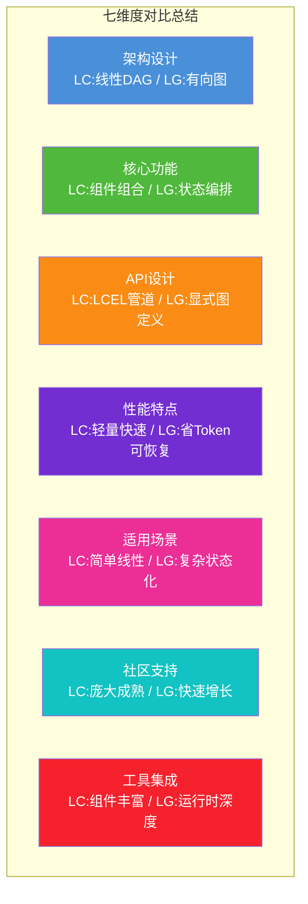

### 12.2 核心结论

| 结论 | 说明 |
|------|------|
| **不是替代关系** | LangChain 是组件层,LangGraph 是运行时层 |
| **生产级需组合** | LangChain 组件 + LangGraph 运行时 + LangSmith 可观测 |
| **简单用 LangChain** | 线性、短时、无状态 → LangChain 足够 |
| **复杂用 LangGraph** | 循环、长时、状态化、HITL → 必须 LangGraph |
| **性能差异可忽略** | 框架开销 <1%,LLM 调用是主要瓶颈 |
| **Token 效率有差异** | LangGraph 状态管理更精简,节省 ~15% Token |

### 12.3 一句话选型建议

> **"能用 LangChain 解决的,不要上 LangGraph;但一旦需要循环、状态或人工介入,LangGraph 是唯一可靠的选择。"**

### 12.4 与系列文档的关系

| 文档 | 回答的问题 | 核心主题 |
|------|----------|---------|
| [85号:LangChain核心组件](./85LangChain框架核心组件详解.md) | LangChain 提供了哪些组件? | 组件化抽象 |
| [86号:Agent运行机制](./86LangChain Agent运行机制深度解析.md) | Agent 内部如何运行? | 思考-行动-观察循环 |
| [87号:LangGraph诞生背景](./87LangGraph框架诞生背景与核心定位深度解析.md) | 为什么需要 LangGraph? | 从原型到生产的演进 |
| **本文:核心区别对比** | **该用 LangChain 还是 LangGraph?** | **系统性选型决策** |

---

> **参考来源:**
> - [LangChain vs LangGraph: Stop Using the Wrong One](https://webosmotic.com/blog/langgraph-vs-langchain/) — WebOsmotic 对比分析
> - [LangChain vs. LangGraph: Key differences](https://vercel.com/i/langchain-vs-langgraph) — Vercel 部署视角对比
> - [LangGraph vs LangChain (2026): When to Use Which](https://www.ayautomate.com/blog/langgraph-vs-langchain) — AY Automate 选型指南
> - [RAG Frameworks Benchmark](https://aimultiple.com/fr/rag-frameworks) — AIMultiple 性能基准测试
> - [LangChain 和 LangGraph 的区别](https://blog.csdn.net/w776341482/article/details/162151774) — CSDN 中文深度分析
> - [LangChain vs LangGraph: Which Wins in 2026?](https://www.folio3.ai/blog/langchain-vs-langgraph-ai-agent-framework/) — Folio3 场景对比
> - [Building LangGraph](https://blog.langchain.com/building-langgraph/) — LangGraph 官方设计博客
> - [LangGraph 1.0 GA 公告](https://changelog.langchain.com/announcements/langgraph-1-0-is-now-generally-available) — 官方版本公告
