# AutoGen 框架架构深度解析

> 文档定位:系统阐述微软 AutoGen 框架的完整架构,涵盖核心组件、模块划分、组件交互机制、数据流处理流程、关键技术实现、主要类与接口定义、设计优势与潜在局限性,为基于 AutoGen 构建多 Agent 协作系统提供架构级指导。
>
> 阅读建议:本文是 Agent Framework 系列的重要组成,建议结合 [85LangChain框架核心组件详解.md](./85LangChain框架核心组件详解.md)、[86LangChain Agent运行机制深度解析.md](./86LangChain%20Agent运行机制深度解析.md)、[87LangGraph框架诞生背景与核心定位深度解析.md](./87LangGraph框架诞生背景与核心定位深度解析.md)、[88LangChain与LangGraph核心区别系统性对比深度解析.md](./88LangChain与LangGraph核心区别系统性对比深度解析.md) 一并阅读,理解不同框架的设计哲学与适用场景。

---

## 目录

- [一、AutoGen 框架概述](#一autogen-框架概述)
- [二、核心组件与模块划分](#二核心组件与模块划分)
- [三、架构图与组件交互机制](#三架构图与组件交互机制)
- [四、数据流处理流程](#四数据流处理流程)
- [五、主要类与接口定义](#五主要类与接口定义)
- [六、核心功能实现方式](#六核心功能实现方式)
- [七、关键技术实现](#七关键技术实现)
- [八、设计优势](#八设计优势)
- [九、潜在局限性](#九潜在局限性)
- [十、与 LangChain/LangGraph 对比及总结](#十与-langchainlanggraph-对比及总结)

---

## 一、AutoGen 框架概述

### 1.1 框架背景与定位

**AutoGen** 是微软研究院(Microsoft Research)开源的多 Agent 对话框架,于 2023 年发布,核心定位是**通过可定制的对话式 Agent 构建复杂 LLM 工作流**。

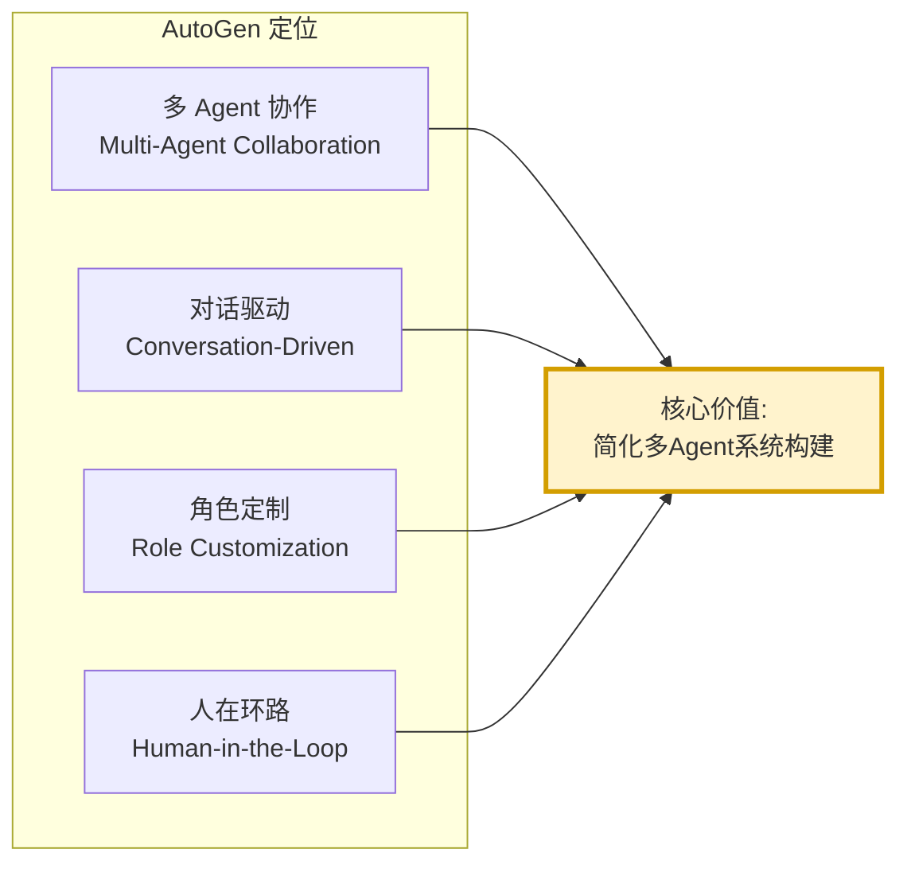

### 1.2 核心设计哲学

AutoGen 的设计哲学可以概括为四个关键词:

| 关键词 | 含义 | 实现体现 |
|-------|------|---------|
| **Conversable** | 可对话的 | 所有 Agent 都通过消息对话协作 |
| **Customizable** | 可定制的 | Agent 角色、行为、能力完全可配置 |
| **Composable** | 可组合的 | 多个 Agent 可灵活组合成复杂工作流 |
| **Collaborative** | 协作的 | Agent 间可自主协作,无需人工编排 |

### 1.3 与其他框架的本质区别

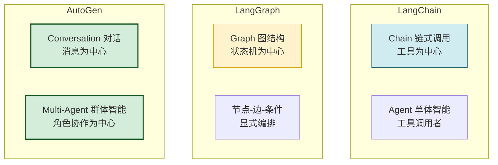

**核心差异**:
- LangChain 关注**工具链编排**,以 Chain 为核心。
- LangGraph 关注**状态图编排**,以 Graph 为核心。
- AutoGen 关注**多 Agent 对话**,以 Conversation 为核心。

---

## 二、核心组件与模块划分

### 2.1 架构分层

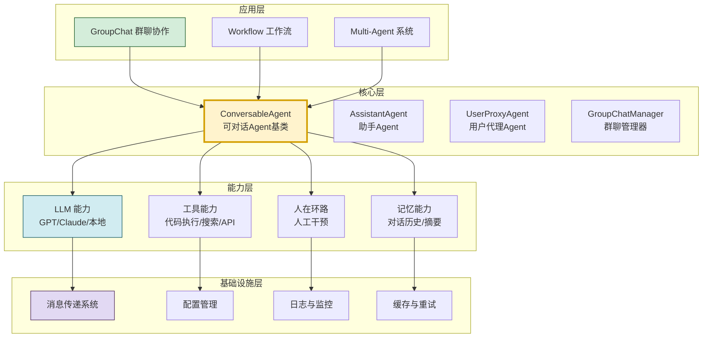

### 2.2 核心组件清单

#### 2.2.1 三大核心 Agent

| 组件 | 类名 | 职责 | 典型场景 |
|-----|------|------|---------|
| **可对话Agent** | `ConversableAgent` | 所有 Agent 的基类,支持对话、工具调用、人在环路 | 自定义角色 Agent |
| **助手Agent** | `AssistantAgent` | LLM 驱动的智能助手,默认行为是解决问题 | 代码生成、问答、分析 |
| **用户代理Agent** | `UserProxyAgent` | 代理人类用户,可执行代码、调用工具、请求人类输入 | 代码执行、人工确认 |

#### 2.2.2 协作管理组件

| 组件 | 类名 | 职责 |
|-----|------|------|
| **群聊管理器** | `GroupChatManager` | 管理多 Agent 群聊,决定发言顺序 |
| **群聊** | `GroupChat` | 群聊配置,定义参与者与发言策略 |
| **发言选择器** | `SpeakerSelection` | 决定下一个发言者的策略 |

#### 2.2.3 能力扩展组件

| 组件 | 职责 |
|-----|------|
| **LLM 配置** | `llm_config`,定义模型、温度、API 等 |
| **工具注册器** | `register_function`,注册可调用工具 |
| **代码执行器** | `CodeExecutor`,本地/Docker 代码执行 |
| **终止条件** | `Termination`,定义对话终止规则 |

### 2.3 模块划分详解

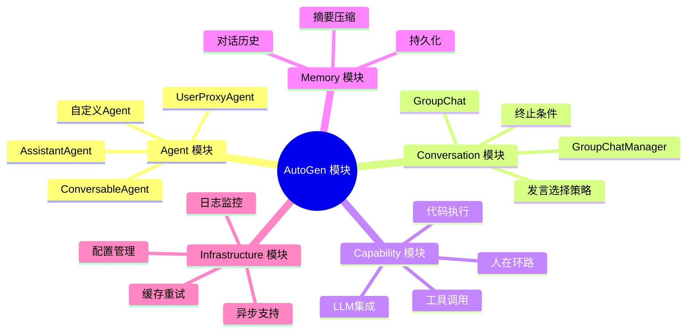

---

## 三、架构图与组件交互机制

### 3.1 整体架构图

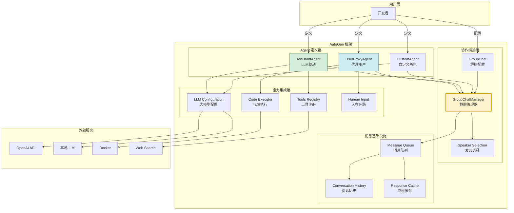

### 3.2 组件交互机制

#### 3.2.1 Agent 间消息传递机制

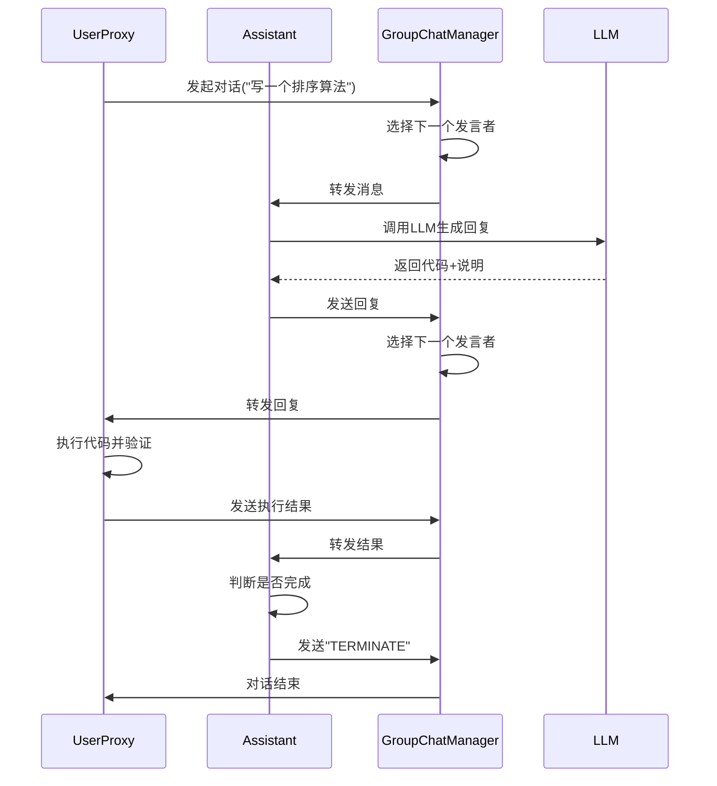

#### 3.2.2 三种核心交互模式

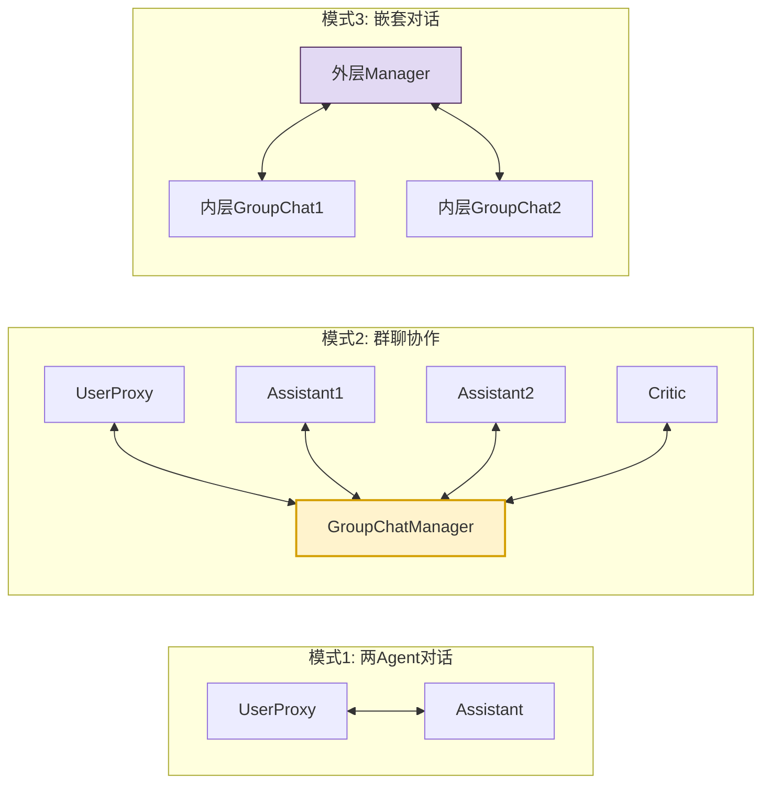

#### 3.2.3 发言选择策略

```python
class SpeakerSelectionStrategies:
    """发言选择策略"""
    
    # 策略1: 轮询(按顺序)
    @staticmethod
    def round_robin(last_speaker, groupchat):
        """轮流发言"""
        agents = groupchat.agents
        idx = agents.index(last_speaker)
        return agents[(idx + 1) % len(agents)]
    
    # 策略2: 自动(LLM决定)
    @staticmethod
    def auto(last_speaker, groupchat):
        """LLM 决定下一个发言者"""
        # 将对话历史与Agent列表交给LLM
        # LLM 返回下一个发言者名称
        pass
    
    # 策略3: 指定(手动)
    @staticmethod
    def manual(last_speaker, groupchat, next_speaker_name):
        """手动指定"""
        return next_speaker_name
    
    # 策略4: 随机
    @staticmethod
    def random(last_speaker, groupchat):
        """随机选择"""
        import random
        candidates = [a for a in groupchat.agents if a != last_speaker]
        return random.choice(candidates)
    
    # 策略5: 基于规则
    @staticmethod
    def rule_based(last_speaker, groupchat):
        """基于规则选择"""
        # 例如:代码执行后由Reviewer发言
        if "execute" in last_speaker.last_message()["content"]:
            return groupchat.agent_by_name("reviewer")
        return None
```

### 3.3 代码执行器交互

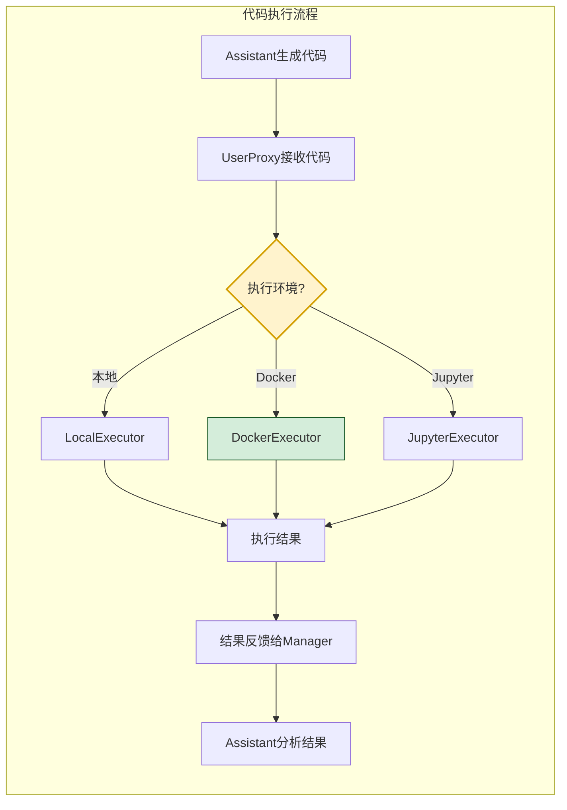

---

## 四、数据流处理流程

### 4.1 完整数据流

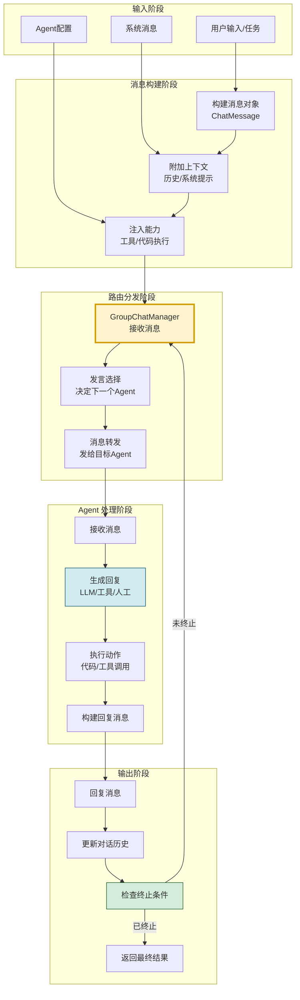

### 4.2 消息结构详解

```python
from dataclasses import dataclass, field
from typing import Optional, Any
from enum import Enum


class MessageRole(Enum):
    """消息角色"""
    SYSTEM = "system"
    USER = "user"
    ASSISTANT = "assistant"
    FUNCTION = "function"
    TOOL = "tool"


class MessageType(Enum):
    """消息类型"""
    TEXT = "text"                    # 文本消息
    CODE = "code"                    # 代码块
    EXECUTION_RESULT = "execution"   # 执行结果
    TOOL_CALL = "tool_call"          # 工具调用
    TERMINATE = "terminate"          # 终止信号
    ERROR = "error"                  # 错误信息


@dataclass
class AutoGenMessage:
    """AutoGen 消息结构"""
    # 基础字段
    content: str                              # 消息内容
    role: MessageRole = MessageRole.USER      # 发送者角色
    sender_name: str = ""                     # 发送Agent名称
    
    # 扩展字段
    message_type: MessageType = MessageType.TEXT  # 消息类型
    metadata: dict = field(default_factory=dict)  # 元数据
    
    # 上下文字段
    context: Optional[dict] = None            # 上下文信息
    reply_to: Optional[str] = None            # 回复的目标消息
    
    # 工具相关
    tool_calls: list[dict] = field(default_factory=list)  # 工具调用
    tool_call_id: Optional[str] = None       # 工具调用ID
    
    # 代码相关
    code_blocks: list[dict] = field(default_factory=list)  # 代码块
    execution_result: Optional[str] = None   # 执行结果
    
    # 控制字段
    is_termination: bool = False             # 是否终止信号
    timestamp: str = field(default_factory=lambda: 
                           datetime.now().isoformat())
    
    def to_dict(self) -> dict:
        return {
            "content": self.content,
            "role": self.role.value,
            "name": self.sender_name,
            "type": self.message_type.value,
            "metadata": self.metadata,
            "tool_calls": self.tool_calls,
            "is_termination": self.is_termination,
        }
```

### 4.3 数据流关键节点

```python
class DataFlowPipeline:
    """数据流管道 - 展示消息在各节点的处理"""
    
    def __init__(self):
        self.stages = [
            self._stage_input,
            self._stage_context_building,
            self._stage_routing,
            self._stage_llm_call,
            self._stage_tool_execution,
            self._stage_output,
        ]
    
    def _stage_input(self, message: AutoGenMessage) -> AutoGenMessage:
        """阶段1: 输入预处理"""
        # 标准化消息格式
        message.metadata["stage"] = "input"
        message.metadata["input_time"] = datetime.now().isoformat()
        return message
    
    def _stage_context_building(self, message: AutoGenMessage) -> AutoGenMessage:
        """阶段2: 上下文构建"""
        # 附加对话历史
        # 附加系统提示
        # 附加Agent能力描述
        message.metadata["stage"] = "context_built"
        return message
    
    def _stage_routing(self, message: AutoGenMessage) -> AutoGenMessage:
        """阶段3: 路由分发"""
        # GroupChatManager决定下一个发言者
        message.metadata["stage"] = "routed"
        return message
    
    def _stage_llm_call(self, message: AutoGenMessage) -> AutoGenMessage:
        """阶段4: LLM调用"""
        # 调用LLM生成回复
        message.metadata["stage"] = "llm_called"
        return message
    
    def _stage_tool_execution(self, message: AutoGenMessage) -> AutoGenMessage:
        """阶段5: 工具执行"""
        # 执行代码或工具调用
        message.metadata["stage"] = "tool_executed"
        return message
    
    def _stage_output(self, message: AutoGenMessage) -> AutoGenMessage:
        """阶段6: 输出处理"""
        # 检查终止条件
        # 更新对话历史
        message.metadata["stage"] = "output"
        return message
```

---

## 五、主要类与接口定义

### 5.1 类继承体系

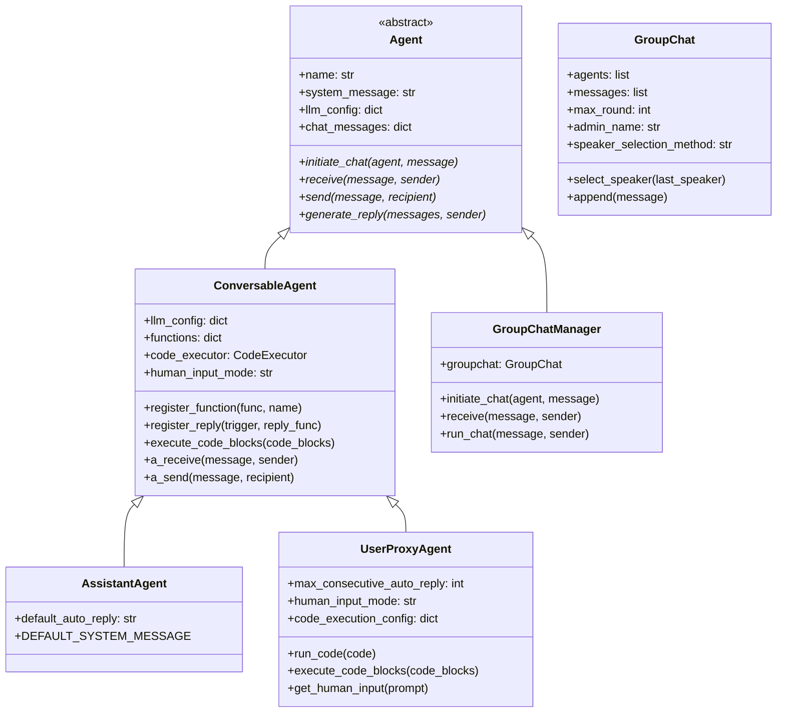

### 5.2 核心基类:ConversableAgent

```python
from abc import ABC, abstractmethod
from typing import Callable, Optional, Union
from collections import defaultdict
import asyncio


class ConversableAgent:
    """
    AutoGen 核心基类 - 可对话Agent
    所有具体Agent的基类,提供对话、工具调用、人在环路能力
    """
    
    DEFAULT_CONFIG = {
        "model": "gpt-4",
        "temperature": 0.7,
        "max_tokens": None,
    }
    
    def __init__(
        self,
        name: str,
        system_message: Optional[str] = None,
        llm_config: Optional[dict] = None,
        is_termination_msg: Optional[Callable] = None,
        human_input_mode: str = "NEVER",  # NEVER / TERMINATE / ALWAYS
        max_consecutive_auto_reply: int = None,
        code_execution_config: Union[dict, bool] = False,
    ):
        # 标识信息
        self.name = name
        self.system_message = system_message or self._default_system_message()
        
        # 能力配置
        self.llm_config = llm_config or {}
        self.human_input_mode = human_input_mode
        self.code_execution_config = code_execution_config
        
        # 终止条件
        self._is_termination_msg = is_termination_msg or self._default_termination_check
        
        # 对话状态
        self.chat_messages = defaultdict(list)  # agent_name -> messages
        self.max_consecutive_auto_reply = max_consecutive_auto_reply or 10
        self._consecutive_auto_reply_counter = defaultdict(int)
        
        # 注册的回复函数
        self._reply_func_list = []
        self._registered_functions = {}
        
        # 注册默认回复函数
        self._register_default_replies()
    
    def _default_system_message(self) -> str:
        """默认系统消息(子类可覆盖)"""
        return "You are a helpful AI Assistant."
    
    def _default_termination_check(self, message: dict) -> bool:
        """默认终止条件检查"""
        return message.get("content", "").rstrip().endswith("TERMINATE")
    
    def _register_default_replies(self):
        """注册默认回复生成函数"""
        # 1. 检查终止条件
        self.register_reply(
            trigger="all",
            reply_func=self._check_termination,
            position=0
        )
        # 2. 生成LLM回复
        self.register_reply(
            trigger="all",
            reply_func=self.generate_llm_reply,
            position=1
        )
        # 3. 执行代码
        self.register_reply(
            trigger="all",
            reply_func=self.generate_code_execution_reply,
            position=2
        )
        # 4. 请求人类输入
        self.register_reply(
            trigger="all",
            reply_func=self.get_human_input,
            position=3
        )
    
    def register_function(
        self,
        function: Callable,
        name: str,
        description: str
    ):
        """注册工具函数"""
        self._registered_functions[name] = {
            "function": function,
            "description": description,
            "name": name,
        }
    
    def register_reply(
        self,
        trigger: Union[str, Callable, type],
        reply_func: Callable,
        position: int = 0
    ):
        """注册回复生成函数"""
        self._reply_func_list.insert(position, (trigger, reply_func))
    
    def initiate_chat(
        self,
        recipient: "ConversableAgent",
        message: Union[str, dict],
        clear_history: bool = True,
        silent: bool = False
    ) -> dict:
        """发起对话"""
        if clear_history:
            self.clear_history(recipient)
        
        # 发送消息
        self.send(message, recipient, request_reply=True, silent=silent)
        
        return {
            "chat_history": self.chat_messages[recipient.name],
            "cost": getattr(self, "cost", 0),
        }
    
    def send(
        self,
        message: Union[str, dict],
        recipient: "ConversableAgent",
        request_reply: bool = False,
        silent: bool = False
    ):
        """发送消息给其他Agent"""
        # 标准化消息
        if isinstance(message, str):
            message = {"content": message, "role": "user"}
        message["name"] = self.name
        
        # 记录到对话历史
        self.chat_messages[recipient.name].append(message.copy())
        
        # 发送给接收者
        recipient.receive(message, self, request_reply, silent)
    
    def receive(
        self,
        message: Union[str, dict],
        sender: "ConversableAgent",
        request_reply: bool = True,
        silent: bool = False
    ):
        """接收消息并生成回复"""
        # 标准化消息
        if isinstance(message, str):
            message = {"content": message, "role": "user"}
        message["name"] = sender.name
        
        # 记录到对话历史
        self.chat_messages[sender.name].append(message.copy())
        
        # 生成回复
        if request_reply:
            reply = self.generate_reply(messages=self.chat_messages[sender.name], 
                                         sender=sender)
            if reply is not None:
                self.send(reply, sender, request_reply=False, silent=silent)
    
    def generate_reply(
        self,
        messages: Optional[list] = None,
        sender: Optional["ConversableAgent"] = None
    ) -> Optional[Union[str, dict]]:
        """生成回复 - 核心方法"""
        if messages is None:
            messages = self.chat_messages.get(sender.name if sender else "", [])
        
        # 按优先级执行所有回复函数
        for trigger, reply_func in self._reply_func_list:
            # 检查触发条件
            if self._check_trigger(trigger, sender):
                reply = reply_func(messages=messages, sender=sender)
                if reply is not None:
                    return reply
        
        return None
    
    def generate_llm_reply(
        self,
        messages: Optional[list] = None,
        sender: Optional["ConversableAgent"] = None
    ) -> Optional[Union[str, dict]]:
        """调用LLM生成回复"""
        if not self.llm_config:
            return None
        
        # 构建LLM请求
        llm_messages = self._construct_llm_messages(messages)
        
        # 调用LLM
        response = self._call_llm(llm_messages)
        
        return response
    
    def _construct_llm_messages(self, messages: list) -> list:
        """构建LLM输入消息"""
        llm_messages = [{"role": "system", "content": self.system_message}]
        llm_messages.extend(messages)
        return llm_messages
    
    def _call_llm(self, messages: list) -> dict:
        """实际调用LLM API"""
        # 简化实现,实际调用OpenAI等API
        pass
```

### 5.3 AssistantAgent 实现

```python
class AssistantAgent(ConversableAgent):
    """助手Agent - LLM驱动的智能助手"""
    
    DEFAULT_SYSTEM_MESSAGE = """You are a helpful AI assistant.
    Solve tasks using your coding and language skills.
    In the following cases, suggest python code (in a python coding block):
    1. When you need to collect data
    2. When you need to perform calculations
    3. When you need to create charts
    
    If you want to execute the code, end your message with 'TERMINATE'.
    """
    
    def __init__(
        self,
        name: str,
        system_message: Optional[str] = None,
        llm_config: Optional[dict] = None,
        **kwargs
    ):
        super().__init__(
            name=name,
            system_message=system_message or self.DEFAULT_SYSTEM_MESSAGE,
            llm_config=llm_config,
            **kwargs
        )
```

### 5.4 UserProxyAgent 实现

```python
class UserProxyAgent(ConversableAgent):
    """用户代理Agent - 可执行代码、请求人类输入"""
    
    def __init__(
        self,
        name: str,
        system_message: Optional[str] = None,
        human_input_mode: str = "TERMINATE",
        max_consecutive_auto_reply: int = 10,
        code_execution_config: Union[dict, bool] = None,
        **kwargs
    ):
        # 默认代码执行配置
        if code_execution_config is None:
            code_execution_config = {
                "work_dir": "workspace",
                "use_docker": False,
                "timeout": 60,
            }
        
        super().__init__(
            name=name,
            system_message=system_message or "You are a proxy user agent.",
            human_input_mode=human_input_mode,
            max_consecutive_auto_reply=max_consecutive_auto_reply,
            code_execution_config=code_execution_config,
            **kwargs
        )
    
    def get_human_input(self, prompt: str) -> str:
        """获取人类输入"""
        if self.human_input_mode == "ALWAYS":
            return input(prompt)
        elif self.human_input_mode == "TERMINATE":
            return input(prompt) if "TERMINATE" in prompt else ""
        return ""
    
    def execute_code_blocks(self, code_blocks: list) -> dict:
        """执行代码块"""
        results = []
        for code_block in code_blocks:
            language = code_block.get("language", "python")
            code = code_block.get("code", "")
            
            if language.lower() == "python":
                result = self._execute_python_code(code)
            else:
                result = {"error": f"Unsupported language: {language}"}
            
            results.append(result)
        
        return {
            "content": "\n".join(r.get("output", "") for r in results),
            "role": "user"
        }
    
    def _execute_python_code(self, code: str) -> dict:
        """执行Python代码"""
        try:
            # 本地执行(简化,实际用Docker更安全)
            exec_result = exec(code)
            return {"output": str(exec_result), "success": True}
        except Exception as e:
            return {"output": str(e), "success": False, "error": str(e)}
```

### 5.5 GroupChat 与 GroupChatManager

```python
class GroupChat:
    """群聊配置"""
    
    def __init__(
        self,
        agents: list[ConversableAgent],
        messages: list = None,
        max_round: int = 10,
        admin_name: str = "Admin",
        speaker_selection_method: str = "auto",  # auto/manual/random/round_robin
        allow_repeat_speaker: bool = True
    ):
        self.agents = agents
        self.messages = messages or []
        self.max_round = max_round
        self.admin_name = admin_name
        self.speaker_selection_method = speaker_selection_method
        self.allow_repeat_speaker = allow_repeat_speaker
        
        # 构建Agent名称到Agent的映射
        self.agent_by_name = {a.name: a for a in agents}
    
    def append(self, message: dict):
        """追加消息"""
        self.messages.append(message)
    
    def select_speaker(self, last_speaker: ConversableAgent) -> ConversableAgent:
        """选择下一个发言者"""
        if self.speaker_selection_method == "auto":
            return self._auto_select(last_speaker)
        elif self.speaker_selection_method == "manual":
            return self._manual_select()
        elif self.speaker_selection_method == "random":
            return self._random_select(last_speaker)
        elif self.speaker_selection_method == "round_robin":
            return self._round_robin_select(last_speaker)
        else:
            return self._auto_select(last_speaker)
    
    def _auto_select(self, last_speaker) -> ConversableAgent:
        """LLM 自动选择下一个发言者"""
        # 将Agent描述与对话历史交给LLM
        # LLM返回下一个发言者名称
        pass
    
    def _manual_select(self) -> ConversableAgent:
        """手动选择"""
        names = list(self.agent_by_name.keys())
        print(f"可选Agent: {names}")
        choice = input("选择下一个发言者: ")
        return self.agent_by_name.get(choice, self.agents[0])
    
    def _random_select(self, last_speaker) -> ConversableAgent:
        """随机选择"""
        import random
        candidates = [a for a in self.agents if a != last_speaker]
        return random.choice(candidates)
    
    def _round_robin_select(self, last_speaker) -> ConversableAgent:
        """轮询选择"""
        idx = self.agents.index(last_speaker)
        return self.agents[(idx + 1) % len(self.agents)]


class GroupChatManager(ConversableAgent):
    """群聊管理器 - 管理多Agent协作"""
    
    def __init__(
        self,
        groupchat: GroupChat,
        name: str = "chat_manager",
        llm_config: Optional[dict] = None,
        **kwargs
    ):
        super().__init__(
            name=name,
            system_message="You are the group chat manager.",
            llm_config=llm_config,
            **kwargs
        )
        self.groupchat = groupchat
    
    def receive(
        self,
        message: Union[str, dict],
        sender: ConversableAgent,
        request_reply: bool = True,
        silent: bool = False
    ):
        """接收消息并管理群聊"""
        # 1. 追加消息到群聊历史
        if isinstance(message, str):
            message = {"content": message, "role": "user"}
        message["name"] = sender.name
        self.groupchat.append(message)
        
        # 2. 广播给所有Agent
        for agent in self.groupchat.agents:
            if agent != sender:
                agent.chat_messages[self.name].append(message.copy())
        
        # 3. 检查终止条件
        if self._is_termination_msg(message):
            return
        
        # 4. 检查最大轮数
        if len(self.groupchat.messages) >= self.groupchat.max_round:
            return
        
        # 5. 选择下一个发言者
        next_speaker = self.groupchat.select_speaker(sender)
        
        # 6. 转发消息给下一个发言者
        next_speaker.receive(message, self, request_reply=True)
```

---

## 六、核心功能实现方式

### 6.1 多 Agent 协作实现

```python
class MultiAgentCollaboration:
    """多Agent协作实现示例"""
    
    @staticmethod
    def create_coding_team():
        """创建编码团队"""
        from autogen import AssistantAgent, UserProxyAgent, GroupChat, GroupChatManager
        
        # 1. 创建LLM配置
        llm_config = {
            "model": "gpt-4",
            "temperature": 0.7,
            "api_key": "your-api-key"
        }
        
        # 2. 创建团队成员
        # 编码者
        coder = AssistantAgent(
            name="Coder",
            system_message="""You are a Python expert.
            Write clean, efficient, well-documented code.
            Always include error handling.""",
            llm_config=llm_config
        )
        
        # 代码审查者
        reviewer = AssistantAgent(
            name="Reviewer",
            system_message="""You are a code reviewer.
            Check code for bugs, security issues, and best practices.
            Provide specific feedback with code examples.""",
            llm_config=llm_config
        )
        
        # 测试者
        tester = AssistantAgent(
            name="Tester",
            system_message="""You are a test engineer.
            Write comprehensive test cases.
            Focus on edge cases and error scenarios.""",
            llm_config=llm_config
        )
        
        # 用户代理(执行代码)
        user_proxy = UserProxyAgent(
            name="User",
            human_input_mode="NEVER",
            code_execution_config={"work_dir": "coding_workspace"}
        )
        
        # 3. 创建群聊
        group_chat = GroupChat(
            agents=[user_proxy, coder, reviewer, tester],
            messages=[],
            max_round=15,
            speaker_selection_method="auto"
        )
        
        # 4. 创建管理器
        manager = GroupChatManager(
            groupchat=group_chat,
            llm_config=llm_config
        )
        
        return user_proxy, manager
    
    @staticmethod
    def run_task(task: str):
        """运行任务"""
        user_proxy, manager = MultiAgentCollaboration.create_coding_team()
        user_proxy.initiate_chat(manager, message=task)
```

### 6.2 代码执行实现

```python
class CodeExecutionManager:
    """代码执行管理器"""
    
    def __init__(self, work_dir: str = "workspace", 
                 use_docker: bool = True):
        self.work_dir = work_dir
        self.use_docker = use_docker
        os.makedirs(work_dir, exist_ok=True)
    
    def execute(self, code: str, language: str = "python") -> dict:
        """执行代码"""
        if language.lower() == "python":
            return self._execute_python(code)
        elif language.lower() == "shell":
            return self._execute_shell(code)
        else:
            return {"error": f"Unsupported language: {language}"}
    
    def _execute_python(self, code: str) -> dict:
        """执行Python代码"""
        # 保存到文件
        code_file = os.path.join(self.work_dir, f"code_{int(time.time())}.py")
        with open(code_file, "w") as f:
            f.write(code)
        
        if self.use_docker:
            return self._execute_in_docker(f"python {code_file}")
        else:
            return self._execute_local(f"python {code_file}")
    
    def _execute_in_docker(self, command: str) -> dict:
        """在Docker中执行"""
        import subprocess
        try:
            result = subprocess.run(
                ["docker", "run", "--rm", "-v", 
                 f"{self.work_dir}:/workspace",
                 "python:3.11", "sh", "-c", 
                 f"cd /workspace && {command}"],
                capture_output=True,
                text=True,
                timeout=60
            )
            return {
                "output": result.stdout,
                "error": result.stderr,
                "success": result.returncode == 0
            }
        except subprocess.TimeoutExpired:
            return {"error": "Execution timeout", "success": False}
    
    def _execute_local(self, command: str) -> dict:
        """本地执行"""
        import subprocess
        try:
            result = subprocess.run(
                command, shell=True, capture_output=True,
                text=True, timeout=60, cwd=self.work_dir
            )
            return {
                "output": result.stdout,
                "error": result.stderr,
                "success": result.returncode == 0
            }
        except subprocess.TimeoutExpired:
            return {"error": "Execution timeout", "success": False}
```

### 6.3 工具集成实现

```python
class ToolIntegration:
    """工具集成实现"""
    
    @staticmethod
    def setup_web_search_agent():
        """配置带搜索能力的Agent"""
        from autogen import ConversableAgent
        
        agent = ConversableAgent(
            name="SearchAgent",
            llm_config={"model": "gpt-4"}
        )
        
        # 注册搜索工具
        @agent.register_for_execution()
        def web_search(query: str) -> str:
            """搜索网络"""
            # 调用搜索API
            import requests
            response = requests.get(
                "https://api.search.com/search",
                params={"q": query}
            )
            return response.json()["results"]
        
        return agent
    
    @staticmethod
    def setup_api_calling_agent():
        """配置带API调用能力的Agent"""
        agent = ConversableAgent(
            name="APIAgent",
            llm_config={"model": "gpt-4"}
        )
        
        # 注册多个API工具
        tools = {
            "get_weather": get_weather,
            "get_stock_price": get_stock_price,
            "send_email": send_email,
        }
        
        for name, func in tools.items():
            agent.register_function(func, name, func.__doc__)
        
        return agent
```

---

## 七、关键技术实现

### 7.1 基于对话的编排

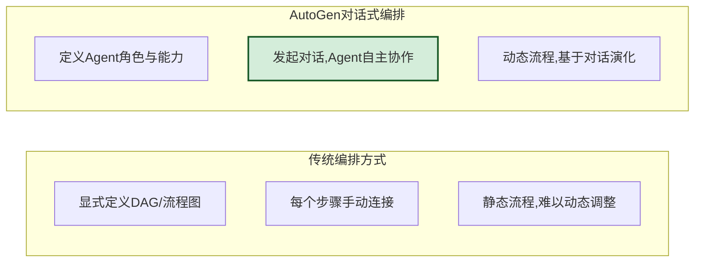

### 7.2 缓存与重试机制

```python
class ResponseCache:
    """LLM响应缓存"""
    
    def __init__(self):
        self._cache: dict[str, dict] = {}  # hash -> response
        self._lock = threading.RLock()
    
    def get(self, messages: list) -> Optional[dict]:
        """获取缓存的响应"""
        cache_key = self._hash_messages(messages)
        with self._lock:
            return self._cache.get(cache_key)
    
    def put(self, messages: list, response: dict):
        """缓存响应"""
        cache_key = self._hash_messages(messages)
        with self._lock:
            self._cache[cache_key] = response
    
    def _hash_messages(self, messages: list) -> str:
        import hashlib
        import json
        msg_str = json.dumps(messages, sort_keys=True, ensure_ascii=False)
        return hashlib.sha256(msg_str.encode()).hexdigest()


class RetryHandler:
    """重试处理器"""
    
    def __init__(self, max_retries: int = 3, 
                 backoff_factor: float = 1.0):
        self.max_retries = max_retries
        self.backoff_factor = backoff_factor
    
    def execute_with_retry(self, func: Callable, *args, **kwargs):
        """带重试的执行"""
        import time
        
        last_error = None
        for attempt in range(self.max_retries):
            try:
                return func(*args, **kwargs)
            except Exception as e:
                last_error = e
                wait_time = self.backoff_factor * (2 ** attempt)
                print(f"尝试 {attempt + 1} 失败: {e}, {wait_time}秒后重试")
                time.sleep(wait_time)
        
        raise last_error
```

### 7.3 异步支持

```python
class AsyncConversableAgent(ConversableAgent):
    """支持异步的Agent"""
    
    async def a_initiate_chat(
        self,
        recipient: "ConversableAgent",
        message: Union[str, dict],
        clear_history: bool = True
    ) -> dict:
        """异步发起对话"""
        if clear_history:
            self.clear_history(recipient)
        
        await self.a_send(message, recipient, request_reply=True)
        
        return {
            "chat_history": self.chat_messages[recipient.name],
        }
    
    async def a_send(
        self,
        message: Union[str, dict],
        recipient: "ConversableAgent",
        request_reply: bool = False
    ):
        """异步发送消息"""
        if isinstance(message, str):
            message = {"content": message, "role": "user"}
        message["name"] = self.name
        self.chat_messages[recipient.name].append(message.copy())
        
        await recipient.a_receive(message, self, request_reply)
    
    async def a_receive(
        self,
        message: Union[str, dict],
        sender: "ConversableAgent",
        request_reply: bool = True
    ):
        """异步接收消息"""
        if isinstance(message, str):
            message = {"content": message, "role": "user"}
        message["name"] = sender.name
        self.chat_messages[sender.name].append(message.copy())
        
        if request_reply:
            reply = await self.a_generate_reply(
                messages=self.chat_messages[sender.name],
                sender=sender
            )
            if reply is not None:
                await self.a_send(reply, sender, request_reply=False)
    
    async def a_generate_reply(self, messages, sender) -> Optional[dict]:
        """异步生成回复"""
        # 异步调用LLM
        response = await self._a_call_llm(messages)
        return response
```

---

## 八、设计优势

### 8.1 优势全景

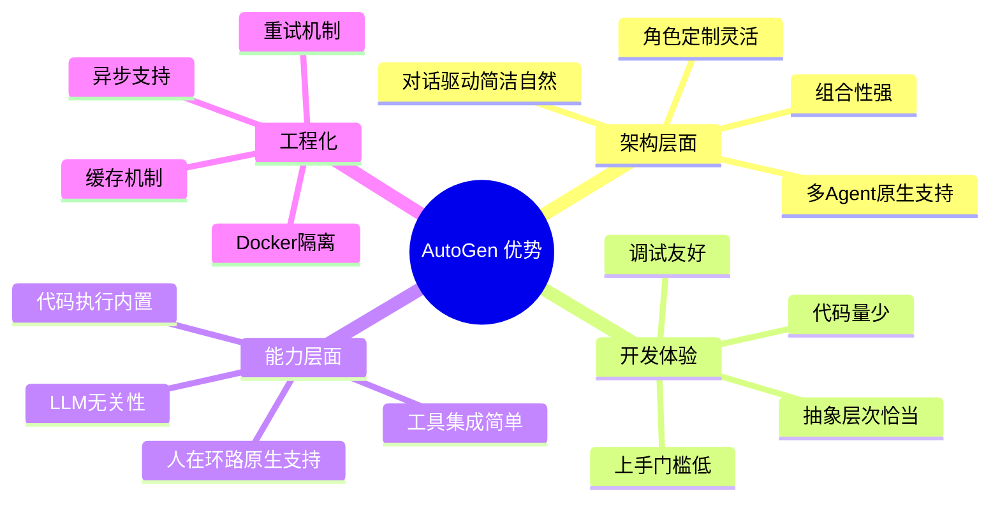

### 8.2 优势详解

#### 8.2.1 对话驱动简化复杂度

```python
# 传统方式:需要显式编排
workflow = Workflow()
step1 = workflow.add_step(assistant.generate)
step2 = workflow.add_step(executor.execute)
step3 = workflow.add_step(reviewer.review)
workflow.connect(step1, step2)
workflow.connect(step2, step3)

# AutoGen方式:对话驱动,Agent自主协作
user_proxy.initiate_chat(manager, message="完成任务")
# Agent间自动协作,无需显式编排
```

#### 8.2.2 多 Agent 原生支持

| 特性 | 说明 |
|-----|------|
| **GroupChat** | 内置群聊管理,开箱即用 |
| **发言选择** | 多种策略(auto/manual/random/round_robin) |
| **角色定义** | 通过 system_message 灵活定义角色 |
| **协作模式** | 两Agent对话、群聊、嵌套对话 |

#### 8.2.3 人在环路原生支持

```python
# 三种人在环路模式
user_proxy = UserProxyAgent(
    name="User",
    human_input_mode="NEVER"     # 全自动
    # human_input_mode="TERMINATE"  # 终止时确认
    # human_input_mode="ALWAYS"     # 每步都确认
)
```

#### 8.2.4 代码执行内置

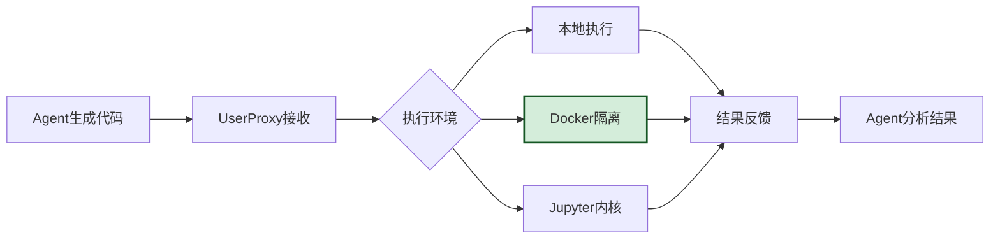

#### 8.2.5 LLM 无关性

```python
# 支持多种LLM
llm_configs = {
    "openai": {"model": "gpt-4", "api_key": "..."},
    "azure": {"model": "gpt-4", "base_url": "azure_endpoint"},
    "local": {"model": "llama-3", "base_url": "http://localhost:11434"},
    "anthropic": {"model": "claude-3", "api_key": "..."},
}
```

### 8.3 优势量化对比

| 维度 | 传统框架 | AutoGen |
|-----|---------|---------|
| **多Agent协作代码量** | 200+ 行 | **30 行** |
| **人在环路集成** | 需自建 | **内置三模式** |
| **代码执行** | 需自建 | **内置(Docker/Local)** |
| **发言选择策略** | 需自建 | **内置四种** |
| **异步支持** | 需自建 | **原生支持** |
| **LLM切换** | 重构代码 | **改配置即可** |

---

## 九、潜在局限性

### 9.1 局限性全景

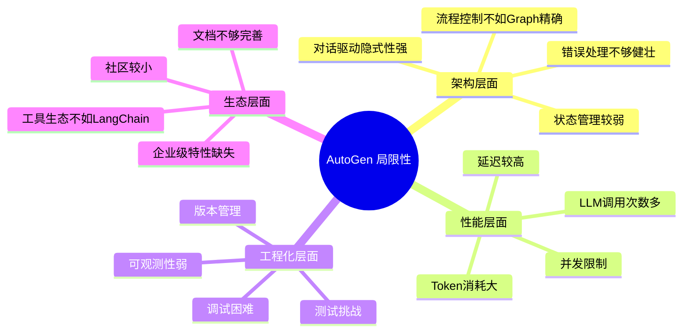

### 9.2 局限性详解

#### 9.2.1 对话驱动的隐式性问题

```python
# 问题:对话流程隐式,难以精确控制
user_proxy.initiate_chat(manager, message="完成任务")
# ❌ 无法精确控制:
# - 哪个Agent先发言?
# - 总共会进行几轮?
# - 何时切换到代码执行?
# - 出错时如何回滚?

# 对比LangGraph:显式状态图,流程完全可控
graph.add_node("plan", plan_node)
graph.add_node("execute", execute_node)
graph.add_edge("plan", "execute")
graph.add_conditional_edges("execute", should_retry, 
                             {True: "plan", False: END})
```

#### 9.2.2 LLM 调用成本高

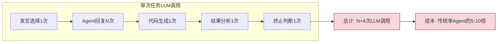

#### 9.2.3 状态管理较弱

```python
# 问题:对话历史是唯一状态,难以管理复杂状态
# - 无法持久化中间状态
# - 无法回滚到某个检查点
# - 无法并行执行多个对话分支

# 对比LangGraph:显式状态管理
class State(TypedDict):
    messages: list
    current_step: str
    results: dict
    errors: list
```

#### 9.2.4 调试与可观测性弱

| 维度 | LangGraph | AutoGen |
|-----|-----------|---------|
| **流程可视化** | ✅ 显式图结构 | ❌ 隐式对话流 |
| **状态追踪** | ✅ State 可序列化 | ⚠️ 仅对话历史 |
| **断点调试** | ✅ 节点级断点 | ❌ 难以定位 |
| **性能分析** | ✅ 节点级计时 | ⚠️ 整体延迟 |
| **错误定位** | ✅ 节点级错误 | ❌ 难以归因 |

#### 9.2.5 工具生态不如 LangChain

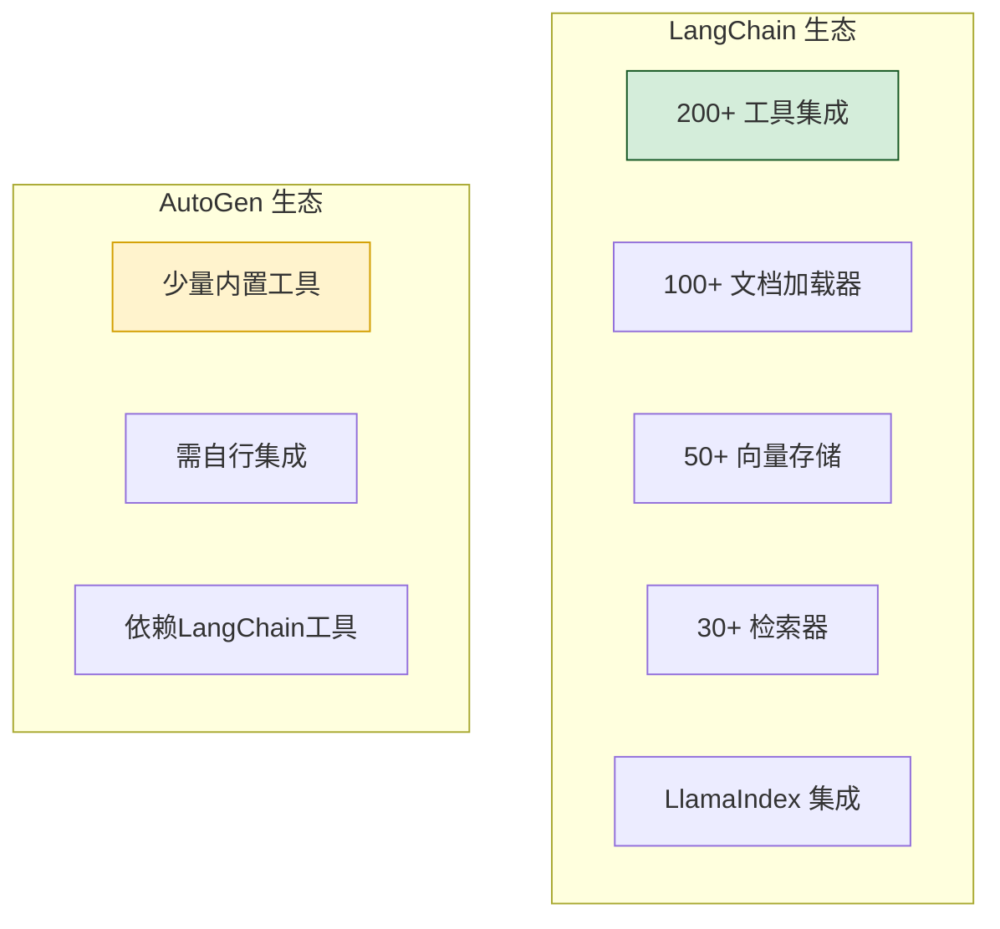

### 9.3 局限性应对策略

| 局限性 | 应对策略 |
|-------|---------|
| 隐式流程 | 结合 LangGraph 做流程编排,AutoGen 做 Agent 协作 |
| LLM 成本 | 缓存响应、减少 Agent 数量、用小模型做路由 |
| 状态管理弱 | 自建状态持久化层,定期保存检查点 |
| 调试困难 | 增强日志、添加追踪ID、录制对话回放 |
| 生态不足 | 集成 LangChain 工具生态 |

---

## 十、与 LangChain/LangGraph 对比及总结

### 10.1 三大框架对比

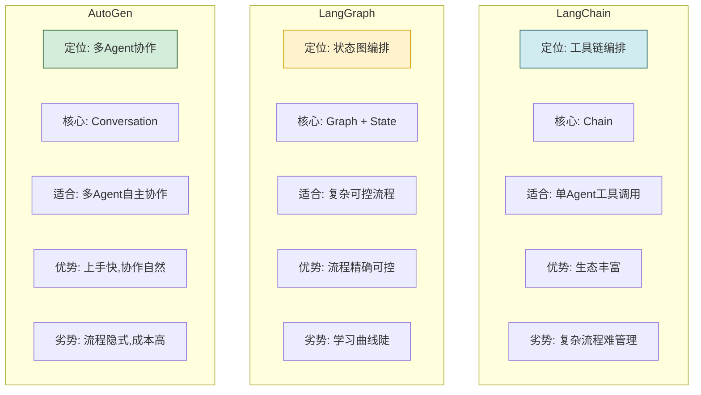

### 10.2 选型决策矩阵

| 场景 | 推荐框架 | 理由 |
|-----|---------|------|
| **单Agent工具调用** | LangChain | 生态丰富,工具集成简单 |
| **复杂可控工作流** | LangGraph | 状态图精确控制流程 |
| **多Agent自主协作** | AutoGen | 对话驱动,协作自然 |
| **代码生成与执行** | AutoGen | 内置代码执行,人在环路 |
| **RAG 应用** | LangChain | 检索器与加载器丰富 |
| **需要人在环路** | AutoGen | 原生支持三种模式 |
| **企业级生产部署** | LangGraph | 可控性强,可观测性好 |
| **快速原型验证** | AutoGen | 上手快,代码量少 |

### 10.3 混合使用建议

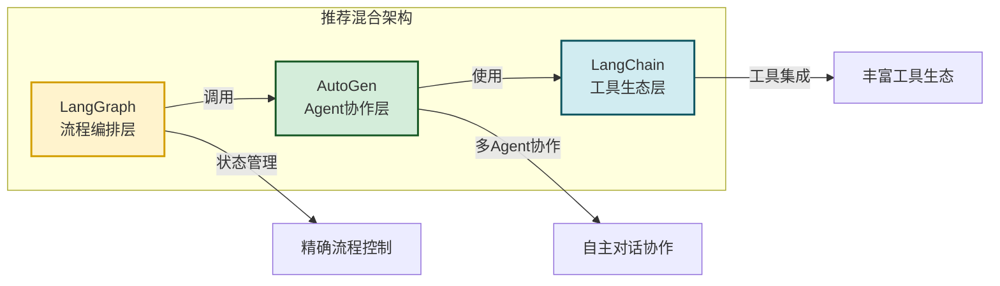

### 10.4 核心要点回顾

1. **AutoGen 核心定位**:多 Agent 对话协作框架,以 Conversation 为中心。
2. **三大核心 Agent**:`ConversableAgent`(基类)、`AssistantAgent`(LLM助手)、`UserProxyAgent`(用户代理)。
3. **群聊管理**:`GroupChat` + `GroupChatManager` 管理多 Agent 协作。
4. **四种发言选择**:auto/manual/random/round_robin。
5. **对话驱动**:流程通过对话演化,非显式编排。
6. **人在环路原生**:NEVER/TERMINATE/ALWAYS 三种模式。
7. **代码执行内置**:支持本地、Docker、Jupyter 三种环境。
8. **LLM 无关**:通过 `llm_config` 切换模型。
9. **优势**:上手快、协作自然、人在环路、代码执行。
10. **局限**:流程隐式、成本高、状态弱、生态小。

### 10.5 给开发者的实践建议

1. **明确场景**:多 Agent 协作用 AutoGen,精确流程控制用 LangGraph。
2. **从两 Agent 开始**:先用 UserProxy + Assistant 验证,再扩展到群聊。
3. **控制 Agent 数量**:3-5 个 Agent 为宜,过多导致成本与混乱。
4. **善用发言选择**:auto 适合大多数,关键步骤用 manual 控制。
5. **必用 Docker 执行**:代码执行务必用 Docker 隔离,确保安全。
6. **添加缓存**:LLM 响应缓存可显著降低成本。
7. **混合使用**:LangGraph 编排 + AutoGen 协作 + LangChain 工具,各取所长。
8. **监控成本**:多 Agent 协作 LLM 调用次数多,务必监控 Token 消耗。

---

> **相关文档**
>
> - [85LangChain框架核心组件详解.md](./85LangChain框架核心组件详解.md)
> - [86LangChain Agent运行机制深度解析.md](./86LangChain%20Agent运行机制深度解析.md)
> - [87LangGraph框架诞生背景与核心定位深度解析.md](./87LangGraph框架诞生背景与核心定位深度解析.md)
> - [88LangChain与LangGraph核心区别系统性对比深度解析.md](./88LangChain与LangGraph核心区别系统性对比深度解析.md)
