# CrewAI 框架核心设计理念深度解析

> 文档定位:系统阐述 CrewAI 框架的核心设计理念,涵盖设计哲学、架构设计思想、多智能体协作模式、任务分配机制,以及与 LangChain/LangGraph/AutoGen 等其他智能体框架的独特之处,为理解 CrewAI 的设计愿景与选型决策提供深度指导。
>
> 阅读建议:本文是 Agent Framework 系列的重要组成,建议结合 [85LangChain框架核心组件详解.md](./85LangChain框架核心组件详解.md)、[87LangGraph框架诞生背景与核心定位深度解析.md](./87LangGraph框架诞生背景与核心定位深度解析.md)、[89AutoGen框架架构深度解析.md](./89AutoGen框架架构深度解析.md) 一并阅读,横向对比理解不同框架的设计哲学。

---

## 目录

- [一、CrewAI 框架背景与定位](#一crewai-框架背景与定位)
- [二、核心设计哲学](#二核心设计哲学)
- [三、架构设计思想](#三架构设计思想)
- [四、多智能体协作模式](#四多智能体协作模式)
- [五、任务分配机制](#五任务分配机制)
- [六、流程编排与执行引擎](#六流程编排与执行引擎)
- [七、核心抽象与接口设计](#七核心抽象与接口设计)
- [八、与其他框架的独特之处](#八与其他框架的独特之处)
- [九、设计哲学的工程体现](#九设计哲学的工程体现)
- [十、总结与展望](#十总结与展望)

---

## 一、CrewAI 框架背景与定位

### 1.1 框架起源

**CrewAI** 是由 João Moura 于 2023 年底开源的编排框架,其核心定位是**以角色驱动的多智能体协作编排框架**。CrewAI 的灵感来源于人类团队协作模式,将软件工程中的"团队"、"角色"、"任务"概念引入 LLM Agent 编排。

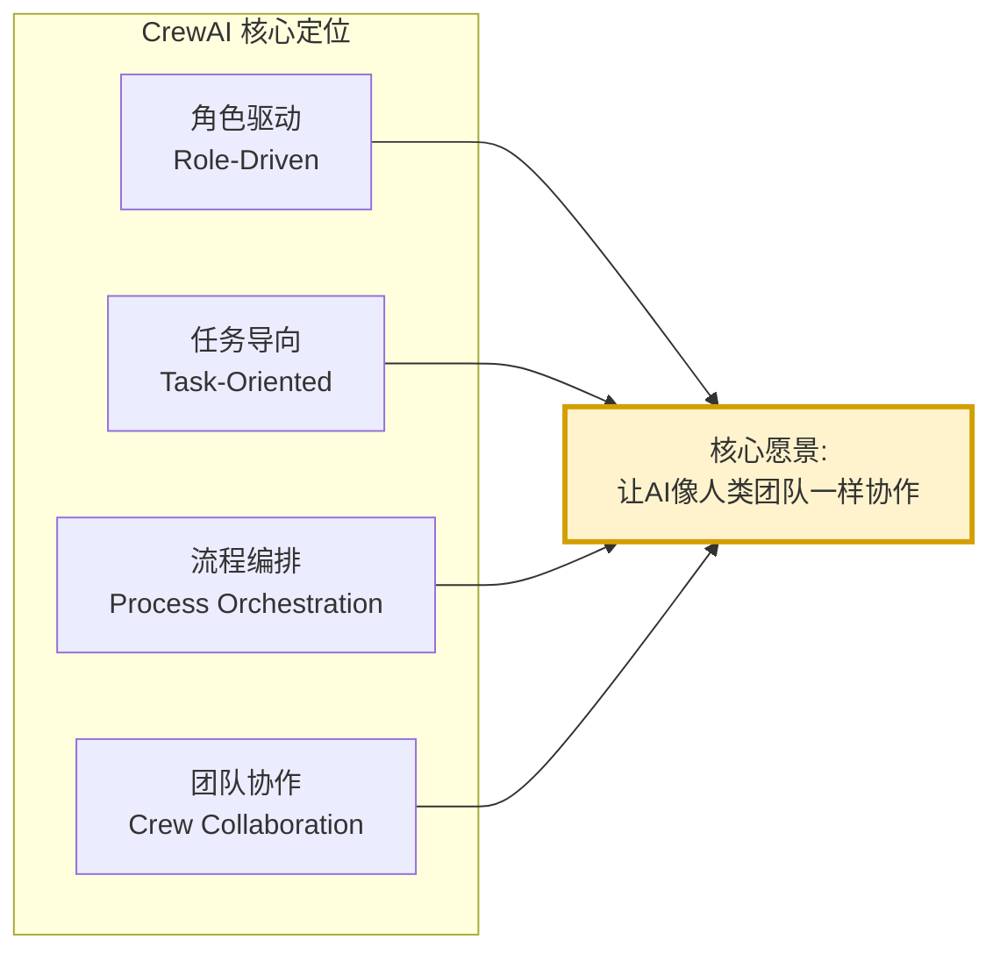

### 1.2 框架命名含义

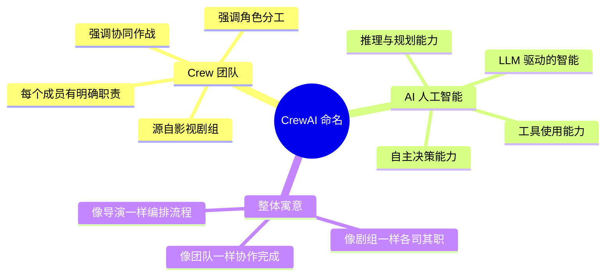

### 1.3 解决的核心问题

CrewAI 致力于解决现有 Agent 框架的三大痛点:

| 痛点 | 现有框架的问题 | CrewAI 的解决思路 |
|-----|-------------|-----------------|
| **角色模糊** | Agent 角色定义分散,缺乏系统化抽象 | 将 Agent 抽象为有明确角色、目标、背景的"团队成员" |
| **任务粒度不当** | 任务要么太粗(单 Agent 全做),要么太散(无组织) | 任务作为一等公民,明确目标、预期、上下文 |
| **流程僵化或失控** | 要么 Chain 固化,要么对话完全自由 | 提供顺序、层级、共识三种可控流程模式 |

### 1.4 与其他框架的本质区别

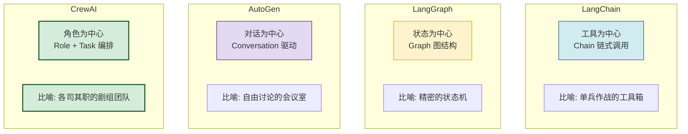

**核心差异**:
- LangChain 关注**工具链编排**,以 Chain 为核心。
- LangGraph 关注**状态图编排**,以 Graph 为核心。
- AutoGen 关注**多 Agent 对话**,以 Conversation 为核心。
- CrewAI 关注**角色化团队**,以 Crew + Task 为核心。

---

## 二、核心设计哲学

### 2.1 四大设计哲学

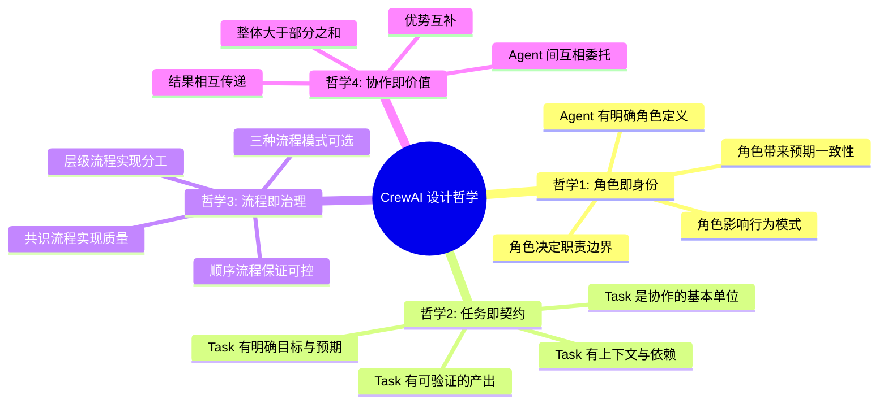

### 2.2 哲学一:角色即身份 (Role as Identity)

**核心理念**:每个 Agent 应该有清晰的角色身份,如同现实团队中的职位,角色决定了 Agent 的视角、专长、行为模式。

```python
# CrewAI 的 Agent 角色定义示例
researcher = Agent(
    role="高级市场研究员",           # 角色名称
    goal="收集并分析市场趋势数据,提供洞察",  # 角色目标
    backstory="""你是一位拥有10年经验的市场研究员,
    擅长数据分析和趋势预测。
    你注重数据的准确性和来源的可靠性。""",   # 角色背景
    verbose=True
)
```

**设计哲学解读**:

| 设计要素 | 哲学体现 | 与其他框架对比 |
|---------|---------|-------------|
| **role(角色)** | 明确身份定位 | 其他框架往往只有 system_message |
| **goal(目标)** | 明确意图方向 | 其他框架目标隐含在 prompt 中 |
| **backstory(背景)** | 赋予专业经验 | 其他框架缺乏"人设"概念 |
| **verbose(详尽)** | 可观察行为 | 提升可调试性 |

**为什么角色化重要**:
1. **提升输出质量**:明确角色让 LLM 输出更聚焦、更专业。
2. **增强一致性**:同一角色在不同任务中保持一致的行为模式。
3. **改善协作**:角色边界清晰,减少职责重叠与冲突。
4. **简化编排**:角色本身就是一种"软约束",无需复杂控制流。

### 2.3 哲学二:任务即契约 (Task as Contract)

**核心理念**:任务是协作的基本单位,如同合同,明确"做什么、为什么、靠什么、产出什么"。

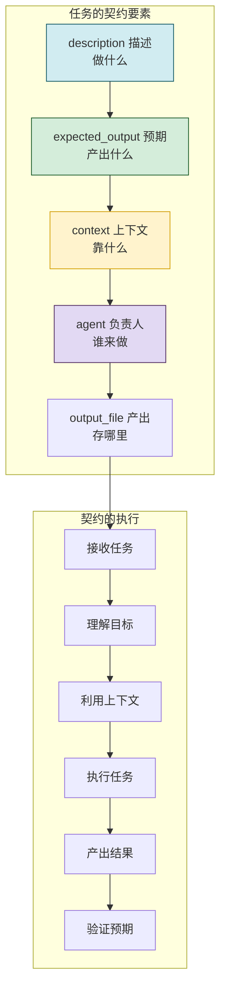

```python
# CrewAI 的任务契约定义
market_analysis_task = Task(
    description="分析2024年AI Agent市场的竞争格局",  # 做什么
    expected_output="一份包含市场份额、主要玩家、趋势的详细报告",  # 产出什么
    context=[research_task_output],  # 靠什么(依赖前序任务)
    agent=researcher,  # 谁来做
    output_file="reports/market_analysis.md"  # 存哪里
)
```

**设计哲学解读**:

| 契约要素 | 哲学体现 | 工程价值 |
|---------|---------|---------|
| **description** | 明确任务内容 | 减少歧义 |
| **expected_output** | 明确预期产出 | 可验证 |
| **context** | 明确上下文依赖 | 任务串联 |
| **agent** | 明确负责人 | 责任到"人" |
| **output_file** | 明确产出存储 | 可追溯 |

### 2.4 哲学三:流程即治理 (Process as Governance)

**核心理念**:提供多种流程模式,让开发者根据场景选择合适的"治理结构",而非一刀切。

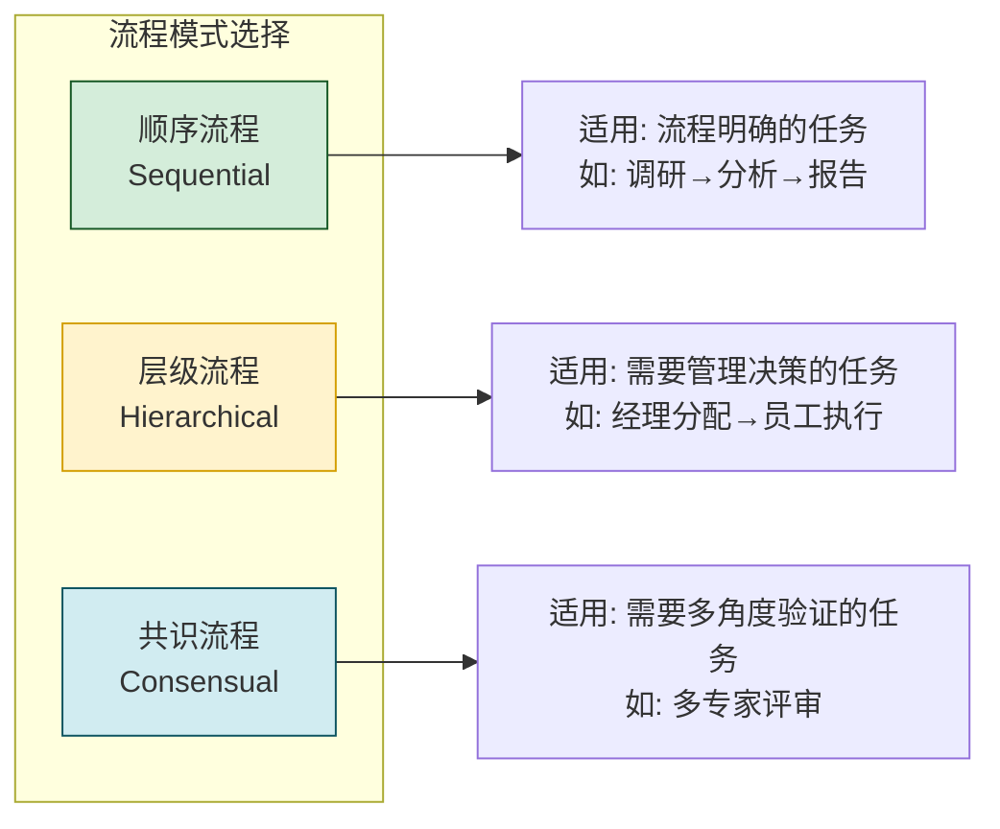

### 2.5 哲学四:协作即价值 (Collaboration as Value)

**核心理念**:Agent 间的协作不是简单的任务传递,而是通过委托、传递、互补,产生超越个体的集体价值。

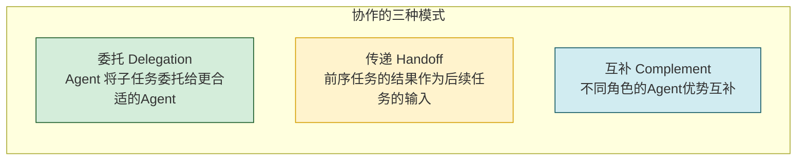

### 2.6 设计哲学对比

| 设计维度 | CrewAI 哲学 | 其他框架哲学 |
|---------|-----------|------------|
| **Agent 抽象** | 角色化(有身份、有背景) | 功能化(有工具、有提示) |
| **任务抽象** | 契约化(有预期、有验证) | 步骤化(有输入、有输出) |
| **流程控制** | 多模式可选(治理导向) | 单一模式(链式/图式/对话式) |
| **协作方式** | 显式委托与传递 | 隐式对话或显式编排 |
| **设计美学** | 拟人化(像团队) | 抽象化(像数据流) |

---

## 三、架构设计思想

### 3.1 整体架构

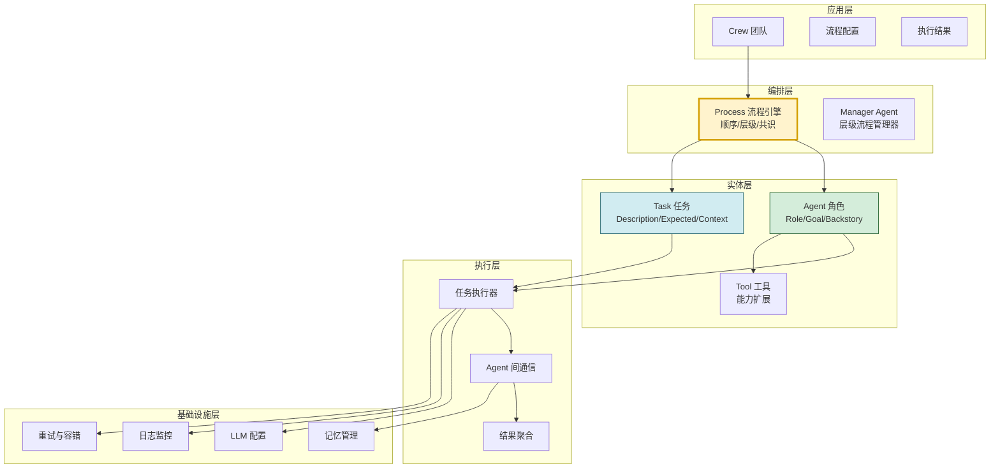

### 3.2 核心抽象三件套

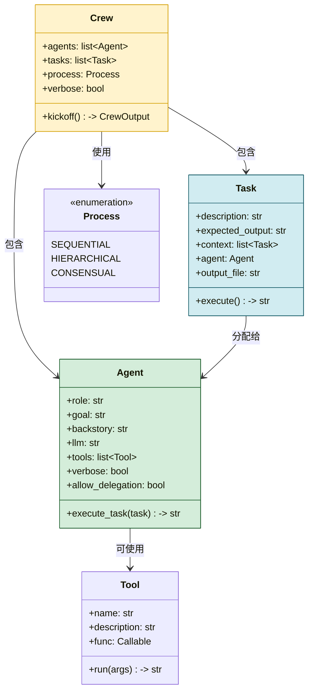

### 3.3 分层架构思想

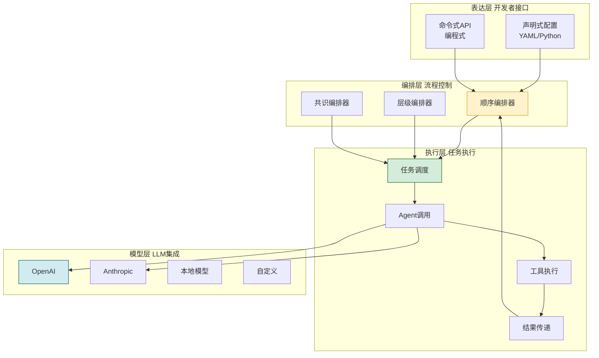

### 3.4 设计原则

#### 3.4.1 声明式优于命令式

```python
# CrewAI 声明式: 描述"做什么",不关心"怎么做"
crew = Crew(
    agents=[researcher, analyst, writer],
    tasks=[research_task, analysis_task, report_task],
    process=Process.SEQUENTIAL
)
result = crew.kickoff()

# 对比命令式: 需要描述每一步"怎么做"
# result = researcher.execute(research_task)
# analysis_task.context = result
# result = analyst.execute(analysis_task)
# report_task.context = result
# result = writer.execute(report_task)
```

#### 3.4.2 角色边界清晰

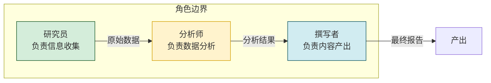

#### 3.4.3 任务结果可追溯

```python
# 每个任务的产出都有明确的结构
@dataclass
class TaskOutput:
    description: str          # 任务描述
    raw_output: str           # 原始LLM输出
    agent: str               # 执行Agent
    task: str                # 任务名称
    output_file: Optional[str]  # 输出文件
    summary: str             # 摘要
```

---

## 四、多智能体协作模式

### 4.1 三大协作模式

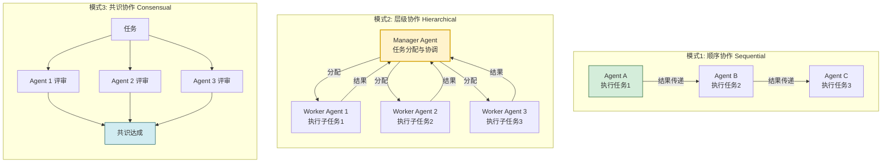

### 4.2 顺序协作模式详解

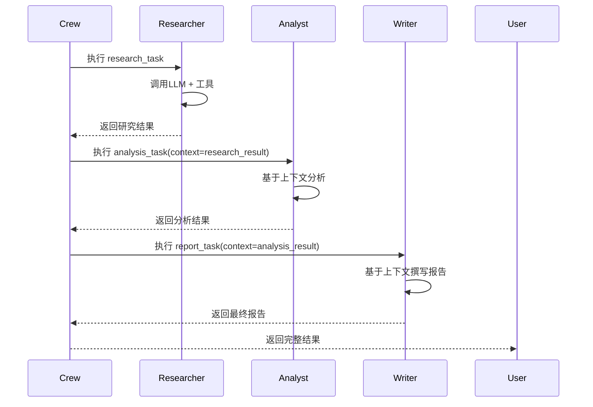

**顺序模式特点**:
- 任务按列表顺序执行。
- 前序任务结果自动作为后续任务上下文。
- 每个任务由指定的 Agent 执行。
- 适合流程明确的线性任务。

### 4.3 层级协作模式详解

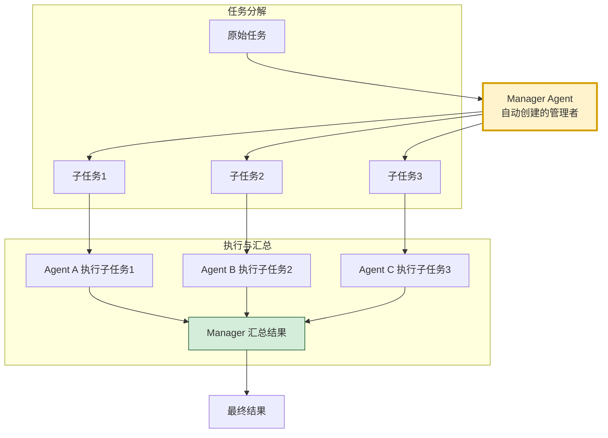

**层级模式特点**:
- Manager Agent 自动创建,负责任务分配。
- Manager 根据任务内容与 Agent 能力智能分配。
- 适合复杂任务需要分解与协调的场景。
- 体现了"管理者-执行者"的团队结构。

### 4.4 共识协作模式详解

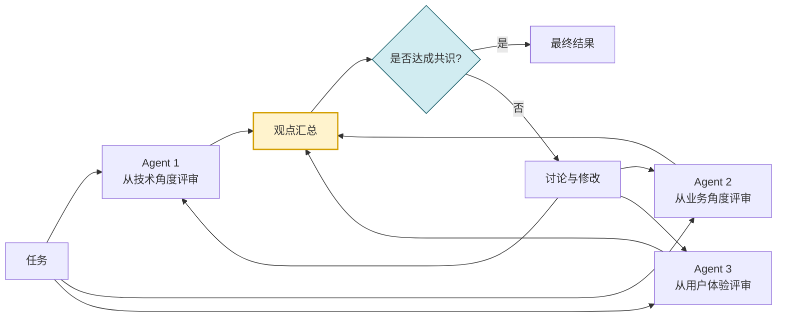

### 4.5 协作中的委托机制

```python
class AgentDelegation:
    """Agent 间的委托机制"""
    
    @staticmethod
    def setup_delegation():
        """配置可委托的Agent"""
        # 研究员可以委托给数据分析师
        researcher = Agent(
            role="研究员",
            goal="收集信息",
            backstory="擅长信息检索",
            allow_delegation=True,  # 允许委托
            llm="gpt-4"
        )
        
        # 数据分析师作为被委托对象
        analyst = Agent(
            role="数据分析师",
            goal="分析数据",
            backstory="擅长数据洞察",
            allow_delegation=False,
            llm="gpt-4"
        )
        
        # 在任务执行中,研究员可自动委托
        # 当研究员遇到数据分析需求时,自动委托给分析师
```

---

## 五、任务分配机制

### 5.1 任务分配的三种策略

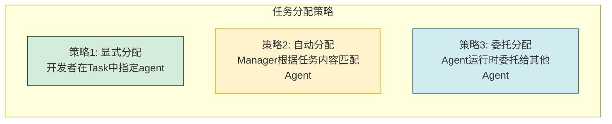

### 5.2 显式分配机制

```python
# 开发者在Task中显式指定执行Agent
research_task = Task(
    description="收集AI Agent市场数据",
    expected_output="包含市场规模、增长率的报告",
    agent=researcher  # 显式指定
)

analysis_task = Task(
    description="分析市场趋势",
    expected_output="趋势分析报告",
    agent=analyst,    # 显式指定
    context=[research_task]  # 依赖前序任务
)
```

### 5.3 自动分配机制(层级模式)

```python
class TaskAllocator:
    """任务自动分配器(层级模式)"""
    
    def __init__(self, manager_agent: Agent, 
                 worker_agents: list[Agent]):
        self.manager = manager_agent
        self.workers = worker_agents
    
    def allocate(self, task: Task) -> Agent:
        """基于任务内容与Agent能力匹配"""
        # 1. 构建任务描述
        task_desc = f"任务: {task.description}\n预期: {task.expected_output}"
        
        # 2. 构建Agent能力描述
        agent_descs = "\n".join([
            f"- {a.role}: {a.goal} ({a.backstory[:50]}...)"
            for a in self.workers
        ])
        
        # 3. 让Manager决定
        prompt = f"""
        任务: {task_desc}
        
        可用Agent:
        {agent_descs}
        
        请选择最合适的Agent执行此任务,只返回Agent的role名称。
        """
        
        decision = self.manager.llm.call(prompt)
        selected_agent = self._find_agent_by_role(decision)
        
        return selected_agent
    
    def _find_agent_by_role(self, role: str) -> Agent:
        """根据角色名查找Agent"""
        for agent in self.workers:
            if agent.role == role:
                return agent
        return self.workers[0]  # 默认第一个
```

### 5.4 任务上下文传递机制

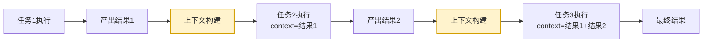

```python
class TaskContextManager:
    """任务上下文管理器"""
    
    @staticmethod
    def build_context(current_task: Task, 
                       completed_tasks: list[Task]) -> str:
        """构建任务上下文"""
        context_parts = []
        
        # 1. 显式指定的上下文任务
        for ctx_task in (current_task.context or []):
            if ctx_task.output:
                context_parts.append(
                    f"[{ctx_task.agent.role}的产出]\n{ctx_task.output.raw_output}\n"
                )
        
        # 2. 顺序模式: 自动包含前序所有任务结果
        for task in completed_tasks:
            if task.output:
                context_parts.append(
                    f"[{task.agent.role}已完成: {task.description[:50]}]\n"
                    f"{task.output.raw_output[:500]}...\n"
                )
        
        return "\n---\n".join(context_parts)
```

### 5.5 任务优先级与依赖

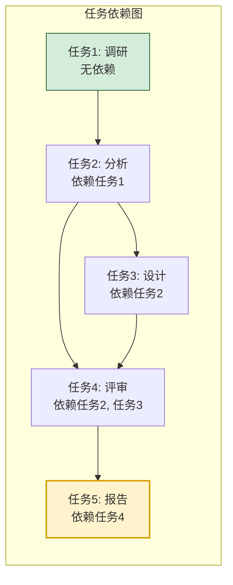

---

## 六、流程编排与执行引擎

### 6.1 流程引擎架构

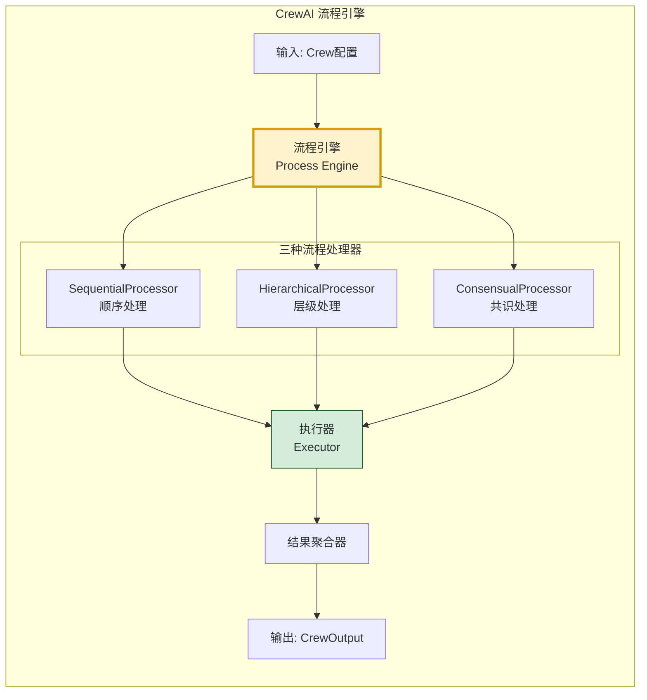

### 6.2 顺序流程执行

```python
class SequentialProcessor:
    """顺序流程处理器"""
    
    def __init__(self, crew: "Crew"):
        self.crew = crew
        self.completed_tasks: list[Task] = []
    
    def execute(self) -> "CrewOutput":
        """顺序执行所有任务"""
        results = []
        
        for task in self.crew.tasks:
            # 1. 构建上下文(包含所有已完成任务的结果)
            context = TaskContextManager.build_context(
                task, self.completed_tasks
            )
            
            # 2. 确定执行Agent
            agent = task.agent
            
            # 3. 执行任务
            output = self._execute_task(task, agent, context)
            task.output = output
            self.completed_tasks.append(task)
            
            # 4. 保存到文件(如果配置)
            if task.output_file:
                self._save_output(output, task.output_file)
            
            results.append(output)
        
        # 5. 返回最终结果(最后一个任务的输出)
        return CrewOutput(
            raw_output=results[-1].raw_output,
            tasks_output=results
        )
    
    def _execute_task(self, task: Task, agent: Agent, 
                      context: str) -> "TaskOutput":
        """执行单个任务"""
        # 构建Prompt
        prompt = self._build_prompt(task, agent, context)
        
        # 调用LLM
        llm_output = agent.llm.call(prompt)
        
        return TaskOutput(
            description=task.description,
            raw_output=llm_output,
            agent=agent.role,
            task=task.description
        )
    
    def _build_prompt(self, task: Task, agent: Agent, 
                      context: str) -> str:
        """构建LLM Prompt"""
        return f"""
        你是{agent.role}。
        你的目标是: {agent.goal}
        你的背景: {agent.backstory}
        
        任务: {task.description}
        预期产出: {task.expected_output}
        
        上下文信息:
        {context}
        
        请完成任务并按要求产出结果。
        """
```

### 6.3 层级流程执行

```python
class HierarchicalProcessor:
    """层级流程处理器"""
    
    def __init__(self, crew: "Crew"):
        self.crew = crew
        # 自动创建Manager Agent
        self.manager = self._create_manager()
    
    def _create_manager(self) -> Agent:
        """创建Manager Agent"""
        return Agent(
            role="项目经理",
            goal="协调团队成员完成任务,确保质量与效率",
            backstory="""你是一位经验丰富的项目经理,
            擅长任务分解、人员分配和进度管理。""",
            llm=self.crew.agents[0].llm,  # 复用LLM配置
            allow_delegation=True
        )
    
    def execute(self) -> "CrewOutput":
        """层级执行"""
        # 1. Manager分析任务并制定执行计划
        plan = self._create_execution_plan()
        
        # 2. 按计划分配任务给Worker
        results = []
        for task_assignment in plan:
            task = task_assignment["task"]
            agent = task_assignment["agent"]
            
            output = self._execute_task(task, agent)
            results.append(output)
            
            # 3. Manager审查结果
            review = self._manager_review(output)
            if not review["approved"]:
                # 不通过则重新执行
                output = self._execute_task(task, agent)
                results[-1] = output
        
        # 4. Manager汇总最终结果
        final_output = self._manager_summarize(results)
        return CrewOutput(
            raw_output=final_output,
            tasks_output=results
        )
```

### 6.4 执行结果结构

```python
from dataclasses import dataclass, field
from typing import Optional


@dataclass
class TaskOutput:
    """单个任务输出"""
    description: str          # 任务描述
    raw_output: str           # 原始LLM输出
    agent: str                # 执行Agent角色
    task: str                 # 任务名称
    output_file: Optional[str] = None  # 输出文件路径
    summary: str = ""         # 摘要


@dataclass
class CrewOutput:
    """Crew整体输出"""
    raw_output: str                          # 最终原始输出
    tasks_output: list[TaskOutput] = field(default_factory=list)  # 各任务输出
    token_usage: dict = field(default_factory=dict)  # Token使用统计
    
    @property
    def summary(self) -> str:
        """生成总结"""
        return f"Crew完成{len(self.tasks_output)}个任务,最终输出: {self.raw_output[:200]}..."
```

---

## 七、核心抽象与接口设计

### 7.1 Agent 抽象

```python
from dataclasses import dataclass, field
from typing import Optional, Callable


@dataclass
class Agent:
    """CrewAI Agent - 角色化的智能体"""
    
    # 身份信息(哲学一: 角色即身份)
    role: str                              # 角色名称(必填)
    goal: str                              # 角色目标(必填)
    backstory: str                        # 角色背景(必填)
    
    # 能力配置
    llm: Optional[str] = "gpt-4"          # 使用的LLM
    tools: list = field(default_factory=list)  # 可用工具
    verbose: bool = False                 # 是否详细输出
    
    # 协作配置
    allow_delegation: bool = False         # 是否允许委托
    max_iter: int = 25                    # 最大迭代次数
    
    # 记忆配置
    memory: bool = False                  # 是否启用记忆
    memory_config: Optional[dict] = None  # 记忆配置
    
    # 执行方法
    def execute_task(self, task: "Task", context: str = "") -> "TaskOutput":
        """执行任务"""
        # 1. 构建系统提示(基于角色)
        system_prompt = self._build_system_prompt()
        
        # 2. 构建任务提示
        task_prompt = self._build_task_prompt(task, context)
        
        # 3. 调用LLM
        output = self._call_llm(system_prompt, task_prompt)
        
        # 4. 如果有工具,执行工具调用
        if self.tools and self._needs_tool_call(output):
            output = self._execute_with_tools(task, output)
        
        return TaskOutput(
            description=task.description,
            raw_output=output,
            agent=self.role,
            task=task.description
        )
    
    def _build_system_prompt(self) -> str:
        """构建系统提示"""
        return f"""
        You are {self.role}.
        Your goal: {self.goal}
        Your background: {self.backstory}
        
        Stay in character and perform your role professionally.
        """
    
    def _build_task_prompt(self, task: "Task", context: str) -> str:
        """构建任务提示"""
        prompt = f"Task: {task.description}\nExpected: {task.expected_output}"
        if context:
            prompt += f"\n\nContext:\n{context}"
        return prompt
    
    def delegate(self, task: "Task", target_agent: "Agent"):
        """委托任务给其他Agent"""
        if not self.allow_delegation:
            raise PermissionError(f"{self.role} 不允许委托")
        return target_agent.execute_task(task)
```

### 7.2 Task 抽象

```python
@dataclass
class Task:
    """CrewAI Task - 契约化的任务"""
    
    # 任务契约(哲学二: 任务即契约)
    description: str                      # 任务描述(必填)
    expected_output: str                  # 预期产出(必填)
    
    # 关联信息
    agent: Optional[Agent] = None         # 负责Agent
    context: list["Task"] = field(default_factory=list)  # 上下文任务
    
    # 输出配置
    output_file: Optional[str] = None     # 输出文件
    output_json: bool = False             # 是否输出JSON
    
    # 工具配置
    tools: list = field(default_factory=list)  # 任务专属工具
    
    # 异步配置
    async_execution: bool = False         # 是否异步执行
    callback: Optional[Callable] = None   # 完成回调
    
    # 执行结果(运行时填充)
    output: Optional["TaskOutput"] = None
    
    def execute(self, context: str = "") -> "TaskOutput":
        """执行任务"""
        if not self.agent:
            raise ValueError("Task没有分配Agent")
        return self.agent.execute_task(self, context)
```

### 7.3 Crew 抽象

```python
from enum import Enum


class Process(Enum):
    """流程模式枚举(哲学三: 流程即治理)"""
    SEQUENTIAL = "sequential"       # 顺序流程
    HIERARCHICAL = "hierarchical"   # 层级流程
    CONSENSUAL = "consensual"       # 共识流程


@dataclass
class Crew:
    """CrewAI Crew - 角色化团队"""
    
    # 团队组成
    agents: list[Agent]                   # 团队成员
    tasks: list[Task]                     # 团队任务
    
    # 流程配置
    process: Process = Process.SEQUENTIAL  # 流程模式
    verbose: bool = False                  # 详细输出
    
    # 记忆配置
    memory: bool = False                   # 团队记忆
    manager_llm: Optional[str] = None      # Manager使用的LLM
    
    # 执行配置
    max_rpm: int = 100                    # 每分钟最大请求数
    language: str = "en"                   # 输出语言
    
    def kickoff(self, inputs: dict = None) -> CrewOutput:
        """启动团队执行"""
        # 1. 验证配置
        self._validate()
        
        # 2. 选择流程处理器
        processor = self._get_processor()
        
        # 3. 执行
        result = processor.execute()
        
        return result
    
    def _validate(self):
        """验证配置"""
        if not self.agents:
            raise ValueError("Crew至少需要一个Agent")
        if not self.tasks:
            raise ValueError("Crew至少需要一个Task")
        
        # 检查Task是否都分配了Agent(顺序模式)
        if self.process == Process.SEQUENTIAL:
            for task in self.tasks:
                if not task.agent:
                    raise ValueError(f"任务 '{task.description}' 未分配Agent")
    
    def _get_processor(self):
        """获取流程处理器"""
        if self.process == Process.SEQUENTIAL:
            return SequentialProcessor(self)
        elif self.process == Process.HIERARCHICAL:
            return HierarchicalProcessor(self)
        elif self.process == Process.CONSUAL:
            return ConsensualProcessor(self)
```

---

## 八、与其他框架的独特之处

### 8.1 独特性全景对比

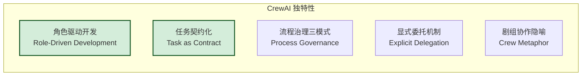

### 8.2 独特性详解

#### 8.2.1 角色驱动开发

```mermaid
flowchart LR
    subgraph 其他框架
        O1[Agent = system_message + tools]
        O2[角色隐含在Prompt中]
        O3[角色不可复用]
    end
    
    subgraph CrewAI
        C1[Agent = role + goal + backstory]
        C2[角色作为一等公民]
        C3[角色可跨任务复用]
        C4[角色可继承与特化]
    end

    style C1 fill:#d4edda,stroke:#155724
    style C2 fill:#d4edda,stroke:#155724
```

#### 8.2.2 任务契约化

| 维度 | 其他框架 | CrewAI |
|-----|---------|--------|
| **任务定义** | 输入字符串 | description + expected_output |
| **预期管理** | 无明确预期 | expected_output 明确 |
| **上下文** | 手动传递 | context 字段显式声明 |
| **结果验证** | 无 | 可对照 expected_output 验证 |
| **可追溯** | 弱 | output_file 持久化 |

#### 8.2.3 流程治理三模式

```mermaid
flowchart TB
    subgraph LangChain
        L[Chain 链式<br/>单一模式]
    end
    
    subgraph LangGraph
        G[Graph 图式<br/>需自行构建]
    end
    
    subgraph AutoGen
        A[Conversation 对话<br/>隐式协作]
    end
    
    subgraph CrewAI
        C1[Sequential 顺序]
        C2[Hierarchical 层级]
        C3[Consensual 共识]
    end

    style C1 fill:#d4edda,stroke:#155724
    style C2 fill:#d4edda,stroke:#155724
    style C3 fill:#d4edda,stroke:#155724
```

#### 8.2.4 显式委托机制

```python
# CrewAI 独有: Agent可显式委托
researcher = Agent(
    role="研究员",
    allow_delegation=True  # 允许委托
)

# 执行中遇到数据分析需求时
# researcher自动委托给analyst
# 这是一种"运行时"的动态协作能力
```

### 8.3 四大框架横向对比

| 维度 | LangChain | LangGraph | AutoGen | CrewAI |
|-----|-----------|-----------|---------|--------|
| **核心抽象** | Chain | Graph | Conversation | Crew + Task |
| **Agent模型** | 功能化 | 节点化 | 对话化 | 角色化 |
| **任务模型** | 输入输出 | 状态转换 | 消息流 | 契约化 |
| **流程模式** | 链式 | 图式 | 对话式 | 顺序/层级/共识 |
| **协作方式** | 串联 | 状态驱动 | 自由对话 | 显式委托 |
| **人在环路** | 需自建 | 需自建 | 原生支持 | 需自建 |
| **代码执行** | 需自建 | 需自建 | 内置 | 需自建 |
| **上手难度** | 中 | 高 | 低 | **最低** |
| **流程可控性** | 中 | 高 | 低 | 中 |
| **协作自然度** | 低 | 中 | 高 | 高 |
| **适用规模** | 中小 | 中大 | 中小 | 中小 |

### 8.4 设计哲学对比

```mermaid
mindmap
  root((框架设计哲学))
    LangChain
      工具主义
      链式组合
      生态优先
    LangGraph
      状态主义
      图论思维
      精确控制
    AutoGen
      对话主义
      自由协作
      涌现智能
    CrewAI
      角色主义
      团队协作
      流程治理
```

### 8.5 适用场景对比

| 场景 | 推荐框架 | 理由 |
|-----|---------|------|
| **工具密集型单Agent** | LangChain | 工具生态丰富 |
| **复杂状态流转** | LangGraph | 状态图精确控制 |
| **多Agent自由讨论** | AutoGen | 对话驱动自然 |
| **角色化团队协作** | CrewAI | 角色与任务契约 |
| **代码生成与执行** | AutoGen | 内置代码执行 |
| **流程明确的团队任务** | CrewAI | 顺序流程自然 |
| **需要管理决策的复杂任务** | CrewAI | 层级流程 |
| **多专家评审场景** | CrewAI | 共识流程 |
| **企业级生产部署** | LangGraph | 可控可观测 |
| **快速原型验证** | CrewAI | 上手最快 |

---

## 九、设计哲学的工程体现

### 9.1 哲学到工程的映射

```mermaid
flowchart LR
    subgraph 设计哲学
        P1[角色即身份]
        P2[任务即契约]
        P3[流程即治理]
        P4[协作即价值]
    end
    
    subgraph 工程实现
        E1[Agent类<br/>role/goal/backstory]
        E2[Task类<br/>description/expected_output]
        E3[Process枚举<br/>三种模式]
        E4[delegation机制<br/>allow_delegation]
    end
    
    P1 --> E1
    P2 --> E2
    P3 --> E3
    P4 --> E4

    style P1 fill:#d4edda,stroke:#155724
    style E1 fill:#d4edda,stroke:#155724
```

### 9.2 简洁性体现

```python
# CrewAI 的简洁性: 用最少的代码描述团队协作

# 1. 定义角色
researcher = Agent(role="研究员", goal="收集信息", backstory="...")
analyst = Agent(role="分析师", goal="分析数据", backstory="...")
writer = Agent(role="撰写者", goal="产出报告", backstory="...")

# 2. 定义任务契约
t1 = Task(description="调研市场", expected_output="市场数据", agent=researcher)
t2 = Task(description="分析趋势", expected_output="趋势报告", agent=analyst, context=[t1])
t3 = Task(description="撰写报告", expected_output="最终报告", agent=writer, context=[t2])

# 3. 组建团队并执行
crew = Crew(agents=[researcher, analyst, writer], 
             tasks=[t1, t2, t3], 
             process=Process.SEQUENTIAL)
result = crew.kickoff()

# 对比: 其他框架需要更多编排代码
```

### 9.3 可观测性设计

```python
# CrewAI 的 verbose 模式提供完整可观测性
crew = Crew(
    agents=[researcher, analyst, writer],
    tasks=[t1, t2, t3],
    process=Process.SEQUENTIAL,
    verbose=True  # 开启详细日志
)

# 输出:
# [INFO] Crew启动,3个Agent,3个任务
# [INFO] Agent '研究员' 执行任务 '调研市场'
# [INFO] 研究员产出: ...
# [INFO] Agent '分析师' 执行任务 '分析趋势', 上下文包含研究员的产出
# [INFO] 分析师产出: ...
# [INFO] Agent '撰写者' 执行任务 '撰写报告', 上下文包含分析师的产出
# [INFO] 撰写者产出: ...
# [INFO] Crew完成,Token消耗: 12000
```

### 9.4 可扩展性设计

```mermaid
flowchart TB
    subgraph 扩展点
        direction TB
        E1[自定义Agent<br/>继承Agent类]
        E2[自定义Task<br/>继承Task类]
        E3[自定义Process<br/>实现Processor接口]
        E4[自定义Tool<br/>继承BaseTool]
        E5[自定义Memory<br/>实现Memory接口]
    end

    style E1 fill:#d4edda,stroke:#155724
    style E3 fill:#fff3cd,stroke:#d39e00
```

---

## 十、总结与展望

### 10.1 设计哲学总结

```mermaid
mindmap
  root((CrewAI 设计哲学总结))
    核心理念
      让AI像人类团队一样协作
      角色明确,各司其职
      任务契约,产出可期
      流程治理,模式可选
    工程体现
      Agent 三件套 role/goal/backstory
      Task 契约 description/expected_output
      Process 三模式 顺序/层级/共识
      Delegation 显式委托
    独特价值
      上手门槛最低
      角色化最彻底
      任务契约最完整
      流程模式最丰富
```

### 10.2 设计哲学的工程价值

| 价值维度 | 哲学体现 | 工程价值 |
|---------|---------|---------|
| **开发效率** | 声明式配置 | 代码量减少 60%+ |
| **质量保证** | 任务契约化 | 产出可验证 |
| **协作自然** | 角色化设计 | 符合直觉 |
| **流程灵活** | 三种模式 | 适配多种场景 |
| **可维护性** | 角色可复用 | 降低维护成本 |
| **可观测性** | verbose模式 | 调试友好 |

### 10.3 核心要点回顾

1. **CrewAI 定位**:以角色驱动的多智能体协作编排框架。
2. **四大哲学**:角色即身份、任务即契约、流程即治理、协作即价值。
3. **核心抽象三件套**:Agent(角色)、Task(契约)、Crew(团队)。
4. **三种流程模式**:Sequential(顺序)、Hierarchical(层级)、Consensual(共识)。
5. **独特性**:角色化最彻底、任务契约最完整、流程模式最丰富。
6. **上手最快**:声明式配置,代码量最少。
7. **协作自然**:符合人类团队协作直觉。
8. **适用场景**:角色化团队协作、流程明确的团队任务。

### 10.4 给开发者的实践建议

1. **从角色定义开始**:先想清楚团队需要哪些角色,再定义任务。
2. **任务预期要明确**:`expected_output` 是质量保证的关键。
3. **流程模式要选对**:线性选顺序,复杂选层级,多角度选共识。
4. **善用 context 传递**:显式声明任务依赖,让协作更清晰。
5. **开启 verbose 调试**:开发阶段务必开启,便于定位问题。
6. **角色可复用**:同一角色可跨 Crew 使用,降低开发成本。
7. **控制 Agent 数量**:3-5 个角色为宜,过多导致成本与混乱。
8. **混合使用**:复杂场景可结合 LangGraph 编排 + CrewAI 协作。

### 10.5 与系列文档的关联

本文档作为 Agent Framework 系列的设计哲学篇,与其他文档形成完整闭环:

- **工具链框架**:[85LangChain框架核心组件详解.md](./85LangChain框架核心组件详解.md)、[86LangChain Agent运行机制深度解析.md](./86LangChain%20Agent运行机制深度解析.md)
- **状态图框架**:[87LangGraph框架诞生背景与核心定位深度解析.md](./87LangGraph框架诞生背景与核心定位深度解析.md)
- **框架对比**:[88LangChain与LangGraph核心区别系统性对比深度解析.md](./88LangChain与LangGraph核心区别系统性对比深度解析.md)
- **对话框架**:[89AutoGen框架架构深度解析.md](./89AutoGen框架架构深度解析.md)
- **本文档**:**CrewAI 设计哲学**,补充角色化协作视角

四大框架形成完整的 Agent Framework 知识体系:
- LangChain:**工具主义**(工具链编排)
- LangGraph:**状态主义**(状态图控制)
- AutoGen:**对话主义**(多Agent对话)
- CrewAI:**角色主义**(团队协作)

---

> **相关文档**
>
> - [85LangChain框架核心组件详解.md](./85LangChain框架核心组件详解.md)
> - [86LangChain Agent运行机制深度解析.md](./86LangChain%20Agent运行机制深度解析.md)
> - [87LangGraph框架诞生背景与核心定位深度解析.md](./87LangGraph框架诞生背景与核心定位深度解析.md)
> - [88LangChain与LangGraph核心区别系统性对比深度解析.md](./88LangChain与LangGraph核心区别系统性对比深度解析.md)
> - [89AutoGen框架架构深度解析.md](./89AutoGen框架架构深度解析.md)
